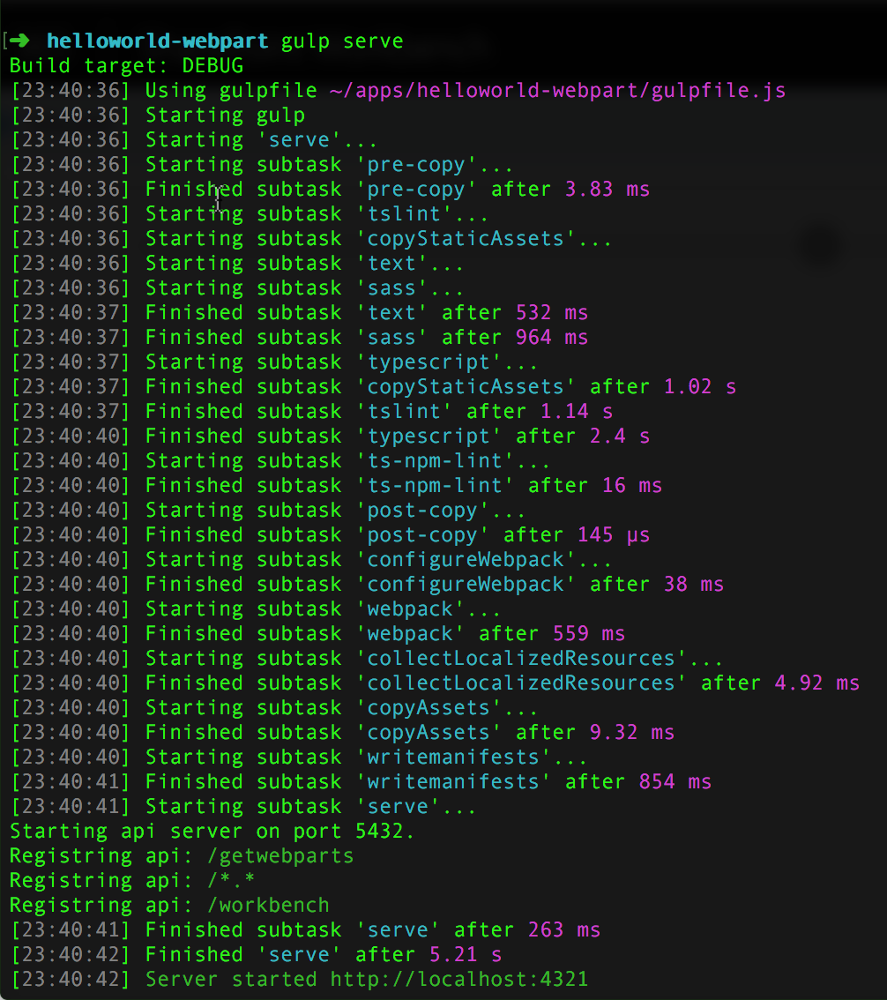

# <a name="sharepoint-framework-toolchain"></a><span data-ttu-id="aa833-101">SharePoint Framework-Toolkette</span><span class="sxs-lookup"><span data-stu-id="aa833-101">SharePoint Framework Toolchain</span></span>

## <a name="overview"></a><span data-ttu-id="aa833-102">Übersicht</span><span class="sxs-lookup"><span data-stu-id="aa833-102">Overview</span></span>
<span data-ttu-id="aa833-p101">Die SharePoint Framework-Toolkette ist eine Sammlung von Buildtools, Frameworkpaketen und anderen Elementen, mit denen Sie clientseitige Projekte erstellen und bereitstellen können. Die Toolkette unterstützt Sie bei der Erstellung clientseitiger Komponenten wie Webparts. Außerdem ermöglicht sie es Ihnen mit Tools wie der SharePoint Workbench, diese Komponenten in Ihrer lokalen Entwicklungsumgebung zu testen. Auch zum Packen und Bereitstellen auf SharePoint lässt sich die Toolkette nutzen. Darüber hinaus stellt sie verschiedene Buildbefehle für wichtige Buildtasks zur Verfügung, darunter unter anderem Befehle für die Codekompilierung und für das Packen clientseitiger Projekte in SharePoint-App-Pakete.</span><span class="sxs-lookup"><span data-stu-id="aa833-p101">The SharePoint Framework toolchain is the set of build tools, framework packages, and other items that manage building and deploying your client side projects. The toolchain helps you build client-side components like web parts. It also helps you test them in your local development environment with tools such as the SharePoint Workbench. And you can use the toolchain to package and deploy to SharePoint. The toolchain also provides you with a set of build commands that help you to complete key build tasks such as code compilation, packaging the client-side project into a SharePoint app package and more.</span></span> 

## <a name="npm"></a><span data-ttu-id="aa833-108">npm</span><span class="sxs-lookup"><span data-stu-id="aa833-108">npm</span></span>
<span data-ttu-id="aa833-p102">Bevor wir auf die verschiedenen Komponenten der Toolkette eingehen, ist es wichtig, dass Sie verstehen, wie das SharePoint Framework [npm](https://www.npmjs.com/) zur Verwaltung der verschiedenen Module innerhalb eines Projekts verwendet. npm ist einer der bevorzugten Open Source-Paket-Manager für clientseitige JavaScript-Entwicklung.</span><span class="sxs-lookup"><span data-stu-id="aa833-p102">Before diving into the various toolchain components, it’s important to understand how the SharePoint Framework uses [npm](https://www.npmjs.com/), to manage different modules in the project. npm is one of the preferred open source package managers for JavaScript client-side development.</span></span> 

<span data-ttu-id="aa833-p103">Ein typisches npm-Paket besteht aus einer oder mehreren wiederverwendbaren JavaScript-Codedateien (Modulen) sowie einer Liste von Abhängigkeitspaketen, von denen es abhängt. Wenn Sie ein solches Paket installieren, installiert npm auch diese Abhängigkeiten. Das offizielle [npm-Repository](https://www.npmjs.com/) enthält Hunderte Pakete, die Sie herunterladen und zur Erstellung von Anwendungen verwenden können. Sie können auch [eigene Pakete auf npm veröffentlichen](https://docs.npmjs.com/getting-started/what-is-npm) und damit anderen Entwicklern zur Verfügung stellen. Das SharePoint Framework verwendet verschiedene npm-Pakete in der Toolkette und veröffentlicht auch [eigene Pakete im npm-Repository](https://www.npmjs.com/search?q=%40microsoft%2Fsp-).</span><span class="sxs-lookup"><span data-stu-id="aa833-p103">A typically npm package consists of one or more reusable JavaScript code files called modules along with a list of dependency packages that it depends on. When you install the package, npm also installs those dependencies. The official [npm registry](https://www.npmjs.com/) consists of hundreds of packages that you can download to build your application. You can also [publish your own packages](https://docs.npmjs.com/getting-started/what-is-npm) to npm and share them with other developers. SharePoint Framework not only uses some of the npm packages in the toolchain but also publishes its [own packages to the npm registry](https://www.npmjs.com/search?q=%40microsoft%2Fsp-).</span></span> 

### <a name="sharepoint-framework-packages"></a><span data-ttu-id="aa833-116">SharePoint Framework-Pakete</span><span class="sxs-lookup"><span data-stu-id="aa833-116">SharePoint Framework packages</span></span>
<span data-ttu-id="aa833-117">Das SharePoint Framework besteht aus mehreren npm-Paketen, die ineinandergreifen und Entwickler bei der Erstellung clientseitiger Lösungen für SharePoint unterstützen.</span><span class="sxs-lookup"><span data-stu-id="aa833-117">SharePoint Framework consists of several npm packages that work together to help developers build client-side experiences in SharePoint.</span></span> 

<span data-ttu-id="aa833-118">Folgende Pakete sind im SharePoint Framework enthalten:</span><span class="sxs-lookup"><span data-stu-id="aa833-118">The following packages are in the SharePoint Framework:</span></span>

* <span data-ttu-id="aa833-p104">[@microsoft/generator-sharepoint](https://www.npmjs.com/package/@microsoft/generator-sharepoint): ein [Yeoman](http://yeoman.io/)-Plug-In zur Verwendung mit dem SharePoint Framework. Mit diesem Generator können Entwickler schnell neue Projekte für clientseitige Webparts mit sinnvollen Standardeinstellungen und Best Practices aufsetzen.</span><span class="sxs-lookup"><span data-stu-id="aa833-p104">[@microsoft/generator-sharepoint](https://www.npmjs.com/package/@microsoft/generator-sharepoint) - A [Yeoman](http://yeoman.io/) plug-in for use with the SharePoint Framework. Using this generator, developers can quickly set up a new client-side web part project with sensible defaults and best practices.</span></span>

* <span data-ttu-id="aa833-121">[@microsoft/sp-client-base](https://www.npmjs.com/package/@microsoft/sp-client-base): Definiert die Kernbibliotheken für clientseitige Anwendungen, die mit dem SharePoint Framework erstellt werden.</span><span class="sxs-lookup"><span data-stu-id="aa833-121">[@microsoft/sp-client-base](https://www.npmjs.com/package/@microsoft/sp-client-base) - Defines the core libraries for client-side applications built using the SharePoint Framework</span></span>

* <span data-ttu-id="aa833-122">[@microsoft/sp-webpart-workbench](https://www.npmjs.com/package/@microsoft/sp-webpart-workbench): Die SharePoint Workbench ist eine eigenständige Umgebung, in der clientseitige Webparts getestet und debuggt werden können.</span><span class="sxs-lookup"><span data-stu-id="aa833-122">[@microsoft/sp-webpart-workbench](https://www.npmjs.com/package/@microsoft/sp-webpart-workbench) - The SharePoint Workbench is a standalone environment for testing and debugging client-side web parts.</span></span>

* <span data-ttu-id="aa833-p105">[@microsoft/sp-module-loader](https://www.npmjs.com/package/@microsoft/sp-module-loader): ein Modulladeprogramm, das die Versionsverwaltung für clientseitige Komponenten, Webparts und andere Objekte übernimmt und diese lädt. Es stellt auch grundlegende Diagnosedienste bereit. Das Programm basiert auf bekannten Standards wie SystemJS und WebPack und ist die erste SharePoint Framework-Komponente, die auf einer Seite geladen wird.</span><span class="sxs-lookup"><span data-stu-id="aa833-p105">[@microsoft/sp-module-loader](https://www.npmjs.com/package/@microsoft/sp-module-loader) - A module loader that manages versioning and loading of client-side components, web parts, and other assets. It also provides basic diagnostic services. It is built on familiar standards such as SystemJS and WebPack, and is the first part of the SharePoint Framework to load on a page.</span></span>

* <span data-ttu-id="aa833-126">[@microsoft/sp-module-interfaces](https://www.npmjs.com/package/@microsoft/sp-module-interfaces): Definiert verschiedene Modulschnittstellen, die vom SharePoint Framework-Modulladeprogramm und dem SharePoint Framework-Buildsystem gemeinsam genutzt werden.</span><span class="sxs-lookup"><span data-stu-id="aa833-126">[@microsoft/sp-module-interfaces](https://www.npmjs.com/package/@microsoft/sp-module-interfaces) - Defines several module interfaces that are shared by the SharePoint Framework module loader and also the build system.</span></span>

* <span data-ttu-id="aa833-p106">[@microsoft/sp-lodash-subset](https://www.npmjs.com/package/@microsoft/sp-lodash-subset): Stellt ein benutzerdefiniertes [Lodash](https://lodash.com/)-Bundle bereit, das mit dem SharePoint Framework-Modulladeprogramm verwendet werden kann. Für bessere Leistung zur Laufzeit enthält es zudem einige der essenziellsten Lodash-Funktionen.</span><span class="sxs-lookup"><span data-stu-id="aa833-p106">[@microsoft/sp-lodash-subset](https://www.npmjs.com/package/@microsoft/sp-lodash-subset) - Provides a custom bundle of [lodash](https://lodash.com/) for use with the SharePoint Framework's module loader. To improve runtime performance, it only includes a subset of the most essential lodash functions.</span></span>

* <span data-ttu-id="aa833-129">[@microsoft/sp-tslint-rules](https://www.npmjs.com/package/@microsoft/sp-tslint-rules): Definiert benutzerdefinierte tslint-Regeln zur Verwendung in clientseitigen SharePoint-Projekten.</span><span class="sxs-lookup"><span data-stu-id="aa833-129">[@microsoft/sp-tslint-rules](https://www.npmjs.com/package/@microsoft/sp-tslint-rules) - Defines custom tslint rules for usage with SharePoint client-side projects.</span></span>

* <span data-ttu-id="aa833-130">[@microsoft/office-ui-fabric-react-bundle](https://www.npmjs.com/package/@microsoft/office-ui-fabric-react-bundle): Stellt ein benutzerdefiniertes [office-ui-fabric-react](https://www.npmjs.com/package/office-ui-fabric-react)-Bundle bereit, das für die Verwendung mit dem SharePoint Framework-Modulladeprogramm optimiert wurde.</span><span class="sxs-lookup"><span data-stu-id="aa833-130">[@microsoft/office-ui-fabric-react-bundle](https://www.npmjs.com/package/@microsoft/office-ui-fabric-react-bundle) - Provides a custom bundle of  [office-ui-fabric-react](https://www.npmjs.com/package/office-ui-fabric-react) that is optimized for use with the SharePoint Framework's module loader.</span></span>

### <a name="common-build-tools-packages"></a><span data-ttu-id="aa833-131">Gängige Buildtoolpakete</span><span class="sxs-lookup"><span data-stu-id="aa833-131">Common build tools packages</span></span>
<span data-ttu-id="aa833-132">Neben den oben beschriebenen SharePoint Framework-Paketen werden für Buildtasks wie die Kompilierung von TypeScript-Code in JavaScript und die Konvertierung von SCSS in CSS auch verschiedene weitere gängige Buildtools verwendet.</span><span class="sxs-lookup"><span data-stu-id="aa833-132">Along with the SharePoint Framework packages described previously, a common set of build tools are also used to perform build tasks such as compiling TypeScript code to JavaScript, and converting SCSS to CSS.</span></span>

<span data-ttu-id="aa833-133">Die folgenden Pakete gängiger Buildtools sind im SharePoint Framework enthalten:</span><span class="sxs-lookup"><span data-stu-id="aa833-133">The following list of common build tools packages are in the SharePoint Framework:</span></span>

* <span data-ttu-id="aa833-p107">[@microsoft/sp-build-core-tasks](https://www.npmjs.com/package/@microsoft/sp-build-core-tasks): eine Sammlung von Tasks für das SharePoint Framework-Buildsystem, basierend auf gulp. Das Paket `sp-build-core-tasks` implementiert SharePoint-spezifische Operationen wie das Packen von Lösungen und das Schreiben von Manifesten.</span><span class="sxs-lookup"><span data-stu-id="aa833-p107">[@microsoft/sp-build-core-tasks](https://www.npmjs.com/package/@microsoft/sp-build-core-tasks) - A collection of tasks for the SharePoint Framework build system, which is based on gulp. The `sp-build-core-tasks` package implements operations specific to SharePoint such as packaging solutions and writing manifests.</span></span>

* <span data-ttu-id="aa833-136">[@microsoft/sp-build-web](https://www.npmjs.com/package/@microsoft/sp-build-web): Importiert und konfiguriert verschiedene Buildtasks für Buildziele, die in einem Webbrowser ausgeführt werden (statt in einer Node.js-Umgebung). Dieses Paket muss direkt über eine gulp-Datei importiert werden, die das SharePoint Framework-Buildsystem verwendet.</span><span class="sxs-lookup"><span data-stu-id="aa833-136">[@microsoft/sp-build-web](https://www.npmjs.com/package/@microsoft/sp-build-web) - Imports and configures a set of build tasks that are appropriate for a build target that will run in a web browser (as opposed to a Node.js environment).This package is intended to be imported directly by a gulp file that uses the SharePoint Framework build system.</span></span> 

* <span data-ttu-id="aa833-p108">[@microsoft/gulp-core-build](https://www.npmjs.com/package/@microsoft/gulp-core-build): Die wichtigsten gulp-Buildtasks zur Erstellung von TypeScript-, HTML-, Less- und anderen Buildformaten. Dieses Paket hängt von mehreren anderen npm-Paketen ab, die folgende Tasks enthalten:</span><span class="sxs-lookup"><span data-stu-id="aa833-p108">[@microsoft/gulp-core-build](https://www.npmjs.com/package/@microsoft/gulp-core-build) - The core gulp build tasks for building TypeScript, HTML, less, and other build formats. This package depends on several other npm packages that contain the following tasks:</span></span>
    - [<span data-ttu-id="aa833-139">@microsoft/gulp-core-build-typescript</span><span class="sxs-lookup"><span data-stu-id="aa833-139">@microsoft/gulp-core-build-typescript</span></span>](https://www.npmjs.com/package/@microsoft/gulp-core-build-typescript)
    - [<span data-ttu-id="aa833-140">@microsoft/gulp-core-build-sass</span><span class="sxs-lookup"><span data-stu-id="aa833-140">@microsoft/gulp-core-build-sass</span></span>](https://www.npmjs.com/package/@microsoft/gulp-core-build-sass)
    - [<span data-ttu-id="aa833-141">@microsoft/gulp-core-build-webpack</span><span class="sxs-lookup"><span data-stu-id="aa833-141">@microsoft/gulp-core-build-webpack</span></span>](https://www.npmjs.com/package/@microsoft/gulp-core-build-webpack)
    - [<span data-ttu-id="aa833-142">@microsoft/gulp-core-build-serve</span><span class="sxs-lookup"><span data-stu-id="aa833-142">@microsoft/gulp-core-build-serve</span></span>](https://www.npmjs.com/package/@microsoft/gulp-core-build-serve)
    - [<span data-ttu-id="aa833-143">@microsoft/gulp-core-build-karma</span><span class="sxs-lookup"><span data-stu-id="aa833-143">@microsoft/gulp-core-build-karma</span></span>](https://www.npmjs.com/package/@microsoft/gulp-core-build-karma)
    - [<span data-ttu-id="aa833-144">@microsoft/gulp-core-build-mocha</span><span class="sxs-lookup"><span data-stu-id="aa833-144">@microsoft/gulp-core-build-mocha</span></span>](https://www.npmjs.com/package/@microsoft/gulp-core-build-mocha)

* <span data-ttu-id="aa833-p109">[@microsoft/loader-cased-file](https://www.npmjs.com/package/@microsoft/loader-cased-file): ein Wrapper für das webpack-Modul [file-loader](https://www.npmjs.com/package/file-loader), der zur Modifizierung der Schreibweise des ausgegebenen Dateinamens verwendet werden kann. Das ist in verschiedenen Szenarien nützlich, zum Beispiel bei der Verwendung eines CDNs (Content Delivery Network), das nur Dateinamen aus Kleinbuchstaben zulässt.</span><span class="sxs-lookup"><span data-stu-id="aa833-p109">[@microsoft/loader-cased-file](https://www.npmjs.com/package/@microsoft/loader-cased-file) - A wrapper for webpack's [file-loader](https://www.npmjs.com/package/file-loader) that can be used to modify the casing of the resulting filename. This is useful in some scenarios, such as when using a content delivery network (CDN) that only allows lowercase filenames.</span></span>

* <span data-ttu-id="aa833-p110">[@microsoft/loader-load-themed-styles](https://www.npmjs.com/package/@microsoft/loader-load-themed-styles): ein Ladeprogramm, das das Laden von CSS in ein Skript wie <code>require('load-themed-styles').loadStyles( /* css text */ )</code> einschließt. Es ist als Ersatz für „style-loader“ gedacht.</span><span class="sxs-lookup"><span data-stu-id="aa833-p110">[@microsoft/loader-load-themed-styles](https://www.npmjs.com/package/@microsoft/loader-load-themed-styles) - A loader that wraps the loading of CSS in script equivalent to <code>require('load-themed-styles').loadStyles( /* css text */ )</code>. It is designed to be a replacement for style-loader.</span></span>

* <span data-ttu-id="aa833-149">[@microsoft/loader-raw-script](https://www.npmjs.com/package/@microsoft/loader-raw-script): ein Ladeprogramm, das die Inhalte von Skriptdateien per `eval(…)` direkt in ein webpack-Bündel lädt</span><span class="sxs-lookup"><span data-stu-id="aa833-149">[@microsoft/loader-raw-script](https://www.npmjs.com/package/@microsoft/loader-raw-script) - A loader that loads a script file's contents directly in a webpack bundle using an `eval(…)`.</span></span>

* <span data-ttu-id="aa833-150">[@microsoft/loader-set-webpack-public-path](https://www.npmjs.com/package/@microsoft/loader-set-webpack-public-path): ein Ladeprogramm, das die Variable __webpack_public_path__ auf einen in den Argumenten spezifizierten Wert setzt, optional als Ergänzung zur SystemJs-Eigenschaft „baseURL“</span><span class="sxs-lookup"><span data-stu-id="aa833-150">[@microsoft/loader-set-webpack-public-path](https://www.npmjs.com/package/@microsoft/loader-set-webpack-public-path) -A loader that sets the __webpack_public_path__ variable to a value specified in the arguments, optionally appended to the SystemJs baseURL property.</span></span>

## <a name="scaffolding-a-new-client-side-project"></a><span data-ttu-id="aa833-151">Erstellen eines Gerüsts für ein neues clientseitiges Projekt</span><span class="sxs-lookup"><span data-stu-id="aa833-151">Scaffolding a new client-side project</span></span>
<span data-ttu-id="aa833-p111">Der SharePoint-Generator erstellt ein Gerüst für ein clientseitiges Webpart-Projekt. Zudem lädt der Generator die erforderlichen Toolkettenkomponenten für das jeweilige clientseitige Projekt herunter und konfiguriert sie.</span><span class="sxs-lookup"><span data-stu-id="aa833-p111">The SharePoint generator scaffolds a client-side project with a web part. The generator also downloads and configures the required toolchain components for the specified client-side project.</span></span>  

### <a name="packages-installation"></a><span data-ttu-id="aa833-154">Installieren von Paketen</span><span class="sxs-lookup"><span data-stu-id="aa833-154">Packages installation</span></span>
<span data-ttu-id="aa833-p112">Der Generator installiert die erforderlichen npm-Pakete lokal im Projektordner. Mit npm können Pakete entweder lokal im Projekt oder global installiert werden. Beide Varianten haben Vorteile, die [generelle Empfehlung](https://nodejs.org/en/blog/npm/npm-1-0-global-vs-local-installation/) ist jedoch, die npm-Pakete lokal zu installieren, wenn der Code von diesen Paketmodulen abhängt. Bei einem Webpart-Projekt hängt der Webpart-Code von den verschiedenen SharePoint-Buildpaketen und anderen gängigen Buildpaketen ab. Diese Pakete müssen daher lokal installiert werden.</span><span class="sxs-lookup"><span data-stu-id="aa833-p112">The generator installs required npm packages locally in the project folder. npm allows you to install a package either locally to your project, or globally. There are benefits to both, but the  [general guidance](https://nodejs.org/en/blog/npm/npm-1-0-global-vs-local-installation/) is to install the npm packages locally if your code depends on those package modules. In the case of a web part project, your web part code depends on the various SharePoint and common build packages, and thus requires those packages to be installed locally.</span></span> 

<span data-ttu-id="aa833-p113">Bei der lokalen Installation der Pakete installiert npm auch die Abhängigkeiten jedes Pakets. Die installierten Pakete finden Sie im Ordner `node_modules` im Projektordner. Dieser Ordner enthält die Pakete sowie alle ihre Abhängigkeiten. Im Idealfall sollte dieser Ordner mehrere Dutzend bis mehrere Hundert Ordner enthalten, da npm-Pakete immer in kleinere Module aufgeteilt werden und daher mehrere Dutzend bis mehrere Hundert Pakete installiert werden. Die wichtigsten SharePoint Framework-Pakete liegen im Ordner `node_modules\@microsoft`. `@microsoft` ist ein npm-Bereich, der [von Microsoft veröffentlichte Pakete](https://www.npmjs.com/~microsoft) abbildet.</span><span class="sxs-lookup"><span data-stu-id="aa833-p113">As the packages are installed locally, npm also installs the dependencies associated with each package. You can find the packages installed under the `node_modules` folder in your project folder. This folder contains the packages along with all of their dependencies. It is ideal that this folder contains dozens to hundreds of folders as npm packages are always broken down to smaller modules and thus resulting in dozens to hundreds of packages being installed. The key SharePoint Framework packages are located under the `node_modules\@microsoft` folder. The `@microsoft` is an npm scope that collectively represents [packages published by Microsoft](https://www.npmjs.com/~microsoft).</span></span>

<span data-ttu-id="aa833-p114">Immer, wenn ein neues Projekt mit dem Generator erstellt wird, installiert der Generator die SharePoint Framework-Pakete für das jeweilige Projekt samt ihrer Abhängigkeiten lokal. So macht npm es einfacher, Webpart-Projekte zu verwalten, ohne dass es Auswirkungen auf andere Projekte in der lokalen Entwicklungsumgebung gibt.</span><span class="sxs-lookup"><span data-stu-id="aa833-p114">Every time you create a new project using the generator, the generator installs the SharePoint Framework packages along with its dependencies for that specific project locally. In this way, npm makes it easier to manage your web part projects without affecting other projects that are in the local dev environment.</span></span> 

### <a name="packagejson"></a><span data-ttu-id="aa833-167">package.json</span><span class="sxs-lookup"><span data-stu-id="aa833-167">package.json</span></span>
<span data-ttu-id="aa833-p115">Die Datei `package.json` im clientseitigen Projekt enthält eine Liste der Abhängigkeiten des Projekts. Diese Liste definiert, welche Abhängigkeiten installiert werden müssen. Wie oben erwähnt kann jede Abhängigkeit wiederum weitere Abhängigkeiten enthalten. In npm können Sie über die Eigenschaften `dependencies` und `devDependencies` sowohl Laufzeit- als auch Buildabhängigkeiten definieren. Die Eigenschaft `devDependencies` kommt zum Einsatz, wenn das jeweilige Modul im Code verwendet werden soll. Das ist beispielsweise bei der Erstellung von Webparts der Fall.</span><span class="sxs-lookup"><span data-stu-id="aa833-p115">The `package.json` file in the client-side project specifies the list of dependencies the project depends on. The list defines what dependencies to install. As described earlier, each dependency could contain several more. npm allows you to define both runtime and build dependencies for your package using the `dependencies` and `devDependencies` properties. The `devDependencies` property is used when you want to use that module in your code as in the case of building web parts.</span></span>

<span data-ttu-id="aa833-173">Unten sehen Sie die Datei `package.json` für das [helloworld-Webpart](web-parts/get-started/build-a-hello-world-web-part):</span><span class="sxs-lookup"><span data-stu-id="aa833-173">Below is the `package.json` of the [helloworld-webpart](web-parts/get-started/build-a-hello-world-web-part):</span></span>

```json 
{
  "name": "helloword-webpart",
  "version": "0.0.1",
  "private": true,
  "engines": {
    "node": ">=0.10.0"
  },
  "dependencies": {
    "@microsoft/sp-client-base": "~1.0.0",
    "@microsoft/sp-core-library": "~1.0.0",
    "@microsoft/sp-webpart-base": "~1.0.0",
    "@types/webpack-env": ">=1.12.1 <1.14.0"
  },
  "devDependencies": {
    "@microsoft/sp-build-web": "~1.0.0",
    "@microsoft/sp-module-interfaces": "~1.0.0",
    "@microsoft/sp-webpart-workbench": "~1.0.0",
    "gulp": "~3.9.1",
    "@types/chai": ">=3.4.34 <3.6.0",
    "@types/mocha": ">=2.2.33 <2.6.0"
  },
  "scripts": {
    "build": "gulp bundle",
    "clean": "gulp clean",
    "test": "gulp test"
  }
}
```

<span data-ttu-id="aa833-p116">Zwar werden für ein Projekt sehr viele Pakete installiert; sie sind aber nur für die Erstellung des Webparts in der Entwicklungsumgebung erforderlich. Mithilfe dieser Pakete können Sie alle nötigen Module und Abhängigkeiten implementieren, um Ihr Webpart zu erstellen, es zu kompilieren, ein Bundling für es durchzuführen und es für die Bereitstellung zu packen. Die finale und minimierte Bundle-Version des Webparts, die Sie auf einem CDN-Server oder auf SharePoint bereitstellen, enthält keines dieser Pakete. Allerdings können Sie Ihr Webpart je nach den konkreten Anforderungen auch so konfigurieren, dass es bestimmte Module enthält. Weitere Informationen finden Sie unter [Add an external library to a web part](web-parts/basics/add-an-external-library).</span><span class="sxs-lookup"><span data-stu-id="aa833-p116">While there are lot of packages installed for the project, they are required only for building the web part in the dev environment. It is with the help of these packages, you are able to depend on the modules, and build, compile, bundle & package your web part for deployment. The final minified bundled version of the web part that you deploy to a CDN server or SharePoint does not include any of these packages. That said, you can also configure to include certain modules depending on your requirements. For more information, see [Add an external library to a web part](web-parts/basics/add-an-external-library).</span></span>

### <a name="working-with-source-control-systems"></a><span data-ttu-id="aa833-179">Arbeiten mit Quellcodeverwaltungssystemen</span><span class="sxs-lookup"><span data-stu-id="aa833-179">Working with source control systems</span></span>
<span data-ttu-id="aa833-p117">Je mehr Projektabhängigkeiten es gibt, desto mehr Pakete müssen installiert werden. Es empfiehlt sich nicht, den Ordner `node_modules` in das Quellcodeverwaltungssystem einzuchecken, da er alle Abhängigkeiten enthält. Sie sollten den Ordner `node_modules` in die Liste der Dateien aufnehmen, die beim Einchecken ignoriert werden.</span><span class="sxs-lookup"><span data-stu-id="aa833-p117">As project dependencies increase, the number of packages to install also increases. You don’t want to check in the `node_modules` folder, which contains all of the dependencies, into your source control system. You should exclude the `node_modules` from the list of files to ignore during check-ins.</span></span> 

<span data-ttu-id="aa833-p118">Wenn Sie `git` als Quellcodeverwaltungssystem verwenden: Webpart-Projekte mit Yeoman-Gerüst enthalten eine Datei `.gitignore`, die den Ordner `node_modules` und andere Elemente vom Einchecken ausschließt. Beim ersten Auschecken oder Klonen eines Webpart-Projekts aus dem Quellcodeverwaltungssystem müssen Sie den Befehl zur Initialisierung und lokalen Installation aller Projektabhängigkeiten ausführen:</span><span class="sxs-lookup"><span data-stu-id="aa833-p118">If you are using `git` as your source control system, the Yeoman scaffolded web part project includes a `.gitignore` file that excludes the `node_modules` folder among other things. When you check out, or clone, the web part project from your source control system the first time, run the command to initialize and install all the project dependencies locally:</span></span>

```
npm i
```

<span data-ttu-id="aa833-185">npm überprüft die Datei `package.json` und installiert alle erforderlichen Abhängigkeiten.</span><span class="sxs-lookup"><span data-stu-id="aa833-185">npm will scan the `package.json` file and install the required dependencies.</span></span> 

## <a name="build-tasks"></a><span data-ttu-id="aa833-186">Buildtasks</span><span class="sxs-lookup"><span data-stu-id="aa833-186">Build tasks</span></span>
<span data-ttu-id="aa833-187">Das SharePoint Framework verwendet [gulp](http://gulpjs.com/) zur Taskausführung. gulp bearbeitet Prozesse wie die folgenden:</span><span class="sxs-lookup"><span data-stu-id="aa833-187">SharePoint Framework uses [gulp](http://gulpjs.com/) as its task runner to handle processes like the following:</span></span>

* <span data-ttu-id="aa833-188">Bundling und Minimieren von JavaScript- und CSS-Dateien</span><span class="sxs-lookup"><span data-stu-id="aa833-188">Bundle and minify JavaScript and CSS files.</span></span>
* <span data-ttu-id="aa833-189">Ausführen von Tools zum Aufrufen der Bündelungs- und Minimierungstasks vor jedem Build</span><span class="sxs-lookup"><span data-stu-id="aa833-189">Run tools to call the bundling and minification tasks before each build.</span></span>
* <span data-ttu-id="aa833-190">Kompilieren von LESS- oder SASS-Dateien in CSS</span><span class="sxs-lookup"><span data-stu-id="aa833-190">Compile LESS or SASS files to CSS.</span></span>
* <span data-ttu-id="aa833-191">Kompilieren von TypeScript-Dateien in JavaScript</span><span class="sxs-lookup"><span data-stu-id="aa833-191">Compile TypeScript files to JavaScript.</span></span>

<span data-ttu-id="aa833-192">Die Toolkette besteht aus den folgenden gulp-Tasks, die im Paket [@microsoft/sp-build-core-tasks](https://www.npmjs.com/package/@microsoft/sp-build-core-tasks) definiert sind:</span><span class="sxs-lookup"><span data-stu-id="aa833-192">The toolchain consists of the following gulp tasks defined in the [@microsoft/sp-build-core-tasks](https://www.npmjs.com/package/@microsoft/sp-build-core-tasks) package:</span></span>

* <span data-ttu-id="aa833-193">build</span><span class="sxs-lookup"><span data-stu-id="aa833-193">build</span></span>
  * <span data-ttu-id="aa833-194">Erstellt das clientseitige Lösungsprojekt.</span><span class="sxs-lookup"><span data-stu-id="aa833-194">Builds the client-side solution project.</span></span>
* <span data-ttu-id="aa833-195">bundle</span><span class="sxs-lookup"><span data-stu-id="aa833-195">bundle</span></span>
  * <span data-ttu-id="aa833-196">Bündelt den Einstiegspunkt des clientseitigen Lösungsprojekts sowie alle seine Abhängigkeiten in einer einzigen JavaScript-Datei.</span><span class="sxs-lookup"><span data-stu-id="aa833-196">Bundles the client-side solution project entry point and all its dependencies into a single JavaScript file.</span></span>
* <span data-ttu-id="aa833-197">serve</span><span class="sxs-lookup"><span data-stu-id="aa833-197">serve</span></span>
  * <span data-ttu-id="aa833-198">Liefert das clientseitige Lösungsprojekt sowie andere Objekte vom lokalen Rechner aus.</span><span class="sxs-lookup"><span data-stu-id="aa833-198">Serves the client-side solution project and assets from the local machine.</span></span>
* <span data-ttu-id="aa833-199">clean</span><span class="sxs-lookup"><span data-stu-id="aa833-199">Clean</span></span>
  * <span data-ttu-id="aa833-200">Löscht die Buildartefakte des clientseitigen Lösungsprojekts aus dem vorherigen Build und den Buildzielverzeichnissen („lib“ und „dist“).</span><span class="sxs-lookup"><span data-stu-id="aa833-200">Cleans the client-side solution project's build artifacts from the previous build and from the build target directories (lib and dist)</span></span>
* <span data-ttu-id="aa833-201">test</span><span class="sxs-lookup"><span data-stu-id="aa833-201">test</span></span>
  * <span data-ttu-id="aa833-202">Führt Einheitentests für das clientseitige Lösungsprojekt durch (falls verfügbar).</span><span class="sxs-lookup"><span data-stu-id="aa833-202">Runs unit tests, if available, for the client-side solution project.</span></span> 
* <span data-ttu-id="aa833-203">package-solution</span><span class="sxs-lookup"><span data-stu-id="aa833-203">package-solution</span></span>
  * <span data-ttu-id="aa833-204">Packt die clientseitige Lösung in ein SharePoint-Paket.</span><span class="sxs-lookup"><span data-stu-id="aa833-204">Packages the client-side solution into a SharePoint package.</span></span>
* <span data-ttu-id="aa833-205">deploy-azure-storage</span><span class="sxs-lookup"><span data-stu-id="aa833-205">deploy-azure-storage</span></span>
  * <span data-ttu-id="aa833-206">Stellt die Objekte des clientseitigen Lösungsprojekts in Azure Storage bereit.</span><span class="sxs-lookup"><span data-stu-id="aa833-206">Deploys client-side solution project assets to Azure Storage.</span></span> 

<span data-ttu-id="aa833-p119">Zur Initiierung der Tasks hängen Sie den Tasknamen an den gulp-Befehl an. Wenn Sie zum Beispiel Ihr Webpart kompilieren und eine Vorschau in der SharePoint Workbench anzeigen wollen, führen Sie den folgenden Befehl aus:</span><span class="sxs-lookup"><span data-stu-id="aa833-p119">To initiate different tasks, append the task name with the gulp command. For example, to compile and then preview your web part in the SharePoint Workbench, run the following command:</span></span>

```
gulp serve
```

><span data-ttu-id="aa833-209">**Hinweis**: Es lassen sich nicht mehrere Tasks gleichzeitig ausführen.</span><span class="sxs-lookup"><span data-stu-id="aa833-209">**Note**: You cannot execute multiple tasks at the same time.</span></span>

<span data-ttu-id="aa833-210">`serve` führt die verschiedenen Tasks aus und startet im Anschluss SharePoint Workbench.</span><span class="sxs-lookup"><span data-stu-id="aa833-210">The `serve` runs the different tasks and finally launches SharePoint Workbench.</span></span>



### <a name="build-targets"></a><span data-ttu-id="aa833-212">Buildziele</span><span class="sxs-lookup"><span data-stu-id="aa833-212">Build targets</span></span>
<span data-ttu-id="aa833-213">Im Screenshot oben sehen Sie, dass der Task folgendes Buildziel setzt:</span><span class="sxs-lookup"><span data-stu-id="aa833-213">In the previous screenshot, you can see that the task indicates your build target as follows:</span></span>

```
Build target: DEBUG
```

<span data-ttu-id="aa833-p120">Wird kein Parameter angegeben, setzen die Befehle automatisch den BUILD-Modus als Ziel. Wenn Sie den Parameter `ship` angeben, setzen die Befehle den SHIP-Modus als Ziel.</span><span class="sxs-lookup"><span data-stu-id="aa833-p120">If no parameter is specified, the commands target the BUILD mode. If the `ship` parameter is specified, then the commands target the SHIP mode.</span></span>

<span data-ttu-id="aa833-p121">In der Regel setzen Sie SHIP als Ziel, wenn das Webpart-Projekt zur Auslieferung an oder Bereitstellung auf einem Produktionsserver bereit ist. Für andere Szenarien wie Tests und Debugging würden Sie BUILD als Ziel setzen. Das Ziel SHIP stellt auch sicher, dass die minimierte Version des Webpart-Bundles erstellt wird.</span><span class="sxs-lookup"><span data-stu-id="aa833-p121">Usually, when your web part project is ready to ship or deploy in a production server, you will target SHIP. For other scenarios like testing and debugging you would target BUILD. The SHIP target also ensures that the minified version of the web part bundle is built.</span></span> 

<span data-ttu-id="aa833-219">Um den SHIP-Modus als Ziel zu setzen, hängen Sie `--ship` an den Task an:</span><span class="sxs-lookup"><span data-stu-id="aa833-219">To target SHIP mode, you append the task with `--ship`:</span></span>

```
gulp --ship
```

<span data-ttu-id="aa833-220">Im DEBUG-Modus kopieren die Buildtasks alle Webpart-Objekte inklusive des Webpart-Bundles in den Ordner `dist`.</span><span class="sxs-lookup"><span data-stu-id="aa833-220">In DEBUG mode, the build tasks copy all of the web part assets, including the web part bundle, into the `dist` folder.</span></span>

<span data-ttu-id="aa833-221">Im SHIP-Modus kopieren die Buildtasks alle Webpart-Objekte inklusive des Webpart-Bundles in den Ordner `temp\deploy`.</span><span class="sxs-lookup"><span data-stu-id="aa833-221">In SHIP mode, the build tasks copy all of the web part assets, including the web part bundle, into the `temp\deploy` folder.</span></span>
