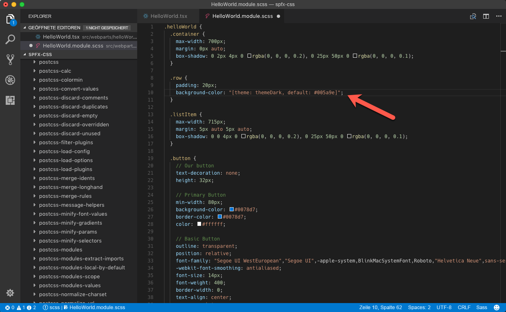

# <a name="use-theme-colors-in-your-sharepoint-framework-customizations"></a><span data-ttu-id="f3e5f-103">Verwenden von Designfarben in Ihren SharePoint Framework-Anpassungen</span><span class="sxs-lookup"><span data-stu-id="f3e5f-103">Use theme colors in your SharePoint Framework customizations</span></span>

<span data-ttu-id="f3e5f-104">Beim Erstellen von SharePoint Framework-Anpassungen sollten Sie Designfarben verwenden, damit Ihre Anpassungen wie ein Teil der Website aussehen.</span><span class="sxs-lookup"><span data-stu-id="f3e5f-104">When building SharePoint Framework customizations you should use theme colors, so that your customizations looks like a part of the site. This article explains how can you refer to the theme colors of the context site in your SharePoint Framework solution.</span></span> <span data-ttu-id="f3e5f-105">In diesem Artikel wird erläutert, wie Sie auf die Designfarben der Kontextwebsite in Ihrer SharePoint Framework-Lösung verweisen.</span><span class="sxs-lookup"><span data-stu-id="f3e5f-105">When building SharePoint Framework customizations you should use theme colors, so that your customizations looks like a part of the site. This article explains how can you refer to the theme colors of the context site in your SharePoint Framework solution.</span></span>

> [!NOTE] 
> <span data-ttu-id="f3e5f-106">In diesem Artikel wird zwar ein clientseitiges SharePoint-Framework-Webpart als Beispiel verwendet, die beschriebenen Techniken gelten jedoch für alle Typen von SharePoint-Framework-Anpassungen.</span><span class="sxs-lookup"><span data-stu-id="f3e5f-106">Although this article uses SharePoint Framework client-side web part as example, the described techniques apply to all types of SharePoint Framework customizations.</span></span>

## <a name="fixed-colors-vs-theme-colors"></a><span data-ttu-id="f3e5f-107">Feste Farben im Vergleich zu Designfarben</span><span class="sxs-lookup"><span data-stu-id="f3e5f-107">Fixed colors vs. theme colors</span></span>

<span data-ttu-id="f3e5f-108">Wenn Sie ein Gerüst für ein neues clientseitiges SharePoint Framework-Webpart erstellen, wird eine feste blaue Palette verwendet.</span><span class="sxs-lookup"><span data-stu-id="f3e5f-108">When you scaffold a new SharePoint Framework client-side web part, by default, it uses the fixed blue palette. Following steps describe the necessary adjustments to have the web part use theme colors instead.</span></span> <span data-ttu-id="f3e5f-109">Wenn Sie ein solches Webpart mithilfe eines anderen Farbschemas zu einer modernen Website hinzufügen, sticht dieses hervor und sieht nicht wie ein Teil der Website aus.</span><span class="sxs-lookup"><span data-stu-id="f3e5f-109">When you scaffold a new SharePoint Framework client-side web part, it uses a fixed blue palette. When you add such web part on a modern site, using a different color scheme, it stands out and doesn't look like a part of the site.</span></span>


<span data-ttu-id="f3e5f-111">Wenn Sie feste Farben verwenden, entscheiden Sie vorab, welche Farben für welche Elemente verwendet werden sollen.</span><span class="sxs-lookup"><span data-stu-id="f3e5f-111">When using fixed colors, you decide upfront which colors you want to use for which elements.</span></span> <span data-ttu-id="f3e5f-112">Dies kann zu einer Situation wie soeben beschrieben führen, bei der ein blaues Webpart auf einer roten Teamwebsite angezeigt wird und unnötig hervorsticht.</span><span class="sxs-lookup"><span data-stu-id="f3e5f-112">This can lead to a situation like the one just illustrated, where a blue web part is displayed on a red team site, standing out unnecessarily.</span></span> <span data-ttu-id="f3e5f-113">In den meisten Fällen sollten Sie sich bemühen, die Designfarben der Kontextwebsite zu verwenden, damit Ihre Lösung nicht hervorsticht, sondern wie ein Teil der Website aussieht.</span><span class="sxs-lookup"><span data-stu-id="f3e5f-113">When using fixed colors, you decide upfront which colors you want to use for which elements. This can lead to a situation like the one just illustrated, where a blue web part is displayed on a red team site, standing out unnecessarily. In most cases, you should strive to leverage the theme colors of the context site, so that your solution doesn't stand out but looks like a part of the site.</span></span>

<span data-ttu-id="f3e5f-114">In SharePoint Framework können Sie auf die Designfarben der Kontextwebsite verweisen anstatt feste Farben zu verwenden.</span><span class="sxs-lookup"><span data-stu-id="f3e5f-114">Instead of using fixed colors, SharePoint Framework allows you to refer to the theme colors of the context site.</span></span> <span data-ttu-id="f3e5f-115">Ihr Webpart wird folglich auf einer Website mit einem roten Design platziert, es verwendet ebenfalls die rote Palette und passt sich selbst automatisch an die blaue Palette an, wenn es auf einer Website platziert wird, die das blaue Design verwendet.</span><span class="sxs-lookup"><span data-stu-id="f3e5f-115">As a result, if your web part is placed on a site that uses a red theme, it uses the red palette as well, and if it's placed on a site that uses the blue theme, it automatically adjusts itself to use the blue palette.</span></span> <span data-ttu-id="f3e5f-116">All dies erfolgt automatisch ohne Änderungen am Code des Webparts.</span><span class="sxs-lookup"><span data-stu-id="f3e5f-116">All of this is done automatically without any changes to the web part code in between.</span></span>

## <a name="use-theme-colors-in-the-sharepoint-framework"></a><span data-ttu-id="f3e5f-117">Verwenden von Designfarben im SharePoint Framework</span><span class="sxs-lookup"><span data-stu-id="f3e5f-117">Using theme colors in the SharePoint Framework</span></span>

<span data-ttu-id="f3e5f-118">Wenn Sie mit festen Farben arbeiten, geben Sie diese in CSS-Eigenschaften an, z. B.:</span><span class="sxs-lookup"><span data-stu-id="f3e5f-118">When working with fixed colors, you specify them in CSS properties, for example:</span></span>

```css
.button {
    background-color: #0078d7;
}
```

<br/>

<span data-ttu-id="f3e5f-119">Um stattdessen eine Designfarbe zu verwenden, ersetzen Sie die feste Farbe durch ein Designtoken:</span><span class="sxs-lookup"><span data-stu-id="f3e5f-119">To use a theme color instead, replace the fixed color with a theme token:</span></span>

```css
.button {
    background-color: "[theme: themePrimary, default: #0078d7]";
}
```

<br/>

<span data-ttu-id="f3e5f-120">Wenn Ihre SharePoint Framework-Anpassung auf der Seite geladen wird, sucht das Paket **@microsoft/load-themed-styles**, das ein Teil von SharePoint Framework ist, nach Designtoken in CSS-Dateien und versucht, diese durch die entsprechende Farbe aus dem aktuellen Design zu ersetzen.</span><span class="sxs-lookup"><span data-stu-id="f3e5f-120">When your SharePoint Framework customization is loading on the page, the **@microsoft/load-themed-styles** package, which is a part of the SharePoint Framework, will look for theme tokens in CSS files and try to replace them with the corresponding color from the current theme. If the value for the specified token is not available, SharePoint Framework will use the value specified using the default parameter instead, which is why it's important that you always include it.</span></span> <span data-ttu-id="f3e5f-121">Wenn der Wert für das angegebene Token nicht verfügbar ist, verwendet SharePoint Framework stattdessen den Wert, der unter Verwendung des Parameters **Standard** angegeben wird – daher es wichtig ist, dass Sie diesen immer einschließen.</span><span class="sxs-lookup"><span data-stu-id="f3e5f-121">If the value for the specified token is not available, SharePoint Framework uses the value specified by using the **default** parameter instead, which is why it's important that you always include it.</span></span>

<span data-ttu-id="f3e5f-122">Die folgenden Designtoken stehen für Sie zur Verfügung:</span><span class="sxs-lookup"><span data-stu-id="f3e5f-122">Following theme tokens are available for you to use:</span></span>

<span data-ttu-id="f3e5f-123">Token</span><span class="sxs-lookup"><span data-stu-id="f3e5f-123">Token</span></span>|<span data-ttu-id="f3e5f-124">Standardwert auf einer modernen Teamwebsite, auf der die rote Palette verwendet wird</span><span class="sxs-lookup"><span data-stu-id="f3e5f-124">Default value on a modern team site using the red palette</span></span>|<span data-ttu-id="f3e5f-125">Bemerkungen</span><span class="sxs-lookup"><span data-stu-id="f3e5f-125">Remarks</span></span>
-----|--------------------------------|-----------
`backgroundImageUri`|`none`|
`themeAccent`|`#ee0410`|
`themeAccentTranslucent10`|`rgba(238, 4, 16, 0.10)`|
`themeDark`|`#b3030c`|<span data-ttu-id="f3e5f-126">Wird für Aktionssymbole in der Befehlsleiste und als Hoverfarbe verwendet.</span><span class="sxs-lookup"><span data-stu-id="f3e5f-126">Used for action icons in the command bar and as hover color</span></span>
`themeDarkAlt`|`#b3030c`|
`themeDarker`|`#770208`|
`themeLight`|`#fd969b`|
`themeLightAlt`|`#fd969b`|
`themeLighter`|`#fecacd`|
`themeLighterAlt`|`#fecacd`|
`themePrimary`|`#ee0410`|<span data-ttu-id="f3e5f-127">Primäre Designfarbe.</span><span class="sxs-lookup"><span data-stu-id="f3e5f-127">Primary theme color.</span></span> <span data-ttu-id="f3e5f-128">Wird für Symbole und Standardschaltflächen verwendet.</span><span class="sxs-lookup"><span data-stu-id="f3e5f-128">Primary theme color. Used for icons and default buttons</span></span>
`themeSecondary`|`#fc6169`|
`themeTertiary`|`#fd969b`|
`themeTertiaryAlt`|`#fd969b`|

> [!NOTE] 
> <span data-ttu-id="f3e5f-129">Es gibt weitere Token, die bei SharePoint Frameworks registriert sind.</span><span class="sxs-lookup"><span data-stu-id="f3e5f-129">There are more tokens registered with the SharePoint Framework.</span></span> <span data-ttu-id="f3e5f-130">Für alle Token sind zwar Werte auf klassischen Websites angegeben, nur die zuvor erwähnte Teilmenge weist jedoch Werte auf modernen SharePoint-Websites auf.</span><span class="sxs-lookup"><span data-stu-id="f3e5f-130">While all of them have values specified on classic sites, only the subset mentioned earlier has values on modern SharePoint sites.</span></span> <span data-ttu-id="f3e5f-131">Die vollständige Liste verfügbarer Token finden Sie unter dem Wert der `window.__themeState__.theme`-Eigenschaft mithilfe der Konsole in den Entwicklertools Ihres Webbrowsers.</span><span class="sxs-lookup"><span data-stu-id="f3e5f-131">For the complete list of available tokens, see the value of the `window.__themeState__.theme` property by using the console in your web browser's developer tools.</span></span>

## <a name="use-theme-colors-in-your-customizations"></a><span data-ttu-id="f3e5f-132">Verwenden von Designfarben in Ihren Anpassungen</span><span class="sxs-lookup"><span data-stu-id="f3e5f-132">Use theme colors in your customizations</span></span>

<span data-ttu-id="f3e5f-133">Wenn Sie ein Gerüst für ein neues clientseitiges SharePoint Framework-Webpart erstellen, wird standardmäßig die feste blaue Palette verwendet.</span><span class="sxs-lookup"><span data-stu-id="f3e5f-133">When you scaffold a new SharePoint Framework client-side web part, by default, it uses the fixed blue palette. Following steps describe the necessary adjustments to have the web part use theme colors instead.</span></span> <span data-ttu-id="f3e5f-134">Die folgenden Schritte beschreiben die Anpassungen, die erforderlich sind, damit das Webpart stattdessen Designfarben verwendet.</span><span class="sxs-lookup"><span data-stu-id="f3e5f-134">The following steps describe the necessary adjustments to have the web part use theme colors instead.</span></span>

> [!NOTE] 
> <span data-ttu-id="f3e5f-135">Die folgenden Schritte gelten für ein clientseitiges SharePoint Framework-Webpart mit dem Namen _HelloWorld_, das mithilfe von React erstellt wurde.</span><span class="sxs-lookup"><span data-stu-id="f3e5f-135">The following steps apply to a SharePoint Framework client-side web part named _HelloWorld_ built by using React.</span></span> <span data-ttu-id="f3e5f-136">Für Webparts, die mit anderen Bibliotheken und anderen Typen von Anpassungen erstellt werden, müssen Sie die Änderungen möglicherweise anpassen.</span><span class="sxs-lookup"><span data-stu-id="f3e5f-136">The following steps apply to a SharePoint Framework client-side web part named HelloWorld built using React. For web parts built using different libraries and other types of customizations, you might need to adjust the modifications accordingly.</span></span>

### <a name="to-use-theme-colors"></a><span data-ttu-id="f3e5f-137">So verwenden Sie Designfarben</span><span class="sxs-lookup"><span data-stu-id="f3e5f-137">To use theme colors</span></span>

1. <span data-ttu-id="f3e5f-138">Öffnen Sie im Code-Editor die Datei **./src/webparts/helloWorld/components/HelloWorld.tsx**, und entfernen Sie aus dem Div mit der Klasse **ms-Raster-Row** die Klasse **ms-BgColor-ThemeDark**.</span><span class="sxs-lookup"><span data-stu-id="f3e5f-138">In the code editor open the **./src/webparts/helloWorld/components/HelloWorld.tsx** file and from the div with class **ms-Grid-row** remove the **ms-bgColor-themeDark** class.</span></span>

    

2. <span data-ttu-id="f3e5f-140">Öffnen Sie in demselben Ordner die Datei **HelloWorld.module.scss**.</span><span class="sxs-lookup"><span data-stu-id="f3e5f-140">Next, in the same folder, open the **HelloWorld.module.scss** file. Change the  selector to:</span></span> <span data-ttu-id="f3e5f-141">Ändern Sie den `.row`-Selektor folgendermaßen:</span><span class="sxs-lookup"><span data-stu-id="f3e5f-141">Change the URL to `.row`.</span></span>

    ```css
    .row {
        padding: 20px;
        background-color: "[theme: themeDark, default: #005a9e]";
    }
    ```

    <br/>

    

3. <span data-ttu-id="f3e5f-143">Ändern Sie im `.button`-Selektor die Eigenschaften `background-color` und `border-color` folgendermaßen:</span><span class="sxs-lookup"><span data-stu-id="f3e5f-143">In the `.button` selector, change the `background-color` and `border-color` properties to:</span></span>

    ```css
    .button {
        /* ... */
        background-color: "[theme: themePrimary, default: #0078d7]";
        border-color: "[theme: themePrimary, default: #0078d7]";
        /* ... */
    }
    ```

    <br/>

    

4. <span data-ttu-id="f3e5f-145">Wenn Sie das Webpart zu einer Website hinzufügen, werden die vom Webpart verwendeten Farben automatisch an die von der aktuellen Website verwendeten Designfarben angepasst.</span><span class="sxs-lookup"><span data-stu-id="f3e5f-145">When you add the web part to a site, the colors used by the web part will automatically adapt to the theme colors used by the current site.</span></span>

    

## <a name="see-also"></a><span data-ttu-id="f3e5f-148">Weitere Artikel</span><span class="sxs-lookup"><span data-stu-id="f3e5f-148">See also</span></span>

- [<span data-ttu-id="f3e5f-149">Designs und Farben in SharePoint</span><span class="sxs-lookup"><span data-stu-id="f3e5f-149">SharePoint themes and colors</span></span>](../design/themes-colors.md)
- <span data-ttu-id="f3e5f-150">[How to use Theme Colors in SPFX Web Parts](https://n8d.at/blog/how-to-use-theme-colors-in-spfx-web-parts/) von Stefan Bauer (Office Development MVP)</span><span class="sxs-lookup"><span data-stu-id="f3e5f-150">[How to use Theme Colors in SPFX Web Parts](https://n8d.at/blog/how-to-use-theme-colors-in-spfx-web-parts/) by Stefan Bauer (Office Development MVP)</span></span>
