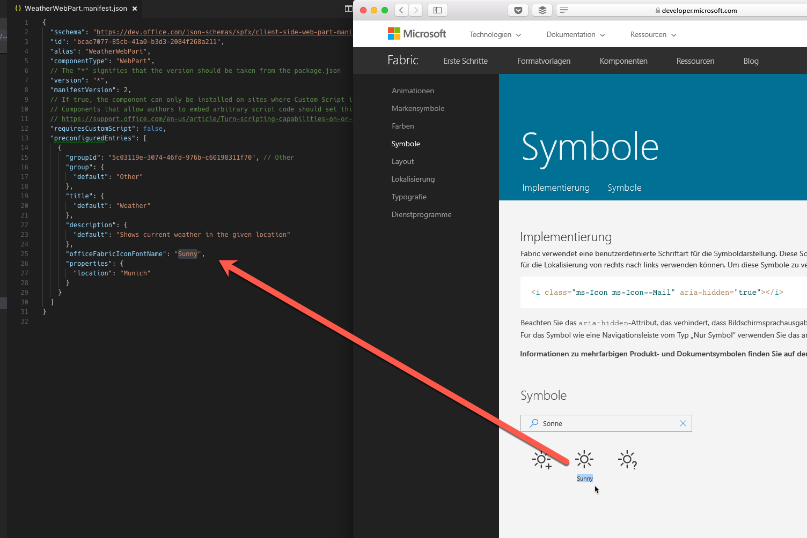
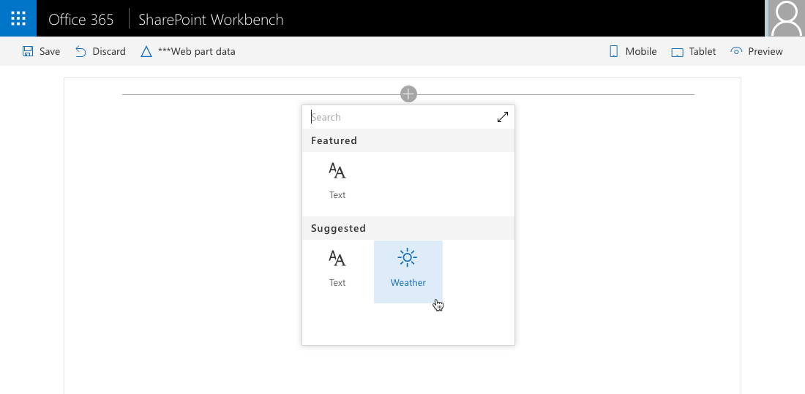

# <a name="configure-web-part-icon"></a>Konfigurieren des Webpartsymbols

Die Verwendung eines Symbols, das den Zweck Ihres clientseitigen SharePoint-Webparts darstellt, erleichtert Benutzern die Suche nach Ihrem Webpart unter allen in der Toolbox verfügbaren Webparts. 

## <a name="preconfigure-web-parts"></a>Vorkonfigurieren von Webparts

Ein Webpartsymbol wird in dem Webpartmanifest im Rahmen der vorkonfigurierten Einträge definiert. Wenn Sie über ein Mehrfunktionswebpart verfügen, dass für verschiedene Anforderungen konfiguriert werden kann, kann jede Konfiguration ein anderes Symbol aufweisen, das den Zweck angibt. 

Ein repräsentatives Symbol erleichtert Benutzern die Suche nach dem gewünschten Webpart. Weitere Informationen zum Vorkonfigurieren von Webparts finden Sie unter [Vereinfachen des Hinzufügens von Webparts mit vorkonfigurierten Einträgen](../guidance/simplify-adding-web-parts-with-preconfigured-entries.md).

SharePoint-Framework bietet eine Reihe von Möglichkeiten zum Definieren des Symbols für das Webpart.

## <a name="use-office-ui-fabric-icon-font"></a>Verwenden von Office UI Fabric-Symbolschriftarten

Eine Möglichkeit, das Symbol für das Webpart zu definieren, ist die **officeFabricIconFontName**-Eigenschaft. Mit dieser Eigenschaft können Sie eines der im Rahmen von Office UI Fabric verfügbaren Symbole auswählen.

Eine Liste der verfügbaren Office UI Fabric-Symbole finden Sie unter [Symbole](https://developer.microsoft.com/de-DE/fabric#/styles/icons).

### <a name="to-use-a-specific-icon"></a>So verwenden Sie ein bestimmtes Symbol

1. Kopieren Sie auf der Übersichtsseite mit Office UI Fabric-Symbolen seinen Namen, und fügen Sie diesen als Wert in die **officeFabricIconFontName**-Eigenschaft im Manifest des Webparts ein.

  

  ```json
  {
    "$schema": "https://dev.office.com/json-schemas/spfx/client-side-web-part-manifest.schema.json",
    "id": "bcae7077-85cb-41a0-b3d3-2084f268a211",
    "alias": "WeatherWebPart",
    "componentType": "WebPart",
    // The "*" signifies that the version should be taken from the package.json
    "version": "*",
    "manifestVersion": 2,
    // If true, the component can only be installed on sites where Custom Script is allowed.
    // Components that allow authors to embed arbitrary script code should set this to true.
    // https://support.office.com/en-us/article/Turn-scripting-capabilities-on-or-off-1f2c515f-5d7e-448a-9fd7-835da935584f
    "requiresCustomScript": false,
    "preconfiguredEntries": [
      {
        "groupId": "5c03119e-3074-46fd-976b-c60198311f70", // Other
        "group": {
          "default": "Other"
        },
        "title": {
          "default": "Weather"
        },
        "description": {
          "default": "Shows current weather in the given location"
        },
        "officeFabricIconFontName": "Sunny",
        "properties": {
          "location": "Munich"
        }
      }
    ]
  }
  ```

2. Beim Hinzufügen des Webparts zur Seite wird das ausgewählte Symbol in der Toolbox angezeigt.

  

Der große Vorteil dieses Ansatzes ist, dass Sie keine Symbolbilddatei mit den Webpartressourcen bereitstellen müssen. Darüber hinaus wird das Symbol auf Computern mit anderen DPI- und Barrierefreiheitseinstellungen ohne Qualitätsverlust automatisch angepasst.

## <a name="use-an-external-icon-image"></a>Verwenden eines externen Symbolbilds

Obwohl Office UI Fabric zahlreiche Bilder bietet, möchten Sie möglicherweise beim Erstellen von Webparts ein für Ihre Organisation spezifisches Symbol verwenden, um Ihre Webparts deutlich von anderen, in der Toolbox verfügbaren Webparts von Erst- und Drittanbietern abzugrenzen.

Neben Office UI Fabric-Symbolen können im SharePoint-Framework auch Bilder verwendet werden. 

### <a name="to-use-an-image-as-a-web-part-icon"></a>So verwenden Sie ein Bild als Webpartsymbol

1. Geben Sie die absolute URL des Bilds in der **iconImageUrl**-Eigenschaft im Manifest des Webparts an.

  ```json
  {
    "$schema": "https://dev.office.com/json-schemas/spfx/client-side-web-part-manifest.schema.json",
    "id": "bcae7077-85cb-41a0-b3d3-2084f268a211",
    "alias": "WeatherWebPart",
    "componentType": "WebPart",
    // The "*" signifies that the version should be taken from the package.json
    "version": "*",
    "manifestVersion": 2,
    // If true, the component can only be installed on sites where Custom Script is allowed.
    // Components that allow authors to embed arbitrary script code should set this to true.
    // https://support.office.com/en-us/article/Turn-scripting-capabilities-on-or-off-1f2c515f-5d7e-448a-9fd7-835da935584f
    "requiresCustomScript": false,
    "preconfiguredEntries": [
      {
        "groupId": "5c03119e-3074-46fd-976b-c60198311f70", // Other
        "group": {
          "default": "Other"
        },
        "title": {
          "default": "Weather"
        },
        "description": {
          "default": "Shows current weather in the given location"
        },
        "iconImageUrl": "https://assets.contoso.com/weather.png",
        "properties": {
          "location": "Munich"
        }
      }
    ]
  }
  ```

2. Das in der Toolbox angezeigte Webpartsymbolbild verfügt über eine Größe von 40x28 Pixel. Wenn das Bild größer ist, wird seine Größe proportional entsprechend dieser Größe angepasst.

  

Während Sie mit benutzerdefinierten Bildern von mehr Flexibilität bei der Wahl eines Symbols für Ihr Webpart profitieren, müssen Sie diese zusammen mit anderen Webpartressourcen bereitzustellen. Darüber hinaus kann es zum Qualitätsverlust kommen, wenn das Bild mit höheren DPI-Werten oder bestimmten Barrierefreiheitseinstellungen angezeigt wird. Um Qualitätsverlust zu vermeiden, können Sie Vektor-basierte SVG-Bilder verwenden, die auch von SharePoint-Framework unterstützt werden.

## <a name="use-a-base64-encoded-image"></a>Verwenden eines base64-codierten Bilds

Wenn Sie ein benutzerdefiniertes Bild verwenden, statt eine absolute URL zu der mit anderen Webpartressourcen gehosteten Bilddatei anzugeben, können Sie ein base64-codiertes Bild und die base64-Zeichenfolge anstelle der URL verwenden.

Online steht eine Reihe von Diensten zur Verfügung, die Sie zum Codieren Ihres Bilds mit base64 verwenden können. Weitere Informationen finden Sie unter [Konvertieren Ihrer Bilder mit Base64](https://www.base64-image.de).

### <a name="to-use-a-base64-encoded-image"></a>So verwenden Sie ein base64-codiertes Bild

1. Codieren Sie das Bild.

2. Kopieren Sie die base64-Zeichenfolge, und verwenden Sie sie als Wert für die **iconImageUrl**-Eigenschaft im Manifest des Webparts.

  ```json
  {
    "$schema": "https://dev.office.com/json-schemas/spfx/client-side-web-part-manifest.schema.json",
    "id": "bcae7077-85cb-41a0-b3d3-2084f268a211",
    "alias": "WeatherWebPart",
    "componentType": "WebPart",
    // The "*" signifies that the version should be taken from the package.json
    "version": "*",
    "manifestVersion": 2,
    // If true, the component can only be installed on sites where Custom Script is allowed.
    // Components that allow authors to embed arbitrary script code should set this to true.
    // https://support.office.com/en-us/article/Turn-scripting-capabilities-on-or-off-1f2c515f-5d7e-448a-9fd7-835da935584f
    "requiresCustomScript": false,
    "preconfiguredEntries": [
      {
        "groupId": "5c03119e-3074-46fd-976b-c60198311f70", // Other
        "group": {
          "default": "Other"
        },
        "title": {
          "default": "Weather"
        },
        "description": {
          "default": "Shows current weather in the given location"
        },
        "iconImageUrl": "data:image/svg+xml;base64,PD94bWwgdmVyc2lvbj0iMS4wIiBlbmNvZGluZz0iVVRGLTgiPz4KPHN2ZyB3aWR0aD0iMTAyMiIgaGVpZ2h0PSI5NzgiIHhtbG5zPSJodHRwOi8vd3d3LnczLm9yZy8yMDAwL3N2ZyIgeG1sbnM6c3ZnPSJodHRwOi8vd3d3LnczLm9yZy8yMDAwL3N2ZyI+CiA8Zz4KICA8dGl0bGU+TGF5ZXIgMTwvdGl...",
        "properties": {
          "location": "Munich"
        }
      }
    ]
  }
  ```

<br/>

Base64-Codierung kann sowohl für Bitmapbilder, zum Beispiel PNG, sowie für Vektor-basierte SVG-Bilder verwendet werden. Der große Vorteil der base64-Codierung von Bildern ist, dass Sie das Webpartsymbolbild nicht separat bereitstellen müssen.


## <a name="additional-considerations"></a>Zusätzliche Überlegungen

Jedes Webpart muss über ein Symbol verfügen. Wenn Sie das Webpartsymbol mit beiden **officeFabricIconFontName**- und den **iconImageUrl**-Eigenschaften angeben, wird das in der **officeFabricIconFontName**-Eigenschaft angegebene Symbol verwendet. 

Wenn Sie kein Office UI Fabric-Symbol verwenden möchten, müssen Sie eine URL in der **iconImageUrl**-Eigenschaft angeben.