# Entwurfsüberlegungen für clientseitige SharePoint-Webparts

Um mit der Entwicklung von Webparts zu beginnen, sollten Sie sich mit [Office UI Fabric](http://dev.office.com/fabric) vertraut machen. Alle Formatvorlagen aus [Fabric Core](https://github.com/OfficeDev/office-ui-fabric-core) – einschließlich Symbolen, Typografie, Farben, Animationen und des dynamischen Rasters – werden standardmäßig geladen und stehen dem Webpart zur Verfügung. Importieren Sie keine Kopie der Fabric für Ihr Webpart, das dies einen Konflikt mit der globalen Kopie verursachen könnte. Diese Klassen bieten eine Grundlage für die Darstellung Ihres Webparts, die Sie jederzeit ändern können, wenn für die Marke Ihres Unternehmens andere Ausführungen erforderlich sind.

## React-Komponenten der Office UI Fabric

Neben der Office UI Fabric können Sie React-Komponenten der Office UI Fabric verwenden, um Webparts zu erstellen. Bei Fabric React handelt es sich um eine dynamische Sammlung von Mobilitätskomponenten, die Ihnen das Erstellen von Weboberflächen mithilfe der Office-Entwurfssprache erleichtern.

Im folgenden Aufgabenlistenbeispiel werden Fabric-Komponenten im Eigenschaftenbereich verwendet, mit dem der Seitenautor ein Webpart konfigurieren kann.

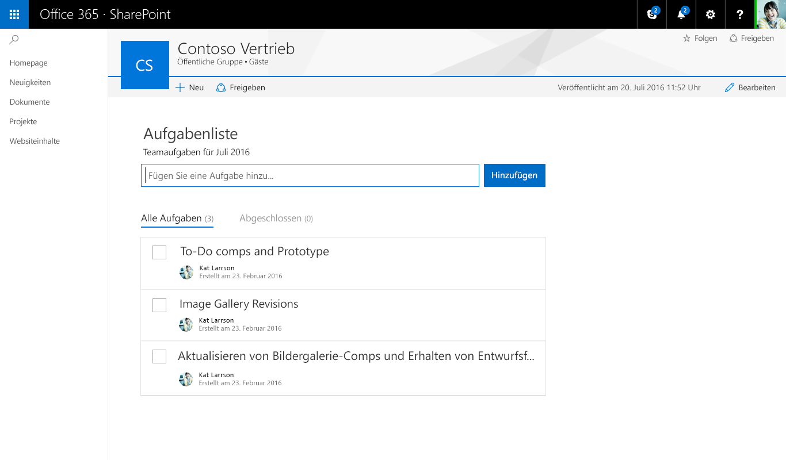

Eine vollständige Liste der Office UI Fabric-Stile, -Typografie, -Farben, -Symbole und Animationen finden Sie unter [Office UI Fabric-Formatvorlagen](http://dev.office.com/fabric/styles).

## Dynamisches Verhalten

Seiten in der neuen SharePoint-Erstellungsumgebung verwenden das dynamische Raster von Office UI Fabric, um sicherzustellen, dass jede Seite ansprechend aussieht. 

### Maximale Breite

Es wird empfohlen, dass alle Webparts eine maximale Breite von 100 %, verwenden um sicherzustellen, dass sie auf jeder Seite dynamisch umbrechen und ordnungsgemäß funktionieren. Die Seiten- und Spaltenbreite wird von der Seitenvorlage definiert, kann aber vom Autor geändert werden. Wenn im Webpart ein maximaler Pixelwert festgelegt wird, könnte es unerwartete Ergebnisse sowohl im Hinblick auf die Funktionalität als auch auf das Layout geben, wenn die Seite mit unterschiedlichen Breiten angezeigt wird.

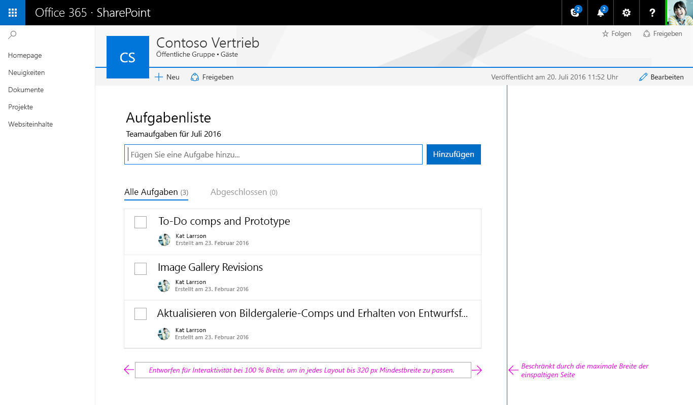

### Minimale Breite

Alle Webparts sollten so gestaltet werden, dass sie dynamisch umbrechen, wenn die Seiten-/Spaltenbreite bis zu einer minimalen Breite von 320 px abnimmt.

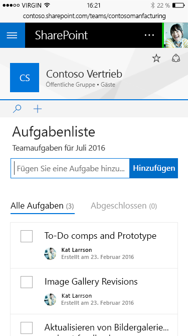

## Webparts im Modus „Veröffentlicht“ und Webparts im Bearbeitungsmodus - Vergleich

Die neue SharePoint-Erstellungsumgebung weist zwei Modi auf:

* **Modus „Veröffentlicht“** In diesem Modus kann Ihr Team oder Ihre Zielgruppe den Inhalt anzeigen und mit Webparts interagieren.
* **Bearbeitungsmodus** In diesem Modus können Seitenautoren Webparts hinzufügen und konfigurieren, um einer Seite Inhalte hinzuzufügen.

### Bearbeitungsmodus

#### Hinweis zum Hinzufügen und Toolbox

Der Hinweis zum Hinzufügen besteht aus einer horizontalen Linie mit einem Pluszeichen, die angezeigt wird, wenn ein Webpart ausgewählt wird, und wenn darauf gezeigt wird, um anzugeben, wo Seitenautoren neue Webparts zu ihrer Seite hinzufügen können. Die Toolbox wird geöffnet, wenn ein Benutzer auf das Pluszeichen tippt/klickt. Die Toolbox enthält alle Webparts, die einer Seite hinzugefügt werden können.

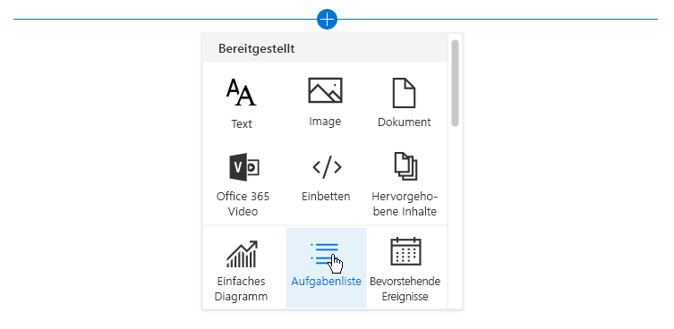

#### Symbolleiste

Eine vertikale Symbolleiste und das umgebende Feld sind Teil des Frameworks für jedes Webpart und werden von der Seite bereitgestellt. Jedes Webpart weist in der Symbolleiste eine Bearbeitungs- und Löschaktion auf.

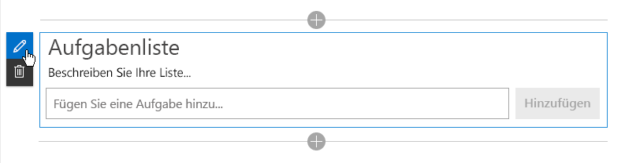

#### Kontextbezogene Bearbeitungen

Für Webparts sollte eine WYSIWYG-Oberfläche entwickelt werden, damit Informationen eingetragen oder Inhalte hinzugefügt werden können, die dem Benutzer bei der Veröffentlichung angezeigt werden. Die Eingabe dieses Inhalts sollte auf der Seite erfolgen, damit der Benutzer versteht, wie der Inhalt für den Betrachter angezeigt wird. Titel und Beschreibungen sollten beispielsweise dort ausgefüllt werden, wo der Text angezeigt wird, oder neue Aufgaben sollten im Kontext der Seite hinzugefügt und geändert werden.

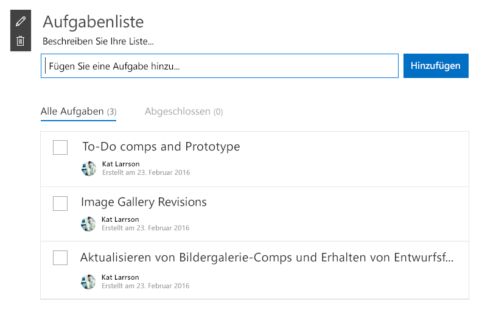

#### Bearbeitungen auf Elementebene

Die Benutzeroberfläche kann sich innerhalb des Webparts ändern. Text wird zum Beispiel in ein Textfeld umgewandelt, damit Links eingetragen werden können, oder beim Anzeigen von UI zur Neuanordnung von Elementen oder zum Überprüfen von Aufgaben in einem Webpart.

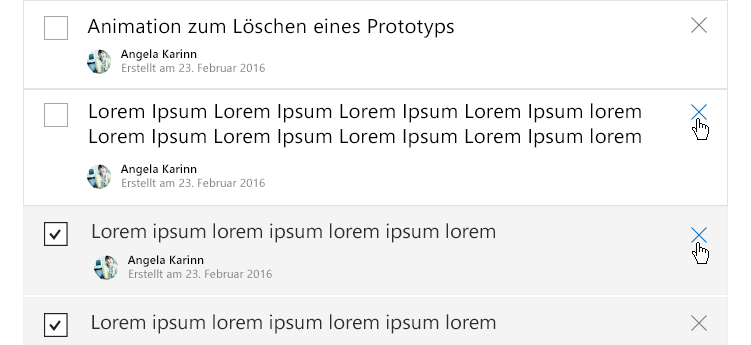

## Eigenschaftenbereiche

Eigenschaftenbereiche werden über das Aktionssymbol zum Bearbeiten auf der Symbolleiste aufgerufen. Bereiche sollten in erster Linie Konfigurationseinstellungen enthalten, die Features aktivieren/deaktivieren, die entweder auf der Seite angezeigt werden oder die einen Aufruf eines Diensts vornehmen, um Inhalte anzuzeigen.

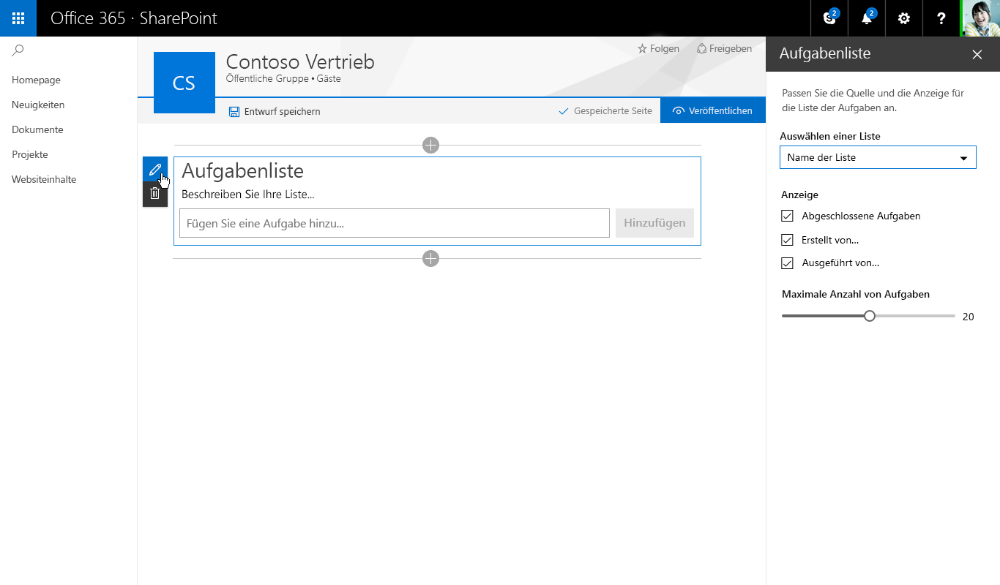

Es gibt drei Arten von Eigenschaftenbereichen, mit denen Sie Webparts entwerfen und entwickeln können, die den Anforderungen Ihres Unternehmens oder Ihrer Kunden entsprechen.

### Einzelner Bereich

Ein einzelner Bereich wird für einfache Webparts verwendet, bei denen nur eine kleine Anzahl von Eigenschaften konfiguriert werden kann.

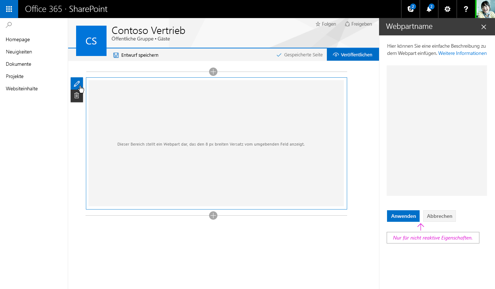

### Accordion-Bereich

Ein Accordion-Bereich wird für eine Gruppe bzw. Gruppen von Eigenschaften mit vielen Optionen verwendet und dann, wenn die Gruppen zu einer langen Bildlaufleiste mit Optionen führen würden. Angenommen, Sie haben drei Gruppen mit dem Namen „Eigenschaften“, „Darstellung“ und „Layout“, von denen jede über zehn Komponenten verfügt.

#### Accordion - Eine geöffnete Gruppe

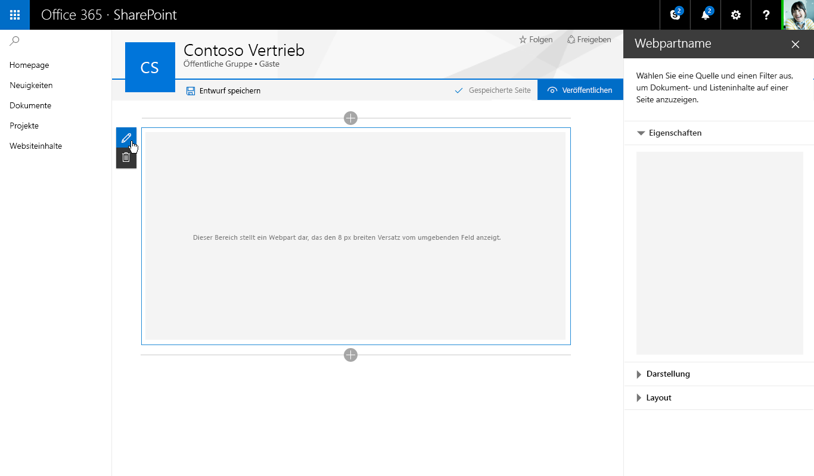

#### Accordion - Zwei geöffnete Gruppen mit Bildlauf

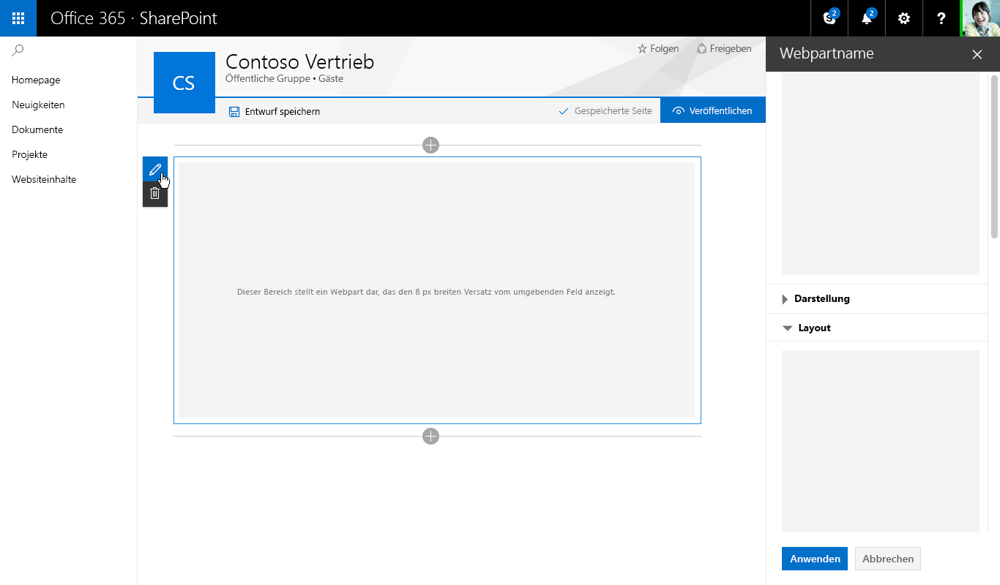

### Schritte/Seiten von Eigenschaftenbereichen

Der Bereich „Schritte“ wird zum Gruppieren von Eigenschaften in mehreren Schritten oder Seiten verwendet, wenn das Webpart in einer linearen Reihenfolge konfiguriert werden muss oder wenn die beim ersten Schritt getroffene Auswahl Auswirkungen auf Optionen hat, die im zweiten Schritt angezeigt werden.

**Schritt 1 von 3**
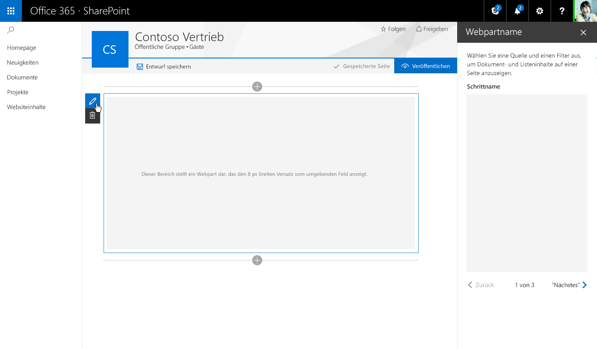

**Schritt 2 von 3**
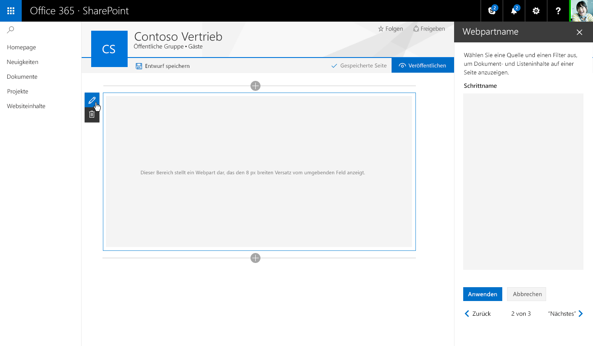

**Schritt 3 von 3**
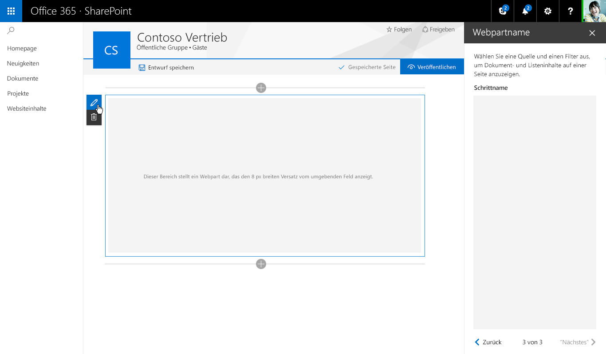

## Dynamisch Webparts und nicht dynamische Webparts - Vergleich

Dynamische Webparts werden so entwickelt, dass sie vollständig clientseitige Webparts sind. Das bedeutet, dass jede Komponente, die im Eigenschaftenbereich konfiguriert wird, die Änderung, die innerhalb des Webparts auf der Seite vorgenommen wird, widerspiegelt. Wenn Sie im Aufgabenlisten-Webparts die Option „Abgeschlossene Aufgaben“ deaktivieren, wird diese Ansicht im Webpart ausgeblendet.

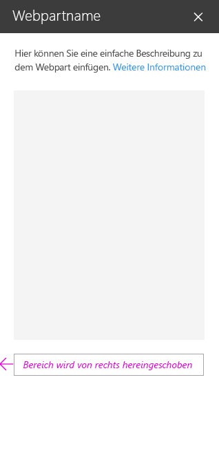

Nicht dynamische Webparts sind nicht vollständig clientseitig, und in der Regel muss mindestens eine Eigenschaft einen Aufruf ausführen, um Daten auf einem Server festzulegen/abzurufen oder zu speichern. In diesem Fall sollten Sie die Schaltflächen „Übernehmen“ und „Abbrechen“ am unteren Rand des Eigenschaftenbereich aktivieren.

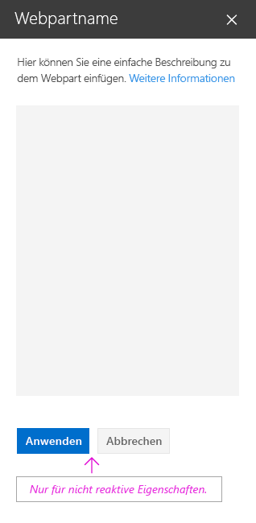

## Erstellen des Aufgabenlisten-Eigenschaftenbereichs

Das Beispiel der Aufgabenliste verwendet den einzelnen Eigenschaftenbereich, und es handelt sich um ein dynamisches Webpart. Nachfolgend ist eine React-Komponente von Fabric und das daraus resultierende Design dargestellt.

Hinzufügen einer Beschreibung für die Aufgabenliste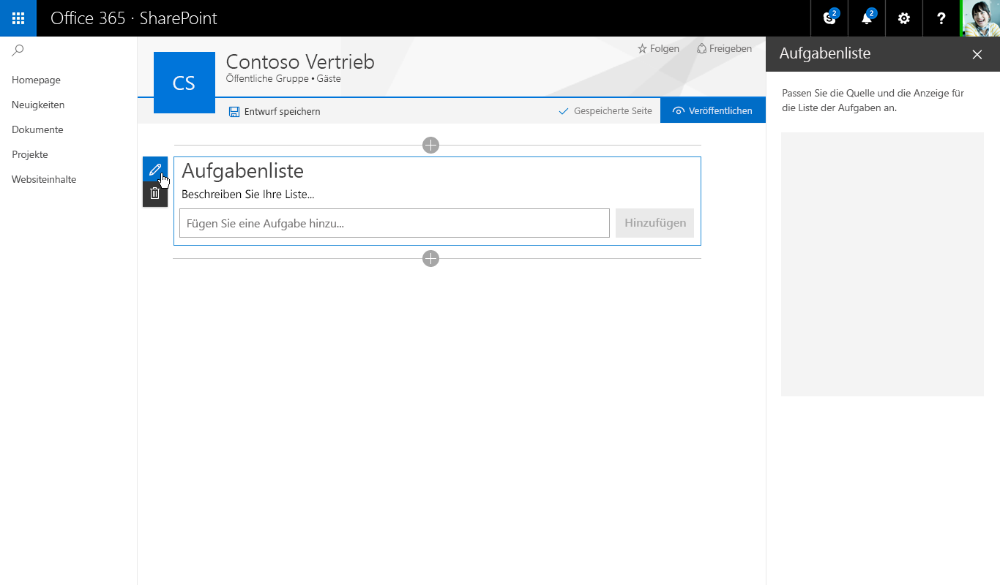

Dropdown – Zum Auswählen von Aufgaben aus einer vorhandenen Liste 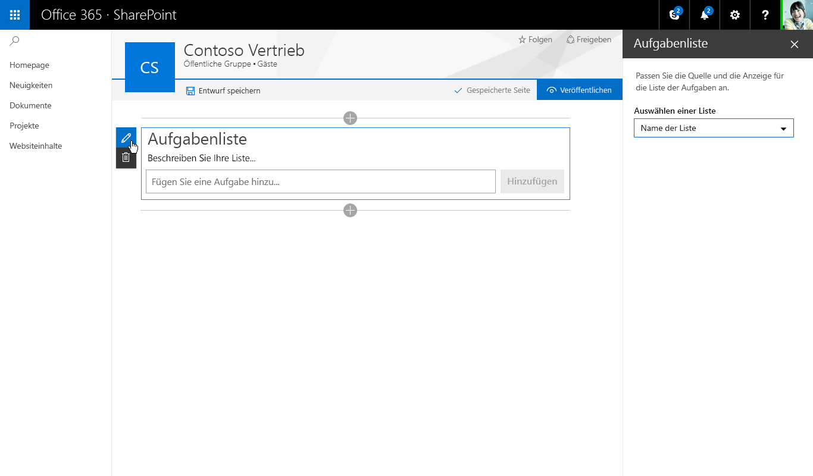

Kontrollkästchen – Ermöglicht Autoren das Ein-oder Ausblenden von verschiedenen Ansichten 

Schieberegler – Zum Festlegen der Anzahl sichtbarer Aufgaben

Nach dem Auswählen einer Liste aus dem Dropdown wird das Webpart angezeigt und gibt die Anzahl von Elementen an, die auf der Seite geladen werden 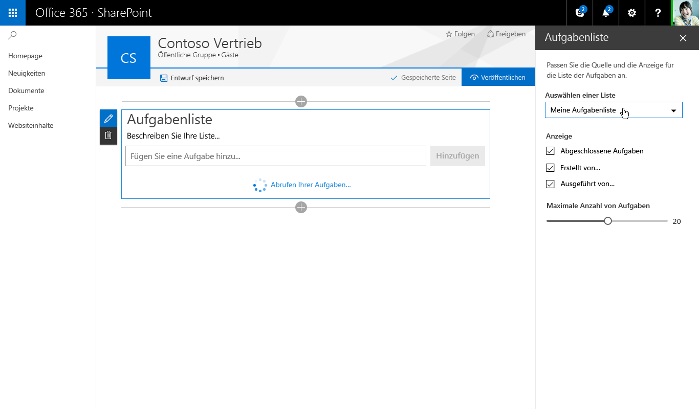

Wenn die neuen Aufgaben geladen werden, werden Sie mithilfe von Animationsstilen aus Office UI Fabric eingeblendet 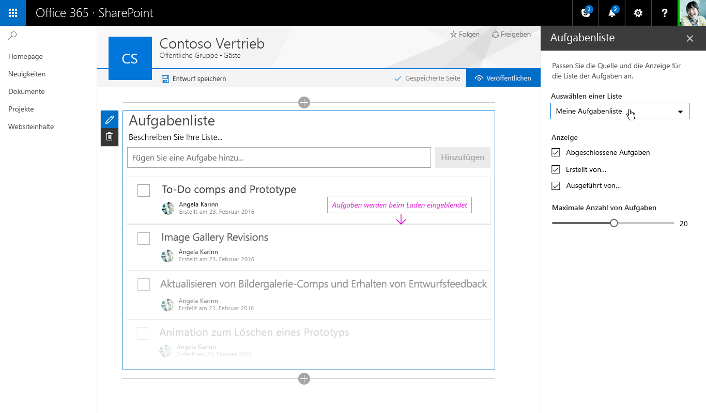
