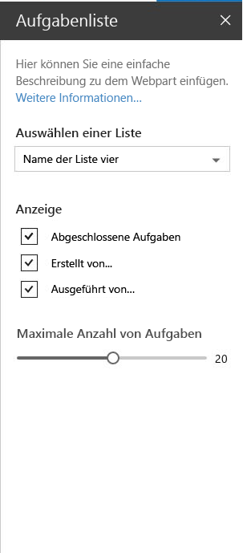

# <a name="make-your-sharepoint-client-side-web-part-configurable"></a><span data-ttu-id="daf08-101">Machen Sie Ihr clientseitiges SharePoint-Webpart konfigurierbar</span><span class="sxs-lookup"><span data-stu-id="daf08-101">Make your SharePoint client-side web part configurable</span></span>

<span data-ttu-id="daf08-p101">Im Eigenschaftenbereich können Endbenutzer das Webpart mit einer Reihe von Eigenschaften konfigurieren. Im Artikel [Erstellen Ihres ersten Webparts](../get-started/build-a-hello-world-web-part) wird beschrieben, wie der Eigenschaftenbereich in der **HelloWorldWebPart**-Klasse definiert ist. Die Eigenschaften des Eigenschaftenbereichs sind in**PropertyPaneSettings** definiert.</span><span class="sxs-lookup"><span data-stu-id="daf08-p101">The property pane allows end users to configure the web part with a bunch of properties. The article [Build your first web part](../get-started/build-a-hello-world-web-part) describes how the property pane is defined in the **HelloWorldWebPart** class. The property pane properties are defined in  **propertyPaneSettings**.</span></span>

<span data-ttu-id="daf08-105">Die folgende Abbildung zeigt ein Beispiel für einen Eigenschaftenbereich in SharePoint.</span><span class="sxs-lookup"><span data-stu-id="daf08-105">The following figure shows an example of a property pane in SharePoint.</span></span>



<span data-ttu-id="daf08-107">Der Eigenschaftenbereich weist drei wichtige Metadaten auf:</span><span class="sxs-lookup"><span data-stu-id="daf08-107">The property pane has three key metadata:</span></span>

* <span data-ttu-id="daf08-108">Seiten</span><span class="sxs-lookup"><span data-stu-id="daf08-108">Pages</span></span>
* <span data-ttu-id="daf08-109">Kopfzeile</span><span class="sxs-lookup"><span data-stu-id="daf08-109">Header</span></span>
* <span data-ttu-id="daf08-110">Gruppen</span><span class="sxs-lookup"><span data-stu-id="daf08-110">Groups</span></span>

<span data-ttu-id="daf08-p102">Über Seiten haben Sie die Flexibilität, komplexe Interaktionen zu trennen diese auf einer oder mehreren Seiten zu platzieren. Seiten enthalten dann eine Kopfzeile und Gruppen.</span><span class="sxs-lookup"><span data-stu-id="daf08-p102">Pages provide you the flexibility to separate complex interactions and put them into one or more pages. Pages then contain Header and Groups.</span></span>

<span data-ttu-id="daf08-113">Über Kopfzeilen können Sie den Titel des Eigenschaftenbereichs definieren, und über Gruppen können Sie die verschiedenen Abschnitte im Eigenschaftenbereich definieren, mit denen Sie Ihre Feldgruppen gruppieren.</span><span class="sxs-lookup"><span data-stu-id="daf08-113">Header allows you to define the title of the property pane and Groups let you define the various sections for the property pane through which you want to group your field sets.</span></span> 

<span data-ttu-id="daf08-114">Eine Eigenschaftenbereich sollte eine Seite, einen optionalen Header und mindestens eine Gruppe enthalten.</span><span class="sxs-lookup"><span data-stu-id="daf08-114">A property pane should contain a page, an optional header, and at least one group.</span></span>

<span data-ttu-id="daf08-115">Eigenschaftenfelder werden dann innerhalb einer Gruppe definiert.</span><span class="sxs-lookup"><span data-stu-id="daf08-115">Property fields are then defined inside a group.</span></span> 

## <a name="using-the-property-pane"></a><span data-ttu-id="daf08-116">Verwenden des Eigenschaftenbereichs</span><span class="sxs-lookup"><span data-stu-id="daf08-116">Using the property pane</span></span>

<span data-ttu-id="daf08-p103">Im folgenden Codebeispiel wird der Eigenschaftenbereich in Ihrem Webpart initialisiert und konfiguriert. Sie setzen die Methode **getPropertyPaneConfiguration** außer Kraft und geben eine Auflistung der Eigenschaftbereichsseite(n) zurück.</span><span class="sxs-lookup"><span data-stu-id="daf08-p103">The following code example initializes and configures the property pane in your web part. You create a method of type IPropertyPaneSettings and return a collection of property pane page(s).</span></span>

```ts
protected getPropertyPaneConfiguration(): IPropertyPaneConfiguration {
  return {
    pages: [
      {
        header: {
          description: strings.PropertyPaneDescription
        },
        groups: [
          {
            groupName: strings.BasicGroupName,
            groupFields: [
              PropertyPaneTextField('description', {
                label: strings.DescriptionFieldLabel
              })
            ]
          }
        ]
      }
    ]
  };
}
```

### <a name="property-pane-fields"></a><span data-ttu-id="daf08-119">Felder des Eigenschaftenbereichs</span><span class="sxs-lookup"><span data-stu-id="daf08-119">Property pane fields</span></span>

<span data-ttu-id="daf08-120">Die folgenden Feldtypen werden unterstützt:</span><span class="sxs-lookup"><span data-stu-id="daf08-120">The following field types are supported:</span></span>

* <span data-ttu-id="daf08-121">Schaltfläche</span><span class="sxs-lookup"><span data-stu-id="daf08-121">Button</span></span>
* <span data-ttu-id="daf08-122">Kontrollkästchen</span><span class="sxs-lookup"><span data-stu-id="daf08-122">Checkbox</span></span>
* <span data-ttu-id="daf08-123">Auswahlgruppe</span><span class="sxs-lookup"><span data-stu-id="daf08-123">Choice Group</span></span>
* <span data-ttu-id="daf08-124">Dropdown</span><span class="sxs-lookup"><span data-stu-id="daf08-124">Dropdown</span></span>
* <span data-ttu-id="daf08-125">Horizontales Lineal</span><span class="sxs-lookup"><span data-stu-id="daf08-125">Horizontal rule</span></span>
* <span data-ttu-id="daf08-126">Beschriftung</span><span class="sxs-lookup"><span data-stu-id="daf08-126">Label</span></span>
* <span data-ttu-id="daf08-127">Link</span><span class="sxs-lookup"><span data-stu-id="daf08-127">Link</span></span>
* <span data-ttu-id="daf08-128">Schieberegler</span><span class="sxs-lookup"><span data-stu-id="daf08-128">Slider</span></span>
* <span data-ttu-id="daf08-129">Textfeld</span><span class="sxs-lookup"><span data-stu-id="daf08-129">Textbox</span></span>
* <span data-ttu-id="daf08-130">Mehrzeiliges Textfeld</span><span class="sxs-lookup"><span data-stu-id="daf08-130">Multi-line Textbox</span></span>
* <span data-ttu-id="daf08-131">Umschaltfläche</span><span class="sxs-lookup"><span data-stu-id="daf08-131">Toggle</span></span>
* <span data-ttu-id="daf08-132">Benutzerdefiniert</span><span class="sxs-lookup"><span data-stu-id="daf08-132">Custom</span></span>

<span data-ttu-id="daf08-p104">Die Feldtypen sind in **sp-client-platform** als Module verfügbar. Bevor sie im Code verwendet werden können, müssen sie importiert werden:</span><span class="sxs-lookup"><span data-stu-id="daf08-p104">The field types are available as modules in **sp-client-platform**. They require an import before you can use them in your code:</span></span>

```ts
import {
  PropertyPaneTextField,
  PropertyPaneCheckbox,
  PropertyPaneLabel,
  PropertyPaneLink,
  PropertyPaneSlider,
  PropertyPaneToggle,
  PropertyPaneDropdown
} from '@microsoft/sp-client-preview';
```

<span data-ttu-id="daf08-135">Jede Feldtypmethode ist wie folgt definiert, wobei **PropertyPaneTextField** als Beispiel verwendet wird:</span><span class="sxs-lookup"><span data-stu-id="daf08-135">Every field type constructor is defined as follows, taking **PropertyPaneTextField** as an example:</span></span>

```ts
PropertyPaneTextField('targetProperty',{
  //field properties are defined here
})
```

<span data-ttu-id="daf08-136">**targetProperty** definiert das zugeordnete Objekt für diesen Feldtyp und ist auch in der Eigenschaftenschnittstelle Ihres Webparts definiert.</span><span class="sxs-lookup"><span data-stu-id="daf08-136">**targetProperty** defines the associated object for that field type and is also defined in the props interface in your web part.</span></span>

<span data-ttu-id="daf08-137">Um diesen Eigenschaften Typen zuzuordnen, definieren Sie eine Schnittstelle in Ihrer Webpartklasse, die eine oder mehrere Zieleigenschaften umfasst.</span><span class="sxs-lookup"><span data-stu-id="daf08-137">To assign types to these properties, define an interface in your web part class that includes one or more target properties.</span></span>

```ts
export interface IHelloWorldWebPartProps {
    targetProperty: string
}
```

<span data-ttu-id="daf08-138">Diese steht dann in Ihrem Webpart über die **this.properties.targetProperty** zur Verfügung.</span><span class="sxs-lookup"><span data-stu-id="daf08-138">This is then available in your web part using **this.properties.targetProperty**.</span></span>

```ts
<p class="ms-font-l ms-fontColor-white">${this.properties.description}</p>
```

<span data-ttu-id="daf08-p105">Wenn die Eigenschaften definiert sind, können Sie in Ihrem Webpart mit dem **this.properties.[Eigenschaftsname** darauf zugreifen. Details finden Sie unter [**Render**-Methode von **HelloWorldWebPart**](../get-started/build-a-hello-world-web-part#web-part-render-method):</span><span class="sxs-lookup"><span data-stu-id="daf08-p105">When the properties are defined, you can access them in your web part using the **this.properties.<property-value>**. For details, see [**render** method of the **HelloWorldWebPart**](../get-started/build-a-hello-world-web-part#web-part-render-method):</span></span>

## <a name="handling-field-changes"></a><span data-ttu-id="daf08-141">Behandeln von Feldänderungen</span><span class="sxs-lookup"><span data-stu-id="daf08-141">Handling field changes</span></span>

<span data-ttu-id="daf08-142">Der Eigenschaftenbereich besteht aus zwei Interaktionsmodi:</span><span class="sxs-lookup"><span data-stu-id="daf08-142">The property pane has two interaction modes:</span></span>

* <span data-ttu-id="daf08-143">Reaktiv</span><span class="sxs-lookup"><span data-stu-id="daf08-143">Reactive</span></span>
* <span data-ttu-id="daf08-144">Nicht reaktiv</span><span class="sxs-lookup"><span data-stu-id="daf08-144">Non-reactive</span></span>

<span data-ttu-id="daf08-p106">Im reaktiven Modus wird bei jeder Änderung ein Änderungsereignis ausgelöst. Durch das reaktive Verhalten wird das Webpart automatisch mit den neuen Werten aktualisiert.</span><span class="sxs-lookup"><span data-stu-id="daf08-p106">In reactive mode, on every change, a change event is triggered. Reactive behavior automatically updates the web part with the new values.</span></span>

<span data-ttu-id="daf08-p107">Der reaktive Modus ist zwar für viele Szenarien ausreichend, manchmal benötigen Sie aber das nicht reaktive Verhalten. Beim nicht reaktiven Verhalten wird das Webpart nicht automatisch aktualisiert, es sei denn, der Benutzer bestätigt die Änderungen. Fügen Sie Ihrem Webpart den folgenden Code hinzu, um den nicht reaktiven Modus zu aktivieren:</span><span class="sxs-lookup"><span data-stu-id="daf08-p107">While reactive mode is sufficient for many scenarios, at times you will need non-reactive behavior. Non-reactive does not update the web part automatically unless the user confirms the changes. To turn on the non-reactive mode, add the following code in your web part:</span></span>

```ts 
protected get disableReactivePropertyChanges(): boolean { 
  return true; 
}
```

## <a name="custom-property-pane-controls"></a><span data-ttu-id="daf08-150">Benutzerdefinierte Eigenschaftenbereich-Steuerelemente</span><span class="sxs-lookup"><span data-stu-id="daf08-150">Custom property pane controls</span></span>

<span data-ttu-id="daf08-p108">SharePoint Framework enthält eine Reihe von Standardsteuerelementen für den Eigenschaftenbereich. Doch manchmal benötigen Sie zusätzliche Funktionen, die über die grundlegenden Steuerelemente hinausgehen. Mit SharePoint Framework können Sie benutzerdefinierte Steuerelemente erstellen, um die erforderliche Funktionalität bereitzustellen. Weitere Informationen finden Sie im Leitfaden zum [Erstellen benutzerdefinierter Steuerelemente für den Eigenschaftenbereich](../guidance/build-custom-property-pane-controls).</span><span class="sxs-lookup"><span data-stu-id="daf08-p108">SharePoint Framework contains a set of standard controls for the property pane. But sometimes you need additional functionality beyond the basic controls. SharePoint Framework allows you to build custom controls to deliver the require functionality. To learn more, read the [Build custom controls for the property pane](../guidance/build-custom-property-pane-controls) guide.</span></span>