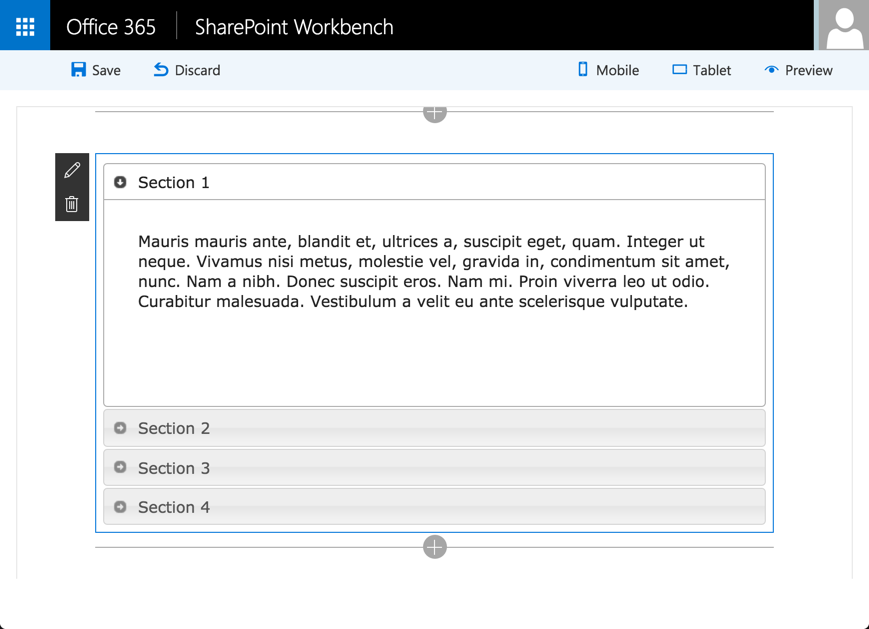

# <a name="add-jqueryui-accordion-to-your-sharepoint-client-side-web-part"></a>Hinzufügen von jQueryUI Accordion zu Ihrem clientseitigen SharePoint-Webpart

In diesem Artikel wird beschrieben, wie das jQueryUI Accordion zu Ihrem Webpart-Projekt hinzugefügt wird. Dazu gehört das Erstellen eines neuen Webparts, wie in der folgenden Abbildung gezeigt. 



Sie können die nachfolgend beschriebene Anleitung auch anhand dieses Videos in unserem [YouTube-Kanal „SharePoint Patterns & Practices“](https://www.youtube.com/watch?v=-3m__hRQxEI&list=PLR9nK3mnD-OXvSWvS2zglCzz4iplhVrKq) nachvollziehen: 

<a href="https://www.youtube.com/watch?v=-3m__hRQxEI&list=PLR9nK3mnD-OXvSWvS2zglCzz4iplhVrKq">

</a>

## <a name="prerequisites"></a>Voraussetzungen
Führen Sie die folgenden Schritte aus, bevor Sie starten:

* [Erstellen des ersten Webparts](build-a-hello-world-web-part.md)
* [Verbinden mit SharePoint](connect-to-sharepoint.md)

Die Entwicklertoolkette verwendet Webpack, SystemJS und CommonJS zum Bündeln der Webparts. Dies schließt das Laden externer Abhängigkeiten, z. B. jQuery oder jQueryUI, ein. Um externe Abhängigkeiten zu laden, müssen Sie folgende Schritte ausführen:

* Rufen Sie die externe Bibliothek über npm ab oder laden Sie sie vom Anbieter herunter.
* Falls verfügbar, installieren Sie die [TypeScript-Typdefinitionen](http://definitelytyped.org/) des entsprechenden Frameworks.
* Aktualisieren Sie, falls erforderlich, die Lösungskonfiguration, um die externe Abhängigkeit nicht standardmäßig in das Webpartbundle einzuschließen.

## <a name="create-a-new-web-part-project"></a>Erstellen eines neuen Webpart-Projekts

Erstellen Sie an einem Speicherort Ihrer Wahl ein neues Projektverzeichnis:

```
md jquery-webpart
```
    
> **Warnung:** Erstellen Sie dieses Verzeichnis unbedingt in einem neuen Ordner und nicht als Unterverzeichnis von `helloworld-webpart`.

Wechseln Sie in das Projektverzeichnis:

```
cd jquery-webpart
```
    
Führen Sie den Yeoman-SharePoint-Generator aus, um ein neues jQuery-Webpart zu erstellen:

```
yo @microsoft/sharepoint
```

Es werden verschiedene Eingabeaufforderungen angezeigt. Gehen Sie wie folgt vor:

* Akzeptieren Sie den Standardnamen **jquery-webpart** als Lösungsnamen, und drücken Sie die **EINGABETASTE**.
* Wählen Sie **Aktuellen Ordner verwenden** als Speicherort für die Dateien aus.

Über die nächsten Eingabeaufforderungen werden spezifische Informationen zum Webpart abgefragt:

* Akzeptieren Sie die Standardeinstellung **No javascript web framework** als Framework, und drücken Sie die **EINGABETASTE**, um fortzufahren.
* Geben Sie **jQuery** als Webpartnamen ein, und drücken Sie die **EINGABETASTE**.
* Geben Sie**jQuery-Webpart** als Beschreibung des Webparts ein, und drücken Sie die **EINGABETASTE**. 

An diesem Punkt installiert Yeoman die erforderlichen Abhängigkeiten und erstellt ein Gerüst für die Lösungsdateien. Das kann einige Minuten dauern. Yeoman erstellt ein Gerüst für das Projekt, um auch das **jQueryWebPart**-Webpart einzuschließen.

Geben Sie in der Konsole Folgendes ein, um das Webpart-Projekt in Visual Studio-Code zu öffnen:

```
code .
```

## <a name="install-jquery-and-jquery-ui-npm-packages"></a>Installieren Sie die Pakete „jQuery“ und „jQueryUI NPM“.

Geben Sie in der Konsole Folgendes ein, um das Paket „jQuery npm“ zu installieren:

```
npm install --save jquery
```

 Geben Sie nun Folgendes ein, um das Paket „jQueryUI npm“ zu installieren:

```
npm install --save jqueryui
```

Als Nächstes müssen die Eingaben für unser Projekt installiert werden. Ab TypeScript 2.0 kann npm zum Installieren erforderlicher Eingaben verwendet werden.

Öffnen Sie Ihre Konsole, und installieren Sie die erforderlichen Eingaben:

```
npm install --save @types/jquery
npm install --save @types/jqueryui
```

### <a name="unbundle-external-dependencies-from-web-part-bundle"></a>Entfernen externer Abhängigkeiten aus dem Webpartbundle
Standardmäßig werden hinzugefügte Abhängigkeiten im Webpartbundle gebündelt. In einigen Fällen ist dies nicht ideal. Sie können diese Abhängigkeiten aus dem Webpartbundle entfernen.

Öffnen Sie in Visual Studio Code die Datei „config\config.json“.

Diese Datei enthält Informationen zu Ihren Bundles und externen Abhängigkeiten. 

Der Bereich `entries` enthält die Standardbundleinformationen - in diesem Fall jQuery-Webpartbundle. Wenn Sie Ihrer Lösung weitere Webparts hinzufügen, wird pro Webpart ein Eintrag angezeigt.

```json
"entries": [
  {
    "entry": "./lib/webparts/jQuery/jQueryWebPart.js",
    "manifest": "./src/webparts/jQuery/jQueryWebPart.manifest.json",
    "outputPath": "./dist/j-query.bundle.js",
  }
]
```

Der Bereich `externals` enthält die Bibliotheken, die nicht im Standardbundle gebündelt sind. 

```json
  "externals": {},
```

Um `jQuery` und `jQueryUI` aus dem Standardbundle zu entfernen, fügen Sie dem Bereich `externals` die Module hinzu:

```json
"jquery":"node_modules/jquery/dist/jquery.min.js",
"jqueryui":"node_modules/jqueryui/jquery-ui.min.js"
```

Wenn Sie nun Ihr Projekt erstellen, werden `jQuery` und `jQueryUI` nicht im standardmäßigen Webpartbundle gebündelt.

Der vollständige Inhalt der config.json-Datei ist derzeit wie folgt:

```json
{
  "entries": [
    {
      "entry": "./lib/webparts/jQuery/JQueryWebPart.js",
      "manifest": "./src/webparts/jQuery/JQueryWebPart.manifest.json",
      "outputPath": "./dist/j-query.bundle.js"
    }
  ],
  "externals": {
    "jquery":"node_modules/jquery/dist/jquery.min.js",
    "jqueryui":"node_modules/jqueryui/jquery-ui.min.js"
  },
  "localizedResources": {
    "jQueryStrings": "webparts/jQuery/loc/{locale}.js"
  }
}
```


## <a name="build-the-accordion"></a>Erstellen von Accordion

Öffnen Sie den Projektordner **jquery-webpart** in Visual Studio Code. Ihr Projekt sollte das jQuery-Webpart aufweisen, das Sie zuvor im Ordner „/src/webparts/jQuery“ hinzugefügt haben.

### <a name="add-accordion-html"></a>Hinzufügen von Accordion-HTML
Fügen Sie eine neue Datei im `src/webparts/jQuery`-Ordner namens **MyAccordionTemplate.ts** hinzu.

Erstellen und exportieren Sie eine Klasse `MyAccordionTemplate` (als Modul), die den HTML-Code für das Accordion enthält.

```ts
export default class MyAccordionTemplate {
    public static templateHtml: string =  `
      <div class="accordion">
        <h3>Section 1</h3>
        <div>
            <p>
            Mauris mauris ante, blandit et, ultrices a, suscipit eget, quam. Integer
            ut neque. Vivamus nisi metus, molestie vel, gravida in, condimentum sit
            amet, nunc. Nam a nibh. Donec suscipit eros. Nam mi. Proin viverra leo ut
            odio. Curabitur malesuada. Vestibulum a velit eu ante scelerisque vulputate.
            </p>
        </div>
        <h3>Section 2</h3>
        <div>
            <p>
            Sed non urna. Donec et ante. Phasellus eu ligula. Vestibulum sit amet
            purus. Vivamus hendrerit, dolor at aliquet laoreet, mauris turpis porttitor
            velit, faucibus interdum tellus libero ac justo. Vivamus non quam. In
            suscipit faucibus urna.
            </p>
        </div>
        <h3>Section 3</h3>
        <div>
            <p>
            Nam enim risus, molestie et, porta ac, aliquam ac, risus. Quisque lobortis.
            Phasellus pellentesque purus in massa. Aenean in pede. Phasellus ac libero
            ac tellus pellentesque semper. Sed ac felis. Sed commodo, magna quis
            lacinia ornare, quam ante aliquam nisi, eu iaculis leo purus venenatis dui.
            </p>
            <ul>
            <li>List item one</li>
            <li>List item two</li>
            <li>List item three</li>
            </ul>
        </div>
        <h3>Section 4</h3>
        <div>
            <p>
            Cras dictum. Pellentesque habitant morbi tristique senectus et netus
            et malesuada fames ac turpis egestas. Vestibulum ante ipsum primis in
            faucibus orci luctus et ultrices posuere cubilia Curae; Aenean lacinia
            mauris vel est.
            </p>
            <p>
            Suspendisse eu nisl. Nullam ut libero. Integer dignissim consequat lectus.
            Class aptent taciti sociosqu ad litora torquent per conubia nostra, per
            inceptos himenaeos.
            </p>
        </div>
     </div>`;
}
```

Speichern Sie die Datei.

### <a name="import-accordion-html"></a>Importieren von Accordion-HTML

Öffnen Sie in Visual Studio Code **src\webparts\jQuery\JQueryWebPart.ts**.

Fügen Sie am Anfang der Datei, wo sich auch andere Importe befinden, den folgenden Import hinzu:

```ts
import MyAccordionTemplate from './MyAccordionTemplate';
```

### <a name="import-jquery-and-jqueryui"></a>Importieren von jQuery und jQueryUI
Sie können jQuery auf die gleiche Weise in Ihr Webpart importieren, wie Sie „MyAccordionTemplate“ importiert haben.

Fügen Sie am Anfang der Datei, wo sich auch andere Importe befinden, die folgenden Importe hinzu:

```ts
import * as jQuery from 'jquery';
import 'jqueryui';
```

Als Nächstes laden Sie einige externe CSS-Dateien. Verwenden Sie dazu das Modulladeprogramm. Fügen Sie den folgenden Import hinzu:

```ts
import { SPComponentLoader } from '@microsoft/sp-loader';
```

Um die jQueryUI-Formatvorlagen zu laden, müssen Sie in der `JQueryWebPart`-Webpartklasse einen Konstruktor hinzufügen und den neu importierten SPComponentLoader verwenden. Fügen Sie den folgenden Konstruktor zu Ihrem Webpart hinzu. 

```ts
  public constructor() {
    super();

    SPComponentLoader.loadCss('//code.jquery.com/ui/1.11.4/themes/smoothness/jquery-ui.css');
  }
```

Durch diesen Code wird Folgendes ausgeführt:

* Aufruf des übergeordneten Konstruktors mit dem Kontext zum Initialisieren des Webparts.
* Asynchrones Laden der Accordion-Formatvorlagen aus einem CDN.

### <a name="render-accordion"></a>Rendern von Accordion

Wechseln Sie in der `jQueryWebPart.ts` zur `render`-Methode.

Legen Sie die innere HTML des Webparts so fest, dass die Accordion-HTML wiedergegeben wird:

```ts
this.domElement.innerHTML = MyAccordionTemplate.templateHtml;
```

jQueryUI Accordion weist einige Optionen auf, die Sie zum Anpassen des Accordions festlegen können. Definieren Sie einige Optionen für Ihr Accordion direkt unter `this.domElement.innerHTML = MyAccordionTemplate.templateHtml;`:

```ts
const accordionOptions: JQueryUI.AccordionOptions = {
  animate: true,
  collapsible: false,
  icons: {
    header: 'ui-icon-circle-arrow-e',
    activeHeader: 'ui-icon-circle-arrow-s'
  }
};
```

Wie Sie sehen können, können Sie über die TypeScript-Typdefinition eine Typvariable mit dem Namen `JQueryUI.AccordionOptions` und die unterstützten Eigenschaften angeben. 

Wenn Sie mit IntelliSense experimentieren, werden Sie feststellen, dass Sie volle Unterstützung für in `JQueryUI.` verfügbare Methoden sowie die Methodenparameter erhalten.

Initialisieren Sie schließlich das Accordion:

```ts
jQuery('.accordion', this.domElement).accordion(accordionOptions);
```

Wie Sie sehen können, verwenden Sie die Variable `jQuery`, die Sie zum Importieren des `jquery`-Moduls verwendet haben. Initialisieren Sie dann das Accordion.

Die vollständige `render`-Methodenklasse sieht wie folgt aus:

```ts
public render(): void {
  this.domElement.innerHTML = MyAccordionTemplate.templateHtml;

  const accordionOptions: JQueryUI.AccordionOptions = {
    animate: true,
    collapsible: false,
    icons: {
      header: 'ui-icon-circle-arrow-e',
      activeHeader: 'ui-icon-circle-arrow-s'
    }
  };

  jQuery('.accordion', this.domElement).accordion(accordionOptions);
}
```

Speichern Sie die Datei.

## <a name="preview-the-web-part"></a>Anzeigen einer Webpart-Vorschau

Stellen Sie in der Konsole sicher, dass Sie sich immer noch im Ordner „jquery-webpart“ befinden, und geben Sie Folgendes ein, um das Webpart zu erstellen und in der Vorschau anzuzeigen:

```
gulp serve
```

> **Hinweis:** Visual Studio Code bietet integrierte Unterstützung für gulp und andere Tools zur Taskausführung. Sie können **STRG + UMSCHALT + B** unter Windows oder **BEFEHL + UMSCHALT + B** auf dem Mac drücken, um Ihr Webpart zu debuggen und eine Vorschau anzuzeigen.

Gulp führt die Aufgaben aus und öffnet die lokale SharePoint-Webpart-Workbench.

Drücken Sie im Seitenbereich auf das **+** (Pluszeichen), um die Liste von Webparts anzuzeigen, und führen Sie das jQuery-Webpart hinzu. Jetzt sollte das jQueryUI Accordion angezeigt werden.


Drücken Sie in der Konsole, in der `gulp serve` ausgeführt wird, auf **STRG + C**, um die Aufgabe abzubrechen.
