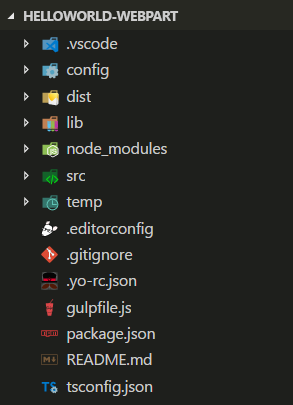

# <a name="build-your-first-sharepoint-client-side-web-part-hello-world-part-1"></a>Erstellen Ihres ersten clientseitigen SharePoint-Webparts („Hello World“ Teil 1)

Clientseitige Webparts sind clientseitige Komponenten, die im Kontext einer SharePoint-Website ausgeführt werden. Clientseitige Webparts lassen sich auf SharePoint Online bereitstellen und auch mithilfe aktueller JavaScript-Tools und -Bibliotheken erstellen.

Clientseitige Webparts unterstützen:

* Die Erstellung mit HTML und JavaScript
* SharePoint-Onlineumgebungen und lokale SharePoint-Umgebungen

> [!NOTE]
> Bevor Sie die Schritte in diesem Artikel durchführen, müssen Sie [Ihre Entwicklungsumgebung einrichten](../../set-up-your-development-environment.md).

Sie können die nachfolgend beschriebene Anleitung auch anhand dieses Videos in unserem [YouTube-Kanal „SharePoint Patterns & Practices“](https://www.youtube.com/watch?v=YqUIX2pMUzg&list=PLR9nK3mnD-OXvSWvS2zglCzz4iplhVrKq&index=2) nachvollziehen: 

<a href="https://www.youtube.com/watch?v=YqUIX2pMUzg&list=PLR9nK3mnD-OXvSWvS2zglCzz4iplhVrKq&index=2">

</a>


## <a name="create-a-new-web-part-project"></a>Erstellen eines neuen Webpart-Projekts
Erstellen Sie an einem Speicherort Ihrer Wahl ein neues Projektverzeichnis:
    
```
md helloworld-webpart
```

Wechseln Sie in das Projektverzeichnis:

```
cd helloworld-webpart
```

Führen Sie den Yeoman-SharePoint-Generator aus, um ein neues HelloWorld-Webpart zu erstellen:

```
yo @microsoft/sharepoint
```
    
Es werden verschiedene Eingabeaufforderungen angezeigt. Gehen Sie wie folgt vor:

* Akzeptieren Sie den Standardnamen **helloworld-webpart** als Lösungsnamen, und drücken Sie die **EINGABETASTE**.
* Wählen Sie **SharePoint Online only (latest)**, und drücken Sie die **EINGABETASTE**.
* Wählen Sie als Speicherort für die Dateien die Option **Use the current folder** aus.
* Wählen Sie **N**, damit die Erweiterung auf jeder Website explizit installiert werden muss, wenn sie verwendet wird. 
* Wählen Sie **Webpart** als den zu erstellenden Typ von clientseitiger Komponente aus. 

Über die nächsten Eingabeaufforderungen werden spezifische Informationen zum Webpart abgefragt:

* Akzeptieren Sie den Standardnamen **HelloWorld** als Namen für Ihr Webpart, und drücken Sie die **EINGABETASTE**.
* Akzeptieren Sie die Standardbeschreibung **HelloWorld description** als Beschreibung für Ihr Webpart, und drücken Sie die **EINGABETASTE**.
* Akzeptieren Sie die Standardeinstellung **No javaScript web framework** als das zu verwendende Framework, und drücken Sie die **EINGABETASTE**.


An diesem Punkt installiert Yeoman die erforderlichen Abhängigkeiten und erstellt ein Gerüst für die Lösungsdateien sowie das **HelloWorld**-Webpart. Das kann einige Minuten dauern.

Nach Abschluss der Gerüsterstellung sollte folgende Erfolgsmeldung angezeigt werden:


Details zur Behebung etwaiger Fehler finden Sie unter [Known issues](../../known-issues-and-common-questions.md).

### <a name="using-your-favorite-code-editor"></a>Verwenden Ihres bevorzugten Code-Editors
Da die clientseitige SharePoint-Lösung auf HTML/TypeScript basiert, können Sie zur Erstellung Ihres Webparts alle Code-Editoren verwenden, die clientseitige Entwicklung unterstützen, beispielsweise:

* [Visual Studio Code](https://code.visualstudio.com/)
* [Atom](https://atom.io)
* [WebStorm](https://www.jetbrains.com/webstorm)

In der SharePoint Framework-Dokumentation wird Visual Studio Code in den Anleitungen und Beispielen verwendet. Visual Studio Code ist ein einfacher und dennoch leistungsfähiger Quellcode-Editor von Microsoft, der auf dem Desktop ausgeführt wird und für Windows, Mac und Linux verfügbar ist. Er verfügt über integrierte Unterstützung für JavaScript, TypeScript und Node.js und bietet ein reichhaltiges Ökosystem von Erweiterungen für andere Sprachen (wie C++, C#, Python, PHP) und Laufzeiten.
   
## <a name="preview-the-web-part"></a>Anzeigen einer Webpart-Vorschau
Um eine Vorschau Ihres Webparts anzuzeigen, erstellen Sie es und führen es auf einem lokalen Webserver aus. Die clientseitige Toolkette verwendet standardmäßig HTTPS-Endpunkte. Da für die lokale Entwicklungsumgebung jedoch kein Standardzertifikat konfiguriert ist, meldet der Browser einen Zertifikatfehler. Die SPFx-Toolkette enthält ein Entwicklerzertifikat, das Sie installieren und bei der Webpart-Erstellung nutzen können.

Wechseln Sie zur Installation des Entwicklerzertifikats für die SPFx-Entwicklung auf die Konsole, vergewissern Sie sich, dass Sie noch im Verzeichnis **helloworld-webpart** sind, und geben Sie den folgenden Befehl ein:

```
gulp trust-dev-cert
```

Damit ist das Entwicklerzertifikat installiert. Nun geben Sie den folgenden Befehl in die Konsole ein, um das Webpart zu erstellen und die Vorschau aufzurufen:

```
gulp serve
```

Dieser Befehl führt eine Reihe von gulp-Tasks aus, um einen lokalen, Node-basierten HTTPS-Server unter „localhost:4321“ zu erstellen und eine Vorschau des Webparts aus Ihrer lokalen Entwicklungsumgebung in Ihrem Standardbrowser anzuzeigen.


Die SharePoint-Tools für clientseitige Entwicklung verwenden [gulp](http://gulpjs.com/) zur Ausführung von Tasks. Unter anderem bearbeitet gulp Buildtasks wie das:

* Bundling und Minimieren von JavaScript- und CSS-Dateien
* Ausführen von Tools zum Aufrufen der Bündelungs- und Minimierungstasks vor jedem Build
* Kompilieren von SASS-Dateien in CSS
* Kompilieren von TypeScript-Dateien in JavaScript

Visual Studio Code bietet integrierte Unterstützung für gulp und andere Tools zur Taskausführung. Drücken Sie **STRG + UMSCHALT + B** unter Windows oder **BEFEHL + UMSCHALT + B** auf dem Mac, um Ihr Webpart zu debuggen und eine Vorschau anzuzeigen. 

### <a name="sharepoint-workbench"></a>SharePoint Workbench
SharePoint Workbench ist eine Designoberfläche für Entwickler, mit der Sie schnell Webpart-Tests durchführen und eine Webpart-Vorschau anzeigen können, und zwar ohne die Webparts in SharePoint bereitstellen zu müssen. SharePoint Workbench enthält die clientseitige Seite und das clientseitige Canvas. Hier können Sie Webparts während der Entwicklung hinzufügen, löschen und testen.


Klicken Sie auf die **Schaltfläche zum Hinzufügen**, um das HelloWorld-Webpart hinzuzufügen. Die Schaltfläche zum Hinzufügen öffnet die Toolbox. Hier sehen Sie eine Liste aller Webparts, die Sie hinzufügen können. In dieser Liste werden das **HelloWorld**-Webpart sowie andere Webparts aufgeführt, die lokal in Ihrer Entwicklungsumgebung verfügbar sind.
   

   
Wählen Sie **HelloWorld** aus, um das Webpart zur Seite hinzuzufügen:
   


**Ausgezeichnet.** Sie haben Ihr erstes clientseitiges Webpart zu einer clientseitigen Seite hinzugefügt.
   
Klicken Sie nun auf das Stiftsymbol links oben neben dem Webpart, um den Eigenschaftenbereich des Webparts anzuzeigen.
   


Im Eigenschaftenbereich können Sie Eigenschaften definieren und so Ihr Webpart anpassen. Der Bereich wird clientseitig gesteuert und ermöglicht SharePoint-übergreifend ein konsistentes Design.
   
Ändern Sie den Text im Textfeld **Description** in **Clientseitige Webparts sind klasse!**.

Noch während Sie tippen, verändert sich der Text im Webpart. 

Eine der neuen Funktionen für den Eigenschaftenbereich betrifft das Aktualisierungsverhalten. Es lässt sich jetzt entweder als „reactive“ oder als „non-reactive“ konfigurieren. Standardmäßig ist das Aktualisierungsverhalten auf „reactive“ gesetzt. Änderungen können Sie dann bereits während der Bearbeitung der Eigenschaften sehen. Wenn das Verhalten auf „reactive“ gesetzt ist, werden Änderungen sofort gespeichert.  

## <a name="web-part-project-structure"></a>Webpart-Projektstruktur
Sie können die Webpart-Projektstruktur in Visual Studio Code anzeigen. 

* Unterbrechen Sie in der Konsole die Verarbeitung durch Drücken von STRG + C (unter Windows). 
* Geben Sie folgenden Befehl ein, um das Webpart-Projekt in Visual Studio Code (oder einem Editor Ihrer Wahl) zu öffnen:

```
code .
```



Falls ein Fehler gemeldet wird, müssen Sie eventuell [den Codebefehl in PATH installieren](https://code.visualstudio.com/docs/editor/setup).

TypeScript ist die primäre Sprache zur Erstellung von clientseitigen SharePoint-Webparts. Bei TypeScript handelt es sich um eine typisierte Obersprache zu JavaScript, die in einfaches JavaScript kompiliert. SharePoint-Tools für die clientseitige Entwicklung werden auf Basis von TypeScript-Klassen, -Modulen und -Schnittstellen erstellt. Das hilft Entwicklern, stabile clientseitige Webparts zu erstellen. 

Nachfolgend beschreiben wir einige der wichtigsten Dateien eines Projekts.

### <a name="web-part-class"></a>Webpart-Klasse
**HelloWorldWebPart.ts** in **src\webparts\helloworld** definiert den Haupteinstiegspunkt des Webparts. Die Webpart-Klasse **HelloWorldWebPart** erweitert die Klasse **BaseClientSideWebPart**. Jedes clientseitige Webpart muss die Klasse **BaseClientSideWebPart** erweitern, damit es als gültiges Webpart definiert wird.

**BaseClientSideWebPart** implementiert das Minimum an Funktionen, das für die Erstellung eines Webparts erforderlich ist. Daneben bietet diese Klasse auch viele Parameter für die Überprüfung von und den Zugriff auf schreibgeschützte Eigenschaften wie **displayMode**, Webpart-Eigenschaften, Webpart-Kontext, die Webpart-**instanceId**, das Webpart-**domElement** und vieles mehr.

Die Webpart-Klasse ist dabei so definiert, dass sie den Eigenschaftentyp **IHelloWorldWebPartProps** akzeptiert.

Der Eigenschaftentyp ist als Schnittstelle vor der **HelloWorldWebPart**-Klasse in der Datei **HelloWorldWebPart.ts** definiert.

```ts
export interface IHelloWorldWebPartProps {
    description: string;
}
```

Anhand dieser Eigenschaftendefinition definieren Sie benutzerdefinierte Eigenschaftentypen für Ihr Webpart. Dazu mehr weiter unten im Abschnitt zum Eigenschaftenbereich. 

#### <a name="web-part-render-method"></a>Webpart-Rendermethode
Das DOM-Element, in dem das Webpart gerendert werden soll, wird in der Methode **render** spezifiziert. Mithilfe dieser Methode wird das Webpart in dem angegebenen DOM-Element gerendert. Im Webpart **HelloWorld** ist als DOM-Element ein DIV festgelegt. Zu den Parametern der Methode gehören der Anzeigemodus (entweder „Read“ oder „Edit“) sowie etwaige konfigurierte Webpart-Eigenschaften: 

```ts
  public render(): void {
    this.domElement.innerHTML = `
      <div class="${ styles.helloWorld }">
        <div class="${ styles.container }">
          <div class="${ styles.row }">
            <div class="${ styles.column }">
              <span class="${ styles.title }">Welcome to SharePoint!</span>
              <p class="${ styles.subTitle }">Customize SharePoint experiences using Web Parts.</p>
              <p class="${ styles.description }">${escape(this.properties.description)}</p>
              <a href="https://aka.ms/spfx" class="${ styles.button }">
                <span class="${ styles.label }">Learn more</span>
              </a>
            </div>
          </div>
        </div>
      </div>`;
  }
```

Das Modell ist flexibel: Webparts können in jedem JavaScript-Framework erstellt und dann in das DOM-Element geladen werden. 

#### <a name="configure-the-web-part-property-pane"></a>Konfigurieren des Webpart-Eigenschaftenbereichs
Der Eigenschaftenbereich wird in der Klasse **HelloWorldWebPart** definiert, und zwar in der Eigenschaft **propertyPaneSettings**.

Sobald Sie die gewünschten Eigenschaften definiert haben, können Sie sie per `this.properties.<property-value>` im Webpart aufrufen. Hier ein Beispiel dafür in der Methode **render**:

```ts
<p class="${styles.description}">${escape(this.properties.description)}</p>
```

Beachten Sie, dass wir dem Wert der Eigenschaft ein HTML-Escapezeichen hinzufügen, damit die Zeichenfolge gültig ist.

Im Artikel [Integrating property pane with a web part](../basics/integrate-with-property-pane.md) erfahren Sie mehr über die Arbeit mit dem Eigenschaftenbereich sowie die verschiedenen Feldtypen im Eigenschaftbereich.

Nun fügen wir dem Eigenschaftenbereich einige weitere Eigenschaften hinzu – ein Kontrollkästchen, ein Dropdown und einen Umschalter. Zunächst importieren wir die jeweiligen Felder des Eigenschaftenbereichs aus dem Framework.

Scrollen Sie zum Anfang der Datei, und tragen Sie Folgendes in den Abschnitt für den Import aus `@microsoft/sp-webpart-base` ein:

```ts
PropertyPaneCheckbox,
PropertyPaneDropdown,
PropertyPaneToggle
```

Der vollständige Importabschnitt sieht dann wie folgt aus:

```ts
import {
  BaseClientSideWebPart,
  IPropertyPaneConfiguration,
  PropertyPaneTextField,
  PropertyPaneCheckbox,
  PropertyPaneDropdown,
  PropertyPaneToggle
} from '@microsoft/sp-webpart-base';
```

Aktualisieren Sie als Nächstes die Webparteigenschaften um die neuen Eigenschaften. Dadurch werden die Felder typisierten Objekten zugeordnet.

Ersetzen Sie die **IHelloWorldWebPartProps**-Schnittstelle mit dem folgenden Code.

```ts
export interface IHelloWorldWebPartProps {
    description: string;
    test: string;
    test1: boolean;
    test2: string;
    test3: boolean;
}
```

Speichern Sie die Datei.

Ersetzen Sie die Methode **getPropertyPaneConfiguration** durch den folgenden Code, der die neuen Felder des Eigenschaftenbereichs hinzufügt und den jeweiligen typisierten Objekten zuordnet.

```ts
protected getPropertyPaneConfiguration(): IPropertyPaneConfiguration {
  return {
    pages: [
      {
        header: {
          description: strings.PropertyPaneDescription
        },
        groups: [
          {
            groupName: strings.BasicGroupName,
            groupFields: [
            PropertyPaneTextField('description', {
              label: 'Description'
            }),
            PropertyPaneTextField('test', {
              label: 'Multi-line Text Field',
              multiline: true
            }),
            PropertyPaneCheckbox('test1', {
              text: 'Checkbox'
            }),
            PropertyPaneDropdown('test2', {
              label: 'Dropdown',
              options: [
                { key: '1', text: 'One' },
                { key: '2', text: 'Two' },
                { key: '3', text: 'Three' },
                { key: '4', text: 'Four' }
              ]}),
            PropertyPaneToggle('test3', {
              label: 'Toggle',
              onText: 'On',
              offText: 'Off'
            })
          ]
          }
        ]
      }
    ]
  };
}
```


Nachdem Sie die Eigenschaften zu den Webpart-Eigenschaften hinzugefügt haben, können Sie nun genauso auf sie zugreifen, wie Sie zuvor auf die **description**-Eigenschaft zugegriffen haben:

```ts
<p class="${ styles.description }">${escape(this.properties.test)}</p>
```

Zur Festlegung des Standardwerts für die Eigenschaften müssen Sie den Eigenschaftenbehälter **properties** im Webpart-Manifest aktualisieren:

Öffnen Sie `HelloWorldWebPart.manifest.json`, und ändern Sie `properties` wie folgt:

```ts
"properties": {
  "description": "HelloWorld",
  "test": "Multi-line text field",
  "test1": true,
  "test2": "2",
  "test3": true
}
```

Der Webpart-Eigenschaftenbereich weist jetzt diese Standardwerte für die betreffenden Eigenschaften auf.

### <a name="web-part-manifest"></a>Webpart-Manifest
Die Datei **HelloWorldWebPart.manifest.json** definiert die Webpart-Metadaten, beispielsweise die Version, die ID, den Anzeigenamen, das Symbol und die Beschreibung. Jedes Webpart muss ein solches Manifest enthalten.

```json
{
  "$schema": "https://dev.office.com/json-schemas/spfx/client-side-web-part-manifest.schema.json",
  "id": "7d5437ee-afc2-4e66-914b-80be5ace4056",
  "alias": "HelloWorldWebPart",
  "componentType": "WebPart",

  // The "*" signifies that the version should be taken from the package.json
  "version": "*",
  "manifestVersion": 2,

  // If true, the component can only be installed on sites where Custom Script is allowed.
  // Components that allow authors to embed arbitrary script code should set this to true.
  // https://support.office.com/en-us/article/Turn-scripting-capabilities-on-or-off-1f2c515f-5d7e-448a-9fd7-835da935584f
  "requiresCustomScript": false,

  "preconfiguredEntries": [{
    "groupId": "5c03119e-3074-46fd-976b-c60198311f70", // Other
    "group": { "default": "Other" },
    "title": { "default": "HelloWorld" },
    "description": { "default": "HelloWorld description" },
    "officeFabricIconFontName": "Page",
    "properties": {
      "description": "HelloWorld",
      "test": "Multi-line text field",
      "test1": true,
      "test2": "2",
      "test3": true
    }
  }]
}

```

Da wir nun neue Eigenschaften eingeführt haben, müssen Sie sicherstellen, dass Sie das Webpart wieder aus der lokalen Entwicklungsumgebung hosten, indem Sie den folgenden Befehl ausführen. Dadurch wird auch sichergestellt, dass die oben angegebenen Änderungen ordnungsgemäß angewendet wurden.

```
gulp serve
```

### <a name="preview-the-web-part-in-sharepoint"></a>Anzeigen der Webpart-Vorschau in SharePoint

SharePoint Workbench lässt sich auch in SharePoint hosten, um während der Entwicklung lokaler Webparts eine Webpart-Vorschau anzuzeigen und Tests durchzuführen. Der entscheidende Vorteil: Sie führen Ihr Webpart dann im SharePoint-Kontext aus und können mit SharePoint-Daten interagieren.

Rufen Sie die folgende URL auf: „https://your-sharepoint-tenant.sharepoint.com/_layouts/workbench.aspx“.

> [!NOTE]
> Wenn Sie das SPFx-Entwicklerzertifikat noch nicht installiert haben, meldet Workbench, dass das Laden von Skripts von „localhost“ nicht konfiguriert ist. Beenden Sie den Prozess, der derzeit im Konsolenfenster ausgeführt wird, führen Sie den Befehl `gulp trust-dev-cert` im Projektverzeichnis aus, um das Entwicklerzertifikat zu installieren, und führen Sie dann den Befehl `gulp serve` erneut aus.


In SharePoint Workbench wird jetzt die Navigationsleiste der Office 365 Suite angezeigt. 

Klicken Sie im Canvas auf das **Symbol zum Hinzufügen**, um die Toolbox aufzurufen. In der Toolbox finden Sie jetzt die Webparts, die auf der Website verfügbar sind, auf der SharePoint Workbench gehostet wird, sowie **HelloWorldWebPart**.


Fügen Sie **HelloWorld** aus der Toolbox hinzu. Das Webpart wird jetzt auf einer in SharePoint gehosteten Website ausgeführt.


> [!NOTE]
> Die Farbe des Webparts hängt von den Farben der Website ab. Standardmäßig erben Webparts die grundlegenden Farben von der Website, indem dynamisch auf die auf der Website verwendeten Office-UI-Fabric Core-Formatvorlagen verwiesen wird, auf der das Webpart gehostet wird.

Da die Entwicklung und die Tests Ihres Webparts noch nicht abgeschlossen sind, müssen Sie es weder packen noch auf SharePoint bereitstellen. 

## <a name="next-steps"></a>Nächste Schritte
Herzlichen Glückwunsch! Ihr erstes HelloWorld-Webpart läuft. Jetzt können Sie das HelloWorld-Webpart weiter ausbauen. Wie das funktioniert, erfahren Sie im nächsten Artikel, [Verbinden mit SharePoint](./connect-to-sharepoint.md). Dort verwenden Sie dasselbe HelloWorld-Webpart-Projekt und ergänzen es um eine Funktion zur Interaktion mit REST-APIs für SharePoint-Listen. Ihnen wird bereits aufgefallen sein, dass der Befehl `gulp serve` immer noch im Konsolenfenster ausgeführt wird (oder in Visual Studio Code, falls Sie den Editor verwenden). Sie können ihn einfach weiterlaufen lassen und zum nächsten Artikel wechseln.

> [!NOTE]
> Wenn Sie einen Fehler in der Dokumentation oder im SharePoint-Framework finden, melden Sie ihn an das SharePoint Engineering unter Verwendung der [Fehlerliste im sp-dev-docs-Repository](https://github.com/SharePoint/sp-dev-docs/issues). Vielen Dank im Voraus für Ihr Feedback.