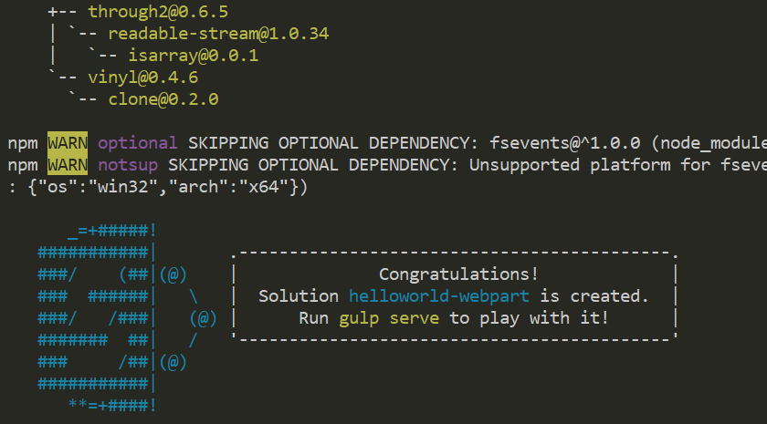
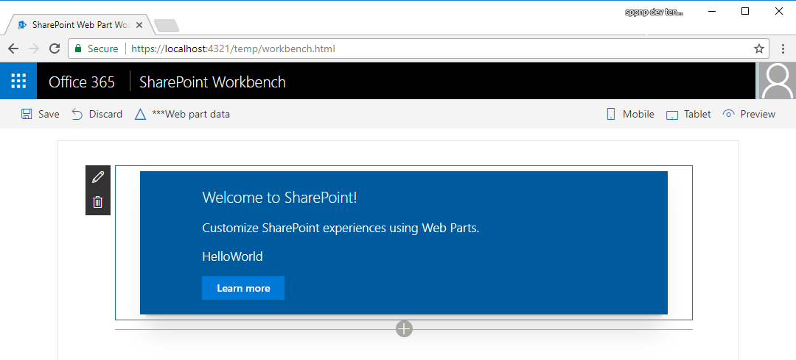

# <a name="build-your-first-sharepoint-client-side-web-part-hello-world-part-1"></a><span data-ttu-id="d8107-103">Erstellen Ihres ersten clientseitigen SharePoint-Webparts („Hello World“ Teil 1)</span><span class="sxs-lookup"><span data-stu-id="d8107-103">Build your first SharePoint client-side web part (Hello World part 1)</span></span>

<span data-ttu-id="d8107-p101">Clientseitige Webparts sind clientseitige Komponenten, die im Kontext einer SharePoint-Website ausgeführt werden. Clientseitige Webparts lassen sich auf SharePoint Online bereitstellen und auch mithilfe aktueller JavaScript-Tools und -Bibliotheken erstellen.</span><span class="sxs-lookup"><span data-stu-id="d8107-p101">Client-side web parts are client-side components that run inside the context of a SharePoint page. Client-side web parts can be deployed to SharePoint Online, and you can also use modern JavaScript tools and libraries to build them.</span></span>

<span data-ttu-id="d8107-106">Clientseitige Webparts unterstützen:</span><span class="sxs-lookup"><span data-stu-id="d8107-106">Client-side web parts support:</span></span>

* <span data-ttu-id="d8107-107">Die Erstellung mit HTML und JavaScript</span><span class="sxs-lookup"><span data-stu-id="d8107-107">Building with HTML and JavaScript.</span></span>
* <span data-ttu-id="d8107-108">SharePoint-Onlineumgebungen und lokale SharePoint-Umgebungen</span><span class="sxs-lookup"><span data-stu-id="d8107-108">Both SharePoint online and on-premises environments.</span></span>

> [!NOTE]
> <span data-ttu-id="d8107-109">Bevor Sie die Schritte in diesem Artikel durchführen, müssen Sie [Ihre Entwicklungsumgebung einrichten](../../set-up-your-development-environment.md).</span><span class="sxs-lookup"><span data-stu-id="d8107-109">Before following the steps in this article, be sure to [Set up your development environment](../../set-up-your-development-environment.md).</span></span>

<span data-ttu-id="d8107-110">Sie können die nachfolgend beschriebene Anleitung auch anhand dieses Videos in unserem [YouTube-Kanal „SharePoint Patterns & Practices“](https://www.youtube.com/watch?v=YqUIX2pMUzg&list=PLR9nK3mnD-OXvSWvS2zglCzz4iplhVrKq&index=2) nachvollziehen.</span><span class="sxs-lookup"><span data-stu-id="d8107-110">You can also follow these steps by watching this video on the [SharePoint PnP YouTube Channel](https://www.youtube.com/watch?v=YqUIX2pMUzg&list=PLR9nK3mnD-OXvSWvS2zglCzz4iplhVrKq&index=2).</span></span> 

<a href="https://www.youtube.com/watch?v=YqUIX2pMUzg&list=PLR9nK3mnD-OXvSWvS2zglCzz4iplhVrKq&index=2">

</a>


## <a name="create-a-new-web-part-project"></a><span data-ttu-id="d8107-111">Erstellen eines neuen Webpart-Projekts</span><span class="sxs-lookup"><span data-stu-id="d8107-111">Create a new web part project</span></span>

### <a name="to-create-a-new-web-part-project"></a><span data-ttu-id="d8107-112">Erstellen eines neuen Webpart-Projekts</span><span class="sxs-lookup"><span data-stu-id="d8107-112">To create a new web part project</span></span>

1. <span data-ttu-id="d8107-113">Erstellen Sie an einem Speicherort Ihrer Wahl ein neues Projektverzeichnis:</span><span class="sxs-lookup"><span data-stu-id="d8107-113">Create a new project directory in your favorite location.</span></span>
    
  ```
  md helloworld-webpart
  ```

2. <span data-ttu-id="d8107-114">Wechseln Sie in das Projektverzeichnis:</span><span class="sxs-lookup"><span data-stu-id="d8107-114">Go to the project directory.</span></span>

  ```
  cd helloworld-webpart
  ```

3. <span data-ttu-id="d8107-115">Führen Sie den Yeoman-SharePoint-Generator aus, um ein neues HelloWorld-Webpart zu erstellen:</span><span class="sxs-lookup"><span data-stu-id="d8107-115">Create a new HelloWorld web part by running the Yeoman SharePoint Generator.</span></span>

  ```
  yo @microsoft/sharepoint
  ```
    
4. <span data-ttu-id="d8107-116">Es werden verschiedene Eingabeaufforderungen angezeigt. Gehen Sie wie folgt vor:</span><span class="sxs-lookup"><span data-stu-id="d8107-116">When prompted:</span></span>

  - <span data-ttu-id="d8107-117">Akzeptieren Sie den Standardnamen **helloworld-webpart** als Lösungsnamen, und drücken Sie die EINGABETASTE.</span><span class="sxs-lookup"><span data-stu-id="d8107-117">Accept the default **helloworld-webpart** as your solution name, and then select Enter.</span></span>
  - <span data-ttu-id="d8107-118">Wählen Sie **SharePoint Online only (latest)** aus, und drücken Sie die EINGABETASTE.</span><span class="sxs-lookup"><span data-stu-id="d8107-118">Select **SharePoint Online only (latest)**, and select Enter.</span></span>
  - <span data-ttu-id="d8107-119">Wählen Sie die Option **Use the current folder** als Speicherort für die Dateien aus.</span><span class="sxs-lookup"><span data-stu-id="d8107-119">Select **Use the current folder** for where to place the files.</span></span>
  - <span data-ttu-id="d8107-120">Wählen Sie **N**, damit die Erweiterung auf jeder Website explizit installiert werden muss, wenn sie verwendet wird.</span><span class="sxs-lookup"><span data-stu-id="d8107-120">Select **N** to require the extension to be installed on each site explicitly when it's being used.</span></span> 
  - <span data-ttu-id="d8107-121">Wählen Sie **Webpart** als den zu erstellenden Typ von clientseitiger Komponente aus.</span><span class="sxs-lookup"><span data-stu-id="d8107-121">Select **WebPart** as the client-side component type to be created.</span></span> 

5. <span data-ttu-id="d8107-122">Über die nächsten Eingabeaufforderungen werden spezifische Informationen zum Webpart abgefragt:</span><span class="sxs-lookup"><span data-stu-id="d8107-122">The next set of prompts ask for specific information about your web part:</span></span>

  - <span data-ttu-id="d8107-123">Akzeptieren Sie den Standardnamen **HelloWorld** als Namen für Ihr Webpart, und drücken Sie die EINGABETASTE.</span><span class="sxs-lookup"><span data-stu-id="d8107-123">Accept the default **HelloWorld** as your web part name, and then select Enter.</span></span>
  - <span data-ttu-id="d8107-124">Akzeptieren Sie die Standardbeschreibung **HelloWorld description** als Beschreibung für Ihr Webpart, und drücken Sie die EINGABETASTE.</span><span class="sxs-lookup"><span data-stu-id="d8107-124">Accept the default **HelloWorld description** as your web part description, and then select Enter.</span></span>
  - <span data-ttu-id="d8107-125">Akzeptieren Sie die Standardeinstellung **No javaScript web framework** als das zu verwendende Framework, und drücken Sie die EINGABETASTE.</span><span class="sxs-lookup"><span data-stu-id="d8107-125">Accept the default **No javascript web framework** as the framework you would like to use, and then select Enter.</span></span>

  

<span data-ttu-id="d8107-127">An diesem Punkt installiert Yeoman die erforderlichen Abhängigkeiten und erstellt ein Gerüst für die Lösungsdateien sowie das **HelloWorld**-Webpart.</span><span class="sxs-lookup"><span data-stu-id="d8107-127">At this point, Yeoman installs the required dependencies and scaffolds the solution files along with the **HelloWorld** web part.</span></span> <span data-ttu-id="d8107-128">Das kann einige Minuten dauern.</span><span class="sxs-lookup"><span data-stu-id="d8107-128">This might take a few minutes.</span></span>

<span data-ttu-id="d8107-129">Nach Abschluss der Gerüsterstellung sollte folgende Erfolgsmeldung angezeigt werden.</span><span class="sxs-lookup"><span data-stu-id="d8107-129">When the scaffold is complete, you should see the following message indicating a successful scaffold.</span></span>



<span data-ttu-id="d8107-131">Details zur Behebung etwaiger Fehler finden Sie unter [Known issues](../../known-issues-and-common-questions.md).</span><span class="sxs-lookup"><span data-stu-id="d8107-131">For information about troubleshooting any errors, see [Known issues](../../known-issues-and-common-questions.md).</span></span>

### <a name="using-your-favorite-code-editor"></a><span data-ttu-id="d8107-132">Verwenden Ihres bevorzugten Code-Editors</span><span class="sxs-lookup"><span data-stu-id="d8107-132">Using your favorite Code Editor</span></span>
<span data-ttu-id="d8107-133">Da die clientseitige SharePoint-Lösung auf HTML/TypeScript basiert, können Sie zur Erstellung Ihres Webparts alle Code-Editoren verwenden, die clientseitige Entwicklung unterstützen, beispielsweise:</span><span class="sxs-lookup"><span data-stu-id="d8107-133">Because the SharePoint client-side solution is HTML/TypeScript based, you can use any code editor that supports client-side development to build your web part, such as:</span></span>

- [<span data-ttu-id="d8107-134">Visual Studio Code</span><span class="sxs-lookup"><span data-stu-id="d8107-134">Visual Studio Code</span></span>](https://code.visualstudio.com/)
- [<span data-ttu-id="d8107-135">Atom</span><span class="sxs-lookup"><span data-stu-id="d8107-135">Atom</span></span>](https://atom.io)
- [<span data-ttu-id="d8107-136">WebStorm</span><span class="sxs-lookup"><span data-stu-id="d8107-136">Webstorm</span></span>](https://www.jetbrains.com/webstorm)

<span data-ttu-id="d8107-137">In der SharePoint Framework-Dokumentation wird Visual Studio Code in den Anleitungen und Beispielen verwendet.</span><span class="sxs-lookup"><span data-stu-id="d8107-137">SharePoint Framework documentation uses Visual Studio code in the steps and examples.</span></span> <span data-ttu-id="d8107-138">Visual Studio Code ist ein einfacher und dennoch leistungsfähiger Quellcode-Editor von Microsoft, der auf dem Desktop ausgeführt wird und für Windows, Mac und Linux verfügbar ist.</span><span class="sxs-lookup"><span data-stu-id="d8107-138">Visual Studio Code is a lightweight but powerful source code editor from Microsoft that runs on your desktop and is available for Windows, Mac, and Linux.</span></span> <span data-ttu-id="d8107-139">Er verfügt über integrierte Unterstützung für JavaScript, TypeScript und Node.js und bietet ein reichhaltiges Ökosystem von Erweiterungen für andere Sprachen (wie C++, C#, Python, PHP) und Laufzeiten.</span><span class="sxs-lookup"><span data-stu-id="d8107-139">It comes with built-in support for JavaScript, TypeScript, and Node.js, and has a rich ecosystem of extensions for other languages (such as C++, C#, Python, PHP) and runtimes.</span></span>
   
## <a name="preview-the-web-part"></a><span data-ttu-id="d8107-140">Anzeigen einer Webpart-Vorschau</span><span class="sxs-lookup"><span data-stu-id="d8107-140">Preview the web part</span></span>

<span data-ttu-id="d8107-141">Um eine Vorschau Ihres Webparts anzuzeigen, erstellen Sie es und führen es auf einem lokalen Webserver aus.</span><span class="sxs-lookup"><span data-stu-id="d8107-141">To preview your web part, build and run it on a local web server.</span></span> <span data-ttu-id="d8107-142">Die clientseitige Toolkette verwendet standardmäßig HTTPS-Endpunkte.</span><span class="sxs-lookup"><span data-stu-id="d8107-142">The client-side toolchain uses HTTPS endpoint by default.</span></span> <span data-ttu-id="d8107-143">Da für die lokale Entwicklungsumgebung jedoch kein Standardzertifikat konfiguriert ist, meldet der Browser einen Zertifikatfehler.</span><span class="sxs-lookup"><span data-stu-id="d8107-143">However, because a default certificate is not configured for the local dev environment, your browser reports a certificate error.</span></span> <span data-ttu-id="d8107-144">Die SPFx-Toolkette enthält ein Entwicklerzertifikat, das Sie installieren und bei der Webpart-Erstellung nutzen können.</span><span class="sxs-lookup"><span data-stu-id="d8107-144">The SPFx toolchain comes with a developer certificate that you can install for building web parts.</span></span>

### <a name="to-install-the-developer-certificate-and-preview-your-web-part"></a><span data-ttu-id="d8107-145">Installieren des Entwicklerzertifikats und Anzeigen einer Vorschau des Webparts</span><span class="sxs-lookup"><span data-stu-id="d8107-145">To install the developer certificate and preview your web part</span></span>

1. <span data-ttu-id="d8107-146">Wechseln Sie zur Konsole, stellen Sie sicher, dass Sie sich noch im Verzeichnis **Helloworld-Webpart** befinden und geben Sie dann den folgenden Befehl ein:</span><span class="sxs-lookup"><span data-stu-id="d8107-146">Switch to your console, ensure that you are still in the **helloworld-webpart** directory, and then enter the following command:</span></span>

  ```
  gulp trust-dev-cert
  ```

2. <span data-ttu-id="d8107-147">Damit ist das Entwicklerzertifikat installiert. Nun geben Sie den folgenden Befehl in die Konsole ein, um das Webpart zu erstellen und die Vorschau aufzurufen:</span><span class="sxs-lookup"><span data-stu-id="d8107-147">Now that we have installed the developer certificate, enter the following command in the console to build and preview your web part:</span></span>

  ```
  gulp serve
  ```

<span data-ttu-id="d8107-148">Dieser Befehl führt eine Reihe von gulp-Tasks aus, um einen lokalen, Node-basierten HTTPS-Server unter `localhost:4321` zu erstellen und eine Vorschau des Webparts aus Ihrer lokalen Entwicklungsumgebung in Ihrem Standardbrowser anzuzeigen.</span><span class="sxs-lookup"><span data-stu-id="d8107-148">This command executes a series of gulp tasks to create a local, node-based HTTPS server on `localhost:4321` and launches your default browser to preview web parts from your local dev environment.</span></span>


<span data-ttu-id="d8107-150">Die SharePoint-Tools für clientseitige Entwicklung verwenden [gulp](http://gulpjs.com/) zur Ausführung von Tasks. Unter anderem bearbeitet gulp Buildtasks wie das:</span><span class="sxs-lookup"><span data-stu-id="d8107-150">SharePoint client-side development tools use [gulp](http://gulpjs.com/) as the task runner to handle build process tasks such as:</span></span>

- <span data-ttu-id="d8107-151">Bundling und Minimieren von JavaScript- und CSS-Dateien</span><span class="sxs-lookup"><span data-stu-id="d8107-151">Bundling and minifying JavaScript and CSS files.</span></span>
- <span data-ttu-id="d8107-152">Ausführen von Tools zum Aufrufen der Bündelungs- und Minimierungstasks vor jedem Build</span><span class="sxs-lookup"><span data-stu-id="d8107-152">Running tools to call the bundling and minification tasks before each build.</span></span>
- <span data-ttu-id="d8107-153">Kompilieren von SASS-Dateien in CSS</span><span class="sxs-lookup"><span data-stu-id="d8107-153">Compiling SASS files to CSS.</span></span>
- <span data-ttu-id="d8107-154">Kompilieren von TypeScript-Dateien in JavaScript</span><span class="sxs-lookup"><span data-stu-id="d8107-154">Compiling TypeScript files to JavaScript.</span></span>

<span data-ttu-id="d8107-155">Visual Studio Code bietet integrierte Unterstützung für gulp und andere Tools zur Taskausführung.</span><span class="sxs-lookup"><span data-stu-id="d8107-155">Visual Studio Code provides built-in support for gulp and other task runners.</span></span> <span data-ttu-id="d8107-156">Wählen Sie STRG + UMSCHALT + B unter Windows oder BEFEHL + UMSCHALT + B auf dem Mac, um Ihr Webpart zu debuggen und eine Vorschau anzuzeigen.</span><span class="sxs-lookup"><span data-stu-id="d8107-156">Select Ctrl+Shift+B on Windows or Cmd+Shift+B on Mac to debug and preview your web part.</span></span> 

<span data-ttu-id="d8107-157">SharePoint Workbench ist eine Designoberfläche für Entwickler, mit der Sie schnell Webpart-Tests durchführen und eine Webpart-Vorschau anzeigen können, und zwar ohne die Webparts in SharePoint bereitstellen zu müssen.</span><span class="sxs-lookup"><span data-stu-id="d8107-157">SharePoint Workbench is a developer design surface that enables you to quickly preview and test web parts without deploying them in SharePoint.</span></span> <span data-ttu-id="d8107-158">SharePoint Workbench enthält die clientseitige Seite und das clientseitige Canvas. Hier können Sie Webparts während der Entwicklung hinzufügen, löschen und testen.</span><span class="sxs-lookup"><span data-stu-id="d8107-158">SharePoint Workbench includes the client-side page and the client-side canvas in which you can add, delete, and test your web parts in development.</span></span>


### <a name="to-use-sharepoint-workbench-to-preview-and-test-your-web-part"></a><span data-ttu-id="d8107-160">Verwenden von SharePoint Workbench zum Anzeigen einer Vorschau und Testen des Webparts</span><span class="sxs-lookup"><span data-stu-id="d8107-160">To use SharePoint Workbench to preview and test your web part</span></span>

1. <span data-ttu-id="d8107-161">Wählen Sie das **Hinzufügen**-Symbol, um das HelloWorld-Webpart hinzuzufügen.</span><span class="sxs-lookup"><span data-stu-id="d8107-161">To add the HelloWorld web part, select the **add** icon.</span></span> <span data-ttu-id="d8107-162">Die Toolbox wird geöffnet. Hier sehen Sie eine Liste aller Webparts, die Sie hinzufügen können.</span><span class="sxs-lookup"><span data-stu-id="d8107-162">This opens the toolbox where you can see a list of web parts available for you to add.</span></span> <span data-ttu-id="d8107-163">In dieser Liste werden das **HelloWorld**-Webpart sowie andere Webparts aufgeführt, die lokal in Ihrer Entwicklungsumgebung verfügbar sind.</span><span class="sxs-lookup"><span data-stu-id="d8107-163">The list includes the **HelloWorld** web part as well other web parts available locally in your development environment.</span></span>
   
  
   
2. <span data-ttu-id="d8107-165">Wählen Sie **HelloWorld** aus, um das Webpart zur Seite hinzuzufügen:</span><span class="sxs-lookup"><span data-stu-id="d8107-165">Select **HelloWorld** to add the web part to the page.</span></span>
   
  

  <span data-ttu-id="d8107-p108">Ausgezeichnet! Sie haben Ihr erstes clientseitiges Webpart zu einer clientseitigen Seite hinzugefügt.</span><span class="sxs-lookup"><span data-stu-id="d8107-p108">Congratulations! You have just added your first client-side web part to a client-side page.</span></span>
   
3. <span data-ttu-id="d8107-169">Wählen Sie das Stiftsymbol links oben neben dem Webpart, um den Eigenschaftenbereich des Webparts anzuzeigen.</span><span class="sxs-lookup"><span data-stu-id="d8107-169">Select the pencil icon on the far left of the web part to reveal the web part property pane.</span></span>
   
  

  <span data-ttu-id="d8107-p109">Im Eigenschaftenbereich können Sie Eigenschaften definieren und so Ihr Webpart anpassen. Der Bereich wird clientseitig gesteuert und ermöglicht SharePoint-übergreifend ein konsistentes Design.</span><span class="sxs-lookup"><span data-stu-id="d8107-p109">The property pane is where you can define properties to customize your web part. The property pane is client-side driven and provides a consistent design across SharePoint.</span></span>
   
4. <span data-ttu-id="d8107-173">Ändern Sie den Text im Textfeld **Description** in **Clientseitige Webparts sind klasse!**.</span><span class="sxs-lookup"><span data-stu-id="d8107-173">Modify the text in the **Description** text box to **Client-side web parts are awesome!**</span></span>

  <span data-ttu-id="d8107-174">Noch während Sie tippen, verändert sich der Text im Webpart.</span><span class="sxs-lookup"><span data-stu-id="d8107-174">Notice how the text in the web part also changes as you type.</span></span> 

<span data-ttu-id="d8107-175">Eine der neuen Funktionen für den Eigenschaftenbereich betrifft das Aktualisierungsverhalten. Es lässt sich jetzt entweder als „reactive“ oder als „non-reactive“ konfigurieren.</span><span class="sxs-lookup"><span data-stu-id="d8107-175">One of the new capabilities available to the property pane is to configure its update behavior, which can be set to reactive or non-reactive.</span></span> <span data-ttu-id="d8107-176">Standardmäßig ist das Aktualisierungsverhalten auf „reactive“ gesetzt. Änderungen können Sie dann bereits während der Bearbeitung der Eigenschaften sehen.</span><span class="sxs-lookup"><span data-stu-id="d8107-176">By default, the update behavior is reactive and enables you to see the changes as you edit the properties.</span></span> <span data-ttu-id="d8107-177">Wenn das Verhalten auf „reactive“ gesetzt ist, werden Änderungen sofort gespeichert.</span><span class="sxs-lookup"><span data-stu-id="d8107-177">The changes are saved instantly when the behavior is reactive.</span></span>  

## <a name="web-part-project-structure"></a><span data-ttu-id="d8107-178">Webpart-Projektstruktur</span><span class="sxs-lookup"><span data-stu-id="d8107-178">Web part project structure</span></span>

### <a name="to-use-visual-studio-code-to-explore-the-web-part-project-structure"></a><span data-ttu-id="d8107-179">Anzeigen der Webpart-Projektstruktur in Visual Studio Code</span><span class="sxs-lookup"><span data-stu-id="d8107-179">To use Visual Studio Code to explore the web part project structure</span></span> 

1. <span data-ttu-id="d8107-180">Unterbrechen Sie in der Konsole die Verarbeitung durch Wählen von STRG + C (unter Windows).</span><span class="sxs-lookup"><span data-stu-id="d8107-180">In the console, break the processing by selecting Ctrl+C (in Windows).</span></span>

2. <span data-ttu-id="d8107-181">Geben Sie folgenden Befehl ein, um das Webpart-Projekt in Visual Studio Code (oder einem Editor Ihrer Wahl) zu öffnen:</span><span class="sxs-lookup"><span data-stu-id="d8107-181">Enter the following command to open the web part project in Visual Studio Code (or use your favorite editor):</span></span>

  ```
  code .
  ```

  

<span data-ttu-id="d8107-183">Falls ein Fehler gemeldet wird, müssen Sie eventuell [den Codebefehl in PATH installieren](https://code.visualstudio.com/docs/editor/setup).</span><span class="sxs-lookup"><span data-stu-id="d8107-183">If you get an error, you might need to [install the code command in PATH](https://code.visualstudio.com/docs/editor/setup).</span></span>

<span data-ttu-id="d8107-p111">TypeScript ist die primäre Sprache zur Erstellung von clientseitigen SharePoint-Webparts. Bei TypeScript handelt es sich um eine typisierte Obersprache zu JavaScript, die in einfaches JavaScript kompiliert. SharePoint-Tools für die clientseitige Entwicklung werden auf Basis von TypeScript-Klassen, -Modulen und -Schnittstellen erstellt. Das hilft Entwicklern, stabile clientseitige Webparts zu erstellen.</span><span class="sxs-lookup"><span data-stu-id="d8107-p111">TypeScript is the primary language for building SharePoint client-side web parts. TypeScript is a typed superset of JavaScript that compiles to plain JavaScript. SharePoint client-side development tools are built using TypeScript classes, modules, and interfaces to help developers build robust client-side web parts.</span></span> 

<span data-ttu-id="d8107-187">Nachfolgend beschreiben wir einige der wichtigsten Dateien eines Projekts.</span><span class="sxs-lookup"><span data-stu-id="d8107-187">The following are some key files in the project.</span></span>

### <a name="web-part-class"></a><span data-ttu-id="d8107-188">Webpart-Klasse</span><span class="sxs-lookup"><span data-stu-id="d8107-188">Web part class</span></span>

<span data-ttu-id="d8107-189">**HelloWorldWebPart.ts** in **src\webparts\helloworld** definiert den Haupteinstiegspunkt des Webparts.</span><span class="sxs-lookup"><span data-stu-id="d8107-189">**HelloWorldWebPart.ts** in the **src\webparts\helloworld** folder defines the main entry point for the web part.</span></span> <span data-ttu-id="d8107-190">Die Webpart-Klasse **HelloWorldWebPart** erweitert die Klasse **BaseClientSideWebPart**.</span><span class="sxs-lookup"><span data-stu-id="d8107-190">The web part class **HelloWorldWebPart** extends the **BaseClientSideWebPart**.</span></span> <span data-ttu-id="d8107-191">Jedes clientseitige Webpart muss die Klasse **BaseClientSideWebPart** erweitern, damit es als gültiges Webpart definiert wird.</span><span class="sxs-lookup"><span data-stu-id="d8107-191">Any client-side web part should extend the **BaseClientSideWebPart** class to be defined as a valid web part.</span></span>

<span data-ttu-id="d8107-192">**BaseClientSideWebPart** implementiert das Minimum an Funktionen, das für die Erstellung eines Webparts erforderlich ist.</span><span class="sxs-lookup"><span data-stu-id="d8107-192">**BaseClientSideWebPart** implements the minimal functionality that is required to build a web part.</span></span> <span data-ttu-id="d8107-193">Daneben bietet diese Klasse auch viele Parameter für die Überprüfung von und den Zugriff auf schreibgeschützte Eigenschaften wie **displayMode**, Webpart-Eigenschaften, Webpart-Kontext, die Webpart-**instanceId**, das Webpart-**domElement** und vieles mehr.</span><span class="sxs-lookup"><span data-stu-id="d8107-193">This class also provides many parameters to validate and access read-only properties such as **displayMode**, web part properties, web part context, web part **instanceId**, the web part **domElement**, and much more.</span></span>

<span data-ttu-id="d8107-194">Die Webpart-Klasse ist dabei so definiert, dass sie den Eigenschaftentyp **IHelloWorldWebPartProps** akzeptiert.</span><span class="sxs-lookup"><span data-stu-id="d8107-194">Notice that the web part class is defined to accept a property type **IHelloWorldWebPartProps**.</span></span>

<span data-ttu-id="d8107-195">Der Eigenschaftentyp ist als Schnittstelle vor der **HelloWorldWebPart**-Klasse in der Datei **HelloWorldWebPart.ts** definiert.</span><span class="sxs-lookup"><span data-stu-id="d8107-195">The property type is defined as an interface before the **HelloWorldWebPart** class in the **HelloWorldWebPart.ts** file.</span></span>

```typescript
export interface IHelloWorldWebPartProps {
    description: string;
}
```

<span data-ttu-id="d8107-196">Anhand dieser Eigenschaftendefinition definieren Sie benutzerdefinierte Eigenschaftentypen für Ihr Webpart. Dazu mehr weiter unten im Abschnitt zum Eigenschaftenbereich.</span><span class="sxs-lookup"><span data-stu-id="d8107-196">This property definition is used to define custom property types for your web part, which is described in the property pane section later.</span></span> 

#### <a name="web-part-render-method"></a><span data-ttu-id="d8107-197">Webpart-Rendermethode</span><span class="sxs-lookup"><span data-stu-id="d8107-197">Web part render method</span></span>
<span data-ttu-id="d8107-p114">Das DOM-Element, in dem das Webpart gerendert werden soll, wird in der Methode **render** spezifiziert. Mithilfe dieser Methode wird das Webpart in dem angegebenen DOM-Element gerendert. Im Webpart **HelloWorld** ist als DOM-Element ein DIV festgelegt. Zu den Parametern der Methode gehören der Anzeigemodus (entweder „Read“ oder „Edit“) sowie etwaige konfigurierte Webpart-Eigenschaften:</span><span class="sxs-lookup"><span data-stu-id="d8107-p114">The DOM element where the web part should be rendered is available in the **render** method. This method is used to render the web part inside that DOM element. In the **HelloWorld** web part, the DOM element is set to a DIV. The method parameters include the display mode (either Read or Edit) and the configured web part properties if any:</span></span> 

```typescript
  public render(): void {
    this.domElement.innerHTML = `
      <div class="${ styles.helloWorld }">
        <div class="${ styles.container }">
          <div class="${ styles.row }">
            <div class="${ styles.column }">
              <span class="${ styles.title }">Welcome to SharePoint!</span>
              <p class="${ styles.subTitle }">Customize SharePoint experiences using Web Parts.</p>
              <p class="${ styles.description }">${escape(this.properties.description)}</p>
              <a href="https://aka.ms/spfx" class="${ styles.button }">
                <span class="${ styles.label }">Learn more</span>
              </a>
            </div>
          </div>
        </div>
      </div>`;
  }
```

<span data-ttu-id="d8107-202">Das Modell ist flexibel: Webparts können in jedem JavaScript-Framework erstellt und dann in das DOM-Element geladen werden.</span><span class="sxs-lookup"><span data-stu-id="d8107-202">This model is flexible enough so that web parts can be built in any JavaScript framework and loaded into the DOM element.</span></span> 

#### <a name="configure-the-web-part-property-pane"></a><span data-ttu-id="d8107-203">Konfigurieren des Webpart-Eigenschaftenbereichs</span><span class="sxs-lookup"><span data-stu-id="d8107-203">Configure the Web part property pane</span></span>

<span data-ttu-id="d8107-p115">Der Eigenschaftenbereich wird in der Klasse **HelloWorldWebPart** definiert, und zwar in der Eigenschaft **propertyPaneSettings**.</span><span class="sxs-lookup"><span data-stu-id="d8107-p115">The property pane is defined in the **HelloWorldWebPart** class. The **propertyPaneSettings** property is where you need to define the property pane.</span></span>

<span data-ttu-id="d8107-206">Sobald Sie die gewünschten Eigenschaften definiert haben, können Sie sie per `this.properties.<property-value>` im Webpart aufrufen. Hier ein Beispiel dafür in der Methode **render**:</span><span class="sxs-lookup"><span data-stu-id="d8107-206">When the properties are defined, you can access them in your web part by using `this.properties.<property-value>`, as shown in the **render** method:</span></span>

```typescript
<p class="${styles.description}">${escape(this.properties.description)}</p>
```

<span data-ttu-id="d8107-207">Beachten Sie, dass wir dem Wert der Eigenschaft ein HTML-Escapezeichen hinzufügen, damit die Zeichenfolge gültig ist.</span><span class="sxs-lookup"><span data-stu-id="d8107-207">Notice that we are performing an HTML escape on the property's value to ensure a valid string.</span></span> <span data-ttu-id="d8107-208">Im Artikel [Machen Sie Ihr clientseitiges SharePoint-Webpart konfigurierbar](../basics/integrate-with-property-pane.md) erfahren Sie mehr über die Arbeit mit dem Eigenschaftenbereich sowie die verschiedenen Feldtypen im Eigenschaftbereich.</span><span class="sxs-lookup"><span data-stu-id="d8107-208">To learn more about how to work with the property pane and property pane field types, see [Make your SharePoint client-side web part configurable](../basics/integrate-with-property-pane.md).</span></span> 

<span data-ttu-id="d8107-209">Fügen wir nun einige weitere Eigenschaften zum Eigenschaftenbereich hinzu: ein Kontrollkästchen, eine Dropdownliste und eine Umschaltfläche.</span><span class="sxs-lookup"><span data-stu-id="d8107-209">Let's now add a few more properties to the property pane: a check box, a drop-down list, and a toggle.</span></span> <span data-ttu-id="d8107-210">Zunächst importieren wir die jeweiligen Felder des Eigenschaftenbereichs aus dem Framework.</span><span class="sxs-lookup"><span data-stu-id="d8107-210">We first start by importing the respective property pane fields from the framework.</span></span>

1. <span data-ttu-id="d8107-211">Scrollen Sie zum Anfang der Datei, und tragen Sie Folgendes in den Abschnitt für den Import aus `@microsoft/sp-webpart-base` ein:</span><span class="sxs-lookup"><span data-stu-id="d8107-211">Scroll to the top of the file and add the following to the import section from `@microsoft/sp-webpart-base`:</span></span>

  ```typescript
  PropertyPaneCheckbox,
  PropertyPaneDropdown,
  PropertyPaneToggle
  ```

  <span data-ttu-id="d8107-212">Der vollständige Importabschnitt sieht dann wie folgt aus:</span><span class="sxs-lookup"><span data-stu-id="d8107-212">The complete import section looks like the following:</span></span>

  ```typescript
  import {
    BaseClientSideWebPart,
    IPropertyPaneConfiguration,
    PropertyPaneTextField,
    PropertyPaneCheckbox,
    PropertyPaneDropdown,
    PropertyPaneToggle
  } from '@microsoft/sp-webpart-base';
  ```

2. <span data-ttu-id="d8107-213">Aktualisieren Sie die Webparteigenschaften um die neuen Eigenschaften.</span><span class="sxs-lookup"><span data-stu-id="d8107-213">Update the web part properties to include the new properties.</span></span> <span data-ttu-id="d8107-214">Dadurch werden die Felder typisierten Objekten zugeordnet.</span><span class="sxs-lookup"><span data-stu-id="d8107-214">This maps the fields to typed objects.</span></span>

3. <span data-ttu-id="d8107-215">Ersetzen Sie die **IHelloWorldWebPartProps**-Schnittstelle mit dem folgenden Code.</span><span class="sxs-lookup"><span data-stu-id="d8107-215">Replace the **IHelloWorldWebPartProps** interface with the following code.</span></span>

  ```typescript
  export interface IHelloWorldWebPartProps {
      description: string;
      test: string;
      test1: boolean;
      test2: string;
      test3: boolean;
  }
  ```

4. <span data-ttu-id="d8107-216">Speichern Sie die Datei.</span><span class="sxs-lookup"><span data-stu-id="d8107-216">Save the file.</span></span>

5. <span data-ttu-id="d8107-217">Ersetzen Sie die Methode **getPropertyPaneConfiguration** durch den folgenden Code, der die neuen Felder des Eigenschaftenbereichs hinzufügt und den jeweiligen typisierten Objekten zuordnet.</span><span class="sxs-lookup"><span data-stu-id="d8107-217">Replace the **getPropertyPaneConfiguration** method with the following code, which adds the new property pane fields and maps them to their respective typed objects.</span></span>

  ```typescript
  protected getPropertyPaneConfiguration(): IPropertyPaneConfiguration {
    return {
      pages: [
        {
          header: {
            description: strings.PropertyPaneDescription
          },
          groups: [
            {
              groupName: strings.BasicGroupName,
              groupFields: [
              PropertyPaneTextField('description', {
                label: 'Description'
              }),
              PropertyPaneTextField('test', {
                label: 'Multi-line Text Field',
                multiline: true
              }),
              PropertyPaneCheckbox('test1', {
                text: 'Checkbox'
              }),
              PropertyPaneDropdown('test2', {
                label: 'Dropdown',
                options: [
                  { key: '1', text: 'One' },
                  { key: '2', text: 'Two' },
                  { key: '3', text: 'Three' },
                  { key: '4', text: 'Four' }
                ]}),
              PropertyPaneToggle('test3', {
                label: 'Toggle',
                onText: 'On',
                offText: 'Off'
              })
            ]
            }
          ]
        }
      ]
    };
  }
  ```

6. <span data-ttu-id="d8107-218">Nachdem Sie die Eigenschaften zu den Webpart-Eigenschaften hinzugefügt haben, können Sie nun genauso auf sie zugreifen, wie Sie zuvor auf die **description**-Eigenschaft zugegriffen haben:</span><span class="sxs-lookup"><span data-stu-id="d8107-218">After you add your properties to the web part properties, you can now access the properties in the same way you accessed the **description** property earlier:</span></span>

  ```typescript
  <p class="${ styles.description }">${escape(this.properties.test)}</p>
  ```

  <span data-ttu-id="d8107-219">Zur Festlegung des Standardwerts für die Eigenschaften müssen Sie den Eigenschaftenbehälter **properties** im Webpart-Manifest aktualisieren:</span><span class="sxs-lookup"><span data-stu-id="d8107-219">To set the default value for the properties, you need to update the web part manifest's **properties** property bag.</span></span>

7. <span data-ttu-id="d8107-220">Öffnen Sie `HelloWorldWebPart.manifest.json`, und ändern Sie `properties` wie folgt:</span><span class="sxs-lookup"><span data-stu-id="d8107-220">Open `HelloWorldWebPart.manifest.json` and modify the `properties` to:</span></span>

  ```typescript
  "properties": {
    "description": "HelloWorld",
    "test": "Multi-line text field",
    "test1": true,
    "test2": "2",
    "test3": true
  }
  ```

<span data-ttu-id="d8107-221">Der Webpart-Eigenschaftenbereich weist jetzt diese Standardwerte für die betreffenden Eigenschaften auf.</span><span class="sxs-lookup"><span data-stu-id="d8107-221">The web part property pane now has these default values for those properties.</span></span>

### <a name="web-part-manifest"></a><span data-ttu-id="d8107-222">Webpart-Manifest</span><span class="sxs-lookup"><span data-stu-id="d8107-222">Web part manifest</span></span>

<span data-ttu-id="d8107-223">Die Datei **HelloWorldWebPart.manifest.json** definiert die Webpart-Metadaten, beispielsweise die Version, die ID, den Anzeigenamen, das Symbol und die Beschreibung.</span><span class="sxs-lookup"><span data-stu-id="d8107-223">The **HelloWorldWebPart.manifest.json** file defines the web part metadata such as version, id, display name, icon, and description.</span></span> <span data-ttu-id="d8107-224">Jedes Webpart muss ein solches Manifest enthalten.</span><span class="sxs-lookup"><span data-stu-id="d8107-224">Every web part must contain this manifest.</span></span>

```json
{
  "$schema": "https://dev.office.com/json-schemas/spfx/client-side-web-part-manifest.schema.json",
  "id": "7d5437ee-afc2-4e66-914b-80be5ace4056",
  "alias": "HelloWorldWebPart",
  "componentType": "WebPart",

  // The "*" signifies that the version should be taken from the package.json
  "version": "*",
  "manifestVersion": 2,

  // If true, the component can only be installed on sites where Custom Script is allowed.
  // Components that allow authors to embed arbitrary script code should set this to true.
  // https://support.office.com/en-us/article/Turn-scripting-capabilities-on-or-off-1f2c515f-5d7e-448a-9fd7-835da935584f
  "requiresCustomScript": false,

  "preconfiguredEntries": [{
    "groupId": "5c03119e-3074-46fd-976b-c60198311f70", // Other
    "group": { "default": "Other" },
    "title": { "default": "HelloWorld" },
    "description": { "default": "HelloWorld description" },
    "officeFabricIconFontName": "Page",
    "properties": {
      "description": "HelloWorld",
      "test": "Multi-line text field",
      "test1": true,
      "test2": "2",
      "test3": true
    }
  }]
}

```

<br/>

<span data-ttu-id="d8107-225">Da wir nun neue Eigenschaften eingeführt haben, müssen Sie sicherstellen, dass Sie das Webpart wieder aus der lokalen Entwicklungsumgebung hosten, indem Sie den folgenden Befehl ausführen.</span><span class="sxs-lookup"><span data-stu-id="d8107-225">Now that we have introduced new properties, ensure that you are again hosting the web part from the local development environment by executing the following command.</span></span> <span data-ttu-id="d8107-226">Dadurch wird auch sichergestellt, dass die vorherigen Änderungen ordnungsgemäß angewendet wurden.</span><span class="sxs-lookup"><span data-stu-id="d8107-226">This also ensures that the previous changes were correctly applied.</span></span>

```
gulp serve
```

### <a name="preview-the-web-part-in-sharepoint"></a><span data-ttu-id="d8107-227">Anzeigen der Webpart-Vorschau in SharePoint</span><span class="sxs-lookup"><span data-stu-id="d8107-227">Preview the web part in SharePoint</span></span>

<span data-ttu-id="d8107-228">SharePoint Workbench lässt sich auch in SharePoint hosten, um während der Entwicklung lokaler Webparts eine Webpart-Vorschau anzuzeigen und Tests durchzuführen.</span><span class="sxs-lookup"><span data-stu-id="d8107-228">SharePoint Workbench is also hosted in SharePoint to preview and test your local web parts in development.</span></span> <span data-ttu-id="d8107-229">Der entscheidende Vorteil: Sie führen Ihr Webpart dann im SharePoint-Kontext aus und können mit SharePoint-Daten interagieren.</span><span class="sxs-lookup"><span data-stu-id="d8107-229">The key advantage is that now you are running in SharePoint context and you are able to interact with SharePoint data.</span></span>

1. <span data-ttu-id="d8107-230">Navigieren Sie zur folgenden URL: `https://your-sharepoint-tenant.sharepoint.com/_layouts/workbench.aspx`</span><span class="sxs-lookup"><span data-stu-id="d8107-230">Go to the following URL: `https://your-sharepoint-tenant.sharepoint.com/_layouts/workbench.aspx`</span></span>

  > [!NOTE]
  > <span data-ttu-id="d8107-231">Wenn Sie das SPFx-Entwicklerzertifikat noch nicht installiert haben, meldet Workbench, dass das Laden von Skripts von „localhost“ nicht konfiguriert ist.</span><span class="sxs-lookup"><span data-stu-id="d8107-231">If you do not have the SPFx developer certificate installed, Workbench notifies you that it is configured not to load scripts from localhost.</span></span> <span data-ttu-id="d8107-232">Beenden Sie den Prozess, der derzeit im Konsolenfenster ausgeführt wird, führen Sie den Befehl `gulp trust-dev-cert` im Projektverzeichnis aus, um das Entwicklerzertifikat zu installieren, und führen Sie dann den Befehl `gulp serve` erneut aus.</span><span class="sxs-lookup"><span data-stu-id="d8107-232">Stop the currently running process in the console window, and execute the `gulp trust-dev-cert` command in your project directory console to install the developer certificate before running the `gulp serve`command again.</span></span>

  

2. <span data-ttu-id="d8107-234">In SharePoint Workbench wird jetzt die Navigationsleiste der Office 365 Suite angezeigt.</span><span class="sxs-lookup"><span data-stu-id="d8107-234">Notice that the SharePoint Workbench now has the Office 365 Suite navigation bar.</span></span> 

3. <span data-ttu-id="d8107-235">Wählen Sie im Canvas das **Symbol zum Hinzufügen**, um die Toolbox aufzurufen.</span><span class="sxs-lookup"><span data-stu-id="d8107-235">Select the **add** icon in the canvas to reveal the toolbox.</span></span> <span data-ttu-id="d8107-236">In der Toolbox finden Sie jetzt die Webparts, die auf der Website verfügbar sind, auf der SharePoint Workbench gehostet wird, sowie **HelloWorldWebPart**.</span><span class="sxs-lookup"><span data-stu-id="d8107-236">The toolbox now shows the web parts available on the site where the SharePoint Workbench is hosted along with your **HelloWorldWebPart**.</span></span>

  

4. <span data-ttu-id="d8107-238">Fügen Sie **HelloWorld** aus der Toolbox hinzu.</span><span class="sxs-lookup"><span data-stu-id="d8107-238">Add **HelloWorld** from the toolbox.</span></span> <span data-ttu-id="d8107-239">Das Webpart wird jetzt auf einer in SharePoint gehosteten Website ausgeführt.</span><span class="sxs-lookup"><span data-stu-id="d8107-239">Now you're running your web part in a page hosted in SharePoint!</span></span>

  

> [!NOTE]
> <span data-ttu-id="d8107-241">Die Farbe des Webparts hängt von den Farben der Website ab.</span><span class="sxs-lookup"><span data-stu-id="d8107-241">The color of the web part depends on the colors of the site.</span></span> <span data-ttu-id="d8107-242">Standardmäßig erben Webparts die grundlegenden Farben von der Website, indem dynamisch auf die auf der Website verwendeten Office-UI-Fabric Core-Formatvorlagen verwiesen wird, auf der das Webpart gehostet wird.</span><span class="sxs-lookup"><span data-stu-id="d8107-242">By default, web parts inherit the core colors from the site by dynamically referencing Office UI Fabric Core styles used in the site where the web part is hosted.</span></span>

<span data-ttu-id="d8107-243">Da die Entwicklung und die Tests Ihres Webparts noch nicht abgeschlossen sind, müssen Sie es weder packen noch auf SharePoint bereitstellen.</span><span class="sxs-lookup"><span data-stu-id="d8107-243">Because you are still developing and testing your web part, there is no need to package and deploy your web part to SharePoint.</span></span> 

## <a name="next-steps"></a><span data-ttu-id="d8107-244">Nächste Schritte</span><span class="sxs-lookup"><span data-stu-id="d8107-244">Next steps</span></span>

<span data-ttu-id="d8107-245">Herzlichen Glückwunsch! Ihr erstes HelloWorld-Webpart läuft.</span><span class="sxs-lookup"><span data-stu-id="d8107-245">Congratulations on getting your first Hello World web part running!</span></span> 

<span data-ttu-id="d8107-246">Jetzt können Sie das HelloWorld-Webpart weiter ausbauen. Wie das funktioniert, erfahren Sie im nächsten Artikel [Verbinden des Webparts mit SharePoint](./connect-to-sharepoint.md).</span><span class="sxs-lookup"><span data-stu-id="d8107-246">Now that your web part is running, you can continue building out your Hello World web part in the next topic, [Connect your web part to SharePoint](./connect-to-sharepoint.md).</span></span> <span data-ttu-id="d8107-247">Dort verwenden Sie dasselbe HelloWorld-Webpart-Projekt und ergänzen es um eine Funktion zur Interaktion mit REST-APIs für SharePoint-Listen.</span><span class="sxs-lookup"><span data-stu-id="d8107-247">You will use the same Hello World web part project and add the ability to interact with SharePoint List REST APIs.</span></span> <span data-ttu-id="d8107-248">Ihnen wird bereits aufgefallen sein, dass der Befehl `gulp serve` immer noch im Konsolenfenster ausgeführt wird (oder in Visual Studio Code, falls Sie den Editor verwenden).</span><span class="sxs-lookup"><span data-stu-id="d8107-248">Notice that the `gulp serve` command is still running in your console window (or in Visual Studio Code if you are using that as editor).</span></span> <span data-ttu-id="d8107-249">Sie können ihn einfach weiterlaufen lassen und zum nächsten Artikel wechseln.</span><span class="sxs-lookup"><span data-stu-id="d8107-249">You can continue to let it run while you go to the next article.</span></span>

> [!NOTE]
> <span data-ttu-id="d8107-250">Wenn Sie einen Fehler in der Dokumentation oder im SharePoint-Framework finden, melden Sie ihn bitte an das SharePoint Engineering unter Verwendung der [Fehlerliste im sp-dev-docs-Repository](https://github.com/SharePoint/sp-dev-docs/issues).</span><span class="sxs-lookup"><span data-stu-id="d8107-250">If you find an issue in the documentation or in the SharePoint Framework, please report that to SharePoint engineering by using the [issue list at the sp-dev-docs repository](https://github.com/SharePoint/sp-dev-docs/issues).</span></span> <span data-ttu-id="d8107-251">Vielen Dank im Voraus für Ihr Feedback.</span><span class="sxs-lookup"><span data-stu-id="d8107-251">Thanks for your input in advance.</span></span>