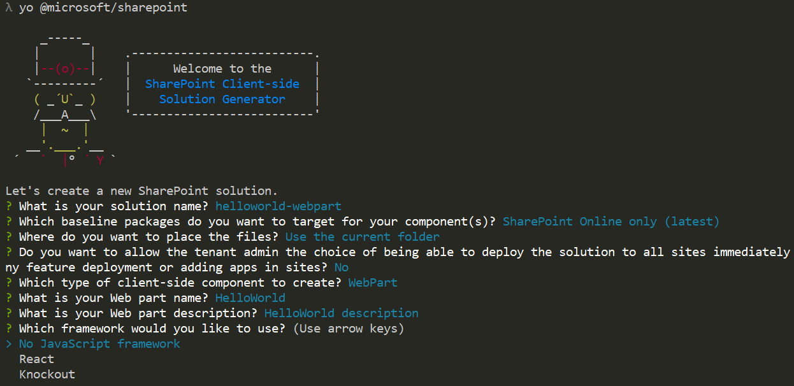
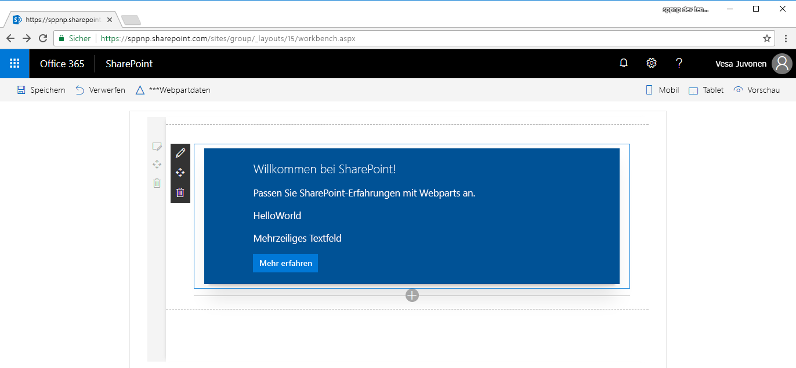

# <a name="build-your-first-sharepoint-client-side-web-part-hello-world-part-1"></a><span data-ttu-id="8fba4-102">Erstellen Ihres ersten clientseitigen SharePoint-Webparts („Hello World“ Teil 1)</span><span class="sxs-lookup"><span data-stu-id="8fba4-102">Build your first SharePoint client-side web part (Hello World part 1)</span></span>

<span data-ttu-id="8fba4-p101">Clientseitige Webparts sind clientseitige Komponenten, die im Kontext einer SharePoint-Website ausgeführt werden. Clientseitige Webparts lassen sich auf SharePoint Online bereitstellen und auch mithilfe aktueller JavaScript-Tools und -Bibliotheken erstellen.</span><span class="sxs-lookup"><span data-stu-id="8fba4-p101">Client-side web parts are client-side components that run inside the context of a SharePoint page. Client-side web parts can be deployed to SharePoint Online, and you can also use modern JavaScript tools and libraries to build them.</span></span>

<span data-ttu-id="8fba4-105">Clientseitige Webparts unterstützen:</span><span class="sxs-lookup"><span data-stu-id="8fba4-105">Client-side web parts support:</span></span>

* <span data-ttu-id="8fba4-106">Die Erstellung mit HTML und JavaScript</span><span class="sxs-lookup"><span data-stu-id="8fba4-106">Building with HTML and JavaScript.</span></span>
* <span data-ttu-id="8fba4-107">SharePoint-Onlineumgebungen und lokale SharePoint-Umgebungen</span><span class="sxs-lookup"><span data-stu-id="8fba4-107">Both SharePoint online and on-premises environments.</span></span>

> [!NOTE]
> <span data-ttu-id="8fba4-108">Bevor Sie die Schritte in diesem Artikel durchführen, müssen Sie [Ihre Entwicklungsumgebung einrichten](../../set-up-your-development-environment.md).</span><span class="sxs-lookup"><span data-stu-id="8fba4-108">Before following the steps in this article, be sure to [Set up your development environment](../../set-up-your-development-environment.md).</span></span>

<span data-ttu-id="8fba4-109">Sie können die nachfolgend beschriebene Anleitung auch anhand dieses Videos in unserem [YouTube-Kanal „SharePoint Patterns & Practices“](https://www.youtube.com/watch?v=YqUIX2pMUzg&list=PLR9nK3mnD-OXvSWvS2zglCzz4iplhVrKq&index=2) nachvollziehen:</span><span class="sxs-lookup"><span data-stu-id="8fba4-109">You can also follow these steps by watching the video on the [SharePoint PnP YouTube Channel](https://www.youtube.com/watch?v=YqUIX2pMUzg&list=PLR9nK3mnD-OXvSWvS2zglCzz4iplhVrKq&index=2).</span></span> 

<a href="https://www.youtube.com/watch?v=YqUIX2pMUzg&list=PLR9nK3mnD-OXvSWvS2zglCzz4iplhVrKq&index=2">

</a>


## <a name="create-a-new-web-part-project"></a><span data-ttu-id="8fba4-110">Erstellen eines neuen Webpart-Projekts</span><span class="sxs-lookup"><span data-stu-id="8fba4-110">Create a new web part project</span></span>
<span data-ttu-id="8fba4-111">Erstellen Sie an einem Speicherort Ihrer Wahl ein neues Projektverzeichnis:</span><span class="sxs-lookup"><span data-stu-id="8fba4-111">Create a new project directory in your favorite location.</span></span>
    
```
md helloworld-webpart
```

<span data-ttu-id="8fba4-112">Wechseln Sie in das Projektverzeichnis:</span><span class="sxs-lookup"><span data-stu-id="8fba4-112">Go to the project directory.</span></span>

```
cd helloworld-webpart
```

<span data-ttu-id="8fba4-113">Führen Sie den Yeoman-SharePoint-Generator aus, um ein neues HelloWorld-Webpart zu erstellen:</span><span class="sxs-lookup"><span data-stu-id="8fba4-113">Create a new HelloWorld web part by running the Yeoman SharePoint Generator.</span></span>

```
yo @microsoft/sharepoint
```
    
<span data-ttu-id="8fba4-114">Es werden verschiedene Eingabeaufforderungen angezeigt. Gehen Sie wie folgt vor:</span><span class="sxs-lookup"><span data-stu-id="8fba4-114">When prompted:</span></span>

* <span data-ttu-id="8fba4-115">Akzeptieren Sie den Standardnamen **helloworld-webpart** als Lösungsnamen, und drücken Sie die **EINGABETASTE**.</span><span class="sxs-lookup"><span data-stu-id="8fba4-115">Accept the default **helloworld-webpart** as your solution name and choose **Enter**.</span></span>
* <span data-ttu-id="8fba4-116">Wählen Sie **SharePoint Online only (latest)**, und drücken Sie die **EINGABETASTE**.</span><span class="sxs-lookup"><span data-stu-id="8fba4-116">Choose **SharePoint Online only (latest)**, and press **Enter**.</span></span>
* <span data-ttu-id="8fba4-117">Wählen Sie als Speicherort für die Dateien die Option **Use the current folder** aus.</span><span class="sxs-lookup"><span data-stu-id="8fba4-117">Select **Use the current folder** for where to place the files.</span></span>
* <span data-ttu-id="8fba4-118">Wählen Sie **N**, damit die Erweiterung auf jeder Website explizit installiert werden muss, wenn sie verwendet wird.</span><span class="sxs-lookup"><span data-stu-id="8fba4-118">Choose **N** to require the extension to be installed on each site explicitly when it's being used.</span></span> 
* <span data-ttu-id="8fba4-119">Wählen Sie **Webpart** als den zu erstellenden Typ von clientseitiger Komponente aus.</span><span class="sxs-lookup"><span data-stu-id="8fba4-119">Choose **WebPart** as the client-side component type to be created.</span></span> 

<span data-ttu-id="8fba4-120">Über die nächsten Eingabeaufforderungen werden spezifische Informationen zum Webpart abgefragt:</span><span class="sxs-lookup"><span data-stu-id="8fba4-120">The next set of prompts will ask for specific information about your web part:</span></span>

* <span data-ttu-id="8fba4-121">Akzeptieren Sie den Standardnamen **HelloWorld** als Namen für Ihr Webpart, und drücken Sie die **EINGABETASTE**.</span><span class="sxs-lookup"><span data-stu-id="8fba4-121">Accept the default **HelloWorld** as your web part name and choose **Enter**.</span></span>
* <span data-ttu-id="8fba4-122">Akzeptieren Sie die Standardbeschreibung **HelloWorld description** als Beschreibung für Ihr Webpart, und drücken Sie die **EINGABETASTE**.</span><span class="sxs-lookup"><span data-stu-id="8fba4-122">Accept the default **HelloWorld description** as your web part description and choose **Enter**.</span></span>
* <span data-ttu-id="8fba4-123">Akzeptieren Sie die Standardeinstellung **No javaScript web framework** als das zu verwendende Framework, und drücken Sie die **EINGABETASTE**.</span><span class="sxs-lookup"><span data-stu-id="8fba4-123">Accept the default **No javascript web framework** as the framework you would like to use and choose **Enter**.</span></span>



<span data-ttu-id="8fba4-p102">An diesem Punkt installiert Yeoman die erforderlichen Abhängigkeiten und erstellt ein Gerüst für die Lösungsdateien sowie das **HelloWorld**-Webpart. Das kann einige Minuten dauern.</span><span class="sxs-lookup"><span data-stu-id="8fba4-p102">At this point, Yeoman will install the required dependencies and scaffold the solution files along with the **HelloWorld** web part. This might take a few minutes.</span></span>

<span data-ttu-id="8fba4-127">Nach Abschluss der Gerüsterstellung sollte folgende Erfolgsmeldung angezeigt werden:</span><span class="sxs-lookup"><span data-stu-id="8fba4-127">When the scaffold is complete, you should see the following message indicating a successful scaffold:</span></span>


<span data-ttu-id="8fba4-129">Details zur Behebung etwaiger Fehler finden Sie unter [Known issues](../../known-issues-and-common-questions.md).</span><span class="sxs-lookup"><span data-stu-id="8fba4-129">For information about troubleshooting any errors, see [Known issues](../../known-issues-and-common-questions.md).</span></span>

### <a name="using-your-favorite-code-editor"></a><span data-ttu-id="8fba4-130">Verwenden Ihres bevorzugten Code-Editors</span><span class="sxs-lookup"><span data-stu-id="8fba4-130">Using your favorite Code Editor</span></span>
<span data-ttu-id="8fba4-131">Da die clientseitige SharePoint-Lösung auf HTML/TypeScript basiert, können Sie zur Erstellung Ihres Webparts alle Code-Editoren verwenden, die clientseitige Entwicklung unterstützen, beispielsweise:</span><span class="sxs-lookup"><span data-stu-id="8fba4-131">Because the SharePoint client-side solution is HTML/TypeScript based, you can use any code editor that supports client-side development to build your web part, such as:</span></span>

* [<span data-ttu-id="8fba4-132">Visual Studio Code</span><span class="sxs-lookup"><span data-stu-id="8fba4-132">Visual Studio Code</span></span>](https://code.visualstudio.com/)
* [<span data-ttu-id="8fba4-133">Atom</span><span class="sxs-lookup"><span data-stu-id="8fba4-133">Atom</span></span>](https://atom.io)
* [<span data-ttu-id="8fba4-134">WebStorm</span><span class="sxs-lookup"><span data-stu-id="8fba4-134">Webstorm</span></span>](https://www.jetbrains.com/webstorm)

<span data-ttu-id="8fba4-135">In der SharePoint Framework-Dokumentation wird Visual Studio Code in den Anleitungen und Beispielen verwendet.</span><span class="sxs-lookup"><span data-stu-id="8fba4-135">SharePoint Framework documentation uses Visual Studio code in the steps and examples.</span></span> <span data-ttu-id="8fba4-136">Visual Studio Code ist ein einfacher und dennoch leistungsfähiger Quellcode-Editor von Microsoft, der auf dem Desktop ausgeführt wird und für Windows, Mac und Linux verfügbar ist.</span><span class="sxs-lookup"><span data-stu-id="8fba4-136">Visual Studio Code is a lightweight but powerful source code editor from Microsoft which runs on your desktop and is available for Windows, Mac and Linux.</span></span> <span data-ttu-id="8fba4-137">Er verfügt über integrierte Unterstützung für JavaScript, TypeScript und Node.js und bietet ein reichhaltiges Ökosystem von Erweiterungen für andere Sprachen (wie C++, C#, Python, PHP) und Laufzeiten.</span><span class="sxs-lookup"><span data-stu-id="8fba4-137">It comes with built-in support for JavaScript, TypeScript and Node.js and has a rich ecosystem of extensions for other languages (such as C++, C#, Python, PHP) and runtimes.</span></span>
   
## <a name="preview-the-web-part"></a><span data-ttu-id="8fba4-138">Anzeigen einer Webpart-Vorschau</span><span class="sxs-lookup"><span data-stu-id="8fba4-138">Preview the web part</span></span>
<span data-ttu-id="8fba4-p104">Um eine Vorschau Ihres Webparts anzuzeigen, erstellen Sie es und führen es auf einem lokalen Webserver aus. Die clientseitige Toolkette verwendet standardmäßig HTTPS-Endpunkte. Da für die lokale Entwicklungsumgebung jedoch kein Standardzertifikat konfiguriert ist, meldet der Browser einen Zertifikatfehler. Die SPFx-Toolkette enthält ein Entwicklerzertifikat, das Sie installieren und bei der Webpart-Erstellung nutzen können.</span><span class="sxs-lookup"><span data-stu-id="8fba4-p104">To preview your web part, build and run it on a local web server. The client-side toolchain uses HTTPS endpoint by default. However, since a default certificate is not configured for the local dev environment, your browser will report a certificate error. The SPFx toolchain comes with a developer certificate that you can install for building web parts.</span></span>

<span data-ttu-id="8fba4-143">Wechseln Sie zur Installation des Entwicklerzertifikats für die SPFx-Entwicklung auf die Konsole, vergewissern Sie sich, dass Sie noch im Verzeichnis **helloworld-webpart** sind, und geben Sie den folgenden Befehl ein:</span><span class="sxs-lookup"><span data-stu-id="8fba4-143">To install the developer certificate for use with SPFx development, switch to your console, make sure you are still in the **helloworld-webpart** directory and enter the following command:</span></span>

```
gulp trust-dev-cert
```

<span data-ttu-id="8fba4-144">Damit ist das Entwicklerzertifikat installiert. Nun geben Sie den folgenden Befehl in die Konsole ein, um das Webpart zu erstellen und die Vorschau aufzurufen:</span><span class="sxs-lookup"><span data-stu-id="8fba4-144">Now that we have installed the developer certificate, enter the following command in the console to build and preview your web part:</span></span>

```
gulp serve
```

<span data-ttu-id="8fba4-145">Dieser Befehl führt eine Reihe von gulp-Tasks aus, um einen lokalen, Node-basierten HTTPS-Server unter „localhost:4321“ zu erstellen und eine Vorschau des Webparts aus Ihrer lokalen Entwicklungsumgebung in Ihrem Standardbrowser anzuzeigen.</span><span class="sxs-lookup"><span data-stu-id="8fba4-145">This command will execute a series of gulp tasks to create a local, Node-based HTTPS server on 'localhost:4321' and launch your default browser to preview web parts from your local dev environment.</span></span>


<span data-ttu-id="8fba4-147">Die SharePoint-Tools für clientseitige Entwicklung verwenden [gulp](http://gulpjs.com/) zur Ausführung von Tasks. Unter anderem bearbeitet gulp Buildtasks wie das:</span><span class="sxs-lookup"><span data-stu-id="8fba4-147">SharePoint client-side development tools use [gulp](http://gulpjs.com/) as the task runner to handle build process tasks such as:</span></span>

* <span data-ttu-id="8fba4-148">Bundling und Minimieren von JavaScript- und CSS-Dateien</span><span class="sxs-lookup"><span data-stu-id="8fba4-148">Bundle and minify JavaScript and CSS files.</span></span>
* <span data-ttu-id="8fba4-149">Ausführen von Tools zum Aufrufen der Bündelungs- und Minimierungstasks vor jedem Build</span><span class="sxs-lookup"><span data-stu-id="8fba4-149">Run tools to call the bundling and minification tasks before each build.</span></span>
* <span data-ttu-id="8fba4-150">Kompilieren von SASS-Dateien in CSS</span><span class="sxs-lookup"><span data-stu-id="8fba4-150">Compile SASS files to CSS.</span></span>
* <span data-ttu-id="8fba4-151">Kompilieren von TypeScript-Dateien in JavaScript</span><span class="sxs-lookup"><span data-stu-id="8fba4-151">Compile TypeScript files to JavaScript.</span></span>

<span data-ttu-id="8fba4-p105">Visual Studio Code bietet integrierte Unterstützung für gulp und andere Tools zur Taskausführung. Drücken Sie **STRG + UMSCHALT + B** unter Windows oder **BEFEHL + UMSCHALT + B** auf dem Mac, um Ihr Webpart zu debuggen und eine Vorschau anzuzeigen.</span><span class="sxs-lookup"><span data-stu-id="8fba4-p105">Visual Studio Code provides built-in support for gulp and other task runners. Choose **Ctrl+Shift+B** on Windows or **Cmd+Shift+B** on Mac to debug and preview your web part.</span></span> 

### <a name="sharepoint-workbench"></a><span data-ttu-id="8fba4-154">SharePoint Workbench</span><span class="sxs-lookup"><span data-stu-id="8fba4-154">SharePoint Workbench</span></span>
<span data-ttu-id="8fba4-p106">SharePoint Workbench ist eine Designoberfläche für Entwickler, mit der Sie schnell Webpart-Tests durchführen und eine Webpart-Vorschau anzeigen können, und zwar ohne die Webparts in SharePoint bereitstellen zu müssen. SharePoint Workbench enthält die clientseitige Seite und das clientseitige Canvas. Hier können Sie Webparts während der Entwicklung hinzufügen, löschen und testen.</span><span class="sxs-lookup"><span data-stu-id="8fba4-p106">SharePoint Workbench is a developer design surface that enables you to quickly preview and test web parts without deploying them in SharePoint. SharePoint Workbench includes the client-side page and the client-side canvas in which you can add, delete and test your web parts in development.</span></span>


<span data-ttu-id="8fba4-p107">Klicken Sie auf die **Schaltfläche zum Hinzufügen**, um das HelloWorld-Webpart hinzuzufügen. Die Schaltfläche zum Hinzufügen öffnet die Toolbox. Hier sehen Sie eine Liste aller Webparts, die Sie hinzufügen können. In dieser Liste werden das **HelloWorld**-Webpart sowie andere Webparts aufgeführt, die lokal in Ihrer Entwicklungsumgebung verfügbar sind.</span><span class="sxs-lookup"><span data-stu-id="8fba4-p107">To add the HelloWorld web part, choose the **add** button. The add button opens the toolbox where you can see a list of web parts available for you to add. The list will include the **HelloWorld** web part as well other web parts available locally in your development environment.</span></span>
   

   
<span data-ttu-id="8fba4-162">Wählen Sie **HelloWorld** aus, um das Webpart zur Seite hinzuzufügen:</span><span class="sxs-lookup"><span data-stu-id="8fba4-162">Choose **HelloWorld** to add the web part to the page:</span></span>
   


<span data-ttu-id="8fba4-164">**Ausgezeichnet.**</span><span class="sxs-lookup"><span data-stu-id="8fba4-164">**Congratulations!**</span></span> <span data-ttu-id="8fba4-165">Sie haben Ihr erstes clientseitiges Webpart zu einer clientseitigen Seite hinzugefügt.</span><span class="sxs-lookup"><span data-stu-id="8fba4-165">Congratulations! You have just added your first client-side web part to a client-side page.</span></span>
   
<span data-ttu-id="8fba4-166">Klicken Sie nun auf das Stiftsymbol links oben neben dem Webpart, um den Eigenschaftenbereich des Webparts anzuzeigen.</span><span class="sxs-lookup"><span data-stu-id="8fba4-166">Now, choose the pencil icon on the far left of the web part to reveal the web part property pane.</span></span>
   


<span data-ttu-id="8fba4-p109">Im Eigenschaftenbereich können Sie Eigenschaften definieren und so Ihr Webpart anpassen. Der Bereich wird clientseitig gesteuert und ermöglicht SharePoint-übergreifend ein konsistentes Design.</span><span class="sxs-lookup"><span data-stu-id="8fba4-p109">The property pane is where you can define properties to customize your web part. The property pane is client-side driven and provides a consistent design across SharePoint.</span></span>
   
<span data-ttu-id="8fba4-170">Ändern Sie den Text im Textfeld **Description** in **Clientseitige Webparts sind klasse!**.</span><span class="sxs-lookup"><span data-stu-id="8fba4-170">Modify the text in the **Description** text box to **Client-side web parts are awesome!**</span></span>

<span data-ttu-id="8fba4-171">Noch während Sie tippen, verändert sich der Text im Webpart.</span><span class="sxs-lookup"><span data-stu-id="8fba4-171">Notice how the text in the web part also changes as you type.</span></span> 

<span data-ttu-id="8fba4-p110">Eine der neuen Funktionen für den Eigenschaftenbereich betrifft das Aktualisierungsverhalten. Es lässt sich jetzt entweder als „reactive“ oder als „non-reactive“ konfigurieren. Standardmäßig ist das Aktualisierungsverhalten auf „reactive“ gesetzt. Änderungen können Sie dann bereits während der Bearbeitung der Eigenschaften sehen. Wenn das Verhalten auf „reactive“ gesetzt ist, werden Änderungen sofort gespeichert.</span><span class="sxs-lookup"><span data-stu-id="8fba4-p110">One of the new capabilities available to the property pane is to configure its update behavior, which can be set to reactive or non-reactive. By default the update behavior is reactive and enables you to see the changes as you edit the properties. The changes are saved instantly as when the behavior is reactive.</span></span>  

## <a name="web-part-project-structure"></a><span data-ttu-id="8fba4-175">Webpart-Projektstruktur</span><span class="sxs-lookup"><span data-stu-id="8fba4-175">Web part project structure</span></span>
<span data-ttu-id="8fba4-176">Sie können die Webpart-Projektstruktur in Visual Studio Code anzeigen.</span><span class="sxs-lookup"><span data-stu-id="8fba4-176">You can use Visual Studio Code to explore the web part project structure.</span></span> 

* <span data-ttu-id="8fba4-177">Unterbrechen Sie in der Konsole die Verarbeitung durch Drücken von STRG + C (unter Windows).</span><span class="sxs-lookup"><span data-stu-id="8fba4-177">In the console, break the processing by pressing Ctrl+C (in Windows)</span></span> 
* <span data-ttu-id="8fba4-178">Geben Sie folgenden Befehl ein, um das Webpart-Projekt in Visual Studio Code (oder einem Editor Ihrer Wahl) zu öffnen:</span><span class="sxs-lookup"><span data-stu-id="8fba4-178">Enter the following command to open the web part project in Visual Studio Code (or use your favorite editor):</span></span>

```
code .
```


<span data-ttu-id="8fba4-180">Falls ein Fehler gemeldet wird, müssen Sie eventuell [den Codebefehl in PATH installieren](https://code.visualstudio.com/docs/editor/setup).</span><span class="sxs-lookup"><span data-stu-id="8fba4-180">If you get an error, you might need to [install the code command in PATH](https://code.visualstudio.com/docs/editor/setup).</span></span>

<span data-ttu-id="8fba4-p111">TypeScript ist die primäre Sprache zur Erstellung von clientseitigen SharePoint-Webparts. Bei TypeScript handelt es sich um eine typisierte Obersprache zu JavaScript, die in einfaches JavaScript kompiliert. SharePoint-Tools für die clientseitige Entwicklung werden auf Basis von TypeScript-Klassen, -Modulen und -Schnittstellen erstellt. Das hilft Entwicklern, stabile clientseitige Webparts zu erstellen.</span><span class="sxs-lookup"><span data-stu-id="8fba4-p111">TypeScript is the primary language for building SharePoint client-side web parts. TypeScript is a typed superset of JavaScript that compiles to plain JavaScript. SharePoint client-side development tools are built using TypeScript classes, modules, and interfaces to help developers build robust client-side web parts.</span></span> 

<span data-ttu-id="8fba4-184">Nachfolgend beschreiben wir einige der wichtigsten Dateien eines Projekts.</span><span class="sxs-lookup"><span data-stu-id="8fba4-184">The following are some key files in the project.</span></span>

### <a name="web-part-class"></a><span data-ttu-id="8fba4-185">Webpart-Klasse</span><span class="sxs-lookup"><span data-stu-id="8fba4-185">Web part class</span></span>
<span data-ttu-id="8fba4-186">**HelloWorldWebPart.ts** in **src\webparts\helloworld** definiert den Haupteinstiegspunkt des Webparts.</span><span class="sxs-lookup"><span data-stu-id="8fba4-186">**HelloWorldWebPart.ts** in **src\webparts\helloworld** folder defines the main entry point for the web part.</span></span> <span data-ttu-id="8fba4-187">Die Webpart-Klasse **HelloWorldWebPart** erweitert die Klasse **BaseClientSideWebPart**.</span><span class="sxs-lookup"><span data-stu-id="8fba4-187">The web part class **HelloWorldWebPart** extends the **BaseClientSideWebPart**.</span></span> <span data-ttu-id="8fba4-188">Jedes clientseitige Webpart muss die Klasse **BaseClientSideWebPart** erweitern, damit es als gültiges Webpart definiert wird.</span><span class="sxs-lookup"><span data-stu-id="8fba4-188">Any client-side web part should extend the **BaseClientSideWebPart** class in order to be defined as a valid web part.</span></span>

<span data-ttu-id="8fba4-p113">**BaseClientSideWebPart** implementiert das Minimum an Funktionen, das für die Erstellung eines Webparts erforderlich ist. Daneben bietet diese Klasse auch viele Parameter für die Überprüfung von und den Zugriff auf schreibgeschützte Eigenschaften wie **displayMode**, Webpart-Eigenschaften, Webpart-Kontext, die Webpart-**instanceId**, das Webpart-**domElement** und vieles mehr.</span><span class="sxs-lookup"><span data-stu-id="8fba4-p113">**BaseClientSideWebPart** implements the minimal functionality that is required to build a web part. This class also provides many parameters to validate and access to read-only properties such as **displayMode**, web part properties, web part context, web part **instanceId**, the web part **domElement** and much more.</span></span>

<span data-ttu-id="8fba4-191">Die Webpart-Klasse ist dabei so definiert, dass sie den Eigenschaftentyp **IHelloWorldWebPartProps** akzeptiert.</span><span class="sxs-lookup"><span data-stu-id="8fba4-191">Notice that the web part class is defined to accept a property type **IHelloWorldWebPartProps**.</span></span>

<span data-ttu-id="8fba4-192">Der Eigenschaftentyp ist als Schnittstelle vor der **HelloWorldWebPart**-Klasse in der Datei **HelloWorldWebPart.ts** definiert.</span><span class="sxs-lookup"><span data-stu-id="8fba4-192">The property type is defined as an interface before **HelloWorldWebPart** class in **HelloWorldWebPart.ts** file.</span></span>

```ts
export interface IHelloWorldWebPartProps {
    description: string;
}
```

<span data-ttu-id="8fba4-193">Anhand dieser Eigenschaftendefinition definieren Sie benutzerdefinierte Eigenschaftentypen für Ihr Webpart. Dazu mehr weiter unten im Abschnitt zum Eigenschaftenbereich.</span><span class="sxs-lookup"><span data-stu-id="8fba4-193">This property definition is used to define custom property types for your web part, which is described in the property pane section later.</span></span> 

#### <a name="web-part-render-method"></a><span data-ttu-id="8fba4-194">Webpart-Rendermethode</span><span class="sxs-lookup"><span data-stu-id="8fba4-194">Web part render method</span></span>
<span data-ttu-id="8fba4-p114">Das DOM-Element, in dem das Webpart gerendert werden soll, wird in der Methode **render** spezifiziert. Mithilfe dieser Methode wird das Webpart in dem angegebenen DOM-Element gerendert. Im Webpart **HelloWorld** ist als DOM-Element ein DIV festgelegt. Zu den Parametern der Methode gehören der Anzeigemodus (entweder „Read“ oder „Edit“) sowie etwaige konfigurierte Webpart-Eigenschaften:</span><span class="sxs-lookup"><span data-stu-id="8fba4-p114">The DOM element where the web part should be rendered is available in the **render** method. This method is used to render the web part inside that DOM element. In the **HelloWorld** web part, the DOM element is set to a DIV. The method parameters include the display mode (either Read or Edit) and the configured web part properties if any:</span></span> 

```ts
  public render(): void {
    this.domElement.innerHTML = `
      <div class="${ styles.helloWorld }">
        <div class="${ styles.container }">
          <div class="${ styles.row }">
            <div class="${ styles.column }">
              <span class="${ styles.title }">Welcome to SharePoint!</span>
              <p class="${ styles.subTitle }">Customize SharePoint experiences using Web Parts.</p>
              <p class="${ styles.description }">${escape(this.properties.description)}</p>
              <a href="https://aka.ms/spfx" class="${ styles.button }">
                <span class="${ styles.label }">Learn more</span>
              </a>
            </div>
          </div>
        </div>
      </div>`;
  }
```

<span data-ttu-id="8fba4-199">Das Modell ist flexibel: Webparts können in jedem JavaScript-Framework erstellt und dann in das DOM-Element geladen werden.</span><span class="sxs-lookup"><span data-stu-id="8fba4-199">This model is flexible enough so that web parts can be built in any JavaScript framework and loaded into the DOM element.</span></span> 

#### <a name="configure-the-web-part-property-pane"></a><span data-ttu-id="8fba4-200">Konfigurieren des Webpart-Eigenschaftenbereichs</span><span class="sxs-lookup"><span data-stu-id="8fba4-200">Configure the Web part property pane</span></span>
<span data-ttu-id="8fba4-p115">Der Eigenschaftenbereich wird in der Klasse **HelloWorldWebPart** definiert, und zwar in der Eigenschaft **propertyPaneSettings**.</span><span class="sxs-lookup"><span data-stu-id="8fba4-p115">The property pane is defined in the **HelloWorldWebPart** class. The **propertyPaneSettings** property is where you need to define the property pane.</span></span>

<span data-ttu-id="8fba4-203">Sobald Sie die gewünschten Eigenschaften definiert haben, können Sie sie per `this.properties.<property-value>` im Webpart aufrufen. Hier ein Beispiel dafür in der Methode **render**:</span><span class="sxs-lookup"><span data-stu-id="8fba4-203">When the properties are defined, you can access them in your web part using `this.properties.<property-value>`, as shown in the **render** method:</span></span>

```ts
<p class="${styles.description}">${escape(this.properties.description)}</p>
```

<span data-ttu-id="8fba4-204">Beachten Sie, dass wir dem Wert der Eigenschaft ein HTML-Escapezeichen hinzufügen, damit die Zeichenfolge gültig ist.</span><span class="sxs-lookup"><span data-stu-id="8fba4-204">Notice that we are performing a HTML escape on the property's value to ensure a valid string.</span></span>

<span data-ttu-id="8fba4-205">Im Artikel [Integrating property pane with a web part](../basics/integrate-with-property-pane.md) erfahren Sie mehr über die Arbeit mit dem Eigenschaftenbereich sowie die verschiedenen Feldtypen im Eigenschaftbereich.</span><span class="sxs-lookup"><span data-stu-id="8fba4-205">Read the [Integrating property pane with a web part](../basics/integrate-with-property-pane.md) article to learn more about how to work with the property pane and property pane field types.</span></span>

<span data-ttu-id="8fba4-p116">Nun fügen wir dem Eigenschaftenbereich einige weitere Eigenschaften hinzu – ein Kontrollkästchen, ein Dropdown und einen Umschalter. Zunächst importieren wir die jeweiligen Felder des Eigenschaftenbereichs aus dem Framework.</span><span class="sxs-lookup"><span data-stu-id="8fba4-p116">Lets now add few more properties - a checkbox, dropdown and a toggle - to the property pane. We first start by importing the respective property pane fields from the framework.</span></span>

<span data-ttu-id="8fba4-208">Scrollen Sie zum Anfang der Datei, und tragen Sie Folgendes in den Abschnitt für den Import aus `@microsoft/sp-webpart-base` ein:</span><span class="sxs-lookup"><span data-stu-id="8fba4-208">Scroll to the top of the file and add the following to the import section from `@microsoft/sp-webpart-base`:</span></span>

```ts
PropertyPaneCheckbox,
PropertyPaneDropdown,
PropertyPaneToggle
```

<span data-ttu-id="8fba4-209">Der vollständige Importabschnitt sieht dann wie folgt aus:</span><span class="sxs-lookup"><span data-stu-id="8fba4-209">The complete import section will look like the following:</span></span>

```ts
import {
  BaseClientSideWebPart,
  IPropertyPaneConfiguration,
  PropertyPaneTextField,
  PropertyPaneCheckbox,
  PropertyPaneDropdown,
  PropertyPaneToggle
} from '@microsoft/sp-webpart-base';
```

<span data-ttu-id="8fba4-p117">Aktualisieren Sie als Nächstes die Webparteigenschaften um die neuen Eigenschaften. Dadurch werden die Felder typisierten Objekten zugeordnet.</span><span class="sxs-lookup"><span data-stu-id="8fba4-p117">Next, update the web part properties to include the new properties. This maps the fields to typed objects.</span></span>

<span data-ttu-id="8fba4-212">Ersetzen Sie die **IHelloWorldWebPartProps**-Schnittstelle mit dem folgenden Code.</span><span class="sxs-lookup"><span data-stu-id="8fba4-212">Replace the **IHelloWorldWebPartProps** interface with the following code.</span></span>

```ts
export interface IHelloWorldWebPartProps {
    description: string;
    test: string;
    test1: boolean;
    test2: string;
    test3: boolean;
}
```

<span data-ttu-id="8fba4-213">Speichern Sie die Datei.</span><span class="sxs-lookup"><span data-stu-id="8fba4-213">Save the file.</span></span>

<span data-ttu-id="8fba4-214">Ersetzen Sie die Methode **getPropertyPaneConfiguration** durch den folgenden Code, der die neuen Felder des Eigenschaftenbereichs hinzufügt und den jeweiligen typisierten Objekten zuordnet.</span><span class="sxs-lookup"><span data-stu-id="8fba4-214">Replace the **getPropertyPaneConfiguration** method with the code below which adds the new property pane fields and maps them to their respective typed objects.</span></span>

```ts
protected getPropertyPaneConfiguration(): IPropertyPaneConfiguration {
  return {
    pages: [
      {
        header: {
          description: strings.PropertyPaneDescription
        },
        groups: [
          {
            groupName: strings.BasicGroupName,
            groupFields: [
            PropertyPaneTextField('description', {
              label: 'Description'
            }),
            PropertyPaneTextField('test', {
              label: 'Multi-line Text Field',
              multiline: true
            }),
            PropertyPaneCheckbox('test1', {
              text: 'Checkbox'
            }),
            PropertyPaneDropdown('test2', {
              label: 'Dropdown',
              options: [
                { key: '1', text: 'One' },
                { key: '2', text: 'Two' },
                { key: '3', text: 'Three' },
                { key: '4', text: 'Four' }
              ]}),
            PropertyPaneToggle('test3', {
              label: 'Toggle',
              onText: 'On',
              offText: 'Off'
            })
          ]
          }
        ]
      }
    ]
  };
}
```


<span data-ttu-id="8fba4-215">Nachdem Sie die Eigenschaften zu den Webpart-Eigenschaften hinzugefügt haben, können Sie nun genauso auf sie zugreifen, wie Sie zuvor auf die **description**-Eigenschaft zugegriffen haben:</span><span class="sxs-lookup"><span data-stu-id="8fba4-215">After you add your properties to the web part properties, you can now access the properties in the same way you accessed the **description** property earlier:</span></span>

```ts
<p class="${ styles.description }">${escape(this.properties.test)}</p>
```

<span data-ttu-id="8fba4-216">Zur Festlegung des Standardwerts für die Eigenschaften müssen Sie den Eigenschaftenbehälter **properties** im Webpart-Manifest aktualisieren:</span><span class="sxs-lookup"><span data-stu-id="8fba4-216">To set the default value for the properties, you will need to update the web part manifest's **properties** property bag:</span></span>

<span data-ttu-id="8fba4-217">Öffnen Sie `HelloWorldWebPart.manifest.json`, und ändern Sie `properties` wie folgt:</span><span class="sxs-lookup"><span data-stu-id="8fba4-217">Open `HelloWorldWebPart.manifest.json` and modify the `properties` to:</span></span>

```ts
"properties": {
  "description": "HelloWorld",
  "test": "Multi-line text field",
  "test1": true,
  "test2": "2",
  "test3": true
}
```

<span data-ttu-id="8fba4-218">Der Webpart-Eigenschaftenbereich weist jetzt diese Standardwerte für die betreffenden Eigenschaften auf.</span><span class="sxs-lookup"><span data-stu-id="8fba4-218">The web part property pane will now have these default values for those properties.</span></span>

### <a name="web-part-manifest"></a><span data-ttu-id="8fba4-219">Webpart-Manifest</span><span class="sxs-lookup"><span data-stu-id="8fba4-219">Web part manifest</span></span>
<span data-ttu-id="8fba4-220">Die Datei **HelloWorldWebPart.manifest.json** definiert die Webpart-Metadaten, beispielsweise die Version, die ID, den Anzeigenamen, das Symbol und die Beschreibung.</span><span class="sxs-lookup"><span data-stu-id="8fba4-220">The **HelloWorldWebPart.manifest.json** file defines the web part metadata such as version, id, display name, icon, and description.</span></span> <span data-ttu-id="8fba4-221">Jedes Webpart muss ein solches Manifest enthalten.</span><span class="sxs-lookup"><span data-stu-id="8fba4-221">Every web part must contain this manifest.</span></span>

```json
{
  "$schema": "https://dev.office.com/json-schemas/spfx/client-side-web-part-manifest.schema.json",
  "id": "7d5437ee-afc2-4e66-914b-80be5ace4056",
  "alias": "HelloWorldWebPart",
  "componentType": "WebPart",

  // The "*" signifies that the version should be taken from the package.json
  "version": "*",
  "manifestVersion": 2,

  // If true, the component can only be installed on sites where Custom Script is allowed.
  // Components that allow authors to embed arbitrary script code should set this to true.
  // https://support.office.com/en-us/article/Turn-scripting-capabilities-on-or-off-1f2c515f-5d7e-448a-9fd7-835da935584f
  "requiresCustomScript": false,

  "preconfiguredEntries": [{
    "groupId": "5c03119e-3074-46fd-976b-c60198311f70", // Other
    "group": { "default": "Other" },
    "title": { "default": "HelloWorld" },
    "description": { "default": "HelloWorld description" },
    "officeFabricIconFontName": "Page",
    "properties": {
      "description": "HelloWorld",
      "test": "Multi-line text field",
      "test1": true,
      "test2": "2",
      "test3": true
    }
  }]
}

```

<span data-ttu-id="8fba4-p119">Da wir nun neue Eigenschaften eingeführt haben, müssen Sie sicherstellen, dass Sie das Webpart wieder aus der lokalen Entwicklungsumgebung hosten, indem Sie den folgenden Befehl ausführen. Dadurch wird auch sichergestellt, dass die oben angegebenen Änderungen ordnungsgemäß angewendet wurden.</span><span class="sxs-lookup"><span data-stu-id="8fba4-p119">Now that we have introduced new properties, make sure that you are again hosting the web part from the local development environment by executing following command. This will also ensure that the above changes were correctly applied.</span></span>

```
gulp serve
```

### <a name="preview-the-web-part-in-sharepoint"></a><span data-ttu-id="8fba4-224">Anzeigen der Webpart-Vorschau in SharePoint</span><span class="sxs-lookup"><span data-stu-id="8fba4-224">Preview the web part in SharePoint</span></span>

<span data-ttu-id="8fba4-p120">SharePoint Workbench lässt sich auch in SharePoint hosten, um während der Entwicklung lokaler Webparts eine Webpart-Vorschau anzuzeigen und Tests durchzuführen. Der entscheidende Vorteil: Sie führen Ihr Webpart dann im SharePoint-Kontext aus und können mit SharePoint-Daten interagieren.</span><span class="sxs-lookup"><span data-stu-id="8fba4-p120">SharePoint Workbench is also hosted in SharePoint to preview and test your local web parts in development. The key advantage is that now you are running in SharePoint context and that you will be able to interact with SharePoint data.</span></span>

<span data-ttu-id="8fba4-227">Rufen Sie die folgende URL auf: „https://your-sharepoint-tenant.sharepoint.com/_layouts/workbench.aspx“.</span><span class="sxs-lookup"><span data-stu-id="8fba4-227">Go to the following URL: 'https://your-sharepoint-tenant.sharepoint.com/_layouts/workbench.aspx'</span></span>

> [!NOTE]
> <span data-ttu-id="8fba4-228">Wenn Sie das SPFx-Entwicklerzertifikat noch nicht installiert haben, meldet Workbench, dass das Laden von Skripts von „localhost“ nicht konfiguriert ist.</span><span class="sxs-lookup"><span data-stu-id="8fba4-228">If you do not have the SPFx developer certificate installed, then Workbench will notify you that it is configured not to load scripts from localhost.</span></span> <span data-ttu-id="8fba4-229">Beenden Sie den Prozess, der derzeit im Konsolenfenster ausgeführt wird, führen Sie den Befehl `gulp trust-dev-cert` im Projektverzeichnis aus, um das Entwicklerzertifikat zu installieren, und führen Sie dann den Befehl `gulp serve` erneut aus.</span><span class="sxs-lookup"><span data-stu-id="8fba4-229">Stop currently running process in the console window, execute `gulp trust-dev-cert` command in your project directory console to install the developer certificate before running `gulp serve`command again.</span></span>


<span data-ttu-id="8fba4-231">In SharePoint Workbench wird jetzt die Navigationsleiste der Office 365 Suite angezeigt.</span><span class="sxs-lookup"><span data-stu-id="8fba4-231">Notice that the SharePoint workbench now has the Office 365 Suite navigation bar.</span></span> 

<span data-ttu-id="8fba4-p122">Klicken Sie im Canvas auf das **Symbol zum Hinzufügen**, um die Toolbox aufzurufen. In der Toolbox finden Sie jetzt die Webparts, die auf der Website verfügbar sind, auf der SharePoint Workbench gehostet wird, sowie **HelloWorldWebPart**.</span><span class="sxs-lookup"><span data-stu-id="8fba4-p122">Choose **add icon** in the canvas to reveal the toolbox. The toolbox now shows the web parts available on the site where the SharePoint workbench is hosted along with your **HelloWorldWebPart**.</span></span>


<span data-ttu-id="8fba4-235">Fügen Sie **HelloWorld** aus der Toolbox hinzu.</span><span class="sxs-lookup"><span data-stu-id="8fba4-235">Add **HelloWorld** from the toolbox.</span></span> <span data-ttu-id="8fba4-236">Das Webpart wird jetzt auf einer in SharePoint gehosteten Website ausgeführt.</span><span class="sxs-lookup"><span data-stu-id="8fba4-236">Now you're running your web part in a page hosted in SharePoint!</span></span>



> [!NOTE]
> <span data-ttu-id="8fba4-238">Die Farbe des Webparts hängt von den Farben der Website ab.</span><span class="sxs-lookup"><span data-stu-id="8fba4-238">Color of the web part depends on the colors of the site.</span></span> <span data-ttu-id="8fba4-239">Standardmäßig erben Webparts die grundlegenden Farben von der Website, indem dynamisch auf die auf der Website verwendeten Office-UI-Fabric Core-Formatvorlagen verwiesen wird, auf der das Webpart gehostet wird.</span><span class="sxs-lookup"><span data-stu-id="8fba4-239">By default web parts will inherit the core colors from the site by dynamically referencing Office UI Fabric Core styles used in the site where web part is hosted.</span></span>

<span data-ttu-id="8fba4-240">Da die Entwicklung und die Tests Ihres Webparts noch nicht abgeschlossen sind, müssen Sie es weder packen noch auf SharePoint bereitstellen.</span><span class="sxs-lookup"><span data-stu-id="8fba4-240">Because you are still developing and testing your web part, there is no need to package and deploy your web part to SharePoint.</span></span> 

## <a name="next-steps"></a><span data-ttu-id="8fba4-241">Nächste Schritte</span><span class="sxs-lookup"><span data-stu-id="8fba4-241">Next steps</span></span>
<span data-ttu-id="8fba4-242">Herzlichen Glückwunsch! Ihr erstes HelloWorld-Webpart läuft.</span><span class="sxs-lookup"><span data-stu-id="8fba4-242">Congratulations on getting your first Hello World web part running!</span></span> <span data-ttu-id="8fba4-243">Jetzt können Sie das HelloWorld-Webpart weiter ausbauen. Wie das funktioniert, erfahren Sie im nächsten Artikel, [Verbinden mit SharePoint](./connect-to-sharepoint.md).</span><span class="sxs-lookup"><span data-stu-id="8fba4-243">Now that your web part is running, you can continue building out your Hello World web part in the next topic, [Connect to SharePoint](./connect-to-sharepoint.md).</span></span> <span data-ttu-id="8fba4-244">Dort verwenden Sie dasselbe HelloWorld-Webpart-Projekt und ergänzen es um eine Funktion zur Interaktion mit REST-APIs für SharePoint-Listen.</span><span class="sxs-lookup"><span data-stu-id="8fba4-244">You will use the same Hello World web part project and add the ability to interact with SharePoint List REST APIs.</span></span> <span data-ttu-id="8fba4-245">Ihnen wird bereits aufgefallen sein, dass der Befehl `gulp serve` immer noch im Konsolenfenster ausgeführt wird (oder in Visual Studio Code, falls Sie den Editor verwenden).</span><span class="sxs-lookup"><span data-stu-id="8fba4-245">Notice that the `gulp serve` command is still running in your console window (or in Visual Studio Code if you are using the editor).</span></span> <span data-ttu-id="8fba4-246">Sie können ihn einfach weiterlaufen lassen und zum nächsten Artikel wechseln.</span><span class="sxs-lookup"><span data-stu-id="8fba4-246">You can continue to let it run while you go to the next article.</span></span>

> [!NOTE]
> <span data-ttu-id="8fba4-247">Wenn Sie einen Fehler in der Dokumentation oder im SharePoint-Framework finden, melden Sie ihn an das SharePoint Engineering unter Verwendung der [Fehlerliste im sp-dev-docs-Repository](https://github.com/SharePoint/sp-dev-docs/issues).</span><span class="sxs-lookup"><span data-stu-id="8fba4-247">If you find an issue in the documentation or in the SharePoint Framework, please report that to SharePoint engineering using the [issue list at sp-dev-docs repository](https://github.com/SharePoint/sp-dev-docs/issues).</span></span> <span data-ttu-id="8fba4-248">Vielen Dank im Voraus für Ihr Feedback.</span><span class="sxs-lookup"><span data-stu-id="8fba4-248">Thanks for your input advance.</span></span>