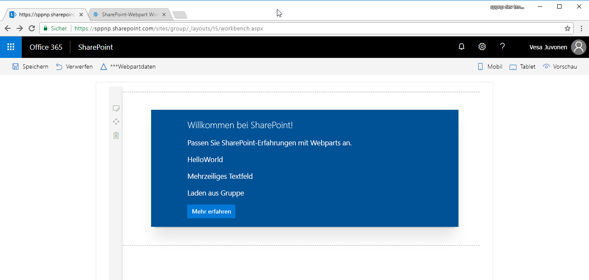

# <a name="connect-your-client-side-web-part-to-sharepoint-hello-world-part-2"></a>Verbinden Ihres clientseitigen Webparts mit SharePoint („Hello World“ Teil 2)

Wenn Sie Ihr Webpart mit SharePoint verbinden, haben Sie Zugriff auf SharePoint-Funktionalitäten und -Daten und können Endbenutzern eine stärker integrierte Erfahrung bieten. In diesem Artikel bauen wir das HelloWorld-Webpart weiter aus, das Sie im vorherigen Artikel [Erstellen Ihres ersten Webparts](./build-a-hello-world-web-part.md) erstellt haben.

Sie können die nachfolgend beschriebene Anleitung auch anhand dieses Videos in unserem [YouTube-Kanal „SharePoint Patterns & Practices“](https://www.youtube.com/watch?v=hYrP6D4FaaU&list=PLR9nK3mnD-OXvSWvS2zglCzz4iplhVrKq&index=3) nachvollziehen. 

<a href="https://www.youtube.com/watch?v=hYrP6D4FaaU&list=PLR9nK3mnD-OXvSWvS2zglCzz4iplhVrKq&index=3">

</a>


## <a name="run-gulp-serve"></a>Ausführen von „gulp serve“

Stellen Sie sicher, dass der Befehl `gulp serve` ausgeführt wird. Sollte er noch nicht ausgeführt werden, wechseln Sie ins Projektverzeichnis **helloworld-webpart**, und führen Sie die folgenden Befehle aus:

```
cd helloworld-webpart
gulp serve
```

## <a name="get-access-to-page-context"></a>Zugreifen auf den Seitenkontext

Wird Workbench lokal gehostet, befinden Sie sich nicht im Kontext einer SharePoint-Seite. Sie haben aber auch dann viele verschiedene Möglichkeiten, Ihr Webpart zu testen. Beispielsweise können Sie sich auf die Webpart-UX konzentrieren und mithilfe simulierter Daten eine Interaktion mit SharePoint simulieren, wenn Sie sich nicht im SharePoint-Kontext bewegen.

Wenn Sie die Workbench jedoch in SharePoint hosten, haben Sie Zugang zum Seitenkontext, der wiederum verschiedene Schlüsseleigenschaften bereitstellt, darunter:

* Webtitel
* Absolute Web-URL
* Relative Webserver-URL
* Anmeldename des Benutzers

### <a name="to-get-access-to-the-page-context"></a>So erhalten Sie Zugriff auf den Seitenkontext

1. Verwenden Sie die folgende Variable in Ihrer Webpart-Klasse:

  ```typescript
  this.context.pageContext
  ```

2. Wechseln Sie zu Visual Studio Code (oder Ihrer bevorzugten IDE), und öffnen Sie **src\webparts\helloWorld\HelloWorldWebPart.ts**.

3. Ersetzen Sie in der Methode **render** den Codeblock **innerHTML** durch den folgenden Code:

  ```HTML
      this.domElement.innerHTML = `
        <div class="${ styles.helloWorld }">
          <div class="${ styles.container }">
            <div class="${ styles.row }">
              <div class="${ styles.column }">
                <span class="${ styles.title }">Welcome to SharePoint!</span>
                <p class="${ styles.subTitle }">Customize SharePoint experiences using Web Parts.</p>
                <p class="${ styles.description }">${escape(this.properties.description)}</p>
                <p class="${ styles.description }">${escape(this.properties.test)}</p>
                <p class="${ styles.description }">Loading from ${escape(this.context.pageContext.web.title)}</p>
                <a href="https://aka.ms/spfx" class="${ styles.button }">
                  <span class="${ styles.label }">Learn more</span>
                </a>
              </div>
            </div>
          </div>
        </div>`;
  ```

4. Dabei wird `${ }` verwendet, um den Variablenwert im HTML-Block auszugeben. Ein zusätzlicher per `p` codierter HTML-Abschnitt wird zur Anzeige von `this.context.pageContext.web.title` verwendet. Da dieses Webpart aus der lokalen Umgebung geladen wird, lautet der Titel **Local Workbench**.

5. Speichern Sie die Datei. Der noch in der Konsole laufende Befehl `gulp serve` erkennt diesen Speichervorgang und:

  - Erstellt und bündelt den aktualisierten Code automatisch.
  - Aktualisiert die Seite in der lokalen Workbench (da der Webpart-Code neu geladen werden muss).

  > [!NOTE]
  > Zeigen Sie das Konsolenfenster und Visual Studio Code nebeneinander an, um mitzuverfolgen, wie gulp beim Speichern von Änderungen in Visual Studio Code automatisch kompiliert.

6. Wechseln Sie in Ihrem Browser zur lokalen Registerkarte **SharePoint Workbench**. Wenn Sie die Registerkarte bereits geschlossen haben, lautet die URL `https://localhost:4321/temp/workbench.html`.

  Im Webpart sollte jetzt Folgendes zu sehen sein:

  

7. Navigieren Sie zu der in SharePoint gehosteten SharePoint Workbench. Die vollständige URL lautet `https://your-sharepoint-site-url/_layouts/workbench.aspx`. Beachten Sie, dass Sie auf der SharePoint Online-Seite die Seiten aktualisieren müssen, um die Änderungen zu sehen.

  > [!NOTE]
  > Wenn Sie das SPFx-Entwicklerzertifikat noch nicht installiert haben, meldet Workbench, dass das Laden von Skripts von „localhost“ nicht konfiguriert ist. Führen Sie im Projektverzeichnis den Befehl `gulp trust-dev-cert` in der Konsole aus, um das Entwicklerzertifikat zu installieren.

  Der Seitenkontext ist jetzt für das Webpart verfügbar, und der Seitentitel Ihrer SharePoint-Website sollte im Webpart zu sehen sein.

  

## <a name="define-list-model"></a>Definieren eines Listenmodells

Wenn Sie mit SharePoint-Listendaten arbeiten möchten, benötigen Sie ein Listenmodell. Zum Abrufen von Listen sind zwei Modelle erforderlich. 

1. Wechseln Sie zu Visual Studio Code, und öffnen Sie **src\webparts\helloWorld\HelloWorldWebPart.ts**.

2. Definieren Sie die folgenden Modelle des Typs `interface` direkt oberhalb der Klasse **HelloWorldWebPart**:

  ```typescript
  export interface ISPLists {
    value: ISPList[];
  }

  export interface ISPList {
    Title: string;
    Id: string;
  }
  ```

  Die Schnittstelle **ISPList** enthält die SharePoint-Listeninformationen, die Sie einbinden möchten. 

## <a name="retrieve-lists-from-mock-store"></a>Abrufen von Listen aus einem simulierten Speicher

Für die Tests in der lokalen Workbench benötigen Sie einen simulierten Speicher, der simulierte Daten zurückgibt.

### <a name="to-create-a-mock-store"></a>So erstellen Sie einen simulierten Informationsspeicher

1. Erstellen Sie im Ordner **src\webparts\helloWorld** eine neue Datei mit dem Namen **MockHttpClient.ts**.

2. Kopieren Sie den folgenden Code in die Datei **MockHttpClient.ts**:

  ```typescript
  import { ISPList } from './HelloWorldWebPart';

  export default class MockHttpClient  {

      private static _items: ISPList[] = [{ Title: 'Mock List', Id: '1' },
                                          { Title: 'Mock List 2', Id: '2' },
                                          { Title: 'Mock List 3', Id: '3' }];
      
      public static get(): Promise<ISPList[]> {
      return new Promise<ISPList[]>((resolve) => {
              resolve(MockHttpClient._items);
          });
      }
  }
  ```

  Wichtige Hinweise zum Code:

  - Da es in **HelloWorldWebPart.ts** mehrere Exporte gibt, wird per `{ }` festgelegt, welcher zu importieren ist. In diesem Fall ist nur das Datenmodell `ISPList` erforderlich.
  - Die Eingabe der Dateierweiterung ist bei Importen aus dem Standardmodul nicht nötig. In unserem Beispiel ist das Standardmodul **HelloWorldWebPart**. 
  - Der Code exportiert die Klasse **MockHttpClient** als Standardmodul, das sich anschließend in andere Dateien importieren lässt.
  - Der Code erstellt das anfängliche simulierte Array `ISPList` und die simulierten Rückgaben.

3. Speichern Sie die Datei.

Jetzt können Sie die Klasse **MockHttpClient** in der Klasse **HelloWorldWebPart** verwenden. Zunächst müssen Sie das Modul **MockHttpClient** importieren.

### <a name="to-import-the-mockhttpclient-module"></a>So importieren Sie das Modul **MockHttpClient** importieren.

1. Öffnen Sie die Datei **HelloWorldWebPart.ts**.

2. Kopieren Sie den folgenden Code, und fügen Sie ihn direkt unter `import * as strings from 'HelloWorldWebPartStrings';` ein.

  ```typescript
  import MockHttpClient from './MockHttpClient';
  ```
 
3. Fügen Sie die folgende private Methode in der Klasse **HelloWorldWebPart** hinzu, um den Listenabruf zu simulieren:

  ```typescript
    private _getMockListData(): Promise<ISPLists> {
      return MockHttpClient.get()
        .then((data: ISPList[]) => {
          var listData: ISPLists = { value: data };
          return listData;
        }) as Promise<ISPLists>;
    }
  ```

4. Speichern Sie die Datei.

## <a name="retrieve-lists-from-sharepoint-site"></a>Abrufen von Listen von einer SharePoint-Website

Als Nächstes müssen Sie Listen von der aktuellen Website abrufen. Zum Abrufen der Listen von der Website verwenden Sie die SharePoint-REST-APIs, die unter `https://yourtenantprefix.sharepoint.com/_api/web/lists` liegen.

SharePoint-Framework umfasst die Hilfsklasse **spHttpClient**, um REST-API-Anforderungen in SharePoint auszuführen. Es fügt Standardkopfzeilen hinzu, verwaltet den für Schreibvorgänge erforderlichen Digest und sammelt Telemetrie, die dem Dienst hilft, die Leistung einer Anwendung zu überwachen.

### <a name="to-use-this-helper-class-import-them-from-the-microsoftsp-http-module"></a>Um diese Hilfsklasse zu verwenden, müssen Sie diese aus dem @microsoft/sp-http-Modul importieren.

1. Führen Sie einen Bildlauf an den Anfang der Datei **HelloWorldWebPart.ts** aus. 

2. Kopieren Sie den folgenden Code, und fügen Sie ihn direkt unter `import MockHttpClient from './MockHttpClient';` ein:

  ```typescript
  import {
    SPHttpClient,
    SPHttpClientResponse   
  } from '@microsoft/sp-http';
  ```

3. Fügen Sie die folgende private Methode in der Klasse **HelloWorldWebPart** hinzu, um Listen von SharePoint abzurufen:

  ```typescript
  private _getListData(): Promise<ISPLists> {
    return this.context.spHttpClient.get(this.context.pageContext.web.absoluteUrl + `/_api/web/lists?$filter=Hidden eq false`, SPHttpClient.configurations.v1)
      .then((response: SPHttpClientResponse) => {
        return response.json();
      });
  }
  ```

  Die Methode verwendet die Hilfsklasse **spHttpClient** und gibt eine `get`-Anforderung aus. Sie verwendet das Modell **ISPLists** und implementiert einen Filter, der den Abruf versteckter Listen verhindert.

4. Speichern Sie die Datei. 

5. Wechseln Sie in das Konsolenfenster, in dem `gulp serve` ausgeführt wird, und schauen Sie nach, ob Fehler gemeldet wurden. gulp meldet alle Fehler in der Konsole. Sie müssen sie dann zuerst beheben, bevor Sie fortfahren können.

## <a name="add-new-styles"></a>Hinzufügen neuer Stile

Das SharePoint Framework verwendet [Sass](http://sass-lang.com/) als CSS-Präprozessor und arbeitet insbesondere mit der [SCSS-Syntax](http://sass-lang.com/documentation/file.SCSS_FOR_SASS_USERS.html), die vollständig konform mit der normalen CSS-Syntax ist. Sass erweitert die CSS-Sprache und ermöglicht den Einsatz von Features wie Variablen, geschachtelten Regeln und Inline-Importen zur Organisation und Erstellung effizienter Stylesheets für Webparts. In das SharePoint Framework ist bereits ein SCSS-Compiler integriert, der Sass-Dateien in normale CSS-Dateien konvertiert und eine typisierte Version bereitstellt, die Sie während der Entwicklung verwenden können.

### <a name="to-add-new-styles"></a>So fügen Sie neue Stile hinzu

1. Öffnen Sie **HelloWorld.module.scss**. Dies ist die SCSS-Datei, in der Sie Ihre Stile definieren.

  Standardmäßig sind die Stile auf das Webpart beschränkt. Das können Sie daran erkennen, dass die Stile unter **.helloWorld** definiert werden.

2. Fügen Sie die folgenden Formate nach dem `.button`-Stil, aber immer noch innerhalb des Bereichs des `.helloWorld`-Hauptstils hinzu.

  ```css
  .list {
    color: #333333;
    font-family: 'Segoe UI Regular WestEuropean', 'Segoe UI', Tahoma, Arial, sans-serif;
    font-size: 14px;
    font-weight: normal;
    box-sizing: border-box;
    margin: 10;
    padding: 10;
    line-height: 50px;
    list-style-type: none;
    box-shadow: 0 4px 4px 0 rgba(0, 0, 0, 0.2), 0 25px 50px 0 rgba(0, 0, 0, 0.1);
  }

  .listItem {
    color: #333333;
    vertical-align: center;
    font-family: 'Segoe UI Regular WestEuropean', 'Segoe UI', Tahoma, Arial, sans-serif;
    font-size: 14px;
    font-weight: normal;
    box-sizing: border-box;
    margin: 0;
    padding: 0;
    box-shadow: none;
    *zoom: 1;
    padding: 9px 28px 3px;
    position: relative;
  }
  ``` 

3. Speichern Sie die Datei.

  gulp erstellt den Code in der Konsole neu, sobald Sie die Datei speichern. Dadurch werden die entsprechenden Typisierungen in der Datei **HelloWorld.module.scss.ts** generiert. Nach der Kompilierung in TypeScript können Sie diese Stile importieren und in Ihrem Webpart-Code referenzieren.

  Ein Beispiel dafür sehen Sie in der **render**-Methode des Webparts:

  ```html
  <div class="${styles.row}">
  ```

## <a name="render-lists-information"></a>Rendern von Listeninformationen

Öffnen Sie die Klasse **HelloWorldWebPart**.

SharePoint Workbench bietet Ihnen die Möglichkeit, Webparts entweder in Ihrer lokalen Umgebung oder auf einer SharePoint-Website zu testen. SharePoint-Framework unterstützt diese Funktion mit dem Modul **EnvironmentType**, das anzeigt, in welcher Umgebung das Webpart gerade ausgeführt wird. 

### <a name="to-use-the-environmenttype-module"></a>Verwenden Sie das EnvironmentType-Modul

1. Importieren Sie die Module **Environment** und ***EnvironmentType** aus dem Bundle **@microsoft/sp-core-library**. Fügen Sie es zum Abschnitt **import** oben auf der Seite hinzu, wie im folgenden Code dargestellt:

  ```typescript
  import {
    Environment,
    EnvironmentType
  } from '@microsoft/sp-core-library';
  ```

2. Fügen Sie die folgende private Methode in der Klasse **HelloWorldWebPart** hinzu, um die entsprechenden Methoden zum Abrufen der Listendaten aufzurufen:

  ```typescript
    private _renderListAsync(): void {
      // Local environment
      if (Environment.type === EnvironmentType.Local) {
        this._getMockListData().then((response) => {
          this._renderList(response.value);
        });
      }
      else if (Environment.type == EnvironmentType.SharePoint || 
                Environment.type == EnvironmentType.ClassicSharePoint) {
        this._getListData()
          .then((response) => {
            this._renderList(response.value);
          });
      }
    }
  ```

  Wichtige Hinweise zu „hostType“ in der Methode **_renderListAsync**:

  - Die Eigenschaft `Environment.type` hilft Ihnen, zu überprüfen, ob Sie in einer lokalen Umgebung arbeiten oder in einer SharePoint-Umgebung.
  - Je nachdem, wo Workbench gehostet wird, wird die jeweils korrekte Methode aufgerufen.

3. Speichern Sie die Datei.

  Jetzt müssen Sie die Listendaten mit dem Wert rendern, der aus der REST-API abgerufen wurde.

4. Fügen Sie die folgende private Methode in der Klasse **HelloWorldWebPart** hinzu:

  ```typescript
    private _renderList(items: ISPList[]): void {
      let html: string = '';
      items.forEach((item: ISPList) => {
        html += `
      <ul class="${styles.list}">
        <li class="${styles.listItem}">
          <span class="ms-font-l">${item.Title}</span>
        </li>
      </ul>`;
      });

      const listContainer: Element = this.domElement.querySelector('#spListContainer');
      listContainer.innerHTML = html;
    }
  ```

  Die oben beschriebene Methode referenziert die zuvor hinzugefügten neuen CSS-Stile über die Variable **styles**. 

5. Speichern Sie die Datei.


## <a name="retrieve-list-data"></a>Abrufen von Listendaten

1. Navigieren Sie zur **render**-Methode, und ersetzen Sie den Code in der Methode durch den folgenden Code:

  ```typescript
      this.domElement.innerHTML = `
        <div class="${ styles.helloWorld }">
          <div class="${ styles.container }">
            <div class="${ styles.row }">
              <div class="${ styles.column }">
                <span class="${ styles.title }">Welcome to SharePoint!</span>
                <p class="${ styles.subTitle }">Customize SharePoint experiences using Web Parts.</p>
                <p class="${ styles.description }">${escape(this.properties.description)}</p>
                <p class="${ styles.description }">${escape(this.properties.test)}</p>
                <p class="${ styles.description }">Loading from ${escape(this.context.pageContext.web.title)}</p>
                <a href="https://aka.ms/spfx" class="${ styles.button }">
                  <span class="${ styles.label }">Learn more</span>
                </a>
              </div>
            </div>
            <div id="spListContainer" />
          </div>
        </div>`;

        this._renderListAsync();
  ```

2. Speichern Sie die Datei.

  Im Konsolenfenster, in dem `gulp serve` ausgeführt wird, wird der Code neu erstellt. Vergewissern Sie sich, dass keine Fehler gemeldet wurden.

3. Wechseln Sie zur lokalen Workbench, und fügen Sie das HelloWorld-Webpart hinzu.

  Nun sollten die simulierten Daten zurückgegeben werden.

  

4. Wechseln Sie zur in SharePoint gehosteten Workbench. Aktualisieren Sie die Seite, und fügen Sie das HelloWorld-Webpart hinzu.

  Es sollten nun Listen von der aktuellen Website zurückgegeben werden.

  

5. Jetzt können Sie den Server stoppen. Wechseln Sie zur Konsole, und stoppen Sie `gulp serve`. Wählen Sie STRG+C, um den gulp-Task zu beenden.

## <a name="next-steps"></a>Nächste Schritte

Sehr gut! Sie haben Ihren Webpart jetzt an die SharePoint-Listendaten angebunden. 

Im nächsten Artikel, [Bereitstellen Ihres Webparts auf einer SharePoint-Seite](./serve-your-web-part-in-a-sharepoint-page.md), können Sie Ihren HelloWorld-Webpart weiter ausbauen. Dort erfahren Sie, wie Sie den HelloWorld-Webpart auf einer SharePoint-Seite bereitstellen und eine Vorschau anzeigen können.

> [!NOTE]
> Wenn Sie einen Fehler in der Dokumentation oder im SharePoint-Framework finden, melden Sie ihn an das SharePoint Engineering unter Verwendung der [Fehlerliste im sp-dev-docs-Repository](https://github.com/SharePoint/sp-dev-docs/issues). Vielen Dank im Voraus für Ihr Feedback.