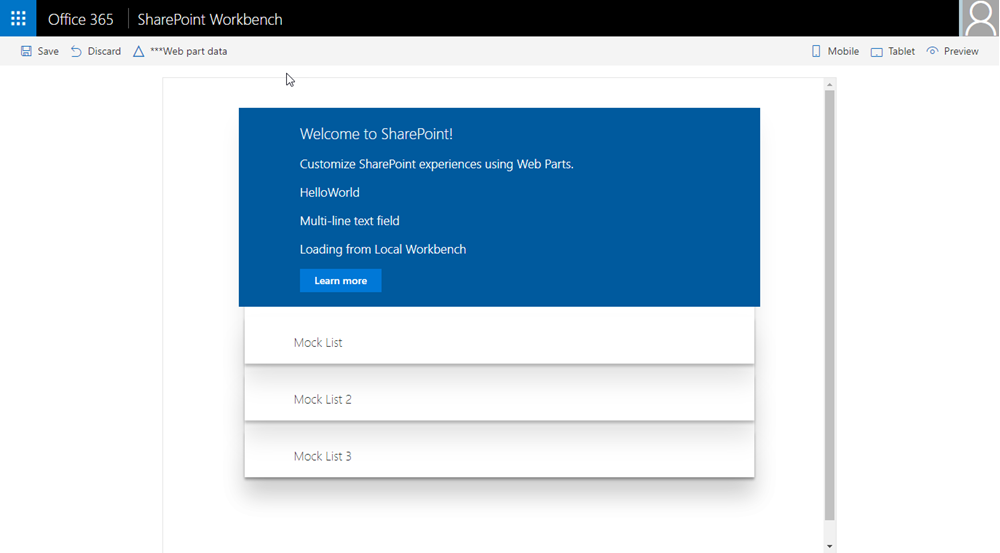
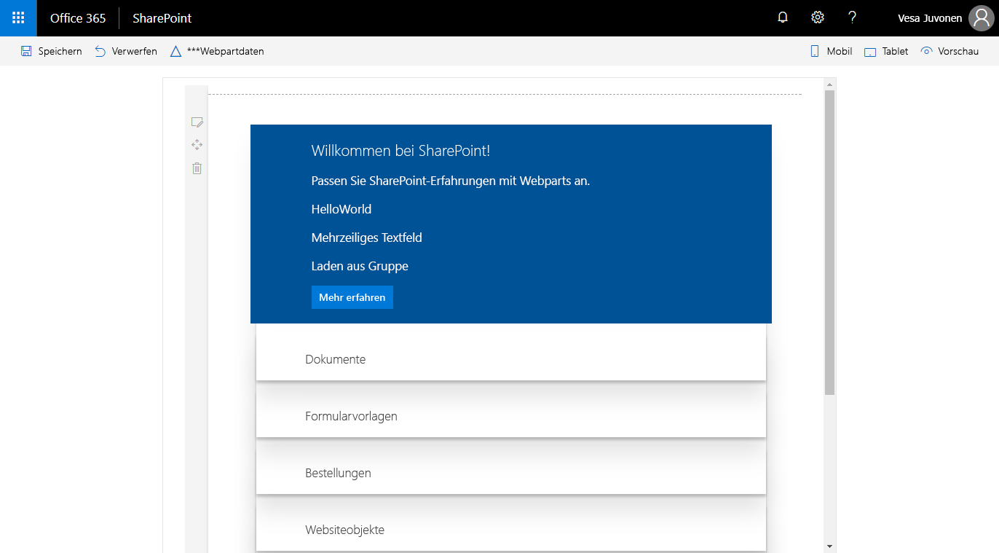

# <a name="connect-your-client-side-web-part-to-sharepoint-hello-world-part-2"></a><span data-ttu-id="b9dca-103">Verbinden Ihres clientseitigen Webparts mit SharePoint („Hello World“ Teil 2)</span><span class="sxs-lookup"><span data-stu-id="b9dca-103">Connect your client-side web part to SharePoint (Hello World part 2)</span></span>

<span data-ttu-id="b9dca-104">Wenn Sie Ihr Webpart mit SharePoint verbinden, haben Sie Zugriff auf SharePoint-Funktionalitäten und -Daten und können Endbenutzern eine stärker integrierte Erfahrung bieten.</span><span class="sxs-lookup"><span data-stu-id="b9dca-104">Connect your web part to SharePoint to access functionality and data in SharePoint and provide a more integrated experience for end users.</span></span> <span data-ttu-id="b9dca-105">In diesem Artikel bauen wir das HelloWorld-Webpart weiter aus, das Sie im vorherigen Artikel [Erstellen Ihres ersten Webparts](./build-a-hello-world-web-part.md) erstellt haben.</span><span class="sxs-lookup"><span data-stu-id="b9dca-105">This article continues building the Hello World web part built in the previous article [Build your first web part](./build-a-hello-world-web-part.md).</span></span>

<span data-ttu-id="b9dca-106">Sie können die nachfolgend beschriebene Anleitung auch anhand dieses Videos in unserem [YouTube-Kanal „SharePoint Patterns & Practices“](https://www.youtube.com/watch?v=hYrP6D4FaaU&list=PLR9nK3mnD-OXvSWvS2zglCzz4iplhVrKq&index=3) nachvollziehen.</span><span class="sxs-lookup"><span data-stu-id="b9dca-106">You can also follow these steps by watching this video on the [SharePoint PnP YouTube Channel](https://www.youtube.com/watch?v=hYrP6D4FaaU&list=PLR9nK3mnD-OXvSWvS2zglCzz4iplhVrKq&index=3).</span></span> 

<a href="https://www.youtube.com/watch?v=hYrP6D4FaaU&list=PLR9nK3mnD-OXvSWvS2zglCzz4iplhVrKq&index=3">

</a>


## <a name="run-gulp-serve"></a><span data-ttu-id="b9dca-107">Ausführen von „gulp serve“</span><span class="sxs-lookup"><span data-stu-id="b9dca-107">Run gulp serve</span></span>

<span data-ttu-id="b9dca-108">Stellen Sie sicher, dass der Befehl `gulp serve` ausgeführt wird.</span><span class="sxs-lookup"><span data-stu-id="b9dca-108">Ensure that you have the `gulp serve` command running.</span></span> <span data-ttu-id="b9dca-109">Sollte er noch nicht ausgeführt werden, wechseln Sie ins Projektverzeichnis **helloworld-webpart**, und führen Sie die folgenden Befehle aus:</span><span class="sxs-lookup"><span data-stu-id="b9dca-109">If it is not already running, go to the **helloworld-webpart** project directory and run it by using the following commands.</span></span>

```
cd helloworld-webpart
gulp serve
```

## <a name="get-access-to-page-context"></a><span data-ttu-id="b9dca-110">Zugreifen auf den Seitenkontext</span><span class="sxs-lookup"><span data-stu-id="b9dca-110">Get access to page context</span></span>

<span data-ttu-id="b9dca-111">Wird Workbench lokal gehostet, befinden Sie sich nicht im Kontext einer SharePoint-Seite.</span><span class="sxs-lookup"><span data-stu-id="b9dca-111">When the Workbench is hosted locally, you do not have the SharePoint page context.</span></span> <span data-ttu-id="b9dca-112">Sie haben aber auch dann viele verschiedene Möglichkeiten, Ihr Webpart zu testen.</span><span class="sxs-lookup"><span data-stu-id="b9dca-112">You can still test your web part in many different ways.</span></span> <span data-ttu-id="b9dca-113">Beispielsweise können Sie sich auf die Webpart-UX konzentrieren und mithilfe simulierter Daten eine Interaktion mit SharePoint simulieren, wenn Sie sich nicht im SharePoint-Kontext bewegen.</span><span class="sxs-lookup"><span data-stu-id="b9dca-113">For example, you can concentrate on building the web part's UX and use mock data to simulate SharePoint interaction when you don't have the SharePoint context.</span></span>

<span data-ttu-id="b9dca-114">Wenn Sie die Workbench jedoch in SharePoint hosten, haben Sie Zugang zum Seitenkontext, der wiederum verschiedene Schlüsseleigenschaften bereitstellt, darunter:</span><span class="sxs-lookup"><span data-stu-id="b9dca-114">However, when the Workbench is hosted in SharePoint, you get access to the page context, which provides various key properties such as:</span></span>

* <span data-ttu-id="b9dca-115">Webtitel</span><span class="sxs-lookup"><span data-stu-id="b9dca-115">Web title</span></span>
* <span data-ttu-id="b9dca-116">Absolute Web-URL</span><span class="sxs-lookup"><span data-stu-id="b9dca-116">Web absolute URL</span></span>
* <span data-ttu-id="b9dca-117">Relative Webserver-URL</span><span class="sxs-lookup"><span data-stu-id="b9dca-117">Web server-relative URL</span></span>
* <span data-ttu-id="b9dca-118">Anmeldename des Benutzers</span><span class="sxs-lookup"><span data-stu-id="b9dca-118">User sign-in name</span></span>

### <a name="to-get-access-to-the-page-context"></a><span data-ttu-id="b9dca-119">So erhalten Sie Zugriff auf den Seitenkontext</span><span class="sxs-lookup"><span data-stu-id="b9dca-119">To get access to the page context</span></span>

1. <span data-ttu-id="b9dca-120">Verwenden Sie die folgende Variable in Ihrer Webpart-Klasse:</span><span class="sxs-lookup"><span data-stu-id="b9dca-120">Use the following variable in your web part class:</span></span>

  ```typescript
  this.context.pageContext
  ```

2. <span data-ttu-id="b9dca-121">Wechseln Sie zu Visual Studio Code (oder Ihrer bevorzugten IDE), und öffnen Sie **src\webparts\helloWorld\HelloWorldWebPart.ts**.</span><span class="sxs-lookup"><span data-stu-id="b9dca-121">Switch to Visual Studio code (or your preferred IDE) and open **src\webparts\helloWorld\HelloWorldWebPart.ts**.</span></span>

3. <span data-ttu-id="b9dca-122">Ersetzen Sie in der Methode **render** den Codeblock **innerHTML** durch den folgenden Code:</span><span class="sxs-lookup"><span data-stu-id="b9dca-122">Inside the **render** method, replace the **innerHTML** code block with the following code:</span></span>

  ```HTML
      this.domElement.innerHTML = `
        <div class="${ styles.helloWorld }">
          <div class="${ styles.container }">
            <div class="${ styles.row }">
              <div class="${ styles.column }">
                <span class="${ styles.title }">Welcome to SharePoint!</span>
                <p class="${ styles.subTitle }">Customize SharePoint experiences using Web Parts.</p>
                <p class="${ styles.description }">${escape(this.properties.description)}</p>
                <p class="${ styles.description }">${escape(this.properties.test)}</p>
                <p class="${ styles.description }">Loading from ${escape(this.context.pageContext.web.title)}</p>
                <a href="https://aka.ms/spfx" class="${ styles.button }">
                  <span class="${ styles.label }">Learn more</span>
                </a>
              </div>
            </div>
          </div>
        </div>`;
  ```

4. <span data-ttu-id="b9dca-123">Dabei wird `${ }` verwendet, um den Variablenwert im HTML-Block auszugeben.</span><span class="sxs-lookup"><span data-stu-id="b9dca-123">Notice how `${ }` is used to output the variable's value in the HTML block.</span></span> <span data-ttu-id="b9dca-124">Ein zusätzlicher per `p` codierter HTML-Abschnitt wird zur Anzeige von `this.context.pageContext.web.title` verwendet.</span><span class="sxs-lookup"><span data-stu-id="b9dca-124">An extra HTML `p` is used to display `this.context.pageContext.web.title`.</span></span> <span data-ttu-id="b9dca-125">Da dieses Webpart aus der lokalen Umgebung geladen wird, lautet der Titel **Local Workbench**.</span><span class="sxs-lookup"><span data-stu-id="b9dca-125">Because this web part loads from the local environment, the title is **Local Workbench**.</span></span>

5. <span data-ttu-id="b9dca-126">Speichern Sie die Datei.</span><span class="sxs-lookup"><span data-stu-id="b9dca-126">Save the file.</span></span> <span data-ttu-id="b9dca-127">Der noch in der Konsole laufende Befehl `gulp serve` erkennt diesen Speichervorgang und:</span><span class="sxs-lookup"><span data-stu-id="b9dca-127">The `gulp serve` running in your console detects this save operation and:</span></span>

  - <span data-ttu-id="b9dca-128">Erstellt und bündelt den aktualisierten Code automatisch.</span><span class="sxs-lookup"><span data-stu-id="b9dca-128">Builds and bundles the updated code automatically.</span></span>
  - <span data-ttu-id="b9dca-129">Aktualisiert die Seite in der lokalen Workbench (da der Webpart-Code neu geladen werden muss).</span><span class="sxs-lookup"><span data-stu-id="b9dca-129">Refreshes your local Workbench page (as the web part code needs to be reloaded).</span></span>

  > [!NOTE]
  > <span data-ttu-id="b9dca-130">Zeigen Sie das Konsolenfenster und Visual Studio Code nebeneinander an, um mitzuverfolgen, wie gulp beim Speichern von Änderungen in Visual Studio Code automatisch kompiliert.</span><span class="sxs-lookup"><span data-stu-id="b9dca-130">Keep the console window and Visual Studio Code side-by-side to see gulp automatically compile as you save changes in Visual Studio Code.</span></span>

6. <span data-ttu-id="b9dca-131">Wechseln Sie in Ihrem Browser zur lokalen Registerkarte **SharePoint Workbench**. Wenn Sie die Registerkarte bereits geschlossen haben, lautet die URL `https://localhost:4321/temp/workbench.html`.</span><span class="sxs-lookup"><span data-stu-id="b9dca-131">In your browser, switch to the local **SharePoint Workbench** tab. If you have already closed the tab, the URL is `https://localhost:4321/temp/workbench.html`.</span></span>

  <span data-ttu-id="b9dca-132">Im Webpart sollte jetzt Folgendes zu sehen sein:</span><span class="sxs-lookup"><span data-stu-id="b9dca-132">You should see the following in the web part:</span></span>

  

7. <span data-ttu-id="b9dca-134">Navigieren Sie zu der in SharePoint gehosteten SharePoint Workbench.</span><span class="sxs-lookup"><span data-stu-id="b9dca-134">Navigate to the SharePoint Workbench hosted in SharePoint.</span></span> <span data-ttu-id="b9dca-135">Die vollständige URL lautet `https://your-sharepoint-site-url/_layouts/workbench.aspx`.</span><span class="sxs-lookup"><span data-stu-id="b9dca-135">The full URL is `https://your-sharepoint-site-url/_layouts/workbench.aspx`.</span></span> <span data-ttu-id="b9dca-136">Beachten Sie, dass Sie auf der SharePoint Online-Seite die Seiten aktualisieren müssen, um die Änderungen zu sehen.</span><span class="sxs-lookup"><span data-stu-id="b9dca-136">Notice that on the SharePoint Online side, you need to refresh the page to see the changes.</span></span>

  > [!NOTE]
  > <span data-ttu-id="b9dca-137">Wenn Sie das SPFx-Entwicklerzertifikat noch nicht installiert haben, meldet Workbench, dass das Laden von Skripts von „localhost“ nicht konfiguriert ist.</span><span class="sxs-lookup"><span data-stu-id="b9dca-137">If you do not have the SPFx developer certificate installed, Workbench notifies you that it is configured not to load scripts from localhost.</span></span> <span data-ttu-id="b9dca-138">Führen Sie im Projektverzeichnis den Befehl `gulp trust-dev-cert` in der Konsole aus, um das Entwicklerzertifikat zu installieren.</span><span class="sxs-lookup"><span data-stu-id="b9dca-138">Execute `gulp trust-dev-cert` command in your project directory console to install the developer certificate.</span></span>

  <span data-ttu-id="b9dca-139">Der Seitenkontext ist jetzt für das Webpart verfügbar, und der Seitentitel Ihrer SharePoint-Website sollte im Webpart zu sehen sein.</span><span class="sxs-lookup"><span data-stu-id="b9dca-139">You should now see your SharePoint site title in the web part now that page context is available to the web part.</span></span>

  

## <a name="define-list-model"></a><span data-ttu-id="b9dca-141">Definieren eines Listenmodells</span><span class="sxs-lookup"><span data-stu-id="b9dca-141">Define list model</span></span>

<span data-ttu-id="b9dca-p108">Wenn Sie mit SharePoint-Listendaten arbeiten möchten, benötigen Sie ein Listenmodell. Zum Abrufen von Listen sind zwei Modelle erforderlich.</span><span class="sxs-lookup"><span data-stu-id="b9dca-p108">You need a list model to start working with SharePoint list data. To retrieve the lists, you need two models.</span></span> 

1. <span data-ttu-id="b9dca-144">Wechseln Sie zu Visual Studio Code, und öffnen Sie **src\webparts\helloWorld\HelloWorldWebPart.ts**.</span><span class="sxs-lookup"><span data-stu-id="b9dca-144">Switch to Visual Studio Code and go to **src\webparts\helloWorld\HelloWorldWebPart.ts**.</span></span>

2. <span data-ttu-id="b9dca-145">Definieren Sie die folgenden Modelle des Typs `interface` direkt oberhalb der Klasse **HelloWorldWebPart**:</span><span class="sxs-lookup"><span data-stu-id="b9dca-145">Define the following `interface` models just above the **HelloWorldWebPart** class:</span></span>

  ```typescript
  export interface ISPLists {
    value: ISPList[];
  }

  export interface ISPList {
    Title: string;
    Id: string;
  }
  ```

  <span data-ttu-id="b9dca-146">Die Schnittstelle **ISPList** enthält die SharePoint-Listeninformationen, die Sie einbinden möchten.</span><span class="sxs-lookup"><span data-stu-id="b9dca-146">The **ISPList** interface holds the SharePoint list information that we are connecting to.</span></span> 

## <a name="retrieve-lists-from-mock-store"></a><span data-ttu-id="b9dca-147">Abrufen von Listen aus einem simulierten Speicher</span><span class="sxs-lookup"><span data-stu-id="b9dca-147">Retrieve lists from mock store</span></span>

<span data-ttu-id="b9dca-148">Für die Tests in der lokalen Workbench benötigen Sie einen simulierten Speicher, der simulierte Daten zurückgibt.</span><span class="sxs-lookup"><span data-stu-id="b9dca-148">To test in the local Workbench, you need a mock store that returns mock data.</span></span>

### <a name="to-create-a-mock-store"></a><span data-ttu-id="b9dca-149">So erstellen Sie einen simulierten Informationsspeicher</span><span class="sxs-lookup"><span data-stu-id="b9dca-149">To create a mock store</span></span>

1. <span data-ttu-id="b9dca-150">Erstellen Sie im Ordner **src\webparts\helloWorld** eine neue Datei mit dem Namen **MockHttpClient.ts**.</span><span class="sxs-lookup"><span data-stu-id="b9dca-150">Create a new file inside the **src\webparts\helloWorld** folder named **MockHttpClient.ts**.</span></span>

2. <span data-ttu-id="b9dca-151">Kopieren Sie den folgenden Code in die Datei **MockHttpClient.ts**:</span><span class="sxs-lookup"><span data-stu-id="b9dca-151">Copy the following code into **MockHttpClient.ts**:</span></span>

  ```typescript
  import { ISPList } from './HelloWorldWebPart';

  export default class MockHttpClient  {

      private static _items: ISPList[] = [{ Title: 'Mock List', Id: '1' },
                                          { Title: 'Mock List 2', Id: '2' },
                                          { Title: 'Mock List 3', Id: '3' }];
      
      public static get(): Promise<ISPList[]> {
      return new Promise<ISPList[]>((resolve) => {
              resolve(MockHttpClient._items);
          });
      }
  }
  ```

  <span data-ttu-id="b9dca-152">Wichtige Hinweise zum Code:</span><span class="sxs-lookup"><span data-stu-id="b9dca-152">Things to note about the code:</span></span>

  - <span data-ttu-id="b9dca-153">Da es in **HelloWorldWebPart.ts** mehrere Exporte gibt, wird per `{ }` festgelegt, welcher zu importieren ist.</span><span class="sxs-lookup"><span data-stu-id="b9dca-153">Because there are multiple exports in **HelloWorldWebPart.ts**, the specific one to import is specified by using `{ }`.</span></span> <span data-ttu-id="b9dca-154">In diesem Fall ist nur das Datenmodell `ISPList` erforderlich.</span><span class="sxs-lookup"><span data-stu-id="b9dca-154">In this case, only the data model `ISPList` is required.</span></span>
  - <span data-ttu-id="b9dca-155">Die Eingabe der Dateierweiterung ist bei Importen aus dem Standardmodul nicht nötig. In unserem Beispiel ist das Standardmodul **HelloWorldWebPart**.</span><span class="sxs-lookup"><span data-stu-id="b9dca-155">You do not need to type the file extension when importing from the default module, which in this case is **HelloWorldWebPart**.</span></span> 
  - <span data-ttu-id="b9dca-156">Der Code exportiert die Klasse **MockHttpClient** als Standardmodul, das sich anschließend in andere Dateien importieren lässt.</span><span class="sxs-lookup"><span data-stu-id="b9dca-156">It exports the **MockHttpClient** class as a default module so that it can be imported in other files.</span></span>
  - <span data-ttu-id="b9dca-157">Der Code erstellt das anfängliche simulierte Array `ISPList` und die simulierten Rückgaben.</span><span class="sxs-lookup"><span data-stu-id="b9dca-157">It builds the initial `ISPList` mock array and returns.</span></span>

3. <span data-ttu-id="b9dca-158">Speichern Sie die Datei.</span><span class="sxs-lookup"><span data-stu-id="b9dca-158">Save the file.</span></span>

<span data-ttu-id="b9dca-159">Jetzt können Sie die Klasse **MockHttpClient** in der Klasse **HelloWorldWebPart** verwenden.</span><span class="sxs-lookup"><span data-stu-id="b9dca-159">You can now use the **MockHttpClient** class in the **HelloWorldWebPart** class.</span></span> <span data-ttu-id="b9dca-160">Zunächst müssen Sie das Modul **MockHttpClient** importieren.</span><span class="sxs-lookup"><span data-stu-id="b9dca-160">You first need to import the **MockHttpClient** module.</span></span>

### <a name="to-import-the-mockhttpclient-module"></a><span data-ttu-id="b9dca-161">So importieren Sie das Modul **MockHttpClient** importieren.</span><span class="sxs-lookup"><span data-stu-id="b9dca-161">To import the **MockHttpClient** module</span></span>

1. <span data-ttu-id="b9dca-162">Öffnen Sie die Datei **HelloWorldWebPart.ts**.</span><span class="sxs-lookup"><span data-stu-id="b9dca-162">Open the **HelloWorldWebPart.ts** file.</span></span>

2. <span data-ttu-id="b9dca-163">Kopieren Sie den folgenden Code, und fügen Sie ihn direkt unter `import * as strings from 'HelloWorldWebPartStrings';` ein.</span><span class="sxs-lookup"><span data-stu-id="b9dca-163">Copy and paste the following code just under `import * as strings from 'HelloWorldWebPartStrings';`.</span></span>

  ```typescript
  import MockHttpClient from './MockHttpClient';
  ```
 
3. <span data-ttu-id="b9dca-164">Fügen Sie die folgende private Methode in der Klasse **HelloWorldWebPart** hinzu, um den Listenabruf zu simulieren:</span><span class="sxs-lookup"><span data-stu-id="b9dca-164">Add the following private method that mocks the list retrieval inside the **HelloWorldWebPart** class.</span></span>

  ```typescript
    private _getMockListData(): Promise<ISPLists> {
      return MockHttpClient.get()
        .then((data: ISPList[]) => {
          var listData: ISPLists = { value: data };
          return listData;
        }) as Promise<ISPLists>;
    }
  ```

4. <span data-ttu-id="b9dca-165">Speichern Sie die Datei.</span><span class="sxs-lookup"><span data-stu-id="b9dca-165">Save the file.</span></span>

## <a name="retrieve-lists-from-sharepoint-site"></a><span data-ttu-id="b9dca-166">Abrufen von Listen von einer SharePoint-Website</span><span class="sxs-lookup"><span data-stu-id="b9dca-166">Retrieve lists from SharePoint site</span></span>

<span data-ttu-id="b9dca-167">Als Nächstes müssen Sie Listen von der aktuellen Website abrufen.</span><span class="sxs-lookup"><span data-stu-id="b9dca-167">Next you need to retrieve lists from the current site.</span></span> <span data-ttu-id="b9dca-168">Zum Abrufen der Listen von der Website verwenden Sie die SharePoint-REST-APIs, die unter `https://yourtenantprefix.sharepoint.com/_api/web/lists` liegen.</span><span class="sxs-lookup"><span data-stu-id="b9dca-168">You will use SharePoint REST APIs to retrieve the lists from the site, which are located at `https://yourtenantprefix.sharepoint.com/_api/web/lists`.</span></span>

<span data-ttu-id="b9dca-169">SharePoint-Framework umfasst die Hilfsklasse **spHttpClient**, um REST-API-Anforderungen in SharePoint auszuführen.</span><span class="sxs-lookup"><span data-stu-id="b9dca-169">SharePoint Framework includes a helper class **spHttpClient** to execute REST API requests against SharePoint.</span></span> <span data-ttu-id="b9dca-170">Es fügt Standardkopfzeilen hinzu, verwaltet den für Schreibvorgänge erforderlichen Digest und sammelt Telemetrie, die dem Dienst hilft, die Leistung einer Anwendung zu überwachen.</span><span class="sxs-lookup"><span data-stu-id="b9dca-170">It adds default headers, manages the digest needed for writes, and collects telemetry that helps the service to monitor the performance of an application.</span></span>

### <a name="to-use-this-helper-class-import-them-from-the-microsoftsp-http-module"></a><span data-ttu-id="b9dca-171">Um diese Hilfsklasse zu verwenden, müssen Sie diese aus dem @microsoft/sp-http-Modul importieren.</span><span class="sxs-lookup"><span data-stu-id="b9dca-171">To use this helper class, import them from the @microsoft/sp-http module</span></span>

1. <span data-ttu-id="b9dca-172">Führen Sie einen Bildlauf an den Anfang der Datei **HelloWorldWebPart.ts** aus.</span><span class="sxs-lookup"><span data-stu-id="b9dca-172">Scroll to the top of the **HelloWorldWebPart.ts** file.</span></span> 

2. <span data-ttu-id="b9dca-173">Kopieren Sie den folgenden Code, und fügen Sie ihn direkt unter `import MockHttpClient from './MockHttpClient';` ein:</span><span class="sxs-lookup"><span data-stu-id="b9dca-173">Copy and paste the following code just under `import MockHttpClient from './MockHttpClient';`:</span></span>

  ```typescript
  import {
    SPHttpClient,
    SPHttpClientResponse   
  } from '@microsoft/sp-http';
  ```

3. <span data-ttu-id="b9dca-174">Fügen Sie die folgende private Methode in der Klasse **HelloWorldWebPart** hinzu, um Listen von SharePoint abzurufen:</span><span class="sxs-lookup"><span data-stu-id="b9dca-174">Add the following private method to retrieve lists from SharePoint inside the **HelloWorldWebPart** class.</span></span>

  ```typescript
  private _getListData(): Promise<ISPLists> {
    return this.context.spHttpClient.get(this.context.pageContext.web.absoluteUrl + `/_api/web/lists?$filter=Hidden eq false`, SPHttpClient.configurations.v1)
      .then((response: SPHttpClientResponse) => {
        return response.json();
      });
  }
  ```

  <span data-ttu-id="b9dca-175">Die Methode verwendet die Hilfsklasse **spHttpClient** und gibt eine `get`-Anforderung aus.</span><span class="sxs-lookup"><span data-stu-id="b9dca-175">The method uses the **spHttpClient** helper class and issues a `get` request.</span></span> <span data-ttu-id="b9dca-176">Sie verwendet das Modell **ISPLists** und implementiert einen Filter, der den Abruf versteckter Listen verhindert.</span><span class="sxs-lookup"><span data-stu-id="b9dca-176">It uses the **ISPLists** model and also applies a filter to not retrieve hidden lists.</span></span>

4. <span data-ttu-id="b9dca-177">Speichern Sie die Datei.</span><span class="sxs-lookup"><span data-stu-id="b9dca-177">Save the file.</span></span> 

5. <span data-ttu-id="b9dca-178">Wechseln Sie in das Konsolenfenster, in dem `gulp serve` ausgeführt wird, und schauen Sie nach, ob Fehler gemeldet wurden.</span><span class="sxs-lookup"><span data-stu-id="b9dca-178">Switch to the console window that is running `gulp serve` and check if there are any errors.</span></span> <span data-ttu-id="b9dca-179">gulp meldet alle Fehler in der Konsole. Sie müssen sie dann zuerst beheben, bevor Sie fortfahren können.</span><span class="sxs-lookup"><span data-stu-id="b9dca-179">If there are errors, gulp reports them in the console, and you need to fix them before proceeding.</span></span>

## <a name="add-new-styles"></a><span data-ttu-id="b9dca-180">Hinzufügen neuer Stile</span><span class="sxs-lookup"><span data-stu-id="b9dca-180">Add new styles</span></span>

<span data-ttu-id="b9dca-181">Das SharePoint Framework verwendet [Sass](http://sass-lang.com/) als CSS-Präprozessor und arbeitet insbesondere mit der [SCSS-Syntax](http://sass-lang.com/documentation/file.SCSS_FOR_SASS_USERS.html), die vollständig konform mit der normalen CSS-Syntax ist.</span><span class="sxs-lookup"><span data-stu-id="b9dca-181">The SharePoint Framework uses [Sass](http://sass-lang.com/) as the CSS pre-processor, and specifically uses the [SCSS syntax](http://sass-lang.com/documentation/file.SCSS_FOR_SASS_USERS.html), which is fully compliant with normal CSS syntax.</span></span> <span data-ttu-id="b9dca-182">Sass erweitert die CSS-Sprache und ermöglicht den Einsatz von Features wie Variablen, geschachtelten Regeln und Inline-Importen zur Organisation und Erstellung effizienter Stylesheets für Webparts.</span><span class="sxs-lookup"><span data-stu-id="b9dca-182">Sass extends the CSS language and allows you to use features such as variables, nested rules, and inline imports to organize and create efficient style sheets for your web parts.</span></span> <span data-ttu-id="b9dca-183">In das SharePoint Framework ist bereits ein SCSS-Compiler integriert, der Sass-Dateien in normale CSS-Dateien konvertiert und eine typisierte Version bereitstellt, die Sie während der Entwicklung verwenden können.</span><span class="sxs-lookup"><span data-stu-id="b9dca-183">The SharePoint Framework already comes with a SCSS compiler that converts your Sass files to normal CSS files, and also provides a typed version to use during development.</span></span>

### <a name="to-add-new-styles"></a><span data-ttu-id="b9dca-184">So fügen Sie neue Stile hinzu</span><span class="sxs-lookup"><span data-stu-id="b9dca-184">To add new styles</span></span>

1. <span data-ttu-id="b9dca-185">Öffnen Sie **HelloWorld.module.scss**.</span><span class="sxs-lookup"><span data-stu-id="b9dca-185">Open **HelloWorld.module.scss**.</span></span> <span data-ttu-id="b9dca-186">Dies ist die SCSS-Datei, in der Sie Ihre Stile definieren.</span><span class="sxs-lookup"><span data-stu-id="b9dca-186">This is the SCSS file where you define your styles.</span></span>

  <span data-ttu-id="b9dca-187">Standardmäßig sind die Stile auf das Webpart beschränkt.</span><span class="sxs-lookup"><span data-stu-id="b9dca-187">By default, the styles are scoped to your web part.</span></span> <span data-ttu-id="b9dca-188">Das können Sie daran erkennen, dass die Stile unter **.helloWorld** definiert werden.</span><span class="sxs-lookup"><span data-stu-id="b9dca-188">You can see that as the styles are defined under **.helloWorld**.</span></span>

2. <span data-ttu-id="b9dca-189">Fügen Sie die folgenden Formate nach dem `.button`-Stil, aber immer noch innerhalb des Bereichs des `.helloWorld`-Hauptstils hinzu.</span><span class="sxs-lookup"><span data-stu-id="b9dca-189">Add the following styles after the `.button` style, but still inside the main `.helloWorld` style section:</span></span>

  ```css
  .list {
    color: #333333;
    font-family: 'Segoe UI Regular WestEuropean', 'Segoe UI', Tahoma, Arial, sans-serif;
    font-size: 14px;
    font-weight: normal;
    box-sizing: border-box;
    margin: 10;
    padding: 10;
    line-height: 50px;
    list-style-type: none;
    box-shadow: 0 4px 4px 0 rgba(0, 0, 0, 0.2), 0 25px 50px 0 rgba(0, 0, 0, 0.1);
  }

  .listItem {
    color: #333333;
    vertical-align: center;
    font-family: 'Segoe UI Regular WestEuropean', 'Segoe UI', Tahoma, Arial, sans-serif;
    font-size: 14px;
    font-weight: normal;
    box-sizing: border-box;
    margin: 0;
    padding: 0;
    box-shadow: none;
    *zoom: 1;
    padding: 9px 28px 3px;
    position: relative;
  }
  ``` 

3. <span data-ttu-id="b9dca-190">Speichern Sie die Datei.</span><span class="sxs-lookup"><span data-stu-id="b9dca-190">Save the file.</span></span>

  <span data-ttu-id="b9dca-191">gulp erstellt den Code in der Konsole neu, sobald Sie die Datei speichern.</span><span class="sxs-lookup"><span data-stu-id="b9dca-191">Gulp rebuilds the code in the console as soon as you save the file.</span></span> <span data-ttu-id="b9dca-192">Dadurch werden die entsprechenden Typisierungen in der Datei **HelloWorld.module.scss.ts** generiert.</span><span class="sxs-lookup"><span data-stu-id="b9dca-192">This generates the corresponding typings in the **HelloWorld.module.scss.ts** file.</span></span> <span data-ttu-id="b9dca-193">Nach der Kompilierung in TypeScript können Sie diese Stile importieren und in Ihrem Webpart-Code referenzieren.</span><span class="sxs-lookup"><span data-stu-id="b9dca-193">After compiled to TypeScript, you can then import and reference these styles in your web part code.</span></span>

  <span data-ttu-id="b9dca-194">Ein Beispiel dafür sehen Sie in der **render**-Methode des Webparts:</span><span class="sxs-lookup"><span data-stu-id="b9dca-194">You can see that in the **render** method of the web part:</span></span>

  ```html
  <div class="${styles.row}">
  ```

## <a name="render-lists-information"></a><span data-ttu-id="b9dca-195">Rendern von Listeninformationen</span><span class="sxs-lookup"><span data-stu-id="b9dca-195">Render lists information</span></span>

<span data-ttu-id="b9dca-196">Öffnen Sie die Klasse **HelloWorldWebPart**.</span><span class="sxs-lookup"><span data-stu-id="b9dca-196">Open the **HelloWorldWebPart** class.</span></span>

<span data-ttu-id="b9dca-197">SharePoint Workbench bietet Ihnen die Möglichkeit, Webparts entweder in Ihrer lokalen Umgebung oder auf einer SharePoint-Website zu testen.</span><span class="sxs-lookup"><span data-stu-id="b9dca-197">SharePoint Workbench gives you the flexibility to test web parts in your local environment and from a SharePoint site.</span></span> <span data-ttu-id="b9dca-198">SharePoint-Framework unterstützt diese Funktion mit dem Modul **EnvironmentType**, das anzeigt, in welcher Umgebung das Webpart gerade ausgeführt wird.</span><span class="sxs-lookup"><span data-stu-id="b9dca-198">SharePoint Framework aids this capability by helping you understand which environment your web part is running from by using the **EnvironmentType** module.</span></span> 

### <a name="to-use-the-environmenttype-module"></a><span data-ttu-id="b9dca-199">Verwenden Sie das EnvironmentType-Modul</span><span class="sxs-lookup"><span data-stu-id="b9dca-199">To use the EnvironmentType module</span></span>

1. <span data-ttu-id="b9dca-200">Importieren Sie die Module **Environment** und \***EnvironmentType** aus dem Bundle **@microsoft/sp-core-library**.</span><span class="sxs-lookup"><span data-stu-id="b9dca-200">Import the **Environment** and the **EnvironmentType** modules from the **@microsoft/sp-core-library** bundle.</span></span> <span data-ttu-id="b9dca-201">Fügen Sie es zum Abschnitt **import** oben auf der Seite hinzu, wie im folgenden Code dargestellt:</span><span class="sxs-lookup"><span data-stu-id="b9dca-201">Add it to the **import** section at the top as shown in the following code:</span></span>

  ```typescript
  import {
    Environment,
    EnvironmentType
  } from '@microsoft/sp-core-library';
  ```

2. <span data-ttu-id="b9dca-202">Fügen Sie die folgende private Methode in der Klasse **HelloWorldWebPart** hinzu, um die entsprechenden Methoden zum Abrufen der Listendaten aufzurufen:</span><span class="sxs-lookup"><span data-stu-id="b9dca-202">Add the following private method inside the **HelloWorldWebPart** class to call the respective methods to retrieve list data:</span></span>

  ```typescript
    private _renderListAsync(): void {
      // Local environment
      if (Environment.type === EnvironmentType.Local) {
        this._getMockListData().then((response) => {
          this._renderList(response.value);
        });
      }
      else if (Environment.type == EnvironmentType.SharePoint || 
                Environment.type == EnvironmentType.ClassicSharePoint) {
        this._getListData()
          .then((response) => {
            this._renderList(response.value);
          });
      }
    }
  ```

  <span data-ttu-id="b9dca-203">Wichtige Hinweise zu „hostType“ in der Methode **_renderListAsync**:</span><span class="sxs-lookup"><span data-stu-id="b9dca-203">Things to note about hostType in the **_renderListAsync** method:</span></span>

  - <span data-ttu-id="b9dca-204">Die Eigenschaft `Environment.type` hilft Ihnen, zu überprüfen, ob Sie in einer lokalen Umgebung arbeiten oder in einer SharePoint-Umgebung.</span><span class="sxs-lookup"><span data-stu-id="b9dca-204">The `Environment.type` property helps you check if you are in a local or SharePoint environment.</span></span>
  - <span data-ttu-id="b9dca-205">Je nachdem, wo Workbench gehostet wird, wird die jeweils korrekte Methode aufgerufen.</span><span class="sxs-lookup"><span data-stu-id="b9dca-205">The correct method is called depending on where your Workbench is hosted.</span></span>

3. <span data-ttu-id="b9dca-206">Speichern Sie die Datei.</span><span class="sxs-lookup"><span data-stu-id="b9dca-206">Save the file.</span></span>

  <span data-ttu-id="b9dca-207">Jetzt müssen Sie die Listendaten mit dem Wert rendern, der aus der REST-API abgerufen wurde.</span><span class="sxs-lookup"><span data-stu-id="b9dca-207">Now you need to render the list data with the value fetched from the REST API.</span></span>

4. <span data-ttu-id="b9dca-208">Fügen Sie die folgende private Methode in der Klasse **HelloWorldWebPart** hinzu:</span><span class="sxs-lookup"><span data-stu-id="b9dca-208">Add the following private method inside the **HelloWorldWebPart** class:</span></span>

  ```typescript
    private _renderList(items: ISPList[]): void {
      let html: string = '';
      items.forEach((item: ISPList) => {
        html += `
      <ul class="${styles.list}">
        <li class="${styles.listItem}">
          <span class="ms-font-l">${item.Title}</span>
        </li>
      </ul>`;
      });

      const listContainer: Element = this.domElement.querySelector('#spListContainer');
      listContainer.innerHTML = html;
    }
  ```

  <span data-ttu-id="b9dca-209">Die oben beschriebene Methode referenziert die zuvor hinzugefügten neuen CSS-Stile über die Variable **styles**.</span><span class="sxs-lookup"><span data-stu-id="b9dca-209">The previous method references the new CSS styles added earlier by using the **styles** variable.</span></span> 

5. <span data-ttu-id="b9dca-210">Speichern Sie die Datei.</span><span class="sxs-lookup"><span data-stu-id="b9dca-210">Save the file.</span></span>


## <a name="retrieve-list-data"></a><span data-ttu-id="b9dca-211">Abrufen von Listendaten</span><span class="sxs-lookup"><span data-stu-id="b9dca-211">Retrieve list data</span></span>

1. <span data-ttu-id="b9dca-212">Navigieren Sie zur **render**-Methode, und ersetzen Sie den Code in der Methode durch den folgenden Code:</span><span class="sxs-lookup"><span data-stu-id="b9dca-212">Navigate to the **render** method, and replace the code inside the method with the following code:</span></span>

  ```typescript
      this.domElement.innerHTML = `
        <div class="${ styles.helloWorld }">
          <div class="${ styles.container }">
            <div class="${ styles.row }">
              <div class="${ styles.column }">
                <span class="${ styles.title }">Welcome to SharePoint!</span>
                <p class="${ styles.subTitle }">Customize SharePoint experiences using Web Parts.</p>
                <p class="${ styles.description }">${escape(this.properties.description)}</p>
                <p class="${ styles.description }">${escape(this.properties.test)}</p>
                <p class="${ styles.description }">Loading from ${escape(this.context.pageContext.web.title)}</p>
                <a href="https://aka.ms/spfx" class="${ styles.button }">
                  <span class="${ styles.label }">Learn more</span>
                </a>
              </div>
            </div>
            <div id="spListContainer" />
          </div>
        </div>`;

        this._renderListAsync();
  ```

2. <span data-ttu-id="b9dca-213">Speichern Sie die Datei.</span><span class="sxs-lookup"><span data-stu-id="b9dca-213">Save the file.</span></span>

  <span data-ttu-id="b9dca-214">Im Konsolenfenster, in dem `gulp serve` ausgeführt wird, wird der Code neu erstellt.</span><span class="sxs-lookup"><span data-stu-id="b9dca-214">Notice in the `gulp serve` console window that it rebuilds the code.</span></span> <span data-ttu-id="b9dca-215">Vergewissern Sie sich, dass keine Fehler gemeldet wurden.</span><span class="sxs-lookup"><span data-stu-id="b9dca-215">Make sure you don't see any errors.</span></span>

3. <span data-ttu-id="b9dca-216">Wechseln Sie zur lokalen Workbench, und fügen Sie das HelloWorld-Webpart hinzu.</span><span class="sxs-lookup"><span data-stu-id="b9dca-216">Switch to your local Workbench and add the HelloWorld web part.</span></span>

  <span data-ttu-id="b9dca-217">Nun sollten die simulierten Daten zurückgegeben werden.</span><span class="sxs-lookup"><span data-stu-id="b9dca-217">You should see the mock data returned.</span></span>

  

4. <span data-ttu-id="b9dca-219">Wechseln Sie zur in SharePoint gehosteten Workbench.</span><span class="sxs-lookup"><span data-stu-id="b9dca-219">Switch to the Workbench hosted in SharePoint.</span></span> <span data-ttu-id="b9dca-220">Aktualisieren Sie die Seite, und fügen Sie das HelloWorld-Webpart hinzu.</span><span class="sxs-lookup"><span data-stu-id="b9dca-220">Refresh the page and add the HelloWorld web part.</span></span>

  <span data-ttu-id="b9dca-221">Es sollten nun Listen von der aktuellen Website zurückgegeben werden.</span><span class="sxs-lookup"><span data-stu-id="b9dca-221">You should see lists returned from the current site.</span></span>

  

5. <span data-ttu-id="b9dca-223">Jetzt können Sie den Server stoppen.</span><span class="sxs-lookup"><span data-stu-id="b9dca-223">Now you can stop the server from running.</span></span> <span data-ttu-id="b9dca-224">Wechseln Sie zur Konsole, und stoppen Sie `gulp serve`.</span><span class="sxs-lookup"><span data-stu-id="b9dca-224">Switch to the console and stop `gulp serve`.</span></span> <span data-ttu-id="b9dca-225">Wählen Sie STRG+C, um den gulp-Task zu beenden.</span><span class="sxs-lookup"><span data-stu-id="b9dca-225">Select Ctrl+C to terminate the gulp task.</span></span>

## <a name="next-steps"></a><span data-ttu-id="b9dca-226">Nächste Schritte</span><span class="sxs-lookup"><span data-stu-id="b9dca-226">Next steps</span></span>

<span data-ttu-id="b9dca-227">Sehr gut! Sie haben Ihren Webpart jetzt an die SharePoint-Listendaten angebunden.</span><span class="sxs-lookup"><span data-stu-id="b9dca-227">Congratulations on connecting your web part to SharePoint list data!</span></span> 

<span data-ttu-id="b9dca-228">Im nächsten Artikel, [Bereitstellen Ihres Webparts auf einer SharePoint-Seite](./serve-your-web-part-in-a-sharepoint-page.md), können Sie Ihren HelloWorld-Webpart weiter ausbauen.</span><span class="sxs-lookup"><span data-stu-id="b9dca-228">You can continue building out your Hello World web part in the next topic [Deploy your web part to a SharePoint page](./serve-your-web-part-in-a-sharepoint-page.md).</span></span> <span data-ttu-id="b9dca-229">Dort erfahren Sie, wie Sie den HelloWorld-Webpart auf einer SharePoint-Seite bereitstellen und eine Vorschau anzeigen können.</span><span class="sxs-lookup"><span data-stu-id="b9dca-229">You will learn how to deploy and preview the Hello World web part in a SharePoint page.</span></span>

> [!NOTE]
> <span data-ttu-id="b9dca-230">Wenn Sie einen Fehler in der Dokumentation oder im SharePoint-Framework finden, melden Sie ihn an das SharePoint Engineering unter Verwendung der [Fehlerliste im sp-dev-docs-Repository](https://github.com/SharePoint/sp-dev-docs/issues).</span><span class="sxs-lookup"><span data-stu-id="b9dca-230">If you find an issue in the documentation or in the SharePoint Framework, report that to SharePoint engineering by using the [issue list at the sp-dev-docs repository](https://github.com/SharePoint/sp-dev-docs/issues).</span></span> <span data-ttu-id="b9dca-231">Vielen Dank im Voraus für Ihr Feedback.</span><span class="sxs-lookup"><span data-stu-id="b9dca-231">Thanks for your input in advance.</span></span>