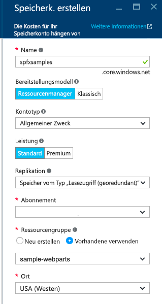
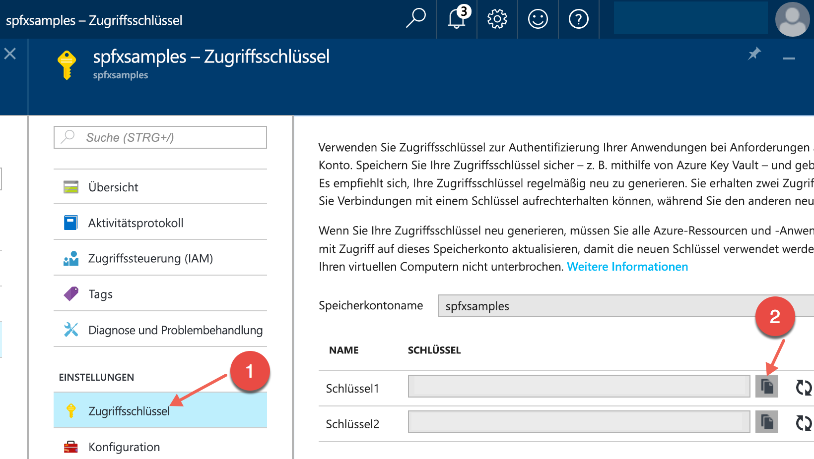
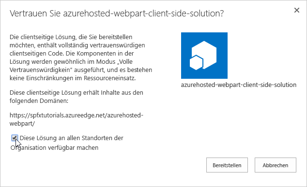
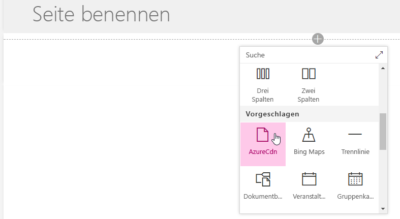
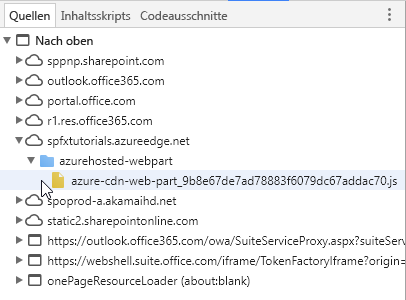

# <a name="deploy-your-sharepoint-client-side-web-part-to-azure-cdn"></a><span data-ttu-id="3dddc-103">Bereitstellen Ihres clientseitigen SharePoint-Webparts im Azure CDN</span><span class="sxs-lookup"><span data-stu-id="3dddc-103">Deploy your SharePoint client-side web part to Azure CDN</span></span>

<span data-ttu-id="3dddc-104">Erstellen Sie ein neues Beispielwebpart, und stellen Sie seine Objekte in einem Azure Content Delivery Network (CDN) bereit, statt das Office 365 CDN als Hostinglösung zu verwenden.</span><span class="sxs-lookup"><span data-stu-id="3dddc-104">In this article, you will create a new sample web part and deploy it's assets to a Azure CDN instead of using the default Office 365 CDN as the hosting solution.</span></span> <span data-ttu-id="3dddc-105">Sie verwenden ein Azure-Speicherkonto, das in ein CDN integriert ist, um Ihre Ressourcen bereitzustellen.</span><span class="sxs-lookup"><span data-stu-id="3dddc-105">You'll use an Azure Storage account integrated with a CDN to deploy your assets.</span></span> <span data-ttu-id="3dddc-106">Die Buildtools von SharePoint Framework bieten eine sofort nutzbare Unterstützung für die Bereitstellung auf einem Azure-Speicherkonto. Sie können die Dateien jedoch auch manuell an einen CDN-Anbieter Ihrer Wahl oder nach SharePoint hochladen.</span><span class="sxs-lookup"><span data-stu-id="3dddc-106">SharePoint Framework build tools provide out-of-the-box support for deploying to an Azure Storage account; however, you can also manually upload the files to your favorite CDN provider or to SharePoint.</span></span>

> [!NOTE]
> <span data-ttu-id="3dddc-107">Es gibt mehrere unterschiedliche Hostingoptionen für Webpart-Objekte.</span><span class="sxs-lookup"><span data-stu-id="3dddc-107">There are multiple different hosting options for your web part assets.</span></span> <span data-ttu-id="3dddc-108">In diesem Lernprogramm steht die Option „Azure CDN“ im Vordergrund, Sie können jedoch auch das [Office 365 CDN](./hosting-webpart-from-office-365-cdn.md) verwenden oder einfach Ihre Objekt aus der SharePoint-Bibliothek aus dem Mandanten hosten.</span><span class="sxs-lookup"><span data-stu-id="3dddc-108">This tutorial concentrates on showing the Azure CDN option, but you could also use the [Office 365 CDN](./hosting-webpart-from-office-365-cdn.md) or simply host your assets from SharePoint library from your tenant.</span></span> <span data-ttu-id="3dddc-109">Im letzteren Fall würden Sie nicht von den CDN-Leistungssteigerungen profitieren, im Hinblick auf die Funktionalität wäre dies jedoch möglich.</span><span class="sxs-lookup"><span data-stu-id="3dddc-109">In the latter case, you would not benefit from the CDN performance improvements, but that would also work from the functionality perspective.</span></span> <span data-ttu-id="3dddc-110">Technisch gesehen wäre jeder Ort zum Hosten der Objekte für Endbenutzer denkbar, auf den Endbenutzer über HTTP zugreifen können.</span><span class="sxs-lookup"><span data-stu-id="3dddc-110">Any location which end users can access using HTTP would be technically suitable for hosting the assets for end users.</span></span>

## <a name="configure-an-azure-storage-account"></a><span data-ttu-id="3dddc-111">Konfigurieren eines Azure-Speicherkontos</span><span class="sxs-lookup"><span data-stu-id="3dddc-111">Configure Azure storage account</span></span>

<span data-ttu-id="3dddc-112">Um ein Azure-Speicherkonto zu konfigurieren und in das CDN zu integrieren, befolgen Sie die Anweisungen unter [Integrieren eines Azure-Speicherkontos in CDN](https://docs.microsoft.com/de-DE/azure/cdn/cdn-create-a-storage-account-with-cdn) sowie die detaillierten Schritte in diesem Artikel.</span><span class="sxs-lookup"><span data-stu-id="3dddc-112">To configure an Azure storage account and integrate it with the CDN, follow the instructions at [Integrate an Azure storage account with Azure CDN](https://docs.microsoft.com/de-DE/azure/cdn/cdn-create-a-storage-account-with-cdn), along with the detailed steps in this article.</span></span> 

### <a name="storage-account-name"></a><span data-ttu-id="3dddc-113">Speicherkontoname</span><span class="sxs-lookup"><span data-stu-id="3dddc-113">Storage account name</span></span>

<span data-ttu-id="3dddc-114">Dies ist der Name, den Sie zum Erstellen des Speicherkontos verwendet haben, wie in [Schritt 1: Erstellen eines Speicherkontos](https://docs.microsoft.com/de-DE/azure/cdn/cdn-create-a-storage-account-with-cdn#step-1-create-a-storage-account) beschrieben.</span><span class="sxs-lookup"><span data-stu-id="3dddc-114">This is the name you used to create your storage account, as described in [Step 1: Create a storage account](https://docs.microsoft.com/de-DE/azure/cdn/cdn-create-a-storage-account-with-cdn#step-1-create-a-storage-account).</span></span>

<span data-ttu-id="3dddc-115">Im folgenden Screenshot ist **spfxsamples** der Name des Speicherkontos.</span><span class="sxs-lookup"><span data-stu-id="3dddc-115">For example, in the following screenshot, **spfxsamples** is the storage account name.</span></span>



<span data-ttu-id="3dddc-117">Auf diese Weise wird der neue Speicherkontoendpunkt **spfxsamples.blob.core.windows.net** erstellt.</span><span class="sxs-lookup"><span data-stu-id="3dddc-117">This will create a new storage account endpoint **spfxsamples.blob.core.windows.net**.</span></span> 

> [!NOTE]
> <span data-ttu-id="3dddc-118">Sie müssen einen eindeutigen Speicherkontonamen für Ihre eigenen SharePoint-Framework-Projekte erstellen.</span><span class="sxs-lookup"><span data-stu-id="3dddc-118">You will need to create a unique storage account name for your own SharePoint Framework projects.</span></span>

### <a name="blob-container-name"></a><span data-ttu-id="3dddc-119">Name des BLOB-Containers</span><span class="sxs-lookup"><span data-stu-id="3dddc-119">BLOB container name</span></span>

<span data-ttu-id="3dddc-120">Erstellen Sie einen neuen Blob-Dienstcontainer.</span><span class="sxs-lookup"><span data-stu-id="3dddc-120">Create a new Blob service container.</span></span> <span data-ttu-id="3dddc-121">Dieser ist im Dashboard des Speicherkontos verfügbar.</span><span class="sxs-lookup"><span data-stu-id="3dddc-121">This is available in your storage account dashboard.</span></span>

<span data-ttu-id="3dddc-122">Wählen Sie **+ Container** aus, und erstellen Sie einen neuen Container mit den folgenden Angaben:</span><span class="sxs-lookup"><span data-stu-id="3dddc-122">Select the **+ Container** and create a new container with the following:</span></span>

* <span data-ttu-id="3dddc-123">Name: **azurehosted-webpart**</span><span class="sxs-lookup"><span data-stu-id="3dddc-123">Name: **azurehosted-webpart**</span></span>
* <span data-ttu-id="3dddc-124">Zugriffstyp: Container</span><span class="sxs-lookup"><span data-stu-id="3dddc-124">Access type: Container</span></span>


### <a name="storage-account-access-key"></a><span data-ttu-id="3dddc-126">Tastenkombination für Speicherkonto</span><span class="sxs-lookup"><span data-stu-id="3dddc-126">Storage account access key</span></span>

<span data-ttu-id="3dddc-127">Wählen Sie im Dashboard des Speicherkontos die Option **Tastenkombination** im Dashboard aus, und kopieren Sie eine der Tastenkombinationen.</span><span class="sxs-lookup"><span data-stu-id="3dddc-127">In the storage account dashboard, choose **Access Key** in the dashboard and copy one of the access keys.</span></span>



### <a name="cdn-profile-and-endpoint"></a><span data-ttu-id="3dddc-129">CDN-Profil und Endpunkt</span><span class="sxs-lookup"><span data-stu-id="3dddc-129">CDN profile and endpoint</span></span>

<span data-ttu-id="3dddc-130">Erstellen Sie ein neues CDN-Profil, und weisen Sie den CDN-Endpunkt diesem BLOB-Container zu.</span><span class="sxs-lookup"><span data-stu-id="3dddc-130">Create a new CDN profile and associate the CDN endpoint with this BLOB container.</span></span>

1. <span data-ttu-id="3dddc-131">Erstellen Sie ein neues CDN-Profil, wie unter [Schritt 2: Aktivieren von CDN für das Speicherkonto](https://docs.microsoft.com/de-DE/azure/cdn/cdn-create-a-storage-account-with-cdn#step-2-enable-cdn-for-the-storage-account) beschrieben (Scrollen Sie in Schritt 2 nach unten zu **So erstellen Sie ein neues CDN-Profil**).</span><span class="sxs-lookup"><span data-stu-id="3dddc-131">Create a new CDN profile as described in [Step 2: Enable CDN for the storage account](https://docs.microsoft.com/de-DE/azure/cdn/cdn-create-a-storage-account-with-cdn#step-2-enable-cdn-for-the-storage-account) (scroll down in Step 2 for **To create a new CDN profile**).</span></span>

  <span data-ttu-id="3dddc-132">Im folgenden Screenshot ist **spfxwebparts** der Name des CDN-Profils.</span><span class="sxs-lookup"><span data-stu-id="3dddc-132">For example, in the following screenshot, **spfxwebparts** is the CDN profile name.</span></span>

  

2. <span data-ttu-id="3dddc-134">Erstellen Sie einen CDN-Endpunkt, wie unter [Schritt 2: Aktivieren von CDN für das Speicherkonto](https://docs.microsoft.com/de-DE/azure/cdn/cdn-create-a-storage-account-with-cdn#step-2-enable-cdn-for-the-storage-account) beschrieben.</span><span class="sxs-lookup"><span data-stu-id="3dddc-134">Create a CDN endpoint as described in [Step 2: Enable CDN for the storage account](https://docs.microsoft.com/de-DE/azure/cdn/cdn-create-a-storage-account-with-cdn#step-2-enable-cdn-for-the-storage-account).</span></span> <span data-ttu-id="3dddc-135">Der CDN-Endpunkt wird mit der folgenden URL erstellt:`http://spfxsamples.azureedge.net`</span><span class="sxs-lookup"><span data-stu-id="3dddc-135">The CDN endpoint will be created with the following URL: http://spfxsamples.azureedge.net</span></span>

  <span data-ttu-id="3dddc-136">Im folgenden Screenshot ist **spfxsamples** beispielsweise der Endpunktname **Speicher** ist der Ursprungstyp, und **spfxsamples.blob.core.windows.net** ist das Speicherkonto.</span><span class="sxs-lookup"><span data-stu-id="3dddc-136">For example, in the following screenshot, **spfxsamples** is the endpoint name, **Storage** is the origin type, and **spfxsamples.blob.core.windows.net** is the storage account.</span></span>

  

<span data-ttu-id="3dddc-137">Da Sie den CDN-Endpunkt dem Speicherkonto zugeordnet haben, können Sie auch unter der folgenden URL auf den BLOB-Container zugreifen: `http://spfxsamples.azureedge.net/azurehosted-webpart/`</span><span class="sxs-lookup"><span data-stu-id="3dddc-137">Because you associated the CDN endpoint with your storage account, you can also access the BLOB container at the following URL:http://spfxsamples.azureedge.net/azurehosted-webpart/`http://spfxsamples.azureedge.net/azurehosted-webpart/`</span></span>

<span data-ttu-id="3dddc-138">Beachten Sie jedoch, dass Sie die Dateien noch nicht bereitgestellt haben.</span><span class="sxs-lookup"><span data-stu-id="3dddc-138">Note, however that you have not yet deployed the files.</span></span>

## <a name="create-a-new-web-part-project"></a><span data-ttu-id="3dddc-139">Erstellen eines neuen Webpart-Projekts</span><span class="sxs-lookup"><span data-stu-id="3dddc-139">Create a new web part project</span></span>

1. <span data-ttu-id="3dddc-140">Erstellen Sie an einem Speicherort Ihrer Wahl ein neues Projektverzeichnis:</span><span class="sxs-lookup"><span data-stu-id="3dddc-140">Create a new project directory in your preferred location:</span></span>

  ```
  md azurehosted-webpart
  ```

2. <span data-ttu-id="3dddc-141">Wechseln Sie in das Projektverzeichnis:</span><span class="sxs-lookup"><span data-stu-id="3dddc-141">Go to the project directory:</span></span>

  ```
  cd azurehosted-webpart
  ```

3. <span data-ttu-id="3dddc-142">Führen Sie den Yeoman-SharePoint-Generator aus, um eine neue SharePoint Framework-Lösung zu erstellen:</span><span class="sxs-lookup"><span data-stu-id="3dddc-142">Create a new SharePoint Framework solution by running Yeoman SharePoint Generator:</span></span>

  ```
  yo @microsoft/sharepoint
  ```
    
4. <span data-ttu-id="3dddc-143">Es werden verschiedene Eingabeaufforderungen angezeigt. Gehen Sie wie folgt vor:</span><span class="sxs-lookup"><span data-stu-id="3dddc-143">When prompted:</span></span>

  * <span data-ttu-id="3dddc-144">Akzeptieren Sie den Standardnamen **azurehosted-webpart** als Lösungsnamen, und drücken Sie die **EINGABETASTE**.</span><span class="sxs-lookup"><span data-stu-id="3dddc-144">Accept the default **azurehosted-webpart** as your solution name and choose **Enter**.</span></span>
  * <span data-ttu-id="3dddc-145">Wählen Sie **SharePoint Online only (latest)**aus, und drücken Sie die **EINGABETASTE**.</span><span class="sxs-lookup"><span data-stu-id="3dddc-145">Select SharePoint Online only (latest), and select Enter.</span></span>
  * <span data-ttu-id="3dddc-146">Wählen Sie als Speicherort für die Dateien die Option **Use the current folder** aus.</span><span class="sxs-lookup"><span data-stu-id="3dddc-146">Select **Use the current folder** for where to place the files.</span></span>
  * <span data-ttu-id="3dddc-147">Wählen Sie **y** aus, um die mandantenweite Bereitstellung zu verwenden, mit der das Webpart auf allen Websites zur Verfügung steht, sobald es bereitgestellt wird.</span><span class="sxs-lookup"><span data-stu-id="3dddc-147">Choose **y** to use the tenant-scoped deployment option, which makes web part available across sites immediately when it's deployed.</span></span> 
  * <span data-ttu-id="3dddc-148">Wählen Sie **Webpart** als den zu erstellenden Typ von clientseitiger Komponente aus.</span><span class="sxs-lookup"><span data-stu-id="3dddc-148">Choose **WebPart** as the client-side component type to be created.</span></span> 

5. <span data-ttu-id="3dddc-149">Über die nächsten Eingabeaufforderungen werden spezifische Informationen zum Webpart abgefragt:</span><span class="sxs-lookup"><span data-stu-id="3dddc-149">The next set of prompts will ask for specific information about your web part:</span></span>

  * <span data-ttu-id="3dddc-150">Verwenden Sie **AzureCDN** als Namen des Webparts, und drücken Sie die **EINGABETASTE**.</span><span class="sxs-lookup"><span data-stu-id="3dddc-150">Use **AzureCDN** for your web part name and choose **Enter**.</span></span>
  * <span data-ttu-id="3dddc-151">Akzeptieren Sie die Standardbeschreibung **AzureCDN description** als Beschreibung für Ihr Webpart, und drücken Sie die **EINGABETASTE**.</span><span class="sxs-lookup"><span data-stu-id="3dddc-151">Accept the default **AzureCDN description** as your web part description and choose **Enter**.</span></span>
  * <span data-ttu-id="3dddc-152">Akzeptieren Sie die Standardeinstellung **No javaScript web framework** als das zu verwendende Framework, und drücken Sie dann die **EINGABETASTE**.</span><span class="sxs-lookup"><span data-stu-id="3dddc-152">Accept the default **No javascript web framework** as the framework you would like to use and choose **Enter**.</span></span>

  

  <span data-ttu-id="3dddc-154">An diesem Punkt erstellt Yeoman ein Gerüst für die Lösungsdateien und installiert die erforderlichen Abhängigkeiten.</span><span class="sxs-lookup"><span data-stu-id="3dddc-154">At this point, Yeoman scaffolds the solution files and installs the required dependencies.</span></span> <span data-ttu-id="3dddc-155">Das kann einige Minuten dauern.</span><span class="sxs-lookup"><span data-stu-id="3dddc-155">This might take a few minutes.</span></span> <span data-ttu-id="3dddc-156">Yeoman nimmt auch Ihr benutzerdefiniertes Webpart in das Projektgerüst auf.</span><span class="sxs-lookup"><span data-stu-id="3dddc-156">Yeoman scaffolds the project to include your custom web part as well.</span></span>

6. <span data-ttu-id="3dddc-157">Sobald das Gerüst abgeschlossen ist, sperren Sie die Version der Projektabhängigkeiten, indem Sie den folgenden Befehl ausführen:</span><span class="sxs-lookup"><span data-stu-id="3dddc-157">After the scaffolding completes, lock down the version of the project dependencies by running the following command:</span></span>

  ```sh
  npm shrinkwrap
  ```

7. <span data-ttu-id="3dddc-158">Geben Sie Folgendes ein, um das Webpart-Projekt in Visual Studio Code zu öffnen:</span><span class="sxs-lookup"><span data-stu-id="3dddc-158">Next, type the following to open the web part project in Visual Studio Code:</span></span>

  ```
  code .
  ```

## <a name="configure-the-solution-not-to-use-default-settings"></a><span data-ttu-id="3dddc-159">Konfigurieren der Lösung für die Nichtverwendung der Standardeinstellungen</span><span class="sxs-lookup"><span data-stu-id="3dddc-159">Configure solution not to use default settings</span></span>

1. <span data-ttu-id="3dddc-160">Öffnen Sie **package-solution.json** im Ordner **config**.</span><span class="sxs-lookup"><span data-stu-id="3dddc-160">Open **package-solution.json** from the **config** folder.</span></span>

  <span data-ttu-id="3dddc-161">Hier werden die Lösungspakete gesteuert.</span><span class="sxs-lookup"><span data-stu-id="3dddc-161">This is where we control the solution packaging.</span></span>

2. <span data-ttu-id="3dddc-162">Ändern Sie den `includeClientSideAssets`-Wert zu **false**, damit clientseitige Objekte nicht in die .sppkg-Datei gepackt werden, was dem Standardverhalten entspricht.</span><span class="sxs-lookup"><span data-stu-id="3dddc-162">Update `includeClientSideAssets` value as **false** so that client-side assets are NOT packaged inside of the sppkg file, which is the default behavior.</span></span> <span data-ttu-id="3dddc-163">Da Objekte aus einem externen CDN gehostet werden, sollen sie nicht im Lösungspaket enthalten sein.</span><span class="sxs-lookup"><span data-stu-id="3dddc-163">Since we are hosting assets from external CDN, we do not want them to be included in the solution package.</span></span> <span data-ttu-id="3dddc-164">Die Konfiguration sollte etwa wie folgt aussehen.</span><span class="sxs-lookup"><span data-stu-id="3dddc-164">Your configuration should look somewhat following.</span></span>

  ``` json
  {
    "$schema": "https://dev.office.com/json-schemas/spfx-build/package-solution.schema.json",
    "solution": {
      "name": "azurehosted-webpart-client-side-solution",
      "id": "a4e95ed1-d096-4573-8a57-d0cc3b52da6a",
      "version": "1.0.0.0",
      "includeClientSideAssets": false,
      "skipFeatureDeployment": true
    },
    "paths": {
      "zippedPackage": "solution/azurehosted-webpart.sppkg"
    }
  }
  ```

  > [!NOTE]
  > <span data-ttu-id="3dddc-165">Die `skipFeatureDeployment`-Einstellung lautet **true**, da die Antwort für die mandantenweite Bereitstellung in dem Yeoman-Ablauf „y“ lautete.</span><span class="sxs-lookup"><span data-stu-id="3dddc-165">`skipFeatureDeployment` setting is here **true** since answer for the tenant-scope deployment option was said to be 'y' in the Yeoman flow.</span></span> <span data-ttu-id="3dddc-166">Dies bedeutet, dass Sie die Lösung erst auf der Website installieren müssen, wenn das Webpart verfügbar ist.</span><span class="sxs-lookup"><span data-stu-id="3dddc-166">This means that you do NOT need to explicitly install solution to the site before web part is available.</span></span> <span data-ttu-id="3dddc-167">Die Bereitstellung und Genehmigung des Lösungspakets in dem App-Katalog des Mandanten reicht aus, damit das Webpart auf allen Websites in dem jeweiligen Mandanten zur Verfügung steht.</span><span class="sxs-lookup"><span data-stu-id="3dddc-167">Deploying and approving solution package in tenant app catalog is sufficient to make web part available cross all the sites in the given tenant.</span></span>


## <a name="configure-azure-storage-account-details"></a><span data-ttu-id="3dddc-168">Konfigurieren der Details eines Azure-Speicherkontos</span><span class="sxs-lookup"><span data-stu-id="3dddc-168">Configure Azure Storage account details</span></span>

1. <span data-ttu-id="3dddc-169">Öffnen Sie **deploy-azure-storage.json** im Ordner **config**.</span><span class="sxs-lookup"><span data-stu-id="3dddc-169">Open **deploy-azure-storage.json** in the **config** folder.</span></span>

  <span data-ttu-id="3dddc-170">Das ist die Datei, die die Details zu Ihrem Speicherkonto enthält.</span><span class="sxs-lookup"><span data-stu-id="3dddc-170">This is the file that contains your Azure Storage account details.</span></span>

  ```json
  {
    "$schema": "https://dev.office.com/json-schemas/spfx-build/deploy-azure-storage.schema.json",
    "workingDir": "./temp/deploy/",
    "account": "<!-- STORAGE ACCOUNT NAME -->",
    "container": "azurehosted-webpart",
    "accessKey": "<!-- ACCESS KEY -->"
  }
  ```

2. <span data-ttu-id="3dddc-171">Ersetzen Sie **account**, **container** und **accessKey** jeweils mit dem Speicherkontonamen, dem BLOB-Container und der Tastenkombination für das Speicherkonto.</span><span class="sxs-lookup"><span data-stu-id="3dddc-171">Replace the **account**, **container**, **accessKey** with your storage account name, BLOB container and storage account access key respectively.</span></span>

  <span data-ttu-id="3dddc-172">**workingDir** ist das Verzeichnis, in dem sich die Webpartressourcen befinden.</span><span class="sxs-lookup"><span data-stu-id="3dddc-172">**workingDir** is the directory where the web part assets will be located.</span></span>

  <span data-ttu-id="3dddc-173">In diesem Beispiel sieht diese Datei mit dem zuvor erstellten Speicherkonto wie folgt aus:</span><span class="sxs-lookup"><span data-stu-id="3dddc-173">In this example, with the storage account created earlier, this file will look like:</span></span>

  ```json
  {
    "workingDir": "./temp/deploy/",
    "account": "spfxsamples",
    "container": "azurehosted-webpart",
    "accessKey": "q1UsGWocj+CnlLuv9ZpriOCj46ikgBbDBCaQ0FfE8+qKVbDTVSbRGj41avlG73rynbvKizZpIKK9XpnpA=="
  }
  ```

3. <span data-ttu-id="3dddc-174">Speichern Sie die Datei.</span><span class="sxs-lookup"><span data-stu-id="3dddc-174">Save the file.</span></span>

## <a name="configure-the-web-part-to-load-from-cdn"></a><span data-ttu-id="3dddc-175">Konfigurieren des Webparts für das Laden aus dem CDN</span><span class="sxs-lookup"><span data-stu-id="3dddc-175">Configuring web part to load from CDN</span></span>

<span data-ttu-id="3dddc-176">Damit das Webpart aus Ihrem CDN geladen wird, müssen Sie ihm den CDN-Pfad mitteilen.</span><span class="sxs-lookup"><span data-stu-id="3dddc-176">In order for the web part to load from your CDN, you will need to tell it your CDN path.</span></span>

1. <span data-ttu-id="3dddc-177">Wechseln Sie zu Visual Studio Code, und öffnen Sie **write-manifests.json** aus dem Ordner **config**.</span><span class="sxs-lookup"><span data-stu-id="3dddc-177">Switch to Visual Studio Code and open the **write-manifests.json** from the **config** folder.</span></span>

2. <span data-ttu-id="3dddc-178">Geben Sie den Pfad der CDN-Basis für die **cdnBasePath**-Eigenschaft ein.</span><span class="sxs-lookup"><span data-stu-id="3dddc-178">Enter your CDN base path for the **cdnBasePath** property.</span></span>

  ```json
  {
    "cdnBasePath": "<!-- PATH TO CDN -->"
  }
  ```

  <span data-ttu-id="3dddc-179">In diesem Beispiel sieht diese Datei mit dem zuvor erstellten CDN-Profil wie folgt aus:</span><span class="sxs-lookup"><span data-stu-id="3dddc-179">In this example, with the CDN profile created earlier, this file will look like:</span></span>

  ```json
  {
    "cdnBasePath": "https://spfxsamples.azureedge.net/azurehosted-webpart/"
  }
  ```

  > [!NOTE]
  > <span data-ttu-id="3dddc-180">Der CDN-Basispfad ist der CDN-Endpunkt mit dem BLOB-Container.</span><span class="sxs-lookup"><span data-stu-id="3dddc-180">The CDN base path is the CDN endpoint with the BLOB container.</span></span>

3. <span data-ttu-id="3dddc-181">Speichern Sie die Datei.</span><span class="sxs-lookup"><span data-stu-id="3dddc-181">Save the file.</span></span>


## <a name="prepare-the-web-part-assets-to-deploy"></a><span data-ttu-id="3dddc-182">Vorbereiten der bereitzustellenden Webpartressourcen</span><span class="sxs-lookup"><span data-stu-id="3dddc-182">Prepare web part assets to deploy</span></span>

<span data-ttu-id="3dddc-183">Bevor Sie die Ressourcen in das CDN hochladen, müssen Sie sie erstellen.</span><span class="sxs-lookup"><span data-stu-id="3dddc-183">Before uploading the assets to CDN, you need to build them.</span></span>

1. <span data-ttu-id="3dddc-184">Wechseln Sie zur Konsole, und führen Sie die folgende `gulp`-Aufgabe aus:</span><span class="sxs-lookup"><span data-stu-id="3dddc-184">Switch to the console and execute the following `gulp` task:</span></span>

  ```
  gulp bundle --ship
  ```

  <span data-ttu-id="3dddc-185">Dadurch werden die minimierten Ressourcen erstellt, die zum Hochladen an den CDN-Anbieter erforderlich sind.</span><span class="sxs-lookup"><span data-stu-id="3dddc-185">This will build the minified assets required to upload to the CDN provider.</span></span> <span data-ttu-id="3dddc-186">In `--ship` ist das Buildtool zum Erstellen für die Verteilung dargestellt.</span><span class="sxs-lookup"><span data-stu-id="3dddc-186">The `--ship` indicates the build tool to build for distribution.</span></span> <span data-ttu-id="3dddc-187">Beachten Sie außerdem, dass die Ausgabe der Buildtools angibt, dass das Build-Ziel SHIP ist.</span><span class="sxs-lookup"><span data-stu-id="3dddc-187">You should also notice the output of the build tools indicate the Build Target is SHIP.</span></span>

  ```
  Build target: SHIP
  [21:23:01] Using gulpfile ~/apps/azurehosted-webpart/gulpfile.js
  [21:23:01] Starting gulp
  [21:23:01] Starting 'default'...
  ```

  <span data-ttu-id="3dddc-188">Die minimierten Ressourcen befinden sich im `temp\deploy`-Verzeichnis.</span><span class="sxs-lookup"><span data-stu-id="3dddc-188">The minified assets can be found under the `temp\deploy` directory.</span></span>

## <a name="deploy-assets-to-azure-storage"></a><span data-ttu-id="3dddc-189">Bereitstellen von Ressourcen für Azure Storage</span><span class="sxs-lookup"><span data-stu-id="3dddc-189">Deploy assets to Azure Storage</span></span>

1. <span data-ttu-id="3dddc-190">Wechseln Sie zur Konsole des **azurehosted-webpart**-Projektverzeichnisses.</span><span class="sxs-lookup"><span data-stu-id="3dddc-190">Switch to the console of the **azurehosted-webpart** project directory.</span></span>

2. <span data-ttu-id="3dddc-191">Geben Sie die gulp-Aufgabe ein, um die Ressourcen in Ihrem Speicherkonto bereitzustellen:</span><span class="sxs-lookup"><span data-stu-id="3dddc-191">Enter the gulp task to deploy the assets to your storage account:</span></span>

  ```
  gulp deploy-azure-storage
  ```

  <span data-ttu-id="3dddc-192">Dadurch wird das Webpartbundle zusammen mit anderen Ressourcen wie JavaScript- und CSS-Dateien im CDN bereitgestellt.</span><span class="sxs-lookup"><span data-stu-id="3dddc-192">This will deploy the web part bundle along with other assets like JavaScript and CSS files to the CDN.</span></span>

## <a name="deploy-the-updated-package"></a><span data-ttu-id="3dddc-193">Bereitstellen des aktualisierten Pakets</span><span class="sxs-lookup"><span data-stu-id="3dddc-193">Deploy the updated package</span></span>

### <a name="to-package-the-solution"></a><span data-ttu-id="3dddc-194">So verpacken Sie die Lösung</span><span class="sxs-lookup"><span data-stu-id="3dddc-194">To package the files in your solution</span></span>

<span data-ttu-id="3dddc-195">Da Sie das Webpartbundle geändert haben, müssen Sie das Paket erneut im App-Katalog bereitstellen.</span><span class="sxs-lookup"><span data-stu-id="3dddc-195">Because you changed the web part bundle, you will need to re-deploy the package to the App Catalog.</span></span> <span data-ttu-id="3dddc-196">Sie haben **--ship** verwendet, um minimierte Ressourcen für die Verteilung zu generieren.</span><span class="sxs-lookup"><span data-stu-id="3dddc-196">You used **--ship** to generate minified assets for distribution.</span></span>

1. <span data-ttu-id="3dddc-197">Wechseln Sie zur Konsole des **azurehosted-webpart**-Projektverzeichnisses.</span><span class="sxs-lookup"><span data-stu-id="3dddc-197">Switch to the console of the **azurehosted-webpart** project directory.</span></span>

2. <span data-ttu-id="3dddc-198">Geben Sie die gulp-Aufgabe zum Verpacken der clientseitigen Lösung an, dieses Mal mit gesetztem `--ship`-Flag.</span><span class="sxs-lookup"><span data-stu-id="3dddc-198">Enter the gulp task to package the client-side solution, this time with the `--ship` flag set.</span></span> <span data-ttu-id="3dddc-199">Dadurch wird die Aufgabe gezwungen, den im vorherigen Schritt konfigurierten CDN-Basispfad aufzugreifen:</span><span class="sxs-lookup"><span data-stu-id="3dddc-199">This forces the task to pick up the CDN base path configured in the previous step:</span></span>

  ```
  gulp package-solution --ship
  ```

  <span data-ttu-id="3dddc-200">Dadurch wird das aktualisierte clientseitige Lösungspaket im Ordner **sharepoint\solution** erstellt.</span><span class="sxs-lookup"><span data-stu-id="3dddc-200">This will create the updated client-side solution package in the **sharepoint\solution** folder.</span></span>

### <a name="to-upload-to-your-app-catalog"></a><span data-ttu-id="3dddc-201">So laden Sie in den App-Katalog hoch</span><span class="sxs-lookup"><span data-stu-id="3dddc-201">To upload to your App Catalog</span></span>

1. <span data-ttu-id="3dddc-202">Laden Sie das clientseitige Lösungspaket in den App-Catalog hoch, oder verwenden Sie Drag & Drop.</span><span class="sxs-lookup"><span data-stu-id="3dddc-202">Upload or drag & drop the client-side solution package to the App Catalog.</span></span> <span data-ttu-id="3dddc-203">Beachten Sie, dass die URL auf die in den vorherigen Schritten konfigurierte URL des Azure CDN verweist.</span><span class="sxs-lookup"><span data-stu-id="3dddc-203">Notice how the URL is pointing to the Azure CDN URL configured in the previous steps.</span></span> 

2. <span data-ttu-id="3dddc-204">Aktivieren Sie das Kontrollkästchen, um anzugeben, dass die Lösung automatisch auf allen Websites in der Organisation bereitgestellt werden kann.</span><span class="sxs-lookup"><span data-stu-id="3dddc-204">Select the check box to indicate that the solution can be deployed automatically across all sites in the organization.</span></span>

  

3. <span data-ttu-id="3dddc-206">Wählen Sie **Bereitstellen**.</span><span class="sxs-lookup"><span data-stu-id="3dddc-206">Select the **Deploy** button.</span></span>

  <span data-ttu-id="3dddc-207">Der App-Katalog verfügt nun über das clientseitige Lösungspaket, in das das Webpartbundle aus dem CDN geladen wird.</span><span class="sxs-lookup"><span data-stu-id="3dddc-207">The App Catalog will now have the client-side solution package where the web part bundle is loaded from the CDN.</span></span>

## <a name="test-the-helloworld-web-part"></a><span data-ttu-id="3dddc-208">Testen des HelloWorld-Webparts</span><span class="sxs-lookup"><span data-stu-id="3dddc-208">Test the HelloWorld web part</span></span>

1. <span data-ttu-id="3dddc-209">Wechseln Sie zu einer beliebigen SharePoint-Website in Ihrem Mandanten, und wählen Sie **Seite hinzufügen** in dem Menü mit dem *Zahnrad* aus.</span><span class="sxs-lookup"><span data-stu-id="3dddc-209">Go to any SharePoint site in your tenant and choose **Add a page** from the *gears* menu.</span></span>

2. <span data-ttu-id="3dddc-210">**Bearbeiten** Sie die Seite, und wählen Sie das **AzureCDN**-Webpart in der Webpartauswahl aus, um zu bestätigen, dass die Bereitstellung erfolgreich war.</span><span class="sxs-lookup"><span data-stu-id="3dddc-210">**Edit** the page and select **AzureCDN** web part from the web part picker to confirm that your deployment has been successful.</span></span>

  

3. <span data-ttu-id="3dddc-212">Beachten Sie, dass **gulp serve** nicht ausgeführt wird und dass deshalb nichts von **localhost** kommt.</span><span class="sxs-lookup"><span data-stu-id="3dddc-212">Notice that you are not running **gulp serve**, and therefore nothing is served from **localhost**.</span></span> <span data-ttu-id="3dddc-213">Inhalt wird vom Azure CDN bereitgestellt.</span><span class="sxs-lookup"><span data-stu-id="3dddc-213">Content is served from the Azure CDN.</span></span> <span data-ttu-id="3dddc-214">Sie können dies auch prüfen, indem Sie in Ihrem Browser F12 drücken und sicherstellen, dass das Azure CDN als Quelle für die Seitenobjekte angezeigt wird.</span><span class="sxs-lookup"><span data-stu-id="3dddc-214">You can also double check this by pressing F12 in your browser and confirm that you can see the Azure CDN as one of the sources for the page assets.</span></span>

  

## <a name="deploy-to-other-cdns"></a><span data-ttu-id="3dddc-216">Bereitstellen auf anderen CDNs</span><span class="sxs-lookup"><span data-stu-id="3dddc-216">Deploying to other CDNs</span></span>

<span data-ttu-id="3dddc-217">Um die Ressourcen auf Ihrem bevorzugten CDN-Anbieter bereitzustellen, können Sie die Dateien aus dem Ordner **tmp\deploy** kopieren.</span><span class="sxs-lookup"><span data-stu-id="3dddc-217">In order to deploy the assets to your favorite CDN provider, you can copy the files from **temp\deploy** folder.</span></span> <span data-ttu-id="3dddc-218">Zum Generieren der Ressourcen für die Verteilung führen Sie den folgenden gulp-Befehl wie zuvor mit dem Parameter **--ship** aus:</span><span class="sxs-lookup"><span data-stu-id="3dddc-218">To generate assets for distribution you will run the following gulp command as we did before with the **--ship** parameter:</span></span>

```
gulp bundle --ship
```

<span data-ttu-id="3dddc-219">Solange Sie die **cdnBasePath**-Eigenschaft entsprechend aktualisieren, werden Ihre Dateien ordnungsgemäß geladen.</span><span class="sxs-lookup"><span data-stu-id="3dddc-219">As long as you are updating the **cdnBasePath** accordingly, your files are being properly loaded.</span></span>

> [!NOTE]
> <span data-ttu-id="3dddc-220">Wenn Sie einen Fehler in der Dokumentation oder im SharePoint-Framework finden, melden Sie ihn an das SharePoint Engineering unter Verwendung der [Fehlerliste im sp-dev-docs-Repository](https://github.com/SharePoint/sp-dev-docs/issues).</span><span class="sxs-lookup"><span data-stu-id="3dddc-220">If you find an issue in the documentation or in the SharePoint Framework, please report that to SharePoint engineering using the [issue list at sp-dev-docs repository](https://github.com/SharePoint/sp-dev-docs/issues).</span></span> <span data-ttu-id="3dddc-221">Vielen Dank im Voraus für Ihr Feedback.</span><span class="sxs-lookup"><span data-stu-id="3dddc-221">Thanks for your input advance.</span></span>

## <a name="see-also"></a><span data-ttu-id="3dddc-222">Weitere Artikel</span><span class="sxs-lookup"><span data-stu-id="3dddc-222">See also</span></span>

- [<span data-ttu-id="3dddc-223">Erstellen des ersten clientseitigen SharePoint-Webparts</span><span class="sxs-lookup"><span data-stu-id="3dddc-223">Build your first SharePoint client-side web part</span></span>](build-a-hello-world-web-part.md)