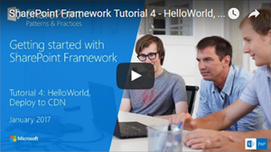
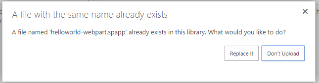

# <a name="deploy-your-sharepoint-client-side-web-part-to-a-cdn"></a>Bereitstellen Ihres clientseitigen SharePoint-Webparts in einem CDN

In diesem Artikel stellen Sie die **HelloWorld**-Ressourcen auf einem Remote-CDN und nicht mithilfe der lokalen Umgebung bereit. Sie verwenden ein Azure-Speicherkonto, das in ein CDN integriert ist, um Ihre Ressourcen bereitzustellen. Die Buildtools von SharePoint Framework bieten eine sofort nutzbare Unterstützung für die Bereitstellung auf einem Azure-Speicherkonto. Sie können die Dateien jedoch auch manuell an einen CDN-Anbieter Ihrer Wahl oder nach SharePoint hochladen.

Sie können die nachfolgend beschriebene Anleitung auch anhand dieses Videos in unserem [YouTube-Kanal „SharePoint Patterns & Practices“](https://www.youtube.com/watch?v=FDGatKnjNeM&list=PLR9nK3mnD-OXvSWvS2zglCzz4iplhVrKq) nachvollziehen: 

<a href="https://www.youtube.com/watch?v=FDGatKnjNeM&list=PLR9nK3mnD-OXvSWvS2zglCzz4iplhVrKq">

</a>

## <a name="prerequisites"></a>Voraussetzungen

Führen Sie die folgenden Schritte aus, bevor Sie starten:

* [Erstellen des ersten clientseitigen Webparts](./build-a-hello-world-web-part)
* [Verbinden des clientseitigen Webparts mit SharePoint](./connect-to-sharepoint)
* [Bereitstellen des clientseitigen SharePoint-Webparts auf einer klassischen SharePoint-Seite](./serve-your-web-part-in-a-sharepoint-page)

## <a name="configure-azure-storage-account"></a>Konfigurieren eines Azure-Speicherkontos

Konfigurieren Sie ein Azure-Speicherkonto, und integrieren Sie es in das CDN.

Sie können die Anweisungen im Artikel [Integrieren eines Speicherkontos in CDN](https://azure.microsoft.com/en-us/documentation/articles/cdn-create-a-storage-account-with-cdn/) zusammen mit den detaillierten Schritten in diesem Artikel verwenden, um ein Azure -Speicherkonto zu erstellen und dieses in das CDN zu integrieren. Sie benötigen die folgenden Informationen:

### <a name="storage-account-name"></a>Speicherkontoname

Dies ist der Name, den Sie zum Erstellen des Speicherkontos verwendet haben, wie in [Schritt 1: Erstellen eines Speicherkontos](https://azure.microsoft.com/en-us/documentation/articles/cdn-create-a-storage-account-with-cdn/#step-1-create-a-storage-account) beschrieben.

Im folgenden Screenshot ist **spfxsamples** der Name des Speicherkontos.


Auf diese Weise wird der neue Speicherkontoendpunkt **spfxsamples.blob.core.windows.net** erstellt. 

>**Hinweis:** Sie müssen einen eindeutigen Speichernamen für Ihr SharePoint Framework-Projekt erstellen.


### <a name="blob-container-name"></a>Name des BLOB-Containers

Erstellen Sie einen neuen Blob-Dienstcontainer. Dieser ist im Dashboard des Speicherkontos verfügbar.

Wählen Sie **+ Container** aus, und erstellen Sie einen neuen Container mit den folgenden Angaben:

* Name: **helloworld-webpart**
* Zugriffstyp: Container


### <a name="storage-account-access-key"></a>Tastenkombination für Speicherkonto

Wählen Sie im Dashboard des Speicherkontos die Option **Tastenkombination** im Dashboard aus, und kopieren Sie eine der Tastenkombinationen.


### <a name="cdn-profile-and-endpoint"></a>CDN-Profil und Endpunkt

Erstellen Sie ein neues CDN-Profil, und weisen Sie den CDN-Endpunkt diesem BLOB-Container zu.

Erstellen Sie ein neues CDN-Profil, wie unter [Schritt 2: Erstellen eines neuen CDN-Profils](https://azure.microsoft.com/en-us/documentation/articles/cdn-create-a-storage-account-with-cdn/#step-2-create-a-new-cdn-profile) beschrieben.

Im folgenden Screenshot ist **spfxwebparts** der Name des CDN-Profils.


Erstellen Sie einen CND-Endpunkt, wie unter [Schritt 3: Erstellen eines neuen CDN-Endpunkts](https://azure.microsoft.com/en-us/documentation/articles/cdn-create-a-storage-account-with-cdn/#step-3-create-a-new-cdn-endpoint) beschrieben.

Im folgenden Screenshot ist **spfxsamples** beispielsweise der Endpunktname **Speicher** ist der Ursprungstyp, und **spfxsamples.blob.core.windows.net** ist das Speicherkonto.


Der CDN-Endpunkt wird mit folgender URL erstellt: http://spfxsamples.azureedge.net

Da Sie den CDN-Endpunkt dem Speicherkonto zugewiesen haben, können Sie auch unter der folgenden URL auf den BLOB-Container zugreifen:http://spfxsamples.azureedge.net/helloworld-webpart/

Beachten Sie jedoch, dass Sie die Dateien noch nicht bereitgestellt haben.

## <a name="project-directory"></a>Projektverzeichnis:

Wechseln Sie zur Konsole, und stellen Sie sicher, dass Sie sich noch in dem Projektverzeichnis befinden, das Sie zum Einrichten des Webpart-Projekts verwendet haben.

Beenden Sie die Aufgabe **gulp serve**, indem Sie **STRG + C** auswählen, und wechseln Sie zu Ihrem Projektverzeichnis:

```
cd helloworld-webpart
```

## <a name="configure-azure-storage-account-details"></a>Konfigurieren der Details eines Azure-Speicherkontos

Wechseln Sie zu Visual Studio Code, und gehen Sie dann zu Ihrem **HelloWorld**-Webpart-Projekt.

Öffnen Sie **deploy-azure-storage.json** im Ordner **config**.

Das ist die Datei, die die Details zu Ihrem Speicherkonto enthält.

```json
{
  "workingDir": "./temp/deploy/",
  "account": "<!-- STORAGE ACCOUNT NAME -->",
  "container": "helloworld-webpart",
  "accessKey": "<!-- ACCESS KEY -->"
}
```

Ersetzen Sie **Konto**, **Container** und **accessKey** jeweils mit dem Speicherkontonamen, dem BLOB-Container und der Tastenkombination für das Speicherkonto.

**workingDir** ist das Verzeichnis, in dem sich die Webpartressourcen befinden.

In diesem Beispiel sieht diese Datei mit dem zuvor erstellten Speicherkonto wie folgt aus:

```json
{
  "workingDir": "./temp/deploy/",
  "account": "spfxsamples",
  "container": "helloworld-webpart",
  "accessKey": "q1UsGWocj+CnlLuv9ZpriOCj46ikgBvDBCaQ0FfE8+qKVbDTVSbRGj41avlG73rynbvKizZpIKK9XpnpA=="
}
```

Speichern Sie die Datei.

## <a name="configuring-web-part-to-load-from-cdn"></a>Konfigurieren von Webparts, die aus dem CDN geladen werden

Damit das Webpart aus Ihrem CDN geladen wird, müssen Sie ihm den CDN-Pfad mitteilen.

Wechseln Sie zu Visual Studio Code, und öffnen Sie **write-manifests.json** aus dem Ordner **config**.

Geben Sie den Pfad der CDN-Basis für die **cdnBasePath**-Eigenschaft ein.

```json
{
  "cdnBasePath": "<!-- PATH TO CDN -->"
}
```

In diesem Beispiel sieht diese Datei mit dem zuvor erstellten CDN-Profil wie folgt aus:

```json
{
  "cdnBasePath": "https://spfxsamples.azureedge.net/helloworld-webpart/"
}
```

>**Hinweis:** Der CDN-Basispfad ist der CDN-Endpunkt mit dem BLOB-Container.

Speichern Sie die Datei.


## <a name="prepare-web-part-assets-to-deploy"></a>Vorbereiten der bereitzustellenden Webpartressourcen

Bevor Sie die Ressourcen in das CDN hochladen, müssen Sie sie erstellen.

Wechseln Sie zur Konsole, und führen Sie die folgenden `gulp`-Aufgabe aus:

```
gulp --ship
```

Dadurch werden die minimierten Ressourcen erstellt, die zum Hochladen an den CDN-Anbieter erforderlich sind. In `--ship` ist das Buildtool zum Erstellen für die Verteilung dargestellt. Beachten Sie außerdem die Ausgabe der Buildtools, die angibt, dass das Build-Ziel SHIP ist.

```
Build target: SHIP
[21:23:01] Using gulpfile ~/apps/helloworld-webpart/gulpfile.js
[21:23:01] Starting gulp
[21:23:01] Starting 'default'...
```

Die minimierten Ressourcen befinden sich im `temp\deploy`-Verzeichnis.

## <a name="deploy-assets-to-azure-storage"></a>Bereitstellen von Ressourcen für Azure Storage

Wechseln Sie zur Konsole des **HelloWorld**-Projektverzeichnisses.

Geben Sie die gulp-Aufgabe an, um die Ressourcen in Ihrem Speicherkonto bereitzustellen:

```
gulp deploy-azure-storage
```

Dadurch wird das Webpartbundle zusammen mit anderen Ressourcen wie JavaScript- und CSS-Dateien im CDN bereitgestellt.

## <a name="deploy-the-updated-package"></a>Bereitstellen des aktualisierten Pakets

### <a name="package-the-solution"></a>Verpacken der Lösung

Da Sie das Webpartbundle geändert haben, müssen Sie das Paket erneut im App-Katalog bereitstellen. Sie haben **--ship** verwendet, um minimierte Ressourcen für die Verteilung zu generieren.

Wechseln Sie zur Konsole des **HelloWorld**-Projektverzeichnisses.

Geben Sie die gulp-Aufgabe zum Verpacken der clientseitigen Lösung an, dieses Mal mit gesetztem `--ship`-Flag. Dadurch wird die Aufgabe gezwungen, den im vorherigen Schritt konfigurierten CDN-Basispfad aufzugreifen:

```
gulp package-solution --ship
```

Dadurch wird das aktualisierte clientseitige Lösungspaket im Ordner **sharepoint\solution** erstellt.

### <a name="upload-to-your-app-catalog"></a>Hochladen in den App-Katalog

Laden Sie das clientseitige Lösungspaket in den App-Catalog hoch, oder verwenden Sie Drag & Drop.

Da Sie das Paket bereits bereitgestellt haben, werden Sie gefragt, ob das vorhandene Paket ersetzt werden soll.



Wählen Sie **Ersetzen**.

Der App-Katalog verfügt nun über das neueste clientseitige Lösungspaket, in das das Webpartbundle aus dem CDN geladen wird.

Dadurch werden alle Instanzen des **HelloWorld**-Webparts in SharePoint so aktualisiert, dass nun die Ressourcen aus CDN abgerufen werden.

## <a name="test-the-helloworld-web-part"></a>Testen des HelloWorld-Webparts

### <a name="classic-sharepoint-page"></a>Klassische SharePoint-Seite

Wechseln Sie zu der **HelloWorld**-Webpartseite, die Sie erstellt haben. Das **HelloWorld**-Webpart lädt nun das Webpartbundle und andere Ressourcen aus dem CDN.

Beachten Sie, dass **gulp serve** nicht mehr ausgeführt wird und dass deshalb nichts von **localhost** kommt.

## <a name="deploying-to-other-cdns"></a>Bereitstellen auf anderen CDNs

Um die Ressourcen auf Ihrem bevorzugten CDN-Anbieter bereitzustellen, können Sie die Dateien aus dem Ordner **tmp\deploy** kopieren. Zum Generieren der Ressourcen für die Verteilung führen Sie den folgenden gulp-Befehl so aus wie zuvor den **--ship**-Parameter:

```
gulp --ship
```

Solange Sie die **cdnBasePath**-Eigenschaft entsprechend aktualisieren, werden Ihre Dateien ordnungsgemäß geladen.

## <a name="next-steps"></a>Nächste Schritte

Sie können jQuery und jQueryUI laden und ein jQuery Accordion-Webpart erstellen. Lesen Sie die Informationen unter [Hinzufügen von jQueryUI Accordion zu Ihrem clientseitigen Webpart](./add-jqueryui-accordion-to-web-part), um fortzufahren.
