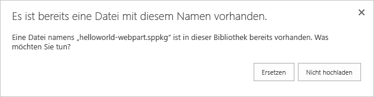
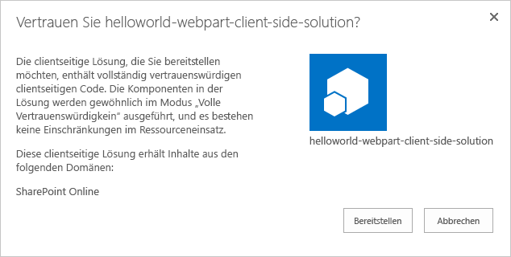
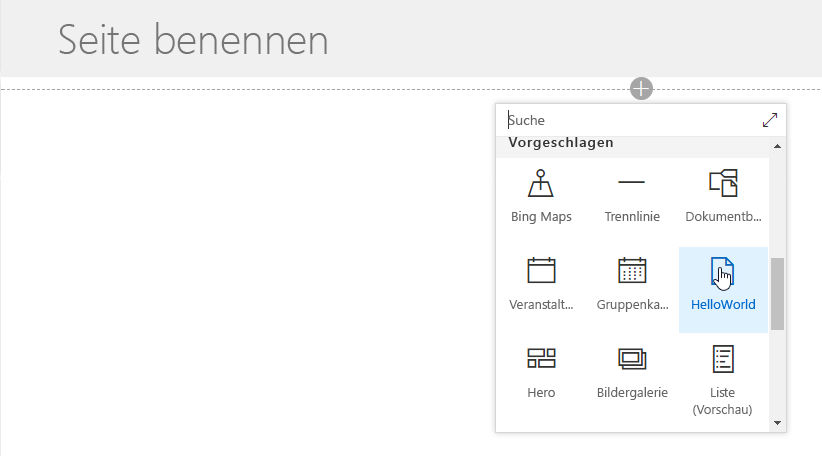

# <a name="hosting-client-side-web-part-from-office-365-cdn-hello-world-part-4"></a>Hosten clientseitiger Webparts in Office 365 CDN (Hello Word, Teil 4)

In diesem Artikel wird beschrieben, wie Sie clientseitige Webparts in Office 365 CDN hosten. Office 365 CDN ist eine einfache Lösung, mit der Sie Ihre Ressourcen direkt in Ihrem eigenen Office 365-Mandanten hosten können. Es können beliebige statische Ressourcen gehostet werden, die in SharePoint Online verwendet werden. 

> [!NOTE]
> Es gibt mehrere unterschiedliche Hostingoptionen für Webpart-Objekte. In diesem Lernprogramm steht die Option „Office 365 CDN“ im Vordergrund, Sie können jedoch auch das [Azure CDN](./deploy-web-part-to-cdn.md) verwenden oder einfach Ihre Objekte aus der SharePoint-Bibliothek aus dem Mandanten hosten. Im letzteren Fall würden Sie nicht von den CDN-Leistungssteigerungen profitieren, im Hinblick auf die Funktionalität wäre dies jedoch möglich. Technisch gesehen wäre jeder Ort zum Hosten der Objekte für Endbenutzer denkbar, auf den Endbenutzer über HTTP(S) zugreifen können.

> [!IMPORTANT]
> In diesem Artikel wird das `includeClientSideAssets`-Attribut verwendet, das in SPFx v1.4 eingeführt wurde. Diese Version wird mit **SharePoint 2016 Feature Pack 2** nicht unterstützt. Wenn Sie lokales Setup verwenden, müssen Sie den CDN-Hostingspeicherort separat festlegen. Sie können die JavaScript-Dateien auch einfach über die zentrale Bibliothek in Ihrer lokalen SharePoint-Umgebung hosten, auf die die Benutzer Zugriff haben. Siehe auch weitere Überlegungen in den [Anleitungen zu SharePoint 2016](../../sharepoint-2016-support.md).

## <a name="prerequisites"></a>Voraussetzungen

Führen Sie die folgenden Schritte aus, bevor Sie starten:

* [Erstellen des ersten clientseitigen Webparts](./build-a-hello-world-web-part.md)
* [Verbinden des clientseitigen Webparts mit SharePoint](./connect-to-sharepoint.md)
* [Bereitstellen des clientseitigen SharePoint-Webparts auf einer klassischen SharePoint-Seite](./serve-your-web-part-in-a-sharepoint-page.md)


Sie können die nachfolgend beschriebene Anleitung auch anhand dieses Videos in unserem [YouTube-Kanal „SharePoint Patterns & Practices“](https://www.youtube.com/watch?v=MEZMs8VMVQ0&list=PLR9nK3mnD-OXvSWvS2zglCzz4iplhVrKq) nachvollziehen:

<a href="https://www.youtube.com/watch?v=MEZMs8VMVQ0&list=PLR9nK3mnD-OXvSWvS2zglCzz4iplhVrKq">

</a>


## <a name="enable-cdn-in-your-office-365-tenant"></a>Aktivieren von CDN in Ihrem Office 365-Mandanten
Stellen Sie sicher, dass Sie die neueste Version der SharePoint Online-Verwaltungsshell verwenden. Herunterladen können Sie sie im [Microsoft Download Center](https://www.microsoft.com/en-us/download/details.aspx?id=35588).

> [!TIP]
> Wenn Sie keinen Windows-Computer verwenden, können Sie die SPO-Verwaltungsshell nicht verwenden. Sie können diese Einstellungen jedoch über die [Office 365 CLI]((https://sharepoint.github.io/office365-cli/)) verwalten.

Verbinden Sie sich über eine PowerShell-Sitzung mit Ihrem SharePoint Online-Mandanten.
```
Connect-SPOService -Url https://contoso-admin.sharepoint.com
```

Führen Sie nacheinander die folgenden Befehle aus, um den aktuellen Status der auf Mandantenebene festgelegten Einstellungen für öffentliche CDNs abzurufen: 
```
Get-SPOTenantCdnEnabled -CdnType Public
Get-SPOTenantCdnOrigins -CdnType Public
Get-SPOTenantCdnPolicies -CdnType Public
```
Aktivieren Sie öffentliche CDNs im Mandanten
```
Set-SPOTenantCdnEnabled -CdnType Public
```
Bestätigen Sie Einstellungen, indem Sie „Y“ wählen und Sie **EINGABETASTE** drücken.


Jetzt sind öffentliche CDNs im Mandanten aktiviert, mit der Standardkonfiguration für zulässige Dateitypen. Dies bedeutet, dass die folgenden Dateitypen unterstützt werden: CSS, EOT, GIF, ICO, JPEG, JPG, JS, MAP, PNG, SVG, TTF und WOFF.

SharePoint-Framework-Lösungen können automatisch von den öffentlichen CDNs in Office 365 profitieren, solange diese in Ihrem Mandanten aktiviert sind. Wenn CDN aktiviert ist, wird der `*/CLIENTSIDEASSETS`-Ursprung automatisch als gültiger Ursprung hinzugefügt.

> [!NOTE]
> Wenn Sie zuvor Office 365 CDN aktiviert haben, sollten Sie das öffentliche CDN erneut aktivieren, damit der `*/CLIENTSIDEASSETS`-Eintrag als gültiger CDN-Ursprung für das öffentliche CDN hinzugefügt wird.

Sie können die aktuelle Konfiguration Ihrer Endpunkte nochmals prüfen. Führen Sie den folgenden Befehl aus, um die Liste der CDN-Ursprünge aus Ihrem Mandanten abzurufen.
```
Get-SPOTenantCdnOrigins -CdnType Public
```
Sie sehen, dass der neu hinzugefügte Ursprung als gültiger CDN-Ursprung aufgeführt ist. Die endgültige Konfiguration des Ursprungs dauert einige Zeit (ca. 15 Minuten). Während Sie warten, können Sie ein Testwebpart erstellen, das nach Abschluss der Bereitstellung im Ursprung gehostet wird. 


> [!NOTE]
> Sobald ein Ursprung nicht mehr mit *(Konfiguration steht aus)* gekennzeichnet ist, kann er in Ihrem Mandanten verwendet werden. Dieser Text weist auf laufende Konfigurationsaktivitäten zwischen SharePoint Online und dem CDN-System hin. 


## <a name="project-directory"></a>Projektverzeichnis:

Wechseln Sie zur Konsole, und stellen Sie sicher, dass Sie sich noch in dem Projektverzeichnis befinden, das Sie zum Einrichten des Webpart-Projekts verwendet haben.

Beenden Sie die Aufgabe **gulp serve**, indem Sie **STRG + C** auswählen, und wechseln Sie zu Ihrem Projektverzeichnis:

```
cd helloworld-webpart
```

# <a name="review-solution-settings"></a>Prüfen von Projektmappeneinstellungen 

Öffnen Sie das **HelloWorldWebPart**-Webpart-Projekt in Visual Studio Code oder in Ihrer bevorzugten IDE.

Öffnen Sie **package-solution.json** im Ordner **config**.

Die Datei **package-solution.json** definiert die Paketmetadaten, wie im folgenden Code dargestellt:

```json
{
  "$schema": "https://dev.office.com/json-schemas/spfx-build/package-solution.schema.json",
  "solution": {
    "name": "helloworld-webpart-client-side-solution",
    "id": "4432f33b-5845-4ca0-827e-a8ae68c7b945",
    "version": "1.0.0.0",
    "includeClientSideAssets": true
  },
  "paths": {
    "zippedPackage": "solution/helloworld-webpart.sppkg"
  }
}

```

Standardwert für **includeClientSideAssets** ist `true`. Dies bedeutet, dass statische Objekte automatisch in den *.sppkg*-Dateien gepackt werden und nicht separat von einem externen System gehostet werden müssen. 

Wenn *Office 365 CDN* aktiviert ist, werden automatisch die Standardeinstellungen verwendet. Wenn *Office 365 CDN* nicht aktiviert ist, werden Objekte von der App-Katalog-Websitesammlung bereitgestellt. 

> [!NOTE]
> Ab SharePoint-Framework v1. 4 werden statische Objekte standardmäßig in das .sppkg-Paket gepackt. Wenn das Paket im App-Katalog bereitgestellt wird, werden sie automatisch in Office 365 CDN (falls aktiviert) oder in der App-Katalog-URL gehostet. Sie können dieses Verhalten mit der `includeClientSideAssets`-Einstellung in der `package-solution.json`-Datei steuern.

## <a name="prepare-web-part-assets-to-deploy"></a>Vorbereiten der bereitzustellenden Webpartressourcen

Führen Sie die folgenden Aufgaben aus, um Ihre Lösung in einem Bundle zu verpacken.
* Dadurch wird ein Versionsbuild des Projekts ausgeführt, indem eine dynamische Bezeichnung als die Host-URL für Ihre Objekte verwendet wird. Diese URL wird automatisch auf Grundlage Ihrer CDN-Mandanteneinstellungen aktualisiert.

```
gulp bundle --ship
```

Führen Sie die folgende Aufgaben aus, um Ihre Lösung zu packen.

```
gulp package-solution --ship
```

Mit diesem Befehl wird ein aktualisiertes **helloworld-webpart.sppkg**-Paket im Ordner **sharepoint/solution** erstellt.

> [!NOTE]
> Informationen zu den Elementen, die in die .sppkg-Datei gepackt werden, finden Sie in dem Ordner **sharepoint/solution/debug**.

Laden Sie das neu erstellte Paket mit ihrer clientseitigen Lösung in den App-Katalog in Ihrem Mandanten hoch. Alternativ können Sie es auch per Drag & Drop verschieben. 

Da Sie das Paket bereits bereitgestellt haben, werden Sie gefragt, ob das vorhandene Paket ersetzt werden soll.



Wählen Sie „Ersetzen“.



Beachten Sie, dass die **Domänenliste** in der Aufforderung *SharePoint Online* enthält. Dies ist der Fall, da der Inhalt, je nach Mandanteneinstellungen, entweder von dem Office 365 CDN oder dem App-Katalog bereitgestellt wird.

Wählen Sie **Bereitstellen** aus.

Öffnen Sie eine Website, auf der Sie zuvor die **helloworld-webpart-client-side-solution**-Lösung installiert haben, oder installieren Sie die Lösung auf einer neuen Website.

Nachdem die Lösung installiert wurde, wählen Sie **Seite hinzufügen** im Menü mit dem *Zahnradsymbol*, und wählen Sie **HelloWorld** in der Webpartauswahl für die moderne Seite aus, um Ihr benutzerdefiniertes Webpart zur Seite hinzuzufügen.



Sie sehen: Das Webpart wird gerendert, obwohl der node.js-Dienst nicht lokal ausgeführt wird. 


Speichern Sie die Änderungen auf der Seite mit dem Webpart.

Drücken Sie **F12**, um die Entwicklungstools zu öffnen.

Erweitern Sie **publiccdn.sharepointonline.com** unter Quellen, und achten Sie darauf, dass die Datei **hello-world-web-part** von der URL des öffentlichen CDN geladen wird, die dynamisch auf eine Bibliothek in der App-Katalog-Websitesammlung verweist.


> [!NOTE]
> Wenn Sie CDN nicht in Ihrem Mandanten aktiviert hätten und die `includeClientSideAssets`-Einstellung in **package-solution.json** `true` lauten würde, würde das Laden der URL für die Objekte dynamisch aktualisiert und sie würden direkt auf den ClientSideAssets-Ordner in der App-Katalog-Websitesammlung verweisen. In diesem Beispiel lautet die URL: `https://sppnp.microsoft.com/sites/apps/ClientSideAssets/`.

Ihr benutzerdefiniertes Webpart ist jetzt in SharePoint Online bereitgestellt und wird automatisch in Office 365 CDN gehostet.

## <a name="next-steps"></a>Nächste Schritte

Sie können jQuery und jQueryUI laden und ein jQuery Accordion-Webpart erstellen. Lesen Sie die Informationen unter [Hinzufügen von jQueryUI Accordion zu Ihrem clientseitigen Webpart](./add-jqueryui-accordion-to-web-part.md), um fortzufahren.

> [!NOTE]
> Wenn Sie einen Fehler in der Dokumentation oder im SharePoint-Framework finden, melden Sie ihn an das SharePoint Engineering unter Verwendung der [Fehlerliste im sp-dev-docs-Repository]((https://github.com/SharePoint/sp-dev-docs/issues)). Vielen Dank im Voraus für Ihr Feedback.