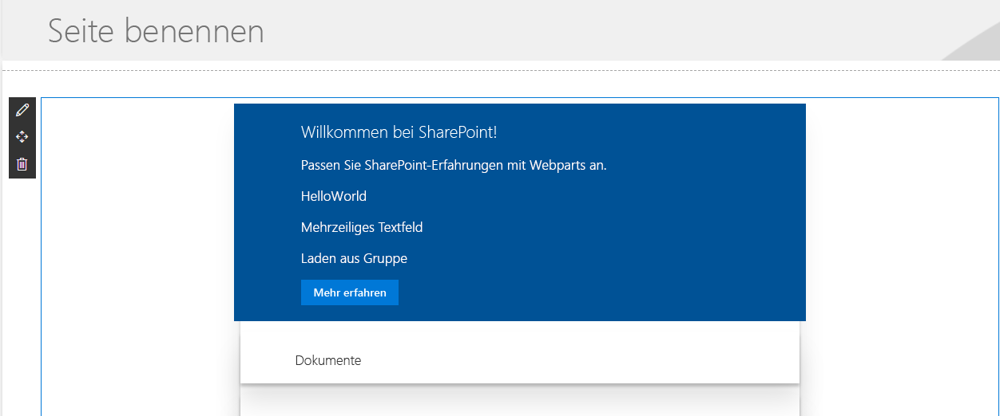

# <a name="hosting-client-side-web-part-from-office-365-cdn"></a><span data-ttu-id="47b55-102">Hosten clientseitiger Webparts in Office 365 CDN</span><span class="sxs-lookup"><span data-stu-id="47b55-102">Hosting client-side web part from Office 365 CDN</span></span>

<span data-ttu-id="47b55-p101">In diesem Artikel wird beschrieben, wie Sie clientseitige Webparts in Office 365 CDN hosten. Office 365 CDN ist eine einfache Lösung, mit der Sie Ihre Ressourcen direkt in Ihrem eigenen Office 365-Mandanten hosten können. Es können beliebige statische Ressourcen gehostet werden, die in SharePoint Online verwendet werden. Weitere Details zur Office 365 CDN-Funktion finden Sie in diesem Blogbeitrag:</span><span class="sxs-lookup"><span data-stu-id="47b55-p101">This article describes how to host your client-side web part from Office 365 CDN. Office 365 CDN provide you easy solution to host your assets directly from your own Office 365 tenant. It can be used for hosting any static assets, which are used in SharePoint Online. You can find more details around the Office 365 CDN capability from following blog post.</span></span>

* [<span data-ttu-id="47b55-107">General availability of Office 365 CDN</span><span class="sxs-lookup"><span data-stu-id="47b55-107">General availability of Office 365 CDN</span></span>](https://dev.office.com/blogs/general-availability-of-office-365-cdn)

## <a name="enable-cdn-in-your-office-365-tenant"></a><span data-ttu-id="47b55-108">Aktivieren von CDN in Ihrem Office 365-Mandanten</span><span class="sxs-lookup"><span data-stu-id="47b55-108">Enable CDN in your Office 365 tenant</span></span>
<span data-ttu-id="47b55-109">Stellen Sie sicher, dass Sie die neueste Version der SharePoint Online-Verwaltungsshell verwenden. Herunterladen können Sie sie im [Microsoft Download Center](https://www.microsoft.com/en-us/download/details.aspx?id=35588).</span><span class="sxs-lookup"><span data-stu-id="47b55-109">Ensure that you have latest version of the SharePoint Online Management Shell by downloading it from [Microsoft Download site](https://www.microsoft.com/en-us/download/details.aspx?id=35588).</span></span>

<span data-ttu-id="47b55-110">Verbinden Sie sich über eine PowerShell-Sitzung mit Ihrem SharePoint Online-Mandanten.</span><span class="sxs-lookup"><span data-stu-id="47b55-110">Connect to your SharePoint Online tenant with PowerShell session.</span></span>
```
Connect-SPOService -Url https://contoso-admin.sharepoint.com
```

<span data-ttu-id="47b55-111">Führen Sie nacheinander die folgenden Befehle aus, um den aktuellen Status der auf Mandantenebene festgelegten Einstellungen für öffentliche CDNs abzurufen:</span><span class="sxs-lookup"><span data-stu-id="47b55-111">Get current status of public CDN settings from tenant level by executing following commands one-by-one.</span></span> 
```
Get-SPOTenantCdnEnabled -CdnType Public
Get-SPOTenantCdnOrigins -CdnType Public
Get-SPOTenantCdnPolicies -CdnType Public
```
<span data-ttu-id="47b55-112">Aktivieren Sie öffentliche CDNs im Mandanten</span><span class="sxs-lookup"><span data-stu-id="47b55-112">Enable public CDN in the tenant</span></span>
```
Set-SPOTenantCdnEnabled -CdnType Public
```
<span data-ttu-id="47b55-p102">Jetzt sind öffentliche CDNs im Mandanten aktiviert, mit der Standardkonfiguration für zulässige Dateitypen. Dies bedeutet, dass die folgenden Dateitypen unterstützt werden: CSS, EOT, GIF, ICO, JPEG, JPG, JS, MAP, PNG, SVG, TTF und WOFF.</span><span class="sxs-lookup"><span data-stu-id="47b55-p102">Now public CDN has been enabled in the tenant using the default file type configuration allowed. This means that the following file type extensions are supported: "CSS,EOT,GIF,ICO,JPEG,JPG,JS,MAP,PNG,SVG,TTF,WOFF".</span></span>

<span data-ttu-id="47b55-p103">Öffnen Sie einen Browser, und navigieren Sie zu der Websitesammlung, in der Sie Ihre CDN-Bibliothek hosten möchten. Das kann jede beliebige Websitesammlung in Ihrem Mandanten sein. In diesem Tutorial erstellen Sie eine spezifische Bibliothek, die als Ihre CDN-Bibliothek fungiert. Sie können aber auch einen spezifischen Ordner in einer beliebigen bereits vorhandenen Dokumentbibliothek als CDN-Endpunkt nutzen.</span><span class="sxs-lookup"><span data-stu-id="47b55-p103">Open up a browser and move to a site collection where you'd like to host your CDN library. This could be any site collection in your tenant. In this tutorial, we create a specific library to act as your CDN library, but you can also use a specific folder in any existing document library as the CDN endpoint.</span></span>

<span data-ttu-id="47b55-118">Erstellen Sie in Ihrer Websitesammlung eine neue Dokumentbibliothek namens **CDN**, und fügen Sie ihr einen Ordner namens **helloworld** hinzu.</span><span class="sxs-lookup"><span data-stu-id="47b55-118">Create a new document library on your site collection called **CDN** and add a folder called **helloworld** to it.</span></span>

 

<span data-ttu-id="47b55-p104">Wechseln Sie wieder zur PowerShell-Konsole, und fügen Sie einen neuen CDN-Ursprung hinzu. Aktualisieren Sie die unten angegebene URL gemäß Ihrer Umgebung:</span><span class="sxs-lookup"><span data-stu-id="47b55-p104">Move back to your PowerShell console and add a new CDN origin. Update the provided URL below to match your own environment.</span></span> 
```
Add-SPOTenantCdnOrigin -CdnType Public -OriginUrl sites/cdn/cdn
```
<span data-ttu-id="47b55-122">Führen Sie den folgenden Befehl aus, um eine Liste aller CDN-Ursprünge von Ihrem Mandanten abzurufen:</span><span class="sxs-lookup"><span data-stu-id="47b55-122">Execute the following command to get the list of CDN origins from your tenant</span></span>
```
Get-SPOTenantCdnOrigins -CdnType Public
```
<span data-ttu-id="47b55-p105">Sie sehen, dass der neu hinzugefügte Ursprung als gültiger CDN-Ursprung aufgeführt ist. Die endgültige Konfiguration des Ursprungs dauert einige Zeit (ca. 15 Minuten). Während Sie warten, können Sie ein Testwebpart erstellen, das nach Abschluss der Bereitstellung im Ursprung gehostet wird.</span><span class="sxs-lookup"><span data-stu-id="47b55-p105">Notice that your newly added origin is listed as a valid CDN origin. Final configuration of the origin will take a while (approximately 15 minutes), so we can continue by creating your test web part, which will be hosted from the origin, when the deployment is completed.</span></span> 


> <span data-ttu-id="47b55-126">Sobald ein Ursprung nicht mehr mit *(Konfiguration steht aus)* gekennzeichnet ist, kann er in Ihrem Mandanten verwendet werden.</span><span class="sxs-lookup"><span data-stu-id="47b55-126">When origin is listed without the *(configuration pending)* text, it is ready to be used in your tenant. This is indicating on-going configuration between SharePoint Online and CDN system.</span></span> <span data-ttu-id="47b55-127">Dieser Text weist auf laufende Konfigurationsaktivitäten zwischen SharePoint Online und dem CDN-System hin.</span><span class="sxs-lookup"><span data-stu-id="47b55-127">When origin is listed without the (configuration pending) text, it is ready to be used in your tenant. This is the indication of an on-going configuration between SharePoint Online and CDN system.</span></span> 

## <a name="creating-a-new-web-part-project"></a><span data-ttu-id="47b55-128">Erstellen eines neuen Webpartprojekts</span><span class="sxs-lookup"><span data-stu-id="47b55-128">Creating a new Web Part project</span></span>

<span data-ttu-id="47b55-129">Erstellen Sie an einem Speicherort Ihrer Wahl ein neues Projektverzeichnis:</span><span class="sxs-lookup"><span data-stu-id="47b55-129">Create a new project directory in your preferred location:</span></span>

```
md sphosted-webpart
```
    
<span data-ttu-id="47b55-130">Wechseln Sie in das Projektverzeichnis:</span><span class="sxs-lookup"><span data-stu-id="47b55-130">Go to the project directory:</span></span>

```
cd sphosted-webpart
```

<span data-ttu-id="47b55-131">Führen Sie den Yeoman-SharePoint-Generator aus, um eine neue SharePoint Framework-Lösung zu erstellen:</span><span class="sxs-lookup"><span data-stu-id="47b55-131">Create a new SharePoint Framework solution by running Yeoman SharePoint Generator:</span></span>

```
yo @microsoft/sharepoint
```
    
<span data-ttu-id="47b55-132">Es werden verschiedene Eingabeaufforderungen angezeigt. Gehen Sie wie folgt vor:</span><span class="sxs-lookup"><span data-stu-id="47b55-132">When prompted:</span></span>

* <span data-ttu-id="47b55-133">Akzeptieren Sie den Standardnamen **sphosted-webpart** als Lösungsnamen, und drücken Sie die **EINGABETASTE**.</span><span class="sxs-lookup"><span data-stu-id="47b55-133">Accept the default **sphosted-webpart** as your solution name and choose **Enter**.</span></span>
* <span data-ttu-id="47b55-134">Wählen Sie **SharePoint Online only (latest)**, und drücken Sie die **EINGABETASTE**.</span><span class="sxs-lookup"><span data-stu-id="47b55-134">Choose **SharePoint Online only (latest)**, and press **Enter**.</span></span>
* <span data-ttu-id="47b55-135">Wählen Sie als Speicherort für die Dateien die Option **Use the current folder** aus.</span><span class="sxs-lookup"><span data-stu-id="47b55-135">Select **Use the current folder** for where to place the files.</span></span>
* <span data-ttu-id="47b55-136">Wählen Sie **N**, damit die Erweiterung auf jeder Website explizit installiert werden muss, wenn sie verwendet wird.</span><span class="sxs-lookup"><span data-stu-id="47b55-136">Choose **N** to require the extension to be installed on each site explicitly when it's being used.</span></span> 
* <span data-ttu-id="47b55-137">Wählen Sie **Webpart** als den zu erstellenden Typ von clientseitiger Komponente aus.</span><span class="sxs-lookup"><span data-stu-id="47b55-137">Choose **Webpart** as the client-side component type to be created.</span></span> 
* <span data-ttu-id="47b55-138">Akzeptieren Sie den Standardnamen **HelloWorld** als Namen für Ihr Webpart, und drücken Sie die **EINGABETASTE**.</span><span class="sxs-lookup"><span data-stu-id="47b55-138">Accept the default **HelloWorld** as your web part name and choose **Enter**.</span></span>
* <span data-ttu-id="47b55-139">Akzeptieren Sie die Standardbeschreibung **HelloWorld description** als Beschreibung für Ihr Webpart, und drücken Sie die **EINGABETASTE**.</span><span class="sxs-lookup"><span data-stu-id="47b55-139">Accept the default **HelloWorld description** as your web part description and choose **Enter**.</span></span>
* <span data-ttu-id="47b55-140">Akzeptieren Sie die Standardeinstellung **No javaScript web framework** als das zu verwendende Framework, und drücken Sie die **EINGABETASTE**.</span><span class="sxs-lookup"><span data-stu-id="47b55-140">Accept the default **No javascript web framework** as the framework you would like to use and choose **Enter**.</span></span>


<span data-ttu-id="47b55-p107">An diesem Punkt erstellt Yeoman ein Gerüst für die Lösungsdateien und installiert die erforderlichen Abhängigkeiten. Das kann einige Minuten dauern. Yeoman nimmt auch Ihr benutzerdefiniertes Webpart in das Projektgerüst auf.</span><span class="sxs-lookup"><span data-stu-id="47b55-p107">At this point, Yeoman will scaffold the solution files and install the required dependencies. This might take a few minutes. Yeoman will scaffold the project to include your custom web part as well.</span></span>

<span data-ttu-id="47b55-145">Sobald das Gerüst abgeschlossen ist, sperren Sie die Version der Projektabhängigkeiten, indem Sie den folgenden Befehl ausführen:</span><span class="sxs-lookup"><span data-stu-id="47b55-145">Once the scaffolding completes, lock down the version of the project dependencies by running the following command:</span></span>

```sh
npm shrinkwrap
```

<span data-ttu-id="47b55-146">Geben Sie Folgendes ein, um das Webpart-Projekt in Visual Studio Code zu öffnen:</span><span class="sxs-lookup"><span data-stu-id="47b55-146">In the console, type the following to open the web part project in Visual Studio Code:</span></span>

```
code .
```
<span data-ttu-id="47b55-147">Aktualisieren Sie die Datei *write-manifests.json* im Ordner *config* wie unten dargestellt, damit sie auf Ihren CDN-Endpunkt verweist.</span><span class="sxs-lookup"><span data-stu-id="47b55-147">Update the *write-manifests.json* file (under *config* folder) as follow to point to your CDN endpoint.</span></span> 
- <span data-ttu-id="47b55-148">Dabei müssen Sie „publiccdn.sharepointonline.com“ als Präfix verwenden und die URL anschließend um den tatsächlichen Pfad in Ihrem Mandanten erweitern.</span><span class="sxs-lookup"><span data-stu-id="47b55-148">You will need to use the publiccdn.sharepointonline.com as the prefix and then extend the URL with the actual path in your tenant</span></span>
* <span data-ttu-id="47b55-149">Die CDN-URL hat folgendes Format:</span><span class="sxs-lookup"><span data-stu-id="47b55-149">Format of the CDN URL is as follows</span></span>
```
https://publiccdn.sharepointonline.com/<tenant host name>/sites/site/library/folder
```


<span data-ttu-id="47b55-151">Speichern Sie Ihre Änderungen.</span><span class="sxs-lookup"><span data-stu-id="47b55-151">Save your changes.</span></span>

<span data-ttu-id="47b55-152">Führen Sie die folgenden Aufgaben aus, um Ihre Lösung in einem Bundle zu verpacken.</span><span class="sxs-lookup"><span data-stu-id="47b55-152">Execute the following tasks to bundle your solution</span></span>
* <span data-ttu-id="47b55-153">Es wird ein Releasebuild Ihres Projekts ausgeführt, unter Verwendung der in der Datei **write-manifests.json** angegebenen CDN-URL.</span><span class="sxs-lookup"><span data-stu-id="47b55-153">This will execute a release build of your project using CDN URL specified in the **writer-manifest.json** file.</span></span> <span data-ttu-id="47b55-154">Die Ausgabe der Ausführung finden Sie im Ordner .**/temp/deploy**.</span><span class="sxs-lookup"><span data-stu-id="47b55-154">Output of the execution will be located in the **./temp/deploy** folder.</span></span> <span data-ttu-id="47b55-155">Dies sind die Dateien, die Sie in den SharePoint-Ordner hochladen müssen, der als CDN-Endpunkt fungiert.</span><span class="sxs-lookup"><span data-stu-id="47b55-155">These are the files which you will need to upload to the SharePoint folder acting as your CDN endpoint.</span></span> 

```
gulp bundle --ship
```

<span data-ttu-id="47b55-156">Führen Sie die folgende Aufgaben aus, um Ihre Lösung zu packen.</span><span class="sxs-lookup"><span data-stu-id="47b55-156">Execute the following task to package your solution</span></span>

```
gulp package-solution --ship
```

<span data-ttu-id="47b55-157">Dieser Befehl erstellt ein Paket namens **sphosted-webpart.sppkg** im Ordner **sharepoint/solution** und bereitet außerdem die Ressourcen im Ordner **temp/deploy** für die Bereitstellung im CDN vor.</span><span class="sxs-lookup"><span data-stu-id="47b55-157">This command will create a **sphosted-webpart.sppkg** package on the **sharepoint/solution** folder and also prepare the assets on the **temp/deploy folder** to be deployed to the CDN.</span></span>

<span data-ttu-id="47b55-158">Laden Sie das neu erstellte Paket mit ihrer clientseitigen Lösung in den App-Katalog in Ihrem Mandanten hoch. Alternativ können Sie es auch per Drag & Drop verschieben.</span><span class="sxs-lookup"><span data-stu-id="47b55-158">Upload or drag & drop the newly created client-side solution package to the app catalog in your tenant.</span></span> 


<span data-ttu-id="47b55-160">Wählen Sie **Bereitstellen** aus.</span><span class="sxs-lookup"><span data-stu-id="47b55-160">Choose **Deploy**</span></span>

<span data-ttu-id="47b55-161">Wechseln Sie zu der Websitesammlung, in der Sie zuvor in diesem Tutorial die Bibliothek **CDN** erstellt haben.</span><span class="sxs-lookup"><span data-stu-id="47b55-161">Move to the site collection where the **CDN** library was created earlier in this tutorial.</span></span>

<span data-ttu-id="47b55-162">Laden Sie alle Dateien aus dem Ordner **temp/deploy** in den Ordner **CDN/helloworld** in Ihrer Websitesammlung hoch.</span><span class="sxs-lookup"><span data-stu-id="47b55-162">Upload all files from **temp/deploy** folder to the **CDN/helloworld** folder in your site collection.</span></span> 


<span data-ttu-id="47b55-164">An diesem Punkt kann das Webpart auf der Seite verwendet werden.</span><span class="sxs-lookup"><span data-stu-id="47b55-164">At this point the web part is ready to be used on a page</span></span>

<span data-ttu-id="47b55-165">Öffnen Sie eine Website, auf der Sie das Webpart testen möchten, und wechseln Sie zur Seite **Websiteinhalte** der Website.</span><span class="sxs-lookup"><span data-stu-id="47b55-165">Open a site where you want to test the web part and go the **Site contents** page of the site.</span></span>

<span data-ttu-id="47b55-166">Wählen Sie **Hinzufügen – App** in der Symbolleiste, und wählen Sie die App **sphosted-webpart-client-side-solution** zur Installation auf der Website aus.</span><span class="sxs-lookup"><span data-stu-id="47b55-166">Choose **Add – App** from the toolbar and choose the **sphosted-webpart-client-side-solution** app to be installed on the site</span></span>


<span data-ttu-id="47b55-168">Nachdem die Lösung installiert wurde, wählen Sie **Seite hinzufügen** im Menü mit dem *Zahnradsymbol*, und wählen Sie **HelloWorld** in der Webpartauswahl für die moderne Seite aus.</span><span class="sxs-lookup"><span data-stu-id="47b55-168">After the solution has been installed, chose **Add a page** from the *gear* menu and pick **HelloWorld** from the modern page web part picker</span></span>


<span data-ttu-id="47b55-170">Sie sehen: Das Webpart wird gerendert, obwohl der node.js-Dienst nicht lokal ausgeführt wird.</span><span class="sxs-lookup"><span data-stu-id="47b55-170">Notice how the web part is rendered even though you are not running the node.js service locally.</span></span> 



<span data-ttu-id="47b55-172">Speichern Sie die Änderungen auf der Seite mit dem Webpart.</span><span class="sxs-lookup"><span data-stu-id="47b55-172">Save changes on the page with web part on it.</span></span>

<span data-ttu-id="47b55-173">Drücken Sie **F12**, um die Entwicklungstools zu öffnen.</span><span class="sxs-lookup"><span data-stu-id="47b55-173">Press **F12** to open up developer tools.</span></span>

<span data-ttu-id="47b55-174">Erweitern Sie in der Liste der Quellen **publiccdn.sharepointonline.com**. Sie sehen, dass die Datei **hello-world.bundle** von dem CDN-Endpunkt geladen wird, den Sie zuvor im Tutorial definiert haben.</span><span class="sxs-lookup"><span data-stu-id="47b55-174">Extend **publiccdn.sharepointonline.com** under the source and notice how the **hello-world.bundle** file is loaded from the CDN endpoint which we defined earlier in this tutorial.</span></span>


<span data-ttu-id="47b55-176">Ihr benutzerdefiniertes Webpart ist jetzt in SharePoint Online bereitgestellt und wird in Office 365 CDN gehostet.</span><span class="sxs-lookup"><span data-stu-id="47b55-176">Now you have deployed your custom web part to SharePoint Online and it's being hosted from the Office 365 CDN.</span></span> 

## <a name="additional-resources"></a><span data-ttu-id="47b55-177">Zusätzliche Ressourcen</span><span class="sxs-lookup"><span data-stu-id="47b55-177">Additional resources</span></span>

- [<span data-ttu-id="47b55-178">General availability of Office 365 CDN</span><span class="sxs-lookup"><span data-stu-id="47b55-178">General availability of Office 365 CDN</span></span>](https://dev.office.com/blogs/general-availability-of-office-365-cdn)
- [<span data-ttu-id="47b55-179">Automate publishing of your SharePoint Framework scripts to Office 365 public CDN</span><span class="sxs-lookup"><span data-stu-id="47b55-179">Automate publishing of your SharePoint Framework scripts to Office 365 public CDN</span></span>](https://www.eliostruyf.com/automate-publishing-of-your-sharepoint-framework-scripts-to-office-365-public-cdn)