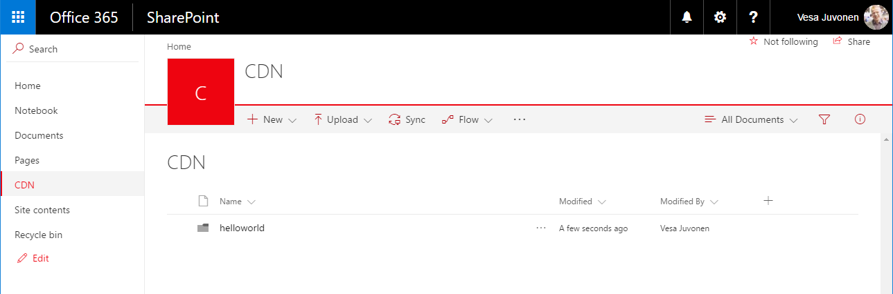
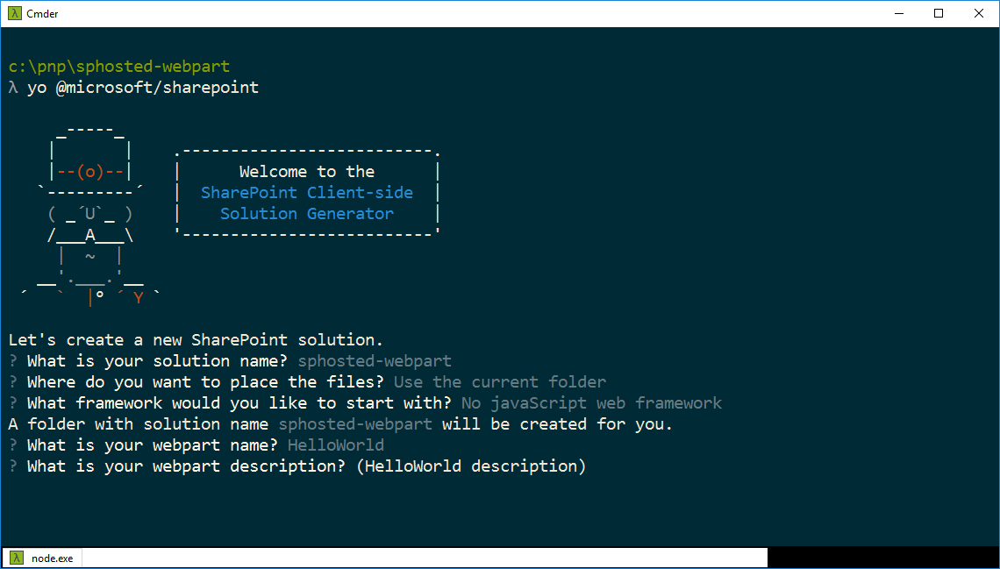
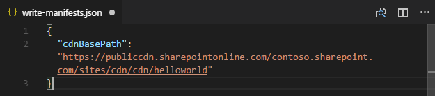
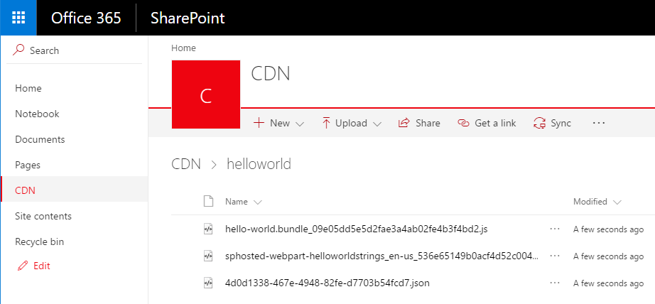
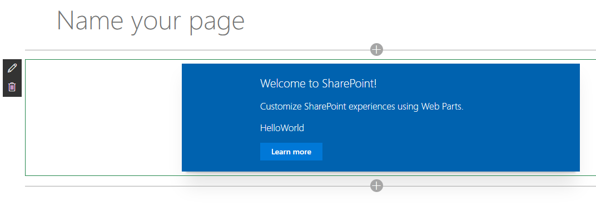

# <a name="hosting-client-side-web-part-from-office-365-cdn"></a>Hosten clientseitiger Webparts in Office 365 CDN

In diesem Artikel wird beschrieben, wie Sie clientseitige Webparts in Office 365 CDN hosten. Office 365 CDN ist eine einfache Lösung, mit der Sie Ihre Ressourcen direkt in Ihrem eigenen Office 365-Mandanten hosten können. Es können beliebige statische Ressourcen gehostet werden, die in SharePoint Online verwendet werden. Weitere Details zur Office 365 CDN-Funktion finden Sie in diesem Blogbeitrag:

* [General availability of Office 365 CDN](https://dev.office.com/blogs/general-availability-of-office-365-cdn)

## <a name="enable-cdn-in-your-office-365-tenant"></a>Aktivieren von CDN in Ihrem Office 365-Mandanten
Stellen Sie sicher, dass Sie die neueste Version der SharePoint Online-Verwaltungsshell verwenden. Herunterladen können Sie sie im [Microsoft Download Center](https://www.microsoft.com/en-us/download/details.aspx?id=35588).

Verbinden Sie sich über eine PowerShell-Sitzung mit Ihrem SharePoint Online-Mandanten.
```
Connect-SPOService -Url https://contoso-admin.sharepoint.com
```

Führen Sie nacheinander die folgenden Befehle aus, um den aktuellen Status der auf Mandantenebene festgelegten Einstellungen für öffentliche CDNs abzurufen: 
```
Get-SPOTenantCdnEnabled -CdnType Public
Get-SPOTenantCdnOrigins -CdnType Public
Get-SPOTenantCdnPolicies -CdnType Public
```
Aktivieren Sie öffentliche CDNs im Mandanten
```
Set-SPOTenantCdnEnabled -CdnType Public
```
Jetzt sind öffentliche CDNs im Mandanten aktiviert, mit der Standardkonfiguration für zulässige Dateitypen. Dies bedeutet, dass die folgenden Dateitypen unterstützt werden: CSS, EOT, GIF, ICO, JPEG, JPG, JS, MAP, PNG, SVG, TTF und WOFF.

Öffnen Sie einen Browser, und navigieren Sie zu der Websitesammlung, in der Sie Ihre CDN-Bibliothek hosten möchten. Das kann jede beliebige Websitesammlung in Ihrem Mandanten sein. In diesem Tutorial erstellen Sie eine spezifische Bibliothek, die als Ihre CDN-Bibliothek fungiert. Sie können aber auch einen spezifischen Ordner in einer beliebigen bereits vorhandenen Dokumentbibliothek als CDN-Endpunkt nutzen.

Erstellen Sie in Ihrer Websitesammlung eine neue Dokumentbibliothek namens **CDN**, und fügen Sie ihr einen Ordner namens **helloworld** hinzu.

 

Wechseln Sie wieder zur PowerShell-Konsole, und fügen Sie einen neuen CDN-Ursprung hinzu. Aktualisieren Sie die unten angegebene URL gemäß Ihrer Umgebung: 
```
Add-SPOTenantCdnOrigin -CdnType Public -OriginUrl sites/cdn/cdn
```
Führen Sie den folgenden Befehl aus, um eine Liste aller CDN-Ursprünge von Ihrem Mandanten abzurufen:
```
Get-SPOTenantCdnOrigins -CdnType Public
```
Sie sehen, dass der neu hinzugefügte Ursprung als gültiger CDN-Ursprung aufgeführt ist. Die endgültige Konfiguration des Ursprungs dauert einige Zeit (ca. 15 Minuten). Während Sie warten, können Sie ein Testwebpart erstellen, das nach Abschluss der Bereitstellung im Ursprung gehostet wird. 


> Sobald ein Ursprung nicht mehr mit *(Konfiguration steht aus)* gekennzeichnet ist, kann er in Ihrem Mandanten verwendet werden. Dieser Text weist auf laufende Konfigurationsaktivitäten zwischen SharePoint Online und dem CDN-System hin. 

## <a name="creating-a-new-web-part-project"></a>Erstellen eines neuen Webpartprojekts

Erstellen Sie an einem Speicherort Ihrer Wahl ein neues Projektverzeichnis:

```
md sphosted-webpart
```
    
Wechseln Sie in das Projektverzeichnis:

```
cd sphosted-webpart
```

Führen Sie den Yeoman-SharePoint-Generator aus, um eine neue SharePoint Framework-Lösung zu erstellen:

```
yo @microsoft/sharepoint
```
    
Es werden verschiedene Eingabeaufforderungen angezeigt. Gehen Sie wie folgt vor:

* Akzeptieren Sie den Standardnamen **sphosted-webpart** als Lösungsnamen, und drücken Sie die **EINGABETASTE**.
* Wählen Sie **Use the current folder** als Speicherort für die Dateien aus.
* Wählen Sie als Framework **No javaScript web framework** aus, und drücken Sie die **EINGABETASTE**.
* Verwenden Sie **HelloWorld** als Namen des Webparts, und drücken Sie die **EINGABETASTE**.
* Akzeptieren Sie die Standardbeschreibung **HelloWorld description**, und drücken Sie die **EINGABETASTE**.



An diesem Punkt erstellt Yeoman ein Gerüst für die Lösungsdateien und installiert die erforderlichen Abhängigkeiten. Das kann einige Minuten dauern. Yeoman nimmt auch Ihr benutzerdefiniertes Webpart in das Projektgerüst auf.
    
Geben Sie nach Abschluss der Gerüsterstellung den folgenden Befehl ein, um das Webpartprojekt in Visual Studio Code zu öffnen:

```
code .
```
Aktualisieren Sie die Datei *write-manifests.json* im Ordner *config* wie unten dargestellt, damit sie auf Ihren CDN-Endpunkt verweist. 
- Dabei müssen Sie „publiccdn.sharepointonline.com“ als Präfix verwenden und die URL anschließend um den tatsächlichen Pfad in Ihrem Mandanten erweitern.
* Die CDN-URL hat folgendes Format:
```
https://publiccdn.sharepointonline.com/<tenant host name>/sites/site/library/folder
```



Speichern Sie Ihre Änderungen.

Führen Sie die folgenden Aufgaben aus, um Ihre Lösung in einem Bundle zu verpacken.
* Es wird ein Releasebuild Ihres Projekts ausgeführt, unter Verwendung der in der Datei **write-manifests.json** angegebenen CDN-URL. Die Ausgabe der Ausführung finden Sie im Ordner **./temp/deploy**. Dies sind die Dateien, die Sie in den SharePoint-Ordner hochladen müssen, der als CDN-Endpunkt fungiert. 

```
gulp bundle --ship
```

Führen Sie die folgende Aufgaben aus, um Ihre Lösung zu packen.

```
gulp package-solution --ship
```

Dieser Befehl erstellt ein Paket namens **sphosted-webpart.sppkg** im Ordner **sharepoint/solution** und bereitet außerdem die Ressourcen im Ordner **temp/deploy** für die Bereitstellung im CDN vor.

Laden Sie das neu erstellte Paket mit ihrer clientseitigen Lösung in den App-Katalog in Ihrem Mandanten hoch. Alternativ können Sie es auch per Drag & Drop verschieben. 


Wählen Sie **Bereitstellen** aus.

Wechseln Sie zu der Websitesammlung, in der Sie zuvor in diesem Tutorial die Bibliothek **CDN** erstellt haben.

Laden Sie alle Dateien aus dem Ordner **temp/deploy** in den Ordner **CDN/helloworld** in Ihrer Websitesammlung hoch. 



An diesem Punkt kann das Webpart auf der Seite verwendet werden.

Öffnen Sie eine Website, auf der Sie das Webpart testen möchten, und wechseln Sie zur Seite **Websiteinhalte** der Website.

Wählen Sie **Hinzufügen – App** in der Symbolleiste, und wählen Sie die App **sphosted-webpart-client-side-solution** zur Installation auf der Website aus.


Nachdem die Lösung installiert wurde, wählen Sie **Seite hinzufügen** im Menü mit dem *Zahnradsymbol*, und wählen Sie **HelloWorld** in der Webpartauswahl für die moderne Seite aus.


Sie sehen: Das Webpart wird gerendert, obwohl der node.js-Dienst nicht lokal ausgeführt wird. 



Speichern Sie die Änderungen auf der Seite mit dem Webpart.

Drücken Sie **F12**, um die Entwicklungstools zu öffnen.

Erweitern Sie in der Liste der Quellen **publiccdn.sharepointonline.com**. Sie sehen, dass die Datei **hello-world.bundle** von dem CDN-Endpunkt geladen wird, den Sie zuvor im Tutorial definiert haben.


Ihr benutzerdefiniertes Webpart ist jetzt in SharePoint Online bereitgestellt und wird in Office 365 CDN gehostet. 

## <a name="additional-resources"></a>Zusätzliche Ressourcen

- [General availability of Office 365 CDN](https://dev.office.com/blogs/general-availability-of-office-365-cdn)
- [Automate publishing of your SharePoint Framework scripts to Office 365 public CDN](https://www.eliostruyf.com/automate-publishing-of-your-sharepoint-framework-scripts-to-office-365-public-cdn)