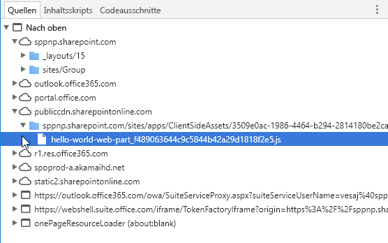

# <a name="host-your-client-side-web-part-from-office-365-cdn-hello-world-part-4"></a><span data-ttu-id="c698f-104">Hosten clientseitiger Webparts in Office 365 CDN (Hello Word, Teil 4)</span><span class="sxs-lookup"><span data-stu-id="c698f-104">Hosting client-side web part from Office 365 CDN (Hello world part 4)</span></span>

<span data-ttu-id="c698f-105">Office 365 Content Delivery Network (CDN) ist eine einfache Lösung, mit der Sie Ihre Ressourcen direkt in Ihrem eigenen Office 365-Mandanten hosten können.</span><span class="sxs-lookup"><span data-stu-id="c698f-105">Office 365 Content Delivery Network (CDN) provides you an easy solution to host your assets directly from your own Office 365 tenant.</span></span> <span data-ttu-id="c698f-106">Es können beliebige statische Ressourcen gehostet werden, die in SharePoint Online verwendet werden.</span><span class="sxs-lookup"><span data-stu-id="c698f-106">It can be used for hosting any static assets that are used in SharePoint Online.</span></span> 

> [!NOTE]
> <span data-ttu-id="c698f-107">Es gibt mehrere unterschiedliche Hostingoptionen für Webpart-Objekte.</span><span class="sxs-lookup"><span data-stu-id="c698f-107">There are multiple different hosting options for your web part assets.</span></span> <span data-ttu-id="c698f-108">In diesem Lernprogramm steht die Option „Office 365 CDN“ im Vordergrund, Sie können jedoch auch das [Azure CDN](./deploy-web-part-to-cdn.md) verwenden oder einfach Ihre Objekte aus der SharePoint-Bibliothek aus dem Mandanten hosten.</span><span class="sxs-lookup"><span data-stu-id="c698f-108">This tutorial concentrates on showing the Office 365 CDN option, but you could also use the [Azure CDN](./deploy-web-part-to-cdn.md) or simply host your assets from SharePoint library from your tenant.</span></span> <span data-ttu-id="c698f-109">Im letzteren Fall würden Sie nicht von den CDN-Leistungssteigerungen profitieren, im Hinblick auf die Funktionalität wäre dies jedoch möglich.</span><span class="sxs-lookup"><span data-stu-id="c698f-109">In the latter case, you would not benefit from the CDN performance improvements, but that would also work from the functionality perspective.</span></span> <span data-ttu-id="c698f-110">Technisch gesehen wäre jeder Ort zum Hosten der Objekte für Endbenutzer denkbar, auf den Endbenutzer über HTTP(S) zugreifen können.</span><span class="sxs-lookup"><span data-stu-id="c698f-110">Any location which end users can access using HTTP(S) would be technically suitable for hosting the assets for end users.</span></span>

> [!IMPORTANT]
> <span data-ttu-id="c698f-111">In diesem Artikel wird das `includeClientSideAssets`-Attribut verwendet, das in SPFx v1.4 eingeführt wurde.</span><span class="sxs-lookup"><span data-stu-id="c698f-111">This article uses `includeClientSideAssets` attribute, which was introduced in the SPFx v1.4.</span></span> <span data-ttu-id="c698f-112">Diese Version wird mit **SharePoint 2016 Feature Pack 2** nicht unterstützt.</span><span class="sxs-lookup"><span data-stu-id="c698f-112">This version is not supported with **SharePoint 2016 Feature Pack 2**.</span></span> <span data-ttu-id="c698f-113">Wenn Sie ein lokales Setup verwenden, müssen Sie den CDN-Hostingspeicherort separat festlegen.</span><span class="sxs-lookup"><span data-stu-id="c698f-113">If you are using on-premises setup, you need to decide the CDN hosting location separately.</span></span> <span data-ttu-id="c698f-114">Sie können die JavaScript-Dateien auch einfach über die zentrale Bibliothek in Ihrer lokalen SharePoint-Umgebung hosten, auf die die Benutzer Zugriff haben.</span><span class="sxs-lookup"><span data-stu-id="c698f-114">You can also simply host the JavaScript files from centralized library in your on-premises SharePoint which your users have access.</span></span> <span data-ttu-id="c698f-115">Siehe auch weitere Überlegungen in den [Anleitungen zu SharePoint 2016](../../sharepoint-2016-support.md).</span><span class="sxs-lookup"><span data-stu-id="c698f-115">Please see additional considerations from the [SharePoint 2016 specific guidance](../../sharepoint-2016-support.md).</span></span>

<span data-ttu-id="c698f-116">Führen Sie die folgenden Schritte aus, bevor Sie starten:</span><span class="sxs-lookup"><span data-stu-id="c698f-116">Make sure that you have completed the following tasks before you begin:</span></span>

* [<span data-ttu-id="c698f-117">Erstellen des ersten clientseitigen Webparts</span><span class="sxs-lookup"><span data-stu-id="c698f-117">Build your first client-side web part</span></span>](./build-a-hello-world-web-part.md)
* [<span data-ttu-id="c698f-118">Verbinden des clientseitigen Webparts mit SharePoint</span><span class="sxs-lookup"><span data-stu-id="c698f-118">Connect your client-side web part to SharePoint</span></span>](./connect-to-sharepoint.md)
* [<span data-ttu-id="c698f-119">Bereitstellen des clientseitigen SharePoint-Webparts auf einer SharePoint-Seite</span><span class="sxs-lookup"><span data-stu-id="c698f-119">Deploy your client-side web part to a classic SharePoint page</span></span>](./serve-your-web-part-in-a-sharepoint-page.md)

<span data-ttu-id="c698f-120">Sie können die nachfolgend beschriebene Anleitung auch anhand dieses Videos in unserem [YouTube-Kanal „SharePoint Patterns & Practices“](https://www.youtube.com/watch?v=MEZMs8VMVQ0&list=PLR9nK3mnD-OXvSWvS2zglCzz4iplhVrKq) nachvollziehen:</span><span class="sxs-lookup"><span data-stu-id="c698f-120">You can also follow these steps by watching the video on the [SharePoint PnP YouTube Channel](https://www.youtube.com/watch?v=MEZMs8VMVQ0&list=PLR9nK3mnD-OXvSWvS2zglCzz4iplhVrKq).</span></span>

<a href="https://www.youtube.com/watch?v=MEZMs8VMVQ0&list=PLR9nK3mnD-OXvSWvS2zglCzz4iplhVrKq">

</a>

## <a name="enable-cdn-in-your-office-365-tenant"></a><span data-ttu-id="c698f-121">Aktivieren von CDN in Ihrem Office 365-Mandanten</span><span class="sxs-lookup"><span data-stu-id="c698f-121">Enable CDN in your Office 365 tenant</span></span>

1. <span data-ttu-id="c698f-122">Stellen Sie sicher, dass Sie die neueste Version der SharePoint Online-Verwaltungsshell verwenden. Herunterladen können Sie sie im [Microsoft Download Center](https://www.microsoft.com/en-us/download/details.aspx?id=35588).</span><span class="sxs-lookup"><span data-stu-id="c698f-122">Ensure that you have latest version of the SharePoint Online Management Shell by downloading it from the [Microsoft Download site](https://www.microsoft.com/en-us/download/details.aspx?id=35588).</span></span>

  > [!TIP]
  > <span data-ttu-id="c698f-123">Wenn Sie keinen Windows-Computer verwenden, können Sie die SharePoint Online-Verwaltungsshell nicht verwenden.</span><span class="sxs-lookup"><span data-stu-id="c698f-123">If you are using non-Windows machine, you cannot use the SPO Management Shell.</span></span> <span data-ttu-id="c698f-124">Sie können diese Einstellungen jedoch über die [Office 365 CLI](https://sharepoint.github.io/office365-cli/) verwalten.</span><span class="sxs-lookup"><span data-stu-id="c698f-124">You can however manage these settings using [Office 365 CLI](https://sharepoint.github.io/office365-cli/).</span></span>

2. <span data-ttu-id="c698f-125">Verbinden Sie sich über eine PowerShell-Sitzung mit Ihrem SharePoint Online-Mandanten.</span><span class="sxs-lookup"><span data-stu-id="c698f-125">Connect to your SharePoint Online tenant with PowerShell session.</span></span>

  ```powershell
  Connect-SPOService -Url https://contoso-admin.sharepoint.com
  ```

3. <span data-ttu-id="c698f-126">Führen Sie nacheinander die folgenden Befehle aus, um den aktuellen Status der auf Mandantenebene festgelegten Einstellungen für öffentliche CDNs abzurufen:</span><span class="sxs-lookup"><span data-stu-id="c698f-126">Get the current status of public CDN settings from the tenant level by executing the following commands one-by-one.</span></span> 


  ```powershell
  Get-SPOTenantCdnEnabled -CdnType Public
  Get-SPOTenantCdnOrigins -CdnType Public
  Get-SPOTenantCdnPolicies -CdnType Public
  ```

  <span data-ttu-id="c698f-127">SharePoint-Framework-Lösungen können automatisch von den öffentlichen CDNs in Office 365 profitieren, solange diese in Ihrem Mandanten aktiviert sind.</span><span class="sxs-lookup"><span data-stu-id="c698f-127">SharePoint Framework solutions can automatically benefit from the Office 365 Public CDN as long as it's enabled in your tenant.</span></span> <span data-ttu-id="c698f-128">Wenn CDN aktiviert ist, wird der `*/CLIENTSIDEASSETS`-Ursprung automatisch als gültiger Ursprung hinzugefügt.</span><span class="sxs-lookup"><span data-stu-id="c698f-128">When CDN is enabled, `*/CLIENTSIDEASSETS` origin is automatically added as valid a valid origin.</span></span>

4. <span data-ttu-id="c698f-129">Aktivieren Sie öffentliche CDNs im Mandanten.</span><span class="sxs-lookup"><span data-stu-id="c698f-129">Enable public CDN in the tenant</span></span>

  ```powershell
  Set-SPOTenantCdnEnabled -CdnType Public
  ```

5. <span data-ttu-id="c698f-130">Bestätigen Sie Einstellungen, indem Sie `Y` und dann die **EINGABETASTE** wählen.</span><span class="sxs-lookup"><span data-stu-id="c698f-130">Confirm settings by selecting 'Y' and pressing Enter</span></span>

  

  <span data-ttu-id="c698f-132">Jetzt sind öffentliche CDNs mit der Standardkonfiguration für zulässige Dateitypen im Mandanten aktiviert.</span><span class="sxs-lookup"><span data-stu-id="c698f-132">Public CDN has now been enabled in the tenant by using the default file type configuration allowed.</span></span> <span data-ttu-id="c698f-133">Dies bedeutet, dass die folgenden Dateitypen unterstützt werden: CSS, EOT, GIF, ICO, JPEG, JPG, JS, MAP, PNG, SVG, TTF und WOFF.</span><span class="sxs-lookup"><span data-stu-id="c698f-133">This means that the following file type extensions are supported: CSS, EOT, GIF, ICO, JPEG, JPG, JS, MAP, PNG, SVG, TTF, and WOFF.</span></span>

  <span data-ttu-id="c698f-134">SharePoint-Framework-Lösungen können automatisch von den öffentlichen CDNs in Office 365 profitieren, solange diese in Ihrem Mandanten aktiviert sind.</span><span class="sxs-lookup"><span data-stu-id="c698f-134">SharePoint Framework solutions can automatically benefit from the Office 365 Public CDN as long as it's enabled in your tenant.</span></span> <span data-ttu-id="c698f-135">Wenn CDN aktiviert ist, wird der `*/CLIENTSIDEASSETS`-Ursprung automatisch als gültiger Ursprung hinzugefügt.</span><span class="sxs-lookup"><span data-stu-id="c698f-135">When CDN is enabled, `*/CLIENTSIDEASSETS` origin is automatically added as valid a valid origin.</span></span>

  > [!NOTE]
  > <span data-ttu-id="c698f-136">Wenn Sie zuvor Office 365 CDN aktiviert haben, sollten Sie das öffentliche CDN erneut aktivieren, damit der `*/CLIENTSIDEASSETS`-Eintrag als gültiger CDN-Ursprung für das öffentliche CDN hinzugefügt wird.</span><span class="sxs-lookup"><span data-stu-id="c698f-136">If you have previously enabled Office 365 CDN, you should re-enable the public CDN, so that you will have the `*/CLIENTSIDEASSETS`entry added as valid CDN origin for public CDN.</span></span>

6. <span data-ttu-id="c698f-137">Sie können die aktuelle Konfiguration Ihrer Endpunkte überprüfen.</span><span class="sxs-lookup"><span data-stu-id="c698f-137">You can double-check the current setup of your end-points.</span></span> <span data-ttu-id="c698f-138">Führen Sie den folgenden Befehl aus, um eine Liste aller CDN-Ursprünge von Ihrem Mandanten abzurufen:</span><span class="sxs-lookup"><span data-stu-id="c698f-138">Execute the following command to get the list of CDN origins from your tenant:</span></span>

  ```powershell
  Get-SPOTenantCdnOrigins -CdnType Public
  ```

  <span data-ttu-id="c698f-139">Sie sehen, dass der neu hinzugefügte Ursprung als gültiger CDN-Ursprung aufgeführt ist.</span><span class="sxs-lookup"><span data-stu-id="c698f-139">Note that your newly added origin is listed as a valid CDN origin.</span></span> <span data-ttu-id="c698f-140">Die endgültige Konfiguration des Ursprungs dauert einige Zeit (ca. 15 Minuten). Während Sie warten, können Sie ein Testwebpart erstellen, das nach Abschluss der Bereitstellung im Ursprung gehostet wird.</span><span class="sxs-lookup"><span data-stu-id="c698f-140">Notice that your newly added origin is listed as a valid CDN origin. Final configuration of the origin will take a while (approximately 15 minutes), so we can continue by creating your test web part, which will be hosted from the origin, when the deployment is completed.</span></span> 

  

  > [!NOTE]
  > <span data-ttu-id="c698f-142">Sobald der Ursprung nicht mehr mit *(Konfiguration steht aus)* gekennzeichnet ist, kann er in Ihrem Mandanten verwendet werden.</span><span class="sxs-lookup"><span data-stu-id="c698f-142">When origin is listed without the *(configuration pending)* text, it is ready to be used in your tenant.</span></span> <span data-ttu-id="c698f-143">Dieser Text weist auf laufende Konfigurationsaktivitäten zwischen SharePoint Online und dem CDN-System hin.</span><span class="sxs-lookup"><span data-stu-id="c698f-143">This is the indication of an on-going configuration between SharePoint Online and CDN system.</span></span> 


## <a name="end-task-in-project-directory"></a><span data-ttu-id="c698f-144">Aufgabe beenden im Projektverzeichnis</span><span class="sxs-lookup"><span data-stu-id="c698f-144">End task in project directory</span></span>

1. <span data-ttu-id="c698f-145">Wechseln Sie zur Konsole und stellen Sie sicher, dass Sie sich noch in dem Projektverzeichnis befinden, das Sie zum Einrichten des Webpart-Projekts verwendet haben.</span><span class="sxs-lookup"><span data-stu-id="c698f-145">Switch to console and make sure you are still in the project directory you used to set up your web part project.</span></span>

2. <span data-ttu-id="c698f-146">Beenden Sie die `gulp serve`-Aufgabe, indem Sie STRG + C auswählen, und wechseln Sie zu Ihrem Projektverzeichnis:</span><span class="sxs-lookup"><span data-stu-id="c698f-146">End the possible gulp serve task by choosing Ctrl+C and ensure that you are in your project directory:</span></span>

  ```
  cd helloworld-webpart
  ```

## <a name="review-solution-settings"></a><span data-ttu-id="c698f-147">Prüfen von Projektmappeneinstellungen</span><span class="sxs-lookup"><span data-stu-id="c698f-147">Review solution settings</span></span> 

1. <span data-ttu-id="c698f-148">Öffnen Sie das **HelloWorldWebPart**-Webpart-Projekt in Visual Studio Code oder in Ihrer bevorzugten IDE.</span><span class="sxs-lookup"><span data-stu-id="c698f-148">Open the **HelloWorldWebPart** web part project in Visual Studio Code, or your preferred IDE.</span></span>

2. <span data-ttu-id="c698f-149">Öffnen Sie **package-solution.json** im Ordner **config**.</span><span class="sxs-lookup"><span data-stu-id="c698f-149">Open **package-solution.json** from the **config** folder.</span></span>

  <span data-ttu-id="c698f-150">Die Datei **package-solution.json** definiert die Paketmetadaten, wie im folgenden Code dargestellt:</span><span class="sxs-lookup"><span data-stu-id="c698f-150">The **package-solution.json** file defines the package metadata as shown in the following code:</span></span>

  ```json
  {
    "$schema": "https://dev.office.com/json-schemas/spfx-build/package-solution.schema.json",
    "solution": {
      "name": "helloworld-webpart-client-side-solution",
      "id": "4432f33b-5845-4ca0-827e-a8ae68c7b945",
      "version": "1.0.0.0",
      "includeClientSideAssets": true
    },
    "paths": {
      "zippedPackage": "solution/helloworld-webpart.sppkg"
    }
  }

  ```

<span data-ttu-id="c698f-151">Standardwert für **includeClientSideAssets** ist `true`. Dies bedeutet, dass statische Objekte automatisch in den *.sppkg*-Dateien gepackt werden und nicht separat von einem externen System gehostet werden müssen.</span><span class="sxs-lookup"><span data-stu-id="c698f-151">Default value for the **includeClientSideAssets** is `true`, which means that static assets are packaged automatically inside of the *.sppkg* files and you do not need to separately host your assets from external system.</span></span> 

<span data-ttu-id="c698f-152">Wenn *Office 365 CDN* aktiviert ist, werden automatisch die Standardeinstellungen verwendet.</span><span class="sxs-lookup"><span data-stu-id="c698f-152">If *Office 365 CDN* is enabled, it will be used automatically with default settings.</span></span> <span data-ttu-id="c698f-153">Wenn *Office 365 CDN* nicht aktiviert ist, werden Objekte von der App-Katalog-Websitesammlung bereitgestellt.</span><span class="sxs-lookup"><span data-stu-id="c698f-153">If *Office 365 CDN* is not enabled, assets will be served from app catalog site collection.</span></span> 

> [!NOTE]
> <span data-ttu-id="c698f-154">Ab SharePoint-Framework v1. 4 werden statische Objekte standardmäßig in das .sppkg-Paket gepackt.</span><span class="sxs-lookup"><span data-stu-id="c698f-154">Starting from the SharePoint Framework v1.4, static assets are by default packaged inside of the sppkg package.</span></span> <span data-ttu-id="c698f-155">Wenn das Paket im App-Katalog bereitgestellt wird, werden sie automatisch in Office 365 CDN (falls aktiviert) oder in der App-Katalog-URL gehostet.</span><span class="sxs-lookup"><span data-stu-id="c698f-155">When package is deployed in app catalog, they are automatically being hosted either from Office 365 CDN (if enabled) or from app catalog URL.</span></span> <span data-ttu-id="c698f-156">Sie können dieses Verhalten mit der `includeClientSideAssets`-Einstellung in der `package-solution.json`-Datei steuern.</span><span class="sxs-lookup"><span data-stu-id="c698f-156">You can control this behavior with the `includeClientSideAssets` setting in `package-solution.json` file.</span></span>

## <a name="prepare-web-part-assets-to-deploy"></a><span data-ttu-id="c698f-157">Vorbereiten der bereitzustellenden Webpartressourcen</span><span class="sxs-lookup"><span data-stu-id="c698f-157">Prepare web part assets to deploy</span></span>

1. <span data-ttu-id="c698f-158">Führen Sie die folgende Aufgabe aus, um Ihre Lösung in einem Bundle zu verpacken.</span><span class="sxs-lookup"><span data-stu-id="c698f-158">Execute the following task to bundle your solution.</span></span> <span data-ttu-id="c698f-159">Dadurch wird ein Versionsbuild des Projekts ausgeführt, indem eine dynamische Bezeichnung als Host-URL für Ihre Objekte verwendet wird.</span><span class="sxs-lookup"><span data-stu-id="c698f-159">This will execute a release build of your project by using a dynamic label as the host URL for your assets.</span></span> <span data-ttu-id="c698f-160">Diese URL wird automatisch auf Grundlage Ihrer CDN-Mandanteneinstellungen aktualisiert.</span><span class="sxs-lookup"><span data-stu-id="c698f-160">This URL will be automatically updated based on your tenant CDN settings.</span></span>

  ```
  gulp bundle --ship
  ```

2. <span data-ttu-id="c698f-161">Führen Sie die folgende Aufgaben aus, um Ihre Lösung zu packen.</span><span class="sxs-lookup"><span data-stu-id="c698f-161">Execute the following task to package your solution.</span></span> <span data-ttu-id="c698f-162">Es wird ein aktualisiertes **helloworld-webpart.sppkg**-Paket im Ordner **sharepoint/solution** erstellt.</span><span class="sxs-lookup"><span data-stu-id="c698f-162">This command will create an updated **helloworld-webpart.sppkg** package on the **sharepoint/solution** folder.</span></span>

  ```
  gulp package-solution --ship
  ```

  > [!NOTE]
  > <span data-ttu-id="c698f-163">Informationen zu den Elementen, die in die .sppkg-Datei gepackt werden, finden Sie im Ordner **sharepoint/solution/debug**.</span><span class="sxs-lookup"><span data-stu-id="c698f-163">If you are interested on what actually got packaged inside of the sppkg file, you can have a look omn the content of the **sharepoint/solution/debug** folder.</span></span>

3. <span data-ttu-id="c698f-164">Laden Sie das neu erstellte Paket mit Ihrer clientseitigen Lösung in den App-Katalog in Ihrem Mandanten hoch. Alternativ können Sie es auch per Drag & Drop verschieben.</span><span class="sxs-lookup"><span data-stu-id="c698f-164">Upload or drag & drop the newly created client-side solution package to the app catalog in your tenant.</span></span> 

4. <span data-ttu-id="c698f-165">Da Sie das Paket bereits bereitgestellt haben, werden Sie gefragt, ob das vorhandene Paket ersetzt werden soll.</span><span class="sxs-lookup"><span data-stu-id="c698f-165">Because you already deployed the package, you will be prompted as to whether to replace the existing package.</span></span> <span data-ttu-id="c698f-166">Wählen Sie **Ersetzen**.</span><span class="sxs-lookup"><span data-stu-id="c698f-166">Select **Replace It**.</span></span>

  

5. <span data-ttu-id="c698f-168">Beachten Sie, dass die **Domänenliste** in der Aufforderung *SharePoint Online* enthält.</span><span class="sxs-lookup"><span data-stu-id="c698f-168">Notice how the **domain** list in the prompt is saying *SharePoint Online*.</span></span> <span data-ttu-id="c698f-169">Dies ist der Fall, da der Inhalt, je nach Mandanteneinstellungen, entweder von dem Office 365 CDN oder dem App-Katalog bereitgestellt wird.</span><span class="sxs-lookup"><span data-stu-id="c698f-169">This is since the content is either served from the Office 365 CDN or from app catalog, depending on the tenant settings.</span></span> <span data-ttu-id="c698f-170">Wählen Sie **Bereitstellen**.</span><span class="sxs-lookup"><span data-stu-id="c698f-170">Select the **Deploy** button.</span></span>

  

6. <span data-ttu-id="c698f-172">Öffnen Sie die Website, auf der Sie zuvor die **helloworld-webpart-client-side-solution**-Lösung installiert haben, oder installieren Sie die Lösung auf einer neuen Website.</span><span class="sxs-lookup"><span data-stu-id="c698f-172">Open a site where previously installed the **helloworld-webpart-client-side-solution** solution or install solution to a new site.</span></span>

7. <span data-ttu-id="c698f-173">Nachdem die Lösung installiert wurde, wählen Sie **Seite hinzufügen** im Menü mit dem *Zahnradsymbol* und wählen Sie **HelloWorld** in der Webpartauswahl für die moderne Seite aus, um Ihr benutzerdefiniertes Webpart zur Seite hinzuzufügen.</span><span class="sxs-lookup"><span data-stu-id="c698f-173">After the solution has been installed, chose **Add a page** from the *gear* menu and pick **HelloWorld** from the modern page web part picker to add your custom web part to page.</span></span>

  

8. <span data-ttu-id="c698f-175">Sie sehen: Das Webpart wird gerendert, obwohl der node.js-Dienst nicht lokal ausgeführt wird.</span><span class="sxs-lookup"><span data-stu-id="c698f-175">Notice how the web part is rendered even though you are not running the node.js service locally.</span></span> 

  

9. <span data-ttu-id="c698f-177">Speichern Sie die Änderungen auf der Seite mit dem Webpart.</span><span class="sxs-lookup"><span data-stu-id="c698f-177">Save changes on the page with web part on it.</span></span>

10. <span data-ttu-id="c698f-178">Wählen Sie **F12**, um die Entwicklungstools zu öffnen.</span><span class="sxs-lookup"><span data-stu-id="c698f-178">Press **F12** to open up developer tools.</span></span>

11. <span data-ttu-id="c698f-179">Erweitern Sie **publiccdn.sharepointonline.com** unter Quellen und achten Sie darauf, dass die Datei **hello-world-web-part** von der URL des öffentlichen CDN geladen wird, die dynamisch auf eine Bibliothek in der App-Katalog-Websitesammlung verweist.</span><span class="sxs-lookup"><span data-stu-id="c698f-179">Extend **publiccdn.sharepointonline.com** under the source and notice how the **hello-world-web-part** file is loaded from the Public CDN URL pointing dynamically to a library located under the app catalog site collection.</span></span>

  

> [!NOTE]
> <span data-ttu-id="c698f-181">Wenn Sie CDN nicht in Ihrem Mandanten aktiviert hätten und die `includeClientSideAssets`-Einstellung in **package-solution.json** `true` lauten würde, würde das Laden der URL für die Objekte dynamisch aktualisiert und sie würden direkt auf den ClientSideAssets-Ordner in der App-Katalog-Websitesammlung verweisen.</span><span class="sxs-lookup"><span data-stu-id="c698f-181">If you would not have CDN enabled in your tenant and the `includeClientSideAssets` setting would be `true`in the **package-solution.json**, loading URL for the assets would be dynamically updated and pointing directly to the ClientSideAssets folder located in the app catalog site collection.</span></span> <span data-ttu-id="c698f-182">In diesem Beispiel lautet die URL: `https://sppnp.microsoft.com/sites/apps/ClientSideAssets/`.</span><span class="sxs-lookup"><span data-stu-id="c698f-182">In this example case, URL would be `https://sppnp.microsoft.com/sites/apps/ClientSideAssets/`.</span></span>

<span data-ttu-id="c698f-183">Ihr benutzerdefiniertes Webpart ist jetzt in SharePoint Online bereitgestellt und wird automatisch in Office 365 CDN gehostet.</span><span class="sxs-lookup"><span data-stu-id="c698f-183">Now you have deployed your custom web part to SharePoint Online and it's being hosted automatically from the Office 365 CDN.</span></span>

## <a name="next-steps"></a><span data-ttu-id="c698f-184">Nächste Schritte</span><span class="sxs-lookup"><span data-stu-id="c698f-184">Next steps</span></span>

<span data-ttu-id="c698f-185">Sie können jQuery und jQueryUI laden und ein jQuery Accordion-Webpart erstellen.</span><span class="sxs-lookup"><span data-stu-id="c698f-185">You can load jQuery, jQuery UI and build a jQuery Accordion web part.</span></span> <span data-ttu-id="c698f-186">Lesen Sie die Informationen unter [Hinzufügen von jQueryUI Accordion zu Ihrem clientseitigen Webpart](./add-jqueryui-accordion-to-web-part.md), um fortzufahren.</span><span class="sxs-lookup"><span data-stu-id="c698f-186">To continue, see [Add jQueryUI Accordion to your client-side web part](./add-jqueryui-accordion-to-web-part.md).</span></span>

> [!NOTE]
> <span data-ttu-id="c698f-187">Wenn Sie einen Fehler in der Dokumentation oder im SharePoint-Framework finden, melden Sie ihn an das SharePoint Engineering unter Verwendung der [Fehlerliste im sp-dev-docs-Repository](https://github.com/SharePoint/sp-dev-docs/issues).</span><span class="sxs-lookup"><span data-stu-id="c698f-187">If you find an issue in the documentation or in the SharePoint Framework, please report that to SharePoint engineering using the [issue list at sp-dev-docs repository](https://github.com/SharePoint/sp-dev-docs/issues).</span></span> <span data-ttu-id="c698f-188">Vielen Dank im Voraus für Ihr Feedback.</span><span class="sxs-lookup"><span data-stu-id="c698f-188">Thanks for your input advance.</span></span>

