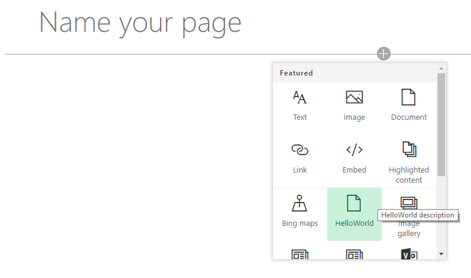
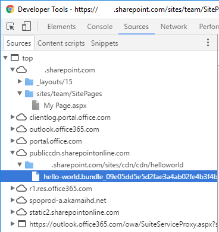

<span data-ttu-id="31604-p108">Es wird ein Releasebuild Ihres Projekts ausgeführt, unter Verwendung der in der Datei **write-manifests.json** angegebenen CDN-URL. Die Ausgabe der Ausführung finden Sie im Ordner **./temp/deploy**. Dies sind die Dateien, die Sie in den SharePoint-Ordner hochladen müssen, der als CDN-Endpunkt fungiert.</span><span class="sxs-lookup"><span data-stu-id="31604-p108">This will execute a release build of your project using CDN URL specified in the **writer-manifest.json** file. Output of the execution will be located in the **./temp/deploy** folder. These are the files which you will need to upload to the SharePoint folder acting as your CDN endpoint.</span></span>
* Es wird ein Releasebuild Ihres Projekts ausgeführt, unter Verwendung der in der Datei **write-manifests.json** angegebenen CDN-URL. Die Ausgabe der Ausführung finden Sie im Ordner **./temp/deploy**. Dies sind die Dateien, die Sie in den SharePoint-Ordner hochladen müssen, der als CDN-Endpunkt fungiert. 

```
gulp bundle --ship
```

<span data-ttu-id="31604-151">Führen Sie die folgende Aufgaben aus, um Ihre Lösung zu packen.</span><span class="sxs-lookup"><span data-stu-id="31604-151">Execute the following task to package your solution</span></span>

```
gulp package-solution --ship
```

<span data-ttu-id="31604-152">Dieser Befehl erstellt ein Paket namens **sphosted-webpart.sppkg** im Ordner **sharepoint/solution** und bereitet außerdem die Ressourcen im Ordner **temp/deploy** für die Bereitstellung im CDN vor.</span><span class="sxs-lookup"><span data-stu-id="31604-152">This command will create a **sphosted-webpart.sppkg** package on the **sharepoint/solution** folder and also prepare the assets on the **temp/deploy folder** to be deployed to the CDN.</span></span>

<span data-ttu-id="31604-153">Laden Sie das neu erstellte Paket mit ihrer clientseitigen Lösung in den App-Katalog in Ihrem Mandanten hoch. Alternativ können Sie es auch per Drag & Drop verschieben.</span><span class="sxs-lookup"><span data-stu-id="31604-153">Upload or drag & drop the newly created client-side solution package to the app catalog in your tenant.</span></span> 


<span data-ttu-id="31604-155">Wählen Sie **Bereitstellen** aus.</span><span class="sxs-lookup"><span data-stu-id="31604-155">Choose **Deploy**</span></span>

<span data-ttu-id="31604-156">Wechseln Sie zu der Websitesammlung, in der Sie zuvor in diesem Tutorial die Bibliothek **CDN** erstellt haben.</span><span class="sxs-lookup"><span data-stu-id="31604-156">Move to the site collection where the **CDN** library was created earlier in this tutorial.</span></span>

<span data-ttu-id="31604-157">Laden Sie alle Dateien aus dem Ordner **temp/deploy** in den Ordner **CDN/helloworld** in Ihrer Websitesammlung hoch.</span><span class="sxs-lookup"><span data-stu-id="31604-157">Upload all files from **temp/deploy** folder to the **CDN/helloworld** folder in your site collection.</span></span> 


<span data-ttu-id="31604-159">An diesem Punkt kann das Webpart auf der Seite verwendet werden.</span><span class="sxs-lookup"><span data-stu-id="31604-159">At this point the web part is ready to be used on a page</span></span>

<span data-ttu-id="31604-160">Öffnen Sie eine Website, auf der Sie das Webpart testen möchten, und wechseln Sie zur Seite **Websiteinhalte** der Website.</span><span class="sxs-lookup"><span data-stu-id="31604-160">Open a site where you want to test the web part and go the **Site contents** page of the site.</span></span>

<span data-ttu-id="31604-161">Wählen Sie **Hinzufügen – App** in der Symbolleiste, und wählen Sie die App **sphosted-webpart-client-side-solution** zur Installation auf der Website aus.</span><span class="sxs-lookup"><span data-stu-id="31604-161">Choose **Add – App** from the toolbar and choose the **sphosted-webpart-client-side-solution** app to be installed on the site</span></span>


<span data-ttu-id="31604-163">Nachdem die Lösung installiert wurde, wählen Sie **Seite hinzufügen** im Menü mit dem *Zahnradsymbol*, und wählen Sie **HelloWorld** in der Webpartauswahl für die moderne Seite aus.</span><span class="sxs-lookup"><span data-stu-id="31604-163">After the solution has been installed, chose **Add a page** from the *gear* menu and pick **HelloWorld** from the modern page web part picker</span></span>



<span data-ttu-id="31604-165">Sie sehen: Das Webpart wird gerendert, obwohl der node.js-Dienst nicht lokal ausgeführt wird.</span><span class="sxs-lookup"><span data-stu-id="31604-165">Notice how the web part is rendered even though you are not running the node.js service locally.</span></span> 


<span data-ttu-id="31604-167">Speichern Sie die Änderungen auf der Seite mit dem Webpart.</span><span class="sxs-lookup"><span data-stu-id="31604-167">Save changes on the page with web part on it.</span></span>

<span data-ttu-id="31604-168">Drücken Sie **F12**, um die Entwicklungstools zu öffnen.</span><span class="sxs-lookup"><span data-stu-id="31604-168">Press **F12** to open up developer tools.</span></span>

<span data-ttu-id="31604-169">Erweitern Sie in der Liste der Quellen **publiccdn.sharepointonline.com**. Sie sehen, dass die Datei **hello-world.bundle** von dem CDN-Endpunkt geladen wird, den Sie zuvor im Tutorial definiert haben.</span><span class="sxs-lookup"><span data-stu-id="31604-169">Extend **publiccdn.sharepointonline.com** under the source and notice how the **hello-world.bundle** file is loaded from the CDN endpoint which we defined earlier in this tutorial.</span></span>



<span data-ttu-id="31604-171">Ihr benutzerdefiniertes Webpart ist jetzt in SharePoint Online bereitgestellt und wird in Office 365 CDN gehostet.</span><span class="sxs-lookup"><span data-stu-id="31604-171">Now you have deployed your custom web part to SharePoint Online and it's being hosted from the Office 365 CDN.</span></span> 

## <a name="additional-resources"></a><span data-ttu-id="31604-172">Zusätzliche Ressourcen</span><span class="sxs-lookup"><span data-stu-id="31604-172">Additional resources</span></span>

- [<span data-ttu-id="31604-173">General availability of Office 365 CDN</span><span class="sxs-lookup"><span data-stu-id="31604-173">General availability of Office 365 CDN</span></span>](https://dev.office.com/blogs/general-availability-of-office-365-cdn)
- [<span data-ttu-id="31604-174">Automate publishing of your SharePoint Framework scripts to Office 365 public CDN</span><span class="sxs-lookup"><span data-stu-id="31604-174">Automate publishing of your SharePoint Framework scripts to Office 365 public CDN</span></span>](https://www.eliostruyf.com/automate-publishing-of-your-sharepoint-framework-scripts-to-office-365-public-cdn)