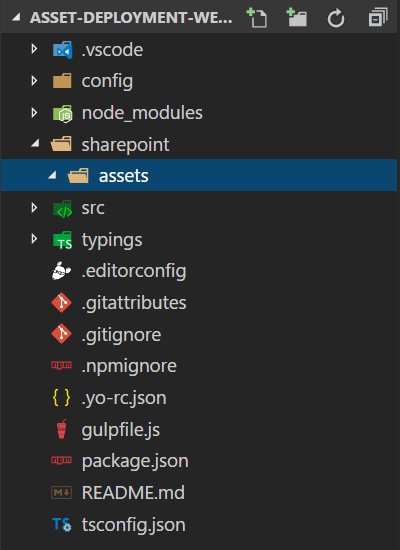
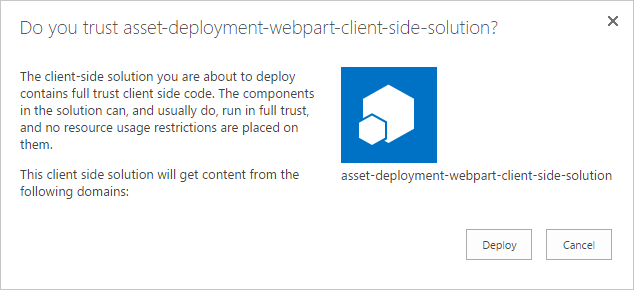
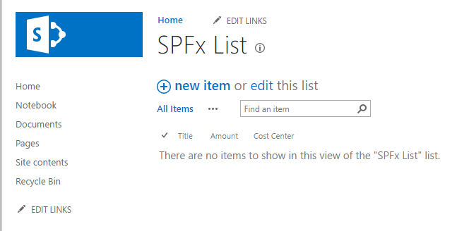
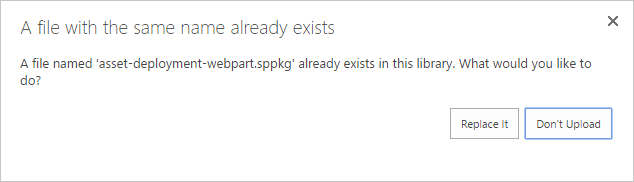
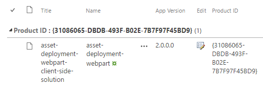
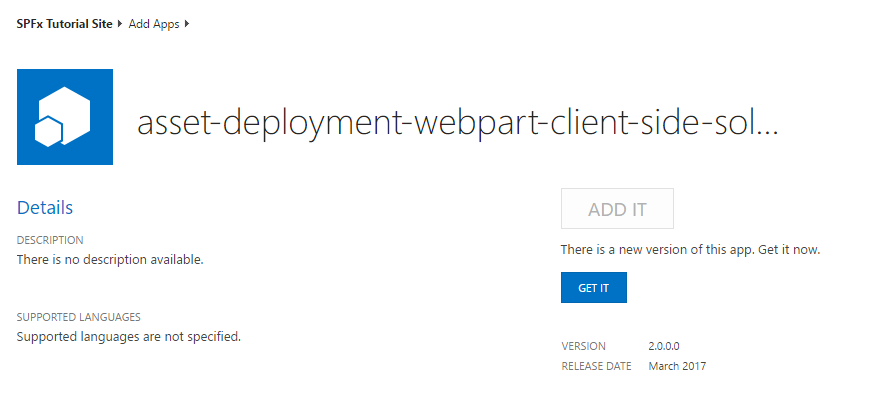
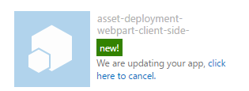
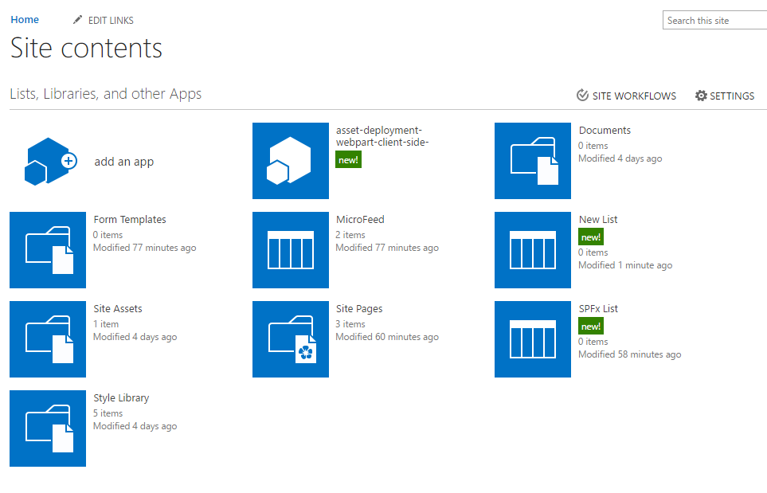

# <a name="provisioning-sharepoint-assets-from-your-sharepoint-client-side-web-part"></a>Bereitstellen von SharePoint-Ressourcen aus Ihrem clientseitigen SharePoint-Webpart

In diesem Artikel wird beschrieben, wie SharePoint-Ressourcen als Teil der SharePoint Framework-Lösung bereitgestellt werden. Diese Ressourcen werden auf SharePoint-Websites bereitgestellt, wenn die Lösung darauf installiert wird. Der Artikel behandelt auch die erforderlichen Schritte zur Einführung möglicher Updates als Teil von neuen Versionen des Pakets. Dieses Verfahren ist identisch mit dem Add-in-Update.

## <a name="prerequisites"></a>Voraussetzungen
Führen Sie die folgenden Schritte aus, bevor Sie sich mit dem grundlegenden Fluss des Erstellens eines benutzerdefinierten, clientseitigen Webparts vertraut machen:

* [Erstellen des ersten Webparts](build-a-hello-world-web-part.md)
* [Verbinden mit SharePoint](connect-to-sharepoint.md) 

## <a name="resources"></a>Ressourcen
In den folgenden Ressourcen finden Sie weitere Informationen zu den in diesem Lernprogramm behandelten Themen.

* [Bereitstellen von SharePoint-Elementen mit Ihrem Lösungspaket](../../toolchain/provision-sharepoint-assets)
* [Beispiellösung - Bereitstellen von SharePoint-Ressourcen als Teil des SPFx-Pakets](https://github.com/SharePoint/sp-dev-fx-webparts/tree/master/samples/react-feature-framework)

## <a name="create-a-new-web-part-project"></a>Erstellen eines neuen Webpart-Projekts

Erstellen Sie an einem Speicherort Ihrer Wahl ein neues Projektverzeichnis:

```
md asset-deployment-webpart
```

Wechseln Sie in das Projektverzeichnis:

```
cd asset-deployment-webpart
```
    
Führen Sie den Yeoman-SharePoint-Generator aus, um eine neue clientseitige Webpartlösung zu erstellen:

```
yo @microsoft/sharepoint
```

Es werden verschiedene Eingabeaufforderungen angezeigt. Gehen Sie wie folgt vor:

* Akzeptieren Sie den Standardnamen **asset-deployment-webpart** als Lösungsnamen, und drücken Sie die **EINGABETASTE**.
* Wählen Sie **Aktuellen Ordner verwenden** als Speicherort für die Dateien aus.

Über die nächsten Eingabeaufforderungen werden spezifische Informationen zum Webpart abgefragt:

* Akzeptieren Sie die Standardeinstellung **No javascript web framework** als Framework, und drücken Sie die **EINGABETASTE**, um fortzufahren.
* Geben Sie **AssetDeployment** als Webpartnamen ein, und drücken Sie die **EINGABETASTE**.
* Geben Sie**AssetDeployment-Webpart** als Beschreibung des Webparts ein, und drücken Sie die **EINGABETASTE**. 

An diesem Punkt installiert Yeoman die erforderlichen Abhängigkeiten und erstellt ein Gerüst für die Lösungsdateien. Das kann einige Minuten dauern. Yeoman erstellt ein Gerüst für das Projekt, um auch das **AssetDeployment**-Webpart einzuschließen.

Geben Sie in der Konsole Folgendes ein, um das Webpart-Projekt in Visual Studio Code zu öffnen:

```
code .
```

## <a name="create-folder-structure-for-your-sharepoint-assets"></a>Erstellen der Ordnerstruktur für Ihre SharePoint-Ressourcen

Wir müssen zuerst einen **Ressourcen**ordner erstellen, in dem die gesamten Featureframeworkressourcen platziert werden, die zum Bereitstellen von SharePoint-Strukturen verwendet werden, wenn das Paket installiert wird.

* Erstellen eines Ordners mit dem Namen **Sharepoint** auf der Stammebene der Lösung
* Erstellen eines Ordners mit dem Namen **Ressourcen** als Unterordner für den soeben erstellten **Sharepoint**-Ordner

Die Lösungsstruktur sollte wie im folgenden Bild aussehen.



## <a name="create-feature-framework-files-for-initial-deployment"></a>Erstellen von Featureframeworkdateien für die anfängliche Bereitstellung
Um SharePoint-Ressourcen auf Websites mit Featureframeworkelementen bereitstellen zu können, müssen wir die erforderlichen XML-Dateien für den Ressourcenordner erstellen. Unterstützte Elemente für die SharePoint Framework-Lösungspakete sind wie folgt:

* Felder/Websitespalten
* Inhaltstypen
* Listeninstanzen
* Listeninstanzen mit benutzerdefiniertem Schema

In den folgenden Schritten wird die erforderliche Struktur definiert, die bereitgestellt werden soll.

### <a name="add-elementxml-file-for-sharepoint-definitions"></a>Hinzufügen der Datei „element.xml“ für SharePoint-Definitionen
Erstellen Sie eine neue Datei innerhalb des Ordners **Sharepoint\Ressourcen** mit dem Namen **elements.xml**.

Kopieren Sie die folgende XML-Struktur in **elements.xml**.

```xml
<?xml version="1.0" encoding="utf-8"?>
<Elements xmlns="http://schemas.microsoft.com/sharepoint/">

    <Field ID="{060E50AC-E9C1-4D3C-B1F9-DE0BCAC300F6}"
            Name="SPFxAmount"
            DisplayName="Amount"
            Type="Currency"
            Decimals="2"
            Min="0"
            Required="FALSE"
            Group="SPFx Columns" />

    <Field ID="{943E7530-5E2B-4C02-8259-CCD93A9ECB18}"
            Name="SPFxCostCenter"
            DisplayName="Cost Center"
            Type="Choice"
            Required="FALSE"
            Group="SPFx Columns">
        <CHOICES>
        <CHOICE>Administration</CHOICE>
        <CHOICE>Information</CHOICE>
        <CHOICE>Facilities</CHOICE>
        <CHOICE>Operations</CHOICE>
        <CHOICE>Sales</CHOICE>
        <CHOICE>Marketing</CHOICE>
        </CHOICES>
    </Field>

    <ContentType ID="0x010042D0C1C200A14B6887742B6344675C8B" 
            Name="Cost Center" 
            Group="SPFx Content Types" 
            Description="Sample content types from web part solution">
        <FieldRefs>
            <FieldRef ID="{060E50AC-E9C1-4D3C-B1F9-DE0BCAC300F6}" /> 
            <FieldRef ID="{943E7530-5E2B-4C02-8259-CCD93A9ECB18}" />
        </FieldRefs>
    </ContentType> 

    <ListInstance 
            CustomSchema="schema.xml"
            FeatureId="00bfea71-de22-43b2-a848-c05709900100"
            Title="SPFx List" 
            Description="SPFx List"
            TemplateType="100"
            Url="Lists/SPFxList">
    </ListInstance>

</Elements>
```

Beachten Sie zu der eingefügten XML-Struktur Folgendes:
* Wir stellen zwei Felder, den Inhaltstyp und eine Listeninstanz mit benutzerdefiniertem Schema auf der Website bereit.
* Definitionen verwenden das Standardschema für das Featureframework, das SharePoint-Entwickler gut kennen.
* Auf benutzerdefinierte Felder wird in dem eingeführten Inhaltstyp verwiesen.
* Wir verwenden das **CustomSchema**-Attribut im **ListInstance**-Element, um die Bereitstellungszeit der schema.xml-Datei für die Liste zu definieren. Auf diese Weise basiert die Liste immer noch auf der einsatzbereiten Listenvorlage (die normale benutzerdefinierte Liste „100“ in diesem Fall), es kann jedoch während der anfänglichen Bereitstellung eine alternative Bereitstellungsdefinition definiert werden.

> Weitere Einzelheiten zu den verwendeten Schemastrukturen finden sie in der [Featureframeworkdokumentation](https://msdn.microsoft.com/en-us/library/office/ms460318(v=office.14).aspx) auf MSDN.

### <a name="add-schemaxml-file-for-defining-list-structure"></a>Hinzufügen der Datei „schema.xml“ zum Definieren der Listenstruktur
Im vorherigen Schritt haben wir auf die Datei **schema.xml** im **CustomSchema**-Attribut des **ListInstance**-Elements verwiesen, dies muss also in das Paket eingeschlossen werden. 

Erstellen Sie eine neue Datei innerhalb des Ordners **SharePoint\Ressourcen** mit dem Namen **schema.xml**.

Kopieren Sie die folgende XML-Struktur in **schema.xml**.

```xml
<List xmlns:ows="Microsoft SharePoint" Title="Basic List" EnableContentTypes="TRUE" FolderCreation="FALSE" Direction="$Resources:Direction;" Url="Lists/Basic List" BaseType="0" xmlns="http://schemas.microsoft.com/sharepoint/">
  <MetaData>
    <ContentTypes>
      <ContentTypeRef ID="0x010042D0C1C200A14B6887742B6344675C8B" />
    </ContentTypes>
    <Fields></Fields>
    <Views>
      <View BaseViewID="1" Type="HTML" WebPartZoneID="Main" DisplayName="$Resources:core,objectiv_schema_mwsidcamlidC24;" DefaultView="TRUE" MobileView="TRUE" MobileDefaultView="TRUE" SetupPath="pages\viewpage.aspx" ImageUrl="/_layouts/images/generic.png" Url="AllItems.aspx">
        <XslLink Default="TRUE">main.xsl</XslLink>
        <JSLink>clienttemplates.js</JSLink>
        <RowLimit Paged="TRUE">30</RowLimit>
        <Toolbar Type="Standard" />
        <ViewFields>
          <FieldRef Name="LinkTitle"></FieldRef>
          <FieldRef Name="SPFxAmount"></FieldRef>
          <FieldRef Name="SPFxCostCenter"></FieldRef>
        </ViewFields>
        <Query>
          <OrderBy>
            <FieldRef Name="ID" />
          </OrderBy>
        </Query>
      </View>
    </Views>
    <Forms>
      <Form Type="DisplayForm" Url="DispForm.aspx" SetupPath="pages\form.aspx" WebPartZoneID="Main" />
      <Form Type="EditForm" Url="EditForm.aspx" SetupPath="pages\form.aspx" WebPartZoneID="Main" />
      <Form Type="NewForm" Url="NewForm.aspx" SetupPath="pages\form.aspx" WebPartZoneID="Main" />
    </Forms>
  </MetaData>
</List>
```

Beachten Sie in der enthaltenen XML-Struktur Folgendes:
* Auf den benutzerdefinierten Inhaltstyp, der unter Verwendung der Datei **elements.xml** bereitgestellt wird, wird im **ContentTypeRef**-Element verwiesen.
* Auf benutzerdefinierte Felder mit dem Namen **SPFxAmount** und **SPFxCostCenter**wird im **FieldRef**-Element verwiesen.

> Weitere Einzelheiten zu den verwendeten Schemastrukturen finden Sie im Artikel [Grundlegendes zu Schema.xml-Dateien](https://msdn.microsoft.com/en-us/library/office/ms459356(v=office.14).aspx) auf MSDN.

## <a name="ensure-that-definitions-are-taken-into-use-in-build-pipeline"></a>Sicherstellen, dass Definitionen in der Buildpipeline verwendet werden
Nun haben wir die erforderlichen Strukturen für das Bereitstellen von SharePoint-Ressourcen automatisch aus der Lösung erstellt, wenn diese bereitgestellt wird. Der nächste Schritt besteht darin, sicherzustellen, dass diese XML-Dateien als Teil der Lösungsdatei verpackt werden.

Öffnen Sie **package-solution.json** im Ordner „config“. Die Datei **package-solution.json** definiert die Paketmetadaten, wie im folgenden Code dargestellt:

```json
{
  "solution": {
    "name": "asset-deployment-webpart-client-side-solution",
    "id": "31086065-dbdb-493f-b02e-7b7f97f45bd9",
    "version": "1.0.0.0"
  },
  "paths": {
    "zippedPackage": "solution/asset-deployment-webpart.sppkg"
  }
}
```

Um sicherzustellen, dass unsere neu hinzugefügten Featureframeworkdateien beim Verpacken der Lösung berücksichtigt werden, müssen wir eine Featureframework-Featuredefinition für das Lösungspaket einschließen. Wir werden eine JSON-Definition für erforderliche Features innerhalb der Lösungsstruktur einschließen, wie im folgenden Code dargestellt.

```json
{
  "solution": {
    "name": "asset-deployment-webpart-client-side-solution",
    "id": "31086065-dbdb-493f-b02e-7b7f97f45bd9",
    "version": "1.0.0.0",
    "features": [{
      "title": "asset-deployment-webpart-client-side-solution",
      "description": "asset-deployment-webpart-client-side-solution",
      "id": "523fe887-ced5-4036-b564-8dad5c6c6e24",
      "version": "1.0.0.0",
      "assets": {        
        "elementManifests": [
          "elements.xml"
        ],
        "elementFiles":[
          "schema.xml"
        ]
      }
    }]
  },
  "paths": {
    "zippedPackage": "solution/asset-deployment-webpart.sppkg"
  }
}

```

Beachten Sie bei den hinzugefügten JSON-Definitionen Folgendes:
* Technisch gesehen können mehrere Features in dem Paket vorhanden sein, da es sich bei **Features** um eine Sammlung handelt. Dies wird aber nicht empfohlen.
* Auf **elements.xml** wird unter „elementManifests“ verwiesen, sodass es für die tatsächliche Feature-XML-Struktur ordnungsgemäß als Elementmanifestdatei verpackt wird.
* In der Definition können mehrere element.xml-Dateien vorhanden sein, und diese würden in der Reihenfolge ausgeführt, in der sie in der JSON-Definition erwähnt werden. Im Allgemeinen sollten Sie die Verwendung mehrerer „element.xml“-Dateien vermeiden, da dadurch eine unnötige Komplexität entsteht. Sie können alle erforderlichen Ressourcen in einer einzigen „element.xml“-Datei definieren.

## <a name="deploy-and-test-asset-provisioning"></a>Bereitstellen und Testen der Bereitstellung von Ressourcen
Jetzt sind Sie bereit, die Lösung in SharePoint bereitzustellen. Da wir in diesem Fall Ressourcen direkt auf SharePoint-Websites bereitstellen, wenn die Lösung installiert wird, können Sie die Funktion in der lokalen oder Online-Workbench nicht testen.

Geben Sie im Konsolenfenster den folgenden Befehl ein, um Ihre clientseitige Lösung, die das Webpart enthält, zu verpacken, damit die grundlegende Struktur für das Verpacken vorbereitet wird:

```
gulp bundle
```
Führen Sie als Nächstes den folgenden Befehl aus, damit das Lösungspaket erstellt wird:

```
gulp package-solution
```
Der Befehl erstellt das Paket im `sharepoint/solution`-Ordner:

```
asset-deployment-webpart.sppkg
```
Vor dem Testen des Pakets in SharePoint sehen wir uns schnell die Standardstrukturen an, die für das Paket um die definierten Featureframeworkelemente herum erstellt wurden. Wechseln Sie zurück zu Visual Studio Code, und erweitern Sie den Ordner `sharepoint/solution/debug`, der die raw.xml-Strukturen enthält, die in das tatsächliche **sppkg**-Paket eingeschlossen werden sollen.


Als Nächstes müssen Sie das Paket, das generiert wurde, im App-Katalog bereitstellen.

Wechseln Sie zum App-Katalog der Website.

Laden Sie das Paket „asset-deployment-webpart.sppkg“, das sich im Ordner `sharepoint/solution` befindet, in den App-Katalog hoch, oder platzieren Sie es dort per Drag & Drop. In SharePoint wird ein Dialogfeld angezeigt, und Sie werden aufgefordert, der clientseitigen Lösung, die bereitgestellt werden soll, zu vertrauen.



> Hinweis:  SharePoint überprüft das veröffentlichte Paket, wenn es bereitgestellt wird, und Sie sehen nur das Dialogfeld für die Vertrauensstellung, wenn das Paket bereitgestellt werden kann. Sie können auch den Status dieser Überprüfung in der Spalte „Gültiges App-Paket“ im App-Katalog anzeigen.

Wechseln Sie zu der Website, auf der Sie die Bereitstellung der SharePoint-Ressource testen möchten. Dies könnte eine Websitesammlung im Mandanten sein, auf dem Sie dieses Lösungspaket bereitgestellt haben. 

Wählen Sie das Zahnräder-Symbol in der oberen Navigationsleiste auf der rechten Seite und dann **Eine App hinzufügen** aus, um zu Ihrer Apps-Seite zu wechseln.

Geben Sie in das Feld **Suchen** die Zeichenfolge **Bereitstellung** ein, und drücken Sie die **Eingabetaste**, um Ihre Apps zu filtern. 


Wählen Sie die App **asset-deployment-webpart-client-side-solution** aus, um die App auf der Website zu installieren. Wenn die Installation abgeschlossen ist, aktualisieren Sie die Seite, indem Sie **F5** drücken.


Beachten Sie, dass die benutzerdefinierte **SPFx-Liste** ebenfalls auf der Website als Teil der Lösungspaketbereitstellung bereitgestellt wurde.

Klicken Sie auf **SPFx-Liste**, um zu der Liste zu wechseln.



Beachten Sie, dass die benutzerdefinierten Felder **Betrag** und **Kostenstelle** automatisch in der Standardansicht der Liste angezeigt werden. 

## <a name="define-upgrade-actions-for-new-version"></a>Definieren von Upgradeaktionen für die neue Version
Immer dann, wenn Sie eine neue Version Ihrer SharePoint Framework-Lösung erstellen, gibt es möglicherweise erforderliche Änderungen an den bereitgestellten SharePoint-Ressourcen. Sie können die Unterstützung der Upgradeaktion für das Featureframework nutzen, wenn eine neue Version des Pakets bereitgestellt wird. 

SharePoint Framework-Lösungen unterstützen die folgenden Upgradeaktionsdefinitionen für das Featureframework:
* ApplyElementManifest
* AddContentTypeField

> Weitere Informationen zu den Upgradeaktionsdefinitionen für das Featureframework finden Sie im Artikel [Aktualisierungsverfahren für Add-Ins für SharePoint](https://msdn.microsoft.com/en-us/library/office/fp179904.aspx) auf MSDN.

### <a name="add-new-elementxml-file-for-the-new-version"></a>Hinzufügen einer neuen „element.xml“-Datei für die neue Version
Wechseln Sie zurück zu Ihrer Lösung in Visual Studio Code.

Erstellen Sie eine neue Datei innerhalb des Ordners **Sharepoint\Ressourcen** mit dem Namen **elements-v2.xml**.

Kopieren Sie die folgende XML-Struktur in die Datei **elements-v2.xml**, in der eine neue SharePoint-Liste definiert wird, die mit dem Titel **Neue Liste** bereitgestellt werden soll.

```xml
<?xml version="1.0" encoding="utf-8"?>
<Elements xmlns="http://schemas.microsoft.com/sharepoint/">

    <ListInstance 
            FeatureId="00bfea71-de22-43b2-a848-c05709900100"
            Title="New List" 
            Description="New list provisioned from v2"
            TemplateType="100"
            Url="Lists/NewList">
    </ListInstance>

</Elements>
```
Außerdem wird eine Definition für die tatsächlichen Upgradeaktionen für das Featureframework benötigten, erstellen Sie daher eine neue Datei innerhalb des Ordners **Sharepoint\Ressourcen** mit dem Namen **upgrade-actions-v2.xml**

Kopieren Sie die folgende XML-Struktur in **upgrade-actions-v2.xml**. Beachten Sie, dass der Feature-GUID-Verweis in dem Pfad auf den automatisch erstellten Ordner unter dem Ordner `sharepoint/solution/debug` verweist und basierend auf Ihrer Lösung aktualisiert werden muss. Diese GUID stimmt auch mit der GUID des Features überein, die wir in der Datei **package-solution.json** definiert haben.

```xml
<ApplyElementManifests>
      <ElementManifest Location="523fe887-ced5-4036-b564-8dad5c6c6e24\elements-v2.xml" />
</ApplyElementManifests>

```

### <a name="deploy-new-version-to-sharepoint"></a>Bereitstellen der neuen Version in SharePoint

Als Nächstes müssen wir sowohl die Lösungsversion als auch die Featureversion aktualisieren, die für die Bereitstellung der Ressource verantwortlich ist. 

> Die Lösungsversion gibt für SharePoint an, dass eine neue Version der SharePoint Framework-Lösung zur Verfügung steht. Durch eine Erhöhung der Featureversion wird sichergestellt, dass die Upgradeaktionen entsprechend ausgeführt werden, wenn das Lösungspaket auf den vorhandenen Websites aktualisiert wird.

Öffnen Sie **package-solution.json** im Ordner „config“, und aktualisieren Sie die Versionswerte sowohl für die Lösung als auch für das Feature auf „2.0.0.0“. Außerdem müssen **elements-v2.xml** im Abschnitt „elementManifest“ und das „upgradeActions“-Element in einen Zeiger auf die soeben erstelle **upgrade-actions-v2.xml**-Datei eingeschlossen werden. 

Nachfolgend sehen Sie eine vollständige **package-solution.json**-Datei mit den erforderlichen Änderungen. Beachten Sie, dass die Bezeichner für Ihre Lösung etwas anders aussehen könnten, konzentrieren Sie sich daher nur auf das Hinzufügen der fehlenden Teile.

```json
{
  "solution": {
    "name": "asset-deployment-webpart-client-side-solution",
    "id": "31086065-dbdb-493f-b02e-7b7f97f45bd9",
    "version": "2.0.0.0",
    "features": [{
        "title": "asset-deployment-webpart-client-side-solution",
        "description": "asset-deployment-webpart-client-side-solution",
        "id": "523fe887-ced5-4036-b564-8dad5c6c6e24",
        "version": "2.0.0.0",
        "assets": {
          "elementManifests": [
            "elements.xml",
            "elements-v2.xml"
          ],
          "elementFiles": [
            "schema.xml"
          ],
          "upgradeActions":[
            "upgrade-actions-v2.xml"
        ]
        }
      }]
  },
  "paths": {
    "zippedPackage": "solution/asset-deployment-webpart.sppkg"
  }
}
```
> Beachten Sie, dass auch das **elements-v2.xml**-Element unter dem Abschnitt „elementManifest“ eingeschlossen wurde. Dadurch wird sichergestellt, dass das Endergebnis bei Installation dieses Pakets auf einer bereinigten Website als Version 2.0 mit den aktualisierten Paketen übereinstimmt.

Geben Sie im Konsolenfenster den folgenden Befehl ein, um Ihre clientseitige Lösung, die das Webpart enthält, erneut zu verpacken, damit die grundlegende Struktur für das Verpacken vorbereitet wird:

```
gulp bundle
```
Führen Sie als Nächstes den folgenden Befehl aus, damit das Lösungspaket erstellt wird:

```
gulp package-solution
```
Der Befehl erstellt eine neue Version des Lösungspakets im Ordner `sharepoint/solution`. Beachten Sie, dass Sie am Ordner `sharepoint/solution/debug` leicht erkennen können, dass die aktualisierten XML-Dateien im Lösungspaket enthalten sind.

Als Nächstes müssen Sie die neue Version, die generiert wurde, im App-Katalog bereitstellen.

Wechseln Sie zum App-Katalog des Mandanten.

Laden Sie das Paket „asset-deployment-webpart.sppkg“, das sich im Ordner `sharepoint/solution` befindet, in den App-Katalog hoch, oder platzieren Sie es dort per Drag & Drop. Sie werden von SharePoint aufgefordert, zu bestätigen, dass die vorhandene Version überschrieben werden soll.



Klicken Sie auf **Ersetzen**, um eine Aktualisierung auf die neueste Version im App-Katalog durchzuführen.

Beachten Sie, dass die Spalte „App-Version“ für die **asset-deployment-webpart-client-side-solution** nun auf „2.0.0.0“ aktualisiert wurde.



### <a name="update-existing-instance-in-the-site"></a>Aktualisieren der vorhandenen Instanz auf der Website
Da das Paket nun im App-Katalog aktualisiert wurde, können wir zur tatsächlichen SharePoint-Inhaltswebsite wechseln und das Upgrade für die vorhandene Instanz durchführen.

Wechseln zu der Website, auf der Sie die erste Version der SharePoint Framework-Lösung bereitgestellt haben

Wählen Sie aus dem Kontextmenü der Lösung **asset-deployment-webpart-client-side-solution** die Option **Info** aus.


Dadurch werden die aktuellen Details zu der installierten SharePoint Framework-Lösung vorgestellt. Auf dieser Seite wird nun auch der Text *Es gibt eine neue Version dieser App. Jetzt herunterladen* angezeigt, um anzugeben, dass eine neue Version verfügbar ist.



Klicken Sie auf die Schaltfläche **HERUNTERLADEN**, um den Updateprozess für das Paket zu starten.



Das Update kann eine Weile dauern, wenn der Add-In-Status jedoch wieder zu „normal“ wechselt, können Sie auf **F5** klicken, um die Seite mit den Websiteinhalten zu aktualisieren, um zu bestätigen, dass die neue Liste erfolgreich als Teil des Updateprozesses bereitgestellt wurde.



Wir haben jetzt diese Instanz erfolgreich auf die neueste Version aktualisiert. Diese Option des Featureframeworks für die SharePoint-Ressourcenbereitstellung ist nahezu identisch wie beim SharePoint-Add-In-Modell. Der wichtigste Unterschied besteht jedoch darin, dass die Ressourcen direkt auf der normalen SharePoint-Website bereitgestellt werden, da es das Konzept „App-/Add-In-Web“ bei SharePoint Framework-Lösungen nicht gibt. 
