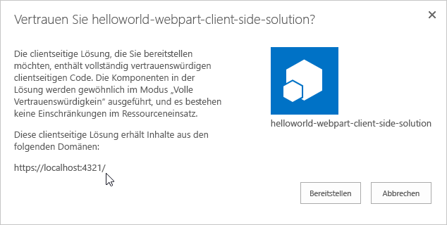
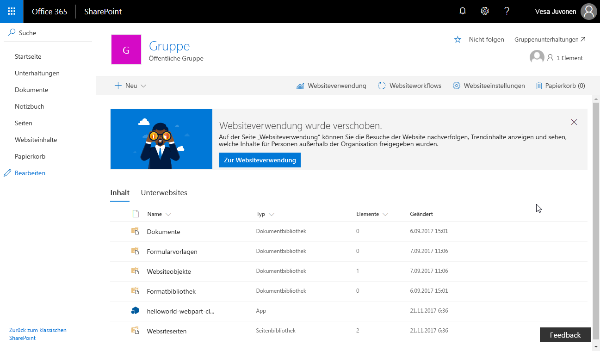
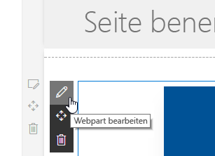

# <a name="deploy-your-client-side-web-part-to-a-sharepoint-page-hello-world-part-3"></a><span data-ttu-id="fdfbc-103">Bereitstellen des clientseitigen SharePoint-Webparts auf einer SharePoint-Seite („Hello World“ Teil 3)</span><span class="sxs-lookup"><span data-stu-id="fdfbc-103">Deploy your client-side web part to a SharePoint page (Hello world part 3)</span></span>

<span data-ttu-id="fdfbc-104">Stellen Sie sicher, dass Sie die Verfahren in den folgenden Artikeln abgeschlossen haben, bevor Sie beginnen:</span><span class="sxs-lookup"><span data-stu-id="fdfbc-104">Be sure you have completed the procedures in the following articles before you start:</span></span>

* [<span data-ttu-id="fdfbc-105">Erstellen des ersten clientseitigen SharePoint-Webparts</span><span class="sxs-lookup"><span data-stu-id="fdfbc-105">Build your first SharePoint client-side web part</span></span>](./build-a-hello-world-web-part.md)
* [<span data-ttu-id="fdfbc-106">Verbinden des clientseitigen Webparts mit SharePoint</span><span class="sxs-lookup"><span data-stu-id="fdfbc-106">Connect your client-side web part to SharePoint</span></span>](./connect-to-sharepoint.md)

<span data-ttu-id="fdfbc-107">Sie können die nachfolgend beschriebene Anleitung auch anhand dieses Videos in unserem [YouTube-Kanal „SharePoint Patterns & Practices“](https://www.youtube.com/watch?v=BpJ01ahxbiY&index=4&list=PLR9nK3mnD-OXvSWvS2zglCzz4iplhVrKq) nachvollziehen.</span><span class="sxs-lookup"><span data-stu-id="fdfbc-107">You can also follow these steps by watching the video on the [SharePoint PnP YouTube Channel](https://www.youtube.com/watch?v=BpJ01ahxbiY&index=4&list=PLR9nK3mnD-OXvSWvS2zglCzz4iplhVrKq).</span></span> 

<a href="https://www.youtube.com/watch?v=BpJ01ahxbiY&index=4&list=PLR9nK3mnD-OXvSWvS2zglCzz4iplhVrKq">

</a>


## <a name="package-the-helloworld-web-part"></a><span data-ttu-id="fdfbc-108">Packen des HelloWorld-Webparts</span><span class="sxs-lookup"><span data-stu-id="fdfbc-108">Package the HelloWorld web part</span></span>

1. <span data-ttu-id="fdfbc-109">Wechseln Sie im Konsolenfenster zum Webpart-Projektverzeichnis, das in [Erstellen des ersten clientseitigen SharePoint-Webparts](./build-a-hello-world-web-part.md) erstellt wurde.</span><span class="sxs-lookup"><span data-stu-id="fdfbc-109">In the console window, go to the web part project directory created in [Build your first SharePoint client-side web part](./build-a-hello-world-web-part.md).</span></span>

  ```
  cd helloworld-webpart
  ```

2. <span data-ttu-id="fdfbc-110">Wenn `gulp serve` noch ausgeführt wird, beenden Sie die Ausführung, indem Sie STRG + C drücken.</span><span class="sxs-lookup"><span data-stu-id="fdfbc-110">If gulp serve is still running, stop it from running by selecting Ctrl+C.</span></span>

  <span data-ttu-id="fdfbc-111">Im Gegensatz zur Workbench müssen Sie für die Verwendung von clientseitigen Webparts auf modernen serverseitigen SharePoint-Seiten den Webpart mit SharePoint bereitstellen und registrieren.</span><span class="sxs-lookup"><span data-stu-id="fdfbc-111">Unlike in the workbench, in order to use client-side web parts on modern SharePoint server-side pages, you need to deploy and register the web part with SharePoint. First you need to package the web part.</span></span> <span data-ttu-id="fdfbc-112">Zuerst müssen Sie das Webpart packen.</span><span class="sxs-lookup"><span data-stu-id="fdfbc-112">First you need to package the web part.</span></span>

3. <span data-ttu-id="fdfbc-113">Öffnen Sie das **HelloWorldWebPart**-Webpart-Projekt in Visual Studio Code oder in Ihrer bevorzugten IDE.</span><span class="sxs-lookup"><span data-stu-id="fdfbc-113">Open the **HelloWorldWebPart** web part project in Visual Studio Code, or your preferred IDE.</span></span>

4. <span data-ttu-id="fdfbc-114">Öffnen Sie **package-solution.json** im Ordner **config**.</span><span class="sxs-lookup"><span data-stu-id="fdfbc-114">Open **package-solution.json** from the **config** folder.</span></span>

  <span data-ttu-id="fdfbc-115">Die Datei **package-solution.json** definiert die Paketmetadaten, wie im folgenden Code dargestellt:</span><span class="sxs-lookup"><span data-stu-id="fdfbc-115">The **package-solution.json** file defines the package metadata as shown in the following code:</span></span>

  ```json
  {
    "$schema": "https://dev.office.com/json-schemas/spfx-build/package-solution.schema.json",
    "solution": {
      "name": "helloworld-webpart-client-side-solution",
      "id": "4432f33b-5845-4ca0-827e-a8ae68c7b945",
      "version": "1.0.0.0",
      "includeClientSideAssets": true
    },
    "paths": {
      "zippedPackage": "solution/helloworld-webpart.sppkg"
    }
  }

  ```

5. <span data-ttu-id="fdfbc-116">Geben Sie im Konsolenfenster den folgenden Befehl ein, um Ihre clientseitige Lösung zu packen, die das Webpart enthält:</span><span class="sxs-lookup"><span data-stu-id="fdfbc-116">In the console window, enter the following command to package your client-side solution that contains the web part:</span></span>

  ```
  gulp package-solution
  ```

  <span data-ttu-id="fdfbc-117">Der Befehl erstellt das Paket im `sharepoint/solution`-Ordner:</span><span class="sxs-lookup"><span data-stu-id="fdfbc-117">The command creates the package in the `sharepoint/solution` folder:</span></span>

  ```
  helloworld-webpart.sppkg
  ```

### <a name="package-contents"></a><span data-ttu-id="fdfbc-118">Paketinhalt</span><span class="sxs-lookup"><span data-stu-id="fdfbc-118">Package contents</span></span>

<span data-ttu-id="fdfbc-119">Das Paket verwendet SharePoint Feature zum Packen des Webparts.</span><span class="sxs-lookup"><span data-stu-id="fdfbc-119">The package uses SharePoint Feature to package your web part. By default, the gulp task creates the following:</span></span> <span data-ttu-id="fdfbc-120">Standardmäßig erstellt die gulp-Aufgabe ein Features für Ihr Webpart.</span><span class="sxs-lookup"><span data-stu-id="fdfbc-120">By default, the gulp task creates a feature for your web part.</span></span>

<span data-ttu-id="fdfbc-121">Sie können die unformatierten Paketinhalte im Ordner **sharepoint/debug** anzeigen.</span><span class="sxs-lookup"><span data-stu-id="fdfbc-121">You can view the raw package contents in the **sharepoint/debug** folder.</span></span> 

<span data-ttu-id="fdfbc-122">Die Inhalte werden dann in eine **.sppkg**-Datei gepackt.</span><span class="sxs-lookup"><span data-stu-id="fdfbc-122">The contents are then packaged into an **.sppkg** file.</span></span> <span data-ttu-id="fdfbc-123">Das Paketformat ähnelt einem SharePoint-Add-Ins-Paket und verwendet Microsoft Open Packaging Conventions, um Ihre Lösung zu packen.</span><span class="sxs-lookup"><span data-stu-id="fdfbc-123">The package format is very similar to a SharePoint add-ins package and uses Microsoft Open Packaging Conventions to package your solution.</span></span> 

<span data-ttu-id="fdfbc-124">Die JavaScript-Dateien, CSS und andere Objekte werden in das Paket gepackt, wenn die `--ship`-Option verwendet wird.</span><span class="sxs-lookup"><span data-stu-id="fdfbc-124">The JavaScript files, CSS and other assets are packaged also inside of the package when `--ship` option is used.</span></span> <span data-ttu-id="fdfbc-125">In diesem Fall werden jedoch zunächst die Bereitstellung und die Funktionen getestet, indem JavaScript-Dateien von Localhost gehostet werden.</span><span class="sxs-lookup"><span data-stu-id="fdfbc-125">In this case we will however first test deployment and capabilities by hosting JavaScript files from localhost.</span></span> <span data-ttu-id="fdfbc-126">Diese Bereitstellungsoption wird im nächsten Lernprogramm erläutert.</span><span class="sxs-lookup"><span data-stu-id="fdfbc-126">This deployment option is explained in the next tutorial.</span></span> 

> [!NOTE]
> <span data-ttu-id="fdfbc-127">Ab SharePoint-Framework v1. 4 werden statische Objekte standardmäßig in das .sppkg-Paket gepackt.</span><span class="sxs-lookup"><span data-stu-id="fdfbc-127">Starting from the SharePoint Framework v1.4, static assets are by default packaged inside of the sppkg package.</span></span> <span data-ttu-id="fdfbc-128">Wenn das Paket im App-Katalog bereitgestellt wird, werden sie automatisch in Office 365 CDN (falls aktiviert) oder in der App-Katalog-URL gehostet.</span><span class="sxs-lookup"><span data-stu-id="fdfbc-128">When a package is deployed in the App Catalog, the assets are automatically hosted either from Office 365 CDN (if enabled) or from an App Catalog URL.</span></span> <span data-ttu-id="fdfbc-129">Sie können dieses Verhalten mit der `includeClientSideAssets`-Einstellung in der `package-solution.json`-Datei steuern.</span><span class="sxs-lookup"><span data-stu-id="fdfbc-129">You can control this behavior with the `includeClientSideAssets` setting in `package-solution.json` file.</span></span>


## <a name="deploy-the-helloworld-package-to-app-catalog"></a><span data-ttu-id="fdfbc-130">Bereitstellen des HelloWorld-Pakets im App-Katalog</span><span class="sxs-lookup"><span data-stu-id="fdfbc-130">Deploy the HelloWorld package to app catalog</span></span>

<span data-ttu-id="fdfbc-131">Als Nächstes müssen Sie das Paket, das generiert wurde, im App-Katalog bereitstellen.</span><span class="sxs-lookup"><span data-stu-id="fdfbc-131">Next you need to deploy the package that was generated to the App Catalog.</span></span>

1. <span data-ttu-id="fdfbc-132">Wechseln Sie zum App-Katalog der Website.</span><span class="sxs-lookup"><span data-stu-id="fdfbc-132">Go to your site's App Catalog.</span></span>

2. <span data-ttu-id="fdfbc-133">Laden Sie **helloworld-webpart.sppkg** in den App-Katalog hoch oder legen Sie es durch Drag & Drop dort ab.</span><span class="sxs-lookup"><span data-stu-id="fdfbc-133">Upload or drag and drop the **helloworld-webpart.sppkg** to the App Catalog.</span></span>

   

  <span data-ttu-id="fdfbc-135">Dadurch wird das clientseitige Lösungspaket bereitgestellt.</span><span class="sxs-lookup"><span data-stu-id="fdfbc-135">This deploys the client-side solution package.</span></span> <span data-ttu-id="fdfbc-136">Da es sich um eine vollständig vertrauenswürdige clientseitige Lösung handelt, zeigt SharePoint ein Dialogfeld an und fordert Sie auf, der bereitzustellenden clientseitigen Lösung zu vertrauen.</span><span class="sxs-lookup"><span data-stu-id="fdfbc-136">This will deploy the client-side solution package. Since this is a full trust client-side solution, SharePoint will display a dialog and ask you to trust the client-side solution to deploy.</span></span>

   
    
3. <span data-ttu-id="fdfbc-138">Wählen Sie **Bereitstellen**.</span><span class="sxs-lookup"><span data-stu-id="fdfbc-138">Select the **Deploy** button.</span></span>


## <a name="install-the-client-side-solution-on-your-site"></a><span data-ttu-id="fdfbc-139">Installieren der clientseitigen Lösung auf Ihrer Website</span><span class="sxs-lookup"><span data-stu-id="fdfbc-139">Install the client-side solution on your site</span></span>

1. <span data-ttu-id="fdfbc-140">Wechseln Sie zu Ihrer Entwicklerwebsitesammlung.</span><span class="sxs-lookup"><span data-stu-id="fdfbc-140">Go to your developer site collection.</span></span>

2. <span data-ttu-id="fdfbc-141">Klicken Sie auf der oberen Navigationsleiste rechts auf das Zahnradsymbol und anschließend auf **App hinzufügen**, um Ihre Apps-Seite aufzurufen.</span><span class="sxs-lookup"><span data-stu-id="fdfbc-141">Select the gears icon on the top navigation bar on the right, and then select **Add an app** to go to your Apps page.</span></span>

3. <span data-ttu-id="fdfbc-142">Geben Sie in das Feld **Suchen** die Zeichenfolge **helloworld** ein, und drücken Sie die **Eingabetaste**, um Ihre Apps zu filtern.</span><span class="sxs-lookup"><span data-stu-id="fdfbc-142">In the **Search** box, enter **helloworld** and choose **Enter** to filter your apps.</span></span>
    
  
    
4. <span data-ttu-id="fdfbc-144">Wählen Sie die App **helloworld-webpart-client-side-solution** aus, um die App auf der Website zu installieren.</span><span class="sxs-lookup"><span data-stu-id="fdfbc-144">Choose the **helloworld-webpart-client-side-solution** app to install the app on the site.</span></span>
    
  

  <span data-ttu-id="fdfbc-146">Die clientseitige Lösung und das Webpart werden Ihrer Entwicklerwebsite installiert.</span><span class="sxs-lookup"><span data-stu-id="fdfbc-146">The client-side solution and the web part are installed on your developer site.</span></span>

<span data-ttu-id="fdfbc-147">Auf der Seite **Websiteinhalte** wird der Installationsstatus der clientseitigen Lösung angezeigt.</span><span class="sxs-lookup"><span data-stu-id="fdfbc-147">The **Site Contents** page will show you the installation status of your client-side solution.</span></span> <span data-ttu-id="fdfbc-148">Stellen Sie sicher, dass die Installation abgeschlossen ist, bevor Sie mit dem nächsten Schritt fortfahren.</span><span class="sxs-lookup"><span data-stu-id="fdfbc-148">Make sure the installation is complete before going to the next step.</span></span>

## <a name="preview-the-web-part-on-a-sharepoint-page"></a><span data-ttu-id="fdfbc-149">Anzeigen einer Vorschau des Webparts auf einer SharePoint-Seite</span><span class="sxs-lookup"><span data-stu-id="fdfbc-149">Preview the web part in a SharePoint page</span></span>

<span data-ttu-id="fdfbc-150">Da Sie die clientseitige Lösung jetzt bereitgestellt und installiert haben, fügen Sie das Webpart zu einer SharePoint-Seite hinzu.</span><span class="sxs-lookup"><span data-stu-id="fdfbc-150">Now that you have deployed and installed the client-side solution, add the web part to a SharePoint page. Remember that resources such as JavaScripts, and CSS, are available from the local computer.</span></span> <span data-ttu-id="fdfbc-151">Denken Sie daran, dass Ressourcen wie JavaScript und CSS auf dem lokalen Computer zur Verfügung stehen.</span><span class="sxs-lookup"><span data-stu-id="fdfbc-151">Remember that resources such as JavaScript and CSS are available from the local computer.</span></span>

1. <span data-ttu-id="fdfbc-152">Öffnen Sie `<your-webpart-guid>.manifest.json` über den Ordner `\dist`.</span><span class="sxs-lookup"><span data-stu-id="fdfbc-152">Open the `<your-webpart-guid>.manifest.json` from the `\dist` folder.</span></span>
    
  <span data-ttu-id="fdfbc-153">Beachten Sie, dass die **internalModuleBaseUrls**-Eigenschaft im **loaderConfig**-Eintrag immer noch auf Ihren lokalen Computer verweist:</span><span class="sxs-lookup"><span data-stu-id="fdfbc-153">Notice that the **internalModuleBaseUrls** property in the **loaderConfig** entry still refers to your local computer:</span></span>

  ```json
  "internalModuleBaseUrls": [
    "https://`your-local-machine-name`:4321/"
  ]
  ```

2. <span data-ttu-id="fdfbc-154">Führen Sie vor dem Hinzufügen des Webparts zu einer serverseitigen SharePoint-Seite den lokalen Server aus.</span><span class="sxs-lookup"><span data-stu-id="fdfbc-154">Before adding the web part to a SharePoint server-side page, run the local server.</span></span>
    
3. <span data-ttu-id="fdfbc-155">Führen Sie im Konsolenfenster mit dem Projektverzeichnis **helloworld-webpart** den Gulp-Vorgang aus, um den Serverbetrieb von Localhost zu starten:</span><span class="sxs-lookup"><span data-stu-id="fdfbc-155">In the console window that has the **helloworld-webpart** project directory, run the gulp task to start serving from localhost:</span></span>
    
  ```
  gulp serve --nobrowser
  ```

  > [!NOTE]
  > <span data-ttu-id="fdfbc-156">`--nobrowser` startet die SharePoint Workbench nicht automatisch.</span><span class="sxs-lookup"><span data-stu-id="fdfbc-156">`--nobrowser` will not automatically launch the SharePoint Workbench.</span></span>

## <a name="add-the-helloworld-web-part-to-modern-page"></a><span data-ttu-id="fdfbc-157">Hinzufügen des HelloWorld-Webparts zur modernen Seite</span><span class="sxs-lookup"><span data-stu-id="fdfbc-157">Add the HelloWorld web part to modern page</span></span>

1. <span data-ttu-id="fdfbc-158">Wechseln Sie in Ihrem Browser zu der Website, auf der die Lösung installiert wurde.</span><span class="sxs-lookup"><span data-stu-id="fdfbc-158">In your browser go to your site where solution was just installed.</span></span>
    
2. <span data-ttu-id="fdfbc-159">Wählen Sie das Zahnräder-Symbol in der oberen Navigationsleiste auf der rechten Seite und dann **Seite hinzufügen** aus.</span><span class="sxs-lookup"><span data-stu-id="fdfbc-159">Choose the gears icon in the top nav bar on the right and choose **Add a page**.</span></span>
    
3. <span data-ttu-id="fdfbc-160">Bearbeiten Sie die Seite.</span><span class="sxs-lookup"><span data-stu-id="fdfbc-160">Edit the page.</span></span> 

4. <span data-ttu-id="fdfbc-161">Öffnen Sie die Webpart-Auswahl, und wählen Sie das Webpart **HelloWorld** aus.</span><span class="sxs-lookup"><span data-stu-id="fdfbc-161">Open web part picker and chose your **HelloWorld** web part.</span></span>
        
<span data-ttu-id="fdfbc-162">Die Webpart-Objekte werden aus der lokalen Umgebung geladen.</span><span class="sxs-lookup"><span data-stu-id="fdfbc-162">The web part assets are loaded from the local environment.</span></span> <span data-ttu-id="fdfbc-163">Um die Skripts zu laden, die auf Ihrem lokalen Computer gehostet werden, müssen Sie es dem Browser ermöglichen, unsichere Skripts zu laden.</span><span class="sxs-lookup"><span data-stu-id="fdfbc-163">To load the scripts hosted on your local computer, you need to enable the browser to load unsafe scripts.</span></span> <span data-ttu-id="fdfbc-164">Stellen Sie je nach verwendetem Browser sicher, dass Sie das Laden unsicherer Skripts für diese Sitzung aktivieren.</span><span class="sxs-lookup"><span data-stu-id="fdfbc-164">Depending on the browser you are using, make sure you enable loading unsafe scripts for this session.</span></span>
    
<span data-ttu-id="fdfbc-165">Sie sollten das **HelloWorld**-Webpart sehen, das Sie im vorherigen Artikel erstellt haben und das Listen von der aktuellen Website abruft.</span><span class="sxs-lookup"><span data-stu-id="fdfbc-165">You should see the **HelloWorld** web part you built in the previous article that retrieves lists from the current site.</span></span> 


## <a name="edit-web-part-properties"></a><span data-ttu-id="fdfbc-167">Bearbeiten von Webparteigenschaften</span><span class="sxs-lookup"><span data-stu-id="fdfbc-167">Edit web part properties</span></span>

1. <span data-ttu-id="fdfbc-168">Klicken Sie auf das Symbol **Element konfigurieren** (Stift) im Webpart, um den Eigenschaftenbereich für das Webpart zu öffnen.</span><span class="sxs-lookup"><span data-stu-id="fdfbc-168">Click the **Configure element** icon (pen) in the web part to open the property pane for the web part.</span></span>

  

  <span data-ttu-id="fdfbc-170">Dies ist derselbe Eigenschaftenbereich, den Sie in der Workbench erstellt und als Vorschau angezeigt haben.</span><span class="sxs-lookup"><span data-stu-id="fdfbc-170">This is the same property pane you built and previewed in the workbench.</span></span>
    
2. <span data-ttu-id="fdfbc-171">Bearbeiten Sie die **Description**-Eigenschaft, und geben Sie **Clientseitige Webparts sind großartig!** ein.</span><span class="sxs-lookup"><span data-stu-id="fdfbc-171">Edit the **Description** property and enter **Client-side web parts are awesome!**</span></span>
    
  

3. <span data-ttu-id="fdfbc-173">Beachten Sie, dass immer noch die gleichen Verhalten vorhanden sind, wie z. B. ein reaktiver Bereich, in dem das Webpart während der Eingabe aktualisiert wird.</span><span class="sxs-lookup"><span data-stu-id="fdfbc-173">Notice that you still have the same behaviors such as a reactive pane where the web part is updated as you type.</span></span>
    
4. <span data-ttu-id="fdfbc-174">Wählen Sie das **x**-Symbol aus, um den clientseitigen Eigenschaftenbereich zu schließen.</span><span class="sxs-lookup"><span data-stu-id="fdfbc-174">Choose the **x** icon to close the client-side property pane.</span></span>
        
5. <span data-ttu-id="fdfbc-175">Wählen Sie in der Symbolleiste **Speichern und schließen**, um die Seite zu speichern.</span><span class="sxs-lookup"><span data-stu-id="fdfbc-175">In the toolbar, choose **Save and close** to save the page.</span></span>

## <a name="next-steps"></a><span data-ttu-id="fdfbc-176">Nächste Schritte</span><span class="sxs-lookup"><span data-stu-id="fdfbc-176">Next steps</span></span>

<span data-ttu-id="fdfbc-177">Ausgezeichnet.</span><span class="sxs-lookup"><span data-stu-id="fdfbc-177">Congratulations!</span></span> <span data-ttu-id="fdfbc-178">Sie haben ein clientseitiges Webpart auf einer modernen SharePoint-Seite bereitgestellt.</span><span class="sxs-lookup"><span data-stu-id="fdfbc-178">You have deployed a client-side web part to a modern SharePoint page.</span></span> 

<span data-ttu-id="fdfbc-179">Im nächsten Thema [Hosten clientseitiger Webparts im Office 365 CDN](./hosting-webpart-from-office-365-cdn.md) können Sie mit der Weiterentwicklung des „Hello World“-Webparts fortfahren. Dort erhalten Sie Informationen zum Bereitstellen und Laden der Webpart-Objekte von einem Office 365 CDN anstelle von Localhost.</span><span class="sxs-lookup"><span data-stu-id="fdfbc-179">You can continue building out your Hello World web part in the next topic, [Hosting client-side web part from Office 365 CDN](./hosting-webpart-from-office-365-cdn.md), where you will learn how to deploy and load the web part assets from a Office 365 CDN instead of localhost.</span></span>

> [!NOTE]
> <span data-ttu-id="fdfbc-180">Wenn Sie einen Fehler in der Dokumentation oder im SharePoint-Framework finden, melden Sie ihn an das SharePoint Engineering unter Verwendung der [Fehlerliste im sp-dev-docs-Repository](https://github.com/SharePoint/sp-dev-docs/issues).</span><span class="sxs-lookup"><span data-stu-id="fdfbc-180">If you find an issue in the documentation or in the SharePoint Framework, please report that to SharePoint engineering using the [issue list at sp-dev-docs repository](https://github.com/SharePoint/sp-dev-docs/issues).</span></span> <span data-ttu-id="fdfbc-181">Vielen Dank im Voraus für Ihr Feedback.</span><span class="sxs-lookup"><span data-stu-id="fdfbc-181">Thanks for your input advance.</span></span>