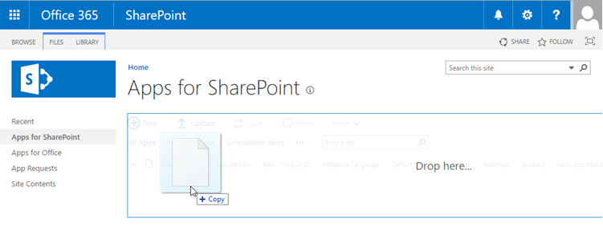
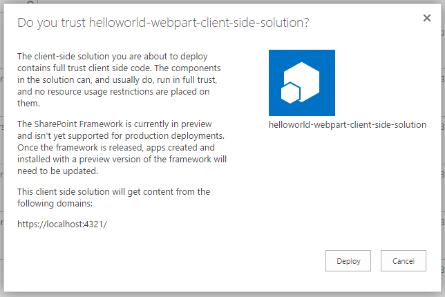
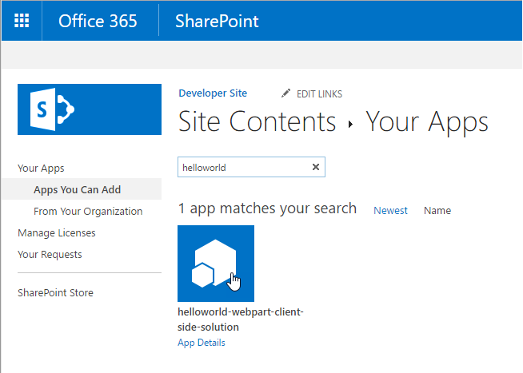

# <a name="deploy-your-client-side-web-part-to-a-sharepoint-page-hello-world-part-3"></a>Bereitstellen des clientseitigen SharePoint-Webparts auf einer SharePoint-Seite („Hello World“ Teil 3)

In diesem Artikel erfahren Sie, wie Sie den clientseitigen Webpart in SharePoint bereitstellen und wie es auf einer klassischen serverseitigen SharePoint-Seite ausgeführt wird. In diesem Artikel wird weiterhin der „Hello World“-Webpart verwendet, der im vorherigen Artikel [Verbinden des clientseitigen Webparts mit SharePoint](./connect-to-sharepoint) erstellt wurde.

Achten Sie darauf, dass Sie die Verfahren in den folgenden Artikeln abgeschlossen haben, bevor Sie beginnen:

* [Erstellen des ersten clientseitigen SharePoint-Webparts](./build-a-hello-world-web-part)
* [Verbinden des clientseitigen Webparts mit SharePoint](./connect-to-sharepoint)

Sie können die nachfolgend beschriebene Anleitung auch anhand dieses Videos in unserem [YouTube-Kanal „SharePoint Patterns & Practices“](https://www.youtube.com/watch?v=asmQIfgaKSw&list=PLR9nK3mnD-OXvSWvS2zglCzz4iplhVrKq) nachvollziehen: 

<a href="https://www.youtube.com/watch?v=asmQIfgaKSw&list=PLR9nK3mnD-OXvSWvS2zglCzz4iplhVrKq">

</a>


## <a name="package-the-helloworld-web-part"></a>Packen des HelloWorld-Webparts

Wechseln Sie im Konsolenfenster zum Webpart-Projektverzeichnis, das in [Erstellen des ersten clientseitigen SharePoint-Webparts](./build-a-hello-world-web-part) erstellt wurde.

```
cd helloworld-webpart
```

Wenn `gulp serve` noch ausgeführt wird, halten Sie es durch Auswahl von `Ctrl+C` an.

Im Gegensatz zur Workbench müssen Sie für die Verwendung von clientseitigen Webparts auf modernen serverseitigen SharePoint-Seiten den Webpart mit SharePoint bereitstellen und registrieren. Zuerst müssen Sie den Webpart packen.

Öffnen Sie das **HelloWorldWebPart**-Webpart-Projekt in Visual Studio Code oder in Ihrer bevorzugten IDE.

Öffnen Sie **package-solution.json** im Ordner **config**.

Die Datei **package-solution.json** definiert die Paketmetadaten, wie im folgenden Code dargestellt:

```json
{
    "solution": {
        "name": "helloworld-webpart-client-side-solution",
        "id": "ed83e452-2286-4ea0-8f98-c79d257acea5",
        "version": "1.0.0.0"
    },
    "paths": {
        "zippedPackage": "solution/helloworld-webpart.sppkg"
    }
}
```

Geben Sie im Konsolenfenster den folgenden Befehl ein, um Ihre clientseitige Lösung zu packen, die das Webpart enthält:

```
gulp package-solution
```

Der Befehl erstellt das Paket im `sharepoint/solution`-Ordner:

```
helloworld-webpart.sppkg
```

### <a name="package-contents"></a>Paketinhalt

Das Paket verwendet SharePoint Feature zum Packen des Webparts. Standardmäßig erstellt der Gulp-Vorgang Folgendes:

* Ein Feature für das Webpart.

Sie können die unformatierten Paketinhalte im Ordner **sharepoint/debug** anzeigen. 

Die Inhalte werden dann in eine **.sppkg**-Datei gepackt. Das Paketformat ähnelt einem SharePoint-Add-Ins-Paket und verwendet Microsoft Open Packaging Conventions, um Ihre Lösung zu packen. 

Die JavaScript-Dateien, CSS und andere Elemente werden nicht gepackt, und Sie müssen sie an einem externen Speicherort, z. B. ein CDN, bereitstellen. Um das Webpart während der Entwicklung zu testen, können Sie alle Elemente von Ihrem lokalen Computer laden. 

## <a name="deploy-the-helloworld-package-to-app-catalog"></a>Bereitstellen der HelloWorld-Pakets im App-Katalog

Als Nächstes müssen Sie das Paket, das generiert wurde, im App-Katalog bereitstellen.

Wechseln Sie zum App-Katalog der Website.

Laden Sie **helloworld-webpart.sppkg** in den App-Katalog hoch oder legen Sie es durch Drag & Drop dort ab.

 

Dadurch wird das clientseitige Lösungspaket bereitgestellt. Da es sich um eine vollständig vertrauenswürdige clientseitige Lösung handelt, zeigt SharePoint ein Dialogfeld an und fordert Sie auf, der bereitzustellenden clientseitigen Lösung zu vertrauen.

 
    
Wählen Sie **Bereitstellen** aus.

## <a name="install-the-client-side-solution-on-your-site"></a>Installieren der clientseitigen Lösung auf Ihrer Website

Wechseln Sie zu Ihrer Entwicklerwebsitesammlung.

Wählen Sie das Zahnräder-Symbol in der oberen Navigationsleiste auf der rechten Seite und dann **Eine App hinzufügen** aus, um zu Ihrer Apps-Seite zu wechseln.

Geben Sie in das Feld **Suchen** die Zeichenfolge **helloworld** ein, und drücken Sie die **Eingabetaste**, um Ihre Apps zu filtern.
    
 
    
Wählen Sie die App **helloworld-webpart-client-side-solution** aus, um die App auf der Website zu installieren.
    
 

Die clientseitige Lösung und das Webpart werden Ihrer Entwicklerwebsite installiert.

Auf der Seite **Websiteinhalte** wird der Installationsstatus der clientseitigen Lösung angezeigt. Stellen Sie sicher, dass die Installation abgeschlossen ist, bevor Sie mit dem nächsten Schritt fortfahren.

## <a name="preview-the-web-part-in-a-sharepoint-page"></a>Anzeigen einer Vorschau des Webparts auf einer SharePoint-Seite

Da Sie die clientseitige Lösung jetzt bereitgestellt und installiert haben, fügen Sie den Webpart zu einer SharePoint-Seite hinzu. Denken Sie daran, dass Ressourcen wie JavaScript und CSS auf dem lokalen Computer zur Verfügung stehen.

Öffnen Sie **<your-webpart-guid>.manifest.json** im Ordner **\dist**.
    
Beachten Sie, dass die **internalModuleBaseUrls**-Eigenschaft im **loaderConfig**-Eintrag immer noch auf Ihren lokalen Computer verweist:

```json
"internalModuleBaseUrls": [
    "https://`your-local-machine-name`:4321/"
]
```

Führen Sie vor dem Hinzufügen des Webparts zu einer serverseitigen SharePoint-Seite den lokalen Server aus.
    
Führen Sie im Konsolenfenster mit dem Projektverzeichnis **helloworld-webpart** den Gulp-Vorgang aus, um den Serverbetrieb von Localhost zu starten:
    
```
gulp serve --nobrowser
```

>**Hinweis:** `--nobrowser` startet die SharePoint Workbench nicht automatisch.

## <a name="add-the-helloworld-web-part-to-modern-page"></a>Hinzufügen des HelloWorld-Webparts zur modernen Seite

Wechseln Sie im Browser zu Ihrer Websitesammlung.
    
Wählen Sie das Zahnräder-Symbol in der oberen Navigationsleiste auf der rechten Seite und dann **Seite hinzufügen** aus.
    
Öffnen Sie die Webpart-Auswahl, und wählen Sie Ihren **HelloWorld**-Webpart.
        
Die Webpart-Objekte werden aus der lokalen Umgebung geladen. Um die Skripts zu laden, die auf Ihrem lokalen Computer gehostet werden, müssen Sie es dem Browser ermöglichen, unsichere Skripts zu laden. Stellen Sie je nach verwendetem Browser sicher, dass Sie das Laden unsicherer Skripts für diese Sitzung aktivieren.
    
Sie sollten den **HelloWorld**-Webpart sehen, den Sie im vorherigen Artikel erstellt haben und der Listen von der aktuellen Website abruft. 


## <a name="edit-web-part-properties"></a>Bearbeiten von Webparteigenschaften

Klicken Sie auf das Symbol **Element konfigurieren** (Stift) im Webpart, um den Eigenschaftenbereich für den Webpart zu öffnen.


Dies ist derselbe Eigenschaftenbereich, den Sie in der Workbench erstellt und als Vorschau angezeigt haben.
    
Bearbeiten Sie die **Description**-Eigenschaft, und geben Sie **Clientseitige Webparts sind großartig!** ein.
    


Beachten Sie, dass immer noch die gleichen Verhalten vorhanden sind, wie z. B. ein reaktiver Bereich, in dem der Webpart während der Eingabe aktualisiert wird.
    
Wählen Sie das **x**-Symbol aus, um den clientseitigen Eigenschaftenbereich zu schließen.
        
Wählen Sie in der Symbolleiste **peichern und schließen**, um die Seite zu speichern.

## <a name="next-steps"></a>Nächste Schritte

Ausgezeichnet. Sie haben einen clientseitigen Webpart auf einer modernen SharePoint-Seite bereitgestellt. Im nächsten Thema [Bereitstellen Ihrer clientseitigen Webpartquelle für einen CDN](./deploy-web-part-to-cdn) können Sie mit der Weiterentwicklung des „Hello World“-Webparts fortfahren. Dort erhalten Sie Informationen zum Bereitstellen und Laden der Webpart-Objekte von einem CDN anstelle von Localhost.
