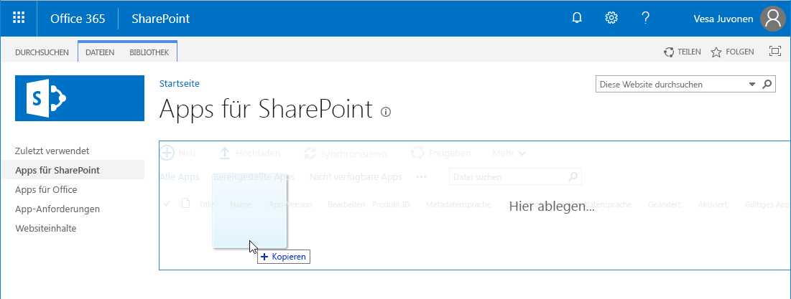
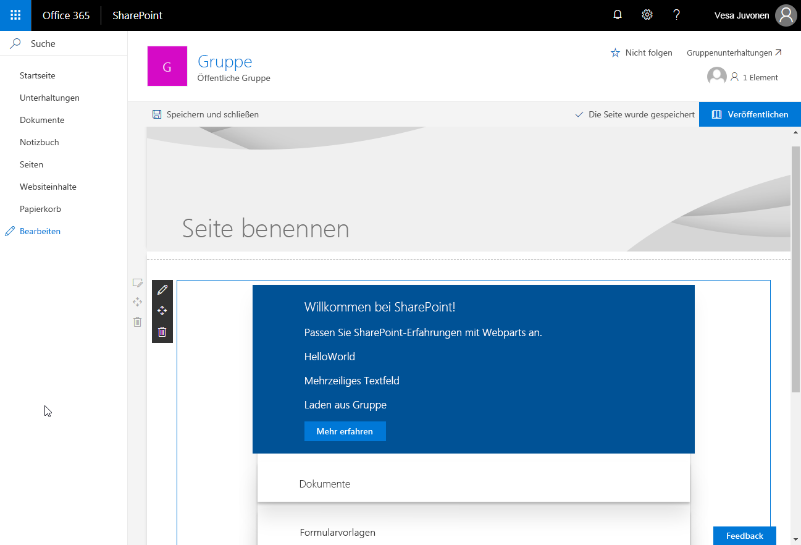
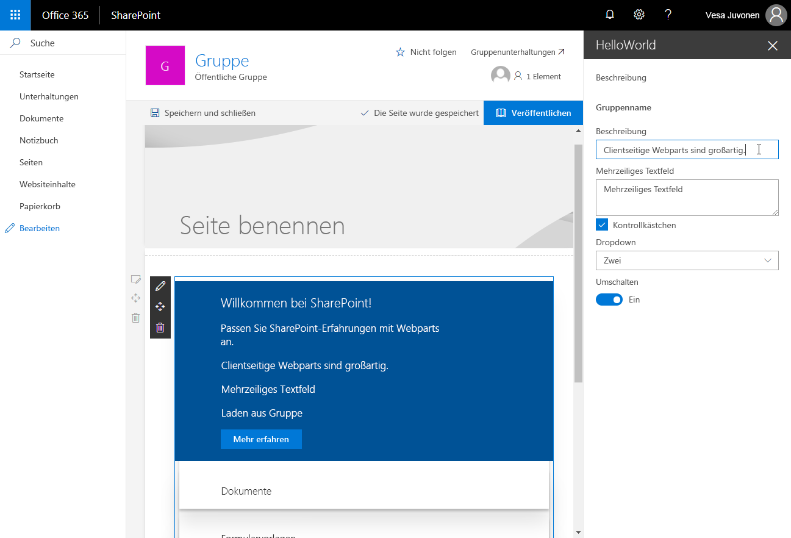

# <a name="deploy-your-client-side-web-part-to-a-sharepoint-page-hello-world-part-3"></a>Bereitstellen des clientseitigen SharePoint-Webparts auf einer SharePoint-Seite („Hello World“ Teil 3)

Stellen Sie sicher, dass Sie die Verfahren in den folgenden Artikeln abgeschlossen haben, bevor Sie beginnen:

* [Erstellen des ersten clientseitigen SharePoint-Webparts](./build-a-hello-world-web-part.md)
* [Verbinden des clientseitigen Webparts mit SharePoint](./connect-to-sharepoint.md)

Sie können die nachfolgend beschriebene Anleitung auch anhand dieses Videos in unserem [YouTube-Kanal „SharePoint Patterns & Practices“](https://www.youtube.com/watch?v=BpJ01ahxbiY&index=4&list=PLR9nK3mnD-OXvSWvS2zglCzz4iplhVrKq) nachvollziehen. 

<a href="https://www.youtube.com/watch?v=BpJ01ahxbiY&index=4&list=PLR9nK3mnD-OXvSWvS2zglCzz4iplhVrKq">

</a>


## <a name="package-the-helloworld-web-part"></a>Packen des HelloWorld-Webparts

1. Wechseln Sie im Konsolenfenster zum Webpart-Projektverzeichnis, das in [Erstellen des ersten clientseitigen SharePoint-Webparts](./build-a-hello-world-web-part.md) erstellt wurde.

  ```
  cd helloworld-webpart
  ```

2. Wenn `gulp serve` noch ausgeführt wird, beenden Sie die Ausführung, indem Sie STRG + C drücken.

  Im Gegensatz zur Workbench müssen Sie für die Verwendung von clientseitigen Webparts auf modernen serverseitigen SharePoint-Seiten den Webpart mit SharePoint bereitstellen und registrieren. Zuerst müssen Sie das Webpart packen.

3. Öffnen Sie das **HelloWorldWebPart**-Webpart-Projekt in Visual Studio Code oder in Ihrer bevorzugten IDE.

4. Öffnen Sie **package-solution.json** im Ordner **config**.

  Die Datei **package-solution.json** definiert die Paketmetadaten, wie im folgenden Code dargestellt:

  ```json
  {
    "$schema": "https://dev.office.com/json-schemas/spfx-build/package-solution.schema.json",
    "solution": {
      "name": "helloworld-webpart-client-side-solution",
      "id": "4432f33b-5845-4ca0-827e-a8ae68c7b945",
      "version": "1.0.0.0",
      "includeClientSideAssets": true
    },
    "paths": {
      "zippedPackage": "solution/helloworld-webpart.sppkg"
    }
  }

  ```

5. Geben Sie im Konsolenfenster den folgenden Befehl ein, um Ihre clientseitige Lösung zu packen, die das Webpart enthält:

  ```
  gulp package-solution
  ```

  Der Befehl erstellt das Paket im `sharepoint/solution`-Ordner:

  ```
  helloworld-webpart.sppkg
  ```

### <a name="package-contents"></a>Paketinhalt

Das Paket verwendet SharePoint Feature zum Packen des Webparts. Standardmäßig erstellt die gulp-Aufgabe ein Features für Ihr Webpart.

Sie können die unformatierten Paketinhalte im Ordner **sharepoint/debug** anzeigen. 

Die Inhalte werden dann in eine **.sppkg**-Datei gepackt. Das Paketformat ähnelt einem SharePoint-Add-Ins-Paket und verwendet Microsoft Open Packaging Conventions, um Ihre Lösung zu packen. 

Die JavaScript-Dateien, CSS und andere Objekte werden in das Paket gepackt, wenn die `--ship`-Option verwendet wird. In diesem Fall werden jedoch zunächst die Bereitstellung und die Funktionen getestet, indem JavaScript-Dateien von Localhost gehostet werden. Diese Bereitstellungsoption wird im nächsten Lernprogramm erläutert. 

> [!NOTE]
> Ab SharePoint-Framework v1. 4 werden statische Objekte standardmäßig in das .sppkg-Paket gepackt. Wenn das Paket im App-Katalog bereitgestellt wird, werden sie automatisch in Office 365 CDN (falls aktiviert) oder in der App-Katalog-URL gehostet. Sie können dieses Verhalten mit der `includeClientSideAssets`-Einstellung in der `package-solution.json`-Datei steuern.


## <a name="deploy-the-helloworld-package-to-app-catalog"></a>Bereitstellen des HelloWorld-Pakets im App-Katalog

Als Nächstes müssen Sie das Paket, das generiert wurde, im App-Katalog bereitstellen.

1. Wechseln Sie zum App-Katalog der Website.

2. Laden Sie **helloworld-webpart.sppkg** in den App-Katalog hoch oder legen Sie es durch Drag & Drop dort ab.

   

  Dadurch wird das clientseitige Lösungspaket bereitgestellt. Da es sich um eine vollständig vertrauenswürdige clientseitige Lösung handelt, zeigt SharePoint ein Dialogfeld an und fordert Sie auf, der bereitzustellenden clientseitigen Lösung zu vertrauen.

   
    
3. Wählen Sie **Bereitstellen**.


## <a name="install-the-client-side-solution-on-your-site"></a>Installieren der clientseitigen Lösung auf Ihrer Website

1. Wechseln Sie zu Ihrer Entwicklerwebsitesammlung.

2. Klicken Sie auf der oberen Navigationsleiste rechts auf das Zahnradsymbol und anschließend auf **App hinzufügen**, um Ihre Apps-Seite aufzurufen.

3. Geben Sie in das Feld **Suchen** die Zeichenfolge **helloworld** ein, und drücken Sie die EINGABETASTE, um Ihre Apps zu filtern.
    
  
    
4. Wählen Sie die App **helloworld-webpart-client-side-solution** aus, um die App auf der Website zu installieren.
    
  

  Die clientseitige Lösung und das Webpart werden Ihrer Entwicklerwebsite installiert.

Auf der Seite **Websiteinhalte** wird der Installationsstatus der clientseitigen Lösung angezeigt. Stellen Sie sicher, dass die Installation abgeschlossen ist, bevor Sie mit dem nächsten Schritt fortfahren.

## <a name="preview-the-web-part-on-a-sharepoint-page"></a>Anzeigen einer Vorschau des Webparts auf einer SharePoint-Seite

Da Sie die clientseitige Lösung jetzt bereitgestellt und installiert haben, fügen Sie das Webpart zu einer SharePoint-Seite hinzu. Denken Sie daran, dass Ressourcen wie JavaScript und CSS auf dem lokalen Computer zur Verfügung stehen.

1. Öffnen Sie `<your-webpart-guid>.manifest.json` über den Ordner `\dist`.
    
  Beachten Sie, dass die **internalModuleBaseUrls**-Eigenschaft im **loaderConfig**-Eintrag immer noch auf Ihren lokalen Computer verweist:

  ```json
  "internalModuleBaseUrls": [
    "https://`your-local-machine-name`:4321/"
  ]
  ```

2. Führen Sie vor dem Hinzufügen des Webparts zu einer serverseitigen SharePoint-Seite den lokalen Server aus.
    
3. Führen Sie im Konsolenfenster mit dem Projektverzeichnis **helloworld-webpart** den Gulp-Vorgang aus, um den Serverbetrieb von Localhost zu starten:
    
  ```
  gulp serve --nobrowser
  ```

  > [!NOTE]
  > `--nobrowser` startet die SharePoint Workbench nicht automatisch.

## <a name="add-the-helloworld-web-part-to-modern-page"></a>Hinzufügen des HelloWorld-Webparts zur modernen Seite

1. Wechseln Sie in Ihrem Browser zu der Website, auf der die Lösung installiert wurde.
    
2. Wählen Sie das Zahnräder-Symbol in der oberen Navigationsleiste auf der rechten Seite und dann **Seite hinzufügen** aus.
    
3. Bearbeiten Sie die Seite. 

4. Öffnen Sie die Webpart-Auswahl, und wählen Sie das Webpart **HelloWorld** aus.
        
Die Webpart-Objekte werden aus der lokalen Umgebung geladen. Um die Skripts zu laden, die auf Ihrem lokalen Computer gehostet werden, müssen Sie es dem Browser ermöglichen, unsichere Skripts zu laden. Stellen Sie je nach verwendetem Browser sicher, dass Sie das Laden unsicherer Skripts für diese Sitzung aktivieren.
    
Sie sollten das **HelloWorld**-Webpart sehen, das Sie im vorherigen Artikel erstellt haben und das Listen von der aktuellen Website abruft. 



## <a name="edit-web-part-properties"></a>Bearbeiten von Webparteigenschaften

1. Klicken Sie auf das Symbol **Element konfigurieren** (Stift) im Webpart, um den Eigenschaftenbereich für das Webpart zu öffnen.

  

  Dies ist derselbe Eigenschaftenbereich, den Sie in der Workbench erstellt und als Vorschau angezeigt haben.
    
2. Bearbeiten Sie die **Description**-Eigenschaft, und geben Sie **Clientseitige Webparts sind großartig!** ein.
    
  

3. Beachten Sie, dass immer noch die gleichen Verhalten vorhanden sind, wie z. B. ein reaktiver Bereich, in dem das Webpart während der Eingabe aktualisiert wird.
    
4. Wählen Sie das **x**-Symbol aus, um den clientseitigen Eigenschaftenbereich zu schließen.
        
5. Wählen Sie in der Symbolleiste **Speichern und schließen**, um die Seite zu speichern.

## <a name="next-steps"></a>Nächste Schritte

Ausgezeichnet. Sie haben ein clientseitiges Webpart auf einer modernen SharePoint-Seite bereitgestellt. 

Im nächsten Thema [Hosten clientseitiger Webparts im Office 365 CDN](./hosting-webpart-from-office-365-cdn.md) können Sie mit der Weiterentwicklung des „Hello World“-Webparts fortfahren. Dort erhalten Sie Informationen zum Bereitstellen und Laden der Webpart-Objekte von einem Office 365 CDN anstelle von Localhost.

> [!NOTE]
> Wenn Sie einen Fehler in der Dokumentation oder im SharePoint-Framework finden, melden Sie ihn an das SharePoint Engineering unter Verwendung der [Fehlerliste im sp-dev-docs-Repository](https://github.com/SharePoint/sp-dev-docs/issues). Vielen Dank im Voraus für Ihr Feedback.