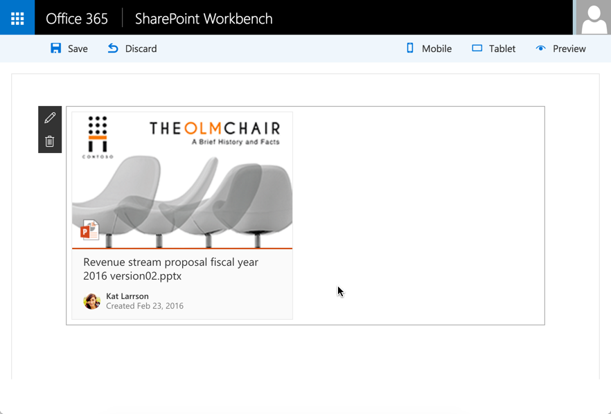

<span data-ttu-id="8a226-p108">Wie Sie sehen, wird hier ein relativer Pfad mit einer Anweisung des Typs `require` verwendet, um Bilder zu laden. Derzeit sind einige kleinere Konfigurationsanpassungen in der Datei „gulpfile.js“ nötig, damit diese Bilder korrekt von webpack verarbeitet werden.</span><span class="sxs-lookup"><span data-stu-id="8a226-p108">Notice the use of relative path with a `require` statement to load images. Currently, you need to perform small configuration in the gulpfile.js to enable these images to get processed properly by webpack.</span></span>

Wie Sie sehen, wird hier ein relativer Pfad mit einer Anweisung des Typs `require` verwendet, um Bilder zu laden. Derzeit sind einige kleinere Konfigurationsanpassungen in der Datei „gulpfile.js“ nötig, damit diese Bilder korrekt von webpack verarbeitet werden.
    
<span data-ttu-id="8a226-150">Öffnen Sie die Datei **gulpfile.js** im Ordner **root**.</span><span class="sxs-lookup"><span data-stu-id="8a226-150">Open **gulpfile.js** from the **root** folder.</span></span> 
    
<span data-ttu-id="8a226-151">Fügen Sie den folgenden Code direkt über der Codezeile `build.initialize(gulp);` ein:</span><span class="sxs-lookup"><span data-stu-id="8a226-151">Add the following code just above the `build.initialize(gulp);` code line.</span></span>
    
```js
build.configureWebpack.mergeConfig({  
    additionalConfiguration: (generatedConfiguration) => {
        if (build.getConfig().production) {
            var basePath = build.writeManifests.taskConfig.cdnBasePath;
            if (!basePath.endsWith('/')) {
                basePath += '/';
            }
            generatedConfiguration.output.publicPath = basePath;
        }
        else {
            generatedConfiguration.output.publicPath = "/dist/";
        }
        return generatedConfiguration;
    }
});
```
    
<span data-ttu-id="8a226-152">Speichern Sie die Datei.</span><span class="sxs-lookup"><span data-stu-id="8a226-152">Save the file.</span></span>

<span data-ttu-id="8a226-153">Die vollständige Datei **gulpfile.js** sollte wie folgt aussehen:</span><span class="sxs-lookup"><span data-stu-id="8a226-153">Your full **gulpfile.js** file should look as follows.</span></span>

```js
'use strict';

const gulp = require('gulp');
const build = require('@microsoft/sp-build-web');

build.configureWebpack.mergeConfig({  
    additionalConfiguration: (generatedConfiguration) => {
        if (build.getConfig().production) {
            var basePath = build.writeManifests.taskConfig.cdnBasePath;
            if (!basePath.endsWith('/')) {
                basePath += '/';
            }
            generatedConfiguration.output.publicPath = basePath;
        }
        else {
            generatedConfiguration.output.publicPath = "/dist/";
        }
        return generatedConfiguration;
    }
});

build.initialize(gulp);

```

### <a name="copy-the-image-assets"></a><span data-ttu-id="8a226-154">Kopieren der Bildobjekte</span><span class="sxs-lookup"><span data-stu-id="8a226-154">Copy the image assets</span></span>

<span data-ttu-id="8a226-155">Kopieren Sie die folgenden Bilder in den Ordner **src\webparts\documentCardExample\components**:</span><span class="sxs-lookup"><span data-stu-id="8a226-155">Copy the following images to your **src\webparts\documentCardExample** folder:</span></span>

* [<span data-ttu-id="8a226-156">avatar-kat.png</span><span class="sxs-lookup"><span data-stu-id="8a226-156">avatar-kat.png</span></span>](https://github.com/SharePoint/sp-dev-docs/blob/master/assets/avatar-kat.png)
* [<span data-ttu-id="8a226-157">icon-ppt.png</span><span class="sxs-lookup"><span data-stu-id="8a226-157">icon-ppt.png</span></span>](https://github.com/SharePoint/sp-dev-docs/tree/master/assets/icon-ppt.png)
* [<span data-ttu-id="8a226-158">document-preview.png</span><span class="sxs-lookup"><span data-stu-id="8a226-158">document-preview.png</span></span>](https://github.com/SharePoint/sp-dev-docs/tree/master/assets/document-preview.png)

### <a name="preview-the-web-part-in-workbench"></a><span data-ttu-id="8a226-159">Anzeigen der Webpart-Vorschau in der Workbench</span><span class="sxs-lookup"><span data-stu-id="8a226-159">Preview the web part in workbench</span></span>

<span data-ttu-id="8a226-160">Geben Sie in der Konsole Folgendes ein, um das Webpart in der Workbench der Vorschau anzuzeigen:</span><span class="sxs-lookup"><span data-stu-id="8a226-160">In the console, type the following to preview your web part in workbench:</span></span>
    
```
gulp serve
```
    
<span data-ttu-id="8a226-161">Wählen Sie in der Toolbox Ihr `DocumentCardExample`-Webpart aus, das hinzugefügt werden soll:</span><span class="sxs-lookup"><span data-stu-id="8a226-161">In the toolbox, select your `DocumentCardExample` web part to add:</span></span>
    

