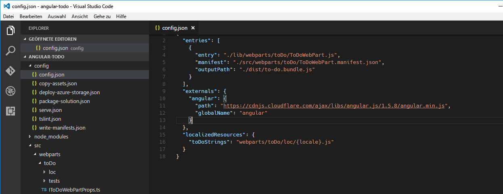
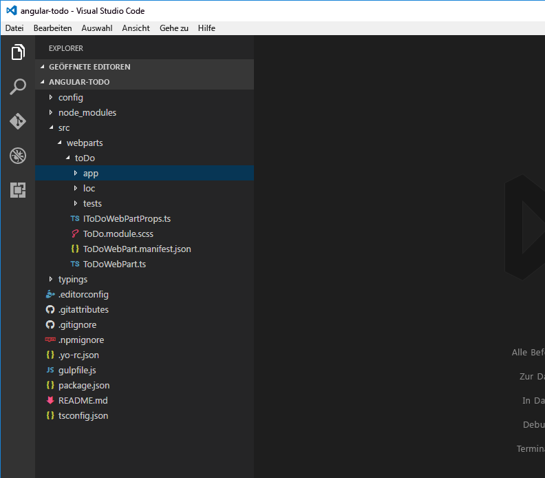
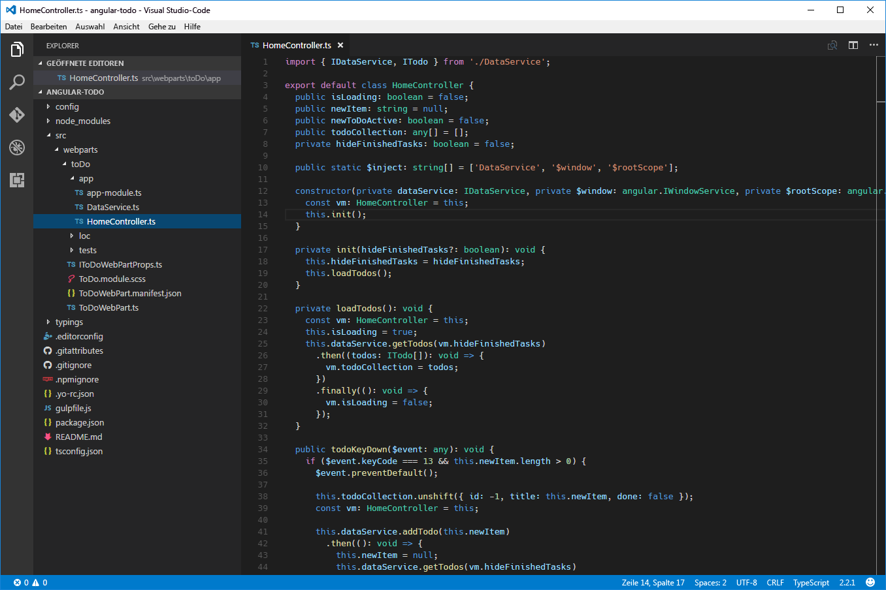
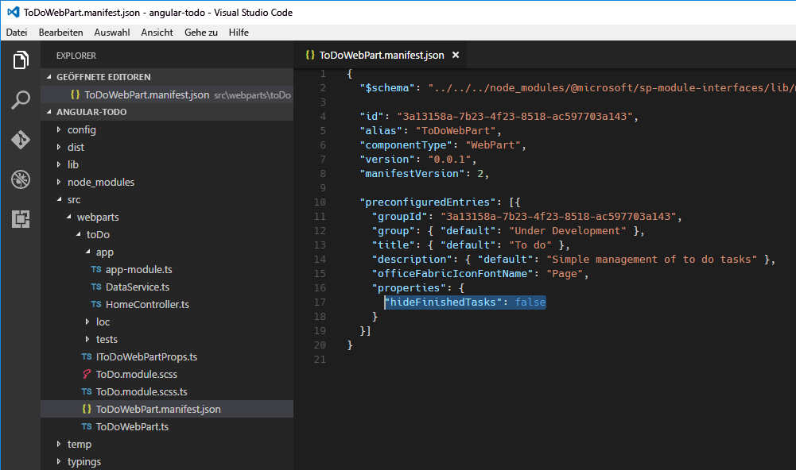
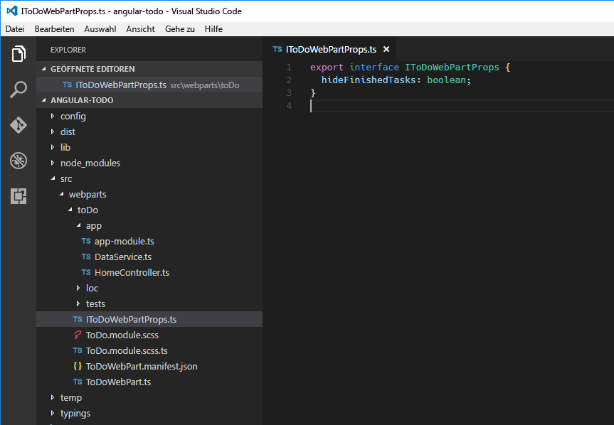
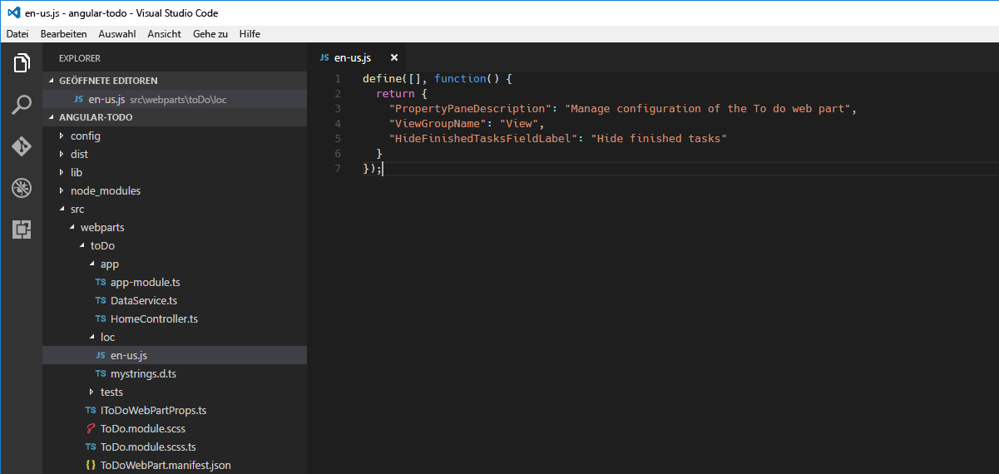
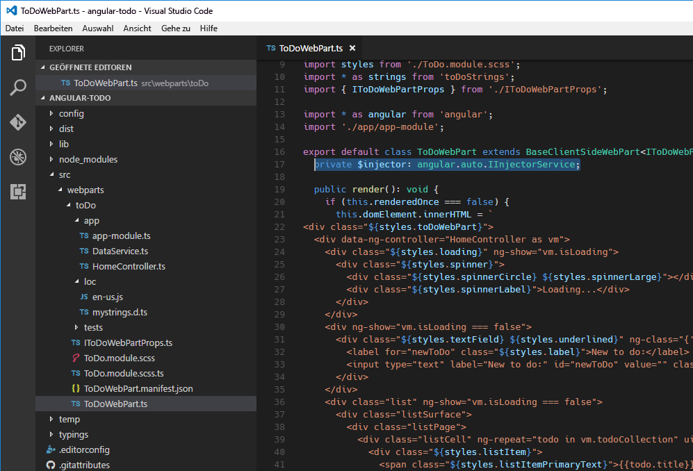

# <a name="build-sharepoint-framework-client-side-web-parts-with-angularjs"></a><span data-ttu-id="a39d2-102">Erstellen von clientseitigen SharePoint Framework-Webparts mit AngularJS</span><span class="sxs-lookup"><span data-stu-id="a39d2-102">Build SharePoint Framework client-side web parts with Angular v1.x</span></span>

<span data-ttu-id="a39d2-103">Clientseitige Webparts lassen sich auch mit dem sehr beliebten Framework AngularJS erstellen.</span><span class="sxs-lookup"><span data-stu-id="a39d2-103">If you are familiar with AngularJS, you can also use this extremely popular framework to build client-side web parts.</span></span> <span data-ttu-id="a39d2-104">Da Angular modular aufgebaut ist, können Sie es für praktisch jede Art von Projekt einsetzen, von komplexen Single-Page-Anwendungen mit mehreren Ansichten bis hin zu kleineren Komponenten wie Webparts.</span><span class="sxs-lookup"><span data-stu-id="a39d2-104">Thanks to its modularity, it can be used for anything ranging from complex multi-view Single Page Applications to smaller components such as web parts.</span></span> <span data-ttu-id="a39d2-105">Viele Organisationen haben in der Vergangenheit bereits SharePoint-Lösungen mit AngularJS erstellt.</span><span class="sxs-lookup"><span data-stu-id="a39d2-105">Many organizations have been using AngularJS for building SharePoint solutions in the past.</span></span> <span data-ttu-id="a39d2-106">Dieser Artikel beschreibt, wie Sie mit AngularJS ein clientseitiges SharePoint Framework-Webpart erstellen und anschließend Stile mit [Office UI Fabric](http://dev.office.com/fabric) definieren.</span><span class="sxs-lookup"><span data-stu-id="a39d2-106">This article shows how to use AngularJS to build a SharePoint Framework client-side web part and have it styled using [Office UI Fabric](http://dev.office.com/fabric).</span></span> <span data-ttu-id="a39d2-107">In diesem Tutorial erstellen Sie ein einfaches Webpart, das To-do-Elemente verwaltet.</span><span class="sxs-lookup"><span data-stu-id="a39d2-107">During this tutorial you will build a simple web part that manages to do items.</span></span>


<span data-ttu-id="a39d2-109">Der Quellcode des Webparts, mit dem wir arbeiten, steht auf GitHub zur Verfügung, unter [https://github.com/SharePoint/sp-dev-fx-webparts/tree/master/samples/angular-todo](https://github.com/SharePoint/sp-dev-fx-webparts/tree/master/samples/angular-todo).</span><span class="sxs-lookup"><span data-stu-id="a39d2-109">The source of the working web part is available on GitHub at [https://github.com/SharePoint/sp-dev-fx-webparts/tree/master/samples/angular-todo](https://github.com/SharePoint/sp-dev-fx-webparts/tree/master/samples/angular-todo).</span></span>

> <span data-ttu-id="a39d2-110">**Hinweis:** Bevor Sie die Schritte in diesem Artikel durchführen, müssen Sie [eine Entwicklungsumgebung einrichten](../../set-up-your-development-environment.md), in der Sie SharePoint-Framework-Lösungen erstellen können.</span><span class="sxs-lookup"><span data-stu-id="a39d2-110">**Note:** Before following the steps in this article, be sure to [set up your development environment](../../set-up-your-development-environment.md) for building SharePoint Framework solutions.</span></span>

## <a name="create-new-project"></a><span data-ttu-id="a39d2-111">Erstellen eines neuen Projekts</span><span class="sxs-lookup"><span data-stu-id="a39d2-111">Create new project</span></span>

<span data-ttu-id="a39d2-112">Erstellen Sie zunächst einen neuen Ordner für Ihr Projekt:</span><span class="sxs-lookup"><span data-stu-id="a39d2-112">Start by creating a new folder for your project</span></span>

```sh
md angular-todo
```

<span data-ttu-id="a39d2-113">Navigieren Sie zum Projektordner:</span><span class="sxs-lookup"><span data-stu-id="a39d2-113">Navigate to the project folder:</span></span>

```sh
cd angular-todo
```

<span data-ttu-id="a39d2-114">Führen Sie im Projektordner den SharePoint Framework-Yeoman-Generator aus, um ein Gerüst für ein neues SharePoint Framework-Projekt zu erstellen:</span><span class="sxs-lookup"><span data-stu-id="a39d2-114">In the project folder run the SharePoint Framework Yeoman generator to scaffold a new SharePoint Framework project:</span></span>

```sh
yo @microsoft/sharepoint
```

<span data-ttu-id="a39d2-115">Es werden mehrere Eingabeaufforderungen angezeigt. Definieren Sie die Werte jeweils wie folgt:</span><span class="sxs-lookup"><span data-stu-id="a39d2-115">When prompted, define values as follows:</span></span>
- <span data-ttu-id="a39d2-116">**angular-todo** als Name der Lösung</span><span class="sxs-lookup"><span data-stu-id="a39d2-116">**angular-todo** as your solution name</span></span>
- <span data-ttu-id="a39d2-117">**Use the current folder** als Speicherort für die Dateien</span><span class="sxs-lookup"><span data-stu-id="a39d2-117">**Use the current folder** for the location to place the files</span></span>
- <span data-ttu-id="a39d2-118">**No javaScript web framework** als Eintrittspunkt für die Webpart-Erstellung</span><span class="sxs-lookup"><span data-stu-id="a39d2-118">**No JavaScript web framework** as the starting point to build the web part</span></span>
- <span data-ttu-id="a39d2-119">**To do** als Name des Webparts</span><span class="sxs-lookup"><span data-stu-id="a39d2-119">**To do** as your web part name</span></span>
- <span data-ttu-id="a39d2-120">**Simple management of to do tasks** als Beschreibung des Webparts</span><span class="sxs-lookup"><span data-stu-id="a39d2-120">**Simple management of to do tasks** as your web part description</span></span>


<span data-ttu-id="a39d2-122">Sobald das Gerüst abgeschlossen ist, sperren Sie die Version der Projektabhängigkeiten, indem Sie den folgenden Befehl ausführen:</span><span class="sxs-lookup"><span data-stu-id="a39d2-122">Once the scaffolding completes, lock down the version of the project dependencies by running the following command:</span></span>

```sh
npm shrinkwrap
```

<span data-ttu-id="a39d2-123">Öffnen Sie dann den Projektordner im Code-Editor.</span><span class="sxs-lookup"><span data-stu-id="a39d2-123">Next, open your project folder in your code editor.</span></span> <span data-ttu-id="a39d2-124">In diesem Tutorial verwenden Sie Visual Studio Code.</span><span class="sxs-lookup"><span data-stu-id="a39d2-124">Once the scaffolding completes, open your project folder in your code editor. In this tutorial, you will use Visual Studio Code.</span></span>


## <a name="add-angularjs"></a><span data-ttu-id="a39d2-126">Hinzufügen von AngularJS</span><span class="sxs-lookup"><span data-stu-id="a39d2-126">Add AngularJS</span></span>

<span data-ttu-id="a39d2-127">In diesem Tutorial laden Sie AngularJS aus einem CDN.</span><span class="sxs-lookup"><span data-stu-id="a39d2-127">In this tutorial you will load AngularJS from CDN.</span></span> <span data-ttu-id="a39d2-128">Öffnen Sie dazu im Code-Editor die Datei **config/config.json**, und fügen Sie in der Eigenschaft **externals** die folgenden Zeilen hinzu:</span><span class="sxs-lookup"><span data-stu-id="a39d2-128">In this tutorial you will load Angular from CDN. To do that, in the code editor, open the **config/config.json** file and in the **externals** property add the following lines:</span></span>

```json
"angular": {
  "path": "https://cdnjs.cloudflare.com/ajax/libs/angular.js/1.6.6/angular.min.js",
  "globalName": "angular"
}
```



## <a name="add-angularjs-typings-for-typescript"></a><span data-ttu-id="a39d2-130">Hinzufügen von AngularJS-Typisierungen für TypeScript</span><span class="sxs-lookup"><span data-stu-id="a39d2-130">Add Angular typings for TypeScript</span></span>

<span data-ttu-id="a39d2-131">Da Sie AngularJS im Code Ihres Webparts referenzieren werden, benötigen Sie auch AngularJS-Typisierungen für TypeScript.</span><span class="sxs-lookup"><span data-stu-id="a39d2-131">Because you will be referencing Angular in your web part's code, you also need Angular typings for TypeScript. To install them run in the command line:</span></span> <span data-ttu-id="a39d2-132">Führen Sie den folgenden Befehl in der Befehlszeile aus, um diese Typisierungen zu installieren:</span><span class="sxs-lookup"><span data-stu-id="a39d2-132">To install them run in the command line:</span></span>

```sh
npm install @types/angular --save-dev
```

## <a name="implement-angularjs-application"></a><span data-ttu-id="a39d2-133">Implementieren der AngularJS-Anwendung</span><span class="sxs-lookup"><span data-stu-id="a39d2-133">Implement AngularJS application</span></span>

<span data-ttu-id="a39d2-134">Sobald alle Voraussetzungen erfüllt sind, können Sie die AngularJS-Beispielanwendung implementieren.</span><span class="sxs-lookup"><span data-stu-id="a39d2-134">With all prerequisites in place you can start implementing the sample AngularJS application.</span></span> <span data-ttu-id="a39d2-135">Da sie aus mehreren Dateien besteht, erstellen Sie zunächst einen Ordner namens **app** für sie.</span><span class="sxs-lookup"><span data-stu-id="a39d2-135">With all prerequisites in place you can start implementing the sample Angular application. Because it will consist of a few files, create a separate folder for it called **app**.</span></span>



### <a name="implement-to-do-data-service"></a><span data-ttu-id="a39d2-137">Implementieren des To-do-Dateidiensts</span><span class="sxs-lookup"><span data-stu-id="a39d2-137">Implement to do data service</span></span>

<span data-ttu-id="a39d2-138">Erstellen Sie im gerade erstellten Ordner **app** eine neue Datei namens **DataService.ts**.</span><span class="sxs-lookup"><span data-stu-id="a39d2-138">In the newly created app folder, create a new file called DataService.ts. In the file paste the following code:</span></span> <span data-ttu-id="a39d2-139">Fügen Sie folgenden Code in diese Datei ein:</span><span class="sxs-lookup"><span data-stu-id="a39d2-139">In the file paste the following code:</span></span>

```ts
export interface ITodo {
  id: number;
  title: string;
  done: boolean;
}

export interface IDataService {
  getTodos(hideFinishedTasks: boolean): angular.IPromise<ITodo[]>;
  addTodo(todo: string): angular.IPromise<{}>;
  deleteTodo(todo: ITodo): angular.IPromise<{}>;
  setTodoStatus(todo: ITodo, done: boolean): angular.IPromise<{}>;
}

export default class DataService implements IDataService {
  public static $inject: string[] = ['$q'];

  private items: ITodo[] = [
    {
      id: 1,
      title: 'Prepare demo Web Part',
      done: true
    },
    {
      id: 2,
      title: 'Show demo',
      done: false
    },
    {
      id: 3,
      title: 'Share code',
      done: false
    }
  ];
  private nextId: number = 4;

  constructor(private $q: angular.IQService) {
  }

  public getTodos(hideFinishedTasks: boolean): angular.IPromise<ITodo[]> {
    const deferred: angular.IDeferred<ITodo[]> = this.$q.defer();

    const todos: ITodo[] = [];
    for (let i: number = 0; i < this.items.length; i++) {
      if (hideFinishedTasks && this.items[i].done) {
        continue;
      }

      todos.push(this.items[i]);
    }

    deferred.resolve(todos);

    return deferred.promise;
  }

  public addTodo(todo: string): angular.IPromise<{}> {
    const deferred: angular.IDeferred<{}> = this.$q.defer();

    this.items.push({
      id: this.nextId++,
      title: todo,
      done: false
    });

    deferred.resolve();

    return deferred.promise;
  }

  public deleteTodo(todo: ITodo): angular.IPromise<{}> {
    const deferred: angular.IDeferred<{}> = this.$q.defer();

    let pos: number = -1;
    for (let i: number = 0; i < this.items.length; i++) {
      if (this.items[i].id === todo.id) {
        pos = i;
        break;
      }
    }

    if (pos > -1) {
      this.items.splice(pos, 1);
      deferred.resolve();
    }
    else {
      deferred.reject();
    }

    return deferred.promise;
  }

  public setTodoStatus(todo: ITodo, done: boolean): angular.IPromise<{}> {
    const deferred: angular.IDeferred<{}> = this.$q.defer();

    for (let i: number = 0; i < this.items.length; i++) {
      if (this.items[i].id === todo.id) {
        this.items[i].done = done;
      }
    }

    deferred.resolve();

    return deferred.promise;
  }
}
```


<span data-ttu-id="a39d2-141">Im oben aufgeführten Codeausschnitt implementieren Sie drei Typen: die Schnittstelle **ITodo**, die ein To-do-Element in der Anwendung repräsentiert, die Schnittstelle **IDataService**, die die Signatur des Datendiensts definiert, und die Klasse **DataService**, die To-do-Elemente abruft und bearbeitet.</span><span class="sxs-lookup"><span data-stu-id="a39d2-141">In the previous code snippet you implement three types: the **ITodo** interface which represents a to do item in your application, the **IDataService** interface which defines the signature of the data service and the **DataService** class which is responsible for retrieving and manipulating to do items. The data service implements simple methods for adding and modifying to do items. Even though the operations are instantaneous, for consistency each CRUD function returns a promise.</span></span> <span data-ttu-id="a39d2-142">Der Datendienst implementiert einfache Methoden zum Hinzufügen und Ändern von To-do-Elementen.</span><span class="sxs-lookup"><span data-stu-id="a39d2-142">The data service implements simple methods for adding and modifying to do items.</span></span> <span data-ttu-id="a39d2-143">Obwohl die Operationen sofort ausgeführt werden, gibt jede CRUD-Funktion zwecks Konsistenz eine Zusage zurück.</span><span class="sxs-lookup"><span data-stu-id="a39d2-143">Even though the operations are instantaneous, for consistency each CRUD function returns a promise.</span></span>

<span data-ttu-id="a39d2-p108">In diesem Tutorial werden die To-do-Elemente im Arbeitsspeicher gespeichert. Sie könnten die Lösung aber auch problemlos so erweitern, dass Elemente in einer SharePoint-Liste gespeichert werden und der Datendienst über die SharePoint-REST-API mit SharePoint kommuniziert.</span><span class="sxs-lookup"><span data-stu-id="a39d2-p108">In this tutorial to do items are stored in memory. You could however easily extend the solution to store items in a SharePoint List and use the data service to communicate with SharePoint using its REST API.</span></span>

### <a name="implement-the-controller"></a><span data-ttu-id="a39d2-146">Implementieren des Controllers</span><span class="sxs-lookup"><span data-stu-id="a39d2-146">Implement the controller</span></span>

<span data-ttu-id="a39d2-147">Als Nächstes implementieren Sie den Controller, der die Kommunikation zwischen der Anzeige und dem Datendienst ermöglicht.</span><span class="sxs-lookup"><span data-stu-id="a39d2-147">Next, implement the controller that will facilitate communication between the view and the data service. In the app folder create a new file named HomeController.ts and paste the following code:</span></span> <span data-ttu-id="a39d2-148">Erstellen Sie im Ordner **app** eine neue Datei namens **HomeController.ts**, und fügen Sie den folgenden Code in diese Datei ein:</span><span class="sxs-lookup"><span data-stu-id="a39d2-148">In the **./src/webparts/recentDocuments** folder, create a new file named **IDocumentActivity.ts** and paste the following code:</span></span>

```ts
import { IDataService, ITodo } from './DataService';

export default class HomeController {
  public isLoading: boolean = false;
  public newItem: string = null;
  public newToDoActive: boolean = false;
  public todoCollection: any[] = [];
  private hideFinishedTasks: boolean = false;

  public static $inject: string[] = ['DataService', '$window', '$rootScope'];

  constructor(private dataService: IDataService, private $window: angular.IWindowService, private $rootScope: angular.IRootScopeService) {
    const vm: HomeController = this;
    this.init();
  }

  private init(hideFinishedTasks?: boolean): void {
    this.hideFinishedTasks = hideFinishedTasks;
    this.loadTodos();
  }

  private loadTodos(): void {
    const vm: HomeController = this;
    this.isLoading = true;
    this.dataService.getTodos(vm.hideFinishedTasks)
      .then((todos: ITodo[]): void => {
        vm.todoCollection = todos;
      })
      .finally((): void => {
        vm.isLoading = false;
      });
  }

  public todoKeyDown($event: any): void {
    if ($event.keyCode === 13 && this.newItem.length > 0) {
      $event.preventDefault();

      this.todoCollection.unshift({ id: -1, title: this.newItem, done: false });
      const vm: HomeController = this;

      this.dataService.addTodo(this.newItem)
        .then((): void => {
          this.newItem = null;
          this.dataService.getTodos(vm.hideFinishedTasks)
            .then((todos: any[]): void => {
              this.todoCollection = todos;
            });
        });
    }
  }

  public deleteTodo(todo: ITodo): void {
    if (this.$window.confirm('Are you sure you want to delete this todo item?')) {
      let index: number = -1;
      for (let i: number = 0; i < this.todoCollection.length; i++) {
        if (this.todoCollection[i].id === todo.id) {
          index = i;
          break;
        }
      }

      if (index > -1) {
        this.todoCollection.splice(index, 1);
      }

      const vm: HomeController = this;

      this.dataService.deleteTodo(todo)
        .then((): void => {
          this.dataService.getTodos(vm.hideFinishedTasks)
            .then((todos: any[]): void => {
              this.todoCollection = todos;
            });
        });
    }
  }

  public completeTodo(todo: ITodo): void {
    todo.done = true;

    const vm: HomeController = this;

    this.dataService.setTodoStatus(todo, true)
      .then((): void => {
        this.dataService.getTodos(vm.hideFinishedTasks)
          .then((todos: any[]): void => {
            this.todoCollection = todos;
          });
      });
  }

  public undoTodo(todo: ITodo): void {
    todo.done = false;

    const vm: HomeController = this;

    this.dataService.setTodoStatus(todo, false)
      .then((): void => {
        this.dataService.getTodos(vm.hideFinishedTasks)
          .then((todos: any[]): void => {
            this.todoCollection = todos;
          });
      });
  }
}
```



<span data-ttu-id="a39d2-150">Zuerst laden Sie den zuvor implementierten Datendienst.</span><span class="sxs-lookup"><span data-stu-id="a39d2-150">You start by loading the previously implemented data service.</span></span> <span data-ttu-id="a39d2-151">Der Controller benötigt diesen Dienst, um die Elementliste abzurufen und die Elemente gemäß den Benutzeranforderungen zu modifizieren.</span><span class="sxs-lookup"><span data-stu-id="a39d2-151">The controller needs it in order to get the list of items and modify items as requested by the user.</span></span> <span data-ttu-id="a39d2-152">Der Dienst wird über die AngularJS-Abhängigkeitsinjektion (Dependency Injection) in den Controller eingefügt.</span><span class="sxs-lookup"><span data-stu-id="a39d2-152">Using AngularJS's dependency injection the service is injected into the controller.</span></span> <span data-ttu-id="a39d2-153">Der Controller implementiert eine Reihe von Funktionen, die für das Anzeigemodell verfügbar gemacht werden und aus der Vorlage aufgerufen werden können.</span><span class="sxs-lookup"><span data-stu-id="a39d2-153">The controller implements a number of functions that are exposed to the view model and will be called from the template.</span></span> <span data-ttu-id="a39d2-154">Mithilfe dieser Funktionen können Benutzer später neue Elemente hinzufügen, Elemente als fertig gestellt oder noch zu erledigen markieren und Elemente löschen.</span><span class="sxs-lookup"><span data-stu-id="a39d2-154">Using these functions users will be able to add new items, mark items as finished, to do, or delete items.</span></span>

### <a name="implement-the-main-module"></a><span data-ttu-id="a39d2-155">Implementieren des Hauptmoduls</span><span class="sxs-lookup"><span data-stu-id="a39d2-155">Implement the main module</span></span>

<span data-ttu-id="a39d2-156">Nachdem Sie sowohl den Datendienst als auch den Controller implementiert haben, definieren Sie nun das Hauptmodul der Anwendung und registrieren den Datendienst und den Controller in diesem Modul.</span><span class="sxs-lookup"><span data-stu-id="a39d2-156">With the data service and the controller ready, define the main module of your application and register the data service and controller with it. In the app folder create a new file called app-module.ts and paste the following contents:</span></span> <span data-ttu-id="a39d2-157">Erstellen Sie dazu im Ordner **app** eine neue Datei namens **app-module.ts**, und fügen Sie den folgenden Code in diese Datei ein:</span><span class="sxs-lookup"><span data-stu-id="a39d2-157">In the code editor, in the **./src/webparts/sharePointLists/components** folder, create a new file named **ISharePointListsState.ts** and paste the following contents:</span></span>

```ts
import * as angular from 'angular';
import HomeController from './HomeController';
import DataService from './DataService';

const todoapp: angular.IModule = angular.module('todoapp', []);

todoapp
  .controller('HomeController', HomeController)
  .service('DataService', DataService);
```


<span data-ttu-id="a39d2-159">Zunächst referenzieren Sie AngularJS und laden den Controller und den Datendienst, die Sie zuvor implementiert haben.</span><span class="sxs-lookup"><span data-stu-id="a39d2-159">You start by referencing AngularJS and by loading previously implemented controller and data service.</span></span> <span data-ttu-id="a39d2-160">Anschließend definieren Sie das Modul für Ihre Anwendung.</span><span class="sxs-lookup"><span data-stu-id="a39d2-160">Next, you define the module for your application.</span></span> <span data-ttu-id="a39d2-161">Schließlich registrieren Sie noch den Controller und den Datendienst in der Anwendung.</span><span class="sxs-lookup"><span data-stu-id="a39d2-161">Finally, you register the controller and data service with your application.</span></span>

<span data-ttu-id="a39d2-162">Damit haben Sie eine AngularJS-Anwendung für Ihr Webpart erstellt.</span><span class="sxs-lookup"><span data-stu-id="a39d2-162">Now you've built an AngularJS application for your web part.</span></span> <span data-ttu-id="a39d2-163">In den nächsten Schritten registrieren Sie die AngularJS-Anwendung im Webpart und machen sie durch Webpart-Eigenschaften konfigurierbar.</span><span class="sxs-lookup"><span data-stu-id="a39d2-163">Now you've built an Angular application for your web part. In the following steps you will register the Angular application with the web part and make it configurable using web part properties.</span></span>

## <a name="register-angularjs-application-with-web-part"></a><span data-ttu-id="a39d2-164">Registrieren der AngularJS-Anwendung im Webpart</span><span class="sxs-lookup"><span data-stu-id="a39d2-164">Register Angular application with web part</span></span>

<span data-ttu-id="a39d2-165">In diesem Schritt fügen Sie die AngularJS-Anwendung zum Webpart hinzu.</span><span class="sxs-lookup"><span data-stu-id="a39d2-165">Next step is to add Angular application to the web part. In the code editor open the ToDoWebPart.ts file.</span></span> <span data-ttu-id="a39d2-166">Öffnen Sie im Code-Editor die Datei **ToDoWebPart.ts**.</span><span class="sxs-lookup"><span data-stu-id="a39d2-166">In the code editor open the **./src/webparts/toDo/ToDoWebPart.ts** file.</span></span>

<span data-ttu-id="a39d2-167">Fügen Sie unmittelbar vor der Klassendeklaration die folgenden Zeilen ein:</span><span class="sxs-lookup"><span data-stu-id="a39d2-167">Just before the class declaration, add the following lines:</span></span>

```ts
import * as angular from 'angular';
import './app/app-module';
```


<span data-ttu-id="a39d2-169">Jetzt können Sie eine Referenz auf AngularJS und Ihre Anwendung laden. Beide sind notwendig zum Bootstrapping der AngularJS-Anwendung.</span><span class="sxs-lookup"><span data-stu-id="a39d2-169">This allows us to load a reference to Angular and your application, both of which you need to bootstrap your Angular application.</span></span>

<span data-ttu-id="a39d2-170">Ändern Sie die Funktion **render** des Webparts wie folgt:</span><span class="sxs-lookup"><span data-stu-id="a39d2-170">Change the web part's **render** function to:</span></span>

```ts
public render(): void {
  if (this.renderedOnce === false) {
    this.domElement.innerHTML = `
<div class="${styles.toDo}">
  <div data-ng-controller="HomeController as vm">
    <div class="${styles.loading}" ng-show="vm.isLoading">
      <div class="${styles.spinner}">
        <div class="${styles.spinnerCircle} ${styles.spinnerLarge}"></div>
        <div class="${styles.spinnerLabel}">Loading...</div>
      </div>
    </div>
    <div ng-show="vm.isLoading === false">
      <div class="${styles.textField} ${styles.underlined}" ng-class="{'${styles.isActive}': vm.newToDoActive}">
        <label for="newToDo" class="${styles.label}">New to do:</label>
        <input type="text" label="New to do:" id="newToDo" value="" class="${styles.field}" aria-invalid="false" ng-model="vm.newItem" ng-keydown="vm.todoKeyDown($event)" ng-focus="vm.newToDoActive = true" ng-blur="vm.newToDoActive = false">
      </div>
    </div>
    <div class="list" ng-show="vm.isLoading === false">
      <div class="listSurface">
        <div class="listPage">
          <div class="listCell" ng-repeat="todo in vm.todoCollection" uif-item="todo" ng-class="{'${styles.done}': todo.done}">
            <div class="${styles.listItem}">
              <span class="${styles.listItemPrimaryText}">{{todo.title}}</span>
              <div class="${styles.listItemActions}">
                <div class="${styles.listItemAction}" ng-click="vm.completeTodo(todo)" ng-show="todo.done === false">
                  <i class="${styles.icon} ${styles.iconCheckMark}"></i>
                </div>
                <div class="${styles.listItemAction}" ng-click="vm.undoTodo(todo)" ng-show="todo.done">
                  <i class="${styles.icon} ${styles.iconUndo}"></i>
                </div>
                <div class="${styles.listItemAction}" ng-click="vm.deleteTodo(todo)">
                  <i class="${styles.icon} ${styles.iconRecycleBin}"></i>
                </div>
              </div>
            </div>
          </div>
        </div>
      </div>
    </div>
  </div>
</div>`;

    angular.bootstrap(this.domElement, ['todoapp']);
  }
}
```


<span data-ttu-id="a39d2-172">Als Erstes weist der Code die Vorlage Ihrer Anwendung direkt dem DOM-Element des Webparts zu.</span><span class="sxs-lookup"><span data-stu-id="a39d2-172">The code first assigns the template of your application directly to the web part's DOM element.</span></span> <span data-ttu-id="a39d2-173">Im Stammelement geben Sie den Namen des Controllers an, der sich in der Vorlage um die Ereignisverarbeitung und Datenbindung kümmern wird.</span><span class="sxs-lookup"><span data-stu-id="a39d2-173">On the root element you specify the name of the controller that will handle events and data binding in the template.</span></span> <span data-ttu-id="a39d2-174">Anschließend verwenden Sie den **todoapp**-Namen, den Sie bei der Deklaration des Hauptmoduls verwendet haben, zum Bootstrapping der Anwendung.</span><span class="sxs-lookup"><span data-stu-id="a39d2-174">Then, you bootstrap your application using the **todoapp** name you used previously when declaring the main module.</span></span> <span data-ttu-id="a39d2-175">Über die Webpart-Eigenschaft **renderedOnce** stellen Sie sicher, dass das Bootstrapping nur ein einziges Mal für die AngularJS-Anwendung durchgeführt wird.</span><span class="sxs-lookup"><span data-stu-id="a39d2-175">Using the **renderedOnce** web part property you ensure that your AngularJS application is bootstrapped only once.</span></span> <span data-ttu-id="a39d2-176">Würden Sie diese Eigenschaft nicht setzen, würde die Funktion **render** bei jeder Änderung an einer der Webpart-Eigenschaften nochmals aufgerufen werden und ein erneutes Bootstrapping der AngularJS-Anwendung durchführen. Das würde zu einem Fehler führen.</span><span class="sxs-lookup"><span data-stu-id="a39d2-176">Without it, if you changed one of the web part's properties, the **render** function would be invoked again bootstrapping the AngularJS application again, which would lead to an error.</span></span>

<span data-ttu-id="a39d2-177">Sie müssen außerdem noch die CSS-Formatvorlagen implementieren, die Sie in der Vorlage verwenden.</span><span class="sxs-lookup"><span data-stu-id="a39d2-177">You also need to implement CSS styles that you are using the template. In the code editor open the ToDo.module.scss file and replace its contents with:</span></span> <span data-ttu-id="a39d2-178">Öffnen Sie im Code-Editor die Datei **ToDo.module.scss**, und ersetzen Sie den Code in der Datei durch:</span><span class="sxs-lookup"><span data-stu-id="a39d2-178">You also need to implement CSS styles that you are using the template. In the code editor open the **ToDo.module.scss** file and replace its contents with:</span></span>

```css
.toDo {
  .loading {
    margin: 0 auto;
    width: 6em;

    .spinner {
      display: inline-block;
      margin: 10px 0;

      @-webkit-keyframes spinnerSpin {
        0% {
          -webkit-transform:rotate(0);
          transform:rotate(0);
        }
        100% {
          -webkit-transform:rotate(360deg);
          transform:rotate(360deg);
        }
      }
      @keyframes spinnerSpin {
        0% {
          -webkit-transform:rotate(0);
          transform:rotate(0);
        }
        100% {
          -webkit-transform:rotate(360deg);
          transform:rotate(360deg);
        }
      }

      .spinnerCircle {
        margin: auto;
        box-sizing: border-box;
        border-radius: 50%;
        width: 100%;
        height: 100%;
        border: 1.5px solid #c7e0f4;
        border-top-color: #0078d7;
        -webkit-animation: spinnerSpin 1.3s infinite cubic-bezier(.53, .21, .29, .67);
        animation: spinnerSpin 1.3s infinite cubic-bezier(.53, .21, .29, .67);

        &.spinnerLarge {
          width: 28px;
          height: 28px;
        }
      }

      .spinnerLabel {
        color: #0078d7;
        margin-top: 10px;
        text-align: center;
      }
    }
  }

  .label {
    font-family: "Segoe UI WestEuropean", "Segoe UI", -apple-system, BlinkMacSystemFont, Roboto, "Helvetica Neue", sans-serif;
    -webkit-font-smoothing: antialiased;
    font-size: 14px;
    font-weight: 400;
    box-sizing: border-box;
    margin: 0;
    padding: 0;
    box-shadow: none;
    color: #333333;
    box-sizing: border-box;
    display: block;
    padding: 5px 0
  }

  .textField {
    font-family: "Segoe UI WestEuropean", "Segoe UI", -apple-system, BlinkMacSystemFont, Roboto, "Helvetica Neue", sans-serif;
    -webkit-font-smoothing: antialiased;
    box-sizing: border-box;
    margin: 0;
    padding: 0;
    box-shadow: none;
    color: #333333;
    font-size: 14px;
    font-weight: 400;
    margin-bottom: 8px;

    &.underlined {
      border-bottom: 1px solid #c8c8c8;
      display: table;
      width: 100%;

      &:hover {
        border-color: #767676;
      }

      &.isActive, &:active {
        border-color: #0078d7;
      }

      .field {
        border: 0;
        display: table-cell;
        padding-top: 8px;
        padding-bottom: 3px
      }
    }

    .label {
      padding-right: 0;
      padding-left: 12px;
      margin-right: 8px;
      font-size: 14px;
      display: table-cell;
      vertical-align: top;
      padding-top: 9px;
      height: 32px;
      width: 1%;
      white-space: nowrap;
      font-weight: 400;
    }

    .field {
      text-align: left;
      float: left;
      box-sizing: border-box;
      margin: 0;
      padding: 0;
      box-shadow: none;
      font-family: "Segoe UI WestEuropean", "Segoe UI", -apple-system, BlinkMacSystemFont, Roboto, "Helvetica Neue", sans-serif;
      -webkit-font-smoothing: antialiased;
      border: 1px solid #c8c8c8;
      border-radius: 0;
      font-weight: 400;
      font-size: 14px;
      color: #333333;
      height: 32px;
      padding: 0 12px 0 12px;
      width: 100%;
      outline: 0;
      text-overflow: ellipsis;
    }

    .field:hover {
      border-color: #767676;
    }
  }

  .listItem {
    font-family: "Segoe UI WestEuropean", "Segoe UI", -apple-system, BlinkMacSystemFont, Roboto, "Helvetica Neue", sans-serif;
    -webkit-font-smoothing: antialiased;
    font-size: 14px;
    font-weight: 400;
    box-sizing: border-box;
    margin: 0;
    padding: 0;
    box-shadow: none;
    padding: 9px 28px 3px;
    position: relative;
    display: block;

    &::before {
      display: table;
      content: "";
      line-height: 0;
    }

    &::after {
      display: table;
      content: "";
      line-height: 0;
      clear: both;
    }

    .listItemPrimaryText {
      font-family: "Segoe UI WestEuropean", "Segoe UI", -apple-system, BlinkMacSystemFont, Roboto, "Helvetica Neue", sans-serif;
      -webkit-font-smoothing: antialiased;
      font-size: 21px;
      font-weight: 100;
      padding-right: 80px;
      position: relative;
      top: -4px;
      overflow: hidden;
      text-overflow: ellipsis;
      white-space: nowrap;
      display: block;
    }

    .listItemActions {
      max-width: 80px;
      position: absolute;
      right: 30px;
      text-align: right;
      top: 10px;

      .listItemAction {
        color: #a6a6a6;
        display: inline-block;
        font-size: 15px;
        position: relative;
        text-align: center;
        top: 3px;
        cursor: pointer;
        height: 16px;
        width: 16px;

        &:hover {
          color: #666666;
          outline: 1px solid transparent;
        }

        .icon {
          vertical-align: top;
        }
      }
    }
  }

  .done {
    text-decoration: line-through;
  }

  .icon {
    -moz-osx-font-smoothing: grayscale;
    -webkit-font-smoothing: antialiased;
    display: inline-block;
    font-family: FabricMDL2Icons;
    font-style: normal;
    font-weight: 400;
    speak: none;

    &.iconCheckMark::before {
      content: "\E73E";
    }

    &.iconUndo::before {
      content: "\E7A7";
    }

    &.iconRecycleBin::before {
      content: "\EF87";
    }
  }
}
```


<span data-ttu-id="a39d2-180">Überprüfen Sie mit dem folgenden Befehl, ob alles wie erwartet funktioniert:</span><span class="sxs-lookup"><span data-stu-id="a39d2-180">Run the following command to confirm that everything is working as expected:</span></span>

```sh
gulp serve
```

<span data-ttu-id="a39d2-181">Im Browser sollte das To-do-Webpart mit To-do-Elementen angezeigt werden.</span><span class="sxs-lookup"><span data-stu-id="a39d2-181">In the browser you should see your To do web part showing to do items.</span></span>


## <a name="make-web-part-configurable"></a><span data-ttu-id="a39d2-183">Konfigurierbarmachen des Webparts</span><span class="sxs-lookup"><span data-stu-id="a39d2-183">Make web part configurable</span></span>

<span data-ttu-id="a39d2-p117">Im Moment zeigt das To-do-Webpart eine fixe Liste von To-do-Elementen an. Im nächsten Schritt erweitern Sie es um eine Konfigurationsoption, über die Benutzer entscheiden können, ob als erledigt markierte Elemente angezeigt werden sollen oder nicht.</span><span class="sxs-lookup"><span data-stu-id="a39d2-p117">At this point the To do web part shows a fixed list of to do items. Next, you will extend it with a configuration option to allow users to choose whether they want to see items that are marked as done or not.</span></span>

### <a name="add-property-in-the-web-part-manifest"></a><span data-ttu-id="a39d2-186">Hinzufügen einer Eigenschaft zum Webpart-Manifest</span><span class="sxs-lookup"><span data-stu-id="a39d2-186">Add property in the web part manifest</span></span>

<span data-ttu-id="a39d2-187">Zunächst fügen Sie eine Konfigurationseigenschaft zum Webpart-Manifest hinzu.</span><span class="sxs-lookup"><span data-stu-id="a39d2-187">Start by adding configuration property in the web part manifest.</span></span> <span data-ttu-id="a39d2-188">Öffnen Sie dazu im Code-Editor die Datei **ToDoWebPart.manifest.json**.</span><span class="sxs-lookup"><span data-stu-id="a39d2-188">In the code editor open the **./src/webparts/toDo/ToDoWebPart.manifest.json** file. Change the properties section to:</span></span> <span data-ttu-id="a39d2-189">Navigieren Sie im Abschnitt **preconfiguredEntries** zum Array **properties**, und ersetzen Sie die vorhandene Eigenschaft **description** durch die folgende Zeile:</span><span class="sxs-lookup"><span data-stu-id="a39d2-189">Start by adding configuration property in the web part manifest. In the code editor open the ToDoWebPart.manifest.json file. In the **preconfiguredEntries** section, navigate to the **properties** array and replace the existing **description** property with the following line:</span></span>

```json
"hideFinishedTasks": false
```



### <a name="update-the-signature-of-the-web-part-properties-interface"></a><span data-ttu-id="a39d2-191">Aktualisieren der Signatur der Webpart-Eigenschaften-Schnittstelle</span><span class="sxs-lookup"><span data-stu-id="a39d2-191">Update the signature of the web part properties interface</span></span>

<span data-ttu-id="a39d2-192">Nun aktualisieren Sie die Signatur der Webpart-Eigenschaften-Schnittstelle.</span><span class="sxs-lookup"><span data-stu-id="a39d2-192">Next, update the signature of the web part properties interface.</span></span>

<span data-ttu-id="a39d2-193">Öffnen Sie im Code-Editor die Datei **ToDoWebPart.ts**, und aktualisieren Sie die `IToDoWebPartProps`-Schnittstelle wie folgt:</span><span class="sxs-lookup"><span data-stu-id="a39d2-193">In the code editor open the **ToDoWebPart.ts** file and update the `IToDoWebPartProps` interface to the following:</span></span>

```ts
export interface IToDoWebPartProps {
  hideFinishedTasks: boolean;
}
```



### <a name="add-the-property-to-the-web-part-property-pane"></a><span data-ttu-id="a39d2-195">Hinzufügen der Eigenschaft zum Webpart-Eigenschaftenbereich</span><span class="sxs-lookup"><span data-stu-id="a39d2-195">Add the property to the web part property pane</span></span>

<span data-ttu-id="a39d2-196">Damit Benutzer den Wert der neu hinzugefügten Eigenschaft konfigurieren können, müssen Sie die Eigenschaft im Webpart-Eigenschaftenbereich verfügbar machen.</span><span class="sxs-lookup"><span data-stu-id="a39d2-196">To allow users to configure the value of your newly added property, you have to expose it through the web part property pane.</span></span>

<span data-ttu-id="a39d2-197">Öffnen Sie im Code-Editor die Datei **ToDoWebPart.ts**.</span><span class="sxs-lookup"><span data-stu-id="a39d2-197">In the code editor open the **./src/webparts/toDo/ToDoWebPart.ts** file.</span></span> <span data-ttu-id="a39d2-198">Ersetzen Sie in der ersten Anweisung des Typs `import` `PropertyPaneTextField` durch `PropertyPaneToggle`:</span><span class="sxs-lookup"><span data-stu-id="a39d2-198">In the first `import` statement replace  `PropertyPaneTextField` with `PropertyPaneToggle`:</span></span>

```ts
import {
  BaseClientSideWebPart,
  IPropertyPaneConfiguration,
  PropertyPaneToggle
} from '@microsoft/sp-webpart-base';
```


<span data-ttu-id="a39d2-200">Ändern Sie die Implementierung der Funktion `propertyPaneSettings` wie folgt:</span><span class="sxs-lookup"><span data-stu-id="a39d2-200">Change the implementation of the `propertyPaneSettings` function to:</span></span>

```ts
protected getPropertyPaneConfiguration(): IPropertyPaneConfiguration {
  return {
    pages: [
      {
        header: {
          description: strings.PropertyPaneDescription
        },
        groups: [
          {
            groupName: strings.ViewGroupName,
            groupFields: [
              PropertyPaneToggle('hideFinishedTasks', {
                label: strings.HideFinishedTasksFieldLabel
              })
            ]
          }
        ]
      }
    ]
  };
}
```

<span data-ttu-id="a39d2-201">Um die fehlenden Zeichenfolgenreferenzen zu ergänzen, müssen Sie zunächst die Signatur der Zeichenfolgen ändern.</span><span class="sxs-lookup"><span data-stu-id="a39d2-201">To fix the missing string references you first need to change the signature of your strings. In the code editor open the loc/mystrings.d.ts file and change its contents to:</span></span> <span data-ttu-id="a39d2-202">Öffnen Sie im Code-Editor die Datei **loc/mystrings.d.ts**, und ändern Sie den Code in der Datei wie folgt:</span><span class="sxs-lookup"><span data-stu-id="a39d2-202">In the code editor, open the **./src/webparts/gallery/loc/mystrings.d.ts** file. Change its code to:</span></span>

```ts
declare interface IToDoWebPartStrings {
  PropertyPaneDescription: string;
  BasicGroupName: string;
  HideFinishedTasksFieldLabel: string;
}

declare module 'ToDoWebPartStrings' {
  const strings: IToDoWebPartStrings;
  export = strings;
}
```


<span data-ttu-id="a39d2-204">Als Nächstes müssen Sie die Istwerte für die gerade definierten Zeichenfolgen angeben.</span><span class="sxs-lookup"><span data-stu-id="a39d2-204">Next, you need to provide the actual values for the newly defined strings. In the code editor open the loc/en-us.js file and change its contents to:</span></span> <span data-ttu-id="a39d2-205">Öffnen Sie im Code-Editor die Datei **loc/en-us.js**, und ändern Sie den Code in der Datei wie folgt:</span><span class="sxs-lookup"><span data-stu-id="a39d2-205">Next, you need to provide the actual values for the newly defined strings. In the code editor open the **loc/en-us.js** file and change its contents to:</span></span>

```js
define([], function() {
  return {
    "PropertyPaneDescription": "Manage configuration of the To do web part",
    "ViewGroupName": "View",
    "HideFinishedTasksFieldLabel": "Hide finished tasks"
  }
});
```



<span data-ttu-id="a39d2-207">Überprüfen Sie mit dem folgenden Befehl, ob alles wie erwartet funktioniert:</span><span class="sxs-lookup"><span data-stu-id="a39d2-207">Run the following command to confirm that everything is working as expected:</span></span>

```sh
gulp serve
```

<span data-ttu-id="a39d2-208">Im Webpart-Eigenschaftenbereich sollte jetzt eine Umschaltfläche für die gerade definierte Eigenschaft zu sehen sein.</span><span class="sxs-lookup"><span data-stu-id="a39d2-208">In the web part property pane you should see a toggle button for your newly defined property.</span></span>


<span data-ttu-id="a39d2-210">Aktuell hat ein Klick auf die Umschaltfläche noch keine Auswirkungen auf das Webpart, da es noch nicht mit AngularJS verbunden ist.</span><span class="sxs-lookup"><span data-stu-id="a39d2-210">At this point clicking the toggle button doesn't have any effect on your web part as it hasn't been connected to Angular. You will do that in the next step.</span></span> <span data-ttu-id="a39d2-211">Das erledigen Sie im nächsten Schritt.</span><span class="sxs-lookup"><span data-stu-id="a39d2-211">You will do that in the next step.</span></span>

### <a name="make-the-angularjs-application-configurable-using-web-part-properties"></a><span data-ttu-id="a39d2-212">Ermöglichen der Konfiguration der AngularJS-Anwendung über Webpart-Eigenschaften</span><span class="sxs-lookup"><span data-stu-id="a39d2-212">Make the Angular application configurable using web part properties</span></span>

<span data-ttu-id="a39d2-213">Im vorherigen Schritt haben Sie eine Webpart-Eigenschaft definiert, über die Benutzer wählen können, ob erledigte Aufgaben angezeigt werden sollen oder nicht.</span><span class="sxs-lookup"><span data-stu-id="a39d2-213">In the previous step you defined a web part property that allows users to choose whether to show completed tasks or not. Next you will pass the value selected by the user into the Angular application so that it can load items accordingly.</span></span> <span data-ttu-id="a39d2-214">Als Nächstes übergeben Sie den vom Benutzer ausgewählten Wert an die AngularJS-Anwendung, sodass diese die Elemente entsprechend laden kann.</span><span class="sxs-lookup"><span data-stu-id="a39d2-214">In the previous step you defined a web part property that allows users to choose whether to show completed tasks or not. Next you will pass the value selected by the user into the Angular application so that it can load items accordingly.</span></span>

#### <a name="broadcast-angularjs-event-on-web-part-property-change"></a><span data-ttu-id="a39d2-215">Übertragen eines AngularJS-Ereignisses bei Änderung der Webpart-Eigenschaft</span><span class="sxs-lookup"><span data-stu-id="a39d2-215">Broadcast Angular event on web part property change</span></span>

<span data-ttu-id="a39d2-216">Öffnen Sie im Code-Editor die Datei **ToDoWebPart.ts**.</span><span class="sxs-lookup"><span data-stu-id="a39d2-216">In the code editor open the **./src/webparts/toDo/ToDoWebPart.ts** file.</span></span> <span data-ttu-id="a39d2-217">Fügen Sie die folgende Zeile unmittelbar vor dem Webpart-Konstruktor ein:</span><span class="sxs-lookup"><span data-stu-id="a39d2-217">In the code editor open the ToDoWebPart.ts file. Right before web part's constructor add the following line:</span></span>

```ts
private $injector: angular.auto.IInjectorService;
```



<span data-ttu-id="a39d2-219">Ändern Sie nun die Funktion **render** des Webparts wie folgt:</span><span class="sxs-lookup"><span data-stu-id="a39d2-219">Next, change the web part's **render** function to the following:</span></span>

```ts
public render(): void {
  if (this.renderedOnce === false) {
    this.domElement.innerHTML = `
<div class="${styles.toDo}">
  <div data-ng-controller="HomeController as vm">
    <div class="${styles.loading}" ng-show="vm.isLoading">
      <div class="${styles.spinner}">
        <div class="${styles.spinnerCircle} ${styles.spinnerLarge}"></div>
        <div class="${styles.spinnerLabel}">Loading...</div>
      </div>
    </div>
    <div ng-show="vm.isLoading === false">
      <div class="${styles.textField} ${styles.underlined}" ng-class="{'${styles.isActive}': vm.newToDoActive}">
        <label for="newToDo" class="${styles.label}">New to do:</label>
        <input type="text" label="New to do:" id="newToDo" value="" class="${styles.field}" aria-invalid="false" ng-model="vm.newItem" ng-keydown="vm.todoKeyDown($event)" ng-focus="vm.newToDoActive = true" ng-blur="vm.newToDoActive = false">
      </div>
    </div>
    <div class="list" ng-show="vm.isLoading === false">
      <div class="listSurface">
        <div class="listPage">
          <div class="listCell" ng-repeat="todo in vm.todoCollection" uif-item="todo" ng-class="{'${styles.done}': todo.done}">
            <div class="${styles.listItem}">
              <span class="${styles.listItemPrimaryText}">{{todo.title}}</span>
              <div class="${styles.listItemActions}">
                <div class="${styles.listItemAction}" ng-click="vm.completeTodo(todo)" ng-show="todo.done === false">
                  <i class="${styles.icon} ${styles.iconCheckMark}"></i>
                </div>
                <div class="${styles.listItemAction}" ng-click="vm.undoTodo(todo)" ng-show="todo.done">
                  <i class="${styles.icon} ${styles.iconUndo}"></i>
                </div>
                <div class="${styles.listItemAction}" ng-click="vm.deleteTodo(todo)">
                  <i class="${styles.icon} ${styles.iconRecycleBin}"></i>
                </div>
              </div>
            </div>
          </div>
        </div>
      </div>
    </div>
  </div>
</div>`;

    this.$injector = angular.bootstrap(this.domElement, ['todoapp']);
  }

  this.$injector.get('$rootScope').$broadcast('configurationChanged', {
    hideFinishedTasks: this.properties.hideFinishedTasks
  });
}
```

<span data-ttu-id="a39d2-220">Im Beispielcode oben überträgt die Funktion bei jeder Änderung der Webpart-Eigenschaft ein AngularJS-Ereignis, das die AngularJS-Anwendung abonniert.</span><span class="sxs-lookup"><span data-stu-id="a39d2-220">In the above code sample, every time the web part property is changed, it will broadcast an Angular event to which the Angular application will subscribe it. When event is received by the Angular application, it will then handle that accordingly.</span></span> <span data-ttu-id="a39d2-221">Sobald die AngularJS-Anwendung ein Ereignis empfängt, bearbeitet sie es entsprechend.</span><span class="sxs-lookup"><span data-stu-id="a39d2-221">When event is received by the AngularJS application, it will then handle that accordingly.</span></span>

#### <a name="subscribe-to-web-part-property-change-event-in-angularjs"></a><span data-ttu-id="a39d2-222">Abonnieren von Änderungsereignissen bei Webpart-Eigenschaften in AngularJS</span><span class="sxs-lookup"><span data-stu-id="a39d2-222">Subscribe to web part property change event in Angular</span></span>

<span data-ttu-id="a39d2-223">Öffnen Sie im Code-Editor die Datei **app/HomeController.ts**.</span><span class="sxs-lookup"><span data-stu-id="a39d2-223">In the code editor open the **./src/webparts/toDo/app/HomeController.ts** file.</span></span> <span data-ttu-id="a39d2-224">Erweitern Sie den Konstruktor wie folgt:</span><span class="sxs-lookup"><span data-stu-id="a39d2-224">Extend the constructor as follows:</span></span>

```ts
constructor(private dataService: IDataService, private $window: angular.IWindowService, private $rootScope: angular.IRootScopeService) {
  const vm: HomeController = this;
  this.init();

  $rootScope.$on('configurationChanged', (event: angular.IAngularEvent, args: { hideFinishedTasks: boolean }): void => {
    vm.init(args.hideFinishedTasks);
  });
}
```


<span data-ttu-id="a39d2-226">Geben Sie Folgendes in die Befehlszeile ein, um zu überprüfen, ob die AngularJS-Anwendung wie erwartet arbeitet und korrekt auf die Eigenschaftenänderung antwortet:</span><span class="sxs-lookup"><span data-stu-id="a39d2-226">To verify that the Angular application is working as expected and correctly responds to property changed, in the command line run:</span></span>

```sh
gulp serve
```

<span data-ttu-id="a39d2-227">Wenn Sie auf die Umschaltfläche **Hide finished tasks** klicken, sollten abgeschlossene Aufgaben im Webpart eingeblendet bzw. ausgeblendet werden.</span><span class="sxs-lookup"><span data-stu-id="a39d2-227">If you toggle the value of the **Hide finished tasks** property, web part should show or hide finished tasks accordingly.</span></span>


