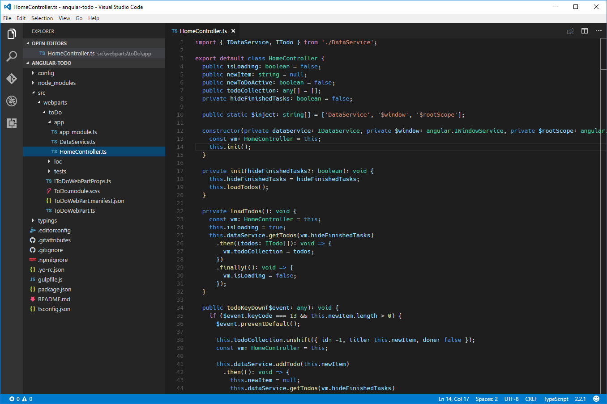
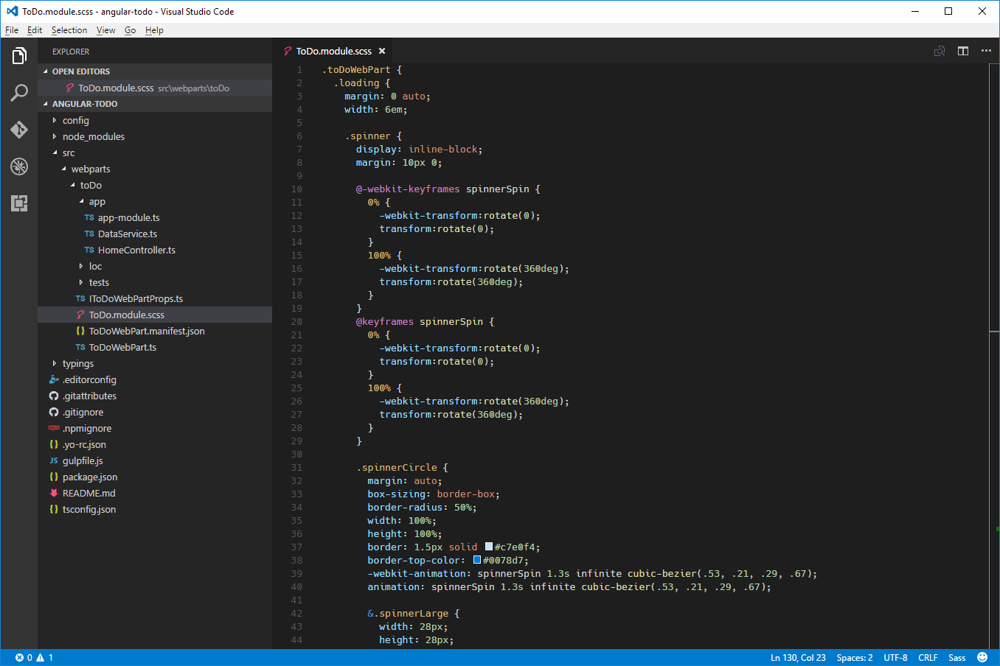
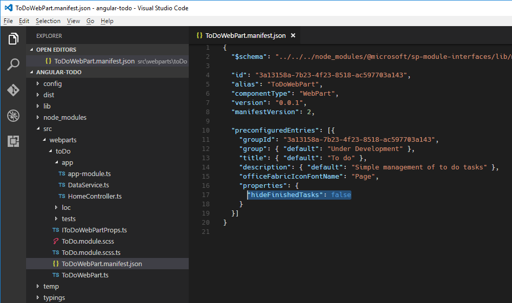

# <a name="build-sharepoint-framework-client-side-web-parts-with-angular-v1x"></a>Erstellen von clientseitigen SharePoint Framework-Webparts mit Angular v1.x

Clientseitige Webparts lassen sich auch mit dem sehr beliebten Framework Angular erstellen. Da Angular modular aufgebaut ist, können Sie es für praktisch jede Art von Projekt einsetzen, von komplexen Single-Page-Anwendungen mit mehreren Ansichten bis hin zu kleineren Komponenten wie Webparts. Viele Organisationen haben in der Vergangenheit bereits SharePoint-Lösungen mit Angular erstellt. Dieser Artikel beschreibt, wie Sie mit Angular v1.x ein clientseitiges SharePoint Framework-Webpart erstellen und anschließend Stile mit [Office UI Fabric](http://dev.office.com/fabric) definieren. In diesem Tutorial erstellen Sie ein einfaches Webpart, das To-do-Elemente verwaltet.


Der Quellcode des Webparts, mit dem wir arbeiten, steht auf GitHub zur Verfügung, unter [https://github.com/SharePoint/sp-dev-fx-webparts/tree/master/samples/angular-todo](https://github.com/SharePoint/sp-dev-fx-webparts/tree/master/samples/angular-todo).

> **Hinweis:** Bevor Sie die Schritte in diesem Artikel durchführen, müssen Sie [eine Entwicklungsumgebung einrichten](../../set-up-your-development-environment), in der Sie SharePoint Framework-Lösungen erstellen können.

## <a name="create-new-project"></a>Erstellen eines neuen Projekts

Erstellen Sie zunächst einen neuen Ordner für Ihr Projekt:

```sh
md angular-todo
```

Navigieren Sie zum Projektordner:

```sh
cd angular-todo
```

Führen Sie im Projektordner den SharePoint Framework-Yeoman-Generator aus, um ein Gerüst für ein neues SharePoint Framework-Projekt zu erstellen:

```sh
yo @microsoft/sharepoint
```

Es werden mehrere Eingabeaufforderungen angezeigt. Definieren Sie die Werte jeweils wie folgt:
- **angular-todo** als Name der Lösung
- **Use the current folder** als Speicherort für die Dateien
- **No javaScript web framework** als Eintrittspunkt für die Webpart-Erstellung
- **To do** als Name des Webparts
- **Simple management of to do tasks** als Beschreibung des Webparts


Öffnen Sie den Projektordner in Ihrem Code-Editor, sobald die Gerüsterstellung abgeschlossen ist. In diesem Tutorial verwenden Sie Visual Studio Code.


## <a name="add-angular"></a>Hinzufügen von Angular

In diesem Tutorial laden Sie Angular aus einem CDN. Öffnen Sie dazu im Code-Editor die Datei **config/config.json**, und fügen Sie in der Eigenschaft **externals** die folgenden Zeilen hinzu:

```json
"angular": {
  "path": "https://cdnjs.cloudflare.com/ajax/libs/angular.js/1.5.8/angular.min.js",
  "globalName": "angular"
}
```


## <a name="add-angular-typings-for-typescript"></a>Hinzufügen von Angular-Typisierungen für TypeScript

Da Sie Angular im Code Ihres Webparts referenzieren werden, benötigen Sie auch Angular-Typisierungen für TypeScript. Führen Sie den folgenden Befehl in der Befehlszeile aus, um diese Typisierungen zu installieren:

```sh
npm install @types/angular --save-dev
```

## <a name="implement-angular-application"></a>Implementieren der Angular-Anwendung

Sobald alle Voraussetzungen erfüllt sind, können Sie die Angular-Beispielanwendung implementieren. Da sie aus mehreren Dateien besteht, erstellen Sie zunächst einen Ordner namens **app** für sie.


### <a name="implement-to-do-data-service"></a>Implementieren des To-do-Dateidiensts

Erstellen Sie im gerade erstellten Ordner **app** eine neue Datei namens **DataService.ts**. Fügen Sie folgenden Code in diese Datei ein:

```ts
export interface ITodo {
  id: number;
  title: string;
  done: boolean;
}

export interface IDataService {
  getTodos(hideFinishedTasks: boolean): angular.IPromise<ITodo[]>;
  addTodo(todo: string): angular.IPromise<{}>;
  deleteTodo(todo: ITodo): angular.IPromise<{}>;
  setTodoStatus(todo: ITodo, done: boolean): angular.IPromise<{}>;
}

export default class DataService implements IDataService {
  public static $inject: string[] = ['$q'];

  private items: ITodo[] = [
    {
      id: 1,
      title: 'Prepare demo Web Part',
      done: true
    },
    {
      id: 2,
      title: 'Show demo',
      done: false
    },
    {
      id: 3,
      title: 'Share code',
      done: false
    }
  ];
  private nextId: number = 4;

  constructor(private $q: angular.IQService) {
  }

  public getTodos(hideFinishedTasks: boolean): angular.IPromise<ITodo[]> {
    const deferred: angular.IDeferred<ITodo[]> = this.$q.defer();

    const todos: ITodo[] = [];
    for (let i: number = 0; i < this.items.length; i++) {
      if (hideFinishedTasks && this.items[i].done) {
        continue;
      }

      todos.push(this.items[i]);
    }

    deferred.resolve(todos);

    return deferred.promise;
  }

  public addTodo(todo: string): angular.IPromise<{}> {
    const deferred: angular.IDeferred<{}> = this.$q.defer();

    this.items.push({
      id: this.nextId++,
      title: todo,
      done: false
    });

    deferred.resolve();

    return deferred.promise;
  }

  public deleteTodo(todo: ITodo): angular.IPromise<{}> {
    const deferred: angular.IDeferred<{}> = this.$q.defer();

    let pos: number = -1;
    for (let i: number = 0; i < this.items.length; i++) {
      if (this.items[i].id === todo.id) {
        pos = i;
        break;
      }
    }

    if (pos > -1) {
      this.items.splice(pos, 1);
      deferred.resolve();
    }
    else {
      deferred.reject();
    }

    return deferred.promise;
  }

  public setTodoStatus(todo: ITodo, done: boolean): angular.IPromise<{}> {
    const deferred: angular.IDeferred<{}> = this.$q.defer();

    for (let i: number = 0; i < this.items.length; i++) {
      if (this.items[i].id === todo.id) {
        this.items[i].done = done;
      }
    }

    deferred.resolve();

    return deferred.promise;
  }
}
```


Im oben aufgeführten Codeausschnitt implementieren Sie drei Typen: die Schnittstelle **ITodo**, die ein To-do-Element in der Anwendung repräsentiert, die Schnittstelle **IDataService**, die die Signatur des Datendiensts definiert, und die Klasse **DataService**, die To-do-Elemente abruft und bearbeitet. Der Datendienst implementiert einfache Methoden zum Hinzufügen und Ändern von To-do-Elementen. Obwohl die Operationen sofort ausgeführt werden, gibt jede CRUD-Funktion zwecks Konsistenz eine Zusage zurück.

In diesem Tutorial werden die To-do-Elemente im Arbeitsspeicher gespeichert. Sie könnten die Lösung aber auch problemlos so erweitern, dass Elemente in einer SharePoint-Liste gespeichert werden und der Datendienst über die SharePoint-REST-API mit SharePoint kommuniziert.

### <a name="implement-the-controller"></a>Implementieren des Controllers

Als Nächstes implementieren Sie den Controller, der die Kommunikation zwischen der Anzeige und dem Datendienst ermöglicht. Erstellen Sie im Ordner **app** eine neue Datei namens **HomeController.ts**, und fügen Sie den folgenden Code in diese Datei ein:

```ts
import { IDataService, ITodo } from './DataService';

export default class HomeController {
  public isLoading: boolean = false;
  public newItem: string = null;
  public newToDoActive: boolean = false;
  public todoCollection: any[] = [];
  private hideFinishedTasks: boolean = false;

  public static $inject: string[] = ['DataService', '$window', '$rootScope'];

  constructor(private dataService: IDataService, private $window: angular.IWindowService, private $rootScope: angular.IRootScopeService) {
    const vm: HomeController = this;
    this.init();
  }

  private init(hideFinishedTasks?: boolean): void {
    this.hideFinishedTasks = hideFinishedTasks;
    this.loadTodos();
  }

  private loadTodos(): void {
    const vm: HomeController = this;
    this.isLoading = true;
    this.dataService.getTodos(vm.hideFinishedTasks)
      .then((todos: ITodo[]): void => {
        vm.todoCollection = todos;
      })
      .finally((): void => {
        vm.isLoading = false;
      });
  }

  public todoKeyDown($event: any): void {
    if ($event.keyCode === 13 && this.newItem.length > 0) {
      $event.preventDefault();

      this.todoCollection.unshift({ id: -1, title: this.newItem, done: false });
      const vm: HomeController = this;

      this.dataService.addTodo(this.newItem)
        .then((): void => {
          this.newItem = null;
          this.dataService.getTodos(vm.hideFinishedTasks)
            .then((todos: any[]): void => {
              this.todoCollection = todos;
            });
        });
    }
  }

  public deleteTodo(todo: ITodo): void {
    if (this.$window.confirm('Are you sure you want to delete this todo item?')) {
      let index: number = -1;
      for (let i: number = 0; i < this.todoCollection.length; i++) {
        if (this.todoCollection[i].id === todo.id) {
          index = i;
          break;
        }
      }

      if (index > -1) {
        this.todoCollection.splice(index, 1);
      }

      const vm: HomeController = this;

      this.dataService.deleteTodo(todo)
        .then((): void => {
          this.dataService.getTodos(vm.hideFinishedTasks)
            .then((todos: any[]): void => {
              this.todoCollection = todos;
            });
        });
    }
  }

  public completeTodo(todo: ITodo): void {
    todo.done = true;

    const vm: HomeController = this;

    this.dataService.setTodoStatus(todo, true)
      .then((): void => {
        this.dataService.getTodos(vm.hideFinishedTasks)
          .then((todos: any[]): void => {
            this.todoCollection = todos;
          });
      });
  }

  public undoTodo(todo: ITodo): void {
    todo.done = false;

    const vm: HomeController = this;

    this.dataService.setTodoStatus(todo, false)
      .then((): void => {
        this.dataService.getTodos(vm.hideFinishedTasks)
          .then((todos: any[]): void => {
            this.todoCollection = todos;
          });
      });
  }
}
```



Zuerst laden Sie den zuvor implementierten Datendienst. Der Controller benötigt diesen Dienst, um die Elementliste abzurufen und die Elemente gemäß den Benutzeranforderungen zu modifizieren. Der Dienst wird über die Angular-Abhängigkeitsinjektion (Dependency Injection) in den Controller eingefügt. Der Controller implementiert eine Reihe von Funktionen, die für das Anzeigemodell verfügbar gemacht werden und aus der Vorlage aufgerufen werden können. Mithilfe dieser Funktionen können Benutzer später neue Elemente hinzufügen, Elemente als fertig gestellt oder noch zu erledigen markieren und Elemente löschen.

### <a name="implement-the-main-module"></a>Implementieren des Hauptmoduls

Nachdem Sie sowohl den Datendienst als auch den Controller implementiert haben, definieren Sie nun das Hauptmodul der Anwendung und registrieren den Datendienst und den Controller in diesem Modul. Erstellen Sie dazu im Ordner **app** eine neue Datei namens **app-module.ts**, und fügen Sie den folgenden Code in diese Datei ein:

```ts
import * as angular from 'angular';
import HomeController from './HomeController';
import DataService from './DataService';

const todoapp: angular.IModule = angular.module('todoapp', []);

todoapp
  .controller('HomeController', HomeController)
  .service('DataService', DataService);
```


Zunächst referenzieren Sie Angular und laden den Controller und den Datendienst, die Sie zuvor implementiert haben. Anschließend definieren Sie das Modul für Ihre Anwendung. Schließlich registrieren Sie noch den Controller und den Datendienst in der Anwendung.

Damit haben Sie eine Angular-Anwendung für Ihr Webpart erstellt. In den nächsten Schritten registrieren Sie die Angular-Anwendung im Webpart und machen sie durch Webpart-Eigenschaften konfigurierbar.

## <a name="register-angular-application-with-web-part"></a>Registrieren der Angular-Anwendung im Webpart

In diesem Schritt fügen Sie die Angular-Anwendung zum Webpart hinzu. Öffnen Sie dazu im Code-Editor die Datei **ToDoWebPart.ts**.

Fügen Sie unmittelbar vor der Klassendeklaration die folgenden Zeilen ein:

```ts
import * as angular from 'angular';
import './app/app-module';
```


Jetzt können Sie eine Referenz auf Angular und Ihre Anwendung laden. Beide sind notwendig zum Bootstrapping der Angular-Anwendung.

Ändern Sie die Funktion **render** des Webparts wie folgt:

```ts
public render(): void {
  if (this.renderedOnce === false) {
    this.domElement.innerHTML = `
<div class="${styles.toDoWebPart}">
  <div data-ng-controller="HomeController as vm">
    <div class="${styles.loading}" ng-show="vm.isLoading">
      <div class="${styles.spinner}">
        <div class="${styles.spinnerCircle} ${styles.spinnerLarge}"></div>
        <div class="${styles.spinnerLabel}">Loading...</div>
      </div>
    </div>
    <div ng-show="vm.isLoading === false">
      <div class="${styles.textField} ${styles.underlined}" ng-class="{'${styles.isActive}': vm.newToDoActive}">
        <label for="newToDo" class="${styles.label}">New to do:</label>
        <input type="text" label="New to do:" id="newToDo" value="" class="${styles.field}" aria-invalid="false" ng-model="vm.newItem" ng-keydown="vm.todoKeyDown($event)" ng-focus="vm.newToDoActive = true" ng-blur="vm.newToDoActive = false">
      </div>
    </div>
    <div class="list" ng-show="vm.isLoading === false">
      <div class="listSurface">
        <div class="listPage">
          <div class="listCell" ng-repeat="todo in vm.todoCollection" uif-item="todo" ng-class="{'${styles.done}': todo.done}">
            <div class="${styles.listItem}">
              <span class="${styles.listItemPrimaryText}">{{todo.title}}</span>
              <div class="${styles.listItemActions}">
                <div class="${styles.listItemAction}" ng-click="vm.completeTodo(todo)" ng-show="todo.done === false">
                  <i class="${styles.icon} ${styles.iconCheckMark}"></i>
                </div>
                <div class="${styles.listItemAction}" ng-click="vm.undoTodo(todo)" ng-show="todo.done">
                  <i class="${styles.icon} ${styles.iconUndo}"></i>
                </div>
                <div class="${styles.listItemAction}" ng-click="vm.deleteTodo(todo)">
                  <i class="${styles.icon} ${styles.iconRecycleBin}"></i>
                </div>
              </div>
            </div>
          </div>
        </div>
      </div>
    </div>
  </div>
</div>`;

    angular.bootstrap(this.domElement, ['todoapp']);
  }
}
```


Als Erstes weist der Code die Vorlage Ihrer Anwendung direkt dem DOM-Element des Webparts zu. Im Stammelement geben Sie den Namen des Controllers an, der sich in der Vorlage um die Ereignisverarbeitung und Datenbindung kümmern wird. Anschließend verwenden Sie den **todoapp**-Namen, den Sie bei der Deklaration des Hauptmoduls verwendet haben, zum Bootstrapping der Anwendung. Über die Webpart-Eigenschaft **renderedOnce** stellen Sie sicher, dass das Bootstrapping nur ein einziges Mal für die Angular-Anwendung durchgeführt wird. Würden Sie diese Eigenschaft nicht setzen, würde die Funktion **render** bei jeder Änderung an einer der Webpart-Eigenschaften nochmals aufgerufen werden und ein erneutes Bootstrapping der Angular-Anwendung durchführen. Das würde zu einem Fehler führen.

Sie müssen außerdem noch die CSS-Stile implementieren, die Sie in der Vorlage verwenden. Öffnen Sie im Code-Editor die Datei **ToDo.module.scss**, und ersetzen Sie den Code in der Datei durch:

```css
.toDoWebPart {
  .loading {
    margin: 0 auto;
    width: 6em;

    .spinner {
      display: inline-block;
      margin: 10px 0;

      @-webkit-keyframes spinnerSpin {
        0% {
          -webkit-transform:rotate(0);
          transform:rotate(0);
        }
        100% {
          -webkit-transform:rotate(360deg);
          transform:rotate(360deg);
        }
      }
      @keyframes spinnerSpin {
        0% {
          -webkit-transform:rotate(0);
          transform:rotate(0);
        }
        100% {
          -webkit-transform:rotate(360deg);
          transform:rotate(360deg);
        }
      }

      .spinnerCircle {
        margin: auto;
        box-sizing: border-box;
        border-radius: 50%;
        width: 100%;
        height: 100%;
        border: 1.5px solid #c7e0f4;
        border-top-color: #0078d7;
        -webkit-animation: spinnerSpin 1.3s infinite cubic-bezier(.53, .21, .29, .67);
        animation: spinnerSpin 1.3s infinite cubic-bezier(.53, .21, .29, .67);

        &.spinnerLarge {
          width: 28px;
          height: 28px;
        }
      }

      .spinnerLabel {
        color: #0078d7;
        margin-top: 10px;
        text-align: center;
      }
    }
  }

  .label {
    font-family: "Segoe UI WestEuropean", "Segoe UI", -apple-system, BlinkMacSystemFont, Roboto, "Helvetica Neue", sans-serif;
    -webkit-font-smoothing: antialiased;
    font-size: 14px;
    font-weight: 400;
    box-sizing: border-box;
    margin: 0;
    padding: 0;
    box-shadow: none;
    color: #333333;
    box-sizing: border-box;
    display: block;
    padding: 5px 0
  }

  .textField {
    font-family: "Segoe UI WestEuropean", "Segoe UI", -apple-system, BlinkMacSystemFont, Roboto, "Helvetica Neue", sans-serif;
    -webkit-font-smoothing: antialiased;
    box-sizing: border-box;
    margin: 0;
    padding: 0;
    box-shadow: none;
    color: #333333;
    font-size: 14px;
    font-weight: 400;
    margin-bottom: 8px;

    &.underlined {
      border-bottom: 1px solid #c8c8c8;
      display: table;
      width: 100%;

      &:hover {
        border-color: #767676;
      }

      &.isActive, &:active {
        border-color: #0078d7;
      }

      .field {
        border: 0;
        display: table-cell;
        padding-top: 8px;
        padding-bottom: 3px
      }
    }

    .label {
      padding-right: 0;
      padding-left: 12px;
      margin-right: 8px;
      font-size: 14px;
      display: table-cell;
      vertical-align: top;
      padding-top: 9px;
      height: 32px;
      width: 1%;
      white-space: nowrap;
      font-weight: 400;
    }

    .field {
      text-align: left;
      float: left;
      box-sizing: border-box;
      margin: 0;
      padding: 0;
      box-shadow: none;
      font-family: "Segoe UI WestEuropean", "Segoe UI", -apple-system, BlinkMacSystemFont, Roboto, "Helvetica Neue", sans-serif;
      -webkit-font-smoothing: antialiased;
      border: 1px solid #c8c8c8;
      border-radius: 0;
      font-weight: 400;
      font-size: 14px;
      color: #333333;
      height: 32px;
      padding: 0 12px 0 12px;
      width: 100%;
      outline: 0;
      text-overflow: ellipsis;
    }

    .field:hover {
      border-color: #767676;
    }
  }

  .listItem {
    font-family: "Segoe UI WestEuropean", "Segoe UI", -apple-system, BlinkMacSystemFont, Roboto, "Helvetica Neue", sans-serif;
    -webkit-font-smoothing: antialiased;
    font-size: 14px;
    font-weight: 400;
    box-sizing: border-box;
    margin: 0;
    padding: 0;
    box-shadow: none;
    padding: 9px 28px 3px;
    position: relative;
    display: block;

    &::before {
      display: table;
      content: "";
      line-height: 0;
    }

    &::after {
      display: table;
      content: "";
      line-height: 0;
      clear: both;
    }

    .listItemPrimaryText {
      font-family: "Segoe UI WestEuropean", "Segoe UI", -apple-system, BlinkMacSystemFont, Roboto, "Helvetica Neue", sans-serif;
      -webkit-font-smoothing: antialiased;
      font-size: 21px;
      font-weight: 100;
      padding-right: 80px;
      position: relative;
      top: -4px;
      overflow: hidden;
      text-overflow: ellipsis;
      white-space: nowrap;
      display: block;
    }

    .listItemActions {
      max-width: 80px;
      position: absolute;
      right: 30px;
      text-align: right;
      top: 10px;

      .listItemAction {
        color: #a6a6a6;
        display: inline-block;
        font-size: 15px;
        position: relative;
        text-align: center;
        top: 3px;
        cursor: pointer;
        height: 16px;
        width: 16px;

        &:hover {
          color: #666666;
          outline: 1px solid transparent;
        }

        .icon {
          vertical-align: top;
        }
      }
    }
  }

  .done {
    text-decoration: line-through;
  }

  .icon {
    -moz-osx-font-smoothing: grayscale;
    -webkit-font-smoothing: antialiased;
    display: inline-block;
    font-family: FabricMDL2Icons;
    font-style: normal;
    font-weight: 400;
    speak: none;

    &.iconCheckMark::before {
      content: "\E73E";
    }

    &.iconUndo::before {
      content: "\E7A7";
    }

    &.iconRecycleBin::before {
      content: "\EF87";
    }
  }
}
```



Überprüfen Sie mit dem folgenden Befehl, ob alles wie erwartet funktioniert:

```sh
gulp serve
```

Im Browser sollte das To-do-Webpart mit To-do-Elementen angezeigt werden.


## <a name="make-web-part-configurable"></a>Konfigurierbarmachen des Webparts

Im Moment zeigt das To-do-Webpart eine fixe Liste von To-do-Elementen an. Im nächsten Schritt erweitern Sie es um eine Konfigurationsoption, über die Benutzer entscheiden können, ob als erledigt markierte Elemente angezeigt werden sollen oder nicht.

### <a name="add-property-in-the-web-part-manifest"></a>Hinzufügen einer Eigenschaft zum Webpart-Manifest

Zunächst fügen Sie eine Konfigurationseigenschaft zum Webpart-Manifest hinzu. Öffnen Sie dazu im Code-Editor die Datei **ToDoWebPart.manifest.json**. Navigieren Sie im Abschnitt **preconfiguredEntries** zum Array **properties**, und ersetzen Sie die vorhandene Eigenschaft **description** durch die folgende Zeile:

```json
"hideFinishedTasks": false
```



### <a name="update-the-signature-of-the-web-part-properties-interface"></a>Aktualisieren der Signatur der Webpart-Eigenschaften-Schnittstelle

Nun aktualisieren Sie die Signatur der Webpart-Eigenschaften-Schnittstelle.

Öffnen Sie dazu im Code-Editor die Datei **IToDoWebPartProps.ts**, und ersetzen Sie den Code in der Datei durch:

```ts
export interface IToDoWebPartProps {
  hideFinishedTasks: boolean;
}
```


### <a name="add-the-property-to-the-web-part-property-pane"></a>Hinzufügen der Eigenschaft zum Webpart-Eigenschaftenbereich

Damit Benutzer den Wert der neu hinzugefügten Eigenschaft konfigurieren können, müssen Sie die Eigenschaft im Webpart-Eigenschaftenbereich verfügbar machen.

Öffnen Sie im Code-Editor die Datei **ToDoWebPart.ts**. Ersetzen Sie in der ersten Anweisung des Typs `import` `PropertyPaneTextField` durch `PropertyPaneToggle`:

```ts
import {
  BaseClientSideWebPart,
  IPropertyPaneConfiguration,
  PropertyPaneToggle
} from '@microsoft/sp-webpart-base';
```


Ändern Sie die Implementierung der Funktion `propertyPaneSettings` wie folgt:

```ts
protected getPropertyPaneConfiguration(): IPropertyPaneConfiguration {
  return {
    pages: [
      {
        header: {
          description: strings.PropertyPaneDescription
        },
        groups: [
          {
            groupName: strings.ViewGroupName,
            groupFields: [
              PropertyPaneToggle('hideFinishedTasks', {
                label: strings.HideFinishedTasksFieldLabel
              })
            ]
          }
        ]
      }
    ]
  };
}
```

Um die fehlenden Zeichenfolgenreferenzen zu ergänzen, müssen Sie zunächst die Signatur der Zeichenfolgen ändern. Öffnen Sie im Code-Editor die Datei **loc/mystrings.d.ts**, und ändern Sie den Code in der Datei wie folgt:

```ts
declare interface IToDoStrings {
  PropertyPaneDescription: string;
  ViewGroupName: string;
  HideFinishedTasksFieldLabel: string;
}

declare module 'toDoStrings' {
  const strings: IToDoStrings;
  export = strings;
}
```


Als Nächstes müssen Sie die Istwerte für die gerade definierten Zeichenfolgen angeben. Öffnen Sie im Code-Editor die Datei **loc/en-us.js**, und ändern Sie den Code in der Datei wie folgt:

```js
define([], function() {
  return {
    "PropertyPaneDescription": "Manage configuration of the To do web part",
    "ViewGroupName": "View",
    "HideFinishedTasksFieldLabel": "Hide finished tasks"
  }
});
```


Überprüfen Sie mit dem folgenden Befehl, ob alles wie erwartet funktioniert:

```sh
gulp serve
```

Im Webpart-Eigenschaftenbereich sollte jetzt eine Umschaltfläche für die gerade definierte Eigenschaft zu sehen sein.


Aktuell hat ein Klick auf die Umschaltfläche noch keine Auswirkungen auf das Webpart, da es noch nicht mit Angular verbunden ist. Das erledigen Sie im nächsten Schritt.

### <a name="make-the-angular-application-configurable-using-web-part-properties"></a>Ermöglichen der Konfiguration der Angular-Anwendung über Webpart-Eigenschaften

Im vorherigen Schritt haben Sie eine Webpart-Eigenschaft definiert, über die Benutzer wählen können, ob erledigte Aufgaben angezeigt werden sollen oder nicht. Als Nächstes übergeben Sie den vom Benutzer ausgewählten Wert an die Angular-Anwendung, sodass diese die Elemente entsprechend laden kann.

#### <a name="broadcast-angular-event-on-web-part-property-change"></a>Übertragen eines Angular-Ereignisses bei Änderung der Webpart-Eigenschaft

Öffnen Sie im Code-Editor die Datei **ToDoWebPart.ts**. Fügen Sie die folgende Zeile unmittelbar vor dem Webpart-Konstruktor ein:

```ts
private $injector: angular.auto.IInjectorService;
```


Ändern Sie nun die Funktion **render** des Webparts wie folgt:

```ts
public render(): void {
  if (this.renderedOnce === false) {
    this.domElement.innerHTML = `
<div class="${styles.toDoWebPart}">
  <div data-ng-controller="HomeController as vm">
    <div class="${styles.loading}" ng-show="vm.isLoading">
      <div class="${styles.spinner}">
        <div class="${styles.spinnerCircle} ${styles.spinnerLarge}"></div>
        <div class="${styles.spinnerLabel}">Loading...</div>
      </div>
    </div>
    <div ng-show="vm.isLoading === false">
      <div class="${styles.textField} ${styles.underlined}" ng-class="{'${styles.isActive}': vm.newToDoActive}">
        <label for="newToDo" class="${styles.label}">New to do:</label>
        <input type="text" label="New to do:" id="newToDo" value="" class="${styles.field}" aria-invalid="false" ng-model="vm.newItem" ng-keydown="vm.todoKeyDown($event)" ng-focus="vm.newToDoActive = true" ng-blur="vm.newToDoActive = false">
      </div>
    </div>
    <div class="list" ng-show="vm.isLoading === false">
      <div class="listSurface">
        <div class="listPage">
          <div class="listCell" ng-repeat="todo in vm.todoCollection" uif-item="todo" ng-class="{'${styles.done}': todo.done}">
            <div class="${styles.listItem}">
              <span class="${styles.listItemPrimaryText}">{{todo.title}}</span>
              <div class="${styles.listItemActions}">
                <div class="${styles.listItemAction}" ng-click="vm.completeTodo(todo)" ng-show="todo.done === false">
                  <i class="${styles.icon} ${styles.iconCheckMark}"></i>
                </div>
                <div class="${styles.listItemAction}" ng-click="vm.undoTodo(todo)" ng-show="todo.done">
                  <i class="${styles.icon} ${styles.iconUndo}"></i>
                </div>
                <div class="${styles.listItemAction}" ng-click="vm.deleteTodo(todo)">
                  <i class="${styles.icon} ${styles.iconRecycleBin}"></i>
                </div>
              </div>
            </div>
          </div>
        </div>
      </div>
    </div>
  </div>
</div>`;

    this.$injector = angular.bootstrap(this.domElement, ['todoapp']);
  }

  this.$injector.get('$rootScope').$broadcast('configurationChanged', {
    hideFinishedTasks: this.properties.hideFinishedTasks
  });
}
```

Im Beispielcode oben überträgt die Funktion bei jeder Änderung der Webpart-Eigenschaft ein Angular-Ereignis, das die Angular-Anwendung abonniert. Sobald die Angular-Anwendung ein Ereignis empfängt, bearbeitet sie es entsprechend.

#### <a name="subscribe-to-web-part-property-change-event-in-angular"></a>Abonnieren von Änderungsereignissen bei Webpart-Eigenschaften in Angular

Öffnen Sie im Code-Editor die Datei **app/HomeController.ts**. Erweitern Sie den Konstruktor wie folgt:

```ts
constructor(private dataService: IDataService, private $window: angular.IWindowService, private $rootScope: angular.IRootScopeService) {
  const vm: HomeController = this;
  this.init();

  $rootScope.$on('configurationChanged', (event: angular.IAngularEvent, args: { hideFinishedTasks: boolean }): void => {
    vm.init(args.hideFinishedTasks);
  });
}
```


Geben Sie Folgendes in die Befehlszeile ein, um zu überprüfen, ob die Angular-Anwendung wie erwartet arbeitet und korrekt auf die Eigenschaftenänderung antwortet:

```sh
gulp serve
```

Wenn Sie auf die Umschaltfläche **Hide finished tasks** klicken, sollten abgeschlossene Aufgaben im Webpart eingeblendet bzw. ausgeblendet werden.

