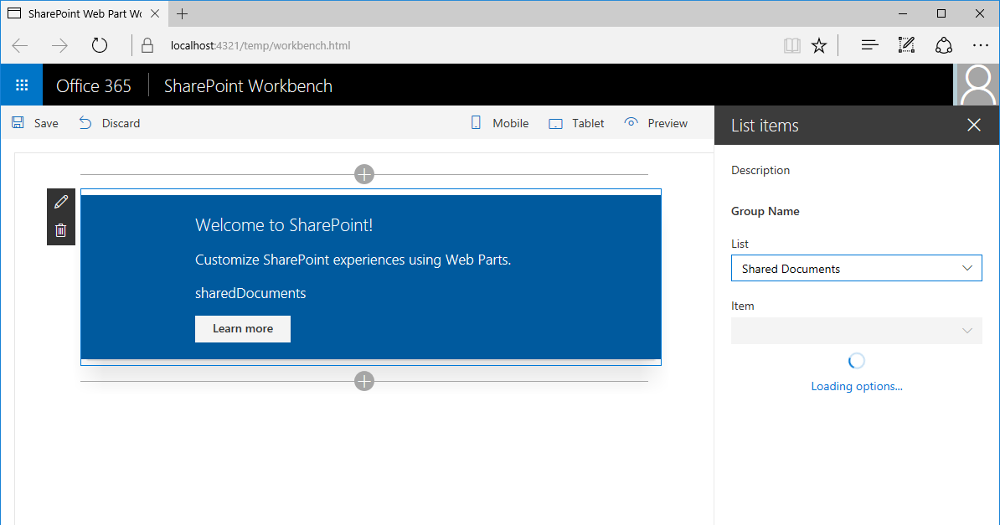

Aktivierte Dropdownliste im Webpart-Eigenschaftenbereich. Deaktivierte Element-DropdownlisteList dropdown in web part property pane enabled. Item dropdown disabled

Nach dem Auswählen einer Liste in der Dropdownliste werden die in dieser Liste verfügbaren Elemente geladen.After selecting a list in the list dropdown the item dropdown will load items available in that list.

Nachdem die verfügbaren Elemente geladen wurden, wird die Element-Dropdownliste aktiviert.After the available items have been loaded, the item dropdown becomes enabled.

Nach dem Auswählen eines Elements in der Element-Dropdownliste wird das Webpart aktualisiert und zeigt das ausgewählte Element im Text an.After selecting an item in the item dropdown the web part is refreshed showing the selected item in its body.

