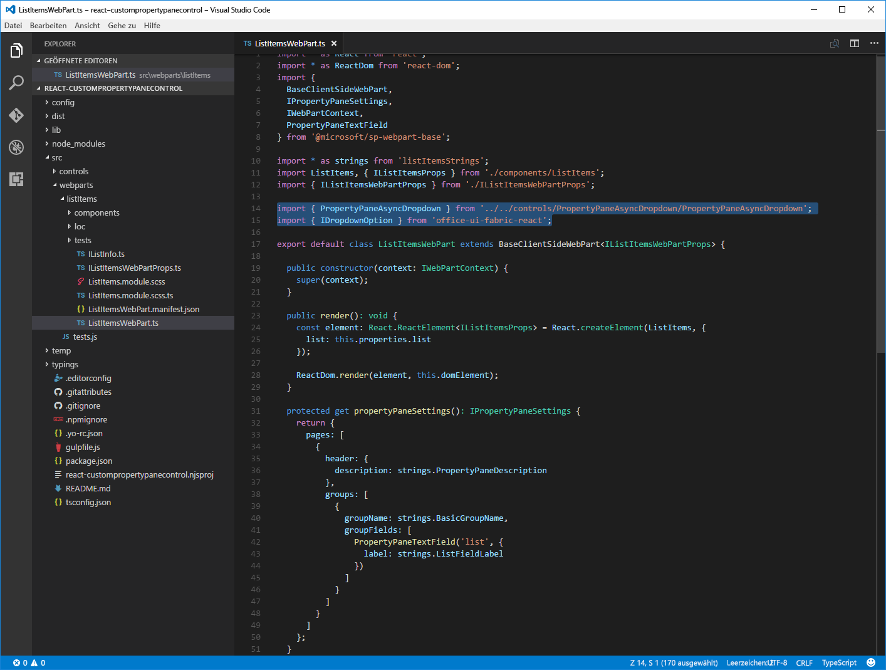
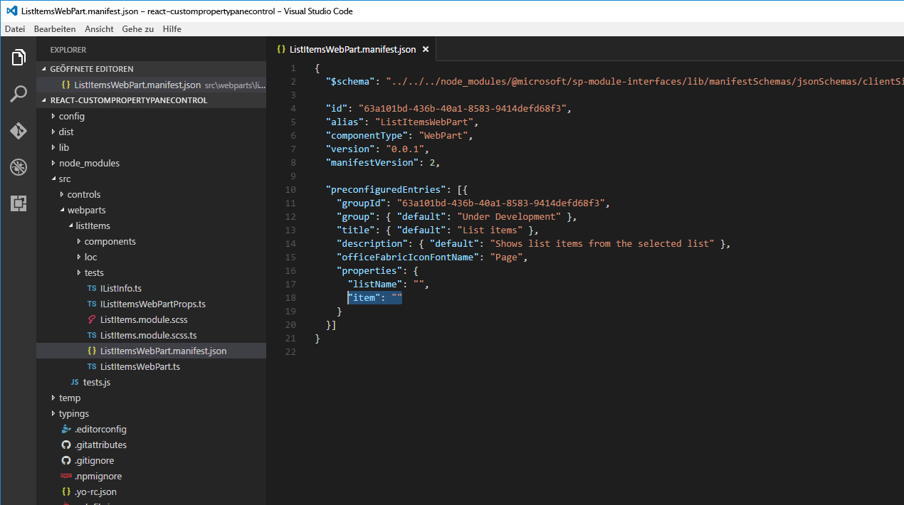

# <a name="build-custom-controls-for-the-property-pane"></a>Erstellen benutzerdefinierter Steuerelemente für den Eigenschaftenbereich

Das SharePoint-Framework enthält eine Reihe von Standardsteuerelementen für den Eigenschaftenbereich. Manchmal jedoch benötigen Sie zusätzliche Funktionen, die über die grundlegenden Steuerelemente hinausgehen. Vielleicht sollen beispielsweise die Daten in einem Steuerelement oder einer bestimmten Benutzeroberfläche asynchron aktualisiert werden. Dann können Sie ein benutzerdefiniertes Steuerelement für den Eigenschaftenbereich erstellen, um die benötigten Funktionen zu implementieren.

In diesem Artikel erstellen Sie ein benutzerdefiniertes Dropdown-Steuerelement, das seine Daten asynchron aus einem externen Dienst lädt, ohne die Benutzeroberfläche des Webparts zu blockieren.


Der Quellcode des Webparts, mit dem wir arbeiten, steht auf GitHub zur Verfügung, unter [sp-dev-fx-webparts/samples/react-custompropertypanecontrols](https://github.com/SharePoint/sp-dev-fx-webparts/tree/master/samples/react-custompropertypanecontrols).

> [!NOTE] 
> Bevor Sie die Anleitung in diesem Artikel umsetzen können, müssen Sie [eine Entwicklungsumgebung einrichten](../../set-up-your-development-environment.md), in der Sie SharePoint-Framework-Lösungen erstellen können.

## <a name="create-new-project"></a>Erstellen eines neuen Projekts

1. Erstellen Sie zunächst einen neuen Ordner für Ihr Projekt:

  ```sh
  md react-custompropertypanecontrol
  ```

2. Wechseln Sie in den Projektordner:

  ```sh
  cd react-custompropertypanecontrol
  ```

3. Führen Sie im Projektordner den SharePoint Framework-Yeoman-Generator aus, um ein Gerüst für ein neues SharePoint Framework-Projekt zu erstellen:

  ```sh
  yo @microsoft/sharepoint
  ```

4. Geben Sie die folgenden Werte ein, wenn Sie dazu aufgefordert werden:

  - **react-custompropertypanecontrol** als Lösungsname
  - **Aktuellen Ordner verwenden** als Speicherort für die Dateien
  - **Listenelemente** als Namen des Webparts
  - **Zeigt Listenelemente aus der ausgewählten Liste an** als Beschreibung Ihres Webparts
  - **React** als Eintrittspunkt für die Webpart-Erstellung

  

5. Sobald das Gerüst abgeschlossen ist, sperren Sie die Version der Projektabhängigkeiten, indem Sie den folgenden Befehl ausführen:

  ```sh
  npm shrinkwrap
  ```

6. Öffnen Sie den Projektordner in einem Code-Editor. In diesem Artikel wird Visual Studio Code in den Schritten und Screenshots verwendet, Sie können jedoch auch jeden beliebigen anderen Editor verwenden.

  

## <a name="define-web-part-property-for-storing-the-selected-list"></a>Definieren der Webparteigenschaft zum Speichern der ausgewählten Liste

In dem Webpart, das Sie erstellen, werden Listenelemente aus der jeweils ausgewählten SharePoint-Liste angezeigt. Benutzer können die gewünschte Liste im Eigenschaftenbereich des Webparts auswählen. Erstellen Sie eine neue Webparteigenschaft namens **listName**, in der die ausgewählte Liste gespeichert wird:

1. Öffnen Sie im Code-Editor die Datei **src/webparts/listItems/ListItemsWebPartManifest.json** Ersetzen Sie die Standardeigenschaft **description** durch eine neue Eigenschaft mit dem Namen `listName`.

  

2. Öffnen Sie die Datei **src/webparts/listItems/IListItemsWebPartProps.ts**, und ersetzen Sie den in ihr enthaltenen Code durch folgenden Code:

  ```typescript
  export interface IListItemsWebPartProps {
    listName: string;
  }
  ```

3. Ändern Sie in der Datei **src/webparts/listItems/ListItemsWebPart.ts** die Methode **render** wie folgt:

  ```typescript
  export default class ListItemsWebPart extends BaseClientSideWebPart<IListItemsWebPartProps> {
    // ...
    public render(): void {
      const element: React.ReactElement<IListItemsProps> = React.createElement(ListItems, {
        listName: this.properties.listName
      });

      ReactDom.render(element, this.domElement);
    }
    // ...
  }
  ```

4. Aktualisieren Sie die Methode **getPropertyPaneConfiguration** wie folgt:

  ```typescript
  export default class ListItemsWebPart extends BaseClientSideWebPart<IListItemsWebPartProps> {
    // ...
    protected getPropertyPaneConfiguration(): IPropertyPaneConfiguration {
      return {
        pages: [
          {
            header: {
              description: strings.PropertyPaneDescription
            },
            groups: [
              {
                groupName: strings.BasicGroupName,
                groupFields: [
                  PropertyPaneTextField('listName', {
                    label: strings.ListFieldLabel
                  })
                ]
              }
            ]
          }
        ]
      };
    }
    // ...
  }
  ```

5. Ändern Sie in der Datei **src/webparts/listItems/loc/mystrings.d.ts** die Schnittstelle **IListItemsWebPartStrings** wie folgt:

  ```typescript
  declare interface IListItemsWebPartStrings {
    PropertyPaneDescription: string;
    BasicGroupName: string;
    ListFieldLabel: string;
  }
  ```

6. Fügen Sie in der Datei **src/webparts/listItems/loc/en-us.js** die fehlende Definition für die Zeichenfolge **ListFieldLabel** hinzu.

  ```js
  define([], function() {
    return {
      "PropertyPaneDescription": "Description",
      "BasicGroupName": "Group Name",
      "ListFieldLabel": "List"
    }
  });
  ```

7. Ändern Sie in der Datei **src/webparts/listItems/components/ListItems.tsx** den Code der Methode **render** wie folgt:

  ```tsx
  export default class ListItems extends React.Component<IListItemsProps, {}> {
    public render(): React.ReactElement<IListItemsProps> {
      return (
        <div className={styles.listItems}>
          <div className={styles.container}>
            <div className={`ms-Grid-row ms-bgColor-themeDark ms-fontColor-white ${styles.row}`}>
              <div className="ms-Grid-col ms-lg10 ms-xl8 ms-xlPush2 ms-lgPush1">
                <span className="ms-font-xl ms-fontColor-white">Welcome to SharePoint!</span>
                <p className="ms-font-l ms-fontColor-white">Customize SharePoint experiences using Web Parts.</p>
                <p className="ms-font-l ms-fontColor-white">{escape(this.props.listName)}</p>
                <a href="https://aka.ms/spfx" className={styles.button}>
                  <span className={styles.label}>Learn more</span>
                </a>
              </div>
            </div>
          </div>
        </div>
      );
    }
  }
  ```

8. Öffnen Sie die Datei **src/webparts/listItems/components/IListItemsProps.ts**, und ersetzen Sie den in ihr enthaltenen Code durch folgenden Code:

  ```typescript
  export interface IListItemsProps {
    listName: string;
  }
  ```

9. Führen Sie den folgenden Befehl aus, um zu überprüfen, ob das Projekt ausgeführt wird:

  ```sh
  gulp serve
  ```

10. Fügen Sie im Webbrowser das **Listenelement**-Webpart zum Zeichenbereich hinzu, und öffnen Sie die Eigenschaften. Überprüfen Sie, dass der für die **List**-Eigenschaft festgelegte Wert im Webparttext angezeigt wird.

  


## <a name="create-asynchronous-dropdown-property-pane-control"></a>Erstellen eines asynchronen Steuerelements für den Dropdown-Eigenschaftenbereich

Das SharePoint Framework bietet Ihnen ein standardmäßiges Dropdown-Steuerelement, mit dem Benutzer einen bestimmten Wert auswählen können. Das Dropdown-Steuerelement wurde so konzipiert, dass all seine Werte vorab bekannt sein müssen. Wenn die Werte dynamisch geladen werden sollen oder Sie die Werte asynchron aus einem externen Dienst laden und nicht das ganze Webpart blockieren möchten, besteht eine Möglichkeit darin, ein Dropdown-Steuerelement zu erstellen.

Wenn Sie ein benutzerdefiniertes Eigenschaftenbereichssteuerelement erstellen, das React im SharePoint Framework verwendet, besteht das Steuerelement aus einer Klasse, die das Steuerelement bei dem Webpart registriert, und einer React-Komponente, die das Dropdown rendert und seine Daten verwaltet.

> [!NOTE] 
> Ab Drop  6 des SharePoint-Framework gibt es einen Bug in der Office UI Fabric React-Dropdownkomponente, aufgrund dessen das in diesem Artikel erstellte Steuerelement nicht korrekt funktioniert. Eine temporäre Problemumgehung besteht darin, in der Datei **node_modules/@microsoft/office-ui-fabric-react-bundle/dist/office-ui-fabric-react.bundle.js** die Zeile **12027** zu ändern, und zwar von:
> 
> ```js
> isDisabled: this.props.isDisabled !== undefined ? this.props.isDisabled : this.props.disabled
> ```
>
> in:
> 
> ```js
> isDisabled: newProps.isDisabled !== undefined ? newProps.isDisabled : newProps.disabled
> ```

### <a name="add-asynchronous-dropdown-property-pane-control-react-component"></a>Hinzufügen eines React-basierten asynchronen Dropdown-Steuerelements zum Eigenschaftenbereich

1. Erstellen Sie einen Ordner „components“. Erstellen Sie dazu im Ordner **src** eine Hierarchie aus drei neuen Ordnern, sodass Ihre Ordnerstruktur als **src/controls/PropertyPaneAsyncDropdown/components** angezeigt wird.

  

2. Definieren Sie die Eigenschaften der asynchronen React-basierten Dropdownkomponente. Erstellen Sie dazu im Ordner **src/controls/PropertyPaneAsyncDropdown/components** eine neue Datei mit dem Namen **IAsyncDropdownProps.ts**, und geben Sie folgenden Code in die Datei ein:

  ```typescript
  import { IDropdownOption } from 'office-ui-fabric-react/lib/components/Dropdown';

  export interface IAsyncDropdownProps {
    label: string;
    loadOptions: () => Promise<IDropdownOption[]>;
    onChanged: (option: IDropdownOption, index?: number) => void;
    selectedKey: string | number;
    disabled: boolean;
    stateKey: string;
  }
  ```

  Die Klasse **IAsyncDropdownProps** definiert Eigenschaften, die für die React-Komponente festgelegt werden können, die vom benutzerdefinierten Steuerelement im Eigenschaftenbereich verwendet wird. 
  - Die Eigenschaft **label** legt die Beschriftung des Dropdown-Steuerelements fest. 
  - Die mit dem Delegat **loadOptions** verknüpfte Funktion wird vom Steuerelement aufgerufen, um die verfügbaren Optionen zu laden. 
  - Die mit dem Delegat **onChanged** verknüpfte Funktion wird aufgerufen, sobald der Benutzer eine Option aus dem Dropdown auswählt. 
  - Die Eigenschaft **selectedKey** gibt den ausgewählten Wert an. Dabei kann es sich um eine Zeichenfolge oder eine Zahl handeln. 
  - Die Eigenschaft **disabled** gibt an, ob das Dropdown-Steuerelement deaktiviert ist. 
  - Die Eigenschaft **stateKey** wird verwendet, um ein Neurendern der React-Komponente zu erzwingen.

3. Definieren Sie die Schnittstelle der asynchronen React-basierten Dropdownkomponente. Erstellen Sie hierzu im Ordner **src/controls/PropertyPaneAsyncDropdown/components** eine neue Datei mit dem Namen **IAsyncDropdownState.ts**, und geben Sie den folgenden Code in die Datei ein:

  ```typescript
  import { IDropdownOption } from 'office-ui-fabric-react/lib/components/Dropdown';

  export interface IAsyncDropdownState {
    loading: boolean;
    options: IDropdownOption[];
    error: string;
  }
  ```

  Die Schnittstelle **IAsyncDropdownState** beschreibt den Status der React-Komponente.
  - Die Eigenschaft **loading** gibt an, ob die Komponente ihre Optionen gerade lädt. 
  - Die Eigenschaft **options** enthält alle verfügbaren Optionen. 
  - Tritt ein Fehler auf, wird er der Eigenschaft **error** zugewiesen und von dort an den Benutzer kommuniziert.

4. Definieren Sie die asynchrone React-basierte Dropdownkomponente. Erstellen Sie hierzu im Ordner **src/controls/PropertyPaneAsyncDropdown/components** eine neue Datei mit dem Namen **AsyncDropdown.tsx**, und geben Sie folgenden Code in die Datei ein:

  ```typescriptx
  import * as React from 'react';
  import { Dropdown, IDropdownOption } from 'office-ui-fabric-react/lib/components/Dropdown';
  import { Spinner } from 'office-ui-fabric-react/lib/components/Spinner';
  import { IAsyncDropdownProps } from './IAsyncDropdownProps';
  import { IAsyncDropdownState } from './IAsyncDropdownState';

  export default class AsyncDropdown extends React.Component<IAsyncDropdownProps, IAsyncDropdownState> {
    private selectedKey: React.ReactText;

    constructor(props: IAsyncDropdownProps, state: IAsyncDropdownState) {
      super(props);
      this.selectedKey = props.selectedKey;

      this.state = {
        loading: false,
        options: undefined,
        error: undefined
      };
    }

    public componentDidMount(): void {
      this.loadOptions();
    }

    public componentDidUpdate(prevProps: IAsyncDropdownProps, prevState: IAsyncDropdownState): void {
      if (this.props.disabled !== prevProps.disabled ||
        this.props.stateKey !== prevProps.stateKey) {
        this.loadOptions();
      }
    }

    private loadOptions(): void {
      this.setState({
        loading: true,
        error: undefined,
        options: undefined
      });

      this.props.loadOptions()
        .then((options: IDropdownOption[]): void => {
          this.setState({
            loading: false,
            error: undefined,
            options: options
          });
        }, (error: any): void => {
          this.setState((prevState: IAsyncDropdownState, props: IAsyncDropdownProps): IAsyncDropdownState => {
            prevState.loading = false;
            prevState.error = error;
            return prevState;
          });
        });
    }

    public render(): JSX.Element {
      const loading: JSX.Element = this.state.loading ? <div><Spinner label={'Loading options...'} /></div> : <div />;
      const error: JSX.Element = this.state.error !== undefined ? <div className={'ms-TextField-errorMessage ms-u-slideDownIn20'}>Error while loading items: {this.state.error}</div> : <div />;

      return (
        <div>
          <Dropdown label={this.props.label}
            disabled={this.props.disabled || this.state.loading || this.state.error !== undefined}
            onChanged={this.onChanged.bind(this)}
            selectedKey={this.selectedKey}
            options={this.state.options} />
          {loading}
          {error}
        </div>
      );
    }

    private onChanged(option: IDropdownOption, index?: number): void {
      this.selectedKey = option.key;
      // reset previously selected options
      const options: IDropdownOption[] = this.state.options;
      options.forEach((o: IDropdownOption): void => {
        if (o.key !== option.key) {
          o.selected = false;
        }
      });
      this.setState((prevState: IAsyncDropdownState, props: IAsyncDropdownProps): IAsyncDropdownState => {
        prevState.options = options;
        return prevState;
      });
      if (this.props.onChanged) {
        this.props.onChanged(option, index);
      }
    }
  }
  ```

  Die Klasse **AsyncDropdown** stellt die React-Komponente dar, die verwendet wird, um das asynchrone Dropdown-Steuerelement im Eigenschaftenbereich zu rendern.

  - Wenn die Komponente zum ersten Mal geladen wird, ändert sich die Methode **componentDidMount**, oder es ändern sich ihre Eigenschaften **disabled** oder **stateKey**. Anschließend werden durch Aufrufen der über die Eigenschaften übergebenen Methode **loadOptions** die verfügbaren Optionen geladen. 
  - Sobald die Optionen geladen wurden, wird der Status der Komponente aktualisiert, und die verfügbaren Optionen werden angezeigt. 
  - Das Dropdown selbst wird mithilfe der [Office UI Fabric React-Dropdownkomponente](https://developer.microsoft.com/de-DE/fabric#/components/dropdown) gerendert. 
  - Während die Komponente die verfügbaren Optionen lädt, wird mithilfe der [Office UI Fabric React-Drehfeldkomponente](https://developer.microsoft.com/de-DE/fabric#/components/spinner) ein Drehfeld angezeigt.


Der nächste Schritt besteht darin, das benutzerdefinierte Steuerelement für den Eigenschaftenbereich zu definieren. Dieses Steuerelement wird im Webpart zum Definieren von Eigenschaften im Eigenschaftenbereich verwendet und mithilfe der zuvor definierten React-Komponente gerendert.

### <a name="add-asynchronous-dropdown-property-pane-control"></a>Hinzufügen eines asynchronen Dropdown-Steuerelements zum Eigenschaftenbereich

1. Definieren Sie die Eigenschaften des asynchronen Dropdown-Steuerelements für den Eigenschaftenbereich. Ein benutzerdefiniertes Eigenschaftenbereich-Steuerelement weist zwei Eigenschaftensätze auf. 
  
  Der erste Satz von Eigenschaften wird öffentlich verfügbar gemacht und wird zum Definieren der Webparteigenschaft innerhalb des Webparts verwendet. Diese Eigenschaften sind komponentenspezifische Eigenschaften wie beispielsweise die Bezeichnung, die neben dem Steuerelement angezeigt wird, Mindest- und Maximalwerte für ein Drehfeld oder verfügbare Optionen für ein Dropdown. Bei der Definition eines benutzerdefinierten Eigenschaftenbereich-Steuerelements muss der Typ, der diese Eigenschaften beschreibt, als Typ **TProperties** übergeben werden, wenn die Schnittstelle `IPropertyPaneField<TProperties>` implementiert wird.

  Bei dem zweiten Satz von Eigenschaften handelt es sich um private Eigenschaften, die intern innerhalb des benutzerdefinierten Eigenschaftenbereichssteuerelements verwendet werden. Diese Eigenschaften müssen den SharePoint Framework-APIs entsprechen, damit das benutzerdefinierte Steuerelement korrekt gerendert wird. Diese Eigenschaften müssen die **IPropertyPaneCustomFieldProps**-Schnittstelle aus dem **@microsoft/sp-webpart-base**-Paket implementieren.

2. Definieren Sie die öffentlichen Eigenschaften des asynchronen Dropdown-Steuerelements für den Eigenschaftenbereich. Erstellen Sie hierzu im Ordner **src/controls/PropertyPaneAsyncDropdown** eine neue Datei mit dem Namen **IPropertyPaneAsyncDropdownProps.ts**, und geben Sie den folgenden Code in die Datei ein:

  ```typescript
  import { IDropdownOption } from 'office-ui-fabric-react/lib/components/Dropdown';

  export interface IPropertyPaneAsyncDropdownProps {
    label: string;
    loadOptions: () => Promise<IDropdownOption[]>;
    onPropertyChange: (propertyPath: string, newValue: any) => void;
    selectedKey: string | number;
    disabled?: boolean;
  }
  ```

  Zur Schnittstelle **IPropertyPaneAsyncDropdownProps** ist Folgendes anzumerken:
  - Die Eigenschaft **label** definiert die Bezeichnung, die neben dem Dropdown angezeigt wird. 
  - Der Delegat **loadOptions** definiert die Methode, die zum Laden der verfügbaren Dropdownoptionen aufgerufen wird. 
  - Der Delegat **onPropertyChange** definiert eine Methode, die aufgerufen wird, wenn der Benutzer einen Wert aus dem Dropdown auswählt. 
  - Die Eigenschaft **selectedKey** gibt den aus dem Dropdown ausgewählten Wert zurück. 
  - Die Eigenschaft **disabled** gibt an, ob das Steuerelement deaktiviert ist.

3. Definieren Sie die internen Eigenschaften des asynchronen Dropdown-Steuerelements für den Eigenschaftenbereich. Erstellen Sie hierzu im Ordner **src/controls/PropertyPaneAsyncDropdown** eine neue Datei mit dem Namen **IPropertyPaneAsyncDropdownInternalProps.ts**, und geben Sie den folgenden Code in die Datei ein:

  ```typescript
  import { IPropertyPaneCustomFieldProps } from '@microsoft/sp-webpart-base';
  import { IPropertyPaneAsyncDropdownProps } from './IPropertyPaneAsyncDropdownProps';

  export interface IPropertyPaneAsyncDropdownInternalProps extends IPropertyPaneAsyncDropdownProps, IPropertyPaneCustomFieldProps {
  }
  ```

  Die Schnittstelle **IPropertyPaneAsyncDropdownInternalProps** definiert zwar keine neuen Eigenschaften, kombiniert aber die Eigenschaften aus der zuvor definierten Schnittstelle **IPropertyPaneAsyncDropdownProps** und der SharePoint-Framework-Standardschnittstelle **IPropertyPaneCustomFieldProps**. Diese ist erforderlich, damit ein benutzerdefiniertes Steuerelement korrekt ausgeführt wird.

4. Definieren Sie das asynchrone Dropdown-Steuerelement für den Eigenschaftenbereich. Erstellen Sie hierzu im Ordner **src/controls/PropertyPaneAsyncDropdown** eine neue Datei mit dem Namen **PropertyPaneAsyncDropdown.ts**, und geben Sie den folgenden Code in die Datei ein:

  ```typescript
  import * as React from 'react';
  import * as ReactDom from 'react-dom';
  import {
    IPropertyPaneField,
    PropertyPaneFieldType
  } from '@microsoft/sp-webpart-base';
  import { IDropdownOption } from 'office-ui-fabric-react/lib/components/Dropdown';
  import { IPropertyPaneAsyncDropdownProps } from './IPropertyPaneAsyncDropdownProps';
  import { IPropertyPaneAsyncDropdownInternalProps } from './IPropertyPaneAsyncDropdownInternalProps';
  import AsyncDropdown from './components/AsyncDropdown';
  import { IAsyncDropdownProps } from './components/IAsyncDropdownProps';

  export class PropertyPaneAsyncDropdown implements IPropertyPaneField<IPropertyPaneAsyncDropdownProps> {
    public type: PropertyPaneFieldType = PropertyPaneFieldType.Custom;
    public targetProperty: string;
    public properties: IPropertyPaneAsyncDropdownInternalProps;
    private elem: HTMLElement;

    constructor(targetProperty: string, properties: IPropertyPaneAsyncDropdownProps) {
      this.targetProperty = targetProperty;
      this.properties = {
        key: properties.label,
        label: properties.label,
        loadOptions: properties.loadOptions,
        onPropertyChange: properties.onPropertyChange,
        selectedKey: properties.selectedKey,
        disabled: properties.disabled,
        onRender: this.onRender.bind(this)
      };
    }

    public render(): void {
      if (!this.elem) {
        return;
      }

      this.onRender(this.elem);
    }

    private onRender(elem: HTMLElement): void {
      if (!this.elem) {
        this.elem = elem;
      }

      const element: React.ReactElement<IAsyncDropdownProps> = React.createElement(AsyncDropdown, {
        label: this.properties.label,
        loadOptions: this.properties.loadOptions,
        onChanged: this.onChanged.bind(this),
        selectedKey: this.properties.selectedKey,
        disabled: this.properties.disabled,
        // required to allow the component to be re-rendered by calling this.render() externally
        stateKey: new Date().toString()
      });
      ReactDom.render(element, elem);
    }

    private onChanged(option: IDropdownOption, index?: number): void {
      this.properties.onPropertyChange(this.targetProperty, option.key);
    }
  }
  ```

  Die Klasse **PropertyPaneAsyncDropdown** implementiert die SharePoint-Framework-Standardschnittstelle **IPropertyPaneField**, unter Verwendung der Schnittstelle **IPropertyPaneAsyncDropdownProps** als Vertrag für die öffentlichen Eigenschaften, die innerhalb des Webparts festgelegt werden können. Die Klasse enthält die folgenden drei öffentlichen Eigenschaften, die von der Schnittstelle **IPropertyPaneField** definiert werden:

  - **type**: Muss bei benutzerdefinierten Eigenschaftenbereich-Steuerelementen auf **PropertyPaneFieldType.Custom** festgelegt werden.
  - **targetProperty**: Wird zum Angeben des Namens der Webparteigenschaft verwendet, die mit dem Steuerelement verwendet werden soll.
  - **properties**: Wird zum Definieren von steuerelementspezifischen Eigenschaften verwendet.

  Wie Sie sehen, ist die Eigenschaft **properties** vom internen Typ **IPropertyPaneAsyncDropdownInternalProps** und gehört nicht zur öffentlichen Schnittstelle **IPropertyPaneAsyncDropdownProps**, die von der Klasse implementiert wird. Dies ist gewollt, damit die Eigenschaft **properties** die Methode **onRender** definieren kann, die vom SharePoint-Framework gefordert wird. Wäre die Methode **onRender** Teil der öffentlichen Schnittstelle **IPropertyPaneAsyncDropdownProps**, müssten Sie ihr bei Verwendung des asynchronen Dropdown-Steuerelements im Webpart einen Wert zuweisen. Das ist nicht erstrebenswert.

  Die Klasse **PropertyPaneAsyncDropdown** definiert eine öffentliche Methode **render**, die zum Aktualisieren des Steuerelements verwendet werden kann. Das ist beispielsweise bei kaskadierenden Dropdowns nützlich, bei denen ein in Dropdown 1 festgelegter Wert festlegt, welche Optionen in Dropdown 2 verfügbar sind. Durch Aufrufen der Methode **render** nach dem Auswählen eines Elements können die verfügbaren Optionen vom abhängigen Dropdown geladen werden. Hierfür muss React erkennen können, dass sich das Steuerelement geändert hat. Das ermöglichen Sie durch Festlegen des Werts von **stateKey** auf das jeweils aktuelle Datum. Mithilfe dieses Tricks wird bei jedem Aufruf der Methode **onRender** die Komponente nicht nur erneut gerendert, sondern es werden auch ihre verfügbaren Optionen aktualisiert.

## <a name="use-the-asynchronous-dropdown-property-pane-control-in-the-web-part"></a>Verwenden des asynchronen Dropdown-Steuerelements für den Eigenschaftenbereich im Webpart

Sobald das asynchrone Dropdown-Steuerelement für den Eigenschaftenbereich bereit ist, besteht der nächste Schritt darin, es innerhalb des Webparts zu verwenden, damit Benutzer eine Liste auswählen können.

### <a name="add-list-info-interface"></a>Hinzufügen einer Schnittstelle des Typs „ListInfo“

Um Informationen zu verfügbaren Listen auf konsistente Art und Weise zu übergeben, definieren Sie eine Schnittstelle, die Informationen zu einer Liste darstellt. Erstellen Sie hierzu im Ordner **src/webparts/listItems** eine neue Datei mit dem Namen **IListInfo.ts** , und geben Sie den folgenden Code in die Datei ein:

```typescript
export interface IListInfo {
  Id: string;
  Title: string;
}
```

### <a name="use-the-asynchronous-dropdown-property-pane-control-to-render-the-listname-web-part-property"></a>Verwenden des asynchronen Dropdown-Steuerelements für den Eigenschaftenbereich zum Rendern der Webparteigenschaft „listName“

1. Referenzieren Sie die erforderlichen Typen. Importieren Sie hierzu im oberen Teil der Datei **src/webparts/listItems/ListItemsWebPart.ts** die zuvor erstellte Klasse **PropertyPaneAsyncDropdown**, indem Sie folgenden Code hinzufügen:

  ```typescript
  import { PropertyPaneAsyncDropdown } from '../../controls/PropertyPaneAsyncDropdown/PropertyPaneAsyncDropdown';
  ```

2. Fügen Sie unter diesem Code einen Verweis auf die Schnittstelle **IDropdownOption** und zwei Hilfsfunktionen hinzu, die für die Arbeit mit Webparteigenschaften erforderlich sind:

  ```typescript
  import { IDropdownOption } from 'office-ui-fabric-react/lib/components/Dropdown';
  import { update, get } from '@microsoft/sp-lodash-subset';
  ```

  <br/>

  

3. Fügen Sie eine Methode zum Laden der verfügbaren Listen hinzu. Dazu fügen Sie in der Klasse **ListItemsWebPart** eine Methode zum Laden der verfügbaren Listen hinzu. In diesem Artikel verwenden Sie simulierte Daten; Sie können aber auch die SharePoint-REST-API aufrufen, um die Liste der verfügbaren Listen aus dem aktuellen Web abzurufen. Um das Laden aus einem externen Dienst zu simulieren, implementiert die Methode eine Verzögerung von 2 Sekunden.

  ```typescript
  export default class ListItemsWebPart extends BaseClientSideWebPart<IListItemsWebPartProps> {
    // ...
    private loadLists(): Promise<IDropdownOption[]> {
      return new Promise<IDropdownOption[]>((resolve: (options: IDropdownOption[]) => void, reject: (error: any) => void) => {
        setTimeout(() => {
          resolve([{
            key: 'sharedDocuments',
            text: 'Shared Documents'
          },
            {
              key: 'myDocuments',
              text: 'My Documents'
            }]);
        }, 2000);
      });
    }
  }
  ```

4. Fügen Sie eine Methode hinzu, die Wertänderungen im Dropdown verarbeitet. Fügen Sie hierzu in der Klasse **ListItemsWebPart** eine neue Methode mit dem Namen**onListChange** hinzu.

  ```typescript
  export default class ListItemsWebPart extends BaseClientSideWebPart<IListItemsWebPartProps> {
    // ...
    private onListChange(propertyPath: string, newValue: any): void {
      const oldValue: any = get(this.properties, propertyPath);
      // store new value in web part properties
      update(this.properties, propertyPath, (): any => { return newValue; });
      // refresh web part
      this.render();
    }
  }
  ```

  Nach dem Auswählen einer Liste aus dem Listendropdown sollte der ausgewählte Wert in Webparteigenschaften beibehalten werden, und das Webpart sollte erneut gerendert werden, damit die ausgewählte Eigenschaft übernommen wird.

5. Rendern Sie die Webparteigenschaft „listName“ mithilfe des asynchronen Dropdown-Steuerelements für den Eigenschaftenbereich. Ändern Sie hierzu in der Klasse **ListItemsWebPart** die Methode **getPropertyPaneConfiguration** so ab, dass sie das asynchrone Dropdown-Steuerelement für den Eigenschaftenbereich zum Rendern der Webparteigenschaft **listName** verwendet.

  ```typescript
  export default class ListItemsWebPart extends BaseClientSideWebPart<IListItemsWebPartProps> {
    // ...
    protected getPropertyPaneConfiguration(): IPropertyPaneConfiguration {
      return {
        pages: [
          {
            header: {
              description: strings.PropertyPaneDescription
            },
            groups: [
              {
                groupName: strings.BasicGroupName,
                groupFields: [
                  new PropertyPaneAsyncDropdown('listName', {
                    label: strings.ListFieldLabel,
                    loadOptions: this.loadLists.bind(this),
                    onPropertyChange: this.onListChange.bind(this),
                    selectedKey: this.properties.listName
                  })
                ]
              }
            ]
          }
        ]
      };
    }
    // ...
  }
  ```

6. An diesem Punkt sollten Sie in der Lage sein, mithilfe des neu erstellten asynchronen Dropdown-Steuerelements für den Eigenschaftenbereich eine Liste auszuwählen. Öffnen Sie die Befehlszeile, und führen Sie den folgenden Befehl aus, um zu überprüfen, ob das Steuerelement korrekt funktioniert:

  ```sh
  gulp serve
  ```

  <br/>

  

  <br/>

  

## <a name="implement-cascading-dropdowns-using-the-asynchronous-dropdown-property-pane-control"></a>Implementieren kaskadierender Dropdowns mithilfe des asynchronen Dropdown-Steuerelements für Eigenschaftenbereiche

Beim Erstellen von SharePoint-Framework-Webparts müssen Sie möglicherweise eine Konfiguration implementieren, bei der es von einer anderen zuvor ausgewählten Option abhängt, welche Optionen verfügbar sind. Ein typisches Beispiel besteht darin, Benutzer zuerst eine Liste und dann ein Listenelement aus dieser Liste auswählen zu lassen. Die Liste der verfügbaren Element wäre von der ausgewählten Liste abhängig. Nachfolgend erfahren Sie, wie ein solches Szenario mithilfe des in den vorangegangenen Abschnitten implementieren asynchronen Dropdown-Steuerelements für den Eigenschaftbereich umgesetzt werden kann.

### <a name="add-item-web-part-property"></a>Hinzufügen der Webparteigenschaft „item“

1. Öffnen Sie im Code-Editor die Datei **src/webparts/listItems/ListItemsWebPart.manifest.json**. Fügen Sie im Abschnitt **properties** eine neue Eigenschaft mit dem Namen **item** hinzu. Der Code sollte wie folgt aussehen:

  ```typescript
  // ...
  "properties": {
    "listName": "",
    "item": ""
  }
  // ...
  ```

  <br/>

  

2. Ändern Sie den Code in der Datei **src/webparts/listItems/IListItemsWebPartProps.ts** in Folgendes:

  ```typescript
  export interface IListItemsWebPartProps {
    listName: string;
    item: string;
  }
  ```

3. Ändern Sie den Inhalt der Datei **src/webparts/listItems/components/IListItemsProps.ts** in Folgendes:

  ```typescript
  export interface IListItemsProps {
    listName: string;
    item: string;
  }
  ```

4. Ändern Sie in der Datei **src/webparts/listItems/ListItemsWebPart.ts** den Code der Methode **render** wie folgt:

  ```typescript
  export default class ListItemsWebPart extends BaseClientSideWebPart<IListItemsWebPartProps> {
    // ...
    public render(): void {
      const element: React.ReactElement<IListItemsProps> = React.createElement(ListItems, {
        listName: this.properties.listName,
        item: this.properties.item
      });

      ReactDom.render(element, this.domElement);
    }
    // ...
  }
  ```

5. Ändern Sie in der Datei **src/webparts/listItems/loc/mystrings.d.ts** die Schnittstelle **IListItemsWebPartStrings** wie folgt:

  ```typescript
  declare interface IListItemsWebPartStrings {
    PropertyPaneDescription: string;
    BasicGroupName: string;
    ListFieldLabel: string;
    ItemFieldLabel: string;
  }
  ```

6. Fügen Sie in der Datei **src/webparts/listItems/loc/en-us.js** die fehlende Definition für die Zeichenfolge **ItemFieldLabel** hinzu.

  ```js
  define([], function() {
    return {
      "PropertyPaneDescription": "Description",
      "BasicGroupName": "Group Name",
      "ListFieldLabel": "List",
      "ItemFieldLabel": "Item"
    }
  });
  ```

### <a name="render-the-value-of-the-item-web-part-property"></a>Rendern des Werts der Webparteigenschaft „item“

Ändern Sie in der Datei **src/webparts/listItems/components/ListItems.tsx** die Methode **render** wie folgt:

```tsx
export default class ListItems extends React.Component<IListItemsProps, {}> {
  public render(): React.ReactElement<IListItemsProps> {
    return (
      <div className={styles.listItems}>
        <div className={styles.container}>
          <div className={`ms-Grid-row ms-bgColor-themeDark ms-fontColor-white ${styles.row}`}>
            <div className="ms-Grid-col ms-lg10 ms-xl8 ms-xlPush2 ms-lgPush1">
              <span className="ms-font-xl ms-fontColor-white">Welcome to SharePoint!</span>
              <p className="ms-font-l ms-fontColor-white">Customize SharePoint experiences using Web Parts.</p>
              <p className="ms-font-l ms-fontColor-white">{escape(this.props.listName)}</p>
              <p className="ms-font-l ms-fontColor-white">{escape(this.props.item)}</p>
              <a href="https://aka.ms/spfx" className={styles.button}>
                <span className={styles.label}>Learn more</span>
              </a>
            </div>
          </div>
        </div>
      </div>
    );
  }
}
```

### <a name="add-method-to-load-list-items"></a>Hinzufügen einer Methode zum Laden von Listenelementen

Fügen Sie in der Datei **src/webparts/listItems/ListItemsWebPart.ts** in der Klasse **ListItemsWebPart** eine neue Methode zum Laden der verfügbaren Listenelemente aus der ausgewählten Liste hinzu. Wie auch bei der Methode zum Laden der verfügbaren Listen verwenden Sie hier simulierte Daten. In Abhängigkeit von der zuvor ausgewählten Liste gibt die Methode **loadItems** simulierte Listenelemente zurück. Wenn keine Liste ausgewählt wurde, löst die Methode die Zusage ohne Daten.

```typescript
export default class ListItemsWebPart extends BaseClientSideWebPart<IListItemsWebPartProps> {
  // ...
  private loadItems(): Promise<IDropdownOption[]> {
    if (!this.properties.listName) {
      // resolve to empty options since no list has been selected
      return Promise.resolve();
    }

    const wp: ListItemsWebPart = this;

    return new Promise<IDropdownOption[]>((resolve: (options: IDropdownOption[]) => void, reject: (error: any) => void) => {
      setTimeout(() => {
        const items = {
          sharedDocuments: [
            {
              key: 'spfx_presentation.pptx',
              text: 'SPFx for the masses'
            },
            {
              key: 'hello-world.spapp',
              text: 'hello-world.spapp'
            }
          ],
          myDocuments: [
            {
              key: 'isaiah_cv.docx',
              text: 'Isaiah CV'
            },
            {
              key: 'isaiah_expenses.xlsx',
              text: 'Isaiah Expenses'
            }
          ]
        };
        resolve(items[wp.properties.listName]);
      }, 2000);
    });
  }
}
```


### <a name="add-method-to-handle-the-selection-of-an-item"></a>Hinzufügen einer Methode zum Verarbeiten der Auswahl eines Elements

Fügen Sie in der Klasse **ListItemsWebPart** eine neue Methode mit dem Namen**onListItemChange** hinzu. Nach Auswahl eines Elements in der Element-Dropdownliste sollte das Webpart den neuen Wert in den Webparteigenschaften speichern und das Webpart erneut rendern, um die Änderungen in der Benutzeroberfläche widerzuspiegeln.

```typescript
export default class ListItemsWebPart extends BaseClientSideWebPart<IListItemsWebPartProps> {
  // ...
  private onListItemChange(propertyPath: string, newValue: any): void {
    const oldValue: any = get(this.properties, propertyPath);
    // store new value in web part properties
    update(this.properties, propertyPath, (): any => { return newValue; });
    // refresh web part
    this.render();
  }
}
```


### <a name="render-the-item-web-part-property-in-the-property-pane"></a>Rendern der Webparteigenschaft „item“ im Eigenschaftenbereich

1. Fügen Sie in der Klasse **ListItemsWebPart** eine neue Klasseneigenschaft mit dem Namen **itemsDropdown** hinzu:

  ```typescript
  export default class ListItemsWebPart extends BaseClientSideWebPart<IListItemsWebPartProps> {
    private itemsDropDown: PropertyPaneAsyncDropdown;
    // ...
  }
  ```

2. Ändern Sie den Code der Methode **getPropertyPaneConfiguration** wie folgt:

  ```typescript
  export default class ListItemsWebPart extends BaseClientSideWebPart<IListItemsWebPartProps> {
    // ...
    protected getPropertyPaneConfiguration(): IPropertyPaneConfiguration {
      // reference to item dropdown needed later after selecting a list
      this.itemsDropDown = new PropertyPaneAsyncDropdown('item', {
        label: strings.ItemFieldLabel,
        loadOptions: this.loadItems.bind(this),
        onPropertyChange: this.onListItemChange.bind(this),
        selectedKey: this.properties.item,
        // should be disabled if no list has been selected
        disabled: !this.properties.listName
      });

      return {
        pages: [
          {
            header: {
              description: strings.PropertyPaneDescription
            },
            groups: [
              {
                groupName: strings.BasicGroupName,
                groupFields: [
                  new PropertyPaneAsyncDropdown('listName', {
                    label: strings.ListFieldLabel,
                    loadOptions: this.loadLists.bind(this),
                    onPropertyChange: this.onListChange.bind(this),
                    selectedKey: this.properties.listName
                  }),
                  this.itemsDropDown
                ]
              }
            ]
          }
        ]
      };
    }
    // ...
  }
  ```

  Das Dropdown für die Eigenschaft „item“ wird ähnlich wie das Dropdown für die Eigenschaft „listName“ initialisiert. Der einzige Unterschied besteht darin, dass eine Instanz des Steuerelements der Klassenvariablen zugewiesen werden muss, da nach dem Auswählen einer Liste das Elementdropdown aktualisiert werden muss.

### <a name="load-items-for-the-selected-list"></a>Laden von Elementen aus der ausgewählten Liste

Zu Beginn, wenn keine Liste ausgewählt ist, ist das Elementdropdown deaktiviert; es wird aktiviert, sobald der Benutzer eine Liste auswählt. Nachdem eine Liste ausgewählt wurde, lädt das Elementdropdown auch die Listenelemente dieser Liste. 

1. Um diese Logik zu implementieren, erweitern Sie die zuvor definierte Methode **onListChange** wie folgt:

  ```typescript
  export default class ListItemsWebPart extends BaseClientSideWebPart<IListItemsWebPartProps> {
    // ...
    private onListChange(propertyPath: string, newValue: any): void {
      const oldValue: any = get(this.properties, propertyPath);
      // store new value in web part properties
      update(this.properties, propertyPath, (): any => { return newValue; });
      // reset selected item
      this.properties.item = undefined;
      // store new value in web part properties
      update(this.properties, 'item', (): any => { return this.properties.item; });
      // refresh web part
      this.render();
      // reset selected values in item dropdown
      this.itemsDropDown.properties.selectedKey = this.properties.item;
      // allow to load items
      this.itemsDropDown.properties.disabled = false;
      // load items and re-render items dropdown
      this.itemsDropDown.render();
    }
    // ...
  }
  ```

  Nach dem Auswählen einer Liste wird das ausgewählte Element zurückgesetzt, in den Webparteigenschaften beibehalten und in der Element-Dropdownliste zurückgesetzt. Die Dropdownliste zum Auswählen eines Elements wird aktiviert, und die Dropdownliste wird aktiviert, um ihre Optionen zu laden.

2. Führen Sie über die Befehlszeile folgenden Befehl aus, um zu überprüfen, ob alles wie erwartet funktioniert:

  ```sh
  gulp serve
  ```

  Nachdem Sie das Webpart das erste Mal zu der Seite hinzugefügt und seinen Eigenschaftenbereich geöffnet haben, sollten Sie beide Dropdownlisten deaktiviert und beim Laden ihrer Optionen sehen.

  

  <br/>

  Nachdem die Optionen geladen wurden, wird die Dropdownliste aktiviert. Da noch keine Liste ausgewählt wurde, bleibt die Dropdownliste deaktiviert.

  

   <br/>

  Nach dem Auswählen einer Liste in der Dropdownliste werden die in dieser Liste verfügbaren Elemente geladen.

  

   <br/>

  Nachdem die verfügbaren Elemente geladen wurden, wird die Element-Dropdownliste aktiviert.

  

   <br/>

  Nach dem Auswählen eines Elements in der Element-Dropdownliste wird das Webpart aktualisiert und zeigt das ausgewählte Element im Text an.

  

## <a name="see-also"></a>Weitere Artikel

- [Verwenden von kaskadierenden Dropdowns in Webparteigenschaften](./use-cascading-dropdowns-in-web-part-properties.md)