# <a name="connect-to-api-secured-with-azure-active-directory"></a>Herstellen einer Verbindung zu einer mit Azure Active Directory gesicherten API

Beim Erstellen von SharePoint-Framework-Lösungen müssen Sie möglicherweise eine Verbindung mit Ihrer benutzerdefinierten API herstellen, um Daten abzurufen oder um mit Geschäftsanwendungen zu kommunizieren. Das Sichern von benutzerdefinierten APIs mit Microsoft Azure Active Directory (Azure AD) bietet zahlreiche Vorzüge und kann auf verschiedene Arten erfolgen. Nachdem Sie die API erstellt haben, gibt es verschiedene Arten, wie Sie darauf zugreifen können. Diese Methoden sind unterschiedlich komplex und bei jeder müssen bestimmte Aspekte beachtet werden. 

Dieser Artikel beschreibt die verschiedenen Ansätze und das schrittweise Verfahren zum Erstellen und Herstellen einer Verbindung zu einer mit Azure AD gesicherten API.

## <a name="secure-an-api-with-azure-ad"></a>Sichern einer API mit Azure AD

Wenn Sie Office 365 verwenden, ist das Sichern von benutzerdefinierten APIs mit Azure AD eine Architekturoption, die Sie definitiv berücksichtigen sollten. Vor allem können sie Sie zum Sichern des Zugriffs auf die API mit vorhandenen Anmeldeinformationen Ihrer Organisation verwenden, die bereits über Office 365 und Azure AD verwaltet werden. Benutzer mit einem aktiven Konto können problemlos mit Anwendungen arbeiten, die mit Azure AD gesicherte APIs nutzen. Azure AD-Administratoren können Zugriff auf die API zentral verwalten, und zwar auf die gleiche Weise, wie sie den Zugriff auf alle anderen Anwendungen verwalten, die mit Azure AD registriert sind.

Als API-Entwickler müssen Sie durch das Sichern Ihrer APIs mit Azure AD keinen proprietären Satz von Benutzeranmeldeinformationen mehr verwalten und keine benutzerdefinierte Sicherheitsebene für Ihre API implementieren. Darüber hinaus unterstützt Azure AD das OAuth-Protokoll, das es Ihnen ermöglicht, über verschiedene Gerätetypen eine Verbindung zur API herzustellen, darunter mobile Apps bis hin zu clientseitigen Lösungen.

Beim Erstellen von benutzerdefinierten APIs gibt es zwei Hauptmöglichkeiten, um Ihre API mit Azure AD zu sichern. Wenn Sie die API im Microsoft Azure App Service hosten, können Sie von der Option „App Service-Authentifizierung“ profitieren. Wenn Sie mehr Flexibilität beim Hosting für Ihre API wünschen (zum Beispiel Hosten in der eigenen Infrastruktur oder in Docker-Containern), müssen Sie sie mit Code sichern. In solchen Fällen richtet sich die Implementierung nach Ihrer Programmiersprache und nach Ihrem Framework. 

Beim Erörtern dieser Option in diesem Artikel verwenden Sie C# und die [ASP.NET-Web-API](https://www.asp.net/web-api) als Framework.

### <a name="secure-the-api-using-azure-app-service-authentication"></a>Sichern einer API durch Azure App Service-Authentifizierung

Bei der Bereitstellung benutzerdefinierter APIs für den Azure App Service können Sie von der Option „App Service-Authentifizierung“ zum Sichern der API mit Azure AD profitieren. Der größte Vorteil bei der Verwendung von App Service-Authentifizierung ist die Einfachheit: Befolgen Sie einfach die Konfigurationsschritte im Azure-Portal und der Assistent richtet die Authentifizierungskonfiguration für Sie ein. Wenn Sie das grundlegende Setup auswählen, erstellt der Assistent eine neue Azure AD-Anwendung in Azure AD, die dem aktuellen Abonnement zugeordnet ist. In der erweiterten Konfiguration können Sie auswählen, welche Azure AD-Anwendung verwendet werden soll, um den Zugriff auf den App Service zu sichern, der die API hostet.

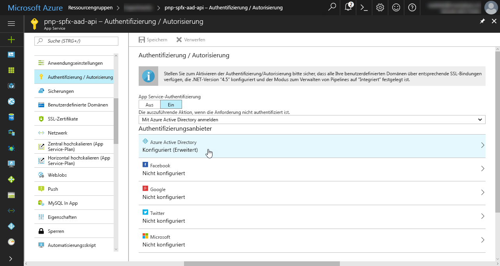

Nachdem die App Service-Authentifizierung konfiguriert wurde, werden Benutzer, die auf Ihre API zugreifen möchten, dazu aufgefordert, sich mit ihrem Unternehmenskonto anzumelden, das zu demselben Azure AD gehört wie die Azure AD-Anwendung, die zum Sichern der API verwendet wird. Nach der Anmeldung können Sie über die Eigenschaft `HttpContext.Current.User` auf die Informationen zum aktuellen Benutzer zugreifen. Bei der Verwendung der Azure App Service-Authentifizierung ist keine zusätzliche Konfiguration in Ihrer Anwendung erforderlich.

Azure App Service-Authentifizierung ist ein Feature, das nur im Azure App Service verfügbar ist. Diese Funktionalität vereinfacht die Implementierung der Authentifizierung in Ihrer API erheblich, bindet sie jedoch gleichzeitig an die Ausführung im Azure App Service. Wenn Sie die API mit einem anderen Cloudanbieter oder in einem Container-Docker hosten möchten, müssen Sie zuerst die Authentifizierungsebene implementieren.

### <a name="secure-the-api-using-aspnet-authentication"></a>Sichern einer API durch ASP.NET-Authentifizierung

Wenn Sie größtmögliche Flexibilität im Hinblick auf das Hosting und die Bereitstellung Ihre API wünschen, sollten Sie in Erwägung ziehen, den Support für Azure AD-Authentifizierung in ASP.NET zu implementiert. Visual Studio vereinfacht den Vorgang der Implementierung erheblich und nach Abschluss des Setup-Assistenten für die Authentifizierung fordert Ihre API Benutzer dazu auf, sich über ihr Unternehmenskonto anzumelden.


Während des Konfigurationsvorgangs fügt Visual Studio alle erforderlichen Verweise und Einstellungen dem ASP.NET-Web-API-Projekt hinzu, einschließlich der Registrierung einer neuen Azure AD-Anwendung zum Sichern Ihrer API.

## <a name="access-an-api-secured-with-azure-ad-from-sharepoint-framework-solutions"></a>Zugriff auf eine durch Azure AD gesicherte API über SharePoint-Framework-Lösungen

SharePoint-Framework-Lösungen sind vollständig clientseitig und daher nicht in der Lage, vertraulichen Daten sicher zu speichern, die zum Verbinden mit sicheren APIs erforderlich sind. Zur Unterstützung von sicherer Kommunikation mit clientseitigen Lösungen unterstützt Azure AD eine Reihe von Mechanismen wie Authentifizierungscookies oder den impliziten OAuth-Fluss.

### <a name="access-the-api-using-adal-js"></a>Zugreifen auf eine API mit ADAL JS

Ein häufig verwendeter Ansatz für die Kommunikation mit APIs, die über clientseitige Lösungen mit Azure AD gesichert sind, ist die Verwendung der [ADAL JS](https://github.com/AzureAD/azure-activedirectory-library-for-js)-Bibliothek. ADAL JS vereinfacht die Implementierung der Authentifizierung bei Azure AD in clientseitigen Anwendungen sowie das Abrufen von Zugriffstoken für bestimmte Ressourcen. Für Anwendungen, die basierend auf AngularJS erstellt werden, bietet ADAL JS einen Interceptor für HTTP-Anforderungen, der automatisch erforderliche Zugriffstoken zu Kopfzeilen von ausgehenden Webanforderungen hinzufügt. Mithilfe dieses Anforderers müssen Entwickler Webanforderungen an mit Azure AD gesicherte APIs nicht ändern und können sich stattdessen auf das Erstellen der Anwendung konzentrieren.

#### <a name="benefits-of-using-adal-js-to-communicate-with-apis-secured-with-azure-ad"></a>Vorteile der Verwendung von ADAL JS zur Kommunikation mit Azure AD-gesicherten APIs

Wenn Sie ADAL JS verwenden, haben clientseitige Anwendungen vollständigen Zugriff auf die Identitätsinformationen des derzeit angemeldeten Benutzers. Dies ist praktisch für Anforderungen wie das Anzeigen des Benutzernamens oder des Profilfotos in der Anwendung. Beim Erstellen von Lösungen, die in SharePoint gehostet werden, können Entwickler erweiterte Profilinformationen mithilfe der SharePoint-API abrufen, aber für eigenständige Anwendungen ist dies nicht möglich.

Neben einer leichteren Authentifizierung bei Azure Active Directory kann ADAL JS auch Zugriffstoken für bestimmte Ressourcen abrufen. Mit diesen Zugriffstoken können Anwendungen sicher auf Azure AD-gesicherte APIs zugreifen, zum Beispiel [Microsoft Graph](./call-microsoft-graph-from-your-web-part.md) oder andere benutzerdefinierte APIs. Bevor eine clientseitige Anwendung ADAL JS verwenden kann, muss sie zunächst als Anwendung in Azure AD registriert werden. Bei der Registrierung geben Entwickler eine Reihe von Parametern an, wie die URL, unter der die Anwendung gehostet wird, und die Ressourcen, auf die die Anwendung zugreifen muss (entweder eigenständig oder im Namen des derzeit angemeldeten Benutzers).

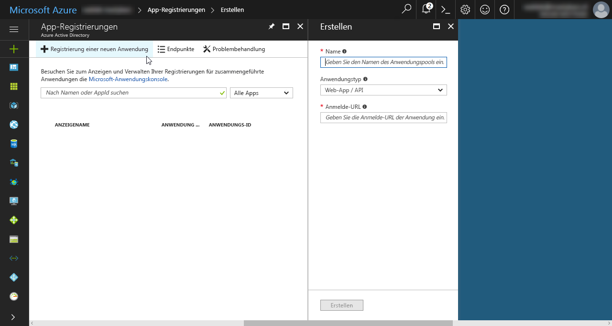

Bei der ersten Ausführung der Anwendung wird der Benutzer dazu aufgefordert, die erforderlichen Berechtigungen zu erteilen. Dies wird häufig als Zustimmungsfluss bezeichnet. Nach der Genehmigung kann die Anwendung Zugriffstoken für bestimmte Ressourcen anfordern und sicher mit ihnen kommunizieren.

#### <a name="considerations-when-using-adal-js-to-communicate-with-apis-secured-with-azure-ad"></a>Überlegungen bei der Verwendung von ADAL JS zur Kommunikation mit Azure AD-gesicherten APIs

ADAL JS ist für die Verwendung von Einzelseitenanwendungen ausgelegt. Daher funktioniert es standardmäßig bei der Verwendung mit SharePoint-Framework-Lösungen nicht richtig. Durch das [Anwenden eines Patches](./call-microsoft-graph-from-your-web-part.md) können Sie es jedoch erfolgreich in SharePoint-Framework-Projekten verwenden.

Bei der Verwendung von ADAL JS und OAuth für den Zugriff auf Azure AD-gesicherte APIs wird der Authentifizierungsfluss durch Azure erleichtert. Alle Fehler werden von der Azure-Anmeldeseite verarbeitet. Nachdem der Benutzer sich mit seinem Unternehmenskonto angemeldet hat, versucht die Anwendung, ein gültiges Zugriffstoken abzurufen. Alle Fehler, die zu diesem Zeitpunkt auftreten, müssen explizit vom Entwickler der Anwendung behoben werden, da das Abrufen von Zugriffstoken ein nicht interaktiver Vorgang ist, bei dem dem Benutzer keine Benutzeroberfläche angezeigt wird.

Jede clientseitige Anwendung, die ADAL JS verwenden möchte, muss als Azure AD-Anwendung registriert werden. Ein Teil der Registrierungsinformationen ist die URL, unter der sich die Anwendung befindet. Da die Anwendung vollständig clientseitig ist und nicht in der Lage ist, vertrauliche Daten sicher zu speichern, ist die URL zur Gewährleistung von Sicherheit Teil des Vertrags zwischen der Anwendung und Azure AD. Diese Anforderung ist problematisch für SharePoint-Framework-Lösungen, da Entwickler nicht im Vorhinein alle URLs kennen, in denen ein bestimmtes Webpart verwendet wird. Darüber hinaus unterstützt Azure AD zu diesem Zeitpunkt die Angabe von bis zu 10 Antwort-URLs, was in einigen Szenarien eventuell nicht ausreichend sein könnte.

Bevor eine clientseitige Anwendung ein Zugriffstoken für eine bestimmte Ressource abrufen kann, muss sie den Benutzer authentifizieren, um das ID-Token abzurufen, das dann durch das Zugriffstoken ausgetauscht werden kann. Obwohl SharePoint-Framework-Lösungen in SharePoint gehostet werden, wo Benutzer bereits mit ihrem Organisationskonto angemeldet sind, stehen die Authentifizierungsinformationen für den aktuellen Benutzer für SharePoint-Framework-Lösungen nicht zur Verfügung. Stattdessen muss jede Lösung den Benutzer explizit auffordern, sich anzumelden. Dies kann entweder durch Umleiten des Benutzers auf die Azure-Anmeldeseite oder durch Anzeigen eines Popupfensters mit der Anmeldeseite erfolgen. Letzteres erfordert weniger Eingriff im Fall eines Webparts (eines der vielen Elemente auf einer Seite). Wenn auf der Seite mehrere clientseitige SharePoint-Frameworks-Webparts vorhanden sind, verwaltet jedes seinen Status separat und fordert den Benutzer explizit zum Anmelden bei diesem bestimmten Webpart auf.

Durch ausgeblendete Iframes, die für die Umleitung zu Azure AD-Endpunkten sorgen, wird das Abrufen von Zugriffstoken vereinfacht, die für die Kommunikation mit Azure AD-gesicherten APIs erforderlich sind. Es gibt eine bekannte Einschränkung in Microsoft Internet Explorer, bei der das Abrufen von Zugriffstoken im impliziten OAuth-Fluss fehlschlägt, wenn die Azure AD-Anmeldeendpunkte und die SharePoint Online-URL sich nicht in derselben Sicherheitszone befinden. Wenn Ihre Organisation Internet Explorer verwendet, stellen Sie sicher, dass der Azure AD-Endpunkt und die SharePoint Online-URLs in derselben Sicherheitszone konfiguriert sind. Einige Organisationen entscheiden sich aus Konsistenzgründen dafür, diese Einstellungen an Endbenutzer weiterzugeben, die Gruppenrichtlinien verwenden.

Auf mit Azure AD gesicherte APIs kann nicht anonym zugegriffen werden. Stattdessen muss die Anwendung, die sie aufruft, gültige Anmeldeinformationen vorweisen können. Wenn Sie den impliziten OAuth-Fluss mit clientseitigen Anwendungen verwenden, sind diese Anmeldeinformationen das Trägerzugriffstoken, das mithilfe von ADAL JS abgerufen wurde. Haben Sie Ihre SharePoint-Framework-Lösung mithilfe von AngularJS erstellt, stellt JS ADAL automatisch sicher, dass Sie über ein gültiges Zugriffstoken für die bestimmte Ressource verfügen, und fügt dieses allen ausgehenden Anfragen zu, die mithilfe des AngularJS `$http`-Diensts ausgeführt werden. Wenn Sie andere JavaScript-Bibliotheken verwenden, müssen Sie ein gültiges Zugriffstoken abzurufen und es, falls erforderlich, aktualisieren. Anschließend müssen Sie es eigenständig an die ausgehende Webanfrage anfügen.

### <a name="access-the-api-by-leveraging-sharepoint-online-authentication-cookie"></a>Zugreifen auf eine API mit einem SharePoint Online-Authentifizierungscookie

Eine alternative Möglichkeit zur Verwendung von ADAL JS zum Herstellen einer Verbindung mit Azure AD-gesicherten APIs ist die Nutzung eines vorhandenen Authentifizierungscookies für die nahtlose Authentifizierung bei der benutzerdefinierten API.

#### <a name="how-it-works"></a>Funktionsweise

Wenn Sie sich mit Ihrem Organisationskonto bei SharePoint Online anmelden, wird ein Authentifizierungscookie in Ihrem Browser festgelegt. Dieses Cookie wird bei jeder Anforderung an SharePoint gesendet, sodass Websites und Dokumenten bearbeitet werden können. Um mit diesem Cookie eine Verbindung zu einer benutzerdefinierten API herzustellen, die mit Azure AD gesichert ist, platzieren Sie einen ausgeblendeten Iframe auf der Seite, der auf eine URL verweist, unter der die API gehostet wird und die ebenfalls mit Azure AD gesichert ist. Nachdem der Browser versucht, diese URL zu laden, wird er zur der Azure AD-Anmeldeseite umgeleitet, da anonymer Zugriff nicht zulässig ist. Da Sie sich bereits mit Ihrem Organisationskonto für den Zugriff auf SharePoint angemeldet haben, wird die Authentifizierung automatisch abgeschlossen und Sie werden zurück zur ursprünglichen URL weitergeleitet. An diesem Punkt verfügt Ihr Browser über das Azure AD-Authentifizierungscookie für den Zugriff auf die benutzerdefinierte, mit Azure AD gesicherte API.

Nachdem Sie den IFrame auf der Seite platziert haben, fügen Sie einen `onload`-Ereignislistener daran an, der ausgelöst wird, wenn der Authentifizierungsfluss abgeschlossen ist. In diesem Ereignislistener legen Sie eine Kennzeichnung fest, die angibt, dass die Authentifizierung abgeschlossen ist. Sie können nun die benutzerdefinierte API sicher aufrufen. Alle Webanforderungen an die benutzerdefinierten APIs sollten verzögert werden, bis diese Kennzeichnung festgelegt ist, da sie sonst fehlschlagen.

```typescript
// ...

export default class LatestOrdersWebPart extends BaseClientSideWebPart<ILatestOrdersWebPartProps> {
  private remotePartyLoaded: boolean = false;
  private orders: IOrder[];

  public render(): void {
    this.domElement.innerHTML = `
    <div class="${styles.latestOrders}">
      <iframe src="https://contoso.azurewebsites.net/"
          style="display:none;"></iframe>
      <div class="ms-font-xxl">Recent orders</div>
      <div class="loading"></div>
      <table class="data" style="display:none;">
        <thead>
          <tr>
            <th>ID</th>
            <th>Date</th>
            <th>Region</th>
            <th>Rep</th>
            <th>Item</th>
            <th>Units</th>
            <th>Unit cost</th>
            <th>Total</th>
          </tr>
        </thead>
        <tbody>
        </tbody>
      </table>
    </div>`;

    this.context.statusRenderer.displayLoadingIndicator(
      this.domElement.querySelector(".loading"), "orders");

    this.domElement.querySelector("iframe").addEventListener("load", (): void => {
      this.remotePartyLoaded = true;
    });

    this.executeOrDelayUntilRemotePartyLoaded((): void => {
      // retrieve and render data
    });
  }

  private executeOrDelayUntilRemotePartyLoaded(func: Function): void {
    if (this.remotePartyLoaded) {
      func();
    } else {
      setTimeout((): void => { this.executeOrDelayUntilRemotePartyLoaded(func); }, 100);
    }
  }

  // ...
}
```

Beim Ausführen von AJAX-Anforderungen in Ihren Webparts müssen Sie festlegen, dass das Authentifizierungscookie domänenübergreifend gesendet werden soll. Sie können dies aktivieren, indem Sie die Eigenschaft **credentials** der Webanforderung auf **include** festlegen. Wenn Sie dies nicht tun, wird die Anforderung im Browser blockiert, und Sie können die API aufrufen.

```typescript
// ...

export default class LatestOrdersWebPart extends BaseClientSideWebPart<ILatestOrdersWebPartProps> {
    // ...

    private retrieveAndRenderData(): void {
        this.context.httpClient.get("https://contoso.azurewebsites.net/api/orders",
        HttpClient.configurations.v1, {
          credentials: "include"
        })
        .then((response: HttpClientResponse): Promise<IOrder[]> => {
          // ...
        });
    }

    // ...
}
```

Zur Unterstützung dieser Methode erfordert die benutzerdefinierte API ebenfalls eine spezifische Konfiguration. Zunächst benötigt sie Unterstützung für den Empfang von Anmeldeinformationen von domänenübergreifenden Aufrufen. Dies erfolgt durch Festlegen des Antwortheader **Access-Control-Allow-Credentials** auf **true**.

> [!IMPORTANT] 
> Bei der Verwendung von **Access-Control-Allow-Credentials** dürfen Sie nur einen Ursprung angeben.

Als Nächstes muss angegeben werden, welcher Ursprung zulässig ist, um die API aufzurufen. Dies wird im Antwortheader **Access-Control-Allow-Origin** konfiguriert.

Wie diese Header genau konfiguriert werden sollten, hängt von der Implementierung Ihrer API ab. Wenn Sie eine Azure Functions verwenden, um die API beispielsweise mit Node.js zu erstellen, würden Sie diese Header für das Antwortobjekt festlegen:

```js
context.res = {
    body: "response",
    headers: {
        "Access-Control-Allow-Credentials" : "true",
        "Access-Control-Allow-Origin" : "https://contoso.sharepoint.com"
    }
};
```

Bei Verwendung der ASP.NET-Web-API installieren Sie das NuGet-Paket **Microsoft.AspNet.WebApi.Cors**, rufen die Methode `config.EnableCors()` auf und verwenden das Attribut **EnableCors**, um die Headerwerte festzulegen:

```cs
[EnableCors("origins": "*", "headers": "*", "methods": "*", SupportsCredentials = true)]
public string Get() {
    return "response";
}
```

#### <a name="benefits-of-using-the-sharepoint-online-authentication-cookie-for-seamless-authentication"></a>Vorteile der Verwendung von SharePoint Online-Authentifizierungscookies zur nahtlosen Authentifizierung

Der wichtigste Vorteil bei der Verwendung des SharePoint Online-Authentifizierungscookies zum Herstellen einer Verbindung mit benutzerdefinierten APIs, die mit Azure AD gesichert sind, besteht darin, dass Sie bei diesem Ansatz keine Azure AD-Anwendung für jedes Webpart registrieren müssen. Dies erspart Ihnen das Verwalten von Antwort-URLs von Seiten, auf denen jedes Webpart verwendet wird, und Sie unterliegen nicht der Einschränkung von maximal 10 Antwort-URLs pro Azure AD-Anwendung.

Der Authentifizierungsfluss wird problemlos verarbeitet, und es ist keine Benutzerinteraktion erforderlich, um den Vorgang abzuschließen. Im Vergleich dazu basiert bei der Verwendung von ADAL JS jedes Webpart auf einer anderen Azure AD-Anwendung und der Benutzer muss sich explizit bei dieser anmelden.

#### <a name="considerations-when-using-the-sharepoint-online-authentication-cookie-for-seamless-authentication"></a>Überlegungen bei der Verwendung von SharePoint Online-Authentifizierungscookies zur nahtlosen Authentifizierung

Aus funktionaler Sicht können Sie sowohl mit ADAL JS als auch mit SharePoint Online-Authentifizierungscookies eine Verbindung zu mit Azure AD gesicherten APIs herstellen. Es gibt jedoch einige wichtige Unterschiede zwischen den beiden Ansätzen, die Ihnen bewusst sein sollten.

Wenn Sie ADAL JS verwenden, ruft die clientseitige Anwendung das Identitätstoken für den aktuellen Benutzer ab, bevor sie das Zugriffstoken abruft. Dieses Token enthält Informationen zum aktuellen Benutzer, die aus Azure AD abgerufen werden, z. B. Benutzername oder Kennwort. Wenn Sie das Authentifizierungscookie verwenden, gibt es kein Identitätstoken. Da Sie mit SharePoint arbeiten, ist dies nicht wirklich eine Einschränkung, da Sie dieselben Informationen über den aktuellen Benutzer von SharePoint abrufen können.

Mit ADAL JS können Sie eine Verbindung zu jeder beliebigen, mit Azure AD gesicherten API herstellen. Wenn Sie das Authentifizierungscookie verwenden, muss die API explizit das Empfangen von Anmeldeinformationen aus domänenübergreifenden Aufrufen unterstützen. Beim Entwerfen von APIs sollten Sie diese Anforderung berücksichtigen, um sicherzustellen, dass Sie diese APIs in SharePoint-Framework-Lösungen verwenden können.

Mit ADAL JS und dem SharePoint Online-Authentifizierungscookie können Sie auf mit Azure AD gesicherte APIs zugreifen. Aber nicht alle APIs unterstützen die Verwendung beider Methoden. Für den Zugriff auf Microsoft Graph müssen Sie z. B. ein gültiges OAuth-Zugriffstoken mit speziellen Microsoft Graph-Berechtigungen haben. Sie können dieses Token mithilfe von ADAL JS, aber nicht mithilfe eines SharePoint Online-Authentifizierungscookies abrufen.

Wenn Sie das SharePoint Online-Authentifizierungscookie verwenden, um auf mit Azure AD gesicherte APIs zuzugreifen, werden keine zusätzlichen Autorisierungsinformationen zusammen mit der Anforderung gesendet. Dies bedeutet, dass standardmäßig jeder Benutzer mit einem gültigen Organisationskonto in Azure AD, das mit der API verknüpft ist, auf die API zugreifen kann. Wenn Sie die API erstellen, müssen Sie sich um die Autorisierung kümmern, um sicherzustellen, dass alle API-Operationen von Benutzern mit ausreichenden Berechtigungen ausgeführt werden.

Benutzerdefinierte APIs werden außerhalb von SharePoint Online gehostet und Sie können mithilfe von domänenübergreifenden Webanforderungen auf sie zugreifen. Standardmäßig enthalten Webbrowser keine Anmeldeinformationen, wenn domänenübergreifende AJAX-Anforderungen ausgeführt werden. Zum Verbinden mit diesen gesicherten APIs müssen Sie das domänenübergreifende Senden von Anmeldeinformationen explizit für jede ausgehende Webanforderung aktivieren.

### <a name="general-considerations"></a>Allgemeine Überlegungen

Sowohl bei ADAL JS als auch bei der Methode, bei der das SharePoint Online-Authentifizierungscookie zum Einsatz kommt, werden Iframes für die Kommunikation mit Azure AD verwendet. Der Grund dafür sind die Umleitungen, die Bestandteil des OAuth-Flusses sind und die nicht automatisch von AJAX-Anforderungen gefolgt werden können. Microsoft Internet Explorer verwendet Sicherheitszonen, um je nach zugeordneter Zone Sicherheitsrichtlinien auf Websites anzuwenden. Damit die Skripte auf Informationen aus einem Iframe zugreifen können, müssen die Ressource im Iframe und die Seite, auf der das Iframe gehostet wird, sich in der gleichen Sicherheitszone befinden. Um eine richtige Konfiguration sicherzustellen, können Organisationen Gruppenrichtlinien verwenden, um die Einstellungen konsistent für ihre Benutzer zu verteilen.

## <a name="build-an-api-secured-with-azure-ad"></a>Erstellen einer durch Azure AD gesicherten API

Das Sichern des Zugriffs auf eine mit Azure AD gesicherte API ist nicht komplex und erfordert nur einige wenige Schritte. Der genaue Vorgang variiert in Abhängigkeit von der Implementierung Ihrer API. Wenn Sie Azure Functions verwenden, können Sie die Sicherheit über das Azure-Portal konfigurieren. Wenn Sie Ihre API mithilfe der ASP.NET-Web-API erstellen und Sie sie an einem anderen Ort als dem Azure App Service hosten möchten, müssen Sie den Code der Web-API erweitern, um Authentifizierung hinzuzufügen. Es folgt eine schrittweise Beschreibung der Erstellung und Konfiguration einer mit Azure AD gesicherten API mithilfe von Azure Functions und der ASP.NET-Web-API.

### <a name="build-the-api-using-an-azure-function"></a>Erstellen einer API mit einer Azure-Funktion

Das Erstellen von APIs mithilfe von Azure Functions-Angeboten bietet Ihnen eine Reihe von Vorteilen. Vor allem vereinfacht es erheblich den Vorgang der Entwicklung und Bereitstellung der API. Azure Functions bietet umfassende Konfigurationsoptionen. Das einzige, worum Sie sich kümmern müssen, ist der tatsächliche API-Code. Für alles andere, von der Authentifizierung bis hin zur Unterstützung von Cross-Origin Resource Sharing (CORS) und zur Dokumentierung der AP, können Sie das Azure-Portal verwenden.

Azure Functions wird im Azure App Service gehostet und nutzt viele Funktionen des zugrunde liegenden Diensts. Neben der Sicherung der API mit einem Funktions- oder Administratorschlüssel können Sie wahlweise Azure App Service-Sicherheit aktivieren und Ihre API mit Azure AD oder mit einem der anderen verfügbaren Authentifizierungsanbieter sichern. App Service-Authentifizierung kann über das Azure-Portal konfiguriert werden und es müssen dafür keine Änderungen am API-Code vorgenommen werden.

Nachfolgend wird erläutert, wie Sie Azure Functions zum Erstellen einer API verwenden, die durch Azure AD gesichert ist und die von einem domänenübergreifenden Ursprung auf sichere Weise aufgerufen werden kann.

#### <a name="create-a-new-azure-function"></a>Erstellen einer neuen Azure-Funktion

1. Wechseln Sie im Azure-Portal zu Ihrer Ressourcengruppe, und fügen Sie eine Funktionen-App hinzu.

    

2. Öffnen Sie, nachdem die Funktionen-App bereitgestellt wurde, die neu erstellte Funktionen-App, und fügen Sie eine neue Funktion hinzu, indem Sie das Pluszeichen neben der Beschriftung „Funktionen“ auswählen.

    

3. Scrollen Sie im Schnellstartbildschirm zum Abschnitt **Selbständig einsteigen**, und wählen Sie die Option **Benutzerdefinierte Funktion**.

    

4. Wählen Sie aus der Liste der Vorlagen **HttpTrigger-JavaScript** aus. 

5. Geben Sie für den Funktionsnamen **Aufträge** ein, und legen Sie die Funktionsautorisierungsebene auf **Anonym** fest, da Sie Azure AD zum Sichern des Zugriffs auf die Azure-Funktion verwenden möchten. Bestätigen Sie Ihre Auswahl, indem Sie **Erstellen** auswählen.

    

#### <a name="implement-api-code"></a>Implementieren des API-Codes

1. Ersetzen den Code der Funktion durch den folgenden Codeausschnitt:

    ```js
    module.exports = function (context, req) {
        context.res = {
            body: [
                {
                id: 1,
                orderDate: new Date(2016, 0, 6),
                region: "east",
                rep: "Jones",
                item: "Pencil",
                units: 95,
                unitCost: 1.99,
                total: 189.05
                },
                {
                id: 2,
                orderDate: new Date(2016, 0, 23),
                region: "central",
                rep: "Kivell",
                item: "Binder",
                units: 50,
                unitCost: 19.99,
                total: 999.50
                },
                {
                id: 3,
                orderDate: new Date(2016, 1, 9),
                region: "central",
                rep: "Jardine",
                item: "Pencil",
                units: 36,
                unitCost: 4.99,
                total: 179.64
                },
                {
                id: 4,
                orderDate: new Date(2016, 1, 26),
                region: "central",
                rep: "Gill",
                item: "Pen",
                units: 27,
                unitCost: 19.99,
                total: 539.73
                },
                {
                id: 5,
                orderDate: new Date(2016, 2, 15),
                region: "west",
                rep: "Sorvino",
                item: "Pencil",
                units: 56,
                unitCost: 2.99,
                total: 167.44
                }],
            headers: {
                "Access-Control-Allow-Credentials" : "true",
                "Access-Control-Allow-Origin" : "https://contoso.sharepoint.com"
            }
        };
        context.done();
    };
    ```

2. Ändern Sie die im Header **Access-Control-Allow-Origin** angegebene URL so, dass sie mit der URL des SharePoint Online-Mandanten übereinstimmt, von dem aus Sie diese API aufrufen.

3. Speichern Sie die Änderungen im Code der Funktion, indem Sie **Speichern** auswählen.

    

#### <a name="change-cors-settings"></a>Ändern der CORS-Einstellungen

Azure Functions wird im Azure App Service gehostet, sodass Sie die Cross-Origin Resource Sharing (CORS)-Einstellungen über das Azure-Portal konfigurieren können. Dies ist zwar bequem, aber wenn die Einstellungen über das Portal konfiguriert werden, können sie nicht in Kombination mit dem Header **Access-Control-Allow-Credentials** verwendet werden, der für die API zum Akzeptieren von Authentifizierungscookies aus einem anderen Ursprung erforderlich ist. Damit die clientseitige Authentifizierung ordnungsgemäß funktioniert, müssen die CORS-Einstellungen des Azure App Service gelöscht werden.

1. Wählen Sie in der Funktionen-App Ihre Azure-Funktion aus, und wechseln Sie zum Blatt **Plattformfeatures**.

    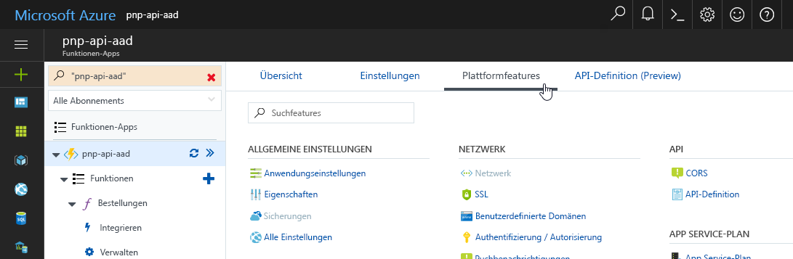

2. Wählen Sie im Abschnitt **API** die Option **CORS**.

    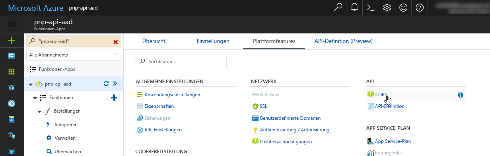

3. Löschen Sie auf dem Blatt mit den **CORS-Einstellungen** alle Einträge, sodass die CORS-Konfiguration leer ist.

    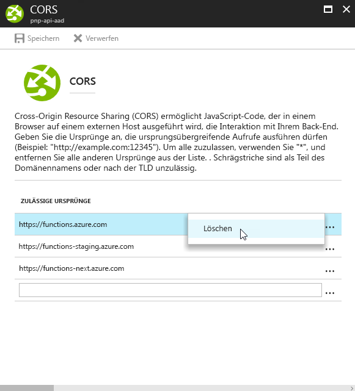

4. Bestätigen Sie den Löschvorgang, indem Sie **Speichern** auswählen.

    

#### <a name="enable-app-service-authentication"></a>Aktivieren der App Service-Authentifizierung

1. Kehren Sie in den Einstellungen der Funktionen-App zurück zum Blatt **Plattformfeatures**. 

2. Wählen Sie im Bereich **Netzwerk** die Option **Authentifizierung/Autorisierung** aus.

    

3. Aktivieren Sie die App Service-Authentifizierung, indem Sie die Option **App Service-Authentifizierung** auf **Ein** stellen.

    

4. Um den anonymen Zugriff auf die API zu verhindern und die Authentifizierung mithilfe von Azure AD zu erzwingen, legen Sie in der Liste **Die auszuführende Aktion, wenn die Anforderung nicht authentifiziert ist** den Wert auf **Mit Azure Active Directory anmelden** fest.

    

5. Wählen Sie in der Liste der Authentifizierungsanbieter **Azure Active Directory** aus, um es zu konfigurieren.

    

6. Stellen Sie auf dem Blatt **Active Directory-Authentifizierung** den **Verwaltungsmodus** auf **Express** ein, und erstellen Sie eine neue Azure AD-App.

    > [!IMPORTANT] 
    > Wenn Sie den Konfigurationsmodus Express verwenden, erstellt das Azure-Portal eine neue Azure AD-Anwendung im gleichen Verzeichnis, in dem sich auch die Funktionen-App befindet. Wenn die Funktionen-App in einem anderen Azure-Abonnement mit einem anderen Verzeichnis gehostet wird, sollten Sie stattdessen den erweiterten Modus verwenden und die ID des Verzeichnisses und der Anwendung angeben, die zum Sichern des Zugriffs auf die API verwendet werden soll.
    >
    > Wenn Sie vorhandene Azure AD-Anwendungen verwenden, konfigurieren Sie die Anwendung so, dass nur Anmeldeinformationen von einem einzigen Mandanten akzeptiert werden. Durch das Konfigurieren der Anwendung für mehrere Mandanten können Benutzer mit einem gültigen Organisations- oder persönlichen Konto eine Verbindung mit Ihrer API herstellen.
    >
    > Die Verwendung einer Azure AD-Anwendung für das Sichern des Zugriffs auf Ihre API bezieht sich nur auf die Authentifizierung. Beim Erstellen Ihrer API müssen Sie auch Anforderungen im Code der API autorisieren, um sicherzustellen, dass nur Benutzer mit entsprechenden Berechtigungen die API verwenden.

7. Da die App nur zum Sichern des Zugriffs auf die Azure-Funktion vorgesehen ist, sind keine zusätzlichen Berechtigungen erforderlich.  Bestätigen Sie die Auswahl, indem Sie **OK** auswählen.

    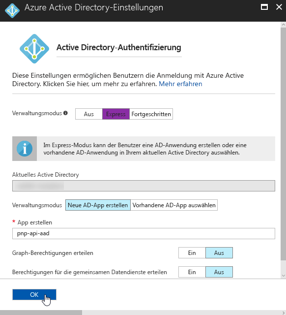

8. Wenn das Blatt **Azure Active Directory** geschlossen wird, wählen Sie auf dem Blatt **Authentifizierung/Autorisierung** **Speichern** aus, um alle Änderungen an den Authentifizierungseinstellungen zu bestätigen.

    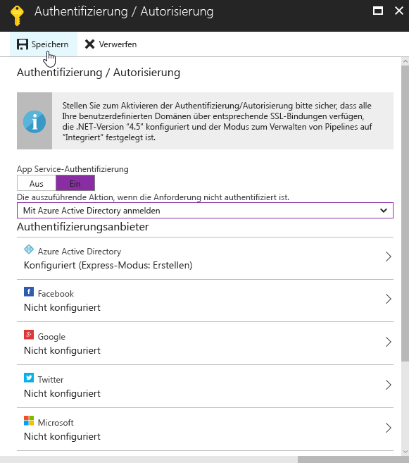

9. Wenn Sie versuchen, in einem neuen privaten Fenster zur API-URL zu navigieren, sollten Sie aufgefordert werden, sich mit Ihrem Azure AD-Konto anzumelden.

    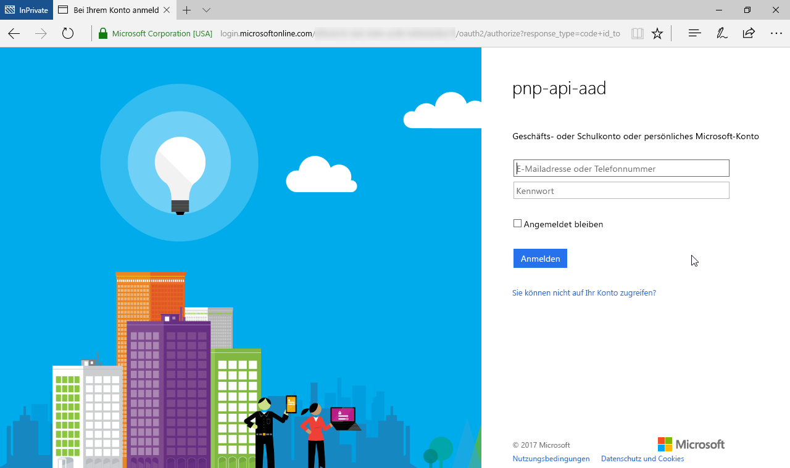

Zu diesem Zeitpunkt ist die API bereit, mit dem Authentifizierungscookie sicher von einem clientseitigen SharePoint-Framework-Webpart aufgerufen zu werden.

### <a name="build-the-api-by-using-aspnet-web-api"></a>Erstellen der API mit der ASP.NET-Web-API

Eine weitere Möglichkeit zum Implementieren der API ist die ASP.NET-Web-API. Im Vergleich zur Nutzung von Azure Functions zum Erstellen der API erfordert die ASP.NET-Web-API wesentlich mehr Arbeit. Sie müssen nicht nur ein vollständiges Projekt dafür einrichten, sondern Sie müssen sich auch überlegen, wo die API bereitgestellt werden soll. Andererseits bietet die ASP.NET-Web-API mehr Flexibilität und ermöglicht es Ihnen, die API auf verschiedenen Plattformen wie z. B. dem Azure App Service, Docker-Containern, anderen Cloudanbieter oder sogar in Ihrer Infrastruktur bereitzustellen.

Im Folgenden finden Sie die Schritte zum Erstellen einer API mit der ASP.NET-Web-API, zum Bereitstellen der API im Azure App Service und zum Sichern der API mithilfe von Azure App Service-Authentifizierung. Später erweitern Sie die API so, dass sie die Authentifizierung eigenständig durchführen kann, damit sie auf anderen Plattformen bereitgestellt werden kann.

#### <a name="create-a-new-aspnet-web-api-project"></a>Erstellen eines neuen ASP.NET-Web-API-Projekts

1. Wählen Sie in Visual Studio im Menü **Datei** die Option **Neues Projekt** aus. 

2.  Wählen Sie im Dialogfeld **Neues Projekt** Visual C#-Webvorlagen, und wählen Sie aus der Liste der verfügbaren Vorlagen die Vorlage **ASP.NET-Webanwendung**.

    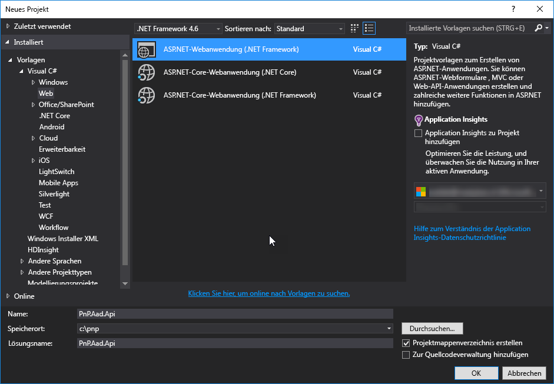

3. Wählen Sie als Typ des ASP.NET-Webanwendungsprojekts die Option **Web-API**.

    

4. Da Sie die Azure App Service-Authentifizierung zum Sichern des Zugriffs auf die API verwenden möchten, wählen Sie die Schaltfläche **Authentifizierung ändern** und anschließend die Option **Keine Authentifizierung** aus.

    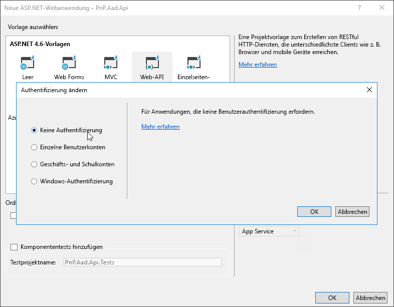

5. Bestätigen Sie Ihre Auswahl, indem Sie **OK** auswählen.

6. Mit Visual Studio können Sie Ihre Web-API ganz einfach für den Azure App Service bereitstellen. Um diese Funktion zu nutzen, wählen Sie im Abschnitt **Microsoft Azure** das Dialogfeld **ASP.NET-Webanwendung** aus, aktivieren Sie das Kontrollkästchen **In der Cloud hosten**, und wählen Sie in der Liste die Option **App Service** aus.

    

7. Geben Sie im Dialogfeld **App Service erstellen** den Namen für die Web-App an, die erstellt werden soll, und wählen Sie das **Azure-Abonnement**, die **Ressourcengruppe** und den **App Service-Plan**, den Sie für diese Anwendung verwenden möchten.

    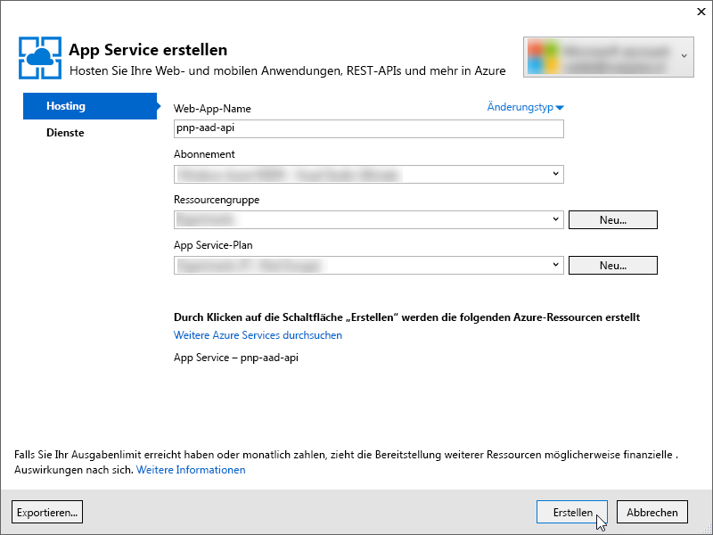

8. Bestätigen Sie Ihre Auswahl, indem Sie **Erstellen** auswählen. Zu diesem Punkt erstellt Visual Studio eine neue Azure-Web-App zum Hosten Ihrer Webanwendung.

#### <a name="add-support-for-cors"></a>Hinzufügen der Unterstützung für CORS

Standardmäßig bieten mit der Projektvorlage ASP.NET-Webanwendung erstellte APIs keine Unterstützung für CORS und können nicht von den Clientanwendungen aufgerufen werden, die auf unterschiedlichen Domänen gehostete werden. 

1. Um Ihrer Web-API Unterstützung für CORS hinzuzufügen, klicken Sie mit der rechten Maustaste auf das Projekt, und wählen Sie im Kontextmenü die Option **NuGet-Pakete verwalten** aus.

    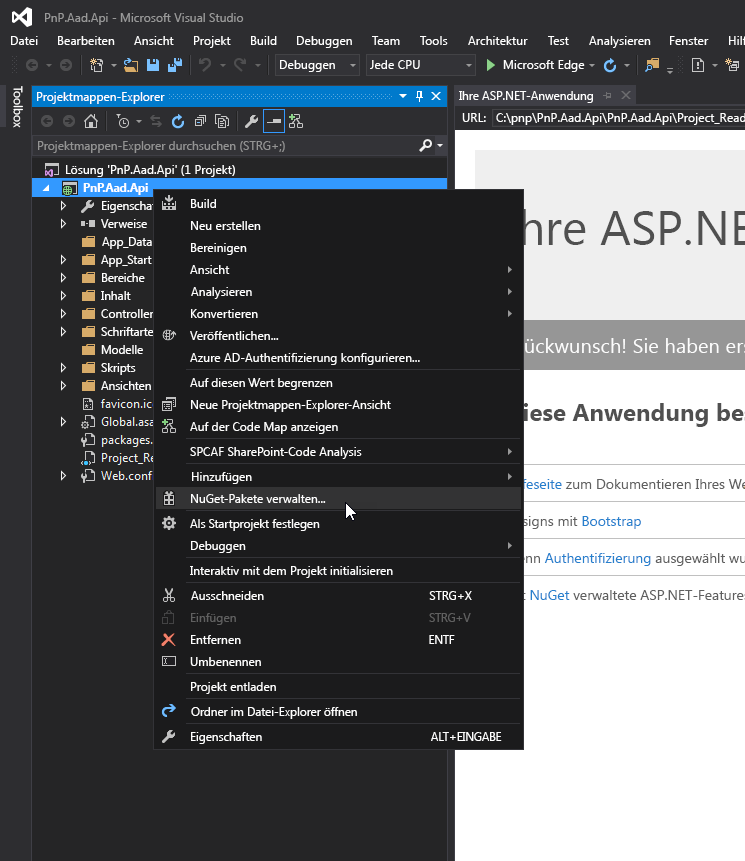

2. Suchen Sie auf der Registerkarte **NuGet-Pakete verwalten** nach einem Paket mit dem Namen **Microsoft.AspNet.WebApi.Cors**, und installieren Sie es in Ihrem Projekt.

    


#### <a name="add-data-model"></a>Hinzufügen eines Datenmodells

Definieren Sie im Projekt ein Modell, das die von der API zurückgegebenen Daten darstellt. Fügen Sie im Ordner **Modelle** eine neue Klasse hinzu, und nennen Sie sie **Auftrag**. Fügen Sie den folgenden Code in die neu erstellte Datei ein.

```cs
    using Newtonsoft.Json;
    using Newtonsoft.Json.Converters;
    using System;

    namespace PnP.Aad.Api.Models {
        public class Order {
            [JsonProperty(PropertyName = "id")]
            public int Id { get; set; }
            [JsonProperty(PropertyName = "orderDate")]
            public DateTime OrderDate { get; set; }
            [JsonConverter(typeof(StringEnumConverter))]
            [JsonProperty(PropertyName = "region")]
            public Region Region { get; set; }
            [JsonProperty(PropertyName = "rep")]
            public string Rep { get; set; }
            [JsonProperty(PropertyName = "item")]
            public string Item { get; set; }
            [JsonProperty(PropertyName = "units")]
            public uint Units { get; set; }
            [JsonProperty(PropertyName = "unitCost")]
            public double UnitCost { get; set; }
            [JsonProperty(PropertyName = "total")]
            public double Total { get; set; }
        }

        public enum Region {
            East,
            Central,
            West
        }
    }
```

#### <a name="add-orders-api"></a>Hinzufügen der Auftrags-API

Fügen Sie eine API hinzu, die die Informationen zu den neuesten Aufträgen zurückgibt. Erstellen Sie im Ordner **Controller** eine neue Klasse, und nennen Sie sie **OrdersController**. Fügen Sie den folgenden Code in die neu erstellte Datei ein.

```cs
using PnP.Aad.Api.Models;
using System;
using System.Collections.Generic;
using System.Web.Http;

namespace PnP.Aad.Api.Controllers {
    public class OrdersController : ApiController {
        private List<Order> orders = new List<Order> {
            new Order {
                Id = 1,
                OrderDate = new DateTime(2016, 1, 6),
                Region = Region.East,
                Rep = "Jones",
                Item = "Pencil",
                Units = 95,
                UnitCost = 1.99,
                Total = 189.05
            },
            new Order {
                Id = 2,
                OrderDate = new DateTime(2016, 1, 23),
                Region = Region.Central,
                Rep = "Kivell",
                Item = "Binder",
                Units = 50,
                UnitCost = 19.99,
                Total = 999.50
            },
            new Order {
                Id = 3,
                OrderDate = new DateTime(2016, 2, 9),
                Region = Region.Central,
                Rep = "Jardine",
                Item = "Pencil",
                Units = 36,
                UnitCost = 4.99,
                Total = 179.64
            },
            new Order {
                Id = 4,
                OrderDate = new DateTime(2016, 2, 26),
                Region = Region.Central,
                Rep = "Gill",
                Item = "Pen",
                Units = 27,
                UnitCost = 19.99,
                Total = 539.73
            },
            new Order {
                Id = 5,
                OrderDate = new DateTime(2016, 3, 15),
                Region = Region.West,
                Rep = "Sorvino",
                Item = "Pencil",
                Units = 56,
                UnitCost = 2.99,
                Total = 167.44
            }
        };

        public IEnumerable<Order> Get() {
            return orders;
        }
    }
}
```

#### <a name="extend-the-api-with-support-for-cors"></a>Erweitern der API zur Unterstützung von CORS

Auch wenn Sie in Ihrem Projekt Unterstützung für CORS installiert haben, wird die Option noch nicht aktiv verwendet. Wenn Sie von einer Clientanwendung in einer anderen Domäne die neu erstellte „Aufträge“-API aufrufen, erhalten Sie einen CORS-Fehler und die Anforderung schlägt fehl. 

1. Damit eine API CORS unterstützt, muss sie durch das Attribut **EnableCors** ergänzt werden.

    ```cs
    using PnP.Aad.Api.Models;
    using System;
    using System.Collections.Generic;
    using System.Web.Http;
    using System.Web.Http.Cors;

    namespace PnP.Aad.Api.Controllers {
        public class OrdersController : ApiController {
            private List<Order> orders = new List<Order> {
                // ...
            };

            [EnableCors("*", "*", "GET", SupportsCredentials = true)]
            public IEnumerable<Order> Get() {
                return orders;
            }
        }
    }
    ```

2. Öffnen Sie die Datei **.\App_Start\WebApiConfig.cs**, und fügen Sie den folgenden Code ein:

    ```cs
    using System.Web.Http;

    namespace PnP.Aad.Api {
        public static class WebApiConfig {
            public static void Register(HttpConfiguration config) {
                // Web API configuration and services

                // Web API routes
                config.MapHttpAttributeRoutes();

                config.EnableCors();

                config.Routes.MapHttpRoute(
                    name: "DefaultApi",
                    routeTemplate: "api/{controller}/{id}",
                    defaults: new { id = RouteParameter.Optional }
                );
            }
        }
    }
    ```

An diesem Punkt ist der API-Code vollständig und kann in der Azure-Web-App veröffentlicht werden.

#### <a name="publish-the-api-to-azure-web-app"></a>Veröffentlichen der API in der Azure-Web-App

1. Klicken Sie in Visual Studio mit der rechten Maustaste auf das Projekt, und wählen Sie im Kontextmenü die Option **Veröffentlichen **.

    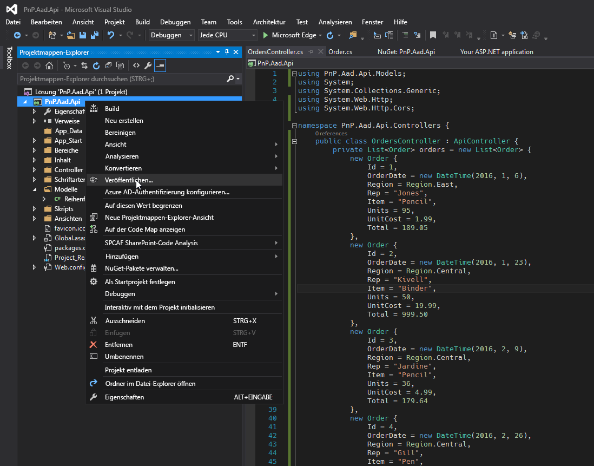

2. Stellen Sie sicher, dass im Dialogfeld **Veröffentlichen** alle Informationen richtig sind, und wählen Sie die Schaltfläche **Veröffentlichen** aus, um den Veröffentlichungsvorgang zu starten.

    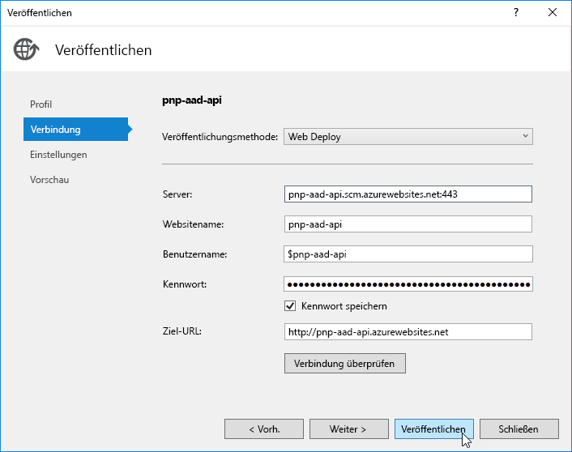

3. Nach Abschluss des Veröffentlichungsvorgangs navigieren Sie in Ihrem Webbrowser zur URL-API, z. B. `http://pnp-aad-api.azurewebsites.net/api/orders`. An diesem Punkt ist die API nicht gesichert, und anonyme Benutzer können auf sie zugreifen.

    

#### <a name="secure-the-api-using-azure-app-service"></a>Sichern der API durch Azure App Service

1. Um die API mithilfe von Azure AD zu sichern, wechseln Sie zum Azure-Portal, und öffnen Sie das Web-App-Hosting Ihrer API. 

2. Wählen Sie in der Gruppe **Einstellungen** die Option **Authentifizierung/Autorisierung** aus.

    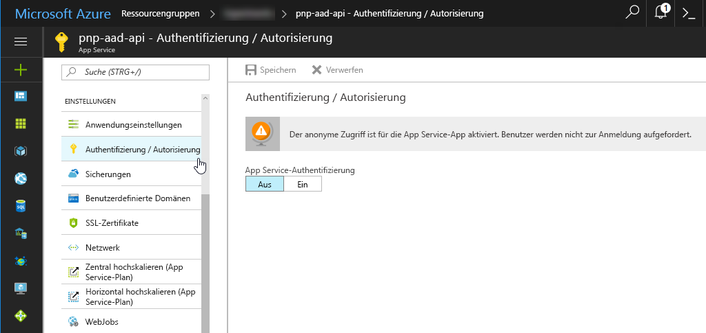

3. Legen Sie zum Aktivieren der Authentifizierung für Ihre Web App die Option **App Service-Authentifizierung** auf **Ein** fest.

    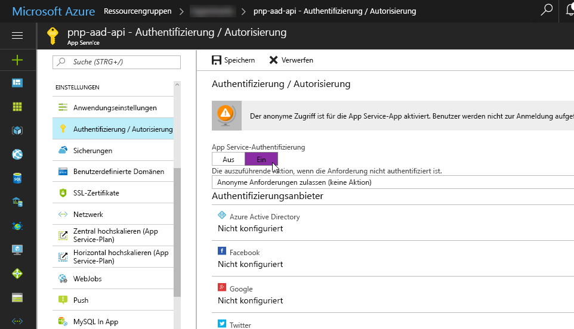

4. Um den anonymen Zugriff auf die API zu verweigern, wählen Sie in der Liste **Die auszuführende Aktion, wenn die Anforderung nicht authentifiziert ist** die Option **Mit Azure Active Directory anmelden** aus.

    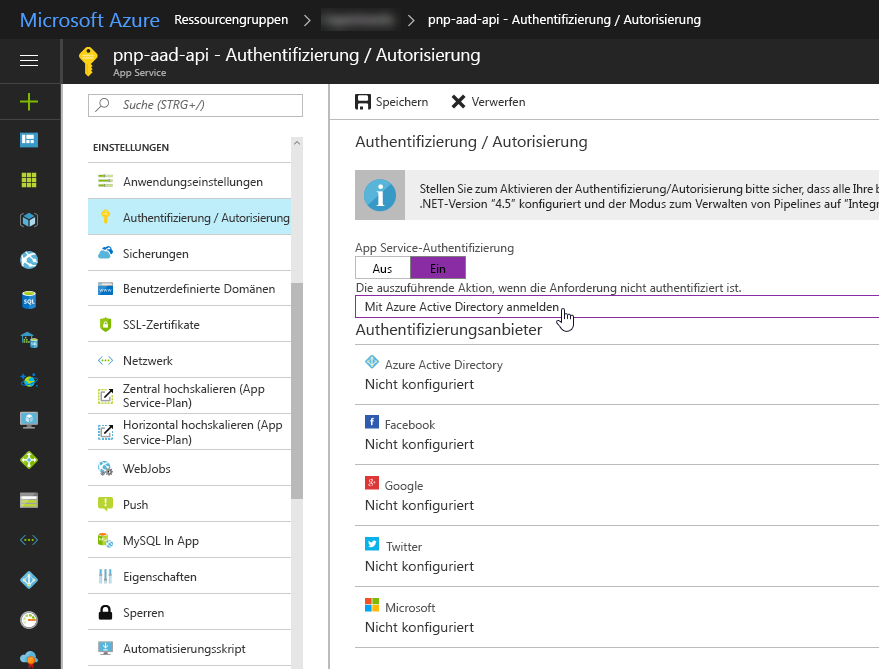

5. Konfigurieren Sie die Azure Active Directory-Authentifizierung in der Liste der Authentifizierungsanbieter, indem Sie **Azure Active Directory** auswählen.

    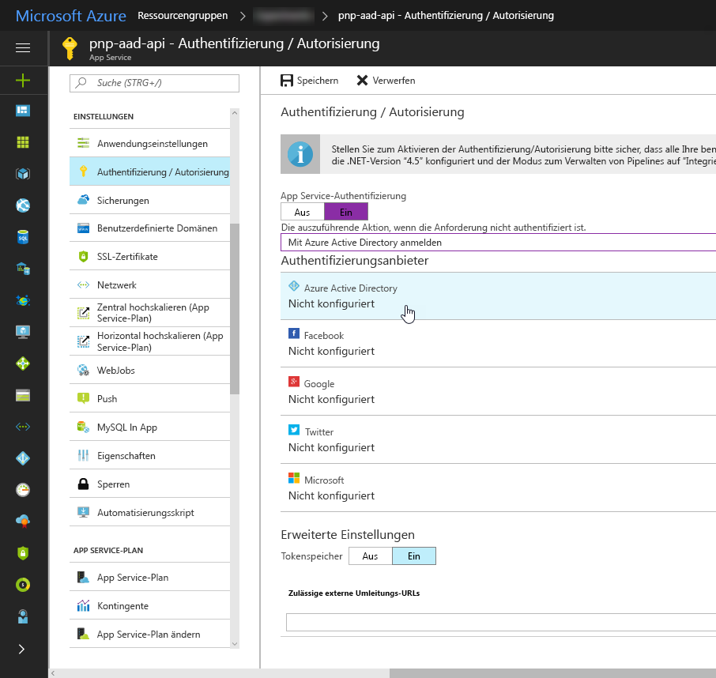

6. Stellen Sie auf dem Blatt **Active Directory-Authentifizierung** den **Verwaltungsmodus** auf **Express** ein, und erstellen Sie eine neue Azure AD-App.

    > [!IMPORTANT] 
    > Wenn Sie den Konfigurationsmodus Express verwenden, erstellt das Azure-Portal eine neue Azure AD-Anwendung im gleichen Verzeichnis, in dem sich auch die Funktionen-App befindet. Wenn die Funktionen-App in einem anderen Azure-Abonnement mit einem anderen Verzeichnis gehostet wird, sollten Sie stattdessen den erweiterten Modus verwenden und die ID des Verzeichnisses und der Anwendung angeben, die zum Sichern des Zugriffs auf die API verwendet werden soll.
    >
    > Wenn Sie vorhandene Azure AD-Anwendungen verwenden, konfigurieren Sie die Anwendung so, dass nur Anmeldeinformationen von einem einzigen Mandanten akzeptiert werden. Durch das Konfigurieren der Anwendung für mehrere Mandanten können Benutzer mit einem gültigen Organisations- oder persönlichen Konto eine Verbindung mit Ihrer API herstellen.
    >
    > Die Verwendung einer Azure AD-Anwendung für das Sichern des Zugriffs auf Ihre API bezieht sich nur auf die Authentifizierung. Beim Erstellen Ihrer API müssen Sie auch Anforderungen im Code der API autorisieren, um sicherzustellen, dass nur Benutzer mit entsprechenden Berechtigungen die API verwenden.

7. Da die App nur zum Sichern des Zugriffs auf die Azure-Funktion vorgesehen ist, sind keine zusätzlichen Berechtigungen erforderlich.  Bestätigen Sie die Auswahl, indem Sie **OK** auswählen.

    

8. Wenn das Blatt **Azure Active Directory** geschlossen wird, wählen Sie auf dem Blatt **Authentifizierung/Autorisierung** **Speichern** aus, um alle Änderungen an den Authentifizierungseinstellungen zu bestätigen.

    

9. Wenn Sie versuchen, in einem neuen privaten Fenster zur API-URL zu navigieren, sollten Sie aufgefordert werden, sich mit Ihrem Azure AD-Konto anzumelden.

    

Zu diesem Zeitpunkt ist die API bereit, mit dem Authentifizierungscookie sicher von einem clientseitigen SharePoint-Framework-Webpart aufgerufen zu werden.

#### <a name="secure-the-api-using-openid"></a>Sichern der API mit OpenID

Wenn Sie Ihr ASP.NET-Web-API-Projekt an einem anderen Ort als dem Azure App Service bereitstellen und es mit Azure AD sichern möchten, können Sie sich nicht auf die App Service-Authentifizierung verlassen. Stattdessen müssen Sie die Webanwendung so erweitern, dass Benutzer zur Authentifizierung aufgefordert werden, bevor sie die API verwenden können.

##### <a name="disable-anonymous-access-to-all-resources"></a>Deaktivieren des anonymen Zugriffs auf alle Ressourcen

1. Ausgehend davon, dass alle Ressourcen gesichert sein sollen,öffnen Sie die Datei **.\App_Start\FilterConfig.cs**, und fügen Sie den folgenden Code ein:

    ```cs
    using System.Web.Mvc;

    namespace PnP.Aad.Api {
        public class FilterConfig {
            public static void RegisterGlobalFilters(GlobalFilterCollection filters) {
                filters.Add(new HandleErrorAttribute());
                filters.Add(new AuthorizeAttribute());
            }
        }
    }
    ```

2. Um die Authentifizierung für alle APIs vorauszusetzen, öffnen Sie die Datei **.\App_Start\WebApiConfig.cs**, und fügen Sie den folgenden Code ein:

    ```cs
    using System.Web.Http;

    namespace PnP.Aad.Api {
        public static class WebApiConfig {
            public static void Register(HttpConfiguration config) {
                // Web API configuration and services

                // Web API routes
                config.MapHttpAttributeRoutes();

                config.EnableCors();
                config.Filters.Add(new AuthorizeAttribute());

                config.Routes.MapHttpRoute(
                    name: "DefaultApi",
                    routeTemplate: "api/{controller}/{id}",
                    defaults: new { id = RouteParameter.Optional }
                );
            }
        }
    }
    ```

3. Wenn Sie versuchen, entweder auf die API oder eine andere Ressource in der Webanwendung zuzugreifen, erhalten Sie die Fehlermeldung „401 - nicht autorisiert“.

    

An diesem Punkt setzt die Webanwendung voraus, dass alle Anforderungen an ihre Ressourcen authentifiziert werden, aber sie startet nicht den Azure AD-Anmeldefluss. 

In den folgenden Schritten erweitern Sie die Webanwendung so, dass Benutzer zur Azure AD-Anmeldeseite weitergeleitet werden, wenn sie zuvor nicht authentifiziert wurden.

##### <a name="register-azure-ad-application"></a>Registrieren der Azure AD-Anwendung

Um eine API mit Azure AD zu sichern, müssen Sie eine Azure AD-Anwendung registrieren. Auf diese Anwendung wird dann im Webanwendungsprojekt verwiesen, und die OWIN-Middleware verwendet sie zum Sichern des Zugriffs auf Ihre API mit Azure AD.

1. Wenn Sie noch keine Azure AD-Anwendung haben, können Sie eine im Azure-Portal erstellen, indem Sie das Blatt **Azure Active Directory** aufrufen.

    > [!IMPORTANT] 
    > Die Azure AD-Anwendung, die zum Sichern der API verwendet wird, muss in demselben Azure Active Directory erstellt werden, das Ihre Organisation zum Zugreifen auf Office 365 verwendet.

    

2. Wechseln Sie auf dem Blatt **Azure Active Directory** zum Blatt **App-Registrierungen**.

    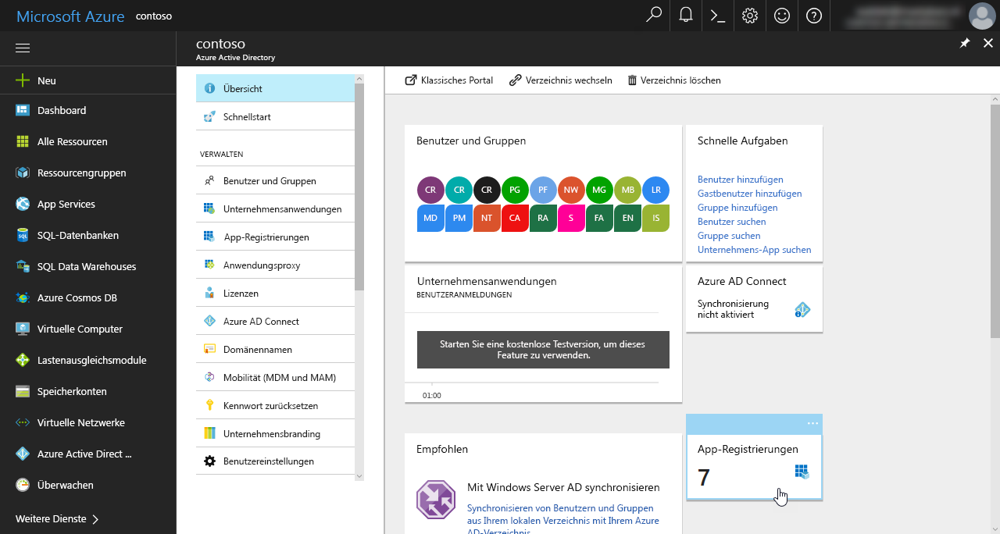

3. Klicken Sie auf dem Blatt **App-Registrierungen** auf die Schaltfläche **Registrierung einer neuen Anwendung**, um eine neue Azure AD-Anwendung zu registrieren.

    

4. Stellen Sie auf dem Blatt **Erstellen** die Informationen zu Ihrer Anwendung bereit, und bestätigen Sie die Erstellung, indem Sie **Erstellen** auswählen.

    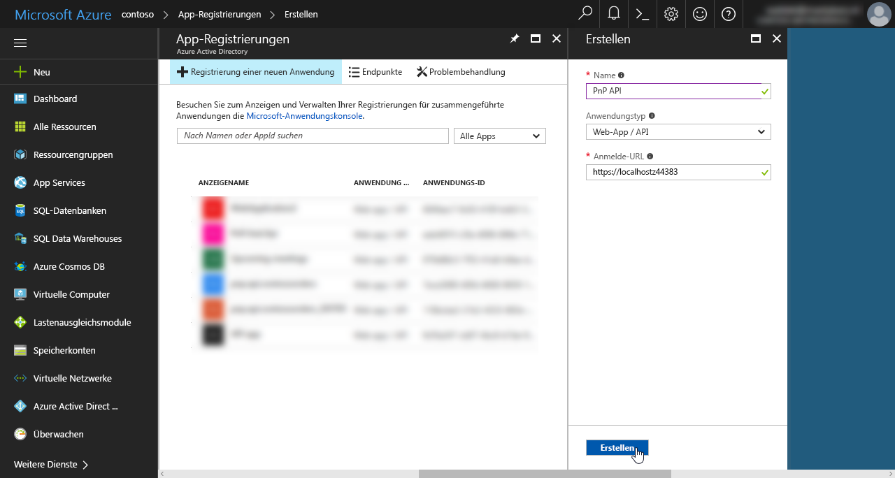

5. Nachdem die Anwendungsregistrierung erfolgreich erstellt wurde, wählen Sie diese in der Liste aus, um die Details anzuzeigen.

    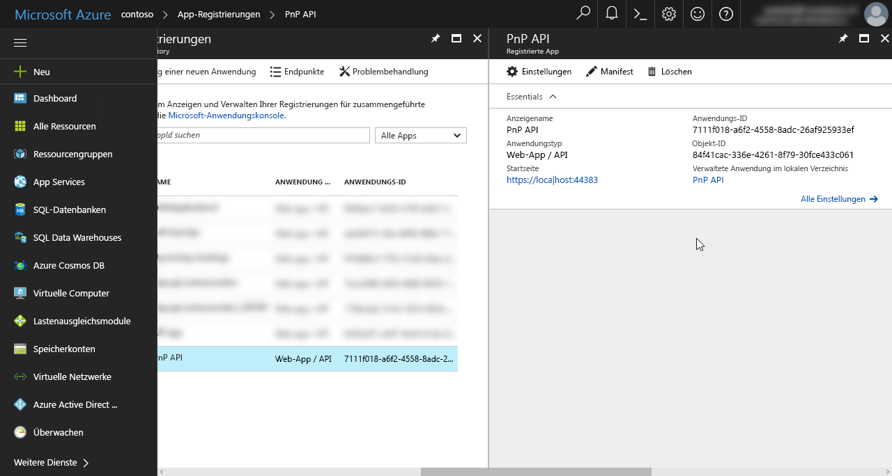

6. Kopieren Sie aus den Informationen zur Anwendungsregistrierung die **ID der Anwendung**, und speichern Sie diese, da Sie sie bei der Konfiguration der Azure AD-Authentifizierung für Ihre Webanwendung benötigen.

##### <a name="redirect-anonymous-requests-to-azure-ad-sign-in-page"></a>Umleiten von anonymen Anforderungen zur Azure AD-Anmeldeseite

1. Klicken Sie in Visual Studio mit der rechten Maustaste auf das Projekt, und wählen Sie im Kontextmenü die Option **NuGet-Pakete verwalten** aus. 

2. Fügen Sie im Fenster **NuGet-Pakete verwalten** die folgenden Pakete zum Projekt hinzu:

    - Microsoft.Owin.Host.SystemWeb
    - Microsoft.Owin.Security.Cookies
    - Microsoft.Owin.Security.OpenIdConnect

3. Fügen Sie im Stammverzeichnis des Projekts eine neue Klasse mit dem Namen **Startup** hinzu, und fügen Sie den folgenden Code ein:

    ```cs
    using Owin;

    namespace PnP.Aad.Api {
        public partial class Startup
        {
            public void Configuration(IAppBuilder app)
            {
                ConfigureAuth(app);
            }
        }
    }
    ```

4. Erstellen Sie im Ordner **App_Start** eine neue Klasse mit dem Namen **Startup.Auth**, und fügen Sie den folgenden Code ein:

    ```cs
    using Microsoft.Owin.Security;
    using Microsoft.Owin.Security.Cookies;
    using Microsoft.Owin.Security.OpenIdConnect;
    using Owin;
    using System.Configuration;

    namespace PnP.Aad.Api {
        public partial class Startup {
            // For more information on configuring authentication, please visit http://go.microsoft.com/fwlink/?LinkId=301864
            public void ConfigureAuth(IAppBuilder app) {
                app.SetDefaultSignInAsAuthenticationType(CookieAuthenticationDefaults.AuthenticationType);

                app.UseCookieAuthentication(new CookieAuthenticationOptions());

                app.UseOpenIdConnectAuthentication(
                    new OpenIdConnectAuthenticationOptions {
                        ClientId = ConfigurationManager.AppSettings["ida:ClientId"],
                        Authority = $"https://login.microsoftonline.com/{(ConfigurationManager.AppSettings["ida:Tenant"])}",
                        PostLogoutRedirectUri = ConfigurationManager.AppSettings["ida:PostLogoutRedirectUri"],
                    });
            }
        }
    }
    ```

5. Öffnen Sie in Visual Studio die Datei **Web.config**, und fügen Sie im Abschnitt **appSettings** die folgenden Elemente hinzu:

    ```xml
    <add key="ida:Tenant" value="contoso.onmicrosoft.com" />
    <add key="ida:ClientId" value="eeb40f1f-c5fa-4096-896b-71c77d459e21" />
    <add key="ida:PostLogoutRedirectUri" value="https://localhost:44320/" />
    ```

    - Der Wert des Schlüssels **ida:Tenat** ist der Name des Azure AD, in dem die Azure AD-App definiert ist, die zum Sichern der API verwendet wird. 
    - **ida:ClientId** gibt die ID der Azure AD-Anwendung an, die verwendet wird, um die API zu sichern. 
    - Die in der Eigenschaft **Ida: PostLogoutRedirectUri** angegebene URL ist das Ziel, zu dem Azure AD Benutzer nach dem Abmelden von der Anwendung weiterleiten würde. Dieses wird in diesem Fall nicht verwendet.

Dadurch wird der Konfigurationsvorgang abgeschlossen. Wenn Sie Ihre Webanwendung starten, ehe Sie auf die Ressourcen zugreifen können, werden Sie aufgefordert, sich mit Ihrem Azure AD-Konto anzumelden. Um sicherzustellen, dass nur autorisierte Benutzer auf eine bestimmte API zugreifen, sollten Sie in Ihren benutzerdefinierten APIs Autorisierung implementieren. Dazu können Sie den Benutzernamen aus der Eigenschaft `RequestContext.Principal.Identity` abrufen und ihn mit Ihrer Sicherheitsmatrix abgleichen.

## <a name="see-also"></a>Siehe auch

- [Aufrufen von benutzerdefinierten APIs, die mit Azure Active Directory ohne ADAL JS gesichert sind (Codebeispiel)](https://github.com/SharePoint/sp-dev-fx-webparts/tree/master/samples/aad-api-spo-cookie)
