# <a name="connect-to-api-secured-with-azure-active-directory"></a>Herstellen einer mit Azure Active Directory gesicherten Verbindung zu einer API

Beim Erstellen von SharePoint-Framework-Lösungen müssen Sie möglicherweise eine Verbindung mit Ihrer benutzerdefinierten API zum Abrufen von Daten oder zum Kommunizieren mit Branchenanwendungen herstellen. Das Sichern von benutzerdefinierten APIs mit Azure Active Directory bietet Ihnen eine Reihe von Vorteilen und kann auf verschiedene Weise erfolgen. Nachdem Sie die API erstellt haben, gibt es verschiedene Möglichkeiten, wie Sie darauf zugreifen können. Diese Methoden variieren hinsichtlich ihrer Komplexität und haben jeweils ihre eigenen Aspekte. Dieser Artikel behandelt die verschiedenen Ansätze und beschreibt schrittweise den Prozess zum Erstellen und Herstellen einer Verbindung mit einer durch Azure Active Directory geschützten API.

## <a name="secure-an-api-with-azure-active-directory"></a>Sichern einer API mit Azure Active Directory

Wenn Sie Office 365 verwenden, ist das Sichern von benutzerdefinierten APIs mit Azure Active Directory eine Architekturoption, die Sie auf jeden Fall in Betracht ziehen sollten. Vor allem ist zu betonen, dass hierdurch ermöglicht wird, den Zugriff auf die API mit in der Organisation bereits vorhandenen Anmeldeinformationen zu schützen, die bereits über Office 365 und Azure Active Directory verwaltet werden. Benutzer mit einem aktiven Konto können problemlos mit Anwendungen arbeiten, die durch AAD geschützte APIs verwenden. Azure Active Directory-Administratoren können den Zugriff auf die API zentral verwalten, und zwar auf die gleiche Weise, auf die sie den Zugriff auf alle anderen in AAD registrierten Programme verwalten.

Als API-Entwickler entfällt bei der Verwendung von Azure AD zum Sichern Ihrer API die Notwendigkeit, einen proprietären Satz von Benutzeranmeldeinformationen verwalten und eine benutzerdefinierte Sicherheitsstufe für Ihre API implementieren zu müssen. Darüber hinaus unterstützt Azure Active Directory das OAuth-Protokoll, mit dem Sie von einer Reihe von Anwendungstypen, angefangen bei mobilen Apps bis hin zu clientseitigen Lösungen, eine Verbindung zur API herstellen können.

Beim Erstellen von benutzerdefinierten APIs gibt es zwei Hauptmethoden, mit denen Sie Ihre API mit Azure Active Directory schützen können. Wenn Sie die API in Microsoft Azure App Service hosten, können Sie die App-Authentifizierungsoption nutzen. Wenn Sie für Ihre API flexiblere Hostingmöglichkeiten nutzen möchten, sie z. B. in Ihrer eigenen Infrastruktur oder in Docker-Containern hosten möchten, müssen Sie sie im Code sichern. In diesem Fall hängt die Implementierung von der Programmiersprache und dem Framework ab. In diesem Artikel werden bei der Erläuterung dieser Option C# und die ASP.NET-Web-API als Framework verwendet.

### <a name="secure-the-api-using-azure-app-service-authentication"></a>Sichern einer API durch Azure App Service-Authentifizierung

Bei der Bereitstellung von benutzerdefinierten APIs im Azure App Service können Sie die App Service-Authentifizierungsoption zum sichern der API mit Azure Active Directory nutzen. Der größte Vorteil bei der Verwendung der App Service-Authentifizierung ist seine Einfachheit: Indem Sie den Schritten im Azure-Portal folgen, können Sie die Authentifizierungskonfiguration mithilfe des Assistenten vornehmen. Wenn Sie die Basiseinrichtung auswählen, erstellt der Assistent eine neue AAD-Anwendung in dem Azure Active Directory, das mit dem aktuellen Abonnement verknüpft ist. Bei der erweiterten Konfiguration können Sie entscheiden, welche AAD-Anwendung zum Sichern des Zugriffs auf den App Service, der die API hostet, verwendet werden soll.


Nachdem die App Service-Authentifizierung konfiguriert wurde, werden Benutzer, die auf Ihre API zugreifen möchten aufgefordert, sich mit ihrem Organisationskonto anzumelden, das zu demselben Azure Active Directory wie die AAD-Anwendung gehört, die zum Sichern der API verwendet wird. Nach der Anmeldung können Sie über die Eigenschaft `HttpContext.Current.User` auf Informationen zum aktuellen Benutzer zugreifen. Wenn Sie die Azure App Service-Authentifizierung verwenden, müssen Sie keine zusätzlichen Konfigurationen für die Anwendung vornehmen.

Die Azure App Service-Authentifizierung ist ein Feature, das nur in Microsoft Azure-App Services zur Verfügung steht. Obwohl diese Funktion die Implementierung der Authentifizierung für Ihre API erheblich vereinfacht, ist sie jedoch auch daran gebunden, in einem Azure App Service ausgeführt zu werden. Wenn Sie die API bei einem anderen Cloudanbieter oder in einem Docker-Container hosten möchten, müssten Sie zuerst die Authentifizierungsebene implementieren.

### <a name="secure-the-api-using-aspnet-authentication"></a>Sichern einer API durch ASP.NET-Authentifizierung

Wenn Sie im Hinblick darauf, wo Ihre API gehostet und wie sie bereitgestellt wird, maximale Flexibilität wünschen, sollten Sie die die Implementierung der Unterstützung für die AAD-Authentifizierung in ASP.NET in Betracht ziehen. Visual Studio vereinfacht die Implementierung erheblich, und nach Abschluss des Setup-Assistenten für die Authentifizierung fordert die API Benutzer auf, sich mit ihrem Organisationskonto anzumelden.

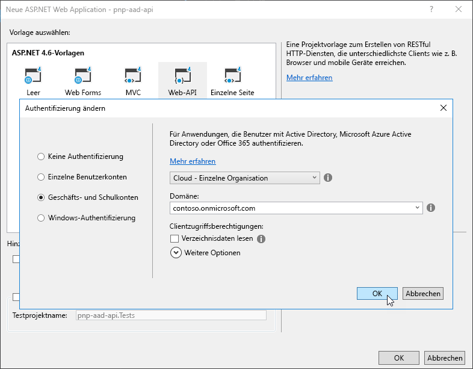

Während des Konfigurationsvorgangs fügt Visual Studio alle erforderlichen Verweise und Einstellungen dem ASP.NET-Web-API hinzu, einschließlich der Registrierung einer neuen AAD-Anwendung zum Sichern Ihrer API.

## <a name="access-an-api-secured-with-azure-active-directory-from-sharepoint-framework-solutions"></a>Zugriff auf eine durch Azure Active Directory gesicherte API über SharePoint-Framework-Lösungen

SharePoint-Framework-Lösungen befinden sich vollständig auf der Clientseite und sind daher nicht in der Lage, Geheimnisse sicher zu speichern, die zum Herstellen einer Verbindung zu gesicherten APIs erforderlich sind. Um die sichere Kommunikation mit clientseitigen Lösungen zu unterstützen, können in Azure Active Directory verschiedene Mechanismen verwendet werden, wie z. B. Authentifizierungscookies oder der implizite OAuth-Fluss.

### <a name="access-the-api-using-adal-js"></a>Zugreifen auf eine API mit ADAL JS

Eine häufig verwendete Methode zur Kommunikation von clientseitigen Lösungen mit APIs, die durch Azure Active Directory geschützt sind, ist die Verwendung der [ADAL JS](https://github.com/AzureAD/azure-activedirectory-library-for-js)-Bibliothek. ADAL JS vereinfacht die Implementierung der Authentifizierung bei AAD in clientseitige Anwendungen sowie das Abrufen von Zugriffstoken für bestimmte Ressourcen. Bei Anwendungen, die mit AngularJS erstellt wurden, bietet ADAL JS einen HTTP-Anforderungs-Interceptor, der den Headern ausgehender Webanforderungen automatisch die erforderlichen Zugriffstoken hinzufügt. Bei Verwendung dieses Anforderers müssen Entwickler Webanfragen an APIs, die durch AAD gesichert sind, nicht ändern und können sich stattdessen auf die Erstellung der Anwendung konzentrieren.

#### <a name="benefits-of-using-adal-js-to-communicate-with-apis-secured-with-aad"></a>Vorteile der Verwendung von ADAL JS zur Kommunikation mit AAD-gesicherten APIs

Bei der Verwendung ADAL JS haben clientseitige Anwendungen vollen Zugriff auf die Identitätsinformationen des Benutzers, der aktuell angemeldet ist. Dies ist hilfreich, wen in der Anwendung z. B. der Benutzername oder das Profilbild angezeigt werden soll. Beim Erstellen von Lösungen, die in SharePoint gehostet werden, können Entwickler erweiterte Profilinformationen mithilfe der SharePoint-API abrufen, was bei eigenständigen Anwendungen nicht möglich ist.

ADAL JS erleichtert nicht nur die Authentifizierung bei AAD, sondern kann auch Zugriffstoken für bestimmte Ressourcen abrufen. Mit diesen Zugriffstoken können Anwendungen sicher auf APIs zugreifen, die durch AAD geschützt sind, wie z. B. die [Microsoft Graph](./call-microsoft-graph-from-your-web-part)-API oder andere benutzerdefinierte APIs. Bevor eine clientseitige Anwendung ADAL JS verwenden kann, muss sie als Anwendung in Azure Active Directory registriert werden. Beim Registrierungsvorgang legen Entwickler eine Reihe von Parametern fest, wie z. B. die URL, unter der die Anwendung gehostet wird, sowie die Ressourcen, auf die die Anwendung zugreifen muss, entweder von sich selbst aus oder im Namen des derzeit angemeldeten Benutzers.

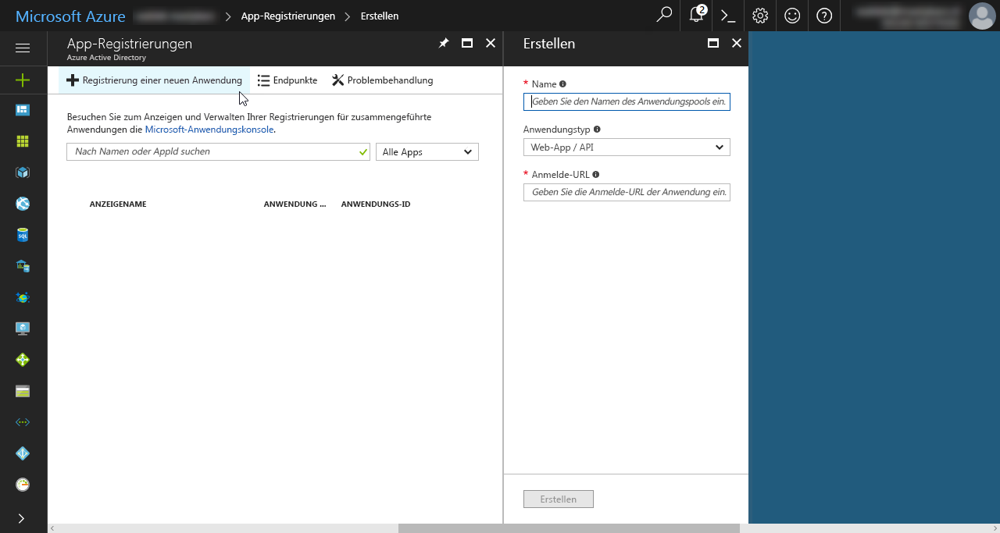

Wenn die Anwendung zum ersten Mal verwendet wird, wird der Benutzer aufgefordert, die erforderlichen Berechtigungen zu erteilen. Dies wird häufig als „Genehmigungsflow“ bezeichnet. Sobald die Genehmigung erfolgt ist, kann die Anwendung Zugriffstoken für die entsprechenden Ressourcen anfordern und sicher mit ihnen kommunizieren.

#### <a name="considerations-when-using-adal-js-to-communicate-with-apis-secured-with-aad"></a>Überlegungen bei der Verwendung von ADAL JS zur Kommunikation mit AAD-gesicherten APIs

ADAL JS ist für die Verwendung von Einzelseitenanwendungen ausgelegt. Daher funktioniert es standardmäßig bei der Verwendung mit SharePoint-Framework-Lösungen nicht richtig. Durch das [Anwenden eines Patches](./call-microsoft-graph-from-your-web-part) können Sie es jedoch erfolgreich in SharePoint-Framework-Projekten verwenden.

Bei der Verwendung von ADAL JS und OAuth zum Zugreifen auf AAD-gesicherte APIs wird Authentifizierungsfluss durch Microsoft Azure unterstützt. Mögliche Fehler werden von der Azure-Anmeldeseite behandelt. Sobald sich der Benutzer mit seinem Organisationskonto angemeldet hat, versucht die Anwendung, ein gültiges Zugriffstoken abzurufen. Alle Fehler, die in dieser Phase auftreten, müssen explizit vom Entwickler der Anwendung behandelt werden, da das Abrufen von Zugriffstoken nicht interaktiv ist und dem Benutzer keine Benutzeroberfläche angezeigt wird.

Jede clientseitige Anwendung, die ADAL JS verwenden soll, muss als Azure AD-Anwendung registriert werden. Ein Teil der Registrierungsinformationen ist die URL, unter der sich die Anwendung befindet. Da sich die Anwendung vollständig auf der Clientseite befindet und nicht in der Lage ist, ein Geheimnis sicher zu speichern, ist die URL einen Teil des Vertrages zwischen der Anwendung und AAD, um Sicherheit zu gewährleisten. Diese Anforderung ist für SharePoint-Framework-Lösungen problematisch, da Entwicklern nicht alle URLs sofort bekannt sind, unter denen ein bestimmtes Webpart verwendet wird. Darüber hinaus unterstützt AAD derzeit bis zu 10 Antwort-URLs, was möglicherweise in einigen Fällen nicht ausreichend ist.

Bevor eine clientseitige Anwendung ein Zugriffstoken für eine bestimmte Ressource abrufen kann, muss sie den Benutzer authentifizieren, um das ID-Token zu erhalten, das dann mit einem Zugriffstoken getauscht werden kann. Obwohl SharePoint-Framework-Lösungen in SharePoint gehostet werden, bei denen Benutzer bereits mit ihren Organisationskonten angemeldet sind, stehen die Authentifizierungsinformationen des aktuellen Benutzers den SharePoint-Framework-Lösungen nicht zur Verfügung. Stattdessen erfordert jede Lösung explizit, dass sich der Benutzer anmeldet. Dies kann erfolgen, indem der Benutzer auf die Azure-Anmeldeseite weitergeleitet wird oder indem ein Popupfenster mit der Anmeldeseite angezeigt wird. Letztere Möglichkeit ist im Falle eines Webparts weniger störend, da es sich um eines von vielen Elementen auf einer Seite handelt. Wenn mehrere clientseitige SharePoint-Framework-Webparts auf der Seite vorhanden sind, verwaltet jedes von ihnen seinen Zustand separat und würde erfordern, dass sich der Benutzer explizit bei jedem einzelnen Webpart anmeldet.

Das Abrufen von Zugriffstoken, die für die Kommunikation mit AAD-gesicherten APIs erforderlich sind, wird durch ausgeblendete IFrames unterstützt, die Umleitungen an Azure AD-Endpunkte verarbeiten. In Microsoft Internet Explorer besteht eine bekannte Einschränkung, bei der das Abrufen von Zugriffstoken im impliziten OAuth-Fluss fehlschlägt, wenn sich die Azure AD-Anmeldeendpunkte und die SharePoint Online-URL nicht in derselben Sicherheitszone befinden. Wenn Ihre Organisation Internet Explorer verwendet, stellen Sie sicher, dass der Azure AD-Endpunkt und die SharePoint Online-URLs in derselben Sicherheitszone konfiguriert sind. Um die Konsistenz zu wahren, gehen einige Organisationen so vor, dass sie diese Einstellungen über Gruppenrichtlinien an die Endbenutzer weitergeben.

Auf AAD-gesicherte APIs kann nicht anonym zugegriffen werden. Stattdessen benötigen sie gültige Anmeldeinformationen für die Anwendung, von der sie aufgerufen werden. Bei Verwendung des impliziten OAuth-Flusses mit clientseitigen Anwendungen sind diese Anmeldeinformationen das Bearerzugriffstoken , das mit ADAL JS abgerufen wird. Wenn Sie Ihre SharePoint-Framework-Lösung mit AngularJS erstellt haben, stellt ADAL JS automatisch sicher, dass Sie über ein gültiges Zugriffstoken für die entsprechende Ressource verfügen und fügt es allen ausgehenden Anforderungen hinzu, die mit dem AngularJS-Dienst `$http` ausgeführt werden. Wenn Sie andere JavaScript-Bibliotheken verwenden, müssen Sie ein gültiges Zugriffstoken abrufen und dieses bei Bedarf aktualisieren und es selbst an ausgehende Webanforderungen anfügen.

### <a name="access-the-api-by-leveraging-sharepoint-online-authentication-cookie"></a>Zugreifen auf eine API mit einem SharePoint Online-Authentifizierungscookie

Eine alternative Möglichkeit zur Verwendung von ADAL JS zum Herstellen einer Verbindung mit AAD-gesicherten APIs ist die Nutzung eines vorhandenen Authentifizierungscookies für die nahtlose Authentifizierung bei der benutzerdefinierten API.

#### <a name="how-it-works"></a>Funktionsweise

Wenn Sie sich mit Ihrem Organisationskonto bei SharePoint Online anmelden, wird in Ihrem Browser ein Authentifizierungscookie angelegt. Dieses Cookie wird mit jeder Anforderung an SharePoint gesendet und ermöglicht die Arbeit an Websites und Dokumenten. Um dieses Cookie verwenden zu können, um eine Verbindung zu einer benutzerdefinierten, AAD-geschützten API herzustellen, platzieren Sie einen ausgeblendeten IFrame auf der Seite, der auf eine URL verweist, unter der die API gehostet wird und die ebenfalls durch AAD gesichert ist. Wenn der Browser versucht, diese URL zu laden, wird er auf die Anmeldeseite von Azure AD umgeleitet, da ein anonymer Zugriff nicht zulässig ist. Da Sie für den Zugriff auf SharePoint bereits mit Ihrem Organisationskonto angemeldet sind, wird die Authentifizierung automatisch ausgeführt, und Sie werden wieder zur ursprünglichen URL weitergeleitet. An diesem Punkt verfügt Ihr Browser nun über das AAD-Authentifizierungscookie für den Zugriff auf die AAD-geschützte benutzerdefinierte API.

Nachdem Sie den IFrame auf der Seite platziert haben, fügen Sie einen `onload`-Ereignislistener daran an, der ausgelöst wird, wenn der Authentifizierungsfluss abgeschlossen ist. In diesem Ereignislistener legen Sie eine Kennzeichnung fest, die angibt, dass die Authentifizierung abgeschlossen ist. Sie können nun die benutzerdefinierte API sicher aufrufen. Alle Webanforderungen an die benutzerdefinierten APIs sollten verzögert werden, bis diese Kennzeichnung festgelegt ist, da sie sonst fehlschlagen.

```ts
// ...

export default class LatestOrdersWebPart extends BaseClientSideWebPart<ILatestOrdersWebPartProps> {
  private remotePartyLoaded: boolean = false;
  private orders: IOrder[];

  public render(): void {
    this.domElement.innerHTML = `
    <div class="${styles.latestOrders}">
      <iframe src="https://contoso.azurewebsites.net/"
          style="display:none;"></iframe>
      <div class="ms-font-xxl">Recent orders</div>
      <div class="loading"></div>
      <table class="data" style="display:none;">
        <thead>
          <tr>
            <th>ID</th>
            <th>Date</th>
            <th>Region</th>
            <th>Rep</th>
            <th>Item</th>
            <th>Units</th>
            <th>Unit cost</th>
            <th>Total</th>
          </tr>
        </thead>
        <tbody>
        </tbody>
      </table>
    </div>`;

    this.context.statusRenderer.displayLoadingIndicator(
      this.domElement.querySelector(".loading"), "orders");

    this.domElement.querySelector("iframe").addEventListener("load", (): void => {
      this.remotePartyLoaded = true;
    });

    this.executeOrDelayUntilRemotePartyLoaded((): void => {
      // retrieve and render data
    });
  }

  private executeOrDelayUntilRemotePartyLoaded(func: Function): void {
    if (this.remotePartyLoaded) {
      func();
    } else {
      setTimeout((): void => { this.executeOrDelayUntilRemotePartyLoaded(func); }, 100);
    }
  }

  // ...
}
```

Wenn Sie in den Webparts AJAX-Anforderungen ausführen, müssen Sie angeben, das Authentifizierungscookie domänenübergreifend gesendet werden soll. Sie können dies aktivieren, indem Sie die Eigenschaft **credentials** der Webanforderung auf **include** festlegen. Wenn Sie dies nicht tun, wird die Anforderung im Browser blockiert und die API kann nicht aufgerufen werden.

```ts
// ...

export default class LatestOrdersWebPart extends BaseClientSideWebPart<ILatestOrdersWebPartProps> {
    // ...

    private retrieveAndRenderData(): void {
        this.context.httpClient.get("https://contoso.azurewebsites.net/api/orders",
        HttpClient.configurations.v1, {
          credentials: "include"
        })
        .then((response: HttpClientResponse): Promise<IOrder[]> => {
          // ...
        });
    }

    // ...
}
```

Um diese Methode unterstützen zu können, müssen für die benutzerdefinierte API einige spezielle Konfigurationen vorgenommen werden. Es ist vor allem die Unterstützung eingehender Anmeldeinformationen aus domänenübergreifenden Aufrufen erforderlich. Hierzu wird der Antwortheader **Access-Control-Allow-Credentials** auf **true** festgelegt. Als Nächstes muss angegeben werden, welcher Ursprung die API aufrufen kann. Dies wird im Antwortheader **Access-Control-Allow-Origin** konfiguriert.

> **Wichtig:** Bei der Verwendung von **Access-Control-Allow-Credentials** dürfen Sie nicht nur einen Ursprung angeben.

Wie diese Header genau konfiguriert werden müssen, hängt von der Implementierung Ihrer API ab. Wenn Sie eine Azure-Funktion verwenden, um die API beispielsweise mit Node.js zu erstellen, würden Sie diese Header auf dem Antwortobjekt festlegen:

```js
context.res = {
    body: "response",
    headers: {
        "Access-Control-Allow-Credentials" : "true",
        "Access-Control-Allow-Origin" : "https://contoso.sharepoint.com"
    }
};
```

Bei Verwendung der ASP.NET-Web-API installieren Sie das NuGet-Paket **Microsoft.AspNet.WebApi.Cors**, rufen die Methode `config.EnableCors()` auf und verwenden das Attribut **EnableCors**, um die Headerwerte festzulegen:

```cs
[EnableCors("origins": "*", "headers": "*", "methods": "*", SupportsCredentials = true)]
public string Get() {
    return "response";
}
```

#### <a name="benefits-of-using-the-sharepoint-online-authentication-cookie-for-seamless-authentication"></a>Vorteile der Verwendung von SharePoint Online-Authentifizierungscookies zur nahtlosen Authentifizierung

Der wichtigste Vorteil bei der Verwendung von SharePoint Online-Authentifizierungscookies zum Herstellen einer Verbindung zu einer benutzerdefinierten, AAD-gesicherten API ist die Tatsache, dass Sie bei diesem Ansatz keine AAD-Anwendung für jedes Webpart registrieren müssen. Dies erspart Ihnen die Mühe, Antwort-URLs von Seiten verwalten zu müssen, auf denen die einzelnen Webparts verwendet werden. Außerdem gilt hier nicht die Einschränkung von maximal 10 Antwort-URLs pro AAD Anwendung.

Der Authentifizierungsfluss erfolgt nahtlos, und es ist keine Benutzerinteraktion erforderlich, um die Authentifizierung abzuschließen. Im Vergleich dazu basiert bei der Verwendung von ADAL JS jedes Webpart auf einer anderen AAD-Anwendung und erfordert, dass sich der Benutzer explizit bei der Anwendung anmeldet.

#### <a name="considerations-when-using-the-sharepoint-online-authentication-cookie-for-seamless-authentication"></a>Überlegungen bei der Verwendung von SharePoint Online-Authentifizierungscookies zur nahtlosen Authentifizierung

Aus funktionaler Sicht ermöglicht sowohl die Verwendung von ADAL JS als auch eines SharePoint Online-Authentifizierungscookies Ihnen, eine Verbindung mit AAD-gesicherten APIs herzustellen. Es gibt jedoch einige wichtige Unterschiede zwischen diesen beiden Ansätzen, die Sie kennen sollten.

Bei der Verwendung von ADAL JS wird zunächst ein Identitätstoken für den aktuellen Benutzer abgerufen, bevor die clientseitige Anwendung ein Zugriffstoken abruft. Dieses Identitätstoken enthält Informationen über den aktuellen Benutzer, die aus AAD abgerufen werden, z. B. den Benutzernamen oder das Kennwort. Wenn Sie das Authentifizierungscookie verwenden, gibt es kein Identitätstoken. Da Sie SharePoint verwenden, ist dies keine wirkliche Einschränkung, da Sie die gleichen Informationen über den aktuellen Benutzer auch von SharePoint abrufen können.

ADAL JS ermöglicht Ihnen, eine Verbindung zu jeder Azure AD-gesicherten API herzustellen. Wenn Sie das Authentifizierungscookie verwenden, muss die API explizit den Empfang von Anmeldeinformationen aus domänenübergreifenden Aufrufen unterstützen. Beim Erstellen von APIs sollten Sie diese Anforderung berücksichtigen, um sicherzustellen, dass Sie diese APIs auch in SharePoint-Framework-Lösungen verwenden können.

Sie können sowohl mit ADAL JS als auch mit dem SharePoint Online-Authentifizierungscookie auf APIs zugreifen, die durch Azure Active Directory gesichert sind. Es unterstützen jedoch nicht alle APIs die Verwendung beider Methoden. Um z. B. auf Microsoft Graph zugreifen zu können, müssen Sie über ein gültiges OAuth-Zugriffstoken mit bestimmten Microsoft Graph-Berechtigungen verfügen. Sie können dieses Token mit ADAL JS abrufen, jedoch nicht mit einem SharePoint Online-Authentifizierungscookie.

Wenn Sie das SharePoint Online-Authentifizierungscookie zum Zugreifen auf AAD-gesicherte APIs verwenden, werden keine zusätzlichen Autorisierungsinformationen zusammen mit der Anforderung gesendet. Dies bedeutet, dass standardmäßig jeder Benutzer mit einem gültigen Organisationskonto in Azure Active Directory, das mit der API verknüpft ist, auf die API zugreifen kann. Beim Erstellen der API müssen Sie auf die Autorisierung achten, um sicherzustellen, dass alle API-Vorgänge von Benutzern mit entsprechenden Berechtigungen ausgeführt werden.

Benutzerdefinierte APIs werden außerhalb von SharePoint Online gehostet, und Sie können mithilfe von domänenübergreifenden Webanforderungen darauf zugreifen. Standardmäßig schließen Webbrowser keine Anmeldeinformationen bei der Durchführung von domänenübergreifenden AJAX-Anforderungen ein. Um eine Verbindung zu diesen gesicherte APIs herstellen zu können, müssen Sie das Senden von domänenübergreifenden Anmeldeinformationen explizit für jede ausgehende Webanforderung aktivieren.

### <a name="general-considerations"></a>Allgemeine Überlegungen

Sowohl ADAL JS und die Methode, bei der das SharePoint Online-Authentifizierungscookie verwendet wird, nutzen IFrames für die Kommunikation mit Azure Active Directory. Der Grund dafür sind die Umleitungen, die ein Bestandteil des OAuth-Flusses sind und die nicht automatisch von AJAX-Anforderungen gefolgt werden können. Microsoft Internet Explorer verwendet Sicherheitszonen, um Sicherheitsrichtlinien auf Websites anzuwenden, abhängig von der zugeordneten Zone. Damit Skripts auf die Informationen in einem IFrame zugreifen können, müssen sich die Ressource im IFrame und und die Seite, die den IFrame hostet, in derselben Sicherheitszone befinden. Um die ordnungsgemäße Konfiguration sicherzustellen, kann die Organisation Gruppenrichtlinien zur konsistenten Verteilung der Einstellungen an die Benutzer verwenden.

## <a name="build-an-api-secured-with-azure-active-directory"></a>Erstellen einer durch Azure Active Directory gesicherten API

Das Sichern des Zugriffs auf eine durch Azure Active Directory gesicherte API ist nicht kompliziert und erfordert nur wenige Schritte. Der genaue Vorgang variiert in Abhängigkeit von der Implementierung Ihrer API. Wenn Sie Azure-Funktionen verwenden möchten, können Sie die Sicherheit über das Azure-Portal konfigurieren. Wenn Sie Ihre API mithilfe von ASP.NET-WebAPI erstellt haben und sie außerhalb des Azure App Service hosten möchten, müssen Sie den WebAPI-Code entsprechend erweitern, um die Authentifizierung hinzuzufügen. Es folgt eine Schritt-für-Schritt-Anleitung zum Erstellen und Konfigurieren einer durch AAD-gesicherten API unter Verwendung von Azure-Funktionen und der ASP.NET-WebAPI.

### <a name="build-the-api-using-an-azure-function"></a>Erstellen einer API mit einer Azure-Funktion

Das Erstellen von APIs mit Azure Functions bietet Ihnen eine Reihe von Vorteilen. Zunächst einmal vereinfacht es wesentlich die Entwicklung und Bereitstellung der API. Azure Functions bietet umfassende Konfigurationsoptionen. Sie müssen sich nur um den eigentlichen API-Code kümmern. Alles andere, angefangen bei der Authentifizierung bis zur Unterstützung von CORS und der Dokumentation zur API können Sie im Azure-Portal durchführen.

Azure Functions wird in Azure App Service gehostet und kann viele Funktionen nutzen, die im zugrunde liegenden Dienst zur Verfügung stehen. Sie können nicht nur die API mit einer Funktion oder einem Administratorschlüssel schützen, sondern können auch die Azure App Service-Sicherheit aktivieren und Ihre API mit Azure Active Directory oder einem anderen verfügbaren Authentifizierungsanbieter schützen. Die App Service-Authentifizierung kann über das Azure-Portal konfiguriert werden und erfordert keine Änderungen des API-Codes.

Nachfolgend wird erläutert, wie Sie Azure Functions zum Erstellen einer API verwenden, die durch Azure Active Directory gesichert ist und die von einem domänenübergreifenden Ursprung auf sichere Weise aufgerufen werden kann.

#### <a name="create-new-azure-function"></a>Erstellen einer neuen Azure-Funktion

Wechseln Sie im Azure-Portal zu Ihrer Ressourcengruppe, und fügen Sie eine Funktionen-App hinzu.

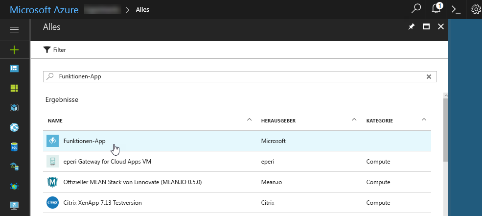

Öffnen Sie, nachdem die Funktionen-App bereitgestellt wurde, die neu erstellte Funktionen-App, und fügen Sie eine neue Funktion hinzu, indem Sie auf das Pluszeichen neben der Beschriftung „Funktionen“ klicken.

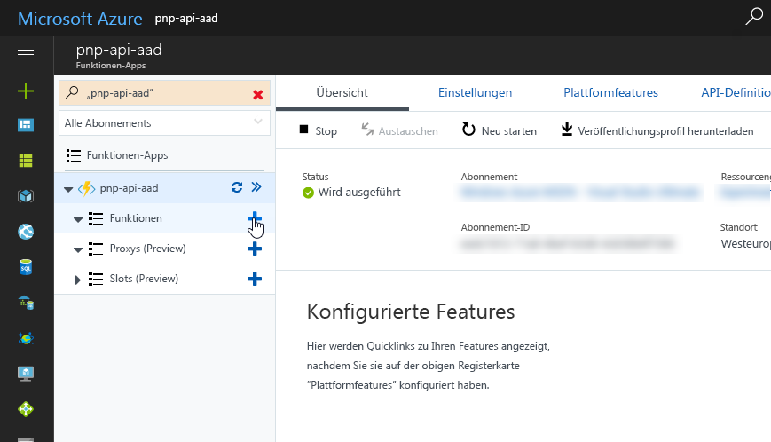

Scrollen Sie im Schnellstartbildschirm zum Abschnitt **Selbständig einsteigen**, und wählen Sie die Option **Benutzerdefinierte Funktion**.

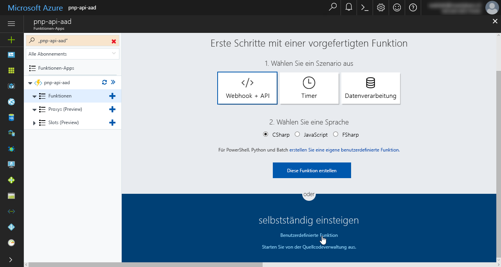

Wählen Sie aus der Liste der Vorlagen **HttpTrigger-JavaScript**. Verwenden Sie als Funktionsnamen **Bestellungen**, und legen Sie die Autorisierungsebene der Funktion auf **Anonym** fest, da Sie Azure AD verwenden, um den Zugriff auf die Azure-Funktion zu sichern. Bestätigen Sie Ihre Auswahl, indem Sie auf die Schaltfläche **Erstellen** klicken.

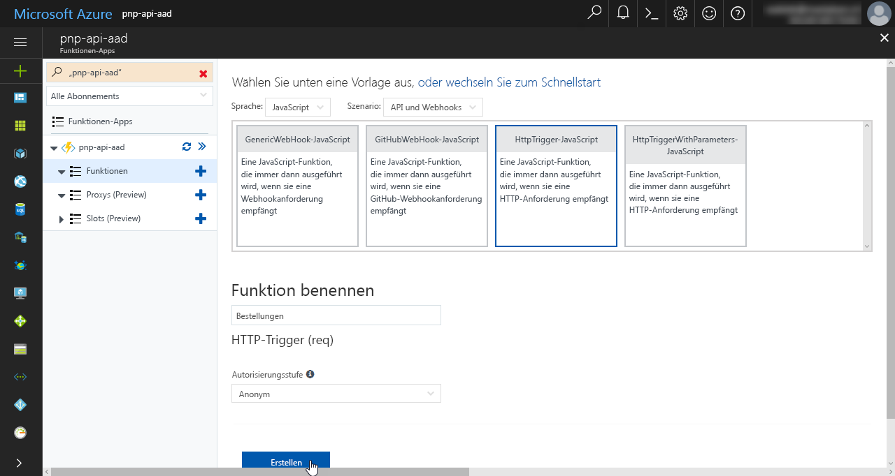

#### <a name="implement-api-code"></a>Implementieren des API-Codes

Ersetzen den Code der Funktion durch den folgenden Codeausschnitt:

```js
module.exports = function (context, req) {
    context.res = {
        body: [
            {
              id: 1,
              orderDate: new Date(2016, 0, 6),
              region: "east",
              rep: "Jones",
              item: "Pencil",
              units: 95,
              unitCost: 1.99,
              total: 189.05
            },
            {
              id: 2,
              orderDate: new Date(2016, 0, 23),
              region: "central",
              rep: "Kivell",
              item: "Binder",
              units: 50,
              unitCost: 19.99,
              total: 999.50
            },
            {
              id: 3,
              orderDate: new Date(2016, 1, 9),
              region: "central",
              rep: "Jardine",
              item: "Pencil",
              units: 36,
              unitCost: 4.99,
              total: 179.64
            },
            {
              id: 4,
              orderDate: new Date(2016, 1, 26),
              region: "central",
              rep: "Gill",
              item: "Pen",
              units: 27,
              unitCost: 19.99,
              total: 539.73
            },
            {
              id: 5,
              orderDate: new Date(2016, 2, 15),
              region: "west",
              rep: "Sorvino",
              item: "Pencil",
              units: 56,
              unitCost: 2.99,
              total: 167.44
            }],
        headers: {
            "Access-Control-Allow-Credentials" : "true",
            "Access-Control-Allow-Origin" : "https://contoso.sharepoint.com"
        }
    };
    context.done();
};
```

Ändern Sie die im Header **Access-Control-Allow-Origin** angegebene URL so, dass sie mit der URL des SharePoint Online-Mandanten übereinstimmt, von dem aus Sie diese API aufrufen.

Speichern Sie die Änderungen im Code der Funktion, indem Sie auf **speichern** klicken.


#### <a name="change-cors-settings"></a>Ändern der CORS-Einstellungen

Azure Functions wird im Azure App Service gehostet, wodurch Sie die Möglichkeit haben, die CORS-Einstellungen (Cross-Origin Resource Sharing) im Azure-Portal zu konfigurieren. Auch wenn dies nützlich ist, kann dies bei der Konfiguration im Portal nicht zusammen mit dem Header **Access-Control-Allow-Credentials** verwendet werden, der jedoch erforderlich ist, damit die API ein Authentifizierungscookie akzeptieren kann, das aus einem anderen Ursprung stammt. Damit die clientseitige Authentifizierung ordnungsgemäß funktioniert, müssen die CORS-Einstellungen des Azure App Service gelöscht werden.

Wählen Sie in der Funktionen-App Ihre Azure-Funktion aus, und wechseln Sie zum Blatt **Plattformfeatures**.

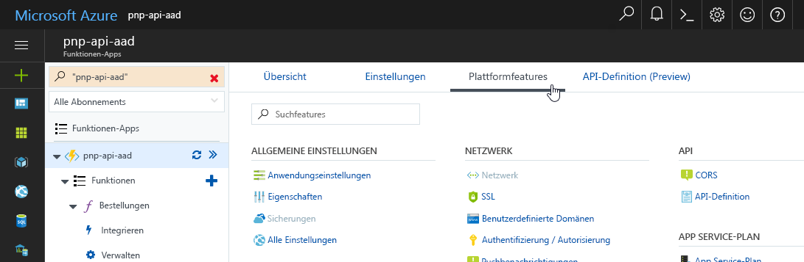

Wählen Sie im Abschnitt **API** die Option **CORS**.

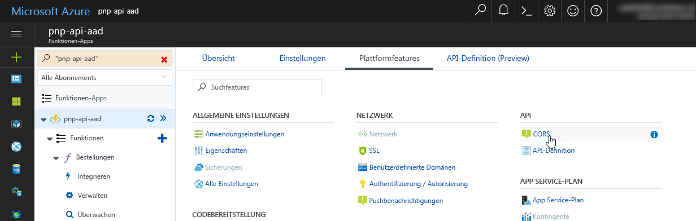

Löschen Sie auf den Blatt mit den CORS-Einstellungen alle Einträge, sodass die CORS-Konfiguration leer ist.

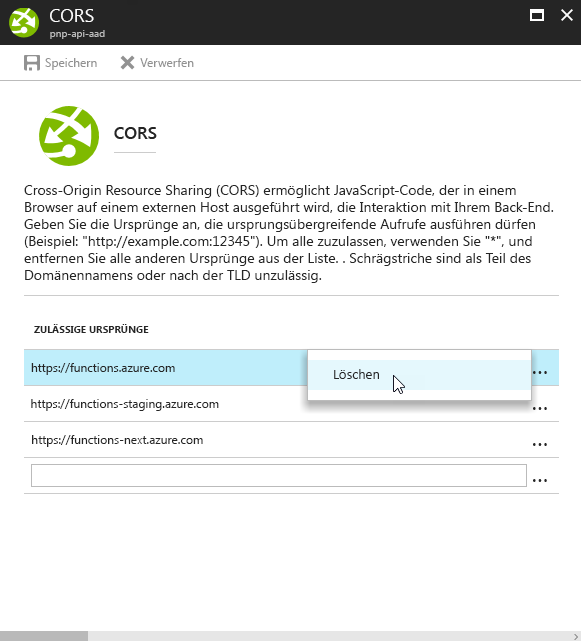

Bestätigen Sie den Löschvorgang, indem Sie auf **Speichern** klicken.

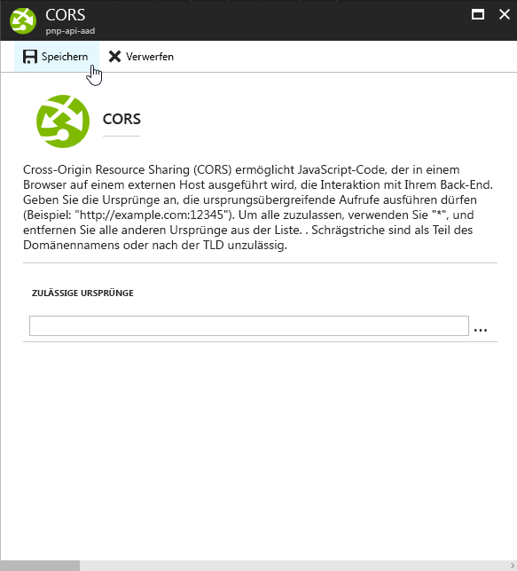

#### <a name="enable-app-service-authentication"></a>Aktivieren der App Service-Authentifizierung

Wechseln Sie in den Funktionen-App-Einstellungen zurück zum Blatt mit den Plattformeinstellungen. Wählen Sie im Abschnitt **Netzwerk** die Option **Authentifizierung/Autorisierung**.

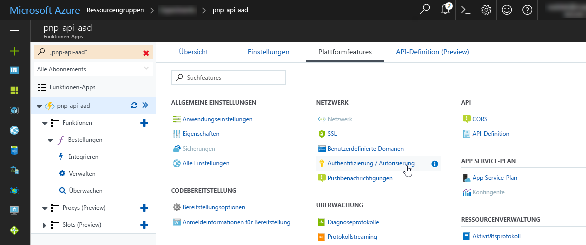

Aktivieren Sie die App Service-Authentifizierung, indem Sie die Option **App Service-Authentifizierung** auf **Ein** setzen.

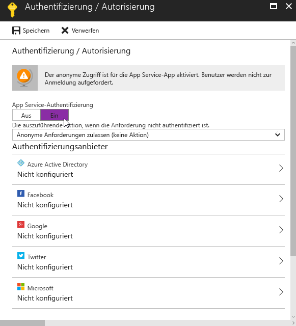

Um den anonymen Zugriff auf die API zu verhindern und die Authentifizierung mithilfe von Azure AD zu erzwingen, legen Sie im Dropdownmenü **Die auszuführende Aktion, wenn die Anforderung nicht authentifiziert ist** den Wert auf **Mit Azure Active Directory anmelden** fest.

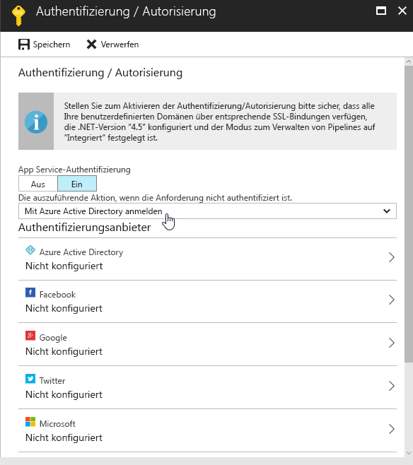

Wählen Sie dann in der Liste der Authentifizierungsanbieter Azure Active Directory aus, um es zu konfigurieren.

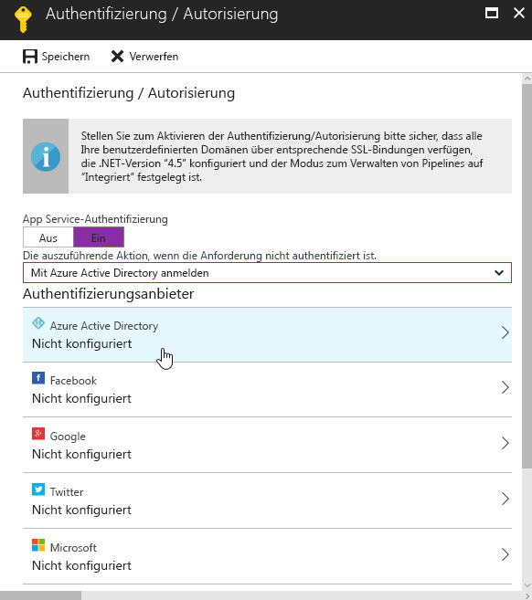

Stellen Sie auf dem Blatt „Active Directory-Authentifizierung“ den **Verwaltungsmodus** auf **Express** ein, und erstellen Sie eine neue AAD-App.

> **Wichtig:** Wenn Sie den Express-Konfigurationsmodus verwenden, erstellt das Azure-Portal eine neue AAD-Anwendung aus demselben Verzeichnis, in dem sich die Funktionen-App befindet. Wenn die Funktionen-App in einem anderen Azure-Abonnement mit einem anderen Verzeichnis gehostet wird, müssen Sie stattdessen den erweiterten Modus verwenden und die ID des Verzeichnisses und der Anwendung angeben, die verwendet werden soll, um den Zugriff auf die API zu sichern.
>
> Wenn Sie vorhandene AAD-Anwendungen verwenden, müssen Sie die Anwendung so konfigurieren, dass sie nur Anmeldeinformationen von einem einzigen Mandanten akzeptiert. Die Konfiguration der Anwendung als mehrinstanzfähig würde jedem Benutzer mit einem gültigen Organisationskonto oder persönlichen Konto ermöglichen, eine Verbindung zu Ihrer API herzustellen.
>
> Die Verwendung einer AAD-Anwendung zum Sichern des Zugriffs auf Ihre API gilt nur für die Authentifizierung. Beim Erstellen Ihrer API müssen Sie auch Anforderungen im Code der API autorisieren, um sicherzustellen, dass nur Benutzer mit entsprechenden Berechtigungen die API verwenden.

Da die App nur zum Sichern des Zugriffs auf die Azure-Funktion vorgesehen ist, sind keine zusätzlichen Berechtigungen erforderlich. Bestätigen Sie die Auswahl, indem Sie auf **OK** klicken.

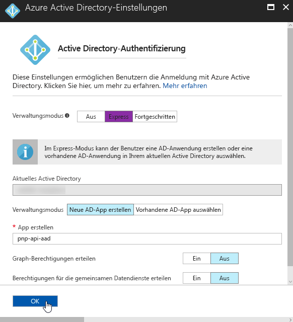

Wenn des Azure Active Directory-Blatt auf dem Blatt **Authentifizierung / Autorisierung** geschlossen wird, klicken Sie auf **Speichern**, um alle Änderungen an den Authentifizierungseinstellungen zu bestätigen.

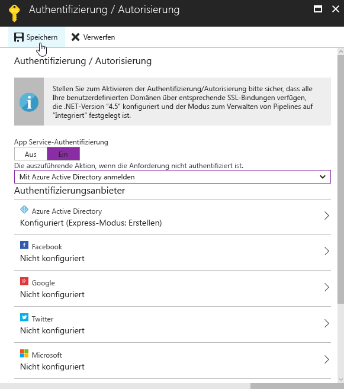

Wenn Sie versuchen, in einem neuen privaten Fenster zur API-URL zu navigieren, sollten Sie aufgefordert werden, sich mit Ihrem Azure AD-Konto anzumelden.

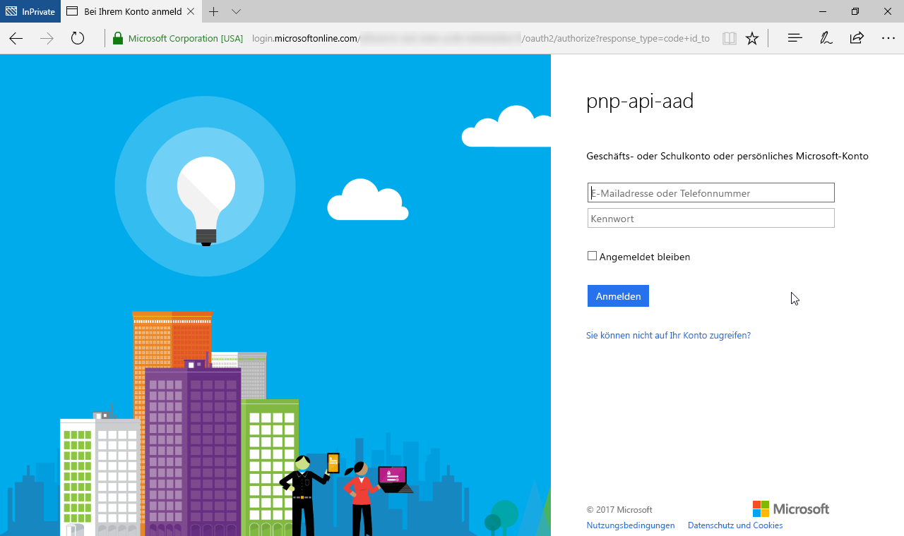

Zu diesem Zeitpunkt ist die API bereit, mit dem Authentifizerungscookie sicher von einem clientseitigen SharePoint-Framework-Webpart aufgerufen zu werden.

### <a name="build-the-api-using-aspnet-web-api"></a>Erstellen der API mit ASP.NET WebAPI

Eine andere Möglichkeit zum Implementieren der API ist die Verwendung von ASP.NET WebAPI. Im Vergleich zur Verwendung von Azure Functions zum Erstellen der API erfordert ASP.NET WebAPI wesentlich mehr Arbeit. Sie müssen nicht nur ein vollständiges Projekt dafür einrichten, sondern müssen sich auch Gedanken darüber machen, wo die API bereitgestellt werden soll. ASP.NET WebAPI bietet Ihnen andererseits mehr Flexibilität und ermöglicht Ihnen, die API auf verschiedenen Plattformen bereitzustellen, z. B. im Azure App Service, in Docker-Containern, bei anderen Cloudanbietern oder sogar in Ihrer Infrastruktur.

Nachfolgend wird erläutert, wie Sie eine API mithilfe von ASP.NET WebAPI erstellen, sie im Azure App Service bereitstellen und mithilfe der Azure App Service-Authentifizierung sichern. Später erweitern Sie die API, um die Authentifizierung selbständig durchzuführen, damit sie auch für andere Plattformen bereitgestellt werden kann.

#### <a name="create-new-aspnet-webapi-project"></a>Erstellen eines neuen ASP.NET WebAPI-Projekts

Wählen Sie in Visual Studio im Menü **Datei** die Option **Neu/Projekt**. Wählen Sie im Dialogfeld **Neues Projekt** C#-Webvorlagen, und wählen Sie aus der Liste der verfügbaren Vorlagen die Vorlage **ASP.NET-Webanwendung**.

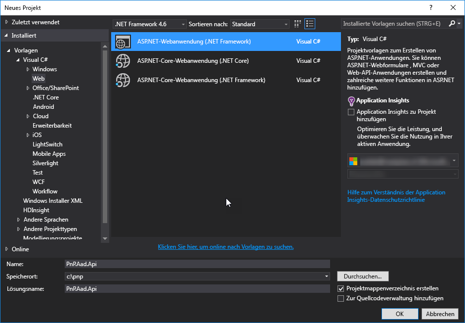

Wählen Sie als Typ des ASP.NET-Webanwendungsprojekts die Option **Web-API**.

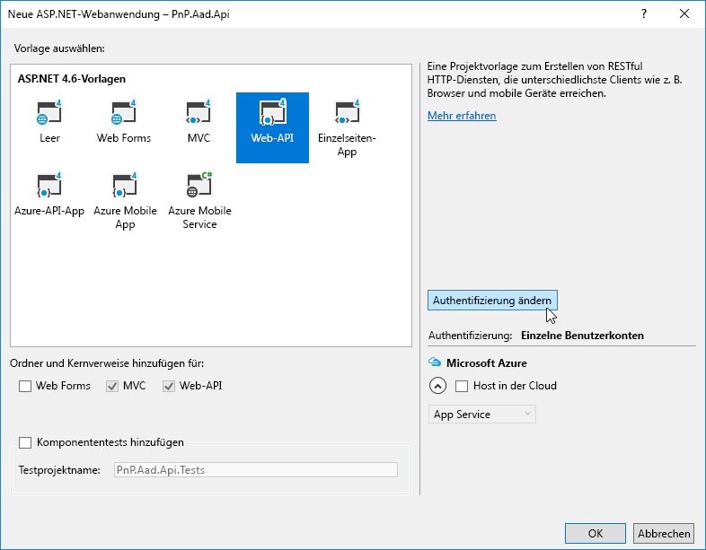

Da Sie die Azure App Service-Authentifizierung zum Sichern des Zugriffs auf die API verwenden möchten, klicken Sie auf die Schaltfläche **Authentifizierung ändern**, und wählen Sie die Option **Keine Authentifizierung**.

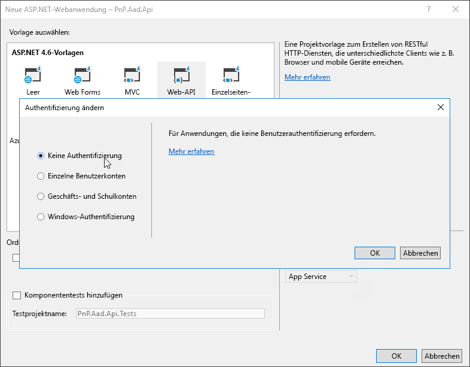

Bestätigen Sie die Auswahl, indem Sie auf **OK** klicken.

In Visual Studio können Sie Ihre WebAPI auf einfache Weise in Azure App Service bereitstellen. Um diese Funktion nutzen zu können, wählen Sie im Dialogfeld **Neue ASP.NET-Webanwendung** im Abschnitt **Microsoft Azure** den Abschnitt **In der Cloud hosten** aus, und wählen Sie in der Dropdownliste die Option **App Service** aus.

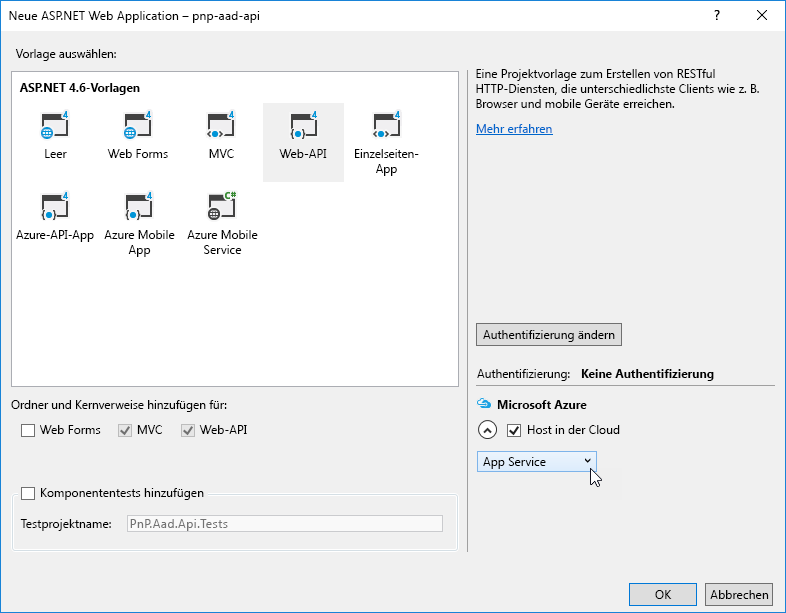

Geben Sie im Dialogfeld **App Service erstellen** den Namen für die Web-App an, die erstellt werden soll, und wählen Sie das Azure-Abonnement, die Ressourcengruppe und den App Service-Plan, die Sie für diese Anwendung verwenden möchten.

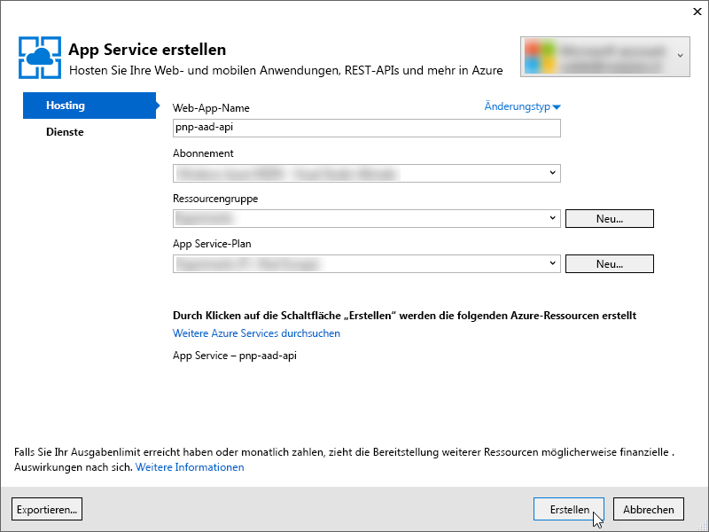

Bestätigen Sie Ihre Auswahl, indem Sie auf **Erstellen** klicken. Zu diesem Zeitpunkt erstellt Visual Studio eine neue Azure-Web-App zum Hosten der Webanwendung.

#### <a name="add-support-for-cors"></a>Hinzufügen der Unterstützung für CORS

Standardmäßig unterstützen APIs, die mit der Projektvorlage für ASP.NET-Webanwendungen erstellt wurden, CORS nicht und können nicht von Clientanwendungen aufgerufen werden, die in verschiedenen Domänen gehostet werden. Um Ihrer WebAPI Unterstützung für CORS hinzuzufügen, klicken Sie mit der rechten Maustaste auf das Projekt, und wählen Sie im Kontextmenü die Option **NuGet-Pakete verwalten**.

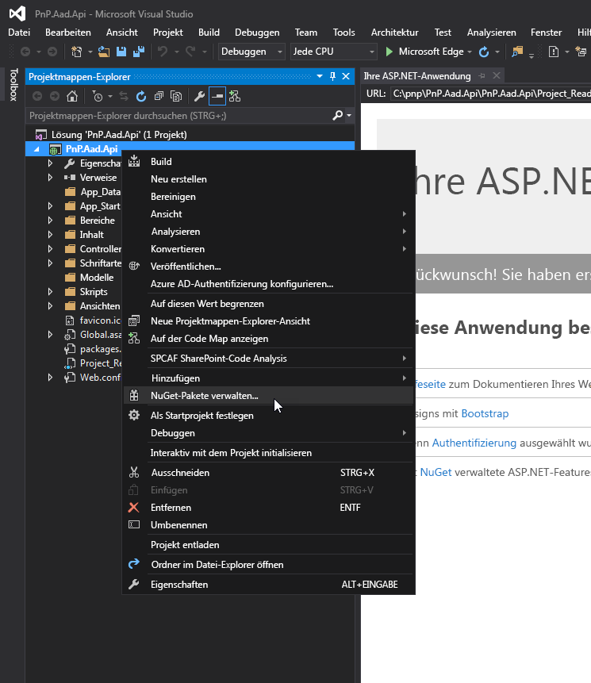

Suchen Sie auf der Registerkarte **NuGet-Pakete verwalten** nach einem Paket mit dem Namen **Microsoft.AspNet.WebApi.Cors**, und installieren Sie es in Ihrem Projekt.

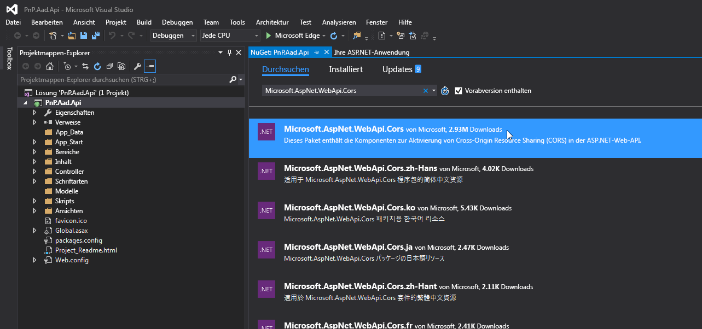

#### <a name="add-data-model"></a>Hinzufügen eines Datenmodells

Definieren Sie im Projekt ein Modell, das die von der API zurückgegebenen Daten darstellt. Fügen Sie im Ordner **Models** eine neue Klasse hinzu, und nennen Sie diese **Order**. Fügen Sie den folgenden Code in die neu erstellte Datei ein:

```cs
using Newtonsoft.Json;
using Newtonsoft.Json.Converters;
using System;

namespace PnP.Aad.Api.Models {
    public class Order {
        [JsonProperty(PropertyName = "id")]
        public int Id { get; set; }
        [JsonProperty(PropertyName = "orderDate")]
        public DateTime OrderDate { get; set; }
        [JsonConverter(typeof(StringEnumConverter))]
        [JsonProperty(PropertyName = "region")]
        public Region Region { get; set; }
        [JsonProperty(PropertyName = "rep")]
        public string Rep { get; set; }
        [JsonProperty(PropertyName = "item")]
        public string Item { get; set; }
        [JsonProperty(PropertyName = "units")]
        public uint Units { get; set; }
        [JsonProperty(PropertyName = "unitCost")]
        public double UnitCost { get; set; }
        [JsonProperty(PropertyName = "total")]
        public double Total { get; set; }
    }

    public enum Region {
        East,
        Central,
        West
    }
}
```

#### <a name="add-orders-api"></a>Hinzufügen der Auftrags-API

Fügen Sie als Nächstes eine API hinzu, die Informationen zu den neuesten Aufträgen zurückgibt. Erstellen Sie im Ordner **Controllers** eine neue Klasse, und nennen Sie diese **OrdersController**. Fügen Sie den folgenden Code in die neu erstellte Datei ein:

```cs
using PnP.Aad.Api.Models;
using System;
using System.Collections.Generic;
using System.Web.Http;

namespace PnP.Aad.Api.Controllers {
    public class OrdersController : ApiController {
        private List<Order> orders = new List<Order> {
            new Order {
                Id = 1,
                OrderDate = new DateTime(2016, 1, 6),
                Region = Region.East,
                Rep = "Jones",
                Item = "Pencil",
                Units = 95,
                UnitCost = 1.99,
                Total = 189.05
            },
            new Order {
                Id = 2,
                OrderDate = new DateTime(2016, 1, 23),
                Region = Region.Central,
                Rep = "Kivell",
                Item = "Binder",
                Units = 50,
                UnitCost = 19.99,
                Total = 999.50
            },
            new Order {
                Id = 3,
                OrderDate = new DateTime(2016, 2, 9),
                Region = Region.Central,
                Rep = "Jardine",
                Item = "Pencil",
                Units = 36,
                UnitCost = 4.99,
                Total = 179.64
            },
            new Order {
                Id = 4,
                OrderDate = new DateTime(2016, 2, 26),
                Region = Region.Central,
                Rep = "Gill",
                Item = "Pen",
                Units = 27,
                UnitCost = 19.99,
                Total = 539.73
            },
            new Order {
                Id = 5,
                OrderDate = new DateTime(2016, 3, 15),
                Region = Region.West,
                Rep = "Sorvino",
                Item = "Pencil",
                Units = 56,
                UnitCost = 2.99,
                Total = 167.44
            }
        };

        public IEnumerable<Order> Get() {
            return orders;
        }
    }
}
```

#### <a name="extend-the-api-with-support-for-cors"></a>Erweitern der API zur Unterstützung von CORS

Obwohl Sie die Unterstützung für CORS in Ihrem Projekt installiert haben, wird dies noch nicht aktiv verwendet. Wenn Sie die neue erstellte Aufträge-SPI von einer Clientanwendung aus aufrufen würden, die auf einer anderen Domäne gehostet wird, würde dies zu einem CORS-Fehler und zu einem Fehler bei der Anforderung führen. Damit eine API CORS unterstützt, muss sie durch das Attribut **EnableCors** aktiviert werden.

```cs
using PnP.Aad.Api.Models;
using System;
using System.Collections.Generic;
using System.Web.Http;
using System.Web.Http.Cors;

namespace PnP.Aad.Api.Controllers {
    public class OrdersController : ApiController {
        private List<Order> orders = new List<Order> {
            // ...
        };

        [EnableCors("*", "*", "GET", SupportsCredentials = true)]
        public IEnumerable<Order> Get() {
            return orders;
        }
    }
}
```

Öffnen Sie als Nächstes die Datei **.\App_Start\WebApiConfig.cs**, und fügen Sie den folgenden Code ein:

```cs
using System.Web.Http;

namespace PnP.Aad.Api {
    public static class WebApiConfig {
        public static void Register(HttpConfiguration config) {
            // Web API configuration and services

            // Web API routes
            config.MapHttpAttributeRoutes();

            config.EnableCors();

            config.Routes.MapHttpRoute(
                name: "DefaultApi",
                routeTemplate: "api/{controller}/{id}",
                defaults: new { id = RouteParameter.Optional }
            );
        }
    }
}
```

An diesem Punkt ist der API-Code vollständig und kann in der Azure-Web-App veröffentlicht werden.

#### <a name="publish-the-api-to-azure-web-app"></a>Veröffentlichen der API in der Azure-Web-App

Klicken Sie in Visual Studio mit der rechten Maustaste auf das Projekt, und wählen Sie im Kontextmenü die Option **Veröffentlichen **.


Stellen Sie sicher, dass im Dialogfeld „Veröffentlichen“ alle Informationen richtig sind, und klicken Sie auf die Schaltfläche **Veröffentlichen**, um den Veröffentlichungsvorgang zu starten.


Navigieren Sie nach Abschluss der Veröffentlichung zur API-URL, z. B. _http://pnp-aad-api.azurewebsites.net/api/orders_. Zu diesem Zeitpunkt ist die API nicht gesichert, und anonyme Benutzer können darauf zugreifen.

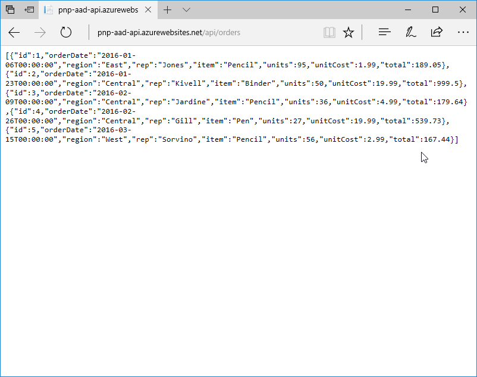

#### <a name="secure-the-api-using-azure-app-service"></a>Sichern der API durch Azure App Service

Um die API mit Azure AD zu sichern, rufen Sie das Azure-Portal auf, und öffnen Sie die Web-App, die die API hostet. Wählen Sie in der Gruppe **Einstellungen** die Option **Authentifizierung/Autorisierung**. 


Legen Sie zum Aktivieren der Authentifizierung für Ihre Web App die Option **App Service-Authentifizierung** auf **Ein** fest.

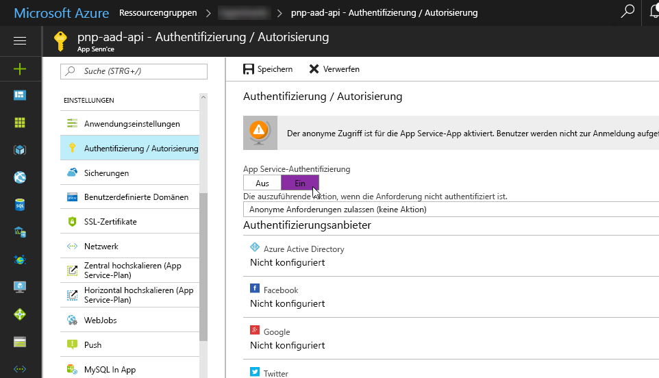

Um den anonymen Zugriff auf die API zu verweigern, wählen Sie in der Dropdownliste **Die auszuführende Aktion, wenn die Anforderung nicht authentifiziert ist** die Option **Mit Azure Active Directory anmelden** aus.

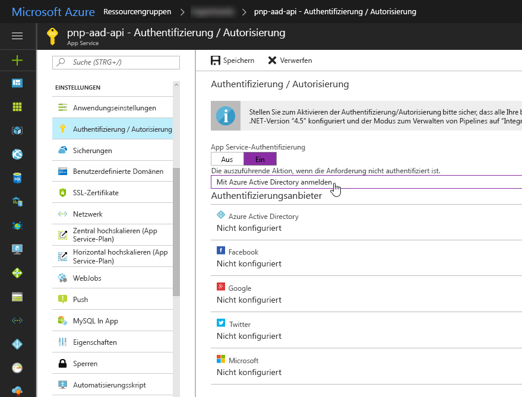

Konfigurieren Sie abschließend die Azure Active Directory-Authentifizierung in der Liste der Authentifizierungsanbieter, indem Sie **Azure Active Directory** auswählen.

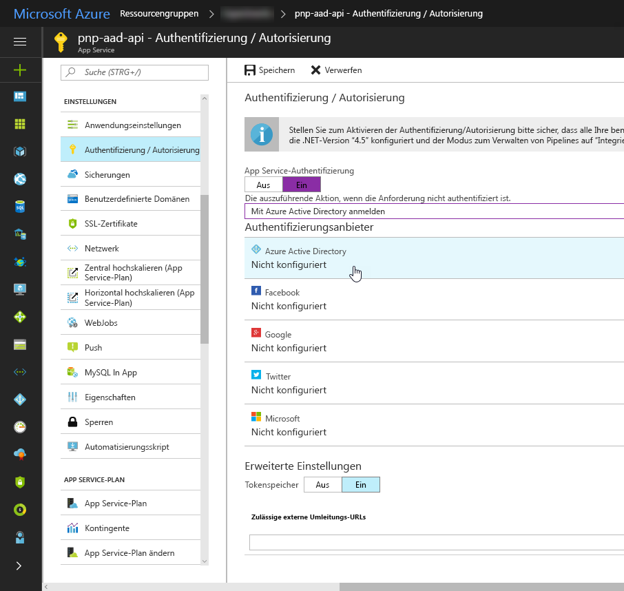

Stellen Sie auf dem Blatt „Active Directory-Authentifizierung“ den **Verwaltungsmodus** auf **Express** ein, und erstellen Sie eine neue AAD-App.

> **Wichtig:** Wenn Sie den Express-Konfigurationsmodus verwenden, erstellt das Azure-Portal eine neue AAD-Anwendung aus demselben Verzeichnis, in dem sich die Funktionen-App befindet. Wenn die Funktionen-App in einem anderen Azure-Abonnement mit einem anderen Verzeichnis gehostet wird, müssen Sie stattdessen den erweiterten Modus verwenden und die ID des Verzeichnisses und der Anwendung angeben, die verwendet werden soll, um den Zugriff auf die API zu sichern.
>
> Wenn Sie vorhandene AAD-Anwendungen verwenden, müssen Sie die Anwendung so konfigurieren, dass sie nur Anmeldeinformationen von einem einzigen Mandanten akzeptiert. Die Konfiguration der Anwendung als mehrinstanzfähig würde jedem Benutzer mit einem gültigen Organisationskonto oder persönlichen Konto ermöglichen, eine Verbindung zu Ihrer API herzustellen.
>
> Die Verwendung einer AAD-Anwendung zum Sichern des Zugriffs auf Ihre API gilt nur für die Authentifizierung. Beim Erstellen Ihrer API müssen Sie auch Anforderungen im Code der API autorisieren, um sicherzustellen, dass nur Benutzer mit entsprechenden Berechtigungen die API verwenden.

Da die App nur zum Sichern des Zugriffs auf die Azure-Funktion vorgesehen ist, sind keine zusätzlichen Berechtigungen erforderlich. Bestätigen Sie die Auswahl, indem Sie auf **OK** klicken.

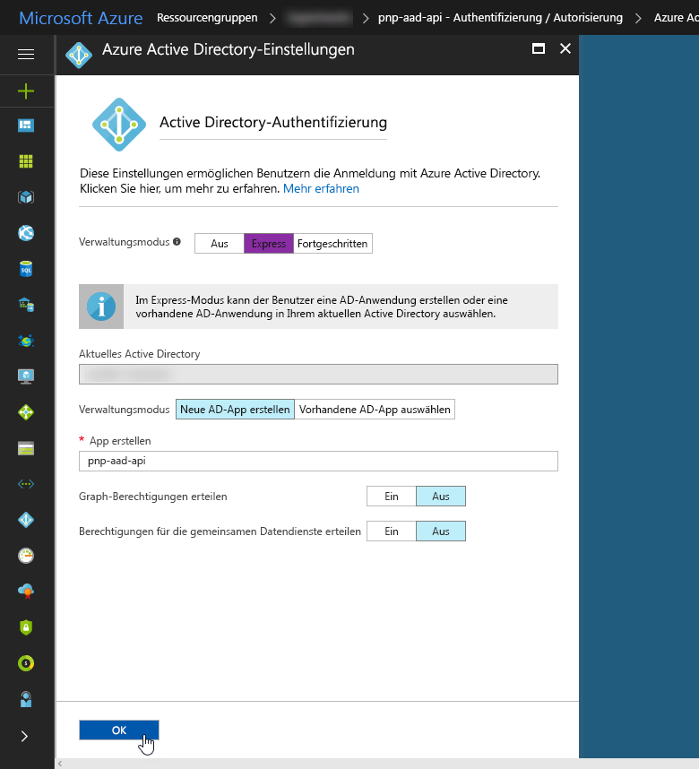

Wenn des Azure Active Directory-Blatt auf dem Blatt **Authentifizierung / Autorisierung** geschlossen wird, klicken Sie auf **Speichern**, um alle Änderungen an den Authentifizierungseinstellungen zu bestätigen.

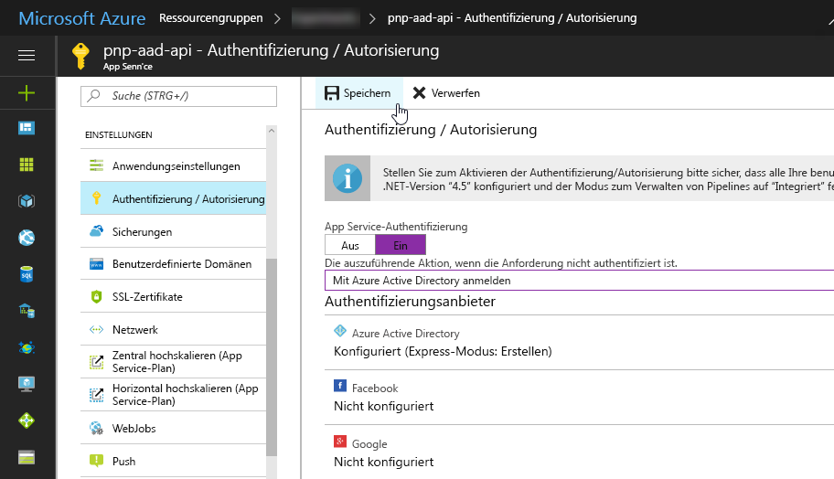

Wenn Sie versuchen, in einem neuen privaten Fenster zur API-URL zu navigieren, sollten Sie aufgefordert werden, sich mit Ihrem Azure AD-Konto anzumelden.

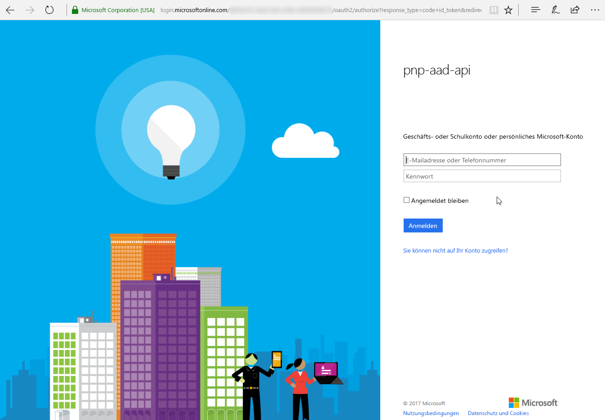

Zu diesem Zeitpunkt ist die API bereit, mit dem Authentifizerungscookie sicher von einem clientseitigen SharePoint-Framework-Webpart aufgerufen zu werden.

#### <a name="secure-the-api-using-openid"></a>Sichern der API mit OpenID

Wenn Sie Ihr ASP.NET WebAPI-Projekt an einem anderen Ort als in Azure App Service bereitstellen möchten und sie mit AAD gesichert werden soll, können Sie sich nicht auf die App Service-Authentifizierung verlassen. In diesem Fall müssen Sie die Webanwendung so erweitern, dass sie selbst die Benutzerauthentifizierung erfordert, bevor die Benutzer die API aufrufen können.

##### <a name="disable-anonymous-access-to-all-resources"></a>Deaktivieren des anonymen Zugriffs auf alle Ressourcen

Ausgehend davon, dass alle Ressourcen gesichert sein sollen,öffnen Sie die Datei **.\App_Start\FilterConfig.cs**, und fügen Sie den folgenden Code ein:

```cs
using System.Web.Mvc;

namespace PnP.Aad.Api {
    public class FilterConfig {
        public static void RegisterGlobalFilters(GlobalFilterCollection filters) {
            filters.Add(new HandleErrorAttribute());
            filters.Add(new AuthorizeAttribute());
        }
    }
}
```

Um die Authentifizierung für alle APIs zu erfordern, öffnen Sie die Datei **.\App_Start\WebApiConfig.cs**, und fügen Sie den folgenden Code ein:

```cs
using System.Web.Http;

namespace PnP.Aad.Api {
    public static class WebApiConfig {
        public static void Register(HttpConfiguration config) {
            // Web API configuration and services

            // Web API routes
            config.MapHttpAttributeRoutes();

            config.EnableCors();
            config.Filters.Add(new AuthorizeAttribute());

            config.Routes.MapHttpRoute(
                name: "DefaultApi",
                routeTemplate: "api/{controller}/{id}",
                defaults: new { id = RouteParameter.Optional }
            );
        }
    }
}
```

Wenn Sie versuchen würden, entweder auf die API oder eine andere Ressource in der Webanwendung zuzugreifen, erhielten Sie die Fehlermeldung „401 - nicht autorisiert“.

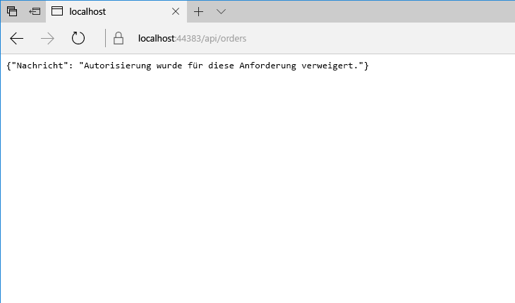

An diesem Punkt erfordert die Webanwendung, dass alle Anforderungen an ihre Ressourcen authentifiziert werden, wobei jedoch nicht der AAD-Anmeldefluss gestartet wird. In den folgenden Schritten erweitern Sie die Webanwendung, damit der Benutzer zur Anmeldeseite von Azure AD umgeleitet wird, wenn er zuvor noch nicht authentifiziert wurde.

##### <a name="register-azure-ad-application"></a>Registrieren der Azure AD-Anwendung

Um eine API mit Azure Active Directory zu sichern, müssen Sie eine Azure AD-Anwendung registrieren. Diese Anwendung wird dann im Webanwendungsprojekt referenziert und von der OWIN-Middleware verwendet, um den Zugriff auf Ihre API mit Azure AD zu sichern.

Wenn Sie noch keine AAD-Anwendung haben, können Sie eine im Azure-Portal erstellen, in dem Sie das Blatt „Azure Active Directory“ aufrufen.

> **Wichtig:** Die Azure AD-Anwendung, die zum Sichern der API verwendet wird, muss in demselben Azure Active Directory erstellt werden, das Ihre Organisation zum Zugreifen auf Office 365 verwendet.

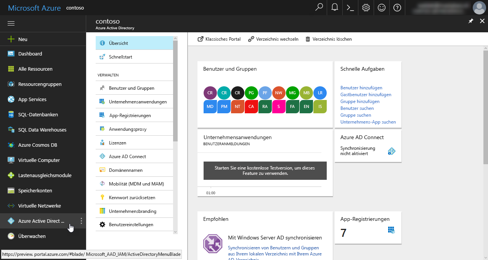

Wechseln Sie auf dem Blatt „Azure Active Directory“ zum Blatt **App-Registrierungen**.

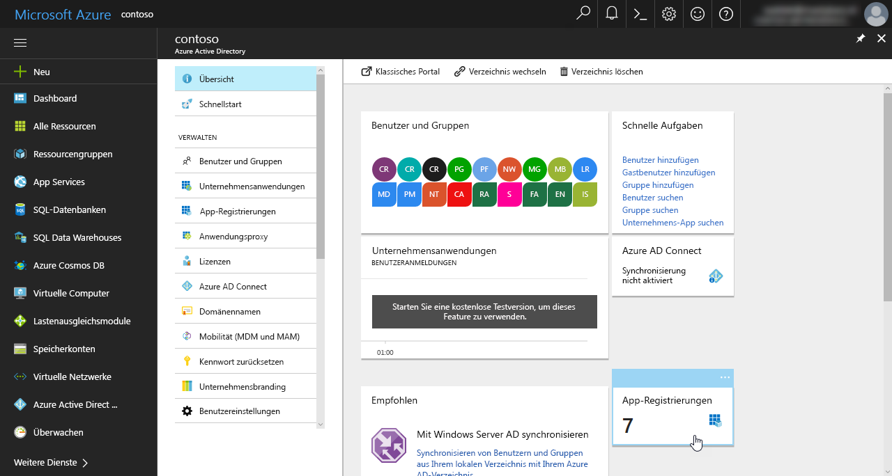

Klicken Sie auf dem Blatt **App-Registrierungen** auf die Schaltfläche **Registrierung einer neuen Anwendung**, um eine neue Azure AD-Anwendung zu registrieren.


Stellen Sie auf dem Blatt **Erstellen** die Informationen zu Ihrer Anwendung bereit, und bestätigen Sie die Erstellung, indem Sie auf **Erstellen** klicken.

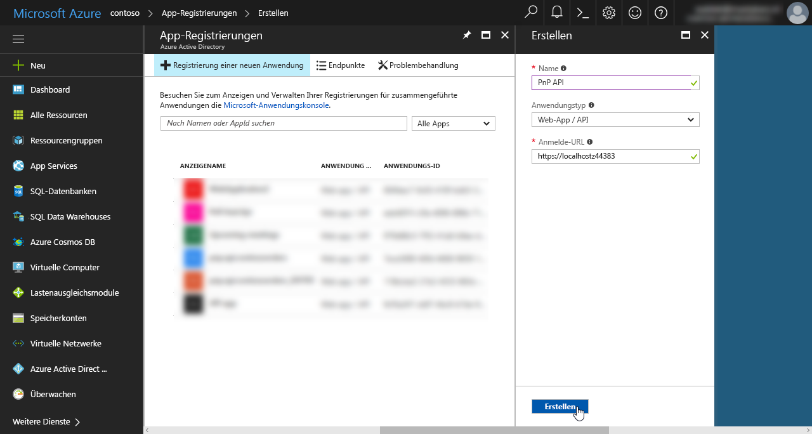

Nachdem die Anwendungsregistrierung erfolgreich erstellt wurde, wählen Sie diese in der Liste aus, um die Details anzuzeigen.

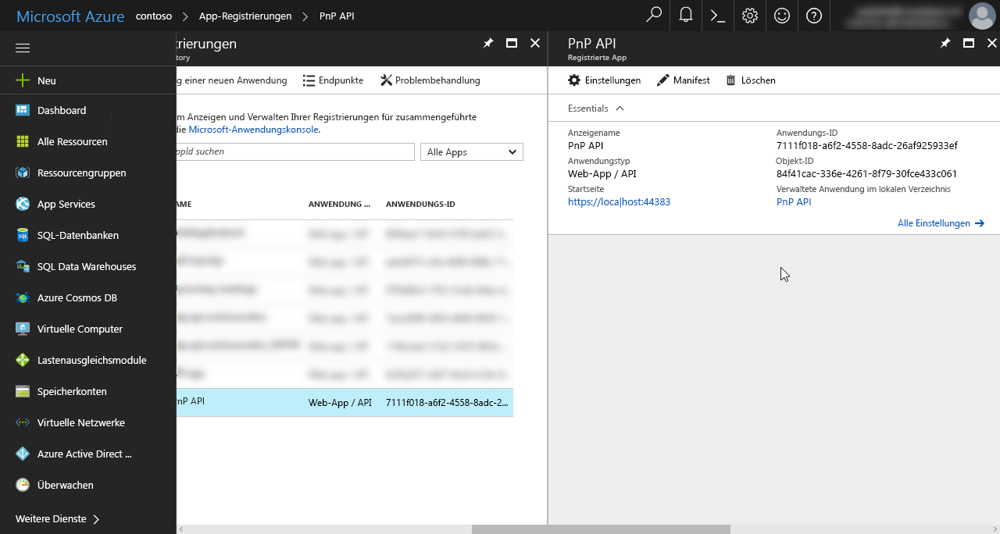

Kopieren Sie aus den Informationen zur Anwendungsregistrierung die **ID der Anwendung**, und speichern Sie diese, da Sie sie bei der Konfiguration der Azure AD-Authentifizierung für Ihre Webanwendung benötigen.

##### <a name="redirect-anonymous-requests-to-azure-ad-login-page"></a>Umleiten von anonyme Anforderungen zur Azure AD-Anmeldeseite

Klicken Sie in Visual Studio mit der rechten Maustaste auf das Projekt, und wählen Sie im Kontextmenü die Option **NuGet-Pakete verwalten**. Fügen Sie im Fenster **NuGet-Pakete verwalten** Ihrem Projekt die folgenden Pakete hinzu:

- Microsoft.Owin.Host.SystemWeb
- Microsoft.Owin.Security.Cookies
- Microsoft.Owin.Security.OpenIdConnect

Fügen Sie im Stammverzeichnis des Projekts eine neue Klasse mit dem Namen **Startup** hinzu, und fügen Sie den folgenden Code ein:

```cs
using Owin;

namespace PnP.Aad.Api {
    public partial class Startup
    {
        public void Configuration(IAppBuilder app)
        {
            ConfigureAuth(app);
        }
    }
}
```

Erstellen Sie dann im Ordner **App_Start** eine neue Klasse mit dem Namen **Startup.Auth**, und fügen Sie den folgenden Code ein:

```cs
using Microsoft.Owin.Security;
using Microsoft.Owin.Security.Cookies;
using Microsoft.Owin.Security.OpenIdConnect;
using Owin;
using System.Configuration;

namespace PnP.Aad.Api {
    public partial class Startup {
        // For more information on configuring authentication, please visit http://go.microsoft.com/fwlink/?LinkId=301864
        public void ConfigureAuth(IAppBuilder app) {
            app.SetDefaultSignInAsAuthenticationType(CookieAuthenticationDefaults.AuthenticationType);

            app.UseCookieAuthentication(new CookieAuthenticationOptions());

            app.UseOpenIdConnectAuthentication(
                new OpenIdConnectAuthenticationOptions {
                    ClientId = ConfigurationManager.AppSettings["ida:ClientId"],
                    Authority = $"https://login.microsoftonline.com/{(ConfigurationManager.AppSettings["ida:Tenant"])}",
                    PostLogoutRedirectUri = ConfigurationManager.AppSettings["ida:PostLogoutRedirectUri"],
                });
        }
    }
}
```

Öffnen Sie in Visual Studio die Datei **Web.config**, und fügen Sie im Abschnitt **appSettings** die folgenden Elemente hinzu:

```xml
<add key="ida:Tenant" value="contoso.onmicrosoft.com" />
<add key="ida:ClientId" value="eeb40f1f-c5fa-4096-896b-71c77d459e21" />
<add key="ida:PostLogoutRedirectUri" value="https://localhost:44320/" />
```

Der Wert des Schlüssels **ida:Tenant** ist der Name des Azure AD, in dem die Azure AD-App definiert ist, die zum Sichern der API verwendet wird. **ida:ClientId** gibt die ID der Azure AD-Anwendung an, die zum Sichern der API verwendet wird. Die in der Eigenschaft **ida:PostLogoutRedirectUri** angegebene URL ist die URL, an die AAD nach der Abmeldung von der Anwendung weiterleitet, was in diesem Fall nicht verwendet wird.

Hiermit ist der Konfigurationsprozess abgeschlossen. Wenn Sie Ihre Webanwendung starten, werden Sie, bevor Sie auf die Ressourcen zugreifen können, aufgefordert, sich mit Ihrem Azure AD-Konto anzumelden. Um sicherzustellen, dass nur autorisierte Benutzer auf diese bestimmte API zugreifen, sollten Sie in Ihren benutzerdefinierten APIs die Autorisierung implementieren. Sie können dies vornehmen, indem Sie den Benutzernamen aus der Eigenschaft `RequestContext.Principal.Identity` abrufen und mit Ihrer Sicherheitsmatrix vergleichen.

## <a name="see-also"></a>Siehe auch

- [ Aufrufen von benutzerdefinierten APIs, die mit Azure Active Directory ohne ADAL JS gesichert sind (Codebeispiel)](https://github.com/SharePoint/sp-dev-fx-webparts/tree/master/samples/aad-api-spo-cookie)