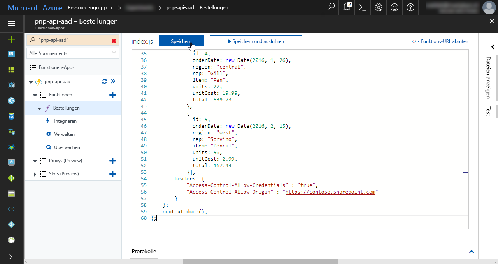
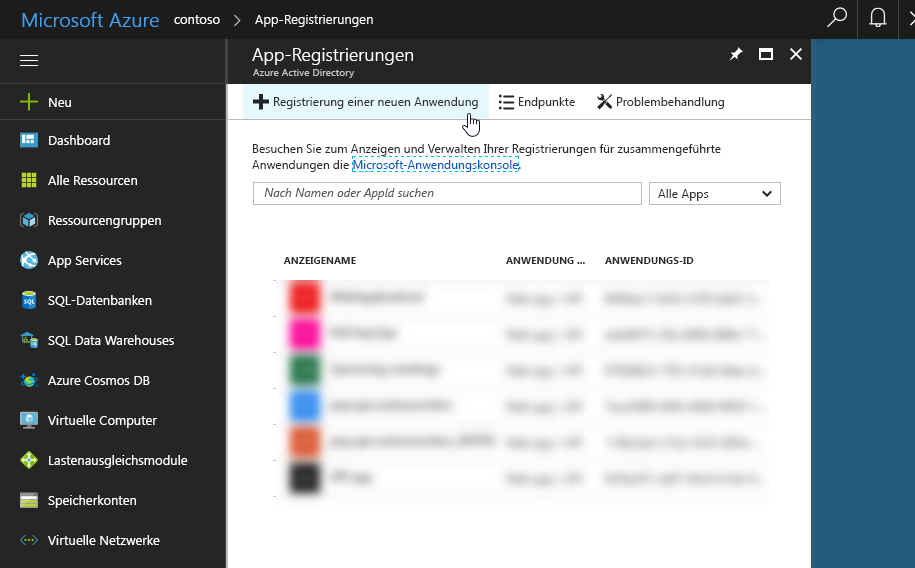

# <a name="connect-to-api-secured-with-azure-active-directory"></a><span data-ttu-id="71087-102">Herstellen einer mit Azure Active Directory gesicherten Verbindung zu einer API</span><span class="sxs-lookup"><span data-stu-id="71087-102">Connect to API secured with Azure Active Directory</span></span>

<span data-ttu-id="71087-p101">Beim Erstellen von SharePoint-Framework-Lösungen müssen Sie möglicherweise eine Verbindung mit Ihrer benutzerdefinierten API zum Abrufen von Daten oder zum Kommunizieren mit Branchenanwendungen herstellen. Das Sichern von benutzerdefinierten APIs mit Azure Active Directory bietet Ihnen eine Reihe von Vorteilen und kann auf verschiedene Weise erfolgen. Nachdem Sie die API erstellt haben, gibt es verschiedene Möglichkeiten, wie Sie darauf zugreifen können. Diese Methoden variieren hinsichtlich ihrer Komplexität und haben jeweils ihre eigenen Aspekte. Dieser Artikel behandelt die verschiedenen Ansätze und beschreibt schrittweise den Prozess zum Erstellen und Herstellen einer Verbindung mit einer durch Azure Active Directory geschützten API.</span><span class="sxs-lookup"><span data-stu-id="71087-p101">When building SharePoint Framework solutions you might need to connect to your custom API to retrieve some data or to communicate with line of business applications. Securing custom APIs with Azure Active Directory offers you a number of benefits and can be done in a number of ways. Once you have built the API, there are a number of ways in which you can access it. These ways vary in complexity and each have their specific considerations. This article discusses the different approaches and describes step-by-step the process of building and connecting to an API secured with Azure Active Directory.</span></span>

## <a name="secure-an-api-with-azure-active-directory"></a><span data-ttu-id="71087-108">Sichern einer API mit Azure Active Directory</span><span class="sxs-lookup"><span data-stu-id="71087-108">Secure an API with Azure Active Directory</span></span>

<span data-ttu-id="71087-p102">Wenn Sie Office 365 verwenden, ist das Sichern von benutzerdefinierten APIs mit Azure Active Directory eine Architekturoption, die Sie auf jeden Fall in Betracht ziehen sollten. Vor allem ist zu betonen, dass hierdurch ermöglicht wird, den Zugriff auf die API mit in der Organisation bereits vorhandenen Anmeldeinformationen zu schützen, die bereits über Office 365 und Azure Active Directory verwaltet werden. Benutzer mit einem aktiven Konto können problemlos mit Anwendungen arbeiten, die durch AAD geschützte APIs verwenden. Azure Active Directory-Administratoren können den Zugriff auf die API zentral verwalten, und zwar auf die gleiche Weise, auf die sie den Zugriff auf alle anderen in AAD registrierten Programme verwalten.</span><span class="sxs-lookup"><span data-stu-id="71087-p102">If you're using Office 365, securing custom APIs using Azure Active Directory is an architectural option that you should definitely consider. First and foremost, it allows you to secure the access to the API using existing organizational credentials that are already managed through Office 365 and Azure Active Directory. User with an active account can seamlessly work with applications that leverage APIs secured with AAD. Azure Active Directory administrators can centrally manage access to the API, the same way they manage access to all other applications registered with the AAD.</span></span>

<span data-ttu-id="71087-p103">Als API-Entwickler entfällt bei der Verwendung von Azure AD zum Sichern Ihrer API die Notwendigkeit, einen proprietären Satz von Benutzeranmeldeinformationen verwalten und eine benutzerdefinierte Sicherheitsstufe für Ihre API implementieren zu müssen. Darüber hinaus unterstützt Azure Active Directory das OAuth-Protokoll, mit dem Sie von einer Reihe von Anwendungstypen, angefangen bei mobilen Apps bis hin zu clientseitigen Lösungen, eine Verbindung zur API herstellen können.</span><span class="sxs-lookup"><span data-stu-id="71087-p103">As the API developer, using Azure AD to secure your API frees you from managing a proprietary set of user credentials and implementing a custom security layer for your API. Additionally, Azure Active Directory supports the OAuth protocol which allows you to connect to the API from a range of application types varying from mobile apps to client-side solutions.</span></span>

<span data-ttu-id="71087-p104">Beim Erstellen von benutzerdefinierten APIs gibt es zwei Hauptmethoden, mit denen Sie Ihre API mit Azure Active Directory schützen können. Wenn Sie die API in Microsoft Azure App Service hosten, können Sie die App-Authentifizierungsoption nutzen. Wenn Sie für Ihre API flexiblere Hostingmöglichkeiten nutzen möchten, sie z. B. in Ihrer eigenen Infrastruktur oder in Docker-Containern hosten möchten, müssen Sie sie im Code sichern. In diesem Fall hängt die Implementierung von der Programmiersprache und dem Framework ab. In diesem Artikel werden bei der Erläuterung dieser Option C# und die ASP.NET-Web-API als Framework verwendet.</span><span class="sxs-lookup"><span data-stu-id="71087-p104">When building custom APIs there are two main ways in which you can secure your API with Azure Active Directory. If you host the API in Microsoft Azure App Service, you can benefit of the App Service Authentication option. If you look for more hosting flexibility for your API, such as hosting it on your own infrastructure or in Docker containers, then you will need to secure it in code. In such case the implementation depends on your programming language and framework. In this article, when discussing this option, you will use C# and ASP.NET Web API as the framework.</span></span>

### <a name="secure-the-api-using-azure-app-service-authentication"></a><span data-ttu-id="71087-120">Sichern einer API durch Azure App Service-Authentifizierung</span><span class="sxs-lookup"><span data-stu-id="71087-120">Secure the API using Azure App Service Authentication</span></span>

<span data-ttu-id="71087-p105">Bei der Bereitstellung von benutzerdefinierten APIs im Azure App Service können Sie die App Service-Authentifizierungsoption zum sichern der API mit Azure Active Directory nutzen. Der größte Vorteil bei der Verwendung der App Service-Authentifizierung ist seine Einfachheit: Indem Sie den Schritten im Azure-Portal folgen, können Sie die Authentifizierungskonfiguration mithilfe des Assistenten vornehmen. Wenn Sie die Basiseinrichtung auswählen, erstellt der Assistent eine neue AAD-Anwendung in dem Azure Active Directory, das mit dem aktuellen Abonnement verknüpft ist. Bei der erweiterten Konfiguration können Sie entscheiden, welche AAD-Anwendung zum Sichern des Zugriffs auf den App Service, der die API hostet, verwendet werden soll.</span><span class="sxs-lookup"><span data-stu-id="71087-p105">When deploying custom APIs to Azure App Service you can benefit of the App Service Authentication option to secure the API with Azure Active Directory. The biggest benefit of using App Service Authentication is its simplicity: by following the configuration steps available in the Azure Portal you can either have the wizard setup the authentication configuration for you. If you choose the basic setup, the wizard will create a new AAD application in the Azure Active Directory associated with the current subscription. In the advanced configuration, you can choose which AAD application should be used to secure the access to the App Service hosting the API.</span></span>


<span data-ttu-id="71087-p106">Nachdem die App Service-Authentifizierung konfiguriert wurde, werden Benutzer, die auf Ihre API zugreifen möchten aufgefordert, sich mit ihrem Organisationskonto anzumelden, das zu demselben Azure Active Directory wie die AAD-Anwendung gehört, die zum Sichern der API verwendet wird. Nach der Anmeldung können Sie über die Eigenschaft `HttpContext.Current.User` auf Informationen zum aktuellen Benutzer zugreifen. Wenn Sie die Azure App Service-Authentifizierung verwenden, müssen Sie keine zusätzlichen Konfigurationen für die Anwendung vornehmen.</span><span class="sxs-lookup"><span data-stu-id="71087-p106">Once App Service Authentication has been configured, users trying to access your API will be prompted to sign in with their organizational account that belongs to the same Azure Active Directory as the AAD application used to secure the API. After signing in, you will be able to access the information about the current user through the `HttpContext.Current.User` property. When using the Azure App Service Authentication there is no additional configuration required in your application.</span></span>

<span data-ttu-id="71087-p107">Die Azure App Service-Authentifizierung ist ein Feature, das nur in Microsoft Azure-App Services zur Verfügung steht. Obwohl diese Funktion die Implementierung der Authentifizierung für Ihre API erheblich vereinfacht, ist sie jedoch auch daran gebunden, in einem Azure App Service ausgeführt zu werden. Wenn Sie die API bei einem anderen Cloudanbieter oder in einem Docker-Container hosten möchten, müssten Sie zuerst die Authentifizierungsebene implementieren.</span><span class="sxs-lookup"><span data-stu-id="71087-p107">Azure App Service Authentication is a feature available only in Microsoft Azure App Services. While this capability significantly simplifies implementing authentication in your API, it ties it to running inside Azure App Service. If you would want to host the API with another cloud provider or would want to host it inside a Docker container, you would need to implement the authentication layer first.</span></span>

### <a name="secure-the-api-using-aspnet-authentication"></a><span data-ttu-id="71087-132">Sichern einer API durch ASP.NET-Authentifizierung</span><span class="sxs-lookup"><span data-stu-id="71087-132">Secure the API using ASP.NET authentication</span></span>

<span data-ttu-id="71087-p108">Wenn Sie im Hinblick darauf, wo Ihre API gehostet und wie sie bereitgestellt wird, maximale Flexibilität wünschen, sollten Sie die die Implementierung der Unterstützung für die AAD-Authentifizierung in ASP.NET in Betracht ziehen. Visual Studio vereinfacht die Implementierung erheblich, und nach Abschluss des Setup-Assistenten für die Authentifizierung fordert die API Benutzer auf, sich mit ihrem Organisationskonto anzumelden.</span><span class="sxs-lookup"><span data-stu-id="71087-p108">If you want to have the maximum flexibility with regards to where your API is hosted and how it is deployed, you should consider implementing the support for AAD authentication in ASP.NET. Visual Studio simplifies the implementation process significantly and after completing the authentication setup wizard, your API will require users to sign in using their organizational account.</span></span>


<span data-ttu-id="71087-136">Während des Konfigurationsvorgangs fügt Visual Studio alle erforderlichen Verweise und Einstellungen dem ASP.NET-Web-API hinzu, einschließlich der Registrierung einer neuen AAD-Anwendung zum Sichern Ihrer API.</span><span class="sxs-lookup"><span data-stu-id="71087-136">During the configuration process, Visual Studio will add all the necessary references and settings to your ASP.NET Web API project, including registering a new AAD application to secure your API.</span></span>

## <a name="access-an-api-secured-with-azure-active-directory-from-sharepoint-framework-solutions"></a><span data-ttu-id="71087-137">Zugriff auf eine durch Azure Active Directory gesicherte API über SharePoint-Framework-Lösungen</span><span class="sxs-lookup"><span data-stu-id="71087-137">Access an API secured with Azure Active Directory from SharePoint Framework solutions</span></span>

<span data-ttu-id="71087-p109">SharePoint-Framework-Lösungen befinden sich vollständig auf der Clientseite und sind daher nicht in der Lage, Geheimnisse sicher zu speichern, die zum Herstellen einer Verbindung zu gesicherten APIs erforderlich sind. Um die sichere Kommunikation mit clientseitigen Lösungen zu unterstützen, können in Azure Active Directory verschiedene Mechanismen verwendet werden, wie z. B. Authentifizierungscookies oder der implizite OAuth-Fluss.</span><span class="sxs-lookup"><span data-stu-id="71087-p109">SharePoint Framework solutions are fully client-side and as such are incapable of securely storing secrets required to connect to secured APIs. To support secure communication with client-side solutions, Azure Active Directory supports a number of mechanisms such as authentication cookies or the OAuth implicit flow.</span></span>

### <a name="access-the-api-using-adal-js"></a><span data-ttu-id="71087-140">Zugreifen auf eine API mit ADAL JS</span><span class="sxs-lookup"><span data-stu-id="71087-140">Access the API using ADAL JS</span></span>

<span data-ttu-id="71087-p110">Eine häufig verwendete Methode zur Kommunikation von clientseitigen Lösungen mit APIs, die durch Azure Active Directory geschützt sind, ist die Verwendung der [ADAL JS](https://github.com/AzureAD/azure-activedirectory-library-for-js)-Bibliothek. ADAL JS vereinfacht die Implementierung der Authentifizierung bei AAD in clientseitige Anwendungen sowie das Abrufen von Zugriffstoken für bestimmte Ressourcen. Bei Anwendungen, die mit AngularJS erstellt wurden, bietet ADAL JS einen HTTP-Anforderungs-Interceptor, der den Headern ausgehender Webanforderungen automatisch die erforderlichen Zugriffstoken hinzufügt. Bei Verwendung dieses Anforderers müssen Entwickler Webanfragen an APIs, die durch AAD gesichert sind, nicht ändern und können sich stattdessen auf die Erstellung der Anwendung konzentrieren.</span><span class="sxs-lookup"><span data-stu-id="71087-p110">A commonly used approach for communicating with APIs secured with Azure Active Directory from client-side solutions is using the [ADAL JS](https://github.com/AzureAD/azure-activedirectory-library-for-js) library. ADAL JS simplifies implementing authentication against AAD in client-side applications as well as retrieving access tokens for specific resources. For applications built using AngularJS, ADAL JS offers an HTTP request interceptor that automatically adds required access tokens to headers of outgoing web requests. Using this requestor developers don't need to modify web requests to APIs secured with AAD and can focus on building the application instead.</span></span>

#### <a name="benefits-of-using-adal-js-to-communicate-with-apis-secured-with-aad"></a><span data-ttu-id="71087-145">Vorteile der Verwendung von ADAL JS zur Kommunikation mit AAD-gesicherten APIs</span><span class="sxs-lookup"><span data-stu-id="71087-145">Benefits of using ADAL JS to communicate with APIs secured with AAD</span></span>

<span data-ttu-id="71087-p111">Bei der Verwendung ADAL JS haben clientseitige Anwendungen vollen Zugriff auf die Identitätsinformationen des Benutzers, der aktuell angemeldet ist. Dies ist hilfreich, wen in der Anwendung z. B. der Benutzername oder das Profilbild angezeigt werden soll. Beim Erstellen von Lösungen, die in SharePoint gehostet werden, können Entwickler erweiterte Profilinformationen mithilfe der SharePoint-API abrufen, was bei eigenständigen Anwendungen nicht möglich ist.</span><span class="sxs-lookup"><span data-stu-id="71087-p111">When using ADAL JS, client-side applications have full access to the identity information of the currently signed-in user. This is convenient for requirements such as displaying user name or profile picture in the application. When building solutions hosted in SharePoint, developers can retrieve extended profile information using the SharePoint API, but for standalone applications this isn't possible.</span></span>

<span data-ttu-id="71087-p112">ADAL JS erleichtert nicht nur die Authentifizierung bei AAD, sondern kann auch Zugriffstoken für bestimmte Ressourcen abrufen. Mit diesen Zugriffstoken können Anwendungen sicher auf APIs zugreifen, die durch AAD geschützt sind, wie z. B. die [Microsoft Graph](./call-microsoft-graph-from-your-web-part.md)-API oder andere benutzerdefinierte APIs. Bevor eine clientseitige Anwendung ADAL JS verwenden kann, muss sie als Anwendung in Azure Active Directory registriert werden. Beim Registrierungsvorgang legen Entwickler eine Reihe von Parametern fest, wie z. B. die URL, unter der die Anwendung gehostet wird, sowie die Ressourcen, auf die die Anwendung zugreifen muss, entweder von sich selbst aus oder im Namen des derzeit angemeldeten Benutzers.</span><span class="sxs-lookup"><span data-stu-id="71087-p112">Besides facilitating authentication against AAD, ADAL JS is capable of retrieving access tokens to specific resources. With these access tokens, applications can securely access APIs secured with AAD such as the [Microsoft Graph](./call-microsoft-graph-from-your-web-part.md) or other custom APIs. Before a client-side application can use ADAL JS, it has to be registered as an application in Azure Active Directory. In the registration process, developers specify a number of parameters such as the URL where the application is hosted and the resources to which the application requires access, either by itself or on behalf of the currently signed-in user.</span></span>


<span data-ttu-id="71087-p113">Wenn die Anwendung zum ersten Mal verwendet wird, wird der Benutzer aufgefordert, die erforderlichen Berechtigungen zu erteilen. Dies wird häufig als „Genehmigungsflow“ bezeichnet. Sobald die Genehmigung erfolgt ist, kann die Anwendung Zugriffstoken für die entsprechenden Ressourcen anfordern und sicher mit ihnen kommunizieren.</span><span class="sxs-lookup"><span data-stu-id="71087-p113">The first time the application is used, it prompts the user to grant it the necessary permissions. This is often referred to as consent flow. Once approved, the application can then request access tokens for the specific resources and communicate with them securely.</span></span>

#### <a name="considerations-when-using-adal-js-to-communicate-with-apis-secured-with-aad"></a><span data-ttu-id="71087-157">Überlegungen bei der Verwendung von ADAL JS zur Kommunikation mit AAD-gesicherten APIs</span><span class="sxs-lookup"><span data-stu-id="71087-157">Considerations when using ADAL JS to communicate with APIs secured with AAD</span></span>

<span data-ttu-id="71087-p114">ADAL JS ist für die Verwendung von Einzelseitenanwendungen ausgelegt. Daher funktioniert es standardmäßig bei der Verwendung mit SharePoint-Framework-Lösungen nicht richtig. Durch das [Anwenden eines Patches](./call-microsoft-graph-from-your-web-part.md) können Sie es jedoch erfolgreich in SharePoint-Framework-Projekten verwenden.</span><span class="sxs-lookup"><span data-stu-id="71087-p114">ADAL JS has been designed to be used with single-page applications. As such, by default it doesn't work correctly when used with SharePoint Framework solutions. By [applying a patch](./call-microsoft-graph-from-your-web-part.md) however, it can be successfully used in SharePoint Framework projects.</span></span>

<span data-ttu-id="71087-p115">Bei der Verwendung von ADAL JS und OAuth zum Zugreifen auf AAD-gesicherte APIs wird Authentifizierungsfluss durch Microsoft Azure unterstützt. Mögliche Fehler werden von der Azure-Anmeldeseite behandelt. Sobald sich der Benutzer mit seinem Organisationskonto angemeldet hat, versucht die Anwendung, ein gültiges Zugriffstoken abzurufen. Alle Fehler, die in dieser Phase auftreten, müssen explizit vom Entwickler der Anwendung behandelt werden, da das Abrufen von Zugriffstoken nicht interaktiv ist und dem Benutzer keine Benutzeroberfläche angezeigt wird.</span><span class="sxs-lookup"><span data-stu-id="71087-p115">When using ADAL JS and OAuth to access APIs secured with AAD, the authentication flow is facilitated by Microsoft Azure. Any errors are handled by the Azure sign-in page. Once the user has signed-in with her organizational account, the application will try to retrieve a valid access token. All errors that occur at this stage have to be explicitly handled by the developer of the application as retrieving access tokens is non-interactive and doesn't present any UI to the user.</span></span>

<span data-ttu-id="71087-p116">Jede clientseitige Anwendung, die ADAL JS verwenden soll, muss als Azure AD-Anwendung registriert werden. Ein Teil der Registrierungsinformationen ist die URL, unter der sich die Anwendung befindet. Da sich die Anwendung vollständig auf der Clientseite befindet und nicht in der Lage ist, ein Geheimnis sicher zu speichern, ist die URL einen Teil des Vertrages zwischen der Anwendung und AAD, um Sicherheit zu gewährleisten. Diese Anforderung ist für SharePoint-Framework-Lösungen problematisch, da Entwicklern nicht alle URLs sofort bekannt sind, unter denen ein bestimmtes Webpart verwendet wird. Darüber hinaus unterstützt AAD derzeit bis zu 10 Antwort-URLs, was möglicherweise in einigen Fällen nicht ausreichend ist.</span><span class="sxs-lookup"><span data-stu-id="71087-p116">Every client-side application that wants to use ADAL JS, needs to be registered as an Azure AD application. A part of the registration information is the URL where the application is located. Because the application is fully client-side and is not capable of securely storing a secret, the URL is a part of the contract between the application and AAD to establish security. This requirement is problematic for SharePoint Framework solutions as developers cannot simply know upfront all URLs where a particular web part will be used. Additionally, at this moment, AAD supports specifying up to 10 reply URLs which might not be sufficient in some scenarios.</span></span>

<span data-ttu-id="71087-p117">Bevor eine clientseitige Anwendung ein Zugriffstoken für eine bestimmte Ressource abrufen kann, muss sie den Benutzer authentifizieren, um das ID-Token zu erhalten, das dann mit einem Zugriffstoken getauscht werden kann. Obwohl SharePoint-Framework-Lösungen in SharePoint gehostet werden, bei denen Benutzer bereits mit ihren Organisationskonten angemeldet sind, stehen die Authentifizierungsinformationen des aktuellen Benutzers den SharePoint-Framework-Lösungen nicht zur Verfügung. Stattdessen erfordert jede Lösung explizit, dass sich der Benutzer anmeldet. Dies kann erfolgen, indem der Benutzer auf die Azure-Anmeldeseite weitergeleitet wird oder indem ein Popupfenster mit der Anmeldeseite angezeigt wird. Letztere Möglichkeit ist im Falle eines Webparts weniger störend, da es sich um eines von vielen Elementen auf einer Seite handelt. Wenn mehrere clientseitige SharePoint-Framework-Webparts auf der Seite vorhanden sind, verwaltet jedes von ihnen seinen Zustand separat und würde erfordern, dass sich der Benutzer explizit bei jedem einzelnen Webpart anmeldet.</span><span class="sxs-lookup"><span data-stu-id="71087-p117">Before a client-side application can retrieve an access token to a specific resource, it needs to authenticate the user to obtain the ID token which can be then exchanged for an access token. Even though SharePoint Framework solutions are hosted in SharePoint, where users are already signed in using their organizational accounts, the authentication information for the current user isn't available to SharePoint Framework solutions. Instead, each solution must explicitly request the user to sign in. This can be done either by redirecting the user to the Azure sign-in page or by showing a pop-up window with the sign-in page. The latter is less intrusive in the case of a web part which is one of the many elements on a page. If there are multiple SharePoint Framework client-side web parts on the page, each of them manages its state separately and would require the user to explicitly sign in to that particular web part.</span></span>

<span data-ttu-id="71087-p118">Das Abrufen von Zugriffstoken, die für die Kommunikation mit AAD-gesicherten APIs erforderlich sind, wird durch ausgeblendete IFrames unterstützt, die Umleitungen an Azure AD-Endpunkte verarbeiten. In Microsoft Internet Explorer besteht eine bekannte Einschränkung, bei der das Abrufen von Zugriffstoken im impliziten OAuth-Fluss fehlschlägt, wenn sich die Azure AD-Anmeldeendpunkte und die SharePoint Online-URL nicht in derselben Sicherheitszone befinden. Wenn Ihre Organisation Internet Explorer verwendet, stellen Sie sicher, dass der Azure AD-Endpunkt und die SharePoint Online-URLs in derselben Sicherheitszone konfiguriert sind. Um die Konsistenz zu wahren, gehen einige Organisationen so vor, dass sie diese Einstellungen über Gruppenrichtlinien an die Endbenutzer weitergeben.</span><span class="sxs-lookup"><span data-stu-id="71087-p118">Retrieving access tokens required to communicate with APIs secured with AAD is facilitated by hidden iframes that handle redirects to Azure AD endpoints. There is a known limitation in Microsoft Internet Explorer where obtaining access tokens in OAuth implicit flow fails, if the Azure AD login endpoints and the SharePoint Online URL are not in the same security zone. If your organization is using Internet Explorer, ensure that the Azure AD endpoint and SharePoint Online URLs are configured in the same security zone. To maintain consistency, some organizations choose to push these settings to end-users using group policies.</span></span>

<span data-ttu-id="71087-p119">Auf AAD-gesicherte APIs kann nicht anonym zugegriffen werden. Stattdessen benötigen sie gültige Anmeldeinformationen für die Anwendung, von der sie aufgerufen werden. Bei Verwendung des impliziten OAuth-Flusses mit clientseitigen Anwendungen sind diese Anmeldeinformationen das Bearerzugriffstoken , das mit ADAL JS abgerufen wird. Wenn Sie Ihre SharePoint-Framework-Lösung mit AngularJS erstellt haben, stellt ADAL JS automatisch sicher, dass Sie über ein gültiges Zugriffstoken für die entsprechende Ressource verfügen und fügt es allen ausgehenden Anforderungen hinzu, die mit dem AngularJS-Dienst `$http` ausgeführt werden. Wenn Sie andere JavaScript-Bibliotheken verwenden, müssen Sie ein gültiges Zugriffstoken abrufen und dieses bei Bedarf aktualisieren und es selbst an ausgehende Webanforderungen anfügen.</span><span class="sxs-lookup"><span data-stu-id="71087-p119">APIs secured with AAD cannot be accessed anonymously. Instead they require a valid credential to be presented by the application calling them. When using the OAuth implicit flow with client-side applications, this credential is the bearer access token obtained using ADAL JS. If you have built your SharePoint Framework solution using AngularJS, ADAL JS will automatically ensure that you have a valid access token for the particular resource, and add it to all outgoing requests executed using the AngularJS `$http` service. When using other JavaScript libraries, you will have to obtain a valid access token, and if necessary refresh it, and attach it to the outgoing web requests yourself.</span></span>

### <a name="access-the-api-by-leveraging-sharepoint-online-authentication-cookie"></a><span data-ttu-id="71087-185">Zugreifen auf eine API mit einem SharePoint Online-Authentifizierungscookie</span><span class="sxs-lookup"><span data-stu-id="71087-185">Access the API by leveraging SharePoint Online authentication cookie</span></span>

<span data-ttu-id="71087-186">Eine alternative Möglichkeit zur Verwendung von ADAL JS zum Herstellen einer Verbindung mit AAD-gesicherten APIs ist die Nutzung eines vorhandenen Authentifizierungscookies für die nahtlose Authentifizierung bei der benutzerdefinierten API.</span><span class="sxs-lookup"><span data-stu-id="71087-186">An alternative approach to using ADAL JS for connecting to APIs secured with AAD is levering the existing authentication cookie for seamless authentication to the custom API.</span></span>

#### <a name="how-it-works"></a><span data-ttu-id="71087-187">Funktionsweise</span><span class="sxs-lookup"><span data-stu-id="71087-187">How it works</span></span>

<span data-ttu-id="71087-p120">Wenn Sie sich mit Ihrem Organisationskonto bei SharePoint Online anmelden, wird in Ihrem Browser ein Authentifizierungscookie angelegt. Dieses Cookie wird mit jeder Anforderung an SharePoint gesendet und ermöglicht die Arbeit an Websites und Dokumenten. Um dieses Cookie verwenden zu können, um eine Verbindung zu einer benutzerdefinierten, AAD-geschützten API herzustellen, platzieren Sie einen ausgeblendeten IFrame auf der Seite, der auf eine URL verweist, unter der die API gehostet wird und die ebenfalls durch AAD gesichert ist. Wenn der Browser versucht, diese URL zu laden, wird er auf die Anmeldeseite von Azure AD umgeleitet, da ein anonymer Zugriff nicht zulässig ist. Da Sie für den Zugriff auf SharePoint bereits mit Ihrem Organisationskonto angemeldet sind, wird die Authentifizierung automatisch ausgeführt, und Sie werden wieder zur ursprünglichen URL weitergeleitet. An diesem Punkt verfügt Ihr Browser nun über das AAD-Authentifizierungscookie für den Zugriff auf die AAD-geschützte benutzerdefinierte API.</span><span class="sxs-lookup"><span data-stu-id="71087-p120">When you sign in with your organizational account to SharePoint Online, an authentication cookie is set in your browser. This cookie is sent with every request to SharePoint allowing to work sites and documents. In order to use this cookie, to connect to a custom API secured with AAD, you place a hidden iframe on the page pointing to a URL where the API is hosted and which is also secured with AAD. Once the browser will try to load this URL, it will get redirected to the Azure AD sign-in page as anonymous access is disallowed. Because you are already signed-in with your organization account in order to access SharePoint, the authentication completed automatically, redirecting you back to the original URL. At this point, your browser has the AAD authentication cookie for accessing the custom API secured with AAD.</span></span>

<span data-ttu-id="71087-p121">Nachdem Sie den IFrame auf der Seite platziert haben, fügen Sie einen `onload`-Ereignislistener daran an, der ausgelöst wird, wenn der Authentifizierungsfluss abgeschlossen ist. In diesem Ereignislistener legen Sie eine Kennzeichnung fest, die angibt, dass die Authentifizierung abgeschlossen ist. Sie können nun die benutzerdefinierte API sicher aufrufen. Alle Webanforderungen an die benutzerdefinierten APIs sollten verzögert werden, bis diese Kennzeichnung festgelegt ist, da sie sonst fehlschlagen.</span><span class="sxs-lookup"><span data-stu-id="71087-p121">After placing the iframe on the page, you attach an `onload` event listener to it, which is triggered after the authentication flow completed. In this event listener, you set a flag indicating that authentication completed and you can now securely call the custom API. All web requests to your custom APIs should be delayed until this flag is set or they will fail.</span></span>

```ts
// ...

export default class LatestOrdersWebPart extends BaseClientSideWebPart<ILatestOrdersWebPartProps> {
  private remotePartyLoaded: boolean = false;
  private orders: IOrder[];

  public render(): void {
    this.domElement.innerHTML = `
    <div class="${styles.latestOrders}">
      <iframe src="https://contoso.azurewebsites.net/"
          style="display:none;"></iframe>
      <div class="ms-font-xxl">Recent orders</div>
      <div class="loading"></div>
      <table class="data" style="display:none;">
        <thead>
          <tr>
            <th>ID</th>
            <th>Date</th>
            <th>Region</th>
            <th>Rep</th>
            <th>Item</th>
            <th>Units</th>
            <th>Unit cost</th>
            <th>Total</th>
          </tr>
        </thead>
        <tbody>
        </tbody>
      </table>
    </div>`;

    this.context.statusRenderer.displayLoadingIndicator(
      this.domElement.querySelector(".loading"), "orders");

    this.domElement.querySelector("iframe").addEventListener("load", (): void => {
      this.remotePartyLoaded = true;
    });

    this.executeOrDelayUntilRemotePartyLoaded((): void => {
      // retrieve and render data
    });
  }

  private executeOrDelayUntilRemotePartyLoaded(func: Function): void {
    if (this.remotePartyLoaded) {
      func();
    } else {
      setTimeout((): void => { this.executeOrDelayUntilRemotePartyLoaded(func); }, 100);
    }
  }

  // ...
}
```

<span data-ttu-id="71087-p122">Wenn Sie in den Webparts AJAX-Anforderungen ausführen, müssen Sie angeben, das Authentifizierungscookie domänenübergreifend gesendet werden soll. Sie können dies aktivieren, indem Sie die Eigenschaft **credentials** der Webanforderung auf **include** festlegen. Wenn Sie dies nicht tun, wird die Anforderung im Browser blockiert und die API kann nicht aufgerufen werden.</span><span class="sxs-lookup"><span data-stu-id="71087-p122">When executing AJAX requests in your web parts, you have to specify, that the authentication cookie should be sent cross-domain. You can enable this, by setting the **credentials** property of the web request to **include**. Without this, the request will be blocked in browser and you will not be able to call the API.</span></span>

```ts
// ...

export default class LatestOrdersWebPart extends BaseClientSideWebPart<ILatestOrdersWebPartProps> {
    // ...

    private retrieveAndRenderData(): void {
        this.context.httpClient.get("https://contoso.azurewebsites.net/api/orders",
        HttpClient.configurations.v1, {
          credentials: "include"
        })
        .then((response: HttpClientResponse): Promise<IOrder[]> => {
          // ...
        });
    }

    // ...
}
```

<span data-ttu-id="71087-p123">Um diese Methode unterstützen zu können, müssen für die benutzerdefinierte API einige spezielle Konfigurationen vorgenommen werden. Es ist vor allem die Unterstützung eingehender Anmeldeinformationen aus domänenübergreifenden Aufrufen erforderlich. Hierzu wird der Antwortheader **Access-Control-Allow-Credentials** auf **true** festgelegt. Als Nächstes muss angegeben werden, welcher Ursprung die API aufrufen kann. Dies wird im Antwortheader **Access-Control-Allow-Origin** konfiguriert.</span><span class="sxs-lookup"><span data-stu-id="71087-p123">To support this method, the custom API requires some specific configuration as well. First of all it requires to support receiving credentials from cross-domain calls. This is done by setting the **Access-Control-Allow-Credentials** response header to **true**. Next, it needs to specify what origin is allowed to call the API. This is configured in the **Access-Control-Allow-Origin** response header.</span></span>

> <span data-ttu-id="71087-205">**Wichtig:** Bei der Verwendung von **Access-Control-Allow-Credentials** dürfen Sie nicht nur einen Ursprung angeben.</span><span class="sxs-lookup"><span data-stu-id="71087-205">**Important:** When using the **Access-Control-Allow-Credentials** you are allowed to specify only one origin.</span></span>

<span data-ttu-id="71087-p124">Wie diese Header genau konfiguriert werden müssen, hängt von der Implementierung Ihrer API ab. Wenn Sie eine Azure-Funktion verwenden, um die API beispielsweise mit Node.js zu erstellen, würden Sie diese Header auf dem Antwortobjekt festlegen:</span><span class="sxs-lookup"><span data-stu-id="71087-p124">How these headers should be configured exactly, depends on the implementation of your API. If you use an Azure Function to build the API using Node.js for example, you would set these headers on the response object:</span></span>

```js
context.res = {
    body: "response",
    headers: {
        "Access-Control-Allow-Credentials" : "true",
        "Access-Control-Allow-Origin" : "https://contoso.sharepoint.com"
    }
};
```

<span data-ttu-id="71087-208">Bei Verwendung der ASP.NET-Web-API installieren Sie das NuGet-Paket **Microsoft.AspNet.WebApi.Cors**, rufen die Methode `config.EnableCors()` auf und verwenden das Attribut **EnableCors**, um die Headerwerte festzulegen:</span><span class="sxs-lookup"><span data-stu-id="71087-208">When using ASP.NET Web API, you would install the **Microsoft.AspNet.WebApi.Cors** NuGet package, call the `config.EnableCors()` method and use the **EnableCors** attribute to set the header values:</span></span>

```cs
[EnableCors("origins": "*", "headers": "*", "methods": "*", SupportsCredentials = true)]
public string Get() {
    return "response";
}
```

#### <a name="benefits-of-using-the-sharepoint-online-authentication-cookie-for-seamless-authentication"></a><span data-ttu-id="71087-209">Vorteile der Verwendung von SharePoint Online-Authentifizierungscookies zur nahtlosen Authentifizierung</span><span class="sxs-lookup"><span data-stu-id="71087-209">Benefits of using the SharePoint Online authentication cookie for seamless authentication</span></span>

<span data-ttu-id="71087-p125">Der wichtigste Vorteil bei der Verwendung von SharePoint Online-Authentifizierungscookies zum Herstellen einer Verbindung zu einer benutzerdefinierten, AAD-gesicherten API ist die Tatsache, dass Sie bei diesem Ansatz keine AAD-Anwendung für jedes Webpart registrieren müssen. Dies erspart Ihnen die Mühe, Antwort-URLs von Seiten verwalten zu müssen, auf denen die einzelnen Webparts verwendet werden. Außerdem gilt hier nicht die Einschränkung von maximal 10 Antwort-URLs pro AAD Anwendung.</span><span class="sxs-lookup"><span data-stu-id="71087-p125">The most important benefit for using the SharePoint Online authentication cookie to connect to custom APIs secured with AAD is the fact that in this approach you don't need to register an AAD application for every web part. This frees you from having to manage reply URLs of pages where each web part is used and doesn't have the limitation of maximum 10 reply URLs per AAD application.</span></span>

<span data-ttu-id="71087-p126">Der Authentifizierungsfluss erfolgt nahtlos, und es ist keine Benutzerinteraktion erforderlich, um die Authentifizierung abzuschließen. Im Vergleich dazu basiert bei der Verwendung von ADAL JS jedes Webpart auf einer anderen AAD-Anwendung und erfordert, dass sich der Benutzer explizit bei der Anwendung anmeldet.</span><span class="sxs-lookup"><span data-stu-id="71087-p126">The authentication flow is handled seamlessly and there is no user interaction required to complete. In comparison, when using ADAL JS, each web part is based on a different AAD application and requires user to explicitly sign in to it.</span></span>

#### <a name="considerations-when-using-the-sharepoint-online-authentication-cookie-for-seamless-authentication"></a><span data-ttu-id="71087-214">Überlegungen bei der Verwendung von SharePoint Online-Authentifizierungscookies zur nahtlosen Authentifizierung</span><span class="sxs-lookup"><span data-stu-id="71087-214">Considerations when using the SharePoint Online authentication cookie for seamless authentication</span></span>

<span data-ttu-id="71087-p127">Aus funktionaler Sicht ermöglicht sowohl die Verwendung von ADAL JS als auch eines SharePoint Online-Authentifizierungscookies Ihnen, eine Verbindung mit AAD-gesicherten APIs herzustellen. Es gibt jedoch einige wichtige Unterschiede zwischen diesen beiden Ansätzen, die Sie kennen sollten.</span><span class="sxs-lookup"><span data-stu-id="71087-p127">From the functional point of view, using both ADAL JS and the SharePoint Online authentication cookie allows you to connect to APIs secured with AAD. There are however a few important differences between the two approaches that you should be aware of.</span></span>

<span data-ttu-id="71087-p128">Bei der Verwendung von ADAL JS wird zunächst ein Identitätstoken für den aktuellen Benutzer abgerufen, bevor die clientseitige Anwendung ein Zugriffstoken abruft. Dieses Identitätstoken enthält Informationen über den aktuellen Benutzer, die aus AAD abgerufen werden, z. B. den Benutzernamen oder das Kennwort. Wenn Sie das Authentifizierungscookie verwenden, gibt es kein Identitätstoken. Da Sie SharePoint verwenden, ist dies keine wirkliche Einschränkung, da Sie die gleichen Informationen über den aktuellen Benutzer auch von SharePoint abrufen können.</span><span class="sxs-lookup"><span data-stu-id="71087-p128">When using ADAL JS, before the client-side application retrieves an access token, it retrieves the identity token for the current user. This token contains information about the current user retrieved from AAD such as the user name or password. When using the authentication cookie, there is no identity token. As you're working with SharePoint, this isn't really a limitation, since you can retrieve the same information about the current user from SharePoint.</span></span>

<span data-ttu-id="71087-p129">ADAL JS ermöglicht Ihnen, eine Verbindung zu jeder Azure AD-gesicherten API herzustellen. Wenn Sie das Authentifizierungscookie verwenden, muss die API explizit den Empfang von Anmeldeinformationen aus domänenübergreifenden Aufrufen unterstützen. Beim Erstellen von APIs sollten Sie diese Anforderung berücksichtigen, um sicherzustellen, dass Sie diese APIs auch in SharePoint-Framework-Lösungen verwenden können.</span><span class="sxs-lookup"><span data-stu-id="71087-p129">ADAL JS allows you to connect to any API secured with Azure AD. When using the authentication cookie, the API must explicitly support receiving credentials from cross-domain calls. When designing APIs you should take this requirement into account to ensure that you will be able to use these APIs in SharePoint Framework solutions.</span></span>

<span data-ttu-id="71087-p130">Sie können sowohl mit ADAL JS als auch mit dem SharePoint Online-Authentifizierungscookie auf APIs zugreifen, die durch Azure Active Directory gesichert sind. Es unterstützen jedoch nicht alle APIs die Verwendung beider Methoden. Um z. B. auf Microsoft Graph zugreifen zu können, müssen Sie über ein gültiges OAuth-Zugriffstoken mit bestimmten Microsoft Graph-Berechtigungen verfügen. Sie können dieses Token mit ADAL JS abrufen, jedoch nicht mit einem SharePoint Online-Authentifizierungscookie.</span><span class="sxs-lookup"><span data-stu-id="71087-p130">With both ADAL JS and the SharePoint Online authentication cookie you can access APIs secured with Azure Active Directory. But not all APIs support using of both methods. For example, in order to access the Microsoft Graph, you need to have a valid OAuth access token with specific Microsoft Graph permissions. You can obtain this token using ADAL JS but not using a SharePoint Online authentication cookie.</span></span>

<span data-ttu-id="71087-p131">Wenn Sie das SharePoint Online-Authentifizierungscookie zum Zugreifen auf AAD-gesicherte APIs verwenden, werden keine zusätzlichen Autorisierungsinformationen zusammen mit der Anforderung gesendet. Dies bedeutet, dass standardmäßig jeder Benutzer mit einem gültigen Organisationskonto in Azure Active Directory, das mit der API verknüpft ist, auf die API zugreifen kann. Beim Erstellen der API müssen Sie auf die Autorisierung achten, um sicherzustellen, dass alle API-Vorgänge von Benutzern mit entsprechenden Berechtigungen ausgeführt werden.</span><span class="sxs-lookup"><span data-stu-id="71087-p131">When using the SharePoint Online authentication cookie to access APIs secured with AAD no additional authorization information is being sent along with the request. This means, that by default, every user with a valid organizational account in the Azure Active Directory associated with the API can access the API. When building the API you must take care of authorization, in order to ensure that all API operations are performed by users with sufficient privileges.</span></span>

<span data-ttu-id="71087-p132">Benutzerdefinierte APIs werden außerhalb von SharePoint Online gehostet, und Sie können mithilfe von domänenübergreifenden Webanforderungen darauf zugreifen. Standardmäßig schließen Webbrowser keine Anmeldeinformationen bei der Durchführung von domänenübergreifenden AJAX-Anforderungen ein. Um eine Verbindung zu diesen gesicherte APIs herstellen zu können, müssen Sie das Senden von domänenübergreifenden Anmeldeinformationen explizit für jede ausgehende Webanforderung aktivieren.</span><span class="sxs-lookup"><span data-stu-id="71087-p132">Custom APIs are hosted outside of SharePoint Online and can be accessed using cross-domain web requests. By default, web browsers don't include credentials when performing cross-domain AJAX requests. In order to connect to these secured APIs, you have to enable sending credentials with cross-domains explicitly for each outgoing web request.</span></span>

### <a name="general-considerations"></a><span data-ttu-id="71087-234">Allgemeine Überlegungen</span><span class="sxs-lookup"><span data-stu-id="71087-234">General considerations</span></span>

<span data-ttu-id="71087-p133">Sowohl ADAL JS und die Methode, bei der das SharePoint Online-Authentifizierungscookie verwendet wird, nutzen IFrames für die Kommunikation mit Azure Active Directory. Der Grund dafür sind die Umleitungen, die ein Bestandteil des OAuth-Flusses sind und die nicht automatisch von AJAX-Anforderungen gefolgt werden können. Microsoft Internet Explorer verwendet Sicherheitszonen, um Sicherheitsrichtlinien auf Websites anzuwenden, abhängig von der zugeordneten Zone. Damit Skripts auf die Informationen in einem IFrame zugreifen können, müssen sich die Ressource im IFrame und und die Seite, die den IFrame hostet, in derselben Sicherheitszone befinden. Um die ordnungsgemäße Konfiguration sicherzustellen, kann die Organisation Gruppenrichtlinien zur konsistenten Verteilung der Einstellungen an die Benutzer verwenden.</span><span class="sxs-lookup"><span data-stu-id="71087-p133">Both ADAL JS and the method using the SharePoint Online authentication cookie use iframes for communicating with Azure Active Directory. The reason for that are the redirects that are a part of the OAuth flow, and which cannot be automatically followed by AJAX requests. Microsoft Internet Explorer uses security zones to apply security policies to websites depending on the associated zone. For the scripts to be able to access information from an iframe, the resource in the iframe and the page hosting the iframe must be located in the same security zone. To ensure correct configuration, organization can use group policies to distribute the settings consistently to their users.</span></span>

## <a name="build-an-api-secured-with-azure-active-directory"></a><span data-ttu-id="71087-240">Erstellen einer durch Azure Active Directory gesicherten API</span><span class="sxs-lookup"><span data-stu-id="71087-240">Build an API secured with Azure Active Directory</span></span>

<span data-ttu-id="71087-p134">Das Sichern des Zugriffs auf eine durch Azure Active Directory gesicherte API ist nicht kompliziert und erfordert nur wenige Schritte. Der genaue Vorgang variiert in Abhängigkeit von der Implementierung Ihrer API. Wenn Sie Azure-Funktionen verwenden möchten, können Sie die Sicherheit über das Azure-Portal konfigurieren. Wenn Sie Ihre API mithilfe von ASP.NET-WebAPI erstellt haben und sie außerhalb des Azure App Service hosten möchten, müssen Sie den WebAPI-Code entsprechend erweitern, um die Authentifizierung hinzuzufügen. Es folgt eine Schritt-für-Schritt-Anleitung zum Erstellen und Konfigurieren einer durch AAD-gesicherten API unter Verwendung von Azure-Funktionen und der ASP.NET-WebAPI.</span><span class="sxs-lookup"><span data-stu-id="71087-p134">Securing the access to an API with Azure Active Directory isn't complex and requires just a few steps. The exact process varies depending on the implementation of your API. If you choose to use Azure Functions, you will be able to configure the security through the Azure Portal. If you built your API as using ASP.NET WebAPI and want to host it somewhere else than in the Azure App Service, you will need to extend the WebAPI's code to add authentication to it. Following is a step-by-step description of how you would build and configure an API secured with AAD using both Azure Functions and ASP.NET WebAPI.</span></span>

### <a name="build-the-api-using-an-azure-function"></a><span data-ttu-id="71087-246">Erstellen einer API mit einer Azure-Funktion</span><span class="sxs-lookup"><span data-stu-id="71087-246">Build the API using an Azure Function</span></span>

<span data-ttu-id="71087-p135">Das Erstellen von APIs mit Azure Functions bietet Ihnen eine Reihe von Vorteilen. Zunächst einmal vereinfacht es wesentlich die Entwicklung und Bereitstellung der API. Azure Functions bietet umfassende Konfigurationsoptionen. Sie müssen sich nur um den eigentlichen API-Code kümmern. Alles andere, angefangen bei der Authentifizierung bis zur Unterstützung von CORS und der Dokumentation zur API können Sie im Azure-Portal durchführen.</span><span class="sxs-lookup"><span data-stu-id="71087-p135">Building APIs using Azure Functions offers you a number of benefits. First and foremost, it significantly simplifies the development and deployment process of the API. Azure Functions offer rich set of configuration options. The only thing that you need to take care of is the actual API code. For everything else, from authentication to support CORS and documenting the API, you can use the Azure Portal.</span></span>

<span data-ttu-id="71087-p136">Azure Functions wird in Azure App Service gehostet und kann viele Funktionen nutzen, die im zugrunde liegenden Dienst zur Verfügung stehen. Sie können nicht nur die API mit einer Funktion oder einem Administratorschlüssel schützen, sondern können auch die Azure App Service-Sicherheit aktivieren und Ihre API mit Azure Active Directory oder einem anderen verfügbaren Authentifizierungsanbieter schützen. Die App Service-Authentifizierung kann über das Azure-Portal konfiguriert werden und erfordert keine Änderungen des API-Codes.</span><span class="sxs-lookup"><span data-stu-id="71087-p136">Azure Functions are hosted in Azure App Service and benefit of many capabilities available in the underlying service. On top of securing the API using a function or admin key, you can choose to enable Azure App Service security and protect your API using Azure Active Directory or one of the other available authentication providers. App Service authentication can be configured via the Azure Portal and doesn't require any changes in the API code.</span></span>

<span data-ttu-id="71087-255">Nachfolgend wird erläutert, wie Sie Azure Functions zum Erstellen einer API verwenden, die durch Azure Active Directory gesichert ist und die von einem domänenübergreifenden Ursprung auf sichere Weise aufgerufen werden kann.</span><span class="sxs-lookup"><span data-stu-id="71087-255">Following is how you would use Azure Functions to create an API secured with Azure Active Directory and capable of being called from a cross-domain origin in a secured way.</span></span>

#### <a name="create-new-azure-function"></a><span data-ttu-id="71087-256">Erstellen einer neuen Azure-Funktion</span><span class="sxs-lookup"><span data-stu-id="71087-256">Create new Azure Function</span></span>

<span data-ttu-id="71087-257">Wechseln Sie im Azure-Portal zu Ihrer Ressourcengruppe, und fügen Sie eine Funktionen-App hinzu.</span><span class="sxs-lookup"><span data-stu-id="71087-257">In the Azure Portal go to your Resource Group and add a Function App.</span></span>


<span data-ttu-id="71087-259">Öffnen Sie, nachdem die Funktionen-App bereitgestellt wurde, die neu erstellte Funktionen-App, und fügen Sie eine neue Funktion hinzu, indem Sie auf das Pluszeichen neben der Beschriftung „Funktionen“ klicken.</span><span class="sxs-lookup"><span data-stu-id="71087-259">Once the Function App has been provisioned, open the newly created Function App and add a new function by clicking the plus icon next to the Functions label.</span></span>


<span data-ttu-id="71087-261">Scrollen Sie im Schnellstartbildschirm zum Abschnitt **Selbständig einsteigen**, und wählen Sie die Option **Benutzerdefinierte Funktion**.</span><span class="sxs-lookup"><span data-stu-id="71087-261">On the quick start screen, scroll down to the **Get started on your own** section and choose the **Custom function** option.</span></span>


<span data-ttu-id="71087-p137">Wählen Sie aus der Liste der Vorlagen **HttpTrigger-JavaScript**. Verwenden Sie als Funktionsnamen **Bestellungen**, und legen Sie die Autorisierungsebene der Funktion auf **Anonym** fest, da Sie Azure AD verwenden, um den Zugriff auf die Azure-Funktion zu sichern. Bestätigen Sie Ihre Auswahl, indem Sie auf die Schaltfläche **Erstellen** klicken.</span><span class="sxs-lookup"><span data-stu-id="71087-p137">From the list of templates choose **HttpTrigger-JavaScript**. As the function name, use **Orders** and set the function Authorization level to **Anonymous** as you will use Azure AD to secure the access to the Azure Function. Confirm your selection by clicking the **Create** button.</span></span>


#### <a name="implement-api-code"></a><span data-ttu-id="71087-267">Implementieren des API-Codes</span><span class="sxs-lookup"><span data-stu-id="71087-267">Implement API code</span></span>

<span data-ttu-id="71087-268">Ersetzen den Code der Funktion durch den folgenden Codeausschnitt:</span><span class="sxs-lookup"><span data-stu-id="71087-268">Replace the function's code with the following snippet:</span></span>

```js
module.exports = function (context, req) {
    context.res = {
        body: [
            {
              id: 1,
              orderDate: new Date(2016, 0, 6),
              region: "east",
              rep: "Jones",
              item: "Pencil",
              units: 95,
              unitCost: 1.99,
              total: 189.05
            },
            {
              id: 2,
              orderDate: new Date(2016, 0, 23),
              region: "central",
              rep: "Kivell",
              item: "Binder",
              units: 50,
              unitCost: 19.99,
              total: 999.50
            },
            {
              id: 3,
              orderDate: new Date(2016, 1, 9),
              region: "central",
              rep: "Jardine",
              item: "Pencil",
              units: 36,
              unitCost: 4.99,
              total: 179.64
            },
            {
              id: 4,
              orderDate: new Date(2016, 1, 26),
              region: "central",
              rep: "Gill",
              item: "Pen",
              units: 27,
              unitCost: 19.99,
              total: 539.73
            },
            {
              id: 5,
              orderDate: new Date(2016, 2, 15),
              region: "west",
              rep: "Sorvino",
              item: "Pencil",
              units: 56,
              unitCost: 2.99,
              total: 167.44
            }],
        headers: {
            "Access-Control-Allow-Credentials" : "true",
            "Access-Control-Allow-Origin" : "https://contoso.sharepoint.com"
        }
    };
    context.done();
};
```

<span data-ttu-id="71087-269">Ändern Sie die im Header **Access-Control-Allow-Origin** angegebene URL so, dass sie mit der URL des SharePoint Online-Mandanten übereinstimmt, von dem aus Sie diese API aufrufen.</span><span class="sxs-lookup"><span data-stu-id="71087-269">Change the URL specified in the **Access-Control-Allow-Origin** header to match the URL of your SharePoint Online tenant from which you will be calling this API.</span></span>

<span data-ttu-id="71087-270">Speichern Sie die Änderungen im Code der Funktion, indem Sie auf **speichern** klicken.</span><span class="sxs-lookup"><span data-stu-id="71087-270">Save the changes to the function's code by clicking the **Save** button.</span></span>



#### <a name="change-cors-settings"></a><span data-ttu-id="71087-272">Ändern der CORS-Einstellungen</span><span class="sxs-lookup"><span data-stu-id="71087-272">Change CORS settings</span></span>

<span data-ttu-id="71087-p138">Azure Functions wird im Azure App Service gehostet, wodurch Sie die Möglichkeit haben, die CORS-Einstellungen (Cross-Origin Resource Sharing) im Azure-Portal zu konfigurieren. Auch wenn dies nützlich ist, kann dies bei der Konfiguration im Portal nicht zusammen mit dem Header **Access-Control-Allow-Credentials** verwendet werden, der jedoch erforderlich ist, damit die API ein Authentifizierungscookie akzeptieren kann, das aus einem anderen Ursprung stammt. Damit die clientseitige Authentifizierung ordnungsgemäß funktioniert, müssen die CORS-Einstellungen des Azure App Service gelöscht werden.</span><span class="sxs-lookup"><span data-stu-id="71087-p138">Azure Functions are hosted in Azure App Service which allows you to configure its Cross-Origin Resource Sharing (CORS) settings through the Azure Portal. While this is convenient, if configured through the portal, it cannot be used in combination with the **Access-Control-Allow-Credentials** header, which is required by the API to accept authentication cookie coming from another origin. For the client-sie authentication to work correctly, CORS settings of the Azure App Service must be cleared.</span></span>

<span data-ttu-id="71087-276">Wählen Sie in der Funktionen-App Ihre Azure-Funktion aus, und wechseln Sie zum Blatt **Plattformfeatures**.</span><span class="sxs-lookup"><span data-stu-id="71087-276">In the Function App, select your Azure Function and navigate to the **Platform features** blade.</span></span>


<span data-ttu-id="71087-278">Wählen Sie im Abschnitt **API** die Option **CORS**.</span><span class="sxs-lookup"><span data-stu-id="71087-278">From the **API** section, choose the **CORS** option.</span></span>


<span data-ttu-id="71087-280">Löschen Sie auf den Blatt mit den CORS-Einstellungen alle Einträge, sodass die CORS-Konfiguration leer ist.</span><span class="sxs-lookup"><span data-stu-id="71087-280">On the CORS settings blade, delete all entries so that the CORS configuration is empty.</span></span>


<span data-ttu-id="71087-282">Bestätigen Sie den Löschvorgang, indem Sie auf **Speichern** klicken.</span><span class="sxs-lookup"><span data-stu-id="71087-282">Confirm the deletion by clicking the **Save** button.</span></span>


#### <a name="enable-app-service-authentication"></a><span data-ttu-id="71087-284">Aktivieren der App Service-Authentifizierung</span><span class="sxs-lookup"><span data-stu-id="71087-284">Enable App Service Authentication</span></span>

<span data-ttu-id="71087-p139">Wechseln Sie in den Funktionen-App-Einstellungen zurück zum Blatt mit den Plattformeinstellungen. Wählen Sie im Abschnitt **Netzwerk** die Option **Authentifizierung/Autorisierung**.</span><span class="sxs-lookup"><span data-stu-id="71087-p139">In the Function App settings, go back to the Platform settings blade. From the **Networking** section, select the **Authentication / Authorization** option.</span></span>


<span data-ttu-id="71087-288">Aktivieren Sie die App Service-Authentifizierung, indem Sie die Option **App Service-Authentifizierung** auf **Ein** setzen.</span><span class="sxs-lookup"><span data-stu-id="71087-288">Enable the App Service Authentication by setting the **App Service Authentication** toggle to **On**.</span></span>


<span data-ttu-id="71087-290">Um den anonymen Zugriff auf die API zu verhindern und die Authentifizierung mithilfe von Azure AD zu erzwingen, legen Sie im Dropdownmenü **Die auszuführende Aktion, wenn die Anforderung nicht authentifiziert ist** den Wert auf **Mit Azure Active Directory anmelden** fest.</span><span class="sxs-lookup"><span data-stu-id="71087-290">To disallow anonymous access to the API and force authentication using Azure AD, set the value of the **Action to take when request is not authenticated** drop-down to **Login with Azure Active Directory**.</span></span>


<span data-ttu-id="71087-292">Wählen Sie dann in der Liste der Authentifizierungsanbieter Azure Active Directory aus, um es zu konfigurieren.</span><span class="sxs-lookup"><span data-stu-id="71087-292">Next, in the list of authentication providers, select Azure Active Directory to configure it.</span></span>


<span data-ttu-id="71087-294">Stellen Sie auf dem Blatt „Active Directory-Authentifizierung“ den **Verwaltungsmodus** auf **Express** ein, und erstellen Sie eine neue AAD-App.</span><span class="sxs-lookup"><span data-stu-id="71087-294">On the Active Directory Authentication blade, set the **Management mode** to **Express** and create a new AAD app.</span></span>

> <span data-ttu-id="71087-p140">**Wichtig:** Wenn Sie den Express-Konfigurationsmodus verwenden, erstellt das Azure-Portal eine neue AAD-Anwendung aus demselben Verzeichnis, in dem sich die Funktionen-App befindet. Wenn die Funktionen-App in einem anderen Azure-Abonnement mit einem anderen Verzeichnis gehostet wird, müssen Sie stattdessen den erweiterten Modus verwenden und die ID des Verzeichnisses und der Anwendung angeben, die verwendet werden soll, um den Zugriff auf die API zu sichern.</span><span class="sxs-lookup"><span data-stu-id="71087-p140">**Important:** when using the express configuration mode, the Azure Portal will create a new AAD application from the same directory as where the Function App is located. If the Function App is hosted in a different Azure subscription with a different directory, you should use the advanced mode instead, and specify the ID of the directory and application that should be used to secure the access to the API.</span></span>
>
> <span data-ttu-id="71087-p141">Wenn Sie vorhandene AAD-Anwendungen verwenden, müssen Sie die Anwendung so konfigurieren, dass sie nur Anmeldeinformationen von einem einzigen Mandanten akzeptiert. Die Konfiguration der Anwendung als mehrinstanzfähig würde jedem Benutzer mit einem gültigen Organisationskonto oder persönlichen Konto ermöglichen, eine Verbindung zu Ihrer API herzustellen.</span><span class="sxs-lookup"><span data-stu-id="71087-p141">When using existing AAD applications you should configure the application to accept credentials from a single tenant only. Configuring the application as multi-tenant would allow any user with a valid organization or personal account to connect to your API.</span></span>
>
> <span data-ttu-id="71087-p142">Die Verwendung einer AAD-Anwendung zum Sichern des Zugriffs auf Ihre API gilt nur für die Authentifizierung. Beim Erstellen Ihrer API müssen Sie auch Anforderungen im Code der API autorisieren, um sicherzustellen, dass nur Benutzer mit entsprechenden Berechtigungen die API verwenden.</span><span class="sxs-lookup"><span data-stu-id="71087-p142">Using an AAD application to secure the access to your API only accounts for authentication. When building your API, you should also authorize requests in your API's code, to ensure that only users with sufficient privileges are using the API.</span></span>

<span data-ttu-id="71087-p143">Da die App nur zum Sichern des Zugriffs auf die Azure-Funktion vorgesehen ist, sind keine zusätzlichen Berechtigungen erforderlich. Bestätigen Sie die Auswahl, indem Sie auf **OK** klicken.</span><span class="sxs-lookup"><span data-stu-id="71087-p143">Because the app is only meant to secure the access to the Azure Function, it doesn't require any additional permissions. Confirm the selection by clicking the **OK** button.</span></span>


<span data-ttu-id="71087-304">Wenn des Azure Active Directory-Blatt auf dem Blatt **Authentifizierung / Autorisierung** geschlossen wird, klicken Sie auf **Speichern**, um alle Änderungen an den Authentifizierungseinstellungen zu bestätigen.</span><span class="sxs-lookup"><span data-stu-id="71087-304">When the Azure Active Directory blade closes, back on the **Authentication / Authorization** blade, click the **Save** button to confirm all changes to authentication settings.</span></span>


<span data-ttu-id="71087-306">Wenn Sie versuchen, in einem neuen privaten Fenster zur API-URL zu navigieren, sollten Sie aufgefordert werden, sich mit Ihrem Azure AD-Konto anzumelden.</span><span class="sxs-lookup"><span data-stu-id="71087-306">If you try to navigate to your API URL in a new private window, you should be prompted to sign in using your Azure AD account.</span></span>


<span data-ttu-id="71087-308">Zu diesem Zeitpunkt ist die API bereit, mit dem Authentifizerungscookie sicher von einem clientseitigen SharePoint-Framework-Webpart aufgerufen zu werden.</span><span class="sxs-lookup"><span data-stu-id="71087-308">At this point, the API is ready to be called securely from a SharePoint Framework client-side web part using the authentication cookie.</span></span>

### <a name="build-the-api-using-aspnet-web-api"></a><span data-ttu-id="71087-309">Erstellen der API mit ASP.NET WebAPI</span><span class="sxs-lookup"><span data-stu-id="71087-309">Build the API using ASP.NET Web API</span></span>

<span data-ttu-id="71087-p144">Eine andere Möglichkeit zum Implementieren der API ist die Verwendung von ASP.NET WebAPI. Im Vergleich zur Verwendung von Azure Functions zum Erstellen der API erfordert ASP.NET WebAPI wesentlich mehr Arbeit. Sie müssen nicht nur ein vollständiges Projekt dafür einrichten, sondern müssen sich auch Gedanken darüber machen, wo die API bereitgestellt werden soll. ASP.NET WebAPI bietet Ihnen andererseits mehr Flexibilität und ermöglicht Ihnen, die API auf verschiedenen Plattformen bereitzustellen, z. B. im Azure App Service, in Docker-Containern, bei anderen Cloudanbietern oder sogar in Ihrer Infrastruktur.</span><span class="sxs-lookup"><span data-stu-id="71087-p144">Another way to implement the API is by using ASP.NET WebAPI. Comparing to using Azure Functions to build the API, ASP.NET WebAPI requires significantly more work. Not only you have to setup a complete project for it, but also you have to think about where the API will be deployed to. Using ASP.NET WebAPI offers you on the other hand more flexibility and allows you to deploy the API to different to different platforms such as Azure App Service, Docker containers, other cloud providers or even on your infrastructure.</span></span>

<span data-ttu-id="71087-p145">Nachfolgend wird erläutert, wie Sie eine API mithilfe von ASP.NET WebAPI erstellen, sie im Azure App Service bereitstellen und mithilfe der Azure App Service-Authentifizierung sichern. Später erweitern Sie die API, um die Authentifizierung selbständig durchzuführen, damit sie auch für andere Plattformen bereitgestellt werden kann.</span><span class="sxs-lookup"><span data-stu-id="71087-p145">Following is how you would build an API using ASP.NET WebAPI, deploy it to Azure App Service and secure it using Azure App Service Authentication. Later, you will extend the API to perform the authentication by itself, so that it can be deployed to other platforms as well.</span></span>

#### <a name="create-new-aspnet-webapi-project"></a><span data-ttu-id="71087-316">Erstellen eines neuen ASP.NET WebAPI-Projekts</span><span class="sxs-lookup"><span data-stu-id="71087-316">Create new ASP.NET WebAPI project</span></span>

<span data-ttu-id="71087-p146">Wählen Sie in Visual Studio im Menü **Datei** die Option **Neu/Projekt**. Wählen Sie im Dialogfeld **Neues Projekt** C#-Webvorlagen, und wählen Sie aus der Liste der verfügbaren Vorlagen die Vorlage **ASP.NET-Webanwendung**.</span><span class="sxs-lookup"><span data-stu-id="71087-p146">In Visual Studio, from the **File** menu, choose the **New / Project** option. In the **New Project** dialog, select C# Web templates and from the list of available templates, select the **ASP.NET Web Application** template.</span></span>


<span data-ttu-id="71087-320">Wählen Sie als Typ des ASP.NET-Webanwendungsprojekts die Option **Web-API**.</span><span class="sxs-lookup"><span data-stu-id="71087-320">As the type of ASP.NET Web Application project, select **Web API**.</span></span>


<span data-ttu-id="71087-322">Da Sie die Azure App Service-Authentifizierung zum Sichern des Zugriffs auf die API verwenden möchten, klicken Sie auf die Schaltfläche **Authentifizierung ändern**, und wählen Sie die Option **Keine Authentifizierung**.</span><span class="sxs-lookup"><span data-stu-id="71087-322">Because you will use Azure App Service Authentication to secure the access to the API, click the **Change Authentication** button and select the **No Authentication** option.</span></span>


<span data-ttu-id="71087-324">Bestätigen Sie die Auswahl, indem Sie auf **OK** klicken.</span><span class="sxs-lookup"><span data-stu-id="71087-324">Confirm your choice by clicking the **OK** button.</span></span>

<span data-ttu-id="71087-p147">In Visual Studio können Sie Ihre WebAPI auf einfache Weise in Azure App Service bereitstellen. Um diese Funktion nutzen zu können, wählen Sie im Dialogfeld **Neue ASP.NET-Webanwendung** im Abschnitt **Microsoft Azure** den Abschnitt **In der Cloud hosten** aus, und wählen Sie in der Dropdownliste die Option **App Service** aus.</span><span class="sxs-lookup"><span data-stu-id="71087-p147">Visual Studio allows you to easily deploy your WebAPI to Azure App Service. To benefit of this capability, in the **New ASP.NET Web Application** dialog, in the **Microsoft Azure** section, select the **Host in the cloud** section and in the drop-down select the **App Service** option.</span></span>


<span data-ttu-id="71087-328">Geben Sie im Dialogfeld **App Service erstellen** den Namen für die Web-App an, die erstellt werden soll, und wählen Sie das Azure-Abonnement, die Ressourcengruppe und den App Service-Plan, die Sie für diese Anwendung verwenden möchten.</span><span class="sxs-lookup"><span data-stu-id="71087-328">In the **Create App Service** dialog, specify the name for the web app to be created and select your Azure subscription, Resource Group and App Service Plan that you want to use for this application.</span></span>


<span data-ttu-id="71087-p148">Bestätigen Sie Ihre Auswahl, indem Sie auf **Erstellen** klicken. Zu diesem Zeitpunkt erstellt Visual Studio eine neue Azure-Web-App zum Hosten der Webanwendung.</span><span class="sxs-lookup"><span data-stu-id="71087-p148">Confirm your choice by clicking the **Create** button. At this point, Visual Studio will create a new Azure Web App to host your web application.</span></span>

#### <a name="add-support-for-cors"></a><span data-ttu-id="71087-332">Hinzufügen der Unterstützung für CORS</span><span class="sxs-lookup"><span data-stu-id="71087-332">Add support for CORS</span></span>

<span data-ttu-id="71087-p149">Standardmäßig unterstützen APIs, die mit der Projektvorlage für ASP.NET-Webanwendungen erstellt wurden, CORS nicht und können nicht von Clientanwendungen aufgerufen werden, die in verschiedenen Domänen gehostet werden. Um Ihrer WebAPI Unterstützung für CORS hinzuzufügen, klicken Sie mit der rechten Maustaste auf das Projekt, und wählen Sie im Kontextmenü die Option **NuGet-Pakete verwalten**.</span><span class="sxs-lookup"><span data-stu-id="71087-p149">By default, APIs created using the ASP.NET Web Application project template don't support CORS and cannot be called by client-applications hosted on different domains. To add support for CORS to your WebAPI, click right on the project, and from the context menu choose the **Manage NuGet Packages...** option.</span></span>


<span data-ttu-id="71087-336">Suchen Sie auf der Registerkarte **NuGet-Pakete verwalten** nach einem Paket mit dem Namen **Microsoft.AspNet.WebApi.Cors**, und installieren Sie es in Ihrem Projekt.</span><span class="sxs-lookup"><span data-stu-id="71087-336">On the **Manage NuGet Packages** tab, search for a package named **Microsoft.AspNet.WebApi.Cors** and install it in your project.</span></span>


#### <a name="add-data-model"></a><span data-ttu-id="71087-338">Hinzufügen eines Datenmodells</span><span class="sxs-lookup"><span data-stu-id="71087-338">Add data model</span></span>

<span data-ttu-id="71087-p150">Definieren Sie im Projekt ein Modell, das die von der API zurückgegebenen Daten darstellt. Fügen Sie im Ordner **Models** eine neue Klasse hinzu, und nennen Sie diese **Order**. Fügen Sie den folgenden Code in die neu erstellte Datei ein:</span><span class="sxs-lookup"><span data-stu-id="71087-p150">In the project, define a model that will represent the data returned by the API. In the **Models** folder add a new class and name it **Order**. Paste the following code into the newly crated file:</span></span>

```cs
using Newtonsoft.Json;
using Newtonsoft.Json.Converters;
using System;

namespace PnP.Aad.Api.Models {
    public class Order {
        [JsonProperty(PropertyName = "id")]
        public int Id { get; set; }
        [JsonProperty(PropertyName = "orderDate")]
        public DateTime OrderDate { get; set; }
        [JsonConverter(typeof(StringEnumConverter))]
        [JsonProperty(PropertyName = "region")]
        public Region Region { get; set; }
        [JsonProperty(PropertyName = "rep")]
        public string Rep { get; set; }
        [JsonProperty(PropertyName = "item")]
        public string Item { get; set; }
        [JsonProperty(PropertyName = "units")]
        public uint Units { get; set; }
        [JsonProperty(PropertyName = "unitCost")]
        public double UnitCost { get; set; }
        [JsonProperty(PropertyName = "total")]
        public double Total { get; set; }
    }

    public enum Region {
        East,
        Central,
        West
    }
}
```

#### <a name="add-orders-api"></a><span data-ttu-id="71087-342">Hinzufügen der Auftrags-API</span><span class="sxs-lookup"><span data-stu-id="71087-342">Add Orders API</span></span>

<span data-ttu-id="71087-p151">Fügen Sie als Nächstes eine API hinzu, die Informationen zu den neuesten Aufträgen zurückgibt. Erstellen Sie im Ordner **Controllers** eine neue Klasse, und nennen Sie diese **OrdersController**. Fügen Sie den folgenden Code in die neu erstellte Datei ein:</span><span class="sxs-lookup"><span data-stu-id="71087-p151">Next, add an API that will return the information about the latest orders. In the **Controllers** folder create a new class and name it **OrdersController**. Paste the following code into the newly created file:</span></span>

```cs
using PnP.Aad.Api.Models;
using System;
using System.Collections.Generic;
using System.Web.Http;

namespace PnP.Aad.Api.Controllers {
    public class OrdersController : ApiController {
        private List<Order> orders = new List<Order> {
            new Order {
                Id = 1,
                OrderDate = new DateTime(2016, 1, 6),
                Region = Region.East,
                Rep = "Jones",
                Item = "Pencil",
                Units = 95,
                UnitCost = 1.99,
                Total = 189.05
            },
            new Order {
                Id = 2,
                OrderDate = new DateTime(2016, 1, 23),
                Region = Region.Central,
                Rep = "Kivell",
                Item = "Binder",
                Units = 50,
                UnitCost = 19.99,
                Total = 999.50
            },
            new Order {
                Id = 3,
                OrderDate = new DateTime(2016, 2, 9),
                Region = Region.Central,
                Rep = "Jardine",
                Item = "Pencil",
                Units = 36,
                UnitCost = 4.99,
                Total = 179.64
            },
            new Order {
                Id = 4,
                OrderDate = new DateTime(2016, 2, 26),
                Region = Region.Central,
                Rep = "Gill",
                Item = "Pen",
                Units = 27,
                UnitCost = 19.99,
                Total = 539.73
            },
            new Order {
                Id = 5,
                OrderDate = new DateTime(2016, 3, 15),
                Region = Region.West,
                Rep = "Sorvino",
                Item = "Pencil",
                Units = 56,
                UnitCost = 2.99,
                Total = 167.44
            }
        };

        public IEnumerable<Order> Get() {
            return orders;
        }
    }
}
```

#### <a name="extend-the-api-with-support-for-cors"></a><span data-ttu-id="71087-346">Erweitern der API zur Unterstützung von CORS</span><span class="sxs-lookup"><span data-stu-id="71087-346">Extend the API with support for CORS</span></span>

<span data-ttu-id="71087-p152">Obwohl Sie die Unterstützung für CORS in Ihrem Projekt installiert haben, wird dies noch nicht aktiv verwendet. Wenn Sie die neue erstellte Aufträge-SPI von einer Clientanwendung aus aufrufen würden, die auf einer anderen Domäne gehostet wird, würde dies zu einem CORS-Fehler und zu einem Fehler bei der Anforderung führen. Damit eine API CORS unterstützt, muss sie durch das Attribut **EnableCors** aktiviert werden.</span><span class="sxs-lookup"><span data-stu-id="71087-p152">Even though you have installed support CORS in your project, it's not being used actively yet. If you would call the newly created Orders API from a client application hosted on another domain, you would get a CORS error and the request would fail. For an API to support CORS, it has to be decorated with the **EnableCors** attribute.</span></span>

```cs
using PnP.Aad.Api.Models;
using System;
using System.Collections.Generic;
using System.Web.Http;
using System.Web.Http.Cors;

namespace PnP.Aad.Api.Controllers {
    public class OrdersController : ApiController {
        private List<Order> orders = new List<Order> {
            // ...
        };

        [EnableCors("*", "*", "GET", SupportsCredentials = true)]
        public IEnumerable<Order> Get() {
            return orders;
        }
    }
}
```

<span data-ttu-id="71087-350">Öffnen Sie als Nächstes die Datei **.\App_Start\WebApiConfig.cs**, und fügen Sie den folgenden Code ein:</span><span class="sxs-lookup"><span data-stu-id="71087-350">Next, open the **.\App_Start\WebApiConfig.cs** file and paste the following code:</span></span>

```cs
using System.Web.Http;

namespace PnP.Aad.Api {
    public static class WebApiConfig {
        public static void Register(HttpConfiguration config) {
            // Web API configuration and services

            // Web API routes
            config.MapHttpAttributeRoutes();

            config.EnableCors();

            config.Routes.MapHttpRoute(
                name: "DefaultApi",
                routeTemplate: "api/{controller}/{id}",
                defaults: new { id = RouteParameter.Optional }
            );
        }
    }
}
```

<span data-ttu-id="71087-351">An diesem Punkt ist der API-Code vollständig und kann in der Azure-Web-App veröffentlicht werden.</span><span class="sxs-lookup"><span data-stu-id="71087-351">At this point, the API is code complete and can be published to the Azure Web App.</span></span>

#### <a name="publish-the-api-to-azure-web-app"></a><span data-ttu-id="71087-352">Veröffentlichen der API in der Azure-Web-App</span><span class="sxs-lookup"><span data-stu-id="71087-352">Publish the API to Azure Web App</span></span>

<span data-ttu-id="71087-353">Klicken Sie in Visual Studio mit der rechten Maustaste auf das Projekt, und wählen Sie im Kontextmenü die Option **Veröffentlichen **.</span><span class="sxs-lookup"><span data-stu-id="71087-353">In Visual Studio, right click on the project, and from the context menu choose the **Publish...** option.</span></span>


<span data-ttu-id="71087-355">Stellen Sie sicher, dass im Dialogfeld „Veröffentlichen“ alle Informationen richtig sind, und klicken Sie auf die Schaltfläche **Veröffentlichen**, um den Veröffentlichungsvorgang zu starten.</span><span class="sxs-lookup"><span data-stu-id="71087-355">In the Publish dialog, verify that all information is correct and click the **Publish** button to start the publishing process.</span></span>


<span data-ttu-id="71087-p153">Navigieren Sie nach Abschluss der Veröffentlichung zur API-URL, z. B. _http://pnp-aad-api.azurewebsites.net/api/orders_. Zu diesem Zeitpunkt ist die API nicht gesichert, und anonyme Benutzer können darauf zugreifen.</span><span class="sxs-lookup"><span data-stu-id="71087-p153">Once the publishing process completes, navigate in your web browser to the API URL, eg. _http://pnp-aad-api.azurewebsites.net/api/orders_. At this point the API is not secured and can be accessed by anonymous users.</span></span>


#### <a name="secure-the-api-using-azure-app-service"></a><span data-ttu-id="71087-361">Sichern der API durch Azure App Service</span><span class="sxs-lookup"><span data-stu-id="71087-361">Secure the API using Azure App Service</span></span>

<span data-ttu-id="71087-p154">Um die API mit Azure AD zu sichern, rufen Sie das Azure-Portal auf, und öffnen Sie die Web-App, die die API hostet. Wählen Sie in der Gruppe **Einstellungen** die Option **Authentifizierung/Autorisierung**. </span><span class="sxs-lookup"><span data-stu-id="71087-p154">To secure the API using Azure AD go to the Azure Portal and open the Web App hosting your API. From the **Settings** group, select the **Authentication / Authorization** option.</span></span>


<span data-ttu-id="71087-365">Legen Sie zum Aktivieren der Authentifizierung für Ihre Web App die Option **App Service-Authentifizierung** auf **Ein** fest.</span><span class="sxs-lookup"><span data-stu-id="71087-365">To enable authentication for your Web App, set the **App Service Authentication** toggle to **On**.</span></span>


<span data-ttu-id="71087-367">Um den anonymen Zugriff auf die API zu verweigern, wählen Sie in der Dropdownliste **Die auszuführende Aktion, wenn die Anforderung nicht authentifiziert ist** die Option **Mit Azure Active Directory anmelden** aus.</span><span class="sxs-lookup"><span data-stu-id="71087-367">To disallow anonymous access to the API, in the **Action to take when request is not authenticated** drop-down, select the **Login with Azure Active Directory** option.</span></span>


<span data-ttu-id="71087-369">Konfigurieren Sie abschließend die Azure Active Directory-Authentifizierung in der Liste der Authentifizierungsanbieter, indem Sie **Azure Active Directory** auswählen.</span><span class="sxs-lookup"><span data-stu-id="71087-369">Finally, configure Azure Active Directory authentication by from the list of authentication providers selecting **Azure Active Directory**.</span></span>


<span data-ttu-id="71087-371">Stellen Sie auf dem Blatt „Active Directory-Authentifizierung“ den **Verwaltungsmodus** auf **Express** ein, und erstellen Sie eine neue AAD-App.</span><span class="sxs-lookup"><span data-stu-id="71087-371">On the Active Directory Authentication blade, set the **Management mode** to **Express** and create a new AAD app.</span></span>

> <span data-ttu-id="71087-p155">**Wichtig:** Wenn Sie den Express-Konfigurationsmodus verwenden, erstellt das Azure-Portal eine neue AAD-Anwendung aus demselben Verzeichnis, in dem sich die Funktionen-App befindet. Wenn die Funktionen-App in einem anderen Azure-Abonnement mit einem anderen Verzeichnis gehostet wird, müssen Sie stattdessen den erweiterten Modus verwenden und die ID des Verzeichnisses und der Anwendung angeben, die verwendet werden soll, um den Zugriff auf die API zu sichern.</span><span class="sxs-lookup"><span data-stu-id="71087-p155">**Important:** when using the express configuration mode, the Azure Portal will create a new AAD application from the same directory as where the Function App is located. If the Function App is hosted in a different Azure subscription with a different directory, you should use the advanced mode instead, and specify the ID of the directory and application that should be used to secure the access to the API.</span></span>
>
> <span data-ttu-id="71087-p156">Wenn Sie vorhandene AAD-Anwendungen verwenden, müssen Sie die Anwendung so konfigurieren, dass sie nur Anmeldeinformationen von einem einzigen Mandanten akzeptiert. Die Konfiguration der Anwendung als mehrinstanzfähig würde jedem Benutzer mit einem gültigen Organisationskonto oder persönlichen Konto ermöglichen, eine Verbindung zu Ihrer API herzustellen.</span><span class="sxs-lookup"><span data-stu-id="71087-p156">When using existing AAD applications you should configure the application to accept credentials from a single tenant only. Configuring the application as multi-tenant would allow any user with a valid organization or personal account to connect to your API.</span></span>
>
> <span data-ttu-id="71087-p157">Die Verwendung einer AAD-Anwendung zum Sichern des Zugriffs auf Ihre API gilt nur für die Authentifizierung. Beim Erstellen Ihrer API müssen Sie auch Anforderungen im Code der API autorisieren, um sicherzustellen, dass nur Benutzer mit entsprechenden Berechtigungen die API verwenden.</span><span class="sxs-lookup"><span data-stu-id="71087-p157">Using an AAD application to secure the access to your API only accounts for authentication. When building your API, you should also authorize requests in your API's code, to ensure that only users with sufficient privileges are using the API.</span></span>

<span data-ttu-id="71087-p158">Da die App nur zum Sichern des Zugriffs auf die Azure-Funktion vorgesehen ist, sind keine zusätzlichen Berechtigungen erforderlich. Bestätigen Sie die Auswahl, indem Sie auf **OK** klicken.</span><span class="sxs-lookup"><span data-stu-id="71087-p158">Because the app is only meant to secure the access to the Azure Function, it doesn't require any additional permissions. Confirm the selection by clicking the **OK** button.</span></span>


<span data-ttu-id="71087-381">Wenn des Azure Active Directory-Blatt auf dem Blatt **Authentifizierung / Autorisierung** geschlossen wird, klicken Sie auf **Speichern**, um alle Änderungen an den Authentifizierungseinstellungen zu bestätigen.</span><span class="sxs-lookup"><span data-stu-id="71087-381">When the Azure Active Directory blade closes, back on the **Authentication / Authorization** blade, click the **Save** button to confirm all changes to authentication settings.</span></span>


<span data-ttu-id="71087-383">Wenn Sie versuchen, in einem neuen privaten Fenster zur API-URL zu navigieren, sollten Sie aufgefordert werden, sich mit Ihrem Azure AD-Konto anzumelden.</span><span class="sxs-lookup"><span data-stu-id="71087-383">If you try to navigate to your API URL in a new private window, you should be prompted to sign in using your Azure AD account.</span></span>


<span data-ttu-id="71087-385">Zu diesem Zeitpunkt ist die API bereit, mit dem Authentifizerungscookie sicher von einem clientseitigen SharePoint-Framework-Webpart aufgerufen zu werden.</span><span class="sxs-lookup"><span data-stu-id="71087-385">At this point, the API is ready to be called securely from a SharePoint Framework client-side web part using the authentication cookie.</span></span>

#### <a name="secure-the-api-using-openid"></a><span data-ttu-id="71087-386">Sichern der API mit OpenID</span><span class="sxs-lookup"><span data-stu-id="71087-386">Secure the API using OpenID</span></span>

<span data-ttu-id="71087-p159">Wenn Sie Ihr ASP.NET WebAPI-Projekt an einem anderen Ort als in Azure App Service bereitstellen möchten und sie mit AAD gesichert werden soll, können Sie sich nicht auf die App Service-Authentifizierung verlassen. In diesem Fall müssen Sie die Webanwendung so erweitern, dass sie selbst die Benutzerauthentifizierung erfordert, bevor die Benutzer die API aufrufen können.</span><span class="sxs-lookup"><span data-stu-id="71087-p159">If you want to deploy your ASP.NET WebAPI project to other location than Azure App Service and want it to be secured with AAD, you can't rely on App Service Authentication. Instead, you have to extend the Web Application to require itself its users to authenticate before they can use the API.</span></span>

##### <a name="disable-anonymous-access-to-all-resources"></a><span data-ttu-id="71087-389">Deaktivieren des anonymen Zugriffs auf alle Ressourcen</span><span class="sxs-lookup"><span data-stu-id="71087-389">Disable anonymous access to all resources</span></span>

<span data-ttu-id="71087-390">Ausgehend davon, dass alle Ressourcen gesichert sein sollen,öffnen Sie die Datei **.\App_Start\FilterConfig.cs**, und fügen Sie den folgenden Code ein:</span><span class="sxs-lookup"><span data-stu-id="71087-390">Assuming you want all resources secured, open the **.\App_Start\FilterConfig.cs** file and paste the following code:</span></span>

```cs
using System.Web.Mvc;

namespace PnP.Aad.Api {
    public class FilterConfig {
        public static void RegisterGlobalFilters(GlobalFilterCollection filters) {
            filters.Add(new HandleErrorAttribute());
            filters.Add(new AuthorizeAttribute());
        }
    }
}
```

<span data-ttu-id="71087-391">Um die Authentifizierung für alle APIs zu erfordern, öffnen Sie die Datei **.\App_Start\WebApiConfig.cs**, und fügen Sie den folgenden Code ein:</span><span class="sxs-lookup"><span data-stu-id="71087-391">To require authentication for all APIs, open the **.\App_Start\WebApiConfig.cs** file and paste the following code:</span></span>

```cs
using System.Web.Http;

namespace PnP.Aad.Api {
    public static class WebApiConfig {
        public static void Register(HttpConfiguration config) {
            // Web API configuration and services

            // Web API routes
            config.MapHttpAttributeRoutes();

            config.EnableCors();
            config.Filters.Add(new AuthorizeAttribute());

            config.Routes.MapHttpRoute(
                name: "DefaultApi",
                routeTemplate: "api/{controller}/{id}",
                defaults: new { id = RouteParameter.Optional }
            );
        }
    }
}
```

<span data-ttu-id="71087-392">Wenn Sie versuchen würden, entweder auf die API oder eine andere Ressource in der Webanwendung zuzugreifen, erhielten Sie die Fehlermeldung „401 - nicht autorisiert“.</span><span class="sxs-lookup"><span data-stu-id="71087-392">If you would try to access either the API or any other resource in your web application, you would get a 401 Unauthorized response.</span></span>


<span data-ttu-id="71087-p160">An diesem Punkt erfordert die Webanwendung, dass alle Anforderungen an ihre Ressourcen authentifiziert werden, wobei jedoch nicht der AAD-Anmeldefluss gestartet wird. In den folgenden Schritten erweitern Sie die Webanwendung, damit der Benutzer zur Anmeldeseite von Azure AD umgeleitet wird, wenn er zuvor noch nicht authentifiziert wurde.</span><span class="sxs-lookup"><span data-stu-id="71087-p160">At this point, the web application requires that all requests to its resources are authenticated, but it doesn't start the AAD login flow. In the following steps you will extend the web application so that it would redirect the user to the Azure AD login page, if she wasn't previously authenticated.</span></span>

##### <a name="register-azure-ad-application"></a><span data-ttu-id="71087-396">Registrieren der Azure AD-Anwendung</span><span class="sxs-lookup"><span data-stu-id="71087-396">Register Azure AD application</span></span>

<span data-ttu-id="71087-p161">Um eine API mit Azure Active Directory zu sichern, müssen Sie eine Azure AD-Anwendung registrieren. Diese Anwendung wird dann im Webanwendungsprojekt referenziert und von der OWIN-Middleware verwendet, um den Zugriff auf Ihre API mit Azure AD zu sichern.</span><span class="sxs-lookup"><span data-stu-id="71087-p161">In order to secure an API with Azure Active Directory, you need to register an Azure AD application. This application is then referenced in the web application project and used by the OWIN middleware to secure the access to your API with Azure AD.</span></span>

<span data-ttu-id="71087-399">Wenn Sie noch keine AAD-Anwendung haben, können Sie eine im Azure-Portal erstellen, in dem Sie das Blatt „Azure Active Directory“ aufrufen.</span><span class="sxs-lookup"><span data-stu-id="71087-399">If you don't have an existing AAD application yet, you can create one in the Azure Portal, by navigating to the Azure Active Directory blade.</span></span>

> <span data-ttu-id="71087-400">**Wichtig:** Die Azure AD-Anwendung, die zum Sichern der API verwendet wird, muss in demselben Azure Active Directory erstellt werden, das Ihre Organisation zum Zugreifen auf Office 365 verwendet.</span><span class="sxs-lookup"><span data-stu-id="71087-400">**Important:** the Azure AD application, used to secure the API, should be created in the same Azure Active Directory which is used by your organization to access Office 365.</span></span>


<span data-ttu-id="71087-402">Wechseln Sie auf dem Blatt „Azure Active Directory“ zum Blatt **App-Registrierungen**.</span><span class="sxs-lookup"><span data-stu-id="71087-402">On the Azure Active Directory blade, navigate to the **App registrations** blade.</span></span>


<span data-ttu-id="71087-404">Klicken Sie auf dem Blatt **App-Registrierungen** auf die Schaltfläche **Registrierung einer neuen Anwendung**, um eine neue Azure AD-Anwendung zu registrieren.</span><span class="sxs-lookup"><span data-stu-id="71087-404">On the **App registrations** blade, click the **New application registration** button to register a new Azure AD application.</span></span>



<span data-ttu-id="71087-406">Stellen Sie auf dem Blatt **Erstellen** die Informationen zu Ihrer Anwendung bereit, und bestätigen Sie die Erstellung, indem Sie auf **Erstellen** klicken.</span><span class="sxs-lookup"><span data-stu-id="71087-406">On the **Create** blade, provide the information about your application and confirm the creation by clicking the **Create** button.</span></span>


<span data-ttu-id="71087-408">Nachdem die Anwendungsregistrierung erfolgreich erstellt wurde, wählen Sie diese in der Liste aus, um die Details anzuzeigen.</span><span class="sxs-lookup"><span data-stu-id="71087-408">After the application registration is successfully created, select it in the list to view its details.</span></span>


<span data-ttu-id="71087-410">Kopieren Sie aus den Informationen zur Anwendungsregistrierung die **ID der Anwendung**, und speichern Sie diese, da Sie sie bei der Konfiguration der Azure AD-Authentifizierung für Ihre Webanwendung benötigen.</span><span class="sxs-lookup"><span data-stu-id="71087-410">From the application registration information, copy the **Application ID** and store it as you will need it when configure Azure AD authentication for your web application.</span></span>

##### <a name="redirect-anonymous-requests-to-azure-ad-login-page"></a><span data-ttu-id="71087-411">Umleiten von anonyme Anforderungen zur Azure AD-Anmeldeseite</span><span class="sxs-lookup"><span data-stu-id="71087-411">Redirect anonymous requests to Azure AD login page</span></span>

<span data-ttu-id="71087-p162">Klicken Sie in Visual Studio mit der rechten Maustaste auf das Projekt, und wählen Sie im Kontextmenü die Option **NuGet-Pakete verwalten**. Fügen Sie im Fenster **NuGet-Pakete verwalten** Ihrem Projekt die folgenden Pakete hinzu:</span><span class="sxs-lookup"><span data-stu-id="71087-p162">In Visual Studio, right click on the project and from the context menu, choose the **Manage NuGet Packages...** option. In the **Manage NuGet Packages** window, add the following packages to your project:</span></span>

- <span data-ttu-id="71087-414">Microsoft.Owin.Host.SystemWeb</span><span class="sxs-lookup"><span data-stu-id="71087-414">Microsoft.Owin.Host.SystemWeb</span></span>
- <span data-ttu-id="71087-415">Microsoft.Owin.Security.Cookies</span><span class="sxs-lookup"><span data-stu-id="71087-415">Microsoft.Owin.Security.Cookies</span></span>
- <span data-ttu-id="71087-416">Microsoft.Owin.Security.OpenIdConnect</span><span class="sxs-lookup"><span data-stu-id="71087-416">Microsoft.Owin.Security.OpenIdConnect</span></span>

<span data-ttu-id="71087-417">Fügen Sie im Stammverzeichnis des Projekts eine neue Klasse mit dem Namen **Startup** hinzu, und fügen Sie den folgenden Code ein:</span><span class="sxs-lookup"><span data-stu-id="71087-417">In the root directory of your project, add a new class named **Startup** and paste the following code:</span></span>

```cs
using Owin;

namespace PnP.Aad.Api {
    public partial class Startup
    {
        public void Configuration(IAppBuilder app)
        {
            ConfigureAuth(app);
        }
    }
}
```

<span data-ttu-id="71087-418">Erstellen Sie dann im Ordner **App_Start** eine neue Klasse mit dem Namen **Startup.Auth**, und fügen Sie den folgenden Code ein:</span><span class="sxs-lookup"><span data-stu-id="71087-418">Then, in the **App_Start** folder, create a new class named **Startup.Auth** and paste the following code:</span></span>

```cs
using Microsoft.Owin.Security;
using Microsoft.Owin.Security.Cookies;
using Microsoft.Owin.Security.OpenIdConnect;
using Owin;
using System.Configuration;

namespace PnP.Aad.Api {
    public partial class Startup {
        // For more information on configuring authentication, please visit http://go.microsoft.com/fwlink/?LinkId=301864
        public void ConfigureAuth(IAppBuilder app) {
            app.SetDefaultSignInAsAuthenticationType(CookieAuthenticationDefaults.AuthenticationType);

            app.UseCookieAuthentication(new CookieAuthenticationOptions());

            app.UseOpenIdConnectAuthentication(
                new OpenIdConnectAuthenticationOptions {
                    ClientId = ConfigurationManager.AppSettings["ida:ClientId"],
                    Authority = $"https://login.microsoftonline.com/{(ConfigurationManager.AppSettings["ida:Tenant"])}",
                    PostLogoutRedirectUri = ConfigurationManager.AppSettings["ida:PostLogoutRedirectUri"],
                });
        }
    }
}
```

<span data-ttu-id="71087-419">Öffnen Sie in Visual Studio die Datei **Web.config**, und fügen Sie im Abschnitt **appSettings** die folgenden Elemente hinzu:</span><span class="sxs-lookup"><span data-stu-id="71087-419">In Visual Studio, open the **Web.config** file and in the **appSettings** section add the following elements:</span></span>

```xml
<add key="ida:Tenant" value="contoso.onmicrosoft.com" />
<add key="ida:ClientId" value="eeb40f1f-c5fa-4096-896b-71c77d459e21" />
<add key="ida:PostLogoutRedirectUri" value="https://localhost:44320/" />
```

<span data-ttu-id="71087-p163">Der Wert des Schlüssels **ida:Tenant** ist der Name des Azure AD, in dem die Azure AD-App definiert ist, die zum Sichern der API verwendet wird. **ida:ClientId** gibt die ID der Azure AD-Anwendung an, die zum Sichern der API verwendet wird. Die in der Eigenschaft **ida:PostLogoutRedirectUri** angegebene URL ist die URL, an die AAD nach der Abmeldung von der Anwendung weiterleitet, was in diesem Fall nicht verwendet wird.</span><span class="sxs-lookup"><span data-stu-id="71087-p163">The value of the **ida:Tenant** key, is the name of the Azure AD where the Azure AD app used to secure the API is defined. **ida:ClientId** specifies the ID of the Azure AD application used to secure the API. The URL specified in the **ida:PostLogoutRedirectUri** property, is where AAD would redirect to after signing out of your application, which isn't used in this case.</span></span>

<span data-ttu-id="71087-p164">Hiermit ist der Konfigurationsprozess abgeschlossen. Wenn Sie Ihre Webanwendung starten, werden Sie, bevor Sie auf die Ressourcen zugreifen können, aufgefordert, sich mit Ihrem Azure AD-Konto anzumelden. Um sicherzustellen, dass nur autorisierte Benutzer auf diese bestimmte API zugreifen, sollten Sie in Ihren benutzerdefinierten APIs die Autorisierung implementieren. Sie können dies vornehmen, indem Sie den Benutzernamen aus der Eigenschaft `RequestContext.Principal.Identity` abrufen und mit Ihrer Sicherheitsmatrix vergleichen.</span><span class="sxs-lookup"><span data-stu-id="71087-p164">This concludes the configuration process. If you start your web application, before you will be able to access any of its resources, you will be prompted to sign in with your Azure AD account. To ensure, that only authorized users are accessing the particular API, you should implement authorization in your custom APIs. You can do that by retrieving the user name from the `RequestContext.Principal.Identity` property and verifying it against your security matrix.</span></span>

## <a name="see-also"></a><span data-ttu-id="71087-427">Siehe auch</span><span class="sxs-lookup"><span data-stu-id="71087-427">See also</span></span>

- [<span data-ttu-id="71087-428"> Aufrufen von benutzerdefinierten APIs, die mit Azure Active Directory ohne ADAL JS gesichert sind (Codebeispiel)</span><span class="sxs-lookup"><span data-stu-id="71087-428"> Call custom APIs secured with Azure Active Directory without ADAL JS (code sample)</span></span>](https://github.com/SharePoint/sp-dev-fx-webparts/tree/master/samples/aad-api-spo-cookie)
