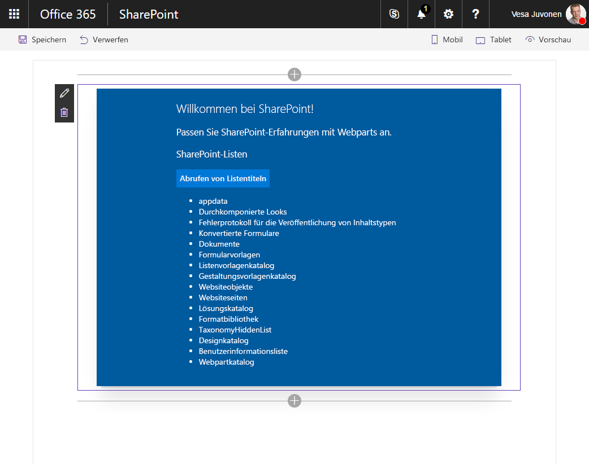

# <a name="connect-to-sharepoint-using-the-javascript-object-model-jsom"></a>Verbinden mit SharePoint mithilfe des JavaScript-Objektmodells (JSOM)

In der Vergangenheit haben Sie vielleicht beim Erstellen von SharePoint-Anpassungen, das SharePoint JavaScript-Objektmodell (JSOM) zur Kommunikation mit SharePoint verwendet. Dies ist nicht mehr der empfohlene Pfad (siehe [Überlegungen](#considerations) weiter unten in diesem Artikel), aber es gibt noch gültige Anwendungsfälle wie z. B. die Codemigration. 

Um SharePoint JSOM in Ihrer SharePoint Framework-Komponente zu verwenden, müssen Sie zuerst darauf verweisen. Bisher stand es bereits auf der Seite zur Verwendung zur Verfügung. Es muss in SharePoint Framework explizit geladen werden.

Es gibt zwei Methoden, um in SharePoint Framework auf SharePoint JSOM zu verweisen: 
- **Deklarativ** – über die Konfiguration
- **Imperativ** – über Code

Jeder dieser Ansätze hat seine Vor- und Nachteile, die Sie unbedingt kennen sollten.

> [!NOTE] 
> Bevor Sie die Schritte in diesem Artikel ausführen, müssen Sie [die Entwicklungsumgebung für das SharePoint-Framework einrichten](../../set-up-your-development-environment.md).

## <a name="create-a-new-project"></a>Erstellen eines neuen Projekts

1. Erstellen Sie in der Konsole einen neuen Ordnern für Ihr Projekt:

  ```sh
  md react-sharepointlists
  ```

2. Wechseln Sie zum Projektordner:

  ```sh
  cd react-sharepointlists
  ```

3. Führen Sie im Projektordner den SharePoint Framework-Yeoman-Generator aus, um ein Gerüst für ein neues SharePoint Framework-Projekt zu erstellen:

  ```sh
  yo @microsoft/sharepoint
  ```

4. Geben Sie die folgenden Werte ein, wenn Sie dazu aufgefordert werden:

  - **react-sharepointlists** als Lösungsname.
  - Wählen Sie **Webpart** als den zu erstellenden Typ von clientseitiger Komponente aus.
  - **Use the currecnt folder** als Speicherort für die Dateien.
  - **React** als Ausgangs-Framework für die Webpart-Erstellung.
  - **SharePoint-Listen** als Webpartname.
  - **Zeigt die Namen von Listen auf der aktuellen Website an** als Webpartbeschreibung.

  

5. Warten Sie, bis das Gerüst erstellt wurde, und sperren Sie dann mithilfe des folgenden Befehls die Version der Projektabhängigkeiten:

  ```sh
  npm shrinkwrap
  ```

6. Öffnen Sie den Projektordner in einem Code-Editor. In diesem Artikel wird Visual Studio Code in den Schritten und Screenshots verwendet, Sie können jedoch einen beliebigen Editor verwenden.

  

7. Gehen Sie folgendermaßen vor, um das Verzeichnis in Visual Studio Code von der Konsole aus zu öffnen:

  ```sh
  code .
  ```


## <a name="reference-jsom-declaratively"></a>Deklaratives Referenzieren von JSOM

### <a name="register-the-sharepoint-jsom-api-as-external-scripts"></a>Registrieren der SharePoint JSOM-API als externe Skripts

Beim deklarativen Verweisen auf JSOM besteht der erste Schritt darin, die SharePoint JSOM-API als externe Skripts innerhalb Ihres SharePoint Framework-Projekts zu registrieren.

1. Öffnen Sie im Code-Editor die Datei **./config/config.json**, und fügen Sie dem Abschnitt **externals** Folgendes hinzu:

  ```json
  {
    // ...
    "externals": {
      "sp-init": {
        "path": "https://contoso.sharepoint.com/_layouts/15/init.js",
        "globalName": "$_global_init"
      },
      "microsoft-ajax": {
        "path": "https://contoso.sharepoint.com/_layouts/15/MicrosoftAjax.js",
        "globalName": "Sys",
        "globalDependencies": [
          "sp-init"
        ]
      },
      "sp-runtime": {
        "path": "https://contoso.sharepoint.com/_layouts/15/SP.Runtime.js",
        "globalName": "SP",
        "globalDependencies": [
          "microsoft-ajax"
        ]
      },
      "sharepoint": {
        "path": "https://contoso.sharepoint.com/_layouts/15/SP.js",
        "globalName": "SP",
        "globalDependencies": [
          "sp-runtime"
        ]
      }
    }
    // ...
  }
  ```

  <br/>

  Jeder Eintrag verweist auf eine andere Skriptdatei, die Ihnen zusammen die Verwendung von SharePoint JSOM in der SPFx-Komponente ermöglichen. Alle diese Skripts werden als Nicht-Modul-Skripts verteilt. Deshalb erfordert jeder Registrierungseintrag eine URL (angegeben mit der `path`-Eigenschaft) und den vom Skript verwendeten Namen (bereitgestellt in der `globalName`-Eigenschaft). Um sicherzustellen, dass diese Skripts in der richtigen Reihenfolge laden, werden die Abhängigkeiten zwischen diesen Skripts mit der `globalDependencies`-Eigenschaft angegeben.

  In Abhängigkeit von der JSOM-Funktionalität, die Sie verwenden, müssen möglicherweise weitere Skripts hinzugefügt werden (z. B.sp.taxonomy.js).

### <a name="install-typescript-typings-for-sharepoint-jsom"></a>Installieren von TypeScript-Eingaben für SharePoint JSOM

Der nächste Schritt besteht darin, TypeScript-Eingaben für SharePoint JSOM zu installieren und zu konfigurieren. So profitieren Sie von den Sicherheitsfunktionen der TypeScript-Typen, wenn Sie mit SharePoint JSOM arbeiten.

1. Führen Sie den folgenden Befehl in Ihrem Projektverzeichnis von der Konsole aus:

  ```sh
  npm install @types/microsoft-ajax @types/sharepoint --save-dev
  ```

  SharePoint JSOM wird nicht als Modul verteilt, Sie können es daher nicht direkt in Ihren Code importieren. Stattdessen müssen Sie die TypeScript-Eingaben global registrieren. 

2. Öffnen Sie im Code-Editor die Datei **./tsconfig.json** und fügen Sie in der `types`-Eigenschaft, gleich hinter dem Eintrag **webpack-env** Verweise auf **microsoft-ajax** and **sharepoint**: hinzu.

  ```json
  {
    "compilerOptions": {
      // ...
      "types": [
        "es6-promise",
        "es6-collections",
        "webpack-env",
        "microsoft-ajax",
        "sharepoint"
      ]
    }
  }
  ```

### <a name="reference-sharepoint-jsom-scripts-in-a-react-component"></a>Referenzieren von SharePoint JSOM-Skripts in einer React-Komponente

Um die SharePoint JSOM-Skripts in die SPFx-Komponente zu laden, müssen Sie auf diese im Code der Komponente verweisen. In diesem Beispiel fügen Sie die Verweise in der React-Komponente hinzu, in der JSOM zur Kommunikation mit SharePoint verwendet wird.

Öffnen Sie im Code-Editor die Datei **./src/webparts/sharePointLists/components/SharePointLists.tsx**. Fügen Sie den folgenden Code hinter der letzten `import`-Anweisung ein:

```typescript
  require('sp-init');
  require('microsoft-ajax');
  require('sp-runtime');
  require('sharepoint');
```

Da diese Namen den zuvor hinzugefügten externen Verweisen entsprechen, wird SharePoint Framework dieses Skript unter den angegebenen URLs laden.

Zur Veranschaulichung, wie SharePoint JSOM zur Kommunikation mit SharePoint beiträgt, rufen Sie die Titel aller SharePoint-Listen ab, die sich auf der aktuellen Website befinden, und geben Sie sie wieder.

### <a name="add-siteurl-to-the-react-components-properties"></a>Hinzufügen von _siteUrl_ zu React-Komponenteneigenschaften

Damit Sie sich mit SharePoint verbinden können, muss die React-Komponente die URL der aktuellen Website kennen. Die URL ist im übergeordneten Webpart verfügbar und kann über ihre Eigenschaften an die Komponente übergeben werden.

1. Öffnen Sie im Code-Editor die Datei **./src/webparts/sharePointLists/components/ISharePointListsProps.ts**, und fügen Sie der Schnittstelle `ISharePointListsProps` die `siteUrl`-Eigenschaft hinzu:

  ```typescript
  export interface ISharePointListsProps {
    description: string;
    siteUrl: string;
  }
  ```

2. Um die URL der aktuellen Website an die Komponente zu übergeben, öffnen Sie die Datei **./src/webparts/sharePointLists/SharePointListsWebPart.ts** im Code-Editor, und ändern Sie die `render`-Methode in:

  ```typescript
  export default class SharePointListsWebPart extends BaseClientSideWebPart<ISharePointListsWebPartProps> {
    public render(): void {
      const element: React.ReactElement<ISharePointListsProps > = React.createElement(
        SharePointLists,
        {
          description: this.properties.description,
          siteUrl: this.context.pageContext.web.absoluteUrl
        }
      );

      ReactDom.render(element, this.domElement);
    }

    // ...
  }
  ```

### <a name="define-the-react-components-state"></a>Definieren des Status der React-Komponente

Die React-Komponente lädt Daten aus SharePoint, um sie für den Benutzer wiederzugeben. Der aktuelle Status der React-Komponente wird mit der state-Schnittstelle modelliert, die wir hinzufügen.

Erstellen Sie im Code-Editor im Ordner **./src/webparts/sharePointLists/components** eine neue Daten namens **ISharePointListsState.ts**, und fügen Sie folgenden Inhalt ein:

```typescript
export interface ISharePointListsState {
    listTitles: string[];
    loadingLists: boolean;
    error: string;
}
```

### <a name="add-state-to-the-react-component"></a>Hinzufügen des Status zur React-Komponente

Nachdem Sie die Schnittstelle definiert haben, indem Sie die Form des Komponentenstatus beschrieben haben, muss die React-Komponente als Nächstes die state-Schnittstelle verwenden.

1. Öffnen Sie im Code-Editor die Datei **./src/webparts/sharePointLists/components/SharePointLists.tsx**. Fügen Sie unter den vorhandenen `import` -Anweisungen Folgendes hinzu:

  ```typescript
  import { ISharePointListsState } from './ISharePointListsState';
  ```

2. Im nächsten Schritt ändern Sie die Signatur der `SharePointLists`-Klasse in:

  ```typescript
  export default class SharePointLists extends React.Component<ISharePointListsProps, ISharePointListsState> {
    // ...
  }
  ```

3. Fügen Sie in der `SharePointLists`-Klasse einen Konstruktor mit dem Standardstatuswert hinzu:

  ```typescript
  export default class SharePointLists extends React.Component<ISharePointListsProps, ISharePointListsState> {
    constructor(props?: ISharePointListsProps, context?: any) {
      super();

      this.state = {
        listTitles: [],
        loadingLists: false,
        error: null
      };
    }

    // ...
  }
  ```

### <a name="load-information-about-sharepoint-lists-from-the-current-site-using-jsom"></a>Herunterladen von Informationen zu SharePoint-Listen von der aktuellen Website mit JSOM

Das clientseitige Webpart, das in diesem Artikel als Beispiel verwendet wurde, lädt per Klick Informationen zu SharePoint-Listen in die aktuelle Website.

  

1. Öffnen Sie im Code-Editor die Datei **./src/webparts/sharePointLists/components/SharePointLists.tsx**. Fügen Sie in der `SharePointLists`-Klasse eine neue Methode mit dem Namen`getListsTitles` hinzu.

  ```typescript
  export default class SharePointLists extends React.Component<ISharePointListsProps, ISharePointListsState> {
    constructor(props?: ISharePointListsProps, context?: any) {
      super();

      this.state = {
        listTitles: [],
        loadingLists: false,
        error: null
      };

      this.getListsTitles = this.getListsTitles.bind(this);
    }

    // ...

    private getListsTitles(): void {
    }
  }
  ```

2. Um die richtigen Bereichsdefinition der Methode sicherzustellen, binden wir sie im Konstruktor an das Webpart. Verwenden Sie in der `getListsTitles`-Methode SharePoint JSOM, um die Titel der SharePoint-Listen auf die aktuelle Website zu laden:

  ```typescript
  export default class SharePointLists extends React.Component<ISharePointListsProps, ISharePointListsState> {
    // ...
    private getListsTitles(): void {
      this.setState({
        loadingLists: true,
        listTitles: [],
        error: null
      });

      const context: SP.ClientContext = new SP.ClientContext(this.props.siteUrl);
      const lists: SP.ListCollection = context.get_web().get_lists();
      context.load(lists, 'Include(Title)');
      context.executeQueryAsync((sender: any, args: SP.ClientRequestSucceededEventArgs): void => {
        const listEnumerator: IEnumerator<SP.List> = lists.getEnumerator();

        const titles: string[] = [];
        while (listEnumerator.moveNext()) {
          const list: SP.List = listEnumerator.get_current();
          titles.push(list.get_title());
        }

        this.setState((prevState: ISharePointListsState, props: ISharePointListsProps): ISharePointListsState => {
          prevState.listTitles = titles;
          prevState.loadingLists = false;
          return prevState;
        });
      }, (sender: any, args: SP.ClientRequestFailedEventArgs): void => {
        this.setState({
          loadingLists: false,
          listTitles: [],
          error: args.get_message()
        });
      });
    }
  }
  ```

  <br/>

Setzen Sie zunächst den Status der Komponente zurück, um dem Benutzer mitzuteilen, dass die Komponente Informationen aus SharePoint laden wird. Verwenden Sie dann die URL der aktuellen Website, die der Komponente über ihre Eigenschaften übergeben wurde, um einen neuen SharePoint-Kontext zu instanziieren. Mit SharePoint JSOM werden Listen von der aktuellen Website geladen. Um die Leistung der Anforderung zu optimieren, geben wir an, dass nur die `Title`- Eigenschaft geladen werden sollte. 

Im nächsten Schritt führen Sie die Abfrage durch Aufruf der `executeQueryAsync`-Methode und Übergabe zweier Rückruffunktionen aus. Nach Abschluss der Abfrage durchlaufen Sie die Sammlung der abgerufenen Listen, speichern deren Titel in einem Array und aktualisieren den Status der Komponente.

### <a name="render-the-titles-of-sharepoint-lists-in-the-current-site"></a>Wiedergeben der Titel von SharePoint-Listen auf der aktuellen Website

Nachdem Sie die Titel von SharePoint-Listen auf die aktuelle Website geladen haben, müssen Sie sie nur noch in der Komponente wiedergeben. 

1. Öffnen Sie im Code-Editor die Datei **./src/webparts/sharePointLists/components/SharePointLists.tsx** und aktualisieren Sie die `render`-Methode:

  ```tsx
  export default class SharePointLists extends React.Component<ISharePointListsProps, ISharePointListsState> {
    // ...
    public render(): React.ReactElement<ISharePointListsProps> {
      const titles: JSX.Element[] = this.state.listTitles.map((listTitle: string, index: number, listTitles: string[]): JSX.Element => {
        return <li key={index}>{listTitle}</li>;
      });

      return (
        <div className={styles.sharePointLists}>
          <div className={styles.container}>
            <div className={`ms-Grid-row ms-bgColor-themeDark ms-fontColor-white ${styles.row}`}>
              <div className="ms-Grid-col ms-u-lg10 ms-u-xl8 ms-u-xlPush2 ms-u-lgPush1">
                <span className="ms-font-xl ms-fontColor-white">Welcome to SharePoint!</span>
                <p className="ms-font-l ms-fontColor-white">Customize SharePoint experiences using Web Parts.</p>
                <p className="ms-font-l ms-fontColor-white">{escape(this.props.description)}</p>
                <a className={styles.button} onClick={this.getListsTitles} role="button">
                  <span className={styles.label}>Get lists titles</span>
                </a><br />
                {this.state.loadingLists &&
                  <span>Loading lists...</span>}
                {this.state.error &&
                  <span>An error has occurred while loading lists: {this.state.error}</span>}
                {this.state.error === null && titles &&
                  <ul>
                    {titles}
                  </ul>}
              </div>
            </div>
          </div>
        </div>
      );
    }
    // ...
  }
  ```

2. Jetzt sollten Sie Ihr Webpart der Seite hinzufügen und die Titel der SharePoint-Listen auf der aktuellen Website anzeigen können. Für eine Überprüfung, dass das Projekt korrekt funktioniert, führen Sie auf der Konsole den folgenden Befehl aus:

  ```sh
  gulp serve --nobrowser
  ```

3. Da Sie SharePoint JSOM zur Kommunikation mit SharePoint verwenden, müssen Sie das Webpart mit der gehosteten SharePoint-Workbench-Version testen. (Deshalb wird der `--nobrowser`-Parameter angegeben, um zu verhindern, dass die lokale Workbench automatisch geladen wird).

  

Das deklarative Referenzieren von SharePoint JSOM-Skripts als externe Skripts ist bequem und Sie können so den Code übersichtlich halten. Ein Nachteil besteht aber darin, dass Sie absolute URLs zum Speicherort angeben müssen, aus dem SharePoint JSOM-Skripts geladen werden sollen. Wenn Sie für Entwicklung, Prüfung und Produktion separate SharePoint-Mandanten verwenden, wird zusätzliche Arbeit erforderlich, um die folgenden URLs für die verschiedenen Umgebungen entsprechend zu ändern. In solchen Fällen sollten Sie imperativ mithilfe von [SPComponentLoader](https://docs.microsoft.com/de-DE/javascript/api/sp-application-base) auf JSOM verweisen, um die Skripts im Code der SPFx-Komponenten zu laden.

## <a name="reference-jsom-imperatively"></a>Imperatives Verweisen auf JSOM

Eine weitere Möglichkeit zum Laden von JavaScript-Bibliotheken in SharePoint Framework-Projekten besteht darin, `SPComponentLoader` zu verwenden, eine Dienstprogrammklasse, die mit dem SharePoint Framework bereitgestellt wird und Ihnen helfen soll, die Skripts und andere Ressourcen in die Komponenten zu laden. Ein Vorteil der Verwendung von `SPComponentLoader` gegenüber dem deklarativen Laden von Skripts ist, dass Sie serverrelative URLs verwenden können, die bequemer sind, wenn Sie mehrere SharePoint-Mandanten für die verschiedenen Phasen des Entwicklungsprozesses verwenden.

Für diesen Teil des Lernprogramms passen wir den zuvor im Abschnitt zum deklarativen Verweisen erstellten Code an.

### <a name="declarative-reference-cleanup"></a>Bereinigung durch deklaratives Verweisen

Wenn Sie die Schritte in den Abschnitten weiter oben zum deklarativen Verweisen befolgt haben, müssen Sie diese Verweise entfernen.

1. Entfernen Sie die vorhandenen externen Skriptverweise. Öffnen Sie dazu im Code-Editor die Datei **config/config.json**, und entfernen Sie aus der **externals**-Eigenschaft alle Einträge:

  ```json
  {
    "$schema": "https://dev.office.com/json-schemas/spfx-build/config.2.0.schema.json",
    "version": "2.0",
    "bundles": {
      "share-point-lists-web-part": {
        "components": [
          {
            "entrypoint": "./lib/webparts/sharePointLists/SharePointListsWebPart.js",
            "manifest": "./src/webparts/sharePointLists/SharePointListsWebPart.manifest.json"
          }
        ]
      }
    },
    "externals": {},
    "localizedResources": {
      "SharePointListsWebPartStrings": "lib/webparts/sharePointLists/loc/{locale}.js"
    }
  }
  ```

  Wenn SharePoint JSOM-Skripts nicht mehr als externe Skripts registriert sind, können Sie nicht direkt im Code darauf verweisen. 

2. Öffnen Sie im Code-Editor die Datei **./src/webparts/sharePointLists/components/SharePointLists.tsx** und entfernen Sie die `require`-Anweisungen, die auf die verschiedenen SharePoint JSOM-Skripts verweisen.

### <a name="wait-to-load-data-until-the-jsom-scripts-are-loaded"></a>Warten Sie mit dem Laden der Daten, bis die JSOM-Skripts geladen sind

Die Hauptfunktion des clientseitigen Webparts, das wir in diesem Lernprogramm erstellen, hängt von SharePoint JSOM ab. In Abhängigkeit von verschiedenen Faktoren kann das Laden dieser Skripts etwas dauern. Beim Erstellen von SPFx-Komponenten , die JSOM nutzen, sollten Sie dies berücksichtigen. Wenn das Webpart einer Seite hinzugefügt worden ist, sollte es dem Benutzer mitteilen, dass es seine Voraussetzungen lädt, und melden, wann es einsatzbereit ist. 

Um dies zu unterstützen, erweitern Sie den Status der React-Komponente um eine zusätzliche Eigenschaft, damit Sie den Ladestatus der JSOM-Skripts verfolgen können.

1. Öffnen Sie im Code-Editor die Datei **./src/webparts/sharePointLists/components/ISharePointListsState.ts**, und fügen Sie folgenden Code ein:

  ```typescript
  export interface ISharePointListsState {
      listTitles: string[];
      loadingLists: boolean;
      error: string;
      loadingScripts: boolean;
  }
  ```

2. Fügen Sie die neu hinzugefügte Eigenschaft zu den Statusdefinitionen in der React-Komponente hinzu. Öffnen Sie im Code-Editor die Datei **./src/webparts/sharePointLists/components/SharePointLists.tsx**. Aktualisieren Sie den Konstruktor auf den folgenden Code:

  ```typescript
  export default class SharePointLists extends React.Component<ISharePointListsProps, ISharePointListsState> {
    constructor(props?: ISharePointListsProps, context?: any) {
      super();

      this.state = {
        listTitles: [],
        loadingLists: false,
        error: null,
        loadingScripts: true
      };

      this.getListsTitles = this.getListsTitles.bind(this);
    }
    // ...
  }
  ```

3. Aktualisieren Sie in der gleichen Datei die `getListsTitles`-Methode auf den folgenden Code:

  ```typescript
  export default class SharePointLists extends React.Component<ISharePointListsProps, ISharePointListsState> {
    // ...
    private getListsTitles(): void {
      this.setState({
        loadingLists: true,
        listTitles: [],
        error: null,
        loadingScripts: false
      });

      const context: SP.ClientContext = new SP.ClientContext(this.props.siteUrl);
      const lists: SP.ListCollection = context.get_web().get_lists();
      context.load(lists, 'Include(Title)');
      context.executeQueryAsync((sender: any, args: SP.ClientRequestSucceededEventArgs): void => {
        const listEnumerator: IEnumerator<SP.List> = lists.getEnumerator();

        const titles: string[] = [];
        while (listEnumerator.moveNext()) {
          const list: SP.List = listEnumerator.get_current();
          titles.push(list.get_title());
        }

        this.setState((prevState: ISharePointListsState, props: ISharePointListsProps): ISharePointListsState => {
          prevState.listTitles = titles;
          prevState.loadingLists = false;
          return prevState;
        });
      }, (sender: any, args: SP.ClientRequestFailedEventArgs): void => {
        this.setState({
          loadingLists: false,
          listTitles: [],
          error: args.get_message(),
          loadingScripts: false
        });
      });
    }
  }
  ```

4. Um dem Benutzer den Ladestatus der SharePoint JSOM-Skripts zu melden, aktualisieren Sie die `render`-Methode auf den folgenden Code:

  ```tsx
  export default class SharePointLists extends React.Component<ISharePointListsProps, ISharePointListsState> {
    // ...
    public render(): React.ReactElement<ISharePointListsProps> {
      const titles: JSX.Element[] = this.state.listTitles.map((listTitle: string, index: number, listTitles: string[]): JSX.Element => {
        return <li key={index}>{listTitle}</li>;
      });

      return (
        <div className={styles.sharePointLists}>
          <div className={styles.container}>
            {this.state.loadingScripts &&
              <div className="ms-Grid" style={{ color: "#666", backgroundColor: "#f4f4f4", padding: "80px 0", alignItems: "center", boxAlign: "center" }}>
                <div className="ms-Grid-row" style={{ color: "#333" }}>
                  <div className="ms-Grid-col ms-u-hiddenSm ms-u-md3"></div>
                  <div className="ms-Grid-col ms-u-sm12 ms-u-md6" style={{ height: "100%", whiteSpace: "nowrap", textAlign: "center" }}>
                    <i className="ms-fontSize-su ms-Icon ms-Icon--CustomList" style={{ display: "inline-block", verticalAlign: "middle", whiteSpace: "normal" }}></i><span className="ms-fontWeight-light ms-fontSize-xxl" style={{ paddingLeft: "20px", display: "inline-block", verticalAlign: "middle", whiteSpace: "normal" }}>SharePoint lists</span>
                  </div>
                  <div className="ms-Grid-col ms-u-hiddenSm ms-u-md3"></div>
                </div>
                <div className="ms-Grid-row" style={{ width: "65%", verticalAlign: "middle", margin: "0 auto", textAlign: "center" }}>
                  <span style={{ color: "#666", fontSize: "17px", display: "inline-block", margin: "24px 0", fontWeight: 100 }}>Loading SharePoint JSOM scripts...</span>
                </div>
                <div className="ms-Grid-row"></div>
              </div>}
            {this.state.loadingScripts === false &&
              <div className={`ms-Grid-row ms-bgColor-themeDark ms-fontColor-white ${styles.row}`}>
                <div className="ms-Grid-col ms-u-lg10 ms-u-xl8 ms-u-xlPush2 ms-u-lgPush1">
                  <span className="ms-font-xl ms-fontColor-white">Welcome to SharePoint!</span>
                  <p className="ms-font-l ms-fontColor-white">Customize SharePoint experiences using Web Parts.</p>
                  <p className="ms-font-l ms-fontColor-white">{escape(this.props.description)}</p>
                  <a className={styles.button} onClick={this.getListsTitles} role="button">
                    <span className={styles.label}>Get lists titles</span>
                  </a><br />
                  {this.state.loadingLists &&
                    <span>Loading lists...</span>}
                  {this.state.error &&
                    <span>An error has occurred while loading lists: {this.state.error}</span>}
                  {this.state.error === null && titles &&
                    <ul>
                      {titles}
                    </ul>}
                </div>
              </div>
            }
          </div>
        </div>
      );
    }
    // ...
  }
  ```

5. Wenn der Status der React-Komponente angibt, dass die SharePoint JSOM-Skripts geladen werden, wird ein Platzhalter angezeigt. Nachdem die Skripts geladen wurden, zeigt das Webpart den erwarteten Inhalt mit der Schaltfläche an, damit der Benutzer die Informationen zu SharePoint-Listen auf die aktuelle Website laden kann.

### <a name="load-sharepoint-jsom-scripts-by-using-spcomponentloader"></a>Laden von SharePoint JSOM-Skripts mit SPComponentLoader

SPFx-Komponenten sollten SharePoint JSOM-Skripts nur einmal laden. In diesem Beispiel – vorausgesetzt, das Webpart besteht aus einer einzigen React-Komponente – sollten Sie die SharePoint JSOM-Skripts am besten in der `componentDidMount`-Methode der React-Komponente laden, da diese Methode erst ausgeführt wird, wenn die Komponente instanziiert wurde.

1. Öffnen Sie im Code-Editor die Datei **./src/webparts/sharePointLists/components/SharePointLists.tsx**. Fügen Sie im oberen Bereich der Datei eine `import`-Anweisung hinzu, die auf `SPComponentLoader` verweist. Fügen Sie die `SharePointLists`-Klasse der `componentDidMount`-Methode hinzu.

  ```typescript
  import { SPComponentLoader } from '@microsoft/sp-loader';

  export default class SharePointLists extends React.Component<ISharePointListsProps, ISharePointListsState> {
    // ...
    public componentDidMount(): void {
      SPComponentLoader.loadScript('/_layouts/15/init.js', {
        globalExportsName: '$_global_init'
      })
      .then((): Promise<{}> => {
        return SPComponentLoader.loadScript('/_layouts/15/MicrosoftAjax.js', {
          globalExportsName: 'Sys'
        });
      })
      .then((): Promise<{}> => {
        return SPComponentLoader.loadScript('/_layouts/15/SP.Runtime.js', {
          globalExportsName: 'SP'
        });
      })
      .then((): Promise<{}> => {
        return SPComponentLoader.loadScript('/_layouts/15/SP.js', {
          globalExportsName: 'SP'
        });
      })
      .then((): void => {
        this.setState((prevState: ISharePointListsState, props: ISharePointListsProps): ISharePointListsState => {
          prevState.loadingScripts = false;
          return prevState;
        });
      });
    }
    // ...
  }
  ```

2. Unter Verwendung einer Reihe von verketteten Zusagen laden wir die verschiedenen Skripts, die zusammen die Verwendung von SharePoint JSOM in Ihrer clientseitigen SharePoint Framework-Webpart ermöglichen. Beachten Sie, wie Sie dank Verwendung des `SPComponentLoader` serverrelative URLs verwenden können, die Skripts aus dem aktuellen SharePoint-Mandanten laden. Nachdem alle Skripts geladen wurden, aktualisieren Sie den Status der React-Komponente, indem Sie bestätigen, dass alle Voraussetzungen geladen wurden und das Webpart einsatzbereit ist.

3. Bestätigen Sie, dass das Webpart wie erwartet funktioniert, indem Sie auf der Konsole den folgenden Befehl ausführen:

  ```sh
  gulp serve --nobrowser
  ```

  Wie zuvor sollte das Webpart die Titel der SharePoint-Listen auf der aktuellen Website anzeigen.

  

  
Obwohl die Verwendung des `SPComponentLoader` einigen Aufwand erfordert, ermöglicht er Ihnen, serverrelative URLs zu verwenden, die in Szenarien nützlich sind, in denen Sie unterschiedliche Mandanten für Entwicklung, Prüfung und Produktion einsetzen.

## <a name="considerations"></a>Überlegungen

In der Vergangenheit haben Sie vielleicht beim Erstellen von clientseitigen Anpassungen auf SharePoint-Plattformen SharePoint JSOM zur Kommunikation mit SharePoint verwendet. Jetzt ist die empfohlene Vorgehensweise aber entweder die Verwendung der SharePoint REST-API oder der [PnP JavaScript-Core-Bibliothek](https://github.com/SharePoint/PnP-JS-Core).

Als SharePoint JSOM eingeführt wurde, stellte dies den ersten Schritt im Hinblick auf eine Unterstützung clientseitiger Lösungen auf SharePoint dar. Es wird jedoch nicht mehr aktiv verwaltet und bietet möglicherweise keinen Zugriff auf alle Funktionen, die über die REST-API verfügbar sind. Außerdem können Sie, unabhängig davon, ob Sie die SharePoint-REST-API direkt oder über die PnP JavaScript-Core-Bibliothek verwenden, Zusagen verwenden, die das Schreiben von asynchronem Code erheblich erleichtern (ein häufig auftretendes Problem bei der Verwendung von JSOM).

Es gibt zwar immer noch Fälle, in denen SharePoint JSOM Zugriff auf Daten und Methoden bietet, die noch nicht von der SharePoint-REST-API abgedeckt sind, wenn möglich sollte aber die REST-API verwendet werden.

Wenn Sie vorhandene Anpassungen haben, die SharePoint JSOM verwenden, und in Erwägung ziehen, diese zu SharePoint Framework zu migrieren, sollte dieser Artikel Ihnen die erforderlichen Informationen zur Verwendung von SharePoint JSOM in SharePoint Framework-Lösungen liefern. Langfristig sollten Sie jedoch die Art und Weise ändern, wie Sie mit SharePoint kommunizieren, entweder unter Verwendung der SharePoint-REST-API (direkt) oder über die PnP JavaScript-Core-Bibliothek.
