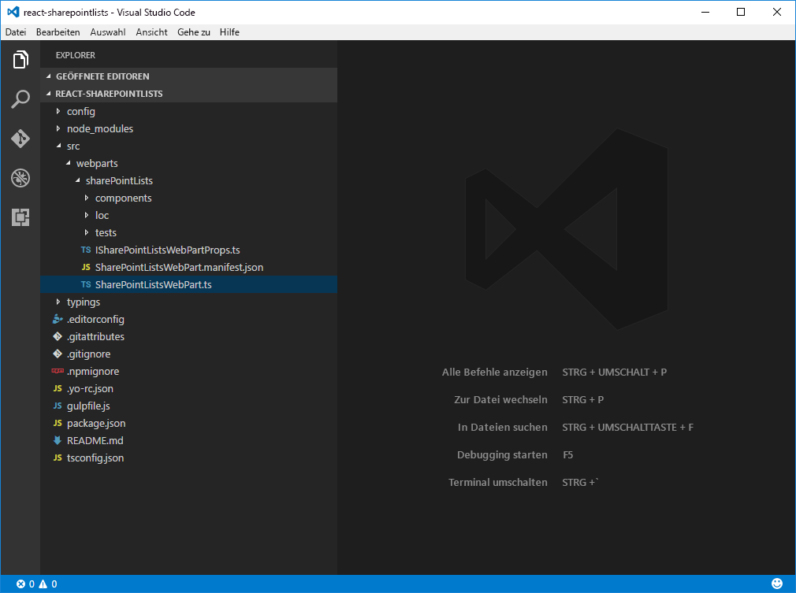
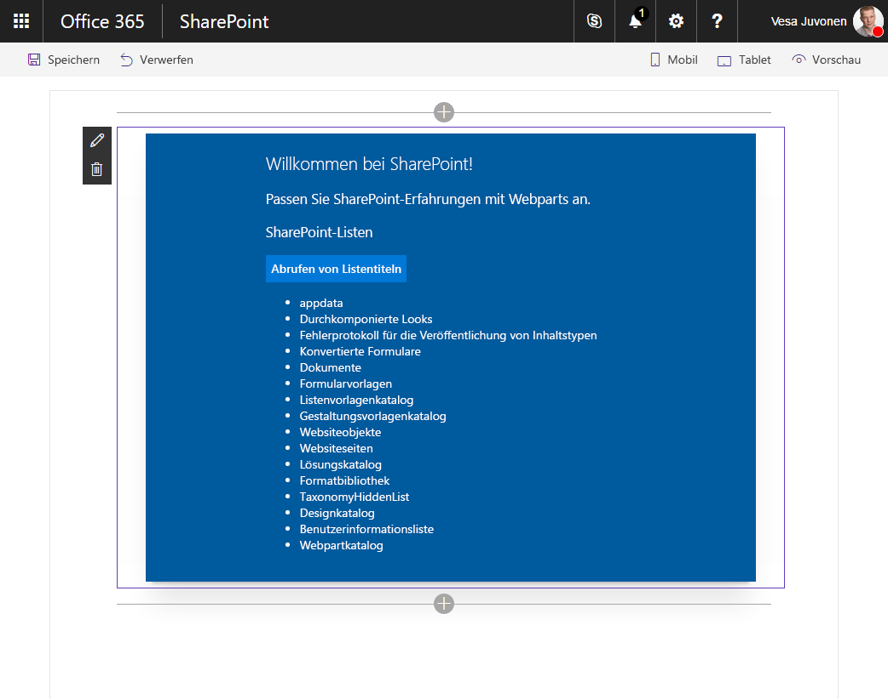

# <a name="connect-to-sharepoint-using-the-javascript-object-model-jsom"></a><span data-ttu-id="b8cb9-101">Verbinden mit SharePoint mithilfe des JavaScript-Objektmodells (JSOM)</span><span class="sxs-lookup"><span data-stu-id="b8cb9-101">Connect to SharePoint using the JavaScript Object Model (JSOM)</span></span>

<span data-ttu-id="b8cb9-p101">In der Vergangenheit haben Sie vielleicht beim Erstellen von SharePoint-Anpassungen, das SharePoint JavaScript-Objektmodell (JSOM) zur Kommunikation mit SharePoint verwendet. Dies wird nicht mehr empfohlen (siehe **Empfehlungen** unten), es gibt jedoch nach wie vor gültige Anwendungsfälle, z. B. die Codemigration. Dieser Artikel veranschaulicht, wie SharePoint JSOM beim Erstellen von Lösungen auf dem SharePoint Framework verwendet wird.</span><span class="sxs-lookup"><span data-stu-id="b8cb9-p101">In the past, when building SharePoint customizations you might have used the SharePoint JavaScript Object Model (JSOM) to communicate with SharePoint. This is no longer the recommended path (see **Considerations** below), but there are still valid use cases such as code migration. This article demonstrates how to use SharePoint JSOM when building solutions on the SharePoint Framework.</span></span>

> <span data-ttu-id="b8cb9-105">**Hinweis:** Bevor Sie die Schritte in diesem Artikel ausführen, müssen Sie [die Entwicklungsumgebung für SharePoint Framework einrichten](../../set-up-your-development-environment).</span><span class="sxs-lookup"><span data-stu-id="b8cb9-105">**Note:** Before following the steps in this article, be sure to [set up your development environment](../../set-up-your-development-environment) for building SharePoint Framework solutions.</span></span>

## <a name="create-a-new-project"></a><span data-ttu-id="b8cb9-106">Erstellen eines neuen Projekts</span><span class="sxs-lookup"><span data-stu-id="b8cb9-106">Create a New Project</span></span>

<span data-ttu-id="b8cb9-107">Erstellen Sie in der Konsole einen neuen Ordnern für Ihr Projekt:</span><span class="sxs-lookup"><span data-stu-id="b8cb9-107">From the console, create a new folder for your project:</span></span>

```sh
md react-sharepointlists
```

<span data-ttu-id="b8cb9-108">Wechseln Sie zum Projektordner:</span><span class="sxs-lookup"><span data-stu-id="b8cb9-108">Go to the project folder.</span></span>

```sh
cd react-sharepointlists
```

<span data-ttu-id="b8cb9-109">Führen Sie im Projektordner den SharePoint Framework-Yeoman-Generator aus, um ein Gerüst für ein neues SharePoint Framework-Projekt zu erstellen:</span><span class="sxs-lookup"><span data-stu-id="b8cb9-109">In the project folder run the SharePoint Framework Yeoman generator to scaffold a new SharePoint Framework project.</span></span>

```sh
yo @microsoft/sharepoint
```

<span data-ttu-id="b8cb9-110">Geben Sie die folgenden Werte ein, wenn Sie dazu aufgefordert werden:</span><span class="sxs-lookup"><span data-stu-id="b8cb9-110">When prompted, enter the following values:</span></span>

- <span data-ttu-id="b8cb9-111">**react-sharepointlists** als Lösungsname.</span><span class="sxs-lookup"><span data-stu-id="b8cb9-111">**react-sharepointlists** as your solution name.</span></span>
- <span data-ttu-id="b8cb9-112">Wählen Sie **Webpart** als den zu erstellenden Typ von clientseitiger Komponente aus.</span><span class="sxs-lookup"><span data-stu-id="b8cb9-112">Choose **Extension (Preview)** as the client-side component type to be created.</span></span>
- <span data-ttu-id="b8cb9-113">**Verwenden Sie den aktuellen Ordner** als Speicherort für die Dateien.</span><span class="sxs-lookup"><span data-stu-id="b8cb9-113">**Use the current folder** for the location to place the files</span></span>
- <span data-ttu-id="b8cb9-114">**React** als Ausgangs-Framework für die Webpart-Erstellung.</span><span class="sxs-lookup"><span data-stu-id="b8cb9-114">**React** as the starting point to build the web part.</span></span>
- <span data-ttu-id="b8cb9-115">**SharePoint-Listen** als Webpartname.</span><span class="sxs-lookup"><span data-stu-id="b8cb9-115">**SharePoint lists** as your web part name.</span></span>
- <span data-ttu-id="b8cb9-116">**Zeigt die Namen von Listen auf der aktuellen Website an** als Webpartbeschreibung.</span><span class="sxs-lookup"><span data-stu-id="b8cb9-116">**Shows names of lists in the current site** as your web part description.</span></span>


<span data-ttu-id="b8cb9-p102">Öffnen Sie den Projektordner in Ihrem Code-Editor, sobald die Gerüsterstellung abgeschlossen ist. In diesem Artikel wird Visual Studio Code in den Schritten und Screenshots verwendet, Sie können jedoch einen beliebigen Editor verwenden.</span><span class="sxs-lookup"><span data-stu-id="b8cb9-p102">Once the scaffolding completes, open your project folder in your code editor. This article uses Visual Studio Code in the steps and screenshots but you can use any editor you prefer.</span></span>



<span data-ttu-id="b8cb9-121">Gehen Sie folgendermaßen vor, um das Verzeichnis in Visual Studio-Code vom Konsolentyp aus zu öffnen:</span><span class="sxs-lookup"><span data-stu-id="b8cb9-121">To open the directory in Visual Studio Code, from the console type:</span></span>
```sh
code .
```

## <a name="referencing-jsom"></a><span data-ttu-id="b8cb9-122">Verweisen auf JSOM</span><span class="sxs-lookup"><span data-stu-id="b8cb9-122">Referencing JSOM</span></span>
<span data-ttu-id="b8cb9-p103">Um SharePoint JSOM in Ihrer SharePoint Framework-Komponente verwenden zu können, müssen Sie zunächst darauf verweisen. In der Vergangenheit stand es bereits auf der Seite zu Ihrer Verfügung, um es aber in SharePoint-Framework zu verwenden, muss es explizit geladen werden.</span><span class="sxs-lookup"><span data-stu-id="b8cb9-p103">In order to use the SharePoint JSOM in your SharePoint Framework client-side web part, you have to reference it first. Where in the past it was already available on the page for you to use, in SharePoint Framework solutions, it has to be explicitly loaded.</span></span>

<span data-ttu-id="b8cb9-126">Es gibt zwei Methoden, um in SharePoint Framework auf SharePoint JSOM zu verweisen:</span><span class="sxs-lookup"><span data-stu-id="b8cb9-126">There are two ways to reference SharePoint JSOM in the SharePoint Framework:</span></span> 
- <span data-ttu-id="b8cb9-127">**Deklarativ** – über die Konfiguration</span><span class="sxs-lookup"><span data-stu-id="b8cb9-127">**Declarative** - through configuration</span></span>
- <span data-ttu-id="b8cb9-128">**Imperativ** – über Code</span><span class="sxs-lookup"><span data-stu-id="b8cb9-128">**Imperative** - through code</span></span>

<span data-ttu-id="b8cb9-129">Jeder dieser Ansätze hat seine Vor- und Nachteile, die Sie unbedingt kennen sollten.</span><span class="sxs-lookup"><span data-stu-id="b8cb9-129">Each of these approaches have advantages and disadvantages and it's important for you to understand each of them.</span></span>

## <a name="reference-jsom-declaratively"></a><span data-ttu-id="b8cb9-130">Deklaratives Referenzieren von JSOM</span><span class="sxs-lookup"><span data-stu-id="b8cb9-130">Reference JSOM declaratively</span></span>

<span data-ttu-id="b8cb9-p104">Der erste Schritt beim deklarativen Referenzieren von JSOM besteht darin, die SharePoint JSOM-API als externe Skripts in Ihrem SharePoint Framework-Projekt zu registrieren. Öffnen Sie im Code-Editor die Datei **./config/config.json**, und fügen Sie dem Abschnitt **externals** Folgendes hinzu:</span><span class="sxs-lookup"><span data-stu-id="b8cb9-p104">The first step, is to register the SharePoint JSOM API as external scripts in your SharePoint Framework project. In the code editor open the ./config/config.json file and to the externals section add:</span></span>

```json
{
  // ...
  "externals": {
    "sp-init": {
      "path": "https://contoso.sharepoint.com/_layouts/15/init.js",
      "globalName": "$_global_init"
    },
    "microsoft-ajax": {
      "path": "https://contoso.sharepoint.com/_layouts/15/MicrosoftAjax.js",
      "globalName": "Sys",
      "globalDependencies": [
        "sp-init"
      ]
    },
    "sp-runtime": {
      "path": "https://contoso.sharepoint.com/_layouts/15/SP.Runtime.js",
      "globalName": "SP",
      "globalDependencies": [
        "microsoft-ajax"
      ]
    },
    "sharepoint": {
      "path": "https://contoso.sharepoint.com/_layouts/15/SP.js",
      "globalName": "SP",
      "globalDependencies": [
        "sp-runtime"
      ]
    }
  }
  // ...
}
```

<span data-ttu-id="b8cb9-p105">Jeder Eintrag verweist auf unterschiedliche Skriptdateien, die Ihnen zusammen die Verwendung von SharePoint JSOM in Ihrer SPFx-Komponente ermöglichen. Alle diese Skripts werden als Nicht-Modul-Skripts verteilt. Daher erfordert jeder Registrierungseintrag eine URL (die mit der `path`-Eigenschaft angegeben wird) sowie einen vom Skript verwendeten Namen (der in der `globalName`-Eigenschaft angegeben ist). Um sicherzustellen, dass diese Skripts in der richtigen Reihenfolge geladen werden, werden die Abhängigkeiten zwischen diesen Skripts mit der `globalDependencies`-Eigenschaft angegeben.</span><span class="sxs-lookup"><span data-stu-id="b8cb9-p105">Each of the entries points to a different script file that together allow you to use the SharePoint JSOM in your client-side web part. All these scripts are distributed as non-module scripts, which is why each registration entry requires a URL, specified using the path`path` property, and the name used by the script, provided in the globalName`globalName` property. To ensure that these scripts load in the right order, the dependencies between these scripts are specified using the globalDependencies`globalDependencies` property.</span></span>

<span data-ttu-id="b8cb9-137">In Abhängigkeit von der JSOM-Funktionalität, die Sie verwenden, müssen möglicherweise weitere Skripts hinzugefügt werden (z. B.sp.taxonomy.js).</span><span class="sxs-lookup"><span data-stu-id="b8cb9-137">Additional scripts may need to be added depending on the JSOM functionality you are using (e.g. sp.taxonomy.js).</span></span>

### <a name="install-typescript-typings-for-sharepoint-jsom"></a><span data-ttu-id="b8cb9-138">Installieren von TypeScript-Eingaben für SharePoint JSOM</span><span class="sxs-lookup"><span data-stu-id="b8cb9-138">Install TypeScript typings for SharePoint JSOM</span></span>

<span data-ttu-id="b8cb9-p106">Der nächste Schritt besteht darin, TypeScript-Eingaben für SharePoint JSOM zu installieren und zu konfigurieren. So profitieren Sie von den Sicherheitsfunktionen der TypeScript-Typen, wenn Sie mit SharePoint JSOM arbeiten.</span><span class="sxs-lookup"><span data-stu-id="b8cb9-p106">The next step is to install and configure TypeScript typings for SharePoint JSOM. This will allow you to benefit of the TypeScript's type safety features when working with SharePoint JSOM.</span></span>

<span data-ttu-id="b8cb9-141">Führen Sie den folgenden Befehl in Ihrem Projektverzeichnis von der Konsole aus:</span><span class="sxs-lookup"><span data-stu-id="b8cb9-141">From the console, execute the following command within your project directory:</span></span>

```sh
npm install @types/microsoft-ajax @types/sharepoint --save-dev
```

<span data-ttu-id="b8cb9-p107">Da SharePoint JSOM nicht als Modul verteilt ist und Sie es nicht direkt in Ihren Code importieren können, müssen Sie seine TypeScript-Eingaben global registrieren. Öffnen Sie im Code-Editor die Datei **./tsconfig.json**, und fügen Sie in der `types`-Eigenschaft, gleich hinter dem Eintrag **webpack-env** Verweise auf **microsoft-ajax** und **sharepoint** hinzu.</span><span class="sxs-lookup"><span data-stu-id="b8cb9-p107">Because SharePoint JSOM is not distributed as a module and you cannot import it directly in your code, you have to register its TypeScript typings globally. In the code editor, open the **./tsconfig.json** file, and in the types`types` property, right after the **webpack-env** entry, add references to **microsoft-ajax** and **sharepoint**.</span></span>

```json
{
  "compilerOptions": {
    // ...
    "types": [
      "es6-promise",
      "es6-collections",
      "webpack-env",
      "microsoft-ajax",
      "sharepoint"
    ]
  }
}
```

### <a name="reference-sharepoint-jsom-scripts-in-a-react-component"></a><span data-ttu-id="b8cb9-145">Referenzieren von SharePoint JSOM-Skripts in einer React-Komponente</span><span class="sxs-lookup"><span data-stu-id="b8cb9-145">Reference SharePoint JSOM Scripts in a React Component</span></span>

<span data-ttu-id="b8cb9-p108">Um die SharePoint JSOM-Skripts in Ihrer SPFx-Komponente zu laden, müssen Sie im Code der Komponente darauf verweisen. In diesem Beispiel fügen Sie die Verweise in der React-Komponente hinzu, in der JSOM zur Kommunikation mit SharePoint verwendet wird.</span><span class="sxs-lookup"><span data-stu-id="b8cb9-p108">To load the SharePoint JSOM scripts in the client-side web part, you have to reference them in the web part's code. In this example you will add the references in the React component, where JSOM will be used to communicate with SharePoint.</span></span>

<span data-ttu-id="b8cb9-p109">Öffnen Sie im Code-Editor die Datei **./src/webparts/sharePointLists/components/SharePointLists.tsx**. Fügen nach der letzten `import`-Anweisung folgenden Code hinzu:</span><span class="sxs-lookup"><span data-stu-id="b8cb9-p109">In the code editor, open the **./src/webparts/sharePointLists/components/SharePointLists.tsx** file. After the last import`import` statement add the following code:</span></span>

```ts
require('sp-init');
require('microsoft-ajax');
require('sp-runtime');
require('sharepoint');
```

<span data-ttu-id="b8cb9-150">Da diese Namen den zuvor hinzugefügten externen Verweisen entsprechen, wird SharePoint Framework dieses Skript unter den angegebenen URLs laden.</span><span class="sxs-lookup"><span data-stu-id="b8cb9-150">As these names correspond to the external references you added previously, SharePoint Framework will load these script from the specified URLs.</span></span>

### <a name="show-titles-of-sharepoint-lists-in-the-current-site-using-jsom"></a><span data-ttu-id="b8cb9-151">Anzeigen von Titeln von SharePoint-Listen auf der aktuellen Website mit JSOM</span><span class="sxs-lookup"><span data-stu-id="b8cb9-151">Show titles of SharePoint lists in the current site using JSOM</span></span>

<span data-ttu-id="b8cb9-152">Zur Veranschaulichung, wie SharePoint JSOM zur Kommunikation mit SharePoint beiträgt, rufen Sie die Titel aller SharePoint-Listen ab, die sich auf der aktuellen Website befinden, und geben Sie sie wieder.</span><span class="sxs-lookup"><span data-stu-id="b8cb9-152">To illustrate using SharePoint JSOM for communicating with SharePoint, you will retrieve and render the titles of all SharePoint lists located in the current site.</span></span>

#### <a name="add-siteurl-to-the-react-components-properties"></a><span data-ttu-id="b8cb9-153">Hinzufügen von _siteUrl_ zu Komponenteneigenschaften</span><span class="sxs-lookup"><span data-stu-id="b8cb9-153">Add _siteUrl_ to the React Component's Properties</span></span>

<span data-ttu-id="b8cb9-p110">Damit Sie sich mit SharePoint verbunden können, muss die React-Komponente die URL der aktuellen Website kennen. Die URL ist im übergeordneten Webpart verfügbar und kann über ihre Eigenschaften an die Komponente übergeben werden.</span><span class="sxs-lookup"><span data-stu-id="b8cb9-p110">In order to connect to SharePoint, the React component must know the URL of the current site. That URL is available in the parent web part and can be passed into the component through its properties.</span></span>

<span data-ttu-id="b8cb9-156">Öffnen Sie im Code-Editor die Datei **./src/webparts/sharePointLists/components/ISharePointListsProps.ts** und fügen Sie der Schnittstelle `ISharePointListsProps` die `siteUrl`-Eigenschaft hinzu:</span><span class="sxs-lookup"><span data-stu-id="b8cb9-156">In the code editor, open the **./src/webparts/sharePointLists/components/ISharePointListsProps.ts** file and to the ISharePointListsProps`ISharePointListsProps` interface add the siteUrl`siteUrl` property:</span></span>

```ts
export interface ISharePointListsProps {
  description: string;
  siteUrl: string;
}
```

<span data-ttu-id="b8cb9-157">Um die URL der aktuellen Website an die Komponente zu übergeben, öffnen Sie die Datei **./src/webparts/sharePointLists/SharePointListsWebPart.ts** im Code-Editor, und ändern Sie die `render`-Methode in:</span><span class="sxs-lookup"><span data-stu-id="b8cb9-157">To pass the URL of the current site into the component, in the code editor, open the **./src/webparts/sharePointLists/SharePointListsWebPart.ts** file and change the render`render` method to:</span></span>

```ts
export default class SharePointListsWebPart extends BaseClientSideWebPart<ISharePointListsWebPartProps> {
  public render(): void {
    const element: React.ReactElement<ISharePointListsProps > = React.createElement(
      SharePointLists,
      {
        description: this.properties.description,
        siteUrl: this.context.pageContext.web.absoluteUrl
      }
    );

    ReactDom.render(element, this.domElement);
  }

  // ...
}
```

#### <a name="define-the-react-components-state"></a><span data-ttu-id="b8cb9-158">Definieren des Status der React-Komponente</span><span class="sxs-lookup"><span data-stu-id="b8cb9-158">Define the React Component's State</span></span>

<span data-ttu-id="b8cb9-p111">Die React-Komponente lädt Daten aus SharePoint, um sie für den Benutzer wiederzugeben. Der aktuelle Status der React-Komponente wird mit einer state-Schnittstelle modelliert, die wir hinzufügen.</span><span class="sxs-lookup"><span data-stu-id="b8cb9-p111">The React component will load data from SharePoint and render it to the user. The current state of the React component is modeled using a state interface.</span></span>

<span data-ttu-id="b8cb9-161">Erstellen Sie im Code-Editor im Ordner **./src/webparts/sharePointLists/components** eine neue Daten namens **ISharePointListsState.ts**, und fügen Sie folgenden Inhalt ein:</span><span class="sxs-lookup"><span data-stu-id="b8cb9-161">In the code editor, in the **./src/webparts/sharePointLists/components** folder, create a new file named **ISharePointListsState.ts** and paste the following contents:</span></span>

```ts
export interface ISharePointListsState {
    listTitles: string[];
    loadingLists: boolean;
    error: string;
}
```

#### <a name="add-state-to-the-react-component"></a><span data-ttu-id="b8cb9-162">Hinzufügen des Status zur React-Komponente</span><span class="sxs-lookup"><span data-stu-id="b8cb9-162">Add state to the React component</span></span>

<span data-ttu-id="b8cb9-163">Nachdem Sie die Schnittstelle definiert haben, indem Sie die Form des Komponentenstatus beschrieben haben, muss die React-Komponente als Nächstes die state-Schnittstelle verwenden.</span><span class="sxs-lookup"><span data-stu-id="b8cb9-163">Having defined the interface describing the shape of the component's state, the next step is to have the React component use that state interface.</span></span>

<span data-ttu-id="b8cb9-p112">Öffnen Sie im Code-Editor die Datei **./src/webparts/sharePointLists/components/SharePointLists.tsx**. Fügen Sie unter den vorhandenen `import`-Anweisungen Folgendes hinzu:</span><span class="sxs-lookup"><span data-stu-id="b8cb9-p112">In the code editor, open the ./src/webparts/sharePointLists/components/SharePointLists.tsx file. To the list of import statements add:</span></span>

```ts
import { ISharePointListsState } from './ISharePointListsState';
```

<span data-ttu-id="b8cb9-166">Im nächsten Schritt ändern Sie die Signatur der `SharePointLists`-Klasse in:</span><span class="sxs-lookup"><span data-stu-id="b8cb9-166">Next, change the signature of the SharePointLists`SharePointLists` class to:</span></span>

```ts
export default class SharePointLists extends React.Component<ISharePointListsProps, ISharePointListsState> {
  // ...
}
```

<span data-ttu-id="b8cb9-167">Fügen Sie in der `SharePointLists`-Klasse einen Konstruktor mit dem Standardstatuswert hinzu:</span><span class="sxs-lookup"><span data-stu-id="b8cb9-167">In the SharePointLists`SharePointLists` class add a constructor with the default state value.</span></span>

```ts
export default class SharePointLists extends React.Component<ISharePointListsProps, ISharePointListsState> {
  constructor(props?: ISharePointListsProps, context?: any) {
    super();

    this.state = {
      listTitles: [],
      loadingLists: false,
      error: null
    };
  }

  // ...
}
```

#### <a name="load-information-about-sharepoint-lists-from-the-current-site-using-jsom"></a><span data-ttu-id="b8cb9-168">Laden von Informationen zu SharePoint-Listen von der aktuellen Website mit JSOM</span><span class="sxs-lookup"><span data-stu-id="b8cb9-168">Load information about SharePoint lists from the current site using JSOM</span></span>

<span data-ttu-id="b8cb9-169">Das clientseitige Webpart, das in diesem Artikel als Beispiel verwendet wurde, lädt per Klick Informationen zu SharePoint-Listen in die aktuelle Website.</span><span class="sxs-lookup"><span data-stu-id="b8cb9-169">The sample client-side web part used in this article loads information about SharePoint lists in the current site after clicking a button.</span></span>



<span data-ttu-id="b8cb9-p113">Öffnen Sie im Code-Editor die Datei **./src/webparts/sharePointLists/components/SharePointLists.tsx**. Fügen Sie in der `SharePointLists`-Klasse eine neue Methode namens `getListsTitles` hinzu:</span><span class="sxs-lookup"><span data-stu-id="b8cb9-p113">In the code editor, open the **./src/webparts/sharePointLists/components/SharePointLists.tsx** file. In the SharePointLists`SharePointLists` class add a new method named getListsTitles`getListsTitles`:</span></span>

```ts
export default class SharePointLists extends React.Component<ISharePointListsProps, ISharePointListsState> {
  constructor(props?: ISharePointListsProps, context?: any) {
    super();

    this.state = {
      listTitles: [],
      loadingLists: false,
      error: null
    };

    this.getListsTitles = this.getListsTitles.bind(this);
  }

  // ...

  private getListsTitles(): void {
  }
}
```

<span data-ttu-id="b8cb9-173">Um die richtigen Bereichsdefinition der Methode sicherzustellen, binden wir sie im Konstruktor an das Webpart.</span><span class="sxs-lookup"><span data-stu-id="b8cb9-173">To ensure the correct scoping of the method, bind it to the web part in the constructor.</span></span>

<span data-ttu-id="b8cb9-174">Verwenden Sie in der `getListsTitles`-Methode SharePoint JSOM, um die Titel der SharePoint-Listen auf die aktuelle Website zu laden:</span><span class="sxs-lookup"><span data-stu-id="b8cb9-174">In the getListsTitles`getListsTitles` method, use SharePoint JSOM to load the titles of SharePoint lists in the current site:</span></span>

```ts
export default class SharePointLists extends React.Component<ISharePointListsProps, ISharePointListsState> {
  // ...
  private getListsTitles(): void {
    this.setState({
      loadingLists: true,
      listTitles: [],
      error: null
    });

    const context: SP.ClientContext = new SP.ClientContext(this.props.siteUrl);
    const lists: SP.ListCollection = context.get_web().get_lists();
    context.load(lists, 'Include(Title)');
    context.executeQueryAsync((sender: any, args: SP.ClientRequestSucceededEventArgs): void => {
      const listEnumerator: IEnumerator<SP.List> = lists.getEnumerator();

      const titles: string[] = [];
      while (listEnumerator.moveNext()) {
        const list: SP.List = listEnumerator.get_current();
        titles.push(list.get_title());
      }

      this.setState((prevState: ISharePointListsState, props: ISharePointListsProps): ISharePointListsState => {
        prevState.listTitles = titles;
        prevState.loadingLists = false;
        return prevState;
      });
    }, (sender: any, args: SP.ClientRequestFailedEventArgs): void => {
      this.setState({
        loadingLists: false,
        listTitles: [],
        error: args.get_message()
      });
    });
  }
}
```

<span data-ttu-id="b8cb9-p114">Setzen Sie zunächst den Status der Komponente zurück, um dem Benutzer mitzuteilen, dass die Komponente Informationen aus SharePoint laden wird. Verwenden Sie dann die URL der aktuellen Website, die der Komponente über ihre Eigenschaften übergeben wurde, um einen neuen SharePoint-Kontext zu instanziieren. Laden Sie Listen von der aktuellen Website mit SharePoint JSOM, und um die Leistungsanforderung zu optimieren, geben Sie an, dass nur die `Title`-Eigenschaft geladen werden soll. Im nächsten Schritt führen Sie die Abfrage durch Aufruf der `executeQueryAsync`-Methode und Übergabe zweier Rückruffunktionen aus. Nach Abschluss der Abfrage durchlaufen Sie die Sammlung der abgerufenen Listen, speichern deren Titel in einem Array und aktualisieren den Status der Komponente.</span><span class="sxs-lookup"><span data-stu-id="b8cb9-p114">You start with resetting the component's state to communicate to the user that the component will be loading information from SharePoint. Then, using the URL of the current site passed to the component through its properties, you instantiate a new SharePoint context. Using the SharePoint JSOM you load lists from the current site, and to optimize the request for performance, you specify, that only the Title`Title` property should be loaded. Next, you execute the query by calling the executeQueryAsync`executeQueryAsync` method and passing two callback functions. Once the query is completed, you enumerate through the collection of retrieved lists, store their titles in an array and update the component's state.</span></span>

#### <a name="render-the-titles-of-sharepoint-lists-in-the-current-site"></a><span data-ttu-id="b8cb9-181">Wiedergeben der Titel von SharePoint-Listen auf der aktuellen Website</span><span class="sxs-lookup"><span data-stu-id="b8cb9-181">Render the titles of SharePoint lists in the current site</span></span>

<span data-ttu-id="b8cb9-p115">Nachdem Sie die Titel von SharePoint-Listen in der aktuellen Website geladen haben, müssen Sie sie nur noch in der Komponente wiedergeben. Öffnen Sie im Code-Editor die Datei **./src/webparts/sharePointLists/components/SharePointLists.tsx**, und aktualisieren Sie die `render`-Methode:</span><span class="sxs-lookup"><span data-stu-id="b8cb9-p115">Having loaded the titles of SharePoint lists in the current site, the last part left, is to render them in the component. In the code editor, open the **./src/webparts/sharePointLists/components/SharePointLists.tsx** file and update the render`render` method:</span></span>

```tsx
export default class SharePointLists extends React.Component<ISharePointListsProps, ISharePointListsState> {
  // ...
  public render(): React.ReactElement<ISharePointListsProps> {
    const titles: JSX.Element[] = this.state.listTitles.map((listTitle: string, index: number, listTitles: string[]): JSX.Element => {
      return <li key={index}>{listTitle}</li>;
    });

    return (
      <div className={styles.helloWorld}>
        <div className={styles.container}>
          <div className={`ms-Grid-row ms-bgColor-themeDark ms-fontColor-white ${styles.row}`}>
            <div className="ms-Grid-col ms-u-lg10 ms-u-xl8 ms-u-xlPush2 ms-u-lgPush1">
              <span className="ms-font-xl ms-fontColor-white">Welcome to SharePoint!</span>
              <p className="ms-font-l ms-fontColor-white">Customize SharePoint experiences using Web Parts.</p>
              <p className="ms-font-l ms-fontColor-white">{escape(this.props.description)}</p>
              <a className={styles.button} onClick={this.getListsTitles} role="button">
                <span className={styles.label}>Get lists titles</span>
              </a><br />
              {this.state.loadingLists &&
                <span>Loading lists...</span>}
              {this.state.error &&
                <span>An error has occurred while loading lists: {this.state.error}</span>}
              {this.state.error === null && titles &&
                <ul>
                  {titles}
                </ul>}
            </div>
          </div>
        </div>
      </div>
    );
  }
  // ...
}
```

<span data-ttu-id="b8cb9-p116">Jetzt sollten Sie Ihr Webpart der Seite hinzufügen und die Titel der SharePoint-Listen auf der aktuellen Website anzeigen können. Für eine Überprüfung, dass das Projekt korrekt funktioniert, führen Sie auf der Konsole den folgenden Befehl aus:</span><span class="sxs-lookup"><span data-stu-id="b8cb9-p116">At this point you should be able to add your web part to the page and see the titles of SharePoint lists in the current site. To verify that the project is working correctly, run the following command:</span></span>

```sh
gulp serve --nobrowser
```

<span data-ttu-id="b8cb9-186">Da Sie SharePoint JSOM zur Kommunikation mit SharePoint verwenden, müssen Sie das Webpart mit der gehosteten SharePoint-Workbench-Version testen. (Deshalb wird der `--nobrowser`-Parameter angegeben, um zu verhindern, dass die lokale Workbench automatisch geladen wird).</span><span class="sxs-lookup"><span data-stu-id="b8cb9-186">As you are using SharePoint JSOM to communicate with SharePoint, you have to test the web part using the hosted version of the SharePoint workbench (which is why the `--nobrowser` parameter is specified to prevent the automatic loading of the local workbench).</span></span>


<span data-ttu-id="b8cb9-p117">Das deklarative Referenzieren von SharePoint JSOM-Skripts als externe Skripts ist bequem, und Sie können so den Code übersichtlich halten. Ein Nachteil besteht aber darin, dass Sie absolute URLs zum Speicherort angeben müssen, aus dem SharePoint JSOM-Skripts geladen werden sollen. Wenn Sie für Entwicklung, Prüfung und Produktion separate SharePoint-Mandanten verwenden, wird zusätzliche Arbeit erforderlich, um die folgenden URLs für die verschiedenen Umgebungen entsprechend zu ändern. In solchen Fällen könnten Sie auch erwägen, mithilfe von [SPComponentLoader](https://dev.office.com/sharepoint/reference/spfx/sp-loader/spcomponentloader) imperativ auf JSOM zu verweisen, um die Skripts im Code der SPFx-Komponenten zu laden.</span><span class="sxs-lookup"><span data-stu-id="b8cb9-p117">Referencing SharePoint JSOM scripts declaratively as external scripts is convenient and allows you to keep your code clean. One disadvantage that it has, is that it requires specifying absolute URLs to the location from which SharePoint JSOM scripts should be loaded. If you're using separate SharePoint tenants for development, testing and production, then it would require some additional work from you to change these URLs for the different environments accordingly. In such cases you could also consider using the [SPComponentLoader](https://dev.office.com/sharepoint/reference/spfx/sp-loader/spcomponentloader) to load the scripts in the web part's code.</span></span>

## <a name="reference-jsom-imperatively"></a><span data-ttu-id="b8cb9-192">Imperatives Referenzieren von JSOM</span><span class="sxs-lookup"><span data-stu-id="b8cb9-192">Reference JSOM imperatively</span></span>

<span data-ttu-id="b8cb9-p118">Eine andere Möglichkeit zum Laden von JavaScript-Bibliotheken in SharePoint Framework-Projekt besteht darin, den `SPComponentLoader` zu verwenden. `SPComponentLoader` ist eine Dienstprogrammklasse, die mit dem SharePoint Framework bereitgestellt wird und Ihnen helfen soll, die Skripts und andere Ressourcen in die Komponenten zu laden. Ein Vorteil der Verwendung des `SPComponentLoader` gegenüber dem deklarativen Laden von Skripts ist, dass Sie serverrelative URLs verwenden können, die bequemer sind, wenn Sie mehrere SharePoint-Mandanten für die verschiedenen Phasen des Entwicklungsprozesses verwenden.</span><span class="sxs-lookup"><span data-stu-id="b8cb9-p118">Another way to load JavaScript libraries in SharePoint Framework projects, is by using the SPComponentLoader. SPComponentLoader is a utility class provided with the SharePoint Framework designed to help you load scripts and other resources in your components. One benefit of using the SPComponentLoader over loading scripts declaratively is, that it allows you to use server-relative URLs which is more convenient if you're using different SharePoint tenants for the different stages of your development process.</span></span>

> <span data-ttu-id="b8cb9-196">Für diesen Teil des Lernprogramms passen wir den zuvor im Abschnitt zum deklarativen Referenzieren weiter oben erstellten Code an.</span><span class="sxs-lookup"><span data-stu-id="b8cb9-196">For this portion of the tutorial, we'll be adjusting the code we created previously in the Declarative section above.</span></span>

### <a name="declarative-reference-cleanup"></a><span data-ttu-id="b8cb9-197">Bereinigung durch deklaratives Verweisen</span><span class="sxs-lookup"><span data-stu-id="b8cb9-197">Declarative Reference Cleanup</span></span>

<span data-ttu-id="b8cb9-198">Wenn Sie die Schritte in den Abschnitten weiter oben zum deklarativen Verweisen befolgt haben, müssen Sie diese Verweise entfernen.</span><span class="sxs-lookup"><span data-stu-id="b8cb9-198">If you followed the steps in the declarative reference sections above, you'll need to remove those references.</span></span>

<span data-ttu-id="b8cb9-p119">Entfernen Sie zuerst vorhandene externe Skriptverweise. Öffnen Sie dazu im Code-Editor die Datei **config/config.json**, und entfernen Sie aus der **externals**-Eigenschaft alle Einträge:</span><span class="sxs-lookup"><span data-stu-id="b8cb9-p119">Before you proceed, remove the existing external script references. In the code editor, open the **./config/config.json** file and from the **externals** property, remove all entries:</span></span>

```json
{
  "entries": [
    {
      "entry": "./lib/webparts/sharePointLists/SharePointListsWebPart.js",
      "manifest": "./src/webparts/sharePointLists/SharePointListsWebPart.manifest.json",
      "outputPath": "./dist/share-point-lists.bundle.js"
    }
  ],
  "externals": {},
  "localizedResources": {
    "sharePointListsStrings": "webparts/sharePointLists/loc/{locale}.js"
  }
}
```

<span data-ttu-id="b8cb9-201">Wenn SharePoint JSOM-Skripts nicht mehr als externe Skripts registriert sind, können Sie nicht direkt im Code darauf verweisen.</span><span class="sxs-lookup"><span data-stu-id="b8cb9-201">With the SharePoint JSOM scripts no longer being registered as external scripts, you cannot reference them directly in your code.</span></span>

<span data-ttu-id="b8cb9-202">Öffnen Sie im Code-Editor die Datei **./src/webparts/sharePointLists/components/SharePointLists.tsx** und entfernen Sie die `require`-Anweisungen, die auf die verschiedenen SharePoint JSOM-Skripts verweisen.</span><span class="sxs-lookup"><span data-stu-id="b8cb9-202">In the code editor, open the **./src/webparts/sharePointLists/components/SharePointLists.tsx** file and remove the require`require` statements pointing to the different SharePoint JSOM scripts.</span></span>

### <a name="wait-to-load-data-until-the-jsom-scripts-are-loaded"></a><span data-ttu-id="b8cb9-203">Warten Sie mit den Laden der Daten, bis die JSOM-Skripts geladen sind</span><span class="sxs-lookup"><span data-stu-id="b8cb9-203">Wait to Load Data Until the JSOM Scripts are Loaded</span></span>

<span data-ttu-id="b8cb9-p120">Die Hauptfunktion des clientseitigen Webparts, das wir in diesem Lernprogramm erstellen, hängt von SharePoint JSOM ab. Je nach Anzahl der Faktoren kann das Laden der Skripts einige Zeit dauern, und wenn Sie SPFx-Komponenten erstellen, die JSOM verwenden, sollten Sie diese Verzögerung berücksichtigen. Wenn das Webpart einer Seite hinzugefügt worden ist, sollte es dem Benutzer mitteilen, dass es seine Voraussetzungen lädt, und melden, wann es einsatzbereit ist. Um dies zu unterstützen, erweitern Sie den Status der React-Komponente um eine zusätzliche Eigenschaft, damit Sie den Ladestatus der JSOM-Skripts verfolgen können.</span><span class="sxs-lookup"><span data-stu-id="b8cb9-p120">The primary functionality of the client-side web part that you are building, depends on SharePoint JSOM. Depending on a number of factors, loading these scripts could take a moment, and when building the web part you should take it into account. When added to the page, the web part should communicate to the user, that it's loading its prerequisites and should make it clear, when it's ready to use. To support this, extend the React component's state with an additional property to track the status of loading the JSOM scripts.</span></span>

<span data-ttu-id="b8cb9-209">Öffnen Sie im Code-Editor die Datei **./src/webparts/sharePointLists/components/ISharePointListsState.ts**, und fügen Sie folgenden Code ein:</span><span class="sxs-lookup"><span data-stu-id="b8cb9-209">In the code editor, open the **./src/webparts/sharePointLists/components/ISharePointListsState.ts** file and paste the following code:</span></span>

```ts
export interface ISharePointListsState {
    listTitles: string[];
    loadingLists: boolean;
    error: string;
    loadingScripts: boolean;
}
```

<span data-ttu-id="b8cb9-p121">Fügen Sie anschließend die neu hinzugefügte Eigenschaft zu den Statusdefinitionen in der React-Komponente hinzu. Öffnen Sie im Code-Editor die Datei **./src/webparts/sharePointLists/components/SharePointLists.tsx**. Aktualisieren Sie den Konstruktor auf den folgenden Code:</span><span class="sxs-lookup"><span data-stu-id="b8cb9-p121">Next, add the newly added property to the state definitions in the React component. In the code editor, open the **./src/webparts/sharePointLists/components/SharePointLists.tsx** file. Update the constructor to the following code:</span></span>

```ts
export default class SharePointLists extends React.Component<ISharePointListsProps, ISharePointListsState> {
  constructor(props?: ISharePointListsProps, context?: any) {
    super();

    this.state = {
      listTitles: [],
      loadingLists: false,
      error: null,
      loadingScripts: true
    };

    this.getListsTitles = this.getListsTitles.bind(this);
  }
  // ...
}
```

<span data-ttu-id="b8cb9-213">Aktualisieren Sie in der gleichen Datei, die `getListsTitles`-Methode auf den folgenden Code:</span><span class="sxs-lookup"><span data-stu-id="b8cb9-213">In the same file, update the getListsTitles`getListsTitles` method to the following code:</span></span>

```ts
export default class SharePointLists extends React.Component<ISharePointListsProps, ISharePointListsState> {
  // ...
  private getListsTitles(): void {
    this.setState({
      loadingLists: true,
      listTitles: [],
      error: null,
      loadingScripts: false
    });

    const context: SP.ClientContext = new SP.ClientContext(this.props.siteUrl);
    const lists: SP.ListCollection = context.get_web().get_lists();
    context.load(lists, 'Include(Title)');
    context.executeQueryAsync((sender: any, args: SP.ClientRequestSucceededEventArgs): void => {
      const listEnumerator: IEnumerator<SP.List> = lists.getEnumerator();

      const titles: string[] = [];
      while (listEnumerator.moveNext()) {
        const list: SP.List = listEnumerator.get_current();
        titles.push(list.get_title());
      }

      this.setState((prevState: ISharePointListsState, props: ISharePointListsProps): ISharePointListsState => {
        prevState.listTitles = titles;
        prevState.loadingLists = false;
        return prevState;
      });
    }, (sender: any, args: SP.ClientRequestFailedEventArgs): void => {
      this.setState({
        loadingLists: false,
        listTitles: [],
        error: args.get_message(),
        loadingScripts: false
      });
    });
  }
}
```

<span data-ttu-id="b8cb9-214">Um dem Benutzer den Ladestatus der SharePoint JSOM-Skripts zu melden, fügen Sie die `import`-Anweisung hinzu, um damit auf die `Placeholder`-Komponente zu verweisen und die `render`-Methode auf folgenden Code zu aktualisieren:</span><span class="sxs-lookup"><span data-stu-id="b8cb9-214">To communicate the status of loading the SharePoint JSOM scripts to the user, add the import`import` statement to reference the Placeholder`Placeholder` component and update the render`render` method to the following code:</span></span>

```tsx
import { Placeholder } from '@microsoft/sp-webpart-base';

export default class SharePointLists extends React.Component<ISharePointListsProps, ISharePointListsState> {
  // ...
  public render(): React.ReactElement<ISharePointListsProps> {
    const titles: JSX.Element[] = this.state.listTitles.map((listTitle: string, index: number, listTitles: string[]): JSX.Element => {
      return <li key={index}>{listTitle}</li>;
    });

    return (
      <div className={styles.helloWorld}>
        <div className={styles.container}>
          {this.state.loadingScripts &&
            <Placeholder
              icon={'ms-Icon--CustomList'}
              iconText={'SharePoint lists'}
              description={'Loading SharePoint JSOM scripts...'} />}
          {this.state.loadingScripts === false &&
            <div className={`ms-Grid-row ms-bgColor-themeDark ms-fontColor-white ${styles.row}`}>
              <div className="ms-Grid-col ms-u-lg10 ms-u-xl8 ms-u-xlPush2 ms-u-lgPush1">
                <span className="ms-font-xl ms-fontColor-white">Welcome to SharePoint!</span>
                <p className="ms-font-l ms-fontColor-white">Customize SharePoint experiences using Web Parts.</p>
                <p className="ms-font-l ms-fontColor-white">{escape(this.props.description)}</p>
                <a className={styles.button} onClick={this.getListsTitles} role="button">
                  <span className={styles.label}>Get lists titles</span>
                </a><br />
                {this.state.loadingLists &&
                  <span>Loading lists...</span>}
                {this.state.error &&
                  <span>An error has occurred while loading lists: {this.state.error}</span>}
                {this.state.error === null && titles &&
                  <ul>
                    {titles}
                  </ul>}
              </div>
            </div>
          }
        </div>
      </div>
    );
  }
  // ...
}
```

<span data-ttu-id="b8cb9-p122">Wenn die React-Komponente meldet, dass die SharePoint JSOM-Skripts geladen werden, zeigt sie den standardmäßigen SharePoint Framework-Platzhalter an. Nachdem die Skripts geladen wurden, wird das Webpart den erwarteten Inhalt mit der Schaltfläche anzeigen, damit der Benutzer die Informationen zu SharePoint-Listen auf die aktuelle Website laden kann.</span><span class="sxs-lookup"><span data-stu-id="b8cb9-p122">When the React component's state will indicate, that the SharePoint JSOM scripts are being loaded, it will display the standard SharePoint Framework placeholder. Once the scripts have been loaded, the web part will display the standard content with the button allowing users to load the information about SharePoint lists in the current site.</span></span>

### <a name="load-sharepoint-jsom-scripts-using-spcomponentloader"></a><span data-ttu-id="b8cb9-217">Laden von SharePoint JSOM-Skripts mit SPComponentLoader</span><span class="sxs-lookup"><span data-stu-id="b8cb9-217">Load SharePoint JSOM scripts using SPComponentLoader</span></span>

<span data-ttu-id="b8cb9-p123">SPFx-Komponenten sollten SharePoint JSOM-Skripts nur einmal laden. In diesem Beispiel – vorausgesetzt, das Webpart besteht aus einer einzigen React-Komponente – sollten Sie die SharePoint JSOM-Skripts am besten in der `componentDidMount`-Methode der React-Komponente laden, da diese Methode erst ausgeführt wird, wenn die Komponente instanziiert wurde.</span><span class="sxs-lookup"><span data-stu-id="b8cb9-p123">The client-side web part should load SharePoint JSOM scripts only once. In this example, given that the web part consists of a single React component, the best place to load SharePoint JSOM scripts, is inside the React component's componentDidMount`componentDidMount` method, which executes only once after the component has been instantiated.</span></span>

<span data-ttu-id="b8cb9-p124">Öffnen Sie im Code-Editor die Datei **./src/webparts/sharePointLists/components/SharePointLists.tsx**. Fügen Sie im oberen Bereich der Datei eine `import`-Anweisung hinzu, die auf `SPComponentLoader` verweist. Fügen Sie dann in der `SharePointLists`-Klasse die `componentDidMount`-Methode hinzu:</span><span class="sxs-lookup"><span data-stu-id="b8cb9-p124">In the code editor, open the **./src/webparts/sharePointLists/components/SharePointLists.tsx** file. In the top section of the file, add an import`import` statement referencing the SPComponentLoader`SPComponentLoader`. Then, in the SharePointLists`SharePointLists` class, add the componentDidMount`componentDidMount` method:</span></span>

```ts
import { SPComponentLoader } from '@microsoft/sp-loader';

export default class SharePointLists extends React.Component<ISharePointListsProps, ISharePointListsState> {
  // ...
  private componentDidMount(): void {
    SPComponentLoader.loadScript('/_layouts/15/init.js', {
      globalExportsName: '$_global_init'
    })
    .then((): Promise<{}> => {
      return SPComponentLoader.loadScript('/_layouts/15/MicrosoftAjax.js', {
        globalExportsName: 'Sys'
      });
    })
    .then((): Promise<{}> => {
      return SPComponentLoader.loadScript('/_layouts/15/SP.Runtime.js', {
        globalExportsName: 'SP'
      });
    })
    .then((): Promise<{}> => {
      return SPComponentLoader.loadScript('/_layouts/15/SP.js', {
        globalExportsName: 'SP'
      });
    })
    .then((): void => {
      this.setState((prevState: ISharePointListsState, props: ISharePointListsProps): ISharePointListsState => {
        prevState.loadingScripts = false;
        return prevState;
      });
    });
  }
  // ...
}
```

<span data-ttu-id="b8cb9-p125">Unter Verwendung einer Reihe von verketteten Zusagen laden Sie die verschiedenen Skripts, die zusammen die Verwendung von SharePoint JSOM in Ihrer SharePoint Framework-Komponente ermöglichen. Beachten Sie, wie Sie dank Verwendung des `SPComponentLoader` serverrelative URLs verwenden können, die Skripts aus dem aktuellen SharePoint-Mandanten laden. Nachdem alle Skripts geladen wurden, aktualisieren Sie den Status der React-Komponente, indem Sie bestätigen, dass alle Voraussetzungen geladen wurden und das Webpart einsatzbereit ist.</span><span class="sxs-lookup"><span data-stu-id="b8cb9-p125">Using a number of chained promises, you load the different scripts, that together enable using SharePoint JSOM in your SharePoint Framework client-side web part. Note, how using the SPComponentLoader you can use server-relative URLs that will load the scripts from the current SharePoint tenant. Once all scripts have been loaded, you update the React component's state, confirming that all prerequisites have been loaded and the web part is ready to use.</span></span>

<span data-ttu-id="b8cb9-226">Bestätigen Sie, dass das Webpart wie erwartet funktioniert, indem Sie auf der Konsole den folgenden Befehl ausführen:</span><span class="sxs-lookup"><span data-stu-id="b8cb9-226">Confirm, that the web part is working as expected by running the following command:</span></span>

```sh
gulp serve --nobrowser
```

<span data-ttu-id="b8cb9-227">Wie zuvor sollte das Webpart die Titel der SharePoint-Listen auf der aktuellen Website anzeigen.</span><span class="sxs-lookup"><span data-stu-id="b8cb9-227">Just as previously, you should see the web part show the titles of SharePoint lists in the current site.</span></span>


<span data-ttu-id="b8cb9-229">Obwohl die Verwendung des `SPComponentLoader` einigen Aufwand erfordert, ermöglicht er Ihnen, serverrelative URLs zu verwenden, die in Szenarien nützlich sind, in denen Sie unterschiedliche Mandanten für Entwicklung, Prüfung und Produktion einsetzen.</span><span class="sxs-lookup"><span data-stu-id="b8cb9-229">While using the SPComponentLoader requires some additional effort, it allows you to use server-relative URLs, which is beneficial in scenarios when you're using different tenants for development, testing and production.</span></span>

## <a name="considerations"></a><span data-ttu-id="b8cb9-230">Überlegungen</span><span class="sxs-lookup"><span data-stu-id="b8cb9-230">Considerations</span></span>

<span data-ttu-id="b8cb9-p126">In der Vergangenheit haben Sie vielleicht beim Erstellen von clientseitigen Anpassungen auf SharePoint SharePoint JSOM zur Kommunikation mit SharePoint verwendet. Jetzt ist die empfohlene Vorgehensweise jedoch entweder die Verwendung der SharePoint REST-API (direkt oder über die [PnP JavaScript-Core-Bibliothek](https://github.com/SharePoint/PnP-JS-Core)).</span><span class="sxs-lookup"><span data-stu-id="b8cb9-p126">In the past, when building client-side customizations on the SharePoint platforms, you might have used SharePoint JSOM to communicate with SharePoint. Currently, the recommended approach is, to use either the SharePoint REST API or the [PnP JavaScript Core Library](https://github.com/SharePoint/PnP-JS-Core).</span></span>

<span data-ttu-id="b8cb9-p127">Als SharePoint JSOM eingeführt wurde, stellte dies den ersten Schritt im Hinblick auf eine Unterstützung clientseitiger Lösungen auf SharePoint dar. Es wird jedoch nicht mehr aktiv verwaltet und bietet möglicherweise keinen Zugriff auf alle Funktionen, die über die REST-API verfügbar sind. Außerdem können Sie, unabhängig davon, ob Sie die SharePoint-REST-API direkt oder über die PnP JavaScript-Core-Bibliothek verwenden, Zusagen verwenden, die das Schreiben von asynchronem Code erheblich erleichtern (ein häufig auftretendes Problem bei der Verwendung von JSOM).</span><span class="sxs-lookup"><span data-stu-id="b8cb9-p127">When SharePoint JSOM was introduced, it was the first step towards supporting client-side solutions on SharePoint. However, it is no longer being actively maintained and might not offer access to all capabilities available through the REST API. Additionaly, whether using the SharePoint REST API directly or through the PnP JavaScript Core Library, you can use promises which significantly simplify writing asynchronous code (a common problem when utilizing JSOM).</span></span>

<span data-ttu-id="b8cb9-236">Es gibt zwar immer noch Fälle, in denen SharePoint JSOM Zugriff auf Daten und Methoden bietet, die noch nicht von der SharePoint-REST-API abgedeckt sind, wenn möglich sollte aber die REST-API verwendet werden.</span><span class="sxs-lookup"><span data-stu-id="b8cb9-236">Although there are still a limited number of cases where SharePoint JSOM provides access to data and methods not yet covered by the SharePoint REST API, where possible, the REST API should be preferred.</span></span>

<span data-ttu-id="b8cb9-p128">Wenn Sie vorhandene Anpassungen haben, die SharePoint JSOM verwenden, und in Erwägung ziehen, diese zu SharePoint Framework zu migrieren, sollte dieser Artikel Ihnen die erforderlichen Informationen zur Verwendung von SharePoint JSOM in SharePoint Framework-Lösungen liefern. Langfristig sollten Sie jedoch die Art und Weise ändern, wie Sie mit SharePoint kommunizieren, entweder unter Verwendung der SharePoint-REST-API (direkt) oder über die PnP JavaScript-Core-Bibliothek.</span><span class="sxs-lookup"><span data-stu-id="b8cb9-p128">If you have existing customizations using SharePoint JSOM and are considering migrating them to the SharePoint Framework, this article should provide you with the necessary information about using SharePoint JSOM in SharePoint Framework solutions. For the longer term, you should consider changing how you communicate with SharePoint to either using the SharePoint REST API or the PnP JavaScript Core Library.</span></span>
