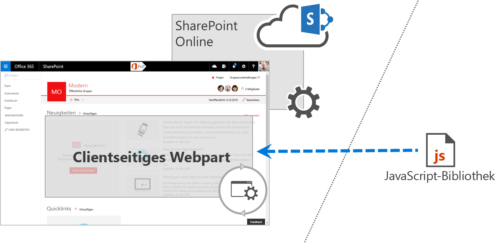

# Sharepoint Framework-Lösungen – Überlegungen zum Thema GovernanceSharePoint Framework solutions governance considerations

Mithilfe des SharePoint-Frameworks können Organisationen problemlos Lösungen erstellen, die die in SharePoint und Office 365 verfügbaren Funktionen besser nutzen.With the SharePoint Framework, your organization can easily build solutions that easily integrate the capabilities available in SharePoint and Office 365. SharePoint Framework-Lösungen funktionieren mit modernen Webtechnologien sowie verschiedenen mobilen Geräten, sodass Sie produktive Benutzerumgebungen und Apps bereitstellen können, die vom ersten Tag an schnell reagieren und für Mobilgeräte geeignet sind.SharePoint Framework solutions work across modern web technologies and different mobile devices so you can create productive experiences and apps that are responsive and mobile-ready from day one. Um die Vorteile von SharePoint-Framework-Lösungen optimal nutzen zu können, sollte Ihr Unternehmen über einen umsetzbaren Governanceplan verfügen, der die wichtigsten Überlegungen zur Projektverwaltung abdeckt.In order to get the moust benefit from SharePoint Framework solutions, your organization should have an actionable governance plan covering the most important project management considerations.

## Anatomie von SharePoint Framework-LösungenAnatomy of SharePoint Framework solutions

SharePoint Framework-Lösungen bestehen aus zwei Teilen: Code (häufig als Webpart-Paket bezeichnet), der einer URL bereitgestellt wird, und einer SPPKG-Datei mit dem Webpart-Manifest und einer URL, die auf den Speicherort verweist, an dem der Code für das Webpart bereitgestellt wird.SharePoint Framework solutions consist of two parts: code (often referred to as web part bundle), deployed to a URL, and an .sppkg file that contains web part manifest with a URL pointing to the location where the web part code is deployed. Es gibt keine spezifischen Einschränkungen im Hinblick auf den Bereitstellungsort des Codes, solange Benutzer, die mit dem Webpart arbeiten, auf den Webpart-Code zugreifen können.There are no particular restrictions to where the code is deployed, as long as users working with the web part can access the web part code. Organisationen können ihre Webparts z. B. im [öffentlichen Office 365-CDN](https://dev.office.com/blogs/office-365-public-cdn-developer-preview-release), in [Azure Storage](../get-started/deploy-web-part-to-cdn.md) oder auf einem privaten Webserver bereitstellen.Organizations can choose for example to have their web parts deployed to the [Office 365 public CDN](https://dev.office.com/blogs/office-365-public-cdn-developer-preview-release), [Azure storage](../get-started/deploy-web-part-to-cdn.md) or a privately owned web server.

## Überlegungen zum Hostingspeicherort von Webpart-CodeWeb part code hosting location considerations

Das Wichtigste, was Organisationen vor der Bereitstellung von SharePoint Framework-Lösungen wissen müssen, ist der Ort, an dem der Code der Lösung bereitgestellt werden soll.The most important thing that organizations should know, before deploying SharePoint Framework solutions, is where the code of the solution is deployed. SharePoint Framework-Lösungen werden als Teil der Seite im Kontext des aktuellen Benutzers ausgeführt.SharePoint Framework solutions are executed as a part of the page in the context of the current user. Dies bedeutet: Alles, was der Benutzer tun darf, darf auch der Webpart-Code tun.As a result, whatever the user can do, the web part's code can do as well. Im Gegensatz zu SharePoint-Add-Ins wird auf SharePoint Framework-Lösungen kein separater Berechtigungsbereich angewendet.In contrast to SharePoint add-ins, there is no separate permission scope applied to SharePoint Framework solutions. Daher sollten SharePoint-Administratoren SharePoint-Framework-Lösungen als besonders vertrauenswürdige Lösungen behandeln – auf die gleiche Weise, wie sie lokale Farmlösungen behandeln.This is why SharePoint administrators should treat SharePoint Framework solutions as high-trust solutions--the same way they treat farm solutions on-premises. Der Ort, an dem der Webpart-Code bereitgestellt wird, ist aus einer Reihe von Gründen wichtig.The location where the web part's code is deployed is important for a number of reasons. 

Berücksichtigen Sie folgende Überlegungen zum Speicherort:Consider the following location issues:

### Wird der Hostingspeicherort des Codes von der Organisation unterstützt?Is the code hosting location supported by the organization?

In SharePoint-Framework gibt es keine Einschränkungen bezüglich des Orts, an dem der Code der Lösung bereitgestellt wird.SharePoint Framework doesn't impose any restrictions regarding where the solution's code is deployed. Daher können Entwickler und Anbieter den Code an mehreren Speicherorten innerhalb oder außerhalb der IT-Abteilung der Organisation bereitstellen.As a result, developers and vendors can deploy the code to a range of locations within or outside of the organization's IT department. Verschiedene Organisationen haben möglicherweise unterschiedliche Serveranforderungen, angefangen bei Richtlinien bis hin zu SLAs.Different organizations may have different server requirements ranging from access policies to SLAs. Vor der Bereitstellung eines SharePoint-Framework-Lösungspakets sollten Organisationen sicherstellen, dass der Server, der zum Hosten des Codes verwendet wird, ein bekannter und von der Organisation zugelassener Server ist.Before deploying a SharePoint Framework solution package, organizations should ensure that the server used to host the code is a known server approved to be used by the organization.

### Wer verwaltet den Hostingspeicherort des Codes?Who manages the code hosting location?

SharePoint-Framework-Lösungen werden als Teil der Seite im Kontext des aktuellen Benutzers ausgeführt.SharePoint Framework solutions execute as a part of the page in the context of the current user. Zwar kann eine Organisation den Code vor der Bereitstellung des Lösungspakets überprüfen, um sicherzustellen, dass der Code vertrauenswürdig ist, sie muss jedoch auch die Integrität des Codes sicherstellen können, solange er auf dem Mandanten bereitgestellt wird.While an organization could perform a code review before deploying a solution package, in order to verify that the code can be trusted, it also should ensure the integrity of the code as long as it's deployed to the tenant. Organisationen sollten genau wissen, wer den Hostingspeicherort verwaltet, von wem und unter welchen Umständen die Dateien geändert werden können und wie das Verfahren zum Genehmigen von Updates aussieht.Organizations should have a clear understanding of who manages the hosting location, who and under what circumstances they can modify the files, and what the update approval process looks like. Die Vorabbeschaffung dieser Informationen hilft nicht nur Organisationen bei der Steuerung des Updatevorgangs, sondern senkt auch das Risiko, dass bösartiger Code bereitgestellt wird.Establishing this information upfront not only helps organizations control the update process, but also lowers the risk of deploying malicious code.

### Welche SLA gilt für den Hostingspeicherort?What is the SLA for the hosting location?

Wenn Organisationen Office 365 und SharePoint Online verwenden, hängen sie von der von Microsoft bereitgestellten SLA ab.When organizations use Office 365 and SharePoint Online, they rely on the SLA provided by Microsoft. SharePoint-Framework-Lösungen, die die Standardfunktionen von SharePoint und Office 365 erweitern, sollten auf Servern bereitgestellt werden, die der von Microsoft bereitgestellten SLA entsprechen oder diese sogar übertreffen.SharePoint Framework solutions that extend the standard capabilities of SharePoint and Office 365 should be deployed to servers that meet or exceed the SLA provided by Microsoft. Auf diese Weise können Organisationen sicherstellen, dass sie tatsächlich vom Mehrwert ihrer Anpassungen profitieren können.That way, organizations can ensure that they are able to truly benefit from the added values of their customizations.

### Ist der Hostingspeicherort für Leistung optimiert?Is the hosting location optimized for performance?

Externe Bibliotheken über eine URL zu laden, anstatt sie in das Webpart-Paket einzubetten, ist der erste Schritt zum Beschleunigen der Ladezeit von SharePoint-Framework-Lösungen.Loading existing libraries from a URL instead of embedding them in the web part bundle is the first step to speed up the loading time of SharePoint Framework solutions. Zur optimalen Nutzung sollten Sie sicherstellen, dass der Server, der die verschiedene Skripts hostet, ordnungsgemäß für optimale Leistung konfiguriert ist.To get the most out of it, you want to ensure that the server hosting the different scripts is correctly configured for optimal performance. Er sollte alle Dateien komprimiert bereitstellen, und je länger Dateien auf Proxys oder Clients zwischengespeichert werden dürfen, desto länger können Benutzer diese Skripts aus ihrem lokalen Cache laden, wodurch das Laden von SharePoint-Seiten mit Webparts erheblich beschleunigt wird.It should serve all files compressed and the longer it allows proxies and clients to cache the files, the longer users will be able to load these scripts from their local cache, significantly speeding up loading SharePoint pages containing web parts.

## Tools und BibliothekenTools and libraries

Beim Erstellen von clientseitigen Lösungen können Entwickler aus einer Vielzahl von Bibliotheken wählen, z. B. React, Angular, jQuery oder Knockout.When building client-side solutions, developers can choose from a variety of libraries such as React, Angular, jQuery or Knockout. Die Verwendung einer vorhandenen JavaScript-Bibliothek erleichtert Entwicklern die Erstellung von Lösungen mit umfassendem Funktionsumfang.Using an existing JavaScript library makes it easier for developers to build rich solutions. Es gibt große Unterschiede zwischen der Funktionsweise der verschiedenen Bibliotheken, und häufig sind spezifische Kenntnisse erforderlich, um in vollem Umfang zu verstehen, wie eine Lösung mit der jeweiligen  Bibliothek erstellt wird.There are big differences between how the different libraries work, and often specific knowledge is required to fully understand how to build a solution using the particular library.

Nachdem die Lösung für den Produktionsmandanten freigegeben wurde, müssen Sie sicherstellen, dass Ihre Supportorganisation (entweder Ihre eigene IT-Abteilung oder ein vertraglich verpflichteter Drittanbieter) Support für die Lösung leisten kann.Once released to your production tenant, you should ensure that your support organization (either your own IT department or a contracted third party) is capable of supporting the solution. Um dies zu erreichen, muss die Supportorganisation mindestens über ein grundlegendes Verständnis der Bibliothek verfügen, die zum Erstellen der betreffenden Lösung verwendet wurde.To do this, the support organization should have at least a basic understanding of the library used to build that solution. Außerdem gilt: Je größer die Anzahl der bei Ihrem Mandanten verwendeten Bibliothekstypen ist, desto schwieriger wird es, Support für die verschiedenen Lösungen zu leisten.Also, as you increase the number libraries you use across your tenant, the harder it will be to support the different solutions. Wenn Sie lediglich eine oder zwei Bibliotheken für die Verwendung in Ihrer Organisation auswählen, trägt dies zur Senkung der Betriebskosten bei.Selecting one or two libraries to use in your organization helps you lower the operational costs. Bevor Sie eine Lösung für Ihren Produktionsmandanten bereitstellen, sollten Sie sicherstellen, dass die Lösung nur Bibliotheken verwendet, die in Ihrer Organisation unterstützt werden.Before deploying a solution to your production tenant, you should ensure that the solution is using only libraries supported in your organization.

## Verwenden von externen SkriptsUsing external scripts

Bei Verwendung vorhandener JavaScript-Bibliotheken können Entwickler diese wahlweise in das Webpart-Codepaket einschließen oder über eine URL laden.When using existing JavaScript libraries, developers can either choose to include them in the web part code bundle or load them from a URL. Das Laden von Bibliotheken über URLs ermöglicht es Entwicklern, die Leistung von SharePoint Framework-Lösungen zu optimieren.Loading libraries from URLs allows developers to optimize SharePoint Framework solutions for performance. Da Bibliotheken über eine URL geladen werden, müssen sie nicht im Webpart-Paket enthalten sein, wodurch sich dessen Größe verringert, sodass es schneller geladen werden kann.Because libraries are loaded from a URL, they don't need to be included in the web part bundle which decreases its size making it load faster. Darüber hinaus werden SharePoint-Framework-Lösungen, die im gesamten Mandanten auf die gleichen Bibliotheken verweisen, schneller geladen, da sie die zuvor heruntergeladenen Skripts aus dem lokalen Cache wiederverwenden.Additionally, by referencing the same libraries across the whole tenant, SharePoint Framework solutions will load faster by reusing the previously downloaded scripts from the local cache.

Es gibt keine Einschränkungen im Hinblick darauf, von wo die vorhandenen Bibliotheken geladen werden können, und es ist wichtig für Sie zu wissen, von welchen Servern externe Skripts geladen werden.There are no restrictions to where the existing libraries can be loaded from and it's important to know from which servers the external scripts are loaded. Zusammen mit dem Webpart-Code werden diese Skripts im Kontext des aktuellen Benutzers ausgeführt und dürfen tun, was der aktuelle Benutzer tun darf.Together with the web part code, these scripts run in the context of the current user and can do whatever the current user is capable of doing. Daher ist es wichtig, dass Sie diesen Skripts und ihrer Integrität vertrauen.Therefore, it's important that you trust these scripts and their integrity. In einigen Organisationen gelten strenge Richtlinien im Hinblick auf das Laden von Ressourcen aus öffentlichen CDNs, und Sie sollten sicherstellen, dass die Lösung und die zugehörigen Ressourcen die Organisationsrichtlinien erfüllen.Some organizations have strict policies relating to resources sourced from public CDNs and you should ensure that the solution and its resources meet your organizational policies.

## Genehmigen von SharePoint-Framework-Lösungen für die BereitstellungApproving SharePoint Framework solutions for deployment

SharePoint Framework-Lösungen werden zentral über den App-Katalog an einen Mandanten bereitgestellt.SharePoint Framework solutions are deployed to a tenant centrally through the App Catalog. Ihre Organisation sollte über einen Plan verfügen, in dem beschrieben wird, wer zum Bereitstellen und Genehmigen von SharePoint Framework-Paketen berechtigt ist.Your organization should have a plan in place describing who is allowed to deploy and approve SharePoint Framework packages. Dies ist wichtig, da dieser Plan auch angeben sollte, wer dafür zuständig ist zu überprüfen, ob die bereitgestellten Pakete sicher sind und den Organisationsrichtlinien entsprechen.This is important, because this plan should include who is  responsible to verify that the packages that are deployed are secure and meet the organizational policies. SharePoint Framework-Lösungen werden im Browser im Kontext des aktuellen Benutzers ausgeführt und haben im Gegensatz zu SharePoint-Add-Ins stets die gleichen Berechtigungen wie der momentan angemeldete Benutzer.SharePoint Framework solutions run in browser in the context of the current user and, unlike SharePoint add-ins, always have the same permissions as the currently signed-in user. Bevor Sie eine SharePoint-Framework-Lösung für die Verwendung in Ihrer Organisation bereitstellen und genehmigen, müssen Sie ihren Ursprung und andere Kriterien, die weiter oben in diesem Artikel genannten werden, sorgfältig prüfen.Before deploying and approving a SharePoint Framework solution for use in your organization, its origin and other criteria mentioned previously in this article should be carefully examined.

Um zu überprüfen, ob die jeweilige SharePoint-Framework-Lösung die Organisationsrichtlinien erfüllt, sollten Sie den Inhalt des SPPKG-Pakets überprüfen, das Sie bereitstellen möchten, und den Inhalt der referenzierten Skripts sowie den Speicherort, an dem sie gehostet werden, genau untersuchen.In order to verify that your SharePoint Framework solution meets your organization's policies, you should review the contents of the .sppkg package that you want to deploy and closely examine the contents of the referenced scripts and the location where they are hosted. Dieser Schritt kann manuell ausgeführt oder teilweise automatisiert werden, z. B. mithilfe von Drittanbietertools.This step can be performed manually or it can be automated by using third party tooling. [SharePoint Customization Analysis Framework](https://rencore.com/products/#spcaf) (SPCAF) ist ein Beispiel für eine Drittanbieterlösung, die die Analyse des Inhalts von SharePoint Framework-Lösungen und die Überprüfung, ob sie die Sicherheits- und Governanceanforderungen der Organisation erfüllen, erheblich vereinfacht.[SharePoint Customization Analysis Framework](https://rencore.com/products/#spcaf) (SPCAF) is an example of third party solution that significantly simplifies the process of analyzing the contents of SharePoint Framework solutions and verifying that they meet your organizational security and governance requirements.

## SharePoint Framework-Lösungen und Websites ohne SkriptsSharePoint Framework solutions and no-script sites

In Office 365 können Organisationen die Einstellung „Kein Skript“ verwenden, um skriptbasierte Anpassungen in SharePoint Online zu deaktivieren.In Office 365, organizations can use the no-script setting to disable script-based customizations in SharePoint Online. Organisationen können die Einstellung „Kein Skript“ entweder für den gesamten Mandanten oder für eine bestimmte Websitesammlung konfigurieren.Organizations can configure the no-script setting either for the whole tenant or for a particular site collections. Basierend auf den Kriterien aus den Organisationsrichtlinien können Administratoren die Einstellung „Kein Skript“ verwenden, um Anpassungen zu deaktivieren, die z. B. mit dem Skript-Editor-Webpart oder einer benutzerdefinierten Aktion erstellt wurden.Based on the criteria from the organizational policies, administrators can use the no-script setting to disable customizations built for example using the script editor web part or a user custom action.

Die Einstellung „Kein Skript“ ermöglicht es Organisationen, eine zusätzliche Kontroll- und Sicherheitsebene auf den gesamten Mandanten oder bestimmte Websitesammlungen anzuwenden. Das Anpassen von SharePoint durch Einbetten und Einfügen von Skripts ist nicht ohne Risiken und sollte insbesondere auf Websites mit vertraulichen Informationen sorgfältig überdacht werden.The no-script setting is meant for organizations to apply an additional layer of control and security to either the whole tenant or specific site collections. Customizing SharePoint using script embedding and injecting is not without risks and particularly on sites containing sensitive information should be thoroughly evaluated.

In der Vergangenheit haben Entwickler mithilfe von Techniken zum Einbetten und Einfügen von Skripts leistungsfähige SharePoint-Anpassungen erstellt.In the past, developers used script embedding and injecting techniques for building powerful SharePoint customizations. In einigen Fällen basierten diese Anpassungen auf einer bestimmten Seitenstruktur, und wenn diese geändert wurde, funktionierte die jeweilige Anpassung nicht mehr ordnungsgemäß.In some cases, these customizations relied on specific page structure and when the particular customization changed, it would stop working correctly. Um Entwickler beim Erstellen robusterer Lösungen zu unterstützen, hat das SharePoint-Entwicklungsteam entschieden, dass in allen modernen Websites die Einstellung „Kein Skript“ aktiviert sein sollte.To guide developers to build more robust solutions, the SharePoint engineering team decided that all modern sites should have the no-script setting enabled. Dies bedeutet, dass das Einbetten und Einfügen von Skripts auf diesen Websites nicht möglich ist und dass die Verwendung von SharePoint Framework derzeit die einzige Möglichkeit zum Anpassen dieser Websites ist.This means that embedding and injecting scripts on these sites is not possible and using the SharePoint Framework is currently the only option to customize these sites. Es wird erwartet, dass zukünftig alle modernen Websites die Einstellung „Kein Skript“ verwenden und Alternativen für das Einbetten und Einfügen von Skripts für Entwickler verfügbar gemacht werden, um die verschiedenen Szenarios zu unterstützen.In the future, all modern sites will use the no-script setting and alternatives to script embedding and injecting will become available for developers to support the different scenarios.
