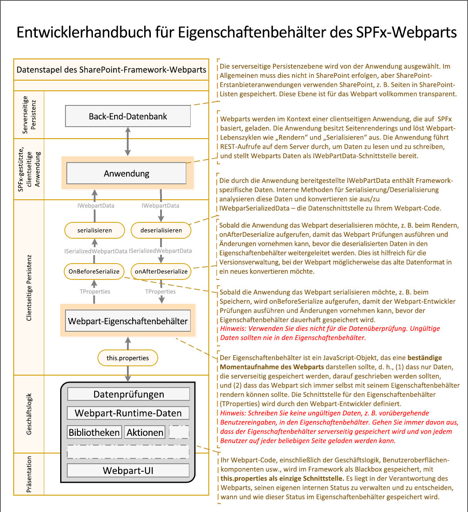

# <a name="integrate-web-part-properties-with-sharepoint"></a><span data-ttu-id="98afe-103">Integrieren von Webparteigenschaften in SharePoint</span><span class="sxs-lookup"><span data-stu-id="98afe-103">Integrate web part properties with SharePoint</span></span>

<span data-ttu-id="98afe-104">Wenn Sie klassische Webparts erstellen, werden Webparteigenschaften aus SharePoint isoliert und deren Werte von Endbenutzern verwaltet.</span><span class="sxs-lookup"><span data-stu-id="98afe-104">When building classic web parts, web part properties were isolated from SharePoint, and their values were managed by end-users.</span></span> <span data-ttu-id="98afe-105">SharePoint-Framework bietet neue Funktionen, die die Verwaltung von Webparteigenschaftswerten vereinfachen und diese in die SharePoint-Suche integrieren.</span><span class="sxs-lookup"><span data-stu-id="98afe-105">SharePoint Framework offers you a new set of capabilities that simplify managing web part properties' values and integrate them with SharePoint Search.</span></span> <span data-ttu-id="98afe-106">In diesem Artikel wird erläutert, wie Sie diese Funktionen beim Erstellen von clientseitigen SharePoint-Framework-Webparts verwenden können.</span><span class="sxs-lookup"><span data-stu-id="98afe-106">This article explains how you can use these capabilities when building SharePoint Framework client-side web parts.</span></span>

> [!IMPORTANT] 
> <span data-ttu-id="98afe-107">Der folgende Leitfaden gilt nur für clientseitige SharePoint-Framework-Webparts, die auf modernen SharePoint-Seiten platziert werden.</span><span class="sxs-lookup"><span data-stu-id="98afe-107">The following guide applies only to SharePoint Framework client-side web parts placed on modern SharePoint pages.</span></span> <span data-ttu-id="98afe-108">Die in diesem Artikel beschriebenen Funktionen gelten nicht für klassische Webparts oder clientseitige SharePoint-Framework-Webparts, die auf klassischen Seiten platziert werden.</span><span class="sxs-lookup"><span data-stu-id="98afe-108">Capabilities described in this article don't apply to classic web parts or SharePoint Framework client-side web parts placed on classic pages.</span></span>

## <a name="client-side-web-part-properties"></a><span data-ttu-id="98afe-109">Eigenschaften von clientseitigen Webparts</span><span class="sxs-lookup"><span data-stu-id="98afe-109">Client-side web part properties</span></span>

<span data-ttu-id="98afe-p103">Wenn Sie clientseitige SharePoint Framework-Webparts erstellen, können Sie Eigenschaften definieren, die von Benutzern konfiguriert werden können. Durch Verwendung von Eigenschaften anstelle von festen Werte werden Webparts flexibler und eignen sich für viele unterschiedliche Szenarios.</span><span class="sxs-lookup"><span data-stu-id="98afe-p103">When building SharePoint Framework client-side web parts, you can define properties that can be configured by users. By using properties instead of fixed values, web parts are more flexible and suitable for many different scenarios.</span></span>

<span data-ttu-id="98afe-112">Im Vergleich zu klassischen Webparts gibt es einige Unterschiede hinsichtlich der Verarbeitung von Webparteigenschaften mit dem SharePoint-Framework.</span><span class="sxs-lookup"><span data-stu-id="98afe-112">Compared to classic web parts, there are some differences in how the SharePoint Framework handles web part properties.</span></span> <span data-ttu-id="98afe-113">Das folgende Schema veranschaulicht, wie Webpart-Eigenschaftswerte die verschiedenen Ebenen von SharePoint durchlaufen.</span><span class="sxs-lookup"><span data-stu-id="98afe-113">The following schema illustrates how web part property values flow through the different layers of SharePoint.</span></span>



<br/>

<span data-ttu-id="98afe-115">Bevor Sie Werte für Webparteigenschaften von Endbenutzern annehmen, sollten Sie diese immer [überprüfen](./validate-web-part-property-values.md).</span><span class="sxs-lookup"><span data-stu-id="98afe-115">Before accepting values for web part properties from end users, you should always [validate them](./validate-web-part-property-values.md).</span></span> <span data-ttu-id="98afe-116">Auf diese Weise können Sie nicht nur sicherstellen, dass Ihre Webparts benutzerfreundlich sind, sondern auch verhindern, dass ungültige Daten in der Webpartkonfiguration gespeichert werden.</span><span class="sxs-lookup"><span data-stu-id="98afe-116">This not only allows you to ensure that your web parts are user-friendly, but also helps you prevent storing invalid data in the web part's configuration.</span></span> 

<span data-ttu-id="98afe-117">Darüber hinaus sollten Sie berücksichtigen, dass das SharePoint-Framework keine Anpassung unterstützt und alle Benutzer die gleiche Konfiguration des entsprechenden Webparts sehen.</span><span class="sxs-lookup"><span data-stu-id="98afe-117">Additionally, you should consider that the SharePoint Framework doesn't support personalization, and all users see the same configuration of the particular web part.</span></span>

## <a name="specify-web-part-property-value-type"></a><span data-ttu-id="98afe-118">Angeben des Typs von Webpart-Eigenschaftswerten</span><span class="sxs-lookup"><span data-stu-id="98afe-118">Specify web part property value type</span></span>

<span data-ttu-id="98afe-p106">In klassischen SharePoint-Webparts waren Werte von Webpart-Eigenschaftswerten von SharePoint isoliert. Wenn Sie eine Webparteigenschaft mit einer URL einer Datei in SharePoint gespeichert hatten, mussten Sie manuell sicherstellen, dass diese URL gültig war und auf ein korrektes Dokument verwies, falls es verschoben oder umbenannt wurde. Wenn Benutzer Text eingeben konnten, der im Webpart angezeigt wurde, wurde dieser Text von der SharePoint-Suche auch nicht indiziert.</span><span class="sxs-lookup"><span data-stu-id="98afe-p106">In classic SharePoint web parts, web part property values were isolated from SharePoint. If you had a web part property with a URL of a file stored in SharePoint, you had to manually ensure that this URL was valid and pointing to a correct document in case it was moved or renamed. Also, if you allowed users to enter some text to be displayed in the web part, that text wouldn't be indexed by SharePoint Search.</span></span>

<span data-ttu-id="98afe-122">Wenn Sie Webparts erstellen, können Sie mit SharePoint-Framework bestimmen, welche Art von Wert die jeweilige Webparteigenschaft enthalten soll.</span><span class="sxs-lookup"><span data-stu-id="98afe-122">When building web parts, SharePoint Framework allows you to specify what kind of value the particular web part property holds.</span></span> <span data-ttu-id="98afe-123">Diese Konfiguration bestimmt, wie SharePoint den Wert verarbeitet.</span><span class="sxs-lookup"><span data-stu-id="98afe-123">This configuration determines how SharePoint handles the value.</span></span> <span data-ttu-id="98afe-124">Abhängig von der angegebenen Konfiguration kann SharePoint den Wert der jeweiligen Eigenschaft im Suchindex enthalten, unsichere HTML-Inhalte entfernen und sogar Links zu Dokumenten in SharePoint auf dem neuesten Stand speichern, falls eine Datei verschoben oder umbenannt wird.</span><span class="sxs-lookup"><span data-stu-id="98afe-124">Depending on the specified configuration, SharePoint can include the value of the particular property in the Search index, remove unsafe HTML, and even keep links to documents stored in SharePoint up to date in case a file gets moved or renamed.</span></span>

<span data-ttu-id="98afe-125">Um die Konfiguration für Ihre Webparteigenschaften anzugeben, setzen Sie in der Webpartklasse den **propertiesMetadata**-Getter außer Kraft:</span><span class="sxs-lookup"><span data-stu-id="98afe-125">To specify the configuration for your web part properties, in the web part class, override the **propertiesMetadata** getter:</span></span>

```typescript
import {
  BaseClientSideWebPart,
  IPropertyPaneConfiguration,
  PropertyPaneTextField,
  IWebPartPropertiesMetadata
} from '@microsoft/sp-webpart-base';

// ...

export default class ArticleLinkWebPart extends BaseClientSideWebPart<IArticleLinkWebPartProps> {
  // ...
  protected get propertiesMetadata(): IWebPartPropertiesMetadata {
    return {
      'title': { isSearchablePlainText: true },
      'intro': { isHtmlString: true },
      'image': { isImageSource: true },
      'url': { isLink: true }
    };
  }
  // ...
}
```

<span data-ttu-id="98afe-126">Die **PropertiesMetadata**-Methode gibt ein Objekt zurück, in dem die Eigenschaft eine Zeichenfolge ist, und gibt den Namen der Webparteigenschaft an, und der Wert ist ein Objekt, das angibt, wie SharePoint die jeweilige Eigenschaft behandeln soll.</span><span class="sxs-lookup"><span data-stu-id="98afe-126">The **propertiesMetadata** method returns an object, where the property is a string and specifies the name of the web part property, and the value is an object specifying how SharePoint should handle that particular property.</span></span> 

<span data-ttu-id="98afe-127">Wenn Sie die **PropertiesMetadata**-Methode überschreiben, müssen Sie nicht alle Webparteigenschaften auflisten.</span><span class="sxs-lookup"><span data-stu-id="98afe-127">When overriding the **propertiesMetadata** method, you don't have to list all the web part properties.</span></span> <span data-ttu-id="98afe-128">Standardmäßig werden die Werte der Webparteigenschaften nicht von SharePoint verarbeitet, und Sie sollten nur diejenigen Eigenschaften einschließen, die verarbeitet werden sollen.</span><span class="sxs-lookup"><span data-stu-id="98afe-128">By default, web part properties' values are not processed by SharePoint, and you should include only those properties that you want to be processed.</span></span>

<span data-ttu-id="98afe-129">Nachfolgend finden Sie eine Liste möglicher Werte, die in den Metadaten der Eigenschaften festgelegt werden können, sowie deren Auswirkungen darauf, wie der Wert der Webparteigenschaft von SharePoint verarbeitet wird.</span><span class="sxs-lookup"><span data-stu-id="98afe-129">Following is the list of possible values that can be set in the properties metadata and their impact on how the value of the web part property is processed by SharePoint.</span></span>

<br/>

<span data-ttu-id="98afe-130">Metadatenwert</span><span class="sxs-lookup"><span data-stu-id="98afe-130">Metadata value</span></span>|<span data-ttu-id="98afe-131">Durchsuchbar</span><span class="sxs-lookup"><span data-stu-id="98afe-131">Searchable</span></span>|<span data-ttu-id="98afe-132">Linkkorrektur</span><span class="sxs-lookup"><span data-stu-id="98afe-132">Link fixup</span></span>|<span data-ttu-id="98afe-133">Unsichere HTM entfernen</span><span class="sxs-lookup"><span data-stu-id="98afe-133">Remove unsafe HTML</span></span>
--------------|:--------:|:--------:|:----------------:
<span data-ttu-id="98afe-134">Keine (Standard)</span><span class="sxs-lookup"><span data-stu-id="98afe-134">none (default)</span></span>|<span data-ttu-id="98afe-135">nein</span><span class="sxs-lookup"><span data-stu-id="98afe-135">no</span></span>|<span data-ttu-id="98afe-136">nein</span><span class="sxs-lookup"><span data-stu-id="98afe-136">no</span></span>|<span data-ttu-id="98afe-137">nein</span><span class="sxs-lookup"><span data-stu-id="98afe-137">no</span></span>
`isSearchablePlainText`|<span data-ttu-id="98afe-138">ja</span><span class="sxs-lookup"><span data-stu-id="98afe-138">yes</span></span>|<span data-ttu-id="98afe-139">nein</span><span class="sxs-lookup"><span data-stu-id="98afe-139">no</span></span>|<span data-ttu-id="98afe-140">nein</span><span class="sxs-lookup"><span data-stu-id="98afe-140">no</span></span>
`isHtmlString`|<span data-ttu-id="98afe-141">ja</span><span class="sxs-lookup"><span data-stu-id="98afe-141">yes</span></span>|<span data-ttu-id="98afe-142">ja</span><span class="sxs-lookup"><span data-stu-id="98afe-142">yes</span></span>|<span data-ttu-id="98afe-143">ja</span><span class="sxs-lookup"><span data-stu-id="98afe-143">yes</span></span>
`isImageSource`|<span data-ttu-id="98afe-144">ja</span><span class="sxs-lookup"><span data-stu-id="98afe-144">yes</span></span>|<span data-ttu-id="98afe-145">ja</span><span class="sxs-lookup"><span data-stu-id="98afe-145">yes</span></span>|<span data-ttu-id="98afe-146">nein</span><span class="sxs-lookup"><span data-stu-id="98afe-146">no</span></span>
`isLink`|<span data-ttu-id="98afe-147">ja</span><span class="sxs-lookup"><span data-stu-id="98afe-147">yes</span></span>|<span data-ttu-id="98afe-148">ja</span><span class="sxs-lookup"><span data-stu-id="98afe-148">yes</span></span>|<span data-ttu-id="98afe-149">nein</span><span class="sxs-lookup"><span data-stu-id="98afe-149">no</span></span>

<br/>

> [!IMPORTANT] 
> <span data-ttu-id="98afe-150">Wenn Sie die Konfiguration für Ihre Webparteigenschaften definieren, sollten Sie jeweils nur eine der in der Tabelle aufgeführten Eigenschaften für jede Webparteigenschaft verwenden.</span><span class="sxs-lookup"><span data-stu-id="98afe-150">When defining the configuration for your web part properties, you should use only one of the properties mentioned in the table for each web part property.</span></span> <span data-ttu-id="98afe-151">Das Festlegen mehrerer Eigenschaften wird wahrscheinlich zu unerwünschten Ergebnissen führen und sollte daher vermieden werden.</span><span class="sxs-lookup"><span data-stu-id="98afe-151">Setting multiple properties will most likely lead to undesirable results, and you should avoid it.</span></span>

<span data-ttu-id="98afe-p110">Standardmäßig wird der Wert einer Webparteigenschaft nicht von der SharePoint-Suche indiziert und in keiner Weise von SharePoint verarbeitet. Er wird genau so an das Webpart übergeben, wie er vom Benutzer eingegeben wurde, der das Webpart konfiguriert.</span><span class="sxs-lookup"><span data-stu-id="98afe-p110">By default the value of a web part property is not indexed by SharePoint Search and it's not processed by SharePoint in any way. It's passed to the web part exactly how it's been entered by the user configuring the web part.</span></span>

<span data-ttu-id="98afe-154">Wenn Sie die Webparteigenschaft als `isSearchablePlainText` angeben, wird sie in den Index für die Volltextsuche integriert.</span><span class="sxs-lookup"><span data-stu-id="98afe-154">If you specify the web part property as `isSearchablePlainText`, it is included in the full-text Search index.</span></span> <span data-ttu-id="98afe-155">Wenn Benutzer nach beliebigen, im Wert dieser Eigenschaft inbegriffenen Schlüsselwörtern suchen, gibt die SharePoint-Suche die Seite mit dem Webpart in den Suchergebnissen zurück.</span><span class="sxs-lookup"><span data-stu-id="98afe-155">Whenever users search for any keywords included in the value of that property, SharePoint Search returns the page with the web part in the search results.</span></span> <span data-ttu-id="98afe-156">Wenn der Wert einen Link zu einem in SharePoint gespeicherten Dokument enthält, wird dieser Link nicht aktualisiert, wenn das Dokument, auf das verwiesen wird, verschoben oder umbenannt wird.</span><span class="sxs-lookup"><span data-stu-id="98afe-156">If the value contains a link to a document stored in SharePoint, that link won't be updated if the referenced document is moved or renamed.</span></span> <span data-ttu-id="98afe-157">Darüber hinaus bleibt jeglicher vom Benutzer eingegebener HTML-Code erhalten.</span><span class="sxs-lookup"><span data-stu-id="98afe-157">Also, any HTML entered by users, is kept intact.</span></span> <span data-ttu-id="98afe-158">Wenn Sie mit dem Wert einer solchen Eigenschaft arbeiten, sollten Sie diesen als Nur-Text- und escape-HTML-Code behandeln, der vor dem Rendern auf der Seite von Benutzern eingegeben werden kann, um Skripteinschleusung zu vermeiden.</span><span class="sxs-lookup"><span data-stu-id="98afe-158">When working with the value of such a property, you should treat it as plain-text and escape HTML that might be entered by users before rendering it on the page to avoid script injection.</span></span>

<span data-ttu-id="98afe-159">Wenn eine Webparteigenschaft als `isHtmlString` definiert ist, entfernt SharePoint zuerst alle unsicheren HTML-Elemente, wie z. B. `script`-Tags, aus dem Eigenschaftswert.</span><span class="sxs-lookup"><span data-stu-id="98afe-159">When a web part property is defined as `isHtmlString`, SharePoint first of all removes any unsafe HTML, such as `script` tags, from the property value.</span></span> <span data-ttu-id="98afe-160">Der verbleibende HTML-Code kann für das Rendering auf einer Seite als sicher eingestuft werden.</span><span class="sxs-lookup"><span data-stu-id="98afe-160">The HTML that remains can be considered safe to render on a page.</span></span> <span data-ttu-id="98afe-161">Wenn der Wert URLs enthält, die auf in SharePoint gespeicherte Dateien hinweisen, aktualisiert SharePoint automatisch die in die Eigenschaft des Webparts gespeicherte URL, sobald eine der Dateien umbenannt oder verschoben wird.</span><span class="sxs-lookup"><span data-stu-id="98afe-161">If the value contains any URLs pointing to files stored in SharePoint, as soon as one of these files is renamed or moved, SharePoint automatically updates the URL stored in the web part property.</span></span> <span data-ttu-id="98afe-162">Dies erleichtert das Verwalten von URLs für alle Webparts und Seiten in Ihrem Mandanten erheblich.</span><span class="sxs-lookup"><span data-stu-id="98afe-162">This significantly simplifies managing URLs across all web parts and pages in your tenant.</span></span> <span data-ttu-id="98afe-163">HTML-Webparteigenschaften können auch durchsucht werden, sodass Benutzer nach allen im Eigenschaftswert enthaltenen Schlüsselwörtern suchen können.</span><span class="sxs-lookup"><span data-stu-id="98afe-163">HTML web part properties are also searchable, so users can look for any keywords included in the property value.</span></span>

<span data-ttu-id="98afe-164">Die Eigenschaftswerttypen `isImageSource` und `isLink` sind für die Verwendung mit Webparteigenschaften gedacht, die nur einen Link zu einem Bild oder einer in SharePoint gespeicherten Datei enthalten.</span><span class="sxs-lookup"><span data-stu-id="98afe-164">Property value types `isImageSource` and `isLink` are meant to be used for web part properties that include nothing else but a link to an image or a file stored in SharePoint.</span></span> <span data-ttu-id="98afe-165">In beiden Fällen schließt die SharePoint-Suche den Inhalt in den Volltext-Index ein und hält die angegebene URL auf dem neuesten Stand, falls die Datei, auf die verwiesen wird, umbenannt oder verschoben wird.</span><span class="sxs-lookup"><span data-stu-id="98afe-165">In both cases, SharePoint Search includes the content in the full-text index and keeps the specified URL up to date in case the referenced file is renamed or moved.</span></span> <span data-ttu-id="98afe-166">Darüber hinaus durchlaufen Bildquellen möglicherweise eine zusätzliche Verarbeitung, damit Bilder schneller herunterladen werden können.</span><span class="sxs-lookup"><span data-stu-id="98afe-166">Additionally, image sources may get additional processing to help images download faster.</span></span> <span data-ttu-id="98afe-167">Wenn eine Seite ein Titelbild enthält und dieses Bild zu den ersten fünf Bildern der Seite gehört oder sich in den ersten beiden Zeilen auf der Seite befindet, wird das Bild vorab geladen.</span><span class="sxs-lookup"><span data-stu-id="98afe-167">If the page has a title image, and the image is among the first five images on the page, or the image is in the first two rows on the page, the image is preloaded.</span></span>
