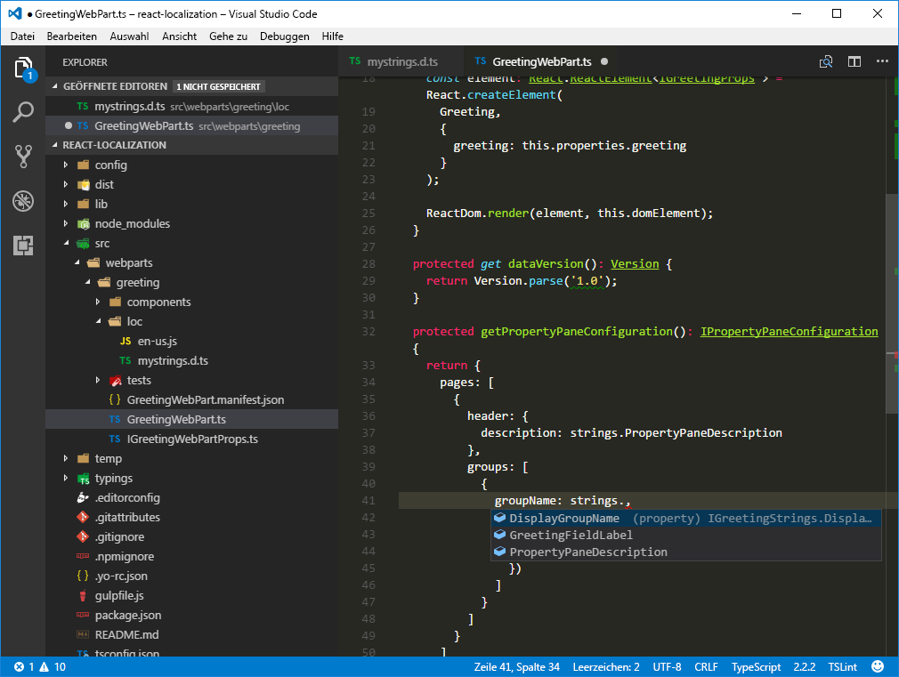

# <a name="localize-sharepoint-framework-client-side-web-parts"></a>Lokalisieren von clientseitigen SharePoint-Framework-Webparts

Sie können die Darstellung Ihres SharePoint Framework mithilfe des clientseitigen-Webparts erweitern, indem Sie ihn für die verschiedenen Sprachen lokalisieren, die von SharePoint-Benutzern weltweit gesprochen werden. In diesem Artikel lokalisieren Sie einen Webpart für das Gebietsschema Niederländisch (Niederlande), und stellen Sie sicher, dass die lokalisierten Werte ordnungsgemäß angezeigt werden.

> [!NOTE] 
> Bevor Sie die Schritte in diesem Artikel ausführen, müssen Sie [die Entwicklungsumgebung für Ihr clientseitiges SharePoint-Webpart einrichten](../../set-up-your-development-environment.md).

## <a name="prepare-the-project"></a>Vorbereiten des Projekts

### <a name="create-a-new-project"></a>Erstellen eines neuen Projekts

1. Erstellen Sie einen neuen Ordner für Ihr Projekt.

  ```sh
  md react-localization
  ```

2. Wechseln Sie zum Projektordner.

  ```sh
  cd react-localization
  ```

3. Führen Sie im Projektordner den SharePoint-Framework-Yeoman-Generator aus, um ein Gerüst für ein neues SharePoint-Framework-Projekt zu erstellen:

  ```sh
  yo @microsoft/sharepoint
  ```

4. Geben Sie die folgenden Werte ein, wenn Sie dazu aufgefordert werden:

  - **react-localization** als Ihr Lösungsname.
  - **SharePoint Online only (latest)** als Basispaketsatz.
  - **Use the currecnt folder** als Speicherort für die Dateien.
  - **y**, um die mandantenweite Bereitstellung zu ermöglichen.
  - **WebPart** als den Typ der zu erstellenden Komponente
  - **Begrüßung** als Name des Webparts.
  - **Grüßt den Benutzer ** als Beschreibung Ihres Webparts.
  - **React** als Startpunkt für die Webpart-Erstellung.

  <br/>

  

5. Warten Sie, bis das Gerüst erstellt wurde, und sperren Sie dann mithilfe des folgenden Befehls die Version der Projektabhängigkeiten:

  ```sh
  npm shrinkwrap
  ```

6. Öffnen Sie den Projektordner in einem Code-Editor. In diesem Artikel wird Visual Studio Code in den Schritten und Screenshots verwendet, Sie können jedoch auch jeden beliebigen anderen Editor verwenden.

  

### <a name="replace-the-default-code"></a>Ersetzen des standardmäßigen Code

1. Öffnen Sie im Code-Editor Die Datei **./src/webparts/greeting/GreetingWebPart.ts** und aktualisieren Sie Definition der `IGreetingWebPartProps`-Schnittstelle mit dem folgenden Code:

  ```typescript
  export interface IGreetingWebPartProps {
    greeting: string;
  }
  ```

2. Ändern Sie in derselben Datei die **GreetingWebPart**-Klasse in:

  ```typescript
  export default class GreetingWebPart extends BaseClientSideWebPart<IGreetingWebPartProps> {

    public render(): void {
      const element: React.ReactElement<IGreetingProps > = React.createElement(
        Greeting,
        {
          greeting: this.properties.greeting
        }
      );

      ReactDom.render(element, this.domElement);
    }

    protected get dataVersion(): Version {
      return Version.parse('1.0');
    }

    protected getPropertyPaneConfiguration(): IPropertyPaneConfiguration {
      return {
        pages: [
          {
            header: {
              description: strings.PropertyPaneDescription
            },
            groups: [
              {
                groupName: strings.DisplayGroupName,
                groupFields: [
                  PropertyPaneTextField('greeting', {
                    label: strings.GreetingFieldLabel
                  })
                ]
              }
            ]
          }
        ]
      };
    }
  }
  ```

3. Aktualisieren Sie die zentrale React-Komponente, indem Sie die Datei **./src/webparts/greeting/components/Greeting.tsx** öffnen und den Code folgendermaßen ändern:

  ```typescript
  import * as React from 'react';
  import styles from './Greeting.module.scss';
  import { IGreetingProps } from './IGreetingProps';
  import { escape } from '@microsoft/sp-lodash-subset';

  export default class Greeting extends React.Component<IGreetingProps, {}> {
    public render(): JSX.Element {
      return (
        <div className={styles.greeting}>
          <div className={styles.container}>
            <div className={`ms-Grid-row ms-bgColor-themeDark ms-fontColor-white ${styles.row}`}>
              <div className="ms-Grid-col ms-u-lg10 ms-u-xl8 ms-u-xlPush2 ms-u-lgPush1">
                <span className='ms-font-xl ms-fontColor-white'>
                  Welcome to SharePoint!
                </span>
                <p className='ms-font-l ms-fontColor-white'>
                  Customize SharePoint experiences using Web Parts.
                </p>
                <p className='ms-font-l ms-fontColor-white'>
                  {escape(this.props.greeting)}
                </p>
                <a href="https://aka.ms/spfx" className={styles.button}>
                  <span className={styles.label}>Learn more</span>
                </a>
              </div>
            </div>
          </div>
        </div>
      );
    }
  }
  ```

4. Aktualisieren Sie die Schnittstelle der zentralen React-Komponente, indem Sie die Datei **./src/webparts/greeting/components/IGreetingProps.tsx** öffnen und den Code folgendermaßen ändern:

  ```tsx
  import { IGreetingWebPartProps } from '../GreetingWebPart';

  export interface IGreetingProps extends IGreetingWebPartProps {
  }
  ```

5. Aktualisieren Sie die Lokalisierungsdatei mit den TypeScript-Typdefinitionen, indem Sie die Datei **./src/webparts/greeting/loc/mystrings.d.ts** öffnen und den Code folgendermaßen ändern:

  ```typescript
  declare interface IGreetingWebPartStrings {
    PropertyPaneDescription: string;
    DisplayGroupName: string;
    GreetingFieldLabel: string;
  }

  declare module 'GreetingWebPartStrings' {
    const strings: IGreetingWebPartStrings;
    export = strings;
  }
  ```

6. Aktualisieren Sie die US-englische Gebietsschema-Datei durch Öffnen der **./src/webparts/greeting/loc/en-us.js**-Datei und ändern Sie den zugehörigen Code folgendermaßen:

  ```js
  define([], function() {
    return {
      "PropertyPaneDescription": "Greeting web part configuration",
      "DisplayGroupName": "Display",
      "GreetingFieldLabel": "Greeting to show in the web part"
    }
  });
  ```

7. Aktualisieren Sie im Webpart-Manifest den Standardwert für die **greeting**-Eigenschaft durch Öffnen der **./src/webparts/greeting/GreetingWebPart.manifest.json**-Datei und ändern Sie den **Eigenschaften**-Abschnitt folgendermaßen:

  ```json
  {
    // ...
    "preconfiguredEntries": [{
      "groupId": "5c03119e-3074-46fd-976b-c60198311f70", // Other
      "group": { "default": "Other" },
      "title": { "default": "Greeting" },
      "description": { "default": "Greets the user" },
      "officeFabricIconFontName": "Page",
      "properties": {
        "greeting": "Hello"
      }
    }]
  }
  ```

8. Stellen Sie sicher, dass Sie alle Änderungen ordnungsgemäß angewendet haben, indem Sie folgenden Befehl ausführen:

  ```sh
  gulp serve
  ```

9. Fügen Sie in der SharePoint-Workbench das Webpart zu der Seite hinzu, und öffnen Sie seine Konfiguration.

  

## <a name="localize-the-web-part-manifest"></a>Lokalisieren des Webpart-Manifests

Jedes clientseitige Webpart des SharePoint-Framework besteht aus Code und einem Manifest. Das Manifest enthält Informationen über das Webpart, wie z. B. den Titel, die Beschreibung und das Symbol. Wenn Sie ein Webpart zu der Seite hinzufügen, werden den Benutzern die Informationen aus dem Webpart-Manifest angezeigt. 

Mithilfe dieser Informationen können die Benutzer entscheiden, ob es sich bei dem Webpart um das gesuchte handelt. Das Angeben eines Titels und einer Beschreibung, die die Funktionalität des Webparts ordnungsgemäß widerspiegeln, ist sehr wichtig, wenn Ihr Webpart verwendet werden soll. Wenn das Webpart auf Websites verwendet werden soll, die nicht in Englisch sind, kann die Benutzererfahrung durch die Lokalisierung der Metadaten noch weiter optimiert werden.

Einige Eigenschaften, die im Webpart-Manifest definiert sind, wie z. B. Titel oder Beschreibung, unterstützen das Angeben lokalisierter Werte. Die vollständige Liste aller Webpart-Manifesteigenschaften, die eine Lokalisierung unterstützen, finden Sie unter [Vereinfachen des Hinzufügens von Webparts mit vorkonfigurierten Einträgen](./simplify-adding-web-parts-with-preconfigured-entries.md#properties-of-a-preconfiguredentries-array-item). 

Eigenschaften, die die Lokalisierung unterstützen, sind vom Typ **ILocalizedString**. Jede lokalisierte Zeichenfolge muss mindestens den Standardwert und optional Werte für andere Gebietsschemas angeben.

### <a name="add-localized-values-for-title-description-and-group-name"></a>Hinzufügen lokalisierter Werte für Titel, Beschreibung und Gruppenname

1. Öffnen Sie im Code-Editor die Datei **./src/webparts/greeting/GreetingWebPart.manifest.json**. 

2. Fügen Sie im **preconfiguredEntries**-Array Übersetzungen für die Eigenschaften **title**, **description** und **group** in Niederländisch (Niederlande) hinzu, indem Sie den Code folgendermaßen ändern:

  ```json
  {
    // ...
    "preconfiguredEntries": [{
      "groupId": "5c03119e-3074-46fd-976b-c60198311f70", // Other
      "group": { "default": "Other", "nl-nl": "Anders" },
      "title": { "default": "Greeting", "nl-nl": "Begroeting" },
      "description": { "default": "Greets the user", "nl-nl": "Begroet de gebruiker" },
      "officeFabricIconFontName": "Page",
      "properties": {
        "greeting": "Hello"
      }
    }]
  }
  ```

3. Führen Sie den folgenden Befehl aus, um sicherzustellen, dass das Projekt ausgeführt wird:

  ```sh
  gulp serve
  ```

> [!NOTE] 
> Leider unterstützt die SharePoint-Workbench derzeit keine Vorschau für die lokalisierten Werte aus dem Webpart-Manifest. Es wird immer die Standard-Übersetzung verwendet.

## <a name="localize-the-web-part-property-pane"></a>Lokalisieren des Webpart-Eigenschaftenbereichs

Wenn Sie häufig mit Webparts arbeiten, müssen Benutzer Sie häufig entsprechend ihrer spezifischen Anforderungen konfigurieren. Durch das Angeben aussagekräftiger Bezeichnungen für die verschiedenen Konfigurationen wird die Nutzbarkeit des Webparts verbessert und die Anzahl von Support-Anfragen von Benutzern hinsichtlich Fragen zur Konfiguration von Webparts verringert.

Der Webpart-Eigenschaftenbereich besteht aus Abschnitten. Jeder Abschnitt besitzt eine Überschrift und ein oder mehrere Steuerelemente, sodass Benutzer das Webpart konfigurieren können. Jedes dieser Steuerelemente enthält eine Beschriftung, die dessen Zweck beschreibt. 

Standardmäßig laden Webparts die Zeichenfolge-Beschriftungen aus einer JavaScript-Ressourcendatei. Wenn Sie klassische-Webparts mit vollständig vertrauenswürdigen Lösungen erstellt haben, ähneln sie RESX-Ressourcendateien. Es ist nicht erforderlich, diese Ressourcendateien zu verwenden, und Sie können die Zeichenfolgen direkt in den Code einbinden. Es wird jedoch dringend empfohlen, die Ressourcendateien zu verwenden. Der kleine zeitliche Mehraufwand wiegt den Aufwand auf, der zum Extrahieren aller Beschriftungen erforderlich ist, um den Webpart zu einem späteren Zeitpunkt zu übersetzen.

Die Lokalisierungsdateien, die durch den Webpart verwendet werden, sind im **./src/webparts/greeting/loc**-Ordner gespeichert.


<br/>

Der **loc**-Ordner enthält eine TypeScript-Typ-Definitionsdatei (**./src/webpart/greeting/loc/mystrings.d.ts**), die TypeScript mitteilt, welche verschiedenen Zeichenfolgen in den lokalisierten Dateien enthalten sind. Anhand der Informationen aus dieser Datei kann der Code-Editor Ihnen IntelliSense bereitstellen, wenn Sie im Code mit Zeichenfolgen arbeiten. Darüber hinaus kann TypeScript beim Erstellen des Projekts sicherstellen, dass Sie auf keine Zeichenfolge verweisen, die noch nicht definiert wurde.



<br/>

Für jedes von Ihrem Webpart unterstützte Gebietsschema gibt es eine einfache JavaScript-Datei (nicht TypeScript), in Kleinschreibung nach dem Gebietsschema (z. B. **en-us.js**) genannt, die die übersetzten Zeichenfolgen enthält.


<br/>

> [!IMPORTANT] 
> Sie sollten zusätzlich sicherstellen, dass für alle in der TypeScript-Typ-Definitionsdatei für die Lokalisierung angegebenen Schlüssel Übersetzungen in allen Lokalisierung JavaScript-Dateien vorliegen.

en-US ist das standardmäßig vom SharePoint-Framework verwendete Gebietsschema. Wenn das Webpart auf einer Website mit einem Gebietsschema verwendet wird, das durch das Webpart nicht unterstützt wird, verwendet das SharePoint-Framework en-US als Standardgebietsschema. 

Sie können dieses Verhalten umgehen, indem Sie eine Gebietsschema-Datei mit dem Namen **default.js** mit der Übersetzung in Ihrer bevorzugten Sprache erstellen. Während der Name **default.js** nicht der Gebietsschema-Namenskonvention folgt, signalisiert er dem SharePoint-Framework-Erstellvorgang, diese spezielle Gebietsschema-Datei als Fallback-Gebietsschema anstelle des Standard-US-Englisch-Gebietsschemas zu verwenden.

### <a name="add-localized-values-for-web-part-property-pane-strings"></a>Hinzufügen von lokalisierten Werten für Zeichenfolgen für den Webparteigenschaftenbereich

1. Erstellen Sie im Ordner **./src/webparts/greetings/loc** eine neue Datei mit dem Namen **IListInfo.ts**, und geben Sie den folgenden Code ein:

  ```js
  define([], function() {
    return {
      "PropertyPaneDescription": "Instellingen van het begroeting webonderdeel",
      "DisplayGroupName": "Weergave",
      "GreetingFieldLabel": "Begroeting die in het webonderdeel getoond wordt"
    }
  });
  ```

2. Stellen Sie sicher, dass die Schlüssel in der TypeScript-Typ-Definitionsdatei für die Lokalisierung dem Inhalt der Gebietsschemadateien für US-Englisch und Niederländisch entspricht.

  

### <a name="verify-the-localized-web-part-property-pane-strings"></a>Überprüfen der lokalisierten Zeichenfolgen für den Webparteigenschaftenbereich

Beim Testen der Webparts anhand der gehosteten Version von SharePoint-Workbench oder Teamwebsites mit einem Entwickler-Mandanten wird das Gebietsschema der Kontextwebsite, das durch die **spPageContextInfo.currentUICultureName**-Eigenschaft ausgedrückt wird, als Standardgebietsschema verwendet. 

Beim Testen der Webparts unter Verwendung der lokalen SharePoint-Workbench verwendet SharePoint-Framework standardmäßig das Gebietsschema en-US, um die Zeichenfolgen für den Webparteigenschaftenbereich anzuzeigen. Es gibt zwei Möglichkeiten, mit denen Sie die Werte aus den anderen Gebietsschemas testen können, die von Ihrem Webpart unterstützt werden.

#### <a name="specify-the-locale-to-be-tested-in-the-project-configuration"></a>Angeben des zu testenden Gebietsschemas in der Konfiguration des Projekts

Eine Möglichkeit zum Angeben des Gebietsschemas, das in der SharePoint-Workbench getestet werden soll, ist das Bearbeiten der Konfiguration des Projekts. Dieser Ansatz ist hilfreich, wenn Sie und Ihre Teammitglieder für längere Zeit mit einem anderen Gebietsschema arbeiten oder Sie ein Webpart erstellen, das US-Englisch unterstützt. 

1. Öffnen Sie im Code-Editor die **./config/write-manifests.json**-Datei und ändern Sie den Code folgendermaßen:

  ```json
  {
    "cdnBasePath": "<!-- PATH TO CDN -->",
    "debugLocale": "nl-nl"
  }
  ```

2. Starten Sie die SharePoint-Workbench, indem Sie den folgenden Befehl ausführen:

  ```sh
  gulp serve
  ```

  Wenn Sie das Webpart zu der Seite hinzufügen und die Konfiguration öffnen, werden Ihnen die Zeichenfolgen für den Webparteigenschaftenbereich in Niederländisch (Niederlande) angezeigt.

  

#### <a name="specify-the-locale-to-be-tested-by-using-the-command-line-argument"></a>Angeben des zu testenden Gebietsschemas mit dem Befehlszeilenargument

Eine andere Möglichkeit zum Angeben des von der lokalen SharePoint-Workbench zu verwendenden Gebietsschemas ist das Angeben eines Arguments für die Gulp-Aufgabe. 

- Starten Sie die SharePoint-Workbench, indem Sie den folgenden Befehl ausführen:

  ```sh
  gulp serve --locale=nl-nl
  ```

  Noch mal, wenn Sie die Konfiguration Ihres Webparts öffnen, können Sie sehen, dass alle Eigenschaftenbereich-Zeichenfolgen in Niederländisch (Niederlande) angezeigt werden, statt in Standard-US-Englisch.

  

## <a name="localize-web-part-contents"></a>Lokalisieren der Webpartinhalte

Genauso wie Sie Webparteigenschaftenbereich-Zeichenfolgen lokalisieren, sollten Sie alle vom Webpart im Text angezeigten Zeichenfolgen lokalisieren. Sie können den gleichen Ansatz verwenden, den Sie beim Lokalisieren der Zeichenfolgen für den Webparteigenschaftenbereich verwendet haben. Fügen Sie für jede zu lokalisierende Zeichenfolge in der TypeScript-Definitionsdatei einen Schlüssel hinzu und übersetzen Sie die Zeichenfolge in die unterstützten Gebietsschemas in der entsprechenden JavaScript-Datei des Gebietsschemas.

### <a name="globalize-the-web-part-strings"></a>Globalisieren der Webpartzeichenfolgen

Bei dem mit dem erstellten SharePoint-Framework-Projekt angegebenen Standard-Webpart sind die Zeichenfolgen in den Code eingebunden. Bevor Sie diese Zeichenfolgen lokalisieren, müssen Sie sie durch Verweise auf die lokalisierten Zeichenfolgen ersetzen. Dieser Vorgang wird oftmals als **Globalisierung** oder **Internationalisierung** (oder **kurz i18n**) bezeichnet.

1. Öffnen Sie im Code-Editor die Datei **./src/webparts/greeting/components/Greetings.tsx**. 

2. Fügen Sie im oberen Bereich der Datei direkt nach der letzten `import`-Anweisung einen Verweis auf die lokalisierten Zeichenfolgen zu:

  ```typescript
  import * as strings from 'GreetingWebPartStrings';
  ```

3. Ersetzen Sie den Inhalt der Klasse **Greeting** durch den folgenden Code:

  ```typescript
  // ...
  export default class Greeting extends React.Component<IGreetingProps, {}> {
    public render(): JSX.Element {
      return (
        <div className={styles.greeting}>
          <div className={styles.container}>
            <div className={`ms-Grid-row ms-bgColor-themeDark ms-fontColor-white ${styles.row}`}>
              <div className="ms-Grid-col ms-u-lg10 ms-u-xl8 ms-u-xlPush2 ms-u-lgPush1">
                <span className='ms-font-xl ms-fontColor-white'>
                  Welcome to SharePoint!
                </span>
                <p className='ms-font-l ms-fontColor-white'>
                  Customize SharePoint experiences using Web Parts.
                </p>
                <p className='ms-font-l ms-fontColor-white'>
                  {escape(this.props.greeting)}
                </p>
                <a href="https://aka.ms/spfx" className={styles.button}>
                  <span className={styles.label}>{strings.LearnMoreButtonLabel}</span>
                </a>
              </div>
            </div>
          </div>
        </div>
      );
    }
  }
  ```

### <a name="add-the-new-string-to-the-localization-typescript-type-definition-file"></a>Hinzufügen der neuen Zeichenfolge zur Lokalisierungsdatei mit den TypeScript-Typdefinitionen

Nach dem Ersetzen der Zeichenfolge durch einen Verweis besteht der nächste Schritt darin, die Zeichenfolge mit den Lokalisierungsdateien zu ersetzen, die vom Webpart verwendet werden. 

- Öffnen Sie im Code-Editor die Datei **./src/webparts/greetings/loc/mystrings.d.ts**, und ändern Sie den Code in der Datei wie folgt:

  ```typescript
  declare interface IGreetingWebPartStrings {
    PropertyPaneDescription: string;
    DisplayGroupName: string;
    GreetingFieldLabel: string;
    LearnMoreButtonLabel: string;
  }

  declare module 'greetingStrings' {
    const strings: IGreetingWebPartStrings;
    export = strings;
  }

  ```

### <a name="add-localized-values-for-the-new-string"></a>Hinzufügen von lokalisierten Werten für die neue Zeichenfolge

Der letzte Schritt besteht darin, die lokalisierten Versionen für die neue Zeichenfolge in allen vom Webpart unterstützten Gebietsschemas bereitzustellen. 

1. Öffnen Sie im Code-Editor die Datei **./src/webparts/greeting/loc/en-us.js**, und ändern Sie den Code in der Datei wie folgt:

  ```js
  define([], function() {
    return {
      "PropertyPaneDescription": "Greeting web part configuration",
      "DisplayGroupName": "Display",
      "GreetingFieldLabel": "Greeting to show in the web part",
      "LearnMoreButtonLabel": "Learn more"
    }
  });
  ```

2. Öffnen Sie im Code-Editor die Datei **./src/webparts/greeting/loc/nl-nl.js**, und ändern Sie den Code in der Datei wie folgt:

  ```js
  define([], function() {
    return {
      "PropertyPaneDescription": "Instellingen van het begroeting webonderdeel",
      "DisplayGroupName": "Weergave",
      "GreetingFieldLabel": "Begroeting die in het webonderdeel getoond wordt",
      "LearnMoreButtonLabel": "Meer informatie"
    }
  });
  ```

3. Bestätigen Sie, dass die übersetzte Zeichenfolge richtig angezeigt wird, indem Sie den folgenden Befehl ausführen:

  ```sh
  gulp serve --locale=nl-nl
  ```

  <br/>

  

## <a name="improve-globalizing-and-localizing-web-parts-by-using-pseudo-locales"></a>Verbessern der Globalisierung und Lokalisierung von Pseudogebietsschemas mit Webparts

Die Lokalisierung bietet beim Erstellen von Webparts klare Vorteile, wird jedoch manchmal von Entwicklern leicht übersehen. Oftmals erfolgen Übersetzungen in andere Gebietsschemas zu einem späteren Zeitpunkt im Projekt und es ist schwierig für Tester, sicherzustellen, dass der gesamte Code die unterschiedlichen Gebietsschemas korrekt unterstützt.

Die gleichen Wörter in anderen Gebietsschemas weisen unterschiedliche Längen auf. Beispielsweise kann der gleiche Satz bei der Übersetzung von Englisch in Deutsch oder Niederländisch übersetzt 35 % länger werden. Wenn nicht alle Übersetzungen von vornherein verfügbar sind, ist es für Entwickler und Designer schwierig, sicherzustellen, dass die Benutzeroberfläche ordnungsgemäß längere Zeichenfolgen aufnehmen kann.

In einigen Sprachen werden Sonderzeichen verwendet, die über den Standard-ASCII-Zeichensatz hinaus gehen. Wenn Designer eine nicht standardmäßige Schriftart verwenden, ist es möglich, dass die Schriftart einige Sonderzeichen nicht ordnungsgemäß unterstützt.

Diese Probleme zu einem späten Zeitpunkt im Projekt herauszufinden, führt wahrscheinlich zu Verzögerungen und teuren Korrekturen. Mit dem SharePoint Framework können Entwickler Pseudogebietsschemas verwenden, um diese Probleme während der Erstellung von Webparts zu beheben.

> [!TIP] 
> **Was sind Pseudogebietsschemas?** Pseudogebietsschemas sind Gebietsschemas, die entwickelt wurden, um die Software auf die Unterstützung der verschiedenen Aspekte des Lokalisierungsprozesses zu testen, z. B. Unterstützung für Sonderzeichen, Rechts-nach-links-Sprachen oder zum Unterbringen von längeren Zeichenfolgen.

### <a name="add-the-base-pseudo-locale"></a>Hinzufügen des Basis-Pseudogebietsschemas

1. Erstellen Sie im Ordner **./src/webparts/greeting/loc** eine neue Datei mit dem Namen **qps-ploc.js**, und fügen Sie folgenden Code ein:

  ```js
  define([], function() {
    return {
      "PropertyPaneDescription": "[!!! Gřèèƭïñϱ ωèβ ƥářƭ çôñƒïϱúřáƭïôñ ℓôřè₥ ïƥƨú !!!]",
      "DisplayGroupName": "[!!! Ðïƨƥℓᥠℓ !!!]",
      "GreetingFieldLabel": "[!!! Gřèèƭïñϱ ƭô ƨλôω ïñ ƭλè ωèβ ƥářƭ ℓôřè₥ ïƥƨú !!!]",
      "LearnMoreButtonLabel": "[!!! £èářñ ₥ôřè ℓôř !!!]"
    }
  });
  ```

  > [!TIP] 
  > Sie können die US-englischen Zeichenfolgen unter [Pseudolocalize!](http://www.pseudolocalize.com) in die entsprechenden Basis-Pseudogebietsschema-Äquivalente konvertieren. Durch eine Erhöhung der Länge der generierten Zeichenfolge von 35 % sollten Sie die Länge der übersetzten Zeichenfolgen in längere Gebietsschemas wie z. B. Deutsch oder Niederländisch simulieren können. Durch das Umschließen der Übersetzungen mit Klammern und Ausrufezeichen können Sie leichter sehen, ob die gesamte Zeichenfolge auf dem Bildschirm angezeigt wird.

2. Testen Sie das Projekt mit dem Basis-Pseudogebietsschema, indem Sie folgenden Befehl ausführen:

  ```sh
  gulp serve --locale=qps-ploc
  ```

  Nachdem Sie den Webpart zu der Seite hinzugefügt haben, können Sie schnell feststellen, dass zwei Zeichenfolgen im Textkörper des Webparts vorhanden sind, die nicht internationalisiert wurden und weiterhin in US-Englisch statt im Basis-Pseudogebietsschema angezeigt werden.

  

3. Öffnen Sie den Eigenschaftenbereich des Webparts und vergewissern Sie sich, dass alle Zeichenfolgen und Sonderzeichen ordnungsgemäß angezeigt werden und in den verfügbaren Raum passen.

  

## <a name="localize-web-part-settings-values"></a>Lokalisierung der Webpart-Einstellungswerte

SharePoint unterstützt Multilingual User Interface (MUI), in dem der Administrator der Website mehrere Sprachen für die Benutzeroberfläche aktivieren kann. Wenn der Benutzer die Website besucht, wird die Benutzeroberfläche automatisch in der für den Benutzer in den Einstellungen festgelegten bevorzugten Sprache angezeigt.

Auf mehrsprachigen Websites verwendete Webparts sollten automatisch die aktuell im Unternehmen verwendete Sprache und zeigen Sie deren Inhalte in dieser Sprache an. Das SharePoint-Framework vereinfacht diesen Prozess, indem es die Ressourcendatei automatisch in der aktuell verwendeten Sprache lädt. Darüber hinaus wird beim Testen von SharePoint Framework-Webparts mit der gehosteten Version der SharePoint-Workbench ebenfalls automatisch die vom Benutzer bevorzugte Sprache verwendet.

Über die Webparteigenschaften konfigurierte Werte werden nicht in den Ressourcendateien gespeichert. Standardmäßig wird der konfigurierte Wert in der vorliegenden Form verwendet, das kann zu Inkonsistenzen führen, z. B. zu einer englischen Begrüßung des Benutzers, obwohl die bevorzugte Sprache des Benutzers Niederländisch ist.


<br/>

Mit vom SharePoint-Framework bereitgestellten Bausteinen können Sie Ihr Webpart durch die Unterstützung zum Speichern von Webpart-Konfigurationswerten in mehreren Sprachen erweitern. Für jede der unterstützten Sprachen wird im Eigenschaftenbereich ein separates Textfeld angezeigt, in das der Benutzer den übersetzten Wert für diese Eigenschaft eingeben kann.


> [!NOTE] 
> Bei der zum Testen des in diesem Artikel veranschaulichten Webparts verwendeten SharePoint-Website handelt es sich um eine mehrsprachige Website, bei der als Sprachen US-Englisch, Niederländisch und Deutsch aktiviert sind. Weitere Informationen zum Aktivieren von zusätzlichen Sprachen auf SharePoint-Websites finden Sie in unter [Auswahl der Sprachen für die Benutzeroberfläche einer Website](https://support.office.com/de-DE/article/Choose-the-languages-you-want-to-make-available-for-a-site-s-user-interface-16d3a83c-05ab-4b50-8fbb-ff576a3351e8).

### <a name="add-list-of-languages-supported-by-sharepoint-online"></a>Hinzufügen einer von SharePoint Online unterstützten Liste von Sprachen

Die Liste der Sprachen, die bei einer mehrsprachigen SharePoint-Website aktiviert sind, wird als Array von Gebietsschema-IDs (LCIDS) zurückgegeben, zum Beispiel **1033** für US-Englisch. 

Die aktuell verwendete Sprache wird jedoch als Zeichenfolge zurückgegeben, z. B. **en-US** für US-Englisch. Da JavaScript über keine systemeigene Methode zum Konvertieren der LCID-Nummer des Gebietsschemanamens verfügt und umgekehrt, müssen Sie dies manuell vornehmen.

1. Öffnen Sie im Code-Editor die Datei **./src/webparts/greeting/GreetingWebPart.ts**. 

2. Fügen Sie mit dem folgenden Code eine neue Klassenvariable namens **locales** in dem vorhanden **GreetingWebPart**-Objekt hinzu:

  ```typescript
  export default class GreetingWebPart extends BaseClientSideWebPart<IGreetingWebPartProps> {
    private locales = {
      1025: 'ar-SA',
      1026: 'bg-BG',
      1027: 'ca-ES',
      1028: 'zh-TW',
      1029: 'cs-CZ',
      1030: 'da-DK',
      1031: 'de-DE',
      1032: 'el-GR',
      1033: 'en-US',
      1035: 'fi-FI',
      1036: 'fr-FR',
      1037: 'he-IL',
      1038: 'hu-HU',
      1040: 'it-IT',
      1041: 'ja-JP',
      1042: 'ko-KR',
      1043: 'nl-NL',
      1044: 'nb-NO',
      1045: 'pl-PL',
      1046: 'pt-BR',
      1048: 'ro-RO',
      1049: 'ru-RU',
      1050: 'hr-HR',
      1051: 'sk-SK',
      1053: 'sv-SE',
      1054: 'th-TH',
      1055: 'tr-TR',
      1057: 'id-ID',
      1058: 'uk-UA',
      1060: 'sl-SI',
      1061: 'et-EE',
      1062: 'lv-LV',
      1063: 'lt-LT',
      1066: 'vi-VN',
      1068: 'az-Latn-AZ',
      1069: 'eu-ES',
      1071: 'mk-MK',
      1081: 'hi-IN',
      1086: 'ms-MY',
      1087: 'kk-KZ',
      1106: 'cy-GB',
      1110: 'gl-ES',
      1164: 'prs-AF',
      2052: 'zh-CN',
      2070: 'pt-PT',
      2074: 'sr-Latn-CS',
      2108: 'ga-IE',
      3082: 'es-ES',
      5146: 'bs-Latn-BA',
      9242: 'sr-Latn-RS',
      10266: 'sr-Cyrl-RS',
    };

    // ...
  }
  ```

  Die Variable **locales** führt alle Sprachen auf, die von SharePoint Online unterstützt werden.

3. Fügen Sie als Nächstes zwei Klassenmethoden hinzu, mit denen Sie die LCID aus den Gebietsschemanamen und den Gebietsschemanamen der LCID abrufen können:

  ```typescript
  export default class GreetingWebPart extends BaseClientSideWebPart<IGreetingWebPartProps> {
    // ...

    private getLocaleId(localeName: string): number {
      const pos: number = (Object as any).values(this.locales).indexOf(localeName);
      if (pos > -1) {
        return parseInt(Object.keys(this.locales)[pos]);
      }
      else {
        return 0;
      }
    }

    private getLocaleName(localeId: number): string {
      const pos: number = Object.keys(this.locales).indexOf(localeId.toString());
      if (pos > -1) {
        return (Object as any).values(this.locales)[pos];
      }
      else {
        return '';
      }
    }
  }
  ```

### <a name="remove-the-standard-greeting-web-part-property"></a>Entfernen der Standardbegrüßung-Webparteigenschaft

Ursprünglich war in dem Begrüßung-Webpart die **greeting**-Eigenschaft definiert, in der der Benutzer die auf dem Bildschirm anzuzeigende Begrüßung angeben konnte. Um Webparts anzupassen, damit mehrsprachige SharePoint-Websites unterstützt werden, müssen Sie mehrere Werte speichern; einen für jede Sprache. Da Sie nicht wissen können, welche Sprachen auf der Website aktiviert sind, können Sie statt einer statischen Webparteigenschaft Webparteigenschaften dynamisch zur Laufzeit generieren.

1. Öffnen Sie im Code-Editor die Datei **./src/webparts/greeting/GreetingWebPart.manifest.json**. 

2. Entfernen Sie die **greeting**-Eigenschaft aus der **properties**-Eigenschaft:

  ```json
  {
    // ...

    "preconfiguredEntries": [{
      "groupId": "5c03119e-3074-46fd-976b-c60198311f70", // Other
      "group": { "default": "Other", "nl-nl": "Anders" },
      "title": { "default": "Greeting", "nl-nl": "Begroeting" },
      "description": { "default": "Greets the user", "nl-nl": "Begroet de gebruiker" },
      "officeFabricIconFontName": "Page",
      "properties": {
      }
    }]
  }
  ```

3. Öffnen Sie die Datei **./src/webparts/greeting/GreetingWebPart.ts**.

4. Entfernen Sie die **greeting**-Eigenschaft aus der `IGreetingWebPartProps`-Schnittstellendefinition:

  ```typescript
  export interface IGreetingWebPartProps {
  }
  ```

5. Da die zentrale React-Komponente eine Begrüßung anzeigen sollte, öffnen Sie jetzt die Datei **./src/webparts/greeting/components/IGreetingProps.ts** und ändern die Schnittstelle **IGreetingProps** wie folgt:

  ```typescript
  export interface IGreetingProps {
    greeting: string;
  }
  ```

  Mit dieser Änderung können Sie die anzuzeigende Begrüßung aus dem Webpart an die React-Komponente übergeben.

### <a name="display-property-pane-text-fields-for-all-enabled-languages"></a>Anzeigen von Eigenschaftenbereich-Textfeldern für alle aktivierten Sprachen

Zunächst kann der Benutzer mithilfe der Webpartkonfiguration eine Willkommensnachricht konfigurieren. Mit dem Webpart konnte der Benutzer einen einzelnen Wert konfigurieren, der für alle Benutzer unabhängig von deren bevorzugter Sprache angezeigt wurde. Durch Abrufen der Liste der auf der aktuellen Website aktivierten Sprachen können Textfelder dynamisch angezeigt werden, damit Benutzer Übersetzungen für alle auf der Website aktivierten Sprachen erhalten.

#### <a name="load-information-about-languages-enabled-on-the-current-site"></a>Laden der Informationen zu den auf der aktuellen Website aktivierten Sprachen

Der erste Schritt besteht darin, die Informationen zu allen auf der aktuellen Website aktivierten Sprachen zu laden. 

1. Öffnen Sie im Code-Editor die Datei **./src/webparts/greeting/GreetingWebPart.ts**. 

2. Fügen Sie eine neue Klassenvariable namens **supportedLanguageIds** hinzu:

  ```typescript
  export default class GreetingWebPart extends BaseClientSideWebPart<IGreetingWebPartProps> {
    // ...
    private supportedLanguageIds: number[];
    // ...
  }
  ```

  Da wir Daten aus SharePoint abfragen, verwenden wir SharePoint-HTTP-Client für die Vorgänge. 
  
3. Fügen Sie die nachfolgend aufgeführten Importe direkt über **GreetingWebPart** ein.

  ```typescript
  import {
    SPHttpClient,
    SPHttpClientResponse
  } from '@microsoft/sp-http';
  ```

4. Fügen Sie in der Klasse **GreetingWebPart** eine neue Methode mit dem Namen **getSupportedLanguageIds** hinzu:

  ```typescript
  export default class GreetingWebPart extends BaseClientSideWebPart<IGreetingWebPartProps> {
    // ...

    private getSupportedLanguageIds(): Promise<number[]> {
      return new Promise<number[]>((resolve: (supportedLanguageIds: number[]) => void, reject: (error: any) => void): void => {
        if (this.supportedLanguageIds) {
          resolve(this.supportedLanguageIds);
          return;
        }

        this.context.spHttpClient.get(this.context.pageContext.web.absoluteUrl + '/_api/web?$select=SupportedUILanguageIds', SPHttpClient.configurations.v1)
        .then((response: SPHttpClientResponse): Promise<{ SupportedUILanguageIds: number[] }> => {
          return response.json();
        }).then((siteInfo: { SupportedUILanguageIds: number[] }): void => {
          this.supportedLanguageIds = siteInfo.SupportedUILanguageIds;
          resolve(siteInfo.SupportedUILanguageIds);
        }, (error: any): void => {
          reject(error);
        });
      });
    }
  }
  ```

Die Liste der auf der aktuellen Website aktivierten Sprachen sollte nur einmal geladen werden. Wenn die Informationen zu den Sprachen noch nicht geladen wurden, verwendet die Methode den standardmäßigen SharePoint-Framework HTTP-Client, um die SharePoint-REST-API aufzurufen und die Informationen zu auf der aktuellen Website aktivierten Sprachen abzurufen.

#### <a name="dynamically-render-text-fields-for-all-languages"></a>Dynamisches Erstellen von Textfelder für alle Sprachen

Nun, da Sie die Informationen zu den auf der aktuellen Website aktivierten Sprachen abgerufen haben, können Sie die Textfelder für diese Sprachen anzeigen, damit der Benutzer die übersetzten Werte für die Begrüßungsmeldung angeben kann.

1. Öffnen Sie im Code-Editor die Datei **./src/webparts/greeting/GreetingWebPart.ts**.

2. Fügen Sie eine neue Klassenvariable namens **greetingFields** der **GreetingWebPart**-Klasse hinzu:

  ```typescript
  export default class GreetingWebPart extends BaseClientSideWebPart<IGreetingWebPartProps> {
    // ...
    private greetingFields: IPropertyPaneField<any>[] = [];
    // ...
  }
  ```

3. Ändern Sie die **import**-Anweisung für das **@microsoft/sp-webpart-base**-Paket folgendermaßen:

  ```typescript
  import {
    BaseClientSideWebPart,
    IPropertyPaneConfiguration,
    PropertyPaneTextField,
    IPropertyPaneField
  } from '@microsoft/sp-webpart-base';
  ```

4. Ändern Sie den **PropertyPaneSettings**-Getter zum Abrufen der Liste der Textfelder aus der neu hinzugefügten **GreetingFields**-Klassenvariable:

  ```typescript
  export default class GreetingWebPart extends BaseClientSideWebPart<IGreetingWebPartProps> {
    // ...

      protected getPropertyPaneConfiguration(): IPropertyPaneConfiguration {
      return {
        pages: [
          {
            header: {
              description: strings.PropertyPaneDescription
            },
            groups: [
              {
                groupName: strings.GreetingGroupName,
                groupFields: this.greetingFields
              }
            ]
          }
        ]
      };
    }

    // ...
  }
  ```

  Wenn auf der Website mehrere Sprachen aktiviert sind, erstellt das Webpart mehrere Felder für den Benutzer zur Eingabe der Willkommensmeldung. Um zu verdeutlichen, dass diese Felder zusammen gehören, erstellen Sie dafür eine separate Gruppe. 
  
5. Öffnen Sie im Code-Editor die Datei **./src/webparts/greeting/loc/mystrings.d.ts** und ändern Sie den Code in der Datei wie folgt:

  ```typescript
  declare interface IGreetingWebPartStrings {
    PropertyPaneDescription: string;
    GreetingGroupName: string;
    LearnMoreButtonLabel: string;
  }

  declare module 'GreetingWebPartStrings' {
    const strings: IGreetingWebPartStrings;
    export = strings;
  }
  ```

6. Aktualisieren die Ressourcendateien entsprechend der für die **GreetingGroupName**Zeichenfolge angegebenen Werte.

  **./src/webparts/greeting/loc/en-us.js**

  ```js
  define([], function() {
    return {
      "PropertyPaneDescription": "Greeting web part configuration",
      "GreetingGroupName": "Greeting to show in the web part",
      "LearnMoreButtonLabel": "Learn more"
    }
  });
  ```

  **./src/webparts/greeting/loc/nl-nl.js**

  ```js
  define([], function() {
    return {
      "PropertyPaneDescription": "Instellingen van het begroeting webonderdeel",
      "GreetingGroupName": "Begroeting die in het webonderdeel getoond wordt",
      "LearnMoreButtonLabel": "Meer informatie"
    }
  });
  ```

  **./src/webparts/greeting/loc/qps-ploc.js**

  ```js
  define([], function() {
    return {
      "PropertyPaneDescription": "[!!! Gřèèƭïñϱ ωèβ ƥářƭ çôñƒïϱúřáƭïôñ ℓôřè₥ ïƥƨú !!!]",
      "GreetingGroupName": "[!!! Gřèèƭïñϱ ƭô ƨλôω ïñ ƭλè ωèβ ƥářƭ ℓôřè₥ ïƥƨú !!!]",
      "LearnMoreButtonLabel": "[!!! £èářñ ₥ôřè ℓôř !!!]"
    }
  });
  ```

7. Umgehen Sie die **./src/webparts/greeting/GreetingWebPart.ts**-Datei der **onPropertyPaneConfigurationStart**-Methode mithilfe des folgenden Codes:

  ```typescript
  export default class GreetingWebPart extends BaseClientSideWebPart<IGreetingWebPartProps> {
    // ...
    protected onPropertyPaneConfigurationStart(): void {
      this.context.statusRenderer.displayLoadingIndicator(this.domElement, 'languages');

      this.getSupportedLanguageIds()
        .then((supportedLanguageIds: number[]): void => {
          this.greetingFields = [];
          supportedLanguageIds.forEach(localeId => {
            this.greetingFields.push(PropertyPaneTextField(`greeting_${localeId}`, {
              label: this.getLocaleName(localeId)
            }));
          });

          this.context.propertyPane.refresh();
          this.context.statusRenderer.clearLoadingIndicator(this.domElement);
          this.render();
        });
    }
  }
  ```

  Wenn der Benutzer den Webpart-Eigenschaftenbereich öffnet, lädt die Methode die Informationen zu den auf der aktuellen Website aktivierten Sprachen. Da das Laden dieser Informationen einen Moment dauern kann, zeigt die Methode eine Ladeanzeige zur Kommunikation des Status an den Benutzer. 
  
  Nachdem Sie die Informationen zu den aktivierten Sprachen geladen haben, erstellt die Methode ein neues Eigenschaftenbereich-Textfeld, das mit einer dynamischen Webparteigenschaft namens **Greeting__lcid_** verknüpft ist, zum Beispiel **greeting_1033** für US-Englisch.
  
  Sobald Textfelder für alle aktivierten Sprachen erstellt werden, aktualisiert die Methode den Eigenschaftenbereich durch Aufrufen der **IPropertyPaneAccessor.refresh**-Methode. 
  
  Zum Schluss entfernt die Methode die Webpart-Ladeanzeige und erstellt den Textkörper des Webparts neu.

  

### <a name="show-the-greeting-for-the-preferred-user-language"></a>Anzeigen der Begrüßung für die bevorzugte Sprache des Benutzers

Das Webpart zeigte ursprünglich die gleiche Begrüßung für alle Benutzer unabhängig von ihrer bevorzugten Sprache an. Nun, da in dem Webpart unterschiedliche Übersetzungen der Willkommensnachricht gespeichert wurden, sollte die Begrüßung in der vom aktuellen Benutzer bevorzugten Sprache angezeigt werden.

1. Ändern Sie in der **./src/webparts/greeting/GreetingWebPart.ts**-Datei die **render**-Methode des Webparts:

  ```typescript
  export default class GreetingWebPart extends BaseClientSideWebPart<IGreetingWebPartProps> {
    // ...

    public render(): void {
      const element: React.ReactElement<IGreetingProps> = React.createElement(Greeting, {
        greeting: this.getGreeting()
      });

      ReactDom.render(element, this.domElement);
    }
  }
  ```

2. Fügen Sie in der **GreetingWebPart**-Klasse eine neue Methode mit dem Namen **getGreeting** hinzu:

  ```typescript
  export default class GreetingWebPart extends BaseClientSideWebPart<IGreetingWebPartProps> {
    // ...

    private getGreeting(): string {
      let localeId: number = this.getLocaleId(this.context.pageContext.cultureInfo.currentUICultureName);
      if (localeId === 0) {
        localeId = 1033;
      }

      return this.properties[`greeting_${localeId}`];
    }

    // ...
  }
  ```

  Diese Methode ruft die derzeit verwendete Sprache ab und konvertiert sie in eine Gebietsschema-ID. Anschließend gibt sie den Wert der Begrüßungseigenschaft in der übersetzten Sprache zurück.

## <a name="localization-in-different-build-types"></a>Lokalisierung in andere Build-Typen

Das SharePoint-Framework behandelt Lokalisierungsdateien je nach ausgewähltem Build-Modus unterschiedlich. Es folgen einige der Unterschiede zwischen den Dateien in einem Debug- und einem Release-Build.

### <a name="localization-files-in-the-debug-build"></a>Lokalisierungsdateien im Debug-Build

Beim Erstellen von SharePoint-Framework-Projekten im Debugmodus sind nur die Informationen zu dem Standard-Gebietsschema im generierten Webpart-Manifest enthalten. Im Debugmodus verwendet SharePoint-Framework entweder das standardmäßige en-US-Gebietsschema oder das Gebietsschema, das in der Projektkonfiguration oder über das **locale**-Argument in der Befehlszeile angegeben wurde. 

Ressourcendateien mit übersetzten Zeichenfolgen sind im **dist**-Ausgabeordner nicht enthalten. Stattdessen werden sie zur Laufzeit aus dem vorläufigen **lib**-Ordner mithilfe des Pfads im generierten Webpart-Manifest geladen.

Wenn Sie sich de Informationen zum **GreetingWebPartStrings**-Modul im Webpart-Manifest ansehen, das während eines Debug-Builds generiert wurde, werden Sie feststellen, dass trotz der verschiedenen vom Webpart (en-US, nl_NL und qps-ploc) unterstützten Gebietsschemas der Pfad zur im vorläufigen Speicherort der gespeicherten en-Ressourcendatei als Standardpfad des Lokalisierungsmoduls zugewiesen wurde.

```json
{
  "id": "edbc4e31-6085-4ffa-85f4-eeffcb0ea2d4",
  "alias": "GreetingWebPart",
  "componentType": "WebPart",
  "version": "0.0.1",
  "manifestVersion": 2,
  // ...
  "loaderConfig": {
    "entryModuleId": "greeting-web-part",
    "internalModuleBaseUrls": [
      "https://localhost:4321/"
    ],
    "scriptResources": {
      "greeting-web-part": {
        "type": "path",
        "path": "dist/greeting-web-part.js"
      },
      "GreetingWebPartStrings": {
        "defaultPath": "lib/webparts/greeting/loc/en-us.js",
        "type": "localizedPath",
        "paths": {
          "en-US": "lib/webparts/greeting/loc/en-us.js",
          "nl-NL": "lib/webparts/greeting/loc/nl-nl.js",
          "qps-ploc": "lib/webparts/greeting/loc/qps-ploc.js"
        }
      },
      // ...
    }
  }
}
```

### <a name="localization-files-in-the-release-build"></a>Lokalisierungsdateien im Release-Build

Beim Erstellen von SharePoint-Framework-Projekten im Release-Modus werden die Informationen zu allen verfügbaren Gebietsschemas in das generierte Webpart-Manifest eingebunden. Außerdem werden Ressourcen für die einzelnen Gebietsschemas in einer separaten Datei gespeichert. Diese Ressourcendateien werden zusammen mit dem Webpart-Manifest und dem Webpart-Paket in den **./temp/deploy**-Ordner kopiert.

> [!IMPORTANT] 
> Release-Builds in Ressourcendateien werden nur in den **./temp/deploy**-Ordner kopiert und nicht in den **./dist**-Ordner. Bei der Bereitstellung des Webparts zur Produktion sollten immer Dateien aus dem **./temp/deploy**-Ordner verwendet werden, um sicherzustellen, dass Sie alle für Ihr Webpart erforderlichen Dateien bereitstellen.

Durch Untersuchen des aktuellsten im Release-Build generierten Webpart-Manifest werden Sie feststellen, dass das **GreetingWebPartStrings**-Modul nun die Referenzen zu allen unterstützten Gebietsschemas enthält.

```json
{
  "id": "edbc4e31-6085-4ffa-85f4-eeffcb0ea2d4",
  "alias": "GreetingWebPart",
  "componentType": "WebPart",
  "version": "0.0.1",
  "manifestVersion": 2,
  // ...
  "loaderConfig": {
    "entryModuleId": "greeting-web-part",
    "internalModuleBaseUrls": [
      "https://cdn.contoso.com/"
    ],
    "scriptResources": {
      "greeting-web-part": {
        "type": "path",
        "path": "greeting-web-part_159d9eb591c6716cae6d0ff15b78a19a.js"
      },
      "GreetingWebPartStrings": {
        "defaultPath": "react-localization-greetingwebpartstrings_en-us_b5e89eba6e8d819bf1647b3ab505dae5.js",
        "type": "localizedPath",
        "paths": {
          "en-US": "react-localization-greetingwebpartstrings_en-us_b5e89eba6e8d819bf1647b3ab505dae5.js",
          "nl-NL": "react-localization-greetingwebpartstrings_nl-nl_d6e80ff75385975e7737774e0802641e.js",
          "qps-ploc": "react-localization-greetingwebpartstrings_qps-ploc_effe5ee4af9cadee91bbf84327eb7308.js"
        }
      },
      // ...
    }
  }
}
```

Beim Laden des Webparts auf der Seite lädt das SharePoint-Framework automatisch die Ressourcendatei für das entsprechende Gebietsschema, indem es die Informationen von der Kontext-Website verwendet. Wenn keine übereinstimmende Ressourcendatei gefunden wird, lädt das SharePoint-Framework die in der **defaultPath**-Eigenschaft angegebene Datei. 

Durch die Trennung der Ressourcendateien minimiert das SharePoint-Framework die auf der Seite für das Gebietsschema geladene Datenmenge, das mit dem auf der Website verwendeten Gebietsschema übereinstimmt.

## <a name="see-also"></a>Siehe auch

- [SharePoint Framework-Übersicht](../../sharepoint-framework-overview.md)