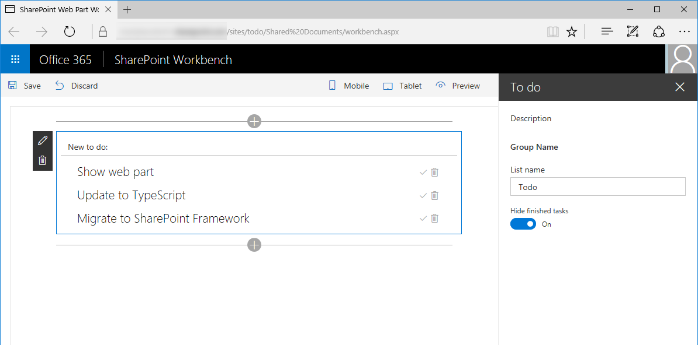

<span data-ttu-id="455a0-p126">Navigieren Sie im Webbrowser zur SharePoint Workbench, und fügen Sie das Webpart zum Canvas hinzu. Wenn Sie auf die Umschaltfläche **Hide finished tasks** klicken, sollten alle erledigten Tasks eingeblendet bzw. ausgeblendet werden.</span><span class="sxs-lookup"><span data-stu-id="455a0-p126">In your web browser navigate to the SharePoint workbench and add the web part to canvas. If you toggle the **Hide finished tasks** option you should see completed tasks being displayed or hidden accordingly.</span></span>

```
gulp serve --nobrowser
```

Navigieren Sie im Webbrowser zur SharePoint Workbench, und fügen Sie das Webpart zum Canvas hinzu. Wenn Sie auf die Umschaltfläche **Hide finished tasks** klicken, sollten alle erledigten Tasks eingeblendet bzw. ausgeblendet werden.

