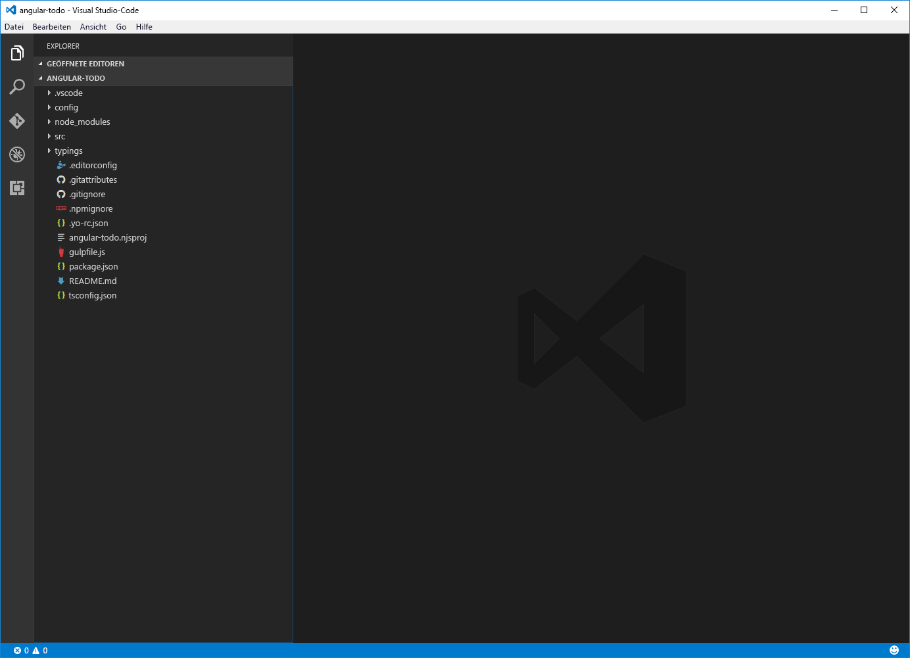
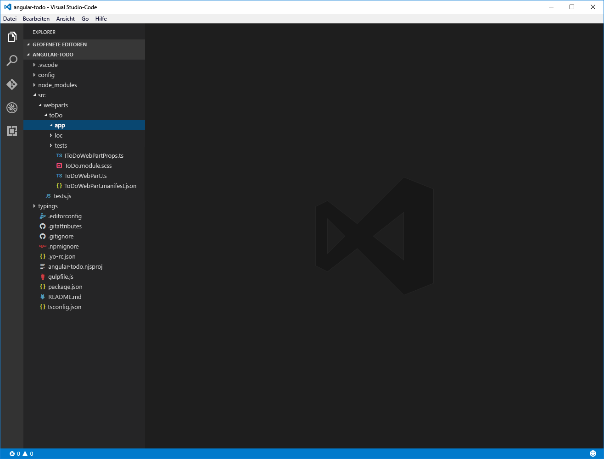
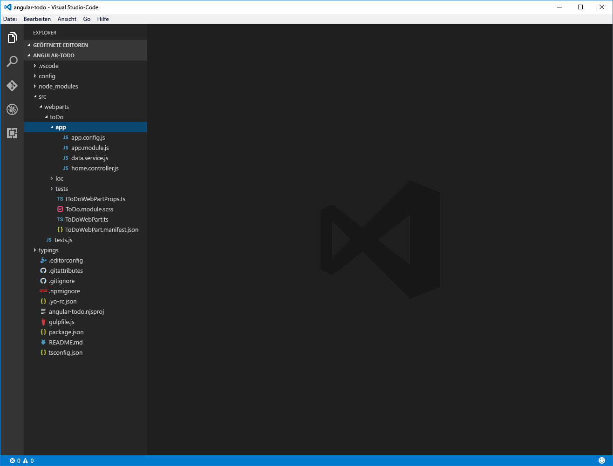

# <a name="migrate-angularjs-applications-to-sharepoint-framework"></a>Migrieren von AngularJS-Anwendungen zum SharePoint-Framework

Viele Organisationen haben in der Vergangenheit bereits SharePoint-Lösungen mit AngularJS erstellt. Dieser Artikel beschreibt, wie Sie eine vorhandene AngularJS-Anwendung mit Stilen auf Basis von [ngOfficeUIFabric](http://ngofficeuifabric.com) (AngularJS-Richtlinien für Office UI Fabric) zu einem clientseitigen SharePoint-Framework-Webpart migrieren können. Die Beispielanwendung aus diesem Tutorial verwaltet in einer SharePoint-Liste gespeicherte To-do-Elemente.


Der Quellcode der AngularJS-Anwendung steht auf GitHub zur Verfügung, unter [angular-migration/angular-todo](https://github.com/SharePoint/sp-dev-fx-webparts/tree/dev/samples/angular-migration/angular-todo).

Der Quellcode der zum SharePoint-Framework migrierten AngularJS-Anwendung steht ebenfalls auf GitHub zur Verfügung, unter [samples/angular-todo](https://github.com/SharePoint/sp-dev-fx-webparts/tree/master/samples/angular-todo).

> [!NOTE] 
> Bevor Sie die Schritte in diesem Artikel durchführen, müssen Sie [eine Entwicklungsumgebung einrichten](../../set-up-your-development-environment.md), in der Sie SharePoint-Framework-Lösungen erstellen können.

## <a name="set-up-project"></a>Einrichten eines Projekts

Vor der Migration Ihrer AngularJS-Anwendung müssen Sie ein neues SharePoint-Framework-Projekt erstellen und einrichten, das die AngularJS-Anwendung hostet.

### <a name="create-new-project"></a>Erstellen eines neuen Projekts

1. Erstellen Sie einen neuen Ordner für Ihr Projekt:

  ```sh
  md angular-todo
  ```

2. Wechseln Sie in den Projektordner:

  ```sh
  cd angular-todo
  ```

3. Führen Sie im Projektordner den SharePoint-Framework-Yeoman-Generator aus, um ein Gerüst für ein neues SharePoint-Framework-Projekt zu erstellen:

  ```sh
  yo @microsoft/sharepoint
  ```

4. Es werden mehrere Eingabeaufforderungen angezeigt. Definieren Sie die Werte jeweils wie folgt:

  - **angular-todo** als Name der Lösung
  - **Use the current folder** als Speicherort für die Dateien
  - **To do** als Name des Webparts
  - **Simple management of to do tasks** als Beschreibung des Webparts
  - **No javaScript web framework** als Eintrittspunkt für die Webpart-Erstellung

  

5. Warten Sie, bis das Gerüst erstellt wurde, und sperren Sie dann mithilfe des folgenden Befehls die Version der Projektabhängigkeiten:

  ```sh
  npm shrinkwrap
  ```

6. Öffnen Sie den Projektordner in einem Code-Editor. In diesem Tutorial verwenden Sie Visual Studio Code.

  

### <a name="add-angularjs-and-ngofficeuifabric"></a>Hinzufügen von AngularJS und ngOfficeUIFabric

In diesem Tutorial laden Sie sowohl AngularJS als auch ngOfficeUIFabric aus dem CDN. 

Öffnen Sie im Code-Editor die Datei **config/config.json**, und fügen Sie in der Eigenschaft **externals** die folgenden Zeilen hinzu:

```json
"angular": {
  "path": "https://cdnjs.cloudflare.com/ajax/libs/angular.js/1.6.6/angular.min.js",
  "globalName": "angular"
},
"ng-office-ui-fabric": "https://cdnjs.cloudflare.com/ajax/libs/ngOfficeUiFabric/0.12.3/ngOfficeUiFabric.js"
```

### <a name="add-angularjs-typings-for-typescript"></a>Hinzufügen von AngularJS-Typisierungen für TypeScript

Da Sie AngularJS im Code Ihres Webparts referenzieren, benötigen Sie auch AngularJS-Typisierungen für TypeScript. Führen Sie den folgenden Befehl über die Befehlszeile aus, um diese Typisierungen zu installieren:

```sh
  npm install @types/angular --save-dev
```

## <a name="migrate-the-angularjs-application-as-is"></a>Migrieren der AngularJS-Anwendung in unveränderter Form

Beginnen Sie mit der Migration der AngularJS-Anwendung, und implementieren Sie dabei nur die nötigsten Codeänderungen. In einem späteren Schritt werden Sie den einfachen JavaScript-Code der Anwendung auf TypeScript aktualisieren und die Integration mit dem clientseitigen Webpart verbessern.

### <a name="create-sharepoint-list"></a>Erstellen einer SharePoint-Liste

Erstellen Sie auf Ihrer SharePoint-Website eine neue Liste namens **Todo**. Fügen Sie in der Liste eine neue Auswahlspalte namens **Status** hinzu. Geben Sie die folgenden Auswahloptionen ein:

```text
  Not started
  In progress
  Completed
```

<br/>


### <a name="copy-angularjs-application-files-to-the-web-part-project"></a>Kopieren der Dateien der AngularJS-Anwendung in das Webpartprojekt

1. Erstellen Sie im Webpartprojekt im Ordner **src/webparts/toDo** einen neuen Ordner namens `app`.

  

2. Kopieren Sie aus der Quellanwendung die Inhalte des Ordners **app** in den neu erstellten Ordner **app** im Webpartprojekt.

  


### <a name="load-the-angularjs-application-in-the-client-side-web-part"></a>Laden der AngularJS-Anwendung in das clientseitige Webpart

1. Öffnen Sie im Code-Editor die Datei **./src/webparts/toDo/ToDoWebPart.ts**. Fügen Sie hinter der letzten Anweisung des Typs `import` folgenden Code ein:

  ```ts
  import * as angular from 'angular';
  import 'ng-office-ui-fabric';
  ```

2. Ändern Sie den Code der Methode **render** wie folgt:

  ```ts
  export default class ToDoWebPart extends BaseClientSideWebPart<IToDoWebPartProps> {
    // ...
    public render(): void {
      if (this.renderedOnce === false) {
        require('./app/app.module');
        require('./app/app.config');
        require('./app/data.service');
        require('./app/home.controller');

        this.domElement.innerHTML = `
          <div class="${styles.toDo}">
            <div data-ng-controller="homeController as vm">
              <div class="${styles.loading}" ng-show="vm.isLoading">
                <uif-spinner>Loading...</uif-spinner>
              </div>
              <div class="entryform" ng-show="vm.isLoading === false">
                <uif-textfield uif-label="New to do:" uif-underlined ng-model="vm.newItem" ng-keydown="vm.todoKeyDown($event)"></uif-textfield>
              </div>
              <uif-list class="items" ng-show="vm.isLoading === false" >
                <uif-list-item ng-repeat="todo in vm.todoCollection" uif-item="todo" ng-class="{'done': todo.done}">
                  <uif-list-item-primary-text>{{todo.title}}</uif-list-item-primary-text>
                  <uif-list-item-actions>
                    <uif-list-item-action ng-click="vm.completeTodo(todo)" ng-show="todo.done === false">
                      <uif-icon uif-type="check"></uif-icon>
                    </uif-list-item-action>
                    <uif-list-item-action ng-click="vm.undoTodo(todo)" ng-show="todo.done">
                      <uif-icon uif-type="reactivate"></uif-icon>
                    </uif-list-item-action>
                    <uif-list-item-action ng-click="vm.deleteTodo(todo)">
                      <uif-icon uif-type="trash"></uif-icon>
                    </uif-list-item-action>
                  </uif-list-item-actions>
                </uif-list-item>
              </uif-list>
            </div>
          </div>`;

        angular.bootstrap(this.domElement, ['todoapp']);
      }
    }
    // ...
  }
  ```

### <a name="update-site-path"></a>Aktualisieren des Websitepfads

Öffnen Sie im Code-Editor die Datei **./src/webparts/toDo/app/app.config.js**. Ändern Sie den Wert der Konstante **sharepointApi** in die serverrelative URL der SharePoint-Website, auf der Sie die To-do-Liste erstellt haben, gefolgt von `/_api/`.

### <a name="add-css-styles"></a>Hinzufügen der CSS-Formatvorlagen

Sie müssen außerdem noch die CSS-Formatvorlagen implementieren, die Sie in der Vorlage verwenden. Öffnen Sie im Code-Editor die Datei **ToDoWebPart.module.scss**, und ersetzen Sie den Code in der Datei durch:

```scss
.toDo {
  .loading {
    margin: 0 auto;
    width: 6em;
  }
}
```

### <a name="trust-the-development-certificate"></a>Einstufen des Entwicklungszertifikats als vertrauenswürdig

Das zum HTTPS-basierten Laden der SharePoint-Workbench sowie der zugehörigen Ressourcen erforderliche Entwicklungszertifikat gilt standardmäßig nicht als vertrauenswürdig. Der Webbrowser zeigt daher eine Warnung an, wenn Sie die SharePoint-Workbench aufrufen. Wenn Sie die SharePoint-Workbench im SharePoint-Kontext ausführen möchten, laden manche Webbrowser die Workbench nicht, wenn das SSL-Zertifikat nicht als vertrauenswürdig eingestuft wird. Um dieses Problem zu vermeiden, sollten Sie das mit dem SharePoint-Framework bereitgestellte Entwicklungszertifikat als vertrauenswürdig einstufen.

Führen Sie den folgenden Befehl über die Befehlszeile aus:

```sh
gulp trust-dev-cert
```

### <a name="preview-web-part-in-the-hosted-workbench"></a>Anzeigen der Webpartvorschau in der gehosteten Workbench

1. Führen Sie den folgenden Befehl über die Befehlszeile aus:

  ```sh
  gulp serve --nobrowser
  ```

2. Fügen Sie der URL Ihrer SharePoint-Website `/_layouts/workbench.aspx` hinzu (z. B. `https://contoso.sharepoint.com/_layouts/workbench.aspx`), und navigieren Sie im Webbrowser zu der URL.

  Wenn Sie alle Schritte richtig umgesetzt haben, sollten Sie im Browser das Webpart mit dem Formular zum Hinzufügen von To-do-Elementen sehen.

  

3. Fügen Sie einige To-do-Elemente hinzu, um sich zu vergewissern, dass das Webpart wie erwartet arbeitet.

  

### <a name="fix-web-part-styling"></a>Korrigieren des Webpart-Stils

Obwohl das Webpart ordnungsgemäß funktioniert, sieht es nicht so aus wie die ursprüngliche AngularJS-Anwendung. Das liegt daran, dass ngOfficeUIFabric eine ältere Office UI Fabric-Version verwendet als die SharePoint-Workbench. Am einfachsten ließe sich das beheben, indem Sie die CSS-Formatvorlagen laden, die ngOfficeUIFabric verwendet. Allerdings würden diese Formatvorlagen Konflikte mit den Office UI Fabric-Formatvorlagen verursachen, die von der SharePoint-Workbench verwendet wenden, wodurch die Benutzeroberfläche nicht mehr korrekt dargestellt würde. Eine bessere Lösung ist es daher, die von den spezifischen Komponenten benötigten Formatvorlagen zu den Webpart-Formatvorlagen hinzuzufügen.

1. Öffnen Sie im Code-Editor die Datei **./src/webparts/toDo/ToDoWebPart.module.scss**. Ändern Sie den Code in der Datei wie folgt:

  ```scss
  .toDo {
    .loading {
      margin: 0 auto;
      width: 6em;
    }

    .done :global .ms-ListItem-primaryText {
      text-decoration: line-through;
    }

    ul, li {
      margin: 0;
      padding: 0;
    }

    :global {
      .ms-Spinner{position:relative;height:20px}.ms-Spinner.ms-Spinner--large{height:28px}.ms-Spinner.ms-Spinner--large .ms-Spinner-label{left:34px;top:6px}.ms-Spinner-circle{position:absolute;border-radius:100px;background-color:#0078d7;opacity:0}@media screen and (-ms-high-contrast:active){.ms-Spinner-circle{background-color:#fff}}@media screen and (-ms-high-contrast:black-on-white){.ms-Spinner-circle{background-color:#000}}.ms-Spinner-label{position:relative;color:#333;font-family:Segoe UI Regular WestEuropean,Segoe UI,Tahoma,Arial,sans-serif;font-size:12px;font-weight:400;color:#0078d7;left:28px;top:2px}
      .ms-TextField{color:#333;font-family:Segoe UI Regular WestEuropean,Segoe UI,Tahoma,Arial,sans-serif;font-size:14px;font-weight:400;box-sizing:border-box;margin:0;padding:0;box-shadow:none;margin-bottom:8px}.ms-TextField.is-disabled .ms-TextField-field{background-color:#f4f4f4;border-color:#f4f4f4;pointer-events:none;cursor:default}.ms-TextField.is-disabled:-moz-placeholder,.ms-TextField.is-disabled:-ms-input-placeholder,.ms-TextField.is-disabled::-moz-placeholder,.ms-TextField.is-disabled::-webkit-input-placeholder{color:#a6a6a6}.ms-TextField.is-required .ms-Label:after{content:' *';color:#a80000}.ms-TextField.is-required:-moz-placeholder:after,.ms-TextField.is-required:-ms-input-placeholder:after,.ms-TextField.is-required::-moz-placeholder:after,.ms-TextField.is-required::-webkit-input-placeholder:after{content:' *';color:#a80000}.ms-TextField.is-active{border-color:#0078d7}.ms-TextField-field{box-sizing:border-box;margin:0;padding:0;box-shadow:none;border:1px solid #c8c8c8;border-radius:0;font-family:Segoe UI Semilight WestEuropean,Segoe UI Semilight,Segoe UI,Tahoma,Arial,sans-serif;font-size:12px;color:#333;height:32px;padding:6px 10px 8px;width:100%;min-width:180px;outline:0}.ms-TextField-field:hover{border-color:#767676}.ms-TextField-field:focus{border-color:#0078d7}@media screen and (-ms-high-contrast:active){.ms-TextField-field:focus,.ms-TextField-field:hover{border-color:#1aebff}}@media screen and (-ms-high-contrast:black-on-white){.ms-TextField-field:focus,.ms-TextField-field:hover{border-color:#37006e}}.ms-TextField-field:-moz-placeholder,.ms-TextField-field:-ms-input-placeholder,.ms-TextField-field::-moz-placeholder,.ms-TextField-field::-webkit-input-placeholder{color:#666}.ms-TextField-description{color:#767676;font-size:11px}.ms-TextField.ms-TextField--placeholder{position:relative}.ms-TextField.ms-TextField--placeholder .ms-Label{position:absolute;font-family:Segoe UI Semilight WestEuropean,Segoe UI Semilight,Segoe UI,Tahoma,Arial,sans-serif;font-size:12px;color:#666;padding:7px 0 7px 10px}.ms-TextField.ms-TextField--placeholder.is-disabled,.ms-TextField.ms-TextField--placeholder.is-disabled .ms-Label{color:#a6a6a6}@media screen and (-ms-high-contrast:active){.ms-TextField.ms-TextField--placeholder.is-disabled .ms-Label{color:#0f0}}@media screen and (-ms-high-contrast:black-on-white){.ms-TextField.ms-TextField--placeholder.is-disabled .ms-Label{color:#600000}}.ms-TextField.ms-TextField--underlined{border-bottom:1px solid #c8c8c8;display:table;width:100%;min-width:180px}.ms-TextField.ms-TextField--underlined:hover{border-color:#767676}@media screen and (-ms-high-contrast:active){.ms-TextField.ms-TextField--underlined:hover{border-color:#1aebff}}@media screen and (-ms-high-contrast:black-on-white){.ms-TextField.ms-TextField--underlined:hover{border-color:#37006e}}.ms-TextField.ms-TextField--underlined:active,.ms-TextField.ms-TextField--underlined:focus{border-color:#0078d7}.ms-TextField.ms-TextField--underlined .ms-Label{font-size:12px;margin-right:8px;display:table-cell;vertical-align:bottom;padding-left:12px;padding-bottom:5px;height:32px;width:1%;white-space:nowrap}.ms-TextField.ms-TextField--underlined .ms-TextField-field{border:0;float:left;display:table-cell;text-align:left;padding-top:8px;padding-bottom:2px}.ms-TextField.ms-TextField--underlined .ms-TextField-field:active,.ms-TextField.ms-TextField--underlined .ms-TextField-field:focus,.ms-TextField.ms-TextField--underlined .ms-TextField-field:hover{outline:0}.ms-TextField.ms-TextField--underlined.is-disabled{border-bottom-color:#eaeaea}.ms-TextField.ms-TextField--underlined.is-disabled .ms-Label{color:#a6a6a6}@media screen and (-ms-high-contrast:active){.ms-TextField.ms-TextField--underlined.is-disabled .ms-Label{color:#0f0}}@media screen and (-ms-high-contrast:black-on-white){.ms-TextField.ms-TextField--underlined.is-disabled .ms-Label{color:#600000}}.ms-TextField.ms-TextField--underlined.is-disabled .ms-TextField-field{background-color:transparent;color:#a6a6a6}.ms-TextField.ms-TextField--underlined.is-active{border-color:#0078d7}@media screen and (-ms-high-contrast:active){.ms-TextField.ms-TextField--underlined.is-active{border-color:#1aebff}}@media screen and (-ms-high-contrast:black-on-white){.ms-TextField.ms-TextField--underlined.is-active{border-color:#37006e}}.ms-TextField.ms-TextField--multiline .ms-TextField-field{line-height:17px;min-height:60px;min-width:260px;padding-top:6px;overflow:auto}.ms-Label,.ms-TextField.ms-TextField--multiline .ms-TextField-field{color:#333;font-family:Segoe UI Regular WestEuropean,Segoe UI,Tahoma,Arial,sans-serif;font-size:12px;font-weight:400}
      .ms-Label{margin:0;padding:0;box-shadow:none;box-sizing:border-box;display:block;padding:5px 0}.ms-Label.is-required:after{content:' *';color:#a80000}.ms-Label.is-disabled{color:#a6a6a6}@media screen and (-ms-high-contrast:active){.ms-Label.is-disabled{color:#0f0}}@media screen and (-ms-high-contrast:black-on-white){.ms-Label.is-disabled{color:#600000}}.is-disabled .ms-Label{color:#a6a6a6}@media screen and (-ms-high-contrast:active){.is-disabled .ms-Label{color:#0f0}}@media screen and (-ms-high-contrast:black-on-white){.is-disabled .ms-Label{color:#600000}}.ms-Toggle{color:#333;font-family:Segoe UI Regular WestEuropean,Segoe UI,Tahoma,Arial,sans-serif;font-size:14px;font-weight:400;box-sizing:border-box;margin:0;padding:0;box-shadow:none;position:relative;display:block;margin-bottom:26px}.ms-Toggle .ms-Label{position:relative;padding:0 0 0 62px;font-size:12px}.ms-Toggle:hover .ms-Label{color:#000}.ms-Toggle:active .ms-Label{color:#333}.ms-Toggle.is-disabled .ms-Label{color:#a6a6a6}@media screen and (-ms-high-contrast:active){.ms-Toggle.is-disabled .ms-Label{color:#0f0}}@media screen and (-ms-high-contrast:black-on-white){.ms-Toggle.is-disabled .ms-Label{color:#600000}}
      .ms-ListItem{font-family:"Segoe UI WestEuropean","Segoe UI",-apple-system,BlinkMacSystemFont,Roboto,"Helvetica Neue",sans-serif;-webkit-font-smoothing:antialiased;font-size:14px;font-weight:400;box-sizing:border-box;margin:0;padding:0;box-shadow:none;padding:9px 28px 3px;position:relative;display:block}.ms-ListItem::after,.ms-ListItem::before{display:table;content:"";line-height:0}.ms-ListItem::after{clear:both}.ms-ListItem-primaryText,.ms-ListItem-secondaryText,.ms-ListItem-tertiaryText{display:block;overflow:hidden;text-overflow:ellipsis;white-space:nowrap;display:block}.ms-ListItem-primaryText{font-family:"Segoe UI WestEuropean","Segoe UI",-apple-system,BlinkMacSystemFont,Roboto,"Helvetica Neue",sans-serif;-webkit-font-smoothing:antialiased;font-size:21px;font-weight:100;padding-right:80px;position:relative;top:-4px}.ms-ListItem-secondaryText{font-family:"Segoe UI WestEuropean","Segoe UI",-apple-system,BlinkMacSystemFont,Roboto,"Helvetica Neue",sans-serif;-webkit-font-smoothing:antialiased;font-size:14px;font-weight:400;line-height:25px;position:relative;top:-7px;padding-right:30px}.ms-ListItem-tertiaryText{font-family:"Segoe UI WestEuropean","Segoe UI",-apple-system,BlinkMacSystemFont,Roboto,"Helvetica Neue",sans-serif;-webkit-font-smoothing:antialiased;font-size:14px;font-weight:400;position:relative;top:-9px;margin-bottom:-4px;padding-right:30px}.ms-ListItem-metaText{font-family:"Segoe UI WestEuropean","Segoe UI",-apple-system,BlinkMacSystemFont,Roboto,"Helvetica Neue",sans-serif;-webkit-font-smoothing:antialiased;font-size:11px;font-weight:400;position:absolute;right:30px;top:39px}.ms-ListItem-image{float:left;height:70px;margin-left:-8px;margin-right:10px;width:70px}.ms-ListItem-selectionTarget{display:none}.ms-ListItem-actions{max-width:80px;position:absolute;right:30px;text-align:right;top:10px}.ms-ListItem-action{color:#a6a6a6;display:inline-block;font-size:15px;position:relative;text-align:center;top:3px;cursor:pointer;height:16px;width:16px}.ms-ListItem-action .ms-Icon{vertical-align:top}.ms-ListItem-action:hover{color:#666666;outline:1px solid transparent}.ms-ListItem.is-unread{border-left:3px solid #0078d7;padding-left:27px}.ms-ListItem.is-unread .ms-ListItem-metaText,.ms-ListItem.is-unread .ms-ListItem-secondaryText{color:#0078d7;font-weight:600}.ms-ListItem.is-unseen:after{border-right:10px solid transparent;border-top:10px solid #0078d7;left:0;position:absolute;top:0}.ms-ListItem.is-selectable .ms-ListItem-selectionTarget{display:block;height:20px;left:6px;position:absolute;top:13px;width:20px}.ms-ListItem.is-selectable .ms-ListItem-image{margin-left:0}.ms-ListItem.is-selectable:hover{background-color:#eaeaea;cursor:pointer;outline:1px solid transparent}.ms-ListItem.is-selectable:hover:before{-moz-osx-font-smoothing:grayscale;-webkit-font-smoothing:antialiased;display:inline-block;font-family:FabricMDL2Icons;font-style:normal;font-weight:400;speak:none;position:absolute;top:12px;left:6px;height:15px;width:15px;border:1px solid #767676}.ms-ListItem.is-selected:before{border:1px solid transparent}.ms-ListItem.is-selected:before,.ms-ListItem.is-selected:hover:before{-moz-osx-font-smoothing:grayscale;-webkit-font-smoothing:antialiased;display:inline-block;font-family:FabricMDL2Icons;font-style:normal;font-weight:400;speak:none;content:'\e041';font-size:15px;color:#767676;position:absolute;top:12px;left:6px}.ms-ListItem.is-selected:hover{background-color:#c7e0f4;outline:1px solid transparent}.ms-ListItem.ms-ListItem--document{padding:0}.ms-ListItem.ms-ListItem--document .ms-ListItem-itemIcon{width:70px;height:70px;float:left;text-align:center}.ms-ListItem.ms-ListItem--document .ms-ListItem-itemIcon .ms-Icon{font-size:38px;line-height:70px;color:#666666}.ms-ListItem.ms-ListItem--document .ms-ListItem-primaryText{display:block;overflow:hidden;text-overflow:ellipsis;white-space:nowrap;font-size:14px;padding-top:15px;padding-right:0;position:static}.ms-ListItem.ms-ListItem--document .ms-ListItem-secondaryText{display:block;overflow:hidden;text-overflow:ellipsis;white-space:nowrap;font-family:"Segoe UI WestEuropean","Segoe UI",-apple-system,BlinkMacSystemFont,Roboto,"Helvetica Neue",sans-serif;-webkit-font-smoothing:antialiased;font-size:11px;font-weight:400;padding-top:6px}.MailList{overflow-y:auto;-webkit-overflow-scrolling:touch;max-height:500px}.MailTile{margin-bottom:5px;padding:10px;background:red}
    }
  }
  ```

2. Ändern Sie in der Datei **./src/webparts/toDo/ToDoWebPart.ts** in der Methode **render** die Vorlage für das Anwendungsrendering so, dass sie die neuen Office UI Fabric-Symbole verwendet.

  ```ts
  export default class ToDoWebPart extends BaseClientSideWebPart<IToDoWebPartProps> {
    // ...
    public render(): void {
      if (this.renderedOnce === false) {
        require('./app/app.module');
        require('./app/app.config');
        require('./app/data.service');
        require('./app/home.controller');

        this.domElement.innerHTML = `
          <div class="${styles.toDo}">
            <div data-ng-controller="homeController as vm">
              <div class="${styles.loading}" ng-show="vm.isLoading">
                <uif-spinner>Loading...</uif-spinner>
              </div>
              <div id="entryform" ng-show="vm.isLoading === false">
                <uif-textfield uif-label="New to do:" uif-underlined ng-model="vm.newItem" ng-keydown="vm.todoKeyDown($event)"></uif-textfield>
              </div>
              <uif-list id="items" ng-show="vm.isLoading === false" >
                <uif-list-item ng-repeat="todo in vm.todoCollection" uif-item="todo" ng-class="{'${styles.done}': todo.done}">
                  <uif-list-item-primary-text>{{todo.title}}</uif-list-item-primary-text>
                  <uif-list-item-actions>
                    <uif-list-item-action ng-click="vm.completeTodo(todo)" ng-show="todo.done === false">
                      <i class="ms-Icon ms-Icon--CheckMark" aria-hidden="true"></i>
                    </uif-list-item-action>
                    <uif-list-item-action ng-click="vm.undoTodo(todo)" ng-show="todo.done">
                      <i class="ms-Icon ms-Icon--RevToggleKey" aria-hidden="true"></i>
                    </uif-list-item-action>
                    <uif-list-item-action ng-click="vm.deleteTodo(todo)">
                      <i class="ms-Icon ms-Icon--Delete" aria-hidden="true"></i>
                    </uif-list-item-action>
                  </uif-list-item-actions>
                </uif-list-item>
              </uif-list>
            </div>
        </div>`;

      angular.bootstrap(this.domElement, ['todoapp']);
    }
  }
  // ...
}
```

<br/>

Wenn Sie das Webpart jetzt im Browser aktualisieren, wird es mit den korrekten Formatvorlagen angezeigt.


## <a name="upgrade-the-angularjs-application-to-typescript"></a>Aktualisieren der AngularJS-Anwendung auf TypeScript

Die ursprüngliche AngularJS-Anwendung ist in einfachem JavaScript geschrieben, was die Codepflege fehleranfällig macht. Bei der Erstellung von clientseitigen SharePoint-Framework-Webparts können Sie TypeScript und seine Funktionen für Typsicherheit verwenden, die bereits bei der Codeeingabe greifen. Im nächsten Abschnitt migrieren Sie den in einfachem JavaScript geschriebenen AngularJS-Code zu TypeScript.

### <a name="upgrade-application-configuration"></a>Aktualisieren der Anwendungskonfiguration

Benennen Sie in Ihrem Projekt die Datei **./src/webparts/toDo/app/app.config.js** um in `app.config.ts`. Ändern Sie den Code in der Datei wie folgt:

```ts
import * as angular from 'angular';

export default function() {
  const todoapp: ng.IModule = angular.module('todoapp');
  todoapp.constant('sharepointApi', '/todo/_api/');
  todoapp.constant('todoListName', 'Todo');
  todoapp.constant('hideFinishedTasks', false);
}
```

### <a name="upgrade-data-service"></a>Aktualisieren des Datendiensts

Benennen Sie in Ihrem Projekt die Datei **./src/webparts/toDo/app/data.service.js** um in `DataService.ts`. Ändern Sie den Code in der Datei wie folgt:

```ts
import * as angular from 'angular';

export interface ITodo {
  id: number;
  title: string;
  done: boolean;
}

interface ITodoItem {
  Id: number;
  Title: string;
  Status: string;
}

export interface IDataService {
  getTodos: () => angular.IPromise<ITodo[]>;
  addTodo: (todo: string) => angular.IPromise<{}>;
  deleteTodo: (todo: ITodo) => angular.IPromise<{}>;
  setTodoStatus: (todo: ITodo, done: boolean) => angular.IPromise<{}>;
}

export default class DataService implements IDataService {
  public static $inject: string[] = ['$q', '$http', 'sharepointApi', 'todoListName', 'hideFinishedTasks'];

  constructor(private $q: angular.IQService,
    private $http: angular.IHttpService,
    private sharepointApi: string,
    private todoListName: string,
    private hideFinishedTasks: boolean) {
  }

  public getTodos(): angular.IPromise<ITodo[]> {
    const deferred: angular.IDeferred<ITodo[]> = this.$q.defer();

    let url: string = `${this.sharepointApi}web/lists/getbytitle('${this.todoListName}')/items?$select=Id,Title,Status&$orderby=ID desc`;

    if (this.hideFinishedTasks === true) {
      url += "&$filter=Status ne 'Completed'";
    }

    this.$http({
      url: url,
      method: 'GET',
      headers: {
        'Accept': 'application/json;odata=nometadata'
      }
    }).then((result: angular.IHttpPromiseCallbackArg<{ value: ITodoItem[] }>): void => {
      const todos: ITodo[] = [];
      for (let i: number = 0; i < result.data.value.length; i++) {
        const todo: ITodoItem = result.data.value[i];
        todos.push({
          id: todo.Id,
          title: todo.Title,
          done: todo.Status === 'Completed'
        });
      }
      deferred.resolve(todos);
    });

    return deferred.promise;
  }

  public addTodo(todo: string): angular.IPromise<{}> {
    const deferred: angular.IDeferred<{}> = this.$q.defer();

    let listItemEntityTypeFullName: string = undefined;
    this.getListItemEntityTypeFullName()
      .then((entityTypeName: string): angular.IPromise<string> => {
        listItemEntityTypeFullName = entityTypeName;
        return this.getRequestDigest();
      })
      .then((requestDigest: string): void => {
        const body: string = JSON.stringify({
          '__metadata': { 'type': listItemEntityTypeFullName },
          'Title': todo
        });
        this.$http({
          url: `${this.sharepointApi}web/lists/getbytitle('${this.todoListName}')/items`,
          method: 'POST',
          headers: {
            'Accept': 'application/json;odata=nometadata',
            'Content-type': 'application/json;odata=verbose',
            'X-RequestDigest': requestDigest
          },
          data: body
        }).then((result: angular.IHttpPromiseCallbackArg<{}>): void => {
          deferred.resolve();
        });
      });

    return deferred.promise;
  }

  public deleteTodo(todo: ITodo): angular.IPromise<{}> {
    const deferred: angular.IDeferred<{}> = this.$q.defer();

    this.getRequestDigest()
      .then((requestDigest: string): void => {
        this.$http({
          url: `${this.sharepointApi}web/lists/getbytitle('${this.todoListName}')/items(${todo.id})`,
          method: 'POST',
          headers: {
            'Accept': 'application/json;odata=nometadata',
            'X-RequestDigest': requestDigest,
            'IF-MATCH': '*',
            'X-HTTP-Method': 'DELETE'
          }
        }).then((result: angular.IHttpPromiseCallbackArg<{}>): void => {
          deferred.resolve();
        });
      });

    return deferred.promise;
  }

  public setTodoStatus(todo: ITodo, done: boolean): angular.IPromise<{}> {
    const deferred: angular.IDeferred<{}> = this.$q.defer();

    let listItemEntityTypeFullName: string = undefined;
    this.getListItemEntityTypeFullName()
      .then((entityTypeName: string): angular.IPromise<string> => {
        listItemEntityTypeFullName = entityTypeName;
        return this.getRequestDigest();
      })
      .then((requestDigest: string): void => {
        const body: string = JSON.stringify({
          '__metadata': { 'type': listItemEntityTypeFullName },
          'Status': done ? 'Completed' : 'Not started'
        });
        this.$http({
          url: `${this.sharepointApi}web/lists/getbytitle('${this.todoListName}')/items(${todo.id})`,
          method: 'POST',
          headers: {
            'Accept': 'application/json;odata=nometadata',
            'Content-type': 'application/json;odata=verbose',
            'X-RequestDigest': requestDigest,
            'IF-MATCH': '*',
            'X-HTTP-Method': 'MERGE'
          },
          data: body
        }).then((result: angular.IHttpPromiseCallbackArg<{}>): void => {
          deferred.resolve();
        });
      });

    return deferred.promise;
  }

  private getRequestDigest(): angular.IPromise<string> {
    const deferred: angular.IDeferred<string> = this.$q.defer();

    this.$http({
      url: this.sharepointApi + 'contextinfo',
      method: 'POST',
      headers: {
        'Accept': 'application/json;odata=nometadata'
      }
    }).then((result: angular.IHttpPromiseCallbackArg<{ FormDigestValue: string }>): void => {
      deferred.resolve(result.data.FormDigestValue);
    }, (err: any): void => {
      deferred.reject(err);
    });

    return deferred.promise;
  }

  private getListItemEntityTypeFullName(): angular.IPromise<string> {
    const deferred: angular.IDeferred<string> = this.$q.defer();

    this.$http({
      url: `${this.sharepointApi}web/lists/getbytitle('${this.todoListName}')?$select=ListItemEntityTypeFullName`,
      method: 'GET',
      headers: {
        'Accept': 'application/json;odata=nometadata'
      }
    }).then((result: angular.IHttpPromiseCallbackArg<{ ListItemEntityTypeFullName: string }>): void => {
      deferred.resolve(result.data.ListItemEntityTypeFullName);
    }, (err: any): void => {
      deferred.reject(err);
    });

    return deferred.promise;
  }
}
```

### <a name="upgrade-home-controller"></a>Aktualisieren des Startcontrollers

Benennen Sie in Ihrem Projekt die Datei **./src/webparts/toDo/app/home.controller.js** um in `HomeController.ts`. Ändern Sie den Code in der Datei wie folgt:

```ts
import * as angular from 'angular';
import { IDataService, ITodo } from './DataService';

export default class HomeController {
  public isLoading: boolean = false;
  public newItem: string = null;
  public todoCollection: ITodo[] = [];

  public static $inject: string[] = ['DataService', '$window'];

  constructor(private dataService: IDataService, private $window: angular.IWindowService) {
    this.loadTodos();
  }

  private loadTodos(): void {
    this.isLoading = true;
    this.dataService.getTodos()
      .then((todos: ITodo[]): void => {
        this.todoCollection = todos;
      })
      .finally((): void => {
        this.isLoading = false;
      });
  }

  public todoKeyDown($event: KeyboardEvent): void {
    if ($event.keyCode === 13 && this.newItem.length > 0) {
      $event.preventDefault();

      this.todoCollection.unshift({ id: -1, title: this.newItem, done: false });

      this.dataService.addTodo(this.newItem)
        .then((): void => {
          this.newItem = null;
          this.dataService.getTodos()
            .then((todos: ITodo[]): void => {
              this.todoCollection = todos;
            });
        });
    }
  }

  public deleteTodo(todo: ITodo): void {
    if (this.$window.confirm('Are you sure you want to delete this todo item?')) {
      let index: number = -1;
      for (let i: number = 0; i < this.todoCollection.length; i++) {
        if (this.todoCollection[i].id === todo.id) {
          index = i;
          break;
        }
      }

      if (index > -1) {
        this.todoCollection.splice(index, 1);
      }

      this.dataService.deleteTodo(todo)
        .then((): void => {
          this.dataService.getTodos()
            .then((todos: ITodo[]): void => {
              this.todoCollection = todos;
            });
        });
    }
  }

  public completeTodo(todo: ITodo): void {
    todo.done = true;

    this.dataService.setTodoStatus(todo, true)
      .then((): void => {
        this.dataService.getTodos()
          .then((todos: ITodo[]): void => {
            this.todoCollection = todos;
          });
      });
  }

  public undoTodo(todo: ITodo): void {
    todo.done = false;

    this.dataService.setTodoStatus(todo, false)
      .then((): void => {
        this.dataService.getTodos()
          .then((todos: ITodo[]): void => {
            this.todoCollection = todos;
          });
      });
  }
}
```

### <a name="upgrade-application-module"></a>Aktualisieren des Anwendungsmoduls

Benennen Sie in Ihrem Projekt die Datei **./src/webparts/toDo/app/app.module.js** um in `app.module.ts`. Ändern Sie den Code in der Datei wie folgt:

```ts
import * as angular from 'angular';
import config from './app.config';
import HomeController from './HomeController';
import DataService from './DataService';

import 'ng-office-ui-fabric';

const todoapp: angular.IModule = angular.module('todoapp', [
  'officeuifabric.core',
  'officeuifabric.components'
]);

config();

todoapp
  .controller('HomeController', HomeController)
  .service('DataService', DataService);
```

### <a name="update-reference-to-angularjs-application-in-the-web-part"></a>Aktualisieren des Verweises auf die AngularJS-Anwendung im Webpart

Da die AngularJS-Anwendung jetzt auf TypeScript-Basis erstellt wird und sich ihre unterschiedlichen Komponenten gegenseitig referenzieren, muss das Webpart nicht mehr alle Komponenten der Anwendung referenzieren. Stattdessen muss es nur das Hauptmodul laden; dieses wiederum lädt alle übrigen Elemente, die zur Erstellung der AngularJS-Anwendung erforderlich sind.

1. Öffnen Sie im Code-Editor die Datei **./src/webparts/toDo/ToDoWebPart.ts**. Ändern Sie die Methode **render** wie folgt:

  ```ts
  export default class ToDoWebPart extends BaseClientSideWebPart<IToDoWebPartProps> {
    // ...
    public render(): void {
      if (this.renderedOnce === false) {
        require('./app/app.module');

        this.domElement.innerHTML = `
          <div class="${styles.toDo}">
            <div data-ng-controller="HomeController as vm">
              <div class="${styles.loading}" ng-show="vm.isLoading">
                <uif-spinner>Loading...</uif-spinner>
              </div>
              <div id="entryform" ng-show="vm.isLoading === false">
                <uif-textfield uif-label="New to do:" uif-underlined ng-model="vm.newItem" ng-keydown="vm.todoKeyDown($event)"></uif-textfield>
              </div>
              <uif-list id="items" ng-show="vm.isLoading === false" >
                <uif-list-item ng-repeat="todo in vm.todoCollection" uif-item="todo" ng-class="{'${styles.done}': todo.done}">
                  <uif-list-item-primary-text>{{todo.title}}</uif-list-item-primary-text>
                  <uif-list-item-actions>
                    <uif-list-item-action ng-click="vm.completeTodo(todo)" ng-show="todo.done === false">
                      <i class="ms-Icon ms-Icon--CheckMark" aria-hidden="true"></i>
                    </uif-list-item-action>
                    <uif-list-item-action ng-click="vm.undoTodo(todo)" ng-show="todo.done">
                      <i class="ms-Icon ms-Icon--RevToggleKey" aria-hidden="true"></i>
                    </uif-list-item-action>
                    <uif-list-item-action ng-click="vm.deleteTodo(todo)">
                      <i class="ms-Icon ms-Icon--Delete" aria-hidden="true"></i>
                    </uif-list-item-action>
                  </uif-list-item-actions>
                </uif-list-item>
              </uif-list>
            </div>
          </div>`;

        angular.bootstrap(this.domElement, ['todoapp']);
      }
    }
    // ...
  }
  ```

2. Führen Sie den folgenden Befehl über die Befehlszeile aus, um zu überprüfen, ob die Aktualisierung auf TypeScript erfolgreich war:

  ```sh
  gulp serve --nobrowser
  ```

3. Aktualisieren Sie im Webbrowser die SharePoint-Workbench. Das Webpart sollte genauso dargestellt werden wie zuvor.

  

Obwohl das Webpart noch genauso funktioniert wie bisher, haben Sie den Code verbessert. Bei zukünftigen Updates können Sie nun einfacher bereits während der Entwicklung die Korrektheit und Integrität des Codes überprüfen.

## <a name="improve-integration-of-the-angularjs-application-with-the-sharepoint-framework"></a>Verbessern der Integration der AngularJS-Anwendung mit dem SharePoint-Framework

An diesem Punkt arbeitet die AngularJS-Anwendung korrekt und ist in ein clientseitiges SharePoint-Framework-Webpart eingebunden. Benutzer können das Webpart zur Seite hinzufügen, seine Funktionsweise jedoch nicht konfigurieren. Die gesamte Konfiguration ist in den Code der AngularJS-Anwendung eingebettet. In diesem Abschnitt erweitern Sie das Webpart so, dass Benutzer konfigurieren können, wie die Liste heißt, in der die To-do-Elemente gespeichert werden, und ob das Webpart erledigte Aufgaben anzeigen soll oder nicht.

### <a name="define-web-part-properties"></a>Definieren der Webparteigenschaften

1. Öffnen Sie im Code-Editor die Datei **./src/webparts/toDo/ToDoWebPart.manifest.json**. Ändern Sie den Abschnitt **properties** wie folgt:

  ```json
  "properties": {
    "todoListName": "Todo",
    "hideFinishedTasks": false
  }
  ```

2. Ändern Sie in der Datei **./src/webparts/toDo/ToDoWebPart.ts** die Definition der Schnittstelle `IToDoWebPartProps` wie folgt:

  ```ts
  export interface IToDoWebPartProps {
    todoListName: string;
    hideFinishedTasks: boolean;
  }
  ```

3. Ändern Sie in der Datei **./src/webparts/toDo/ToDoWebPart.ts** die erste Importanweisung wie folgt:

  ```ts
  import {
    BaseClientSideWebPart,
    IPropertyPaneSettings,
    PropertyPaneTextField,
    PropertyPaneToggle
  } from '@microsoft/sp-webpart-base';
  ```

4. Ändern Sie in derselben Datei die Methode **getPropertyPaneConfiguration** wie folgt:

  ```ts
  export default class ToDoWebPart extends BaseClientSideWebPart<IToDoWebPartProps> {
    // ...
    protected getPropertyPaneConfiguration(): IPropertyPaneConfiguration {
      return {
        pages: [
          {
            header: {
              description: strings.PropertyPaneDescription
            },
            groups: [
              {
                groupName: strings.BasicGroupName,
                groupFields: [
                  PropertyPaneTextField('todoListName', {
                    label: strings.ListNameFieldLabel
                  }),
                  PropertyPaneToggle('hideFinishedTasks', {
                    label: strings.HideFinishedTasksFieldLabel
                  })
                ]
              }
            ]
          }
        ]
      };
    }
    // ...
  }
  ```

5. Fügen Sie die fehlenden Ressourcenzeichenfolgen hinzu. Ändern Sie hierzu den Code in der Datei **./src/webparts/toDo/loc/mystrings.d.ts** wie folgt:

  ```ts
  declare interface IToDoWebPartStrings {
    PropertyPaneDescription: string;
    BasicGroupName: string;
    ListNameFieldLabel: string;
    HideFinishedTasksFieldLabel: string;
  }

  declare module 'ToDoWebPartStrings' {
    const strings: IToDoWebPartStrings;
    export = strings;
  }
  ```

6. Fügen Sie in der Datei **./src/webparts/toDo/loc/en-us.js** Übersetzungen für die neu hinzugefügten Zeichenfolgen hinzu:

  ```js
  define([], function() {
    return {
      "PropertyPaneDescription": "Description",
      "BasicGroupName": "Group Name",
      "ListNameFieldLabel": "List name",
      "HideFinishedTasksFieldLabel": "Hide finished tasks"
    }
  });
  ```

### <a name="pass-web-part-properties-values-to-the-angularjs-application"></a>Übergeben der Werte der Webparteigenschaften an die AngularJS-Anwendung

Jetzt können Benutzer konfigurieren, wie das Webpart funktionieren soll. Die AngularJS-Anwendung verwendet diese Werte jedoch noch nicht. In den folgenden Abschnitten erweitern Sie die AngularJS-Anwendung so, dass sie die Konfigurationswerte verwendet, die die Benutzer über den Webpart-Eigenschaftenbereich festlegen. Eine Möglichkeit, dies umzusetzen, ist es, ein AngularJS-Ereignis in der Methode **render** weiterzugeben und dieses Ereignis in dem Controller zu abonnieren, der im Webpart verwendet wird.

### <a name="delete-angularjs-configuration-file"></a>Löschen der AngularJS-Konfigurationsdatei

Löschen Sie in Ihrem Projekt die Datei **./src/webparts/toDo/app/app.config.ts**. In den nächsten Schritten aktualisieren Sie die Anwendung so, dass sie die Konfigurationswerte aus den Webparteigenschaften abruft.

### <a name="remove-reference-to-configuration"></a>Entfernen des Verweises auf die Konfiguration

Entfernen Sie in der Datei **./src/webparts/toDo/app/app.module.ts** den Verweis auf die AngularJS-Konfiguration. Ändern Sie hierzu den Code wie folgt:

```ts
import * as angular from 'angular';
import HomeController from './HomeController';
import DataService from './DataService';

import 'ng-office-ui-fabric';

const todoapp: angular.IModule = angular.module('todoapp', [
  'officeuifabric.core',
  'officeuifabric.components'
]);

todoapp
  .controller('HomeController', HomeController)
  .service('DataService', DataService);
```

### <a name="update-data-service-to-accept-configuration-value-in-method-parameters"></a>Aktualisieren des Datendiensts, sodass Konfigurationswerte in Methodenparametern akzeptiert werden

Der Datendienst ruft seine Konfiguration ursprünglich aus den in der Datei **app.config.ts** definierten Konstanten ab. Damit er stattdessen die in den Webparteigenschaften konfigurierten Konfigurationswerte verwendet, müssen die jeweiligen Methoden Parameter akzeptieren.

Öffnen Sie im Code-Editor die Datei **./src/webparts/toDo/app/DataService.ts**, und ändern Sie den Code in der Datei wie folgt:

```ts
import * as angular from 'angular';

export interface ITodo {
  id: number;
  title: string;
  done: boolean;
}

interface ITodoItem {
  Id: number;
  Title: string;
  Status: string;
}

export interface IDataService {
  getTodos: (sharePointApi: string, todoListName: string, hideFinishedTasks: boolean) => angular.IPromise<ITodo[]>;
  addTodo: (todo: string, sharePointApi: string, todoListName: string) => angular.IPromise<{}>;
  deleteTodo: (todo: ITodo, sharePointApi: string, todoListName: string) => angular.IPromise<{}>;
  setTodoStatus: (todo: ITodo, done: boolean, sharePointApi: string, todoListName: string) => angular.IPromise<{}>;
}

export default class DataService implements IDataService {
  public static $inject: string[] = ['$q', '$http'];

  constructor(private $q: angular.IQService, private $http: angular.IHttpService) {
  }

  public getTodos(sharePointApi: string, todoListName: string, hideFinishedTasks: boolean): angular.IPromise<ITodo[]> {
    const deferred: angular.IDeferred<ITodo[]> = this.$q.defer();

    let url: string = `${sharePointApi}web/lists/getbytitle('${todoListName}')/items?$select=Id,Title,Status&$orderby=ID desc`;

    if (hideFinishedTasks === true) {
      url += "&$filter=Status ne 'Completed'";
    }

    this.$http({
      url: url,
      method: 'GET',
      headers: {
        'Accept': 'application/json;odata=nometadata'
      }
    }).then((result: angular.IHttpPromiseCallbackArg<{ value: ITodoItem[] }>): void => {
      const todos: ITodo[] = [];
      for (let i: number = 0; i < result.data.value.length; i++) {
        const todo: ITodoItem = result.data.value[i];
        todos.push({
          id: todo.Id,
          title: todo.Title,
          done: todo.Status === 'Completed'
        });
      }
      deferred.resolve(todos);
    });

    return deferred.promise;
  }

  public addTodo(todo: string, sharePointApi: string, todoListName: string): angular.IPromise<{}> {
    const deferred: angular.IDeferred<{}> = this.$q.defer();

    let listItemEntityTypeFullName: string = undefined;
    this.getListItemEntityTypeFullName(sharePointApi, todoListName)
      .then((entityTypeName: string): angular.IPromise<string> => {
        listItemEntityTypeFullName = entityTypeName;
        return this.getRequestDigest(sharePointApi);
      })
      .then((requestDigest: string): void => {
        const body: string = JSON.stringify({
          '__metadata': { 'type': listItemEntityTypeFullName },
          'Title': todo
        });
        this.$http({
          url: `${sharePointApi}web/lists/getbytitle('${todoListName}')/items`,
          method: 'POST',
          headers: {
            'Accept': 'application/json;odata=nometadata',
            'Content-type': 'application/json;odata=verbose',
            'X-RequestDigest': requestDigest
          },
          data: body
        }).then((result: angular.IHttpPromiseCallbackArg<{}>): void => {
          deferred.resolve();
        });
      });

    return deferred.promise;
  }

  public deleteTodo(todo: ITodo, sharePointApi: string, todoListName: string): angular.IPromise<{}> {
    const deferred: angular.IDeferred<{}> = this.$q.defer();

    this.getRequestDigest(sharePointApi)
      .then((requestDigest: string): void => {
        this.$http({
          url: `${sharePointApi}web/lists/getbytitle('${todoListName}')/items(${todo.id})`,
          method: 'POST',
          headers: {
            'Accept': 'application/json;odata=nometadata',
            'X-RequestDigest': requestDigest,
            'IF-MATCH': '*',
            'X-HTTP-Method': 'DELETE'
          }
        }).then((result: angular.IHttpPromiseCallbackArg<{}>): void => {
          deferred.resolve();
        });
      });

    return deferred.promise;
  }

  public setTodoStatus(todo: ITodo, done: boolean, sharePointApi: string, todoListName: string): angular.IPromise<{}> {
    const deferred: angular.IDeferred<{}> = this.$q.defer();

    let listItemEntityTypeFullName: string = undefined;
    this.getListItemEntityTypeFullName(sharePointApi, todoListName)
      .then((entityTypeName: string): angular.IPromise<string> => {
        listItemEntityTypeFullName = entityTypeName;
        return this.getRequestDigest(sharePointApi);
      })
      .then((requestDigest: string): void => {
        const body: string = JSON.stringify({
          '__metadata': { 'type': listItemEntityTypeFullName },
          'Status': done ? 'Completed' : 'Not started'
        });
        this.$http({
          url: `${sharePointApi}web/lists/getbytitle('${todoListName}')/items(${todo.id})`,
          method: 'POST',
          headers: {
            'Accept': 'application/json;odata=nometadata',
            'Content-type': 'application/json;odata=verbose',
            'X-RequestDigest': requestDigest,
            'IF-MATCH': '*',
            'X-HTTP-Method': 'MERGE'
          },
          data: body
        }).then((result: angular.IHttpPromiseCallbackArg<{}>): void => {
          deferred.resolve();
        });
      });

    return deferred.promise;
  }

  private getRequestDigest(sharePointApi: string): angular.IPromise<string> {
    const deferred: angular.IDeferred<string> = this.$q.defer();

    this.$http({
      url: sharePointApi + 'contextinfo',
      method: 'POST',
      headers: {
        'Accept': 'application/json;odata=nometadata'
      }
    }).then((result: angular.IHttpPromiseCallbackArg<{ FormDigestValue: string }>): void => {
      deferred.resolve(result.data.FormDigestValue);
    }, (err: any): void => {
      deferred.reject(err);
    });

    return deferred.promise;
  }

  private getListItemEntityTypeFullName(sharePointApi: string, todoListName: string): angular.IPromise<string> {
    const deferred: angular.IDeferred<string> = this.$q.defer();

    this.$http({
      url: `${sharePointApi}web/lists/getbytitle('${todoListName}')?$select=ListItemEntityTypeFullName`,
      method: 'GET',
      headers: {
        'Accept': 'application/json;odata=nometadata'
      }
    }).then((result: angular.IHttpPromiseCallbackArg<{ ListItemEntityTypeFullName: string }>): void => {
      deferred.resolve(result.data.ListItemEntityTypeFullName);
    }, (err: any): void => {
      deferred.reject(err);
    });

    return deferred.promise;
  }
}
```


### <a name="broadcast-properties-change-event"></a>Weitergeben eines Ereignisses bei Änderung einer Eigenschaft

1. Fügen Sie in der Datei **./src/webparts/toDo/ToDoWebPart.ts** zur Klasse **ToDoWebPart** eine neue Eigenschaft namens `$injector` hinzu:

  ```ts
  export default class ToDoWebPart extends BaseClientSideWebPart<IToDoWebPartProps> {
    private $injector: angular.auto.IInjectorService;
    // ...
  }
  ```

2. Aktualisieren Sie in derselben Datei die Methode **render** wie folgt:

  ```ts
  export default class ToDoWebPart extends BaseClientSideWebPart<IToDoWebPartProps> {
    // ...
    public render(): void {
      if (this.renderedOnce === false) {
        require('./app/app.module');

        this.domElement.innerHTML = `
          <div class="${styles.toDo}">
            <div data-ng-controller="HomeController as vm">
              <div class="${styles.configurationNeeded}" ng-show="vm.configurationNeeded">
                Please configure the web part
              </div>
              <div ng-show="vm.configurationNeeded === false">
                <div id="loading" ng-show="vm.isLoading">
                  <uif-spinner>Loading...</uif-spinner>
                </div>
                <div id="entryform" ng-show="vm.isLoading === false">
                  <uif-textfield uif-label="New to do:" uif-underlined ng-model="vm.newItem" ng-keydown="vm.todoKeyDown($event)"></uif-textfield>
                </div>
                <uif-list id="items" ng-show="vm.isLoading === false" >
                  <uif-list-item ng-repeat="todo in vm.todoCollection" uif-item="todo" ng-class="{'${styles.done}': todo.done}">
                    <uif-list-item-primary-text>{{todo.title}}</uif-list-item-primary-text>
                    <uif-list-item-actions>
                      <uif-list-item-action ng-click="vm.completeTodo(todo)" ng-show="todo.done === false">
                        <i class="ms-Icon ms-Icon--CheckMark" aria-hidden="true"></i>
                      </uif-list-item-action>
                      <uif-list-item-action ng-click="vm.undoTodo(todo)" ng-show="todo.done">
                        <i class="ms-Icon ms-Icon--RevToggleKey" aria-hidden="true"></i>
                      </uif-list-item-action>
                      <uif-list-item-action ng-click="vm.deleteTodo(todo)">
                        <i class="ms-Icon ms-Icon--Delete" aria-hidden="true"></i>
                      </uif-list-item-action>
                    </uif-list-item-actions>
                  </uif-list-item>
                </uif-list>
              </div>
            </div>
          </div>`;

        this.$injector = angular.bootstrap(this.domElement, ['todoapp']);
      }

      this.$injector.get('$rootScope').$broadcast('configurationChanged', {
        sharePointApi: this.context.pageContext.web.absoluteUrl + '/_api/',
        todoListName: this.properties.todoListName,
        hideFinishedTasks: this.properties.hideFinishedTasks
      });
    }
    // ...
  }
  ```

3. Fügen Sie in der Datei **./src/webparts/toDo/ToDoWebPart.module.scss** die fehlenden Formatvorlagen für die Klasse **.configurationNeeded** hinzu:

  ```scss
  .toDo {
    /* ... */
    .configurationNeeded {
      margin: 0 auto;
      width: 100%;
      text-align: center;
    }
    /* ... */
  }
  ```

### <a name="subscribe-to-the-properties-changed-event"></a>Abonnieren des Ereignisses bei Änderung einer Eigenschaft

1. Öffnen Sie im Code-Editor die Datei **./src/webparts/toDo/app/HomeController.ts**. Fügen Sie in der Klasse **HomeController** die folgenden Eigenschaften hinzu:

  ```ts
  export default class HomeController {
    // ...
    private sharePointApi: string = undefined;
    private todoListName: string = undefined;
    private hideFinishedTasks: boolean = false;
    private configurationNeeded: boolean = true;
    // ...
  }
  ```

2. Erweitern Sie den Konstruktor der Klasse **HomeController** durch Injektion des Stammbereichsdiensts, und ändern Sie den Code wie folgt:

  ```ts
  export default class HomeController {
    // ...
    public static $inject: string[] = ['DataService', '$window', '$rootScope'];

    constructor(private dataService: IDataService,
      private $window: angular.IWindowService,
      $rootScope: angular.IRootScopeService) {
      const vm: HomeController = this;
      this.init(undefined, undefined);

      $rootScope.$on('configurationChanged',
        (event: angular.IAngularEvent,
        args: {
          sharePointApi: string;
          todoListName: string;
          hideFinishedTasks: boolean;
          }): void => {
        vm.init(args.sharePointApi, args.todoListName, args.hideFinishedTasks);
      });
    }

    // ...
  }
  ```

3. Fügen Sie der Klasse **HomeController** die Methode **init** hinzu:

  ```ts
  export default class HomeController {
    // ...
    private init(sharePointApi: string, todoListName: string, hideFinishedTasks?: boolean): void {
      if (sharePointApi !== undefined && sharePointApi.length > 0 &&
        todoListName !== undefined && todoListName.length > 0) {
        this.sharePointApi = sharePointApi;
        this.todoListName = todoListName;
        this.hideFinishedTasks = hideFinishedTasks;
        this.loadTodos();
        this.configurationNeeded = false;
      }
      else {
        this.configurationNeeded = true;
      }
    }
    // ...
  }
  ```

4. Aktualisieren Sie alle übrigen Methoden in der Klasse **HomeController** so, dass sie die Konfigurationswerte der Klasseneigenschaften verwenden:

  ```ts
  export default class HomeController {
    // ...
    private loadTodos(): void {
      this.isLoading = true;
      this.dataService.getTodos(this.sharePointApi, this.todoListName, this.hideFinishedTasks)
        .then((todos: ITodo[]): void => {
          this.todoCollection = todos;
        })
        .finally((): void => {
          this.isLoading = false;
        });
    }

    public todoKeyDown($event: KeyboardEvent): void {
      if ($event.keyCode === 13 && this.newItem.length > 0) {
        $event.preventDefault();

        this.todoCollection.unshift({ id: -1, title: this.newItem, done: false });

        this.dataService.addTodo(this.newItem, this.sharePointApi, this.todoListName)
          .then((): void => {
            this.newItem = null;
            this.dataService.getTodos(this.sharePointApi, this.todoListName, this.hideFinishedTasks)
              .then((todos: ITodo[]): void => {
                this.todoCollection = todos;
              });
          });
      }
    }

    public deleteTodo(todo: ITodo): void {
      if (this.$window.confirm('Are you sure you want to delete this todo item?')) {
        let index: number = -1;
        for (let i: number = 0; i < this.todoCollection.length; i++) {
          if (this.todoCollection[i].id === todo.id) {
            index = i;
            break;
          }
        }

        if (index > -1) {
          this.todoCollection.splice(index, 1);
        }

        this.dataService.deleteTodo(todo, this.sharePointApi, this.todoListName)
          .then((): void => {
            this.dataService.getTodos(this.sharePointApi, this.todoListName, this.hideFinishedTasks)
              .then((todos: ITodo[]): void => {
                this.todoCollection = todos;
              });
          });
      }
    }

    public completeTodo(todo: ITodo): void {
      todo.done = true;

      this.dataService.setTodoStatus(todo, true, this.sharePointApi, this.todoListName)
        .then((): void => {
          this.dataService.getTodos(this.sharePointApi, this.todoListName, this.hideFinishedTasks)
            .then((todos: ITodo[]): void => {
              this.todoCollection = todos;
            });
        });
    }

    public undoTodo(todo: ITodo): void {
      todo.done = false;

      this.dataService.setTodoStatus(todo, false, this.sharePointApi, this.todoListName)
        .then((): void => {
          this.dataService.getTodos(this.sharePointApi, this.todoListName, this.hideFinishedTasks)
            .then((todos: ITodo[]): void => {
              this.todoCollection = todos;
            });
        });
    }
  }
  ```

5. Führen Sie folgenden Befehl über die Befehlszeile aus, um zu überprüfen, ob das Webpart korrekt funktioniert:

  ```sh
  gulp serve --nobrowser
  ```

6. Navigieren Sie im Webbrowser zur SharePoint-Workbench, und fügen Sie das Webpart zur Canvas hinzu. Wenn Sie auf die Umschaltfläche **Hide finished tasks** klicken, sollten alle erledigten Aufgaben eingeblendet bzw. ausgeblendet werden.

  
