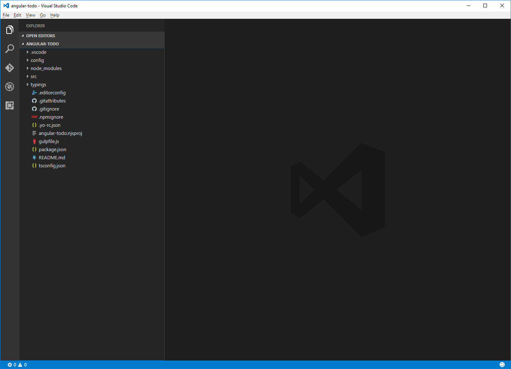
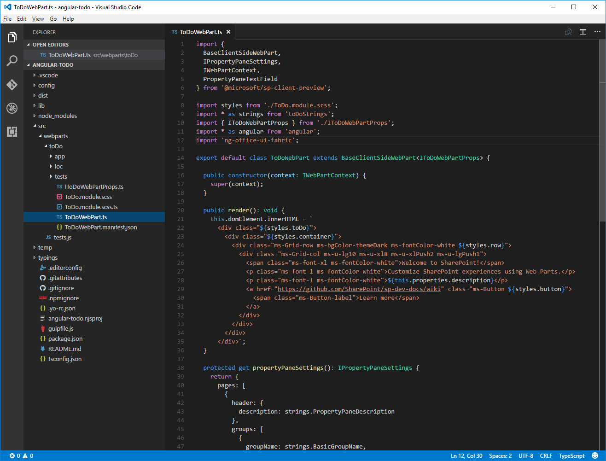
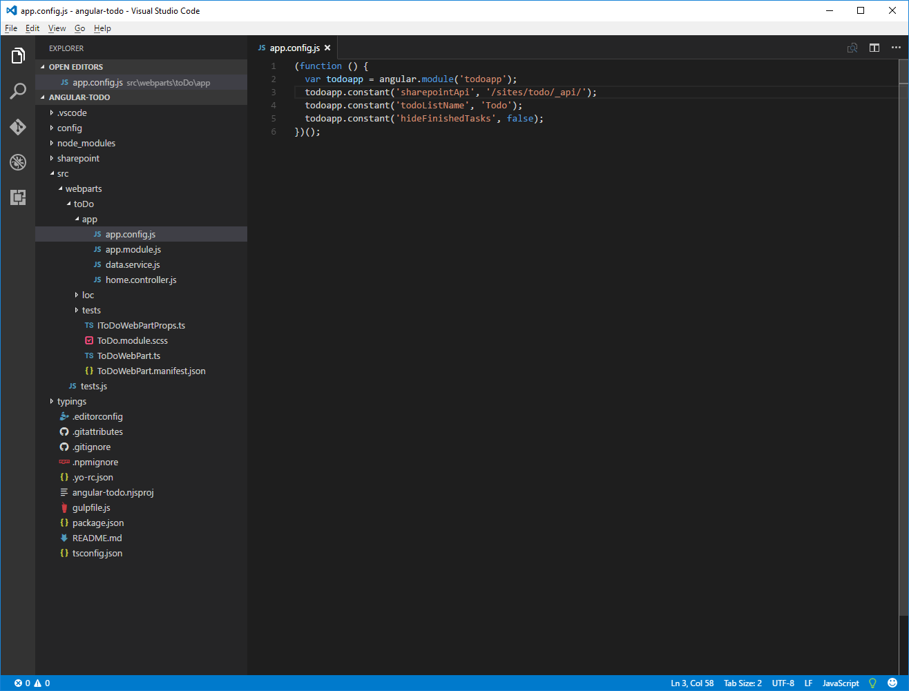
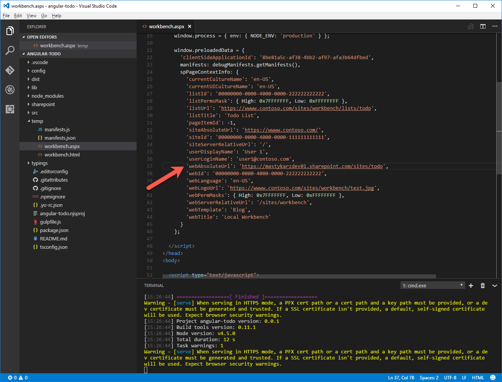
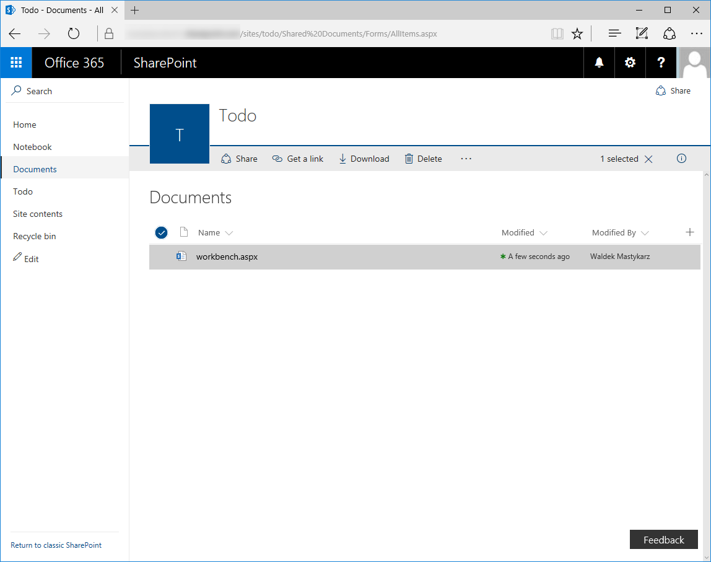

# <a name="migrate-angular-v1x-applications-to-sharepoint-framework"></a>Migrieren von Angular v1.x-Anwendungen zu SharePoint Framework

> Hinweis:  Dieser Artikel wurde noch nicht mit der SPFx-GA-Version überprüft, möglicherweise treten daher Probleme auf, wenn Sie versuchen, dies mit der neuesten Version durchzuführen.

Viele Organisationen haben in der Vergangenheit bereits SharePoint-Lösungen mit Angular erstellt. Dieser Artikel beschreibt, wie Sie eine vorhandene Angular v1.x-Anwendung mit Stilen auf Basis von [ngOfficeUIFabric](http://ngofficeuifabric.com) (Angular-Richtlinien für Office UI Fabric) zu einem clientseitigen SharePoint Framework-Webpart migrieren können. Die Beispielanwendung aus diesem Tutorial verwaltet in einer SharePoint-Liste gespeicherte To-do-Elemente.


Der Quellcode der Angular-Anwendung steht auf GitHub zur Verfügung, unter [https://github.com/SharePoint/sp-dev-fx-webparts/tree/dev/samples/angular-migration/angular-todo](https://github.com/SharePoint/sp-dev-fx-webparts/tree/dev/samples/angular-migration/angular-todo).

Der Quellcode der zu SharePoint Framework migrierten Angular-Anwendung steht ebenfalls auf GitHub zur Verfügung, unter [https://github.com/SharePoint/sp-dev-fx-webparts/tree/master/samples/angular-todo-webpart](https://github.com/SharePoint/sp-dev-fx-webparts/tree/master/samples/angular-todo-webpart).

> **Hinweis:** Bevor Sie die Schritte in diesem Artikel durchführen, müssen Sie [eine Entwicklungsumgebung einrichten](http://dev.office.com/sharepoint/docs/spfx/set-up-your-development-environment), in der Sie SharePoint Framework-Lösungen erstellen können.

## <a name="setup-project"></a>Einrichten des Projekts

Vor der Migration Ihrer Angular-Anwendung erstellen Sie ein neues SharePoint Framework-Projekt zum Hosten der Angular-Anwendung und richten es ein.

### <a name="create-new-project"></a>Erstellen eines neuen Projekts

Erstellen Sie zunächst einen neuen Ordner für Ihr Projekt:

```sh
md angular-todo
```

Navigieren Sie zum Projektordner:

```sh
cd angular-todo
```

Führen Sie im Projektordner den SharePoint Framework-Yeoman-Generator aus, um ein Gerüst für ein neues SharePoint Framework-Projekt zu erstellen:

```sh
yo @microsoft/sharepoint
```

Es werden mehrere Eingabeaufforderungen angezeigt. Definieren Sie die Werte jeweils wie folgt:
- **angular-todo** als Name der Lösung
- **Use the current folder** als Speicherort für die Dateien
- **To do** als Name des Webparts
- **Simple management of to do tasks** als Beschreibung des Webparts
- **No javaScript web framework** als Eintrittspunkt für die Webpart-Erstellung


Öffnen Sie den Projektordner in Ihrem Code-Editor, sobald die Gerüsterstellung abgeschlossen ist. In diesem Tutorial verwenden Sie Visual Studio Code.



### <a name="add-angular-and-ngofficeuifabric"></a>Hinzufügen von Angular und ngOfficeUIFabric

In diesem Tutorial laden Sie sowohl Angular als auch ngOfficeUIFabric aus dem CDN. Öffnen Sie dazu im Code-Editor die Datei **config/config.json**, und fügen Sie in der Eigenschaft **externals** die folgenden Zeilen hinzu:

```json
"angular": {
  "path": "https://cdnjs.cloudflare.com/ajax/libs/angular.js/1.5.16/angular.min.js",
  "globalName": "angular"
},
"ng-office-ui-fabric": "https://cdnjs.cloudflare.com/ajax/libs/ngOfficeUiFabric/0.12.3/ngOfficeUiFabric.js"
```


### <a name="add-angular-typings-for-typescript"></a>Hinzufügen von Angular-Typisierungen für TypeScript

Da Sie Angular im Code Ihres Webparts referenzieren werden, benötigen Sie auch Angular-Typisierungen für TypeScript. Führen Sie den folgenden Befehl in der Befehlszeile aus, um diese Typisierungen zu installieren:

```sh
npm install @types/angular --save-dev
```

## <a name="migrate-the-angular-application-as-is"></a>Migrieren der unveränderten Angular-Anwendung

Beginnen Sie mit der Migration der Angular-Anwendung, und implementieren Sie dabei nur die nötigsten Codeänderungen. In einem späteren Schritt werden Sie den einfachen JavaScript-Code der Anwendung auf TypeScript aktualisieren und die Integration mit dem clientseitigen Webpart verbessern.

### <a name="create-sharepoint-list"></a>Erstellen einer SharePoint-Liste

Erstellen Sie auf Ihrer SharePoint-Website eine neue Liste namens **Todo**. Fügen Sie in der Liste eine neue Auswahlspalte namens **Status** hinzu. Geben Sie die folgenden Auswahloptionen ein:

```
Not started
In progress
Completed
```


### <a name="copy-angular-application-files-to-the-web-part-project"></a>Kopieren der Dateien der Angular-Anwendung in das Webpart-Projekt

Erstellen Sie im Webpart-Projekt im Ordner **src/webparts/toDo** einen neuen Ordner namens `app`.


Kopieren Sie aus der Quellanwendung die Inhalte des Ordners **app** in den neu erstellten Ordner **app** im Webpart-Projekt.


### <a name="load-the-angular-application-in-the-client-side-web-part"></a>Laden der Angular-Anwendung in das clientseitige Webpart

Öffnen Sie im Code-Editor die Datei **./src/webparts/toDo/ToDoWebPart.ts**.

Fügen Sie den folgenden Code hinter der letzten Anweisung des Typs `import` ein:

```ts
import * as angular from 'angular';
import 'ng-office-ui-fabric';
```



Ändern Sie den Code der Methode **render** wie folgt:

```ts
export default class ToDoWebPart extends BaseClientSideWebPart<IToDoWebPartProps> {
  // ...
  public render(): void {
    if (this.renderedOnce === false) {
      require('./app/app.module');
      require('./app/app.config');
      require('./app/data.service');
      require('./app/home.controller');

      this.domElement.innerHTML = `
        <div class="${styles.toDo}">
          <div data-ng-controller="homeController as vm">
            <div class="${styles.loading}" ng-show="vm.isLoading">
              <uif-spinner>Loading...</uif-spinner>
            </div>
            <div class="entryform" ng-show="vm.isLoading === false">
              <uif-textfield uif-label="New to do:" uif-underlined ng-model="vm.newItem" ng-keydown="vm.todoKeyDown($event)"></uif-textfield>
            </div>
            <uif-list class="items" ng-show="vm.isLoading === false" >
              <uif-list-item ng-repeat="todo in vm.todoCollection" uif-item="todo" ng-class="{'done': todo.done}">
                <uif-list-item-primary-text>{{todo.title}}</uif-list-item-primary-text>
                <uif-list-item-actions>
                  <uif-list-item-action ng-click="vm.completeTodo(todo)" ng-show="todo.done === false">
                    <uif-icon uif-type="check"></uif-icon>
                  </uif-list-item-action>
                  <uif-list-item-action ng-click="vm.undoTodo(todo)" ng-show="todo.done">
                    <uif-icon uif-type="reactivate"></uif-icon>
                  </uif-list-item-action>
                  <uif-list-item-action ng-click="vm.deleteTodo(todo)">
                    <uif-icon uif-type="trash"></uif-icon>
                  </uif-list-item-action>
                </uif-list-item-actions>
              </uif-list-item>
            </uif-list>
          </div>
        </div>`;

      angular.bootstrap(this.domElement, ['todoapp']);
    }
  }
  // ...
}
```

### <a name="update-site-path"></a>Aktualisieren des Websitepfads

Öffnen Sie im Code-Editor die Datei **./src/webparts/toDo/app/app.config.js**. Ändern Sie den Wert der Konstante **sharepointApi** in die serverrelative URL der SharePoint-Website, auf der Sie die To-do-Liste erstellt haben, gefolgt von `/_api/`.



### <a name="trust-the-development-certificate"></a>Einstufen des Entwicklungszertifikats als vertrauenswürdig

Das zum HTTPS-basierten Laden von SharePoint Workbench und den zugehörigen Ressourcen erforderliche Entwicklungszertifikat gilt standardmäßig nicht als vertrauenswürdig. Der Webbrowser zeigt daher eine Warnung an, wenn Sie SharePoint Workbench aufrufen. Wenn Sie SharePoint Workbench im SharePoint-Kontext ausführen möchten, laden manche Webbrowser Workbench nicht, wenn das SSL-Zertifikat nicht als vertrauenswürdig eingestuft wird. Um dieses Problem zu vermeiden, sollten Sie das mit SharePoint Framework bereitgestellte Entwicklungszertifikat als vertrauenswürdig einstufen.

Führen Sie den folgenden Befehl in der Befehlszeile aus:

```sh
gulp trust-dev-cert
```

### <a name="upload-workbenchaspx-to-sharepoint"></a>Hochladen von „workbench.aspx“ auf SharePoint

Führen Sie den folgenden Befehl in der Befehlszeile aus:

```sh
gulp serve --nobrowser
```

Kopieren Sie im Ordner **./temp** die Datei **workbench.html**, und benennen Sie sie um in **workbench.aspx**. Ändern Sie in der Datei **workbench.aspx** den Wert der Eigenschaft **webAbsoluteUrl** in die vollständige URL der SharePoint-Website, auf der Sie die To-do-Liste erstellt haben.



Laden Sie die Datei **workbench.aspx** in die Dokumentbibliothek auf Ihrer SharePoint-Website hoch.



Wenn Sie alle Schritte richtig umgesetzt haben, sollten Sie im Browser das Webpart mit dem Formular zum Hinzufügen von To-do-Elementen sehen.


Fügen Sie einige To-do-Elemente hinzu, um sicherzustellen, dass das Webpart wie erwartet arbeitet.


### <a name="fix-web-part-styling"></a>Korrigieren des Webpart-Stils

Obwohl das Webpart ordnungsgemäß funktioniert, sieht es nicht so aus wie die ursprüngliche Angular-Anwendung. Das liegt daran, dass ngOfficeUIFabric eine ältere Office UI Fabric-Version verwendet als die SharePoint Workbench. Am einfachsten ließe sich das beheben, indem Sie die CSS-Stile laden, die ngOfficeUIFabric verwendet hat. Allerdings würden diese Stile Konflikte mit den Office UI Fabric-Stilen verursachen, die SharePoint Workbench verwendet, wodurch die Benutzeroberfläche nicht mehr korrekt dargestellt würde. Eine bessere Lösung ist es daher, die von den spezifischen Komponenten benötigten Stile zu den Webpart-Stilen hinzuzufügen.

Öffnen Sie im Code-Editor die Datei **./src/webparts/toDo/ToDo.module.scss**. Ändern Sie den Code in der Datei wie folgt:

```css
.toDo {
  .loading {
    margin: 0 auto;
    width: 6em;
  }

  .done :global .ms-ListItem-primaryText {
    text-decoration: line-through;
  }

  ul, li {
    margin: 0;
    padding: 0;
  }

  :global {
  .ms-ListItem{font-family:"Segoe UI WestEuropean","Segoe UI",-apple-system,BlinkMacSystemFont,Roboto,"Helvetica Neue",sans-serif;-webkit-font-smoothing:antialiased;font-size:14px;font-weight:400;box-sizing:border-box;margin:0;padding:0;box-shadow:none;padding:9px 28px 3px;position:relative;display:block}.ms-ListItem::after,.ms-ListItem::before{display:table;content:"";line-height:0}.ms-ListItem::after{clear:both}.ms-ListItem-primaryText,.ms-ListItem-secondaryText,.ms-ListItem-tertiaryText{display:block;overflow:hidden;text-overflow:ellipsis;white-space:nowrap;display:block}.ms-ListItem-primaryText{font-family:"Segoe UI WestEuropean","Segoe UI",-apple-system,BlinkMacSystemFont,Roboto,"Helvetica Neue",sans-serif;-webkit-font-smoothing:antialiased;font-size:21px;font-weight:100;padding-right:80px;position:relative;top:-4px}.ms-ListItem-secondaryText{font-family:"Segoe UI WestEuropean","Segoe UI",-apple-system,BlinkMacSystemFont,Roboto,"Helvetica Neue",sans-serif;-webkit-font-smoothing:antialiased;font-size:14px;font-weight:400;line-height:25px;position:relative;top:-7px;padding-right:30px}.ms-ListItem-tertiaryText{font-family:"Segoe UI WestEuropean","Segoe UI",-apple-system,BlinkMacSystemFont,Roboto,"Helvetica Neue",sans-serif;-webkit-font-smoothing:antialiased;font-size:14px;font-weight:400;position:relative;top:-9px;margin-bottom:-4px;padding-right:30px}.ms-ListItem-metaText{font-family:"Segoe UI WestEuropean","Segoe UI",-apple-system,BlinkMacSystemFont,Roboto,"Helvetica Neue",sans-serif;-webkit-font-smoothing:antialiased;font-size:11px;font-weight:400;position:absolute;right:30px;top:39px}.ms-ListItem-image{float:left;height:70px;margin-left:-8px;margin-right:10px;width:70px}.ms-ListItem-selectionTarget{display:none}.ms-ListItem-actions{max-width:80px;position:absolute;right:30px;text-align:right;top:10px}.ms-ListItem-action{color:#a6a6a6;display:inline-block;font-size:15px;position:relative;text-align:center;top:3px;cursor:pointer;height:16px;width:16px}.ms-ListItem-action .ms-Icon{vertical-align:top}.ms-ListItem-action:hover{color:#666666;outline:1px solid transparent}.ms-ListItem.is-unread{border-left:3px solid #0078d7;padding-left:27px}.ms-ListItem.is-unread .ms-ListItem-metaText,.ms-ListItem.is-unread .ms-ListItem-secondaryText{color:#0078d7;font-weight:600}.ms-ListItem.is-unseen:after{border-right:10px solid transparent;border-top:10px solid #0078d7;left:0;position:absolute;top:0}.ms-ListItem.is-selectable .ms-ListItem-selectionTarget{display:block;height:20px;left:6px;position:absolute;top:13px;width:20px}.ms-ListItem.is-selectable .ms-ListItem-image{margin-left:0}.ms-ListItem.is-selectable:hover{background-color:#eaeaea;cursor:pointer;outline:1px solid transparent}.ms-ListItem.is-selectable:hover:before{-moz-osx-font-smoothing:grayscale;-webkit-font-smoothing:antialiased;display:inline-block;font-family:FabricMDL2Icons;font-style:normal;font-weight:400;speak:none;position:absolute;top:12px;left:6px;height:15px;width:15px;border:1px solid #767676}.ms-ListItem.is-selected:before{border:1px solid transparent}.ms-ListItem.is-selected:before,.ms-ListItem.is-selected:hover:before{-moz-osx-font-smoothing:grayscale;-webkit-font-smoothing:antialiased;display:inline-block;font-family:FabricMDL2Icons;font-style:normal;font-weight:400;speak:none;content:'\e041';font-size:15px;color:#767676;position:absolute;top:12px;left:6px}.ms-ListItem.is-selected:hover{background-color:#c7e0f4;outline:1px solid transparent}.ms-ListItem.ms-ListItem--document{padding:0}.ms-ListItem.ms-ListItem--document .ms-ListItem-itemIcon{width:70px;height:70px;float:left;text-align:center}.ms-ListItem.ms-ListItem--document .ms-ListItem-itemIcon .ms-Icon{font-size:38px;line-height:70px;color:#666666}.ms-ListItem.ms-ListItem--document .ms-ListItem-primaryText{display:block;overflow:hidden;text-overflow:ellipsis;white-space:nowrap;font-size:14px;padding-top:15px;padding-right:0;position:static}.ms-ListItem.ms-ListItem--document .ms-ListItem-secondaryText{display:block;overflow:hidden;text-overflow:ellipsis;white-space:nowrap;font-family:"Segoe UI WestEuropean","Segoe UI",-apple-system,BlinkMacSystemFont,Roboto,"Helvetica Neue",sans-serif;-webkit-font-smoothing:antialiased;font-size:11px;font-weight:400;padding-top:6px}.MailList{overflow-y:auto;-webkit-overflow-scrolling:touch;max-height:500px}.MailTile{margin-bottom:5px;padding:10px;background:red}
  }
}
```

Ändern Sie in der Datei **./src/webparts/toDo/ToDoWebPart.ts** in der Methode **render** die Vorlage für das Anwendungsrendering so, dass sie die neuen Office UI Fabric-Symbole verwendet.

```ts
export default class ToDoWebPart extends BaseClientSideWebPart<IToDoWebPartProps> {
  // ...
  public render(): void {
    if (this.renderedOnce === false) {
      require('./app/app.module');
      require('./app/app.config');
      require('./app/data.service');
      require('./app/home.controller');

      this.domElement.innerHTML = `
        <div class="${styles.toDo}">
          <div data-ng-controller="HomeController as vm">
            <div id="loading" ng-show="vm.isLoading">
              <uif-spinner>Loading...</uif-spinner>
            </div>
            <div id="entryform" ng-show="vm.isLoading === false">
              <uif-textfield uif-label="New to do:" uif-underlined ng-model="vm.newItem" ng-keydown="vm.todoKeyDown($event)"></uif-textfield>
            </div>
            <uif-list id="items" ng-show="vm.isLoading === false" >
              <uif-list-item ng-repeat="todo in vm.todoCollection" uif-item="todo" ng-class="{'${styles.done}': todo.done}">
                <uif-list-item-primary-text>{{todo.title}}</uif-list-item-primary-text>
                <uif-list-item-actions>
                  <uif-list-item-action ng-click="vm.completeTodo(todo)" ng-show="todo.done === false">
                    <i class="ms-Icon ms-Icon--CheckMark" aria-hidden="true"></i>
                  </uif-list-item-action>
                  <uif-list-item-action ng-click="vm.undoTodo(todo)" ng-show="todo.done">
                    <i class="ms-Icon ms-Icon--RevToggleKey" aria-hidden="true"></i>
                  </uif-list-item-action>
                  <uif-list-item-action ng-click="vm.deleteTodo(todo)">
                    <i class="ms-Icon ms-Icon--Delete" aria-hidden="true"></i>
                  </uif-list-item-action>
                </uif-list-item-actions>
              </uif-list-item>
            </uif-list>
          </div>
        </div>`;

      angular.bootstrap(this.domElement, ['todoapp']);
    }
  }
  // ...
}
```

Wenn Sie das Webpart jetzt im Browser aktualisieren, werden die korrekten Stile angezeigt.


## <a name="upgrade-the-angular-application-to-typescript"></a>Aktualisieren der Angular-Anwendung auf TypeScript

Die ursprüngliche Angular-Anwendung ist in einfachem JavaScript geschrieben, was die Codepflege fehleranfällig macht. Bei der Erstellung von clientseitigen SharePoint Framework-Webparts können Sie TypeScript und seine Funktionen für Typsicherheit verwenden, die bereits bei der Codeeingabe greifen. In diesem Teil des Tutorials migrieren Sie den in einfachem JavaScript gehaltenen Angular-Code zu TypeScript.

### <a name="upgrade-application-configuration"></a>Aktualisieren der Anwendungskonfiguration

Benennen Sie in Ihrem Projekt die Datei **./src/webparts/toDo/app/app.config.js** um in `app.config.ts`. Ändern Sie den Code in der Datei wie folgt:

```ts
import * as angular from 'angular';

export default function() {
  const todoapp: ng.IModule = angular.module('todoapp');
  todoapp.constant('sharepointApi', '/todo/_api/');
  todoapp.constant('todoListName', 'Todo');
  todoapp.constant('hideFinishedTasks', false);
}
```

### <a name="upgrade-data-service"></a>Aktualisieren des Datendiensts

Benennen Sie in Ihrem Projekt die Datei **./src/webparts/toDo/app/data.service.js** um in `DataService.ts`. Ändern Sie den Code in der Datei wie folgt:

```ts
import * as angular from 'angular';

export interface ITodo {
  id: number;
  title: string;
  done: boolean;
}

interface ITodoItem {
  Id: number;
  Title: string;
  Status: string;
}

export interface IDataService {
  getTodos: () => angular.IPromise<ITodo[]>;
  addTodo: (todo: string) => angular.IPromise<{}>;
  deleteTodo: (todo: ITodo) => angular.IPromise<{}>;
  setTodoStatus: (todo: ITodo, done: boolean) => angular.IPromise<{}>;
}

export default class DataService implements IDataService {
  public static $inject: string[] = ['$q', '$http', 'sharepointApi', 'todoListName', 'hideFinishedTasks'];

  constructor(private $q: angular.IQService,
    private $http: angular.IHttpService,
    private sharepointApi: string,
    private todoListName: string,
    private hideFinishedTasks: boolean) {
  }

  public getTodos(): angular.IPromise<ITodo[]> {
    const deferred: angular.IDeferred<ITodo[]> = this.$q.defer();

    let url: string = `${this.sharepointApi}web/lists/getbytitle('${this.todoListName}')/items?$select=Id,Title,Status&$orderby=ID desc`;

    if (this.hideFinishedTasks === true) {
      url += "&$filter=Status ne 'Completed'";
    }

    this.$http({
      url: url,
      method: 'GET',
      headers: {
        'Accept': 'application/json;odata=nometadata'
      }
    }).then((result: angular.IHttpPromiseCallbackArg<{ value: ITodoItem[] }>): void => {
      const todos: ITodo[] = [];
      for (let i: number = 0; i < result.data.value.length; i++) {
        const todo: ITodoItem = result.data.value[i];
        todos.push({
          id: todo.Id,
          title: todo.Title,
          done: todo.Status === 'Completed'
        });
      }
      deferred.resolve(todos);
    });

    return deferred.promise;
  }

  public addTodo(todo: string): angular.IPromise<{}> {
    const deferred: angular.IDeferred<{}> = this.$q.defer();

    let listItemEntityTypeFullName: string = undefined;
    this.getListItemEntityTypeFullName()
      .then((entityTypeName: string): angular.IPromise<string> => {
        listItemEntityTypeFullName = entityTypeName;
        return this.getRequestDigest();
      })
      .then((requestDigest: string): void => {
        const body: string = JSON.stringify({
          '__metadata': { 'type': listItemEntityTypeFullName },
          'Title': todo
        });
        this.$http({
          url: `${this.sharepointApi}web/lists/getbytitle('${this.todoListName}')/items`,
          method: 'POST',
          headers: {
            'Accept': 'application/json;odata=nometadata',
            'Content-type': 'application/json;odata=verbose',
            'X-RequestDigest': requestDigest
          },
          data: body
        }).then((result: angular.IHttpPromiseCallbackArg<{}>): void => {
          deferred.resolve();
        });
      });

    return deferred.promise;
  }

  public deleteTodo(todo: ITodo): angular.IPromise<{}> {
    const deferred: angular.IDeferred<{}> = this.$q.defer();

    this.getRequestDigest()
      .then((requestDigest: string): void => {
        this.$http({
          url: `${this.sharepointApi}web/lists/getbytitle('${this.todoListName}')/items(${todo.id})`,
          method: 'POST',
          headers: {
            'Accept': 'application/json;odata=nometadata',
            'X-RequestDigest': requestDigest,
            'IF-MATCH': '*',
            'X-HTTP-Method': 'DELETE'
          }
        }).then((result: angular.IHttpPromiseCallbackArg<{}>): void => {
          deferred.resolve();
        });
      });

    return deferred.promise;
  }

  public setTodoStatus(todo: ITodo, done: boolean): angular.IPromise<{}> {
    const deferred: angular.IDeferred<{}> = this.$q.defer();

    let listItemEntityTypeFullName: string = undefined;
    this.getListItemEntityTypeFullName()
      .then((entityTypeName: string): angular.IPromise<string> => {
        listItemEntityTypeFullName = entityTypeName;
        return this.getRequestDigest();
      })
      .then((requestDigest: string): void => {
        const body: string = JSON.stringify({
          '__metadata': { 'type': listItemEntityTypeFullName },
          'Status': done ? 'Completed' : 'Not started'
        });
        this.$http({
          url: `${this.sharepointApi}web/lists/getbytitle('${this.todoListName}')/items(${todo.id})`,
          method: 'POST',
          headers: {
            'Accept': 'application/json;odata=nometadata',
            'Content-type': 'application/json;odata=verbose',
            'X-RequestDigest': requestDigest,
            'IF-MATCH': '*',
            'X-HTTP-Method': 'MERGE'
          },
          data: body
        }).then((result: angular.IHttpPromiseCallbackArg<{}>): void => {
          deferred.resolve();
        });
      });

    return deferred.promise;
  }

  private getRequestDigest(): angular.IPromise<string> {
    const deferred: angular.IDeferred<string> = this.$q.defer();

    this.$http({
      url: this.sharepointApi + 'contextinfo',
      method: 'POST',
      headers: {
        'Accept': 'application/json;odata=nometadata'
      }
    }).then((result: angular.IHttpPromiseCallbackArg<{ FormDigestValue: string }>): void => {
      deferred.resolve(result.data.FormDigestValue);
    }, (err: any): void => {
      deferred.reject(err);
    });

    return deferred.promise;
  }

  private getListItemEntityTypeFullName(): angular.IPromise<string> {
    const deferred: angular.IDeferred<string> = this.$q.defer();

    this.$http({
      url: `${this.sharepointApi}web/lists/getbytitle('${this.todoListName}')?$select=ListItemEntityTypeFullName`,
      method: 'GET',
      headers: {
        'Accept': 'application/json;odata=nometadata'
      }
    }).then((result: angular.IHttpPromiseCallbackArg<{ ListItemEntityTypeFullName: string }>): void => {
      deferred.resolve(result.data.ListItemEntityTypeFullName);
    }, (err: any): void => {
      deferred.reject(err);
    });

    return deferred.promise;
  }
}
```

### <a name="upgrade-home-controller"></a>Aktualisieren des Startcontrollers

Benennen Sie in Ihrem Projekt die Datei **./src/webparts/toDo/app/home.controller.js** um in `HomeController.ts`. Ändern Sie den Code in der Datei wie folgt:

```ts
import * as angular from 'angular';
import { IDataService, ITodo } from './DataService';

export default class HomeController {
  public isLoading: boolean = false;
  public newItem: string = null;
  public todoCollection: ITodo[] = [];

  public static $inject: string[] = ['DataService', '$window'];

  constructor(private dataService: IDataService, private $window: angular.IWindowService) {
    this.loadTodos();
  }

  private loadTodos(): void {
    this.isLoading = true;
    this.dataService.getTodos()
      .then((todos: ITodo[]): void => {
        this.todoCollection = todos;
      })
      .finally((): void => {
        this.isLoading = false;
      });
  }

  public todoKeyDown($event: KeyboardEvent): void {
    if ($event.keyCode === 13 && this.newItem.length > 0) {
      $event.preventDefault();

      this.todoCollection.unshift({ id: -1, title: this.newItem, done: false });

      this.dataService.addTodo(this.newItem)
        .then((): void => {
          this.newItem = null;
          this.dataService.getTodos()
            .then((todos: ITodo[]): void => {
              this.todoCollection = todos;
            });
        });
    }
  }

  public deleteTodo(todo: ITodo): void {
    if (this.$window.confirm('Are you sure you want to delete this todo item?')) {
      let index: number = -1;
      for (let i: number = 0; i < this.todoCollection.length; i++) {
        if (this.todoCollection[i].id === todo.id) {
          index = i;
          break;
        }
      }

      if (index > -1) {
        this.todoCollection.splice(index, 1);
      }

      this.dataService.deleteTodo(todo)
        .then((): void => {
          this.dataService.getTodos()
            .then((todos: ITodo[]): void => {
              this.todoCollection = todos;
            });
        });
    }
  }

  public completeTodo(todo: ITodo): void {
    todo.done = true;

    this.dataService.setTodoStatus(todo, true)
      .then((): void => {
        this.dataService.getTodos()
          .then((todos: ITodo[]): void => {
            this.todoCollection = todos;
          });
      });
  }

  public undoTodo(todo: ITodo): void {
    todo.done = false;

    this.dataService.setTodoStatus(todo, false)
      .then((): void => {
        this.dataService.getTodos()
          .then((todos: ITodo[]): void => {
            this.todoCollection = todos;
          });
      });
  }
}
```

### <a name="upgrade-application-module"></a>Aktualisieren des Anwendungsmoduls

Benennen Sie in Ihrem Projekt die Datei **./src/webparts/toDo/app/app.module.js** um in `app.module.ts`. Ändern Sie den Code in der Datei wie folgt:

```ts
import * as angular from 'angular';
import config from './app.config';
import HomeController from './HomeController';
import DataService from './DataService';

import 'ng-office-ui-fabric';

const todoapp: angular.IModule = angular.module('todoapp', [
  'officeuifabric.core',
  'officeuifabric.components'
]);

config();

todoapp
  .controller('HomeController', HomeController)
  .service('DataService', DataService);
```

### <a name="update-reference-to-angular-application-in-the-web-part"></a>Aktualisieren des Verweises auf die Angular-Anwendung im Webpart

Da die Angular-Anwendung jetzt auf TypeScript-Basis erstellt wurde und sich ihre unterschiedlichen Teile gegenseitig referenzieren, muss das Webpart nicht mehr alle Teile der Anwendung referenzieren. Stattdessen muss es nur das Hauptmodul laden; dieses wiederum lädt alle übrigen Elemente, die zur Angular-Anwendung gehören.

Öffnen Sie im Code-Editor die Datei **./src/webparts/toDo/ToDoWebPart.ts**. Ändern Sie die Methode **render** wie folgt:

```ts
export default class ToDoWebPart extends BaseClientSideWebPart<IToDoWebPartProps> {
  // ...
  public render(): void {
    if (this.renderedOnce === false) {
      require('./app/app.module');

      this.domElement.innerHTML = `
        <div class="${styles.toDo}">
          <div data-ng-controller="HomeController as vm">
            <div id="loading" ng-show="vm.isLoading">
              <uif-spinner>Loading...</uif-spinner>
            </div>
            <div id="entryform" ng-show="vm.isLoading === false">
              <uif-textfield uif-label="New to do:" uif-underlined ng-model="vm.newItem" ng-keydown="vm.todoKeyDown($event)"></uif-textfield>
            </div>
            <uif-list id="items" ng-show="vm.isLoading === false" >
              <uif-list-item ng-repeat="todo in vm.todoCollection" uif-item="todo" ng-class="{'${styles.done}': todo.done}">
                <uif-list-item-primary-text>{{todo.title}}</uif-list-item-primary-text>
                <uif-list-item-actions>
                  <uif-list-item-action ng-click="vm.completeTodo(todo)" ng-show="todo.done === false">
                    <i class="ms-Icon ms-Icon--CheckMark" aria-hidden="true"></i>
                  </uif-list-item-action>
                  <uif-list-item-action ng-click="vm.undoTodo(todo)" ng-show="todo.done">
                    <i class="ms-Icon ms-Icon--RevToggleKey" aria-hidden="true"></i>
                  </uif-list-item-action>
                  <uif-list-item-action ng-click="vm.deleteTodo(todo)">
                    <i class="ms-Icon ms-Icon--Delete" aria-hidden="true"></i>
                  </uif-list-item-action>
                </uif-list-item-actions>
              </uif-list-item>
            </uif-list>
          </div>
        </div>`;

      angular.bootstrap(this.domElement, ['todoapp']);
    }
  }
  // ...
}
```

Führen Sie den folgenden Befehl in der Befehlszeile aus, um zu überprüfen, ob die Aktualisierung auf TypeScript erfolgreich war:

```sh
gulp serve --nobrowser
```

Aktualisieren Sie im Webbrowser SharePoint Workbench. Das Webpart sollte genauso dargestellt werden wie zuvor.


Obwohl das Webpart noch genauso funktioniert wie bisher, haben Sie den Code verbessert. Bei zukünftigen Updates können Sie nun einfacher bereits während der Entwicklung die Korrektheit und Integrität des Codes überprüfen.

## <a name="improve-integration-of-the-angular-application-with-the-sharepoint-framework"></a>Verbessern der Integration der Angular-Anwendung mit SharePoint Framework

An diesem Punkt arbeitet die Angular-Anwendung korrekt und ist in ein clientseitiges SharePoint Framework-Webpart eingeschlossen. Allerdings können Benutzer das Webpart zwar zur Seite hinzufügen, seine Funktionsweise jedoch nicht konfigurieren. Die gesamte Konfiguration ist in den Code der Angular-Anwendung eingebettet. In diesem Abschnitt erweitern Sie das Webpart so, dass Benutzer konfigurieren können, wie die Liste heißt, in der die To-do-Elemente gespeichert werden, und ob das Webpart erledigte Aufgaben anzeigen soll oder nicht.

### <a name="define-web-part-properties"></a>Definieren der Webparteigenschaften

Öffnen Sie im Code-Editor die Datei **./src/webparts/toDo/ToDoWebPart.manifest.json**. Ändern Sie den Abschnitt **properties** wie folgt:

```json
"properties": {
  "todoListName": "Todo",
  "hideFinishedTasks": false
}
```


Ändern Sie den Code in der Datei **./src/webparts/toDo/IToDoWebPartProps.ts** wie folgt:

```ts
export interface IToDoWebPartProps {
  todoListName: string;
  hideFinishedTasks: boolean;
}
```

Ändern Sie in der Datei **./src/webparts/toDo/ToDoWebPart.ts** die erste Importanweisung wie folgt:

```ts
import {
  BaseClientSideWebPart,
  IPropertyPaneSettings,
  IWebPartContext,
  PropertyPaneTextField,
  PropertyPaneToggle
} from '@microsoft/sp-client-preview';
```


Ändern Sie nun in derselben Datei die Methode **propertyPaneSettings** wie folgt:

```ts
export default class ToDoWebPart extends BaseClientSideWebPart<IToDoWebPartProps> {
  // ...
  protected get propertyPaneSettings(): IPropertyPaneSettings {
    return {
      pages: [
        {
          header: {
            description: strings.PropertyPaneDescription
          },
          groups: [
            {
              groupName: strings.BasicGroupName,
              groupFields: [
                PropertyPaneTextField('todoListName', {
                  label: strings.ListNameFieldLabel
                }),
                PropertyPaneToggle('hideFinishedTasks', {
                  label: strings.HideFinishedTasksFieldLabel
                })
              ]
            }
          ]
        }
      ]
    };
  }
  // ...
}
```

Fügen Sie die fehlenden Ressourcenzeichenfolgen hinzu, indem Sie den Code in der Datei **./src/webparts/toDo/loc/mystrings.d.ts** wie folgt ändern:

```ts
declare interface IToDoStrings {
  PropertyPaneDescription: string;
  BasicGroupName: string;
  ListNameFieldLabel: string;
  HideFinishedTasksFieldLabel: string;
}

declare module 'toDoStrings' {
  const strings: IToDoStrings;
  export = strings;
}
```

Fügen Sie in der Datei **./src/webparts/toDo/loc/en-us.js** Übersetzungen für die neu hinzugefügten Zeichenfolgen hinzu:

```js
define([], function() {
  return {
    "PropertyPaneDescription": "Description",
    "BasicGroupName": "Group Name",
    "ListNameFieldLabel": "List name",
    "HideFinishedTasksFieldLabel": "Hide finished tasks"
  }
});
```

### <a name="pass-web-part-properties-values-to-the-angular-application"></a>Übergeben der Werte der Webpart-Eigenschaften an die Angular-Anwendung

Jetzt können Benutzer konfigurieren, wie das Webpart funktionieren soll. Die Angular-Anwendung verwendet diese Werte jedoch noch nicht. In diesem Abschnitt erweitern Sie die Angular-Anwendung so, dass sie die Konfigurationswerte verwendet, die die Benutzer über den Webpart-Eigenschaftenbereich festlegen. Eine Möglichkeit, dies umzusetzen, ist es, ein Angular-Ereignis in der Methode **render** weiterzugeben und dieses Ereignis in dem Controller zu abonnieren, der im Webpart verwendet wird.

#### <a name="delete-angular-configuration-file"></a>Löschen der Angular-Konfigurationsdatei

Löschen Sie in Ihrem Projekt die Datei **./src/webparts/toDo/app/app.config.ts**. In den nächsten Schritten aktualisieren Sie die Anwendung so, dass sie die Konfigurationswerte aus den Webpart-Eigenschaften abruft.

#### <a name="remove-reference-to-configuration"></a>Entfernen des Verweises auf die Konfiguration

Entfernen Sie in der Datei **./src/webparts/toDo/app/app.module.ts** den Verweis auf die Angular-Konfiguration, indem Sie den Code wie folgt ändern:

```ts
import * as angular from 'angular';
import HomeController from './HomeController';
import DataService from './DataService';

import 'ng-office-ui-fabric';

const todoapp: angular.IModule = angular.module('todoapp', [
  'officeuifabric.core',
  'officeuifabric.components'
]);

todoapp
  .controller('HomeController', HomeController)
  .service('DataService', DataService);
```

#### <a name="update-data-service-to-accept-configuration-value-in-method-parameters"></a>Aktualisieren des Datendiensts, sodass Konfigurationswerte in Methodenparametern akzeptiert werden

Der Datendienst ruft seine Konfiguration ursprünglich aus den in der Datei **app.config.ts** definierten Konstanten ab. Damit er stattdessen die in den Webpart-Eigenschaften konfigurierten Konfigurationswerte verwendet, müssen die jeweiligen Methoden Parameter akzeptieren. 

Öffnen Sie im Code-Editor die Datei **./src/webparts/toDo/app/DataService.ts**, und ändern Sie den Code in der Datei wie folgt:

```ts
import * as angular from 'angular';

export interface ITodo {
  id: number;
  title: string;
  done: boolean;
}

interface ITodoItem {
  Id: number;
  Title: string;
  Status: string;
}

export interface IDataService {
  getTodos: (sharePointApi: string, todoListName: string, hideFinishedTasks: boolean) => angular.IPromise<ITodo[]>;
  addTodo: (todo: string, sharePointApi: string, todoListName: string) => angular.IPromise<{}>;
  deleteTodo: (todo: ITodo, sharePointApi: string, todoListName: string) => angular.IPromise<{}>;
  setTodoStatus: (todo: ITodo, done: boolean, sharePointApi: string, todoListName: string) => angular.IPromise<{}>;
}

export default class DataService implements IDataService {
  public static $inject: string[] = ['$q', '$http'];

  constructor(private $q: angular.IQService, private $http: angular.IHttpService) {
  }

  public getTodos(sharePointApi: string, todoListName: string, hideFinishedTasks: boolean): angular.IPromise<ITodo[]> {
    const deferred: angular.IDeferred<ITodo[]> = this.$q.defer();

    let url: string = `${sharePointApi}web/lists/getbytitle('${todoListName}')/items?$select=Id,Title,Status&$orderby=ID desc`;

    if (hideFinishedTasks === true) {
      url += "&$filter=Status ne 'Completed'";
    }

    this.$http({
      url: url,
      method: 'GET',
      headers: {
        'Accept': 'application/json;odata=nometadata'
      }
    }).then((result: angular.IHttpPromiseCallbackArg<{ value: ITodoItem[] }>): void => {
      const todos: ITodo[] = [];
      for (let i: number = 0; i < result.data.value.length; i++) {
        const todo: ITodoItem = result.data.value[i];
        todos.push({
          id: todo.Id,
          title: todo.Title,
          done: todo.Status === 'Completed'
        });
      }
      deferred.resolve(todos);
    });

    return deferred.promise;
  }

  public addTodo(todo: string, sharePointApi: string, todoListName: string): angular.IPromise<{}> {
    const deferred: angular.IDeferred<{}> = this.$q.defer();

    let listItemEntityTypeFullName: string = undefined;
    this.getListItemEntityTypeFullName(sharePointApi, todoListName)
      .then((entityTypeName: string): angular.IPromise<string> => {
        listItemEntityTypeFullName = entityTypeName;
        return this.getRequestDigest(sharePointApi);
      })
      .then((requestDigest: string): void => {
        const body: string = JSON.stringify({
          '__metadata': { 'type': listItemEntityTypeFullName },
          'Title': todo
        });
        this.$http({
          url: `${sharePointApi}web/lists/getbytitle('${todoListName}')/items`,
          method: 'POST',
          headers: {
            'Accept': 'application/json;odata=nometadata',
            'Content-type': 'application/json;odata=verbose',
            'X-RequestDigest': requestDigest
          },
          data: body
        }).then((result: angular.IHttpPromiseCallbackArg<{}>): void => {
          deferred.resolve();
        });
      });

    return deferred.promise;
  }

  public deleteTodo(todo: ITodo, sharePointApi: string, todoListName: string): angular.IPromise<{}> {
    const deferred: angular.IDeferred<{}> = this.$q.defer();

    this.getRequestDigest(sharePointApi)
      .then((requestDigest: string): void => {
        this.$http({
          url: `${sharePointApi}web/lists/getbytitle('${todoListName}')/items(${todo.id})`,
          method: 'POST',
          headers: {
            'Accept': 'application/json;odata=nometadata',
            'X-RequestDigest': requestDigest,
            'IF-MATCH': '*',
            'X-HTTP-Method': 'DELETE'
          }
        }).then((result: angular.IHttpPromiseCallbackArg<{}>): void => {
          deferred.resolve();
        });
      });

    return deferred.promise;
  }

  public setTodoStatus(todo: ITodo, done: boolean, sharePointApi: string, todoListName: string): angular.IPromise<{}> {
    const deferred: angular.IDeferred<{}> = this.$q.defer();

    let listItemEntityTypeFullName: string = undefined;
    this.getListItemEntityTypeFullName(sharePointApi, todoListName)
      .then((entityTypeName: string): angular.IPromise<string> => {
        listItemEntityTypeFullName = entityTypeName;
        return this.getRequestDigest(sharePointApi);
      })
      .then((requestDigest: string): void => {
        const body: string = JSON.stringify({
          '__metadata': { 'type': listItemEntityTypeFullName },
          'Status': done ? 'Completed' : 'Not started'
        });
        this.$http({
          url: `${sharePointApi}web/lists/getbytitle('${todoListName}')/items(${todo.id})`,
          method: 'POST',
          headers: {
            'Accept': 'application/json;odata=nometadata',
            'Content-type': 'application/json;odata=verbose',
            'X-RequestDigest': requestDigest,
            'IF-MATCH': '*',
            'X-HTTP-Method': 'MERGE'
          },
          data: body
        }).then((result: angular.IHttpPromiseCallbackArg<{}>): void => {
          deferred.resolve();
        });
      });

    return deferred.promise;
  }

  private getRequestDigest(sharePointApi: string): angular.IPromise<string> {
    const deferred: angular.IDeferred<string> = this.$q.defer();

    this.$http({
      url: sharePointApi + 'contextinfo',
      method: 'POST',
      headers: {
        'Accept': 'application/json;odata=nometadata'
      }
    }).then((result: angular.IHttpPromiseCallbackArg<{ FormDigestValue: string }>): void => {
      deferred.resolve(result.data.FormDigestValue);
    }, (err: any): void => {
      deferred.reject(err);
    });

    return deferred.promise;
  }

  private getListItemEntityTypeFullName(sharePointApi: string, todoListName: string): angular.IPromise<string> {
    const deferred: angular.IDeferred<string> = this.$q.defer();

    this.$http({
      url: `${sharePointApi}web/lists/getbytitle('${todoListName}')?$select=ListItemEntityTypeFullName`,
      method: 'GET',
      headers: {
        'Accept': 'application/json;odata=nometadata'
      }
    }).then((result: angular.IHttpPromiseCallbackArg<{ ListItemEntityTypeFullName: string }>): void => {
      deferred.resolve(result.data.ListItemEntityTypeFullName);
    }, (err: any): void => {
      deferred.reject(err);
    });

    return deferred.promise;
  }
}
```

#### <a name="broadcast-properties-change-event"></a>Weitergeben eines Ereignisses bei Änderung einer Eigenschaft

Fügen Sie in der Datei **./src/webparts/toDo/ToDoWebPart.ts** zur Klasse **ToDoWebPart** eine neue Eigenschaft namens `$injector` hinzu:

```ts
export default class ToDoWebPart extends BaseClientSideWebPart<IToDoWebPartProps> {
  private $injector: angular.auto.IInjectorService;
  // ...
}
```


Aktualisieren Sie in derselben Datei die Methode **render** wie folgt:

```ts
export default class ToDoWebPart extends BaseClientSideWebPart<IToDoWebPartProps> {
  // ...
  public render(): void {
    if (this.renderedOnce === false) {
      require('./app/app.module');

      this.domElement.innerHTML = `
        <div class="${styles.toDo}">
          <div data-ng-controller="HomeController as vm">
            <div class="${styles.configurationNeeded}" ng-show="vm.configurationNeeded">
              Please configure the web part
            </div>
            <div ng-show="vm.configurationNeeded === false">
              <div id="loading" ng-show="vm.isLoading">
                <uif-spinner>Loading...</uif-spinner>
              </div>
              <div id="entryform" ng-show="vm.isLoading === false">
                <uif-textfield uif-label="New to do:" uif-underlined ng-model="vm.newItem" ng-keydown="vm.todoKeyDown($event)"></uif-textfield>
              </div>
              <uif-list id="items" ng-show="vm.isLoading === false" >
                <uif-list-item ng-repeat="todo in vm.todoCollection" uif-item="todo" ng-class="{'${styles.done}': todo.done}">
                  <uif-list-item-primary-text>{{todo.title}}</uif-list-item-primary-text>
                  <uif-list-item-actions>
                    <uif-list-item-action ng-click="vm.completeTodo(todo)" ng-show="todo.done === false">
                      <i class="ms-Icon ms-Icon--CheckMark" aria-hidden="true"></i>
                    </uif-list-item-action>
                    <uif-list-item-action ng-click="vm.undoTodo(todo)" ng-show="todo.done">
                      <i class="ms-Icon ms-Icon--RevToggleKey" aria-hidden="true"></i>
                    </uif-list-item-action>
                    <uif-list-item-action ng-click="vm.deleteTodo(todo)">
                      <i class="ms-Icon ms-Icon--Delete" aria-hidden="true"></i>
                    </uif-list-item-action>
                  </uif-list-item-actions>
                </uif-list-item>
              </uif-list>
            </div>
          </div>
        </div>`;

      this.$injector = angular.bootstrap(this.domElement, ['todoapp']);
    }

    this.$injector.get('$rootScope').$broadcast('configurationChanged', {
      sharePointApi: this.context.pageContext.web.absoluteUrl + '/_api/',
      todoListName: this.properties.todoListName,
      hideFinishedTasks: this.properties.hideFinishedTasks
    });
  }
  // ...
}
```

Fügen Sie in der Datei **./src/webparts/toDo/ToDo.module.scss** die fehlenden Stile für die Klasse **.configurationNeeded** hinzu:

```css
.toDo {
  /* ... */
  .configurationNeeded {
    margin: 0 auto;
    width: 100%;
    text-align: center;
  }
  /* ... */
}
```

#### <a name="subscribe-to-the-properties-changed-event"></a>Abonnieren des Ereignisses bei Änderung einer Eigenschaft

Öffnen Sie im Code-Editor die Datei **./src/webparts/toDo/app/HomeController.ts**.

Fügen Sie in der Klasse **HomeController** die folgenden Eigenschaften hinzu:

```ts
export default class HomeController {
  // ...
  private sharePointApi: string = undefined;
  private todoListName: string = undefined;
  private hideFinishedTasks: boolean = false;
  private configurationNeeded: boolean = true;
  // ...
}
```

Erweitern Sie den Konstruktor der Klasse **HomeController** durch Injektion des Stammbereichsdiensts, und ändern Sie den Code wie folgt:

```ts
export default class HomeController {
  // ...
  public static $inject: string[] = ['DataService', '$window', '$rootScope'];

  constructor(private dataService: IDataService,
    private $window: angular.IWindowService,
    $rootScope: angular.IRootScopeService) {
    const vm: HomeController = this;
    this.init(undefined, undefined);

    $rootScope.$on('configurationChanged',
      (event: angular.IAngularEvent,
       args: {
         sharePointApi: string;
         todoListName: string;
         hideFinishedTasks: boolean;
        }): void => {
      vm.init(args.sharePointApi, args.todoListName, args.hideFinishedTasks);
    });
  }

  // ...
}
```

Fügen Sie zur Klasse **HomeController** die Methode **init** hinzu:

```ts
export default class HomeController {
  // ...
  private init(sharePointApi: string, todoListName: string, hideFinishedTasks?: boolean): void {
    if (sharePointApi !== undefined && sharePointApi.length > 0 &&
      todoListName !== undefined && todoListName.length > 0) {
      this.sharePointApi = sharePointApi;
      this.todoListName = todoListName;
      this.hideFinishedTasks = hideFinishedTasks;
      this.loadTodos();
      this.configurationNeeded = false;
    }
    else {
      this.configurationNeeded = true;
    }
  }
  // ...
}
```

Aktualisieren Sie alle übrigen Methoden in der Klasse **HomeController** so, dass sie die Konfigurationswerte der Klasseneigenschaften verwenden:

```ts
export default class HomeController {
  // ...
  private loadTodos(): void {
    this.isLoading = true;
    this.dataService.getTodos(this.sharePointApi, this.todoListName, this.hideFinishedTasks)
      .then((todos: ITodo[]): void => {
        this.todoCollection = todos;
      })
      .finally((): void => {
        this.isLoading = false;
      });
  }

  public todoKeyDown($event: KeyboardEvent): void {
    if ($event.keyCode === 13 && this.newItem.length > 0) {
      $event.preventDefault();

      this.todoCollection.unshift({ id: -1, title: this.newItem, done: false });

      this.dataService.addTodo(this.newItem, this.sharePointApi, this.todoListName)
        .then((): void => {
          this.newItem = null;
          this.dataService.getTodos(this.sharePointApi, this.todoListName, this.hideFinishedTasks)
            .then((todos: ITodo[]): void => {
              this.todoCollection = todos;
            });
        });
    }
  }

  public deleteTodo(todo: ITodo): void {
    if (this.$window.confirm('Are you sure you want to delete this todo item?')) {
      let index: number = -1;
      for (let i: number = 0; i < this.todoCollection.length; i++) {
        if (this.todoCollection[i].id === todo.id) {
          index = i;
          break;
        }
      }

      if (index > -1) {
        this.todoCollection.splice(index, 1);
      }

      this.dataService.deleteTodo(todo, this.sharePointApi, this.todoListName)
        .then((): void => {
          this.dataService.getTodos(this.sharePointApi, this.todoListName, this.hideFinishedTasks)
            .then((todos: ITodo[]): void => {
              this.todoCollection = todos;
            });
        });
    }
  }

  public completeTodo(todo: ITodo): void {
    todo.done = true;

    this.dataService.setTodoStatus(todo, true, this.sharePointApi, this.todoListName)
      .then((): void => {
        this.dataService.getTodos(this.sharePointApi, this.todoListName, this.hideFinishedTasks)
          .then((todos: ITodo[]): void => {
            this.todoCollection = todos;
          });
      });
  }

  public undoTodo(todo: ITodo): void {
    todo.done = false;

    this.dataService.setTodoStatus(todo, false, this.sharePointApi, this.todoListName)
      .then((): void => {
        this.dataService.getTodos(this.sharePointApi, this.todoListName, this.hideFinishedTasks)
          .then((todos: ITodo[]): void => {
            this.todoCollection = todos;
          });
      });
  }
}
```

Stellen Sie sicher, dass das Webpart ordnungsgemäß funktioniert, indem Sie den folgenden Befehl in der Befehlszeile ausführen:

```
gulp serve --nobrowser
```

Navigieren Sie im Webbrowser zur SharePoint Workbench, und fügen Sie das Webpart zum Canvas hinzu. Wenn Sie auf die Umschaltfläche **Hide finished tasks** klicken, sollten alle erledigten Tasks eingeblendet bzw. ausgeblendet werden.

