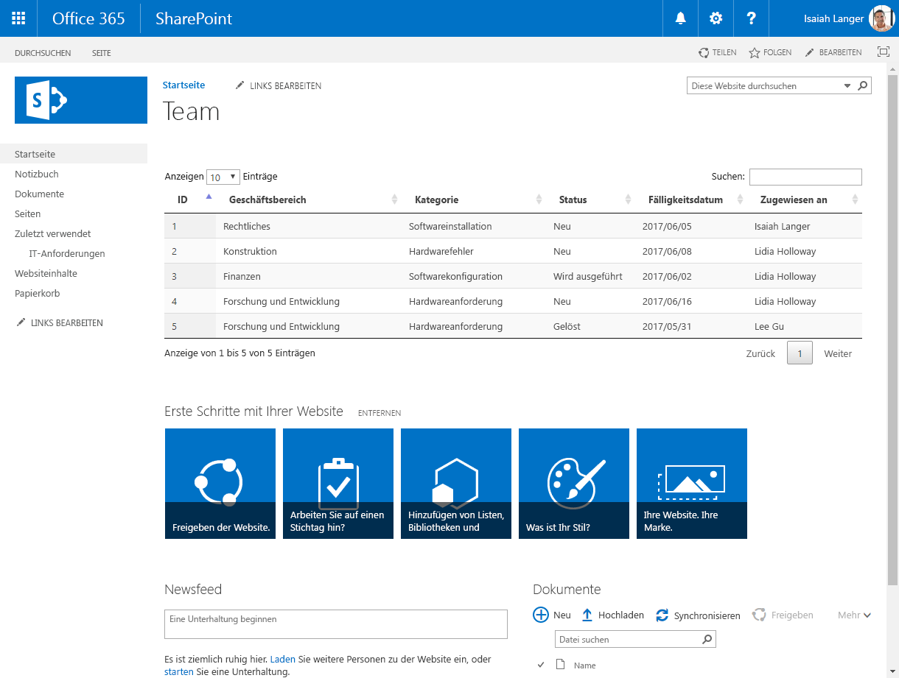
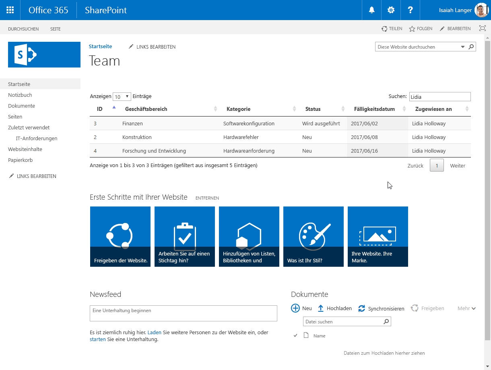
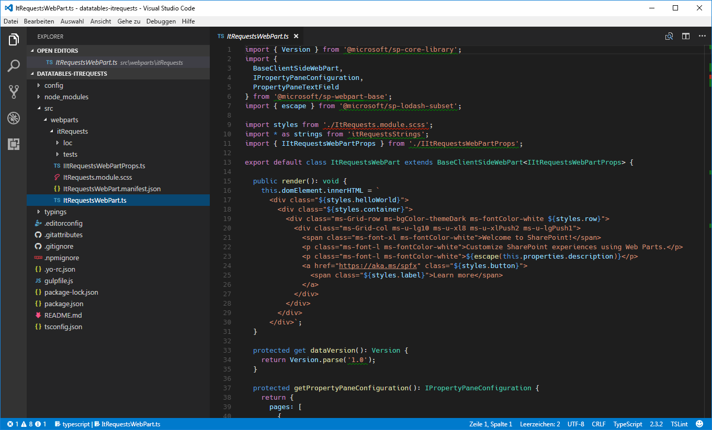
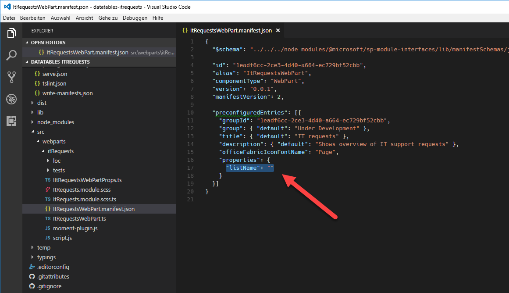
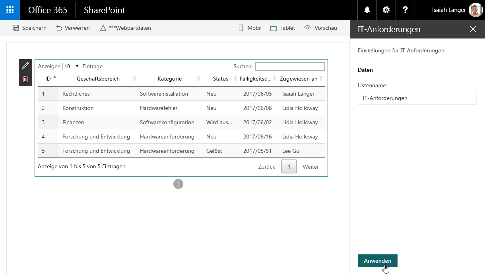

# <a name="migrate-jquery-and-datatables-solution-built-using-script-editor-web-part-to-sharepoint-framework"></a><span data-ttu-id="1097c-103">Migrieren von jQuery- und DataTables-Lösungen, die mit Script Editor-Webpart erstellt wurden, in SharePoint Framework</span><span class="sxs-lookup"><span data-stu-id="1097c-103">Migrate jQuery and DataTables solution built using Script Editor Web Part to SharePoint Framework</span></span>

<span data-ttu-id="1097c-104">Eines der häufig verwendeten jQuery-Plug-Ins ist [DataTables](https://datatables.net/).</span><span class="sxs-lookup"><span data-stu-id="1097c-104">One of the frequently used jQuery plug-ins is [DataTables](https://datatables.net/).</span></span> <span data-ttu-id="1097c-105">Mit Datentabellen können Sie ganz einfach leistungsstarke Datenübersichten mit Daten erstellen, die von SharePoint und externen APIs stammen.</span><span class="sxs-lookup"><span data-stu-id="1097c-105">With DataTables, you can easily build powerful data overviews of data coming from both SharePoint and external APIs.</span></span>

## <a name="list-of-it-requests-built-using-the-script-editor-web-part"></a><span data-ttu-id="1097c-106">Liste der IT-Anfragen, die mit dem Script Editor-Webpart erstellt wurde</span><span class="sxs-lookup"><span data-stu-id="1097c-106">List of IT requests built using the Script Editor Web Part</span></span>

<span data-ttu-id="1097c-107">Um das Verfahren der Migration einer SharePoint-Anpassung in das SharePoint-Framework mithilfe von DataTables zu veranschaulichen, verwenden Sie die folgende Lösung, die einen Überblick über die IT-Supportanfragen zeigt, die aus einer SharePoint-Liste abgerufen wurden.</span><span class="sxs-lookup"><span data-stu-id="1097c-107">To illustrate the process of migrating a SharePoint customization using DataTables to the SharePoint Framework you will use the following solution that shows an overview of IT support requests retrieved from a SharePoint list.</span></span>



<br/>

<span data-ttu-id="1097c-p102">Die Lösung wird anhand des standardmäßigen Script Editor-Webparts von SharePoint erstellt. Nachfolgend ist der in der Anpassung verwendete Code aufgeführt.</span><span class="sxs-lookup"><span data-stu-id="1097c-p102">The solution is built using the standard SharePoint Script Editor Web Part. Following is the code used by the customization.</span></span>

```html
<script src="https://code.jquery.com/jquery-1.12.4.js"></script>
<script src="https://cdn.datatables.net/1.10.15/js/jquery.dataTables.js"></script>
<script src="https://momentjs.com/downloads/moment.min.js"></script>
<link rel="stylesheet" type="text/css" href="https://cdn.datatables.net/1.10.15/css/jquery.dataTables.min.css" />
<table id="requests" class="display" cellspacing="0" width="100%">
    <thead>
        <tr>
            <th>ID</th>
            <th>Business unit</th>
            <th>Category</th>
            <th>Status</th>
            <th>Due date</th>
            <th>Assigned to</th>
        </tr>
    </thead>
</table>
<script>
// UMD
(function(factory) {
    "use strict";

    if (typeof define === 'function' && define.amd) {
        // AMD
        define(['jquery'], function ($) {
            return factory( $, window, document );
        });
    }
    else if (typeof exports === 'object') {
        // CommonJS
        module.exports = function (root, $) {
            if (!root) {
                root = window;
            }

            if (!$) {
                $ = typeof window !== 'undefined' ?
                    require('jquery') :
                    require('jquery')( root );
            }

            return factory($, root, root.document);
        };
    }
    else {
        // Browser
        factory(jQuery, window, document);
    }
}
(function($, window, document) {
    $.fn.dataTable.render.moment = function (from, to, locale) {
        // Argument shifting
        if (arguments.length === 1) {
            locale = 'en';
            to = from;
            from = 'YYYY-MM-DD';
        }
        else if (arguments.length === 2) {
            locale = 'en';
        }

        return function (d, type, row) {
            var m = window.moment(d, from, locale, true);

            // Order and type get a number value from Moment, everything else
            // sees the rendered value
            return m.format(type === 'sort' || type === 'type' ? 'x' : to);
        };
    };
}));
</script>
<script>
$(document).ready(function() {
    $('#requests').DataTable({
        'ajax': {
        'url': "../_api/web/lists/getbytitle('IT Requests')/items?$select=ID,BusinessUnit,Category,Status,DueDate,AssignedTo/Title&$expand=AssignedTo/Title",
        'headers': { 'Accept': 'application/json;odata=nometadata' },
        'dataSrc': function(data) {
            return data.value.map(function(item) {
                return [
                    item.ID,
                    item.BusinessUnit,
                    item.Category,
                    item.Status,
                    new Date(item.DueDate),
                    item.AssignedTo.Title
                ];
            });
        }
    },
    columnDefs: [{
        targets: 4,
        render: $.fn.dataTable.render.moment('YYYY/MM/DD')
    }]
    });
});
</script>
```

<span data-ttu-id="1097c-111">Die Anpassung lädt zuerst die verwendeten Bibliotheken: jQuery, DataTables und Moment.js (Zeilen 1-4).</span><span class="sxs-lookup"><span data-stu-id="1097c-111">First, the customization loads the libraries it uses: jQuery, DataTables, and Moment.js (lines 1-4).</span></span> 

<span data-ttu-id="1097c-112">Als Nächstes wird die Struktur der Tabelle angegeben, die zum Darstellen der Daten verwendet wird (Zeilen 5-16).</span><span class="sxs-lookup"><span data-stu-id="1097c-112">Next, it specifies the structure of the table used to present the data (lines 5-16).</span></span> 

<span data-ttu-id="1097c-113">Nach dem Erstellen der Tabelle, wird Moment.js in einem DataTables-Plug-In umschlossen, sodass Datumsangaben, die in der Tabelle angezeigt werden, formatiert werden können (erster Skriptblock in den Zeilen 17-70).</span><span class="sxs-lookup"><span data-stu-id="1097c-113">After creating the table, it wraps Moment.js into a DataTables plug-in so that dates displayed in the table can be formatted (first script block on lines 17-70).</span></span> 

<span data-ttu-id="1097c-114">Schließlich verwendet die Anpassung DataTables zum Laden und Darstellen der Liste von IT-Supportanfragen.</span><span class="sxs-lookup"><span data-stu-id="1097c-114">Finally, the customization uses DataTables to load and present the list of IT support requests.</span></span> <span data-ttu-id="1097c-115">Die Daten werden mithilfe von AJAX aus einer SharePoint-Liste (Zeilen 71-96) geladen.</span><span class="sxs-lookup"><span data-stu-id="1097c-115">The data is loaded by using AJAX from a SharePoint list (lines 71-96).</span></span>

<span data-ttu-id="1097c-116">Durch die Verwendung von DataTables erhalten Endbenutzer eine leistungsfähige Lösung, mit der sie die Ergebnisse auf einfache Weise filtern, sortieren und darin blättern können, ohne dass weitere Entwicklungsschritte erforderlich sind.</span><span class="sxs-lookup"><span data-stu-id="1097c-116">Thanks to using DataTables, end-users get a powerful solution where they can easily filter, sort and page through the results without any additional development effort.</span></span>



## <a name="migrate-the-it-requests-overview-solution-from-the-script-editor-web-part-to-the-sharepoint-framework"></a><span data-ttu-id="1097c-118">Migrieren der Übersichtslösung für IT-Anfragen vom Script Editor-Webpart in das SharePoint-Framework</span><span class="sxs-lookup"><span data-stu-id="1097c-118">Migrate the IT requests overview solution from the Script Editor Web Part to the SharePoint Framework</span></span>

> [!NOTE] 
> <span data-ttu-id="1097c-119">Bevor Sie die Schritte in diesem Artikel durchführen, müssen Sie [eine Entwicklungsumgebung einrichten](../../set-up-your-development-environment.md), in der Sie SharePoint-Framework-Lösungen erstellen können.</span><span class="sxs-lookup"><span data-stu-id="1097c-119">Before following the steps in this article, be sure to [set up your development environment](../../set-up-your-development-environment.md) for building SharePoint Framework solutions.</span></span>

<span data-ttu-id="1097c-p104">Das Umwandeln dieser Anpassung in das SharePoint-Framework bietet eine Reihe von Vorteilen, wie z. B. eine benutzerfreundlichere Konfiguration und die zentrale Verwaltung der Lösung. Es folgt eine Schritt-für-Schritt-Beschreibung dazu, wie Sie die Lösung in das SharePoint-Framework migrieren können. Sie migrieren die Lösung zunächst in das SharePoint-Framework, wobei so wenige Änderungen am ursprünglichen Code wie möglich vorgenommen werden. Später transformieren Sie den Code der Lösung in TypeScript, um die Sicherheitsfeatures nutzen zu können, die es während der Entwicklung bietet.</span><span class="sxs-lookup"><span data-stu-id="1097c-p104">Transforming this customization to the SharePoint Framework offers a number of benefits such as more user-friendly configuration and centralized management of the solution. Following is a step-by-step description of how you would migrate the solution to the SharePoint Framework. First, you will migrate the solution to the SharePoint Framework with as few changes to the original code as possible. Later, you will transform the solution's code to TypeScript to benefit of its development-time type safety features.</span></span>

> [!NOTE] 
> <span data-ttu-id="1097c-124">Der Quellcode des Projekts in den verschiedenen Phasen der Migration steht unter [Lernprogramm: Migrieren von jQuery- und DataTables-Lösungen, die mit Script Editor-Webpart erstellt wurden, in SharePoint Framework](https://github.com/SharePoint/sp-dev-fx-webparts/tree/master/tutorials/tutorial-migrate-datatables) zur Verfügung.</span><span class="sxs-lookup"><span data-stu-id="1097c-124">The source code of the project in the different stages of migration is available at [Tutorial: Migrate jQuery and DataTables solution built using Script Editor Web Part to SharePoint Framework](https://github.com/SharePoint/sp-dev-fx-webparts/tree/master/tutorials/tutorial-migrate-datatables).</span></span>

### <a name="create-new-sharepoint-framework-project"></a><span data-ttu-id="1097c-125">Erstellen eines neuen SharePoint-Framework-Projekts</span><span class="sxs-lookup"><span data-stu-id="1097c-125">Create new SharePoint Framework project</span></span>

1. <span data-ttu-id="1097c-126">Erstellen Sie zunächst einen neuen Ordner für Ihr Projekt:</span><span class="sxs-lookup"><span data-stu-id="1097c-126">Start by creating a new folder for your project</span></span>

    ```sh
    md datatables-itrequests
    ```

2. <span data-ttu-id="1097c-127">Navigieren Sie zum Projektordner:</span><span class="sxs-lookup"><span data-stu-id="1097c-127">Navigate to the project folder:</span></span>

    ```sh
    cd datatables-itrequests
    ```

3. <span data-ttu-id="1097c-128">Führen Sie im Projektordner den SharePoint Framework-Yeoman-Generator aus, um ein Gerüst für ein neues SharePoint Framework-Projekt zu erstellen:</span><span class="sxs-lookup"><span data-stu-id="1097c-128">In the project folder, run the SharePoint Framework Yeoman generator to scaffold a new SharePoint Framework project:</span></span>

    ```sh
    yo @microsoft/sharepoint
    ```

4. <span data-ttu-id="1097c-129">Es werden mehrere Eingabeaufforderungen angezeigt. Definieren Sie die Werte jeweils wie folgt:</span><span class="sxs-lookup"><span data-stu-id="1097c-129">When prompted, define values as follows:</span></span>

    - <span data-ttu-id="1097c-130">**datatables-itrequests** als Name der Lösung</span><span class="sxs-lookup"><span data-stu-id="1097c-130">**datatables-itrequests** as your solution name</span></span>
    - <span data-ttu-id="1097c-131">**Aktuellen Ordner verwenden** als Speicherort für die Dateien</span><span class="sxs-lookup"><span data-stu-id="1097c-131">**Use the current folder** for the location to place the files</span></span>
    - <span data-ttu-id="1097c-132">**No javaScript web framework** als Eintrittspunkt für die Webpart-Erstellung</span><span class="sxs-lookup"><span data-stu-id="1097c-132">**No javaScript web framework** as the starting point to build the web part</span></span>
    - <span data-ttu-id="1097c-133">**IT-Anfragen** als Name des Webparts</span><span class="sxs-lookup"><span data-stu-id="1097c-133">**IT requests** as your web part name</span></span>
    - <span data-ttu-id="1097c-134">**Übersicht über die IT-Supportanfragen** als Beschreibung für das Webpart</span><span class="sxs-lookup"><span data-stu-id="1097c-134">**Shows overview of IT support requests** as your web part description</span></span>

    

5. <span data-ttu-id="1097c-136">Sobald das Gerüst abgeschlossen ist, sperren Sie die Version der Projektabhängigkeiten, indem Sie den folgenden Befehl ausführen:</span><span class="sxs-lookup"><span data-stu-id="1097c-136">After the scaffolding completes, lock down the version of the project dependencies by running the following command:</span></span>

    ```sh
    npm shrinkwrap
    ```

6. <span data-ttu-id="1097c-137">Öffnen Sie den Projektordner in einem Code-Editor.</span><span class="sxs-lookup"><span data-stu-id="1097c-137">Next, open your project folder in your code editor.</span></span> <span data-ttu-id="1097c-138">In diesem Tutorial verwenden Sie Visual Studio Code.</span><span class="sxs-lookup"><span data-stu-id="1097c-138">In this tutorial, you will use Visual Studio Code.</span></span>

    

### <a name="load-javascript-libraries"></a><span data-ttu-id="1097c-140">Laden von JavaScript-Bibliotheken</span><span class="sxs-lookup"><span data-stu-id="1097c-140">Load JavaScript libraries</span></span>

<span data-ttu-id="1097c-p106">Ähnlich wie bei der ursprünglichen Lösung, die mit dem Skript-Editor-Webpart erstellt wurde, müssen Sie zunächst die JavaScript-Bibliotheken laden, die von der Lösung benötigt werden. In SharePoint-Framework umfasst dies in der Regel zwei Schritte: die Angabe der URL, über die die Bibliothek geladen werden soll, und ein Verweis auf die Bibliothek im Code.</span><span class="sxs-lookup"><span data-stu-id="1097c-p106">Similarly to the original solution built using the Script Editor Web Part, first you need to load the JavaScript libraries required by the solution. In SharePoint Framework this usually consists of two steps: specifying the URL from which the library should be loaded, and referencing the library in the code.</span></span>

1. <span data-ttu-id="1097c-p107">Geben Sie die URLs an, über die die Bibliotheken geladen werden sollen. Öffnen Sie im Code-Editor die Datei **./config/config.json**, und ändern Sie den Abschnitt **externals** wie folgt:</span><span class="sxs-lookup"><span data-stu-id="1097c-p107">Start, with specifying the URLs from which libraries should be loaded. In the code editor, open the **./config/config.json** file and change the **externals** section to:</span></span>

    ```json
    {
    "externals": {
        "jquery": "https://code.jquery.com/jquery-1.12.4.min.js",
        "datatables.net": "https://cdn.datatables.net/1.10.15/js/jquery.dataTables.min.js",
        "moment": "https://momentjs.com/downloads/moment.min.js"
    }
    }
    ```

2. <span data-ttu-id="1097c-145">Öffnen Sie die Datei **./src/webparts/itRequests/ItRequestsWebPart.ts**, und fügen Sie nach der letzten **import**-Anweisung Folgendes hinzu:</span><span class="sxs-lookup"><span data-stu-id="1097c-145">Next, open the **./src/webparts/itRequests/ItRequestsWebPart.ts** file, and after the last **import** statement add:</span></span>

    ```ts
    import 'jquery';
    import 'datatables.net';
    import 'moment';
    ```

### <a name="define-data-table"></a><span data-ttu-id="1097c-146">Definieren einer Datentabelle</span><span class="sxs-lookup"><span data-stu-id="1097c-146">Define data table</span></span>

<span data-ttu-id="1097c-147">Wie bei der ursprünglichen Lösung besteht der nächste Schritt darin, die Struktur der Tabelle zu definieren, die zum Anzeigen der Daten verwendet wird.</span><span class="sxs-lookup"><span data-stu-id="1097c-147">Just as in the original solution, the next step is to define the structure of the table used to display the data. In the code editor, open the ./src/webparts/itRequests/ItRequestsWebPart.ts file and change the render method to:</span></span> 

<span data-ttu-id="1097c-148">Öffnen Sie im Code-Editor die Datei **./src/webparts/itRequests/ItRequestsWebPart.ts**, und ändern Sie die **render**-Methode in:</span><span class="sxs-lookup"><span data-stu-id="1097c-148">In the code editor, open the **./src/webparts/itRequests/ItRequestsWebPart.ts** file and change the **render** method to:</span></span>

```ts
    export default class ItRequestsWebPart extends BaseClientSideWebPart<IItRequestsWebPartProps> {
    public render(): void {
        this.domElement.innerHTML = `
        <link rel="stylesheet" type="text/css" href="https://cdn.datatables.net/1.10.15/css/jquery.dataTables.min.css" />
        <table id="requests" class="display ${styles.helloWorld}" cellspacing="0" width="100%">
            <thead>
                <tr>
                    <th>ID</th>
                    <th>Business unit</th>
                    <th>Category</th>
                    <th>Status</th>
                    <th>Due date</th>
                    <th>Assigned to</th>
                </tr>
            </thead>
        </table>`;
    }
    // ...
    }
```

### <a name="register-momentjs-plugin-for-datatables"></a><span data-ttu-id="1097c-149">Registrieren des Moment.js-Plug-Ins für DataTables</span><span class="sxs-lookup"><span data-stu-id="1097c-149">Register Moment.js plugin for DataTables</span></span>

<span data-ttu-id="1097c-150">Der nächste Schritt besteht darin, das Moment.js-Plug-In für DataTables zu definieren, damit Datumsangaben in der Tabelle formatiert werden können.</span><span class="sxs-lookup"><span data-stu-id="1097c-150">The next step is to define the Moment.js plugin for DataTables so that dates in the table can be formatted. In the ./src/webparts/itRequests folder, create a new file named moment-plugin.js and paste the following code:</span></span> 

1. <span data-ttu-id="1097c-151">Erstellen Sie im Ordner **./src/webparts/itRequests** eine neue Datei mit dem Namen **moment-plugin.js**, und fügen Sie den folgenden Code in die Datei ein:</span><span class="sxs-lookup"><span data-stu-id="1097c-151">The next step is to define the Moment.js plugin for DataTables so that dates in the table can be formatted. In the **./src/webparts/itRequests** folder, create a new file named **moment-plugin.js** and paste the following code:</span></span>

    ```js
    // UMD
    (function (factory) {
        "use strict";

        if (typeof define === 'function' && define.amd) {
            // AMD
            define(['jquery'], function ($) {
                return factory($, window, document);
            });
        }
        else if (typeof exports === 'object') {
            // CommonJS
            module.exports = function (root, $) {
                if (!root) {
                    root = window;
                }

                if (!$) {
                    $ = typeof window !== 'undefined' ?
                        require('jquery') :
                        require('jquery')(root);
                }

                return factory($, root, root.document);
            };
        }
        else {
            // Browser
            factory(jQuery, window, document);
        }
    }

    (function ($, window, document) {
        $.fn.dataTable.render.moment = function (from, to, locale) {
            // Argument shifting
            if (arguments.length === 1) {
                locale = 'en';
                to = from;
                from = 'YYYY-MM-DD';
            }
            else if (arguments.length === 2) {
                locale = 'en';
            }

            return function (d, type, row) {
                var moment = require('moment');
                var m = moment(d, from, locale, true);

                // Order and type get a number value from Moment, everything else
                // sees the rendered value
                return m.format(type === 'sort' || type === 'type' ? 'x' : to);
            };
        };
    }));
    ```

2. <span data-ttu-id="1097c-152">Damit das Webpart das Plug-In lädt, muss es auf die neu erstellte Datei **plugin.js-Moment** verweisen.</span><span class="sxs-lookup"><span data-stu-id="1097c-152">For the web part to load the plugin, it has to reference the newly created **moment-plugin.js** file. In the code editor, open the ./src/webparts/itRequests/ItRequestsWebPart.ts file and after the last import statement add:</span></span> <span data-ttu-id="1097c-153">Öffnen Sie im Code-Editor die Datei **./src/webparts/itRequests/ItRequestsWebPart.ts**, und fügen Sie nach der letzten **import**-Anweisung Folgendes hinzu:</span><span class="sxs-lookup"><span data-stu-id="1097c-153">For the web part to load the plugin, it has to reference the newly created moment-plugin.js file. In the code editor, open the **./src/webparts/itRequests/ItRequestsWebPart.ts** file and after the last **import** statement add:</span></span>

    ```ts
    import './moment-plugin';
    ```

> [!NOTE] 
> <span data-ttu-id="1097c-154">Sie müssen nicht die Erweiterung **js** einschließen, wenn Sie auf andere Dateien verweisen.</span><span class="sxs-lookup"><span data-stu-id="1097c-154">You don't need to include the **.js** extension when referencing other files. SharePoint Framework will automatically resolve the extension for you.</span></span> <span data-ttu-id="1097c-155">SharePoint Framework löst die Erweiterung automatisch für Sie.</span><span class="sxs-lookup"><span data-stu-id="1097c-155">SharePoint Framework automatically resolves the extension for you.</span></span>

### <a name="initiate-datatables-and-load-data"></a><span data-ttu-id="1097c-156">Initiieren von DataTables und Laden der Daten</span><span class="sxs-lookup"><span data-stu-id="1097c-156">Initiate DataTables and load data</span></span>

<span data-ttu-id="1097c-157">Der letzte Schritt besteht darin, den Code einzuschließen, der die Datentabelle initiiert und die Daten aus SharePoint lädt.</span><span class="sxs-lookup"><span data-stu-id="1097c-157">The last step is to include the code that initiates the data table and loads the data from SharePoint. In the ./src/webparts/itRequests folder, create a new file named script.js and paste the following code:</span></span> 

1. <span data-ttu-id="1097c-158">Erstellen Sie im Ordner **./src/webparts/itRequests** eine neue Datei mit dem Namen **script.js**, und fügen Sie den folgenden Code in die Datei ein:</span><span class="sxs-lookup"><span data-stu-id="1097c-158">In the **./src/webparts/recentDocuments** folder, create a new file named **IDocument.ts** and paste the following code:</span></span>

    ```js
    $(document).ready(function () {
        $('#requests').DataTable({
            'ajax': {
                'url': "../../_api/web/lists/getbytitle('IT Requests')/items?$select=ID,BusinessUnit,Category,Status,DueDate,AssignedTo/Title&$expand=AssignedTo/Title",
                'headers': { 'Accept': 'application/json;odata=nometadata' },
                'dataSrc': function (data) {
                    return data.value.map(function (item) {
                        return [
                            item.ID,
                            item.BusinessUnit,
                            item.Category,
                            item.Status,
                            new Date(item.DueDate),
                            item.AssignedTo.Title
                        ];
                    });
                }
            },
            columnDefs: [{
                targets: 4,
                render: $.fn.dataTable.render.moment('YYYY/MM/DD')
            }]
        });
    });
    ```

2. <span data-ttu-id="1097c-159">Um auf diese Datei im Webpart zu verweisen, öffnen Sie im Code-Editor die Datei **./src/webparts/itRequests/ItRequestsWebPart.ts**, und ändern Sie die **render**-Methode in:</span><span class="sxs-lookup"><span data-stu-id="1097c-159">In order to reference this file in the web part, in the code editor, open the **./src/webparts/itRequests/ItRequestsWebPart.ts** file and change the **render** method to:</span></span>

    ```ts
    export default class ItRequestsWebPart extends BaseClientSideWebPart<IItRequestsWebPartProps> {
    public render(): void {
        this.domElement.innerHTML = `
        <link rel="stylesheet" type="text/css" href="https://cdn.datatables.net/1.10.15/css/jquery.dataTables.min.css" />
        <table id="requests" class="display ${styles.helloWorld}" cellspacing="0" width="100%">
            <thead>
                <tr>
                    <th>ID</th>
                    <th>Business unit</th>
                    <th>Category</th>
                    <th>Status</th>
                    <th>Due date</th>
                    <th>Assigned to</th>
                </tr>
            </thead>
        </table>`;

        require('./script');
    }
    // ...
    }
    ```

3. <span data-ttu-id="1097c-160">Überprüfen Sie, ob das Webpart wie erwartet funktioniert, indem Sie in der Befehlszeile Folgendes ausführen:</span><span class="sxs-lookup"><span data-stu-id="1097c-160">Verify, that the web part is working as expected by in the command line executing:</span></span>

    ```sh
    gulp serve --nobrowser
    ```

<span data-ttu-id="1097c-161">Da das Webpart die Daten von SharePoint lädt, müssen Sie das Webpart mithilfe der gehosteten SharePoint Framework Workbench testen.</span><span class="sxs-lookup"><span data-stu-id="1097c-161">Because the web part loads its data from SharePoint, you have to test the web part by using the hosted SharePoint Framework Workbench.</span></span> <span data-ttu-id="1097c-162">Navigieren Sie zu `https://yourtenant.sharepoint.com/_layouts/workbench.aspx`, und fügen Sie das Webpart zum Zeichenbereich hinzu.</span><span class="sxs-lookup"><span data-stu-id="1097c-162">Navigate to `https://yourtenant.sharepoint.com/_layouts/workbench.aspx` and add the web part to the canvas.</span></span> <span data-ttu-id="1097c-163">Die IT-Anfragen sollten nun mithilfe des DataTables-Plug-Ins „jQuery“ angezeigt werden.</span><span class="sxs-lookup"><span data-stu-id="1097c-163">You should now see the IT requests displayed by using the DataTables jQuery plug-in.</span></span>


## <a name="add-support-for-configuring-the-web-part-through-web-part-properties"></a><span data-ttu-id="1097c-165">Hinzufügen von Unterstützung zum Konfigurieren des Webparts über Webparteigenschaften</span><span class="sxs-lookup"><span data-stu-id="1097c-165">Add support for configuring the web part through web part properties</span></span>

<span data-ttu-id="1097c-166">In den vorherigen Schritten haben Sie die Lösungen für IT-Anfragen vom Script Editor-Webpart in das SharePoint-Framework migriert.</span><span class="sxs-lookup"><span data-stu-id="1097c-166">In the previous steps, you migrated the IT requests solutions from the Script Editor Web Part to the SharePoint Framework.</span></span> <span data-ttu-id="1097c-167">Die Lösung arbeitet zwar bereits wie erwartet, nutzt aber keine der Vorteile von SharePoint Framework.</span><span class="sxs-lookup"><span data-stu-id="1097c-167">While the solution already works as expected, it doesn't use any of the SharePoint Framework benefits.</span></span> <span data-ttu-id="1097c-168">Der Name der Liste, aus der IT-Fragen geladen werden, ist im Code enthalten; bei dem Code selbst handelt es sich um reines JavaScript, das schwieriger umzugestalten ist als TypeScript.</span><span class="sxs-lookup"><span data-stu-id="1097c-168">The name of the list from which IT requests are loaded is included in the code, and the code itself is plain JavaScript, which is harder to refactor than TypeScript.</span></span> 

<span data-ttu-id="1097c-169">Die folgenden Schritte veranschaulichen, wie Sie die vorhanden Lösung erweitern können, damit Benutzer den Namen der Liste angeben können, aus der die Daten geladen werden sollen.</span><span class="sxs-lookup"><span data-stu-id="1097c-169">The following steps illustrate how to extend the existing solution to allow users to specify the name of the list to load the data from.</span></span> <span data-ttu-id="1097c-170">Später wandeln Sie den Code in TypeScript um, um von den Typsicherheitsfeatures zu profitieren.</span><span class="sxs-lookup"><span data-stu-id="1097c-170">Later, you transform the code to TypeScript to benefit from its type safety features.</span></span>

### <a name="define-web-part-property-for-storing-the-name-of-the-list"></a><span data-ttu-id="1097c-171">Definieren der Webparteigenschaft zum Speichern des Listennamens</span><span class="sxs-lookup"><span data-stu-id="1097c-171">Define web part property for storing the name of the list</span></span>

1. <span data-ttu-id="1097c-172">Definieren Sie eine Webparteigenschaft, um den Namen der Liste zu speichern, aus der IT-Anfragen geladen werden sollten.</span><span class="sxs-lookup"><span data-stu-id="1097c-172">Define a web part property to store the name of the list from which IT requests should be loaded.</span></span> <span data-ttu-id="1097c-173">Öffnen Sie im Code-Editor die Datei  **./src/webparts/itRequests/ItRequestsWebPart.manifest.json**, und benennen Sie die Standardeinstellung **description** in **listName** um, und löschen Sie ihren Wert.</span><span class="sxs-lookup"><span data-stu-id="1097c-173">Start with defining a web part property to store the name of the list from which IT requests should be loaded. In the code editor, open the **./src/webparts/itRequests/ItRequestsWebPart.manifest.json** file and rename the default **description** property to **listName** and clear its value.</span></span>

    

2. <span data-ttu-id="1097c-175">Aktualisieren Sie die Webparteigenschaften, um die Änderungen im Manifest widerzuspiegeln.</span><span class="sxs-lookup"><span data-stu-id="1097c-175">Update the web part properties interface to reflect the changes in the manifest.</span></span> <span data-ttu-id="1097c-176">Öffnen Sie im Code-Editor die Datei **./src/webparts/itRequests/IItRequestsWebPartProps.ts**, und ändern Sie den Inhalt in:</span><span class="sxs-lookup"><span data-stu-id="1097c-176">In the code editor open the **./src/webparts/toDo/app/DataService.ts** file and change its contents to:</span></span>

    ```ts
    export interface IItRequestsWebPartProps {
    listName: string;
    }
    ```

3. <span data-ttu-id="1097c-177">Aktualisieren die Anzeigebezeichnung für die **listName**-Eigenschaft.</span><span class="sxs-lookup"><span data-stu-id="1097c-177">Update the display labels for the **listName** property.</span></span> <span data-ttu-id="1097c-178">Öffnen Sie als Nächstes die Datei **./src/webparts/itRequests/loc/mystrings.d.ts**, und ändern Sie den Inhalt in:</span><span class="sxs-lookup"><span data-stu-id="1097c-178">Then, update the display labels for the listName property. Open the **./src/webparts/itRequests/loc/mystrings.d.ts** file and change its contents to:</span></span>

    ```ts
    declare interface IItRequestsStrings {
    PropertyPaneDescription: string;
    BasicGroupName: string;
    ListNameFieldLabel: string;
    }

    declare module 'itRequestsStrings' {
    const strings: IItRequestsStrings;
    export = strings;
    }
    ```

4. <span data-ttu-id="1097c-179">Öffnen Sie die Datei **./src/webparts/itRequests/loc/en-us.js**, und ändern Sie den Inhalt in:</span><span class="sxs-lookup"><span data-stu-id="1097c-179">Next, open the **./src/webparts/itRequests/loc/en-us.js** file and change its contents to:</span></span>

    ```js
    define([], function() {
    return {
        "PropertyPaneDescription": "IT Requests settings",
        "BasicGroupName": "Data",
        "ListNameFieldLabel": "List name"
    }
    });
    ```

5. <span data-ttu-id="1097c-180">Aktualisieren Sie das Webpart so, dass die neu definierte Eigenschaft verwendet wird.</span><span class="sxs-lookup"><span data-stu-id="1097c-180">Update the web part to use the newly defined property.</span></span> <span data-ttu-id="1097c-181">Öffnen Sie im Code-Editor die Datei **./src/webparts/itRequests/ItRequestsWebPart.ts**, und ändern Sie die **getPropertyPaneConfiguration**-Methode in:</span><span class="sxs-lookup"><span data-stu-id="1097c-181">In the code editor, open the **./src/webparts/itRequests/ItRequestsWebPart.ts** file and change the **render** method to:</span></span>

    ```ts
    export default class ItRequestsWebPart extends BaseClientSideWebPart<IItRequestsWebPartProps> {
    // ...
    protected getPropertyPaneConfiguration(): IPropertyPaneConfiguration {
        return {
        pages: [
            {
            header: {
                description: strings.PropertyPaneDescription
            },
            groups: [
                {
                groupName: strings.BasicGroupName,
                groupFields: [
                    PropertyPaneTextField('listName', {
                    label: strings.ListNameFieldLabel
                    })
                ]
                }
            ]
            }
        ]
        };
    }

    protected get disableReactivePropertyChanges(): boolean {
        return true;
    }
    }
    ```

<span data-ttu-id="1097c-182">Um zu verhindern, dass das Webpart neu geladen wird, wenn Benutzer den Namen der Liste eingeben, haben Sie das Webpart darüber hinaus so konfiguriert, dass es den nicht reaktiven Eigenschaftenbereich verwendet, indem Sie die **disableReactivePropertyChanges**-Methode hinzugefügt und den Rückgabewert auf **true** festgelegt haben.</span><span class="sxs-lookup"><span data-stu-id="1097c-182">To prevent the web part from reloading as users type the name of the list, you've also configured the web part to use the non-reactive property pane by adding the **disableReactivePropertyChanges** method and settings its return value to **true**.</span></span>

### <a name="use-the-configured-name-of-the-list-to-load-the-data-from"></a><span data-ttu-id="1097c-183">Verwenden des konfigurierten Namens der Liste, aus der Daten geladen werden sollen</span><span class="sxs-lookup"><span data-stu-id="1097c-183">Use the configured name of the list to load the data from</span></span>

<span data-ttu-id="1097c-184">Zunächst wurde der Name der Liste, aus der die Daten geladen werden sollen, in die REST-Abfrage eingebettet.</span><span class="sxs-lookup"><span data-stu-id="1097c-184">Initially, the name of the list from which the data should be loaded was embedded in the REST query.</span></span> <span data-ttu-id="1097c-185">Da Benutzer diesen Namen nun konfigurieren können, sollte der konfigurierte Wert in die REST-Abfrage injiziert werden, bevor die Daten geladen werden.</span><span class="sxs-lookup"><span data-stu-id="1097c-185">Now that users can configure this name, the configured value should be injected into the REST query before loading the data.</span></span> <span data-ttu-id="1097c-186">Die einfachste Möglichkeit hierzu besteht darin, den Inhalt der **script.js**-Datei in die Haupt-Webpartdatei zu verschieben.</span><span class="sxs-lookup"><span data-stu-id="1097c-186">The easiest way to do that is by moving the contents of the **script.js** file to the main web part file.</span></span>

1. <span data-ttu-id="1097c-187">Öffnen Sie im Code-Editor die Datei **./src/webparts/itRequests/ItRequestsWebPart.ts**, und ändern Sie die **render**-Methode in:</span><span class="sxs-lookup"><span data-stu-id="1097c-187">In the code editor, open the **./src/webparts/itRequests/ItRequestsWebPart.ts** file and change the **render** method to:</span></span>

    ```ts
    var $: any = (window as any).$;

    export default class ItRequestsWebPart extends BaseClientSideWebPart<IItRequestsWebPartProps> {
    public render(): void {
        this.domElement.innerHTML = `
        <link rel="stylesheet" type="text/css" href="https://cdn.datatables.net/1.10.15/css/jquery.dataTables.min.css" />
        <table class="display ${styles.helloWorld}" cellspacing="0" width="100%">
            <thead>
                <tr>
                    <th>ID</th>
                    <th>Business unit</th>
                    <th>Category</th>
                    <th>Status</th>
                    <th>Due date</th>
                    <th>Assigned to</th>
                </tr>
            </thead>
        </table>`;

        $(document).ready(() => {
        $('table', this.domElement).DataTable({
            'ajax': {
            'url': `../../_api/web/lists/getbytitle('${escape(this.properties.listName)}')/items?$select=ID,BusinessUnit,Category,Status,DueDate,AssignedTo/Title&$expand=AssignedTo/Title`,
            'headers': { 'Accept': 'application/json;odata=nometadata' },
            'dataSrc': function (data) {
                return data.value.map(function (item) {
                return [
                    item.ID,
                    item.BusinessUnit,
                    item.Category,
                    item.Status,
                    new Date(item.DueDate),
                    item.AssignedTo.Title
                ];
                });
            }
            },
            columnDefs: [{
            targets: 4,
            render: $.fn.dataTable.render.moment('YYYY/MM/DD')
            }]
        });
        });
    }

    // ...
    }
    ```

2. <span data-ttu-id="1097c-188">Statt auf den Code über die **script.js** Datei, des gesamten Inhalts sind ein Bestandteil der des Webparts **Rendern** Methode.</span><span class="sxs-lookup"><span data-stu-id="1097c-188">Instead of referencing the code from the **script.js** file, all of its contents are a part of the web part's **render** method.</span></span> <span data-ttu-id="1097c-189">In der REST-Abfrage in Zeile 40 können Sie nun den festen Namen der Liste durch den Wert der **listName**-Eigenschaft ersetzen, die den Namen der Liste wie vom Benutzer konfiguriert enthält.</span><span class="sxs-lookup"><span data-stu-id="1097c-189">Instead of referencing the code from the script.js file, all of its contents are a part of the web part's render method. In the REST query, in line 40, you can now replace the fixed name of the list with the value of the **listName** property which holds the name of the list as configured by the user. Before using the value, it's being escaped using the lodash's escape function to disallow script injection.</span></span> <span data-ttu-id="1097c-190">Bevor Sie den Wert verwenden, wird dieser mithilfe der **escape**-Funktion mit Escapezeichen versehen, um eine Skripteinschleusung zu verhindern.</span><span class="sxs-lookup"><span data-stu-id="1097c-190">Before using the value, it's being escaped by using the lodash's **escape** function to disallow script injection.</span></span>

    <span data-ttu-id="1097c-191">Der Großteil des Codes wird zu diesem Zeitpunkt immer noch mithilfe von reinem JavaScript geschrieben.</span><span class="sxs-lookup"><span data-stu-id="1097c-191">At this point, the bulk of the code is still written using plain JavaScript.</span></span> <span data-ttu-id="1097c-192">Um Probleme mit der **$** jQ uery-Variablen zu vermeiden, mussten Sie diese in Zeile 18 als Typ **any** definieren.</span><span class="sxs-lookup"><span data-stu-id="1097c-192">To avoid build issues with the **$** jQuery variable, you had to define it as **any** type in line 18.</span></span> <span data-ttu-id="1097c-193">Später ersetzen Sie diese beim Umwandeln des Codes in TypeScript durch eine echte Typdefinition.</span><span class="sxs-lookup"><span data-stu-id="1097c-193">Later, when transforming the code to TypeScript, you replace it with a proper type definition.</span></span>

    <span data-ttu-id="1097c-194">Da Sie den Inhalt der Datei **script.js** gerade in die Haupt-Webpartdatei verschoben haben, ist **script.js** nicht mehr erforderlich, und Sie können die Datei aus dem Projekt löschen.</span><span class="sxs-lookup"><span data-stu-id="1097c-194">As you have just moved the contents of the **script.js** file into the main web part file, the **script.js** is no longer necessary and you can delete it from the project.</span></span>

3. <span data-ttu-id="1097c-195">Um zu überprüfen, ob das Webpart wie erwartet funktioniert, führen Sie Folgendes in der Befehlszeile aus:</span><span class="sxs-lookup"><span data-stu-id="1097c-195">To verify that the web part is working as expected, run in the command line:</span></span>

    ```sh
    gulp serve --nobrowser
    ```

4. <span data-ttu-id="1097c-196">Navigieren Sie zu der gehosteten Workbench, und fügen Sie das Webpart zum Zeichenbereich hinzu.</span><span class="sxs-lookup"><span data-stu-id="1097c-196">Navigate to the hosted Workbench and add the web part to the canvas.</span></span> <span data-ttu-id="1097c-197">Öffnen Sie den Webpart-Eigenschaftenbereich, geben Sie den Namen der Liste mit IT-Anfragen an, und wählen Sie die Schaltfläche  **Übernehmen** aus, um die Änderungen zu bestätigen.</span><span class="sxs-lookup"><span data-stu-id="1097c-197">Navigate to the hosted workbench and add the web part to the canvas. Open the web part property pane, specify the name of the list with IT requests and click the **Apply** button to confirm the changes. You should now see IT requests displayed in the web part.</span></span> 

    <span data-ttu-id="1097c-198">Jetzt sollten die IT-Anfragen im Webpart angezeigt werden.</span><span class="sxs-lookup"><span data-stu-id="1097c-198">You should now see IT requests displayed in the web part.</span></span>

    

## <a name="transform-the-plain-javascript-code-to-typescript"></a><span data-ttu-id="1097c-200">Transformieren des einfachen JavaScript-Codes in TypeScript</span><span class="sxs-lookup"><span data-stu-id="1097c-200">Transform the plain JavaScript code to TypeScript</span></span>

<span data-ttu-id="1097c-201">Die Verwendung von TypeScript bietet gegenüber der Verwendung von JavaScript eine Reihe von Vorteilen.</span><span class="sxs-lookup"><span data-stu-id="1097c-201">Using TypeScript over plain JavaScript offers a number of benefits.</span></span> <span data-ttu-id="1097c-202">TypeScript kann nicht nur einfacher verwaltet und umgestaltet werden, sondern ermöglicht auch ein früheres Abfangen von Fehlern.</span><span class="sxs-lookup"><span data-stu-id="1097c-202">Using TypeScript over plain JavaScript offers a number of benefits. Not only is TypeScript easier to maintain and refactor but it also allows you to catch errors earlier. Following steps describe how you would transform the original JavaScript code to TypeScript.</span></span> <span data-ttu-id="1097c-203">Die folgenden Schritte beschreiben, wie Sie den ursprünglichen JavaScript-Code in TypeScript umwandeln.</span><span class="sxs-lookup"><span data-stu-id="1097c-203">The following steps describe how you would transform the original JavaScript code to TypeScript.</span></span>

### <a name="add-type-definitions-for-used-libraries"></a><span data-ttu-id="1097c-204">Hinzufügen von Typdefinitionen für verwendete Bibliotheken</span><span class="sxs-lookup"><span data-stu-id="1097c-204">Add type definitions for used libraries</span></span>

<span data-ttu-id="1097c-p122">Um ordnungsgemäß zu funktionieren, erfordert TypeScript Typdefinitionen für die verschiedenen Bibliotheken, die im Projekt verwendet werden. Typdefinitionen werden häufig als npm-Pakete im @types-Namespace bereitgestellt.</span><span class="sxs-lookup"><span data-stu-id="1097c-p122">To function properly, TypeScript requires type definitions for the different libraries used in the project. Type definitions are often distributed as npm packages in the @types namespace.</span></span>

1. <span data-ttu-id="1097c-207">Installieren Sie die Typdefinitionen für jQuery und DataTables, indem Sie in der Befehlszeile Folgendes ausführen:</span><span class="sxs-lookup"><span data-stu-id="1097c-207">Start by installing type definitions for jQuery and DataTables by executing in the command line:</span></span>

    ```sh
    npm install --save-dev @types/jquery @types/jquery.datatables
    ```

    <span data-ttu-id="1097c-208">Typdefinitionen für Moment.js werden zusammen mit dem Moment.js-Paket bereitgestellt.</span><span class="sxs-lookup"><span data-stu-id="1097c-208">Type definitions for Moment.js are distributed together with the Moment.js package.</span></span> <span data-ttu-id="1097c-209">Obwohl Sie Moment.js über eine URL laden, müssen Sie das Moment.js-Paket trotzdem noch im Projekt installieren, um ihre Eingaben verwenden zu können.</span><span class="sxs-lookup"><span data-stu-id="1097c-209">Type definitions for Moment.js are distributed together with the Moment.js package. Even though, you're loading Moment.js from a URL, in order to use its typings, you still need to install the Moment.js package in the project.</span></span>

2. <span data-ttu-id="1097c-210">Installieren Sie das Moment.js-Paket, indem Sie in der Befehlszeile Folgendes ausführen:</span><span class="sxs-lookup"><span data-stu-id="1097c-210">Install the Moment.js package by executing in the command line:</span></span>

    ```sh
    npm install --save moment
    ```

### <a name="update-package-references"></a><span data-ttu-id="1097c-211">Aktualisieren von Paketverweisen</span><span class="sxs-lookup"><span data-stu-id="1097c-211">Update package references</span></span>

<span data-ttu-id="1097c-212">Um Typen von den installierten Typdefinitionen zu verwenden, müssen Sie ändern, wie auf Bibliotheken verwiesen wird.</span><span class="sxs-lookup"><span data-stu-id="1097c-212">In order to use types from the installed type definitions, you have to change how you reference libraries. In the code editor, open the ./src/webparts/itRequests/ItRequestsWebPart.ts file and change  statement to:</span></span> 

1. <span data-ttu-id="1097c-213">Öffnen Sie im Code-Editor die Datei **./src/webparts/itRequests/ItRequestsWebPart.ts**, und ändern Sie die `import 'jquery';`-Anweisung in:</span><span class="sxs-lookup"><span data-stu-id="1097c-213">In the code editor, open the **./src/webparts/itRequests/ItRequestsWebPart.ts** file and change the `import 'jquery';` method to:</span></span>

    ```ts
    import * as $ from 'jquery';
    ```

2. <span data-ttu-id="1097c-214">Da Sie **$** als jQuery definiert haben, können Sie nun die lokale Definition von **$** entfernen, die Sie zuvor hinzugefügt hatten:</span><span class="sxs-lookup"><span data-stu-id="1097c-214">Having defined **$** as jQuery you can now remove the local definition of **$** that you've added previously:</span></span>

    ```ts
    var $: any = (window as any).$;
    ```

3. <span data-ttu-id="1097c-215">Da es sich bei DataTables um ein jQuery-Plug-In handelt, das sich selbst an jQuery anfügt, können Sie seine Typdefinition nicht direkt laden.</span><span class="sxs-lookup"><span data-stu-id="1097c-215">Because DataTables is a jQuery plug-in that attaches itself to jQuery, you cannot load its type definition directly.</span></span> <span data-ttu-id="1097c-216">Stattdessen müssen Sie sie zur Liste der global geladenen Typen hinzufügen.</span><span class="sxs-lookup"><span data-stu-id="1097c-216">Instead, you have to add it to the list of types loaded globally.</span></span> <span data-ttu-id="1097c-217">Öffnen Sie im Code-Editor die Datei **./tsconfig.json**, und fügen Sie **jquery.datatables** zum **types**-Array hinzu:</span><span class="sxs-lookup"><span data-stu-id="1097c-217">In the code editor, open the **./tsconfig.json** file, and to the **types** array, add **jquery.datatables**:</span></span>

    ```json
    {
    "compilerOptions": {
        "target": "es5",
        "forceConsistentCasingInFileNames": true,
        "module": "commonjs",
        "jsx": "react",
        "declaration": true,
        "sourceMap": true,
        "types": [
        "es6-promise",
        "es6-collections",
        "jquery.datatables",
        "webpack-env"
        ]
    }
    }
    ```

### <a name="update-main-web-part-files-to-typescript"></a><span data-ttu-id="1097c-218">Aktualisieren der Haupt-Webpartdatei in TypeScript</span><span class="sxs-lookup"><span data-stu-id="1097c-218">Update main web part files to TypeScript</span></span>

<span data-ttu-id="1097c-219">Da jetzt die Typdefinitionen für alle im Projekt installierten Bibliotheken vorhanden sind, können Sie mit dem Transformieren des einfachen JavaScript-Codes in TypeScript beginnen.</span><span class="sxs-lookup"><span data-stu-id="1097c-219">Now that you have type definitions for all libraries installed in the project, you can start transforming the plain JavaScript code to TypeScript.</span></span>

1. <span data-ttu-id="1097c-220">Definieren Sie eine Schnittstelle für die IT-Anfrageinformationen, die Sie aus der SharePoint-Liste abrufen.</span><span class="sxs-lookup"><span data-stu-id="1097c-220">Define an interface for the IT request information that you retrieve from the SharePoint list.</span></span> <span data-ttu-id="1097c-221">Öffnen Sie im Code-Editor die Datei **./src/webparts/itRequests/ItRequestsWebPart.ts**, und fügen Sie direkt über der Webpartklasse den folgenden Codeausschnitt hinzu:</span><span class="sxs-lookup"><span data-stu-id="1097c-221">Start, with defining an interface for the IT request information that you retrieve from the SharePoint list. In the code editor, open the **./src/webparts/itRequests/ItRequestsWebPart.ts** file and just above the web part class, add the following code snippet:</span></span>

    ```ts
    interface IRequestItem {
    ID: number;
    BusinessUnit: string;
    Category: string;
    Status: string;
    DueDate: string;
    AssignedTo: { Title: string; };
    }
    ```

2. <span data-ttu-id="1097c-222">Ändern Sie als Nächstes die **render**-Methode in:</span><span class="sxs-lookup"><span data-stu-id="1097c-222">Next, in the web part class, change the **render** method to:</span></span>

    ```ts
    export default class ItRequestsWebPart extends BaseClientSideWebPart<IItRequestsWebPartProps> {
    public render(): void {
        this.domElement.innerHTML = `
        <link rel="stylesheet" type="text/css" href="https://cdn.datatables.net/1.10.15/css/jquery.dataTables.min.css" />
        <table class="display ${styles.helloWorld}" cellspacing="0" width="100%">
            <thead>
                <tr>
                    <th>ID</th>
                    <th>Business unit</th>
                    <th>Category</th>
                    <th>Status</th>
                    <th>Due date</th>
                    <th>Assigned to</th>
                </tr>
            </thead>
        </table>`;

        $('table', this.domElement).DataTable({
        'ajax': {
            'url': `../../_api/web/lists/getbytitle('${escape(this.properties.listName)}')/items?$select=ID,BusinessUnit,Category,Status,DueDate,AssignedTo/Title&$expand=AssignedTo/Title`,
            'headers': { 'Accept': 'application/json;odata=nometadata' },
            'dataSrc': (data: { value: IRequestItem[] }): any[][] => {
            return data.value.map((item: IRequestItem): any[] => {
                return [
                item.ID,
                item.BusinessUnit,
                item.Category,
                item.Status,
                new Date(item.DueDate),
                item.AssignedTo.Title
                ];
            });
            }
        },
        columnDefs: [{
            targets: 4,
            render: $.fn.dataTable.render.moment('YYYY/MM/DD')
        }]
        });
    }

    // ...
    }
    ```

3. <span data-ttu-id="1097c-223">Sie werden feststellen, dass die AJAX-Anforderung zum Abrufen der Daten aus der SharePoint-Liste jetzt eingegeben ist, damit Sie sicherstellen können, dass Sie auf die korrekten Eigenschaften verweisen, wenn Sie diese in ein Array in DataTables übergeben.</span><span class="sxs-lookup"><span data-stu-id="1097c-223">Notice how the AJAX request, to retrieve the data from the SharePoint list, is now typed and helps you ensure you're referring to correct properties when passing them into an array to DataTables.</span></span> <span data-ttu-id="1097c-224">Die von DataTables verwendete Datenstruktur zur Darstellung einer Zeile in der Tabelle ist ein Array gemischter Typen, der Einfachheit halber wurde diese daher als **any[]** definiert.</span><span class="sxs-lookup"><span data-stu-id="1097c-224">The data structure used by DataTables to represent a row in the table is an array of mixed types, so for simplicity it was defined as **any[]**.</span></span> <span data-ttu-id="1097c-225">Die Verwendung des **any**-Typs in diesem Kontext ist nicht schlecht, da die in der **dataSrc**-Eigenschaft zurückgegebenen Daten intern von DataTables verwendet werden.</span><span class="sxs-lookup"><span data-stu-id="1097c-225">Using the **any** type in this context is not bad, because the data returned inside the **dataSrc** property is used internally by DataTables.</span></span>

    <span data-ttu-id="1097c-226">Durch Aktualisieren der  **render**-Methode haben Sie auch zwei weitere Änderungen hinzugefügt.</span><span class="sxs-lookup"><span data-stu-id="1097c-226">As you're updating the **render** method, you have also added two more changes.</span></span> <span data-ttu-id="1097c-227">Zuerst haben sie das **Id**-Attribut aus der Tabelle entfernt.</span><span class="sxs-lookup"><span data-stu-id="1097c-227">First, you removed the **id** attribute from the table.</span></span> <span data-ttu-id="1097c-228">Auf diese Weise können Sie mehrere Instanzen desselben Webparts auf der Seite platzieren.</span><span class="sxs-lookup"><span data-stu-id="1097c-228">This allows you to place multiple instances of the same web part on the page.</span></span> <span data-ttu-id="1097c-229">Sie haben auch den Verweis auf die `$(document).ready()`-Funktion entfernt, der nicht erforderlich ist, da das DOM des Elements, in dem die Datentabelle gerendert wird, vor dem DataTables-Initiierungscode festgelegt wird.</span><span class="sxs-lookup"><span data-stu-id="1097c-229">Also, you removed the reference to the `$(document).ready()` function, which isn't necessary because the DOM of the element where the data table is rendered is set before the DataTables initiation code.</span></span>

### <a name="update-the-momentjs-datatables-plugin-to-typescript"></a><span data-ttu-id="1097c-230">Aktualisieren des Moment.js-DataTables-Plug-Ins in TypeScript</span><span class="sxs-lookup"><span data-stu-id="1097c-230">Update the Moment.js DataTables plugin to TypeScript</span></span>

<span data-ttu-id="1097c-231">Der letzte Teil dieser Lösung, der in TypeScript umgewandelt werden muss, ist das Moment.js-DataTable-Plug-in.</span><span class="sxs-lookup"><span data-stu-id="1097c-231">The last piece of the solution that needs to be transformed to TypeScript is the Moment.js DataTables plug-in.</span></span> 

1. <span data-ttu-id="1097c-232">Benennen Sie die Datei **./src/webparts/itRequests/moment-plugin.js** in **./src/webparts/itRequests/moment-plugin.ts** um , damit sie vom TypeScript -Compiler verarbeitet wird.</span><span class="sxs-lookup"><span data-stu-id="1097c-232">Rename the **./src/webparts/itRequests/moment-plugin.js** file to **./src/webparts/itRequests/moment-plugin.ts** so that it is processed by the TypeScript compiler.</span></span> 

2. <span data-ttu-id="1097c-233">Öffnen Sie im Code-Editor die Datei **moment-plugin.ts**, und ersetzen Sie den Inhalt durch:</span><span class="sxs-lookup"><span data-stu-id="1097c-233">Open the **moment-plugin.ts** file in the code editor, and replace its contents with:</span></span>

    ```ts
    import * as $ from 'jquery';
    import * as moment from 'moment';

    /* tslint:disable:no-function-expression */
    $.fn.dataTable.render.moment = function (from: string, to: string, locale: string): (d: any, type: string, row: any) => string {
    /* tslint:enable */
        // Argument shifting
        if (arguments.length === 1) {
            locale = 'en';
            to = from;
            from = 'YYYY-MM-DD';
        }
        else if (arguments.length === 2) {
            locale = 'en';
        }

        return (d: any, type: string, row: any): string => {
            let m: moment.Moment = moment(d, from, locale, true);

            // Order and type get a number value from Moment, everything else
            // sees the rendered value
            return m.format(type === 'sort' || type === 'type' ? 'x' : to);
        };
    };
    ```

3. <span data-ttu-id="1097c-234">Beginnen Sie, die Verweise in jQuery und Moment.js zu laden, um TypeScript mitzuteilen, worauf die entsprechenden Variablen verweisen.</span><span class="sxs-lookup"><span data-stu-id="1097c-234">You start with loading references to jQuery and Moment.js to let TypeScript know what the corresponding variables refer to.</span></span> <span data-ttu-id="1097c-235">Als Nächstes definieren Sie die Plug-In-Funktion.</span><span class="sxs-lookup"><span data-stu-id="1097c-235">Next, you define the plug-in function.</span></span> <span data-ttu-id="1097c-236">In der Regel wird in TypeScript die Pfeilnotation für Funktionen (`=>`) verwendet.</span><span class="sxs-lookup"><span data-stu-id="1097c-236">Usually in TypeScript you use the arrow notation for functions (`=>`).</span></span> <span data-ttu-id="1097c-237">In diesem Fall müssen Sie jedoch die reguläre Funktionsdefinition verwenden, da Sie Zugriff auf die **arguments**-Eigenschaft benötigen.</span><span class="sxs-lookup"><span data-stu-id="1097c-237">In this case, however, because you need access to the **arguments** property, you have to use the regular function definition.</span></span> <span data-ttu-id="1097c-238">Um zu verhindern, dass eine Warnung angezeigt wird, weil die Pfeilnotation nicht verwendet wird, können Sie die Regel **no-function-expression** um die Funktionsdefinition explizit deaktivieren.</span><span class="sxs-lookup"><span data-stu-id="1097c-238">To prevent tslint from reporting a warning about not using the arrow notation, you can explicitly disable the **no-function-expression** rule around the function definition.</span></span>

4. <span data-ttu-id="1097c-239">Führen Sie in der Befehlszeile Folgendes aus, um zu überprüfen, dass alles wie erwartet funktioniert:</span><span class="sxs-lookup"><span data-stu-id="1097c-239">To confirm that everything is working as expected, in the command line execute:</span></span>

    ```sh
    gulp serve --nobrowser
```

5. <span data-ttu-id="1097c-240">Navigieren Sie zu der gehosteten Workbench, und fügen Sie das Webpart zum Zeichenbereich hinzu.</span><span class="sxs-lookup"><span data-stu-id="1097c-240">Navigate to the hosted Workbench and add the web part to the canvas.</span></span> <span data-ttu-id="1097c-241">Obwohl sich visuell nichts geändert hat, verwendet die neue Codebasis TypeScript und seine Typdefinitionen, um Sie bei der Verwaltung der Lösung zu unterstützen.</span><span class="sxs-lookup"><span data-stu-id="1097c-241">Navigate to the hosted workbench and add the web part to the canvas. Although visually nothing has changed, the new code base uses TypeScript and its type definitions to help you maintain the solution.</span></span>
