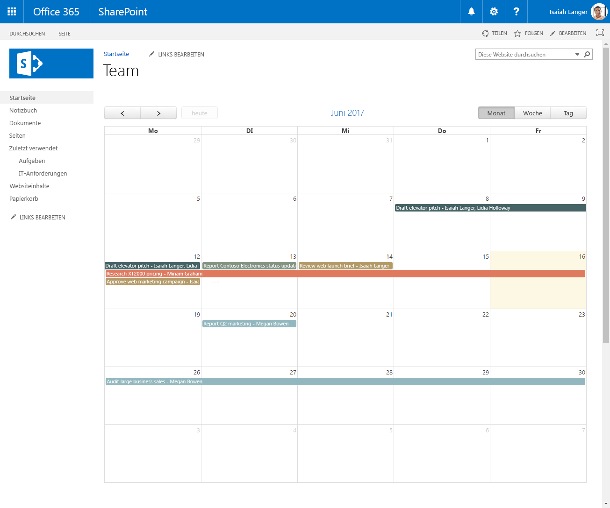
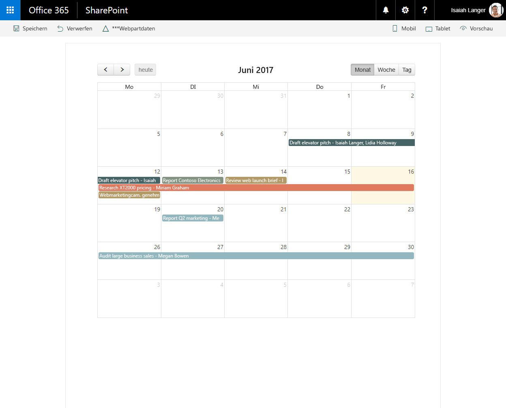
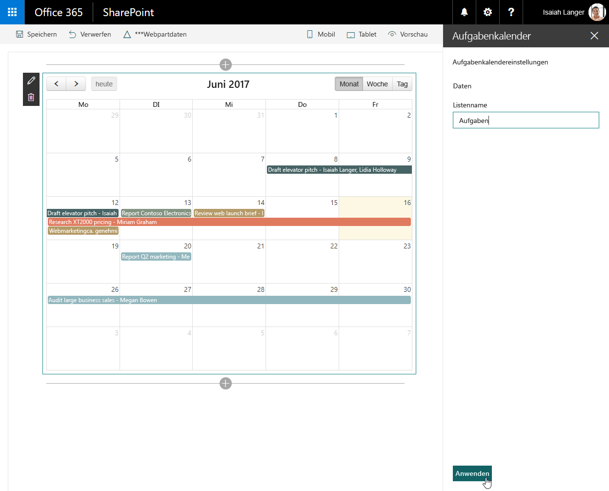

# <a name="migrate-jquery-and-fullcalendar-solution-built-using-script-editor-web-part-to-sharepoint-framework"></a><span data-ttu-id="b9292-103">Migrieren von jQuery- und FullCalendar-Lösungen, die mit dem Script Editor-Webpart erstellt wurden, in das SharePoint-Framework</span><span class="sxs-lookup"><span data-stu-id="b9292-103">Migrate jQuery and FullCalendar solution built using Script Editor Web Part to SharePoint Framework</span></span>

<span data-ttu-id="b9292-104">Beim Erstellen von SharePoint-Lösungen, verwenden SharePoint-Entwickler häufig das [FullCalendar](https://fullcalendar.io)- jQuery-Plug-In zum Anzeigen von Daten in der Kalenderansicht.</span><span class="sxs-lookup"><span data-stu-id="b9292-104">When building SharePoint solutions, SharePoint developers often use the [FullCalendar](https://fullcalendar.io) jQuery plug-in to display data in calendar view.</span></span> <span data-ttu-id="b9292-105">FullCalendar ist eine großartige Alternative zu der standardmäßigen SharePoint-Kalenderansicht, da sie das Rendern von Daten als Kalenderdaten aus mehreren Kalenderlisten, von Daten aus Nicht-Kalenderlisten oder sogar von Daten außerhalb von SharePoint ermöglicht.</span><span class="sxs-lookup"><span data-stu-id="b9292-105">When building SharePoint solutions, SharePoint developers often use the FullCalendar jQuery plugin to display data in calendar view. FullCalendar is a great alternative to the standard SharePoint calendar view, as it allows you to render as calendar data from multiple calendar lists, data from non-calendar lists or even data from outside of SharePoint. This article illustrates how you would migrate a SharePoint customization using FullCalendar built with the Script Editor Web Part to the SharePoint Framework.</span></span> <span data-ttu-id="b9292-106">In diesem Artikel wird beschrieben, wie Sie eine SharePoint-Anpassung mithilfe von FullCalendar, der mit dem Skript-Editor-Webpart erstellt wird, in das SharePoint Framework migrieren.</span><span class="sxs-lookup"><span data-stu-id="b9292-106">This article illustrates how you would migrate a SharePoint customization by using FullCalendar built with the Script Editor Web Part to the SharePoint Framework.</span></span>

## <a name="list-of-tasks-displayed-as-a-calendar-built-using-the-script-editor-web-part"></a><span data-ttu-id="b9292-107">Als Kalender angezeigte Liste von Aufgaben, erstellt mithilfe des Skript-Editor-Webparts</span><span class="sxs-lookup"><span data-stu-id="b9292-107">List of tasks displayed as a calendar built using the Script Editor Web Part</span></span>

<span data-ttu-id="b9292-108">Um das Verfahren der Migration einer SharePoint-Anpassung in das SharePoint-Framework mithilfe von FullCalendar zu veranschaulichen, verwenden Sie die folgende Lösung, die eine Kalenderansicht von Aufgaben zeigt, die aus einer SharePoint-Liste abgerufen wurden.</span><span class="sxs-lookup"><span data-stu-id="b9292-108">To illustrate the process of migrating a SharePoint customization using FullCalendar to the SharePoint Framework you will use the following solution that shows a calendar view of tasks retrieved from a SharePoint list.</span></span>



<span data-ttu-id="b9292-p102">Die Lösung wird anhand des standardmäßigen Skript-Editor-Webparts von SharePoint erstellt. Nachfolgend ist der in der Anpassung verwendete Code aufgeführt.</span><span class="sxs-lookup"><span data-stu-id="b9292-p102">The solution is built using the standard SharePoint Script Editor Web Part. Following is the code used by the customization.</span></span>

```html
<script src="//code.jquery.com/jquery-1.11.1.min.js"></script>
<script src="//cdnjs.cloudflare.com/ajax/libs/moment.js/2.10.6/moment.min.js"></script>
<script src="//cdnjs.cloudflare.com/ajax/libs/fullcalendar/3.4.0/fullcalendar.min.js"></script>
<link type="text/css" rel="stylesheet" href="//cdnjs.cloudflare.com/ajax/libs/fullcalendar/3.4.0/fullcalendar.min.css" />
<div id="calendar"></div>

<script>
  var PATH_TO_DISPFORM = _spPageContextInfo.webAbsoluteUrl + "/Lists/Tasks/DispForm.aspx";
  var TASK_LIST = "Tasks";
  var COLORS = ['#466365', '#B49A67', '#93B7BE', '#E07A5F', '#849483', '#084C61', '#DB3A34'];

  displayTasks();

  function displayTasks() {
    $('#calendar').fullCalendar('destroy');
    $('#calendar').fullCalendar({
      weekends: false,
      header: {
        left: 'prev,next today',
        center: 'title',
        right: 'month,basicWeek,basicDay'
      },
      displayEventTime: false,
      // open up the display form when a user clicks on an event
      eventClick: function (calEvent, jsEvent, view) {
        window.location = PATH_TO_DISPFORM + "?ID=" + calEvent.id;
      },
      editable: true,
      timezone: "UTC",
      droppable: true, // this allows things to be dropped onto the calendar
      // update the end date when a user drags and drops an event 
      eventDrop: function (event, delta, revertFunc) {
        updateTask(event.id, event.start, event.end);
      },
      // put the events on the calendar 
      events: function (start, end, timezone, callback) {
        var startDate = start.format('YYYY-MM-DD');
        var endDate = end.format('YYYY-MM-DD');

        var restQuery = "/_api/Web/Lists/GetByTitle('" + TASK_LIST + "')/items?$select=ID,Title,\
Status,StartDate,DueDate,AssignedTo/Title&$expand=AssignedTo&\
$filter=((DueDate ge '" + startDate + "' and DueDate le '" + endDate + "')or(StartDate ge '" + startDate + "' and StartDate le '" + endDate + "'))";

        $.ajax({
          url: _spPageContextInfo.webAbsoluteUrl + restQuery,
          type: "GET",
          dataType: "json",
          headers: {
            Accept: "application/json;odata=nometadata"
          }
        })
          .done(function (data, textStatus, jqXHR) {
            var personColors = {};
            var colorNo = 0;

            var events = data.value.map(function (task) {
              var assignedTo = task.AssignedTo.map(function (person) {
                return person.Title;
              }).join(', ');

              var color = personColors[assignedTo];
              if (!color) {
                color = COLORS[colorNo++];
                personColors[assignedTo] = color;
              }
              if (colorNo >= COLORS.length) {
                colorNo = 0;
              }

              return {
                title: task.Title + " - " + assignedTo,
                id: task.ID,
                color: color, // specify the background color and border color can also create a class and use className parameter. 
                start: moment.utc(task.StartDate).add("1", "days"),
                end: moment.utc(task.DueDate).add("1", "days") // add one day to end date so that calendar properly shows event ending on that day
              };
            });

            callback(events);
          });
      }
    });
  }

  function updateTask(id, startDate, dueDate) {
    // subtract the previously added day to the date to store correct date
    var sDate = moment.utc(startDate).add("-1", "days").format('YYYY-MM-DD') + "T" +
      startDate.format("hh:mm") + ":00Z";
    if (!dueDate) {
      dueDate = startDate;
    }
    var dDate = moment.utc(dueDate).add("-1", "days").format('YYYY-MM-DD') + "T" +
      dueDate.format("hh:mm") + ":00Z";

    $.ajax({
      url: _spPageContextInfo.webAbsoluteUrl + '/_api/contextinfo',
      type: 'POST',
      headers: {
        'Accept': 'application/json;odata=nometadata'
      }
    })
      .then(function (data, textStatus, jqXHR) {
        return $.ajax({
          url: _spPageContextInfo.webAbsoluteUrl +
          "/_api/Web/Lists/getByTitle('" + TASK_LIST + "')/Items(" + id + ")",
          type: 'POST',
          data: JSON.stringify({
            StartDate: sDate,
            DueDate: dDate,
          }),
          headers: {
            Accept: "application/json;odata=nometadata",
            "Content-Type": "application/json;odata=nometadata",
            "X-RequestDigest": data.FormDigestValue,
            "IF-MATCH": "*",
            "X-Http-Method": "PATCH"
          }
        });
      })
      .done(function (data, textStatus, jqXHR) {
        alert("Update Successful");
      })
      .fail(function (jqXHR, textStatus, errorThrown) {
        alert("Update Failed");
      })
      .always(function () {
        displayTasks();
      });
  }
</script>
```

> [!NOTE] 
> <span data-ttu-id="b9292-112">Diese Lösung basiert auf der Arbeit von Mark Rackley, Office Servers and Services MVP und Chief Strategy Officer bei der PAIT Group.</span><span class="sxs-lookup"><span data-stu-id="b9292-112">This solution is based on the work of Mark Rackley, Office Servers and Services MVP and Chief Strategy Officer at PAIT Group. For more information about the original solution visit http://www.markrackley.net/2017/06/07/using-fullcalendar-io-to-create-custom-calendars-in-sharepoint/.</span></span> <span data-ttu-id="b9292-113">Weitere Informationen zu der ursprünglichen Lösung finden Sie unter [Erstellen von benutzerdefinierten Kalendern in SharePoint mithilfe von FullCalender.io](http://www.markrackley.net/2017/06/07/using-fullcalendar-io-to-create-custom-calendars-in-sharepoint/).</span><span class="sxs-lookup"><span data-stu-id="b9292-113">For more information about the original solution, see [Using FullCalendar.io to Create Custom Calendars in SharePoint](http://www.markrackley.net/2017/06/07/using-fullcalendar-io-to-create-custom-calendars-in-sharepoint/).</span></span>

<span data-ttu-id="b9292-114">Die Anpassung lädt zuerst die verwendeten Bibliotheken: jQuery, DataTables und FullCalendar (Zeilen 1-4).</span><span class="sxs-lookup"><span data-stu-id="b9292-114">First, the customization loads the libraries it uses: jQuery, Moment.js, and FullCalendar (lines 1-4).</span></span> 

<span data-ttu-id="b9292-115">Als Nächstes wird die div definiert, in die die generierte Kalenderansicht eingeschleust wird (Zeile 5).</span><span class="sxs-lookup"><span data-stu-id="b9292-115">Next, it defines the div into which the generated calendar view is injected (line 5).</span></span> 

<span data-ttu-id="b9292-116">Dann werden zwei Funktionen definiert: **displayTasks**, zum Anzeigen von Aufgaben in der Kalenderansicht, und **updateTask**, die ausgelöst wird, nachdem eine Aufgabe per Drag & Drop auf einem anderen Datum abgelegt wurde und die die Datumsangaben im zugrunde liegenden Listenelement aktualisiert.</span><span class="sxs-lookup"><span data-stu-id="b9292-116">It then defines two functions: **displayTasks**, used to display tasks in the calendar view, and **updateTask**, which is triggered after dragging and dropping a task to a different date and which updates the dates on the underlying list item.</span></span> <span data-ttu-id="b9292-117">Jede Funktion definiert eine eigene REST-Abfrage, die dann zum Kommunizieren mit der REST-API der SharePoint-Liste verwendet wird, um die Listenelemente abzurufen oder zu aktualisieren.</span><span class="sxs-lookup"><span data-stu-id="b9292-117">Each function defines its own REST query, which is then used to communicate with the SharePoint List REST API to retrieve or update list items.</span></span>

<span data-ttu-id="b9292-118">Mithilfe des jQuery-Plug-Ins FullCalendar erhalten Benutzer mit wenig Aufwand reichhaltige Lösungen, die z. B. verschiedene Farben zum Kennzeichnen von verschiedenen Ereignissen verwenden oder mit Drag & Drop Ereignisse neu organisieren können.</span><span class="sxs-lookup"><span data-stu-id="b9292-118">Using the FullCalendar jQuery plugin, with little effort users get rich solutions capable of things such as using different colors to mark different events or using drag and drop to reorganize events.</span></span>


## <a name="migrate-the-tasks-calendar-solution-from-the-script-editor-web-part-to-the-sharepoint-framework"></a><span data-ttu-id="b9292-120">Migrieren der Aufgabenkalenderlösung vom Script Editor-Webpart in das SharePoint-Framework</span><span class="sxs-lookup"><span data-stu-id="b9292-120">Migrate the Tasks calendar solution from the Script Editor Web Part to the SharePoint Framework</span></span>

> [!NOTE] 
> <span data-ttu-id="b9292-121">Bevor Sie die Schritte in diesem Artikel durchführen, müssen Sie [eine Entwicklungsumgebung einrichten](../../set-up-your-development-environment.md), in der Sie SharePoint-Framework-Lösungen erstellen können.</span><span class="sxs-lookup"><span data-stu-id="b9292-121">Before following the steps in this article, be sure to [set up your development environment](../../set-up-your-development-environment.md) for building SharePoint Framework solutions.</span></span>

<span data-ttu-id="b9292-122">Das Umwandeln einer Anpassung, die auf dem Skript-Editor-Webpart basiert, in SharePoint Framework bietet zahlreiche Vorteile, z. B. die benutzerfreundlichere Konfiguration und die zentrale Verwaltung der Lösung.</span><span class="sxs-lookup"><span data-stu-id="b9292-122">Transforming a Script Editor Web Part-based customization to the SharePoint Framework offers a number of benefits such as more user-friendly configuration and centralized management of the solution.</span></span> <span data-ttu-id="b9292-123">Nachfolgend finden Sie eine schrittweise Beschreibung der Migration der Lösung in SharePoint Framework.</span><span class="sxs-lookup"><span data-stu-id="b9292-123">Following is a step-by-step description of how you would migrate the solution to the SharePoint Framework.</span></span> 

<span data-ttu-id="b9292-124">Zuerst migrieren Sie die Lösung in das SharePoint Framework mit so wenig Änderungen am ursprünglichen Code wie möglich.</span><span class="sxs-lookup"><span data-stu-id="b9292-124">First, you migrate the solution to the SharePoint Framework with as few changes to the original code as possible.</span></span> <span data-ttu-id="b9292-125">Später wandeln Sie den Code der Lösung in TypeScript um, um von den Typsicherheitsfeatures zur Entwicklungszeit zu profitieren, und ersetzen einen Teil des Codes durch die SharePoint Framework-API, um deren Funktionen voll auszunutzen und die Lösung weiter zu vereinfachen.</span><span class="sxs-lookup"><span data-stu-id="b9292-125">Later, you transform the solution's code to TypeScript to benefit from its development-time type safety features, and replace some of the code with the SharePoint Framework API to fully benefit from its capabilities and simplify the solution even further.</span></span>

> [!NOTE] 
> <span data-ttu-id="b9292-126">Der Quellcode des Projekts in den verschiedenen Phasen der Migration steht unter [Lernprogramm: Migrieren von jQuery- und FullCalendar-Lösungen, die mit Skript- Editor-Webpart erstellt wurden, in SharePoint Framework](https://github.com/SharePoint/sp-dev-fx-webparts/tree/master/tutorials/tutorial-migrate-fullcalendar) zur Verfügung.</span><span class="sxs-lookup"><span data-stu-id="b9292-126">The source code of the project in the different stages of migration is available at [Tutorial: Migrate jQuery and FullCalendar solution built using Script Editor Web Part to SharePoint Framework](https://github.com/SharePoint/sp-dev-fx-webparts/tree/master/tutorials/tutorial-migrate-fullcalendar).</span></span>

### <a name="create-new-sharepoint-framework-project"></a><span data-ttu-id="b9292-127">Erstellen eines neuen SharePoint-Framework-Projekts</span><span class="sxs-lookup"><span data-stu-id="b9292-127">Create new SharePoint Framework project</span></span>

1. <span data-ttu-id="b9292-128">Erstellen Sie zunächst einen neuen Ordner für Ihr Projekt:</span><span class="sxs-lookup"><span data-stu-id="b9292-128">Start by creating a new folder for your project</span></span>

  ```sh
  md fullcalendar-taskscalendar
  ```

2. <span data-ttu-id="b9292-129">Navigieren Sie zum Projektordner:</span><span class="sxs-lookup"><span data-stu-id="b9292-129">Navigate to the project folder:</span></span>

  ```sh
  cd fullcalendar-taskscalendar
  ```

3. <span data-ttu-id="b9292-130">Führen Sie im Projektordner den SharePoint Framework-Yeoman-Generator aus, um ein Gerüst für ein neues SharePoint Framework-Projekt zu erstellen:</span><span class="sxs-lookup"><span data-stu-id="b9292-130">In the project folder, run the SharePoint Framework Yeoman generator to scaffold a new SharePoint Framework project:</span></span>

  ```sh
  yo @microsoft/sharepoint
  ```

4. <span data-ttu-id="b9292-131">Es werden mehrere Eingabeaufforderungen angezeigt. Definieren Sie die Werte jeweils wie folgt:</span><span class="sxs-lookup"><span data-stu-id="b9292-131">When prompted, define values as follows:</span></span>
  - <span data-ttu-id="b9292-132">**fullcalendar-taskscalendar** als Ihren Lösungsnamen</span><span class="sxs-lookup"><span data-stu-id="b9292-132">**fullcalendar-taskscalendar** as your solution name</span></span>
  - <span data-ttu-id="b9292-133">**Aktuellen Ordner verwenden** als Speicherort für die Dateien</span><span class="sxs-lookup"><span data-stu-id="b9292-133">**Use the current folder** for the location to place the files</span></span>
  - <span data-ttu-id="b9292-134">**WebPart** als die zu erstellende clientseitige Komponente</span><span class="sxs-lookup"><span data-stu-id="b9292-134">**WebPart** as the client-side component to create</span></span>
  - <span data-ttu-id="b9292-135">**Aufgabenkalender** als Name des Webparts</span><span class="sxs-lookup"><span data-stu-id="b9292-135">**Tasks calendar** as your web part name</span></span>
  - <span data-ttu-id="b9292-136">**Zeigt Aufgaben in der Kalenderansicht** als Beschreibung des Webparts</span><span class="sxs-lookup"><span data-stu-id="b9292-136">**Shows tasks in the calendar view** as your web part description</span></span>
  - <span data-ttu-id="b9292-137">**No javaScript web framework** als Eintrittspunkt für die Webpart-Erstellung</span><span class="sxs-lookup"><span data-stu-id="b9292-137">**No javaScript web framework** as the starting point to build the web part</span></span>

  

5. <span data-ttu-id="b9292-139">Sobald das Gerüst abgeschlossen ist, sperren Sie die Version der Projektabhängigkeiten, indem Sie den folgenden Befehl ausführen:</span><span class="sxs-lookup"><span data-stu-id="b9292-139">After the scaffolding completes, lock down the version of the project dependencies by running the following command:</span></span>

  ```sh
  npm shrinkwrap
  ```

6. <span data-ttu-id="b9292-140">Öffnen Sie den Projektordner in einem Code-Editor.</span><span class="sxs-lookup"><span data-stu-id="b9292-140">Next, open your project folder in your code editor.</span></span> <span data-ttu-id="b9292-141">In diesem Tutorial verwenden Sie Visual Studio Code.</span><span class="sxs-lookup"><span data-stu-id="b9292-141">In this tutorial, you will use Visual Studio Code.</span></span>

  

### <a name="load-javascript-libraries"></a><span data-ttu-id="b9292-143">Laden von JavaScript-Bibliotheken</span><span class="sxs-lookup"><span data-stu-id="b9292-143">Load JavaScript libraries</span></span>

<span data-ttu-id="b9292-144">Ähnlich wie bei der ursprünglichen Lösung, die mithilfe des Skript-Editor-Webparts erstellt wurde, müssen Sie zuerst die JavaScript-Bibliotheken laden, die für die Lösung erforderlich sind.</span><span class="sxs-lookup"><span data-stu-id="b9292-144">Similar to the original solution built by using the Script Editor Web Part, you first need to load the JavaScript libraries required by the solution.</span></span> <span data-ttu-id="b9292-145">In SharePoint Framework besteht dies in der Regel aus zwei Schritten: Festlegen der URL, von der die Bibliothek geladen werden soll, und Verweisen auf die Bibliothek im Code.</span><span class="sxs-lookup"><span data-stu-id="b9292-145">Similarly to the original solution built using the Script Editor Web Part, first you need to load the JavaScript libraries required by the solution. In SharePoint Framework this usually consists of two steps: specifying the URL from which the library should be loaded, and referencing the library in the code.</span></span>

1. <span data-ttu-id="b9292-146">Geben Sie die URLs an, von der Bibliotheken geladen werden sollen.</span><span class="sxs-lookup"><span data-stu-id="b9292-146">Specify the URLs from which libraries should be loaded.</span></span> <span data-ttu-id="b9292-147">Öffnen Sie im Code-Editor die Datei **./config/config.json**, und ändern Sie den Abschnitt **externals** in Folgendes:</span><span class="sxs-lookup"><span data-stu-id="b9292-147">Start, with specifying the URLs from which libraries should be loaded. In the code editor, open the **./config/config.json** file and change the **externals** section to:</span></span>

  ```json
  {
    "externals": {
      "jquery": "https://code.jquery.com/jquery-1.11.1.min.js",
      "moment": "https://cdnjs.cloudflare.com/ajax/libs/moment.js/2.10.6/moment.min.js",
      "fullcalendar": "https://cdnjs.cloudflare.com/ajax/libs/fullcalendar/3.4.0/fullcalendar.min.js"
    }
  }
  ```

2. <span data-ttu-id="b9292-148">Öffnen Sie die Datei **./src/webparts/tasksCalendar/TasksCalendarWebPart.ts**, und fügen Sie nach der letzten **import**-Anweisung Folgendes hinzu:</span><span class="sxs-lookup"><span data-stu-id="b9292-148">Next, open the **./src/webparts/tasksCalendar/TasksCalendarWebPart.ts** file, and after the last **import** statement add:</span></span>

  ```ts
  import 'jquery';
  import 'moment';
  import 'fullcalendar';
  ```

### <a name="define-container-div"></a><span data-ttu-id="b9292-149">Definieren des div-Containers</span><span class="sxs-lookup"><span data-stu-id="b9292-149">Define container div</span></span>

<span data-ttu-id="b9292-150">Wie bei der ursprünglichen Lösung besteht der nächste Schritt darin, die Position zu definieren, an der der Kalender wiedergegeben werden soll.</span><span class="sxs-lookup"><span data-stu-id="b9292-150">Just as in the original solution, the next step is to define the location where the calendar should be rendered. In the code editor, open the ./src/webparts/tasksCalendar/TasksCalendarWebPart.ts file and change the render method to:</span></span> 

<span data-ttu-id="b9292-151">Öffnen Sie im Code-Editor die Datei **./src/webparts/tasksCalendar/TasksCalendarWebPart.ts**, und ändern Sie die **render**-Methode in Folgendes:</span><span class="sxs-lookup"><span data-stu-id="b9292-151">In order to reference this file in the web part, in the code editor, open the **./src/webparts/tasksCalendar/TasksCalendarWebPart.ts** file and change the **render** method to:</span></span>

```ts
  export default class ItRequestsWebPart extends BaseClientSideWebPart<IItRequestsWebPartProps> {
    public render(): void {
      this.domElement.innerHTML = `
        <div class="${styles.tasksCalendar}">
          <link type="text/css" rel="stylesheet" href="//cdnjs.cloudflare.com/ajax/libs/fullcalendar/3.4.0/fullcalendar.min.css" />
          <div id="calendar"></div>
        </div>`;
    }
    // ...
  }
```

### <a name="initiate-fullcalendar-and-load-data"></a><span data-ttu-id="b9292-152">Initiieren von FullCalendar und Laden von Daten</span><span class="sxs-lookup"><span data-stu-id="b9292-152">Initiate FullCalendar and load data</span></span>

<span data-ttu-id="b9292-153">Der letzte Schritt besteht darin, den Code einzuschließen, der das jQuery-Plug-In „FullCalendar“ initiiert und die Daten aus SharePoint lädt.</span><span class="sxs-lookup"><span data-stu-id="b9292-153">The last step is to include the code that initiates the FullCalendar jQuery plugin and loads the data from SharePoint. In the ./src/webparts/tasksCalendar folder, create a new file named script.js and paste the following code:</span></span> 

1.  <span data-ttu-id="b9292-154">Erstellen Sie im Ordner **./src/webparts/tasksCalendar** eine neue Datei mit dem Namen **script.js**, und fügen Sie den folgenden Code in die Datei ein:</span><span class="sxs-lookup"><span data-stu-id="b9292-154">In the **./src/webparts/tasksCalendar** folder, create a new file named **script.js**, and paste in the following code:</span></span>

  ```js
  var moment = require('moment');

  var PATH_TO_DISPFORM = window.webAbsoluteUrl + "/Lists/Tasks/DispForm.aspx";
  var TASK_LIST = "Tasks";
  var COLORS = ['#466365', '#B49A67', '#93B7BE', '#E07A5F', '#849483', '#084C61', '#DB3A34'];

  displayTasks();

  function displayTasks() {
    $('#calendar').fullCalendar('destroy');
    $('#calendar').fullCalendar({
      weekends: false,
      header: {
        left: 'prev,next today',
        center: 'title',
        right: 'month,basicWeek,basicDay'
      },
      displayEventTime: false,
      // open up the display form when a user clicks on an event
      eventClick: function (calEvent, jsEvent, view) {
        window.location = PATH_TO_DISPFORM + "?ID=" + calEvent.id;
      },
      editable: true,
      timezone: "UTC",
      droppable: true, // this allows things to be dropped onto the calendar
      // update the end date when a user drags and drops an event 
      eventDrop: function (event, delta, revertFunc) {
        updateTask(event.id, event.start, event.end);
      },
      // put the events on the calendar 
      events: function (start, end, timezone, callback) {
        var startDate = start.format('YYYY-MM-DD');
        var endDate = end.format('YYYY-MM-DD');

        var restQuery = "/_api/Web/Lists/GetByTitle('" + TASK_LIST + "')/items?$select=ID,Title,\
  Status,StartDate,DueDate,AssignedTo/Title&$expand=AssignedTo&\
  $filter=((DueDate ge '" + startDate + "' and DueDate le '" + endDate + "')or(StartDate ge '" + startDate + "' and StartDate le '" + endDate + "'))";

        $.ajax({
          url: window.webAbsoluteUrl + restQuery,
          type: "GET",
          dataType: "json",
          headers: {
            Accept: "application/json;odata=nometadata"
          }
        })
          .done(function (data, textStatus, jqXHR) {
            var personColors = {};
            var colorNo = 0;

            var events = data.value.map(function (task) {
              var assignedTo = task.AssignedTo.map(function (person) {
                return person.Title;
              }).join(', ');

              var color = personColors[assignedTo];
              if (!color) {
                color = COLORS[colorNo++];
                personColors[assignedTo] = color;
              }
              if (colorNo >= COLORS.length) {
                colorNo = 0;
              }

              return {
                title: task.Title + " - " + assignedTo,
                id: task.ID,
                color: color, // specify the background color and border color can also create a class and use className parameter. 
                start: moment.utc(task.StartDate).add("1", "days"),
                end: moment.utc(task.DueDate).add("1", "days") // add one day to end date so that calendar properly shows event ending on that day
              };
            });

            callback(events);
          });
      }
    });
  }

  function updateTask(id, startDate, dueDate) {
    // subtract the previously added day to the date to store correct date
    var sDate = moment.utc(startDate).add("-1", "days").format('YYYY-MM-DD') + "T" +
      startDate.format("hh:mm") + ":00Z";
    if (!dueDate) {
      dueDate = startDate;
    }
    var dDate = moment.utc(dueDate).add("-1", "days").format('YYYY-MM-DD') + "T" +
      dueDate.format("hh:mm") + ":00Z";

    $.ajax({
      url: window.webAbsoluteUrl + '/_api/contextinfo',
      type: 'POST',
      headers: {
        'Accept': 'application/json;odata=nometadata'
      }
    })
      .then(function (data, textStatus, jqXHR) {
        return $.ajax({
          url: window.webAbsoluteUrl +
          "/_api/Web/Lists/getByTitle('" + TASK_LIST + "')/Items(" + id + ")",
          type: 'POST',
          data: JSON.stringify({
            StartDate: sDate,
            DueDate: dDate,
          }),
          headers: {
            Accept: "application/json;odata=nometadata",
            "Content-Type": "application/json;odata=nometadata",
            "X-RequestDigest": data.FormDigestValue,
            "IF-MATCH": "*",
            "X-Http-Method": "PATCH"
          }
        });
      })
      .done(function (data, textStatus, jqXHR) {
        alert("Update Successful");
      })
      .fail(function (jqXHR, textStatus, errorThrown) {
        alert("Update Failed");
      })
      .always(function () {
        displayTasks();
      });
  }
  ```

  <span data-ttu-id="b9292-155">Dieser Code ist fast identisch mit den ursprünglichen Code der Anpassung des Skript-Editor-Webparts.</span><span class="sxs-lookup"><span data-stu-id="b9292-155">This code is almost identical to the original code of the Script Editor Web Part customization.</span></span> <span data-ttu-id="b9292-156">Der einzige Unterschied besteht darin, dass der ursprüngliche Code die URL des aktuellen Webs aus der globalen **\_SpPageContextInfo**-Variablen abruft, die von SharePoint festgelegt wird (Zeile 8, 45, 96 und 104), wohingegen der Code im SharePoint Framework eine benutzerdefinierte Variable verwendet, die Sie im Webpart festlegen müssen.</span><span class="sxs-lookup"><span data-stu-id="b9292-156">This code is almost identical with the original code of the Script Editor Web Part customization. The only difference is that where the original code retrieved the URL of the current web from the global **\_spPageContextInfo** variable set by SharePoint (lines 8, 45, 96 and 104), the code in the SharePoint Framework uses a custom variable that you will have to set in the web part. SharePoint Framework client-side web parts can be used both on classic and modern pages. While the _spPageContextInfo variable is present on classic pages, it's not available on modern pages which is why you can't rely on it and need a custom property that you can control yourself instead.</span></span> 
  
  <span data-ttu-id="b9292-157">Clientseitige SharePoint Framework-Webparts können sowohl in klassischen als auch in modernen Seiten verwendet werden.</span><span class="sxs-lookup"><span data-stu-id="b9292-157">SharePoint Framework client-side web parts can be used both on classic and modern pages.</span></span> <span data-ttu-id="b9292-158">Die **_spPageContextInfo**-Variable ist zwar auf klassischen Seiten, aber nicht auf modernen Seiten vorhanden. Deshalb können Sie sich nicht darauf verlassen und benötigen eine benutzerdefinierte Eigenschaft, die Sie selbst steuern können.</span><span class="sxs-lookup"><span data-stu-id="b9292-158">While the **_spPageContextInfo** variable is present on classic pages, it's not available on modern pages, which is why you can't rely on it and need a custom property that you can control yourself instead.</span></span>

2. <span data-ttu-id="b9292-159">Um auf diese Datei im Webpart zu verweisen, öffnen Sie im Code-Editor die Datei **./src/webparts/tasksCalendar/TasksCalendarWebPart.ts**, und ändern Sie die **render**-Methode in:</span><span class="sxs-lookup"><span data-stu-id="b9292-159">In order to reference this file in the web part, in the code editor, open the **./src/webparts/tasksCalendar/TasksCalendarWebPart.ts** file and change the **render** method to:</span></span>

  ```ts
  export default class ItRequestsWebPart extends BaseClientSideWebPart<IItRequestsWebPartProps> {
    public render(): void {
      this.domElement.innerHTML = `
        <div class="${styles.tasksCalendar}">
          <link type="text/css" rel="stylesheet" href="//cdnjs.cloudflare.com/ajax/libs/fullcalendar/3.4.0/fullcalendar.min.css" />
          <div id="calendar"></div>
        </div>`;

      (window as any).webAbsoluteUrl = this.context.pageContext.web.absoluteUrl;
      require('./script');
    }
    // ...
  }
  ```

3. <span data-ttu-id="b9292-160">Führen Sie folgenden Befehl über die Befehlszeile aus, um zu überprüfen, ob das Webpart wie erwartet funktioniert:</span><span class="sxs-lookup"><span data-stu-id="b9292-160">Verify, that the web part is working as expected by in the command line executing:</span></span>

  ```sh
  gulp serve --nobrowser
  ```

  <span data-ttu-id="b9292-161">Da das Webpart die Daten von SharePoint lädt, müssen Sie das Webpart mithilfe der gehosteten SharePoint Framework Workbench testen.</span><span class="sxs-lookup"><span data-stu-id="b9292-161">Because the web part loads its data from SharePoint, you have to test the web part by using the hosted SharePoint Framework workbench.</span></span> 
  
4. <span data-ttu-id="b9292-162">Navigieren Sie zu `https://yourtenant.sharepoint.com/_layouts/workbench.aspx`, und fügen Sie das Webpart zum Zeichenbereich hinzu.</span><span class="sxs-lookup"><span data-stu-id="b9292-162">Navigate to `https://yourtenant.sharepoint.com/_layouts/workbench.aspx` and add the web part to the canvas.</span></span> <span data-ttu-id="b9292-163">Nun sollten die Aufgaben mithilfe des jQuery-Plug-Ins „FullCalendar“ in einer Kalenderansicht angezeigt werden.</span><span class="sxs-lookup"><span data-stu-id="b9292-163">You should now see the tasks displayed in a calendar view by using the FullCalendar jQuery plug-in.</span></span>

  

## <a name="add-support-for-configuring-the-web-part-through-web-part-properties"></a><span data-ttu-id="b9292-165">Hinzufügen von Unterstützung zum Konfigurieren des Webparts über Webparteigenschaften</span><span class="sxs-lookup"><span data-stu-id="b9292-165">Add support for configuring the web part through web part properties</span></span>

<span data-ttu-id="b9292-166">In den vorherigen Schritten haben Sie die Aufgabenkalenderlösungen vom Skript-Editor-Webpart in das SharePoint-Framework migriert.</span><span class="sxs-lookup"><span data-stu-id="b9292-166">In the previous steps, you migrated the Tasks calendar solutions from the Script Editor Web Part to the SharePoint Framework.</span></span> <span data-ttu-id="b9292-167">Die Lösung arbeitet zwar bereits wie erwartet, nutzt aber keine der Vorteile von SharePoint Framework.</span><span class="sxs-lookup"><span data-stu-id="b9292-167">While the solution already works as expected, it doesn't use any of the SharePoint Framework benefits.</span></span> <span data-ttu-id="b9292-168">Der Name der Liste, aus der Aufgaben geladen werden, ist im Code enthalten; bei dem Code selbst handelt es sich um reines JavaScript, das schwieriger umzugestalten ist als TypeScript.</span><span class="sxs-lookup"><span data-stu-id="b9292-168">The name of the list from which tasks are loaded is included in the code, and the code itself is plain JavaScript, which is harder to refactor than TypeScript.</span></span> 

<span data-ttu-id="b9292-169">Die folgenden Schritte veranschaulichen, wie Sie die vorhandene Lösung erweitern können, damit Benutzer den Namen der Liste angeben können, aus der die Daten geladen werden sollen.</span><span class="sxs-lookup"><span data-stu-id="b9292-169">The following steps illustrate how to extend the existing solution to allow users to specify the name of the list to load the data from.</span></span> <span data-ttu-id="b9292-170">Später wandeln Sie den Code in TypeScript um, um von den Typsicherheitsfeatures zu profitieren.</span><span class="sxs-lookup"><span data-stu-id="b9292-170">Later, you transform the code to TypeScript to benefit from its type safety features.</span></span>

### <a name="define-web-part-property-for-storing-the-name-of-the-list"></a><span data-ttu-id="b9292-171">Definieren der Webparteigenschaft zum Speichern des Listennamens</span><span class="sxs-lookup"><span data-stu-id="b9292-171">Define web part property for storing the name of the list</span></span>

1. <span data-ttu-id="b9292-172">Definieren Sie eine Webparteigenschaft, um den Namen der Liste zu speichern, aus der Aufgaben geladen werden sollten.</span><span class="sxs-lookup"><span data-stu-id="b9292-172">Define a web part property to store the name of the list from which tasks should be loaded.</span></span> <span data-ttu-id="b9292-173">Öffnen Sie im Code-Editor die Datei **./src/webparts/tasksCalendar/TasksCalendarWebPart.manifest.json**, und benennen Sie die Standardeinstellung **description** in **listName** um, und löschen Sie ihren Wert.</span><span class="sxs-lookup"><span data-stu-id="b9292-173">Start with defining a web part property to store the name of the list from which tasks should be loaded. In the code editor, open the **./src/webparts/tasksCalendar/TasksCalendarWebPart.manifest.json** file and rename the default **description** property to **listName** and clear its value.</span></span>

  

2. <span data-ttu-id="b9292-175">Aktualisieren Sie die Webparteigenschaften, um die Änderungen im Manifest widerzuspiegeln.</span><span class="sxs-lookup"><span data-stu-id="b9292-175">Update the web part properties interface to reflect the changes in the manifest.</span></span> <span data-ttu-id="b9292-176">Öffnen Sie im Code-Editor die Datei **./src/webparts/tasksCalendar/ITasksCalendarWebPartProps.ts**, und ändern Sie den Inhalt in Folgendes:</span><span class="sxs-lookup"><span data-stu-id="b9292-176">In the code editor open the **./src/webparts/toDo/app/DataService.ts** file and change its contents to:</span></span>

  ```ts
  export interface ITasksCalendarWebPartProps {
    listName: string;
  }
  ```

3. <span data-ttu-id="b9292-177">Aktualisieren Sie die Anzeigebezeichnungen für die **listName**-Eigenschaft.</span><span class="sxs-lookup"><span data-stu-id="b9292-177">Update the display labels for the **listName** property.</span></span> <span data-ttu-id="b9292-178">Öffnen Sie die Datei **./src/webparts/tasksCalendar/loc/mystrings.d.ts**, und ändern Sie den Inhalt in:</span><span class="sxs-lookup"><span data-stu-id="b9292-178">Then, update the display labels for the listName property. Open the **./src/webparts/tasksCalendar/loc/mystrings.d.ts** file and change its contents to:</span></span>

  ```ts
  declare interface ITasksCalendarStrings {
    PropertyPaneDescription: string;
    BasicGroupName: string;
    ListNameFieldLabel: string;
  }

  declare module 'tasksCalendarStrings' {
    const strings: ITasksCalendarStrings;
    export = strings;
  }
  ```

4. <span data-ttu-id="b9292-179">Öffnen Sie die Datei **./src/webparts/tasksCalendar/loc/en-us.js**, und ändern Sie den Inhalt in:</span><span class="sxs-lookup"><span data-stu-id="b9292-179">Next, open the **./src/webparts/tasksCalendar/loc/en-us.js** file and change its contents to:</span></span>

  ```js
  define([], function() {
    return {
      "PropertyPaneDescription": "Tasks calendar settings",
      "BasicGroupName": "Data",
      "ListNameFieldLabel": "List name"
    }
  });
  ```

5. <span data-ttu-id="b9292-180">Aktualisieren Sie das Webpart so, dass die neu definierte Eigenschaft verwendet wird.</span><span class="sxs-lookup"><span data-stu-id="b9292-180">Update the web part to use the newly defined property.</span></span> <span data-ttu-id="b9292-181">Öffnen Sie im Code-Editor die Datei **./src/webparts/tasksCalendar/TasksCalendarWebPart.ts**, und ändern Sie die **getPropertyPaneConfiguration**-Methode in:</span><span class="sxs-lookup"><span data-stu-id="b9292-181">Finally, update the web part to use the newly defined property. In the code editor, open the **./src/webparts/tasksCalendar/TasksCalendarWebPart.ts** file and change the **getPropertyPaneConfiguration** method to:</span></span>

  ```ts
  export default class TasksCalendarWebPart extends BaseClientSideWebPart<ITasksCalendarWebPartProps> {
    // ...
    protected getPropertyPaneConfiguration(): IPropertyPaneConfiguration {
      return {
        pages: [
          {
            header: {
              description: strings.PropertyPaneDescription
            },
            groups: [
              {
                groupName: strings.BasicGroupName,
                groupFields: [
                  PropertyPaneTextField('listName', {
                    label: strings.ListNameFieldLabel
                  })
                ]
              }
            ]
          }
        ]
      };
    }

    protected get disableReactivePropertyChanges(): boolean {
      return true;
    }
  }
  ```

<span data-ttu-id="b9292-182">Um zu verhindern, dass das Webpart neu geladen wird, wenn Benutzer den Namen der Liste eingeben, haben Sie das Webpart darüber hinaus so konfiguriert, dass es den nicht reaktiven Eigenschaftenbereich verwendet, indem Sie die **disableReactivePropertyChanges**-Methode hinzugefügt und den Rückgabewert auf **true** festgelegt haben.</span><span class="sxs-lookup"><span data-stu-id="b9292-182">To prevent the web part from reloading as users type the name of the list, you've also configured the web part to use the non-reactive property pane by adding the **disableReactivePropertyChanges** method and settings its return value to **true**.</span></span>

### <a name="use-the-configured-name-of-the-list-to-load-the-data-from"></a><span data-ttu-id="b9292-183">Verwenden des konfigurierten Namens der Liste, aus der Daten geladen werden sollen</span><span class="sxs-lookup"><span data-stu-id="b9292-183">Use the configured name of the list to load the data from</span></span>

<span data-ttu-id="b9292-184">Zunächst wurde der Name der Liste, aus der die Daten geladen werden sollen, in die REST-Abfragen eingebettet.</span><span class="sxs-lookup"><span data-stu-id="b9292-184">Initially, the name of the list from which the data should be loaded was embedded in the REST queries.</span></span> <span data-ttu-id="b9292-185">Da Benutzer diesen Namen nun konfigurieren können, sollte der konfigurierte Wert in die REST-Abfragen injiziert werden, bevor diese ausgeführt werden.</span><span class="sxs-lookup"><span data-stu-id="b9292-185">Now that users can configure this name, the configured value should be injected into the REST queries before executing them.</span></span> <span data-ttu-id="b9292-186">Die einfachste Möglichkeit hierzu besteht darin, den Inhalt der **script.js**-Datei in die Haupt-Webpartdatei zu verschieben.</span><span class="sxs-lookup"><span data-stu-id="b9292-186">The easiest way to do that is by moving the contents of the **script.js** file to the main web part file.</span></span>

1. <span data-ttu-id="b9292-187">Öffnen Sie im Code-Editor die Datei **./src/webparts/tasksCalendar/TasksCalendarWebPart.ts**.</span><span class="sxs-lookup"><span data-stu-id="b9292-187">In the code editor, open the **./src/webparts/tasksCalendar/TasksCalendarWebPart.ts** file.</span></span>

2. <span data-ttu-id="b9292-188">Ändern Sie die import-Anweisung, sodass die erforderlichen Bibliotheken geladen werden:</span><span class="sxs-lookup"><span data-stu-id="b9292-188">Start, by changing the import statement to load the required libraries to:</span></span>

  ```ts
  var $: any = require('jquery');
  var moment: any = require('moment');

  import 'fullcalendar';

  var COLORS = ['#466365', '#B49A67', '#93B7BE', '#E07A5F', '#849483', '#084C61', '#DB3A34'];
  ```

  <span data-ttu-id="b9292-189">Da in dem Code, den Sie später verwenden werden, auf Moment.js verwiesen wird, muss dieser Name für TypeScript bekannt sein, da sonst das Erstellen des Projekts fehlschlägt.</span><span class="sxs-lookup"><span data-stu-id="b9292-189">Because Moment.js is referenced in the code that you will be using later, its name must be known to TypeScript or building the project will fail.</span></span> <span data-ttu-id="b9292-190">Das gleiche gilt für jQuery.</span><span class="sxs-lookup"><span data-stu-id="b9292-190">The same applies to jQuery.</span></span> <span data-ttu-id="b9292-191">Da FullCalendar ein jQuery-Plug-In ist, das sich selbst an das jQuery-Objekt anheftet, kann es auf die gleiche Weise wie zuvor importiert werden.</span><span class="sxs-lookup"><span data-stu-id="b9292-191">Because FullCalendar is a jQuery plug-in that attaches itself to the jQuery object, it can be imported the same way as previously.</span></span>

  <span data-ttu-id="b9292-192">Der letzte Teil umfasst das Kopieren der Liste von Farben, die zum Kennzeichnen der unterschiedlichen Ereignisse verwendet werden.</span><span class="sxs-lookup"><span data-stu-id="b9292-192">The last part includes copying the list of colors to use for marking the different events.</span></span>

3. <span data-ttu-id="b9292-193">Kopieren Sie die Funktionen **displayTasks** und **updateTask** aus der Datei **script.js**, und fügen Sie sie wie folgt innerhalb der **TasksCalendarWebPart**-Klasse ein:</span><span class="sxs-lookup"><span data-stu-id="b9292-193">Next, copy the **displayTasks** and **updateTask** functions from the **script.js** file and paste them as follows inside the **TasksCalendarWebPart** class:</span></span>

  ```ts
  export default class TasksCalendarWebPart extends BaseClientSideWebPart<ITasksCalendarWebPartProps> {
    // ...

    private displayTasks() {
      $('#calendar').fullCalendar('destroy');
      $('#calendar').fullCalendar({
        weekends: false,
        header: {
          left: 'prev,next today',
          center: 'title',
          right: 'month,basicWeek,basicDay'
        },
        displayEventTime: false,
        // open up the display form when a user clicks on an event
        eventClick: (calEvent, jsEvent, view) => {
          (window as any).location = this.context.pageContext.web.absoluteUrl +
            "/Lists/" + escape(this.properties.listName) + "/DispForm.aspx?ID=" + calEvent.id;
        },
        editable: true,
        timezone: "UTC",
        droppable: true, // this allows things to be dropped onto the calendar
        // update the end date when a user drags and drops an event 
        eventDrop: (event, delta, revertFunc) => {
          this.updateTask(event.id, event.start, event.end);
        },
        // put the events on the calendar 
        events: (start, end, timezone, callback) => {
          var startDate = start.format('YYYY-MM-DD');
          var endDate = end.format('YYYY-MM-DD');

          var restQuery = "/_api/Web/Lists/GetByTitle('" + escape(this.properties.listName) + "')/items?$select=ID,Title,\
  Status,StartDate,DueDate,AssignedTo/Title&$expand=AssignedTo&\
  $filter=((DueDate ge '" + startDate + "' and DueDate le '" + endDate + "')or(StartDate ge '" + startDate + "' and StartDate le '" + endDate + "'))";

          $.ajax({
            url: this.context.pageContext.web.absoluteUrl + restQuery,
            type: "GET",
            dataType: "json",
            headers: {
              Accept: "application/json;odata=nometadata"
            }
          })
            .done((data, textStatus, jqXHR) => {
              var personColors = {};
              var colorNo = 0;

              var events = data.value.map((task) => {
                var assignedTo = task.AssignedTo.map((person) => {
                  return person.Title;
                }).join(', ');

                var color = personColors[assignedTo];
                if (!color) {
                  color = COLORS[colorNo++];
                  personColors[assignedTo] = color;
                }
                if (colorNo >= COLORS.length) {
                  colorNo = 0;
                }

                return {
                  title: task.Title + " - " + assignedTo,
                  id: task.ID,
                  color: color, // specify the background color and border color can also create a class and use className parameter. 
                  start: moment.utc(task.StartDate).add("1", "days"),
                  end: moment.utc(task.DueDate).add("1", "days") // add one day to end date so that calendar properly shows event ending on that day
                };
              });

              callback(events);
            });
        }
      });
    }

    private updateTask(id, startDate, dueDate) {
      // subtract the previously added day to the date to store correct date
      var sDate = moment.utc(startDate).add("-1", "days").format('YYYY-MM-DD') + "T" +
        startDate.format("hh:mm") + ":00Z";
      if (!dueDate) {
        dueDate = startDate;
      }
      var dDate = moment.utc(dueDate).add("-1", "days").format('YYYY-MM-DD') + "T" +
        dueDate.format("hh:mm") + ":00Z";

      $.ajax({
        url: this.context.pageContext.web.absoluteUrl + '/_api/contextinfo',
        type: 'POST',
        headers: {
          'Accept': 'application/json;odata=nometadata'
        }
      })
        .then((data, textStatus, jqXHR) => {
          return $.ajax({
            url: this.context.pageContext.web.absoluteUrl +
            "/_api/Web/Lists/getByTitle('" + escape(this.properties.listName) + "')/Items(" + id + ")",
            type: 'POST',
            data: JSON.stringify({
              StartDate: sDate,
              DueDate: dDate,
            }),
            headers: {
              Accept: "application/json;odata=nometadata",
              "Content-Type": "application/json;odata=nometadata",
              "X-RequestDigest": data.FormDigestValue,
              "IF-MATCH": "*",
              "X-Http-Method": "PATCH"
            }
          });
        })
        .done((data, textStatus, jqXHR) => {
          alert("Update Successful");
        })
        .fail((jqXHR, textStatus, errorThrown) => {
          alert("Update Failed");
        })
        .always(() => {
          this.displayTasks();
        });
    }

    // ...
  }
  ```

  <br/>

  <span data-ttu-id="b9292-194"> Im Vergleich zur vorherigen Situation gibt es ein paar Änderungen am Code.</span><span class="sxs-lookup"><span data-stu-id="b9292-194">There are a few changes in the code compared to the previous situation.</span></span> <span data-ttu-id="b9292-195">Einfache JavaScript-Funktionen wurden in TypeScript Methoden-geändert, indem das **function**-Schlüsselwort durch den **private**-Modifizierer ersetzt wurde.</span><span class="sxs-lookup"><span data-stu-id="b9292-195">Plain JavaScript functions are now changed into TypeScript methods by replacing the **function** keyword with the **private** modifier.</span></span> <span data-ttu-id="b9292-196">Dies ist erforderlich, damit diese der **TaskCalendarWebPart**-Klasse hinzugefügt werden können.</span><span class="sxs-lookup"><span data-stu-id="b9292-196">This is required to be able to add them to the **TaskCalendarWebPart** class.</span></span> <span data-ttu-id="b9292-197">Da sich beide Methoden nun in derselben Datei als Webpart befinden können Sie direkt vom Webpartkontext mithilfe der `this.context.pageContext.web.absoluteUrl` Eigenschaft darauf zugreifen, anstatt eine globale Variable für die URL der aktuellen Website zu definieren.</span><span class="sxs-lookup"><span data-stu-id="b9292-197">Because both methods are now in the same file as the web part, instead of defining a global variable to hold the URL of the current site, you can access it directly from the web part context by using the `this.context.pageContext.web.absoluteUrl` property.</span></span> <span data-ttu-id="b9292-198">Außerdem wird in allen REST-Abfragen der feste Listenname durch den Wert der **listName**-Eigenschaft ersetzt, die den Namen der Liste wie vom Benutzer konfiguriert enthält.</span><span class="sxs-lookup"><span data-stu-id="b9292-198">Additionally, in all REST queries, the fixed list name is replaced with the value of the **listName** property, which holds the name of the list as configured by the user.</span></span> <span data-ttu-id="b9292-199">Bevor Sie den Wert verwenden, wird dieser mithilfe der **escape**-Funktion mit Escapezeichen versehen, um eine Skripteinschleusung zu verhindern.</span><span class="sxs-lookup"><span data-stu-id="b9292-199">Before using the value, it's being escaped by using the lodash's **escape** function to disallow script injection.</span></span>

4. <span data-ttu-id="b9292-200">Als letzten Schritt ändern Sie die **render**-Methode, um die neu hinzugefügte **displayTasks**-Methode aufzurufen:</span><span class="sxs-lookup"><span data-stu-id="b9292-200">As the last step, change the **render** method to call the newly added **displayTasks** method:</span></span>

  ```ts
  export default class TasksCalendarWebPart extends BaseClientSideWebPart<ITasksCalendarWebPartProps> {
    public render(): void {
      this.domElement.innerHTML = `
        <div class="${styles.tasksCalendar}">
          <link type="text/css" rel="stylesheet" href="//cdnjs.cloudflare.com/ajax/libs/fullcalendar/3.4.0/fullcalendar.min.css" />
          <div id="calendar"></div>
        </div>`;

      this.displayTasks();
    }
    // ...
  }
  ```

5. <span data-ttu-id="b9292-201">Da Sie den Inhalt der Datei **script.js** gerade in die Haupt-Webpartdatei verschoben haben, ist **script.js** nicht mehr erforderlich, und Sie können die Datei aus dem Projekt löschen.</span><span class="sxs-lookup"><span data-stu-id="b9292-201">As you have just moved the contents of the **script.js** file into the main web part file, the **script.js** is no longer necessary and you can delete it from the project.</span></span>

6. <span data-ttu-id="b9292-202">Um zu überprüfen, ob das Webpart wie erwartet funktioniert, führen Sie Folgendes in der Befehlszeile aus:</span><span class="sxs-lookup"><span data-stu-id="b9292-202">To verify that the web part is working as expected, run in the command line:</span></span>

  ```sh
  gulp serve --nobrowser
  ```

7. <span data-ttu-id="b9292-203">Navigieren Sie zu der gehosteten Workbench, und fügen Sie das Webpart zum Zeichenbereich hinzu.</span><span class="sxs-lookup"><span data-stu-id="b9292-203">Navigate to the hosted Workbench and add the web part to the canvas.</span></span> <span data-ttu-id="b9292-204">Öffnen Sie den Webpart-Eigenschaftenbereich, geben Sie den Namen der Liste mit Aufgaben an, und wählen Sie die Schaltfläche **Übernehmen** aus, um die Änderungen zu bestätigen.</span><span class="sxs-lookup"><span data-stu-id="b9292-204">Open the web part property pane, specify the name of the list with tasks, and select the **Apply** button to confirm the changes.</span></span> <span data-ttu-id="b9292-205">Jetzt sollten Aufgaben in einer Kalenderansicht im Webpart angezeigt werden.</span><span class="sxs-lookup"><span data-stu-id="b9292-205">You should now see tasks displayed in a calendar view in the web part.</span></span>

  

## <a name="transform-the-plain-javascript-code-to-typescript"></a><span data-ttu-id="b9292-207">Transformieren des einfachen JavaScript-Codes in TypeScript</span><span class="sxs-lookup"><span data-stu-id="b9292-207">Transform the plain JavaScript code to TypeScript</span></span>

<span data-ttu-id="b9292-208">Die Verwendung von TypeScript bietet gegenüber der Verwendung von JavaScript eine Reihe von Vorteilen.</span><span class="sxs-lookup"><span data-stu-id="b9292-208">Using TypeScript over plain JavaScript offers a number of benefits.</span></span> <span data-ttu-id="b9292-209">TypeScript kann nicht nur einfacher verwaltet und umgestaltet werden, sondern ermöglicht auch ein früheres Abfangen von Fehlern.</span><span class="sxs-lookup"><span data-stu-id="b9292-209">Using TypeScript over plain JavaScript offers a number of benefits. Not only is TypeScript easier to maintain and refactor but it also allows you to catch errors earlier. Following steps describe how you would transform the original JavaScript code to TypeScript.</span></span> <span data-ttu-id="b9292-210">Die folgenden Schritte beschreiben, wie Sie den ursprünglichen JavaScript-Code in TypeScript umwandeln.</span><span class="sxs-lookup"><span data-stu-id="b9292-210">The following steps describe how you would transform the original JavaScript code to TypeScript.</span></span>

### <a name="add-type-definitions-for-used-libraries"></a><span data-ttu-id="b9292-211">Hinzufügen von Typdefinitionen für verwendete Bibliotheken</span><span class="sxs-lookup"><span data-stu-id="b9292-211">Add type definitions for used libraries</span></span>

<span data-ttu-id="b9292-p124">Um ordnungsgemäß zu funktionieren, erfordert TypeScript Typdefinitionen für die verschiedenen Bibliotheken, die im Projekt verwendet werden. Typdefinitionen werden häufig als npm-Pakete im @types-Namespace bereitgestellt.</span><span class="sxs-lookup"><span data-stu-id="b9292-p124">To function properly, TypeScript requires type definitions for the different libraries used in the project. Type definitions are often distributed as npm packages in the @types namespace.</span></span>

1. <span data-ttu-id="b9292-214">Installieren Sie die Typdefinitionen für jQuery und FullCalendar, indem Sie in der Befehlszeile Folgendes ausführen:</span><span class="sxs-lookup"><span data-stu-id="b9292-214">Start by installing type definitions for jQuery and FullCalendar by executing in the command line:</span></span>

  ```sh
  npm install --save-dev @types/jquery@1 @types/fullcalendar
  ```

  <span data-ttu-id="b9292-215">Typdefinitionen für Moment.js werden zusammen mit dem Moment.js-Paket bereitgestellt.</span><span class="sxs-lookup"><span data-stu-id="b9292-215">Type definitions for Moment.js are distributed together with the Moment.js package.</span></span> <span data-ttu-id="b9292-216">Obwohl Sie Moment.js über eine URL laden, müssen Sie das Moment.js-Paket trotzdem noch im Projekt installieren, um ihre Eingaben verwenden zu können.</span><span class="sxs-lookup"><span data-stu-id="b9292-216">Type definitions for Moment.js are distributed together with the Moment.js package. Even though, you're loading Moment.js from a URL, in order to use its typings, you still need to install the Moment.js package in the project.</span></span>

2. <span data-ttu-id="b9292-217">Installieren Sie das Moment.js-Paket, indem Sie in der Befehlszeile Folgendes ausführen:</span><span class="sxs-lookup"><span data-stu-id="b9292-217">Install the Moment.js package by executing in the command line:</span></span>

  ```sh
  npm install --save moment
  ```

### <a name="update-package-references"></a><span data-ttu-id="b9292-218">Aktualisieren von Paketverweisen</span><span class="sxs-lookup"><span data-stu-id="b9292-218">Update package references</span></span>

<span data-ttu-id="b9292-219">Um Typen von den installierten Typdefinitionen zu verwenden, müssen Sie ändern, wie auf Bibliotheken verwiesen wird.</span><span class="sxs-lookup"><span data-stu-id="b9292-219">In order to use types from the installed type definitions, you have to change how you reference libraries. In the code editor, open the ./src/webparts/itRequests/ItRequestsWebPart.ts file and change  statement to:</span></span> 

<span data-ttu-id="b9292-220">Öffnen Sie im Code-Editor die Datei **./src/webparts/tasksCalendar/TasksCalendarWebPart.ts**, und ändern Sie die import-Anweisungen in Folgendes:</span><span class="sxs-lookup"><span data-stu-id="b9292-220">In order to use types from the installed type definitions, you have to change how you reference libraries. In the code editor, open the **./src/webparts/tasksCalendar/TasksCalendarWebPart.ts** file and change the import statements to:</span></span>

```ts
import * as $ from 'jquery';
import 'fullcalendar';
import * as moment from 'moment';
```

### <a name="update-main-web-part-files-to-typescript"></a><span data-ttu-id="b9292-221">Aktualisieren der Haupt-Webpartdateien in TypeScript</span><span class="sxs-lookup"><span data-stu-id="b9292-221">Update main web part files to TypeScript</span></span>

<span data-ttu-id="b9292-222">Da jetzt die Typdefinitionen für alle im Projekt installierten Bibliotheken vorhanden sind, können Sie mit dem Transformieren des einfachen JavaScript-Codes in TypeScript beginnen.</span><span class="sxs-lookup"><span data-stu-id="b9292-222">Now that you have type definitions for all libraries installed in the project, you can start transforming the plain JavaScript code to TypeScript.</span></span>

1. <span data-ttu-id="b9292-223">Definieren Sie eine Schnittstelle für eine Aufgabe, die Sie aus der SharePoint-Liste abrufen.</span><span class="sxs-lookup"><span data-stu-id="b9292-223">Define an interface for a task that you retrieve from the SharePoint list.</span></span> <span data-ttu-id="b9292-224">Öffnen Sie im Code-Editor die Datei **./src/webparts/tasksCalendar/TasksCalendarWebPart.ts**, und fügen Sie direkt über der Webpartklasse den folgenden Codeausschnitt hinzu:</span><span class="sxs-lookup"><span data-stu-id="b9292-224">Start, with defining an interface for a task that you retrieve from the SharePoint list. In the code editor, open the **./src/webparts/tasksCalendar/TasksCalendarWebPart.ts** file and just above the web part class, add the following code snippet:</span></span>

  ```ts
  interface ITask {
    ID: number;
    Title: string;
    StartDate: string;
    DueDate: string;
    AssignedTo: [{ Title: string }];
  }
  ```

2. <span data-ttu-id="b9292-225">Ändern Sie in der Webpartklasse die Methoden **displayTasks** und **updateTask** in:</span><span class="sxs-lookup"><span data-stu-id="b9292-225">Next, in the web part class, change the **displayTasks** and **updateTask** methods to:</span></span>

  ```ts
  export default class TasksCalendarWebPart extends BaseClientSideWebPart<ITasksCalendarWebPartProps> {
    private readonly colors: string[] = ['#466365', '#B49A67', '#93B7BE', '#E07A5F', '#849483', '#084C61', '#DB3A34'];

    // ...

    private displayTasks(): void {
      $('#calendar').fullCalendar('destroy');
      $('#calendar').fullCalendar({
        weekends: false,
        header: {
          left: 'prev,next today',
          center: 'title',
          right: 'month,basicWeek,basicDay'
        },
        displayEventTime: false,
        // open up the display form when a user clicks on an event
        eventClick: (calEvent: FC.EventObject, jsEvent: MouseEvent, view: FC.ViewObject): void => {
          (window as any).location = `${this.context.pageContext.web.absoluteUrl}\
  /Lists/${escape(this.properties.listName)}/DispForm.aspx?ID=${calEvent.id}`;
        },
        editable: true,
        timezone: "UTC",
        droppable: true, // this allows things to be dropped onto the calendar
        // update the end date when a user drags and drops an event 
        eventDrop: (event: FC.EventObject, delta: moment.Duration, revertFunc: Function): void => {
          this.updateTask(event.id, <moment.Moment>event.start, <moment.Moment>event.end);
        },
        // put the events on the calendar 
        events: (start: moment.Moment, end: moment.Moment, timezone: string, callback: Function): void => {
          const startDate: string = start.format('YYYY-MM-DD');
          const endDate: string = end.format('YYYY-MM-DD');

          const restQuery: string = `/_api/Web/Lists/GetByTitle('${escape(this.properties.listName)}')/items?$select=ID,Title,\
  Status,StartDate,DueDate,AssignedTo/Title&$expand=AssignedTo&\
  $filter=((DueDate ge '${startDate}' and DueDate le '${endDate}')or(StartDate ge '${startDate}' and StartDate le '${endDate}'))`;

          $.ajax({
            url: this.context.pageContext.web.absoluteUrl + restQuery,
            type: "GET",
            dataType: "json",
            headers: {
              Accept: "application/json;odata=nometadata"
            }
          })
            .done((data: { value: ITask[] }, textStatus: string, jqXHR: JQueryXHR): void => {
              let personColors: { [person: string]: string; } = {};
              let colorNo: number = 0;

              const events: FC.EventObject[] = data.value.map((task: ITask): FC.EventObject => {
                const assignedTo: string = task.AssignedTo.map((person: { Title: string }): string => {
                  return person.Title;
                }).join(', ');

                let color: string = personColors[assignedTo];
                if (!color) {
                  color = this.colors[colorNo++];
                  personColors[assignedTo] = color;
                }
                if (colorNo >= this.colors.length) {
                  colorNo = 0;
                }

                return {
                  title: `${task.Title} - ${assignedTo}`,
                  id: task.ID,
                  // specify the background color and border color can also create a class and use className parameter
                  color: color,
                  start: moment.utc(task.StartDate).add("1", "days"),
                  // add one day to end date so that calendar properly shows event ending on that day
                  end: moment.utc(task.DueDate).add("1", "days")
                };
              });

              callback(events);
            });
        }
      });
    }

    private updateTask(id: number, startDate: moment.Moment, dueDate: moment.Moment): void {
      // subtract the previously added day to the date to store correct date
      const sDate: string = moment.utc(startDate).add("-1", "days").format('YYYY-MM-DD') + "T" +
        startDate.format("hh:mm") + ":00Z";
      if (!dueDate) {
        dueDate = startDate;
      }
      const dDate: string = moment.utc(dueDate).add("-1", "days").format('YYYY-MM-DD') + "T" +
        dueDate.format("hh:mm") + ":00Z";

      $.ajax({
        url: this.context.pageContext.web.absoluteUrl + '/_api/contextinfo',
        type: 'POST',
        headers: {
          'Accept': 'application/json;odata=nometadata'
        }
      })
        .then((data: { FormDigestValue: string }, textStatus: string, jqXHR: JQueryXHR): JQueryXHR => {
          return $.ajax({
            url: `${this.context.pageContext.web.absoluteUrl}\
  /_api/Web/Lists/getByTitle('${escape(this.properties.listName)}')/Items(${id})`,
            type: 'POST',
            data: JSON.stringify({
              StartDate: sDate,
              DueDate: dDate,
            }),
            headers: {
              Accept: "application/json;odata=nometadata",
              "Content-Type": "application/json;odata=nometadata",
              "X-RequestDigest": data.FormDigestValue,
              "IF-MATCH": "*",
              "X-Http-Method": "PATCH"
            }
          });
        })
        .done((data: {}, textStatus: string, jqXHR: JQueryXHR): void => {
          alert("Update Successful");
        })
        .fail((jqXHR: JQueryXHR, textStatus: string, errorThrown: string): void => {
          alert("Update Failed");
        })
        .always((): void => {
          this.displayTasks();
        });
    }

    // ...
  }
  ```

  <br/>

  <span data-ttu-id="b9292-226">Die erste und offensichtlichste Änderung beim Umwandeln von einfachem JavaScript in TypeScript sind explizite Typen.</span><span class="sxs-lookup"><span data-stu-id="b9292-226">The first and most obvious change when transforming plain JavaScript to TypeScript are explicit types.</span></span> <span data-ttu-id="b9292-227">Diese sind zwar nicht erforderlich, machen aber deutlich, welcher Typ von Daten an welcher Stelle erwartet wird.</span><span class="sxs-lookup"><span data-stu-id="b9292-227">While they are not required, they make it clear which type of data is expected where.</span></span> <span data-ttu-id="b9292-228">Jede Abweichung von dem angegebenen Vertrag wird von TypeScript sofort abgefangen, sodass Sie mögliche Probleme während der Entwicklung so schnell wie möglich entdecken können.</span><span class="sxs-lookup"><span data-stu-id="b9292-228">Any deviation from the specified contract is immediately caught by TypeScript, helping you find possible issues as soon as possible during the development process.</span></span> <span data-ttu-id="b9292-229">Dies ist besonders hilfreich, wenn Sie mit AJAX-Antworten und deren Daten arbeiten.</span><span class="sxs-lookup"><span data-stu-id="b9292-229">This is particularly useful when working with AJAX responses and their data.</span></span>

  <span data-ttu-id="b9292-230">Eine weitere Änderung, die Sie vielleicht schon bemerkt haben, ist die Interpolation der TypeScript-Zeichenfolge.</span><span class="sxs-lookup"><span data-stu-id="b9292-230">Another change that you might have noticed already is the TypeScript string interpolation.</span></span> <span data-ttu-id="b9292-231">Mit der Zeichenfolgeninterpolation wird die dynamische Zeichenfolgenzusammensetzung vereinfacht und die Lesbarkeit des Codes erhöht.</span><span class="sxs-lookup"><span data-stu-id="b9292-231">Another change, that you might have noticed already, is TypeScript string interpolation. Using string interpolation simplifies dynamic string composition and increases the readability of your code. Compare plain JavaScript:</span></span> 
  
  <span data-ttu-id="b9292-232">Vergleichen Sie einfaches JavaScript:</span><span class="sxs-lookup"><span data-stu-id="b9292-232">Compare plain JavaScript:</span></span>

  ```js
  var restQuery = "/_api/Web/Lists/GetByTitle('" + TASK_LIST + "')/items?$select=ID,Title,\
  Status,StartDate,DueDate,AssignedTo/Title&$expand=AssignedTo&\
  $filter=((DueDate ge '" + startDate + "' and DueDate le '" + endDate + "')or(StartDate ge '" + startDate + "' and StartDate le '" + endDate + "'))";
  ```

  <span data-ttu-id="b9292-233">mit:</span><span class="sxs-lookup"><span data-stu-id="b9292-233">to:</span></span>

  ```ts
  const restQuery: string = `/_api/Web/Lists/GetByTitle('${escape(this.properties.listName)}')/items?$select=ID,Title,\
  Status,StartDate,DueDate,AssignedTo/Title&$expand=AssignedTo&\
  $filter=((DueDate ge '${startDate}' and DueDate le '${endDate}')or(StartDate ge '${startDate}' and StartDate le '${endDate}'))`;
  ```

  <span data-ttu-id="b9292-234">Ein weiterer Vorteil der Verwendung der TypeScript-Zeichenfolgeninterpolation ist, dass Sie Anführungszeichen nicht mit Escapezeichen versehen müssen, was auch die Erstellung von REST-Abfragen vereinfacht.</span><span class="sxs-lookup"><span data-stu-id="b9292-234">Additional benefit of using TypeScript string interpolation is, that you don't need to escape quotes, which also simplifies composing REST queries.</span></span>

3. <span data-ttu-id="b9292-235">Führen Sie in der Befehlszeile Folgendes aus, um zu überprüfen, dass alles wie erwartet funktioniert:</span><span class="sxs-lookup"><span data-stu-id="b9292-235">To confirm that everything is working as expected, in the command line execute:</span></span>

  ```sh
  gulp serve --nobrowser
  ```

4. <span data-ttu-id="b9292-236">Navigieren Sie zu der gehosteten Workbench, und fügen Sie das Webpart zum Zeichenbereich hinzu.</span><span class="sxs-lookup"><span data-stu-id="b9292-236">Go to the hosted Workbench and add the web part to the canvas.</span></span> <span data-ttu-id="b9292-237">Obwohl sich visuell nichts geändert hat, verwendet die neue Codebasis TypeScript und seine Typdefinitionen, um Sie bei der Verwaltung der Lösung zu unterstützen.</span><span class="sxs-lookup"><span data-stu-id="b9292-237">Navigate to the hosted workbench and add the web part to the canvas. Although visually nothing has changed, the new code base uses TypeScript and its type definitions to help you maintain the solution.</span></span>

### <a name="replace-jquery-ajax-calls-with-sharepoint-framework-api"></a><span data-ttu-id="b9292-238">Ersetzen von jQuery-AJAX-Aufrufen durch die SharePoint-Framework-API</span><span class="sxs-lookup"><span data-stu-id="b9292-238">Replace jQuery AJAX calls with SharePoint Framework API</span></span>

<span data-ttu-id="b9292-p130">Im Moment verwendet die Lösung jQuery-AJAX-Aufrufe, um mit der SharePoint-REST-API zu kommunizieren. Für normale GET-Anforderungen ist die jQuery-AJAX-API ebenso einfach wie die Verwendung des SharePoint-Framework-SPHttpClient. Der wirkliche Unterschied liegt bei der Ausführung von POST-Anforderungen wie der folgenden zur Aktualisierung des Ereignisses:</span><span class="sxs-lookup"><span data-stu-id="b9292-p130">At this moment, the solution uses jQuery AJAX calls to communicate with the SharePoint REST API. For regular GET requests, the jQuery AJAX API is just as convenient as using the SharePoint Framework SPHttpClient. The real difference is when performing POST requests such as the one for updating the event:</span></span>

```ts
$.ajax({
  url: this.context.pageContext.web.absoluteUrl + '/_api/contextinfo',
  type: 'POST',
  headers: {
    'Accept': 'application/json;odata=nometadata'
  }
})
  .then((data: { FormDigestValue: string }, textStatus: string, jqXHR: JQueryXHR): JQueryXHR => {
    return $.ajax({
      url: `${this.context.pageContext.web.absoluteUrl}\
/_api/Web/Lists/getByTitle('${escape(this.properties.listName)}')/Items(${id})`,
      type: 'POST',
      data: JSON.stringify({
        StartDate: sDate,
        DueDate: dDate,
      }),
      headers: {
        Accept: "application/json;odata=nometadata",
        "Content-Type": "application/json;odata=nometadata",
        "X-RequestDigest": data.FormDigestValue,
        "IF-MATCH": "*",
        "X-Http-Method": "PATCH"
      }
    });
  })
  .done((data: {}, textStatus: string, jqXHR: JQueryXHR): void => {
    alert("Update Successful");
  })
  // ...
```

<span data-ttu-id="b9292-242">Da Sie ein Listenelement aktualisieren möchten, müssen Sie für SharePoint ein gültiges Anforderungs-Digest-Token bereitstellen.</span><span class="sxs-lookup"><span data-stu-id="b9292-242">Because you want to update a list item, you need to provide SharePoint with a valid request digest token.</span></span> <span data-ttu-id="b9292-243">Dieses ist zwar auf klassischen Seiten verfügbar, jedoch nur für 3 Minuten gültig. Die sicherste Lösung besteht daher darin, dass Sie selbst ein gültiges Token abrufen, bevor Sie einen Aktualisierungsvorgang ausführen.</span><span class="sxs-lookup"><span data-stu-id="b9292-243">While it's available on classic pages, it's valid for 3 minutes, so it's always the safest to retrieve a valid token yourself before performing an update operation.</span></span> <span data-ttu-id="b9292-244">Nachdem Sie das Anforderungs-Digest abgerufen haben, müssen Sie es den Anforderungsheadern der Update-Anforderung hinzufügen.</span><span class="sxs-lookup"><span data-stu-id="b9292-244">After you obtain the request digest, you have to add it to request headers of the update request.</span></span> <span data-ttu-id="b9292-245">Wenn Sie dies nicht tun, schlägt die Anforderung fehl.</span><span class="sxs-lookup"><span data-stu-id="b9292-245">If you don't, the request fails.</span></span>

<span data-ttu-id="b9292-246">SPHttpClient in SharePoint Framework vereinfacht die Kommunikation mit SharePoint, da er automatisch erkennt, ob es sich bei der Anforderung um eine POST-Anforderung handelt, die ein gültiges Anforderungs-Digest erfordert.</span><span class="sxs-lookup"><span data-stu-id="b9292-246">SharePoint Framework SPHttpClient simplifies communicating with SharePoint because it automatically detects if the request is a POST request and needs a valid request digest.</span></span> <span data-ttu-id="b9292-247">Wenn dies der Fall ist, ruft der SPHttpClient dieses von SharePoint ab und fügt es der Anforderung hinzu.</span><span class="sxs-lookup"><span data-stu-id="b9292-247">If it does, the SPHttpClient automatically retrieves it from SharePoint and adds it to the request.</span></span> <span data-ttu-id="b9292-248">Die gleiche Anforderung würde im Vergleich dazu folgendermaßen aussehen, wenn sie mithilfe von SPHttpClient ausgestellt wird:</span><span class="sxs-lookup"><span data-stu-id="b9292-248">By comparison, the same request issued using the SPHttpClient would look like this:</span></span>

```ts
this.context.spHttpClient.post(`${this.context.pageContext.web.absoluteUrl}\
/_api/Web/Lists/getByTitle('${escape(this.properties.listName)}')/Items(${id})`, SPHttpClient.configurations.v1, {
  body: JSON.stringify({
    StartDate: sDate,
    DueDate: dDate,
  }),
  headers: {
    Accept: "application/json;odata=nometadata",
    "Content-Type": "application/json;odata=nometadata",
    "IF-MATCH": "*",
    "X-Http-Method": "PATCH"
  }
})
.then((response: SPHttpClientResponse): void => {
  // ...
});
```

<br/>

1. <span data-ttu-id="b9292-p133">Um die ursprünglichen jQuery-AJAX-Aufrufe durch die SharePoint-Framework-SPHttpClient-API zu ersetzen, öffnen Sie im Code-Editor die Datei **./src/webparts/tasksCalendar/TasksCalendarWebPart.ts**. Fügen Sie der Liste der Importe Folgendes hinzu:</span><span class="sxs-lookup"><span data-stu-id="b9292-p133">To replace the original jQuery AJAX calls with the SharePoint Framework SPHttpClient API, in the code editor open the **./src/webparts/tasksCalendar/TasksCalendarWebPart.ts** file. To the list of imports add:</span></span>

  ```ts
  import { SPHttpClient, SPHttpClientResponse } from '@microsoft/sp-http';
  ```

2. <span data-ttu-id="b9292-251">Ersetzen Sie in der **TasksCalendarWebPart**-Klasse die Methoden **displayTasks** und **updateTask** durch den folgenden Code:</span><span class="sxs-lookup"><span data-stu-id="b9292-251">In the **TasksCalendarWebPart** class replace the **displayTasks** and **updateTask** methods with the following code:</span></span>

  ```ts
  export default class TasksCalendarWebPart extends BaseClientSideWebPart<ITasksCalendarWebPartProps> {
    // ...

    private displayTasks(): void {
      $('#calendar').fullCalendar('destroy');
      $('#calendar').fullCalendar({
        weekends: false,
        header: {
          left: 'prev,next today',
          center: 'title',
          right: 'month,basicWeek,basicDay'
        },
        displayEventTime: false,
        // open up the display form when a user clicks on an event
        eventClick: (calEvent: FC.EventObject, jsEvent: MouseEvent, view: FC.ViewObject): void => {
          (window as any).location = `${this.context.pageContext.web.absoluteUrl}\
  /Lists/${escape(this.properties.listName)}/DispForm.aspx?ID=${calEvent.id}`;
        },
        editable: true,
        timezone: "UTC",
        droppable: true, // this allows things to be dropped onto the calendar
        // update the end date when a user drags and drops an event 
        eventDrop: (event: FC.EventObject, delta: moment.Duration, revertFunc: Function): void => {
          this.updateTask(event.id, <moment.Moment>event.start, <moment.Moment>event.end);
        },
        // put the events on the calendar 
        events: (start: moment.Moment, end: moment.Moment, timezone: string, callback: Function): void => {
          const startDate: string = start.format('YYYY-MM-DD');
          const endDate: string = end.format('YYYY-MM-DD');

          const restQuery: string = `/_api/Web/Lists/GetByTitle('${escape(this.properties.listName)}')/items?$select=ID,Title,\
  Status,StartDate,DueDate,AssignedTo/Title&$expand=AssignedTo&\
  $filter=((DueDate ge '${startDate}' and DueDate le '${endDate}')or(StartDate ge '${startDate}' and StartDate le '${endDate}'))`;

          this.context.spHttpClient.get(this.context.pageContext.web.absoluteUrl + restQuery, SPHttpClient.configurations.v1, {
            headers: {
              'Accept': "application/json;odata.metadata=none"
            }
          })
            .then((response: SPHttpClientResponse): Promise<{ value: ITask[] }> => {
              return response.json();
            })
            .then((data: { value: ITask[] }): void => {
              let personColors: { [person: string]: string; } = {};
              let colorNo: number = 0;

              const events: FC.EventObject[] = data.value.map((task: ITask): FC.EventObject => {
                const assignedTo: string = task.AssignedTo.map((person: { Title: string }): string => {
                  return person.Title;
                }).join(', ');

                let color: string = personColors[assignedTo];
                if (!color) {
                  color = this.colors[colorNo++];
                  personColors[assignedTo] = color;
                }
                if (colorNo >= this.colors.length) {
                  colorNo = 0;
                }

                return {
                  title: `${task.Title} - ${assignedTo}`,
                  id: task.ID,
                  // specify the background color and border color can also create a class and use className paramter
                  color: color,
                  start: moment.utc(task.StartDate).add("1", "days"),
                  // add one day to end date so that calendar properly shows event ending on that day
                  end: moment.utc(task.DueDate).add("1", "days")
                };
              });

              callback(events);
            });
        }
      });
    }

    private updateTask(id: number, startDate: moment.Moment, dueDate: moment.Moment): void {
      // subtract the previously added day to the date to store correct date
      const sDate: string = moment.utc(startDate).add("-1", "days").format('YYYY-MM-DD') + "T" +
        startDate.format("hh:mm") + ":00Z";
      if (!dueDate) {
        dueDate = startDate;
      }
      const dDate: string = moment.utc(dueDate).add("-1", "days").format('YYYY-MM-DD') + "T" +
        dueDate.format("hh:mm") + ":00Z";

      this.context.spHttpClient.post(`${this.context.pageContext.web.absoluteUrl}\
  /_api/Web/Lists/getByTitle('${escape(this.properties.listName)}')/Items(${id})`, SPHttpClient.configurations.v1, {
          body: JSON.stringify({
            StartDate: sDate,
            DueDate: dDate,
          }),
          headers: {
            Accept: "application/json;odata=nometadata",
            "Content-Type": "application/json;odata=nometadata",
            "IF-MATCH": "*",
            "X-Http-Method": "PATCH"
          }
        })
        .then((response: SPHttpClientResponse): void => {
          if (response.ok) {
            alert("Update Successful");
          }
          else {
            alert("Update Failed");
          }

          this.displayTasks();
        });
    }

    // ...
  }
  ```

  <br/>

  > [!IMPORTANT] 
  > <span data-ttu-id="b9292-252">Wenn Sie bei Verwendung des SPHttpClient von SharePoint Framework Metadaten in den Antworten der SharePoint-REST-API unterdrücken, müssen Sie sicherstellen, dass Sie `application/json;odata.metadata=none` und nicht `application/json;odata=nometadata` als Wert des **Accept**-Headers verwenden.</span><span class="sxs-lookup"><span data-stu-id="b9292-252">Important: If you're suppressing metadata in the responses of the SharePoint REST API, when using the SharePoint Framework SPHttpClient you have to ensure that you're using `application/json;odata.metadata=none` and not `application/json;odata=nometadata` as the value of the **Accept** header. SPHttpClient uses OData 4.0 and requires the first value. If you use the latter instead, the request will fail with a 406 Not Acceptable response.</span></span> <span data-ttu-id="b9292-253">SPHttpClient verwendet OData 4.0 und erfordert den ersten Wert.</span><span class="sxs-lookup"><span data-stu-id="b9292-253">SPHttpClient uses OData 4.0 and requires the first value.</span></span> <span data-ttu-id="b9292-254">Wenn Sie stattdessen letzteren verwenden, schlägt die Anforderung mit der Antwort **406 Not Acceptable** fehl.</span><span class="sxs-lookup"><span data-stu-id="b9292-254">If you use the latter instead, the request fails with a **406 Not Acceptable** response.</span></span>

3. <span data-ttu-id="b9292-255">Führen Sie in der Befehlszeile Folgendes aus, um zu überprüfen, dass alles wie erwartet funktioniert:</span><span class="sxs-lookup"><span data-stu-id="b9292-255">To confirm that everything is working as expected, in the command line execute:</span></span>

  ```sh
  gulp serve --nobrowser
  ```

4. <span data-ttu-id="b9292-256">Navigieren Sie zu der gehosteten Workbench, und fügen Sie das Webpart zum Zeichenbereich hinzu.</span><span class="sxs-lookup"><span data-stu-id="b9292-256">Go to the hosted Workbench and add the web part to the canvas.</span></span> <span data-ttu-id="b9292-257">Zwar gibt es immer noch keine visuellen Änderungen, aber der neue Code verwendet den SharePoint-Framework-SPHttpClient, was Ihren Code und die Verwaltung Ihre Lösung vereinfacht.</span><span class="sxs-lookup"><span data-stu-id="b9292-257">Navigate to the hosted workbench and add the web part to the canvas. Although there are still no visual changes, the new code uses the SharePoint Framework SPHttpClient which simplifies your code and maintaining your solution.</span></span>
