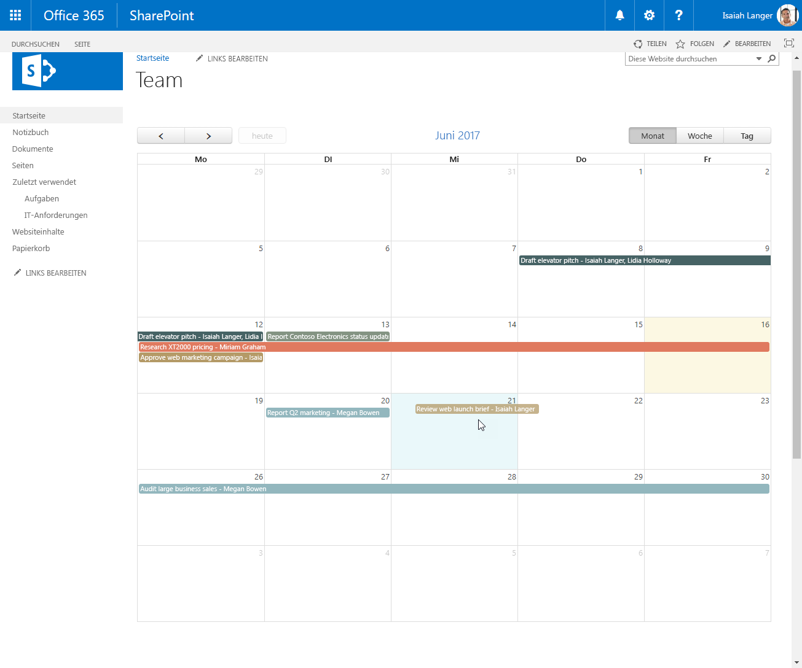

# <a name="migrate-jquery-and-fullcalendar-solution-built-using-script-editor-web-part-to-sharepoint-framework"></a>Migrieren von jQuery- und FullCalendar-Lösungen, die mit dem Script Editor-Webpart erstellt wurden, in das SharePoint-Framework

Beim Erstellen von SharePoint-Lösungen verwenden SharePoint-Entwickler häufig das jQuery-Plug-In [FullCalendar](https://fullcalendar.io) zum Anzeigen von Daten in der Kalenderansicht. FullCalendar ist eine großartige Alternative zur standardmäßigen SharePoint-Kalenderansicht, da es Ihnen ermöglicht, Daten aus verschiedenen Kalenderlisten, aus Nicht-Kalenderlisten oder sogar von außerhalb von SharePoint als Kalenderdaten zu rendern. In diesem Artikel wird veranschaulicht, wie Sie eine SharePoint-Anpassung mit FullCalendar, die mithilfe des Script Editor-Webparts erstellt wurde, in das SharePoint-Framework migrieren können.

## <a name="list-of-tasks-displayed-as-a-calendar-built-using-the-script-editor-web-part"></a>Als Kalender angezeigte Liste von Aufgaben, erstellt mithilfe des Script Editor-Webparts

Um das Verfahren der Migration einer SharePoint-Anpassung in das SharePoint-Framework mithilfe von FullCalendar zu veranschaulichen, verwenden Sie die folgende Lösung, die eine Kalenderansicht von Aufgaben zeigt, die aus einer SharePoint-Liste abgerufen wurden.


Die Lösung wird anhand des standardmäßigen Script Editor-Webparts von SharePoint erstellt. Nachfolgend ist der in der Anpassung verwendete Code aufgeführt.

```html
<script src="//code.jquery.com/jquery-1.11.1.min.js"></script>
<script src="//cdnjs.cloudflare.com/ajax/libs/moment.js/2.10.6/moment.min.js"></script>
<script src="//cdnjs.cloudflare.com/ajax/libs/fullcalendar/3.4.0/fullcalendar.min.js"></script>
<link type="text/css" rel="stylesheet" href="//cdnjs.cloudflare.com/ajax/libs/fullcalendar/3.4.0/fullcalendar.min.css" />
<div id="calendar"></div>

<script>
  var PATH_TO_DISPFORM = _spPageContextInfo.webAbsoluteUrl + "/Lists/Tasks/DispForm.aspx";
  var TASK_LIST = "Tasks";
  var COLORS = ['#466365', '#B49A67', '#93B7BE', '#E07A5F', '#849483', '#084C61', '#DB3A34'];

  displayTasks();

  function displayTasks() {
    $('#calendar').fullCalendar('destroy');
    $('#calendar').fullCalendar({
      weekends: false,
      header: {
        left: 'prev,next today',
        center: 'title',
        right: 'month,basicWeek,basicDay'
      },
      displayEventTime: false,
      // open up the display form when a user clicks on an event
      eventClick: function (calEvent, jsEvent, view) {
        window.location = PATH_TO_DISPFORM + "?ID=" + calEvent.id;
      },
      editable: true,
      timezone: "UTC",
      droppable: true, // this allows things to be dropped onto the calendar
      // update the end date when a user drags and drops an event 
      eventDrop: function (event, delta, revertFunc) {
        updateTask(event.id, event.start, event.end);
      },
      // put the events on the calendar 
      events: function (start, end, timezone, callback) {
        var startDate = start.format('YYYY-MM-DD');
        var endDate = end.format('YYYY-MM-DD');

        var restQuery = "/_api/Web/Lists/GetByTitle('" + TASK_LIST + "')/items?$select=ID,Title,\
Status,StartDate,DueDate,AssignedTo/Title&$expand=AssignedTo&\
$filter=((DueDate ge '" + startDate + "' and DueDate le '" + endDate + "')or(StartDate ge '" + startDate + "' and StartDate le '" + endDate + "'))";

        $.ajax({
          url: _spPageContextInfo.webAbsoluteUrl + restQuery,
          type: "GET",
          dataType: "json",
          headers: {
            Accept: "application/json;odata=nometadata"
          }
        })
          .done(function (data, textStatus, jqXHR) {
            var personColors = {};
            var colorNo = 0;

            var events = data.value.map(function (task) {
              var assignedTo = task.AssignedTo.map(function (person) {
                return person.Title;
              }).join(', ');

              var color = personColors[assignedTo];
              if (!color) {
                color = COLORS[colorNo++];
                personColors[assignedTo] = color;
              }
              if (colorNo >= COLORS.length) {
                colorNo = 0;
              }

              return {
                title: task.Title + " - " + assignedTo,
                id: task.ID,
                color: color, // specify the background color and border color can also create a class and use className parameter. 
                start: moment.utc(task.StartDate).add("1", "days"),
                end: moment.utc(task.DueDate).add("1", "days") // add one day to end date so that calendar properly shows event ending on that day
              };
            });

            callback(events);
          });
      }
    });
  }

  function updateTask(id, startDate, dueDate) {
    // subtract the previously added day to the date to store correct date
    var sDate = moment.utc(startDate).add("-1", "days").format('YYYY-MM-DD') + "T" +
      startDate.format("hh:mm") + ":00Z";
    if (!dueDate) {
      dueDate = startDate;
    }
    var dDate = moment.utc(dueDate).add("-1", "days").format('YYYY-MM-DD') + "T" +
      dueDate.format("hh:mm") + ":00Z";

    $.ajax({
      url: _spPageContextInfo.webAbsoluteUrl + '/_api/contextinfo',
      type: 'POST',
      headers: {
        'Accept': 'application/json;odata=nometadata'
      }
    })
      .then(function (data, textStatus, jqXHR) {
        return $.ajax({
          url: _spPageContextInfo.webAbsoluteUrl +
          "/_api/Web/Lists/getByTitle('" + TASK_LIST + "')/Items(" + id + ")",
          type: 'POST',
          data: JSON.stringify({
            StartDate: sDate,
            DueDate: dDate,
          }),
          headers: {
            Accept: "application/json;odata=nometadata",
            "Content-Type": "application/json;odata=nometadata",
            "X-RequestDigest": data.FormDigestValue,
            "IF-MATCH": "*",
            "X-Http-Method": "PATCH"
          }
        });
      })
      .done(function (data, textStatus, jqXHR) {
        alert("Update Successful");
      })
      .fail(function (jqXHR, textStatus, errorThrown) {
        alert("Update Failed");
      })
      .always(function () {
        displayTasks();
      });
  }
</script>
```

> Diese Lösung basiert auf der Arbeit von Mark Rackley, Office Servers and Services MVP und Chief Strategy Officer bei PAIT Group. Weitere Informationen zur ursprünglichen Lösung finden Sie unter [http://www.markrackley.net/2017/06/07/using-fullcalendar-io-to-create-custom-calendars-in-sharepoint/](http://www.markrackley.net/2017/06/07/using-fullcalendar-io-to-create-custom-calendars-in-sharepoint/).

Zuerst lädt die Anpassung die Bibliotheken, die verwendet werden: jQuery, Moment.js und FullCalendar (Zeilen 1 bis 4). Als Nächstes wird das div-Element definiert, in das die generierte Kalenderansicht eingefügt werden soll (Zeile 5). Dann werden zwei Funktionen definiert: **displayTasks** zum Anzeigen von Aufgaben in der Kalenderansicht und **updateTask**, das nach dem Ziehen und Ablegen einer Aufgabe auf ein anderes Datum ausgelöst wird und die Daten im zugrunde liegenden Listenelement aktualisiert. Jede Funktion definiert eine eigene REST-Abfrage, die dann für die Kommunikation mit der REST-API für SharePoint-Listen zum Abrufen oder Aktualisieren von Listenelementen verwendet wird.

Mithilfe des jQuery-Plug-Ins FullCalendar erhalten Benutzer mit wenig Aufwand reichhaltige Lösungen, die z. B. verschiedene Farben zum Kennzeichnen von verschiedenen Ereignissen verwenden oder mit Drag & Drop Ereignisse neu organisieren können.



## <a name="migrate-the-tasks-calendar-solution-from-the-script-editor-web-part-to-the-sharepoint-framework"></a>Migrieren der Aufgabenkalenderlösung vom Script Editor-Webpart in das SharePoint-Framework

> **Hinweis:** Bevor Sie die Schritte in diesem Artikel durchführen, müssen Sie [eine Entwicklungsumgebung einrichten](../../set-up-your-development-environment), in der Sie SharePoint-Framework-Lösungen erstellen können.

Das Umwandeln einer auf dem Script Editor-Webpart basierten Anpassung in das SharePoint-Framework bietet eine Reihe von Vorteilen, wie z. B. eine benutzerfreundlichere Konfiguration und die zentrale Verwaltung der Lösung. Es folgt eine Schritt-für-Schritt-Beschreibung dazu, wie Sie die Lösung in das SharePoint-Framework migrieren können. Sie migrieren die Lösung zunächst in das SharePoint-Framework, wobei so wenige Änderungen am ursprünglichen Code wie möglich vorgenommen werden. Später transformieren Sie den Code der Lösung in TypeScript, um die Sicherheitsfeatures nutzen zu können, die es während der Entwicklung bietet. Und Sie ersetzen einigen Code durch die SharePoint-Framework-API, um von deren Funktionen zu profitieren und die Lösung weiter zu vereinfachen.

> Der Quellcode des Projekts in den verschiedenen Phasen der Migration steht unter [https://github.com/SharePoint/sp-dev-fx-webparts/tree/master/tutorials/tutorial-migrate-fullcalendar](https://github.com/SharePoint/sp-dev-fx-webparts/tree/master/tutorials/tutorial-migrate-fullcalendar) zur Verfügung.

### <a name="create-new-sharepoint-framework-project"></a>Erstellen eines neuen SharePoint-Framework-Projekts

Erstellen Sie zunächst einen neuen Ordner für Ihr Projekt:

```sh
md fullcalendar-taskscalendar
```

Navigieren Sie zum Projektordner:

```sh
cd fullcalendar-taskscalendar
```

Führen Sie im Projektordner den SharePoint Framework-Yeoman-Generator aus, um ein Gerüst für ein neues SharePoint Framework-Projekt zu erstellen:

```sh
yo @microsoft/sharepoint
```

Es werden mehrere Eingabeaufforderungen angezeigt. Definieren Sie die Werte jeweils wie folgt:
- **fullcalendar-taskscalendar** als Ihren Lösungsnamen
- **Aktuellen Ordner verwenden** als Speicherort für die Dateien
- **WebPart** als die zu erstellende clientseitige Komponente
- **Aufgabenkalender** als Name des Webparts
- **Zeigt Aufgaben in der Kalenderansicht** als Beschreibung des Webparts
- **No javaScript web framework** als Eintrittspunkt für die Webpart-Erstellung


Öffnen Sie den Projektordner in Ihrem Code-Editor, sobald die Gerüsterstellung abgeschlossen ist. In diesem Tutorial verwenden Sie Visual Studio Code.


### <a name="load-javascript-libraries"></a>Laden von JavaScript-Bibliotheken

Ähnlich wie bei der ursprünglichen Lösung, die mit dem Script Editor-Webpart erstellt wurde, müssen Sie zunächst die JavaScript-Bibliotheken laden, die von der Lösung benötigt werden. In SharePoint-Framework umfasst dies in der Regel zwei Schritte: die Angabe der URL, über die die Bibliothek geladen werden soll, und ein Verweis auf die Bibliothek im Code.

Beginnen Sie, indem Sie die URLs angeben, über die die Bibliotheken geladen werden sollen. Öffnen Sie im Code-Editor die Datei **./config/config.json**, und ändern Sie den Abschnitt **externals** wie folgt:

```json
{
  "externals": {
    "jquery": "https://code.jquery.com/jquery-1.11.1.min.js",
    "moment": "https://cdnjs.cloudflare.com/ajax/libs/moment.js/2.10.6/moment.min.js",
    "fullcalendar": "https://cdnjs.cloudflare.com/ajax/libs/fullcalendar/3.4.0/fullcalendar.min.js"
  }
}
```

Öffnen Sie als Nächstes die Datei **./src/webparts/tasksCalendar/TasksCalendarWebPart.ts**, und fügen Sie nach der letzten **import**-Anweisung Folgendes hinzu:

```ts
import 'jquery';
import 'moment';
import 'fullcalendar';
```

### <a name="define-container-div"></a>Definieren des div-Containers

Genau wie bei der ursprünglichen Lösung müssen Sie im nächsten Schritt den Ort definieren, an dem der Kalender gerendert werden soll. Öffnen Sie im Code-Editor die Datei **./src/webparts/tasksCalendar/TasksCalendarWebPart.ts**, und ändern Sie die **render**-Methode in:

```ts
export default class ItRequestsWebPart extends BaseClientSideWebPart<IItRequestsWebPartProps> {
  public render(): void {
    this.domElement.innerHTML = `
      <div class="${styles.tasksCalendar}">
        <link type="text/css" rel="stylesheet" href="//cdnjs.cloudflare.com/ajax/libs/fullcalendar/3.4.0/fullcalendar.min.css" />
        <div id="calendar"></div>
      </div>`;
  }
  // ...
}
```

### <a name="initiate-fullcalendar-and-load-data"></a>Initiieren von FullCalendar und Laden von Daten

Der letzte Schritt besteht darin, den Code einzubeziehen, der das jQuery-Plug-In FullCalendar initiiert und die Daten aus SharePoint lädt. Erstellen Sie im Ordner **./src/webparts/tasksCalendar** eine neue Datei namens **script.js**, und fügen Sie den folgenden Code ein:

```js
var moment = require('moment');

var PATH_TO_DISPFORM = window.webAbsoluteUrl + "/Lists/Tasks/DispForm.aspx";
var TASK_LIST = "Tasks";
var COLORS = ['#466365', '#B49A67', '#93B7BE', '#E07A5F', '#849483', '#084C61', '#DB3A34'];

displayTasks();

function displayTasks() {
  $('#calendar').fullCalendar('destroy');
  $('#calendar').fullCalendar({
    weekends: false,
    header: {
      left: 'prev,next today',
      center: 'title',
      right: 'month,basicWeek,basicDay'
    },
    displayEventTime: false,
    // open up the display form when a user clicks on an event
    eventClick: function (calEvent, jsEvent, view) {
      window.location = PATH_TO_DISPFORM + "?ID=" + calEvent.id;
    },
    editable: true,
    timezone: "UTC",
    droppable: true, // this allows things to be dropped onto the calendar
    // update the end date when a user drags and drops an event 
    eventDrop: function (event, delta, revertFunc) {
      updateTask(event.id, event.start, event.end);
    },
    // put the events on the calendar 
    events: function (start, end, timezone, callback) {
      var startDate = start.format('YYYY-MM-DD');
      var endDate = end.format('YYYY-MM-DD');

      var restQuery = "/_api/Web/Lists/GetByTitle('" + TASK_LIST + "')/items?$select=ID,Title,\
Status,StartDate,DueDate,AssignedTo/Title&$expand=AssignedTo&\
$filter=((DueDate ge '" + startDate + "' and DueDate le '" + endDate + "')or(StartDate ge '" + startDate + "' and StartDate le '" + endDate + "'))";

      $.ajax({
        url: window.webAbsoluteUrl + restQuery,
        type: "GET",
        dataType: "json",
        headers: {
          Accept: "application/json;odata=nometadata"
        }
      })
        .done(function (data, textStatus, jqXHR) {
          var personColors = {};
          var colorNo = 0;

          var events = data.value.map(function (task) {
            var assignedTo = task.AssignedTo.map(function (person) {
              return person.Title;
            }).join(', ');

            var color = personColors[assignedTo];
            if (!color) {
              color = COLORS[colorNo++];
              personColors[assignedTo] = color;
            }
            if (colorNo >= COLORS.length) {
              colorNo = 0;
            }

            return {
              title: task.Title + " - " + assignedTo,
              id: task.ID,
              color: color, // specify the background color and border color can also create a class and use className parameter. 
              start: moment.utc(task.StartDate).add("1", "days"),
              end: moment.utc(task.DueDate).add("1", "days") // add one day to end date so that calendar properly shows event ending on that day
            };
          });

          callback(events);
        });
    }
  });
}

function updateTask(id, startDate, dueDate) {
  // subtract the previously added day to the date to store correct date
  var sDate = moment.utc(startDate).add("-1", "days").format('YYYY-MM-DD') + "T" +
    startDate.format("hh:mm") + ":00Z";
  if (!dueDate) {
    dueDate = startDate;
  }
  var dDate = moment.utc(dueDate).add("-1", "days").format('YYYY-MM-DD') + "T" +
    dueDate.format("hh:mm") + ":00Z";

  $.ajax({
    url: window.webAbsoluteUrl + '/_api/contextinfo',
    type: 'POST',
    headers: {
      'Accept': 'application/json;odata=nometadata'
    }
  })
    .then(function (data, textStatus, jqXHR) {
      return $.ajax({
        url: window.webAbsoluteUrl +
        "/_api/Web/Lists/getByTitle('" + TASK_LIST + "')/Items(" + id + ")",
        type: 'POST',
        data: JSON.stringify({
          StartDate: sDate,
          DueDate: dDate,
        }),
        headers: {
          Accept: "application/json;odata=nometadata",
          "Content-Type": "application/json;odata=nometadata",
          "X-RequestDigest": data.FormDigestValue,
          "IF-MATCH": "*",
          "X-Http-Method": "PATCH"
        }
      });
    })
    .done(function (data, textStatus, jqXHR) {
      alert("Update Successful");
    })
    .fail(function (jqXHR, textStatus, errorThrown) {
      alert("Update Failed");
    })
    .always(function () {
      displayTasks();
    });
}
```

Dieser Code ist fast identisch mit dem ursprünglichen Code der Script Editor-Webpart-Anpassung. Der einzige Unterschied besteht darin, dass dort, wo der ursprüngliche Code die URL des aktuellen Webs aus der von SharePoint festgelegten globalen Variablen **\_spPageContextInfo** abgerufen hat (Zeilen 8, 45, 96 und 104), der Code im SharePoint-Framework eine benutzerdefinierte Variable verwendet, die Sie in dem Webpart festlegen müssen. Clientseitige Webparts des SharePoint-Frameworks können sowohl auf klassischen als auch auf modernen Seiten verwendet werden. Während die Variable **_spPageContextInfo** auf klassischen Seiten vorhanden ist, fehlt sie auf modernen Seiten. Deshalb können Sie sich nicht darauf verlassen und benötigen eine benutzerdefinierte Eigenschaft, die Sie stattdessen selbst steuern können.

Um diese Datei im Webpart zu referenzieren, öffnen Sie im Code-Editor die Datei **./src/webparts/tasksCalendar/TasksCalendarWebPart.ts**, und ändern Sie die **render**-Methode in:

```ts
export default class ItRequestsWebPart extends BaseClientSideWebPart<IItRequestsWebPartProps> {
  public render(): void {
    this.domElement.innerHTML = `
      <div class="${styles.tasksCalendar}">
        <link type="text/css" rel="stylesheet" href="//cdnjs.cloudflare.com/ajax/libs/fullcalendar/3.4.0/fullcalendar.min.css" />
        <div id="calendar"></div>
      </div>`;

    (window as any).webAbsoluteUrl = this.context.pageContext.web.absoluteUrl;
    require('./script');
  }
  // ...
}
```

Überprüfen Sie, ob das Webpart wie erwartet funktioniert, indem Sie in der Befehlszeile Folgendes ausführen:

```sh
gulp serve --nobrowser
```

Da das Webpart die Daten aus SharePoint lädt, müssen Sie das Webpart mit der gehosteten SharePoint-Framework-Arbeitsfläche testen. Navigieren Sie zu **https://yourtenant.sharepoint.com/_layouts/workbench.aspx**, und fügen Sie das Webpart zum Canvas hinzu. Die in der Kalenderansicht angezeigten Aufgaben sollten nun mit dem jQuery-Plug-In FullCalendar angezeigt werden.


## <a name="add-support-for-configuring-the-web-part-through-web-part-properties"></a>Hinzufügen von Unterstützung zum Konfigurieren des Webparts über Webparteigenschaften

In den vorherigen Schritten haben Sie die Aufgabenkalenderlösung aus dem Script Editor-Webpart in das SharePoint-Framework migriert. Obwohl die Lösung bereits wie erwartet funktioniert, nutzt sie keine der Vorteile des SharePoint-Framework. Der Name der Liste, aus der die Aufgaben geladen werden, ist im Code enthalten, und der Code selbst ist einfaches JavaScript, das schwerer umgestaltet werden kann als TypeScript. Die folgenden Schritte veranschaulichen, wie Sie die vorhandene Lösung erweitern können, um Benutzern zu ermöglichen, den Namen der Liste anzugeben, aus der Daten geladen werden sollen. Später wandeln Sie den Code in TypeScript um, um seine Typsicherheitsfeatures nutzen zu können.

### <a name="define-web-part-property-for-storing-the-name-of-the-list"></a>Definieren der Webparteigenschaft zum Speichern des Listennamens

Beginnen Sie mit der Definition einer Webparteigenschaft, um den Namen der Liste zu speichern, aus der Aufgaben geladen werden sollen. Öffnen Sie im Code-Editor die Datei **./src/webparts/tasksCalendar/TasksCalendarWebPart.manifest.json**, benennen Sie die standardmäßige **description**-Eigenschaft in **listName** um, und löschen Sie den Wert.


Aktualisieren Sie als Nächstes die Oberfläche der Webparteigenschaften, um die Änderungen im Manifest zu übernehmen. Öffnen Sie im Code-Editor die Datei **./src/webparts/tasksCalendar/ITasksCalendarWebPartProps.ts**, und ändern Sie den Inhalt in:

```ts
export interface ITasksCalendarWebPartProps {
  listName: string;
}
```

Aktualisieren Sie dann die Anzeigebeschriftungen für die Eigenschaft **listName**. Öffnen Sie die Datei **./src/webparts/tasksCalendar/loc/mystrings.d.ts**, und ändern Sie den Inhalt in:

```ts
declare interface ITasksCalendarStrings {
  PropertyPaneDescription: string;
  BasicGroupName: string;
  ListNameFieldLabel: string;
}

declare module 'tasksCalendarStrings' {
  const strings: ITasksCalendarStrings;
  export = strings;
}
```

Öffnen Sie als Nächstes die Datei **./src/webparts/tasksCalendar/loc/en-us.js**, und ändern Sie den Inhalt in:

```js
define([], function() {
  return {
    "PropertyPaneDescription": "Tasks calendar settings",
    "BasicGroupName": "Data",
    "ListNameFieldLabel": "List name"
  }
});
```

Aktualisieren Sie zum Schluss das Webpart, damit es die neu definierte Eigenschaft verwendet. Öffnen Sie im Code-Editor die Datei **./src/webparts/tasksCalendar/TasksCalendarWebPart.ts**, und ändern Sie die **getPropertyPaneConfiguration**-Methode in:

```ts
export default class TasksCalendarWebPart extends BaseClientSideWebPart<ITasksCalendarWebPartProps> {
  // ...
  protected getPropertyPaneConfiguration(): IPropertyPaneConfiguration {
    return {
      pages: [
        {
          header: {
            description: strings.PropertyPaneDescription
          },
          groups: [
            {
              groupName: strings.BasicGroupName,
              groupFields: [
                PropertyPaneTextField('listName', {
                  label: strings.ListNameFieldLabel
                })
              ]
            }
          ]
        }
      ]
    };
  }

  protected get disableReactivePropertyChanges(): boolean {
    return true;
  }
}
```

Um zu verhindern, dass das Webpart neu geladen wird, wenn Benutzer den Namen der Liste eingeben, haben Sie das Webpart darüber hinaus so konfiguriert, dass es den nicht reaktiven Eigenschaftenbereich verwendet, indem Sie die **disableReactivePropertyChanges**-Methode hinzugefügt und den Rückgabewert auf **true** festgelegt haben.

### <a name="use-the-configured-name-of-the-list-to-load-the-data-from"></a>Verwenden des konfigurierten Namens der Liste, aus der Daten geladen werden sollen

Anfangs war der Name der Liste, aus der die Daten geladen werden sollen, in die REST-Abfragen eingebettet. Nun, da Benutzer diesen Namen konfigurieren können, sollte der konfigurierte Wert in die REST-Abfragen eingefügt werden, bevor sie ausgeführt werden. Die einfachste Möglichkeit, dies zu tun, besteht darin, den Inhalt der Datei **script.js** in die Haupt-Webpartdatei zu verschieben.

Öffnen Sie im Code-Editor die Datei **./src/webparts/tasksCalendar/TasksCalendarWebPart.ts**.

Ändern Sie als Erstes die Import-Anweisung, sodass die erforderlichen Bibliotheken geladen werden:

```ts
var $: any = require('jquery');
var moment: any = require('moment');

import 'fullcalendar';

var COLORS = ['#466365', '#B49A67', '#93B7BE', '#E07A5F', '#849483', '#084C61', '#DB3A34'];
```

Da Moment.js im Code referenziert wird, den Sie später verwenden, muss sein Name TypeScript bekannt sein. Andernfalls schlägt das Projekt fehl. Das gleiche gilt für jQuery. Da FullCalendar ein jQuery-Plug-In ist, das sich an das jQuery-Objekt anfügt, kann es die gleiche Weise wie zuvor importiert werden. Der letzte Teil enthält das Kopieren der Liste von Farben für die Markierung der verschiedenen Ereignisse.

Kopieren Sie als Nächstes die Funktionen **displayTasks** und **updateTask** aus der Datei **script.js**, und fügen Sie sie wie folgt innerhalb der **TasksCalendarWebPart**-Klasse ein:

```ts
export default class TasksCalendarWebPart extends BaseClientSideWebPart<ITasksCalendarWebPartProps> {
  // ...

  private displayTasks() {
    $('#calendar').fullCalendar('destroy');
    $('#calendar').fullCalendar({
      weekends: false,
      header: {
        left: 'prev,next today',
        center: 'title',
        right: 'month,basicWeek,basicDay'
      },
      displayEventTime: false,
      // open up the display form when a user clicks on an event
      eventClick: (calEvent, jsEvent, view) => {
        (window as any).location = this.context.pageContext.web.absoluteUrl +
          "/Lists/" + escape(this.properties.listName) + "/DispForm.aspx?ID=" + calEvent.id;
      },
      editable: true,
      timezone: "UTC",
      droppable: true, // this allows things to be dropped onto the calendar
      // update the end date when a user drags and drops an event 
      eventDrop: (event, delta, revertFunc) => {
        this.updateTask(event.id, event.start, event.end);
      },
      // put the events on the calendar 
      events: (start, end, timezone, callback) => {
        var startDate = start.format('YYYY-MM-DD');
        var endDate = end.format('YYYY-MM-DD');

        var restQuery = "/_api/Web/Lists/GetByTitle('" + escape(this.properties.listName) + "')/items?$select=ID,Title,\
Status,StartDate,DueDate,AssignedTo/Title&$expand=AssignedTo&\
$filter=((DueDate ge '" + startDate + "' and DueDate le '" + endDate + "')or(StartDate ge '" + startDate + "' and StartDate le '" + endDate + "'))";

        $.ajax({
          url: this.context.pageContext.web.absoluteUrl + restQuery,
          type: "GET",
          dataType: "json",
          headers: {
            Accept: "application/json;odata=nometadata"
          }
        })
          .done((data, textStatus, jqXHR) => {
            var personColors = {};
            var colorNo = 0;

            var events = data.value.map((task) => {
              var assignedTo = task.AssignedTo.map((person) => {
                return person.Title;
              }).join(', ');

              var color = personColors[assignedTo];
              if (!color) {
                color = COLORS[colorNo++];
                personColors[assignedTo] = color;
              }
              if (colorNo >= COLORS.length) {
                colorNo = 0;
              }

              return {
                title: task.Title + " - " + assignedTo,
                id: task.ID,
                color: color, // specify the background color and border color can also create a class and use className parameter. 
                start: moment.utc(task.StartDate).add("1", "days"),
                end: moment.utc(task.DueDate).add("1", "days") // add one day to end date so that calendar properly shows event ending on that day
              };
            });

            callback(events);
          });
      }
    });
  }

  private updateTask(id, startDate, dueDate) {
    // subtract the previously added day to the date to store correct date
    var sDate = moment.utc(startDate).add("-1", "days").format('YYYY-MM-DD') + "T" +
      startDate.format("hh:mm") + ":00Z";
    if (!dueDate) {
      dueDate = startDate;
    }
    var dDate = moment.utc(dueDate).add("-1", "days").format('YYYY-MM-DD') + "T" +
      dueDate.format("hh:mm") + ":00Z";

    $.ajax({
      url: this.context.pageContext.web.absoluteUrl + '/_api/contextinfo',
      type: 'POST',
      headers: {
        'Accept': 'application/json;odata=nometadata'
      }
    })
      .then((data, textStatus, jqXHR) => {
        return $.ajax({
          url: this.context.pageContext.web.absoluteUrl +
          "/_api/Web/Lists/getByTitle('" + escape(this.properties.listName) + "')/Items(" + id + ")",
          type: 'POST',
          data: JSON.stringify({
            StartDate: sDate,
            DueDate: dDate,
          }),
          headers: {
            Accept: "application/json;odata=nometadata",
            "Content-Type": "application/json;odata=nometadata",
            "X-RequestDigest": data.FormDigestValue,
            "IF-MATCH": "*",
            "X-Http-Method": "PATCH"
          }
        });
      })
      .done((data, textStatus, jqXHR) => {
        alert("Update Successful");
      })
      .fail((jqXHR, textStatus, errorThrown) => {
        alert("Update Failed");
      })
      .always(() => {
        this.displayTasks();
      });
  }

  // ...
}
```

Im Vergleich mit der vorherigen Situation gibt ein paar Änderungen im Code. Einfache JavaScript-Funktionen werden nun in TypeScript-Methoden geändert, indem das Schlüsselwort **function** durch den Modifizierer **private** ersetzt wird. Dies ist erforderlich, damit sie zur **TaskCalendarWebPart**-Klasse hinzugefügt werden können. Da sich beide Methoden jetzt in der gleichen Datei wie das Webpart befinden, können Sie, statt eine globale Variable für die URL der aktuellen Website zu definieren,im Webpartkontext direkt mithilfe der `this.context.pageContext.web.absoluteUrl`-Eigenschaft darauf zugreifen. In allen REST-Abfragen wurde zudem der feste Listenname durch den Wert der **listName**-Eigenschaft ersetzt, die den Namen der Liste wie vom Benutzer konfiguriert enthält. Bevor der Wert verwendet wird, wird er mithilfe der **escape**-Funktion von lodash mit Escapezeichen versehen, um Skripteinschleusung zu verhindern.

Als letzten Schritt ändern Sie die **render**-Methode, um die neu hinzugefügte **displayTasks**-Methode aufzurufen:

```ts
export default class TasksCalendarWebPart extends BaseClientSideWebPart<ITasksCalendarWebPartProps> {
  public render(): void {
    this.domElement.innerHTML = `
      <div class="${styles.tasksCalendar}">
        <link type="text/css" rel="stylesheet" href="//cdnjs.cloudflare.com/ajax/libs/fullcalendar/3.4.0/fullcalendar.min.css" />
        <div id="calendar"></div>
      </div>`;

    this.displayTasks();
  }
  // ...
}
```

Da Sie den Inhalt der Datei **script.js** gerade in die Haupt-Webpartdatei verschoben haben, ist **script.js** nicht mehr erforderlich, und Sie können die Datei aus dem Projekt löschen.

Um zu überprüfen, ob das Webpart wie erwartet funktioniert, führen Sie Folgendes in der Befehlszeile aus:

```sh
gulp serve --nobrowser
```

Navigieren Sie zu der gehosteten Workbench, und fügen Sie das Webpart zum Canvas hinzu. Öffnen Sie den Eigenschaftenbereich des Webparts, geben Sie den Namen der Liste mit Aufgaben an, und klicken Sie auf die Schaltfläche **Übernehmen**, um die Änderungen zu bestätigen. Sie sollten nun im Webpart in einer Kalenderansicht angezeigte Aufgaben sehen.


## <a name="transform-the-plain-javascript-code-to-typescript"></a>Transformieren des einfachen JavaScript-Codes in TypeScript

Die Verwendung von TypeScript anstatt von JavaScript bietet eine Reihe von Vorteilen. TypeScript ist nicht nur einfacher zu verwalten und umzugestalten, sondern ermöglicht auch, Fehler früher abzufangen. Die nachfolgenden Schritte beschreiben, wie Sie den ursprünglichen JavaScript-Code in TypeScript transformieren.

### <a name="add-type-definitions-for-used-libraries"></a>Hinzufügen von Typdefinitionen für verwendete Bibliotheken

Um ordnungsgemäß zu funktionieren, erfordert TypeScript Typdefinitionen für die verschiedenen Bibliotheken, die im Projekt verwendet werden. Typdefinitionen werden häufig als npm-Pakete im @types-Namespace bereitgestellt.

Beginnen Sie, indem Sie die Typdefinitionen für jQuery und FullCalendar installieren, indem Sie in der Befehlszeile Folgendes ausführen:

```sh
npm install --save-dev @types/jquery@1 @types/fullcalendar
```

Typdefinitionen für Moment.js werden zusammen mit dem Moment.js-Paket bereitgestellt. Obwohl Sie Moment.js über eine URL laden, müssen Sie das Moment.js-Paket trotzdem noch im Projekt installieren, um ihre Eingaben verwenden zu können.

Installieren Sie das Moment.js-Paket, indem Sie in der Befehlszeile Folgendes ausführen:

```sh
npm install --save moment
```

### <a name="update-package-references"></a>Aktualisieren von Paketverweisen

Um Typen der installierten Typdefinitionen verwenden zu können, müssen Sie die Verweismethode auf die Bibliotheken ändern. Öffnen Sie im Code-Editor die Datei **./src/webparts/tasksCalendar/TasksCalendarWebPart.ts**, und ändern Sie die Import-Anweisungen in:

```ts
import * as $ from 'jquery';
import 'fullcalendar';
import * as moment from 'moment';
```

### <a name="update-main-web-part-files-to-typescript"></a>Aktualisieren der Haupt-Webpartdatei in TypeScript

Da jetzt die Typdefinitionen für alle im Projekt installierten Bibliotheken vorhanden sind, können Sie mit dem Transformieren des einfachen JavaScript-Codes in TypeScript beginnen.

Beginnen Sie mit der Definition einer Oberfläche für eine Aufgabe, die Sie aus der SharePoint-Liste abrufen. Öffnen Sie im Code-Editor die Datei **./src/webparts/tasksCalendar/TasksCalendarWebPart.ts**, und fügen Sie direkt oberhalb der Webpartklasse den folgenden Codeausschnitt ein:

```ts
interface ITask {
  ID: number;
  Title: string;
  StartDate: string;
  DueDate: string;
  AssignedTo: [{ Title: string }];
}
```

Im nächsten Schritt ändern Sie in der Webpartklasse die Methoden **displayTasks** und **updateTask** in:

```ts
export default class TasksCalendarWebPart extends BaseClientSideWebPart<ITasksCalendarWebPartProps> {
  private readonly colors: string[] = ['#466365', '#B49A67', '#93B7BE', '#E07A5F', '#849483', '#084C61', '#DB3A34'];

  // ...

  private displayTasks(): void {
    $('#calendar').fullCalendar('destroy');
    $('#calendar').fullCalendar({
      weekends: false,
      header: {
        left: 'prev,next today',
        center: 'title',
        right: 'month,basicWeek,basicDay'
      },
      displayEventTime: false,
      // open up the display form when a user clicks on an event
      eventClick: (calEvent: FC.EventObject, jsEvent: MouseEvent, view: FC.ViewObject): void => {
        (window as any).location = `${this.context.pageContext.web.absoluteUrl}\
/Lists/${escape(this.properties.listName)}/DispForm.aspx?ID=${calEvent.id}`;
      },
      editable: true,
      timezone: "UTC",
      droppable: true, // this allows things to be dropped onto the calendar
      // update the end date when a user drags and drops an event 
      eventDrop: (event: FC.EventObject, delta: moment.Duration, revertFunc: Function): void => {
        this.updateTask(event.id, <moment.Moment>event.start, <moment.Moment>event.end);
      },
      // put the events on the calendar 
      events: (start: moment.Moment, end: moment.Moment, timezone: string, callback: Function): void => {
        const startDate: string = start.format('YYYY-MM-DD');
        const endDate: string = end.format('YYYY-MM-DD');

        const restQuery: string = `/_api/Web/Lists/GetByTitle('${escape(this.properties.listName)}')/items?$select=ID,Title,\
Status,StartDate,DueDate,AssignedTo/Title&$expand=AssignedTo&\
$filter=((DueDate ge '${startDate}' and DueDate le '${endDate}')or(StartDate ge '${startDate}' and StartDate le '${endDate}'))`;

        $.ajax({
          url: this.context.pageContext.web.absoluteUrl + restQuery,
          type: "GET",
          dataType: "json",
          headers: {
            Accept: "application/json;odata=nometadata"
          }
        })
          .done((data: { value: ITask[] }, textStatus: string, jqXHR: JQueryXHR): void => {
            let personColors: { [person: string]: string; } = {};
            let colorNo: number = 0;

            const events: FC.EventObject[] = data.value.map((task: ITask): FC.EventObject => {
              const assignedTo: string = task.AssignedTo.map((person: { Title: string }): string => {
                return person.Title;
              }).join(', ');

              let color: string = personColors[assignedTo];
              if (!color) {
                color = this.colors[colorNo++];
                personColors[assignedTo] = color;
              }
              if (colorNo >= this.colors.length) {
                colorNo = 0;
              }

              return {
                title: `${task.Title} - ${assignedTo}`,
                id: task.ID,
                // specify the background color and border color can also create a class and use className parameter
                color: color,
                start: moment.utc(task.StartDate).add("1", "days"),
                // add one day to end date so that calendar properly shows event ending on that day
                end: moment.utc(task.DueDate).add("1", "days")
              };
            });

            callback(events);
          });
      }
    });
  }

  private updateTask(id: number, startDate: moment.Moment, dueDate: moment.Moment): void {
    // subtract the previously added day to the date to store correct date
    const sDate: string = moment.utc(startDate).add("-1", "days").format('YYYY-MM-DD') + "T" +
      startDate.format("hh:mm") + ":00Z";
    if (!dueDate) {
      dueDate = startDate;
    }
    const dDate: string = moment.utc(dueDate).add("-1", "days").format('YYYY-MM-DD') + "T" +
      dueDate.format("hh:mm") + ":00Z";

    $.ajax({
      url: this.context.pageContext.web.absoluteUrl + '/_api/contextinfo',
      type: 'POST',
      headers: {
        'Accept': 'application/json;odata=nometadata'
      }
    })
      .then((data: { FormDigestValue: string }, textStatus: string, jqXHR: JQueryXHR): JQueryXHR => {
        return $.ajax({
          url: `${this.context.pageContext.web.absoluteUrl}\
/_api/Web/Lists/getByTitle('${escape(this.properties.listName)}')/Items(${id})`,
          type: 'POST',
          data: JSON.stringify({
            StartDate: sDate,
            DueDate: dDate,
          }),
          headers: {
            Accept: "application/json;odata=nometadata",
            "Content-Type": "application/json;odata=nometadata",
            "X-RequestDigest": data.FormDigestValue,
            "IF-MATCH": "*",
            "X-Http-Method": "PATCH"
          }
        });
      })
      .done((data: {}, textStatus: string, jqXHR: JQueryXHR): void => {
        alert("Update Successful");
      })
      .fail((jqXHR: JQueryXHR, textStatus: string, errorThrown: string): void => {
        alert("Update Failed");
      })
      .always((): void => {
        this.displayTasks();
      });
  }

  // ...
}
```

Die erste und offensichtlichste Änderung beim Transformieren von einfachem JavaScript zu TypeScript sind explizite Typen. Auch wenn sie nicht erforderlich sind, machen sie klar, welcher Datentyp wo erwartet wird. Jede Abweichung vom angegebenen Vertrag wird sofort von TypeScript abgefangen. Dies hilft Ihnen dabei, mögliche Probleme so früh wie möglich bei der Entwicklung zu finden. Dies ist besonders bei der Arbeit mit AJAX-Antworten und ihren Daten nützlich.

Eine andere Änderung, die Sie vielleicht bereits bemerkt haben, ist die Zeichenfolgeninterpolation von TypeScript. Die Verwendung der Zeichenfolgeninterpolation vereinfacht die dynamische Zeichenfolgenkomposition und verbessert die Lesbarkeit des Codes. Vergleichen Sie einfaches JavaScript:

```js
var restQuery = "/_api/Web/Lists/GetByTitle('" + TASK_LIST + "')/items?$select=ID,Title,\
Status,StartDate,DueDate,AssignedTo/Title&$expand=AssignedTo&\
$filter=((DueDate ge '" + startDate + "' and DueDate le '" + endDate + "')or(StartDate ge '" + startDate + "' and StartDate le '" + endDate + "'))";
```

mit:

```ts
const restQuery: string = `/_api/Web/Lists/GetByTitle('${escape(this.properties.listName)}')/items?$select=ID,Title,\
Status,StartDate,DueDate,AssignedTo/Title&$expand=AssignedTo&\
$filter=((DueDate ge '${startDate}' and DueDate le '${endDate}')or(StartDate ge '${startDate}' and StartDate le '${endDate}'))`;
```

Ein weiterer Vorteil der Verwendung der TypeScript-Zeichenfolgeninterpolation ist, dass Sie Anführungszeichen nicht mit Escapezeichen versehen müssen, was auch die Erstellung von REST-Abfragen vereinfacht.

Führen Sie in der Befehlszeile Folgendes aus, um zu überprüfen, dass alles wie erwartet funktioniert:

```sh
gulp serve --nobrowser
```

Navigieren Sie zu der gehosteten Workbench, und fügen Sie das Webpart zum Canvas hinzu. Obwohl sich visuell nichts geändert hat, verwendet die neue Codebasis TypeScript und seine Typdefinitionen, um Sie bei der Verwaltung der Lösung zu unterstützen.

### <a name="replace-jquery-ajax-calls-with-sharepoint-framework-api"></a>Ersetzen von jQuery-AJAX-Aufrufen durch die SharePoint-Framework-API

Im Moment verwendet die Lösung jQuery-AJAX-Aufrufe, um mit der SharePoint-REST-API zu kommunizieren. Für normale GET-Anforderungen ist die jQuery-AJAX-API ebenso einfach wie die Verwendung des SharePoint-Framework-SPHttpClient. Der wirkliche Unterschied liegt bei der Ausführung von POST-Anforderungen wie der folgenden zur Aktualisierung des Ereignisses:

```ts
$.ajax({
  url: this.context.pageContext.web.absoluteUrl + '/_api/contextinfo',
  type: 'POST',
  headers: {
    'Accept': 'application/json;odata=nometadata'
  }
})
  .then((data: { FormDigestValue: string }, textStatus: string, jqXHR: JQueryXHR): JQueryXHR => {
    return $.ajax({
      url: `${this.context.pageContext.web.absoluteUrl}\
/_api/Web/Lists/getByTitle('${escape(this.properties.listName)}')/Items(${id})`,
      type: 'POST',
      data: JSON.stringify({
        StartDate: sDate,
        DueDate: dDate,
      }),
      headers: {
        Accept: "application/json;odata=nometadata",
        "Content-Type": "application/json;odata=nometadata",
        "X-RequestDigest": data.FormDigestValue,
        "IF-MATCH": "*",
        "X-Http-Method": "PATCH"
      }
    });
  })
  .done((data: {}, textStatus: string, jqXHR: JQueryXHR): void => {
    alert("Update Successful");
  })
  // ...
```

Da Sie ein Listenelement aktualisieren möchten, müssen Sie SharePoint ein gültiges Anforderungsdigesttoken zur Verfügung stellen. Während dieses auf klassischen Seiten verfügbar ist, gilt es für 3 Minuten. Somit ist es immer am sichersten, vor dem Durchführen eines Aktualisierungsvorgangs selbst ein gültiges Token abzurufen. Nachdem Sie den Anforderungsdigest erhalten haben, müssen Sie ihn den Anforderungsheadern der Aktualisierungsanforderung hinzufügen. Sonst schlägt die Anforderung fehl.

SharePoint-Framework-SPHttpClient vereinfacht die Kommunikation mit SharePoint, da automatisch erkannt wird, ob die Anforderung eine POST-Anforderung ist und einen gültigen Anforderungsdigest benötigt. Ist dies der Fall, ruft ihn der SPHttpClient automatisch von SharePoint ab und fügt ihn der Anforderung hinzu. Im Vergleich dazu würde die gleiche Anforderung, ausgegeben mit dem SPHttpClient, wie folgt aussehen:

```ts
this.context.spHttpClient.post(`${this.context.pageContext.web.absoluteUrl}\
/_api/Web/Lists/getByTitle('${escape(this.properties.listName)}')/Items(${id})`, SPHttpClient.configurations.v1, {
  body: JSON.stringify({
    StartDate: sDate,
    DueDate: dDate,
  }),
  headers: {
    Accept: "application/json;odata=nometadata",
    "Content-Type": "application/json;odata=nometadata",
    "IF-MATCH": "*",
    "X-Http-Method": "PATCH"
  }
})
.then((response: SPHttpClientResponse): void => {
  // ...
});
```

Um die ursprünglichen jQuery-AJAX-Aufrufe durch die SharePoint-Framework-SPHttpClient-API zu ersetzen, öffnen Sie im Code-Editor die Datei **./src/webparts/tasksCalendar/TasksCalendarWebPart.ts**. Fügen Sie der Liste der Importe Folgendes hinzu:

```ts
import { SPHttpClient, SPHttpClientResponse } from '@microsoft/sp-http';
```

Ersetzen Sie in der **TasksCalendarWebPart**-Klasse die Methoden **displayTasks** und **updateTask** durch den folgenden Code:

```ts
export default class TasksCalendarWebPart extends BaseClientSideWebPart<ITasksCalendarWebPartProps> {
  // ...

  private displayTasks(): void {
    $('#calendar').fullCalendar('destroy');
    $('#calendar').fullCalendar({
      weekends: false,
      header: {
        left: 'prev,next today',
        center: 'title',
        right: 'month,basicWeek,basicDay'
      },
      displayEventTime: false,
      // open up the display form when a user clicks on an event
      eventClick: (calEvent: FC.EventObject, jsEvent: MouseEvent, view: FC.ViewObject): void => {
        (window as any).location = `${this.context.pageContext.web.absoluteUrl}\
/Lists/${escape(this.properties.listName)}/DispForm.aspx?ID=${calEvent.id}`;
      },
      editable: true,
      timezone: "UTC",
      droppable: true, // this allows things to be dropped onto the calendar
      // update the end date when a user drags and drops an event 
      eventDrop: (event: FC.EventObject, delta: moment.Duration, revertFunc: Function): void => {
        this.updateTask(event.id, <moment.Moment>event.start, <moment.Moment>event.end);
      },
      // put the events on the calendar 
      events: (start: moment.Moment, end: moment.Moment, timezone: string, callback: Function): void => {
        const startDate: string = start.format('YYYY-MM-DD');
        const endDate: string = end.format('YYYY-MM-DD');

        const restQuery: string = `/_api/Web/Lists/GetByTitle('${escape(this.properties.listName)}')/items?$select=ID,Title,\
Status,StartDate,DueDate,AssignedTo/Title&$expand=AssignedTo&\
$filter=((DueDate ge '${startDate}' and DueDate le '${endDate}')or(StartDate ge '${startDate}' and StartDate le '${endDate}'))`;

        this.context.spHttpClient.get(this.context.pageContext.web.absoluteUrl + restQuery, SPHttpClient.configurations.v1, {
          headers: {
            'Accept': "application/json;odata.metadata=none"
          }
        })
          .then((response: SPHttpClientResponse): Promise<{ value: ITask[] }> => {
            return response.json();
          })
          .then((data: { value: ITask[] }): void => {
            let personColors: { [person: string]: string; } = {};
            let colorNo: number = 0;

            const events: FC.EventObject[] = data.value.map((task: ITask): FC.EventObject => {
              const assignedTo: string = task.AssignedTo.map((person: { Title: string }): string => {
                return person.Title;
              }).join(', ');

              let color: string = personColors[assignedTo];
              if (!color) {
                color = this.colors[colorNo++];
                personColors[assignedTo] = color;
              }
              if (colorNo >= this.colors.length) {
                colorNo = 0;
              }

              return {
                title: `${task.Title} - ${assignedTo}`,
                id: task.ID,
                // specify the background color and border color can also create a class and use className paramter
                color: color,
                start: moment.utc(task.StartDate).add("1", "days"),
                // add one day to end date so that calendar properly shows event ending on that day
                end: moment.utc(task.DueDate).add("1", "days")
              };
            });

            callback(events);
          });
      }
    });
  }

  private updateTask(id: number, startDate: moment.Moment, dueDate: moment.Moment): void {
    // subtract the previously added day to the date to store correct date
    const sDate: string = moment.utc(startDate).add("-1", "days").format('YYYY-MM-DD') + "T" +
      startDate.format("hh:mm") + ":00Z";
    if (!dueDate) {
      dueDate = startDate;
    }
    const dDate: string = moment.utc(dueDate).add("-1", "days").format('YYYY-MM-DD') + "T" +
      dueDate.format("hh:mm") + ":00Z";

    this.context.spHttpClient.post(`${this.context.pageContext.web.absoluteUrl}\
/_api/Web/Lists/getByTitle('${escape(this.properties.listName)}')/Items(${id})`, SPHttpClient.configurations.v1, {
        body: JSON.stringify({
          StartDate: sDate,
          DueDate: dDate,
        }),
        headers: {
          Accept: "application/json;odata=nometadata",
          "Content-Type": "application/json;odata=nometadata",
          "IF-MATCH": "*",
          "X-Http-Method": "PATCH"
        }
      })
      .then((response: SPHttpClientResponse): void => {
        if (response.ok) {
          alert("Update Successful");
        }
        else {
          alert("Update Failed");
        }

        this.displayTasks();
      });
  }

  // ...
}
```

> **Wichtig:** Wenn Sie Metadaten in den Antworten der SharePoint-REST-API unterdrücken, müssen Sie bei Verwendung des SharePoint-Framework-SPHttpClient sicherstellen, dass Sie `application/json;odata.metadata=none` und nicht `application/json;odata=nometadata` als Wert des **Accept**-Headers verwenden. SPHttpClient verwendet OData 4.0 und benötigt den ersten Wert. Wenn Sie stattdessen den letzteren verwenden, liefert die Anfrage einen Fehler vom Typ **406 Nicht annehmbar**.

Führen Sie in der Befehlszeile Folgendes aus, um zu überprüfen, dass alles wie erwartet funktioniert:

```sh
gulp serve --nobrowser
```

Navigieren Sie zu der gehosteten Workbench, und fügen Sie das Webpart zum Canvas hinzu. Zwar gibt es immer noch keine visuellen Änderungen, aber der neue Code verwendet den SharePoint-Framework-SPHttpClient, was Ihren Code und die Verwaltung Ihre Lösung vereinfacht.