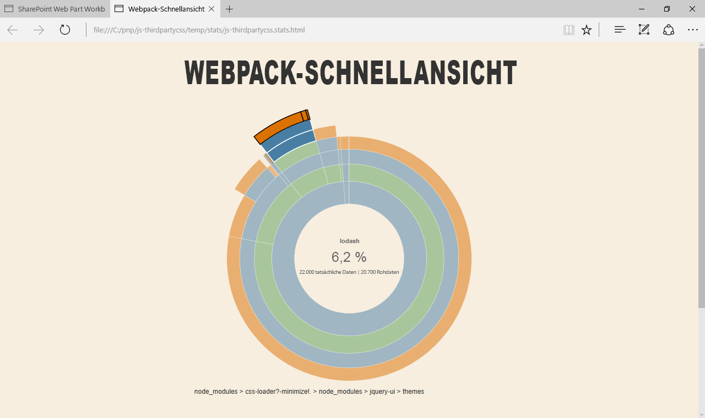

# <a name="reference-third-party-css-styles-in-sharepoint-framework-web-parts"></a>Verweisen auf CSS-Formatvorlagen von Drittanbietern in SharePoint Framework-Webparts

Es gibt viele Bibliotheken von Drittanbietern, die Sie nutzen können, um vielfältige clientseitige SharePoint Framework-Webparts zu erstellen. Neben Skripts können diese Bibliotheken häufig zusätzliche Ressourcen wie Stylesheets enthalten. In diesem Artikel werden zwei verschiedene Ansätze zum Einschließen von CSS-Formatvorlagen von Drittanbietern in Webparts beschrieben und wie sich jeder Ansatz auf das resultierende Webpart-Bundle auswirkt. Bei dem in diesem Artikel erläuterten Beispiel werden zum Anzeigen eines Accordion jQuery und jQuery UI verwendet.


> [!NOTE] 
> Bevor Sie die Schritte in diesem Artikel ausführen, müssen Sie [die Entwicklungsumgebung für Ihr clientseitiges SharePoint-Webpart einrichten](../../set-up-your-development-environment.md).

## <a name="prepare-the-project"></a>Vorbereiten des Projekts

### <a name="create-a-new-project"></a>Erstellen eines neuen Projekts

1. Erstellen Sie einen neuen Ordner für Ihr Projekt.

  ```sh
  md js-thirdpartycss
  ```

2. Wechseln Sie zum Projektordner.

  ```sh
  cd js-thirdpartycss
  ```

3. Führen Sie im Projektordner den SharePoint-Framework-Yeoman-Generator aus, um ein Gerüst für ein neues SharePoint-Framework-Projekt zu erstellen:

  ```sh
  yo @microsoft/sharepoint
  ```

4. Geben Sie die folgenden Werte ein, wenn Sie dazu aufgefordert werden:

  - **js-thirdpartycss** als Lösungsnamen
  - **Use the current folder** als Speicherort für die Dateien
  - **No javaScript web framework** als Eintrittspunkt für die Webparterstellung
  - **jQuery accordion** als Webpartname
  - **Shows jQuery accordion** als Webpartbeschreibung

  

5. Warten Sie, bis das Gerüst erstellt wurde, und sperren Sie dann mithilfe des folgenden Befehls die Version der Projektabhängigkeiten:

  ```sh
  npm shrinkwrap
  ```

6. Öffnen Sie den Projektordner in einem Code-Editor. In diesem Artikel wird Visual Studio Code in den Schritten und Screenshots verwendet, Sie können jedoch auch jeden beliebigen anderen Editor verwenden.

  

  <br/>

### <a name="add-test-content"></a>Hinzufügen von Testinhalt

Öffnen Sie im Code-Editor die Datei **./src/webparts/jQueryAccordion/JQueryAccordionWebPart.ts**. Ändern Sie die **render**-Methode in Folgendes:

```typescript
export default class JQueryAccordionWebPart extends BaseClientSideWebPart<IJQueryAccordionWebPartProps> {
  // ...
  public render(): void {
    this.domElement.innerHTML = `
      <div>
        <div class="accordion">
          <h3>Information</h3>
          <div>
            <p>
            The Volcanoes, crags, and caves park is a scenic destination for
            many visitors each year. To ensure everyone has a good
            experience and to preserve the natural beauty, access is
            restricted based on a permit system.
            </p>
            <p>
            Activities include viewing active volcanoes, skiing on mountains,
            walking across lava fields, and caving (spelunking) in caves
            left behind by the lava.
            </p>
          </div>
          <h3>Snow permit</h3>
          <div>
            <p>
            The Northern region has snow in the mountains during winter.
            Purchase a snow permit for access to approved ski areas.
            </p>
          </div>
          <h3>Hiking permit</h3>
          <div>
            <p>
            The entire region has hiking trails for your enjoyment.
            Purchase a hiking permit for access to approved trails.
            </p>
          </div>
          <h3>Volcano access</h3>
          <div>
            <p>
            The volcanic region is beautiful but also dangerous. Each
            area may have restrictions based on wind and volcanic
            conditions. There are three type of permits based on activity.
            </p>
            <ul>
              <li>Volcano drive car pass</li>
              <li>Lava field access permit</li>
              <li>Caving permit</li>
            </ul>
          </div>
        </div>
      </div>`;

      ($('.accordion', this.domElement) as any).accordion();
  }
  // ...
}
```

<br/>

Wenn Sie das Projekt jetzt erstellen, wird eine Fehlermeldung angezeigt, die besagt, dass ** $ ** nicht definiert ist. Dies liegt daran, dass das Projekt auf jQuery verweist, ohne es vorher zu laden. Es gibt zwei Vorgehensweisen zum Laden der Bibliotheken. Keiner der beiden Ansätze hat Auswirkungen darauf, wie Sie die Skripts im Code verwenden.

## <a name="approach-1-include-third-party-libraries-in-the-bundle"></a>1. Ansatz: Einschließen von Drittanbieterbibliotheken in das Bundle

Die einfachste Möglichkeit zum Verweisen auf eine Drittanbieterbibliothek in SharePoint Framework-Projekten besteht darin, dies in das generierte Bundle einzuschließen. Die Bibliothek wird als Paket installiert; im Projekt wird darauf verwiesen. Wenn Sie das Projekt bündeln, nimmt Webpack den Verweis zu der Bibliothek auf und schließt ihn in das generierte Bundle ein.

### <a name="install-libraries"></a>Installieren von Bibliotheken

1. Installieren Sie jQuery und jQuery UI, indem Sie den folgenden Befehl ausführen:

  ```sh
  npm install jquery jquery-ui --save
  ```

2. Da Sie Ihr Webpart in TypeScript erstellen, benötigen Sie auch TypeScript-Typisierungen für jQuery, die Sie durch Ausführen des folgenden Befehls installieren können:

  ```sh
  npm install @types/jquery --save
  ```

### <a name="reference-libraries-in-the-web-part"></a>Verweisen auf Bibliotheken im Webpart

Nach dem Installieren von Bibliotheken besteht der nächste Schritt darin, im Projekt auf diese zu verweisen. 

1. Öffnen Sie im Code-Editor die Datei **./src/webparts/jQueryAccordion/JQueryAccordionWebPart.ts**. Fügen Sie im oberen Abschnit direkt unterhalb der letzten **import**-Anweisung Verweise auf jQuery und jQuery UI hinzu.

  ```typescript
  import * as $ from 'jquery';
  require('../../../node_modules/jquery-ui/ui/widgets/accordion');
  ```

  Da Sie die TypeScript-Typisierungen für das jQuery-Paket installiert haben, können Sie mithilfe einer **import**-Anweisung darauf verweisen. Das jQuery UI-Paket wird jedoch anders erstellt. Im Gegensatz dazu, wie viele Module strukturiert sind, gibt es keinen Haupteintrittspunkt mit einem Verweis auf alle Komponenten, die Sie verwenden können. Stattdessen verweisen Sie direkt auf die speziellen Komponenten, die Sie verwenden möchten. Der Einstiegspunkt dieser Komponente enthält alle Verweise auf Abhängigkeiten, die für die ordnungsgemäße Funktion erforderlich sind.

2. Vergewissern Sie sich mithilfe des folgenden Befehls, dass das Projekt erstellt wird:

  ```sh
  gulp serve
  ```

3. Nach dem Hinzufügen des Webparts zum Zeichenbereich sollten Sie das Accordion in Aktion sehen.

  

An diesem Punkt haben Sie nur auf die jQuery UI-Skripts verwiesen, was erklärt, warum das Accordion keine Formatvorlagen aufweist. Als Nächstes fügen Sie die fehlenden CSS-Formatvorlagen hinzu, um das Accordion mit Formatvorlagen zu versehen.

### <a name="reference-third-party-css-stylesheets-in-the-web-part"></a>Verweisen auf Drittanbieter-CSS-Formatvorlagen im Webpart

Das Hinzufügen von Verweisen auf CSS-Formatvorlagen von Drittanbietern, die Teil der in dem Projekt installierten Pakete sind, ist genauso einfach wie das Hinzufügen von Verweisen zu den Paketen selbst. Das SharePoint Framework bietet eine standardmäßige Unterstütztung für das Laden von CSS-Dateien über Webpack.

1. Öffnen Sie im Code-Editor die Datei **./src/webparts/jQueryAccordion/JQueryAccordionWebPart.ts**. Fügen Sie direkt unterhalb der letzten**require**-Anweisung Verweise auf CSS-Dateien von jQuery UI-Accordion hinzu.

  ```typescript
  require('../../../node_modules/jquery-ui/themes/base/core.css');
  require('../../../node_modules/jquery-ui/themes/base/accordion.css');
  require('../../../node_modules/jquery-ui/themes/base/theme.css');
  ```

  Das Verweisen auf CSS-Dateien, die Teil eines Pakets im Projekt sind, ist dem Hinzufügen von Verweisen auf JavaScript-Dateien ähnlich. Sie müssen lediglich den relativen Pfad zu der CSS-Datei angeben, die geladen werden sollen, einschließlich der **CSS**-Erweiterung. Beim Bündeln des Projekts verarbeitet Webpack diese Verweise und schließt die Dateien in das generierte Webpart-Bundle ein.

2. Vergewissern Sie sich mithilfe des folgenden Befehls, dass das Projekt erstellt wird:

  ```sh
  gulp serve
  ```

Das Accordion sollte korrekt angezeigt und mithilfe des standardmäßigen jQuery UI-Designs mit einem Branding versehen werden.


### <a name="analyze-the-contents-of-the-generated-web-part-bundle"></a>Analysieren der Inhalte des generierten Webpart-Bundles

Die einfachste Möglichkeit zum Verwenden von Drittanbieterbibliotheken und deren Ressourcen besteht darin, diese in das generierte Webpart-Bundle einzuschließen. Bei diesem Ansatz löst Webpack automatisch alle Abhängigkeiten zwischen den unterschiedlichen Bibliotheken auf, und es wird sichergestellt, dass alle Skripts in der korrekten Reihenfolge geladen werden. Der Nachteil dieses Ansatzes ist, dass alle Ressourcen, auf die verwiesen wird, bei jedem Webpart separat geladen werden. Wenn Sie also mehrere Webparts in Ihrem Projekt haben, die alle jQuery UI verwenden, lädt jedes Webpart seine eigene Kopie von jQuery UI, wodurch die Seite verlangsamt wird.

Um den Einfluss der Bibliotheken auf die Größe des generierten Webpart-Bundles zu sehen, öffnen Sie nach dem Bündeln des Projekts die Datei **./temp/stats/js-thirdpartycss.stats.html** in einem Webbrowser. Bewegen Sie den Mauszeiger über das Diagramm. Sie werden sehen, dass die CSS-Dateien von jQuery UI, auf die von dem Webpart verwiesen wird, über 6 % der gesamten Webpart-Bundle-Größe ausmachen.



Wie im Haftungsausschluss unterhalb des Diagramms erwähnt, sind die Größen nur ein Anhaltspunkt, der die Größe der Debugversion des Bundles angibt. Die endgültige Produktversion des Bundles ist erheblich kleiner. Es ist dennoch hilfreich, sich klarzumachen, aus welchen unterschiedlichen Teilen das Webpart-Bundle besteht und welche Größe diese im Vergleich zu anderen Elementen in dem Bundle aufweisen.

## <a name="approach-2-load-third-party-libraries-from-a-url"></a>2. Ansatz: Laden von Drittanbieterbibliotheken von einer URL

Eine andere Möglichkeit zum Verweisen auf Drittanbieterbibliotheken im SharePoint Framework besteht darin, von einer URL aus auf diese als öffentlicher CDN oder privat verwalteter Speicherort zu verweisen. Der größte Vorteil ist, dass beim Laden einer häufig verwendeten Bibliothek von einem öffentlichen Speicherort die Möglichkeit besteht, dass Benutzer diese spezielle Bibliothek möglicherweise schon auf ihren Computer heruntergeladen haben. In diesem Fall verwendet das SharePoint Framework die zwischengespeicherte Bibliothek erneut, sodass das Webpart schneller geladen wird.

Auch wenn Sie kein öffentliches CDN zum Laden von Bibliotheken von einem zentralen Speicherort verwenden können, ist dies aus leistungstechnischer Sicht eine bewährte Option. Das Zeigen auf eine URL ermöglicht Benutzern, das Skript nur einmal herunterzuladen und es im gesamten Portal wiederzuverwenden, wodurch das Laden von Seiten erheblich beschleunigt und die Benutzerfreundlichkeit verbessert wird.

Bedenken Sie beim Laden von Drittanbieterbibliotheken von öffentlichen URLs, dass die Verwendung dieser Bibliotheken mit einem Risiko einhergeht. Da Sie nicht den Hostingspeicherort eines bestimmten Skripts verwalten, können Sie sich über dessen Inhalt nicht sicher sein. Skripts, die vom SharePoint Framework geladen werden, werden unter dem Kontext des aktuellen Benutzers ausgeführt und können alle Aktionen ausführen, für die der Benutzer die entsprechende Berechtigung hat.  Außerdem funktioniert das Webpart nicht, wenn der Hostingspeicherort offline ist.

### <a name="install-typings-for-libraries"></a>Installieren von Typisierungen für Bibliotheken

Wenn Sie von einer URL aus auf Drittanbieterbibliotheken verweisen, müssen Sie diese nicht als Pakete in Ihrem Projekt installieren. Sie müssen die entsprechenden TypeScript-Typisierungen installieren, wenn Sie während der Entwicklung von dem Vorteil der Typsicherheit profitieren möchten.

Angenommen, Sie beginnen mit einem leeren Projekt, das Sie wie zuvor in diesem Artikel beschrieben erstellt haben: Installieren Sie TypeScript-Typisierungen für jQuery, indem Sie den folgenden Befehl ausführen:

```sh
npm install @types/jquery --save
```

### <a name="specify-urls-of-libraries"></a>Angeben der URLs von Bibliotheken

Um Drittanbieterbibliotheken von einer URL zu laden, müssen Sie die URL angeben, an dem diese sich in der Konfiguration Ihres Projekts befinden. Öffnen Sie im Code-Editor die Datei **./config/config.json**. Fügen Sie im Abschnitt **externals** den folgenden JSON-Code hinzu:

```json
{
  //...
  "externals": {
    //...
    "jquery": "https://code.jquery.com/jquery-3.1.1.min.js",
    "jquery-ui": "https://code.jquery.com/ui/1.12.1/jquery-ui.min.js"
    //...
  }
  //...
}
```

### <a name="reference-libraries-from-the-url-in-the-web-part"></a>Verweisen auf Bibliotheken von der URL im Webpart

Nachdem Sie die URL angegeben haben, die das SharePoint Framework zum Laden von jQuery und jQuery UI verwenden soll, müssen Sie im Projekt auf diese verweisen. 

1. Öffnen Sie im Code-Editor die Datei **./src/webparts/jQueryAccordion/JQueryAccordionWebPart.ts**. Fügen Sie im oberen Abschnitt direkt unterhalb der letzten **import**-Anweisung de folgenden Verweise auf jQuery und jQuery UI hinzu.

  ```typescript
  import * as $ from 'jquery';
  require('jquery-ui');
  ```

  Das Verweisen auf die Bibliotheken von der URL aus ähnelt dem Verweisen auf beide Bibliotheken, als diese als Pakete in Ihrem Projekt installiert waren. Da die TypeScript-Typisierungen für jQuery installiert sind, kann mithilfe einer **import**-Anweisung darauf verwiesen werden. Für jQuery UI müssen Sie nur das Skript auf der Seite laden.

  Da Sie **jquery** und **jquery-ui** in der Projektkonfiguration als externe Ressourcen registriert haben, verwendet das SharePoint Framework beim Verweisen auf eine dieser Bibliotheken die angegebenen URLs, um diese zur Laufzeit zu laden. Beim Bündeln des Projekts werden diese Ressourcen als extern markiert und daher aus dem Bundle ausgeschlossen.

  Ein Unterschied, der zu bedenken ist, besteht darin, dass Sie bisher jQuery UI angegeben haben, um das Accordion aus dem jQuery UI-Paket zu laden. Nun verweisen Sie jedoch von dem CDN, das alle jQuery UI-Komponenten enthält, auf jQuery.

2. Vergewissern Sie sich mithilfe des folgenden Befehls, dass das Projekt erstellt wird:

  ```sh
  gulp serve
  ```

  Nach dem Hinzufügen des Webparts zum Zeichenbereich sollten Sie das Accordion in Aktion sehen.

  

3. Öffnen Sie in Ihrem Webbrowser die Entwicklertools, wechseln Sie zu der Registerkarte, auf der die Netzwerkanfragen angezeigt werden, und laden Sie die Seite erneut. Sie werden sehen, dass sowohl jQuery als auch jQuery UI aus dem CDN geladen werden.

  

An diesem Punkt haben Sie nur auf die jQuery UI-Skripts verwiesen, was erklärt, warum das Accordion keine Formatvorlagen aufweist. Als Nächstes fügen Sie die fehlenden CSS-Formatvorlagen hinzu, um das Accordion mit Formatvorlagen zu versehen.

### <a name="reference-third-party-css-stylesheets-from-url-in-the-web-part"></a>Verweisen auf CSS-Formatvorlagen von Drittanbietern von der URL im Webpart

Das Hinzufügen von Verweisen auf CSS-Formatvorlagen von Drittanbietern von einer URL unterscheidet sich vom Verweisen auf Ressourcen von Projektpaketen. In der Projektkonfiguration in der Datei **config.json** können Sie zwar externe Ressourcen angeben, dies gilt aber nur für Skripts. Um auf CSS-Formatvorlagen von einer URL aus zu verweisen, müssen Sie stattdessen den **SPComponentLoader** verwenden.

#### <a name="load-css-from-the-url-using-the-spcomponentloader"></a>Laden von CSS von der URL mithilfe von SPComponentLoader

1. Öffnen Sie im Code-Editor die Datei **./src/webparts/jQueryAccordion/JQueryAccordionWebPart.ts**. Fügen Sie im oberen Bereich der Datei direkt nach der letzten **import**-Anweisung den folgenden Code hinzu:

  ```typescript
  import { SPComponentLoader } from '@microsoft/sp-loader';
  ```

2. Überschreiben Sie die Methode onInit() in derselben Datei wie folgt:

  ```typescript
  export default class JQueryAccordionWebPart extends BaseClientSideWebPart<IJQueryAccordionWebPartProps> {
    protected onInit(): Promise<void> {
      SPComponentLoader.loadCss('https://code.jquery.com/ui/1.12.1/themes/base/jquery-ui.min.css');
      return super.onInit();
    }

    // ...
  }
  ```

  Wenn das Webpart auf der Seite instanziiert wird, wird die jQuery UI-CSS von der angegebenen URL geladen. Diese CSS-Formatvorlage ist die kombinierte und optimierte Version der jQuery UI-CSS, die die grundlegenden Formatvorlagen, Designs und Stile für alle Komponenten enthält.

3. Vergewissern Sie sich mithilfe des folgenden Befehls, dass das Projekt erstellt wird:

  ```sh
  gulp serve
  ```

Das Accordion sollte korrekt angezeigt und mithilfe des standardmäßigen jQuery UI-Designs mit einem Branding versehen werden.


### <a name="analyze-the-contents-of-the-generated-web-part-bundle-loading-resources-from-url"></a>Analysieren der Inhalte des generierten Webpart-Bundles, das Ressourcen von der URL lädt

Öffnen Sie nach dem Erstellen des Projekts in einem Webbrowser die Datei **./temp/stats/js-thirdpartycss.stats.html**. 

Beachten Sie, dass das Bundle insgesamt wesentlich kleiner ist (7 KB verglichen mit über 300 KB, wenn jQuery und jQuery UI in das Bundle eingeschlossen werden) und dass jQuery und jQuery UI nicht in dem Diagramm aufgeführt sind, weil sie zur Laufzeit geladen werden.


## <a name="see-also"></a>Siehe auch

- [SharePoint Framework-Übersicht](../../sharepoint-framework-overview.md)