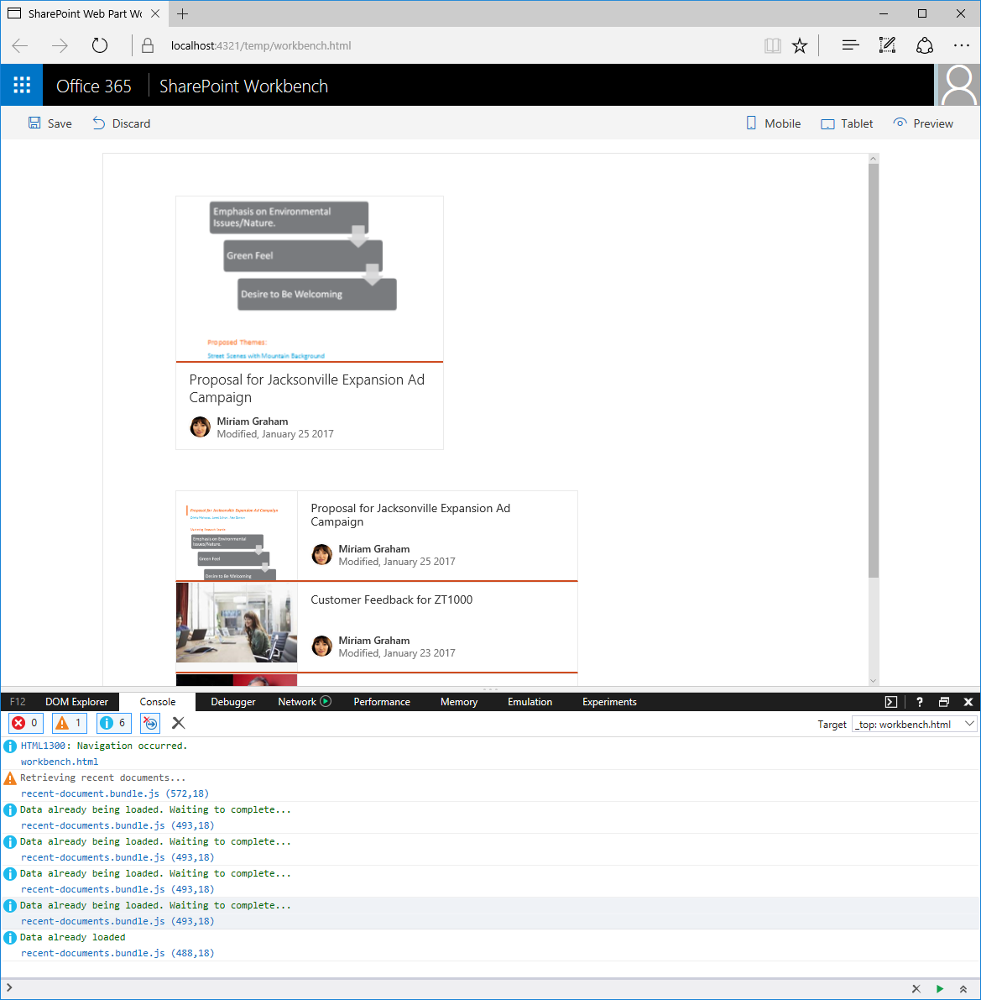
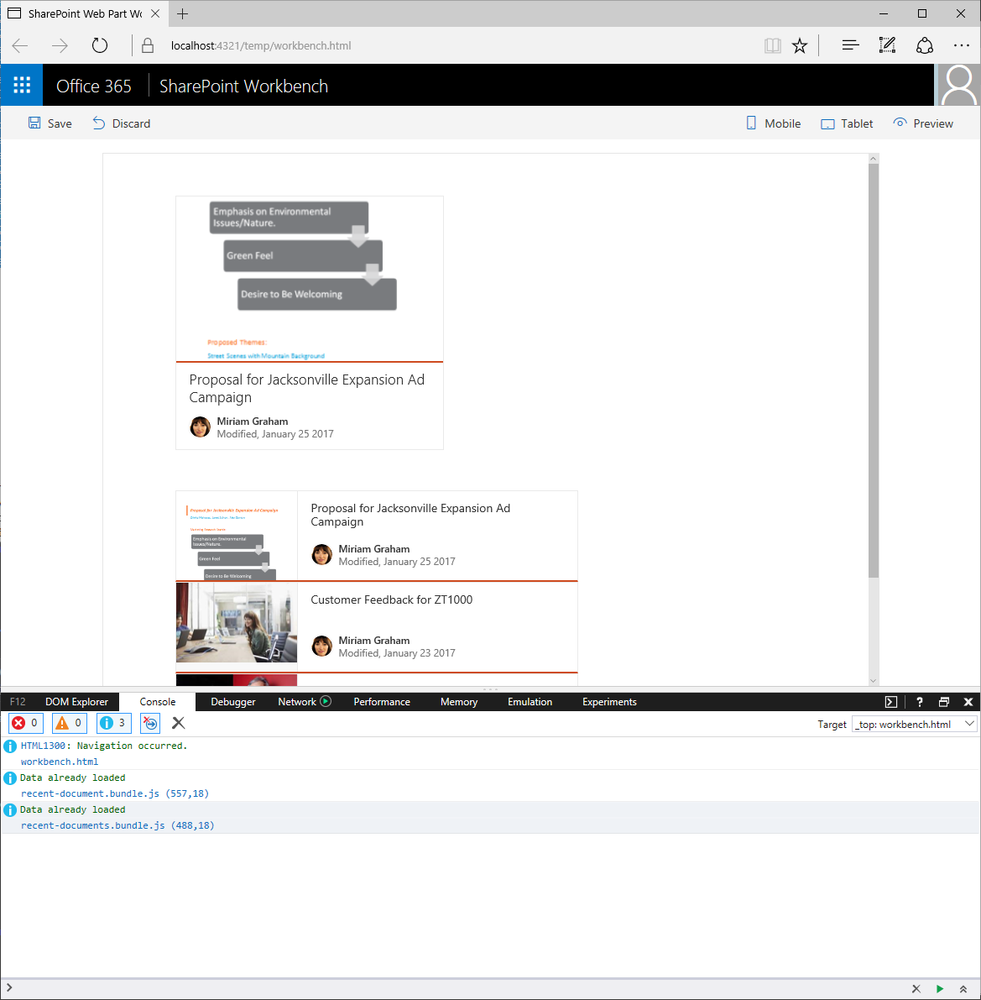

# <a name="share-data-between-client-side-web-parts"></a>Gemeinsame Verwendung von Daten zwischen clientseitigen Webparts

> Hinweis: Wir konnten noch nicht überprüfen, ob sich die Anleitung in diesem Artikel mit der allgemein verfügbaren SPFx-Version (GA-Version) umsetzen lässt. Möglicherweise treten Probleme auf, wenn Sie die neueste Version für dieses Tutorial verwenden.

Wenn Sie bei der Erstellung von clientseitigen Webparts Daten nur einmal laden und anschließend in den verschiedenen Webparts jeweils wiederverwenden, verbessert das die Leistung Ihrer Seiten und reduziert die Last in Ihrem Netzwerk. In diesem Artikel stellen wir Ihnen verschiedene Möglichkeiten vor, wie Webparts Daten gemeinsam verwenden können.

## <a name="why-share-data-between-web-parts"></a>Warum sollten Daten zwischen Webparts geteilt werden?

Bei Webpartprojekten ist es häufig der Fall, dass auf einer einzigen Seite mehrere Webparts eingesetzt werden sollen. Wenn Sie dabei jedes Webpart als unabhängigen Teil der Seite behandeln, kann es passieren, dass einander ähnliche Datasets oder sogar ein und dasselbe Dataset mehrfach auf der Seite geladen werden. Das verlangsamt das Laden der Seite unnötig und erhöht das Datenverkehrsaufkommen in Ihrem Netzwerk.


Ein Beispieldienst für das Laden von Daten könnte wie folgt aussehen:

```ts
import { IDocument } from './IDocument';

export class DocumentsService {
    public static getRecentDocument(): Promise<IDocument> {
        return new Promise<IDocument>((resolve: (document: IDocument) => void, reject: (error: any) => void): void => {
            // [...] reach out to a remote API
            resolve(recentDocument);
        });
    }

    public static getRecentDocuments(startFrom: number = 0): Promise<IDocument[]> {
        return new Promise<IDocument[]>((resolve: (documents: IDocument[]) => void, reject: (error: any) => void): void => {
            // [...] reach out to a remote API
            resolve(recentDocuments);
        });
    }
}
```

Clientseitige SharePoint Framework-Webparts würden diesen Dienst über den folgenden Code nutzen:

```ts
import { DocumentsService, IDocument } from '../../services';

export default class RecentDocumentsWebPart extends BaseClientSideWebPart<IRecentDocumentsWebPartProps> {

  public render(): void {
    this.context.statusRenderer.displayLoadingIndicator(this.domElement, 'documents');

    DocumentsService.getRecentDocuments(this.properties.startFrom)
      .then((documents: IDocument[]): void => {
        const element: React.ReactElement<IRecentDocumentsProps> = React.createElement(
          RecentDocuments,
          {
            documents: documents
          }
        );

        this.context.statusRenderer.clearLoadingIndicator(this.domElement);
        ReactDom.render(element, this.domElement);
      });
  }

  // ...
}
```

Sie können Ihre Webparts so konfigurieren, dass sie die Daten nur ein einziges Mal laden. Das beschleunigt das Laden der Seite und reduziert den Datenverkehr in Ihrem Netzwerk. Wann immer eines der Webparts auf der Seite ein spezifisches Dataset anfordert, verwendet es wenn möglich die zuvor geladenen Daten wieder.

## <a name="store-the-retrieved-data-in-a-globally-scoped-variable"></a>Speichern der abgerufenen Daten in einer Variable mit globaler Bereichsdefinition

> Hinweis: In der Regel sollten Sie keine Variablen mit globaler Bereichsdefinition verwenden. Wir verwenden Sie hier jedoch zur Veranschaulichung und aus Gründen der Einfachheit als „Democode“. Es gibt viele Muster, um dieses Problem zu umgehen, beispielsweise den Import/Export von Modulen mithilfe von TypeScript-Konzepten.

Webparts, die mit SharePoint Framework erstellt werden, werden in separaten Modulen voneinander isoliert. Daher kann ein Webpart nicht direkt auf Daten und Eigenschaften zugreifen, die von einem anderen Webpart gespeichert werden. Eine Möglichkeit, diese Designstruktur zu umgehen und die von einem Webpart geladenen Daten auch für andere Webparts auf derselben Seite verfügbar zu machen: Sie können die abgerufenen Daten einer Variable mit globaler Bereichsdefinition zuweisen.

Der oben beschriebene Datenzugriffsdienst könnte dazu wie folgt angepasst werden:

```ts
import { IDocument } from './IDocument';

export class DocumentsService {
    public static getRecentDocument(): Promise<IDocument> {
        return new Promise<IDocument>((resolve: (document: IDocument) => void, reject: (error: any) => void): void => {
            this.ensureRecentDocuments()
                .then((recentDocuments: IDocument[]): void => {
                    resolve(recentDocuments[0]);
                });
        });
    }

    public static getRecentDocuments(startFrom: number = 0): Promise<IDocument[]> {
        return new Promise<IDocument[]>((resolve: (documents: IDocument[]) => void, reject: (error: any) => void): void => {
            this.ensureRecentDocuments()
                .then((recentDocuments: IDocument[]): void => {
                    resolve(recentDocuments.slice(startFrom, startFrom + 3));
                });
        });
    }

    private static ensureRecentDocuments(): Promise<IDocument[]> {
        return new Promise<IDocument[]>((resolve: (recentDocuments: IDocument[]) => void, reject: (error: any) => void): void => {
            if ((window as any).loadedData) {
                // data already loaded so reuse
                resolve((window as any).loadedData);
                return;
            }

            if ((window as any).loadingData) {
                // data is being loaded, wait a moment and try again
                window.setTimeout((): void => {
                    DocumentsService.ensureRecentDocuments()
                        .then((recentDocuments: IDocument[]): void => {
                            resolve(recentDocuments);
                        });
                }, 100);
            }
            else {
                (window as any).loadingData = true;
                // data not loaded yet, call the remote API,
                // store the data for subsequent requests, and resolve the Promise
                (window as any).loadedData = loadedData;
                (window as any).loadingData = false;
                resolve((window as any).loadedData);
            }
        });
    }
}
```

Wie Sie sehen, wurde das Laden der Daten aus den spezifischen Methoden in die Methode `ensureRecentDocuments` verlagert. Falls die Daten bereits vorher geladen wurden, löst die Methode die Zusage auf und gibt sofort die zuvor geladenen Dokumente zurück. Werden die Daten gerade erst geladen, wartet die Methode 100 ms und versucht dann erneut, die Zusage aufzulösen.

Ein Blick in das Protokoll in den Entwicklertools zeigt, dass die Remote-API jetzt nur noch ein einziges Mal aufgerufen wird.


Wenn Sie sich die Informationsmeldungen durchlesen, bemerken Sie Folgendes: Sobald das zweite Webpart versucht, die Daten zu laden, erkennt es, dass diese bereits geladen werden. Nachdem die Daten geladen wurden, verwendet es diese bereits vorhandenen Daten wieder, statt sie selbst nochmals zu laden.


Eine Variable mit globaler Bereichsdefinition ist der einfachste Weg, Daten zwischen verschiedenen Webparts auf ein und derselben Seite auszutauschen. Ein Nachteil dieser Methode: Die Daten sind nicht nur für Webparts verfügbar, sondern auch für alle übrigen Elemente auf der Seite. Dadurch könnte es passieren, dass andere Elemente auf der Seite dieselbe Variable zur Datenspeicherung verwenden. Ihre Daten würden dann schlussendlich überschrieben werden.

## <a name="store-the-retrieved-data-in-a-cookie"></a>Speichern der abgerufenen Daten in einem Cookie

Eine weitere Möglichkeit, Daten zwischen unterschiedlichen Webparts auszutauschen, besteht darin, sie in einem Cookie zu speichern. Das hat den zusätzlichen Vorteil, dass die Daten über einen längeren Zeitraum verfügbar sind. Wenn die Daten also selten geändert werden, können Sie sie ein einziges Mal laden und dann nicht nur in den verschiedenen Webparts wiederverwenden, sondern auch auf verschiedenen Seiten.

Die Datenspeicherung in einem Cookie lässt sich fast genauso implementieren wie die Speicherung in einer Variable mit globaler Bereichsdefinition. Dass die eigentlichen Daten in einem Cookie gespeichert werden, ist im Grunde genommen der einzige Unterschied.

```ts
import { IDocument } from './IDocument';
import * as Cookies from 'js-cookie';

export class DocumentsService {
    private static cookieName: string = 'recentDocuments';

    public static getRecentDocument(): Promise<IDocument> {
        return new Promise<IDocument>((resolve: (document: IDocument) => void, reject: (error: any) => void): void => {
            this.ensureRecentDocuments()
                .then((recentDocuments: IDocument[]): void => {
                    resolve(recentDocuments[0]);
                });
        });
    }

    public static getRecentDocuments(startFrom: number = 0): Promise<IDocument[]> {
        return new Promise<IDocument[]>((resolve: (documents: IDocument[]) => void, reject: (error: any) => void): void => {
            this.ensureRecentDocuments()
                .then((recentDocuments: IDocument[]): void => {
                    resolve(recentDocuments.slice(startFrom, startFrom + 3));
                });
        });
    }

    private static ensureRecentDocuments(): Promise<IDocument[]> {
        return new Promise<IDocument[]>((resolve: (recentDocuments: IDocument[]) => void, reject: (error: any) => void): void => {
            let loadedData: IDocument[] = Cookies.getJSON(DocumentsService.cookieName);
            if (loadedData) {
                // data already loaded so reuse
                resolve(loadedData);
                return;
            }

            if ((window as any).loadingData) {
                // data is being loaded, wait a moment and try again
                window.setTimeout((): void => {
                    DocumentsService.ensureRecentDocuments()
                        .then((recentDocuments: IDocument[]): void => {
                            resolve(recentDocuments);
                        });
                }, 100);
            }
            else {
                (window as any).loadingData = true;
                // data not loaded yet, call the remote API,
                // store the data for subsequent requests, and resolve the Promise
                Cookies.set(DocumentsService.cookieName, loadedData, {
                    expires: 1,
                    path: '/'
                });
                (window as any).loadingData = false;
                resolve(loadedData);
            }
        });
    }
}
```

Im Beispiel oben wird das Paket [js-cookie](https://www.npmjs.com/package/js-cookie) verwendet, um das Arbeiten mit Cookies zu vereinfachen. Mithilfe der an die Methode `Cookies.set()` übergebenen Parameter können Sie festlegen, für welche Seiten die abgerufenen Daten verfügbar sein sollen und wie lange sie verfügbar sein sollen.

Wenn Sie die Seite das erste Mal in Microsoft Edge laden, werden die Daten ein einziges Mal abgerufen und dann von beiden Webparts wiederverwendet.



Bei nachfolgenden Anforderungen können Webparts die zuvor geladenen Daten direkt wiederverwenden, ohne zuerst die Remote-API aufrufen zu müssen.



Wenn Sie die Seite in Google Chrome laden, könnte es sein, dass die Daten zweimal über die Remote-API geladen werden und überhaupt nicht zwischengespeichert werden.


Die verschiedenen Webbrowser haben jeweils unterschiedliche Limits bezüglich der Datenmenge, die in einem Cookie gespeichert werden darf. In diesem Beispiel überschreiten die abgerufenen Daten die maximale Datenlänge, die Google Chrome in einem Cookie akzeptiert. Als Konsequenz wird kein Cookie gesetzt, und die Daten werden zweimal geladen.

Nun wissen Sie, dass Sie Cookies verwenden können, um Daten zwischen verschiedenen Webparts auszutauschen, vorausgesetzt, die betreffende Datenmenge ist nicht zu groß. Diese Methode hat jedoch auch Nachteile. Ähnlich wie Variablen mit globaler Bereichsdefinition sind auch Cookies für alle Elemente auf einer Seite oder sogar im gesamten Portal verfügbar und könnten von ihnen überschrieben werden. Darüber hinaus senden Webbrowser Cookies zusammen mit ausgehenden Anforderungen und rufen sie zusammen mit eingehenden Antworten ab, was beim Laden von Informationen im Portal zu mehr Overhead führt. Ein weiterer wichtiger Aspekt: Cookies werden dauerhaft im Webbrowser aufbewahrt. Daher sollten Sie in einem Cookie niemals vertrauliche Informationen speichern.

## <a name="store-the-retrieved-data-in-session-or-local-storage"></a>Speichern der abgerufenen Daten im Sitzungsspeicher oder im lokalen Speicher

Als Alternative zu Cookies können Sie Daten im Sitzungsspeicher oder im lokalen Speicher speichern. Ähnlich wie beim Einsatz von Cookies können Sie auch bei Verwendung des Browserspeichers die Daten dauerhaft für nachfolgende Anforderungen sowie seitenübergreifend verfügbar machen. Gegenüber Cookies hat der Browserspeicher den Vorteil, dass die dort gespeicherten Daten nicht zusammen mit ausgehenden Anforderungen gesendet werden. Außerdem können Sie im Browserspeicher mehr Daten speichern als in einem Cookie. Anders als Cookies können Sie im Browserspeicher jedoch nur Zeichenfolgenwerte speichern. Müssen komplexere Objekte gespeichert werden, müssen Sie diese also zuerst serialisieren, beispielsweise mit der nativen Methode `JSON.stringify()`.

Sollen die Daten nur für die Dauer der aktuellen Sitzung gespeichert werden, sollten Sie den Sitzungsspeicher verwenden. Sollen die Daten für einen längeren Zeitraum verfügbar sein, ist der lokale Speicher das Mittel der Wahl. Im lokalen Speicher gespeicherte Daten laufen nicht ab. Sie müssen sie selbst löschen.

Der oben implementierte Datenzugriffsdienst auf Basis von Cookies lässt sich ganz einfach so anpassen, dass stattdessen der lokale Speicher verwendet wird:

```ts
import { IDocument } from './IDocument';

export class DocumentsService {
    private static storageKey: string = 'recentDocuments';

    public static getRecentDocument(): Promise<IDocument> {
        return new Promise<IDocument>((resolve: (document: IDocument) => void, reject: (error: any) => void): void => {
            this.ensureRecentDocuments()
                .then((recentDocuments: IDocument[]): void => {
                    resolve(recentDocuments[0]);
                });
        });
    }

    public static getRecentDocuments(startFrom: number = 0): Promise<IDocument[]> {
        return new Promise<IDocument[]>((resolve: (documents: IDocument[]) => void, reject: (error: any) => void): void => {
            this.ensureRecentDocuments()
                .then((recentDocuments: IDocument[]): void => {
                    resolve(recentDocuments.slice(startFrom, startFrom + 3));
                });
        });
    }

    private static ensureRecentDocuments(): Promise<IDocument[]> {
        return new Promise<IDocument[]>((resolve: (recentDocuments: IDocument[]) => void, reject: (error: any) => void): void => {
            let loadedData: IDocument[] = localStorage ? JSON.parse(localStorage.getItem(DocumentsService.storageKey)) : undefined;
            if (loadedData) {
                // data already loaded so reuse
                resolve(loadedData);
                return;
            }

            if ((window as any).loadingData) {
                // data is being loaded, wait a moment and try again
                window.setTimeout((): void => {
                    DocumentsService.ensureRecentDocuments()
                        .then((recentDocuments: IDocument[]): void => {
                            resolve(recentDocuments);
                        });
                }, 100);
            }
            else {
                (window as any).loadingData = true;
                // data not loaded yet, call the remote API,
                // store the data for subsequent requests, and resolve the Promise
                if (localStorage) {
                    localStorage.setItem(DocumentsService.storageKey, JSON.stringify(loadedData));
                }
                (window as any).loadingData = false;
                resolve(loadedData);
            }
        });
    }
}
```

Die Implementierung eines solchen Diensts ähnelt der Implementierung der auf Cookies basierenden Variante sehr. Beachten Sie jedoch Folgendes: Der Browserspeicher kann vom Benutzer deaktiviert werden. Sie sollten also immer prüfen, ob er auch verfügbar ist, bevor Sie Vorgänge auf ihn anwenden. Ebenso wie Cookies wird auch der lokale Speicher dauerhaft im Webbrowser aufbewahrt und sollte nicht für vertrauliche Informationen verwendet werden.

## <a name="share-data-through-a-sharepoint-framework-service"></a>Gemeinsame Verwendung von Daten über einen SharePoint Framework-Dienst

Als weitere Variante für die gemeinsame Verwendung von Daten zwischen Webparts können Sie einen SharePoint Framework-Dienst erstellen, der Daten zentral lädt und verwaltet. SharePoint Framework-Dienste sind eigenständige Komponenten, die separat von Webparts erstellt werden und als separate Node-Pakete verteilt werden. SharePoint Framework-Webparts können Dienste referenzieren und sie verwenden, um bestimmte von diesen Diensten unterstützte Vorgänge auszuführen, beispielsweise das Laden von Daten.

> Weitere Informationen zu SharePoint Framework-Diensten finden Sie unter [https://github.com/SharePoint/sp-dev-docs/wiki/Tech-Note:-ServiceScope-API](https://github.com/SharePoint/sp-dev-docs/wiki/Tech-Note:-ServiceScope-API).

Der in den oben beschriebenen Beispielen demonstrierte Dienst lässt sich mit nur wenigen Modifizierungen in einen SharePoint Framework-Dienst umwandeln.

Zunächst muss der Dienst eine Schnittstelle implementieren, die die von ihm unterstützten Vorgänge und Eigenschaften darstellt:

```ts
export interface IDocumentsService {
    getRecentDocument(): Promise<IDocument>;
    getRecentDocuments(startFrom: number): Promise<IDocument[]>;
}

export class DocumentsService implements IDocumentsService {
    // ...
}
```

Anschließend muss der Dienst einen [Dienstschlüssel](https://dev.office.com/sharepoint/reference/spfx/sp-core-library/servicekey) festlegen, über den er in SharePoint Framework registriert und von Webparts genutzt wird.

```ts
import { ServiceScope, ServiceKey } from '@microsoft/sp-core-library';

export class DocumentsService implements IDocumentsService {
    public static readonly serviceKey: ServiceKey<IDocumentsService> = ServiceKey.create<IDocumentsService>('contoso:DocumentsService', DocumentsService);
    // ...

    constructor(serviceScope: ServiceScope) {
    }

    // ...
}
```

Zudem muss jeder SharePoint Framework-Dienst einen Konstruktor haben, der eine Instanz der Klasse [ServiceScope](https://dev.office.com/sharepoint/reference/spfx/sp-core-library/servicescope) als Parameter akzeptiert.

SharePoint Framework-Dienste können mithilfe desselben Projekt-Buildsystems erstellt werden wie clientseitige SharePoint Framework-Webparts. Ganz wie ein clientseitiges Webpart hat auch ein SharePoint Framework-Dienst ein Manifest. Der Hauptunterschied zu einem Webpartmanifest besteht darin, dass die Eigenschaft `componentType` auf `Library` gesetzt ist:

```json
{
  "$schema": "../../../node_modules/@microsoft/sp-module-interfaces/lib/manifestSchemas/jsonSchemas/clientSideComponentManifestSchema.json",

  "id": "69b1aacd-68f2-4147-8433-8efb08eae331",
  "alias": "DocumentsService",
  "componentType": "Library",
  "version": "0.0.1",
  "manifestVersion": 2
}
```

Sobald der SharePoint Framework-Dienst bereit ist, können Sie ihn über ein Webpart nutzen, indem Sie sein Paket referenzieren und ihn dann über seinen Schlüssel abrufen.

```ts
// ...
import { DocumentsService, IDocumentsService, IDocument } from 'react-recentdocuments-service';
import { ServiceScope } from '@microsoft/sp-core-library';

export default class RecentDocumentsWebPart extends BaseClientSideWebPart<IRecentDocumentsWebPartProps> {
  private documentsService: IDocumentsService;

  protected onInit(): Promise<void> {
    return new Promise<void>((resolve: () => void, reject: (error: any) => void): void => {
      const serviceScope: ServiceScope = this.context.serviceScope.getParent();
      serviceScope.whenFinished((): void => {
        this.documentsService = serviceScope.consume(DocumentsService.serviceKey as any) as IDocumentsService;
        resolve();
      });
    });
  }

  public render(): void {
    this.context.statusRenderer.displayLoadingIndicator(this.domElement, 'documents');

    this.documentsService.getRecentDocuments(this.properties.startFrom)
      .then((documents: IDocument[]): void => {
        const element: React.ReactElement<IRecentDocumentsProps> = React.createElement(
          RecentDocuments,
          {
            documents: documents
          }
        );

        this.context.statusRenderer.clearLoadingIndicator(this.domElement);
        ReactDom.render(element, this.domElement);
      });
  }
  // ...
}
```

Selbst wenn mehrere Webparts auf der Seite den Dienst referenzieren, wird das Dienstpaket nur ein einziges Mal heruntergeladen, und SharePoint Framework erstellt nur eine einzige Instanz des Dienstes auf der Seite. Damit haben Sie einen komfortablen Mechanismus für die zentrale Verarbeitung und Speicherung von Daten auf einer Seite zur Verfügung. Zwar ist der Einsatz von SharePoint Framework-Diensten komplexer als die zuvor in diesem Artikel beschriebenen Methoden; ein großer Vorteil ist jedoch, dass Sie die Daten von anderen Komponenten auf der Seite isolieren können und damit die Datenintegrität besser gewährleisten können.
