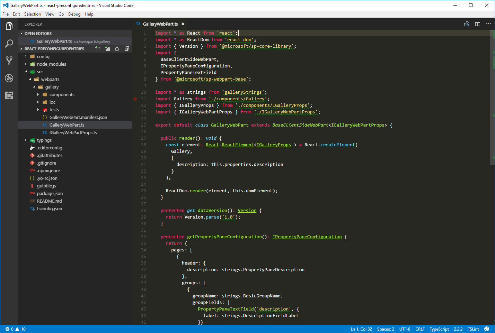

# <a name="simplify-adding-web-parts-with-preconfigured-entries"></a>Vereinfachen des Hinzufügens von Webparts mit vorkonfigurierten Einträgen

Komplexere clientseitige SharePoint Framework-Webparts können zahlreiche Eigenschaften haben, die vom Benutzer konfiguriert werden müssen. Sie können Benutzer unterstützen, indem Sie vorkonfigurierte Eigenschafteneinträge für bestimmte Szenarien hinzufügen. Ein vorkonfigurierte Eintrag initialisiert das Webpart mit vordefinierten Werten. In diesem Artikel erfahren Sie, wie Sie vorkonfigurierte Einträge in einem clientseitigen SharePoint Framework-Webpart verwenden, um Benutzern vorkonfigurierte Versionen Ihres Webparts bereitzustellen.

> **Hinweis:** Bevor Sie die Schritte in diesem Artikel ausführen, müssen Sie [die Entwicklungsumgebung für Ihr clientseitiges SharePoint-Webpart einrichten](../../set-up-your-development-environment).

## <a name="what-are-web-part-preconfigured-entries"></a>Was sind vorkonfigurierte Einträge für Webparts?

Jedes clientseitige SharePoint Framework-Webpart besteht aus zwei Teilen: dem Manifest, das das Webpart beschreibt, und dem Webpartcode.

Eine der im Webpartmanifest angegebenen Eigenschaften ist die **preconfiguredEntries**-Eigenschaft.

```json
{
  "$schema": "../../../node_modules/@microsoft/sp-module-interfaces/lib/manifestSchemas/jsonSchemas/clientSideComponentManifestSchema.json",

  "id": "6737645a-4443-4210-a70e-e5e2a219133a",
  "alias": "GalleryWebPart",
  "componentType": "WebPart",
  "version": "0.0.1",
  "manifestVersion": 2,

  "preconfiguredEntries": [{
    "groupId": "6737645a-4443-4210-a70e-e5e2a219133a",
    "group": { "default": "Under Development" },
    "title": { "default": "Gallery" },
    "description": { "default": "Shows items from the selected list" },
    "officeFabricIconFontName": "Page",
    "properties": {
      "description": "Gallery"
    }
  }]
}
```

Die **preconfiguredEntries**-Eigenschaft enthält Informationen zu Ihrem Webpart zur Verwendung in der Webpart-Toolbox. Wenn Benutzer Webparts zu der Seite hinzufügen, werden die Informationen aus der **preconfiguredEntries**-Eigenschaft verwendet, um das Webpart in der Toolbox anzuzeigen und seine Standardeinstellungen zu definieren,wenn es zu der Seite hinzugefügt wird.

Wenn Sie klassische Webparts mit vollständig vertrauenswürdigen Lösungen erstellt haben, können Sie sich jeden Eintrag im **preconfiguredEntries**-Array so vorstellen, dass er einer **.webpart**-Datei entspricht. Genau wie eine **.webpart**-Datei ist jeder Eintrag in der **preconfiguredEntries**-Eigenschaft mit dem Webpartcode verknüpft und gibt grundlegende Informationen zu dem Webpart an, z. B. den Titel oder die Beschreibung sowie Standardwerte für seine Eigenschaften.

### <a name="properties-of-a-preconfiguredentries-array-item"></a>Eigenschaften eines **preconfiguredEntries**-Arrayelements

Jedes Element im **preconfiguredEntries**-Array umfasst mehrere Eigenschaften. In der folgenden Tabelle wird der Zweck jeder Eigenschaft erläutert.

Eigenschaftsname           |Werttyp      |Erforderlich|Zweck                                               |Beispielwert
------------------------|----------------|:------:|------------------------------------------------------|------------
title                   |ILocalizedString|ja     |Der Webparttitel, der in der Toolbox angezeigt wird.              |`"title": { "default": "Weather", "nl-nl": "Weerbericht" }`
description             |ILocalizedString|ja     |Die Webpartbeschreibung, die in den Toolbox-QuickInfos angezeigt wird.|`"description": { "default": "Shows weather in the given location", "nl-nl": "Toont weerbericht voor de opgegeven locatie" } `
officeFabricIconFontName|string          |nein      |Das Symbol für das Webpart, das in der Toolbox angezeigt wird. Dessen Wert muss einer der [Office UI Fabric-Symbolnamen](https://dev.office.com/fabric#/styles/icons) sein. Wenn diese Eigenschaft einen Wert hat, wird die **iconImageUrl**-Eigenschaft ignoriert.|`"officeFabricIconFontName": "Sunny"`
iconImageUrl            |string          |nein      |Das Symbol für das Webpart, das in der Toolbox angezeigt und von einer Bild-URL dargestellt wird. Das Bild an der URL muss genau 38x38 px sein. Wenn die **officeFabricIconName**-Eigenschaft nicht über einen Wert verfügt, muss diese Eigenschaft einen Wert aufweisen.|`"iconImageUrl": "https://cdn.contoso.com/weather.png"`
groupId                 |string          |ja     |Die Gruppen-ID bestimmt, welche Toolboxgruppe das Webpart enthalten soll. Das SharePoint Framework reserviert Gruppen-IDs für Standardgruppen. Der Entwickler kann eine dieser Gruppen auswählen. Wenn eine Gruppen-ID angegeben ist, wird die **group**-Eigenschaft ignoriert. Alternativ kann der Entwickler eine eindeutige ID und einen eindeutigen Gruppennamen auswählen. In der Toolbox wird das Webpart dann in seiner eigenen Gruppe angezeigt.|`"groupId": "6737645a-4443-4210-a70e-e5e2a219133a"`
Gruppe                   |ILocalizedString|nein      |Der Name der Gruppe in der Toolbox, in der das Webpart angezeigt werden soll. Wenn kein Wert angegeben ist, wird das Webpart in der **Custom**-Gruppe angezeigt.|`"group": { "default": "Content", "nl-nl": "Inhoud" }`
Eigenschaften              |TProperties     |ja     |Ein Schlüssel-Wert-Paarobjekt mit Standardwerten für Webparteigenschaften.|`"properties": { "location": "Redmond", "numberOfDays": 3, "showIcon": true }`

Einige Webparteigenschaften weisen einen Wert vom Typ **ILocalizedString** auf. Dieser Typ ist ein Schlüssel-Wert-Paarobjekt, mit dem Entwickler Zeichenfolgen für die unterschiedlichen Gebietsschemas angeben können. Mindestens ein Wert vom Typ **ILocalizedString** muss den **Standardwert** enthalten. Entwickler können optional die Übersetzungen dieses Werts in die unterschiedlichen Gebietsschemas bereitstellen, die ihr Webpart unterstützt. Wenn das Webpart auf einer Seite in einem Gebietsschema platziert wird, das nicht in der lokalisierten Zeichenfolge aufgeführt ist, wird stattdessen der Standardwert verwendet.

Gültige **ILocalizedString**-Werte:

```json
"title": {
  "default": "Weather",
  "nl-nl": "Weerbericht"
}
```

```json
"title": {
  "default": "Weather"
}
```

Ein **ILocalizedString**-Wert, der nicht gültig ist, da der **default** -Schlüssel fehlt:

```json
"title": {
  "en-us": "Weather"
}
```

## <a name="using-preconfigured-entries-in-web-parts"></a>Verwenden vorkonfigurierter Einträge in Webparts

Um anzuzeigen, wie Sie beim Erstellen von Webparts vorkonfigurierte Einträge verwenden können, erstellen Sie ein Beispiel-Katalog-Webpart. Benutzer können mithilfe mehrerer Eigenschaften dieses Webpart konfigurieren, um Elemente aus einer ausgewählten Liste auf eine bestimmte Weise anzuzeigen. Aus Platzgründen wird die eigentliche Implementierung der Webpartlogik ausgelassen, und Sie konzentrieren sich auf die Verwendung der **preconfiguredEntries**-Eigenschaft, um vorkonfigurierte Versionen des Katalog-Webparts bereitzustellen.


### <a name="create-a-new-project"></a>Erstellen eines neuen Projekts

Erstellen Sie zunächst einen neuen Ordner für Ihr Projekt.

```sh
md react-preconfiguredentries
```

Wechseln Sie zum Projektordner.

```sh
cd react-preconfiguredentries
```

Führen Sie im Projektordner den SharePoint Framework-Yeoman-Generator aus, um ein Gerüst für ein neues SharePoint Framework-Projekt zu erstellen.

```sh
yo @microsoft/sharepoint
```

Geben Sie die folgenden Werte ein, wenn Sie dazu aufgefordert werden:

- **react-preconfiguredentries** als Lösungsname
- **Aktuellen Ordner verwenden** als Speicherort für die Dateien
- **Katalog** als Name des Webparts
- **Zeigt Elemente aus der ausgewählten Liste an** als Beschreibung Ihres Webparts
- **React** als Eintrittspunkt für die Webpart-Erstellung


Öffnen Sie den Projektordner in Ihrem Code-Editor, sobald die Gerüsterstellung abgeschlossen ist. In diesem Artikel wird Visual Studio Code in den Schritten und Screenshots verwendet, Sie können jedoch einen beliebigen Editor verwenden.



### <a name="add-web-part-properties"></a>Hinzufügen von Webparteigenschaften

Fügen Sie im Webpartmanifest Webparteigenschaften hinzu, damit Benutzer das Katalog-Webpart konfigurieren können. Öffnen Sie im Code-Editor die Datei **./src/webparts/gallery/GalleryWebPart.manifest.json**. Ersetzen Sie den Abschnitt **Eigenschaften** durch den folgenden JSON-Code:

```json
{
  //...
  "preconfiguredEntries": [{
    //...
    "properties": {
      "listName": "",
      "order": "",
      "numberOfItems": 10,
      "style": ""
    }
  }]
}
```

Die **listName**-Eigenschaft gibt den Namen der Liste an, aus der Listenelemente angezeigt werden sollen. Die **order**-Eigenschaft gibt die Reihenfolge an, in der Elemente angezeigt werden sollen, z. B. chronologisch oder umgekehrt chronologisch. Die **numberOfItems**-Eigenschaft gibt an, wie viele Elemente angezeigt werden sollen. Die **style**-Eigenschaft gibt schließlich an, wie die Elemente angezeigt werden sollen, z. B. als Miniaturansichten, was beim Anzeigen von Bildern hilfreich sein kann, oder als Liste, was für Dokumente besser geeignet ist.

Webparteigenschaften, die im Manifest angegeben werden, müssen auch der Webparteigenschaften-Schnittstelle hinzugefügt werden. Öffnen Sie im Code-Editor die Datei **./src/webparts/gallery/IGalleryWebPartProps.ts**. Ändern Sie deren Code in Folgendes:

```ts
export interface IGalleryWebPartProps {
  listName: string;
  order: string;
  numberOfItems: number;
  style: string;
}
```

Beim Erstellen von clientseitigen SharePoint Framework-Webparts mithilfe von React müssen Sie nach dem Ändern der Webparteigenschaften-Schnittstelle die **render**-Methode des Webparts aktualisieren, die diese Schnittstelle verwendet, um eine Instanz der React-Hauptkomponente zu erstellen Öffnen Sie im Code-Editor die Datei **./src/webparts/gallery/GalleryWebPart.ts**. Ändern Sie die **render**-Methode des Webparts in Folgendes:

```ts
export default class GalleryWebPart extends BaseClientSideWebPart<IGalleryWebPartProps> {
  // ...
  public render(): void {
    const element: React.ReactElement<IGalleryProps> = React.createElement(Gallery, {
      listName: this.properties.listName,
      order: this.properties.order,
      numberOfItems: this.properties.numberOfItems,
      style: this.properties.style
    });

    ReactDom.render(element, this.domElement);
  }
  // ...
}
```

Aktualisieren Sie React-Hauptkomponente so, dass die Werte der Eigenschaften angezeigt werden. Wenn das Webpart nicht konfiguriert wurde, zeigen Sie den standardmäßigen Platzhalter für das Webpart an. Öffnen Sie im Code-Editor die Datei **./src/webparts/gallery/components/Gallery.tsx**, und ändern Sie ihren Code in Folgendes:

```ts
import * as React from 'react';
import styles from './Gallery.module.scss';
import { IGalleryProps } from './IGalleryProps';
import { Placeholder } from '@microsoft/sp-webpart-base';

export default class Gallery extends React.Component<IGalleryProps, {}> {
  public render(): JSX.Element {
    if (this.needsConfiguration()) {
      return <Placeholder
        icon="ms-Icon--ThumbnailView"
        iconText="Gallery"
        description="Show items from the selected list" />;
    }
    else {
      return (
        <div className={styles.helloWorld}>
          <div className={styles.container}>
            <div className={`ms-Grid-row ms-bgColor-themeDark ms-fontColor-white ${styles.row}`}>
              <div className='ms-Grid-col ms-u-lg10 ms-u-xl8 ms-u-xlPush2 ms-u-lgPush1'>
                <span className="ms-font-xl ms-fontColor-white">
                  Welcome to SharePoint!
                </span>
                <p className='ms-font-l ms-fontColor-white'>
                  Customize SharePoint experiences using Web Parts.
                </p>
                <p className='ms-font-l ms-fontColor-white'>
                  List: {this.props.listName}<br />
                  Order: {this.props.order}<br />
                  Number of items: {this.props.numberOfItems}<br />
                  Style: {this.props.style}
                </p>
                <a href="https://aka.ms/spfx" className={styles.button}>
                  <span className={styles.label}>Learn more</span>
                </a>
              </div>
            </div>
          </div>
        </div>
      );
    }
  }

  private needsConfiguration(): boolean {
    return Gallery.isEmpty(this.props.listName) ||
      Gallery.isEmpty(this.props.order) ||
      Gallery.isEmpty(this.props.style);
  }

  private static isEmpty(value: string): boolean {
    return value === undefined ||
      value === null ||
      value.length === 0;
  }
}
```

Aktualisieren Sie die Schnittstelle der zentralen React-Komponente so, dass sie der Schnittstelle der Webparteigenschaften entspricht. Dies ist nötig, da alle Webparteigenschaften an diese Komponente umgeleitet werden. Öffnen Sie im Code-Editor die Datei **./src/webparts/gallery/components/IGalleryProps.ts**, und ändern Sie den Code wie folgt:

```ts
import { IGalleryWebPartProps } from '../IGalleryWebPartProps';

export interface IGalleryProps extends IGalleryWebPartProps {
}
```

### <a name="render-web-part-properties-in-the-property-pane"></a>Rendern von Webparteigenschaften im Eigenschaftenbereich

Damit Benutzer die neu definierten Eigenschaft verwenden können, um das Webpart zu konfigurieren, müssen die Eigenschaften im Webparteigenschaftenbereich angezeigt werden. Öffnen Sie im Code-Editor die Datei **./src/webparts/gallery/galleryWebPart.ts**. Ändern Sie im oberen Bereich der Datei die **@microsoft/sp-webpart-base**-Anweisung zum Importieren in Folgendes:

```ts
import {
  BaseClientSideWebPart,
  IPropertyPaneConfiguration,
  PropertyPaneDropdown,
  PropertyPaneSlider,
  PropertyPaneChoiceGroup
} from '@microsoft/sp-webpart-base';
```

Aktualisieren Sie dann den Code des **propertyPaneSettings**-Getters auf Folgendes:

```ts
export default class GalleryWebPart extends BaseClientSideWebPart<IGalleryWebPartProps> {
  // ...
  protected getPropertyPaneConfiguration(): IPropertyPaneConfiguration {
    return {
      pages: [
        {
          header: {
            description: strings.PropertyPaneDescription
          },
          groups: [
            {
              groupName: strings.BasicGroupName,
              groupFields: [
                PropertyPaneDropdown('listName', {
                  label: strings.ListNameFieldLabel,
                  options: [{
                    key: 'Documents',
                    text: 'Documents'
                  },
                  {
                    key: 'Images',
                    text: 'Images'
                  }]
                }),
                PropertyPaneChoiceGroup('order', {
                  label: strings.OrderFieldLabel,
                  options: [{
                    key: 'chronological',
                    text: strings.OrderFieldChronologicalOptionLabel
                  },
                  {
                    key: 'reversed',
                    text: strings.OrderFieldReversedOptionLabel
                  }]
                }),
                PropertyPaneSlider('numberOfItems', {
                  label: strings.NumberOfItemsFieldLabel,
                  min: 1,
                  max: 10,
                  step: 1
                }),
                PropertyPaneChoiceGroup('style', {
                  label: strings.StyleFieldLabel,
                  options: [{
                    key: 'thumbnails',
                    text: strings.StyleFieldThumbnailsOptionLabel
                  },
                  {
                    key: 'list',
                    text: strings.StyleFieldListOptionLabel
                  }]
                })
              ]
            }
          ]
        }
      ]
    };
  }
}
```

In einem realen Szenario würden Sie die Liste von Elementen von der aktuellen SharePoint-Website abrufen. Aus Platzgründen verwenden Sie in diesem Beispiel stattdessen eine feste Liste.

### <a name="add-localization-labels"></a>Hinzufügen von Lokalisierungsbezeichnungen

Öffnen Sie im Code-Editor die Datei **./src/webparts/gallery/loc/mystrings.d.ts**. Ändern Sie deren Code in Folgendes:

```ts
declare interface IGalleryStrings {
  PropertyPaneDescription: string;
  BasicGroupName: string;
  ListNameFieldLabel: string;
  OrderFieldLabel: string;
  OrderFieldChronologicalOptionLabel: string;
  OrderFieldReversedOptionLabel: string;
  NumberOfItemsFieldLabel: string;
  StyleFieldLabel: string;
  StyleFieldThumbnailsOptionLabel: string;
  StyleFieldListOptionLabel: string;
}

declare module 'galleryStrings' {
  const strings: IGalleryStrings;
  export = strings;
}
```

Fügen Sie die fehlenden Ressourcenzeichenfolgen hinzu, indem Sie im Code-Editor die Datei **./src/webparts/gallery/loc/en-us.js** öffnen und ihren Code in Folgendes ändern:

```js
define([], function() {
  return {
    "PropertyPaneDescription": "Description",
    "BasicGroupName": "Group Name",
    "ListNameFieldLabel": "List",
    "OrderFieldLabel": "Items order",
    "OrderFieldChronologicalOptionLabel": "chronological",
    "OrderFieldReversedOptionLabel": "reversed chronological",
    "NumberOfItemsFieldLabel": "Number of items to show",
    "StyleFieldLabel": "Items display style",
    "StyleFieldThumbnailsOptionLabel": "thumbnails",
    "StyleFieldListOptionLabel": "list"
  }
});
```

Stellen Sie sicher, dass das Projekt erstellt wird, indem Sie den folgenden Befehl ausführen:

```sh
gulp serve
```

Fügen Sie im Webbrowser das Webpart zum Zeichenbereich hinzu, und öffnen Sie dessen Eigenschaftenbereich. Sie sollten alle Eigenschaften sehen, die von Benutzern konfiguriert werden können.


Da Sie für das Webpart keine Standardwerte angegeben haben, müssen Benutzer jedes Mal, wenn sie das Webpart der Seite hinzufügen, dieses zuerst konfigurieren. Sie können dies vereinfachen, indem Sie für die häufigsten Szenarien Standardwerte angeben.

### <a name="specify-default-values-for-the-web-part"></a>Angeben von Standardwerten für das Webpart

Stellen Sie sich vor, dass Benutzer häufig das Katalog-Webpart verwenden, um die fünf zuletzt hinzugefügten Bilder anzuzeigen. Anstatt zu verlangen, dass Benutzer das Webpart jedes Mal manuell konfigurieren, könnten Sie ihnen eine vorkonfigurierte Version mit korrekten Einstellungen bereitstellen. 

Öffnen Sie im Code-Editor die Datei **./src/webparts/gallery/GalleryWebPart.manifest.json**. Ändern Sie den vorhandenen Eintrag in der **preconfiguredEntries**-Eigenschaft in Folgendes:

```json
{
  // ...
  "preconfiguredEntries": [{
    "groupId": "6737645a-4443-4210-a70e-e5e2a219133a",
    "group": { "default": "Content" },
    "title": { "default": "Recent images" },
    "description": { "default": "Shows 5 most recent images" },
    "officeFabricIconFontName": "Picture",
    "properties": {
      "listName": "Images",
      "order": "reversed",
      "numberOfItems": 5,
      "style": "thumbnails"
    }
  }]
}
```

Starten Sie das Debuggen des Projekts, indem Sie den folgenden Befehl ausführen:

```sh
gulp serve
```

> **Hinweis**: Wenn Sie das Projekt zuvor bereits gedebuggt haben, stoppen Sie das Debuggen, und starten Sie es erneut. Änderungen, die am Webpartmanifest vorgenommen wurden, werden beim Debuggen nicht automatisch in der Workbench widergespiegelt, und Sie müssen das Projekt neu erstellen, um diese zu sehen.

Wenn Sie die Webpart-Toolbox öffnen, um das Webpart zum Zeichenbereich hinzuzufügen, werden Sie sehen, dass sich der Name und das Symbol geändert haben und nun die vorkonfigurierten Einstellungen widerspiegeln.


Nach dem Hinzufügen des Webparts zu der Seite funktioniert dieses sofort mit den vorkonfigurierten Einstellungen.


### <a name="specify-multiple-preconfigured-web-part-entries"></a>Eingeben mehrerer vorkonfigurierter Webparteinträge

Stellen Sie sich vor, dass eine andere Gruppe von Benutzern häufig Ihr Katalog-Webpart verwendet, um Dokumente anzuzeigen, die kürzlich ihrer Website hinzugefügt wurden. Damit diese Ihr Webpart verwenden können, können Sie einen weiteren Satz von Voreinstellungen hinzufügen, die deren Konfigurationsanforderungen entsprechen.

Öffnen Sie im Code-Editor die Datei **./src/webparts/gallery/GalleryWebPart.manifest.json**. Ändern Sie die **preconfiguredEntries**-Eigenschaft in Folgendes:

```json
{
  // ...
  "preconfiguredEntries": [{
    "groupId": "6737645a-4443-4210-a70e-e5e2a219133a",
    "group": { "default": "Content" },
    "title": { "default": "Recent images" },
    "description": { "default": "Shows 5 most recent images" },
    "officeFabricIconFontName": "Picture",
    "properties": {
      "listName": "Images",
      "order": "reversed",
      "numberOfItems": 5,
      "style": "thumbnails"
    }
  },
  {
    "groupId": "6737645a-4443-4210-a70e-e5e2a219133a",
    "group": { "default": "Content" },
    "title": { "default": "Recent documents" },
    "description": { "default": "Shows 10 most recent documents" },
    "officeFabricIconFontName": "Documentation",
    "properties": {
      "listName": "Documents",
      "order": "reversed",
      "numberOfItems": 10,
      "style": "list"
    }
  }]
}
```

Beachten Sie, dass der zuvor vorkonfigurierte Eintrag intakt bleibt und Sie einen weiteren Eintrag daneben unter Verwendung anderer Werte für Eigenschaften hinzufügen.

Um das Ergebnis zu sehen, starten Sie das Debuggen des Projekts, indem Sie den folgenden Befehl ausführen:

```sh
gulp serve
```

Wenn Sie die Webpart-Toolbox öffnen, um das Webpart dem Zeichenbereich hinzuzufügen, werden Sie sehen, dass es zwei Webparts gibt, aus denen Sie auswählen können.


Nach dem Hinzufügen des Webparts **Zuletzt verwendete Dokumente** zu der Seite verwendet dieses sofort die spezifischen vorkonfigurierten Einstellungen.


### <a name="specify-an-unconfigured-instance-of-the-web-part"></a>Angeben einer nicht konfigurierten Instanz des Webparts

Beim Erstellen von Webparts gibt es häufig spezielle Szenarien, die das Webpart unterstützen sollte. Das Bereitstellen vorkonfigurierter Einträge für diese Szenarien erleichtert Benutzern die Verwendung des Webparts.

Je nachdem, wie Sie das Webpart erstellen, könnte das Webpart möglicherweise auch andere unvorhergesehene Szenarien unterstützen. Wenn Sie nur bestimmte vorkonfigurierte Einträge bereitstellen, ist für Benutzer möglicherweise nicht klar, dass sie Ihr Webpart für ein anderes Szenario verwenden können. Es bietet sich an, auch eine allgemeine, nicht konfigurierte Variante Ihres Webparts bereitzustellen.

Öffnen Sie im Code-Editor die Datei **./src/webparts/gallery/GalleryWebPart.manifest.json**. Ändern Sie die **preconfiguredEntries**-Eigenschaft in Folgendes:

```json
{
  // ...
  "preconfiguredEntries": [{
    "groupId": "6737645a-4443-4210-a70e-e5e2a219133a",
    "group": { "default": "Content" },
    "title": { "default": "Recent images" },
    "description": { "default": "Shows 5 most recent images" },
    "officeFabricIconFontName": "Picture",
    "properties": {
      "listName": "Images",
      "order": "reversed",
      "numberOfItems": 5,
      "style": "thumbnails"
    }
  },
  {
    "groupId": "6737645a-4443-4210-a70e-e5e2a219133a",
    "group": { "default": "Content" },
    "title": { "default": "Recent documents" },
    "description": { "default": "Shows 10 most recent documents" },
    "officeFabricIconFontName": "Documentation",
    "properties": {
      "listName": "Documents",
      "order": "reversed",
      "numberOfItems": 10,
      "style": "list"
    }
  },
  {
    "groupId": "6737645a-4443-4210-a70e-e5e2a219133a",
    "group": { "default": "Content" },
    "title": { "default": "Gallery" },
    "description": { "default": "Shows items from the selected list" },
    "officeFabricIconFontName": "CustomList",
    "properties": {
      "listName": "",
      "order": "",
      "numberOfItems": 5,
      "style": ""
    }
  }]
}
```

Die allgemeine, nicht konfigurierte Version des Webparts wird zusätzlich zu den Konfigurationen hinzugefügt, die auf bestimmte Szenarien abzielen. Wenn es keine spezifische Konfiguration gibt, die auf die Anforderungen der Benutzer abzielt, können diese so die allgemeine Version verwenden und diese gemäß ihren Anforderungen konfigurieren.

Um das Ergebnis zu sehen, starten Sie das Debuggen des Projekts, indem Sie den folgenden Befehl ausführen:

```sh
gulp serve
```

Wenn Sie die Webpart-Toolbox öffnen, um das Webpart dem Zeichenbereich hinzuzufügen, werden Sie sehen, dass es nun drei Webparts gibt, aus denen Benutzer auswählen können.

