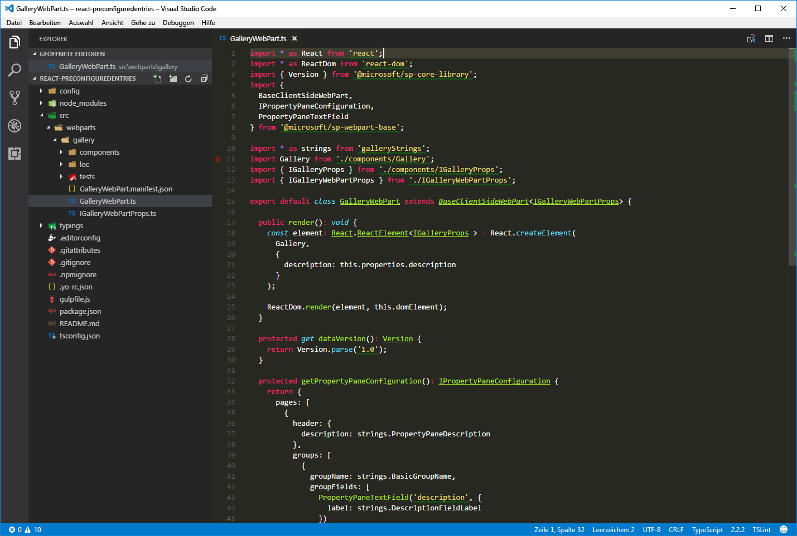

# <a name="simplify-adding-web-parts-with-preconfigured-entries"></a><span data-ttu-id="68c90-103">Vereinfachen des Hinzufügens von Webparts mit vorkonfigurierten Einträgen</span><span class="sxs-lookup"><span data-stu-id="68c90-103">Simplify adding web parts with preconfigured entries</span></span>

<span data-ttu-id="68c90-104">Komplexere clientseitige SharePoint-Framework-Webparts haben oft zahlreiche Eigenschaften, die von den Benutzern konfiguriert werden müssen.</span><span class="sxs-lookup"><span data-stu-id="68c90-104">More complex SharePoint Framework client-side web parts likely have many properties that the user must configure.</span></span> <span data-ttu-id="68c90-105">Sie können sie dabei unterstützen, indem Sie für bestimmte Szenarien vorkonfigurierte Eigenschafteneinträge hinzufügen.</span><span class="sxs-lookup"><span data-stu-id="68c90-105">You can help users by adding preconfigured property entries for specific scenarios.</span></span> <span data-ttu-id="68c90-106">Ein vorkonfigurierter Eintrag initialisiert das Webpart mit vordefinierten Werten.</span><span class="sxs-lookup"><span data-stu-id="68c90-106">A preconfigured entry initializes the web part with pre-set values.</span></span>

> [!NOTE] 
> <span data-ttu-id="68c90-107">Bevor Sie die Schritte in diesem Artikel ausführen, müssen Sie [die Entwicklungsumgebung für Ihr clientseitiges SharePoint-Webpart einrichten](../../set-up-your-development-environment.md).</span><span class="sxs-lookup"><span data-stu-id="68c90-107">Before following the steps in this article, be sure to [set up your SharePoint client-side web part development environment](../../set-up-your-development-environment.md).</span></span>

## <a name="web-part-preconfigured-entries"></a><span data-ttu-id="68c90-108">Vorkonfigurierte Einträge für Webparts</span><span class="sxs-lookup"><span data-stu-id="68c90-108">Web part preconfigured entries</span></span>

<span data-ttu-id="68c90-109">Jedes clientseitige SharePoint-Framework-Webpart besteht aus zwei Komponenten:</span><span class="sxs-lookup"><span data-stu-id="68c90-109">Each SharePoint Framework client-side web part consists of two pieces:</span></span> 

- <span data-ttu-id="68c90-110">Dem Manifest, das das Webpart beschreibt</span><span class="sxs-lookup"><span data-stu-id="68c90-110">The manifest that describes the web part</span></span>
- <span data-ttu-id="68c90-111">Dem Webpartcode</span><span class="sxs-lookup"><span data-stu-id="68c90-111">The web part code</span></span>

<span data-ttu-id="68c90-112">Eine der im Webpartmanifest definierten Eigenschaften ist die Eigenschaft **preconfiguredEntries**.</span><span class="sxs-lookup"><span data-stu-id="68c90-112">One of the properties specified in the web part manifest is the **preconfiguredEntries** property.</span></span>

```json
{
  "$schema": "../../../node_modules/@microsoft/sp-module-interfaces/lib/manifestSchemas/jsonSchemas/clientSideComponentManifestSchema.json",

  "id": "6737645a-4443-4210-a70e-e5e2a219133a",
  "alias": "GalleryWebPart",
  "componentType": "WebPart",
  "version": "0.0.1",
  "manifestVersion": 2,

  "preconfiguredEntries": [{
    "groupId": "1edbd9a8-0bfb-4aa2-9afd-14b8c45dd489", // Discover
    "group": { "default": "Under Development" },
    "title": { "default": "Gallery" },
    "description": { "default": "Shows items from the selected list" },
    "officeFabricIconFontName": "Page",
    "properties": {
      "description": "Gallery"
    }
  }]
}
```

<span data-ttu-id="68c90-p102">Die **preconfiguredEntries**-Eigenschaft enthält Informationen zu Ihrem Webpart zur Verwendung in der Webpart-Toolbox. Wenn Benutzer Webparts zu der Seite hinzufügen, werden die Informationen aus der **preconfiguredEntries**-Eigenschaft verwendet, um das Webpart in der Toolbox anzuzeigen und seine Standardeinstellungen zu definieren,wenn es zu der Seite hinzugefügt wird.</span><span class="sxs-lookup"><span data-stu-id="68c90-p102">The **preconfiguredEntries** property provides information about your web part for use in the web part toolbox. When users add web parts to the page, the information from the **preconfiguredEntries** property is used to display the web part in the toolbox and define its default settings when it's added to the page.</span></span>

<span data-ttu-id="68c90-115">Wenn Sie bereits klassische Webparts mit voll vertrauenswürdigen Lösungen erstellt haben, können Sie sich jeden Eintrag im Array **preconfiguredEntries** wie eine Datei des Typs **.webpart** vorstellen.</span><span class="sxs-lookup"><span data-stu-id="68c90-115">If you've built classic web parts with full-trust solutions, you can think of each entry in the **preconfiguredEntries** array as corresponding to a **.webpart** file.</span></span> <span data-ttu-id="68c90-116">Ganz wie eine Datei des Typs **.webpart** ist jeder Eintrag in der Eigenschaft **preconfiguredEntries** mit dem Webpartcode verknüpft und definiert grundlegende Informationen zu dem Webpart, z. B. den Titel, die Beschreibung und Standardwerte für seine Eigenschaften.</span><span class="sxs-lookup"><span data-stu-id="68c90-116">Just like a **.webpart** file, each entry in the **preconfiguredEntries** property is linked to the web part code and specifies basic information about the web part, such as its title or description as well as default values for its properties.</span></span>

### <a name="properties-of-a-preconfiguredentries-array-item"></a><span data-ttu-id="68c90-117">Eigenschaften von Elementen im Array **preconfiguredEntries**</span><span class="sxs-lookup"><span data-stu-id="68c90-117">Properties of a **preconfiguredEntries** array item</span></span>

<span data-ttu-id="68c90-p104">Jedes Element im **preconfiguredEntries**-Array umfasst mehrere Eigenschaften. In der folgenden Tabelle wird der Zweck jeder Eigenschaft erläutert.</span><span class="sxs-lookup"><span data-stu-id="68c90-p104">Each item in the **preconfiguredEntries** array consists of several properties. The following table explains the purpose of each property.</span></span>

|<span data-ttu-id="68c90-120">Eigenschaftsname</span><span class="sxs-lookup"><span data-stu-id="68c90-120">Property name</span></span> |<span data-ttu-id="68c90-121">Werttyp</span><span class="sxs-lookup"><span data-stu-id="68c90-121">Value type</span></span> |<span data-ttu-id="68c90-122">Erforderlich</span><span class="sxs-lookup"><span data-stu-id="68c90-122">Required</span></span>  |<span data-ttu-id="68c90-123">Zweck</span><span class="sxs-lookup"><span data-stu-id="68c90-123">Purpose</span></span>  |<span data-ttu-id="68c90-124">Beispielwert</span><span class="sxs-lookup"><span data-stu-id="68c90-124">Sample value</span></span> |
|:-------------|:----------|:--------:|:---------|:-------------|
|<span data-ttu-id="68c90-125">title</span><span class="sxs-lookup"><span data-stu-id="68c90-125">title</span></span>         |<span data-ttu-id="68c90-126">ILocalizedString</span><span class="sxs-lookup"><span data-stu-id="68c90-126">ILocalizedString</span></span> |<span data-ttu-id="68c90-127">ja</span><span class="sxs-lookup"><span data-stu-id="68c90-127">yes</span></span> |<span data-ttu-id="68c90-128">Der Webparttitel, der in der Toolbox angezeigt wird.</span><span class="sxs-lookup"><span data-stu-id="68c90-128">The web part title that is displayed in the toolbox.</span></span> |`"title": { "default": "Weather", "nl-nl": "Weerbericht" }`|
|<span data-ttu-id="68c90-129">description</span><span class="sxs-lookup"><span data-stu-id="68c90-129">description</span></span>             |<span data-ttu-id="68c90-130">ILocalizedString</span><span class="sxs-lookup"><span data-stu-id="68c90-130">ILocalizedString</span></span>|<span data-ttu-id="68c90-131">ja</span><span class="sxs-lookup"><span data-stu-id="68c90-131">yes</span></span>     |<span data-ttu-id="68c90-132">Die Webpartbeschreibung, die in den Toolbox-QuickInfos angezeigt wird.</span><span class="sxs-lookup"><span data-stu-id="68c90-132">The web part description that is displayed in the toolbox tooltips.</span></span>|`"description": { "default": "Shows weather in the given location", "nl-nl": "Toont weerbericht voor de opgegeven locatie" } `|
|<span data-ttu-id="68c90-133">officeFabricIconFontName</span><span class="sxs-lookup"><span data-stu-id="68c90-133">officeFabricIconFontName</span></span>|<span data-ttu-id="68c90-134">string</span><span class="sxs-lookup"><span data-stu-id="68c90-134">string</span></span>          |<span data-ttu-id="68c90-135">nein</span><span class="sxs-lookup"><span data-stu-id="68c90-135">no</span></span>      |<span data-ttu-id="68c90-136">Das Symbol für das Webpart, das in der Toolbox angezeigt wird.</span><span class="sxs-lookup"><span data-stu-id="68c90-136">The icon for the web part that is displayed in the toolbox.</span></span> <span data-ttu-id="68c90-137">Der Wert für die Eigenschaft muss einer der [Office UI Fabric-Symbolnamen](https://dev.office.com/fabric#/styles/icons) sein.</span><span class="sxs-lookup"><span data-stu-id="68c90-137">Its value must be one of the [Office UI Fabric icon names](https://dev.office.com/fabric#/styles/icons).</span></span> <span data-ttu-id="68c90-138">Ist für diese Eigenschaft ein Wert gesetzt, wird die Eigenschaft **iconImageUrl** ignoriert.</span><span class="sxs-lookup"><span data-stu-id="68c90-138">If this property has a value, the **iconImageUrl** property is ignored.</span></span>|`"officeFabricIconFontName": "Sunny"`|
|<span data-ttu-id="68c90-139">iconImageUrl</span><span class="sxs-lookup"><span data-stu-id="68c90-139">iconImageUrl</span></span>            |<span data-ttu-id="68c90-140">string</span><span class="sxs-lookup"><span data-stu-id="68c90-140">string</span></span>          |<span data-ttu-id="68c90-141">nein</span><span class="sxs-lookup"><span data-stu-id="68c90-141">no</span></span>      |<span data-ttu-id="68c90-142">Das Symbol für das Webpart, das in der Toolbox angezeigt wird. Es wird als Bild-URL angegeben.</span><span class="sxs-lookup"><span data-stu-id="68c90-142">The icon for the web part that is displayed in the toolbox and is represented by an image URL.</span></span> <span data-ttu-id="68c90-143">Das unter der URL abrufbare Bild muss genau 40 × 28 px groß sein.</span><span class="sxs-lookup"><span data-stu-id="68c90-143">The image at the URL must be exactly 40x28 px.</span></span> <span data-ttu-id="68c90-144">Für diese Eigenschaft muss ein Wert angegeben werden, wenn für die Eigenschaft **officeFabricIconName** kein Wert angegeben ist.</span><span class="sxs-lookup"><span data-stu-id="68c90-144">If the **officeFabricIconName** property does not have a value, this property must have a value.</span></span>|`"iconImageUrl": "https://cdn.contoso.com/weather.png"`|
|<span data-ttu-id="68c90-145">groupId</span><span class="sxs-lookup"><span data-stu-id="68c90-145">groupId</span></span>                 |<span data-ttu-id="68c90-146">string</span><span class="sxs-lookup"><span data-stu-id="68c90-146">string</span></span>          |<span data-ttu-id="68c90-147">Ja</span><span class="sxs-lookup"><span data-stu-id="68c90-147">yes</span></span>     |<span data-ttu-id="68c90-148">Die Gruppen-ID, die festlegt, in welcher modernen Gruppe auf einer modernen Website das Webpart enthalten sein soll.</span><span class="sxs-lookup"><span data-stu-id="68c90-148">The group ID to determine which modern group contains the web part in a modern site page.</span></span> <span data-ttu-id="68c90-149">Das SharePoint-Framework reserviert Gruppen-IDs für [vordefinierte Gruppen](#predefined-modern-groups).</span><span class="sxs-lookup"><span data-stu-id="68c90-149">The SharePoint Framework reserves group IDs for [predefined groups](#predefined-modern-groups).</span></span> <span data-ttu-id="68c90-150">Der Entwickler kann eine dieser Gruppen auswählen.</span><span class="sxs-lookup"><span data-stu-id="68c90-150">The developer can pick one from those groups.</span></span> <span data-ttu-id="68c90-151">Wenn der Entwickler eine ID angibt, die nicht zu den vordefinierten Gruppen gehört, wird automatisch die Gruppe **Sonstiges** gewählt.</span><span class="sxs-lookup"><span data-stu-id="68c90-151">If the developer fills an ID not in the predefined groups, it falls back to **Other** group.</span></span>|`"groupId": "1edbd9a8-0bfb-4aa2-9afd-14b8c45dd489"`|
|<span data-ttu-id="68c90-152">group</span><span class="sxs-lookup"><span data-stu-id="68c90-152">group</span></span>                   |<span data-ttu-id="68c90-153">ILocalizedString</span><span class="sxs-lookup"><span data-stu-id="68c90-153">ILocalizedString</span></span>|<span data-ttu-id="68c90-154">Nein</span><span class="sxs-lookup"><span data-stu-id="68c90-154">no</span></span>      |<span data-ttu-id="68c90-155">Der Name der Gruppe in der Webpartauswahl einer klassischen Seite, in der das Webpart enthalten sein soll.</span><span class="sxs-lookup"><span data-stu-id="68c90-155">The group name in the web part picker to contain the web part in the classic page.</span></span> <span data-ttu-id="68c90-156">Wird kein Wert angegeben, wird das Webpart in der Gruppe **Sonstiges** aufgeführt.</span><span class="sxs-lookup"><span data-stu-id="68c90-156">If no value is provided, the web part is displayed in the **Miscellaneous** group.</span></span>|`"group": { "default": "Content", "nl-nl": "Inhoud" }`|
|<span data-ttu-id="68c90-157">dataVersion</span><span class="sxs-lookup"><span data-stu-id="68c90-157">dataVersion</span></span>             |<span data-ttu-id="68c90-158">string</span><span class="sxs-lookup"><span data-stu-id="68c90-158">string</span></span>          |<span data-ttu-id="68c90-159">Nein</span><span class="sxs-lookup"><span data-stu-id="68c90-159">no</span></span>      |<span data-ttu-id="68c90-160">In diesem Feld können Sie die Datenversion der vorkonfigurierten Daten angeben, die dem Webpart bereitgestellt werden.</span><span class="sxs-lookup"><span data-stu-id="68c90-160">Use this field to specify the data version of the pre-configured data provided to the web part.</span></span> <span data-ttu-id="68c90-161">Beachten Sie, dass sich die Datenversion vom Versionsfeld im Manifest unterscheidet.</span><span class="sxs-lookup"><span data-stu-id="68c90-161">Note that data version is different from the version field in the manifest.</span></span> <span data-ttu-id="68c90-162">Die Manifestversion wird zum Steuern der Versionsverwaltung des Webpartcodes verwendet, die Datenversion hingegen zum Steuern der Versionsverwaltung der serialisierten Daten des Webparts.</span><span class="sxs-lookup"><span data-stu-id="68c90-162">The manifest version is used to control the versioning of the web part code, while data version is used to control the versioning of the serialized data of the web part.</span></span> <span data-ttu-id="68c90-163">Weitere Informationen finden Sie in der Beschreibung des Felds „dataVersion“ für Webparts.</span><span class="sxs-lookup"><span data-stu-id="68c90-163">Refer to the dataVersion field of your web part for more information.</span></span> <span data-ttu-id="68c90-164">Unterstütztes Format für Werte: HAUPTVERSION.NEBENVERSION.</span><span class="sxs-lookup"><span data-stu-id="68c90-164">Supported values format: MAJOR.MINOR version</span></span>|`"dataVersion": "1.0"`|
|<span data-ttu-id="68c90-165">properties</span><span class="sxs-lookup"><span data-stu-id="68c90-165">properties</span></span>              |<span data-ttu-id="68c90-166">TProperties</span><span class="sxs-lookup"><span data-stu-id="68c90-166">TProperties</span></span>     |<span data-ttu-id="68c90-167">Ja</span><span class="sxs-lookup"><span data-stu-id="68c90-167">yes</span></span>     |<span data-ttu-id="68c90-168">Gibt ein Schlüssel-Wert-Paar-Objekt mit Standardwerten für Webparteigenschaften an.</span><span class="sxs-lookup"><span data-stu-id="68c90-168">A key-value pair object with default values for web part properties.</span></span>|`"properties": { "location": "Redmond", "numberOfDays": 3, "showIcon": true }`|

<br/>

<span data-ttu-id="68c90-169">Einige Webparteigenschaften weisen einen Wert vom Typ **ILocalizedString** auf.</span><span class="sxs-lookup"><span data-stu-id="68c90-169">Some web part properties have a value of type **ILocalizedString**.</span></span> <span data-ttu-id="68c90-170">Dieser Typ ist ein Schlüssel-Wert-Paar-Objekt, mit dem Entwickler Zeichenfolgen für die unterschiedlichen Gebietsschemas angeben können.</span><span class="sxs-lookup"><span data-stu-id="68c90-170">This type is a key-value pair object that allows developers to specify strings for the different locales.</span></span> <span data-ttu-id="68c90-171">Ein Wert des Typs **ILocalizedString** muss mindestens den Wert **default** enthalten.</span><span class="sxs-lookup"><span data-stu-id="68c90-171">At a minimum, a value of type **ILocalizedString** must contain the **default** value.</span></span> 

<span data-ttu-id="68c90-172">Optional können Entwickler zusätzlich die Übersetzungen dieses Werts in die unterschiedlichen Gebietsschemas bereitstellen, die ihr Webpart unterstützt.</span><span class="sxs-lookup"><span data-stu-id="68c90-172">Optionally, developers can provide the translations of that value to the different locales that their web part supports.</span></span> <span data-ttu-id="68c90-173">Wenn das Webpart auf einer Seite in einem Gebietsschema platziert wird, das nicht in der lokalisierten Zeichenfolge aufgeführt ist, wird stattdessen der Standardwert verwendet.</span><span class="sxs-lookup"><span data-stu-id="68c90-173">If the web part is placed on a page in a locale that isn't listed in the localized string, the default value is used instead.</span></span>

<span data-ttu-id="68c90-174">Gültige Werte für **ILocalizedString**:</span><span class="sxs-lookup"><span data-stu-id="68c90-174">Valid **ILocalizedString** values:</span></span>

```json
"title": {
  "default": "Weather",
  "nl-nl": "Weerbericht"
}
```

```json
"title": {
  "default": "Weather"
}
```

<br/>

<span data-ttu-id="68c90-175">Ein Wert des Typs **ILocalizedString**, der ungültig ist, weil der Schlüssel **default** fehlt:</span><span class="sxs-lookup"><span data-stu-id="68c90-175">An **ILocalizedString** value that is not valid because the **default** key is missing:</span></span>

```json
"title": {
  "en-us": "Weather"
}
```

### <a name="predefined-modern-groups"></a><span data-ttu-id="68c90-176">Vordefinierte moderne Gruppen</span><span class="sxs-lookup"><span data-stu-id="68c90-176">Predefined modern groups</span></span>

<span data-ttu-id="68c90-177">Wie in der Tabelle unten ersichtlich, gibt es 7 vordefinierte Gruppen.</span><span class="sxs-lookup"><span data-stu-id="68c90-177">There are 7 out-of-the-box groups as shown in the following table.</span></span> <span data-ttu-id="68c90-178">Die jeweilige Gruppen-ID wird in der Eigenschaft `groupId` angegeben.</span><span class="sxs-lookup"><span data-stu-id="68c90-178">Use the group ID in the `groupId` property.</span></span>

| <span data-ttu-id="68c90-179">Name der Gruppe</span><span class="sxs-lookup"><span data-stu-id="68c90-179">Group name</span></span>                      | <span data-ttu-id="68c90-180">ID</span><span class="sxs-lookup"><span data-stu-id="68c90-180">ID</span></span>                                     | <span data-ttu-id="68c90-181">Umfang der Gruppe</span><span class="sxs-lookup"><span data-stu-id="68c90-181">Group includes...</span></span> |   
|---------------------------------|----------------------------------------|---------------|
| <span data-ttu-id="68c90-182">Text, Medien und Inhalt</span><span class="sxs-lookup"><span data-stu-id="68c90-182">Text, media, and content</span></span>        | `cf066440-0614-43d6-98ae-0b31cf14c7c3` | <span data-ttu-id="68c90-183">Webparts, die Text, Multimediainhalte, Dokumente, Informationen aus dem Web und andere formatierte Inhalte anzeigen</span><span class="sxs-lookup"><span data-stu-id="68c90-183">Web parts that display text, multi-media, documents, information from the web, and other rich content.</span></span> |
| <span data-ttu-id="68c90-184">Ermittlung</span><span class="sxs-lookup"><span data-stu-id="68c90-184">Discover</span></span>                        | `1edbd9a8-0bfb-4aa2-9afd-14b8c45dd489` | <span data-ttu-id="68c90-185">Webparts, die Inhalte organisieren, gruppieren und filtern, um Benutzern bei der Suche nach Informationen zu helfen</span><span class="sxs-lookup"><span data-stu-id="68c90-185">Web parts that organize, group, and filter content to help users discover information.</span></span>                 |
| <span data-ttu-id="68c90-186">Kommunikation und Zusammenarbeit</span><span class="sxs-lookup"><span data-stu-id="68c90-186">Communication and collaboration</span></span> | `75e22ed5-fa14-4829-850a-c890608aca2d` | <span data-ttu-id="68c90-187">Webparts, die die Weitergabe von Informationen sowie die Teamarbeit und soziale Interaktionen vereinfachen</span><span class="sxs-lookup"><span data-stu-id="68c90-187">Web parts that facilitate information sharing, team work, and social interactions.</span></span>                     |
| <span data-ttu-id="68c90-188">Planung und Durchführung</span><span class="sxs-lookup"><span data-stu-id="68c90-188">Planning and process</span></span>            | `1bc7927e-4a5e-4520-b540-71305c79c20a` | <span data-ttu-id="68c90-189">Webparts, die Planungs- und Durchführungstools für höhere Teamproduktivität bereitstellen</span><span class="sxs-lookup"><span data-stu-id="68c90-189">Web parts that empower team productivity with the use of planning and process tools.</span></span>                   |
| <span data-ttu-id="68c90-190">Business und Intelligence</span><span class="sxs-lookup"><span data-stu-id="68c90-190">Business and intelligence</span></span>       | `4aca9e90-eff5-4fa1-bac7-728f5f157b66` | <span data-ttu-id="68c90-191">Webparts für das Nachverfolgen und Analysieren von Daten sowie für die Integration von Geschäftsabläufen in Seiten</span><span class="sxs-lookup"><span data-stu-id="68c90-191">Web parts for tracking and analyzing data, and for integrating business flow with pages.</span></span>               |
| <span data-ttu-id="68c90-192">Websitetools</span><span class="sxs-lookup"><span data-stu-id="68c90-192">Site tools</span></span>                      | `070951d7-94da-4db8-b06e-9d581f1f55b1` | <span data-ttu-id="68c90-193">Webparts mit Websiteinformationen und Tools zur Websiteverwaltung</span><span class="sxs-lookup"><span data-stu-id="68c90-193">Web parts for site information and management.</span></span>                                                         |
| <span data-ttu-id="68c90-194">Sonstiges</span><span class="sxs-lookup"><span data-stu-id="68c90-194">Other</span></span>                           | `5c03119e-3074-46fd-976b-c60198311f70` | <span data-ttu-id="68c90-195">Webparts, die in keine der anderen Gruppen passen</span><span class="sxs-lookup"><span data-stu-id="68c90-195">Web parts not in other groups.</span></span>                                                                         |

<span data-ttu-id="68c90-196">Gibt der Entwickler eine ID an, die nicht in dieser Liste aufgeführt ist, wird das Webpart automatisch der Gruppe **Sonstiges** zugeordnet.</span><span class="sxs-lookup"><span data-stu-id="68c90-196">If the developer fills an ID not in the previous list, the web part falls back to the **Other** group.</span></span>

<span data-ttu-id="68c90-p113">Um anzuzeigen, wie Sie beim Erstellen von Webparts vorkonfigurierte Einträge verwenden können, erstellen Sie ein Beispiel-Katalog-Webpart. Benutzer können mithilfe mehrerer Eigenschaften dieses Webpart konfigurieren, um Elemente aus einer ausgewählten Liste auf eine bestimmte Weise anzuzeigen. Aus Platzgründen wird die eigentliche Implementierung der Webpartlogik ausgelassen, und Sie konzentrieren sich auf die Verwendung der **preconfiguredEntries**-Eigenschaft, um vorkonfigurierte Versionen des Katalog-Webparts bereitzustellen.</span><span class="sxs-lookup"><span data-stu-id="68c90-p113">To see how you can use preconfigured entries when building web parts, you will build a sample gallery web part. Using several properties, users can configure this web part to show items from a selected list in a specific way. For brevity, you will omit the actual implementation of the web part logic and will focus on using the **preconfiguredEntries** property to provide preconfigured versions of the gallery web part.</span></span>


## <a name="create-a-new-web-part-project"></a><span data-ttu-id="68c90-201">Erstellen eines neuen Webpartprojekts</span><span class="sxs-lookup"><span data-stu-id="68c90-201">Create a new web part project</span></span>

1. <span data-ttu-id="68c90-202">Erstellen Sie zunächst einen neuen Ordner für Ihr Projekt.</span><span class="sxs-lookup"><span data-stu-id="68c90-202">Start by creating a new folder for your project.</span></span>

  ```sh
  md react-preconfiguredentries
  ```

2. <span data-ttu-id="68c90-203">Wechseln Sie zum Projektordner.</span><span class="sxs-lookup"><span data-stu-id="68c90-203">Go to the project folder.</span></span>

  ```sh
  cd react-preconfiguredentries
  ```

3. <span data-ttu-id="68c90-204">Führen Sie im Projektordner den SharePoint-Framework-Yeoman-Generator aus, um ein Gerüst für ein neues SharePoint-Framework-Projekt zu erstellen:</span><span class="sxs-lookup"><span data-stu-id="68c90-204">In the project folder, run the SharePoint Framework Yeoman generator to scaffold a new SharePoint Framework project.</span></span>

  ```sh
  yo @microsoft/sharepoint
  ```

4. <span data-ttu-id="68c90-205">Es werden verschiedene Eingabeaufforderungen angezeigt. Geben Sie jeweils die folgenden Werte an:</span><span class="sxs-lookup"><span data-stu-id="68c90-205">When prompted, enter the following values:</span></span>

  - <span data-ttu-id="68c90-206">**react-preconfiguredentries** als Lösungsname</span><span class="sxs-lookup"><span data-stu-id="68c90-206">**react-preconfiguredentries** as your solution name</span></span>
  - <span data-ttu-id="68c90-207">**Aktuellen Ordner verwenden** als Speicherort für die Dateien</span><span class="sxs-lookup"><span data-stu-id="68c90-207">**Use the current folder** for the location to place the files</span></span>
  - <span data-ttu-id="68c90-208">**Katalog** als Name des Webparts</span><span class="sxs-lookup"><span data-stu-id="68c90-208">**Gallery** as your web part name</span></span>
  - <span data-ttu-id="68c90-209">**Zeigt Elemente aus der ausgewählten Liste an** als Beschreibung Ihres Webparts</span><span class="sxs-lookup"><span data-stu-id="68c90-209">**Shows items from the selected list** as your web part description</span></span>
  - <span data-ttu-id="68c90-210">**React** als Eintrittspunkt für die Webpart-Erstellung</span><span class="sxs-lookup"><span data-stu-id="68c90-210">**React** as the starting point to build the web part</span></span>

  

5. <span data-ttu-id="68c90-212">Sobald das Gerüst abgeschlossen ist, sperren Sie die Version der Projektabhängigkeiten, indem Sie den folgenden Befehl ausführen:</span><span class="sxs-lookup"><span data-stu-id="68c90-212">After the scaffolding completes, lock down the version of the project dependencies by running the following command:</span></span>

  ```sh
  npm shrinkwrap
  ```

6. <span data-ttu-id="68c90-213">Öffnen Sie den Projektordner in einem Code-Editor.</span><span class="sxs-lookup"><span data-stu-id="68c90-213">Open your project folder in your code editor.</span></span> <span data-ttu-id="68c90-214">In diesem Artikel wird Visual Studio Code in den Schritten und Screenshots verwendet, Sie können jedoch auch jeden beliebigen anderen Editor verwenden.</span><span class="sxs-lookup"><span data-stu-id="68c90-214">This article uses Visual Studio Code in the steps and screenshots, but you can use any editor you prefer.</span></span>

  

## <a name="add-web-part-properties"></a><span data-ttu-id="68c90-216">Hinzufügen von Webparteigenschaften</span><span class="sxs-lookup"><span data-stu-id="68c90-216">Add web part properties</span></span>

<span data-ttu-id="68c90-217">Fügen Sie im Webpartmanifest Webparteigenschaften hinzu, damit Benutzer das Katalog-Webpart konfigurieren können.</span><span class="sxs-lookup"><span data-stu-id="68c90-217">In the web part manifest, add web part properties so that users can configure the gallery web part.</span></span> 

1. <span data-ttu-id="68c90-218">Öffnen Sie im Code-Editor die Datei **./src/webparts/gallery/GalleryWebPart.manifest.json**.</span><span class="sxs-lookup"><span data-stu-id="68c90-218">In the code editor, open the **./src/webparts/gallery/GalleryWebPart.manifest.json** file.</span></span> 

2. <span data-ttu-id="68c90-219">Ersetzen Sie den Abschnitt **properties** durch den folgenden JSON-Code:</span><span class="sxs-lookup"><span data-stu-id="68c90-219">Replace the **properties** section with the following JSON:</span></span>

  ```json
  {
    //...
    "preconfiguredEntries": [{
      //...
      "properties": {
        "listName": "",
        "order": "",
        "numberOfItems": 10,
        "style": ""
      }
    }]
  }
  ```

  <span data-ttu-id="68c90-220">Zu diesem Code ist Folgendes anzumerken:</span><span class="sxs-lookup"><span data-stu-id="68c90-220">Note the following about this code:</span></span>
  - <span data-ttu-id="68c90-221">Die Eigenschaft **listName** gibt den Namen der Liste an, deren Listenelemente angezeigt werden sollen.</span><span class="sxs-lookup"><span data-stu-id="68c90-221">The **listName** property specifies the name of the list from which list items should be displayed.</span></span> 
  - <span data-ttu-id="68c90-222">Die Eigenschaft **order** gibt die Reihenfolge an, in der Elemente angezeigt werden sollen, z. B. chronologisch oder umgekehrt chronologisch.</span><span class="sxs-lookup"><span data-stu-id="68c90-222">The **order** property specifies the order in which items should be shown, that is chronological, or reverse chronological order.</span></span> 
  - <span data-ttu-id="68c90-223">Die Eigenschaft **numberOfItems** gibt an, wie viele Elemente angezeigt werden sollen.</span><span class="sxs-lookup"><span data-stu-id="68c90-223">The **numberOfItems** property specifies how many items should be displayed.</span></span> 
  - <span data-ttu-id="68c90-224">Die Eigenschaft **style** gibt an, wie die Elemente angezeigt werden sollen, ob z. B. als Miniaturansichten (geeignet zum Anzeigen von Bildern) oder als Liste (geeignet zum Anzeigen von Dokumenten).</span><span class="sxs-lookup"><span data-stu-id="68c90-224">The **style** property specifies how the items should be displayed, such as thumbnails, which is useful for showing images, or as a list, which is more suitable for documents.</span></span>

  <span data-ttu-id="68c90-225">Im Manifest angegebene Webparteigenschaften müssen außerdem der Webparteigenschaften-Schnittstelle hinzugefügt werden.</span><span class="sxs-lookup"><span data-stu-id="68c90-225">Web part properties specified in the manifest must also be added to the web part properties interface.</span></span> 
  
3. <span data-ttu-id="68c90-226">Öffnen Sie im Code-Editor die Datei **./src/webparts/gallery/IGalleryWebPartProps.ts**.</span><span class="sxs-lookup"><span data-stu-id="68c90-226">In the code editor, open the **./src/webparts/gallery/IGalleryWebPartProps.ts** file.</span></span> <span data-ttu-id="68c90-227">Ändern Sie deren Code in Folgendes:</span><span class="sxs-lookup"><span data-stu-id="68c90-227">Change its code to:</span></span>

  ```typescript
  export interface IGalleryWebPartProps {
    listName: string;
    order: string;
    numberOfItems: number;
    style: string;
  }
  ```

  <span data-ttu-id="68c90-228">Beim Erstellen von clientseitigen SharePoint-Framework-Webparts mithilfe von React müssen Sie nach dem Ändern der Webparteigenschaften-Schnittstelle die Methode **render** des Webparts aktualisieren. Sie verwendet diese Schnittstelle zur Erstellung einer Instanz der React-Hauptkomponente.</span><span class="sxs-lookup"><span data-stu-id="68c90-228">When building SharePoint Framework client-side web parts using React, after changing the web part properties interface, you need to update the web part's **render** method that uses that interface to create an instance of the main React component.</span></span> 
  
4. <span data-ttu-id="68c90-229">Öffnen Sie im Code-Editor die Datei **./src/webparts/gallery/galleryWebPart.ts**.</span><span class="sxs-lookup"><span data-stu-id="68c90-229">In the code editor, open the **./src/webparts/gallery/GalleryWebPart.ts** file.</span></span> <span data-ttu-id="68c90-230">Ändern Sie die Methode **render** des Webparts wie folgt:</span><span class="sxs-lookup"><span data-stu-id="68c90-230">Change the web part **render** method to:</span></span>

  ```typescript
  export default class GalleryWebPart extends BaseClientSideWebPart<IGalleryWebPartProps> {
    // ...
    public render(): void {
      const element: React.ReactElement<IGalleryProps> = React.createElement(Gallery, {
        listName: this.properties.listName,
        order: this.properties.order,
        numberOfItems: this.properties.numberOfItems,
        style: this.properties.style
      });

      ReactDom.render(element, this.domElement);
    }
    // ...
  }
  ```

5. <span data-ttu-id="68c90-231">Aktualisieren Sie die React-Hauptkomponente so, dass die Werte der Eigenschaften angezeigt werden.</span><span class="sxs-lookup"><span data-stu-id="68c90-231">Update the main React component to display the values of the properties.</span></span> <span data-ttu-id="68c90-232">Wenn das Webpart nicht konfiguriert wurde, soll der standardmäßige Webpart-Platzhalter angezeigt werden.</span><span class="sxs-lookup"><span data-stu-id="68c90-232">If the web part hasn't been configured, show the standard web part placeholder.</span></span> <span data-ttu-id="68c90-233">Öffnen Sie im Code-Editor die Datei **./src/webparts/gallery/components/Gallery.tsx**, und ändern Sie den in der Datei enthaltenen Code wie folgt:</span><span class="sxs-lookup"><span data-stu-id="68c90-233">In the code editor, open the **./src/webparts/gallery/components/Gallery.tsx** file, and change its code to:</span></span>

  ```typescript
  import * as React from 'react';
  import styles from './Gallery.module.scss';
  import { IGalleryProps } from './IGalleryProps';

  export default class Gallery extends React.Component<IGalleryProps, void> {
    public render(): JSX.Element {
      if (this.needsConfiguration()) {
        return <div className="ms-Grid" style={{ color: "#666", backgroundColor: "#f4f4f4", padding: "80px 0", alignItems: "center", boxAlign: "center" }}>
          <div className="ms-Grid-row" style={{ color: "#333" }}>
            <div className="ms-Grid-col ms-u-hiddenSm ms-u-md3"></div>
            <div className="ms-Grid-col ms-u-sm12 ms-u-md6" style={{ height: "100%", whiteSpace: "nowrap", textAlign: "center" }}>
              <i className="ms-fontSize-su ms-Icon ms-Icon--ThumbnailView" style={{ display: "inline-block", verticalAlign: "middle", whiteSpace: "normal" }}></i><span className="ms-fontWeight-light ms-fontSize-xxl" style={{ paddingLeft: "20px", display: "inline-block", verticalAlign: "middle", whiteSpace: "normal" }}>Gallery</span>
            </div>
            <div className="ms-Grid-col ms-u-hiddenSm ms-u-md3"></div>
          </div>
          <div className="ms-Grid-row" style={{ width: "65%", verticalAlign: "middle", margin: "0 auto", textAlign: "center" }}>
            <span style={{ color: "#666", fontSize: "17px", display: "inline-block", margin: "24px 0", fontWeight: 100 }}>Show items from the selected list</span>
          </div>
          <div className="ms-Grid-row"></div>
        </div>;
      }
      else {
        return (
          <div className={styles.gallery}>
            <div className={styles.container}>
              <div className={`ms-Grid-row ms-bgColor-themeDark ms-fontColor-white ${styles.row}`}>
                <div className='ms-Grid-col ms-u-lg10 ms-u-xl8 ms-u-xlPush2 ms-u-lgPush1'>
                  <span className="ms-font-xl ms-fontColor-white">
                    Welcome to SharePoint!
                  </span>
                  <p className='ms-font-l ms-fontColor-white'>
                    Customize SharePoint experiences using Web Parts.
                  </p>
                  <p className='ms-font-l ms-fontColor-white'>
                    List: {this.props.listName}<br />
                    Order: {this.props.order}<br />
                    Number of items: {this.props.numberOfItems}<br />
                    Style: {this.props.style}
                  </p>
                  <a href="https://aka.ms/spfx" className={styles.button}>
                    <span className={styles.label}>Learn more</span>
                  </a>
                </div>
              </div>
            </div>
          </div>
        );
      }
    }

    private needsConfiguration(): boolean {
      return Gallery.isEmpty(this.props.listName) ||
        Gallery.isEmpty(this.props.order) ||
        Gallery.isEmpty(this.props.style);
    }

    private static isEmpty(value: string): boolean {
      return value === undefined ||
        value === null ||
        value.length === 0;
    }
  }
  ```

6. <span data-ttu-id="68c90-234">Aktualisieren Sie die Schnittstelle der React-Hauptkomponente so, dass sie der Webparteigenschaften-Schnittstelle entspricht. Dies ist notwendig, da sämtliche Webparteigenschaften an diese Komponente übergeben werden.</span><span class="sxs-lookup"><span data-stu-id="68c90-234">Update the main React component interface to match the web part property interface, because we are bypassing all the web part properties to this component.</span></span> <span data-ttu-id="68c90-235">Öffnen Sie im Code-Editor die Datei **./src/webparts/gallery/components/IGalleryProps.ts**, und ändern Sie den in der Datei enthaltenen Code wie folgt:</span><span class="sxs-lookup"><span data-stu-id="68c90-235">In the code editor, open the **./src/webparts/gallery/components/IGalleryProps.ts** file, and change its code to:</span></span>

  ```typescript
  import { IGalleryWebPartProps } from '../IGalleryWebPartProps';

  export interface IGalleryProps extends IGalleryWebPartProps {
  }
  ```

## <a name="render-web-part-properties-in-the-property-pane"></a><span data-ttu-id="68c90-236">Rendern von Webparteigenschaften im Eigenschaftenbereich</span><span class="sxs-lookup"><span data-stu-id="68c90-236">Render web part properties in the property pane</span></span>

<span data-ttu-id="68c90-237">Damit Benutzer die neu definierten Eigenschaft verwenden können, um das Webpart zu konfigurieren, müssen die Eigenschaften im Webparteigenschaftenbereich angezeigt werden.</span><span class="sxs-lookup"><span data-stu-id="68c90-237">For users to be able to use the newly defined properties to configure the web part, the properties must be displayed in the web part property pane.</span></span> 

1. <span data-ttu-id="68c90-238">Öffnen Sie im Code-Editor die Datei **./src/webparts/gallery/galleryWebPart.ts**.</span><span class="sxs-lookup"><span data-stu-id="68c90-238">In the code editor, open the **./src/webparts/gallery/GalleryWebPart.ts** file.</span></span> <span data-ttu-id="68c90-239">Ändern Sie im oberen Abschnitt der Datei die Importanweisung **@microsoft/sp-webpart-base** wie folgt:</span><span class="sxs-lookup"><span data-stu-id="68c90-239">In the top section of the file, change the **@microsoft/sp-webpart-base** import statement to:</span></span>

  ```typescript
  import {
    BaseClientSideWebPart,
    IPropertyPaneConfiguration,
    PropertyPaneDropdown,
    PropertyPaneSlider,
    PropertyPaneChoiceGroup
  } from '@microsoft/sp-webpart-base';
  ```

2. <span data-ttu-id="68c90-240">Ändern Sie **propertyPaneSettings** wie folgt:</span><span class="sxs-lookup"><span data-stu-id="68c90-240">Change the **propertyPaneSettings** to:</span></span>

  ```typescript
  export default class GalleryWebPart extends BaseClientSideWebPart<IGalleryWebPartProps> {
    // ...
    protected getPropertyPaneConfiguration(): IPropertyPaneConfiguration {
      return {
        pages: [
          {
            header: {
              description: strings.PropertyPaneDescription
            },
            groups: [
              {
                groupName: strings.BasicGroupName,
                groupFields: [
                  PropertyPaneDropdown('listName', {
                    label: strings.ListNameFieldLabel,
                    options: [{
                      key: 'Documents',
                      text: 'Documents'
                    },
                    {
                      key: 'Images',
                      text: 'Images'
                    }]
                  }),
                  PropertyPaneChoiceGroup('order', {
                    label: strings.OrderFieldLabel,
                    options: [{
                      key: 'chronological',
                      text: strings.OrderFieldChronologicalOptionLabel
                    },
                    {
                      key: 'reversed',
                      text: strings.OrderFieldReversedOptionLabel
                    }]
                  }),
                  PropertyPaneSlider('numberOfItems', {
                    label: strings.NumberOfItemsFieldLabel,
                    min: 1,
                    max: 10,
                    step: 1
                  }),
                  PropertyPaneChoiceGroup('style', {
                    label: strings.StyleFieldLabel,
                    options: [{
                      key: 'thumbnails',
                      text: strings.StyleFieldThumbnailsOptionLabel
                    },
                    {
                      key: 'list',
                      text: strings.StyleFieldListOptionLabel
                    }]
                  })
                ]
              }
            ]
          }
        ]
      };
    }
  }
  ```

<br/>

<span data-ttu-id="68c90-241">In einem realen Szenario würden Sie die Liste der Listen von der aktuellen SharePoint-Website abrufen.</span><span class="sxs-lookup"><span data-stu-id="68c90-241">In a real-life scenario, you would retrieve the list of lists from the current SharePoint site.</span></span> <span data-ttu-id="68c90-242">Aus Platzgründen verwenden Sie in diesem Beispiel stattdessen eine Liste mit fixer Elementanzahl.</span><span class="sxs-lookup"><span data-stu-id="68c90-242">For brevity, in this example, you use a fixed list instead.</span></span>

## <a name="add-localization-labels"></a><span data-ttu-id="68c90-243">Hinzufügen von Lokalisierungsbezeichnungen</span><span class="sxs-lookup"><span data-stu-id="68c90-243">Add localization labels</span></span>

1. <span data-ttu-id="68c90-p121">Öffnen Sie im Code-Editor die Datei **./src/webparts/gallery/loc/mystrings.d.ts**. Ändern Sie den in der Datei enthaltenen Code wie folgt:</span><span class="sxs-lookup"><span data-stu-id="68c90-p121">In the code editor, open the **./src/webparts/gallery/loc/mystrings.d.ts** file. Change its code to:</span></span>

  ```typescript
  declare interface IGalleryStrings {
    PropertyPaneDescription: string;
    BasicGroupName: string;
    ListNameFieldLabel: string;
    OrderFieldLabel: string;
    OrderFieldChronologicalOptionLabel: string;
    OrderFieldReversedOptionLabel: string;
    NumberOfItemsFieldLabel: string;
    StyleFieldLabel: string;
    StyleFieldThumbnailsOptionLabel: string;
    StyleFieldListOptionLabel: string;
  }

  declare module 'galleryStrings' {
    const strings: IGalleryStrings;
    export = strings;
  }
  ```

2. <span data-ttu-id="68c90-246">Fügen Sie die fehlenden Ressourcenzeichenfolgen hinzu. Öffnen Sie dazu im Code-Editor die Datei **./src/webparts/gallery/loc/en-us.js**, und ändern Sie den in ihr enthaltenen Code wie folgt:</span><span class="sxs-lookup"><span data-stu-id="68c90-246">Add the missing resource strings by opening the **./src/webparts/gallery/loc/en-us.js** file and changing its code to:</span></span>

  ```js
  define([], function() {
    return {
      "PropertyPaneDescription": "Description",
      "BasicGroupName": "Group Name",
      "ListNameFieldLabel": "List",
      "OrderFieldLabel": "Items order",
      "OrderFieldChronologicalOptionLabel": "chronological",
      "OrderFieldReversedOptionLabel": "reversed chronological",
      "NumberOfItemsFieldLabel": "Number of items to show",
      "StyleFieldLabel": "Items display style",
      "StyleFieldThumbnailsOptionLabel": "thumbnails",
      "StyleFieldListOptionLabel": "list"
    }
  });
  ```

3. <span data-ttu-id="68c90-247">Vergewissern Sie sich mithilfe des folgenden Befehls, dass das Projekt erstellt wird:</span><span class="sxs-lookup"><span data-stu-id="68c90-247">Confirm that the project is building by running the following command:</span></span>

  ```sh
  gulp serve
  ```

4. <span data-ttu-id="68c90-248">Fügen Sie das Webpart im Webbrowser zur Canvas hinzu, und öffnen Sie den Eigenschaftenbereich des Webparts.</span><span class="sxs-lookup"><span data-stu-id="68c90-248">In the web browser, add the web part to the canvas and open its property pane.</span></span> <span data-ttu-id="68c90-249">Es sollten alle Eigenschaften angezeigt werden, die Benutzer konfigurieren können.</span><span class="sxs-lookup"><span data-stu-id="68c90-249">You should see all the properties available for users to configure.</span></span>

  

<span data-ttu-id="68c90-251">Da Sie für das Webpart keine Standardwerte angegeben haben, müssen Benutzer das Webpart immer zuerst konfigurieren, wenn sie es der Seite hinzufügen.</span><span class="sxs-lookup"><span data-stu-id="68c90-251">Because you didn't specify any default values for the web part, every time users add the web part to the page, they have to configure it first.</span></span> <span data-ttu-id="68c90-252">Sie können die Benutzererfahrung einfacher gestalten, indem Sie für die gängigsten Szenarien Standardwerte angeben.</span><span class="sxs-lookup"><span data-stu-id="68c90-252">You can simplify this experience by providing default values for the most common scenarios.</span></span>

## <a name="specify-default-values-for-the-web-part"></a><span data-ttu-id="68c90-253">Angeben von Standardwerten für das Webpart</span><span class="sxs-lookup"><span data-stu-id="68c90-253">Specify default values for the web part</span></span>

<span data-ttu-id="68c90-254">Nehmen wir an, Ihre Benutzer verwenden häufig das Katalog-Webpart, um die fünf zuletzt hinzugefügten Bilder anzuzeigen.</span><span class="sxs-lookup"><span data-stu-id="68c90-254">Imagine that users often use the gallery web part to show the five most recently added images.</span></span> <span data-ttu-id="68c90-255">Statt von den Benutzern zu verlangen, dass sie das Webpart jedes Mal manuell konfigurieren, könnten Sie ihnen eine vorkonfigurierte Version mit den korrekten Einstellungen bereitstellen.</span><span class="sxs-lookup"><span data-stu-id="68c90-255">Rather than requiring users to configure the web part manually each time, you could provide them with a preconfigured version that uses the correct settings.</span></span>

1. <span data-ttu-id="68c90-p125">Öffnen Sie im Code-Editor die Datei **./src/webparts/gallery/GalleryWebPart.manifest.json**. Ändern Sie den vorhandenen Eintrag in der Eigenschaft **preconfiguredEntries** wie folgt:</span><span class="sxs-lookup"><span data-stu-id="68c90-p125">In the code editor, open the **./src/webparts/gallery/GalleryWebPart.manifest.json** file. Change the existing entry in the **preconfiguredEntries** property to:</span></span>

  ```json
  {
    // ...
    "preconfiguredEntries": [{
      "groupId": "6737645a-4443-4210-a70e-e5e2a219133a",
      "group": { "default": "Content" },
      "title": { "default": "Recent images" },
      "description": { "default": "Shows 5 most recent images" },
      "officeFabricIconFontName": "Picture",
      "properties": {
        "listName": "Images",
        "order": "reversed",
        "numberOfItems": 5,
        "style": "thumbnails"
      }
    }]
  }
  ```

2. <span data-ttu-id="68c90-258">Starten Sie das Debuggen des Projekts, indem Sie den folgenden Befehl ausführen:</span><span class="sxs-lookup"><span data-stu-id="68c90-258">Start debugging the project by running the following command:</span></span>

  ```sh
  gulp serve
  ```

  > [!NOTE] 
  > <span data-ttu-id="68c90-259">Falls das Debuggen bereits läuft: Stoppen Sie den Prozess, und starten Sie ihn erneut.</span><span class="sxs-lookup"><span data-stu-id="68c90-259">If you were debugging the project previously, stop debugging and start it again.</span></span> <span data-ttu-id="68c90-260">Änderungen am Webpartmanifest werden beim Debuggen nicht automatisch in die Workbench übernommen. Sie müssen das Projekt neu erstellen, um sie sehen zu können.</span><span class="sxs-lookup"><span data-stu-id="68c90-260">Changes made to the web part manifest are not automatically reflected in the Workbench while debugging, and you have to rebuild the project to see them.</span></span>

3. <span data-ttu-id="68c90-261">Sobald Sie die Webpart-Toolbox öffnen, um das Webpart zur Canvas hinzuzufügen, werden Sie sehen, dass sich Name und Symbol geändert haben. Sie entsprechen nun den vorkonfigurierten Einstellungen.</span><span class="sxs-lookup"><span data-stu-id="68c90-261">When you open the web part toolbox to add the web part to the canvas, you see that its name and icon changed to reflect the preconfigured settings.</span></span>

  

4. <span data-ttu-id="68c90-263">Sobald das Webpart zur Seite hinzugefügt wird, funktioniert es unmittelbar und verwendet die vorkonfigurierten Einstellungen.</span><span class="sxs-lookup"><span data-stu-id="68c90-263">After adding the web part to the page, it works immediately by using the preconfigured settings.</span></span>

  

## <a name="specify-multiple-preconfigured-web-part-entries"></a><span data-ttu-id="68c90-265">Eingeben mehrerer vorkonfigurierter Webparteinträge</span><span class="sxs-lookup"><span data-stu-id="68c90-265">Specify multiple preconfigured web part entries</span></span>

<span data-ttu-id="68c90-p127">Stellen Sie sich vor, dass eine andere Gruppe von Benutzern häufig Ihr Katalog-Webpart verwendet, um Dokumente anzuzeigen, die kürzlich ihrer Website hinzugefügt wurden. Damit diese Ihr Webpart verwenden können, können Sie einen weiteren Satz von Voreinstellungen hinzufügen, die deren Konfigurationsanforderungen entsprechen.</span><span class="sxs-lookup"><span data-stu-id="68c90-p127">Imagine that another group of users often uses your gallery web part to show documents recently added to their site. To help them use your web part, you can add another set of presets that addresses their configuration needs.</span></span>

1. <span data-ttu-id="68c90-p128">Öffnen Sie im Code-Editor die Datei **./src/webparts/gallery/GalleryWebPart.manifest.json**. Ändern Sie die Eigenschaft **preconfiguredEntries** wie folgt:</span><span class="sxs-lookup"><span data-stu-id="68c90-p128">In the code editor, open the **./src/webparts/gallery/GalleryWebPart.manifest.json** file. Change the **preconfiguredEntries** property to:</span></span>

  ```json
  {
    // ...
    "preconfiguredEntries": [{
      "groupId": "6737645a-4443-4210-a70e-e5e2a219133a",
      "group": { "default": "Content" },
      "title": { "default": "Recent images" },
      "description": { "default": "Shows 5 most recent images" },
      "officeFabricIconFontName": "Picture",
      "properties": {
        "listName": "Images",
        "order": "reversed",
        "numberOfItems": 5,
        "style": "thumbnails"
      }
    },
    {
      "groupId": "6737645a-4443-4210-a70e-e5e2a219133a",
      "group": { "default": "Content" },
      "title": { "default": "Recent documents" },
      "description": { "default": "Shows 10 most recent documents" },
      "officeFabricIconFontName": "Documentation",
      "properties": {
        "listName": "Documents",
        "order": "reversed",
        "numberOfItems": 10,
        "style": "list"
      }
    }]
  }
  ```

2. <span data-ttu-id="68c90-270">Wie Sie sehen, behalten Sie den bisherigen vorkonfigurierten Eintrag bei und fügen einen weiteren hinzu, mit anderen Werten für die Eigenschaften.</span><span class="sxs-lookup"><span data-stu-id="68c90-270">Notice how you keep the previous preconfigured entry intact and add another one next to it by using different values for properties.</span></span>

3. <span data-ttu-id="68c90-271">Starten Sie mit dem folgenden Befehl das Debuggen des Projekts, um das Ergebnis zu sehen:</span><span class="sxs-lookup"><span data-stu-id="68c90-271">To see the result, start debugging the project by running the following command:</span></span>

  ```sh
  gulp serve
  ```

4. <span data-ttu-id="68c90-272">Sobald Sie die Webpart-Toolbox öffnen, um das Webpart der Canvas hinzuzufügen, werden zwei Webparts zur Auswahl angezeigt.</span><span class="sxs-lookup"><span data-stu-id="68c90-272">When you open the web part toolbox to add the web part to the canvas, you see that there are two web parts for you to choose from.</span></span>

  

5. <span data-ttu-id="68c90-274">Das Webpart **Zuletzt verwendete Dokumente** funktioniert sofort, wenn es der Seite hinzugefügt wird, und arbeitet dabei mit den festgelegten vorkonfigurierten Einstellungen.</span><span class="sxs-lookup"><span data-stu-id="68c90-274">After adding the **Recent documents** web part to the page, it works immediately by using its specific preconfigured settings.</span></span>

  

## <a name="specify-an-unconfigured-instance-of-the-web-part"></a><span data-ttu-id="68c90-276">Angeben einer nicht konfigurierten Instanz des Webparts</span><span class="sxs-lookup"><span data-stu-id="68c90-276">Specify an unconfigured instance of the web part</span></span>

<span data-ttu-id="68c90-277">Beim Erstellen von Webparts gibt es häufig spezielle Szenarien, die das Webpart unterstützen soll.</span><span class="sxs-lookup"><span data-stu-id="68c90-277">When building web parts, there are often specific scenarios that the web part should support.</span></span> <span data-ttu-id="68c90-278">Das Bereitstellen vorkonfigurierter Einträge für diese Szenarien erleichtert Benutzern die Arbeit mit dem Webpart.</span><span class="sxs-lookup"><span data-stu-id="68c90-278">Providing preconfigured entries for those scenarios makes it easier for users to use the web part.</span></span>

<span data-ttu-id="68c90-279">Je nachdem, wie Sie das Webpart erstellen, könnte es möglicherweise auch andere Szenarien unterstützen, die Sie nicht vorab eingeplant haben.</span><span class="sxs-lookup"><span data-stu-id="68c90-279">Depending on how you build your web part, it could be possible that the web part can support other unforeseen scenarios as well.</span></span> <span data-ttu-id="68c90-280">Wenn Sie nur ganz bestimmte vorkonfigurierte Einträge bereitstellen, ist für Benutzer möglicherweise nicht klar, dass sie Ihr Webpart für ein anderes Szenario verwenden können.</span><span class="sxs-lookup"><span data-stu-id="68c90-280">If you only provide specific preconfigured entries, users might not realize they can use your web part for a different scenario.</span></span> <span data-ttu-id="68c90-281">Es empfiehlt sich daher, auch eine allgemeine, nicht konfigurierte Variante des Webparts bereitzustellen.</span><span class="sxs-lookup"><span data-stu-id="68c90-281">It might be a good idea to provide a generic unconfigured variant of your web part as well.</span></span>

1. <span data-ttu-id="68c90-p131">Öffnen Sie im Code-Editor die Datei **./src/webparts/gallery/GalleryWebPart.manifest.json**. Ändern Sie die Eigenschaft **preconfiguredEntries** wie folgt:</span><span class="sxs-lookup"><span data-stu-id="68c90-p131">In the code editor, open the **./src/webparts/gallery/GalleryWebPart.manifest.json** file. Change the **preconfiguredEntries** property to:</span></span>

  ```json
  {
    // ...
    "preconfiguredEntries": [{
      "groupId": "6737645a-4443-4210-a70e-e5e2a219133a",
      "group": { "default": "Content" },
      "title": { "default": "Recent images" },
      "description": { "default": "Shows 5 most recent images" },
      "officeFabricIconFontName": "Picture",
      "properties": {
        "listName": "Images",
        "order": "reversed",
        "numberOfItems": 5,
        "style": "thumbnails"
      }
    },
    {
      "groupId": "6737645a-4443-4210-a70e-e5e2a219133a",
      "group": { "default": "Content" },
      "title": { "default": "Recent documents" },
      "description": { "default": "Shows 10 most recent documents" },
      "officeFabricIconFontName": "Documentation",
      "properties": {
        "listName": "Documents",
        "order": "reversed",
        "numberOfItems": 10,
        "style": "list"
      }
    },
    {
      "groupId": "6737645a-4443-4210-a70e-e5e2a219133a",
      "group": { "default": "Content" },
      "title": { "default": "Gallery" },
      "description": { "default": "Shows items from the selected list" },
      "officeFabricIconFontName": "CustomList",
      "properties": {
        "listName": "",
        "order": "",
        "numberOfItems": 5,
        "style": ""
      }
    }]
  }
  ```

2. <span data-ttu-id="68c90-284">Wie Sie sehen, wird die allgemeine, nicht konfigurierte Version des Webparts zusätzlich zu den Konfigurationen hinzugefügt, die auf bestimmte Szenarien abzielen.</span><span class="sxs-lookup"><span data-stu-id="68c90-284">Notice that the generic unconfigured version of the web part is added next to the configurations that target specific scenarios.</span></span> <span data-ttu-id="68c90-285">Entspricht keine der vorab definierten Konfigurationen den Anforderungen der Benutzer, können sie jederzeit die allgemeine Version verwenden und entsprechend ihren Bedürfnissen konfigurieren.</span><span class="sxs-lookup"><span data-stu-id="68c90-285">This way, if there is no specific configuration addressing users' needs, they can always use the generic version and configure it according to their requirements.</span></span>

3. <span data-ttu-id="68c90-286">Starten Sie mit dem folgenden Befehl das Debuggen des Projekts, um das Ergebnis zu sehen:</span><span class="sxs-lookup"><span data-stu-id="68c90-286">To see the result, start debugging the project by running the following command:</span></span>

  ```sh
  gulp serve
  ```

4. <span data-ttu-id="68c90-287">Sobald Sie die Webpart-Toolbox öffnen, um das Webpart der Canvas hinzuzufügen, werden drei Webparts angezeigt, aus denen die Benutzer wählen können.</span><span class="sxs-lookup"><span data-stu-id="68c90-287">When you open the web part toolbox to add the web part to the canvas, you see that there are now three web parts that users can choose from.</span></span>

  
