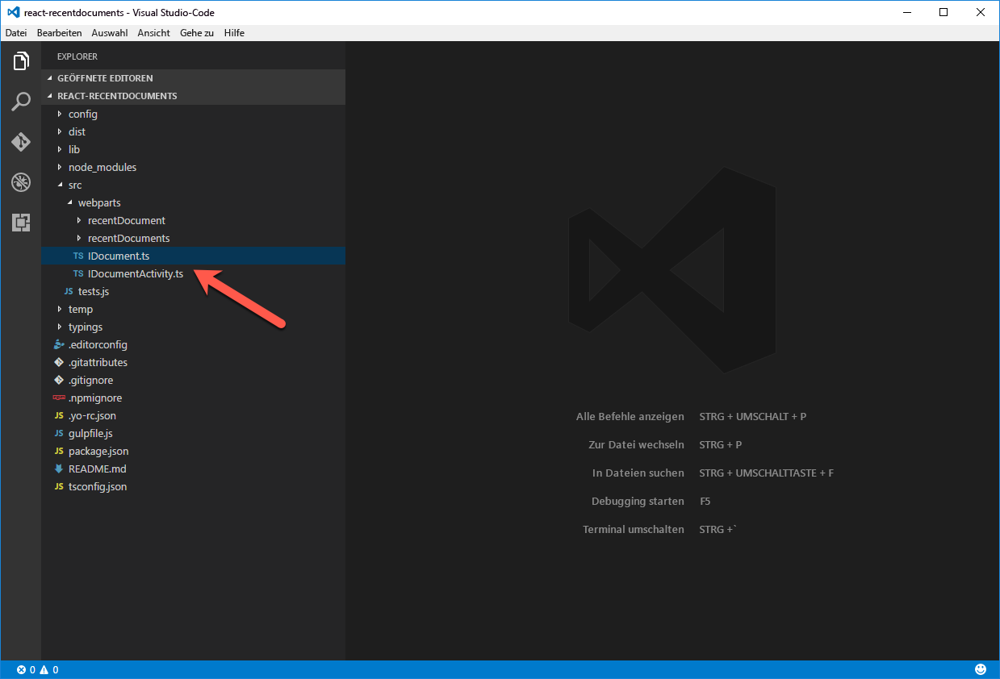

# <a name="share-data-between-web-parts-by-using-a-global-variable-tutorial"></a><span data-ttu-id="e5f31-103">Gemeinsame Verwendung von Daten zwischen Webparts mithilfe einer globalen Variable (Tutorial)</span><span class="sxs-lookup"><span data-stu-id="e5f31-103">Share data between web parts by using a global variable (tutorial)</span></span>

<span data-ttu-id="e5f31-104">Wenn Sie bei der Erstellung von clientseitigen Webparts Daten nur einmal laden und anschließend in verschiedenen Webparts jeweils wiederverwenden, verbessert das die Leistung Ihrer Seiten und reduziert die Last in Ihrem Netzwerk.</span><span class="sxs-lookup"><span data-stu-id="e5f31-104">When building client-side web parts, loading data once and reusing it across different web parts helps improve the performance of your pages and decrease the load on your network.</span></span> 

> [!NOTE] 
> <span data-ttu-id="e5f31-105">Bevor Sie die Anleitung in diesem Artikel umsetzen können, müssen Sie [die Entwicklungsumgebung für Ihr clientseitiges SharePoint-Webpart einrichten](../../set-up-your-development-environment.md).</span><span class="sxs-lookup"><span data-stu-id="e5f31-105">Before following the steps in this article, be sure to [set up your SharePoint client-side web part development environment](../../set-up-your-development-environment.md).</span></span>

## <a name="create-a-new-project"></a><span data-ttu-id="e5f31-106">Erstellen eines neuen Projekts</span><span class="sxs-lookup"><span data-stu-id="e5f31-106">Create a new project</span></span>

1. <span data-ttu-id="e5f31-107">Erstellen Sie über eine Eingabeaufforderung einen neuen Ordner für Ihr Projekt:</span><span class="sxs-lookup"><span data-stu-id="e5f31-107">Using a command prompt, create a new folder for your project:</span></span>

  ```sh
  md react-recentdocuments
  ```

2. <span data-ttu-id="e5f31-108">Wechseln Sie in den Projektordner:</span><span class="sxs-lookup"><span data-stu-id="e5f31-108">Go into the project folder:</span></span>

  ```sh
  cd react-recentdocuments
  ```

3. <span data-ttu-id="e5f31-109">Führen Sie im Projektordner den SharePoint Framework-Yeoman-Generator aus, um ein Gerüst für ein neues SharePoint Framework-Projekt zu erstellen:</span><span class="sxs-lookup"><span data-stu-id="e5f31-109">In the project folder, run the SharePoint Framework Yeoman generator to scaffold a new SharePoint Framework project:</span></span>

  ```sh
  yo @microsoft/sharepoint
  ```

4. <span data-ttu-id="e5f31-110">Es werden verschiedene Eingabeaufforderungen angezeigt. Geben Sie jeweils die folgenden Werte an:</span><span class="sxs-lookup"><span data-stu-id="e5f31-110">When prompted, use the following values:</span></span>

  - <span data-ttu-id="e5f31-111">**WebPart** als den Typ von zu erstellender clientseitiger Komponente</span><span class="sxs-lookup"><span data-stu-id="e5f31-111">**WebPart** as the type of client-side component to create.</span></span>
  - <span data-ttu-id="e5f31-112">**react-recentdocuments** als Namen der Lösung</span><span class="sxs-lookup"><span data-stu-id="e5f31-112">**react-recentdocuments** as your solution name.</span></span>
  - <span data-ttu-id="e5f31-113">**Verwenden Sie den aktuellen Ordner** als Speicherort für die Dateien.</span><span class="sxs-lookup"><span data-stu-id="e5f31-113">**Use the current folder** for the location to place the files.</span></span>
  - <span data-ttu-id="e5f31-114">**Zuletzt verwendete Dokumente** als Name des Webparts.</span><span class="sxs-lookup"><span data-stu-id="e5f31-114">**Recent documents** as your web part name.</span></span>
  - <span data-ttu-id="e5f31-115">**Shows recently modified documents** als Beschreibung Ihres Webparts</span><span class="sxs-lookup"><span data-stu-id="e5f31-115">**Shows recently modified documents** as your web part description.</span></span>
  - <span data-ttu-id="e5f31-116">**React** als das zu verwendende Framework</span><span class="sxs-lookup"><span data-stu-id="e5f31-116">**React** as the framework to use.</span></span>

  

5. <span data-ttu-id="e5f31-118">Warten Sie, bis das Gerüst erstellt wurde, und sperren Sie dann mithilfe des folgenden Befehls die Version der Projektabhängigkeiten:</span><span class="sxs-lookup"><span data-stu-id="e5f31-118">After the scaffolding completes, lock down the version of the project dependencies by running the following command:</span></span>

  ```sh
  npm shrinkwrap
  ```

6. <span data-ttu-id="e5f31-119">Öffnen Sie den Projektordner in einem Code-Editor.</span><span class="sxs-lookup"><span data-stu-id="e5f31-119">Open your project folder in your code editor.</span></span> <span data-ttu-id="e5f31-120">In diesem Artikel wird Visual Studio Code in den Schritten und Screenshots verwendet, Sie können jedoch auch jeden beliebigen anderen Editor verwenden.</span><span class="sxs-lookup"><span data-stu-id="e5f31-120">This article uses Visual Studio Code in the steps and screenshots, but you can use any editor that you prefer.</span></span>

  

  <br/>

## <a name="show-the-recently-modified-documents"></a><span data-ttu-id="e5f31-122">Anzeigen der zuletzt geänderten Dokumente</span><span class="sxs-lookup"><span data-stu-id="e5f31-122">Show the recently modified documents</span></span>

<span data-ttu-id="e5f31-123">Das Webpart „Zuletzt verwendete Dokumente“ zeigt Informationen zu den zuletzt geänderten Dokumenten an, die jeweils als Office UI Fabric-Karte dargestellt werden.</span><span class="sxs-lookup"><span data-stu-id="e5f31-123">The Recent Documents web part shows information about the most recently modified documents displayed as cards by using Office UI Fabric.</span></span>


<br/>

### <a name="remove-the-standard-description-property"></a><span data-ttu-id="e5f31-125">Entfernen der Standardeigenschaft _description_</span><span class="sxs-lookup"><span data-stu-id="e5f31-125">Remove the standard _description_ property</span></span>

1. <span data-ttu-id="e5f31-126">Entfernen Sie die Standardeigenschaft `description` aus der Schnittstelle `IRecentDocumentsWebPartProps`.</span><span class="sxs-lookup"><span data-stu-id="e5f31-126">Remove the standard `description` property from the `IRecentDocumentsWebPartProps` interface.</span></span> <span data-ttu-id="e5f31-127">Öffnen Sie hierzu im Code-Editor die Datei **./src/webparts/recentDocuments/IRecentDocumentsWebPartProps.ts**, und fügen Sie den folgenden Code ein:</span><span class="sxs-lookup"><span data-stu-id="e5f31-127">In the code editor, open the **./src/webparts/recentDocuments/IRecentDocumentsWebPartProps.ts** file, and paste the following code:</span></span>

  ```typescript
  export interface IRecentDocumentsWebPartProps {
  }
  ```

2. <span data-ttu-id="e5f31-p103">Entfernen Sie nun die Standardeigenschaft `description` aus dem Webpartmanifest. Öffnen Sie hierzu die Datei **./src/webparts/recentDocuments/RecentDocumentsWebPart.manifest.json**, und entfernen Sie aus der Eigenschaft `properties` die Eigenschaft `description`:</span><span class="sxs-lookup"><span data-stu-id="e5f31-p103">Remove the standard `description` property from the web part manifest. Open the **./src/webparts/recentDocuments/RecentDocumentsWebPart.manifest.json** file, and from the `properties` property, remove the `description` property:</span></span>

  ```json
  {
    "$schema": "../../../node_modules/@microsoft/sp-module-interfaces/lib/manifestSchemas/jsonSchemas/clientSideComponentManifestSchema.json",

    "id": "7a7e3aa9-5d8a-4155-936b-0b0e06e9ca11",
    "alias": "RecentDocumentsWebPart",
    "componentType": "WebPart",
    "version": "0.0.1",
    "manifestVersion": 2,

    "preconfiguredEntries": [{
      "groupId": "7a7e3aa9-5d8a-4155-936b-0b0e06e9ca11",
      "group": { "default": "Under Development" },
      "title": { "default": "Recent documents" },
      "description": { "default": "Shows recently modified documents" },
      "officeFabricIconFontName": "Page",
      "properties": {
      }
    }]
  }
  ```

3. <span data-ttu-id="e5f31-130">Entfernen Sie die Standardeigenschaft `description` aus dem Webpart.</span><span class="sxs-lookup"><span data-stu-id="e5f31-130">Remove the standard `description` property from the web part.</span></span> <span data-ttu-id="e5f31-131">Öffnen Sie hierzu im Code-Editor die Datei **./src/webparts/recentDocuments/RecentDocumentsWebPart.ts**, und ersetzen Sie die Methode `render` durch den folgenden Code:</span><span class="sxs-lookup"><span data-stu-id="e5f31-131">In the code editor, open the **./src/webparts/recentDocuments/RecentDocumentsWebPart.ts** file, and replace its `render` method with the following code:</span></span>

  ```typescript
  export default class RecentDocumentsWebPart extends BaseClientSideWebPart<IRecentDocumentsWebPartProps> {
    // ...
    public render(): void {
      const element: React.ReactElement<IRecentDocumentsProps > = React.createElement(
        RecentDocuments,
        {
        }
      );

      ReactDom.render(element, this.domElement);
    }
    // ...
  }
  ```

4. <span data-ttu-id="e5f31-132">Ersetzen Sie die Methode `getPropertyPaneConfiguration` durch den folgenden Code:</span><span class="sxs-lookup"><span data-stu-id="e5f31-132">Replace its `getPropertyPaneConfiguration` method with the following code:</span></span>

  ```typescript
  export default class RecentDocumentsWebPart extends BaseClientSideWebPart<IRecentDocumentsWebPartProps> {
    // ...

    protected getPropertyPaneConfiguration(): IPropertyPaneConfiguration {
      return {
        pages: [
          {
            header: {
              description: strings.PropertyPaneDescription
            },
            groups: [
              {
                groupName: strings.BasicGroupName,
                groupFields: []
              }
            ]
          }
        ]
      };
    }
  }
  ```

### <a name="create-the-idocumentactivity-interface"></a><span data-ttu-id="e5f31-133">Erstellen der Schnittstelle „IDocumentActivity“</span><span class="sxs-lookup"><span data-stu-id="e5f31-133">Create the IDocumentActivity interface</span></span>

<span data-ttu-id="e5f31-134">Diese Schnittstelle wird verwendet, um die Aktivitätsinformationen eines gegebenen Dokuments auf einer Karte anzuzeigen.</span><span class="sxs-lookup"><span data-stu-id="e5f31-134">Use this interface to display the activity information of a particular document on a card.</span></span>

<span data-ttu-id="e5f31-135">Erstellen Sie im Ordner **./src/webparts/recentDocuments** eine neue Datei mit dem Namen **IDocumentActivity.ts**, und fügen Sie den folgenden Code in die Datei ein:</span><span class="sxs-lookup"><span data-stu-id="e5f31-135">In the **./src/webparts/recentDocuments** folder, create a new file named **IDocumentActivity.ts**, and paste the following code:</span></span>

```typescript
export interface IDocumentActivity {
    title: string;
    actorName: string;
    actorImageUrl: string;
}
```

### <a name="create-the-idocument-interface"></a><span data-ttu-id="e5f31-136">Erstellen der Schnittstelle „IDocument“</span><span class="sxs-lookup"><span data-stu-id="e5f31-136">Create the IDocument interface</span></span>

<span data-ttu-id="e5f31-137">Diese Schnittstelle repräsentiert ein Dokument samt allen Informationen, die erforderlich sind, um es als Karte anzeigen zu können.</span><span class="sxs-lookup"><span data-stu-id="e5f31-137">This interface represents a document with all the information necessary to display the document as a card.</span></span>

<span data-ttu-id="e5f31-138">Erstellen Sie im Ordner **./src/webparts/recentDocuments** eine neue Datei mit dem Namen **IDocument.ts**, und fügen Sie den folgenden Code in die Datei ein:</span><span class="sxs-lookup"><span data-stu-id="e5f31-138">In the **./src/webparts/recentDocuments** folder, create a new file named **IDocument.ts**, and paste the following code:</span></span>

```typescript
import { IDocumentActivity } from './IDocumentActivity';

export interface IDocument {
    title: string;
    url: string;
    imageUrl: string;
    iconUrl: string;
    activity: IDocumentActivity;
}
```

### <a name="show-recent-documents-in-the-recentdocuments-react-component"></a><span data-ttu-id="e5f31-139">Anzeigen zuletzt verwendeter Dokumente in der React-Komponente „RecentDocuments“</span><span class="sxs-lookup"><span data-stu-id="e5f31-139">Show recent documents in the RecentDocuments React component</span></span>

1. <span data-ttu-id="e5f31-p105">Fügen Sie die **documents**-Eigenschaft zu der **IRecentDocumentsProps**-Schnittstelle hinzu. Öffnen Sie im Code-Editor die Datei **./src/webparts/recentDocuments/components/IRecentDocumentsProps.ts**, und fügen Sie den folgenden Code ein:</span><span class="sxs-lookup"><span data-stu-id="e5f31-p105">Add the **documents** property to the **IRecentDocumentsProps** interface. In the code editor, open the **./src/webparts/recentDocuments/components/IRecentDocumentsProps.ts** file, and paste the following code:</span></span>

  ```typescript
  import { IDocument } from '../IDocument';

  export interface IRecentDocumentsProps {
    documents: IDocument[];
  }
  ```

2. <span data-ttu-id="e5f31-142">Öffnen Sie im Code-Editor die Datei **./src/webparts/recentDocuments/components/RecentDocuments.tsx**, und fügen Sie den folgenden Code in die Datei ein:</span><span class="sxs-lookup"><span data-stu-id="e5f31-142">In the code editor, open the **./src/webparts/recentDocuments/components/RecentDocuments.tsx** file, and paste the following code:</span></span>

  ```tsx
  import * as React from 'react';
  import {
    DocumentCard,
    DocumentCardType,
    DocumentCardPreview,
    DocumentCardTitle,
    DocumentCardActivity
  } from 'office-ui-fabric-react';
  import { IDocument } from '../IDocument';
  import styles from './RecentDocuments.module.scss';
  import { IRecentDocumentsProps } from './IRecentDocumentsProps';

  export default class RecentDocuments extends React.Component<IRecentDocumentsProps, void> {
    public render(): React.ReactElement<IRecentDocumentsProps> {
      const documents: JSX.Element[] = this.props.documents.map((document: IDocument, index: number, array: IDocument[]): JSX.Element => {
        return (
          <DocumentCard type={DocumentCardType.compact} onClickHref={document.url} accentColor='#ce4b1f' key={index}>
            <DocumentCardPreview previewImages={[{
              name: document.title,
              url: document.url,
              previewImageSrc: document.imageUrl,
              iconSrc: document.iconUrl,
              width: 144
            }]} />
            <div className='ms-DocumentCard-details'>
              <DocumentCardTitle
                title={document.title}
                shouldTruncate={true} />
              <DocumentCardActivity
                activity={document.activity.title}
                people={
                  [
                    { name: document.activity.actorName, profileImageSrc: document.activity.actorImageUrl }
                  ]
                }
                />
            </div>
          </DocumentCard>
        );
      });
      return (
        <div className={styles.helloWorld}>
          {documents}
        </div>
      );
    }
  }
  ```

<br/>

<span data-ttu-id="e5f31-143">Die Komponente durchläuft zunächst die Dokumente, die in der Eigenschaft `documents` übergeben wurden.</span><span class="sxs-lookup"><span data-stu-id="e5f31-143">First, the component iterates through the documents passed by using its `documents` property.</span></span> <span data-ttu-id="e5f31-144">Für jedes Dokument wird ein [Office UI Fabric-Objekt des Typs „DocumentCard“](https://developer.microsoft.com/de-DE/fabric#/components/documentcard) erstellt. Dessen Eigenschaften enthalten alle relevanten Informationen zu dem jeweiligen Dokument.</span><span class="sxs-lookup"><span data-stu-id="e5f31-144">For each document, it builds an [Office UI Fabric DocumentCard](https://developer.microsoft.com/de-DE/fabric#/components/documentcard), filling its properties with the relevant information about that particular document.</span></span> <span data-ttu-id="e5f31-145">Sobald Karten für alle Dokumente erstellt wurden, fügt die Komponente diese zu ihrer Oberfläche hinzu und gibt das gesamte Markup zurück.</span><span class="sxs-lookup"><span data-stu-id="e5f31-145">Finally, when cards for all documents have been built, the component adds them to its body and returns the complete markup.</span></span>

### <a name="load-the-information-about-the-recent-documents"></a><span data-ttu-id="e5f31-146">Laden der Informationen zu den zuletzt verwendeten Dokumenten</span><span class="sxs-lookup"><span data-stu-id="e5f31-146">Load the information about the recent documents</span></span>

<span data-ttu-id="e5f31-p107">In diesem Beispiel werden die Informationen zu den zuletzt geänderten Dokumenten aus einem statischen Dataset geladen. Sie können die Implementierung jedoch auch mühelos so abändern, dass die Daten stattdessen aus einer SharePoint-Dokumentbibliothek geladen werden.</span><span class="sxs-lookup"><span data-stu-id="e5f31-p107">In this example, the information about the recently modified documents is loaded from a static data set. You could, however, easily change this implementation to load the data from a SharePoint document library instead.</span></span>

1. <span data-ttu-id="e5f31-149">Öffnen Sie im Code-Editor die Datei **./src/webparts/recentDocuments/RecentDocumentsWebPart.ts**.</span><span class="sxs-lookup"><span data-stu-id="e5f31-149">In the code editor, open the **./src/webparts/recentDocuments/RecentDocumentsWebPart.ts** file.</span></span> <span data-ttu-id="e5f31-150">Fügen Sie unterhalb der Importanweisungen am Anfang der Datei eine Importanweisung für die Schnittstelle `IDocument` hinzu. Verwenden Sie dazu folgenden Code:</span><span class="sxs-lookup"><span data-stu-id="e5f31-150">Add an import statement for the `IDocument` interface under the other import statements at the top of the file by using the following code:</span></span>

  ```typescript
  import { IDocument } from './IDocument';
  ```

2. <span data-ttu-id="e5f31-151">Fügen Sie in der Klasse `RecentDocumentsWebPart` eine neue private Variable mit dem Namen `documents` hinzu. Verwenden Sie hierzu den folgenden Code:</span><span class="sxs-lookup"><span data-stu-id="e5f31-151">In the `RecentDocumentsWebPart` class, add a new private variable named `documents` by using the following code:</span></span>

  ```typescript
  export default class RecentDocumentsWebPart extends BaseClientSideWebPart<IRecentDocumentsWebPartProps> {
      private static documents: IDocument[] = [
          {
              title: 'Proposal for Jacksonville Expansion Ad Campaign',
              url: 'https://contoso-my.sharepoint.com/personal/miriamg_contoso_onmicrosoft_com/_layouts/15/WopiFrame.aspx?sourcedoc=%7BCBF65183-0378-485B-AB67-791E0FC81D72%7D&file=Jacksonville%20Ad%20Campaign%20(draft).docx&action=view&DefaultItemOpen=1',
              imageUrl: 'https://contoso-my.sharepoint.com/_layouts/15/getpreview.ashx?guidSite=ca6fa69c-347d-4c07-886c-67105dc5a357&guidWeb=237a3f3f-59a4-46e8-b0a8-6effd78bd327&guidFile=%7BCBF65183-0378-485B-AB67-791E0FC81D72%7D&docId=17592965474834&metadataToken=&clienttype=DelveWebHomeFeed',
              iconUrl: '',
              activity: {
                  title: 'Modified, January 25 2017',
                  actorName: 'Miriam Graham',
                  actorImageUrl: 'https://contoso-my.sharepoint.com/_vti_bin/DelveApi.ashx/people/profileimage?userId=miriamg@contoso.onmicrosoft.com&size=L'
              }
          },
          {
              title: 'Customer Feedback for ZT1000',
              url: 'https://contoso-my.sharepoint.com/personal/miriamg_contoso_onmicrosoft_com/_layouts/15/WopiFrame.aspx?sourcedoc=%7B5449CE24-BFB7-442E-843D-E0C86CEB71CC%7D&file=Customer%20Feedback%20for%20ZT1000.pptx&action=view&DefaultItemOpen=1',
              imageUrl: 'https://contoso-my.sharepoint.com/_layouts/15/getpreview.ashx?guidSite=ca6fa69c-347d-4c07-886c-67105dc5a357&guidWeb=237a3f3f-59a4-46e8-b0a8-6effd78bd327&guidFile=%7B5449CE24-BFB7-442E-843D-E0C86CEB71CC%7D&docId=17592968714930&metadataToken=&clienttype=DelveWebHomeFeed',
              iconUrl: '',
              activity: {
                  title: 'Modified, January 23 2017',
                  actorName: 'Miriam Graham',
                  actorImageUrl: 'https://contoso-my.sharepoint.com/_vti_bin/DelveApi.ashx/people/profileimage?userId=miriamg@contoso.onmicrosoft.com&size=L'
              }
          },
          {
              title: 'Asia Q3 Marketing Overview',
              url: 'https://contoso-my.sharepoint.com/personal/alexw_contoso_onmicrosoft_com/_layouts/15/WopiFrame.aspx?sourcedoc=%7BFD077A94-AB7D-45F9-A810-36229E518A94%7D&file=Asia%20Q3%20Marketing%20Overview%20Beta.pptx&action=view&DefaultItemOpen=1',
              imageUrl: 'https://contoso-my.sharepoint.com/_layouts/15/getpreview.ashx?guidSite=18231116-2bf0-474c-93ee-eb362681b293&guidWeb=237a3f3f-59a4-46e8-b0a8-6effd78bd327&guidFile=%7BFD077A94-AB7D-45F9-A810-36229E518A94%7D&docId=17592969984791&metadataToken=&clienttype=DelveWebHomeFeed',
              iconUrl: '',
              activity: {
                  title: 'Modified, January 23 2017',
                  actorName: 'Alex Wilber',
                  actorImageUrl: 'https://contoso-my.sharepoint.com/_vti_bin/DelveApi.ashx/people/profileimage?userId=alexw@contoso.onmicrosoft.com&size=L'
              }
          },
          {
              title: 'Trey Research Business Development Plan',
              url: 'https://contoso.sharepoint.com/sites/contoso/Resources/Document%20Center/_layouts/15/WopiFrame.aspx?sourcedoc=%7B743A6C44-D3F8-4ECC-A1B7-EA9844911314%7D&file=Trey%20Research%20Business%20Development%20Plan.pptx&action=view&DefaultItemOpen=1',
              imageUrl: 'https://contoso-my.sharepoint.com/_layouts/15/getpreview.ashx?guidSite=923a6ce1-7b67-4bd0-a59f-89d37f233804&guidWeb=c12486eb-661c-46c7-baba-073a8a45b610&guidFile=%7B743A6C44-D3F8-4ECC-A1B7-EA9844911314%7D&docId=265998788&metadataToken=&clienttype=DelveWebHomeFeed',
              iconUrl: '',
              activity: {
                  title: 'Modified, January 15 2017',
                  actorName: 'Alex Wilber',
                  actorImageUrl: 'https://contoso-my.sharepoint.com/_vti_bin/DelveApi.ashx/people/profileimage?userId=alexw@contoso.onmicrosoft.com&size=L'
              }
          },
          {
              title: 'XT1000 Marketing Analysis',
              url: 'https://contoso-my.sharepoint.com/personal/henriettam_contoso_onmicrosoft_com/_layouts/15/WopiFrame.aspx?sourcedoc=%7BA8B9F935-E5A1-47AD-B052-D5ED30E682AB%7D&file=XT1000%20Marketing%20Analysis.pptx&action=view&DefaultItemOpen=1',
              imageUrl: 'https://contoso-my.sharepoint.com/_layouts/15/getpreview.ashx?guidSite=b187e1dd-7687-49e0-87ff-6250e61e56ac&guidWeb=237a3f3f-59a4-46e8-b0a8-6effd78bd327&guidFile=%7BA8B9F935-E5A1-47AD-B052-D5ED30E682AB%7D&docId=17592963604695&metadataToken=&clienttype=DelveWebHomeFeed',
              iconUrl: '',
              activity: {
                  title: 'Modified, December 15 2016',
                  actorName: 'Henrietta Mueller',
                  actorImageUrl: 'https://contoso-my.sharepoint.com/_vti_bin/DelveApi.ashx/people/profileimage?userId=henriettam@contoso.onmicrosoft.com&size=L'
              }
          }
      ];

      // ...
  }
  ```

  <br/>

3. <span data-ttu-id="e5f31-152">Ändern Sie die Methode `render` so, dass die Informationen zu den zuletzt geänderten Dokumenten geladen und gerendert werden:</span><span class="sxs-lookup"><span data-stu-id="e5f31-152">Change the `render` method to load and render the information about the recently modified documents:</span></span>

  ```typescript
  export default class RecentDocumentsWebPart extends BaseClientSideWebPart<IRecentDocumentsWebPartProps> {
    // ...
    public render(): void {
      this.context.statusRenderer.displayLoadingIndicator(this.domElement, 'documents');

      window.setTimeout((): void => {
        const element: React.ReactElement<IRecentDocumentsProps> = React.createElement(
          RecentDocuments,
          {
            documents: RecentDocumentsWebPart.documents.slice(0, 3)
          }
        );

        this.context.statusRenderer.clearLoadingIndicator(this.domElement);
        ReactDom.render(element, this.domElement);
      }, 300);
    }
    // ...
  }
  ```

4. <span data-ttu-id="e5f31-153">Überprüfen Sie nun, ob das Webpart korrekt funktioniert und Informationen zu den drei zuletzt geänderten Dokumenten anzeigt. Führen Sie dazu den folgenden Befehl über eine Eingabeaufforderung in Ihrem Projektverzeichnis aus:</span><span class="sxs-lookup"><span data-stu-id="e5f31-153">Verify that the web part is working correctly and shows information about the three most recently modified documents by running the following command from a command prompt in your project directory:</span></span>

  ```sh
  gulp serve
  ```

5. <span data-ttu-id="e5f31-154">Fügen Sie in der SharePoint-Workbench das Webpart „Zuletzt verwendete Dokumente“ zur Canvas hinzu.</span><span class="sxs-lookup"><span data-stu-id="e5f31-154">In the SharePoint Workbench, add the Recent Documents web part to the canvas.</span></span>

  

## <a name="show-the-most-recently-modified-document"></a><span data-ttu-id="e5f31-156">Anzeigen des zuletzt geänderten Dokuments</span><span class="sxs-lookup"><span data-stu-id="e5f31-156">Show the most recently modified document</span></span>

<span data-ttu-id="e5f31-157">Das Webpart „Zuletzt verwendetes Dokument“ zeigt Informationen zu dem zuletzt geänderten Dokument an.</span><span class="sxs-lookup"><span data-stu-id="e5f31-157">The Recent Document web part shows information about the most recently modified document.</span></span>


### <a name="add-the-second-web-part"></a><span data-ttu-id="e5f31-159">Hinzufügen des zweiten Webparts</span><span class="sxs-lookup"><span data-stu-id="e5f31-159">Add the second web part</span></span>

<span data-ttu-id="e5f31-160">Nun fügen wir dem Projekt ein zweites Webpart hinzu, um zu veranschaulichen, wie Webparts Daten gemeinsam verwenden können.</span><span class="sxs-lookup"><span data-stu-id="e5f31-160">To illustrate sharing data between web parts, add a second web part to the project.</span></span>

1. <span data-ttu-id="e5f31-161">Führen Sie über eine Eingabeaufforderung im Projektordner den SharePoint Framework-Yeoman-Generator aus.</span><span class="sxs-lookup"><span data-stu-id="e5f31-161">Using a command prompt in the project folder, run the SharePoint Framework Yeoman generator.</span></span>

  ```sh
  yo @microsoft/sharepoint
  ```

2. <span data-ttu-id="e5f31-162">Es werden verschiedene Eingabeaufforderungen angezeigt. Geben Sie jeweils die folgenden Werte an:</span><span class="sxs-lookup"><span data-stu-id="e5f31-162">When prompted, enter the following values:</span></span>

  - <span data-ttu-id="e5f31-163">**WebPart** als den Typ von zu erstellender clientseitiger Komponente</span><span class="sxs-lookup"><span data-stu-id="e5f31-163">**WebPart** as the type of client-side component to create.</span></span>
  - <span data-ttu-id="e5f31-164">**Recent document** als Namen des Webparts</span><span class="sxs-lookup"><span data-stu-id="e5f31-164">**Recent document** as your web part name.</span></span>
  - <span data-ttu-id="e5f31-165">**Zeigt Informationen zu dem zuletzt geänderten Dokumentinformation** als Beschreibung des Webparts.</span><span class="sxs-lookup"><span data-stu-id="e5f31-165">**Shows information about the most recently modified document** as your web part description.</span></span>

  

### <a name="remove-the-standard-description-property"></a><span data-ttu-id="e5f31-167">Entfernen der Standardeigenschaft _description_</span><span class="sxs-lookup"><span data-stu-id="e5f31-167">Remove the standard _description_ property</span></span>

1. <span data-ttu-id="e5f31-168">Entfernen Sie die Eigenschaft `description` aus der Schnittstelle `IRecentDocumentWebPartProps`.</span><span class="sxs-lookup"><span data-stu-id="e5f31-168">Remove the `description` property from the `IRecentDocumentWebPartProps` interface.</span></span> <span data-ttu-id="e5f31-169">Öffnen Sie im Code-Editor die Datei **./src/webparts/recentDocument/IRecentDocumentWebPartProps.ts**, und fügen Sie den folgenden Code ein:</span><span class="sxs-lookup"><span data-stu-id="e5f31-169">In the code editor, open the **./src/webparts/recentDocument/IRecentDocumentWebPartProps.ts** file, and paste the following code:</span></span>

  ```typescript
  export interface IRecentDocumentWebPartProps {
  }
  ```

2. <span data-ttu-id="e5f31-p110">Entfernen Sie die Standardeigenschaft `description` aus dem Webpartmanifest. Öffnen Sie hierzu die Datei **./src/webparts/recentDocument/RecentDocumentWebPart.manifest.json**, und entfernen Sie aus der Eigenschaft `properties` die Eigenschaft `description`:</span><span class="sxs-lookup"><span data-stu-id="e5f31-p110">Remove the standard `description` property from the web part manifest. Open the **./src/webparts/recentDocument/RecentDocumentWebPart.manifest.json** file, and from the `properties` property, remove the `description` property:</span></span>

  ```json
  {
    "$schema": "../../../node_modules/@microsoft/sp-module-interfaces/lib/manifestSchemas/jsonSchemas/clientSideComponentManifestSchema.json",

    "id": "71a6f643-1ac1-47ee-a9f1-502ef52f26d4",
    "alias": "RecentDocumentWebPart",
    "componentType": "WebPart",
    "version": "0.0.1",
    "manifestVersion": 2,

    "preconfiguredEntries": [{
      "groupId": "71a6f643-1ac1-47ee-a9f1-502ef52f26d4",
      "group": { "default": "Under Development" },
      "title": { "default": "Recent document" },
      "description": { "default": "Shows information about the most recently modified document" },
      "officeFabricIconFontName": "Page",
      "properties": {
      }
    }]
  }
  ```

3. <span data-ttu-id="e5f31-172">Entfernen Sie die Standardeigenschaft `description` aus dem Webpart-Eigenschaftenbereich.</span><span class="sxs-lookup"><span data-stu-id="e5f31-172">Remove the standard `description` property from the web part property pane.</span></span> <span data-ttu-id="e5f31-173">Öffnen Sie hierzu im Code-Editor die Datei **./src/webparts/recentDocument/RecentDocumentWebPart.ts**, und ersetzen Sie die Methode `render` durch den folgenden Code:</span><span class="sxs-lookup"><span data-stu-id="e5f31-173">In the code editor, open the **./src/webparts/recentDocument/RecentDocumentWebPart.ts** file, and replace its `render` method with the following code:</span></span>

  ```typescript
  export default class RecentDocumentWebPart extends BaseClientSideWebPart<IRecentDocumentWebPartProps> {
    // ...
    public render(): void {
      const element: React.ReactElement<IRecentDocumentProps> = React.createElement(
        RecentDocument,
        {
        }
      );

      ReactDom.render(element, this.domElement);
    }
    // ...
  }
  ```

4. <span data-ttu-id="e5f31-174">Ersetzen Sie die Methode `getPropertyPaneConfiguration` durch den folgenden Code:</span><span class="sxs-lookup"><span data-stu-id="e5f31-174">Replace its `getPropertyPaneConfiguration` method with the following code:</span></span>

  ```typescript
  export default class RecentDocumentWebPart extends BaseClientSideWebPart<IRecentDocumentWebPartProps> {
    // ...

    protected getPropertyPaneConfiguration(): IPropertyPaneConfiguration {
      return {
        pages: [
          {
            header: {
              description: strings.PropertyPaneDescription
            },
            groups: [
              {
                groupName: strings.BasicGroupName,
                groupFields: []
              }
            ]
          }
        ]
      };
    }
  }
  ```

### <a name="reuse-the-idocument-and-idocumentactivity-interfaces"></a><span data-ttu-id="e5f31-175">Wiederverwenden der Schnittstellen _IDocument_ und _IDocumentActivity_</span><span class="sxs-lookup"><span data-stu-id="e5f31-175">Reuse the _IDocument_ and _IDocumentActivity_ interfaces</span></span>

<span data-ttu-id="e5f31-176">Das Webpart „Zuletzt verwendetes Dokument“ zeigt Informationen zu dem zuletzt geänderten Dokument anders als das Webpart „Zuletzt verwendete Dokumente“ an, beide Webparts verwenden aber dieselbe Datenstruktur zur Darstellung eines Dokuments.</span><span class="sxs-lookup"><span data-stu-id="e5f31-176">The Recent Document web part displays information about the most recently modified document in a different way than the Recent Documents web part, but both web parts use the same data structure representing a document.</span></span> <span data-ttu-id="e5f31-177">Anstatt die Schnittstellen `IDocument` und `IDocumentActivity` zu duplizieren, können Sie sie in beiden Webparts wiederverwenden.</span><span class="sxs-lookup"><span data-stu-id="e5f31-177">Instead of duplicating the `IDocument` and `IDocumentActivity` interfaces, you can reuse them across both web parts.</span></span>

1. <span data-ttu-id="e5f31-178">Aktivieren Sie in Visual Studio Code das Explorer-Fenster aus dem Ordner **./src/webparts/recentDocuments**, und verschieben Sie die Dateien **IDocument.ts** und **IDocumentActivity.ts** eine Ebene nach oben zum Ordner **./src/webparts**.</span><span class="sxs-lookup"><span data-stu-id="e5f31-178">In Visual Studio Code, activate the Explorer pane, and from the **./src/webparts/recentDocuments** folder, move the **IDocument.ts** and **IDocumentActivity.ts** files one level up, to the **./src/webparts** folder.</span></span>

  

  <br/>

  <span data-ttu-id="e5f31-180">Da Sie die Dateien an einen anderen Speicherort innerhalb Ihres Projekts verschoben haben, müssen Sie überall dort, wo die Dateien referenziert werden, den Pfad entsprechend aktualisieren.</span><span class="sxs-lookup"><span data-stu-id="e5f31-180">Having moved the files to another location in your project, you need to update the paths where they're referenced.</span></span>

2. <span data-ttu-id="e5f31-181">Öffnen Sie im Code-Editor die Datei **./src/webparts/recentDocuments/components/IRecentDocumentsProps.ts**, und ändern Sie den Code in der Datei wie folgt:</span><span class="sxs-lookup"><span data-stu-id="e5f31-181">In the code editor, open the **./src/webparts/recentDocuments/components/IRecentDocumentsProps.ts** file, and change its code to:</span></span>

  ```typescript
  import { IDocument } from '../../IDocument';

  export interface IRecentDocumentsProps {
    documents: IDocument[];
  }
  ```

3. <span data-ttu-id="e5f31-182">Öffnen Sie die Datei **./src/webparts/recentDocuments/components/RecentDocuments.tsx**, und aktualisieren Sie die Anweisung des Typs `import` der Schnittstelle `IDocument` wie folgt:</span><span class="sxs-lookup"><span data-stu-id="e5f31-182">Open the **./src/webparts/recentDocuments/components/RecentDocuments.tsx** file, and update the `import` statement of the `IDocument` interface to:</span></span>

  ```typescript
  import { IDocument } from '../../IDocument';
  ```

4. <span data-ttu-id="e5f31-183">Öffnen Sie die Datei **./src/webparts/recentDocuments/RecentDocumentsWebPart.ts**, und aktualisieren Sie die Anweisung des Typs `import` der Schnittstelle `IDocument` wie folgt:</span><span class="sxs-lookup"><span data-stu-id="e5f31-183">Open the **./src/webparts/recentDocuments/RecentDocumentsWebPart.ts** file, and update the `import` statement of the `IDocument` interface to:</span></span>

  ```typescript
  import { IDocument } from '../IDocument';
  ```

### <a name="show-the-most-recent-document-in-the-recentdocument-react-component"></a><span data-ttu-id="e5f31-184">Anzeigen des zuletzt verwendeten Dokuments in der React-Komponente „RecentDocument“</span><span class="sxs-lookup"><span data-stu-id="e5f31-184">Show the most recent document in the RecentDocument React component</span></span>

1. <span data-ttu-id="e5f31-p113">Fügen Sie die Eigenschaft `document` zur Schnittstelle `IRecentDocumentProps` hinzu. Öffnen Sie hierzu im Code-Editor die Datei **./src/webparts/recentDocument/components/IRecentDocumentProps.ts**, und fügen Sie den folgenden Code in die Datei ein:</span><span class="sxs-lookup"><span data-stu-id="e5f31-p113">Add the `document` property to the `IRecentDocumentProps` interface. In the code editor, open the **./src/webparts/recentDocument/components/IRecentDocumentProps.ts** file, and paste the following code:</span></span>

  ```typescript
  import { IDocument } from '../../IDocument';

  export interface IRecentDocumentProps {
    document: IDocument;
  }
  ```

2. <span data-ttu-id="e5f31-187">Öffnen Sie im Code-Editor die Datei **./src/webparts/recentDocument/components/RecentDocument.tsx**, und fügen Sie den folgenden Code ein:</span><span class="sxs-lookup"><span data-stu-id="e5f31-187">In the code editor, open the **./src/webparts/recentDocument/components/RecentDocument.tsx** file, and paste the following code:</span></span>

  ```typescriptx
  import * as React from 'react';
  import {
    DocumentCard,
    DocumentCardPreview,
    DocumentCardTitle,
    DocumentCardActivity,
    ImageFit
  } from 'office-ui-fabric-react';
  import { IDocument } from '../../IDocument';
  import styles from './RecentDocument.module.scss';
  import { IRecentDocumentProps } from './IRecentDocumentProps';

  export default class RecentDocument extends React.Component<IRecentDocumentProps, void> {
    public render(): React.ReactElement<IRecentDocumentProps> {
      const document: IDocument = this.props.document;

      return (
        <div className={styles.helloWorld}>
          <DocumentCard onClickHref={document.url}>
            <DocumentCardPreview previewImages={[{
              name: document.title,
              url: document.url,
              previewImageSrc: document.imageUrl,
              iconSrc: document.iconUrl,
              imageFit: ImageFit.cover,
              width: 318,
              height: 196,
              accentColor: '#ce4b1f'
            }]} />
            <DocumentCardTitle
              title={document.title}
              shouldTruncate={true} />
            <DocumentCardActivity
              activity={document.activity.title}
              people={
                [
                  { name: document.activity.actorName, profileImageSrc: document.activity.actorImageUrl }
                ]
              }
              />
          </DocumentCard>
        </div>
      );
    }
  }
  ```

  <br/>

<span data-ttu-id="e5f31-188">Die React-Komponente `RecentDocument` verwendet die Informationen zu dem in der Eigenschaft `document` übergebenen zuletzt geänderten Dokument zum Rendern eines Office UI Fabric-Objekts des Typs „DocumentCard“.</span><span class="sxs-lookup"><span data-stu-id="e5f31-188">The `RecentDocument` React component uses the information about the most recently modified document passed in the `document` property to render an Office UI Fabric DocumentCard.</span></span>

### <a name="load-the-information-about-the-recent-document"></a><span data-ttu-id="e5f31-189">Laden der Informationen zu dem zuletzt verwendeten Dokument</span><span class="sxs-lookup"><span data-stu-id="e5f31-189">Load the information about the recent document</span></span>

<span data-ttu-id="e5f31-p114">In diesem Beispiel werden die Informationen zu dem zuletzt geänderten Dokument aus einem statischen Dataset geladen.  Sie können die Implementierung jedoch auch mühelos so abändern, dass die Daten stattdessen aus einer SharePoint-Dokumentbibliothek geladen werden.</span><span class="sxs-lookup"><span data-stu-id="e5f31-p114">In this example, the information about the most recently modified document is loaded from a static data set. You could, however, easily change this implementation to load the data from a SharePoint document library instead.</span></span>

1. <span data-ttu-id="e5f31-192">Öffnen Sie im Code-Editor die Datei **./src/webparts/recentDocument/RecentDocumentWebPart.ts**.</span><span class="sxs-lookup"><span data-stu-id="e5f31-192">In the code editor, open the **./src/webparts/recentDocument/RecentDocumentWebPart.ts** file.</span></span> <span data-ttu-id="e5f31-193">Fügen Sie unterhalb der Importanweisungen am Anfang der Datei eine Importanweisung für die Schnittstelle `IDocument` hinzu. Verwenden Sie dazu folgenden Code:</span><span class="sxs-lookup"><span data-stu-id="e5f31-193">Add an import statement for the `IDocument` interface under the other import statements at the top of the file by using the following code:</span></span>

  ```typescript
  import { IDocument } from '../IDocument';
  ```

2. <span data-ttu-id="e5f31-194">Fügen Sie in der Klasse `RecentDocumentWebPart` eine neue private Variable mit dem Namen `document` hinzu. Verwenden Sie hierzu den folgenden Code:</span><span class="sxs-lookup"><span data-stu-id="e5f31-194">In the `RecentDocumentWebPart` class, add a new private variable named `document` by using the following code:</span></span>

  ```typescript
  export default class RecentDocumentWebPart extends BaseClientSideWebPart<IRecentDocumentWebPartProps> {
      private static document: IDocument = {
          title: 'Proposal for Jacksonville Expansion Ad Campaign',
          url: 'https://contoso-my.sharepoint.com/personal/miriamg_contoso_onmicrosoft_com/_layouts/15/WopiFrame.aspx?sourcedoc=%7BCBF65183-0378-485B-AB67-791E0FC81D72%7D&file=Jacksonville%20Ad%20Campaign%20(draft).docx&action=view&DefaultItemOpen=1',
          imageUrl: 'https://contoso-my.sharepoint.com/_layouts/15/getpreview.ashx?guidSite=ca6fa69c-347d-4c07-886c-67105dc5a357&guidWeb=237a3f3f-59a4-46e8-b0a8-6effd78bd327&guidFile=%7BCBF65183-0378-485B-AB67-791E0FC81D72%7D&docId=17592965474834&metadataToken=&clienttype=DelveWebHomeFeed',
          iconUrl: '',
          activity: {
              title: 'Modified, January 25 2017',
              actorName: 'Miriam Graham',
              actorImageUrl: 'https://contoso-my.sharepoint.com/_vti_bin/DelveApi.ashx/people/profileimage?userId=miriamg@contoso.onmicrosoft.com&size=L'
          }
      };

      // ...
  }
  ```

3. <span data-ttu-id="e5f31-195">Ändern Sie die Methode `render` so, dass die Informationen zu dem zuletzt geänderten Dokument geladen und gerendert werden:</span><span class="sxs-lookup"><span data-stu-id="e5f31-195">Change the `render` method to load and render the information about the most recently modified document:</span></span>

  ```typescript
  export default class RecentDocumentsWebPart extends BaseClientSideWebPart<IRecentDocumentsWebPartProps> {
    // ...
    public render(): void {
      this.context.statusRenderer.displayLoadingIndicator(this.domElement, 'documents');

      window.setTimeout((): void => {
        const element: React.ReactElement<IRecentDocumentProps> = React.createElement(
          RecentDocument,
          {
            document: RecentDocumentWebPart.document
          }
        );

        this.context.statusRenderer.clearLoadingIndicator(this.domElement);
        ReactDom.render(element, this.domElement);
      }, 300);
    }
    // ...
  }
  ```

4. <span data-ttu-id="e5f31-196">Überprüfen Sie nun, ob das Webpart korrekt funktioniert und Informationen zu dem zuletzt geänderten Dokument anzeigt. Führen Sie dazu den folgenden Befehl über eine Eingabeaufforderung in Ihrem Projektordner aus:</span><span class="sxs-lookup"><span data-stu-id="e5f31-196">Verify that the web part is working correctly and shows information about the most recently modified document by running the following command from a command prompt in your project folder:</span></span>

  ```sh
  gulp serve
  ```

5. <span data-ttu-id="e5f31-197">Fügen Sie in der SharePoint-Workbench das Webpart „Zuletzt verwendetes Dokument“ zur Canvas hinzu.</span><span class="sxs-lookup"><span data-stu-id="e5f31-197">In the SharePoint Workbench, add the Recent Document web part to the canvas.</span></span>

  


<br/>

<span data-ttu-id="e5f31-199">Die aktuelle Implementierung ist ein typisches Beispiel für zwei Webparts, die unabhängig voneinander entwickelt werden.</span><span class="sxs-lookup"><span data-stu-id="e5f31-199">The current implementation is a typical example of two web parts being developed independently.</span></span> <span data-ttu-id="e5f31-200">Wenn sie beide auf derselben Seite platziert würden und beide Daten aus SharePoint laden würden, würden sie zwei separate Anforderungen zum Abrufen einander ähnlicher Informationen ausführen.</span><span class="sxs-lookup"><span data-stu-id="e5f31-200">If they were both placed on the same page and were loading data from SharePoint, they would execute two separate requests to retrieve similar information.</span></span> <span data-ttu-id="e5f31-201">Wenn Sie zu einem bestimmten Zeitpunkt den Speicherort ändern müssten, von dem die Informationen zu den zuletzt geänderten Dokumente geladen werden, müssten Sie beide Webparts aktualisieren.</span><span class="sxs-lookup"><span data-stu-id="e5f31-201">If, at some point, you had to change where the information about the recently modified documents is loaded from, you would have to update both web parts.</span></span> 

<span data-ttu-id="e5f31-202">Um die Leistung beim Laden der Seite zu verbessern und die Pflege des Webpartcodes zu vereinfachen, können Sie die Logik zum Abrufen der Daten zentralisieren und die einmal abgerufenen Daten für beide Webparts verfügbar machen.</span><span class="sxs-lookup"><span data-stu-id="e5f31-202">To improve the performance of loading the page and simplify maintaining the web part code, you can centralize the logic of retrieving the data and make the once retrieved data available to both web parts.</span></span>

## <a name="centralize-loading-data"></a><span data-ttu-id="e5f31-203">Zentralisieren des Ladens von Daten</span><span class="sxs-lookup"><span data-stu-id="e5f31-203">Centralize loading data</span></span>

<span data-ttu-id="e5f31-204">Zur Zentralisierung des Ladens der Informationen zu den zuletzt geänderten Dokumenten erstellen Sie einen Dienst, der von beiden Webparts referenziert wird.</span><span class="sxs-lookup"><span data-stu-id="e5f31-204">To centralize loading the information about recently modified documents, build a service that is referenced by both web parts.</span></span>

### <a name="move-the-data-model-interfaces"></a><span data-ttu-id="e5f31-205">Verschieben der Datenmodellschnittstellen</span><span class="sxs-lookup"><span data-stu-id="e5f31-205">Move the data model interfaces</span></span>

1. <span data-ttu-id="e5f31-206">Erstellen Sie im Projektordner den Ordnerpfad **./src/services/documentsService**.</span><span class="sxs-lookup"><span data-stu-id="e5f31-206">In the project folder, create the **./src/services/documentsService** folder path.</span></span> 

2. <span data-ttu-id="e5f31-207">Verschieben Sie die Dateien **IDocument.ts** und **IDocumentActivity.ts** aus dem Ordner **./src/webparts** in den Ordner **./src/services/documentsService**.</span><span class="sxs-lookup"><span data-stu-id="e5f31-207">From the **./src/webparts** folder, move the **IDocument.ts** and **IDocumentActivity.ts** files to the **./src/services/documentsService** folder.</span></span>

  

### <a name="build-the-data-access-service"></a><span data-ttu-id="e5f31-209">Erstellen des Datenzugriffsdiensts</span><span class="sxs-lookup"><span data-stu-id="e5f31-209">Build the data access service</span></span>

<span data-ttu-id="e5f31-210">Erstellen Sie im Ordner **./src/services/documentsService** eine neue Datei namens **DocumentsService.ts**, und fügen Sie den folgenden Code in die Datei ein:</span><span class="sxs-lookup"><span data-stu-id="e5f31-210">In the **./src/services/documentsService** folder, create a new file named **DocumentsService.ts**, and paste the following code:</span></span>

```typescript
import { IDocument } from './IDocument';

export class DocumentsService {
    private static documents: IDocument[] = [
        {
            title: 'Proposal for Jacksonville Expansion Ad Campaign',
            url: 'https://contoso-my.sharepoint.com/personal/miriamg_contoso_onmicrosoft_com/_layouts/15/WopiFrame.aspx?sourcedoc=%7BCBF65183-0378-485B-AB67-791E0FC81D72%7D&file=Jacksonville%20Ad%20Campaign%20(draft).docx&action=view&DefaultItemOpen=1',
            imageUrl: 'https://contoso-my.sharepoint.com/_layouts/15/getpreview.ashx?guidSite=ca6fa69c-347d-4c07-886c-67105dc5a357&guidWeb=237a3f3f-59a4-46e8-b0a8-6effd78bd327&guidFile=%7BCBF65183-0378-485B-AB67-791E0FC81D72%7D&docId=17592965474834&metadataToken=&clienttype=DelveWebHomeFeed',
            iconUrl: '',
            activity: {
                title: 'Modified, January 25 2017',
                actorName: 'Miriam Graham',
                actorImageUrl: 'https://contoso-my.sharepoint.com/_vti_bin/DelveApi.ashx/people/profileimage?userId=miriamg@contoso.onmicrosoft.com&size=L'
            }
        },
        {
            title: 'Customer Feedback for ZT1000',
            url: 'https://contoso-my.sharepoint.com/personal/miriamg_contoso_onmicrosoft_com/_layouts/15/WopiFrame.aspx?sourcedoc=%7B5449CE24-BFB7-442E-843D-E0C86CEB71CC%7D&file=Customer%20Feedback%20for%20ZT1000.pptx&action=view&DefaultItemOpen=1',
            imageUrl: 'https://contoso-my.sharepoint.com/_layouts/15/getpreview.ashx?guidSite=ca6fa69c-347d-4c07-886c-67105dc5a357&guidWeb=237a3f3f-59a4-46e8-b0a8-6effd78bd327&guidFile=%7B5449CE24-BFB7-442E-843D-E0C86CEB71CC%7D&docId=17592968714930&metadataToken=&clienttype=DelveWebHomeFeed',
            iconUrl: '',
            activity: {
                title: 'Modified, January 23 2017',
                actorName: 'Miriam Graham',
                actorImageUrl: 'https://contoso-my.sharepoint.com/_vti_bin/DelveApi.ashx/people/profileimage?userId=miriamg@contoso.onmicrosoft.com&size=L'
            }
        },
        {
            title: 'Asia Q3 Marketing Overview',
            url: 'https://contoso-my.sharepoint.com/personal/alexw_contoso_onmicrosoft_com/_layouts/15/WopiFrame.aspx?sourcedoc=%7BFD077A94-AB7D-45F9-A810-36229E518A94%7D&file=Asia%20Q3%20Marketing%20Overview%20Beta.pptx&action=view&DefaultItemOpen=1',
            imageUrl: 'https://contoso-my.sharepoint.com/_layouts/15/getpreview.ashx?guidSite=18231116-2bf0-474c-93ee-eb362681b293&guidWeb=237a3f3f-59a4-46e8-b0a8-6effd78bd327&guidFile=%7BFD077A94-AB7D-45F9-A810-36229E518A94%7D&docId=17592969984791&metadataToken=&clienttype=DelveWebHomeFeed',
            iconUrl: '',
            activity: {
                title: 'Modified, January 23 2017',
                actorName: 'Alex Wilber',
                actorImageUrl: 'https://contoso-my.sharepoint.com/_vti_bin/DelveApi.ashx/people/profileimage?userId=alexw@contoso.onmicrosoft.com&size=L'
            }
        },
        {
            title: 'Trey Research Business Development Plan',
            url: 'https://contoso.sharepoint.com/sites/contoso/Resources/Document%20Center/_layouts/15/WopiFrame.aspx?sourcedoc=%7B743A6C44-D3F8-4ECC-A1B7-EA9844911314%7D&file=Trey%20Research%20Business%20Development%20Plan.pptx&action=view&DefaultItemOpen=1',
            imageUrl: 'https://contoso-my.sharepoint.com/_layouts/15/getpreview.ashx?guidSite=923a6ce1-7b67-4bd0-a59f-89d37f233804&guidWeb=c12486eb-661c-46c7-baba-073a8a45b610&guidFile=%7B743A6C44-D3F8-4ECC-A1B7-EA9844911314%7D&docId=265998788&metadataToken=&clienttype=DelveWebHomeFeed',
            iconUrl: '',
            activity: {
                title: 'Modified, January 15 2017',
                actorName: 'Alex Wilber',
                actorImageUrl: 'https://contoso-my.sharepoint.com/_vti_bin/DelveApi.ashx/people/profileimage?userId=alexw@contoso.onmicrosoft.com&size=L'
            }
        },
        {
            title: 'XT1000 Marketing Analysis',
            url: 'https://contoso-my.sharepoint.com/personal/henriettam_contoso_onmicrosoft_com/_layouts/15/WopiFrame.aspx?sourcedoc=%7BA8B9F935-E5A1-47AD-B052-D5ED30E682AB%7D&file=XT1000%20Marketing%20Analysis.pptx&action=view&DefaultItemOpen=1',
            imageUrl: 'https://contoso-my.sharepoint.com/_layouts/15/getpreview.ashx?guidSite=b187e1dd-7687-49e0-87ff-6250e61e56ac&guidWeb=237a3f3f-59a4-46e8-b0a8-6effd78bd327&guidFile=%7BA8B9F935-E5A1-47AD-B052-D5ED30E682AB%7D&docId=17592963604695&metadataToken=&clienttype=DelveWebHomeFeed',
            iconUrl: '',
            activity: {
                title: 'Modified, December 15 2016',
                actorName: 'Henrietta Mueller',
                actorImageUrl: 'https://contoso-my.sharepoint.com/_vti_bin/DelveApi.ashx/people/profileimage?userId=henriettam@contoso.onmicrosoft.com&size=L'
            }
        }
    ];

    public static getRecentDocument(): Promise<IDocument> {
        return new Promise<IDocument>((resolve: (document: IDocument) => void, reject: (error: any) => void): void => {
            window.setTimeout((): void => {
                resolve(DocumentsService.documents[0]);
            }, 300);
        });
    }

    public static getRecentDocuments(startFrom: number = 0): Promise<IDocument[]> {
        return new Promise<IDocument[]>((resolve: (documents: IDocument[]) => void, reject: (error: any) => void): void => {
            window.setTimeout((): void => {
                resolve(DocumentsService.documents.slice(startFrom, startFrom + 3));
            }, 300);
        });
    }
}
```

<span data-ttu-id="e5f31-p117">Die Klasse `DocumentsService` ist ein Beispieldienst, der Informationen zu den zuletzt verwendeten Dokumenten lädt. In diesem Beispiel wird ein statisches Dataset verwendet. Sie können die Implementierung jedoch mühelos so abändern, dass die Daten aus einer SharePoint-Dokumentbibliothek geladen werden. Zu diesem Zeitpunkt stellt die Klasse `DocumentsService` eine zentrale Schnittstelle bereit, über die alle Webparts auf ihre Daten zugreifen können. Sie speichert die zuvor geladenen Daten jedoch nicht. Diese Funktion wird im weiteren Verlauf dieses Tutorials implementiert.</span><span class="sxs-lookup"><span data-stu-id="e5f31-p117">The `DocumentsService` class is a sample service that loads information about recent documents. In this example, it uses a static data set, but you could easily change its implementation to load its data from a SharePoint document library. At this stage, the `DocumentsService` class offers a centralized point for all web parts to access their data, but it doesn't store the previously loaded data. You will implement that later in this tutorial.</span></span>

### <a name="create-a-barrel-for-the-service-files"></a><span data-ttu-id="e5f31-215">Erstellen eines Barrels für die Dienstdateien</span><span class="sxs-lookup"><span data-stu-id="e5f31-215">Create a barrel for the service files</span></span>

<span data-ttu-id="e5f31-216">Wenn Sie in einem Projekt auf eine Datei verweisen, zeigen Sie auf ihren relativen Pfad.</span><span class="sxs-lookup"><span data-stu-id="e5f31-216">When referencing files in a project, you point to their relative path.</span></span> <span data-ttu-id="e5f31-217">Jedes Mal, wenn sich der Pfad ändert, müssen Sie alle Verweise auf die betreffende Datei aktualisieren.</span><span class="sxs-lookup"><span data-stu-id="e5f31-217">Whenever that path changes, you have to update all references to the particular file.</span></span> <span data-ttu-id="e5f31-218">Solche Änderungen sind zu Beginn des Projekts sehr wahrscheinlich, wenn die unterschiedlichen Elemente hinzugefügt werden und die finale Projektstruktur noch unklar ist.</span><span class="sxs-lookup"><span data-stu-id="e5f31-218">Such changes are very likely at the beginning of the project when the different elements are being added and the final project structure is unclear.</span></span> <span data-ttu-id="e5f31-219">Damit Sie die Dateiverweise in einem Projekt nicht immer wieder ändern müssen, können Sie Barrels verwenden.</span><span class="sxs-lookup"><span data-stu-id="e5f31-219">To avoid frequent changes to file references in a project, you can use barrels.</span></span>

<span data-ttu-id="e5f31-220">Bei einem Barrel handelt es sich um einen Container, der mehrere exportierte Objekte kombiniert.</span><span class="sxs-lookup"><span data-stu-id="e5f31-220">A barrel is a container that combines a number of exported objects.</span></span> <span data-ttu-id="e5f31-221">Mithilfe von Barrels können Sie den genauen Speicherort der Dateien eines Projekts und die Projektelemente, die die Dateien verwenden, voneinander abstrahieren.</span><span class="sxs-lookup"><span data-stu-id="e5f31-221">By using barrels, you can abstract away the exact location of files from other elements in the project that are using them.</span></span>

<span data-ttu-id="e5f31-222">Erstellen Sie im Ordner **./src/services/documentsService** eine neue Datei mit dem Namen **index.ts**, und fügen Sie den folgenden Code in die Datei ein:</span><span class="sxs-lookup"><span data-stu-id="e5f31-222">In the **./src/services/documentsService** folder, create a new file named **index.ts**, and paste the following code:</span></span>

```typescript
export { IDocument } from './IDocument';
export { IDocumentActivity } from './IDocumentActivity';
export { DocumentsService } from './DocumentsService';
```

<span data-ttu-id="e5f31-223">Sobald Sie dieses Barrel definiert haben, können andere Elemente in Ihrem Projekt alle exportierten Typen über den relativen Pfad zum Ordner **./src/services/documentsService** referenzieren statt über den exakten Pfad zu den einzelnen Dateien.</span><span class="sxs-lookup"><span data-stu-id="e5f31-223">With this barrel defined, other elements in the project can reference any of the exported types by using the relative path to the **./src/services/documentsService** folder instead of the exact path to the individual files.</span></span> <span data-ttu-id="e5f31-224">Die Schnittstelle `IDocument` kann dann beispielsweise wie folgt referenziert werden:</span><span class="sxs-lookup"><span data-stu-id="e5f31-224">For example, the `IDocument` interface can be referenced like this:</span></span>

```typescript
import { IDocument } from '../services/documentsService';
```

<span data-ttu-id="e5f31-225">Ein Verweis wie der unten gezeigte ist nicht mehr nötig:</span><span class="sxs-lookup"><span data-stu-id="e5f31-225">instead of:</span></span>

```typescript
import { IDocument } from '../services/documentsService/IDocument.ts';
```

<span data-ttu-id="e5f31-p121">Sollten Sie sich zu einem späteren Zeitpunkt dazu entscheiden, die Datei **IDocument.ts** in einen Unterordner zu verschieben oder verschiedene Dateien zusammenzuführen, müssten Sie lediglich den Pfad in der Barreldefinition (**./src/services/documentsService/index.ts**) ändern. Alle Elemente in Ihrem Projekt hingegen könnten weiterhin denselben relativen Pfad zum Ordner **documentsService** verwenden, um die Schnittstelle `IDocument` zu referenzieren.</span><span class="sxs-lookup"><span data-stu-id="e5f31-p121">If at some point you decided that it's better to move the **IDocument.ts** file to a subfolder or merge a few files together, the only thing that you would change is the path in the barrel definition (**./src/services/documentsService/index.ts**). All elements in the project could still use the exact same relative path to the **documentsService** folder to reference the `IDocument` interface.</span></span>


### <a name="update-references-to-the-moved-files-to-use-the-barrel"></a><span data-ttu-id="e5f31-228">Aktualisieren der Verweise auf die verschobenen Dateien zur Verwendung das Barrels</span><span class="sxs-lookup"><span data-stu-id="e5f31-228">Update references to the moved files to use the barrel</span></span>

<span data-ttu-id="e5f31-229">Da Sie die Dateien **IDocument.ts** und **IDocumentActivity.ts** an einen anderen Speicherort verschoben haben, müssen Sie ihre Verweise aktualisieren.</span><span class="sxs-lookup"><span data-stu-id="e5f31-229">Because you have moved the **IDocument.ts** and **IDocumentActivity.ts** files to another location, you have to update their references.</span></span> <span data-ttu-id="e5f31-230">Dank des Barrels ist dies das letzte Mal, das Sie das tun müssen.</span><span class="sxs-lookup"><span data-stu-id="e5f31-230">Thanks to the barrel, this is the last time that you have to do this.</span></span>

#### <a name="update-references-in-the-recent-documents-web-part"></a><span data-ttu-id="e5f31-231">Aktualisieren der Verweise im Webpart „Zuletzt verwendete Dokumente“</span><span class="sxs-lookup"><span data-stu-id="e5f31-231">Update references in the Recent Documents web part</span></span>

1. <span data-ttu-id="e5f31-232">Öffnen Sie im Code-Editor die Datei **./src/webparts/recentDocuments/components/IRecentDocumentsProps.ts**, und ändern Sie den Code in der Datei wie folgt:</span><span class="sxs-lookup"><span data-stu-id="e5f31-232">In the code editor, open the **./src/webparts/recentDocuments/components/IRecentDocumentsProps.ts** file, and change its code to:</span></span>

  ```typescript
  import { IDocument } from '../../../services/documentsService';

  export interface IRecentDocumentsProps {
    documents: IDocument[];
  }
  ```

2. <span data-ttu-id="e5f31-233">Öffnen Sie die Datei **./src/webparts/recentDocuments/components/RecentDocuments.tsx**, und aktualisieren Sie die Anweisung des Typs `import` der Schnittstelle `IDocument` wie folgt:</span><span class="sxs-lookup"><span data-stu-id="e5f31-233">Open the **./src/webparts/recentDocuments/components/RecentDocuments.tsx** file, and change the `import` statement of the `IDocument` interface to:</span></span>

  ```typescript
  import { IDocument } from '../../../services/documentsService';
  ```

3. <span data-ttu-id="e5f31-234">Öffnen Sie die Datei **./src/webparts/recentDocuments/RecentDocumentsWebPart.ts**, und aktualisieren Sie die Anweisung des Typs `import` der Schnittstelle `IDocument` wie folgt:</span><span class="sxs-lookup"><span data-stu-id="e5f31-234">Open the **./src/webparts/recentDocuments/RecentDocumentsWebPart.ts** file, and change the `import` statement of the `IDocument` interface to:</span></span>

  ```typescript
  import { IDocument } from '../../services/documentsService';
  ```

#### <a name="update-references-in-the-recent-document-web-part"></a><span data-ttu-id="e5f31-235">Aktualisieren der Verweise im Webpart „Zuletzt verwendetes Dokument“</span><span class="sxs-lookup"><span data-stu-id="e5f31-235">Update references in the Recent Document web part</span></span>

1. <span data-ttu-id="e5f31-236">Öffnen Sie im Code-Editor die Datei **./src/webparts/recentDocument/components/IRecentDocumentProps.ts**, und ändern Sie den Code wie folgt:</span><span class="sxs-lookup"><span data-stu-id="e5f31-236">In the code editor, open the **./src/webparts/recentDocument/components/IRecentDocumentProps.ts** file, and change its code to:</span></span>

  ```typescript
  import { IDocument } from '../../../services/documentsService';

  export interface IRecentDocumentProps {
    document: IDocument;
  }
  ```

2. <span data-ttu-id="e5f31-237">Öffnen Sie die Datei **./src/webparts/recentDocument/components/RecentDocument.tsx**, und ändern Sie die Anweisung des Typs `import` der Schnittstelle `IDocument` wie folgt:</span><span class="sxs-lookup"><span data-stu-id="e5f31-237">Open the **./src/webparts/recentDocument/components/RecentDocument.tsx** file, and change the `import` statement of the `IDocument` interface to:</span></span>

  ```typescript
  import { IDocument } from '../../../services/documentsService';
  ```

3. <span data-ttu-id="e5f31-238">Öffnen Sie die Datei **./src/webparts/recentDocument/RecentDocumentWebPart.t**, und ändern Sie die Anweisung des Typs `import` der Schnittstelle `IDocument` wie folgt:</span><span class="sxs-lookup"><span data-stu-id="e5f31-238">Open the **./src/webparts/recentDocument/RecentDocumentWebPart.ts** file, and change the `import` statement of the `IDocument` interface to:</span></span>

  ```typescript
  import { IDocument } from '../../services/documentsService';
  ```

4. <span data-ttu-id="e5f31-239">Führen Sie den folgenden Befehl über eine Eingabeaufforderung in Ihrem Projektordner aus, um zu überprüfen, ob Ihre Änderungen wie erwartet funktionieren:</span><span class="sxs-lookup"><span data-stu-id="e5f31-239">Verify that your changes work as expected, by running the following command from a command prompt in your project folder:</span></span>

  ```sh
  gulp serve
  ```

  <br/>

  

### <a name="load-web-part-data-by-using-the-data-service"></a><span data-ttu-id="e5f31-241">Laden von Webpartdaten mithilfe des Datendiensts</span><span class="sxs-lookup"><span data-stu-id="e5f31-241">Load web part data by using the data service</span></span>

<span data-ttu-id="e5f31-242">Der Datendienst ist nun einsatzbereit. Jetzt gestalten Sie beide Webparts so um, dass sie ihre Daten über den Datendienst laden.</span><span class="sxs-lookup"><span data-stu-id="e5f31-242">With the data service ready, the next step is to refactor both web parts to use the data service to load their data.</span></span>

#### <a name="load-information-about-the-recently-modified-documents"></a><span data-ttu-id="e5f31-243">Laden der Informationen zu den zuletzt geänderten Dokumenten</span><span class="sxs-lookup"><span data-stu-id="e5f31-243">Load information about the recently modified documents</span></span>

1. <span data-ttu-id="e5f31-p123">Öffnen Sie im Code-Editor die Datei **./src/webparts/recentDocuments/RecentDocumentsWebPart.ts**. Ergänzen Sie die Anweisung des Typs `import`, von der die Schnittstelle `IDocument` referenziert wird, wie folgt:</span><span class="sxs-lookup"><span data-stu-id="e5f31-p123">In the code editor, open the **./src/webparts/recentDocuments/RecentDocumentsWebPart.ts** file. Expand the `import` statement referencing the `IDocument` interface to:</span></span>

  ```typescript
  import { IDocument, DocumentsService } from '../../services/documentsService';
  ```

2. <span data-ttu-id="e5f31-246">Aktualisieren Sie die Methode `render` mit dem folgenden Code:</span><span class="sxs-lookup"><span data-stu-id="e5f31-246">Update the `render` method by using the following code:</span></span>

  ```typescript
  export default class RecentDocumentsWebPart extends BaseClientSideWebPart<IRecentDocumentsWebPartProps> {
    // ...
    public render(): void {
      this.context.statusRenderer.displayLoadingIndicator(this.domElement, 'documents');

      DocumentsService.getRecentDocuments()
        .then((documents: IDocument[]): void => {
          const element: React.ReactElement<IRecentDocumentsProps> = React.createElement(
            RecentDocuments,
            {
              documents: documents
            }
          );

          this.context.statusRenderer.clearLoadingIndicator(this.domElement);
          ReactDom.render(element, this.domElement);
        });
    }
    // ...
  }
  ```

#### <a name="load-information-about-the-most-recently-modified-document"></a><span data-ttu-id="e5f31-247">Laden der Informationen zum zuletzt geänderten Dokument</span><span class="sxs-lookup"><span data-stu-id="e5f31-247">Load information about the most recently modified document</span></span>

1. <span data-ttu-id="e5f31-p124">Öffnen Sie im Code-Editor die Datei **./src/webparts/recentDocument/RecentDocumentWebPart.ts**. Ergänzen Sie die Anweisung des Typs `import`, von der die Schnittstelle `IDocument` referenziert wird, wie folgt:</span><span class="sxs-lookup"><span data-stu-id="e5f31-p124">In the code editor, open the **./src/webparts/recentDocument/RecentDocumentWebPart.ts** file. Expand the `import` statement referencing the `IDocument` interface to:</span></span>

  ```typescript
  import { IDocument, DocumentsService } from '../../services/documentsService';
  ```

2. <span data-ttu-id="e5f31-250">Aktualisieren Sie die Methode `render` mit dem folgenden Code:</span><span class="sxs-lookup"><span data-stu-id="e5f31-250">Update the `render` method by using the following code:</span></span>

  ```typescript
  export default class RecentDocumentWebPart extends BaseClientSideWebPart<IRecentDocumentWebPartProps> {
    // ...
    public render(): void {
      this.context.statusRenderer.displayLoadingIndicator(this.domElement, 'document');

      DocumentsService.getRecentDocument()
        .then((document: IDocument): void => {
          const element: React.ReactElement<IRecentDocumentProps> = React.createElement(
            RecentDocument,
            {
              document: document
            }
          );

          this.context.statusRenderer.clearLoadingIndicator(this.domElement);
          ReactDom.render(element, this.domElement);
        });
    }
    // ...
  }
  ```

3. <span data-ttu-id="e5f31-251">Führen Sie über eine Eingabeaufforderung im Projektordner den folgenden Befehl aus, um sich zu vergewissern, dass beide Webparts korrekt funktionieren:</span><span class="sxs-lookup"><span data-stu-id="e5f31-251">Confirm that both web parts are working correctly by running the following command from a command prompt in your project folder:</span></span>

  ```sh
  gulp serve
  ```

  <br/>

  

### <a name="share-data-between-web-parts"></a><span data-ttu-id="e5f31-253">Gemeinsame Verwendung von Daten zwischen Webparts</span><span class="sxs-lookup"><span data-stu-id="e5f31-253">Share data between web parts</span></span>

<span data-ttu-id="e5f31-254">Da nun beide Webparts den Datendienst zum Laden der Daten verwenden, besteht der nächste Schritt darin, den Datendienst so zu erweitern, dass dieser die Daten nur einmal lädt und diese für beide Webparts wiederverwendet.</span><span class="sxs-lookup"><span data-stu-id="e5f31-254">Now that both web parts use the data service to load their data, the next step is to extend the data service so that it loads the data only once and reuses it for both web parts.</span></span>

1. <span data-ttu-id="e5f31-255">Öffnen Sie im Code-Editor die Datei **./src/services/documentsService/DocumentsService.ts**, und fügen Sie den folgenden Code in die Datei ein:</span><span class="sxs-lookup"><span data-stu-id="e5f31-255">In the code editor, open the **./src/services/documentsService/DocumentsService.ts** file, and paste the following code:</span></span>

  ```typescript
  import { IDocument } from './IDocument';

  export class DocumentsService {
      private static documents: IDocument[] = [
          {
              title: 'Proposal for Jacksonville Expansion Ad Campaign',
              url: 'https://contoso-my.sharepoint.com/personal/miriamg_contoso_onmicrosoft_com/_layouts/15/WopiFrame.aspx?sourcedoc=%7BCBF65183-0378-485B-AB67-791E0FC81D72%7D&file=Jacksonville%20Ad%20Campaign%20(draft).docx&action=view&DefaultItemOpen=1',
              imageUrl: 'https://contoso-my.sharepoint.com/_layouts/15/getpreview.ashx?guidSite=ca6fa69c-347d-4c07-886c-67105dc5a357&guidWeb=237a3f3f-59a4-46e8-b0a8-6effd78bd327&guidFile=%7BCBF65183-0378-485B-AB67-791E0FC81D72%7D&docId=17592965474834&metadataToken=&clienttype=DelveWebHomeFeed',
              iconUrl: '',
              activity: {
                  title: 'Modified, January 25 2017',
                  actorName: 'Miriam Graham',
                  actorImageUrl: 'https://contoso-my.sharepoint.com/_vti_bin/DelveApi.ashx/people/profileimage?userId=miriamg@contoso.onmicrosoft.com&size=L'
              }
          },
          {
              title: 'Customer Feedback for ZT1000',
              url: 'https://contoso-my.sharepoint.com/personal/miriamg_contoso_onmicrosoft_com/_layouts/15/WopiFrame.aspx?sourcedoc=%7B5449CE24-BFB7-442E-843D-E0C86CEB71CC%7D&file=Customer%20Feedback%20for%20ZT1000.pptx&action=view&DefaultItemOpen=1',
              imageUrl: 'https://contoso-my.sharepoint.com/_layouts/15/getpreview.ashx?guidSite=ca6fa69c-347d-4c07-886c-67105dc5a357&guidWeb=237a3f3f-59a4-46e8-b0a8-6effd78bd327&guidFile=%7B5449CE24-BFB7-442E-843D-E0C86CEB71CC%7D&docId=17592968714930&metadataToken=&clienttype=DelveWebHomeFeed',
              iconUrl: '',
              activity: {
                  title: 'Modified, January 23 2017',
                  actorName: 'Miriam Graham',
                  actorImageUrl: 'https://contoso-my.sharepoint.com/_vti_bin/DelveApi.ashx/people/profileimage?userId=miriamg@contoso.onmicrosoft.com&size=L'
              }
          },
          {
              title: 'Asia Q3 Marketing Overview',
              url: 'https://contoso-my.sharepoint.com/personal/alexw_contoso_onmicrosoft_com/_layouts/15/WopiFrame.aspx?sourcedoc=%7BFD077A94-AB7D-45F9-A810-36229E518A94%7D&file=Asia%20Q3%20Marketing%20Overview%20Beta.pptx&action=view&DefaultItemOpen=1',
              imageUrl: 'https://contoso-my.sharepoint.com/_layouts/15/getpreview.ashx?guidSite=18231116-2bf0-474c-93ee-eb362681b293&guidWeb=237a3f3f-59a4-46e8-b0a8-6effd78bd327&guidFile=%7BFD077A94-AB7D-45F9-A810-36229E518A94%7D&docId=17592969984791&metadataToken=&clienttype=DelveWebHomeFeed',
              iconUrl: '',
              activity: {
                  title: 'Modified, January 23 2017',
                  actorName: 'Alex Wilber',
                  actorImageUrl: 'https://contoso-my.sharepoint.com/_vti_bin/DelveApi.ashx/people/profileimage?userId=alexw@contoso.onmicrosoft.com&size=L'
              }
          },
          {
              title: 'Trey Research Business Development Plan',
              url: 'https://contoso.sharepoint.com/sites/contoso/Resources/Document%20Center/_layouts/15/WopiFrame.aspx?sourcedoc=%7B743A6C44-D3F8-4ECC-A1B7-EA9844911314%7D&file=Trey%20Research%20Business%20Development%20Plan.pptx&action=view&DefaultItemOpen=1',
              imageUrl: 'https://contoso-my.sharepoint.com/_layouts/15/getpreview.ashx?guidSite=923a6ce1-7b67-4bd0-a59f-89d37f233804&guidWeb=c12486eb-661c-46c7-baba-073a8a45b610&guidFile=%7B743A6C44-D3F8-4ECC-A1B7-EA9844911314%7D&docId=265998788&metadataToken=&clienttype=DelveWebHomeFeed',
              iconUrl: '',
              activity: {
                  title: 'Modified, January 15 2017',
                  actorName: 'Alex Wilber',
                  actorImageUrl: 'https://contoso-my.sharepoint.com/_vti_bin/DelveApi.ashx/people/profileimage?userId=alexw@contoso.onmicrosoft.com&size=L'
              }
          },
          {
              title: 'XT1000 Marketing Analysis',
              url: 'https://contoso-my.sharepoint.com/personal/henriettam_contoso_onmicrosoft_com/_layouts/15/WopiFrame.aspx?sourcedoc=%7BA8B9F935-E5A1-47AD-B052-D5ED30E682AB%7D&file=XT1000%20Marketing%20Analysis.pptx&action=view&DefaultItemOpen=1',
              imageUrl: 'https://contoso-my.sharepoint.com/_layouts/15/getpreview.ashx?guidSite=b187e1dd-7687-49e0-87ff-6250e61e56ac&guidWeb=237a3f3f-59a4-46e8-b0a8-6effd78bd327&guidFile=%7BA8B9F935-E5A1-47AD-B052-D5ED30E682AB%7D&docId=17592963604695&metadataToken=&clienttype=DelveWebHomeFeed',
              iconUrl: '',
              activity: {
                  title: 'Modified, December 15 2016',
                  actorName: 'Henrietta Mueller',
                  actorImageUrl: 'https://contoso-my.sharepoint.com/_vti_bin/DelveApi.ashx/people/profileimage?userId=henriettam@contoso.onmicrosoft.com&size=L'
              }
          }
      ];

      public static getRecentDocument(): Promise<IDocument> {
          return new Promise<IDocument>((resolve: (document: IDocument) => void, reject: (error: any) => void): void => {
              DocumentsService.ensureRecentDocuments()
                  .then((recentDocuments: IDocument[]): void => {
                      resolve(recentDocuments[0]);
                  });
          });
      }

      public static getRecentDocuments(startFrom: number = 0): Promise<IDocument[]> {
          return new Promise<IDocument[]>((resolve: (documents: IDocument[]) => void, reject: (error: any) => void): void => {
              DocumentsService.ensureRecentDocuments()
                  .then((recentDocuments: IDocument[]): void => {
                      resolve(recentDocuments.slice(startFrom, startFrom + 3));
                  });
          });
      }

      private static ensureRecentDocuments(): Promise<IDocument[]> {
          return new Promise<IDocument[]>((resolve: (recentDocuments: IDocument[]) => void, reject: (error: any) => void): void => {
              if ((window as any).loadedData) {
                  // data already loaded. reuse
                  resolve((window as any).loadedData);
                  return;
              }

              if ((window as any).loadingData) {
                  // data is being loaded. wait a moment and try again
                  window.setTimeout((): void => {
                      DocumentsService.ensureRecentDocuments()
                          .then((recentDocuments: IDocument[]): void => {
                              resolve(recentDocuments);
                          });
                  }, 100);
              }
              else {
                  (window as any).loadingData = true;
                  window.setTimeout((): void => {
                      // store the data for subsequent requests and resolve the Promise
                      (window as any).loadedData = DocumentsService.documents;
                      (window as any).loadingData = false;
                      resolve((window as any).loadedData);
                  }, 300);
              }
          });
      }
  }
  ```

  <br/>

  <span data-ttu-id="e5f31-256">Sobald ein Webpart den Datendienst erstmals zum Laden der Daten aufruft, setzt der Dienst die globale Variable `loadingData` auf `true`.</span><span class="sxs-lookup"><span data-stu-id="e5f31-256">The first time a web part calls the data service to load its data, the service sets the `loadingData` global variable to `true`.</span></span> <span data-ttu-id="e5f31-257">Das zeigt an, dass aktuell Daten geladen werden.</span><span class="sxs-lookup"><span data-stu-id="e5f31-257">This indicates that data is currently being loaded.</span></span> <span data-ttu-id="e5f31-258">Nötig ist das, um zu verhindern, dass Daten mehrmals geladen werden, zum Beispiel falls ein anderes Webpart das Laden der Daten anfordert, obwohl die ursprüngliche Anforderung zum Laden der Daten noch nicht abgeschlossen wurde.</span><span class="sxs-lookup"><span data-stu-id="e5f31-258">This is required to prevent data from being loaded multiple times should, for instance, another web part request loading its data while the initial request to load data has not yet completed.</span></span> <span data-ttu-id="e5f31-259">In diesem Beispiel werden die Daten aus einem statischen Dataset geladen. Sie können die Implementierung jedoch auch ganz einfach so abändern, dass die Daten aus einer SharePoint-Dokumentbibliothek geladen werden.</span><span class="sxs-lookup"><span data-stu-id="e5f31-259">In this example, the data is loaded from a static data set, but you could easily change the implementation to load the data from a SharePoint document library.</span></span>

  <span data-ttu-id="e5f31-260">Sobald die Daten geladen wurden, werden sie in der globalen Variable `loadedData` gespeichert.</span><span class="sxs-lookup"><span data-stu-id="e5f31-260">After the data is loaded, it is stored in the `loadedData` global variable.</span></span> <span data-ttu-id="e5f31-261">Der Wert der Variablen `loadingData` wird auf `false` gesetzt, und die Zusage wird mit den abgerufenen Daten aufgelöst.</span><span class="sxs-lookup"><span data-stu-id="e5f31-261">The value of the `loadingData` variable is set to `false` and the promise is resolved with the retrieved data.</span></span> <span data-ttu-id="e5f31-262">Bei der nächsten Datenanforderung durch ein Webpart gibt der Datendienst die zuvor bereits geladenen Daten zurück. Alle zusätzlichen Anforderungen an die Remote-APIs fallen dadurch weg.</span><span class="sxs-lookup"><span data-stu-id="e5f31-262">The next time a web part requests its data, the data service returns the data loaded previously, eliminating any additional requests to the remote APIs.</span></span>

3. <span data-ttu-id="e5f31-263">Führen Sie über eine Eingabeaufforderung im Projektordner den folgenden Befehl aus, um sich zu vergewissern, dass beide Webparts korrekt funktionieren:</span><span class="sxs-lookup"><span data-stu-id="e5f31-263">Confirm that both web parts are working correctly by running the following command from a command prompt in your project folder:</span></span>

  ```sh
  gulp serve
  ```

  <br/>

  

4. <span data-ttu-id="e5f31-265">Würden Sie den verschiedenen Abschnitten der Methode `DocumentsService.ensureRecentDocuments` Protokollierungsanweisungen hinzufügen, würden Sie sehen, dass die Daten nur einmal geladen und dann für das zweite Webpart wiederverwendet werden.</span><span class="sxs-lookup"><span data-stu-id="e5f31-265">If you were to add logging statements in the different parts of the `DocumentsService.ensureRecentDocuments` method, you would see that the data is loaded once and reused for the second web part.</span></span>

  

## <a name="see-also"></a><span data-ttu-id="e5f31-267">Siehe auch</span><span class="sxs-lookup"><span data-stu-id="e5f31-267">See also</span></span>

- [<span data-ttu-id="e5f31-268">Gemeinsame Verwendung von Daten zwischen clientseitigen Webparts</span><span class="sxs-lookup"><span data-stu-id="e5f31-268">Share data between client-side web parts</span></span>](./share-data-between-web-parts.md)
