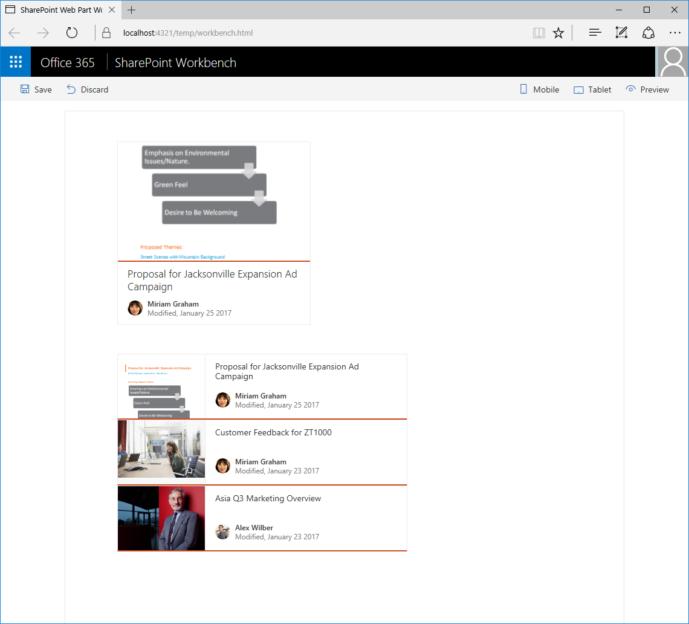

# <a name="share-data-between-web-parts-using-a-global-variable-tutorial"></a>Gemeinsame Verwendung von Daten zwischen Webparts mithilfe einer globalen Variable (Tutorial)

> Hinweis: Wir konnten noch nicht überprüfen, ob sich die Anleitung in diesem Artikel mit der allgemein verfügbaren SPFx-Version (GA-Version) umsetzen lässt. Möglicherweise treten Probleme auf, wenn Sie die neueste Version für dieses Tutorial verwenden.

Wenn Sie bei der Erstellung von clientseitigen Webparts Daten nur einmal laden und anschließend in den verschiedenen Webparts jeweils wiederverwenden, verbessert das die Leistung Ihrer Seiten und reduziert die Last in Ihrem Netzwerk. In diesem Tutorial beschreiben wir Schritt für Schritt, wie Webparts Daten mithilfe einer globalen Variable gemeinsam verwenden können.

> **Hinweis:** Bevor Sie die Schritte in diesem Artikel durchführen können, müssen Sie [Ihre Entwicklungsumgebung für die Erstellung clientseitiger SharePoint-Webparts einrichten](../../set-up-your-development-environment).

## <a name="prepare-the-project"></a>Vorbereiten des Projekts

### <a name="create-a-new-project"></a>Erstellen eines neuen Projekts

Erstellen Sie über eine Eingabeaufforderung einen Ordner für Ihr Projekt:

```sh
md react-recentdocuments
```

Wechseln Sie in den Projektordner:

```sh
cd react-recentdocuments
```

Führen Sie im Projektordner den SharePoint Framework-Yeoman-Generator aus, um ein Gerüst für ein neues SharePoint Framework-Projekt zu erstellen:

```sh
yo @microsoft/sharepoint
```

Es werden verschiedene Eingabeaufforderungen angezeigt. Geben Sie jeweils die folgenden Werte an:

- **WebPart** als den Typ von zu erstellender clientseitiger Komponente
- **react-recentdocuments** als Namen der Lösung
- **Verwenden Sie den aktuellen Ordner** als Speicherort für die Dateien.
- **Zuletzt verwendete Dokumente** als Name des Webparts.
- **Shows recently modified documents** als Beschreibung Ihres Webparts
- **React** als das zu verwendende Framework


Öffnen Sie nach Abschluss der Gerüsterstellung den Projektordner in Ihrem Code-Editor. Für die Anleitung in diesem Artikel haben wir Visual Studio Code verwendet; auch die Screenshots entstammen diesem Editor. Sie können jedoch auch jeden beliebigen anderen Editor verwenden.


## <a name="show-the-recently-modified-documents"></a>Anzeigen der kürzlich geänderten Dokumente

Das Webpart „Zuletzt verwendete Dokumente“ zeigt Informationen zu den zuletzt geänderten Dokumenten an, die jeweils als Office UI Fabric-Karte dargestellt werden.


### <a name="remove-the-standard-description-property"></a>Entfernen der Standardeigenschaft _description_

Im ersten Schritt entfernen Sie die Standardeigenschaft `description` aus der Schnittstelle `IRecentDocumentsWebPartProps`. Öffnen Sie hierzu im Code-Editor die Datei **./src/webparts/recentDocuments/IRecentDocumentsWebPartProps.ts**, und fügen Sie den folgenden Code ein:

```ts
export interface IRecentDocumentsWebPartProps {
}
```

Entfernen Sie nun die Standardeigenschaft `description` aus dem Webpartmanifest. Öffnen Sie hierzu die Datei **./src/webparts/recentDocuments/RecentDocumentsWebPart.manifest.json**, und entfernen Sie aus der Eigenschaft `properties` die Eigenschaft `description`:

```json
{
  "$schema": "../../../node_modules/@microsoft/sp-module-interfaces/lib/manifestSchemas/jsonSchemas/clientSideComponentManifestSchema.json",

  "id": "7a7e3aa9-5d8a-4155-936b-0b0e06e9ca11",
  "alias": "RecentDocumentsWebPart",
  "componentType": "WebPart",
  "version": "0.0.1",
  "manifestVersion": 2,

  "preconfiguredEntries": [{
    "groupId": "7a7e3aa9-5d8a-4155-936b-0b0e06e9ca11",
    "group": { "default": "Under Development" },
    "title": { "default": "Recent documents" },
    "description": { "default": "Shows recently modified documents" },
    "officeFabricIconFontName": "Page",
    "properties": {
    }
  }]
}
```

Entfernen Sie anschließend die Standardeigenschaft `description` aus dem Webpart. Öffnen Sie dazu im Code-Editor die Datei **./src/webparts/recentDocuments/RecentDocumentsWebPart.ts**, und ersetzen Sie die Methode `render` durch den folgenden Code:

```ts
export default class RecentDocumentsWebPart extends BaseClientSideWebPart<IRecentDocumentsWebPartProps> {
  // ...
  public render(): void {
    const element: React.ReactElement<IRecentDocumentsProps > = React.createElement(
      RecentDocuments,
      {
      }
    );

    ReactDom.render(element, this.domElement);
  }
  // ...
}
```

Ersetzen Sie nun die Methode `getPropertyPaneConfiguration` durch den folgenden Code:

```ts
export default class RecentDocumentsWebPart extends BaseClientSideWebPart<IRecentDocumentsWebPartProps> {
  // ...

  protected getPropertyPaneConfiguration(): IPropertyPaneConfiguration {
    return {
      pages: [
        {
          header: {
            description: strings.PropertyPaneDescription
          },
          groups: [
            {
              groupName: strings.BasicGroupName,
              groupFields: []
            }
          ]
        }
      ]
    };
  }
}
```

### <a name="create-the-idocumentactivity-interface"></a>Erstellen der Schnittstelle „IDocumentActivity“

Erstellen Sie im Ordner **./src/webparts/recentDocuments** eine neue Datei mit dem Namen **IDocumentActivity.ts**, und fügen Sie den folgenden Code in die Datei ein:

```ts
export interface IDocumentActivity {
    title: string;
    actorName: string;
    actorImageUrl: string;
}
```

Diese Schnittstelle wird verwendet, um die Aktivitätsinformationen eines gegebenen Dokuments auf einer Karte anzuzeigen.

### <a name="create-the-idocument-interface"></a>Erstellen der Schnittstelle „IDocument“

Erstellen Sie im Ordner **./src/webparts/recentDocuments** eine neue Datei mit dem Namen **IDocument.ts**, und fügen Sie den folgenden Code in die Datei ein:

```ts
import { IDocumentActivity } from './IDocumentActivity';

export interface IDocument {
    title: string;
    url: string;
    imageUrl: string;
    iconUrl: string;
    activity: IDocumentActivity;
}
```

Diese Schnittstelle repräsentiert ein Dokument samt allen Informationen, die erforderlich sind, um es als Karte anzeigen zu können.

### <a name="show-recent-documents-in-the-recentdocuments-react-component"></a>Anzeigen zuletzt verwendeter Dokumente in der React-Komponente „RecentDocuments“

Fügen Sie die **documents**-Eigenschaft zu der **IRecentDocumentsProps**-Schnittstelle hinzu. Öffnen Sie im Code-Editor die Datei **./src/webparts/recentDocuments/components/IRecentDocumentsProps.ts**, und fügen Sie den folgenden Code ein:

```ts
import { IDocument } from '../IDocument';

export interface IRecentDocumentsProps {
  documents: IDocument[];
}
```

Öffnen Sie im Code-Editor die Datei **./src/webparts/recentDocuments/components/RecentDocuments.tsx**, und fügen Sie den folgenden Code in die Datei ein:

```tsx
import * as React from 'react';
import {
  DocumentCard,
  DocumentCardType,
  DocumentCardPreview,
  DocumentCardTitle,
  DocumentCardActivity
} from 'office-ui-fabric-react';
import { IDocument } from '../IDocument';
import styles from './RecentDocuments.module.scss';
import { IRecentDocumentsProps } from './IRecentDocumentsProps';

export default class RecentDocuments extends React.Component<IRecentDocumentsProps, void> {
  public render(): React.ReactElement<IRecentDocumentsProps> {
    const documents: JSX.Element[] = this.props.documents.map((document: IDocument, index: number, array: IDocument[]): JSX.Element => {
      return (
        <DocumentCard type={DocumentCardType.compact} onClickHref={document.url} accentColor='#ce4b1f' key={index}>
          <DocumentCardPreview previewImages={[{
            name: document.title,
            url: document.url,
            previewImageSrc: document.imageUrl,
            iconSrc: document.iconUrl,
            width: 144
          }]} />
          <div className='ms-DocumentCard-details'>
            <DocumentCardTitle
              title={document.title}
              shouldTruncate={true} />
            <DocumentCardActivity
              activity={document.activity.title}
              people={
                [
                  { name: document.activity.actorName, profileImageSrc: document.activity.actorImageUrl }
                ]
              }
              />
          </div>
        </DocumentCard>
      );
    });
    return (
      <div className={styles.helloWorld}>
        {documents}
      </div>
    );
  }
}
```

Die Komponente durchläuft zunächst die Dokumente, die in der Komponenteneigenschaft `documents` übergeben wurden. Dabei erstellt sie für jedes Dokument eine [Office UI Fabric-Dokumentkarte](https://dev.office.com/fabric#/components/documentcard) und trägt als deren Eigenschaften die entsprechenden Informationen zu dem jeweiligen Dokument ein. Sobald für jedes Dokument eine Karte erstellt wurde, fügt die Komponente diese Karten ihrem Textkörper hinzu und gibt das vollständige Markup zurück.

### <a name="load-the-information-about-the-recent-documents"></a>Laden der Informationen zu den zuletzt verwendeten Dokumenten

In diesem Beispiel werden die Informationen zu den zuletzt geänderten Dokumenten aus einem statischen Dataset geladen. Sie können die Implementierung jedoch auch mühelos so abändern, dass die Daten stattdessen aus einer SharePoint-Dokumentbibliothek geladen werden.

Öffnen Sie im Code-Editor die Datei **./src/webparts/recentDocuments/RecentDocumentsWebPart.ts**. Fügen Sie eine Importanweisung für die Schnittstelle `IDocument` unterhalb der anderen Importanweisungen am Anfang der Datei ein. Verwenden Sie hierzu den folgenden Code:

```ts
import { IDocument } from './IDocument';
```

Fügen Sie in der Klasse `RecentDocumentsWebPart` eine neue private Variable mit dem Namen `documents` ein. Verwenden Sie hierzu den folgenden Code:

```ts
export default class RecentDocumentsWebPart extends BaseClientSideWebPart<IRecentDocumentsWebPartProps> {
    private static documents: IDocument[] = [
        {
            title: 'Proposal for Jacksonville Expansion Ad Campaign',
            url: 'https://contoso-my.sharepoint.com/personal/miriamg_contoso_onmicrosoft_com/_layouts/15/WopiFrame.aspx?sourcedoc=%7BCBF65183-0378-485B-AB67-791E0FC81D72%7D&file=Jacksonville%20Ad%20Campaign%20(draft).docx&action=view&DefaultItemOpen=1',
            imageUrl: 'https://contoso-my.sharepoint.com/_layouts/15/getpreview.ashx?guidSite=ca6fa69c-347d-4c07-886c-67105dc5a357&guidWeb=237a3f3f-59a4-46e8-b0a8-6effd78bd327&guidFile=%7BCBF65183-0378-485B-AB67-791E0FC81D72%7D&docId=17592965474834&metadataToken=&clienttype=DelveWebHomeFeed',
            iconUrl: '',
            activity: {
                title: 'Modified, January 25 2017',
                actorName: 'Miriam Graham',
                actorImageUrl: 'https://contoso-my.sharepoint.com/_vti_bin/DelveApi.ashx/people/profileimage?userId=miriamg@contoso.onmicrosoft.com&size=L'
            }
        },
        {
            title: 'Customer Feedback for ZT1000',
            url: 'https://contoso-my.sharepoint.com/personal/miriamg_contoso_onmicrosoft_com/_layouts/15/WopiFrame.aspx?sourcedoc=%7B5449CE24-BFB7-442E-843D-E0C86CEB71CC%7D&file=Customer%20Feedback%20for%20ZT1000.pptx&action=view&DefaultItemOpen=1',
            imageUrl: 'https://contoso-my.sharepoint.com/_layouts/15/getpreview.ashx?guidSite=ca6fa69c-347d-4c07-886c-67105dc5a357&guidWeb=237a3f3f-59a4-46e8-b0a8-6effd78bd327&guidFile=%7B5449CE24-BFB7-442E-843D-E0C86CEB71CC%7D&docId=17592968714930&metadataToken=&clienttype=DelveWebHomeFeed',
            iconUrl: '',
            activity: {
                title: 'Modified, January 23 2017',
                actorName: 'Miriam Graham',
                actorImageUrl: 'https://contoso-my.sharepoint.com/_vti_bin/DelveApi.ashx/people/profileimage?userId=miriamg@contoso.onmicrosoft.com&size=L'
            }
        },
        {
            title: 'Asia Q3 Marketing Overview',
            url: 'https://contoso-my.sharepoint.com/personal/alexw_contoso_onmicrosoft_com/_layouts/15/WopiFrame.aspx?sourcedoc=%7BFD077A94-AB7D-45F9-A810-36229E518A94%7D&file=Asia%20Q3%20Marketing%20Overview%20Beta.pptx&action=view&DefaultItemOpen=1',
            imageUrl: 'https://contoso-my.sharepoint.com/_layouts/15/getpreview.ashx?guidSite=18231116-2bf0-474c-93ee-eb362681b293&guidWeb=237a3f3f-59a4-46e8-b0a8-6effd78bd327&guidFile=%7BFD077A94-AB7D-45F9-A810-36229E518A94%7D&docId=17592969984791&metadataToken=&clienttype=DelveWebHomeFeed',
            iconUrl: '',
            activity: {
                title: 'Modified, January 23 2017',
                actorName: 'Alex Wilber',
                actorImageUrl: 'https://contoso-my.sharepoint.com/_vti_bin/DelveApi.ashx/people/profileimage?userId=alexw@contoso.onmicrosoft.com&size=L'
            }
        },
        {
            title: 'Trey Research Business Development Plan',
            url: 'https://contoso.sharepoint.com/sites/contoso/Resources/Document%20Center/_layouts/15/WopiFrame.aspx?sourcedoc=%7B743A6C44-D3F8-4ECC-A1B7-EA9844911314%7D&file=Trey%20Research%20Business%20Development%20Plan.pptx&action=view&DefaultItemOpen=1',
            imageUrl: 'https://contoso-my.sharepoint.com/_layouts/15/getpreview.ashx?guidSite=923a6ce1-7b67-4bd0-a59f-89d37f233804&guidWeb=c12486eb-661c-46c7-baba-073a8a45b610&guidFile=%7B743A6C44-D3F8-4ECC-A1B7-EA9844911314%7D&docId=265998788&metadataToken=&clienttype=DelveWebHomeFeed',
            iconUrl: '',
            activity: {
                title: 'Modified, January 15 2017',
                actorName: 'Alex Wilber',
                actorImageUrl: 'https://contoso-my.sharepoint.com/_vti_bin/DelveApi.ashx/people/profileimage?userId=alexw@contoso.onmicrosoft.com&size=L'
            }
        },
        {
            title: 'XT1000 Marketing Analysis',
            url: 'https://contoso-my.sharepoint.com/personal/henriettam_contoso_onmicrosoft_com/_layouts/15/WopiFrame.aspx?sourcedoc=%7BA8B9F935-E5A1-47AD-B052-D5ED30E682AB%7D&file=XT1000%20Marketing%20Analysis.pptx&action=view&DefaultItemOpen=1',
            imageUrl: 'https://contoso-my.sharepoint.com/_layouts/15/getpreview.ashx?guidSite=b187e1dd-7687-49e0-87ff-6250e61e56ac&guidWeb=237a3f3f-59a4-46e8-b0a8-6effd78bd327&guidFile=%7BA8B9F935-E5A1-47AD-B052-D5ED30E682AB%7D&docId=17592963604695&metadataToken=&clienttype=DelveWebHomeFeed',
            iconUrl: '',
            activity: {
                title: 'Modified, December 15 2016',
                actorName: 'Henrietta Mueller',
                actorImageUrl: 'https://contoso-my.sharepoint.com/_vti_bin/DelveApi.ashx/people/profileimage?userId=henriettam@contoso.onmicrosoft.com&size=L'
            }
        }
    ];

    // ...
}
```

Ändern Sie die Methode `render` so, dass die Informationen zu den zuletzt geänderten Dokumenten geladen und gerendert werden:

```ts
export default class RecentDocumentsWebPart extends BaseClientSideWebPart<IRecentDocumentsWebPartProps> {
  // ...
  public render(): void {
    this.context.statusRenderer.displayLoadingIndicator(this.domElement, 'documents');

    window.setTimeout((): void => {
      const element: React.ReactElement<IRecentDocumentsProps> = React.createElement(
        RecentDocuments,
        {
          documents: RecentDocumentsWebPart.documents.slice(0, 3)
        }
      );

      this.context.statusRenderer.clearLoadingIndicator(this.domElement);
      ReactDom.render(element, this.domElement);
    }, 300);
  }
  // ...
}
```

Überprüfen Sie nun, ob das Webpart korrekt funktioniert und Informationen zu den drei zuletzt geänderten Dokumenten anzeigt. Führen Sie dazu den folgenden Befehl über eine Eingabeaufforderung in Ihrem Projektverzeichnis aus:

```sh
gulp serve
```

Fügen Sie in SharePoint Workbench das Webpart „Zuletzt verwendete Dokumente“ zur Canvas hinzu.


## <a name="show-the-most-recently-modified-document"></a>Anzeigen des zuletzt geänderten Dokuments

Das Webpart „Recent document“ zeigt Informationen zu dem zuletzt geänderten Dokument an.


### <a name="add-the-second-web-part"></a>Hinzufügen des zweiten Webparts

Nun fügen wir dem Projekt ein zweites Webpart hinzu, um zu veranschaulichen, wie Webparts Daten gemeinsam verwenden können.

Führen Sie über eine Eingabeaufforderung im Projektordner den SharePoint Framework-Yeoman-Generator aus.

```sh
yo @microsoft/sharepoint
```

Es werden verschiedene Eingabeaufforderungen angezeigt. Geben Sie jeweils die folgenden Werte an:


- **WebPart** als den Typ von zu erstellender clientseitiger Komponente
- **Recent document** als Namen des Webparts
- **Zeigt Informationen zu dem zuletzt geänderten Dokumentinformation** als Beschreibung des Webparts.


### <a name="remove-the-standard-description-property"></a>Entfernen der Standardeigenschaft _description_

Im ersten Schritt entfernen Sie die Eigenschaft `description` aus der Schnittstelle `IRecentDocumentWebPartProps`. Öffnen Sie hierzu im Code-Editor die Datei **./src/webparts/recentDocument/IRecentDocumentWebPartProps.ts**, und fügen Sie den folgenden Code in die Datei ein:

```ts
export interface IRecentDocumentWebPartProps {
}
```

Entfernen Sie die Standardeigenschaft `description` aus dem Webpartmanifest. Öffnen Sie hierzu die Datei **./src/webparts/recentDocument/RecentDocumentWebPart.manifest.json**, und entfernen Sie aus der Eigenschaft `properties` die Eigenschaft `description`:

```json
{
  "$schema": "../../../node_modules/@microsoft/sp-module-interfaces/lib/manifestSchemas/jsonSchemas/clientSideComponentManifestSchema.json",

  "id": "71a6f643-1ac1-47ee-a9f1-502ef52f26d4",
  "alias": "RecentDocumentWebPart",
  "componentType": "WebPart",
  "version": "0.0.1",
  "manifestVersion": 2,

  "preconfiguredEntries": [{
    "groupId": "71a6f643-1ac1-47ee-a9f1-502ef52f26d4",
    "group": { "default": "Under Development" },
    "title": { "default": "Recent document" },
    "description": { "default": "Shows information about the most recently modified document" },
    "officeFabricIconFontName": "Page",
    "properties": {
    }
  }]
}
```

Entfernen Sie nun die Standardeigenschaft `description` aus dem Eigenschaftenbereich des Webparts. Öffnen Sie hierzu im Code-Editor die Datei **./src/webparts/recentDocument/RecentDocumentWebPart.ts**, und ersetzen Sie die Methode `render` durch den folgenden Code:

```ts
export default class RecentDocumentWebPart extends BaseClientSideWebPart<IRecentDocumentWebPartProps> {
  // ...
  public render(): void {
    const element: React.ReactElement<IRecentDocumentProps> = React.createElement(
      RecentDocument,
      {
      }
    );

    ReactDom.render(element, this.domElement);
  }
  // ...
}
```

Im nächsten Schritt ersetzen Sie die Methode `getPropertyPaneConfiguration` durch den folgenden Code:

```ts
export default class RecentDocumentWebPart extends BaseClientSideWebPart<IRecentDocumentWebPartProps> {
  // ...

  protected getPropertyPaneConfiguration(): IPropertyPaneConfiguration {
    return {
      pages: [
        {
          header: {
            description: strings.PropertyPaneDescription
          },
          groups: [
            {
              groupName: strings.BasicGroupName,
              groupFields: []
            }
          ]
        }
      ]
    };
  }
}
```

### <a name="reuse-the-idocument-and-idocumentactivity-interfaces"></a>Wiederverwenden der Schnittstellen _IDocument_ und _IDocumentActivity_

Das Webpart „Recent document“ zeigt Informationen zu dem zuletzt geänderten Dokument an, tut das jedoch anders als das Webpart „Zuletzt verwendete Dokumente“. Die Datenstruktur, die die Dokumente repräsentiert, ist bei beiden Webparts jedoch dieselbe. Statt die Schnittstellen `IDocument` und `IDocumentActivity` zu duplizieren, können Sie sie einmal implementieren und im zweiten Webpart wiederverwenden.

Aktivieren Sie in Visual Studio Code das Explorer-Fenster aus dem Ordner **./src/webparts/recentDocuments**, und verschieben Sie die Dateien **IDocument.ts** und **IDocumentActivity.ts** eine Ebene nach oben zum Ordner **./src/webparts**.


#### <a name="update-references-to-the-moved-files"></a>Aktualisieren der Verweise auf die verschobenen Dateien

Da Sie die Dateien an einen anderen Speicherort innerhalb Ihres Projekts verschoben haben, müssen Sie überall dort, wo die Dateien referenziert werden, den Pfad entsprechend aktualisieren.

Öffnen Sie im Code-Editor die Datei **./src/webparts/recentDocuments/components/IRecentDocumentsProps.ts**, und ändern Sie den Code in der Datei wie folgt:

```ts
import { IDocument } from '../../IDocument';

export interface IRecentDocumentsProps {
  documents: IDocument[];
}
```

Öffnen Sie nun die Datei **./src/webparts/recentDocuments/components/RecentDocuments.tsx**, und aktualisieren Sie die `import`-Anweisung der Schnittstelle `IDocument` wie folgt:

```ts
import { IDocument } from '../../IDocument';
```

Öffnen Sie anschließend die Datei **./src/webparts/recentDocuments/RecentDocumentsWebPart.ts**, und aktualisieren Sie die `import`-Anweisung der Schnittstelle `IDocument` wie folgt:

```ts
import { IDocument } from '../IDocument';
```

### <a name="show-the-most-recent-document-in-the-recentdocument-react-component"></a>Anzeigen des zuletzt verwendeten Dokuments in der React-Komponente „RecentDocument“

Fügen Sie die Eigenschaft `document` der Schnittstelle `IRecentDocumentProps` hinzu. Öffnen Sie hierzu im Code-Editor die Datei **./src/webparts/recentDocument/components/IRecentDocumentProps.ts**, und fügen Sie den folgenden Code in die Datei ein:

```ts
import { IDocument } from '../../IDocument';

export interface IRecentDocumentProps {
  document: IDocument;
}
```

Öffnen Sie im Code-Editor die Datei **./src/webparts/recentDocument/components/RecentDocument.tsx**, und fügen Sie den folgenden Code ein:

```tsx
import * as React from 'react';
import {
  DocumentCard,
  DocumentCardPreview,
  DocumentCardTitle,
  DocumentCardActivity,
  ImageFit
} from 'office-ui-fabric-react';
import { IDocument } from '../../IDocument';
import styles from './RecentDocument.module.scss';
import { IRecentDocumentProps } from './IRecentDocumentProps';

export default class RecentDocument extends React.Component<IRecentDocumentProps, void> {
  public render(): React.ReactElement<IRecentDocumentProps> {
    const document: IDocument = this.props.document;

    return (
      <div className={styles.helloWorld}>
        <DocumentCard onClickHref={document.url}>
          <DocumentCardPreview previewImages={[{
            name: document.title,
            url: document.url,
            previewImageSrc: document.imageUrl,
            iconSrc: document.iconUrl,
            imageFit: ImageFit.cover,
            width: 318,
            height: 196,
            accentColor: '#ce4b1f'
          }]} />
          <DocumentCardTitle
            title={document.title}
            shouldTruncate={true} />
          <DocumentCardActivity
            activity={document.activity.title}
            people={
              [
                { name: document.activity.actorName, profileImageSrc: document.activity.actorImageUrl }
              ]
            }
            />
        </DocumentCard>
      </div>
    );
  }
}
```

Die React-Komponente `RecentDocument` verwendet die Informationen zu dem in der Eigenschaft `document` übergebenen zuletzt geänderten Dokument zum Rendern einer Office UI Fabric-Dokumentkarte.

### <a name="load-the-information-about-the-recent-document"></a>Laden der Informationen zu dem zuletzt verwendeten Dokument

In diesem Beispiel werden die Informationen zu dem zuletzt geänderten Dokument aus einem statischen Dataset geladen.  Sie können die Implementierung jedoch auch mühelos so abändern, dass die Daten stattdessen aus einer SharePoint-Dokumentbibliothek geladen werden.

Öffnen Sie im Code-Editor die Datei **./src/webparts/recentDocument/RecentDocumentWebPart.ts**. Fügen Sie eine Importanweisung für die Schnittstelle `IDocument` unterhalb der anderen Importanweisungen am Anfang der Datei ein. Verwenden Sie hierzu den folgenden Code:

```ts
import { IDocument } from '../IDocument';
```

Fügen Sie in der Klasse `RecentDocumentWebPart` eine neue private Variable mit dem Namen `document` ein. Verwenden Sie hierzu den folgenden Code:

```ts
export default class RecentDocumentWebPart extends BaseClientSideWebPart<IRecentDocumentWebPartProps> {
    private static document: IDocument = {
        title: 'Proposal for Jacksonville Expansion Ad Campaign',
        url: 'https://contoso-my.sharepoint.com/personal/miriamg_contoso_onmicrosoft_com/_layouts/15/WopiFrame.aspx?sourcedoc=%7BCBF65183-0378-485B-AB67-791E0FC81D72%7D&file=Jacksonville%20Ad%20Campaign%20(draft).docx&action=view&DefaultItemOpen=1',
        imageUrl: 'https://contoso-my.sharepoint.com/_layouts/15/getpreview.ashx?guidSite=ca6fa69c-347d-4c07-886c-67105dc5a357&guidWeb=237a3f3f-59a4-46e8-b0a8-6effd78bd327&guidFile=%7BCBF65183-0378-485B-AB67-791E0FC81D72%7D&docId=17592965474834&metadataToken=&clienttype=DelveWebHomeFeed',
        iconUrl: '',
        activity: {
            title: 'Modified, January 25 2017',
            actorName: 'Miriam Graham',
            actorImageUrl: 'https://contoso-my.sharepoint.com/_vti_bin/DelveApi.ashx/people/profileimage?userId=miriamg@contoso.onmicrosoft.com&size=L'
        }
    };

    // ...
}
```

Ändern Sie die Methode `render` so, dass die Informationen zu dem zuletzt geänderten Dokument geladen und gerendert werden:

```ts
export default class RecentDocumentsWebPart extends BaseClientSideWebPart<IRecentDocumentsWebPartProps> {
  // ...
  public render(): void {
    this.context.statusRenderer.displayLoadingIndicator(this.domElement, 'documents');

    window.setTimeout((): void => {
      const element: React.ReactElement<IRecentDocumentProps> = React.createElement(
        RecentDocument,
        {
          document: RecentDocumentWebPart.document
        }
      );

      this.context.statusRenderer.clearLoadingIndicator(this.domElement);
      ReactDom.render(element, this.domElement);
    }, 300);
  }
  // ...
}
```

Überprüfen Sie nun, ob das Webpart korrekt funktioniert und Informationen zu dem zuletzt geänderten Dokument anzeigt. Führen Sie dazu den folgenden Befehl über eine Eingabeaufforderung in Ihrem Projektordner aus:

```sh
gulp serve
```

Fügen Sie in SharePoint Workbench das Webpart „Recent document“ zur Canvas hinzu.


Diese Implementierung ist ein typisches Beispiel für zwei Webparts, die unabhängig voneinander entwickelt werden. Würden beide Webparts auf derselben Seite platziert und würden beide Webparts Daten aus SharePoint laden, würden sie zwei separate Anforderungen ausführen, um einander ähnliche Informationen abzurufen. Angenommen, Sie müssten zu einem späteren Zeitpunkt die Quelle für die Informationen zu den zuletzt geänderten Dokumenten ändern. Dann müssten Sie beide Webparts aktualisieren. Damit die Seite schneller lädt und der Webpartcode einfacher zu pflegen ist, können Sie die zum Abrufen der Daten genutzte Logik zentralisieren und einmal abgerufene Daten für beide Webparts verfügbar machen.

## <a name="centralize-loading-data"></a>Zentralisieren des Ladens von Daten

Zur Zentralisierung des Ladens der Informationen zu den zuletzt geänderten Dokumenten erstellen Sie einen Dienst, der von beiden Webparts referenziert wird.

### <a name="move-the-data-model-interfaces"></a>Verschieben der Datenmodellschnittstellen

Erstellen Sie im Projektordner den Ordnerpfad **./src/services/documentsService**. Verschieben Sie die Dateien **IDocument.ts** und **IDocumentActivity.ts** aus dem Ordner **./src/webparts** in den Ordner **./src/services/documentsService**.


### <a name="build-the-data-access-service"></a>Erstellen des Datenzugriffsdiensts

Erstellen Sie im Ordner **./src/services/documentsService** eine neue Datei namens **DocumentsService.ts**, und fügen Sie den folgenden Code in die Datei ein:

```ts
import { IDocument } from './IDocument';

export class DocumentsService {
    private static documents: IDocument[] = [
        {
            title: 'Proposal for Jacksonville Expansion Ad Campaign',
            url: 'https://contoso-my.sharepoint.com/personal/miriamg_contoso_onmicrosoft_com/_layouts/15/WopiFrame.aspx?sourcedoc=%7BCBF65183-0378-485B-AB67-791E0FC81D72%7D&file=Jacksonville%20Ad%20Campaign%20(draft).docx&action=view&DefaultItemOpen=1',
            imageUrl: 'https://contoso-my.sharepoint.com/_layouts/15/getpreview.ashx?guidSite=ca6fa69c-347d-4c07-886c-67105dc5a357&guidWeb=237a3f3f-59a4-46e8-b0a8-6effd78bd327&guidFile=%7BCBF65183-0378-485B-AB67-791E0FC81D72%7D&docId=17592965474834&metadataToken=&clienttype=DelveWebHomeFeed',
            iconUrl: '',
            activity: {
                title: 'Modified, January 25 2017',
                actorName: 'Miriam Graham',
                actorImageUrl: 'https://contoso-my.sharepoint.com/_vti_bin/DelveApi.ashx/people/profileimage?userId=miriamg@contoso.onmicrosoft.com&size=L'
            }
        },
        {
            title: 'Customer Feedback for ZT1000',
            url: 'https://contoso-my.sharepoint.com/personal/miriamg_contoso_onmicrosoft_com/_layouts/15/WopiFrame.aspx?sourcedoc=%7B5449CE24-BFB7-442E-843D-E0C86CEB71CC%7D&file=Customer%20Feedback%20for%20ZT1000.pptx&action=view&DefaultItemOpen=1',
            imageUrl: 'https://contoso-my.sharepoint.com/_layouts/15/getpreview.ashx?guidSite=ca6fa69c-347d-4c07-886c-67105dc5a357&guidWeb=237a3f3f-59a4-46e8-b0a8-6effd78bd327&guidFile=%7B5449CE24-BFB7-442E-843D-E0C86CEB71CC%7D&docId=17592968714930&metadataToken=&clienttype=DelveWebHomeFeed',
            iconUrl: '',
            activity: {
                title: 'Modified, January 23 2017',
                actorName: 'Miriam Graham',
                actorImageUrl: 'https://contoso-my.sharepoint.com/_vti_bin/DelveApi.ashx/people/profileimage?userId=miriamg@contoso.onmicrosoft.com&size=L'
            }
        },
        {
            title: 'Asia Q3 Marketing Overview',
            url: 'https://contoso-my.sharepoint.com/personal/alexw_contoso_onmicrosoft_com/_layouts/15/WopiFrame.aspx?sourcedoc=%7BFD077A94-AB7D-45F9-A810-36229E518A94%7D&file=Asia%20Q3%20Marketing%20Overview%20Beta.pptx&action=view&DefaultItemOpen=1',
            imageUrl: 'https://contoso-my.sharepoint.com/_layouts/15/getpreview.ashx?guidSite=18231116-2bf0-474c-93ee-eb362681b293&guidWeb=237a3f3f-59a4-46e8-b0a8-6effd78bd327&guidFile=%7BFD077A94-AB7D-45F9-A810-36229E518A94%7D&docId=17592969984791&metadataToken=&clienttype=DelveWebHomeFeed',
            iconUrl: '',
            activity: {
                title: 'Modified, January 23 2017',
                actorName: 'Alex Wilber',
                actorImageUrl: 'https://contoso-my.sharepoint.com/_vti_bin/DelveApi.ashx/people/profileimage?userId=alexw@contoso.onmicrosoft.com&size=L'
            }
        },
        {
            title: 'Trey Research Business Development Plan',
            url: 'https://contoso.sharepoint.com/sites/contoso/Resources/Document%20Center/_layouts/15/WopiFrame.aspx?sourcedoc=%7B743A6C44-D3F8-4ECC-A1B7-EA9844911314%7D&file=Trey%20Research%20Business%20Development%20Plan.pptx&action=view&DefaultItemOpen=1',
            imageUrl: 'https://contoso-my.sharepoint.com/_layouts/15/getpreview.ashx?guidSite=923a6ce1-7b67-4bd0-a59f-89d37f233804&guidWeb=c12486eb-661c-46c7-baba-073a8a45b610&guidFile=%7B743A6C44-D3F8-4ECC-A1B7-EA9844911314%7D&docId=265998788&metadataToken=&clienttype=DelveWebHomeFeed',
            iconUrl: '',
            activity: {
                title: 'Modified, January 15 2017',
                actorName: 'Alex Wilber',
                actorImageUrl: 'https://contoso-my.sharepoint.com/_vti_bin/DelveApi.ashx/people/profileimage?userId=alexw@contoso.onmicrosoft.com&size=L'
            }
        },
        {
            title: 'XT1000 Marketing Analysis',
            url: 'https://contoso-my.sharepoint.com/personal/henriettam_contoso_onmicrosoft_com/_layouts/15/WopiFrame.aspx?sourcedoc=%7BA8B9F935-E5A1-47AD-B052-D5ED30E682AB%7D&file=XT1000%20Marketing%20Analysis.pptx&action=view&DefaultItemOpen=1',
            imageUrl: 'https://contoso-my.sharepoint.com/_layouts/15/getpreview.ashx?guidSite=b187e1dd-7687-49e0-87ff-6250e61e56ac&guidWeb=237a3f3f-59a4-46e8-b0a8-6effd78bd327&guidFile=%7BA8B9F935-E5A1-47AD-B052-D5ED30E682AB%7D&docId=17592963604695&metadataToken=&clienttype=DelveWebHomeFeed',
            iconUrl: '',
            activity: {
                title: 'Modified, December 15 2016',
                actorName: 'Henrietta Mueller',
                actorImageUrl: 'https://contoso-my.sharepoint.com/_vti_bin/DelveApi.ashx/people/profileimage?userId=henriettam@contoso.onmicrosoft.com&size=L'
            }
        }
    ];

    public static getRecentDocument(): Promise<IDocument> {
        return new Promise<IDocument>((resolve: (document: IDocument) => void, reject: (error: any) => void): void => {
            window.setTimeout((): void => {
                resolve(DocumentsService.documents[0]);
            }, 300);
        });
    }

    public static getRecentDocuments(startFrom: number = 0): Promise<IDocument[]> {
        return new Promise<IDocument[]>((resolve: (documents: IDocument[]) => void, reject: (error: any) => void): void => {
            window.setTimeout((): void => {
                resolve(DocumentsService.documents.slice(startFrom, startFrom + 3));
            }, 300);
        });
    }
}
```

Die Klasse `DocumentsService` ist ein Beispieldienst, der Informationen zu den zuletzt verwendeten Dokumenten lädt. In diesem Beispiel wird ein statisches Dataset verwendet. Sie können die Implementierung jedoch mühelos so abändern, dass die Daten aus einer SharePoint-Dokumentbibliothek geladen werden. Zu diesem Zeitpunkt stellt die Klasse `DocumentsService` eine zentrale Schnittstelle bereit, über die alle Webparts auf ihre Daten zugreifen können. Sie speichert die zuvor geladenen Daten jedoch nicht. Diese Funktion wird im weiteren Verlauf dieses Tutorials implementiert.

### <a name="create-a-barrel-for-the-service-files"></a>Erstellen eines Barrels für die Dienstdateien

Wenn Sie Dateien in einem Projekt referenzieren, verweisen Sie auf ihren relativen Pfad. Jedes Mal, wenn sich dieser Pfad ändert, müssen Sie alle Verweise auf die betreffende Datei aktualisieren. Gerade am Anfang eines Projekts werden solche Änderungen wahrscheinlich sehr häufig notwendig sein, da Sie kontinuierlich neue Elemente hinzufügen und die endgültige Projektstruktur noch nicht feststeht. Um häufige Änderungen an den Dateiverweisen innerhalb eines Projekts zu vermeiden, können Sie Barrels nutzen.

Bei einem Barrel handelt es sich um einen Container, der mehrere exportierte Objekte kombiniert. Mithilfe von Barrels können Sie den genauen Speicherort der Dateien eines Projektes und die Projektelemente, die die Dateien verwenden, voneinander abstrahieren.

Erstellen Sie im Ordner **./src/services/documentsService** eine neue Datei mit dem Namen **index.ts**, und fügen Sie den folgenden Code in die Datei ein:

```ts
export { IDocument } from './IDocument';
export { IDocumentActivity } from './IDocumentActivity';
export { DocumentsService } from './DocumentsService';
```

Sobald Sie dieses Barrel definiert haben, können andere Elemente in Ihrem Projekt alle exportierten Typen über den relativen Pfad zum Ordner **./src/services/documentsService** referenzieren statt über den exakten Pfad zu den einzelnen Dateien. Die Schnittstelle `IDocument` kann dann beispielsweise wie folgt referenziert werden:

```ts
import { IDocument } from '../services/documentsService';
```

Ein Verweis wie der unten gezeigte ist nicht mehr nötig:

```ts
import { IDocument } from '../services/documentsService/IDocument.ts';
```

Sollten Sie sich zu einem späteren Zeitpunkt dazu entscheiden, die Datei **IDocument.ts** in einen Unterordner zu verschieben oder verschiedene Dateien zusammenzuführen, müssten Sie lediglich den Pfad in der Barreldefinition (**./src/services/documentsService/index.ts**) ändern. Alle Elemente in Ihrem Projekt hingegen könnten weiterhin denselben relativen Pfad zum Ordner **documentsService** verwenden, um die Schnittstelle `IDocument` zu referenzieren.

### <a name="update-references-to-the-moved-files-to-use-the-barrel"></a>Aktualisieren der Verweise auf die verschobenen Dateien zur Verwendung das Barrels

Da Sie die Dateien **IDocument.ts** und **IDocumentActivity.ts** an einen anderen Speicherort verschoben haben, müssen Sie alle Verweise auf diese Dateien aktualisieren. Dank des Barrels ist das nur noch dieses eine Mal notwendig.

#### <a name="update-references-in-the-recent-documents-web-part"></a>Aktualisieren der Verweise im Webpart „Zuletzt verwendete Dokumente“

Öffnen Sie im Code-Editor die Datei **./src/webparts/recentDocuments/components/IRecentDocumentsProps.ts**, und ändern Sie den Code in der Datei wie folgt:

```ts
import { IDocument } from '../../../services/documentsService';

export interface IRecentDocumentsProps {
  documents: IDocument[];
}
```

Öffnen Sie nun die Datei **./src/webparts/recentDocuments/components/RecentDocuments.tsx**, und aktualisieren Sie die `import`-Anweisung der Schnittstelle `IDocument` wie folgt:

```ts
import { IDocument } from '../../../services/documentsService';
```

Öffnen Sie anschließend die Datei **./src/webparts/recentDocuments/RecentDocumentsWebPart.ts**, und aktualisieren Sie die `import`-Anweisung der Schnittstelle `IDocument` wie folgt:

```ts
import { IDocument } from '../../services/documentsService';
```

#### <a name="update-references-in-the-recent-document-web-part"></a>Aktualisieren der Verweise im Webpart „Recent document“

Öffnen Sie im Code-Editor die Datei **./src/webparts/recentDocument/components/IRecentDocumentProps.ts**, und ändern Sie den Code wie folgt:

```ts
import { IDocument } from '../../../services/documentsService';

export interface IRecentDocumentProps {
  document: IDocument;
}
```

Öffnen Sie nun die Datei **./src/webparts/recentDocument/components/RecentDocument.tsx**, und ändern Sie die `import`-Anweisung der Schnittstelle `IDocument` wie folgt:

```ts
import { IDocument } from '../../../services/documentsService';
```

Öffnen Sie anschließend die Datei **./src/webparts/recentDocument/RecentDocumentWebPart.t**, und ändern Sie die `import`-Anweisung der Schnittstelle `IDocument` wie folgt:

```ts
import { IDocument } from '../../services/documentsService';
```

Führen Sie den folgenden Befehl über eine Eingabeaufforderung in Ihrem Projektordner aus, um zu überprüfen, ob Ihre Änderungen wie erwartet funktionieren:

```sh
gulp serve
```



### <a name="load-web-part-data-using-the-data-service"></a>Laden von Webpartdaten mithilfe des Datendiensts

Der Datendienst ist nun einsatzbereit. Jetzt gestalten Sie beide Webparts so um, dass sie ihre Daten über den Datendienst laden.

#### <a name="load-information-about-the-recently-modified-documents"></a>Laden der Informationen zu den zuletzt geänderten Dokumenten

Öffnen Sie im Code-Editor die Datei **./src/webparts/recentDocuments/RecentDocumentsWebPart.ts**. Ergänzen Sie die `import`-Anweisung, die die Schnittstelle `IDocument` referenziert, wie folgt:

```ts
import { IDocument, DocumentsService } from '../../services/documentsService';
```

Aktualisieren Sie anschließend die Methode `render` mit dem folgenden Code:

```ts
export default class RecentDocumentsWebPart extends BaseClientSideWebPart<IRecentDocumentsWebPartProps> {
  // ...
  public render(): void {
    this.context.statusRenderer.displayLoadingIndicator(this.domElement, 'documents');

    DocumentsService.getRecentDocuments()
      .then((documents: IDocument[]): void => {
        const element: React.ReactElement<IRecentDocumentsProps> = React.createElement(
          RecentDocuments,
          {
            documents: documents
          }
        );

        this.context.statusRenderer.clearLoadingIndicator(this.domElement);
        ReactDom.render(element, this.domElement);
      });
  }
  // ...
}
```

#### <a name="load-information-about-the-most-recently-modified-document"></a>Laden der Informationen zu dem zuletzt geänderten Dokument

Öffnen Sie im Code-Editor die Datei **./src/webparts/recentDocument/RecentDocumentWebPart.ts**. Ergänzen Sie die `import`-Anweisung, die die Schnittstelle `IDocument` referenziert, wie folgt:

```ts
import { IDocument, DocumentsService } from '../../services/documentsService';
```

Aktualisieren Sie anschließend die Methode `render` mit dem folgenden Code:

```ts
export default class RecentDocumentWebPart extends BaseClientSideWebPart<IRecentDocumentWebPartProps> {
  // ...
  public render(): void {
    this.context.statusRenderer.displayLoadingIndicator(this.domElement, 'document');

    DocumentsService.getRecentDocument()
      .then((document: IDocument): void => {
        const element: React.ReactElement<IRecentDocumentProps> = React.createElement(
          RecentDocument,
          {
            document: document
          }
        );

        this.context.statusRenderer.clearLoadingIndicator(this.domElement);
        ReactDom.render(element, this.domElement);
      });
  }
  // ...
}
```

Führen Sie über eine Eingabeaufforderung im Projektordner den folgenden Befehl aus, um sich zu vergewissern, dass beide Webparts korrekt funktionieren:

```sh
gulp serve
```


### <a name="share-data-between-web-parts"></a>Gemeinsame Verwendung von Daten zwischen Webparts

Da nun beide Webparts den Datendienst zum Laden der Daten verwenden, besteht der nächste Schritt darin, den Datendienst so zu erweitern, dass dieser die Daten nur einmal lädt und diese für beide Webparts wiederverwendet.

Öffnen Sie im Code-Editor die Datei **./src/services/documentsService/DocumentsService.ts**, und fügen Sie den folgenden Code in die Datei ein:

```ts
import { IDocument } from './IDocument';

export class DocumentsService {
    private static documents: IDocument[] = [
        {
            title: 'Proposal for Jacksonville Expansion Ad Campaign',
            url: 'https://contoso-my.sharepoint.com/personal/miriamg_contoso_onmicrosoft_com/_layouts/15/WopiFrame.aspx?sourcedoc=%7BCBF65183-0378-485B-AB67-791E0FC81D72%7D&file=Jacksonville%20Ad%20Campaign%20(draft).docx&action=view&DefaultItemOpen=1',
            imageUrl: 'https://contoso-my.sharepoint.com/_layouts/15/getpreview.ashx?guidSite=ca6fa69c-347d-4c07-886c-67105dc5a357&guidWeb=237a3f3f-59a4-46e8-b0a8-6effd78bd327&guidFile=%7BCBF65183-0378-485B-AB67-791E0FC81D72%7D&docId=17592965474834&metadataToken=&clienttype=DelveWebHomeFeed',
            iconUrl: '',
            activity: {
                title: 'Modified, January 25 2017',
                actorName: 'Miriam Graham',
                actorImageUrl: 'https://contoso-my.sharepoint.com/_vti_bin/DelveApi.ashx/people/profileimage?userId=miriamg@contoso.onmicrosoft.com&size=L'
            }
        },
        {
            title: 'Customer Feedback for ZT1000',
            url: 'https://contoso-my.sharepoint.com/personal/miriamg_contoso_onmicrosoft_com/_layouts/15/WopiFrame.aspx?sourcedoc=%7B5449CE24-BFB7-442E-843D-E0C86CEB71CC%7D&file=Customer%20Feedback%20for%20ZT1000.pptx&action=view&DefaultItemOpen=1',
            imageUrl: 'https://contoso-my.sharepoint.com/_layouts/15/getpreview.ashx?guidSite=ca6fa69c-347d-4c07-886c-67105dc5a357&guidWeb=237a3f3f-59a4-46e8-b0a8-6effd78bd327&guidFile=%7B5449CE24-BFB7-442E-843D-E0C86CEB71CC%7D&docId=17592968714930&metadataToken=&clienttype=DelveWebHomeFeed',
            iconUrl: '',
            activity: {
                title: 'Modified, January 23 2017',
                actorName: 'Miriam Graham',
                actorImageUrl: 'https://contoso-my.sharepoint.com/_vti_bin/DelveApi.ashx/people/profileimage?userId=miriamg@contoso.onmicrosoft.com&size=L'
            }
        },
        {
            title: 'Asia Q3 Marketing Overview',
            url: 'https://contoso-my.sharepoint.com/personal/alexw_contoso_onmicrosoft_com/_layouts/15/WopiFrame.aspx?sourcedoc=%7BFD077A94-AB7D-45F9-A810-36229E518A94%7D&file=Asia%20Q3%20Marketing%20Overview%20Beta.pptx&action=view&DefaultItemOpen=1',
            imageUrl: 'https://contoso-my.sharepoint.com/_layouts/15/getpreview.ashx?guidSite=18231116-2bf0-474c-93ee-eb362681b293&guidWeb=237a3f3f-59a4-46e8-b0a8-6effd78bd327&guidFile=%7BFD077A94-AB7D-45F9-A810-36229E518A94%7D&docId=17592969984791&metadataToken=&clienttype=DelveWebHomeFeed',
            iconUrl: '',
            activity: {
                title: 'Modified, January 23 2017',
                actorName: 'Alex Wilber',
                actorImageUrl: 'https://contoso-my.sharepoint.com/_vti_bin/DelveApi.ashx/people/profileimage?userId=alexw@contoso.onmicrosoft.com&size=L'
            }
        },
        {
            title: 'Trey Research Business Development Plan',
            url: 'https://contoso.sharepoint.com/sites/contoso/Resources/Document%20Center/_layouts/15/WopiFrame.aspx?sourcedoc=%7B743A6C44-D3F8-4ECC-A1B7-EA9844911314%7D&file=Trey%20Research%20Business%20Development%20Plan.pptx&action=view&DefaultItemOpen=1',
            imageUrl: 'https://contoso-my.sharepoint.com/_layouts/15/getpreview.ashx?guidSite=923a6ce1-7b67-4bd0-a59f-89d37f233804&guidWeb=c12486eb-661c-46c7-baba-073a8a45b610&guidFile=%7B743A6C44-D3F8-4ECC-A1B7-EA9844911314%7D&docId=265998788&metadataToken=&clienttype=DelveWebHomeFeed',
            iconUrl: '',
            activity: {
                title: 'Modified, January 15 2017',
                actorName: 'Alex Wilber',
                actorImageUrl: 'https://contoso-my.sharepoint.com/_vti_bin/DelveApi.ashx/people/profileimage?userId=alexw@contoso.onmicrosoft.com&size=L'
            }
        },
        {
            title: 'XT1000 Marketing Analysis',
            url: 'https://contoso-my.sharepoint.com/personal/henriettam_contoso_onmicrosoft_com/_layouts/15/WopiFrame.aspx?sourcedoc=%7BA8B9F935-E5A1-47AD-B052-D5ED30E682AB%7D&file=XT1000%20Marketing%20Analysis.pptx&action=view&DefaultItemOpen=1',
            imageUrl: 'https://contoso-my.sharepoint.com/_layouts/15/getpreview.ashx?guidSite=b187e1dd-7687-49e0-87ff-6250e61e56ac&guidWeb=237a3f3f-59a4-46e8-b0a8-6effd78bd327&guidFile=%7BA8B9F935-E5A1-47AD-B052-D5ED30E682AB%7D&docId=17592963604695&metadataToken=&clienttype=DelveWebHomeFeed',
            iconUrl: '',
            activity: {
                title: 'Modified, December 15 2016',
                actorName: 'Henrietta Mueller',
                actorImageUrl: 'https://contoso-my.sharepoint.com/_vti_bin/DelveApi.ashx/people/profileimage?userId=henriettam@contoso.onmicrosoft.com&size=L'
            }
        }
    ];

    public static getRecentDocument(): Promise<IDocument> {
        return new Promise<IDocument>((resolve: (document: IDocument) => void, reject: (error: any) => void): void => {
            DocumentsService.ensureRecentDocuments()
                .then((recentDocuments: IDocument[]): void => {
                    resolve(recentDocuments[0]);
                });
        });
    }

    public static getRecentDocuments(startFrom: number = 0): Promise<IDocument[]> {
        return new Promise<IDocument[]>((resolve: (documents: IDocument[]) => void, reject: (error: any) => void): void => {
            DocumentsService.ensureRecentDocuments()
                .then((recentDocuments: IDocument[]): void => {
                    resolve(recentDocuments.slice(startFrom, startFrom + 3));
                });
        });
    }

    private static ensureRecentDocuments(): Promise<IDocument[]> {
        return new Promise<IDocument[]>((resolve: (recentDocuments: IDocument[]) => void, reject: (error: any) => void): void => {
            if ((window as any).loadedData) {
                // data already loaded. reuse
                resolve((window as any).loadedData);
                return;
            }

            if ((window as any).loadingData) {
                // data is being loaded. wait a moment and try again
                window.setTimeout((): void => {
                    DocumentsService.ensureRecentDocuments()
                        .then((recentDocuments: IDocument[]): void => {
                            resolve(recentDocuments);
                        });
                }, 100);
            }
            else {
                (window as any).loadingData = true;
                window.setTimeout((): void => {
                    // store the data for subsequent requests and resolve the Promise
                    (window as any).loadedData = DocumentsService.documents;
                    (window as any).loadingData = false;
                    resolve((window as any).loadedData);
                }, 300);
            }
        });
    }
}
```

Sobald ein Webpart erstmals den Datendienst aufruft, um Daten zu laden, setzt der Dienst die globale Variable `loadingData` auf `true`. So wird angezeigt, dass aktuell Daten geladen werden. Das ist erforderlich, damit Daten nicht mehrfach geladen werden, beispielsweise wenn ein anderes Webpart seine Daten laden möchte, bevor die ursprüngliche Anforderung zum Laden der Daten abgeschlossen wurde. In unserem Beispiel werden die Daten aus einem statischen Dataset geladen. Sie können die Implementierung jedoch mühelos so abändern, dass die Daten aus einer SharePoint-Dokumentbibliothek geladen werden.

Nachdem die Daten geladen wurden, werden sie in der globalen Variable `loadedData` gespeichert. Der Wert der Variable `loadingData` wird auf `false` festgelegt, und die Zusage wird mit den abgerufenen Daten aufgelöst. Bei der nächsten Datenanforderung durch ein Webpart gibt der Datendienst die zuvor bereits geladenen Daten zurück. Alle zusätzlichen Anforderungen an die Remote-APIs fallen dadurch weg.

Führen Sie über eine Eingabeaufforderung im Projektordner den folgenden Befehl aus, um sich zu vergewissern, dass beide Webparts korrekt funktionieren:

```sh
gulp serve
```


Wenn Sie den verschiedenen Abschnitten der Methode `DocumentsService.ensureRecentDocuments` Protokollierungsanweisungen hinzufügen, können Sie nachverfolgen, wie die Daten einmalig geladen und anschließend für das zweite Webpart wiederverwendet werden.


## <a name="see-also"></a>Weitere Artikel

- [Gemeinsame Verwendung von Daten zwischen clientseitigen Webparts](./share-data-between-web-parts)
