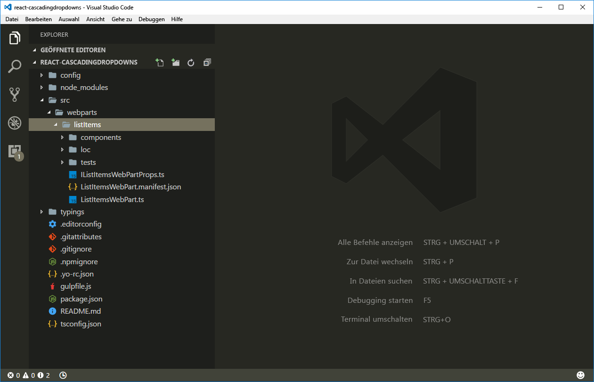
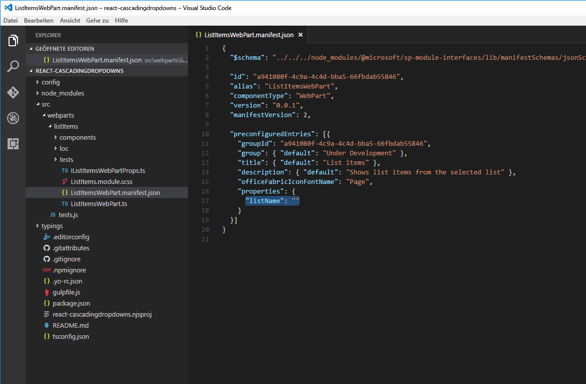
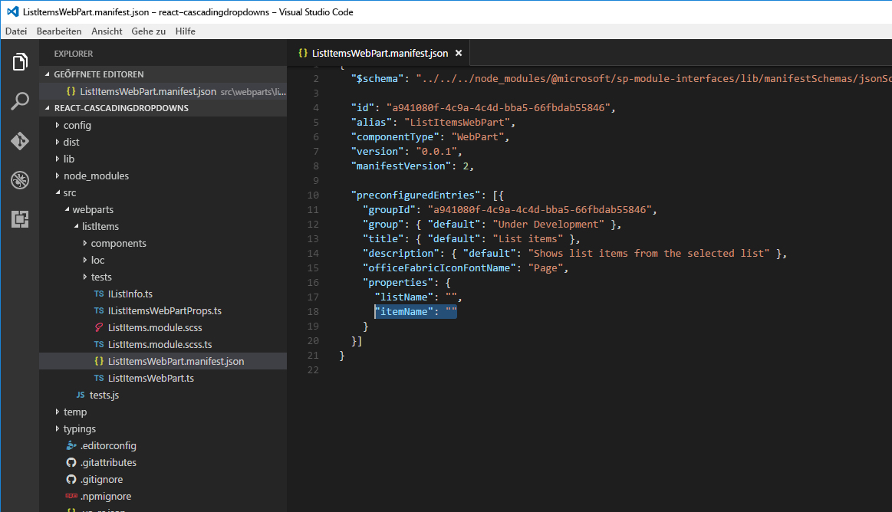

# <a name="use-cascading-dropdowns-in-web-part-properties"></a>Verwenden von kaskadierenden Dropdowns in Webparteigenschaften

Beim Entwerfen des Eigenschaftenbereichs Ihrer clientseitigen SharePoint-Webparts arbeiten Sie vielleicht mit Webparteigenschaften, deren Optionen basierend auf dem in einer anderen Eigenschaft ausgewählten Wert angezeigt werden. Dieses Szenario findet sich in der Regel bei der Implementierung von kaskadierenden Dropdown-Steuerelementen. In diesem Artikel erfahren Sie, wie Sie kaskadierende Dropdown-Steuerelemente im Eigenschaftenbereich von Webparts erstellen können, ohne ein benutzerdefiniertes Steuerelement für den Eigenschaftenbereich zu programmieren.


Der Quellcode des Webparts, mit dem wir arbeiten, steht auf GitHub zur Verfügung, unter [sp-dev-fx-webparts/samples/react-custompropertypanecontrols](https://github.com/SharePoint/sp-dev-fx-webparts/tree/master/samples/react-custompropertypanecontrols).

> [!NOTE] 
> Bevor Sie die Anleitung in diesem Artikel umsetzen können, müssen Sie [die Entwicklungsumgebung für Ihr clientseitiges SharePoint-Webpart einrichten](../../set-up-your-development-environment.md).

## <a name="create-new-project"></a>Erstellen eines neuen Projekts

1. Erstellen Sie zunächst einen neuen Ordner für Ihr Projekt:

  ```sh
  md react-cascadingdropdowns
  ```

2. Wechseln Sie in den Projektordner:

  ```sh
  cd react-cascadingdropdowns
  ```

3. Führen Sie im Projektordner den SharePoint Framework-Yeoman-Generator aus, um ein Gerüst für ein neues SharePoint Framework-Projekt zu erstellen:

  ```sh
  yo @microsoft/sharepoint
  ```

4. Geben Sie die folgenden Werte ein, wenn Sie dazu aufgefordert werden:

  - **react-cascadingdropdowns** als Lösungsname
  - **Aktuellen Ordner verwenden** als Speicherort für die Dateien
  - **React** als Eintrittspunkt für die Webpart-Erstellung
  - **Listenelemente** als Namen des Webparts
  - **Zeigt Listenelemente aus der ausgewählten Liste an** als Beschreibung Ihres Webparts

  

5. Warten Sie, bis das Gerüst erstellt wurde, und sperren Sie dann mithilfe des folgenden Befehls die Version der Projektabhängigkeiten:

  ```sh
  npm shrinkwrap
  ```

6. Öffnen Sie den Projektordner in einem Code-Editor. In diesem Artikel wird Visual Studio Code in den Schritten und Screenshots verwendet, Sie können jedoch auch jeden beliebigen anderen Editor verwenden.

  

## <a name="define-a-web-part-property-to-store-the-selected-list"></a>Definieren einer Webparteigenschaft zum Speichern der ausgewählten Liste

In diesem Tutorial erstellen Sie ein Webpart, in dem Listenelemente aus einer ausgewählten SharePoint-Liste angezeigt werden. Benutzer können die gewünschte Liste im Eigenschaftenbereich des Webparts auswählen. Erstellen Sie eine neue Webparteigenschaft namens **listName**, in der die ausgewählte Liste gespeichert wird:

1. Öffnen Sie im Code-Editor die Datei **src/webparts/listItems/ListItemsWebPartManifest.json**. Ersetzen Sie die Standardeigenschaft **description** durch eine neue Eigenschaft mit dem Namen `listName`.

  

2. Öffnen Sie die Datei **src/webparts/listItems/IListItemsWebPartProps.ts**, und ersetzen Sie den in ihr enthaltenen Code durch folgenden Code:

  ```ts
  export interface IListItemsWebPartProps {
    listName: string;
  }
  ```

3. Ändern Sie in der Datei **src/webparts/listItems/ListItemsWebPart.ts** die Methode **render** wie folgt:

  ```ts
  export default class ListItemsWebPart extends BaseClientSideWebPart<IListItemsWebPartProps> {
    // ...
    public render(): void {
      const element: React.ReactElement<IListItemsProps> = React.createElement(ListItems, {
        listName: this.properties.listName
      });

      ReactDom.render(element, this.domElement);
    }
    // ...
  }
  ```

4. Aktualisieren Sie **propertyPaneSettings** wie folgt:

  ```ts
  export default class ListItemsWebPart extends BaseClientSideWebPart<IListItemsWebPartProps> {
    // ...
    protected getPropertyPaneConfiguration(): IPropertyPaneConfiguration {
      return {
        pages: [
          {
            header: {
              description: strings.PropertyPaneDescription
            },
            groups: [
              {
                groupName: strings.BasicGroupName,
                groupFields: [
                  PropertyPaneTextField('listName', {
                    label: strings.ListNameFieldLabel
                  })
                ]
              }
            ]
          }
        ]
      };
    }
    // ...
  }
  ```

5. Ändern Sie in der Datei **src/webparts/listItems/loc/mystrings.d.ts** die Schnittstelle **IListItemsStrings** wie folgt:

  ```ts
  declare interface IListItemsStrings {
    PropertyPaneDescription: string;
    BasicGroupName: string;
    ListNameFieldLabel: string;
  }
  ```

6. Fügen Sie in der Datei **src/webparts/listItems/loc/en-us.js** die fehlende Definition für die Zeichenfolge **ListNameFieldLabel** hinzu:

  ```js
  define([], function() {
    return {
      "PropertyPaneDescription": "Description",
      "BasicGroupName": "Group Name",
      "ListNameFieldLabel": "List"
    }
  });
  ```

7. Ändern Sie in der Datei **src/webparts/listItems/components/ListItems.tsx** den Code der Methode **render** wie folgt:

  ```tsx
  export default class ListItems extends React.Component<IListItemsProps, {}> {
  public render(): JSX.Element {
      return (
          <div className={styles.listItems}>
          <div className={styles.container}>
            <div className={`ms-Grid-row ms-bgColor-themeDark ms-fontColor-white ${styles.row}`}>
              <div className="ms-Grid-col ms-u-lg10 ms-u-xl8 ms-u-xlPush2 ms-u-lgPush1">
                <span className="ms-font-xl ms-fontColor-white">Welcome to SharePoint!</span>
                <p className="ms-font-l ms-fontColor-white">Customize SharePoint experiences using Web Parts.</p>
                <p className="ms-font-l ms-fontColor-white">{escape(this.props.listName)}</p>
                <a href="https://aka.ms/spfx" className={styles.button}>
                  <span className={styles.label}>Learn more</span>
                </a>
              </div>
            </div>
          </div>
        </div>
      );
    }
  }
  ```

8. Ändern Sie in der Datei **src/webparts/listItems/components/IListItemsProps.ts** die **IListItemsProps**-Oberfläche in:

  ```ts
  export interface IListItemsProps {
    listName: string;
  }
  ```

9. Führen Sie den folgenden Befehl aus, um sicherzustellen, dass das Projekt ausgeführt wird:

  ```sh
  gulp serve
  ```

10. Fügen Sie im Webbrowser das **Listenelement**-Webpart zum Zeichenbereich hinzu, und öffnen Sie die Eigenschaften. Überprüfen Sie, dass der für die **List**-Eigenschaft festgelegte Wert im Webparttext angezeigt wird.

  


## <a name="populate-the-dropdown-with-sharepoint-lists-to-choose-from"></a>Ausfüllen des Dropdowns mit SharePoint-Listen, aus denen eine Auswahl getroffen werden kann

An diesem Punkt gibt der Benutzer an, welche Liste das Webpart verwenden soll. Hierzu gibt er manuell den Namen der entsprechenden Liste ein. Diese Vorgehensweise ist fehleranfällig, und im Idealfall sollten Benutzer eine der Listen auswählen, die auf der aktuellen SharePoint-Website vorhanden sind.

### <a name="use-dropdown-control-to-render-the-listname-property"></a>Verwenden des Dropdown-Steuerelements zum Rendern der Eigenschaft „listName“

1. Fügen Sie in der Klasse **ListItemsWebPart** einen Verweis auf die Klasse **PropertyPaneDropdown** im oberen Bereich des Webparts hinzu. Ersetzen Sie die Importklausel, von der die Klasse **PropertyPaneTextField** geladen wird, durch folgenden Code:

  ```ts
  import {
    BaseClientSideWebPart,
    IPropertyPaneConfiguration,
    PropertyPaneTextField,
    PropertyPaneDropdown,
    IPropertyPaneDropdownOption
  } from '@microsoft/sp-webpart-base';
  ```

2. Fügen Sie in der Klasse **ListItemsWebPart** eine neue Variable mit dem Namen **lists** hinzu, in der Informationen über alle auf der aktuellen Website verfügbaren Liste gespeichert werden:

  ```ts
  export default class ListItemsWebPart extends BaseClientSideWebPart<IListItemsWebPartProps> {
    private lists: IPropertyPaneDropdownOption[];
    // ...
  }
  ```

3. Fügen Sie eine neue Klassenvariable mit dem Namen **listsDropdownDisabled** hinzu. Diese Variable legt fest, ob das Listendropdown aktiviert ist oder nicht. Das Dropdown sollte solange deaktiviert sein, bis das Webpart die Informationen zu den auf der aktuellen Website verfügbaren Listen abgerufen hat.

  ```ts
  export default class ListItemsWebPart extends BaseClientSideWebPart<IListItemsWebPartProps> {
    // ...
    private listsDropdownDisabled: boolean = true;
    // ...
  }
  ```

4. Ändern Sie den Getter **propertyPaneSettings** so, dass er zum Rendern der Eigenschaft **listName** das Dropdown-Steuerelement verwendet:

  ```ts
  export default class ListItemsWebPart extends BaseClientSideWebPart<IListItemsWebPartProps> {
    // ...
    protected get propertyPaneSettings(): IPropertyPaneSettings {
      return {
        pages: [
          {
            header: {
              description: strings.PropertyPaneDescription
            },
            groups: [
              {
                groupName: strings.BasicGroupName,
                groupFields: [
                  PropertyPaneDropdown('listName', {
                    label: strings.ListNameFieldLabel,
                    options: this.lists,
                    disabled: this.listsDropdownDisabled
                  })
                ]
              }
            ]
          }
        ]
      };
    }
  }
  ```

5. Führen Sie den folgenden Befehl aus, um zu überprüfen, ob alles wie erwartet funktioniert:

  ```sh
  gulp serve
  ```

  


### <a name="show-available-lists-in-the-list-dropdown"></a>Anzeigen verfügbarer Listen im Listendropdown

Im vorangegangenen Schritt haben Sie das Dropdown-Steuerelement der Eigenschaft **listName** mit der Klasseneigenschaft **lists** verknüpft. Da Sie noch keine Werte in das Element geladen haben, bleibt das Dropdown **List** im Eigenschaftenbereich des Webparts deaktiviert. In diesem Abschnitt erweitern Sie das Webpart so, dass es Informationen zu den verfügbaren Listen lädt.

1. Fügen Sie in der Klasse **ListItemsWebPart** eine Methode zum Laden aller verfügbaren Listen hinzu. Hier verwenden Sie simulierte Daten; Sie können aber auch die SharePoint-REST-API aufrufen, um die Liste aller im aktuellen Web verfügbaren Listen abzurufen. Um das Laden aus einem externen Dienst zu simulieren, implementiert die Methode eine Verzögerung von 2 Sekunden.

  ```ts
  export default class ListItemsWebPart extends BaseClientSideWebPart<IListItemsWebPartProps> {
    // ...
    private loadLists(): Promise<IPropertyPaneDropdownOption[]> {
      return new Promise<IPropertyPaneDropdownOption[]>((resolve: (options: IPropertyPaneDropdownOption[]) => void, reject: (error: any) => void) => {
        setTimeout((): void => {
          resolve([{
            key: 'sharedDocuments',
            text: 'Shared Documents'
          },
          {
            key: 'myDocuments',
            text: 'My Documents'
          }]);
        }, 2000);
      });
    }
  }
  ```

2. Laden Sie Informationen zu den verfügbaren Listen in das Listendropdown. Überschreiben Sie dazu in der Klasse **ListItemsWebPart**die Methode **onPropertyPaneConfigurationStart** mit dem folgenden Code:

  ```ts
  export default class ListItemsWebPart extends BaseClientSideWebPart<IListItemsWebPartProps> {
    // ...
    protected onPropertyPaneConfigurationStart(): void {
      this.listsDropdownDisabled = !this.lists;

      if (this.lists) {
        return;
      }

      this.context.statusRenderer.displayLoadingIndicator(this.domElement, 'lists');

      this.loadLists()
        .then((listOptions: IPropertyPaneDropdownOption[]): void => {
          this.lists = listOptions;
          this.listsDropdownDisabled = false;
          this.context.propertyPane.refresh();
          this.context.statusRenderer.clearLoadingIndicator(this.domElement);
          this.render();
        });
    }
    // ...
  }
  ```

  Die Methode **onPropertyPaneConfigurationStart** wird vom SharePoint-Framework aufgerufen, sobald der Eigenschaftenbereich des Webparts geöffnet wurde. 
  - Die Methode prüft zuerst, ob die Informationen zu den auf der aktuellen Website verfügbaren Listen geladen wurden. 
  - Wurden die Listeninformationen geladen, wird das Listendropdown aktiviert. 
  - Wurden die Informationen zu den Listen noch nicht geladen, wird die Ladeanzeige angezeigt. Sie informiert den Benutzer darüber, dass das Webpart gerade Informationen zu Listen abruft.

  

  Sobald die Informationen zu den verfügbaren Listen geladen wurden, weist die Methode die abgerufenen Daten der Klassenvariablen **lists** zu, aus der sie vom Listendropdown referenziert werden können. 
  
  Als Nächstes wird das Dropdown aktiviert, sodass der Benutzer eine Liste auswählen kann. Durch Aufrufen von **this.context.propertyPane.refresh()** wird der Webpart-Eigenschaftenbereich aktualisiert und übernimmt die neuesten Änderungen am Listendropdown. 
  
  Sobald Listeninformationen geladen wurden, wird die Ladeanzeige über einen Aufruf der Methode **clearLoadingIndicator** entfernt. Da durch das Aufrufen dieser Methode die Webpart-Benutzeroberfläche gelöscht wird, wird die Methode **render** aufgerufen, um ein Neurendern des Webparts zu erzwingen.

3. Überprüfen Sie mit dem folgenden Befehl, ob alles wie erwartet funktioniert:

  ```sh
  gulp serve
  ```

  Wenn Sie dem Zeichenbereich ein Webpart hinzufügen und seinen Eigenschaftenbereich öffnen, sollten Sie das Listendropdown mit den verfügbaren Listen sehen, aus denen der Benutzer eine Auswahl treffen kann.

  


## <a name="allow-users-to-select-an-item-from-the-selected-list"></a>Ermöglichen, dass Benutzer ein Element aus der ausgewählten Listen auswählen können

Beim Erstellen von Webparts müssen Sie es Benutzern häufig ermöglichen, eine Option aus einer Reihe von Werten auszuwählen, die von einem zuvor ausgewählten Wert festgelegt werden. Beispiele wären die Auswahl eines Landes oder einer Region auf Basis des zuvor ausgewählten Kontinents oder die Auswahl eines Listenelements aus einer zuvor ausgewählten Liste. Eine solche Gestaltung der Benutzeroberfläche wird häufig als kaskadierende Dropdowns bezeichnet. Mithilfe der standardmäßigen Funktionen von clientseitigen SharePoint-Framework-Webparts können Sie kaskadierende Dropdowns im Webpart-Eigenschaftenbereich erstellen. Hierzu erweitern Sie das zuvor erstellte Webpart um eine Funktion zur Auswahl eines Listenelements aus einer zuvor ausgewählten Liste.


### <a name="add-item-web-part-property"></a>Hinzufügen der Webparteigenschaft „itemName“

1. Öffnen Sie im Code-Editor die Datei **src/webparts/listItems/ListItemsWebPart.manifest.json**. Fügen Sie im Abschnitt **properties** eine neue Eigenschaft mit dem Namen **itemName** hinzu. Der Code sollte wie folgt aussehen:

  ```json
  {
    // ...
    "properties": {
      "listName": "",
      "itemName": ""
    }
    // ...
  }
  ```

  <br/>

  

2. Ändern Sie den Code in der Datei **src/webparts/listItems/IListItemsWebPartProps.ts** in Folgendes:

  ```ts
  export interface IListItemsWebPartProps {
    listName: string;
    itemName: string;
  }
  ```

3. Ändern Sie den Code in der Datei **src/webparts/listItems/components/IListItemsProps.ts** in Folgendes:

  ```ts
  export interface IListItemsProps {
    listName: string;
    itemName: string;
  }
  ```

4. Ändern Sie in der Datei **src/webparts/listItems/ListItemsWebPart.ts** den Code der **render**-Methode in:

  ```ts
  export default class ListItemsWebPart extends BaseClientSideWebPart<IListItemsWebPartProps> {
    // ...
    public render(): void {
      const element: React.ReactElement<IListItemsProps> = React.createElement(ListItems, {
        listName: this.properties.listName,
        itemName: this.properties.itemName
      });

      ReactDom.render(element, this.domElement);
    }
    // ...
  }
  ```

5. Ändern Sie in der Datei **src/webparts/listItems/loc/mystrings.d.ts** die **IListItemsStrings**-Schnittstelle in Folgendes:

  ```ts
  declare interface IListItemsStrings {
    PropertyPaneDescription: string;
    BasicGroupName: string;
    ListNameFieldLabel: string;
    ItemNameFieldLabel: string;
  }
  ```

6. Fügen Sie in der Datei **src/webparts/listItems/loc/en-us.js** die fehlende Definition für die Zeichenfolge **ItemNameFieldLabel** hinzu.

  ```js
  define([], function() {
    return {
      "PropertyPaneDescription": "Description",
      "BasicGroupName": "Group Name",
      "ListNameFieldLabel": "List",
      "ItemNameFieldLabel": "Item"
    }
  });
  ```

### <a name="render-the-value-of-the-item-web-part-property"></a>Rendern des Werts der item-Webparteigenschaft

Ändern Sie in der Datei **src/webparts/listItems/components/ListItems.tsx** die **render**-Methode in:

```tsx
export default class ListItems extends React.Component<IListItemsProps, {}> {
  public render(): JSX.Element {
    return (
        <div className={styles.listItems}>
        <div className={styles.container}>
          <div className={`ms-Grid-row ms-bgColor-themeDark ms-fontColor-white ${styles.row}`}>
            <div className="ms-Grid-col ms-u-lg10 ms-u-xl8 ms-u-xlPush2 ms-u-lgPush1">
              <span className="ms-font-xl ms-fontColor-white">Welcome to SharePoint!</span>
              <p className="ms-font-l ms-fontColor-white">Customize SharePoint experiences using Web Parts.</p>
              <p className="ms-font-l ms-fontColor-white">{escape(this.props.listName)}</p>
              <p className="ms-font-l ms-fontColor-white">{escape(this.props.itemName)}</p>
              <a href="https://aka.ms/spfx" className={styles.button}>
                <span className={styles.label}>Learn more</span>
              </a>
            </div>
          </div>
        </div>
      </div>
    );
  }
}
```

### <a name="allow-users-to-choose-the-item-from-a-list"></a>Ermöglichen, dass Benutzer das Element aus einer Liste auswählen können

Ähnlich wie die Benutzer eine Liste aus einem Dropdown auswählen können, sollten sie auch das Element aus der Liste der verfügbaren Elemente auswählen können.

1. Fügen Sie in der Klasse **ListItemsWebPart** eine neue Variable mit dem Namen **items** hinzu, in der die Informationen zu allen in der aktuell ausgewählten Liste verfügbaren Elementen gespeichert werden:

  ```ts
  export default class ListItemsWebPart extends BaseClientSideWebPart<IListItemsWebPartProps> {
    // ...
    private items: IPropertyPaneDropdownOption[];
    // ...
  }
  ```

2. Fügen Sie eine neue Klassenvariable mit dem Namen **itemsDropdownDisabled** hinzu. Diese Variable legt fest, ob das Elementdropdown aktiviert ist oder nicht. Benutzer sollten erst dann ein Element auswählen können, nachdem sie eine Liste ausgewählt haben.

  ```ts
  export default class ListItemsWebPart extends BaseClientSideWebPart<IListItemsWebPartProps> {
    // ...
    private itemsDropdownDisabled: boolean = true;
    // ...
  }
  ```

3. Ändern Sie den **propertyPaneSettings**-Getter im Dropdown-Steuerelement, um die **itemName**-Eigenschaft zu rendern.

  ```ts
  export default class ListItemsWebPart extends BaseClientSideWebPart<IListItemsWebPartProps> {
    // ...
    protected getPropertyPaneConfiguration(): IPropertyPaneConfiguration {
      return {
        pages: [
          {
            header: {
              description: strings.PropertyPaneDescription
            },
            groups: [
              {
                groupName: strings.BasicGroupName,
                groupFields: [
                  PropertyPaneDropdown('listName', {
                    label: strings.ListNameFieldLabel,
                    options: this.lists,
                    disabled: this.listsDropdownDisabled
                  }),
                  PropertyPaneDropdown('itemName', {
                    label: strings.ItemNameFieldLabel,
                    options: this.items,
                    disabled: this.itemsDropdownDisabled
                  })
                ]
              }
            ]
          }
        ]
      };
    }
  }
  ```

4. Führen Sie den folgenden Befehl aus, um sicherzustellen, dass er wie erwartet funktioniert:

  ```sh
  gulp serve
  ```

  


### <a name="show-items-available-in-the-selected-list-in-the-item-dropdown"></a>Anzeigen von verfügbaren Elementen in der ausgewählten Liste im Elementdropdown

Im vorangegangenen Abschnitt haben Sie ein Dropdown-Steuerelement definiert, dass die Eigenschaft **itemName** im Eigenschaftenbereich des Webparts rendert. Als Nächstes erweitern Sie das Webpart so, dass die Informationen zu den in der ausgewählten Liste verfügbaren Elementen geladen und die Elemente im Elementdropdown angezeigt werden.

1. Fügen Sie eine Methode zum Laden der Listenelemente hinzu. Fügen Sie hierzu in der Datei **src/webparts/listItems/ListItemsWebPart.ts** in der Klasse **ListItemsWebPart** eine neue Methode zum Laden der verfügbaren Listenelemente aus der ausgewählten Liste hinzu (wie auch bei der Methode zum Laden der verfügbaren Listen verwenden Sie hier simulierte Daten):

  ```ts
  export default class ListItemsWebPart extends BaseClientSideWebPart<IListItemsWebPartProps> {
    // ...
    private loadItems(): Promise<IPropertyPaneDropdownOption[]> {
      if (!this.properties.listName) {
        // resolve to empty options since no list has been selected
        return Promise.resolve();
      }

      const wp: ListItemsWebPart = this;

      return new Promise<IPropertyPaneDropdownOption[]>((resolve: (options: IPropertyPaneDropdownOption[]) => void, reject: (error: any) => void) => {
        setTimeout(() => {
          const items = {
            sharedDocuments: [
              {
                key: 'spfx_presentation.pptx',
                text: 'SPFx for the masses'
              },
              {
                key: 'hello-world.spapp',
                text: 'hello-world.spapp'
              }
            ],
            myDocuments: [
              {
                key: 'isaiah_cv.docx',
                text: 'Isaiah CV'
              },
              {
                key: 'isaiah_expenses.xlsx',
                text: 'Isaiah Expenses'
              }
            ]
          };
          resolve(items[wp.properties.listName]);
        }, 2000);
      });
    }
  }
  ```

  Die **loadItems**-Methode gibt simulierte Listenelemente für die zuvor ausgewählte Liste zurück. Wenn keine Liste ausgewählt wurde, löst die Methode die Zusage ohne Daten.

2. Laden Sie die Informationen zu den verfügbaren Elementen in das Elementdropdown. Erweitern Sie hierzu in der Klasse **ListItemsWebPart** die Methode **onPropertyPaneConfigurationStart** so, dass sie Elemente aus der ausgewählten Liste lädt:

  ```ts
  export default class ListItemsWebPart extends BaseClientSideWebPart<IListItemsWebPartProps> {
    // ...
    protected onPropertyPaneConfigurationStart(): void {
      this.listsDropdownDisabled = !this.lists;
      this.itemsDropdownDisabled = !this.properties.listName || !this.items;

      if (this.lists) {
        return;
      }

      this.context.statusRenderer.displayLoadingIndicator(this.domElement, 'options');

      this.loadLists()
        .then((listOptions: IPropertyPaneDropdownOption[]): Promise<IPropertyPaneDropdownOption[]> => {
          this.lists = listOptions;
          this.listsDropdownDisabled = false;
          this.context.propertyPane.refresh();
          return this.loadItems();
        })
        .then((itemOptions: IPropertyPaneDropdownOption[]): void => {
          this.items = itemOptions;
          this.itemsDropdownDisabled = !this.properties.listName;
          this.context.propertyPane.refresh();
          this.context.statusRenderer.clearLoadingIndicator(this.domElement);
          this.render();
        });
    }
    // ...
  }
  ```

  Bei der Initialisierung ermittelt das Webpart zuerst, ob das Elementdropdown aktiviert werden soll oder nicht. Hat der Benutzer zuvor eine Liste ausgewählt, kann er nun ein Element aus dieser Liste auswählen. Wurde keine Liste ausgewählt, ist das Elementdropdown deaktiviert.

  Sie haben den zuvor definierten Code erweitert, der die Informationen zu verfügbaren Listen lädt, um die Informationen zu verfügbaren Elementen in der ausgewählten Liste zu laden. Der Code weist dann die abgerufenen Informationen der **items**-Klassenvariablen zur Verwendung vom Elementdropdown zu Schließlich löscht der Code die Ladeanzeige, und der Benutzer kann beginnen, mit dem Webpart zu arbeiten.

3. Überprüfen Sie mit dem folgenden Befehl, ob alles wie erwartet funktioniert:

  ```sh
  gulp serve
  ```

  Das Elementdropdown ist, wie erforderlich, anfänglich deaktiviert, sodass Benutzer zuerst eine Liste auswählen müssen. Doch an diesem Punkt bleibt das Elementdropdown auch nach dem Auswählen einer Liste deaktiviert.

  

4. Sobald eine Liste ausgewählt wird, sollte der Eigenschaftenbereich des Webparts aktualisiert werden. Wenn ein Benutzer eine Liste im Eigenschaftenbereich auswählt, sollte das Webpart entsprechend aktualisiert werden, sodass das Elementdropdown aktiviert wird und die Liste von verfügbaren Elementen in der ausgewählten Liste angezeigt werden.

  Überschreiben Sie in der Datei **ListItemsWebPart.ts** in der Klasse **ListItemsWebPart** die Methode **onPropertyPaneFieldChanged** mit dem folgenden Code:

  ```ts
  export default class ListItemsWebPart extends BaseClientSideWebPart<IListItemsWebPartProps> {
    // ...
    protected onPropertyPaneFieldChanged(propertyPath: string, oldValue: any, newValue: any): void {
      if (propertyPath === 'listName' &&
          newValue) {
        // push new list value
        super.onPropertyPaneFieldChanged(propertyPath, oldValue, newValue);
        // get previously selected item
        const previousItem: string = this.properties.itemName;
        // reset selected item
        this.properties.itemName = undefined;
        // push new item value
        this.onPropertyPaneFieldChanged('itemName', previousItem, this.properties.itemName);
        // disable item selector until new items are loaded
        this.itemsDropdownDisabled = true;
        // refresh the item selector control by repainting the property pane
        this.context.propertyPane.refresh();
        // communicate loading items
        this.context.statusRenderer.displayLoadingIndicator(this.domElement, 'items');

        this.loadItems()
          .then((itemOptions: IPropertyPaneDropdownOption[]): void => {
            // store items
            this.items = itemOptions;
            // enable item selector
            this.itemsDropdownDisabled = false;
            // clear status indicator
            this.context.statusRenderer.clearLoadingIndicator(this.domElement);
            // re-render the web part as clearing the loading indicator removes the web part body
            this.render();
            // refresh the item selector control by repainting the property pane
            this.context.propertyPane.refresh();
          });
      }
      else {
        super.onPropertyPaneFieldChanged(propertyPath, oldValue, newValue);
      }
    }
    // ...
  }
  ```

  Nachdem der Benutzer eine Liste ausgewählt hat, wird der neu ausgewählte Wert im Webpart gespeichert. Da sich die ausgewählte Liste geändert hat, wird das zuvor ausgewählte Listenelement zurückgesetzt. Da nun eine Liste ausgewählt ist, werden im Webpart-Eigenschaftenbereich Listenelemente für diese spezielle Liste geladen. Beim Laden von Elementen sollte der Benutzer kein Element auswählen können.

  Sobald die Elemente der ausgewählten Liste geladen wurden, werden sie der Klassenvariablen **items** zugewiesen, von wo sie vom Elementdropdown referenziert werden können. Da die Informationen zu verfügbaren Listenelementen jetzt verfügbar sind, wird das Elementdropdown aktiviert, und die Benutzer können ein Element auswählen. Die Ladeanzeige wird entfernt. Dadurch wird die Webpartoberfläche gelöscht, weswegen das Webpart neu gerendert werden muss. Im letzten Schritt wird der Eigenschaftenbereich des Webparts aktualisiert und übernimmt die neuesten Änderungen.

  > [!NOTE] 
  > Ab Drop 6 des SharePoint Frameworks gibt es einen Fehler in der React-Dropdownkomponente der Office UI Fabric, der dazu führt, dass das Dropdownsteuerelement nicht ordnungsgemäß funktioniert. Eine temporäre Problemumgehung besteht darin, die Datei **node_modules/@microsoft/office-ui-fabric-react-bundle/dist/office-ui-fabric-react.bundle.js** zu bearbeiten und die Zeile **12027** zu ändern, und zwar von:
> 
> ```js
> isDisabled: this.props.isDisabled !== undefined ? this.props.isDisabled : this.props.disabled
> ```
>
> in:
> 
> ```js
> isDisabled: newProps.isDisabled !== undefined ? newProps.isDisabled : newProps.disabled
> ```

<br/>


## <a name="see-also"></a>Weitere Artikel

- [Erstellen benutzerdefinierter Steuerelemente für den Eigenschaftenbereich](./build-custom-property-pane-controls.md)
