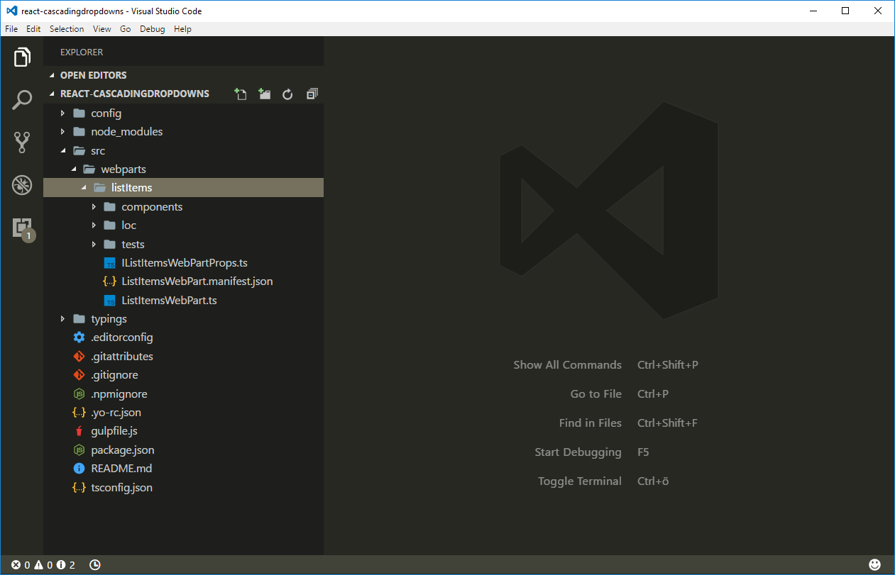

# <a name="use-cascading-dropdowns-in-web-part-properties"></a>Verwenden von kaskadierenden Dropdowns in Webparteigenschaften

Beim Entwerfen des Eigenschaftenbereichs für Ihre clientseitigen SharePoint-Webparts gibt es vielleicht eine Webparteigenschaft, deren Optionen basierend auf dem in einer anderen Eigenschaft ausgewählten Wert angezeigt werden. Dieses Szenario tritt in der Regel bei der Implementierung von kaskadierenden Dropdownsteuerelementen auf. In diesem Artikel erfahren Sie, wie kaskadierende Dropdownsteuerelemente im Webpart-Eigenschaftenbereich erstellt werden, ohne ein benutzerdefiniertes Steuerelement für den Eigenschaftenbereich zu entwickeln.


Der Quellcode des Webparts, mit dem wir arbeiten, steht auf GitHub zur Verfügung, unter [https://github.com/SharePoint/sp-dev-fx-webparts/tree/master/samples/react-custompropertypanecontrols](https://github.com/SharePoint/sp-dev-fx-webparts/tree/master/samples/react-custompropertypanecontrols).

> **Hinweis:** Bevor Sie die Schritte in diesem Artikel ausführen, müssen Sie [die Entwicklungsumgebung für Ihr clientseitiges SharePoint-Webpart einrichten](../../set-up-your-development-environment).

## <a name="create-new-project"></a>Erstellen eines neuen Projekts

Erstellen Sie zunächst einen neuen Ordner für Ihr Projekt.

```sh
md react-cascadingdropdowns
```

Wechseln Sie zum Projektordner.

```sh
cd react-cascadingdropdowns
```

Führen Sie im Projektordner den SharePoint Framework-Yeoman-Generator aus, um ein Gerüst für ein neues SharePoint Framework-Projekt zu erstellen.

```sh
yo @microsoft/sharepoint
```

Geben Sie die folgenden Werte ein, wenn Sie dazu aufgefordert werden:

- **react-cascadingdropdowns** als Lösungsname
- **Aktuellen Ordner verwenden** als Speicherort für die Dateien
- **React** als Eintrittspunkt für die Webpart-Erstellung
- **Listenelemente** als Namen des Webparts
- **Zeigt Listenelemente aus der ausgewählten Liste an** als Beschreibung Ihres Webparts


Öffnen Sie den Projektordner in Ihrem Code-Editor, sobald die Gerüsterstellung abgeschlossen ist. In diesem Artikel wird Visual Studio Code in den Schritten und Screenshots verwendet, Sie können jedoch einen beliebigen Editor verwenden.



## <a name="define-a-web-part-property-to-store-the-selected-list"></a>Definieren einer Webparteigenschaft zum Speichern der ausgewählten Liste

Sie erstellen ein Webpart, in dem Listenelemente aus einer ausgewählten SharePoint-Liste angezeigt werden. Benutzer können eine Liste im Webpart-Eigenschaftenbereich auswählen. Erstellen Sie zum Speichern der ausgewählten Liste eine neue Webparteigenschaft namens **listName**.

Öffnen Sie im Code-Editor die Datei **src/webparts/listItems/ListItemsWebPartManifest.json** Ersetzen Sie die standardmäßige **description**-Eigenschaft durch eine neue Eigenschaft mit dem Namen `listName`.


Öffnen Sie als Nächstes die Datei **src/webparts/listItems/IListItemsWebPartProps.ts**, und ersetzen Sie ihren Inhalt durch Folgendes:

```ts
export interface IListItemsWebPartProps {
  listName: string;
}
```

Ändern Sie in der Datei **src/webparts/listItems/ListItemsWebPart.ts** die **render**-Methode in:

```ts
export default class ListItemsWebPart extends BaseClientSideWebPart<IListItemsWebPartProps> {
  // ...
  public render(): void {
    const element: React.ReactElement<IListItemsProps> = React.createElement(ListItems, {
      listName: this.properties.listName
    });

    ReactDom.render(element, this.domElement);
  }
  // ...
}
```

Aktualisieren Sie den **propertyPaneSettings**-Getter auf Folgendes:

```ts
export default class ListItemsWebPart extends BaseClientSideWebPart<IListItemsWebPartProps> {
  // ...
  protected getPropertyPaneConfiguration(): IPropertyPaneConfiguration {
    return {
      pages: [
        {
          header: {
            description: strings.PropertyPaneDescription
          },
          groups: [
            {
              groupName: strings.BasicGroupName,
              groupFields: [
                PropertyPaneTextField('listName', {
                  label: strings.ListNameFieldLabel
                })
              ]
            }
          ]
        }
      ]
    };
  }
  // ...
}
```

Ändern Sie in der Datei **src/webparts/listItems/loc/mystrings.d.ts** die **IListItemsStrings**-Schnittstelle in Folgendes:

```ts
declare interface IListItemsStrings {
  PropertyPaneDescription: string;
  BasicGroupName: string;
  ListNameFieldLabel: string;
}
```

Fügen Sie in der Datei **src/webparts/listItems/loc/en-us.js** die fehlende Definition für die Zeichenfolge **ListNameFieldLabel** hinzu.

```js
define([], function() {
  return {
    "PropertyPaneDescription": "Description",
    "BasicGroupName": "Group Name",
    "ListNameFieldLabel": "List"
  }
});
```

Ändern Sie in der Datei **src/webparts/listItems/ListItemsWebPart.ts** den Inhalt der **render**-Methode in:

```tsx
export default class ListItems extends React.Component<IListItemsProps, {}> {
 public render(): JSX.Element {
    return (
        <div className={styles.helloWorld}>
        <div className={styles.container}>
          <div className={`ms-Grid-row ms-bgColor-themeDark ms-fontColor-white ${styles.row}`}>
            <div className="ms-Grid-col ms-u-lg10 ms-u-xl8 ms-u-xlPush2 ms-u-lgPush1">
              <span className="ms-font-xl ms-fontColor-white">Welcome to SharePoint!</span>
              <p className="ms-font-l ms-fontColor-white">Customize SharePoint experiences using Web Parts.</p>
              <p className="ms-font-l ms-fontColor-white">{escape(this.props.listName)}</p>
              <a href="https://aka.ms/spfx" className={styles.button}>
                <span className={styles.label}>Learn more</span>
              </a>
            </div>
          </div>
        </div>
      </div>
    );
  }
}
```
Ändern Sie in der Datei **src/webparts/listItems/components/IListItemsProps.ts** die **IListItemsProps**-Oberfläche in:

```ts
export interface IListItemsProps {
  listName: string;
}
```

Führen Sie den folgenden Befehl aus, um sicherzustellen, dass das Projekt ausgeführt wird:

```sh
gulp serve
```

Fügen Sie im Webbrowser das **Listenelement**-Webpart zum Zeichenbereich hinzu, und öffnen Sie die Eigenschaften. Überprüfen Sie, dass der für die **List**-Eigenschaft festgelegte Wert im Webparttext angezeigt wird.


## <a name="populate-the-dropdown-with-sharepoint-lists-to-choose-from"></a>Ausfüllen des Dropdowns mit SharePoint-Listen, aus denen eine Auswahl getroffen werden kann

An diesem Punkt gibt ein Benutzer an, welche Liste das Webpart verwenden soll, indem der Listenname manuell eingegeben wird. Dies ist fehleranfällig, und im Idealfall sollten Benutzer eine der Listen auswählen, die in der aktuellen SharePoint-Website vorhanden sind.

### <a name="use-dropdown-control-to-render-the-listname-property"></a>Verwenden des Dropdown-Steuerelements zum Rendern der listName-Eigenschaft

Fügen Sie in der **ListItemsWebPart**-Klasse einen Verweis zu der **PropertyPaneDropdown**-Klasse im oberen Bereich des Webparts hinzu. Ersetzen Sie die Import-Klausel, die die **PropertyPaneTextField**-Klasse mit Folgendem lädt:

```ts
import {
  BaseClientSideWebPart,
  IPropertyPaneConfiguration,
  PropertyPaneTextField,
  PropertyPaneDropdown,
  IPropertyPaneDropdownOption
} from '@microsoft/sp-webpart-base';
```

Fügen Sie in der **ListItemsWebPart**-Klasse eine neue Variable mit dem Namen **lists** hinzu, um Informationen zu allen verfügbaren Listen in der aktuellen Website zu speichern.

```ts
export default class ListItemsWebPart extends BaseClientSideWebPart<IListItemsWebPartProps> {
  private lists: IPropertyPaneDropdownOption[];
  // ...
}
```

Fügen Sie als Nächstes eine neue Klassenvariable mit dem Namen **listsDropdownDisabled** hinzu. Diese Variable bestimmt, ob das Listendropdown aktiviert ist oder nicht. Bis das Webpart die Informationen zu den verfügbaren Listen in der aktuellen Website abruft, sollte das Dropdown deaktiviert sein.

```ts
export default class ListItemsWebPart extends BaseClientSideWebPart<IListItemsWebPartProps> {
  // ...
  private listsDropdownDisabled: boolean = true;
  // ...
}
```

Ändern Sie den **propertyPaneSettings**-Getter im Dropdownsteuerelement, um die **listName**-Eigenschaft zu rendern.

```ts
export default class ListItemsWebPart extends BaseClientSideWebPart<IListItemsWebPartProps> {
  // ...
  protected get propertyPaneSettings(): IPropertyPaneSettings {
    return {
      pages: [
        {
          header: {
            description: strings.PropertyPaneDescription
          },
          groups: [
            {
              groupName: strings.BasicGroupName,
              groupFields: [
                PropertyPaneDropdown('listName', {
                  label: strings.ListNameFieldLabel,
                  options: this.lists,
                  disabled: this.listsDropdownDisabled
                })
              ]
            }
          ]
        }
      ]
    };
  }
}
```

Führen Sie den folgenden Befehl aus, um sicherzustellen, dass er wie erwartet funktioniert:

```sh
gulp serve
```


### <a name="show-available-lists-in-the-list-dropdown"></a>Anzeigen verfügbarer Listen im Listendropdown

Bisher wurde das Dropdown-Steuerelement der **listName**-Eigenschaft mit der **lists**-Klasseneigenschaft verknüpft. Da Sie noch keine Werte darin geladen haben, bleibt das **List**-Dropdown im Webpart-Eigenschaftenbereich deaktiviert. In diesem Schritt erweitern Sie das Webpart so, dass die Informationen zu den verfügbaren Listen geladen werden.

#### <a name="add-a-method-to-load-available-lists"></a>Hinzufügen einer Methode zum Laden von verfügbaren Listen

Fügen Sie in der **ListItemsWebPart**-Klasse eine Methode zum Laden der verfügbaren Listen hinzu. In diesem Artikel verwenden Sie simulierte Daten, Sie können aber auch die SharePoint-REST-API aufrufen, um die Liste verfügbarer Listen aus dem aktuellen Web abzurufen. Um Ladeoptionen aus einem externen Dienst zu simulieren, verwendet die Methode eine Verzögerung von zwei Sekunden.

```ts
export default class ListItemsWebPart extends BaseClientSideWebPart<IListItemsWebPartProps> {
  // ...
  private loadLists(): Promise<IPropertyPaneDropdownOption[]> {
    return new Promise<IPropertyPaneDropdownOption[]>((resolve: (options: IPropertyPaneDropdownOption[]) => void, reject: (error: any) => void) => {
      setTimeout((): void => {
        resolve([{
          key: 'sharedDocuments',
          text: 'Shared Documents'
        },
        {
          key: 'myDocuments',
          text: 'My Documents'
        }]);
      }, 2000);
    });
  }
}
```

#### <a name="load-information-about-available-lists-into-the-list-dropdown"></a>Laden von Informationen zu verfügbaren Listen im Listendropdown

Überschreiben Sie in der **ListItemsWebPart**-Klasse die **onPropertyPaneConfigurationStart**-Methode mit dem folgenden Code:

```ts
export default class ListItemsWebPart extends BaseClientSideWebPart<IListItemsWebPartProps> {
  // ...
  protected onPropertyPaneConfigurationStart(): void {
    this.listsDropdownDisabled = !this.lists;

    if (this.lists) {
      return;
    }

    this.context.statusRenderer.displayLoadingIndicator(this.domElement, 'lists');

    this.loadLists()
      .then((listOptions: IPropertyPaneDropdownOption[]): void => {
        this.lists = listOptions;
        this.listsDropdownDisabled = false;
        this.context.propertyPane.refresh();
        this.context.statusRenderer.clearLoadingIndicator(this.domElement);
        this.render();
      });
  }
  // ...
}
```

Die **onPropertyPaneConfigurationStart**-Methode wird vom SharePoint Framework aufgerufen, nachdem der Webpart-Eigenschaftenbereich des Webparts geöffnet wurde. Die Methode prüft zuerst, ob die Informationen zu den in der aktuellen Website verfügbaren Listen geladen wurden. Wenn die Listeninformationen geladen wurden, wird das Listendropdown aktiviert. Wenn die Informationen zu Listen noch nicht geladen wurden, wird die Ladeanzeige angezeigt, die den Benutzer darüber informiert, dass das Webpart gerade Informationen zu Listen lädt.


Nachdem die Informationen zu den verfügbaren Listen geladen wurden, weist die Methode die abgerufenen Daten der **lists**-Klassenvariablen zu, von der aus sie vom Listendropdown verwendet werden können. Als Nächstes wird das Dropdown aktiviert, sodass der Benutzer eine Liste auswählen kann. Durch Aufrufen von **this.context.propertyPane.refresh()** wird der Webpart-Eigenschaftenbereich aktualisiert und spiegelt die letzten Änderungen am Listendropdown wider. Nachdem Listeninformationen geladen wurden, wird die Ladeanzeige durch Aufrufen der **clearLoadingIndicator**-Methode entfernt. Da durch Aufrufen dieser Methode die Benutzeroberfläche des Webparts gelöscht wird, wird die **render**-Methode aufgerufen, um das erneute Rendern des Webparts zu erzwingen.

Überprüfen Sie mit dem folgenden Befehl, ob alles wie erwartet funktioniert:

```sh
gulp serve
```

Wenn Sie dem Zeichenbereich ein Webpart hinzufügen und seinen Eigenschaftenbereich öffnen, sollten Sie das Listendropdown mit den verfügbaren Listen sehen, aus denen der Benutzer eine Auswahl treffen kann.


## <a name="allow-users-to-select-an-item-from-the-selected-list"></a>Ermöglichen, dass Benutzer ein Element aus der ausgewählten Listen auswählen können

Beim Erstellen von Webparts müssen Sie Benutzern häufig ermöglichen, eine Option aus einer Reihe von Werten auszuwählen, die von einem zuvor ausgewählten Wert bestimmt werden, z. B. das Auswählen eines Landes basierend auf dem ausgewählten Kontinent oder das Auswählen eines Listenelements aus einer ausgewählten Liste. Diese Benutzeroberfläche wird häufig als kaskadierendes Dropdown bezeichnet. Mithilfe der standardmäßigen Funktionen von clientseitigen SharePoint Framework-Webparts können Sie kaskadierende Dropdowns im Webpart-Eigenschaftenbereich erstellen. Um zu erfahren, wie dies funktioniert, erweitern Sie das zuvor erstellte Webpart mit der Funktion zum Auswählen eines Listenelements basierend auf der zuvor ausgewählten Liste.


### <a name="add-item-web-part-property"></a>Hinzufügen der item-Webparteigenschaft

Öffnen Sie im Code-Editor die Datei **src/webparts/listItems/ListItemsWebPart.manifest.json**. Fügen Sie im Abschnitt **properties** eine neue Eigenschaft mit dem Namen **itemName** hinzu, damit diese wie folgt angezeigt wird:

```json
{
  // ...
  "properties": {
    "listName": "",
    "itemName": ""
  }
  // ...
}
```


Ändern Sie den Code in der Datei **src/webparts/listItems/IListItemsWebPartProps.ts** in Folgendes:

```ts
export interface IListItemsWebPartProps {
  listName: string;
  itemName: string;
}
```

Ändern Sie den Code in der Datei **src/webparts/listItems/components/IListItemsProps.ts** in Folgendes:

```ts
export interface IListItemsProps {
  listName: string;
  itemName: string;
}
```

Ändern Sie in der Datei **src/webparts/listItems/ListItemsWebPart.ts** den Code der **render**-Methode in:

```ts
export default class ListItemsWebPart extends BaseClientSideWebPart<IListItemsWebPartProps> {
  // ...
  public render(): void {
    const element: React.ReactElement<IListItemsProps> = React.createElement(ListItems, {
      listName: this.properties.listName,
      itemName: this.properties.itemName
    });

    ReactDom.render(element, this.domElement);
  }
  // ...
}
```

Ändern Sie in der Datei **src/webparts/listItems/loc/mystrings.d.ts** die **IListItemsStrings**-Schnittstelle in Folgendes:

```ts
declare interface IListItemsStrings {
  PropertyPaneDescription: string;
  BasicGroupName: string;
  ListNameFieldLabel: string;
  ItemNameFieldLabel: string;
}
```

Fügen Sie in der Datei **src/webparts/listItems/loc/en-us.js** die fehlende Definition für die Zeichenfolge **ItemNameFieldLabel** hinzu.

```js
define([], function() {
  return {
    "PropertyPaneDescription": "Description",
    "BasicGroupName": "Group Name",
    "ListNameFieldLabel": "List",
    "ItemNameFieldLabel": "Item"
  }
});
```

### <a name="render-the-value-of-the-item-web-part-property"></a>Rendern des Werts der item-Webparteigenschaft

Ändern Sie in der Datei **src/webparts/listItems/components/ListItems.tsx** die **render**-Methode in:

```tsx
export default class ListItems extends React.Component<IListItemsProps, {}> {
  public render(): JSX.Element {
    return (
        <div className={styles.helloWorld}>
        <div className={styles.container}>
          <div className={`ms-Grid-row ms-bgColor-themeDark ms-fontColor-white ${styles.row}`}>
            <div className="ms-Grid-col ms-u-lg10 ms-u-xl8 ms-u-xlPush2 ms-u-lgPush1">
              <span className="ms-font-xl ms-fontColor-white">Welcome to SharePoint!</span>
              <p className="ms-font-l ms-fontColor-white">Customize SharePoint experiences using Web Parts.</p>
              <p className="ms-font-l ms-fontColor-white">{escape(this.props.listName)}</p>
              <p className="ms-font-l ms-fontColor-white">{escape(this.props.itemName)}</p>
              <a href="https://aka.ms/spfx" className={styles.button}>
                <span className={styles.label}>Learn more</span>
              </a>
            </div>
          </div>
        </div>
      </div>
    );
  }
}
```

### <a name="allow-users-to-choose-the-item-from-a-list"></a>Ermöglichen, dass Benutzer das Element aus einer Liste auswählen

Ähnlich dazu, wie Benutzer eine Liste mithilfe eines Dropdowns auswählen können, sollten es möglich sein, dass sie das Element aus der Liste verfügbarer Elemente auswählen.

Fügen Sie in der **ListItemsWebPart**-Klasse eine neue Variable mit dem Namen **items** hinzu, um Informationen zu allen verfügbaren Elementen in der aktuellen ausgewählten Liste zu speichern.

```ts
export default class ListItemsWebPart extends BaseClientSideWebPart<IListItemsWebPartProps> {
  // ...
  private items: IPropertyPaneDropdownOption[];
  // ...
}
```

Fügen Sie als Nächstes eine neue Klassenvariable mit dem Namen **itemsDropdownDisabled** hinzu. Diese Variable bestimmt, ob das Elementdropdown aktiviert ist oder nicht. Benutzer sollten erst dann ein Element auswählen können, nachdem sie eine Liste ausgewählt haben.

```ts
export default class ListItemsWebPart extends BaseClientSideWebPart<IListItemsWebPartProps> {
  // ...
  private itemsDropdownDisabled: boolean = true;
  // ...
}
```

Ändern Sie den **propertyPaneSettings**-Getter im Dropdown-Steuerelement, um die **itemName**-Eigenschaft zu rendern.

```ts
export default class ListItemsWebPart extends BaseClientSideWebPart<IListItemsWebPartProps> {
  // ...
  protected getPropertyPaneConfiguration(): IPropertyPaneConfiguration {
    return {
      pages: [
        {
          header: {
            description: strings.PropertyPaneDescription
          },
          groups: [
            {
              groupName: strings.BasicGroupName,
              groupFields: [
                PropertyPaneDropdown('listName', {
                  label: strings.ListNameFieldLabel,
                  options: this.lists,
                  disabled: this.listsDropdownDisabled
                }),
                PropertyPaneDropdown('itemName', {
                  label: strings.ItemNameFieldLabel,
                  options: this.items,
                  disabled: this.itemsDropdownDisabled
                })
              ]
            }
          ]
        }
      ]
    };
  }
}
```

Führen Sie den folgenden Befehl aus, um sicherzustellen, dass er wie erwartet funktioniert:

```sh
gulp serve
```


### <a name="show-items-available-in-the-selected-list-in-the-item-dropdown"></a>Anzeigen von verfügbaren Elementen in der ausgewählten Liste im Elementdropdown

Bisher haben Sie ein Dropdown-Steuerelement definiert, um die **itemName**-Eigenschaft im Webpart-Eigenschaftenbereich zu rendern. Als Nächstes erweitern Sie das Webpart so, dass die Informationen zu verfügbaren Elementen in der ausgewählten Liste sowie die Elemente im Elementdropdown angezeigt werden.

#### <a name="add-method-to-load-list-items"></a>Hinzufügen einer Methode zum Laden von Listenelementen

Fügen Sie in der Datei **src/webparts/listItems/ListItemsWebPart.ts** in der **ListItemsWebPart**-Klasse eine neue Methode zum Laden der verfügbaren Listenelemente aus der ausgewählten Liste hinzu. Wie auch bei der Methode zum Laden der verfügbaren Listen verwenden Sie auch hier simulierte Daten.

```ts
export default class ListItemsWebPart extends BaseClientSideWebPart<IListItemsWebPartProps> {
  // ...
    private loadItems(): Promise<IPropertyPaneDropdownOption[]> {
    if (!this.properties.listName) {
      // resolve to empty options since no list has been selected
      return Promise.resolve();
    }

    const wp: ListItemsWebPart = this;

    return new Promise<IPropertyPaneDropdownOption[]>((resolve: (options: IPropertyPaneDropdownOption[]) => void, reject: (error: any) => void) => {
      setTimeout(() => {
        const items = {
          sharedDocuments: [
            {
              key: 'spfx_presentation.pptx',
              text: 'SPFx for the masses'
            },
            {
              key: 'hello-world.spapp',
              text: 'hello-world.spapp'
            }
          ],
          myDocuments: [
            {
              key: 'isaiah_cv.docx',
              text: 'Isaiah CV'
            },
            {
              key: 'isaiah_expenses.xlsx',
              text: 'Isaiah Expenses'
            }
          ]
        };
        resolve(items[wp.properties.listName]);
      }, 2000);
    });
  }
}
```

Die **loadItems**-Methode gibt simulierte Listenelemente für die zuvor ausgewählte Liste zurück. Wenn keine Liste ausgewählt wurde, löst die Methode die Zusage ohne Daten.

#### <a name="load-information-about-available-items-into-the-item-dropdown"></a>Laden von Informationen zu verfügbaren Elementen im Elementdropdown

Erweitern Sie in der **ListItemsWebPart**-Klasse die **onPropertyPaneConfigurationStart**-Methode, um die Elemente für die ausgewählte Liste zu laden.

```ts
export default class ListItemsWebPart extends BaseClientSideWebPart<IListItemsWebPartProps> {
  // ...
  protected onPropertyPaneConfigurationStart(): void {
    this.listsDropdownDisabled = !this.lists;
    this.itemsDropdownDisabled = !this.properties.listName || !this.items;

    if (this.lists) {
      return;
    }

    this.context.statusRenderer.displayLoadingIndicator(this.domElement, 'options');

    this.loadLists()
      .then((listOptions: IDropdownOption[]): Promise<IDropdownOption[]> => {
        this.lists = listOptions;
        this.listsDropdownDisabled = false;
        this.context.propertyPane.refresh();
        return this.loadItems();
      })
      .then((itemOptions: IDropdownOption[]): void => {
        this.items = itemOptions;
        this.itemsDropdownDisabled = !this.properties.listName;
        this.context.propertyPane.refresh();
        this.context.statusRenderer.clearLoadingIndicator(this.domElement);
        this.render();
      });
  }
  // ...
}
```

Bei der Initialisierung bestimmt das Webpart zuerst, ob das Elementdropdown aktiviert werden soll oder nicht. Wenn der Benutzer zuvor eine Liste ausgewählt hat, kann er nun ein Element aus dieser Liste auswählen. Wenn keine Liste ausgewählt wurde, ist das Elementdropdown deaktiviert.

Sie haben den zuvor definierten Code erweitert, der die Informationen zu verfügbaren Listen lädt, um die Informationen zu verfügbaren Elementen in der ausgewählten Liste zu laden. Der Code weist dann die abgerufenen Informationen der **items**-Klassenvariablen zur Verwendung vom Elementdropdown zu Schließlich löscht der Code die Ladeanzeige, und der Benutzer kann beginnen, mit dem Webpart zu arbeiten.

Überprüfen Sie mit dem folgenden Befehl, ob alles wie erwartet funktioniert:

```sh
gulp serve
```

Das Elementdropdown ist, wie erforderlich, anfänglich deaktiviert, sodass Benutzer zuerst eine Liste auswählen müssen. Doch an diesem Punkt bleibt das Elementdropdown auch nach dem Auswählen einer Liste deaktiviert.


#### <a name="update-web-part-property-pane-after-selecting-a-list"></a>Aktualisieren des Webpart-Eigenschaftenbereichs nach dem Auswählen einer Liste

Wenn ein Benutzer eine Liste im Eigenschaftenbereich auswählt, sollte das Webpart entsprechend aktualisiert werden, sodass das Elementdropdown aktiviert wird und die Liste von verfügbaren Elementen in der ausgewählten Liste angezeigt werden.

Überschreiben Sie in der **ListItemsWebPart.ts**-Datei in der **ListItemsWebPart**-Klasse die **onPropertyPaneFieldChanged**-Methode mit dem folgenden Code:

```ts
export default class ListItemsWebPart extends BaseClientSideWebPart<IListItemsWebPartProps> {
  // ...
  protected onPropertyPaneFieldChanged(propertyPath: string, oldValue: any, newValue: any): void {
    if (propertyPath === 'listName' &&
        newValue) {
      // push new list value
      super.onPropertyPaneFieldChanged(propertyPath, oldValue, newValue);
      // get previously selected item
      const previousItem: string = this.properties.itemName;
      // reset selected item
      this.properties.itemName = undefined;
      // push new item value
      this.onPropertyPaneFieldChanged('itemName', previousItem, this.properties.itemName);
      // disable item selector until new items are loaded
      this.itemsDropdownDisabled = true;
      // refresh the item selector control by repainting the property pane
      this.context.propertyPane.refresh();
      // communicate loading items
      this.context.statusRenderer.displayLoadingIndicator(this.domElement, 'items');

      this.loadItems()
        .then((itemOptions: IDropdownOption[]): void => {
          // store items
          this.items = itemOptions;
          // enable item selector
          this.itemsDropdownDisabled = false;
          // clear status indicator
          this.context.statusRenderer.clearLoadingIndicator(this.domElement);
          // re-render the web part as clearing the loading indicator removes the web part body
          this.render();
          // refresh the item selector control by repainting the property pane
          this.context.propertyPane.refresh();
        });
    }
    else {
      super.onPropertyPaneFieldChanged(propertyPath, oldValue, newValue);
    }
  }
  // ...
}
```

Nachdem der Benutzer eine Liste ausgewählt hat, wird der neu ausgewählte Wert im Webpart gespeichert. Da sich die ausgewählte Liste geändert hat, wird das zuvor ausgewählte Listenelement zurückgesetzt. Da nun eine Liste ausgewählt ist, werden im Webpart-Eigenschaftenbereich Listenelemente für diese spezielle Liste geladen. Beim Laden von Elementen sollte der Benutzer kein Element auswählen können.

Nachdem die Elemente für die ausgewählte Liste geladen wurden, werden sie der **items**-Klassenvariablen zugewiesen, von wo aus vom Elementdropwon auf sie verwiesen werden kann. Da nun die Informationen zu verfügbaren Listenelementen verfügbar sind, wird das Elementdropdown aktiviert, sodass Benutzer ein Element auswählen können. Die Ladeanzeige wird entfernt. Dadurch wird der Webparttext gelöscht. Dies ist der Grund, warum das Webpart erneut gerendert werden muss. Schließlich wird der Webpart-Eigenschaftenbereich so aktualisiert, dass die letzten Änderungen sichtbar sind.

> **Hinweis:** Ab Drop 6 des SharePoint Frameworks gibt es einen Fehler in der React-Dropdownkomponente der Office UI Fabric, der dazu führt, dass das Dropdownsteuerelement nicht ordnungsgemäß funktioniert. Eine temporäre Problemumgehung besteht darin, die Datei **node_modules/@microsoft/office-ui-fabric-react-bundle/dist/office-ui-fabric-react.bundle.js** zu bearbeiten und die Zeile **12027** von:
> 
> ```js
> isDisabled: this.props.isDisabled !== undefined ? this.props.isDisabled : this.props.disabled
> ```
>
> in:
> 
> ```js
> isDisabled: newProps.isDisabled !== undefined ? newProps.isDisabled : newProps.disabled
> ```


