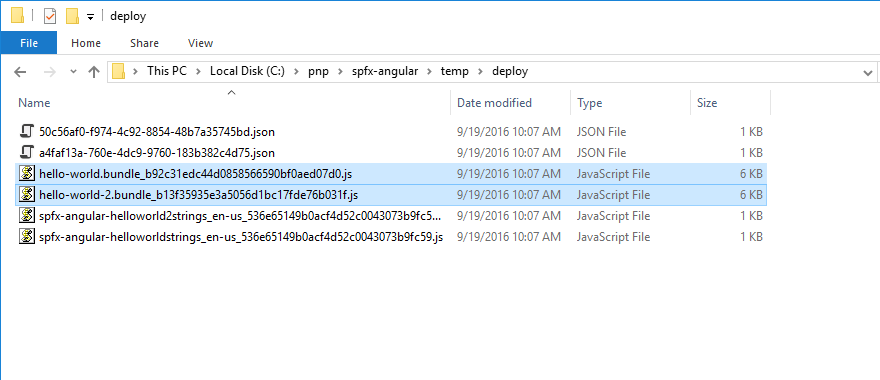

# <a name="use-existing-javascript-libraries-in-sharepoint-framework-client-side-web-parts"></a>Verwenden von vorhandenen JavaScript-Bibliotheken in clientseitigen SharePoint Framework-Webparts

Bei der Erstellung clientseitiger Webparts in SharePoint Framework können Sie bereits vorhandene JavaScript-Bibliotheken nutzen, um leistungsstarke Lösungen zu programmieren. Sie sollten jedoch einige Aspekte berücksichtigen, damit Ihre Webparts die Leistung der SharePoint-Seiten, auf denen sie eingesetzt werden, nicht beeinträchtigen.

## <a name="reference-existing-libraries-as-packages"></a>Referenzieren vorhandener Bibliotheken als Pakete

Am häufigsten werden bereits vorhandene JavaScript-Bibliotheken in clientseitigen SharePoint Framework-Webparts referenziert, indem sie als Paket im Projekt installiert werden. Nehmen wir das Beispiel Angular. Um dieses Framework in einem clientseitigen Webpart zu verwenden, würden Sie Angular zunächst mithilfe von **npm** installieren:

```sh
npm install angular --save
```

Als Nächstes würden Sie mittels **Npm**Typisierungen mit installieren, damit Sie Angular mit TypeScript verwenden können:

```sh
npm install @types/angular --save-dev
```

Schließlich würden Sie Angular in Ihrem Webpart über die Anweisung `import` referenzieren:

```ts
import { Version } from '@microsoft/sp-core-library';
import {
  BaseClientSideWebPart,
  IPropertyPaneConfiguration,
  PropertyPaneTextField
} from '@microsoft/sp-webpart-base';
import { escape } from '@microsoft/sp-lodash-subset';

import styles from './HelloWorld.module.scss';
import * as strings from 'helloWorldStrings';
import { IHelloWorldWebPartProps } from './IHelloWorldWebPartProps';

import * as angular from 'angular';

export default class HelloWorldWebPart extends BaseClientSideWebPart<IHelloWorldWebPartProps> {
  public render(): void {
    this.domElement.innerHTML = `
      <div class="${styles.helloWorld}">
        <!-- omitted for brevity -->
      </div>`;

      angular.module('helloworld', []);

      angular.bootstrap(this.domElement, ['helloworld']);
  }

  // omitted for brevity
}
```

## <a name="bundle-web-part-resources"></a>Bundling von Webpart-Ressourcen

SharePoint Framework arbeitet mit einer Build-Toolkette auf Basis von Open Source-Tools wie gulp und webpack. Beim Erstellen von SharePoint Framework-Projekten fassen diese Buildtools automatisch alle referenzierten Ressourcen in einer einzigen JavaScript-Datei zusammen. Dieser Prozess wird Bundling (Bündelung) genannt.


Bundling hat verschiedene Vorteile. Zunächst einmal sind alle erforderlichen Ressourcen für Ihr Webpart in einer einzigen JavaScript-Datei verfügbar. Das vereinfacht die Bereitstellung, da das Webpart nur aus einer einzigen Datei besteht und es unmöglich ist, während des Bereitstellungsprozesses eine Abhängigkeit zu übersehen. Zudem verwendet ihr Webpart unterschiedliche Ressourcen, und es ist wichtig, dass diese Ressourcen in der richtigen Reihenfolge geladen werden. Das während der Erstellung von webpack generierte Webpart-Bundle übernimmt das Laden der unterschiedlichen Ressourcen für Sie. Unter anderem löst es auch sämtliche Abhängigkeiten zwischen diesen Ressourcen auf. Auch für Endbenutzer hat Webpart-Bundling Vorteile: Im Allgemeinen lässt sich eine einzelne, größere Datei schneller herunterladen als viele kleine Dateien. Durch die Zusammenfassung mehrerer kleinerer Dateien in einem größeren Bundle lädt das Webpart schneller auf der Seite. Ein Bundling von vorhandenen JavaScript-Bibliotheken mit clientseitigen SharePoint Framework-Webparts hat allerdings auch Nachteile.

Beim Bundling vorhandener JavaScript-Frameworks im SharePoint Framework werden alle referenzierten Skripts in der generierten Bundle-Datei zusammengefasst. Um noch einmal das Angular-Beispiel zu bemühen: Ein optimiertes Webpart-Bundle mit Angular ist über 170 KB groß.


Wenn Sie ein weiteres Webpart zu Ihrem Projekt hinzufügen, das ebenfalls Angular verwendet, und das Projekt erstellen, erhalten Sie zwei Bundle-Dateien: eine pro Webpart. Jede Datei ist dabei größer als 170 KB.


Angenommen, Sie fügen diese Webparts zu einer Seite hinzu. Jeder Benutzer würde Angular dann mehrere Male herunterladen, und zwar einmal mit jedem Webpart auf der Seite. Dieser Ansatz ist ineffizient und verlangsamt das Laden der Seite.

## <a name="reference-existing-libraries-as-external-resources"></a>Referenzieren vorhandener Bibliotheken als externe Ressourcen

Eine bessere Strategie ist es, vorhandene Bibliotheken als externe Ressourcen zu referenzieren und so in Ihr clientseitiges SharePoint Framework-Webpart einzubinden. Auf diese Weise sind im Webpart nur die Skript-URLs vermerkt, jedoch keine weiteren Skriptinformationen. Wenn das Webpart zur Seite hinzugefügt wird, versucht es automatisch, alle erforderlichen Ressourcen über die angegebenen URLs zu laden.

Die Referenzierung vorhandener JavaScript-Bibliotheken im SharePoint Framework ist einfach und erfordert keine besonderen Codeänderungen. Da die Bibliothek zur Laufzeit von den angegebenen URLs geladen wird, muss sie nicht als Paket im Projekt installiert werden.

Nehmen wir wieder Angular als Beispiel: Um es als externe Ressource in Ihrem clientseitigen Webpart zu referenzieren, installieren Sie zunächst seine TypeScript-Typisierungen mithilfe von **Npm**:

```sh
npm install @types/angular --save-dev
```

Anschließend fügen Sie in der Datei **config/config.json** in der Eigenschaft **externals** den folgenden Eintrag hinzu:

```json
"angular": {
  "path": "https://cdnjs.cloudflare.com/ajax/libs/angular.js/1.5.8/angular.min.js",
  "globalName": "angular"
}
```

Die vollständige Datei **config/config.json** würde dann in etwa so aussehen:

```json
{
  "entries": [
    {
      "entry": "./lib/webparts/helloWorld/HelloWorldWebPart.js",
      "manifest": "./src/webparts/helloWorld/HelloWorldWebPart.manifest.json",
      "outputPath": "./dist/hello-world.bundle.js"
    }
  ],
  "externals": {
    "angular": {
      "path": "https://cdnjs.cloudflare.com/ajax/libs/angular.js/1.5.8/angular.min.js",
      "globalName": "angular"
    }
  },
  "localizedResources": {
    "helloWorldStrings": "webparts/helloWorld/loc/{locale}.js"
  }
}
```

Als letzten Schritt referenzieren Sie Angular in Ihrem Webpart, genau wie sie es zuvor schon getan haben:

```ts
import { Version } from '@microsoft/sp-core-library';
import {
  BaseClientSideWebPart,
  IPropertyPaneConfiguration,
  PropertyPaneTextField
} from '@microsoft/sp-webpart-base';
import { escape } from '@microsoft/sp-lodash-subset';

import styles from './HelloWorld.module.scss';
import * as strings from 'helloWorldStrings';
import { IHelloWorldWebPartProps } from './IHelloWorldWebPartProps';

import * as angular from 'angular';

export default class HelloWorldWebPart extends BaseClientSideWebPart<IHelloWorldWebPartProps> {
  public render(): void {
    this.domElement.innerHTML = `
      <div class="${styles.helloWorld}">
        <!-- omitted for brevity -->
      </div>`;

      angular.module('helloworld', []);

      angular.bootstrap(this.domElement, ['helloworld']);
  }

  // omitted for brevity
}
```

Wenn Sie Ihr Projekt jetzt erstellen, sehen Sie, dass die generierte Bundle-Datei nur noch 6 KB groß ist.


Wenn Sie ein weiteres Webpart zu Ihrem Projekt hinzufügen, das ebenfalls Angular verwendet, und das Projekt erneut erstellen, ist jedes Bundle 6 KB groß.



Die Annahme, dass Sie damit 300 KB eingespart haben, ist jedoch falsch. Beide Webparts benötigen Angular noch immer und laden es, sobald zum ersten Mal ein Benutzer die Seite besucht, auf der eines von ihnen platziert ist.


Auch wenn Sie beide Angular-Webparts zu der Seite hinzufügen, lädt SharePoint Framework Angular nur ein einziges Mal herunter.


Der wirkliche Vorteil einer Referenzierung vorhandener JavaScript-Bibliotheken als externe Ressourcen zeigt sich dann, wenn Ihre Organisation einen zentralen Speicherort für alle häufig verwendeten Skripts hat oder Sie ein CDN nutzen. In solchen Fällen besteht die Möglichkeit, dass die betreffende JavaScript-Bibliothek bereits im Browsercache des Benutzers liegt. Dann müsste nur noch das Webpart-Bundle geladen werden, und die Ladezeit der Seite wäre signifikant kürzer.


Das Beispiel oben zeigt, wie Sie Angular aus einem CDN laden. Ein öffentliches CDN ist jedoch nicht erforderlich. In der Konfiguration können Sie auf jeden Speicherort verweisen: ob öffentliches CDN, privat gehostetes Repository oder SharePoint-Dokumentbibliothek. Solange die Benutzer Ihrer Webparts auf die angegebenen URLs zugreifen können, werden die Webparts wie erwartet funktionieren.

CDNs sind für schnelle Ressourcenbereitstellung auf der ganzen Welt optimiert. Ein weiterer Vorteil beim Referenzieren von Skripts aus CDNs besteht daher darin, dass ein bestimmtes Skript möglicherweise bereits auf einer anderen Website verwendet wurde, die der Benutzer in der Vergangenheit besucht hat. Da das Skript dann bereits im Cache des lokalen Browsers liegen würde, müsste es nicht noch einmal speziell für Ihr Webpart heruntergeladen werden. Dadurch würde die Seite mit dem Webpart noch schneller laden.

Einige Organisationen verbieten den Zugriff auf öffentlichen CDNs über das Firmennetzwerk. Dann ist ein privat gehosteter Speicherort für häufig verwendete JavaScript-Frameworks eine exzellente Alternative. Da Ihre Organisation in einem solchen Fall selbst die Bibliotheken hostet, kann sie auch die Cache-Header kontrollieren und die Ressourcenleistung eventuell noch weiter optimieren. 

## <a name="javascript-libraries-formats"></a>Formate von JavaScript-Bibliotheken

Die verschiedenen JavaScript-Bibliotheken werden jeweils unterschiedlich erstellt und gepackt. Einige werden als Module gepackt, andere bestehen aus einfachen Skripts, die im globalen Bereich ausgeführt werden. (Solche Skripts werden häufig auch als Nicht-Modul-Skripts bezeichnet.) Wenn Sie JavaScript-Bibliotheken über eine URs laden, hängt es vom Format des jeweiligen externen Skripts ab, wie Sie es in Ihrem SharePoint Framework-Projekt registrieren müssen. Es gibt verschiedene Modulformate, beispielsweise AMD, UMD oder CommonJS; Sie müssen aber lediglich wissen, ob das betreffende Skript ein Modul ist oder nicht.

Bei der Registrierung von als Modul gepackten Skripts müssen Sie nur die URL angeben, von der das Skript heruntergeladen werden soll. Abhängigkeiten von anderen Skripts werden bereits im Moduldesign des Skripts abgearbeitet.

Bei Nicht-Modul-Skripts andererseits müssen Sie mindestens die URL angeben, von der das Skript heruntergeladen werden soll, und den Namen der Variable, mit der das Skript im globalen Bereich registriert wird. Hängt das Nicht-Modul-Skript von anderen Skripts ab, können diese als Abhängigkeiten aufgeführt werden. Schauen wir uns dazu einige Beispiele an.

Angular v1.x ist ein Nicht-Modul-Skript. Wenn Sie es als externe Ressource in einem SharePoint Framework-Projekt angeben möchten, spezifizieren Sie seine URL und den Namen der globalen Variable, mit der es registriert werden soll:

```json
"angular": {
  "path": "https://cdnjs.cloudflare.com/ajax/libs/angular.js/1.5.8/angular.min.js",
  "globalName": "angular"
}
```

Es ist wichtig, dass der in der Eigenschaft **globalName** angegebene Name exakt dem Namen entspricht, den das Skript verwendet. So kann es sich korrekt für andere Skripts verfügbar machen, die eventuell von ihm abhängen.

[ngOfficeUIFabric](http://ngofficeuifabric.com) ist ein UMD-Modul, das von Angular abhängt, und enthält die Angular-Richtlinien für Office UI Fabric. Die Abhängigkeit von Angular wird bereits im Modul abgearbeitet. Zur Registrierung müssen Sie also nur die Modul-URL angeben:

```json
"ng-office-ui-fabric": "https://cdnjs.cloudflare.com/ajax/libs/ngOfficeUiFabric/0.12.3/ngOfficeUiFabric.js"
```

jQuery ist ein AMD-Skript. Zur Registrierung reicht daher diese einfache Codezeile:

```json
"jquery": "https://code.jquery.com/jquery-2.2.4.js"
```

Angenommen, Sie möchten jQuery mit einem jQuery-Plug-In verwenden, das als Nicht-Modul-Skript verteilt wird, und verwenden zur Registrierung beider Skripts folgenden Code:

```json
"jquery": "https://code.jquery.com/jquery-2.2.4.js",
"simpleWeather": {
  "path": "https://cdnjs.cloudflare.com/ajax/libs/jquery.simpleWeather/3.1.0/jquery.simpleWeather.min.js",
  "globalName": "jQuery"
}
```

Das Laden des Webparts würde sehr wahrscheinlich fehlschlagen: Beide Skripts würden wahrscheinlich parallel geladen werden, und das Plug-In könnte sich nicht bei jQuery registrieren.


Wie bereits erwähnt, können Sie in SharePoint Framework Abhängigkeiten für Nicht-Modul-Plug-Ins spezifizieren. Diese Abhängigkeiten werden in der Eigenschaft **globalDependencies** angegeben:

```json
"jquery": "https://code.jquery.com/jquery-2.2.4.js",
"simpleWeather": {
  "path": "https://cdnjs.cloudflare.com/ajax/libs/jquery.simpleWeather/3.1.0/jquery.simpleWeather.min.js",
  "globalName": "jQuery",
  "globalDependencies": [ "jquery" ]
}
```

Jede in der Eigenschaft **globalDependencies** angegebene Abhängigkeit muss auf eine andere Abhängigkeit im Abschnitt **externals** in der Datei **config/config.json** verweisen.

Wenn Sie jetzt versuchen würden, das Projekt zu erstellen, würde wieder ein Fehler gemeldet. Dieses Mal würde moniert,dass Sie keine Abhängigkeit zu einem Nicht-Modul-Skript angeben dürfen.


Um dieses Problem zu lösen, müssen Sie jQuery lediglich als Nicht-Modul-Skript registrieren:

```json
"jquery": {
  "path": "https://code.jquery.com/jquery-2.1.1.min.js",
  "globalName": "jQuery"
},
"simpleWeather": {
  "path": "https://cdnjs.cloudflare.com/ajax/libs/jquery.simpleWeather/3.1.0/jquery.simpleWeather.min.js",
  "globalName": "jQuery",
  "globalDependencies": [ "jquery" ]
}
```

So legen Sie fest, dass das Skript **simpleWeather** nach jQuery geladen werden soll und dass jQuery unter einer global verfügbaren Variable `jQuery` verfügbar sein soll, die das jQuery-Plug-In **simpleWeather** benötigt, um sich selbst zu registrieren.

> Der Eintrag zur Registrierung von jQuery verwendet **jquery** als Namen für die externe Ressource, aber **jQuery** als Namen für die globale Variable. Der Namen der externen Ressource ist der Name, den Sie in den Anweisungen des Typs `import` in Ihrem Code verwenden. Dies ist auch der Name, der den TypeScript-Typisierungen entsprechen muss. Der Name der globalen Variable, spezifiziert über die Eigenschaft **globalName**, ist der Name, den andere Skripts kennen, beispielsweise Plug-Ins, die auf der Bibliothek aufsetzen. Bei einigen Bibliotheken können diese Namen identisch sein. Das ist aber nicht zwingend der Fall, und Sie sollten zur Vermeidung von Problemen sorgfältig prüfen, ob Sie die richtigen Namen verwenden. 

## <a name="non-module-scripts-considerations"></a>Zu bedenkende Aspekte bei Nicht-Modul-Skripts

Viele JavaScript-Bibliotheken und -Skripts, die in der Vergangenheit entwickelt wurden, werden als Nicht-Modul-Skripts verteilt. Das SharePoint Framework unterstützt zwar das Laden von Nicht-Modul-Skripts, Sie sollten von deren Verwendung aber dennoch wann immer möglich absehen.

Nicht-Modul-Skripts werden im globalen Bereich der Seite registriert: Ein Skript, das von einem Webpart geladen wird, ist auch für alle anderen Webparts auf der Seite verfügbar. Wenn Sie zwei Webparts haben, die jeweils eine unterschiedliche Version von jQuery verwenden, und beide als Nicht-Modul-Skripts geladen werden, würde das zuletzt geladene Webpart alle zuvor registrierten jQuery-Versionen überschreiben. Wie Sie sich vorstellen können, könnte das zu unvorhersehbaren Ergebnissen und Problemen führen, die sich nur schwer debuggen lassen und nur in bestimmten Szenarien auftreten würden: nur, wenn auf der Seite andere Webparts eingesetzt werden, die eine andere jQuery-Version verwenden, und nur, wenn diese Webparts in einer bestimmten Reihenfolge geladen werden. Die Modularchitektur löst dieses Problem durch Isolierung der Skripts. Das verhindert, dass sie sich gegenseitig beeinflussen.

## <a name="when-you-should-consider-bundling"></a>Wann Bundling sinnvoll ist

Das Bundling von vorhandenen JavaScript-Bibliotheken in Ihr Webpart kann zu großen Webpart-Dateien führen und die Leistung von Seiten mit diesem Webpart drastisch verschlechtern. Generell sollten Sie das Bundling von JavaScript-Bibliotheken mit Ihren Webparts also vermeiden. Es gibt jedoch verschiedene Szenarien, in denen Bundling von Vorteil sein kann.

Wenn Sie eine Standardlösung erstellen, die in jedem Intranet funktionieren soll, kann das Bundling aller Ressourcen mit Ihrem Webpart sicherstellen, dass Ihr Webpart wie erwartet arbeitet. Schließlich wissen Sie vorab nicht, wo Ihre Lösung installiert werden wird. Wenn alle Abhängigkeiten in der Bundle-Datei Ihres Webparts enthalten sind, kann es ordnungsgemäß arbeiten, auch dann, wenn eine Organisation Ressourcendownloads aus CDNs oder von anderen externen Speicherorten nicht erlaubt.

Wenn Ihre Lösung aus mehreren Webparts besteht, die alle eine bestimmte Funktionalität nutzen, wäre es besser, diese gemeinsam genutzte Funktionalität als separate Bibliothek zu erstellen und in allen Webparts als externe Ressource zu referenzieren. Benutzer müssten die gemeinsam genutzte Bibliothek dann nur ein einziges Mal herunterladen und könnten sie mit allen Webparts wiederverwenden.

## <a name="summary"></a>Zusammenfassung

Bei der Erstellung clientseitiger Webparts in SharePoint Framework können Sie bereits vorhandene JavaScript-Bibliotheken nutzen, um leistungsstarke Lösungen zu programmieren. SharePoint Framework lässt Ihnen die Wahl, ob Sie diese Bibliotheken mit Ihren Webparts in einem Bundle zusammenfassen oder als externe Ressourcen laden. Die allgemein empfohlene Strategie ist es, vorhandene Bibliotheken von einer URL zu laden. In manchen Szenarien hat aber auch Bundling Vorteile. Es ist daher essenziell, dass Sie Ihre Anforderungen sorgfältig analysieren und den Ansatz wählen, der diese Anforderungen am besten erfüllt.